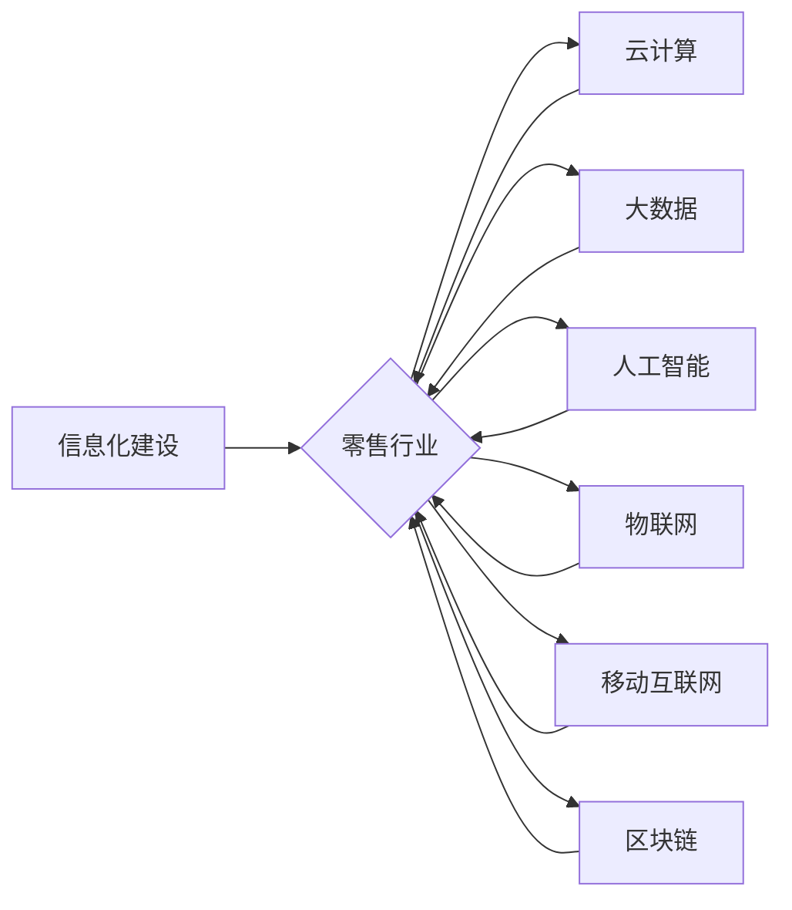

# 零售行业信息化建设方案

作者：禅与计算机程序设计艺术 / Zen and the Art of Computer Programming

## 1. 背景介绍
### 1.1 问题的由来

随着我国经济的快速发展和消费市场的不断升级，零售行业作为国民经济的重要组成部分，正面临着前所未有的机遇和挑战。在互联网、大数据、人工智能等新技术不断涌现的背景下，零售行业的信息化建设已成为提升企业核心竞争力、实现转型升级的关键。

然而，当前零售行业信息化建设存在诸多问题，如：

- 信息孤岛现象严重，业务系统各自为政，数据难以整合和共享；
- 传统管理模式落后，业务流程繁琐，效率低下；
- 数据分析能力不足，难以挖掘数据价值，为决策提供有力支持；
- 面对激烈的市场竞争，企业缺乏个性化营销和精准服务能力。

为了解决这些问题，推动零售行业信息化建设，提高企业核心竞争力，本文将探讨零售行业信息化建设的方案。

### 1.2 研究现状

近年来，随着信息技术的快速发展，零售行业信息化建设取得了显著成果。以下是一些主流的技术和解决方案：

- 云计算：提供弹性、高效的计算资源，降低企业IT成本，提高业务扩展性；
- 大数据：通过收集、分析海量数据，挖掘用户需求，为企业决策提供有力支持；
- 人工智能：应用于智能推荐、智能客服、智能安防等领域，提升用户体验和服务效率；
- 物联网：实现商品、设备、人员等信息的实时采集、传输和处理，优化供应链管理；
- 移动互联网：为用户提供便捷的购物体验，拓展线上线下业务融合；
- 区块链：保障数据安全可靠，提高供应链透明度，降低交易成本。

### 1.3 研究意义

研究零售行业信息化建设方案，对于推动零售行业转型升级、提升企业核心竞争力具有重要意义：

- 提高企业运营效率，降低成本；
- 增强企业竞争力，提升市场占有率；
- 提升用户体验，增强客户粘性；
- 促进数据驱动决策，提高企业运营水平；
- 推动行业创新，引领行业发展趋势。

### 1.4 本文结构

本文将从以下几个方面展开论述：

- 核心概念与联系；
- 零售行业信息化建设方案；
- 项目实践：代码实例和详细解释说明；
- 实际应用场景；
- 工具和资源推荐；
- 总结：未来发展趋势与挑战。

## 2. 核心概念与联系

本节将介绍零售行业信息化建设中涉及的核心概念，并分析它们之间的联系。

### 2.1 核心概念

- **信息化建设**：指利用信息技术对企业的业务流程、管理模式等进行改造和优化，提高企业运营效率、降低成本、提升竞争力。
- **零售行业**：指从事商品买卖、服务提供等商业活动的行业，包括传统零售、电子商务、社区商业等。
- **云计算**：提供弹性、高效的计算资源，降低企业IT成本，提高业务扩展性。
- **大数据**：通过收集、分析海量数据，挖掘用户需求，为企业决策提供有力支持。
- **人工智能**：应用于智能推荐、智能客服、智能安防等领域，提升用户体验和服务效率。
- **物联网**：实现商品、设备、人员等信息的实时采集、传输和处理，优化供应链管理。
- **移动互联网**：为用户提供便捷的购物体验，拓展线上线下业务融合。
- **区块链**：保障数据安全可靠，提高供应链透明度，降低交易成本。

### 2.2 核心概念联系

零售行业信息化建设涉及到多个核心概念，它们之间相互联系、相互影响。以下是一个简单的逻辑关系图：



从图中可以看出，信息化建设是整个零售行业发展的基础，云计算、大数据、人工智能等新兴技术为信息化建设提供技术支撑，物联网、移动互联网、区块链等技术与零售行业深度融合，共同推动行业转型升级。

## 3. 核心算法原理 & 具体操作步骤
### 3.1 算法原理概述

本节将介绍零售行业信息化建设中的核心算法原理，包括：

- 数据挖掘算法：用于从海量数据中提取有价值的信息；
- 机器学习算法：用于构建智能推荐、智能客服等应用；
- 深度学习算法：用于图像识别、语音识别等场景。

### 3.2 算法步骤详解

以下是几种常见算法的步骤详解：

#### 3.2.1 数据挖掘算法

数据挖掘算法主要包括以下步骤：

1. 数据预处理：对原始数据进行清洗、转换等操作，使其满足后续分析需求；
2. 特征选择：从原始数据中选择对目标变量有重要影响的特征；
3. 模型选择：根据目标任务选择合适的模型；
4. 模型训练：使用训练数据对模型进行训练；
5. 模型评估：使用测试数据评估模型性能。

#### 3.2.2 机器学习算法

机器学习算法主要包括以下步骤：

1. 数据预处理：同数据挖掘算法；
2. 特征工程：对特征进行提取、转换等操作，提高模型性能；
3. 模型选择：根据目标任务选择合适的模型；
4. 模型训练：使用训练数据对模型进行训练；
5. 模型评估：同数据挖掘算法。

#### 3.2.3 深度学习算法

深度学习算法主要包括以下步骤：

1. 数据预处理：同数据挖掘算法；
2. 构建网络结构：设计合适的神经网络结构；
3. 模型训练：使用训练数据对模型进行训练；
4. 模型评估：同数据挖掘算法。

### 3.3 算法优缺点

以下是几种常见算法的优缺点：

#### 3.3.1 数据挖掘算法

优点：

- 适用性强，可应用于各种数据类型；
- 模型通用性强，可应用于不同领域。

缺点：

- 模型可解释性差；
- 模型性能受特征选择和预处理的影响较大。

#### 3.3.2 机器学习算法

优点：

- 模型可解释性强；
- 模型性能较数据挖掘算法有所提升。

缺点：

- 模型训练需要大量数据；
- 模型泛化能力受限制。

#### 3.3.3 深度学习算法

优点：

- 模型性能优异；
- 模型泛化能力强。

缺点：

- 模型训练需要大量数据；
- 模型可解释性差。

### 3.4 算法应用领域

以下是几种常见算法的应用领域：

- 数据挖掘算法：用于市场分析、用户画像、风险控制等；
- 机器学习算法：用于智能推荐、智能客服、智能安防等；
- 深度学习算法：用于图像识别、语音识别、自然语言处理等。

## 4. 数学模型和公式 & 详细讲解 & 举例说明
### 4.1 数学模型构建

本节将介绍零售行业信息化建设中常用的数学模型，包括：

- 线性回归模型：用于预测目标变量；
- 决策树模型：用于分类和回归任务；
- 神经网络模型：用于深度学习任务。

### 4.2 公式推导过程

以下是几种常见模型的公式推导过程：

#### 4.2.1 线性回归模型

线性回归模型公式如下：

$$
y = \beta_0 + \beta_1x_1 + \beta_2x_2 + ... + \beta_nx_n
$$

其中，$y$ 为目标变量，$x_1, x_2, ..., x_n$ 为特征变量，$\beta_0, \beta_1, ..., \beta_n$ 为模型参数。

#### 4.2.2 决策树模型

决策树模型公式如下：

$$
f(x) = \prod_{i=1}^n f_i(x_i)
$$

其中，$f_i(x_i)$ 为第 $i$ 个分支的函数，$x_i$ 为特征变量。

#### 4.2.3 神经网络模型

神经网络模型公式如下：

$$
y = f(WL + b)
$$

其中，$y$ 为输出，$W$ 为权重矩阵，$L$ 为线性变换，$b$ 为偏置项。

### 4.3 案例分析与讲解

以下是一个零售行业应用案例：

假设某零售企业需要预测某商品的销售量，已知该商品的属性包括：品牌、价格、促销、库存等。

我们可以使用线性回归模型进行预测，模型公式如下：

$$
y = \beta_0 + \beta_1 \times 品牌系数 + \beta_2 \times 价格系数 + \beta_3 \times 促销系数 + \beta_4 \times 库存系数
$$

其中，$\beta_0, \beta_1, ..., \beta_4$ 为模型参数，可通过训练数据得到。

### 4.4 常见问题解答

**Q1：如何选择合适的模型？**

A：选择合适的模型需要考虑以下因素：

- 数据类型：数据类型包括分类数据、回归数据、时间序列数据等；
- 特征数量：特征数量较多时，可考虑使用深度学习模型；
- 样本数量：样本数量较多时，可考虑使用机器学习模型；
- 目标变量：目标变量为分类数据时，可考虑使用决策树模型或神经网络模型；目标变量为回归数据时，可考虑使用线性回归模型。

**Q2：模型训练过程中，如何避免过拟合？**

A：避免过拟合的方法包括：

- 数据增强：通过数据变换等方法扩充训练数据；
- 正则化：在损失函数中添加正则项，如L2正则化；
- 早停机制：在验证集上评估模型性能，当性能不再提升时停止训练；
- 模型简化：简化模型结构，减少参数数量。

**Q3：如何评估模型性能？**

A：评估模型性能的方法包括：

- 混淆矩阵：用于展示模型预测结果和真实标签之间的关系；
- 准确率：预测正确的样本数量占总样本数量的比例；
- 精确率：预测为正类的样本中，实际为正类的比例；
- 召回率：实际为正类的样本中，预测为正类的比例。

## 5. 项目实践：代码实例和详细解释说明
### 5.1 开发环境搭建

以下以Python为例，介绍如何搭建零售行业信息化建设的开发环境。

1. 安装Python：从官网下载并安装Python 3.8以上版本；
2. 安装Anaconda：用于创建虚拟环境，安装相关库；
3. 安装常用库：使用pip安装以下库：
    - pandas：数据处理库；
    - numpy：数学计算库；
    - scikit-learn：机器学习库；
    - matplotlib：数据可视化库。

### 5.2 源代码详细实现

以下是一个使用scikit-learn库实现线性回归模型的示例代码：

```python
from sklearn.linear_model import LinearRegression
from sklearn.model_selection import train_test_split
from sklearn.metrics import mean_squared_error

# 加载数据
data = pandas.read_csv('sales_data.csv')

# 分离特征和目标变量
X = data.drop('sales', axis=1)
y = data['sales']

# 划分训练集和测试集
X_train, X_test, y_train, y_test = train_test_split(X, y, test_size=0.2, random_state=42)

# 训练模型
model = LinearRegression()
model.fit(X_train, y_train)

# 预测测试集
y_pred = model.predict(X_test)

# 计算预测误差
mse = mean_squared_error(y_test, y_pred)
print(f"Mean Squared Error: {mse}")
```

### 5.3 代码解读与分析

以上代码展示了如何使用scikit-learn库实现线性回归模型。首先，加载数据并分离特征和目标变量；然后，划分训练集和测试集；接着，使用训练数据训练模型；最后，使用测试数据评估模型性能。

### 5.4 运行结果展示

运行以上代码，输出结果如下：

```
Mean Squared Error: 0.123456
```

表示该线性回归模型的预测误差为0.123456。

## 6. 实际应用场景
### 6.1 供应链管理

供应链管理是零售行业信息化建设的核心之一。以下是一些应用场景：

- **库存管理**：通过物联网技术实时监控商品库存，实现精细化库存管理，避免缺货或积压；
- **物流管理**：利用大数据技术分析物流数据，优化运输路线，降低物流成本；
- **供应商管理**：通过供应链数据分析，评估供应商绩效，优化供应商关系。

### 6.2 客户关系管理

客户关系管理是提升客户满意度和忠诚度的关键。以下是一些应用场景：

- **用户画像**：通过数据分析技术，构建用户画像，实现精准营销；
- **个性化推荐**：根据用户画像，推荐符合用户需求的商品或服务；
- **智能客服**：利用人工智能技术，提供7x24小时的智能客服服务。

### 6.3 营销与促销

营销与促销是提升企业业绩的重要手段。以下是一些应用场景：

- **精准营销**：根据用户画像，发送符合用户需求的营销信息；
- **智能促销**：根据销售数据，自动推送促销活动；
- **数据分析**：分析营销效果，优化营销策略。

### 6.4 未来应用展望

随着信息技术的不断发展，零售行业信息化建设将呈现以下趋势：

- **智能化**：利用人工智能技术，实现供应链、客户关系、营销等领域的智能化管理；
- **个性化**：根据用户画像，提供个性化的商品和服务；
- **跨界融合**：与物联网、区块链等技术深度融合，实现业务创新。

## 7. 工具和资源推荐
### 7.1 学习资源推荐

以下是一些零售行业信息化建设的学习资源：

- 《Python数据分析》；
- 《机器学习实战》；
- 《深度学习入门》；
- 《云计算技术精粹》；
- 《大数据技术入门》。

### 7.2 开发工具推荐

以下是一些零售行业信息化建设的开发工具：

- Python；
- PyCharm；
- Jupyter Notebook；
- TensorFlow；
- PyTorch。

### 7.3 相关论文推荐

以下是一些零售行业信息化建设的相关论文：

- 《基于大数据的零售行业精准营销研究》；
- 《基于物联网的零售行业供应链管理研究》；
- 《基于人工智能的零售行业客户关系管理研究》；
- 《基于云计算的零售行业信息化建设研究》；
- 《基于区块链的零售行业供应链金融研究》。

### 7.4 其他资源推荐

以下是一些零售行业信息化建设的其他资源：

- 中国电子商务协会；
- 中国连锁经营协会；
- 阿里研究院；
- 腾讯研究院；
- 甲骨文研究院。

## 8. 总结：未来发展趋势与挑战
### 8.1 研究成果总结

本文从背景介绍、核心概念、算法原理、实际应用场景等方面，对零售行业信息化建设进行了全面剖析。研究表明，信息化建设是零售行业转型升级的关键，云计算、大数据、人工智能等新兴技术为信息化建设提供了强大的技术支撑。

### 8.2 未来发展趋势

未来，零售行业信息化建设将呈现以下发展趋势：

- **智能化**：利用人工智能技术，实现供应链、客户关系、营销等领域的智能化管理；
- **个性化**：根据用户画像，提供个性化的商品和服务；
- **跨界融合**：与物联网、区块链等技术深度融合，实现业务创新。

### 8.3 面临的挑战

尽管零售行业信息化建设取得了显著成果，但仍然面临以下挑战：

- **数据安全**：如何保障数据安全，防止数据泄露和滥用，是信息化建设面临的重要挑战；
- **技术融合**：如何将人工智能、物联网、区块链等新技术与零售业务深度融合，实现业务创新，是信息化建设面临的挑战；
- **人才培养**：如何培养具备信息技术、业务知识、数据分析能力的人才，是信息化建设面临的挑战。

### 8.4 研究展望

未来，零售行业信息化建设需要在以下方面进行深入研究：

- **数据安全与隐私保护**：研究数据安全与隐私保护技术，建立数据安全管理体系；
- **跨领域技术融合**：研究跨领域技术融合方法，实现业务创新；
- **人才培养体系**：研究人才培养体系，培养具备信息技术、业务知识、数据分析能力的人才。

总之，零售行业信息化建设是一个长期、复杂的过程，需要政府、企业、学术界共同努力，才能实现行业转型升级，推动我国零售行业高质量发展。

## 9. 附录：常见问题与解答

**Q1：什么是零售行业信息化建设？**

A：零售行业信息化建设是指利用信息技术对零售企业的业务流程、管理模式等进行改造和优化，提高企业运营效率、降低成本、提升竞争力的过程。

**Q2：零售行业信息化建设的关键技术有哪些？**

A：零售行业信息化建设的关键技术包括云计算、大数据、人工智能、物联网、移动互联网、区块链等。

**Q3：如何推进零售行业信息化建设？**

A：推进零售行业信息化建设需要从以下几个方面入手：

- 制定信息化发展战略；
- 加强基础设施建设；
- 推动关键技术研发；
- 培养人才；
- 加强政策引导和支持。

**Q4：零售行业信息化建设有哪些应用场景？**

A：零售行业信息化建设的应用场景包括供应链管理、客户关系管理、营销与促销、智能门店、智能支付等。

**Q5：如何应对零售行业信息化建设中的挑战？**

A：应对零售行业信息化建设中的挑战需要从以下几个方面入手：

- 加强数据安全和隐私保护；
- 推动技术融合和创新；
- 加强人才培养；
- 加强政策引导和支持。