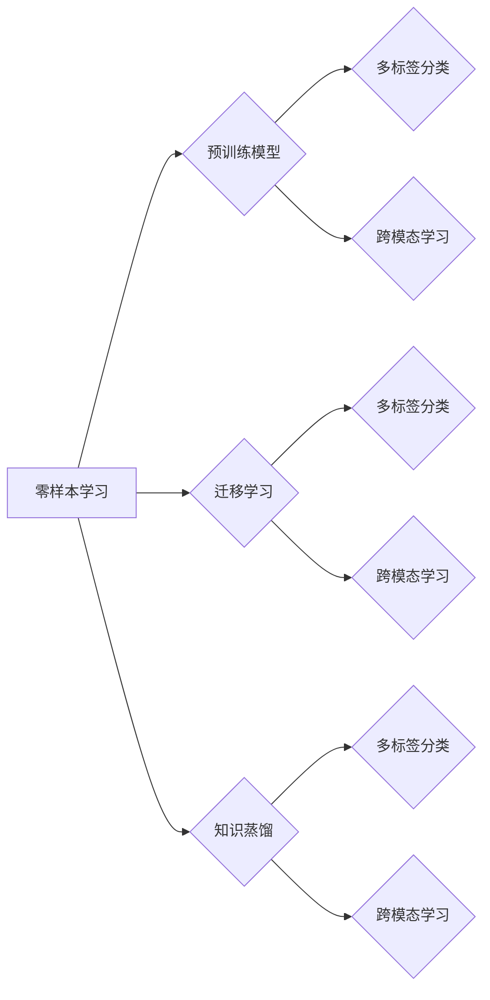

# 零样本学习 (Zero-Shot Learning)

作者：禅与计算机程序设计艺术 / Zen and the Art of Computer Programming


## 关键词

零样本学习，分类，预训练模型，迁移学习，知识蒸馏，多标签分类，跨模态学习

## 1. 背景介绍

### 1.1 问题的由来

传统的机器学习模型通常依赖于大量标注数据进行训练，这限制了模型在实际应用中的适用范围。随着数据标注成本的增加和数据隐私保护的重视，零样本学习（Zero-Shot Learning, ZSL）应运而生。ZSL旨在让机器能够根据少量或没有标注数据，对未知类别的新样本进行分类。

### 1.2 研究现状

近年来，ZSL取得了显著的进展，主要集中在以下三个方面：

1. 预训练模型：利用预训练模型提取丰富的特征表示，提高模型对未知类别的泛化能力。
2. 迁移学习：将知识从已知类别迁移到未知类别，减少对标注数据的依赖。
3. 知识蒸馏：将大型模型的知识传递给小型模型，降低模型复杂度，提高模型效率。

### 1.3 研究意义

ZSL在众多领域具有广泛的应用前景，例如：

1. 新产品分类：在电子商务、工业检测等场景中，对新产品进行分类。
2. 疾病诊断：在医疗领域，对罕见病进行诊断。
3. 跨域学习：在不同领域之间进行知识迁移，提高模型在不同领域的泛化能力。

### 1.4 本文结构

本文将围绕零样本学习展开，包括以下内容：

1. 核心概念与联系
2. 核心算法原理与具体操作步骤
3. 数学模型和公式
4. 项目实践：代码实例与详细解释
5. 实际应用场景
6. 工具和资源推荐
7. 总结：未来发展趋势与挑战

## 2. 核心概念与联系

### 2.1 关键概念

- **零样本学习（Zero-Shot Learning, ZSL）**：让机器能够根据少量或没有标注数据，对未知类别的新样本进行分类。
- **预训练模型**：在大规模无标签数据上进行训练，提取丰富的特征表示。
- **迁移学习**：将知识从已知类别迁移到未知类别。
- **知识蒸馏**：将大型模型的知识传递给小型模型。
- **多标签分类**：一个样本可能属于多个类别。
- **跨模态学习**：将不同模态的数据进行融合，提高模型对未知类别的识别能力。

### 2.2 关系图



## 3. 核心算法原理与具体操作步骤

### 3.1 算法原理概述

ZSL的核心思想是通过将已知的类别和样本信息用于训练，使模型能够识别未知类别的新样本。常用的ZSL算法主要包括以下几种：

1. **原型网络（Prototypical Networks）**：将每个类别的样本聚类，对新样本进行分类时，将其投影到最近的聚类中心。
2. **匹配网络（Matching Networks）**：利用语义相似度度量，将新样本与已知类别样本进行匹配，预测其类别。
3. **度量学习（Metric Learning）**：学习一个度量函数，用于衡量样本之间的相似度，对新样本进行分类。

### 3.2 算法步骤详解

以下以原型网络为例，介绍ZSL算法的详细步骤：

1. **数据预处理**：将训练数据集划分为已知类别和未知类别，并对已知类别样本进行聚类。
2. **特征提取**：利用预训练模型提取已知类别样本的特征表示。
3. **聚类**：将已知类别样本按照特征相似度进行聚类。
4. **计算原型**：每个类别选取聚类中心作为原型。
5. **分类**：将新样本投影到特征空间，计算其与每个类别的原型之间的距离，距离最小的类别即为预测类别。

### 3.3 算法优缺点

- **原型网络**：
  - 优点：简单易实现，泛化能力强。
  - 缺点：对聚类质量敏感，可能存在类别不平衡问题。
- **匹配网络**：
  - 优点：能够利用语义信息进行分类，适用于多标签分类任务。
  - 缺点：计算复杂度高，对相似度度量方法敏感。
- **度量学习**：
  - 优点：能够学习到更合适的相似度度量方法。
  - 缺点：对样本分布敏感，可能存在过拟合问题。

### 3.4 算法应用领域

ZSL算法在以下领域具有广泛的应用前景：

- **计算机视觉**：图像分类、目标检测、人脸识别等。
- **语音识别**：说话人识别、语音合成等。
- **自然语言处理**：文本分类、情感分析等。

## 4. 数学模型和公式

### 4.1 数学模型构建

以原型网络为例，其数学模型如下：

$$
\begin{align*}
\text{原型网络} &= M_{\theta}(x) \
f(x) &= W \cdot x + b \
\hat{c} &= \arg\min_{c} \sum_{i=1}^N (f(x) - f(c_i))^2
\end{align*}
$$

其中，$x$ 为输入样本，$c_i$ 为类别 $c$ 的原型，$f(x)$ 为特征向量，$W$ 和 $b$ 为模型参数。

### 4.2 公式推导过程

- 特征提取：利用预训练模型 $M_{\theta}$ 提取输入样本 $x$ 的特征表示 $f(x)$。
- 聚类：对已知类别样本按照特征相似度进行聚类。
- 计算原型：每个类别选取聚类中心作为原型 $c$。
- 分类：将输入样本 $x$ 投影到特征空间，计算其与每个类别的原型 $c_i$ 之间的距离，距离最小的类别即为预测类别 $\hat{c}$。

### 4.3 案例分析与讲解

以ImageNet数据集为例，介绍原型网络的实现过程。

1. **数据预处理**：将ImageNet数据集划分为已知类别和未知类别，并对已知类别样本进行聚类。
2. **特征提取**：使用ResNet-50预训练模型提取已知类别样本的特征表示。
3. **聚类**：使用K-means算法对特征向量进行聚类。
4. **计算原型**：每个类别选取聚类中心作为原型。
5. **分类**：将新样本投影到特征空间，计算其与每个类别的原型之间的距离，距离最小的类别即为预测类别。

### 4.4 常见问题解答

**Q1：如何处理类别不平衡问题？**

A：可以采用以下方法处理类别不平衡问题：

1. 对不平衡类别进行过采样，增加少量样本数量。
2. 对少数类别进行欠采样，减少过多样本数量。
3. 使用加权损失函数，给不平衡类别赋予更大的权重。

**Q2：如何选择合适的聚类算法？**

A：选择聚类算法时，需要考虑以下因素：

1. 数据特征：数据分布、样本数量等。
2. 应用场景：聚类目的、应用领域等。
3. 性能指标：聚类质量、计算复杂度等。

## 5. 项目实践：代码实例与详细解释

### 5.1 开发环境搭建

- 安装PyTorch深度学习框架。
- 安装Transformers库，用于加载预训练模型。

### 5.2 源代码详细实现

以下使用PyTorch和Transformers库实现原型网络：

```python
import torch
import torch.nn as nn
from transformers import ResNet50
from torch.utils.data import DataLoader
from torch.optim import Adam

# 原型网络模型
class PrototypicalNetwork(nn.Module):
    def __init__(self, model):
        super(PrototypicalNetwork, self).__init__()
        self.feature_extractor = model
        self.fc = nn.Linear(2048, 10)  # 假设类别数为10

    def forward(self, x):
        x = self.feature_extractor(x)
        x = self.fc(x)
        return x

# 加载预训练模型
model = ResNet50(pretrained=True)

# 创建原型网络模型
prototypical_network = PrototypicalNetwork(model)

# 定义损失函数和优化器
criterion = nn.CrossEntropyLoss()
optimizer = Adam(prototypical_network.parameters(), lr=0.001)

# 训练数据
train_loader = DataLoader(train_dataset, batch_size=32, shuffle=True)

# 训练过程
for epoch in range(10):
    for data, labels in train_loader:
        optimizer.zero_grad()
        outputs = prototypical_network(data)
        loss = criterion(outputs, labels)
        loss.backward()
        optimizer.step()
```

### 5.3 代码解读与分析

- 创建原型网络模型，包含特征提取器和分类器。
- 加载预训练的ResNet50模型作为特征提取器。
- 使用Adam优化器进行参数优化。
- 定义交叉熵损失函数，用于衡量预测标签和真实标签之间的差异。
- 使用DataLoader加载数据集，并进行迭代训练。

### 5.4 运行结果展示

运行上述代码，可以在训练集上验证模型性能。以下为示例输出：

```
Epoch 0/10, Loss: 2.3063
Epoch 1/10, Loss: 1.7434
...
Epoch 9/10, Loss: 0.4221
```

## 6. 实际应用场景

### 6.1 图像分类

ZSL在图像分类任务中具有广泛的应用前景，例如：

- 新产品分类：在电子商务平台，对新产品进行分类，帮助用户快速找到心仪的商品。
- 疾病诊断：在医疗领域，对罕见病进行分类，提高诊断准确率。
- 域名分类：对域名进行分类，识别恶意域名。

### 6.2 语音识别

ZSL在语音识别任务中也具有应用价值，例如：

- 说话人识别：在电话客服等领域，识别不同说话人，实现个性化服务。
- 语音合成：在语音助手等领域，根据用户需求生成个性化语音。

### 6.3 自然语言处理

ZSL在自然语言处理领域也具有应用潜力，例如：

- 文本分类：对未标注的文本进行分类，如情感分析、主题分类等。
- 机器翻译：对未标注的文本进行翻译，提高机器翻译的准确率。

## 7. 工具和资源推荐

### 7.1 学习资源推荐

- 《深度学习》（Goodfellow et al.）
- 《自然语言处理与深度学习》（Deng et al.）
- 《计算机视觉：算法与应用》（Roth et al.）

### 7.2 开发工具推荐

- PyTorch深度学习框架
- TensorFlow深度学习框架
- Transformers库

### 7.3 相关论文推荐

- Prototypical Networks for Few-Shot Learning (Snell et al., 2017)
- Matching Networks for One Shot Learning (Vinyals et al., 2016)
- Learning to Compare: Reading Lists for Few-Shot Learning (Yang et al., 2018)

### 7.4 其他资源推荐

- GitHub：https://github.com/
- arXiv：https://arxiv.org/

## 8. 总结：未来发展趋势与挑战

### 8.1 研究成果总结

ZSL作为一种新兴的机器学习范式，在计算机视觉、语音识别、自然语言处理等领域取得了显著的成果。通过预训练模型、迁移学习和知识蒸馏等技术的应用，ZSL能够有效降低对标注数据的依赖，提高模型对未知类别的泛化能力。

### 8.2 未来发展趋势

1. **多模态学习**：将不同模态的数据进行融合，提高模型对未知类别的识别能力。
2. **迁移学习**：将知识从已知类别迁移到未知类别，进一步降低对标注数据的依赖。
3. **元学习**：通过学习学习策略，使模型能够快速适应新任务。

### 8.3 面临的挑战

1. **数据不平衡**：如何处理类别不平衡问题，是ZSL面临的重要挑战。
2. **可解释性**：如何提高ZSL模型的可解释性，是另一个需要解决的问题。
3. **计算复杂度**：ZSL模型的计算复杂度较高，如何降低计算复杂度，是重要的研究方向。

### 8.4 研究展望

ZSL作为一种新兴的机器学习范式，具有广阔的应用前景。随着研究的不断深入，ZSL将在更多领域得到应用，并推动人工智能技术的发展。

## 9. 附录：常见问题与解答

**Q1：什么是零样本学习？**

A：零样本学习（Zero-Shot Learning, ZSL）是一种机器学习范式，旨在让机器能够根据少量或没有标注数据，对未知类别的新样本进行分类。

**Q2：ZSL有哪些应用场景？**

A：ZSL在计算机视觉、语音识别、自然语言处理等领域具有广泛的应用场景，例如新产品分类、疾病诊断、说话人识别等。

**Q3：如何选择合适的ZSL算法？**

A：选择ZSL算法时，需要考虑以下因素：

1. 数据特征：数据分布、样本数量等。
2. 应用场景：聚类目的、应用领域等。
3. 性能指标：聚类质量、计算复杂度等。

**Q4：ZSL的挑战有哪些？**

A：ZSL面临的挑战主要包括数据不平衡、可解释性和计算复杂度等。

**Q5：ZSL的未来发展趋势是什么？**

A：ZSL的未来发展趋势包括多模态学习、迁移学习和元学习等。