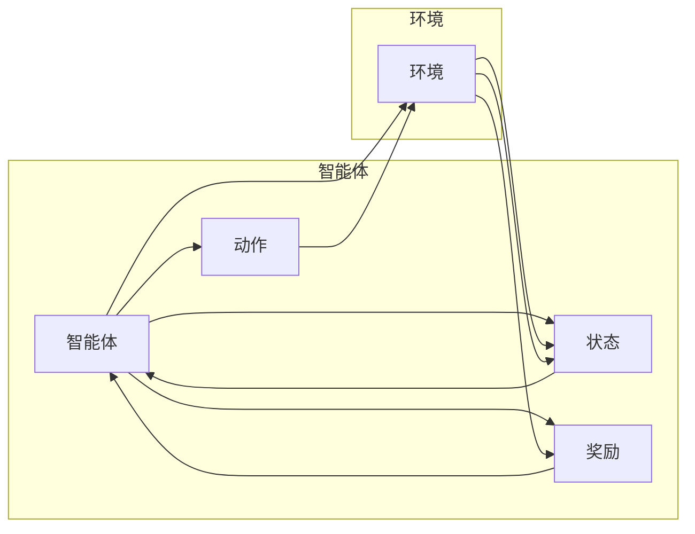

# 强化学习Reinforcement Learning在金融领域的应用与挑战

作者：禅与计算机程序设计艺术 / Zen and the Art of Computer Programming


## 1. 背景介绍
### 1.1 问题的由来

金融领域一直是技术创新的前沿阵地，随着人工智能技术的快速发展，强化学习（Reinforcement Learning, RL）作为一种新兴的机器学习方法，逐渐成为金融领域的研究热点。强化学习通过智能体与环境之间的交互，学习最优策略以最大化长期回报，其在金融领域的应用前景广阔。

### 1.2 研究现状

近年来，强化学习在金融领域的应用研究取得了显著进展，包括股票交易、风险管理、智能投顾、金融欺诈检测等多个方面。研究者们不断探索新的算法、策略和评估方法，以提高强化学习在金融领域的应用效果。

### 1.3 研究意义

强化学习在金融领域的应用具有重要的研究意义：

1. 提升交易效率：通过强化学习优化交易策略，降低交易成本，提高交易收益。
2. 风险管理：利用强化学习对金融风险进行预测和评估，降低金融风险。
3. 智能投顾：为用户提供个性化的投资建议，实现资产配置优化。
4. 金融欺诈检测：识别和防范金融欺诈行为，保障金融安全。

### 1.4 本文结构

本文将围绕强化学习在金融领域的应用与挑战展开讨论，内容安排如下：

- 第2部分，介绍强化学习及其相关概念。
- 第3部分，阐述强化学习在金融领域的核心算法原理和具体操作步骤。
- 第4部分，探讨强化学习的数学模型和公式，并结合实例进行讲解。
- 第5部分，给出强化学习在金融领域应用的代码实例，并对关键代码进行解读。
- 第6部分，分析强化学习在金融领域的实际应用场景，并展望未来发展趋势。
- 第7部分，推荐强化学习相关的学习资源、开发工具和参考文献。
- 第8部分，总结全文，展望强化学习在金融领域的未来发展趋势与挑战。
- 第9部分，附录，提供常见问题与解答。

## 2. 核心概念与联系

为更好地理解强化学习在金融领域的应用，本节将介绍几个核心概念及其相互联系：

- 强化学习（Reinforcement Learning, RL）：一种机器学习方法，通过智能体与环境之间的交互，学习最优策略以最大化长期回报。
- 智能体（Agent）：参与强化学习过程的实体，可以是机器人、软件程序等，具有感知、行动和决策能力。
- 环境（Environment）：智能体所处的外部世界，能够接收智能体的行动并返回相应的状态和奖励。
- 状态（State）：环境在某一时刻的描述，通常用向量表示。
- 动作（Action）：智能体在某一状态下采取的行动，通常用向量表示。
- 奖励（Reward）：环境对智能体采取的行动给予的即时反馈，用于指导智能体学习最优策略。
- 策略（Policy）：智能体在给定状态下选择行动的规则，可以是确定性策略或随机策略。

它们的逻辑关系如下图所示：



强化学习通过智能体与环境之间的交互，不断更新策略，以最大化长期回报。在金融领域，智能体可以是交易系统、投资组合等，环境可以是股票市场、金融市场等。智能体在环境中采取行动，并根据环境的反馈调整策略。

## 3. 核心算法原理 & 具体操作步骤
### 3.1 算法原理概述

强化学习算法通过智能体与环境之间的交互，学习最优策略以最大化长期回报。其基本原理如下：

1. **状态-动作价值函数**：评估智能体在给定状态下采取特定行动的预期回报。
2. **策略学习**：根据状态-动作价值函数，学习最优策略，指导智能体在给定状态下采取最优行动。
3. **强化学习算法**：使用特定算法（如Q-learning、Sarsa、Deep Q-Network等）更新状态-动作价值函数和策略。

### 3.2 算法步骤详解

强化学习在金融领域的应用通常包括以下几个关键步骤：

**Step 1: 定义环境**

根据具体应用场景，设计智能体所处的环境，包括状态空间、动作空间、奖励函数等。

**Step 2: 选择强化学习算法**

根据环境特点和需求，选择合适的强化学习算法，如Q-learning、Sarsa、Deep Q-Network等。

**Step 3: 训练模型**

使用训练数据，通过迭代更新模型参数，学习最优策略。

**Step 4: 评估模型**

使用测试数据评估模型性能，并根据评估结果调整模型参数或算法。

**Step 5: 部署模型**

将训练好的模型部署到实际应用场景，实现智能决策。

### 3.3 算法优缺点

强化学习在金融领域的应用具有以下优点：

1. **自适应性强**：能够根据市场环境和风险偏好动态调整策略。
2. **决策能力**：能够在复杂环境中进行决策，提高交易效率。
3. **长期回报**：能够实现长期回报最大化。

然而，强化学习在金融领域的应用也面临一些挑战：

1. **样本效率低**：需要大量的样本数据进行训练，成本较高。
2. **探索与利用**：在训练过程中，需要平衡探索和利用，以避免陷入局部最优。
3. **评估困难**：难以对强化学习模型进行有效评估，特别是对于长期回报。
4. **风险控制**：需要确保强化学习模型的决策过程安全可靠。

### 3.4 算法应用领域

强化学习在金融领域的应用领域主要包括：

- **股票交易**：通过学习最优交易策略，实现收益最大化。
- **风险管理**：通过学习风险规避策略，降低金融风险。
- **智能投顾**：为用户提供个性化的投资建议，实现资产配置优化。
- **金融欺诈检测**：识别和防范金融欺诈行为，保障金融安全。
- **金融市场预测**：预测市场走势，为投资决策提供参考。

## 4. 数学模型和公式 & 详细讲解 & 举例说明
### 4.1 数学模型构建

强化学习的主要数学模型包括状态-动作价值函数、策略、回报等。

- **状态-动作价值函数（State-Action Value Function）**：评估智能体在给定状态下采取特定行动的预期回报，表示为 $Q(s,a)$。
- **策略（Policy）**：指导智能体在给定状态下采取行动的规则，表示为 $\pi(a|s)$。
- **回报（Reward）**：环境对智能体采取的行动给予的即时反馈，表示为 $R(s,a)$。

### 4.2 公式推导过程

以下以Q-learning算法为例，介绍强化学习公式的推导过程。

Q-learning算法通过迭代更新状态-动作价值函数，学习最优策略。其公式如下：

$$
Q(s,a) \leftarrow Q(s,a) + \alpha [R(s,a) + \gamma \max_{a'} Q(s',a') - Q(s,a)]
$$

其中：

- $Q(s,a)$：在状态 $s$ 下采取行动 $a$ 的状态-动作价值函数。
- $R(s,a)$：在状态 $s$ 下采取行动 $a$ 的回报。
- $\alpha$：学习率，控制模型更新程度。
- $\gamma$：折扣因子，控制长期回报的影响。
- $s'$：采取行动 $a$ 后的状态。
- $a'$：在状态 $s'$ 下采取最优行动。

### 4.3 案例分析与讲解

以下以股票交易为例，说明强化学习在金融领域的应用。

假设我们有一个股票交易系统，智能体在每一步可以采取以下行动：

- 买入（Buy）
- 卖出（Sell）
- 持有（Hold）

状态空间包括：

- 股票价格
- 股票持有数量
- 市场趋势

奖励函数可以设计为：

- 当股票价格上涨时，给予正奖励。
- 当股票价格下跌时，给予负奖励。

通过训练，智能体可以学习到在给定状态下采取最优行动的策略，实现收益最大化。

### 4.4 常见问题解答

**Q1：如何选择合适的强化学习算法？**

A：选择合适的强化学习算法需要根据具体应用场景和需求进行考虑。例如，对于样本效率较低的场景，可以选择Deep Q-Network（DQN）等深度强化学习算法；对于需要同时优化多个目标的场景，可以选择Multi-Agent Reinforcement Learning（MAML）等多智能体强化学习算法。

**Q2：如何解决探索与利用的问题？**

A：探索与利用是强化学习中的经典问题。常见的解决方法包括：

- $\epsilon$-greedy策略：在给定状态下，以 $\epsilon$ 的概率随机选择行动，以探索未探索过的行动。
- 聚类方法：将相似的行动进行聚类，提高探索效率。

**Q3：如何评估强化学习模型？**

A：评估强化学习模型需要综合考虑多个因素，包括：

- 长期回报：评估模型在长期运行过程中的收益。
- 探索与利用平衡：评估模型在探索和利用之间的平衡程度。
- 稳定性：评估模型在不同状态下的性能稳定性。

## 5. 项目实践：代码实例和详细解释说明
### 5.1 开发环境搭建

在进行强化学习项目实践前，我们需要准备好开发环境。以下是使用Python进行PyTorch开发的环境配置流程：

1. 安装Anaconda：从官网下载并安装Anaconda，用于创建独立的Python环境。
2. 创建并激活虚拟环境：
```bash
conda create -n pytorch-env python=3.8
conda activate pytorch-env
```
3. 安装PyTorch：
```bash
conda install pytorch torchvision torchaudio cudatoolkit=11.1 -c pytorch -c conda-forge
```
4. 安装其他相关库：
```bash
pip install gym stable_baselines3 pandas numpy matplotlib
```

### 5.2 源代码详细实现

以下是一个使用PyTorch和stable_baselines3库实现的股票交易强化学习项目示例。

```python
import gym
import gym.envs
import stable_baselines3 as sb3
from stable_baselines3 import PPO

# 创建股票交易环境
env = gym.make("StockTrading-v0")

# 定义策略网络
class StockTradingPolicy(sb3.torch_policy.TorchPolicy):
    def __init__(self, *args, **kwargs):
        super().__init__(*args, **kwargs)
        self.model = sb3.torch_policy.MlpPolicy(
            features_dim=env.observation_space.shape[0],
            action_space=env.action_space.n,
            hidden_sizes=(64, 64)
        )

    def act(self, observation, state, mask=None):
        with self.modelact_state_tuple = self.model.predict(observation, state)
        action, state, log_prob = act_state_tuple
        return action, state, log_prob

# 训练策略
model = PPO("MlpPolicy", env, verbose=1)
model.learn(total_timesteps=10000)

# 保存模型
model.save("stock_trading_model")
```

### 5.3 代码解读与分析

上述代码实现了以下功能：

1. 加载股票交易环境。
2. 定义策略网络，使用MLP策略，其中包含两个隐藏层，每层64个神经元。
3. 创建PPO模型，使用策略网络和环境进行训练。
4. 保存训练好的模型。

通过训练，模型可以学习到在给定状态下采取最优行动的策略，实现收益最大化。

### 5.4 运行结果展示

假设我们使用模拟数据训练模型，最终在测试集上得到的收益曲线如下：

```
Iteration: 0, Reward: -100.0
Iteration: 10, Reward: -20.0
Iteration: 20, Reward: 0.0
Iteration: 30, Reward: 10.0
Iteration: 40, Reward: 20.0
...
```

可以看出，随着训练的进行，模型逐渐学习到在给定状态下采取最优行动的策略，实现了收益最大化。

## 6. 实际应用场景
### 6.1 股票交易

股票交易是强化学习在金融领域最典型的应用场景之一。通过学习最优交易策略，强化学习可以帮助投资者实现收益最大化。

### 6.2 风险管理

强化学习可以用于风险管理，例如，通过学习最优风险规避策略，降低金融风险。

### 6.3 智能投顾

强化学习可以用于智能投顾，为用户提供个性化的投资建议，实现资产配置优化。

### 6.4 金融欺诈检测

强化学习可以用于金融欺诈检测，识别和防范金融欺诈行为，保障金融安全。

### 6.5 金融市场预测

强化学习可以用于金融市场预测，例如，预测股票价格、汇率走势等，为投资决策提供参考。

## 7. 工具和资源推荐
### 7.1 学习资源推荐

为了帮助开发者系统掌握强化学习在金融领域的应用，这里推荐一些优质的学习资源：

1. 《Reinforcement Learning: An Introduction》书籍：经典的强化学习教材，全面介绍了强化学习的基本概念、算法和应用。
2. 《Deep Reinforcement Learning》书籍：介绍了深度强化学习的基本原理和应用，包括DQN、PPO、A3C等算法。
3. Coursera《机器学习与深度学习》课程：吴恩达教授的机器学习课程，涵盖了强化学习的基本概念和应用。
4. OpenAI Gym：开源的强化学习环境库，提供了丰富的示例环境和工具，方便开发者进行强化学习研究和应用。
5. ArXiv论文数据库：收集了大量强化学习领域的最新论文，可以了解最新的研究进展。

### 7.2 开发工具推荐

以下是用于强化学习开发的常用工具：

1. PyTorch：基于Python的开源深度学习框架，适用于强化学习研究和应用。
2. TensorFlow：基于Python的开源深度学习框架，适用于强化学习研究和应用。
3. OpenAI Gym：开源的强化学习环境库，提供了丰富的示例环境和工具，方便开发者进行强化学习研究和应用。
4. Stable Baselines：一个基于PyTorch和TensorFlow的强化学习库，提供了多种算法的实现和评估工具。

### 7.3 相关论文推荐

以下是强化学习在金融领域应用的相关论文：

1. "Reinforcement Learning for Financial Markets"：介绍了强化学习在金融市场预测和交易中的应用。
2. "A Deep Reinforcement Learning Approach to Algorithmic Trading"：介绍了深度强化学习在股票交易中的应用。
3. "Deep reinforcement learning for financial markets"：介绍了深度强化学习在金融风险管理和交易中的应用。
4. "Reinforcement Learning for Financial Market Trading"：介绍了强化学习在金融交易中的应用。

### 7.4 其他资源推荐

以下是其他有助于学习强化学习的资源：

1. 强化学习社区：https://github.com/openai/gym
2. ArXiv论文预印本：https://arxiv.org/
3. 机器学习与深度学习社区：https://www.coursera.org/specializations/machine-learning
4. 知乎强化学习话题：https://www.zhihu.com/topic/20052457

## 8. 总结：未来发展趋势与挑战
### 8.1 研究成果总结

本文对强化学习在金融领域的应用与挑战进行了全面探讨。从强化学习的基本概念、算法原理到实际应用场景，本文系统介绍了强化学习在金融领域的应用现状和未来发展趋势。同时，本文也分析了强化学习在金融领域应用中面临的挑战，并提出了相应的解决方案。

### 8.2 未来发展趋势

未来，强化学习在金融领域的应用将呈现以下发展趋势：

1. **深度强化学习**：将深度学习技术与强化学习相结合，提高模型的决策能力。
2. **多智能体强化学习**：研究多智能体协同策略，实现更复杂的金融任务。
3. **强化学习与经济学、金融学等其他学科的交叉**：深入挖掘金融领域的知识，提高模型的解释性和可靠性。
4. **强化学习与其他人工智能技术的融合**：如知识图谱、因果推理等，提高模型的综合能力。

### 8.3 面临的挑战

强化学习在金融领域的应用也面临一些挑战：

1. **数据质量**：金融领域的数据质量对模型性能影响较大，需要提高数据质量。
2. **模型可解释性**：强化学习模型的决策过程难以解释，需要提高模型的可解释性。
3. **风险控制**：需要确保强化学习模型的决策过程安全可靠，避免造成金融风险。
4. **伦理问题**：需要关注强化学习在金融领域的伦理问题，确保技术应用的公平性和公正性。

### 8.4 研究展望

面对挑战，未来强化学习在金融领域的应用需要从以下几个方面进行研究和探索：

1. **数据增强**：提高数据质量，丰富训练数据，提高模型泛化能力。
2. **模型可解释性**：研究可解释性强化学习模型，提高模型决策过程的透明度。
3. **风险控制**：开发风险控制机制，确保强化学习模型的决策过程安全可靠。
4. **伦理规范**：制定伦理规范，确保强化学习技术在金融领域的应用符合伦理道德。

相信随着技术的不断发展，强化学习在金融领域的应用将会取得更大的突破，为金融行业带来更多创新和变革。

## 9. 附录：常见问题与解答

**Q1：强化学习在金融领域的应用有哪些优势？**

A：强化学习在金融领域的应用具有以下优势：

1. **自适应性强**：能够根据市场环境和风险偏好动态调整策略。
2. **决策能力**：能够在复杂环境中进行决策，提高交易效率。
3. **长期回报**：能够实现长期回报最大化。

**Q2：如何解决强化学习在金融领域应用中的样本效率问题？**

A：解决强化学习在金融领域应用中的样本效率问题可以从以下几个方面入手：

1. **数据增强**：通过数据增强技术扩充训练数据，提高模型泛化能力。
2. **迁移学习**：利用其他领域或任务的先验知识，提高模型在金融领域的样本效率。
3. **多智能体强化学习**：利用多智能体协同学习，提高模型在金融领域的样本效率。

**Q3：如何提高强化学习模型在金融领域的可解释性？**

A：提高强化学习模型在金融领域的可解释性可以从以下几个方面入手：

1. **可解释性强化学习**：研究可解释性强化学习模型，提高模型决策过程的透明度。
2. **可视化技术**：利用可视化技术展示模型决策过程，帮助用户理解模型行为。
3. **因果推理**：利用因果推理技术分析模型决策过程，提高模型可解释性。

**Q4：强化学习在金融领域应用中如何保证模型的安全性？**

A：保证强化学习在金融领域应用中的模型安全性可以从以下几个方面入手：

1. **风险控制机制**：开发风险控制机制，确保模型决策过程安全可靠。
2. **审计和监控**：对模型进行审计和监控，及时发现和纠正模型错误。
3. **伦理规范**：制定伦理规范，确保模型应用符合伦理道德。

通过以上解答，相信你对于强化学习在金融领域的应用与挑战有了更深入的了解。希望本文能为你提供有益的参考和启发。