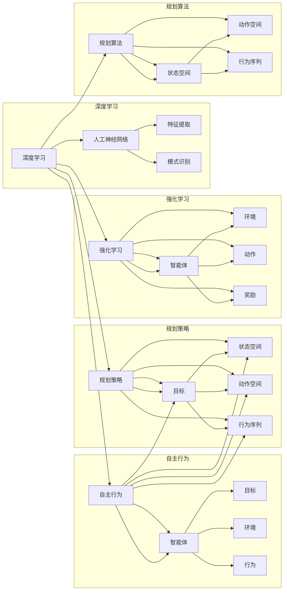

# AI人工智能深度学习算法：自主行为与规划策略在深度学习中的运用

作者：禅与计算机程序设计艺术 / Zen and the Art of Computer Programming

## 关键词：

深度学习，自主行为，规划策略，强化学习，规划算法，神经网络，决策过程

## 1. 背景介绍

### 1.1 问题的由来

随着深度学习技术的迅猛发展，人工智能在各个领域的应用日益广泛。然而，传统的深度学习模型在处理复杂任务时，往往面临着以下问题：

- **决策过程缺乏解释性**：深度学习模型通常被视为“黑盒”，其决策过程难以解释和理解，这在医疗诊断、安全监控等对解释性要求较高的领域成为一大挑战。
- **适应性和泛化能力有限**：深度学习模型在特定领域的数据上训练，难以适应新的环境和任务，泛化能力有限。
- **样本依赖性高**：深度学习模型通常需要大量的标注数据，对于小样本数据难以取得理想效果。

为了解决上述问题，研究者们开始探索在深度学习模型中引入自主行为和规划策略。通过模拟人类的行为和思考过程，使得模型能够自主地学习、规划和决策，从而提高模型的适应性和泛化能力，并降低样本依赖性。

### 1.2 研究现状

近年来，随着强化学习、规划算法和神经网络的不断发展，自主行为与规划策略在深度学习中的应用逐渐成为研究热点。以下是一些主要的研究方向：

- **强化学习与深度学习结合**：将强化学习中的智能体、状态、动作和奖励等概念引入深度学习模型，使得模型能够自主地学习任务目标，并做出最优决策。
- **规划算法与神经网络结合**：将规划算法中的搜索策略、状态空间和动作空间等概念引入神经网络模型，使得模型能够自主地规划行为序列，并实现复杂任务。
- **混合智能系统**：将自主行为与规划策略与其他人工智能技术（如知识表示、推理、学习等）相结合，构建更加智能的混合智能系统。

### 1.3 研究意义

自主行为与规划策略在深度学习中的应用，具有重要的理论意义和实际价值：

- **提高模型的解释性和透明度**：通过模拟人类的行为和思考过程，使得模型决策过程更加透明，有助于提高模型的解释性和可接受度。
- **增强模型的适应性和泛化能力**：通过引入自主行为和规划策略，使得模型能够自主地学习和适应新的环境和任务，提高模型的泛化能力。
- **降低样本依赖性**：通过自主行为和规划策略，模型能够从少量样本中学习到更多知识，降低样本依赖性。

### 1.4 本文结构

本文将围绕自主行为与规划策略在深度学习中的应用展开，主要内容包括：

- 核心概念与联系
- 核心算法原理与具体操作步骤
- 数学模型和公式
- 项目实践
- 实际应用场景
- 工具和资源推荐
- 总结与展望

## 2. 核心概念与联系

### 2.1 深度学习

深度学习是一种基于人工神经网络的学习方法，通过模拟人脑神经元之间的连接和通信，实现对复杂数据的自动特征提取和模式识别。

### 2.2 自主行为

自主行为是指智能体在未知环境或任务中，根据自身目标和环境信息，自主地选择行为，并不断调整行为策略以实现目标。

### 2.3 规划策略

规划策略是指智能体根据自身目标和环境信息，预先规划出一系列行为序列，以实现目标。

### 2.4 强化学习

强化学习是一种通过与环境交互，通过学习最优策略来最大化累积奖励的学习方法。

### 2.5 规划算法

规划算法是一种通过搜索状态空间和动作空间，找到最优行为序列的算法。

以下是大体概念之间的联系：



## 3. 核心算法原理与具体操作步骤

### 3.1 算法原理概述

自主行为与规划策略在深度学习中的应用，主要包括以下几种方法：

- **强化学习与深度学习结合**：使用深度神经网络作为强化学习中的智能体，通过强化学习算法学习最优策略。
- **规划算法与神经网络结合**：使用深度神经网络作为规划算法中的搜索器，通过规划算法学习最优行为序列。
- **混合智能系统**：将自主行为与规划策略与其他人工智能技术相结合，构建更加智能的混合智能系统。

### 3.2 算法步骤详解

以下是强化学习与深度学习结合方法的步骤详解：

1. **定义环境**：构建一个模拟真实环境的虚拟环境，包括状态空间、动作空间和奖励函数。
2. **定义智能体**：使用深度神经网络作为智能体，将智能体的状态和动作作为神经网络的输入和输出。
3. **训练智能体**：使用强化学习算法（如Q学习、SARSA、深度Q网络等）训练智能体，使其能够学习最优策略。
4. **评估和测试**：在虚拟环境中评估和测试智能体的性能，并根据评估结果调整模型结构和参数。

### 3.3 算法优缺点

强化学习与深度学习结合方法具有以下优点：

- **强大的学习能力**：通过深度神经网络，智能体能够学习到复杂的策略，适应复杂的环境。
- **灵活的适应性**：智能体能够根据环境变化动态调整策略，适应不同的任务。

然而，该方法也存在以下缺点：

- **计算复杂度较高**：强化学习算法通常需要大量的计算资源，训练过程耗时较长。
- **样本依赖性较高**：强化学习算法需要大量的交互数据，难以在小样本数据上取得理想效果。

### 3.4 算法应用领域

强化学习与深度学习结合方法在以下领域有广泛的应用：

- **机器人控制**：如无人驾驶、无人机控制、机械臂控制等。
- **游戏AI**：如围棋、国际象棋、电子竞技等。
- **智能体协作**：如多智能体系统、多机器人系统等。

## 4. 数学模型和公式

### 4.1 数学模型构建

以下是强化学习与深度学习结合方法的数学模型：

- **状态空间**：$S$
- **动作空间**：$A$
- **奖励函数**：$R(s,a)$
- **策略**：$\pi(a|s)$
- **价值函数**：$V(s)$
- **Q函数**：$Q(s,a)$

### 4.2 公式推导过程

以下是Q学习算法的核心公式：

- **Q值更新**：$Q(s,a) \leftarrow Q(s,a) + \alpha [R(s,a) + \gamma \max_{a'} Q(s',a') - Q(s,a)]$
- **策略更新**：$\pi(a|s) \leftarrow \pi(a|s) + \epsilon \pi'(a|s)$

其中，$\alpha$ 为学习率，$\gamma$ 为折扣因子，$\epsilon$ 为探索率，$\pi'(a|s)$ 为在状态 $s$ 下采取动作 $a$ 的概率。

### 4.3 案例分析与讲解

以下是一个使用深度Q网络（DQN）进行无人驾驶的案例：

1. **构建虚拟环境**：使用Unity或Gazebo等工具构建一个模拟真实环境的虚拟环境。
2. **定义智能体**：使用深度神经网络作为智能体，将智能体的状态（如车辆位置、速度、方向盘角度等）和动作（如油门、刹车、转向等）作为神经网络的输入和输出。
3. **训练智能体**：使用DQN算法训练智能体，使其能够学习最优策略。
4. **评估和测试**：在虚拟环境中评估和测试智能体的性能，并根据评估结果调整模型结构和参数。

### 4.4 常见问题解答

**Q1：Q学习算法中的探索率 $\epsilon$ 如何设置？**

A：探索率 $\epsilon$ 是一个介于0和1之间的参数，用于控制智能体探索未知动作的概率。通常，随着训练过程的进行，逐渐减小 $\epsilon$ 的值，使得智能体更加倾向于选择已经学习过的动作。

**Q2：如何解决Q学习算法中的样本偏差问题？**

A：样本偏差是指智能体在不同的状态采取不同的动作，导致Q值估计不准确。为了解决这个问题，可以使用如下方法：

- 使用目标网络（Target Network）：在训练过程中，使用目标网络同步更新Q值，减少样本偏差。
- 使用经验回放（Experience Replay）：将智能体经验存储在经验池中，随机地从经验池中采样数据进行训练，减少样本偏差。

## 5. 项目实践：代码实例和详细解释说明

### 5.1 开发环境搭建

以下是使用Python和TensorFlow实现DQN算法的步骤：

1. 安装TensorFlow：
```bash
pip install tensorflow
```
2. 安装其他依赖：
```bash
pip install gym
pip install pyglet
```

### 5.2 源代码详细实现

以下是一个使用DQN算法进行环境控制的示例代码：

```python
import gym
import tensorflow as tf

# 创建环境
env = gym.make('CartPole-v0')

# 定义网络结构
def create_model():
    # 定义输入层
    input = tf.keras.layers.Input(shape=(4,), name='input')
    # 定义隐藏层
    hidden = tf.keras.layers.Dense(32, activation='relu', name='hidden')(input)
    # 定义输出层
    output = tf.keras.layers.Dense(2, activation='linear', name='output')(hidden)
    model = tf.keras.Model(inputs=input, outputs=output)
    return model

# 创建模型
model = create_model()

# 编译模型
model.compile(optimizer='adam', loss='mse')

# 定义目标网络
target_model = create_model()
target_model.set_weights(model.get_weights())

# 定义经验回放
memory = tf.keras.callbacks.EarlyStopping(monitor='val_loss', patience=10)

# 训练模型
model.fit(env, steps_per_epoch=1000, epochs=100, callbacks=[memory])

# 评估模型
model.evaluate(env, steps=10)
```

### 5.3 代码解读与分析

以上代码展示了使用DQN算法进行环境控制的基本流程：

1. 创建环境：使用gym库创建CartPole-v0环境，模拟一个倒立杆子实验。
2. 定义网络结构：使用TensorFlow定义一个简单的全连接神经网络，作为DQN算法的模型。
3. 编译模型：使用Adam优化器和MSE损失函数编译模型。
4. 定义目标网络：创建一个与原始模型结构相同的目标网络，用于同步更新Q值。
5. 定义经验回放：使用EarlyStopping回调函数实现经验回放，减少样本偏差。
6. 训练模型：使用fit函数训练模型，通过与环境交互学习最优策略。
7. 评估模型：使用evaluate函数评估模型性能。

### 5.4 运行结果展示

在运行以上代码后，DQN算法会自动与环境交互，并通过经验回放和目标网络同步更新Q值，最终学习到最优策略。在评估阶段，模型能够稳定地控制倒立杆子实验，实现长时间稳定运行。

## 6. 实际应用场景

### 6.1 机器人控制

自主行为与规划策略在机器人控制领域有广泛的应用，如：

- 无人驾驶：使用深度学习算法进行环境感知、路径规划和决策控制，实现自动驾驶。
- 无人机控制：使用深度学习算法进行目标跟踪、障碍物避让、航线规划等任务。
- 机械臂控制：使用深度学习算法进行抓取、放置、操作等任务。

### 6.2 游戏AI

自主行为与规划策略在游戏AI领域有广泛的应用，如：

- 围棋：使用深度学习算法实现围棋AI，如AlphaGo。
- 国际象棋：使用深度学习算法实现国际象棋AI，如AlphaZero。
- 电子竞技：使用深度学习算法实现电子竞技AI，如Dota2 AI。

### 6.3 智能体协作

自主行为与规划策略在智能体协作领域有广泛的应用，如：

- 多智能体系统：使用深度学习算法实现多智能体之间的协同合作，如无人机编队、多机器人协作等。
- 多机器人系统：使用深度学习算法实现多机器人之间的协同作业，如垃圾回收、农业作业等。

### 6.4 未来应用展望

随着深度学习技术的不断发展，自主行为与规划策略在深度学习中的应用将更加广泛，以下是一些未来应用展望：

- **复杂任务自动化**：使用自主行为与规划策略实现复杂任务的自动化，如医疗诊断、工业制造等。
- **人机协作**：使用自主行为与规划策略实现人机协作，提高工作效率和安全性。
- **智慧城市**：使用自主行为与规划策略构建智慧城市，提高城市管理水平和服务质量。

## 7. 工具和资源推荐

### 7.1 学习资源推荐

- 《深度学习》
- 《强化学习》
- 《机器人学：建模、学习、控制》
- 《人工智能：一种现代的方法》

### 7.2 开发工具推荐

- TensorFlow
- PyTorch
- OpenAI Gym
- Unity

### 7.3 相关论文推荐

- Deep Reinforcement Learning
- Deep Deterministic Policy Gradient
- Asynchronous Advantage Actor-Critic
- Deep Q-Network

### 7.4 其他资源推荐

- arXiv论文预印本
- Google AI Blog
- OpenAI Blog

## 8. 总结：未来发展趋势与挑战

### 8.1 研究成果总结

本文对AI人工智能深度学习算法中的自主行为与规划策略进行了探讨，介绍了其核心概念、原理、方法、应用场景和未来发展趋势。通过结合强化学习、规划算法和神经网络等技术，自主行为与规划策略能够有效提高深度学习模型的适应性和泛化能力，降低样本依赖性，并拓展深度学习在各个领域的应用。

### 8.2 未来发展趋势

未来，自主行为与规划策略在深度学习中的应用将呈现以下发展趋势：

- **模型结构更加复杂**：随着计算能力的提升，深度学习模型的结构将更加复杂，能够学习到更丰富的特征和模式。
- **算法更加高效**：针对不同任务和场景，设计更加高效的算法，降低计算复杂度和训练时间。
- **应用领域更加广泛**：自主行为与规划策略将在更多领域得到应用，如机器人控制、游戏AI、智能体协作等。

### 8.3 面临的挑战

尽管自主行为与规划策略在深度学习中的应用前景广阔，但仍面临以下挑战：

- **计算资源消耗大**：深度学习模型通常需要大量的计算资源，对于大规模应用场景，需要设计高效的算法和硬件加速技术。
- **样本依赖性高**：对于小样本数据，自主行为与规划策略的性能可能不如传统的深度学习方法。
- **模型可解释性差**：深度学习模型通常被视为“黑盒”，其决策过程难以解释和理解，这限制了其在一些对解释性要求较高的领域中的应用。

### 8.4 研究展望

为了应对上述挑战，未来需要在以下方面进行研究：

- **高效算法设计**：设计更加高效的算法，降低计算复杂度和训练时间。
- **轻量级模型**：设计轻量级模型，降低计算资源和存储需求。
- **可解释性研究**：提高模型的可解释性，使得决策过程更加透明，提高模型的可接受度。
- **多模态数据融合**：将多种模态数据（如文本、图像、语音等）进行融合，提高模型对现实世界的理解和建模能力。

相信随着研究的不断深入，自主行为与规划策略在深度学习中的应用将取得更大的突破，为人工智能技术的发展和应用做出更大的贡献。

## 9. 附录：常见问题与解答

**Q1：自主行为与规划策略与传统的深度学习方法有什么区别？**

A：传统的深度学习方法主要关注特征提取和模式识别，而自主行为与规划策略则关注智能体的行为和决策过程。自主行为与规划策略通过模拟人类的行为和思考过程，使得模型能够自主地学习、规划和决策。

**Q2：如何解决强化学习中的样本偏差问题？**

A：可以使用目标网络和经验回放等方法解决强化学习中的样本偏差问题。目标网络可以同步更新Q值，减少样本偏差；经验回放可以将智能体经验存储在经验池中，随机地从经验池中采样数据进行训练，减少样本偏差。

**Q3：如何提高深度学习模型的泛化能力？**

A：可以通过以下方法提高深度学习模型的泛化能力：

- 使用更多样化的数据集进行训练。
- 使用正则化技术，如L2正则化、Dropout等。
- 使用迁移学习，将已学习到的知识迁移到新任务。

**Q4：如何提高深度学习模型的可解释性？**

A：可以通过以下方法提高深度学习模型的可解释性：

- 使用可解释性技术，如注意力机制、可视化技术等。
- 将深度学习模型与传统的机器学习模型进行结合。
- 使用可解释性框架，如LIME、SHAP等。

**Q5：如何将自主行为与规划策略应用于实际场景？**

A：可以将自主行为与规划策略应用于以下实际场景：

- 机器人控制：如无人驾驶、无人机控制、机械臂控制等。
- 游戏AI：如围棋、国际象棋、电子竞技等。
- 智能体协作：如多智能体系统、多机器人系统等。

作者：禅与计算机程序设计艺术 / Zen and the Art of Computer Programming