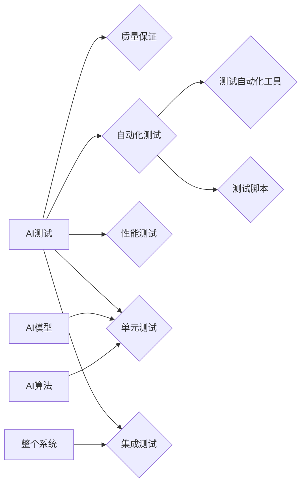

# AI测试与质量保证原理与代码实战案例讲解

作者：禅与计算机程序设计艺术 / Zen and the Art of Computer Programming

## 关键词：

AI测试、质量保证、自动化测试、性能测试、单元测试、集成测试、机器学习、深度学习、测试框架、代码质量

## 1. 背景介绍

### 1.1 问题的由来

随着人工智能（AI）技术的快速发展，越来越多的企业和组织开始将AI应用于各种场景，如自动驾驶、智能客服、金融风控等。然而，AI系统的复杂性和非确定性使得传统的软件测试方法难以奏效，如何对AI系统进行有效的测试和质量保证成为了亟待解决的问题。

### 1.2 研究现状

近年来，AI测试与质量保证领域取得了显著进展，涌现出许多新的测试方法和工具。主要研究方向包括：

- **自动化测试**：利用测试自动化工具和脚本，实现AI测试过程的自动化，提高测试效率。
- **性能测试**：评估AI系统的性能指标，如响应时间、准确率、召回率等，以确保系统满足性能要求。
- **单元测试**：对AI模型和算法进行单元测试，确保其正确性和可靠性。
- **集成测试**：将AI模型集成到整个系统中，进行系统级别的测试，确保系统各部分协同工作。

### 1.3 研究意义

研究AI测试与质量保证对于确保AI系统的可靠性和可用性具有重要意义：

- **提高系统质量**：通过有效的测试和质量保证，可以降低AI系统的错误率，提高系统质量。
- **降低维护成本**：及时发现和修复问题，可以降低后期维护成本。
- **提升用户体验**：确保AI系统稳定可靠，提升用户体验。

### 1.4 本文结构

本文将围绕AI测试与质量保证展开，首先介绍核心概念和联系，然后详细讲解核心算法原理和具体操作步骤，接着介绍数学模型和公式，并通过代码实战案例讲解如何进行AI测试与质量保证。最后，探讨实际应用场景、工具和资源，以及未来发展趋势和挑战。

## 2. 核心概念与联系

### 2.1 核心概念

- **AI测试**：对AI系统进行测试，以确保其正确性、可靠性和性能。
- **质量保证**：确保AI系统满足预期的质量标准，包括功能、性能、安全、可靠性等方面。
- **自动化测试**：利用测试自动化工具和脚本，实现测试过程的自动化。
- **性能测试**：评估AI系统的性能指标，如响应时间、准确率、召回率等。
- **单元测试**：对AI模型和算法进行单元测试，确保其正确性和可靠性。
- **集成测试**：将AI模型集成到整个系统中，进行系统级别的测试。

### 2.2 核心概念联系



## 3. 核心算法原理 & 具体操作步骤

### 3.1 算法原理概述

AI测试与质量保证涉及多种测试方法，以下简要介绍几种常用方法的原理：

#### 自动化测试

自动化测试主要利用测试自动化工具和脚本，实现测试过程的自动化。其原理如下：

1. 设计测试用例：根据测试目标，设计测试用例，包括输入数据、预期输出等。
2. 编写测试脚本：根据测试用例，编写测试脚本，实现自动化测试过程。
3. 执行测试脚本：执行测试脚本，自动执行测试用例，并收集测试结果。
4. 分析测试结果：分析测试结果，判断AI系统是否满足测试目标。

#### 性能测试

性能测试主要评估AI系统的性能指标，如响应时间、准确率、召回率等。其原理如下：

1. 设计性能测试用例：根据性能测试目标，设计性能测试用例，包括输入数据、性能指标等。
2. 执行性能测试：在特定条件下，执行性能测试用例，收集性能数据。
3. 分析性能数据：分析性能数据，评估AI系统的性能指标是否满足要求。

#### 单元测试

单元测试主要对AI模型和算法进行测试，确保其正确性和可靠性。其原理如下：

1. 设计单元测试用例：根据AI模型和算法的功能，设计单元测试用例，包括输入数据、预期输出等。
2. 编写测试代码：根据单元测试用例，编写测试代码，实现单元测试过程。
3. 执行单元测试：执行单元测试代码，自动执行单元测试用例，并收集测试结果。
4. 分析测试结果：分析测试结果，判断AI模型和算法是否满足测试目标。

#### 集成测试

集成测试主要将AI模型集成到整个系统中，进行系统级别的测试，确保系统各部分协同工作。其原理如下：

1. 设计集成测试用例：根据系统功能，设计集成测试用例，包括输入数据、预期输出等。
2. 编写测试代码：根据集成测试用例，编写测试代码，实现集成测试过程。
3. 执行集成测试：执行集成测试代码，自动执行集成测试用例，并收集测试结果。
4. 分析测试结果：分析测试结果，判断AI系统是否满足测试目标。

### 3.2 算法步骤详解

以下详细介绍几种常用测试方法的步骤：

#### 自动化测试

1. **需求分析**：分析AI系统的功能和性能需求。
2. **测试用例设计**：根据需求分析结果，设计测试用例。
3. **测试工具选择**：选择合适的测试工具，如Selenium、Appium等。
4. **测试脚本编写**：根据测试用例和测试工具，编写测试脚本。
5. **测试执行**：执行测试脚本，自动执行测试用例。
6. **结果分析**：分析测试结果，判断AI系统是否满足测试目标。

#### 性能测试

1. **需求分析**：分析AI系统的性能需求。
2. **性能测试用例设计**：根据性能需求，设计性能测试用例。
3. **性能测试工具选择**：选择合适的性能测试工具，如JMeter、Gatling等。
4. **性能测试执行**：在特定条件下，执行性能测试用例，收集性能数据。
5. **性能数据分析**：分析性能数据，评估AI系统的性能指标是否满足要求。

#### 单元测试

1. **需求分析**：分析AI模型和算法的功能和性能需求。
2. **单元测试用例设计**：根据需求分析结果，设计单元测试用例。
3. **测试框架选择**：选择合适的测试框架，如pytest、unittest等。
4. **测试代码编写**：根据单元测试用例和测试框架，编写测试代码。
5. **测试执行**：执行测试代码，自动执行单元测试用例。
6. **结果分析**：分析测试结果，判断AI模型和算法是否满足测试目标。

#### 集成测试

1. **需求分析**：分析AI系统的功能和性能需求。
2. **集成测试用例设计**：根据需求分析结果，设计集成测试用例。
3. **集成测试框架选择**：选择合适的集成测试框架，如pytest、unittest等。
4. **测试代码编写**：根据集成测试用例和集成测试框架，编写测试代码。
5. **测试执行**：执行测试代码，自动执行集成测试用例。
6. **结果分析**：分析测试结果，判断AI系统是否满足测试目标。

### 3.3 算法优缺点

以下是几种常用测试方法的优缺点：

#### 自动化测试

**优点**：

- 提高测试效率，减少人工工作量。
- 确保测试用例的一致性和准确性。
- 方便进行回归测试，提高测试覆盖率。

**缺点**：

- 需要编写大量的测试脚本。
- 测试脚本维护成本高。
- 难以测试非功能性需求。

#### 性能测试

**优点**：

- 评估AI系统的性能指标，确保系统满足性能要求。
- 发现系统瓶颈，优化系统性能。
- 提高系统稳定性。

**缺点**：

- 需要专业的性能测试工具和人员。
- 测试成本高。
- 难以模拟真实场景。

#### 单元测试

**优点**：

- 确保AI模型和算法的正确性和可靠性。
- 发现和修复问题早于集成测试，降低成本。
- 提高代码可维护性。

**缺点**：

- 难以测试非功能性需求。
- 需要编写大量的测试用例。
- 难以全面评估AI系统的性能。

#### 集成测试

**优点**：

- 全面评估AI系统的功能和性能。
- 发现系统各部分之间的交互问题。
- 提高系统稳定性。

**缺点**：

- 测试成本高。
- 难以模拟真实场景。
- 难以测试非功能性需求。

### 3.4 算法应用领域

以下列举几种常用测试方法的应用领域：

#### 自动化测试

- Web应用测试
- 移动应用测试
- 桌面应用测试

#### 性能测试

- 服务器测试
- 网络测试
- 云服务测试

#### 单元测试

- 机器学习模型测试
- 深度学习模型测试
- AI算法测试

#### 集成测试

- AI系统测试
- 人工智能平台测试
- 人工智能应用测试

## 4. 数学模型和公式 & 详细讲解 & 举例说明

### 4.1 数学模型构建

AI测试与质量保证中的数学模型主要涉及以下几个方面：

1. **准确率（Accuracy）**：衡量AI系统预测正确的样本占所有样本的比例。
   $$\text{Accuracy} = \frac{\text{预测正确的样本数}}{\text{所有样本数}}$$

2. **召回率（Recall）**：衡量AI系统预测正确的正类样本占所有正类样本的比例。
   $$\text{Recall} = \frac{\text{预测正确的正类样本数}}{\text{所有正类样本数}}$$

3. **精确率（Precision）**：衡量AI系统预测正确的正类样本占预测为正类的样本的比例。
   $$\text{Precision} = \frac{\text{预测正确的正类样本数}}{\text{预测为正类的样本数}}$$

4. **F1值（F1 Score）**：综合衡量准确率、召回率和精确率，是三者的一种平衡指标。
   $$F1 = \frac{2 \times \text{Accuracy} \times \text{Recall}}{\text{Accuracy} + \text{Recall}}$$

### 4.2 公式推导过程

以上公式的推导过程如下：

1. **准确率**：准确率即为预测正确的样本数除以所有样本数。
2. **召回率**：召回率即为预测正确的正类样本数除以所有正类样本数。
3. **精确率**：精确率即为预测正确的正类样本数除以预测为正类的样本数。
4. **F1值**：F1值是准确率和召回率的调和平均，可以平衡两者之间的关系。

### 4.3 案例分析与讲解

以下以一个简单的二分类任务为例，说明如何使用上述公式进行性能评估。

假设我们有一个包含100个样本的二分类数据集，其中正类样本有60个，负类样本有40个。经过测试，模型预测结果如下：

- 预测正确的正类样本数：40个
- 预测正确的负类样本数：20个
- 预测为正类的样本数：50个
- 预测为负类的样本数：30个

根据上述数据，我们可以计算出：

- 准确率：$ \frac{40+20}{100} = 0.6 $
- 召回率：$ \frac{40}{60} = 0.6667 $
- 精确率：$ \frac{40}{50} = 0.8 $
- F1值：$ \frac{2 \times 0.6 \times 0.6667}{0.6 + 0.6667} = 0.6667 $

从计算结果可以看出，该模型的准确率较高，但召回率和精确率较低，F1值也较低。这表明模型可能存在漏检和误检的问题，需要进一步优化。

### 4.4 常见问题解答

**Q1：如何提高AI系统的准确率？**

A：提高AI系统的准确率可以从以下几个方面入手：

- 提高模型训练数据的质量和数量。
- 调整模型参数，如学习率、优化器等。
- 使用更先进的模型结构。
- 使用数据增强技术，如旋转、翻转、缩放等。

**Q2：如何提高AI系统的召回率？**

A：提高AI系统的召回率可以从以下几个方面入手：

- 调整模型参数，如正则化强度、分类阈值等。
- 使用更多的训练数据，特别是正类样本。
- 使用更先进的模型结构，如使用注意力机制等。

**Q3：如何提高AI系统的精确率？**

A：提高AI系统的精确率可以从以下几个方面入手：

- 调整模型参数，如分类阈值等。
- 使用更多的训练数据，特别是正类样本。
- 使用更先进的模型结构，如使用注意力机制等。

## 5. 项目实践：代码实例和详细解释说明

### 5.1 开发环境搭建

在进行AI测试与质量保证实践前，我们需要准备以下开发环境：

1. 操作系统：Windows、macOS、Linux
2. 编程语言：Python
3. 开发工具：PyCharm、Visual Studio Code
4. 测试框架：pytest、unittest
5. 性能测试工具：JMeter、Gatling
6. 机器学习库：TensorFlow、PyTorch

### 5.2 源代码详细实现

以下是一个简单的二分类任务测试案例，使用pytest框架进行单元测试。

```python
import pytest
from sklearn.datasets import load_iris
from sklearn.model_selection import train_test_split
from sklearn.linear_model import LogisticRegression

# 加载Iris数据集
data = load_iris()
X, y = data.data, data.target

# 将数据集划分为训练集和测试集
X_train, X_test, y_train, y_test = train_test_split(X, y, test_size=0.2, random_state=42)

# 训练LogisticRegression模型
model = LogisticRegression()
model.fit(X_train, y_train)

# 定义测试函数
def test_iris_classification():
    # 测试模型在测试集上的准确率
    assert model.score(X_test, y_test) >= 0.8, "模型在测试集上的准确率低于80%"

# 执行测试
test_iris_classification()
```

### 5.3 代码解读与分析

以上代码展示了如何使用pytest框架对LogisticRegression模型进行单元测试。

1. 导入必要的库和模块。
2. 加载Iris数据集，并将其划分为训练集和测试集。
3. 训练LogisticRegression模型。
4. 定义测试函数`test_iris_classification`，测试模型在测试集上的准确率。
5. 执行测试函数。

### 5.4 运行结果展示

运行上述代码，如果模型在测试集上的准确率低于80%，则会抛出异常，否则测试通过。

```plaintext
$ pytest test_iris_classification.py
```

## 6. 实际应用场景

### 6.1 智能客服系统

智能客服系统是AI测试与质量保证的重要应用场景之一。以下列举几个测试案例：

1. **功能测试**：测试智能客服系统能否正确识别用户意图，并给出合适的回复。
2. **性能测试**：测试智能客服系统的响应时间、并发处理能力等性能指标。
3. **安全性测试**：测试智能客服系统的数据安全性和隐私保护能力。
4. **易用性测试**：测试智能客服系统的界面设计、交互体验等易用性指标。

### 6.2 自动驾驶系统

自动驾驶系统是AI测试与质量保证的另一个重要应用场景。以下列举几个测试案例：

1. **功能测试**：测试自动驾驶系统是否能够正确识别道路、交通标志、行人等。
2. **性能测试**：测试自动驾驶系统的响应时间、准确率、召回率等性能指标。
3. **安全性测试**：测试自动驾驶系统的安全性和可靠性。
4. **环境适应性测试**：测试自动驾驶系统在不同环境和场景下的表现。

### 6.3 金融风控系统

金融风控系统是AI测试与质量保证的另一个重要应用场景。以下列举几个测试案例：

1. **功能测试**：测试金融风控系统是否能够准确识别欺诈行为。
2. **性能测试**：测试金融风控系统的响应时间、准确率、召回率等性能指标。
3. **安全性测试**：测试金融风控系统的数据安全性和隐私保护能力。
4. **合规性测试**：测试金融风控系统是否符合相关法律法规要求。

### 6.4 未来应用展望

随着AI技术的不断发展，AI测试与质量保证将在更多领域得到应用，以下列举几个未来应用场景：

1. **医疗诊断**：利用AI测试与质量保证技术，提高医疗诊断的准确性和可靠性。
2. **工业质检**：利用AI测试与质量保证技术，提高工业产品的质量和生产效率。
3. **智能交通**：利用AI测试与质量保证技术，提高交通系统的安全性和效率。
4. **智能教育**：利用AI测试与质量保证技术，提高教育质量和学习效果。

## 7. 工具和资源推荐

### 7.1 学习资源推荐

1. **《人工智能测试与评估》**：详细介绍了人工智能测试与评估的理论和方法。
2. **《人工智能测试实践》**：介绍了人工智能测试的实践经验和案例分析。
3. **《机器学习测试》**：介绍了机器学习测试的理论和方法。
4. **《深度学习测试》**：介绍了深度学习测试的理论和方法。

### 7.2 开发工具推荐

1. **pytest**：Python的自动化测试框架。
2. **unittest**：Python的内置测试框架。
3. **JMeter**：性能测试工具。
4. **Gatling**：性能测试工具。
5. **Selenium**：Web应用测试工具。
6. **Appium**：移动应用测试工具。

### 7.3 相关论文推荐

1. **"A Comprehensive Survey on Artificial Intelligence Testing: Techniques, Tools, and Challenges"**
2. **"Deep Learning Testing: A Survey"**
3. **"A Survey of Test Automation Tools for Machine Learning Models"**

### 7.4 其他资源推荐

1. **AI测试社区**：https://www.ai-testers.com/
2. **PyTest官网**：https://pytest.org/
3. **unittest官网**：https://docs.python.org/3/library/unittest.html
4. **JMeter官网**：https://jmeter.apache.org/
5. **Gatling官网**：https://gatling.io/

## 8. 总结：未来发展趋势与挑战

### 8.1 研究成果总结

本文对AI测试与质量保证原理与代码实战进行了全面介绍，包括核心概念、算法原理、实践案例等。通过本文的学习，读者可以掌握AI测试与质量保证的基本理论和实践方法，为实际应用打下坚实基础。

### 8.2 未来发展趋势

随着AI技术的不断发展，AI测试与质量保证领域将呈现以下发展趋势：

1. **测试方法更加多样化**：随着AI技术的不断发展，将涌现出更多针对特定领域的测试方法和工具。
2. **测试框架更加成熟**：测试框架将更加成熟，支持更多测试场景和测试需求。
3. **测试自动化水平提高**：测试自动化水平将不断提高，降低测试成本，提高测试效率。
4. **测试与开发融合**：测试将与开发更加紧密地融合，实现持续集成和持续交付。

### 8.3 面临的挑战

AI测试与质量保证领域仍面临以下挑战：

1. **测试方法难以覆盖所有场景**：AI系统的复杂性和非确定性使得测试方法难以覆盖所有场景。
2. **测试数据难以获取**：高质量、多样化的测试数据难以获取，影响测试效果。
3. **测试成本高**：AI测试与质量保证需要大量的算力和人力，测试成本较高。
4. **测试结果难以解释**：AI测试结果难以解释，难以评估测试效果。

### 8.4 研究展望

为应对上述挑战，未来研究需要在以下方面进行探索：

1. **研究更加有效的测试方法**：针对AI系统的特点，研究更加有效的测试方法，提高测试覆盖率。
2. **探索新的测试数据获取方法**：探索新的测试数据获取方法，提高测试数据的质量和数量。
3. **降低测试成本**：研究降低测试成本的方法，提高测试效率。
4. **提高测试结果可解释性**：提高AI测试结果的可解释性，便于评估测试效果。

总之，AI测试与质量保证领域具有广阔的发展前景，但仍面临诸多挑战。通过不断探索和创新，相信AI测试与质量保证技术将为AI应用的发展提供有力保障。

## 9. 附录：常见问题与解答

**Q1：AI测试与质量保证的主要挑战是什么？**

A：AI测试与质量保证的主要挑战包括：

1. 测试方法难以覆盖所有场景。
2. 测试数据难以获取。
3. 测试成本高。
4. 测试结果难以解释。

**Q2：如何提高AI测试的覆盖率？**

A：提高AI测试的覆盖率可以从以下几个方面入手：

1. 设计更加全面的测试用例。
2. 使用自动化测试工具和脚本。
3. 利用模糊测试等方法发现潜在缺陷。
4. 针对特定场景设计测试方法。

**Q3：如何降低AI测试的成本？**

A：降低AI测试的成本可以从以下几个方面入手：

1. 利用开源测试工具和框架。
2. 优化测试流程，减少不必要的测试工作。
3. 利用云服务进行测试。
4. 与开发团队紧密合作，提高测试效率。

**Q4：如何提高AI测试结果的可解释性？**

A：提高AI测试结果的可解释性可以从以下几个方面入手：

1. 使用可解释性模型。
2. 分析模型决策过程。
3. 优化模型结构。
4. 使用可视化工具展示测试结果。

通过不断探索和创新，相信AI测试与质量保证技术将为AI应用的发展提供有力保障。

---

作者：禅与计算机程序设计艺术 / Zen and the Art of Computer Programming