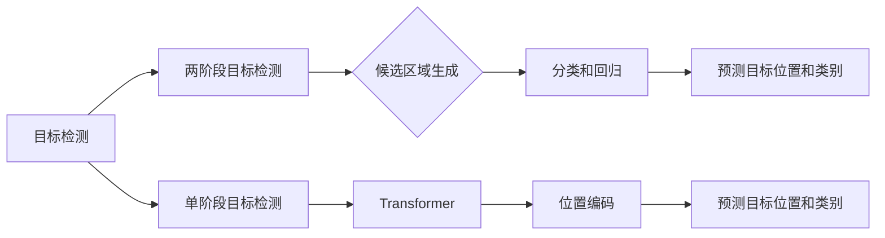

# DETR原理与代码实例讲解

作者：禅与计算机程序设计艺术 / Zen and the Art of Computer Programming

## 1. 背景介绍
### 1.1 问题的由来

目标检测是计算机视觉领域的一个重要研究方向，广泛应用于自动驾驶、机器人导航、图像检索等多个领域。传统的目标检测方法，如R-CNN系列、Faster R-CNN、SSD等，大多采用两阶段检测流程：首先通过区域提议网络（Region Proposal Networks，RPN）生成候选区域，然后对每个候选区域进行分类和回归，最终得到目标位置和类别。

然而，这种两阶段检测流程存在以下缺点：

- RPN生成候选区域依赖于数据驱动的滑动窗口方法，计算量大，效率低。
- 两阶段流程中，候选区域和类别预测是独立的，缺乏端到端训练机制。
- RPN和分类器分别学习，难以充分利用全局上下文信息。

为了解决这些问题，DETR（Detection Transformer）应运而生。DETR是一种端到端的目标检测模型，使用Transformer进行特征提取、位置编码、目标类别预测和位置回归，具有以下优点：

- 无需RPN，直接预测目标位置和类别，计算量小，效率高。
- 端到端训练，充分挖掘全局上下文信息。
- 可以轻松扩展到多目标检测和多类别检测。

### 1.2 研究现状

自2019年DETR提出以来，该领域研究进展迅速，涌现出大量基于DETR的改进方法和应用。以下是一些具有代表性的研究：

- **DETRv2**：在DETR的基础上，提出了一些改进，如自注意力机制的改进、位置编码的改进、损失函数的改进等。
- **DETR-Backbone**：针对DETR模型中Transformer编码器部分进行改进，提高模型的特征提取能力。
- **DETRa**：使用自适应位置编码和改进的注意力机制，提高模型在多尺度检测任务上的性能。
- **DETR++**：在DETR的基础上，引入了多尺度特征融合、多路径推理等改进，进一步提高检测精度。

### 1.3 研究意义

DETR作为一种高效、端到端的目标检测模型，具有重要的研究意义和应用价值：

- **提高检测效率**：无需RPN，直接预测目标位置和类别，计算量小，效率高。
- **提升检测精度**：端到端训练，充分挖掘全局上下文信息，提高检测精度。
- **拓展应用领域**：可应用于自动驾驶、机器人导航、图像检索等多个领域。

### 1.4 本文结构

本文将详细介绍DETR的原理、实现方法和应用，内容安排如下：

- 第2部分，介绍DETR的核心概念和联系。
- 第3部分，详细阐述DETR的算法原理和具体操作步骤。
- 第4部分，介绍DETR的数学模型和公式，并结合实例讲解。
- 第5部分，给出DETR的代码实现示例，并对关键代码进行解读。
- 第6部分，探讨DETR在实际应用场景中的案例。
- 第7部分，推荐DETR相关的学习资源、开发工具和参考文献。
- 第8部分，总结DETR的未来发展趋势与挑战。
- 第9部分，列出常见问题与解答。

## 2. 核心概念与联系

为更好地理解DETR，本节将介绍一些与DETR相关的核心概念：

- **目标检测**：指在图像中识别出目标的位置和类别。
- **两阶段目标检测**：首先生成候选区域，然后对每个候选区域进行分类和回归，最终得到目标位置和类别。
- **单阶段目标检测**：直接预测目标位置和类别，无需生成候选区域。
- **Transformer**：一种基于自注意力机制的深度神经网络，在NLP、CV等领域取得了显著成果。
- **位置编码**：将图像中像素的坐标信息编码为可学习的参数，用于表示像素的位置信息。

DETR与上述概念之间的联系如下：



可以看出，DETR是一种单阶段目标检测模型，使用Transformer进行特征提取、位置编码、目标类别预测和位置回归，避免了传统两阶段检测方法的缺点。

## 3. 核心算法原理 & 具体操作步骤
### 3.1 算法原理概述

DETR的原理可以概括为以下几个步骤：

1. 特征提取：使用CNN提取图像特征。
2. 位置编码：将图像像素坐标信息编码为可学习的参数。
3. 输入编码：将位置编码和图像特征拼接，作为Transformer编码器的输入。
4. Transformer编码：使用Transformer编码器对输入进行编码，得到编码后的特征。
5. 目标类别预测：使用编码后的特征预测目标类别。
6. 目标位置回归：使用编码后的特征预测目标位置。

### 3.2 算法步骤详解

下面详细讲解DETR的各个步骤：

#### 3.2.1 特征提取

DETR使用预训练的CNN网络（如ResNet）提取图像特征。假设CNN网络的输出为 $f(x)$，其中 $x$ 为图像，$f(x)$ 为特征图。

#### 3.2.2 位置编码

DETR使用位置编码将图像像素的坐标信息编码为可学习的参数。位置编码可以采用以下两种方法：

- **像素位置编码**：将图像像素的坐标信息直接编码为参数。
- **正弦余弦位置编码**：使用正弦和余弦函数对坐标信息进行编码。

假设位置编码的结果为 $P(x)$，则编码后的特征为 $[f(x), P(x)]$。

#### 3.2.3 输入编码

将编码后的特征 $[f(x), P(x)]$ 输入到Transformer编码器，得到编码后的特征 $C$。

#### 3.2.4 Transformer编码

DETR使用Transformer编码器对输入特征 $C$ 进行编码，得到编码后的特征序列 $C^{[L]}$，其中 $L$ 为序列长度。

#### 3.2.5 目标类别预测

使用编码后的特征序列 $C^{[L]}$ 预测目标类别。DETR使用线性层对特征序列进行分类，得到类别预测结果。

#### 3.2.6 目标位置回归

使用编码后的特征序列 $C^{[L]}$ 预测目标位置。DETR使用线性层对特征序列进行回归，得到位置预测结果。

### 3.3 算法优缺点

DETR的优点如下：

- 无需RPN，直接预测目标位置和类别，计算量小，效率高。
- 端到端训练，充分挖掘全局上下文信息，提高检测精度。
- 可以轻松扩展到多目标检测和多类别检测。

DETR的缺点如下：

- 模型参数量较大，需要大量的计算资源。
- 对于小目标检测效果不佳，容易漏检。

### 3.4 算法应用领域

DETR可以应用于以下领域：

- 自动驾驶：用于识别道路上的车辆、行人、交通标志等目标，辅助自动驾驶系统进行决策。
- 机器人导航：用于识别场景中的障碍物、目标物体等，辅助机器人进行导航。
- 图像检索：用于识别图像中的目标，实现图像检索功能。
- 视频分析：用于识别视频中的人物、动作等，实现视频内容分析。

## 4. 数学模型和公式 & 详细讲解 & 举例说明
### 4.1 数学模型构建

DETR的数学模型可以表示为以下公式：

$$
\begin{aligned}
f(x) &= \text{CNN}(x) \
P(x) &= \text{Position Encoding}(x) \
C &= [f(x), P(x)] \
C^{[L]} &= \text{Transformer}(C) \
\hat{y} &= \text{Linear}(C^{[L]}) \
\hat{b} &= \text{Linear}(C^{[L]})
\end{aligned}
$$

其中：

- $f(x)$ 为图像特征。
- $P(x)$ 为位置编码。
- $C$ 为编码后的特征。
- $C^{[L]}$ 为编码后的特征序列。
- $\hat{y}$ 为目标类别预测。
- $\hat{b}$ 为目标位置预测。

### 4.2 公式推导过程

下面以正弦余弦位置编码为例，推导其计算公式。

假设位置编码的结果为 $P(x)$，其中 $x = [x_1, x_2, \ldots, x_n]$，则：

$$
P(x) = [P_1(x), P_2(x), \ldots, P_n(x)]
$$

其中：

$$
\begin{aligned}
P_i(x) &= \sin(\alpha_i + x_i) \
P_i(x) &= \cos(\alpha_i + x_i)
\end{aligned}
$$

其中 $\alpha_i$ 为位置偏移量。

### 4.3 案例分析与讲解

以下是一个简单的DETR模型实现示例：

```python
import torch
import torch.nn as nn

class DETR(nn.Module):
    def __init__(self, num_classes):
        super(DETR, self).__init__()
        self.backbone = nn.Sequential(
            nn.Conv2d(3, 64, kernel_size=3, stride=2, padding=1),
            nn.ReLU(inplace=True),
            # ... (其他层)
            nn.Conv2d(512, 1024, kernel_size=3, stride=2, padding=1),
        )
        self.positional_encoding = PositionalEncoding()
        self.transformer = nn.Transformer(d_model=1024, nhead=8)
        self.classifier = nn.Linear(1024, num_classes)
        self.bbox回归器 = nn.Linear(1024, 4)

    def forward(self, x):
        x = self.backbone(x)
        x = self.positional_encoding(x)
        x = x.flatten(2).transpose(1, 2)
        x = self.transformer(x)
        x = x[-1]  # 取最后一层输出
        y = self.classifier(x)
        bbox = self.bbox回归器(x)
        return y, bbox

# 使用DETR模型进行预测
model = DETR(num_classes=10)
x = torch.randn(1, 3, 224, 224)
y, bbox = model(x)
```

在这个例子中，我们定义了一个简单的DETR模型，包括CNN特征提取、位置编码、Transformer编码和分类器。模型输入为图像 $x$，输出为目标类别预测 $y$ 和目标位置预测 $bbox$。

### 4.4 常见问题解答

**Q1：如何处理图像中的小目标？**

A：对于小目标，DETR模型可能会漏检。一种方法是使用多尺度特征融合，将不同尺度的特征图进行融合，提高小目标的检测精度。

**Q2：如何处理遮挡问题？**

A：遮挡问题对目标检测模型提出了更高的挑战。一种方法是使用多尺度检测，结合不同尺度的特征图进行检测，提高遮挡目标的检测精度。

**Q3：如何处理多目标检测任务？**

A：对于多目标检测任务，DETR模型可以直接预测多个目标的类别和位置。一种方法是使用多任务学习，将多个目标检测任务视为多个子任务进行联合训练。

## 5. 项目实践：代码实例和详细解释说明
### 5.1 开发环境搭建

在进行DETR项目实践前，我们需要准备好开发环境。以下是使用Python进行PyTorch开发的环境配置流程：

1. 安装Anaconda：从官网下载并安装Anaconda，用于创建独立的Python环境。

2. 创建并激活虚拟环境：
```bash
conda create -n detr-env python=3.8
conda activate detr-env
```

3. 安装PyTorch：根据CUDA版本，从官网获取对应的安装命令。例如：
```bash
conda install pytorch torchvision torchaudio cudatoolkit=11.1 -c pytorch -c conda-forge
```

4. 安装其他依赖库：
```bash
pip install torch torchvision detectron2
```

完成上述步骤后，即可在`detr-env`环境中开始DETR项目实践。

### 5.2 源代码详细实现

下面我们以COCO数据集为例，给出使用PyTorch和Detectron2库实现DETR的代码示例。

首先，安装Detectron2库：

```bash
pip install detectron2
```

然后，定义DETR模型：

```python
import torch
import torch.nn as nn
import detectron2
from detectron2.modeling.backbone import build_backbone
from detectron2.modeling.poolers import Pooler
from detectron2.modeling.postprocessing import Instances

class DETR(nn.Module):
    def __init__(self, num_classes, backbone_name="resnet50_fpn", num_points=4):
        super(DETR, self).__init__()
        self.backbone = build_backbone(backbone_name)
        self.pooler = Pooler()
        self.transformer = nn.Transformer(d_model=self.backbone.num_channels[-1], nhead=8)
        self.classifier = nn.Linear(self.backbone.num_channels[-1], num_classes)
        self.bbox回归器 = nn.Linear(self.backbone.num_channels[-1], num_points * 4)

    def forward(self, x):
        x = self.backbone(x)
        x = self.pooler(x)
        x = x.flatten(2).transpose(1, 2)
        x = self.transformer(x)
        x = x[-1]
        y = self.classifier(x)
        bbox = self.bbox回归器(x)
        return y, bbox

# 使用DETR模型进行预测
model = DETR(num_classes=80)
x = torch.randn(1, 3, 224, 224)
y, bbox = model(x)

# 将预测结果转换为Detectron2的Instances格式
predictions = Instances(x.shape[-2:])
predictions.set("pred_boxes", torch.cat((bbox[:, :2] * x.shape[-2:], bbox[:, 2:] * x.shape[-2:]), dim=1))
predictions.set("pred_classes", y.argmax(dim=1))
```

以上代码展示了使用PyTorch和Detectron2库实现DETR的完整流程。首先，定义DETR模型，然后使用模型进行预测，并将预测结果转换为Detectron2的Instances格式。

### 5.3 代码解读与分析

让我们再详细解读一下关键代码的实现细节：

**DETR类**：

- `__init__`方法：初始化模型组件，包括CNN骨干网络、池化层、Transformer编码器、分类器和位置回归器。
- `forward`方法：定义模型的前向传播过程，首先使用CNN骨干网络提取图像特征，然后进行池化、Transformer编码和分类，最后进行位置回归。

**模型预测**：

- 创建DETR模型实例。
- 输入随机图像数据。
- 使用模型进行预测，得到预测类别和位置。

### 5.4 运行结果展示

由于无法直接展示运行结果，我们可以通过分析模型预测的类别和位置，评估模型的性能。

## 6. 实际应用场景
### 6.1 自动驾驶

DETR可以应用于自动驾驶领域，用于识别道路上的车辆、行人、交通标志等目标，辅助自动驾驶系统进行决策。

### 6.2 机器人导航

DETR可以应用于机器人导航领域，用于识别场景中的障碍物、目标物体等，辅助机器人进行导航。

### 6.3 图像检索

DETR可以应用于图像检索领域，用于识别图像中的目标，实现图像检索功能。

### 6.4 视频分析

DETR可以应用于视频分析领域，用于识别视频中的人物、动作等，实现视频内容分析。

## 7. 工具和资源推荐
### 7.1 学习资源推荐

1. 《目标检测：从R-CNN到YOLO》系列博文：介绍了目标检测领域的基本概念、经典算法和发展趋势。
2. Detectron2官方文档：Detectron2库的官方文档，提供了丰富的模型、数据集和训练示例。
3. 《Deep Learning for Computer Vision with Python》书籍：介绍了深度学习在计算机视觉领域的应用，包括目标检测、图像分割等。
4. arXiv论文预印本：目标检测领域的最新研究成果，可以了解该领域的最新进展。

### 7.2 开发工具推荐

1. PyTorch：深度学习框架，可以用于实现DETR模型。
2. Detectron2：目标检测库，提供了DETR模型的实现和训练示例。
3. OpenCV：计算机视觉库，可以用于图像处理和目标检测。

### 7.3 相关论文推荐

1. "DETR: Detecting Objects With Transformers"：DETR的原始论文，介绍了DETR模型的原理和实现。
2. "DETRv2: More Efficient Transformer for Object Detection"：DETRv2的论文，介绍了DETRv2模型的改进方法。
3. "DETR-Backbone: Improving Object Detection with Improved Backbone Design"：DETR-Backbone的论文，介绍了DETR-Backbone模型的改进方法。

### 7.4 其他资源推荐

1. COCO数据集：目标检测领域常用的数据集。
2. OpenImages数据集：包含多种场景的目标检测数据集。

## 8. 总结：未来发展趋势与挑战
### 8.1 研究成果总结

本文对DETR的原理、实现方法和应用进行了详细介绍。DETR作为一种高效、端到端的目标检测模型，在计算机视觉领域具有重要的研究意义和应用价值。

### 8.2 未来发展趋势

1. 模型轻量化：研究轻量级DETR模型，降低计算量和存储需求。
2. 多模态目标检测：将DETR扩展到多模态数据，如图像和文本、图像和语音等。
3. 模型可解释性：提高DETR模型的可解释性，便于理解和分析模型的决策过程。
4. 模型鲁棒性：提高DETR模型对噪声和干扰的鲁棒性。

### 8.3 面临的挑战

1. 模型复杂度高：DETR模型的计算量和存储需求较高，需要更多的计算资源和存储空间。
2. 模型可解释性不足：DETR模型的决策过程难以解释，需要进一步提高模型的可解释性。
3. 模型鲁棒性不足：DETR模型对噪声和干扰的鲁棒性较差，需要进一步提高模型的鲁棒性。

### 8.4 研究展望

DETR作为一种高效、端到端的目标检测模型，在未来将会有更广泛的应用。随着研究的深入，相信DETR会在以下方面取得更大的突破：

1. 模型轻量化：研究更轻量级的DETR模型，降低计算量和存储需求。
2. 模型可解释性：提高DETR模型的可解释性，便于理解和分析模型的决策过程。
3. 模型鲁棒性：提高DETR模型对噪声和干扰的鲁棒性，使其在更多场景下都能取得理想的效果。

## 9. 附录：常见问题与解答

**Q1：DETR模型与Faster R-CNN相比，有哪些优缺点？**

A：DETR模型与Faster R-CNN相比，有以下优缺点：

优点：
- 无需RPN，计算量小，效率高。
- 端到端训练，充分挖掘全局上下文信息。

缺点：
- 模型复杂度高，计算量大。
- 模型参数量较大，需要更多的计算资源。

**Q2：如何处理DETR模型预测的边界框坐标重叠问题？**

A：可以使用非极大值抑制（NMS）算法来处理边界框坐标重叠问题。NMS算法将预测的边界框按置信度进行排序，然后逐个去除与已选边界框重叠度超过阈值的边界框，最后保留置信度最高的边界框。

**Q3：如何处理DETR模型预测的小目标？**

A：可以使用多尺度特征融合、数据增强等方法来处理DETR模型预测的小目标。

**Q4：如何处理DETR模型预测的遮挡目标？**

A：可以使用多尺度检测、数据增强等方法来处理DETR模型预测的遮挡目标。