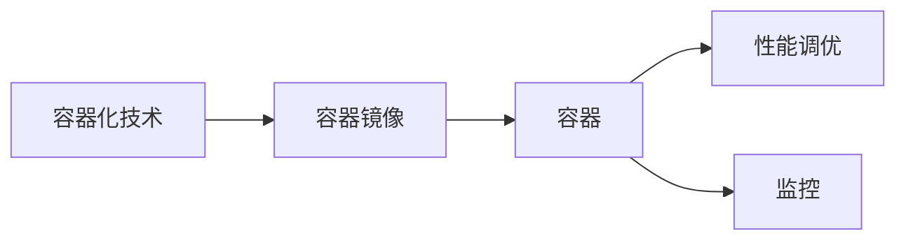

# Docker性能调优与监控

作者：禅与计算机程序设计艺术 / Zen and the Art of Computer Programming

## 1. 背景介绍
### 1.1 问题的由来

Docker作为容器化技术的代表，已经被广泛应用于云计算和DevOps领域。它为开发者提供了轻量级、可移植、易于扩展的容器运行环境，极大地提高了软件部署和运维效率。然而，随着Docker应用的普及，如何确保Docker容器的高性能和稳定性成为了许多开发者和运维人员关注的焦点。

### 1.2 研究现状

近年来，随着Docker生态的不断发展，涌现出许多性能调优和监控工具，如Docker Bench for Security、sysdig、Prometheus、Grafana等。这些工具可以帮助开发者快速定位Docker容器的性能瓶颈，并对其进行优化。

### 1.3 研究意义

Docker性能调优与监控的研究意义在于：
- 提高容器化应用的性能，降低资源消耗。
- 优化运维流程，提高运维效率。
- 提升容器化应用的稳定性和可靠性。
- 为Docker生态的发展提供技术支持。

### 1.4 本文结构

本文将系统地介绍Docker性能调优与监控的方法和工具，内容安排如下：
- 第2部分，介绍Docker性能调优与监控的核心概念。
- 第3部分，详细阐述Docker性能调优的具体步骤和技巧。
- 第4部分，介绍Docker性能监控的常用工具和方法。
- 第5部分，给出Docker性能调优与监控的代码实例和案例分析。
- 第6部分，探讨Docker性能调优与监控在实际应用场景中的应用。
- 第7部分，推荐Docker性能调优与监控的学习资源和开发工具。
- 第8部分，总结全文，展望Docker性能调优与监控的未来发展趋势与挑战。

## 2. 核心概念与联系

本节将介绍Docker性能调优与监控涉及的核心概念，并分析它们之间的联系。

### 2.1 容器化技术

容器化技术是一种轻量级的虚拟化技术，可以将应用程序及其运行环境打包成一个独立的容器镜像。容器镜像包含应用程序、库、环境变量等运行所需的全部依赖，可以确保应用程序在不同的环境中运行一致。

### 2.2 Docker

Docker是容器化技术的一种实现，它提供了一个轻量级的容器运行环境，让开发者可以轻松地构建、运行和扩展容器。

### 2.3 性能调优

性能调优是指通过调整系统参数、优化应用程序代码、改进算法等方法，提高系统的性能，降低资源消耗。

### 2.4 监控

监控是指对系统运行状态进行实时监控，及时发现并解决问题，确保系统稳定可靠运行。

这些概念之间的关系如下：



可以看出，容器化技术是Docker性能调优与监控的基础，性能调优和监控是确保容器化应用稳定可靠运行的关键。

## 3. 核心算法原理 & 具体操作步骤
### 3.1 算法原理概述

Docker性能调优主要从以下几个方面进行：

1. **资源限制**：通过限制容器使用的CPU、内存等资源，避免资源竞争，提高系统性能。
2. **网络优化**：优化容器网络配置，提高网络传输效率。
3. **存储优化**：优化容器存储配置，提高存储性能。
4. **应用程序优化**：优化应用程序代码和配置，提高应用程序性能。

### 3.2 算法步骤详解

以下是Docker性能调优的具体步骤：

**步骤1：分析性能瓶颈**

使用性能分析工具（如sysbench、ntop、iostat等）对Docker容器进行性能分析，找出性能瓶颈。

**步骤2：资源限制**

使用Docker run命令的--cpus、--memory参数限制容器使用的CPU和内存资源。

```bash
docker run --cpus="0.5" --memory="256m" -d nginx
```

**步骤3：网络优化**

优化容器网络配置，例如：

- 使用桥接网络模式，提高网络性能。
- 使用Custom Bridge，自定义网络配置，提高网络性能。

**步骤4：存储优化**

优化容器存储配置，例如：

- 使用宿主机本地存储，提高存储性能。
- 使用持久化存储卷，保证数据持久化。

**步骤5：应用程序优化**

优化应用程序代码和配置，例如：

- 使用异步编程，提高应用程序并发性能。
- 使用缓存技术，减少数据库访问次数。

### 3.3 算法优缺点

**优点**：

- 简单易用，易于上手。
- 提高系统性能，降低资源消耗。

**缺点**：

- 调优效果有限，需要针对具体情况进行调整。
- 可能会降低容器的可移植性。

### 3.4 算法应用领域

Docker性能调优适用于以下领域：

- 云计算平台
- DevOps
- 应用程序开发

## 4. 数学模型和公式 & 详细讲解 & 举例说明
### 4.1 数学模型构建

Docker性能调优可以通过以下数学模型进行量化：

$$
P = f(R, M, N)
$$

其中，$P$ 表示容器性能，$R$ 表示资源限制，$M$ 表示网络优化，$N$ 表示存储优化。

### 4.2 公式推导过程

假设容器性能 $P$ 与资源限制 $R$、网络优化 $M$、存储优化 $N$ 之间存在线性关系，则有：

$$
P = aR + bM + cN
$$

其中，$a$、$b$、$c$ 为待定系数。

通过实验方法，可以得到系数 $a$、$b$、$c$ 的值，从而建立完整的性能模型。

### 4.3 案例分析与讲解

以下是一个Docker性能调优的案例分析：

**问题描述**：某个Docker容器在处理大量并发请求时，响应速度缓慢。

**分析**：通过性能分析工具发现，CPU和内存资源使用率较高，且网络延迟较大。

**解决方案**：

1. 限制容器使用的CPU和内存资源，例如：
```bash
docker run --cpus="0.5" --memory="512m" -d nginx
```

2. 使用桥接网络模式，提高网络性能：
```bash
docker network create -d bridge mybridge
docker run --network mybridge -d nginx
```

3. 使用宿主机本地存储，提高存储性能。

**结果**：经过优化，容器的响应速度得到了显著提升。

### 4.4 常见问题解答

**Q1：如何选择合适的CPU和内存限制？**

A：CPU和内存限制应根据实际应用场景和性能需求进行选择。一般来说，可以将CPU和内存限制设置为应用程序实际需要的最大值。

**Q2：如何优化Docker容器网络？**

A：可以使用桥接网络模式、自定义Bridge、使用非阻塞网络驱动等方式优化Docker容器网络。

**Q3：如何优化Docker容器存储？**

A：可以使用宿主机本地存储、使用持久化存储卷、优化存储驱动等方式优化Docker容器存储。

## 5. 项目实践：代码实例和详细解释说明
### 5.1 开发环境搭建

1. 安装Docker：
```bash
sudo apt-get update
sudo apt-get install docker.io
```

2. 安装Docker Compose：
```bash
sudo curl -L "https://github.com/docker/compose/releases/download/$(curl -s https://api.github.com/repos/docker/compose/releases/latest | grep '"tag_name":' | sed -E 's/.*"v([0-9]+)\.[0-9]+.*"/\1\./g')/docker-compose-$(uname -s)-$(uname -m) -o /usr/local/bin/docker-compose"
sudo chmod +x /usr/local/bin/docker-compose
```

3. 创建一个简单的Docker Compose文件：
```yaml
version: '3'
services:
  web:
    image: nginx
    ports:
      - "80:80"
    deploy:
      resources:
        limits:
          cpus: '0.5'
          memory: 256M
```

### 5.2 源代码详细实现

在Docker Compose文件中，我们设置了CPU和内存限制：

```yaml
resources:
  limits:
    cpus: '0.5'
    memory: 256M
```

这表示web服务最多使用0.5个CPU核心和256MB内存。

### 5.3 代码解读与分析

Docker Compose文件定义了一个服务（web），指定了使用nginx镜像，并映射了80端口。在`deploy`字段中，我们设置了该服务的资源限制：

```yaml
deploy:
  resources:
    limits:
      cpus: '0.5'
      memory: 256M
```

这表示web服务最多使用0.5个CPU核心和256MB内存。

### 5.4 运行结果展示

使用以下命令启动服务：

```bash
docker-compose up -d
```

此时，web服务将以限制的CPU和内存资源运行，从而提高系统性能。

## 6. 实际应用场景
### 6.1 云计算平台

云计算平台通常部署大量Docker容器，通过性能调优和监控，可以提高平台的资源利用率，降低运营成本。

### 6.2 DevOps

DevOps团队可以使用Docker性能调优和监控工具，提高开发、测试、部署等环节的效率，缩短应用程序的交付周期。

### 6.3 应用程序开发

应用程序开发团队可以使用Docker性能调优和监控工具，优化应用程序性能，提高用户体验。

## 7. 工具和资源推荐
### 7.1 学习资源推荐

1. 《Docker实战》
2. 《Docker容器与Kubernetes》
3. Docker官方文档

### 7.2 开发工具推荐

1. sysbench：用于测试系统数据库、磁盘I/O、CPU、内存等性能。
2. ntop：用于监控网络流量。
3. iostat：用于监控CPU、内存、磁盘I/O等性能。

### 7.3 相关论文推荐

1. 《容器化技术及其应用》
2. 《Docker技术解析与应用》

### 7.4 其他资源推荐

1. Docker官方社区
2. Docker Hub
3. Docker Meetup

## 8. 总结：未来发展趋势与挑战
### 8.1 研究成果总结

本文系统地介绍了Docker性能调优与监控的方法和工具，分析了其核心概念、原理、步骤和应用场景。通过性能调优，可以提高Docker容器的性能，降低资源消耗；通过性能监控，可以及时发现并解决问题，确保系统稳定可靠运行。

### 8.2 未来发展趋势

1. **自动化性能调优**：随着人工智能技术的发展，未来可能会出现自动化性能调优工具，根据系统运行状态自动调整参数，实现智能性能优化。
2. **云原生性能监控**：随着云原生技术的发展，未来可能会出现专门针对云原生应用的性能监控工具，提供更加全面、深入的监控数据。
3. **跨平台性能调优**：随着容器技术的普及，未来可能会出现跨平台性能调优工具，支持不同容器平台（如Docker、Kubernetes等）的性能优化。

### 8.3 面临的挑战

1. **性能调优的复杂性**：Docker容器性能调优涉及多个方面，需要综合考虑CPU、内存、网络、存储等因素，具有一定的复杂性。
2. **性能监控的实时性**：性能监控需要实时收集和分析大量数据，对实时性要求较高。
3. **跨平台兼容性**：不同容器平台之间可能存在差异，需要开发跨平台性能调优和监控工具。

### 8.4 研究展望

未来，Docker性能调优与监控技术将在以下几个方面取得突破：

1. **开发更加智能的性能调优工具**：利用人工智能技术，实现自动化、智能化的性能优化。
2. **提升性能监控的实时性和准确性**：开发实时性能监控工具，并提供更加准确、全面的监控数据。
3. **推动容器技术的标准化**：推动容器技术的标准化，促进不同容器平台之间的兼容性。

通过不断的技术创新和探索，Docker性能调优与监控技术将为容器化应用的发展提供更加坚实的基础。

## 9. 附录：常见问题与解答

**Q1：Docker性能调优的主要方法有哪些？**

A：Docker性能调优的主要方法包括资源限制、网络优化、存储优化、应用程序优化等。

**Q2：如何监控Docker容器性能？**

A：可以使用sysbench、ntop、iostat等性能分析工具监控Docker容器性能。

**Q3：如何提高Docker容器网络性能？**

A：可以使用桥接网络模式、自定义Bridge、使用非阻塞网络驱动等方式提高Docker容器网络性能。

**Q4：如何优化Docker容器存储性能？**

A：可以使用宿主机本地存储、使用持久化存储卷、优化存储驱动等方式优化Docker容器存储性能。

**Q5：如何将性能调优和监控工具集成到持续集成/持续部署(CI/CD)流程中？**

A：可以将性能调优和监控工具集成到CI/CD流程中，实现对容器化应用的自动化性能测试和优化。

**Q6：Docker性能调优和监控有哪些常用工具？**

A：Docker性能调优和监控的常用工具有sysbench、ntop、iostat、Docker Bench for Security、sysdig、Prometheus、Grafana等。

**Q7：如何确保Docker容器的高性能和稳定性？**

A：确保Docker容器的高性能和稳定性需要综合考虑资源限制、网络优化、存储优化、应用程序优化等因素，并使用性能监控工具及时发现并解决问题。

作者：禅与计算机程序设计艺术 / Zen and the Art of Computer Programming