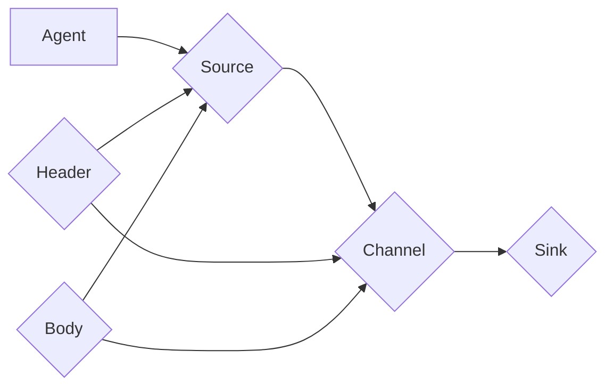
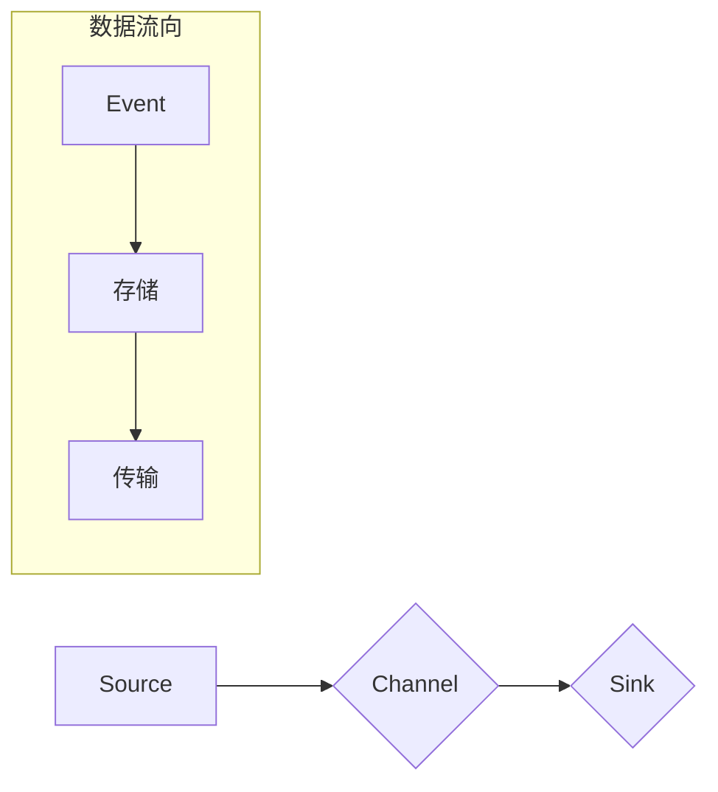

# Flume日志收集系统原理与代码实例讲解

作者：禅与计算机程序设计艺术 / Zen and the Art of Computer Programming

## 1. 背景介绍

### 1.1 问题的由来

随着互联网技术的快速发展，企业级应用系统日益复杂，产生的日志数据量也呈指数级增长。如何高效、可靠地收集、存储和分析这些海量日志数据，成为了企业运维和数据分析的关键问题。

传统的日志收集方式存在以下问题：

1. **分散式收集**：各个应用系统通常独立收集日志，导致日志数据分散存储，难以进行集中管理和分析。
2. **手动收集**：依赖人工手动收集日志，效率低，且容易出现遗漏或错误。
3. **日志格式不统一**：不同应用系统产生的日志格式各异，难以统一处理和分析。
4. **数据存储分散**：日志数据分散存储在不同设备或系统中，不利于数据备份和恢复。

为了解决上述问题，日志收集系统应运而生。Apache Flume是一款开源的分布式日志收集系统，能够有效地收集、聚合、存储和传输海量日志数据。

### 1.2 研究现状

Apache Flume自2008年开源以来，已经发展成为业界主流的日志收集系统之一。目前，Flume已经发展出多个版本，如Flume 1.x、Flume 2.x和Flume 1.8等。其中，Flume 1.8版本是目前最稳定的版本，广泛应用于企业级应用场景。

### 1.3 研究意义

研究Flume日志收集系统具有重要的意义：

1. **提高日志收集效率**：Flume能够高效地收集分布式应用系统的日志数据，提高日志收集效率。
2. **集中管理和分析**：Flume能够将分散的日志数据集中存储，便于进行统一管理和分析。
3. **降低运维成本**：Flume简化了日志收集和维护工作，降低运维成本。
4. **提高数据分析能力**：Flume能够为数据分析提供高效、可靠的日志数据，提高数据分析能力。

### 1.4 本文结构

本文将围绕Apache Flume日志收集系统展开，主要包括以下内容：

1. 核心概念与联系
2. 核心算法原理与具体操作步骤
3. 数学模型和公式
4. 项目实践：代码实例和详细解释说明
5. 实际应用场景
6. 工具和资源推荐
7. 总结：未来发展趋势与挑战

## 2. 核心概念与联系

### 2.1 核心概念

以下是Apache Flume日志收集系统中的一些核心概念：

- **Agent**：Flume的基本工作单元，由Source、Channel和Sink组成。
- **Source**：负责从日志源头收集数据，如文件、JMS、Thrift等。
- **Channel**：用于在Agent内部存储数据，如MemoryChannel、FileChannel等。
- **Sink**：负责将数据写入目标系统，如HDFS、HBase、Kafka等。
- **Event**：Flume中最小的数据单元，由Header和Body组成，Header包含元数据，Body包含实际的数据内容。

### 2.2 核心概念联系

以下是Flume中各个核心概念之间的联系：



## 3. 核心算法原理与具体操作步骤

### 3.1 算法原理概述

Apache Flume采用事件驱动的方式处理日志数据。具体原理如下：

1. **数据采集**：Source组件从日志源头采集数据，封装成Event对象。
2. **数据存储**：Channel组件存储采集到的Event对象，以保证数据不丢失。
3. **数据传输**：Sink组件将存储的Event对象批量写入目标系统。

### 3.2 算法步骤详解

以下是Flume日志收集系统的具体操作步骤：

1. **配置Agent**：根据实际需求配置Agent的Source、Channel和Sink组件。
2. **启动Agent**：启动Flume Agent，开始收集日志数据。
3. **数据采集**：Source组件从日志源头采集数据，封装成Event对象。
4. **数据存储**：Channel组件存储采集到的Event对象，以保证数据不丢失。
5. **数据传输**：Sink组件将存储的Event对象批量写入目标系统。

### 3.3 算法优缺点

**优点**：

- 高效：Flume采用高效的Event驱动方式处理日志数据，能够处理海量日志数据。
- 可靠：Flume采用可靠的数据传输机制，保证数据不丢失。
- 易用：Flume配置简单，易于使用。

**缺点**：

- 扩展性有限：Flume的扩展性有限，不适合处理复杂场景。
- 性能瓶颈：在处理海量日志数据时，Flume可能会出现性能瓶颈。

### 3.4 算法应用领域

Flume广泛应用于以下场景：

- 日志收集：从各种来源（如Web服务器、应用服务器、数据库等）收集日志数据。
- 数据分析：将日志数据传输到数据分析系统（如Hadoop、Spark等）进行进一步分析。
- 监控：将日志数据传输到监控系统，实现对系统运行状态的监控。

## 4. 数学模型和公式

Apache Flume的日志收集过程可以用以下数学模型描述：

$$
\text{Event} = (\text{Header}, \text{Body})
$$

其中：

- Event：Flume中最小的数据单元。
- Header：Event的元数据，如时间戳、来源等。
- Body：Event的实际数据内容。

以下是Flume日志收集过程的流程图：



## 5. 项目实践：代码实例和详细解释说明

### 5.1 开发环境搭建

以下是在Linux环境下搭建Flume开发环境的步骤：

1. 安装Java环境：Flume是基于Java开发的，需要安装Java环境。
2. 下载Flume：从Apache官网下载Flume安装包。
3. 解压安装包：将下载的安装包解压到指定目录。
4. 配置环境变量：将Flume的bin目录添加到系统环境变量中。

### 5.2 源代码详细实现

以下是一个简单的Flume示例：

```xml
<configuration>
    <agent>
        <name>myflume</name>
        <sources>
            <source>
                <type>exec</type>
                <command>tail -F /var/log/myapp.log</command>
                <channels>
                    <channel>
                        <type>memory</type>
                        <capacity>1000</capacity>
                        <transactionCapacity>100</transactionCapacity>
                    </channel>
                </channels>
            </source>
        </sources>
        <sinks>
            <sink>
                <type>file</type>
                <channel>mychannel</channel>
                <path>/tmp/flume/flume-agent.log</path>
            </sink>
        </sinks>
        <channels>
            <channel>
                <type>memory</type>
                <name>mychannel</name>
                <capacity>1000</capacity>
                <transactionCapacity>100</transactionCapacity>
            </channel>
        </channels>
    </agent>
</configuration>
```

### 5.3 代码解读与分析

以上示例展示了如何配置一个简单的Flume Agent：

1. **Agent配置**：指定Agent的名称为`myflume`。
2. **Source配置**：定义一个名为`mySource`的Source组件，从文件`/var/log/myapp.log`中实时读取日志数据。
3. **Channel配置**：定义一个名为`mychannel`的Channel组件，使用MemoryChannel存储数据。
4. **Sink配置**：定义一个名为`mySink`的Sink组件，将数据写入文件`/tmp/flume/flume-agent.log`。

### 5.4 运行结果展示

启动Flume Agent后，可以通过以下命令查看日志收集结果：

```bash
tail -f /tmp/flume/flume-agent.log
```

## 6. 实际应用场景

### 6.1 日志收集

Flume可以用于从各种来源收集日志数据，如Web服务器、应用服务器、数据库等。以下是一些常见的日志收集场景：

- **Web服务器日志**：从Apache、Nginx等Web服务器收集访问日志，用于分析用户行为、流量统计等。
- **应用服务器日志**：从Java、Python等应用服务器收集运行日志，用于监控应用状态、故障排查等。
- **数据库日志**：从MySQL、Oracle等数据库收集操作日志，用于数据库审计、性能分析等。

### 6.2 数据分析

Flume可以将收集到的日志数据传输到数据分析系统（如Hadoop、Spark等）进行进一步分析。以下是一些常见的数据分析场景：

- **用户行为分析**：分析Web服务器日志，了解用户行为特征。
- **故障诊断**：分析应用服务器日志，快速定位故障原因。
- **性能分析**：分析数据库日志，优化数据库性能。

### 6.3 监控

Flume可以将收集到的日志数据传输到监控系统，实现对系统运行状态的监控。以下是一些常见的监控场景：

- **系统运行状态监控**：监控Web服务器、应用服务器、数据库等系统的运行状态。
- **故障报警**：当系统出现异常时，发送报警信息。

## 7. 工具和资源推荐

### 7.1 学习资源推荐

以下是学习Flume的推荐资源：

- Apache Flume官方文档：https://flume.apache.org/
- 《Apache Flume权威指南》：介绍了Flume的原理、配置和使用方法。

### 7.2 开发工具推荐

以下是开发Flume所需的工具：

- Java开发环境
- Maven或Gradle构建工具
- 文本编辑器

### 7.3 相关论文推荐

以下是关于日志收集和数据分析的相关论文：

- **《Log Analysis for Network Security Monitoring》**：介绍了一种基于日志的网络安全监控方法。
- **《Big Data Analytics: A Survey》**：概述了大数据分析技术的发展和应用。

### 7.4 其他资源推荐

以下是其他学习Flume的资源：

- Flume社区：https://flume.apache.org/flume-user.html
- Stack Overflow：https://stackoverflow.com/questions/tagged/flume

## 8. 总结：未来发展趋势与挑战

### 8.1 研究成果总结

本文对Apache Flume日志收集系统进行了全面介绍，包括其原理、配置、应用场景等。通过学习本文，读者可以了解Flume的基本概念、工作原理和实际应用，为后续的日志收集和数据分析工作打下基础。

### 8.2 未来发展趋势

随着大数据和云计算技术的不断发展，Flume日志收集系统将呈现以下发展趋势：

1. **与大数据平台深度融合**：Flume将与其他大数据平台（如Hadoop、Spark等）深度融合，实现更高效的数据处理和分析。
2. **支持更多数据源**：Flume将支持更多类型的数据源，如数据库、消息队列等。
3. **支持更多传输协议**：Flume将支持更多传输协议，如Kafka、RabbitMQ等。

### 8.3 面临的挑战

Flume在未来的发展过程中，也将面临以下挑战：

1. **性能瓶颈**：随着日志数据量的不断增长，Flume可能面临性能瓶颈。
2. **可扩展性**：Flume的可扩展性有待进一步提高。
3. **易用性**：Flume的配置和操作相对复杂，需要进一步提高易用性。

### 8.4 研究展望

为了应对未来的挑战，Flume需要从以下几个方面进行改进：

1. **优化性能**：通过优化算法、提高数据传输效率等方式提高Flume的性能。
2. **提高可扩展性**：通过分布式架构、水平扩展等方式提高Flume的可扩展性。
3. **提高易用性**：简化Flume的配置和操作，提高易用性。

相信通过不断的改进和创新，Flume日志收集系统将继续在日志收集领域发挥重要作用，为大数据和云计算技术的发展贡献力量。

## 9. 附录：常见问题与解答

**Q1：Flume与Logstash的区别是什么？**

A：Flume和Logstash都是日志收集系统，但它们的设计理念和应用场景有所不同。Flume更注重于高效、可靠的日志收集，而Logstash则更注重于日志的过滤、解析和转换。

**Q2：Flume如何处理异常情况？**

A：Flume采用多种机制处理异常情况，如：

- 数据丢失：Flume采用可靠的传输机制，保证数据不丢失。
- 传输失败：Flume会重试传输失败的数据。
- 内存不足：Flume会自动清理内存，保证系统稳定运行。

**Q3：Flume如何支持分布式收集？**

A：Flume支持分布式收集，通过以下方式实现：

- Agent集群：多个Flume Agent组成一个集群，共同收集日志数据。
- 数据同步：Agent之间通过Channel进行数据同步。

**Q4：Flume如何进行日志过滤？**

A：Flume可以使用Flume Filter插件进行日志过滤，如：

- Pattern Filter：根据正则表达式过滤日志。
- Lua Filter：使用Lua脚本进行日志过滤。

**Q5：Flume如何进行日志解析？**

A：Flume可以使用Flume SJK插件进行日志解析，如：

- grok：根据grok表达式解析日志格式。
- JavaScript：使用JavaScript进行日志解析。