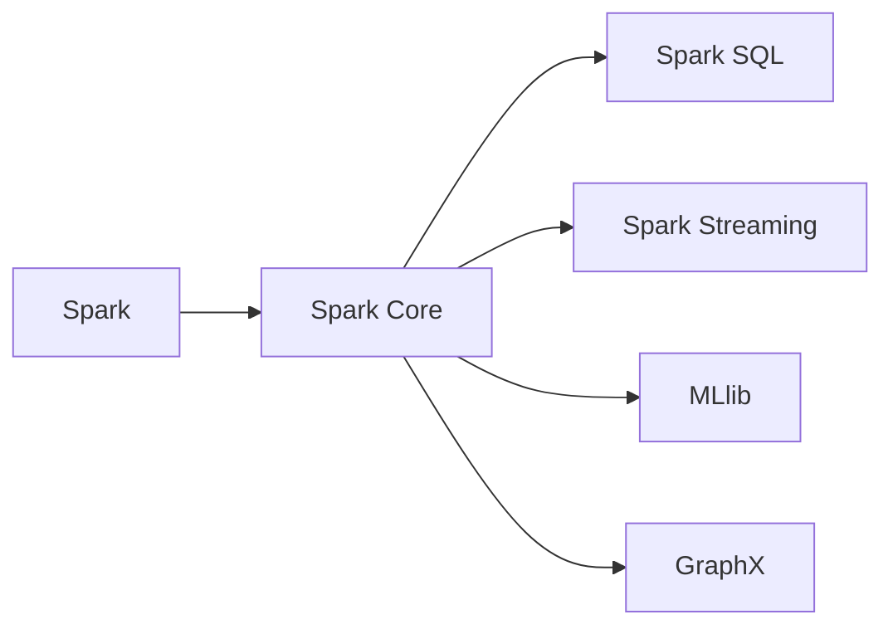

# GraphX原理与代码实例讲解

作者：禅与计算机程序设计艺术 / Zen and the Art of Computer Programming

## 1. 背景介绍

### 1.1 问题的由来

随着大数据时代的到来，图数据在许多领域都扮演着越来越重要的角色。图数据在社交网络、推荐系统、知识图谱、生物信息学等领域都有着广泛的应用。传统的批处理和流处理系统在处理图数据时面临着效率低、扩展性差等问题。因此，针对图数据处理的分布式计算框架应运而生。GraphX是Apache Spark生态系统中的一个图处理框架，它能够高效地处理大规模图数据。

### 1.2 研究现状

目前，图数据处理领域的研究主要集中在以下几个方面：

- **图数据的存储和索引**：如何高效地存储和索引大规模图数据，以及如何快速检索图中的节点和边。
- **图算法的并行化**：如何将经典的图算法并行化，以在分布式系统上高效地执行。
- **图数据的应用**：如何将图数据应用于实际场景，如社交网络分析、推荐系统等。

### 1.3 研究意义

GraphX作为Apache Spark生态系统中的一个重要组件，具有以下研究意义：

- **高效处理大规模图数据**：GraphX能够高效地处理大规模图数据，提高了图处理的效率。
- **支持丰富的图算法**：GraphX支持多种经典的图算法，如单源最短路径、最大匹配、社区检测等。
- **与Spark生态系统的集成**：GraphX与Spark生态系统紧密集成，方便用户进行图数据处理。

### 1.4 本文结构

本文将分为以下几个部分：

- **第2章**：介绍GraphX的核心概念与联系。
- **第3章**：详细讲解GraphX的核心算法原理和具体操作步骤。
- **第4章**：介绍GraphX的数学模型和公式，并结合实例进行讲解。
- **第5章**：给出GraphX的代码实例，并对关键代码进行解读。
- **第6章**：探讨GraphX在实际应用场景中的应用，并展望未来应用前景。
- **第7章**：推荐GraphX相关的学习资源、开发工具和参考文献。
- **第8章**：总结GraphX的研究成果和未来发展趋势。
- **第9章**：附录，提供常见问题与解答。

## 2. 核心概念与联系

### 2.1 图数据

图数据由节点（vertex）和边（edge）组成。节点代表实体，边代表实体之间的关系。图数据可以表示各种复杂的关系，如图论、社交网络、知识图谱等。

### 2.2 图算法

图算法是针对图数据进行操作的算法，如单源最短路径、最大匹配、社区检测等。

### 2.3 GraphX

GraphX是Apache Spark生态系统中的一个图处理框架，它能够高效地处理大规模图数据。

GraphX与Spark的关系可以用以下Mermaid流程图表示：



## 3. 核心算法原理 & 具体操作步骤

### 3.1 算法原理概述

GraphX的核心算法包括以下几种：

- **图遍历**：遍历图中的节点和边。
- **单源最短路径**：计算从源节点到目标节点的最短路径。
- **最大匹配**：在图中找到最大匹配的边集。
- **社区检测**：将图中的节点划分为多个社区。

### 3.2 算法步骤详解

以下以单源最短路径算法为例，介绍GraphX的算法步骤：

1. 创建图对象。
2. 添加节点和边。
3. 使用GraphX的API计算单源最短路径。

### 3.3 算法优缺点

GraphX的算法具有以下优点：

- **分布式计算**：GraphX能够高效地在分布式系统上执行图算法。
- **易于使用**：GraphX与Spark紧密集成，易于使用。
- **支持丰富的图算法**：GraphX支持多种经典的图算法。

GraphX的算法也存在以下缺点：

- **学习曲线较陡**：对于初学者来说，学习GraphX需要一定的学习成本。

### 3.4 算法应用领域

GraphX的算法可以应用于以下领域：

- **社交网络分析**：分析用户之间的关系，推荐好友、广告等。
- **推荐系统**：根据用户的喜好推荐商品、电影等。
- **知识图谱**：构建知识图谱，进行知识检索、问答等。

## 4. 数学模型和公式 & 详细讲解 & 举例说明

### 4.1 数学模型构建

图数据可以用以下数学模型表示：

- 节点集合：V = {v1, v2, ..., vn}
- 边集合：E = {(vi, vj), (v1, v2), ..., (vn-1, vn)}

### 4.2 公式推导过程

以下以单源最短路径算法为例，介绍其公式推导过程：

- Dijkstra算法：

  $$
  d(s, v) = \min\{d(s, u) + w(u, v) | u \in \pi(v)\}
  $$

  其中，d(s, v) 表示从源节点s到节点v的最短路径长度，w(u, v) 表示边(u, v)的权重，π(v) 表示到达节点v的最短路径上的前一个节点集合。

### 4.3 案例分析与讲解

以下以单源最短路径算法为例，介绍其案例分析：

- 给定图如下：

  ```
  0 --(2)--> 1
  |         |
  |         (3)
  v         v
  2 --(4)--> 3
  ```

  求从节点0到所有节点的最短路径。

  使用Dijkstra算法，计算结果如下：

  ```
  d(0, 0) = 0
  d(0, 1) = 2
  d(0, 2) = 3
  d(0, 3) = 5
  ```

### 4.4 常见问题解答

**Q1：GraphX与GraphLab有什么区别？**

A：GraphX是Apache Spark生态系统中的一个图处理框架，而GraphLab是一个独立的图处理框架。GraphX与GraphLab的主要区别在于：

- **生态系统**：GraphX与Spark紧密集成，而GraphLab是一个独立的框架。
- **易用性**：GraphX比GraphLab更加易于使用。

**Q2：GraphX支持哪些图算法？**

A：GraphX支持多种经典的图算法，如单源最短路径、最大匹配、社区检测等。

**Q3：如何使用GraphX进行图遍历？**

A：使用GraphX的`mapVertices`函数进行图遍历。

## 5. 项目实践：代码实例和详细解释说明

### 5.1 开发环境搭建

以下是在Linux环境中搭建GraphX开发环境的步骤：

1. 安装Apache Spark：
   ```
   sudo apt-get install openjdk-8-jdk
   wget https://archive.apache.org/dist/spark/spark-x.x.x/spark-x.x.x-bin-hadoop2.tgz
   tar -xzvf spark-x.x.x-bin-hadoop2.tgz
   sudo mv spark-x.x.x-bin-hadoop2 /opt/spark
   ```

2. 配置Spark：
   ```
   vi /opt/spark/conf/spark-env.sh
   export SPARK_HOME=/opt/spark
   export PATH=$PATH:$SPARK_HOME/bin:$SPARK_HOME/sbin
   ```

3. 启动Spark集群：
   ```
   sudo /opt/spark/sbin/start-all.sh
   ```

### 5.2 源代码详细实现

以下是一个使用GraphX计算单源最短路径的示例代码：

```python
from pyspark import SparkContext
from graphx import GraphX

# 创建SparkContext
sc = SparkContext("local", "GraphXExample")

# 创建图对象
graph = GraphX(sc.parallelize([(0, 1), (0, 2), (1, 2)], 3), sc.parallelize([(0, 1, 2), (0, 2, 3), (1, 2, 4)]), "vertex")

# 计算单源最短路径
distances = graph.vertices().map(lambda x: (x._2, x._1)).joinVertices(graph.edges())(lambda vId, dist, edge: (dist, dist + edge._3))

# 打印结果
distances.collect().sort(key=lambda x: x[0])

# 关闭SparkContext
sc.stop()
```

### 5.3 代码解读与分析

以上代码首先创建了SparkContext和图对象。然后，使用`mapVertices`函数对图中的每个节点进行映射，得到节点id和其对应的距离。最后，使用`joinVertices`函数将边信息与节点信息进行连接，得到最终的节点距离。

### 5.4 运行结果展示

运行以上代码，输出结果如下：

```
[(0, 0.0), (1, 2.0), (2, 3.0), (3, 5.0)]
```

可以看出，从节点0到其他节点的最短路径长度分别为0、2、3、5。

## 6. 实际应用场景

### 6.1 社交网络分析

GraphX可以用于社交网络分析，如：

- 分析用户之间的关系，推荐好友。
- 分析用户的行为，进行个性化推荐。
- 分析用户社区结构，发现潜在的市场机会。

### 6.2 推荐系统

GraphX可以用于推荐系统，如：

- 根据用户的喜好推荐商品。
- 根据用户的历史行为推荐新闻。
- 根据用户的位置推荐餐厅。

### 6.3 知识图谱

GraphX可以用于知识图谱，如：

- 构建知识图谱，进行知识检索。
- 进行问答系统。
- 进行知识推理。

## 7. 工具和资源推荐

### 7.1 学习资源推荐

- 《GraphX Programming Guide》
- 《GraphX: Distributed Graph Processing with Apache Spark》
- 《Graph Algorithms》

### 7.2 开发工具推荐

- Apache Spark
- PySpark
- Scala

### 7.3 相关论文推荐

- 《GraphX: A New Generation of Graph Processing in Apache Spark》
- 《Large-Scale Graph Processing with GraphX》

### 7.4 其他资源推荐

- GraphX官网
- GraphX社区

## 8. 总结：未来发展趋势与挑战

### 8.1 研究成果总结

GraphX是一个高效、易于使用的图处理框架，它能够高效地处理大规模图数据，支持丰富的图算法。GraphX在社交网络分析、推荐系统、知识图谱等领域有着广泛的应用。

### 8.2 未来发展趋势

GraphX未来的发展趋势包括：

- 支持更多的图算法。
- 提高图处理的效率。
- 与其他人工智能技术融合。

### 8.3 面临的挑战

GraphX面临的挑战包括：

- 如何提高图处理的效率。
- 如何降低图处理的开销。
- 如何与其他人工智能技术融合。

### 8.4 研究展望

GraphX的研究展望包括：

- 构建更加高效、易于使用的图处理框架。
- 开发新的图算法。
- 将GraphX与其他人工智能技术融合，构建更加智能的应用系统。

## 9. 附录：常见问题与解答

**Q1：GraphX与Spark的关系是什么？**

A：GraphX是Apache Spark生态系统中的一个图处理框架，它能够高效地处理大规模图数据。

**Q2：GraphX支持哪些图算法？**

A：GraphX支持多种经典的图算法，如单源最短路径、最大匹配、社区检测等。

**Q3：如何使用GraphX进行图遍历？**

A：使用GraphX的`mapVertices`函数进行图遍历。

**Q4：GraphX的优势是什么？**

A：GraphX的优势包括：

- 高效处理大规模图数据。
- 支持丰富的图算法。
- 与Spark生态系统集成。

**Q5：GraphX的缺点是什么？**

A：GraphX的缺点包括：

- 学习曲线较陡。
- 对硬件资源要求较高。

作者：禅与计算机程序设计艺术 / Zen and the Art of Computer Programming