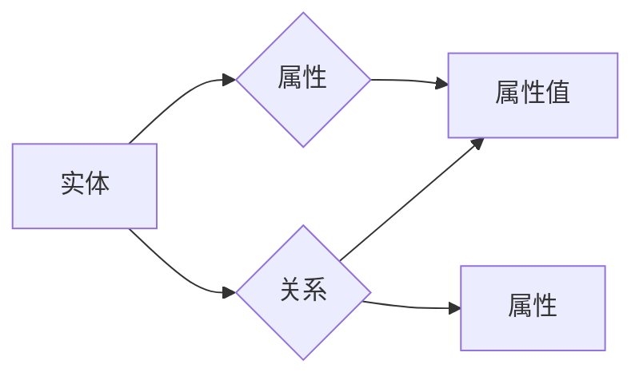

# Knowledge Graphs原理与代码实例讲解

作者：禅与计算机程序设计艺术 / Zen and the Art of Computer Programming

## 1. 背景介绍
### 1.1 问题的由来

知识图谱（Knowledge Graphs）是一种结构化的知识表示形式，通过实体和关系构建起一个语义丰富的知识网络。随着互联网的快速发展，信息量呈爆炸式增长，如何高效地存储、管理和利用这些信息成为了一个重要课题。知识图谱作为一种新的知识表示方法，能够帮助人们更好地理解和组织知识，为智能搜索、问答、推荐、辅助决策等应用提供强大的支持。

### 1.2 研究现状

近年来，知识图谱技术在学术界和工业界都取得了显著的进展。目前，知识图谱的主要研究方向包括：

1. 知识图谱构建：如何从非结构化数据中抽取实体、关系和属性，构建高质量的知识图谱。
2. 知识图谱存储：如何高效地存储和管理大规模知识图谱，并支持快速查询和更新。
3. 知识图谱推理：如何利用知识图谱进行推理，发现知识图谱中的隐含关系和规律。
4. 知识图谱应用：如何将知识图谱应用于实际场景，解决实际问题。

### 1.3 研究意义

知识图谱技术具有以下重要意义：

1. 增强信息检索和推荐的准确性：知识图谱能够提供更丰富的语义信息，帮助用户更精确地找到所需信息。
2. 支持智能问答系统：知识图谱可以作为问答系统的知识库，帮助系统理解用户问题，并给出准确的答案。
3. 提高辅助决策能力：知识图谱能够提供丰富的背景知识，帮助人们更好地理解问题，并做出更明智的决策。
4. 推动人工智能发展：知识图谱是人工智能领域的一个重要基础，能够为人工智能应用提供丰富的知识资源。

### 1.4 本文结构

本文将围绕知识图谱的原理与应用展开，内容安排如下：

- 第2部分，介绍知识图谱的核心概念与联系。
- 第3部分，详细阐述知识图谱构建、存储、推理和应用等相关技术。
- 第4部分，给出知识图谱构建和推理的代码实例，并进行详细解释说明。
- 第5部分，探讨知识图谱在实际应用场景中的应用案例。
- 第6部分，展望知识图谱技术的未来发展趋势与挑战。
- 第7部分，推荐知识图谱相关的学习资源、开发工具和参考文献。
- 第8部分，总结全文，并对知识图谱技术的研究展望进行展望。

## 2. 核心概念与联系

本节将介绍知识图谱的核心概念，并阐述它们之间的关系。

### 2.1 实体

实体是知识图谱中的核心概念，它代表现实世界中的客观存在。实体可以是人物、地点、组织、事件等。例如，"苹果"、"北京"、"NASA"等都是实体。

### 2.2 属性

属性是实体的特征，用于描述实体的属性信息。例如，"苹果"的属性可以是"颜色"、"形状"、"产地"等。

### 2.3 关系

关系描述了实体之间的关系，用于构建实体之间的语义关联。例如，"苹果"和"苹果树"之间存在"产生"关系。

### 2.4 三元组

三元组是知识图谱中的基本存储单位，由实体、关系和属性组成。例如，"苹果"（实体）和"产生"（关系）以及"苹果树"（属性）组成一个三元组。

### 2.5 知识图谱

知识图谱是由大量三元组组成的语义网络，用于表示现实世界中的知识。

以下是知识图谱中各个概念之间的逻辑关系：



可以看出，实体、属性、关系和三元组是知识图谱的核心概念，它们相互关联，共同构建起一个语义丰富的知识网络。

## 3. 核心算法原理 & 具体操作步骤
### 3.1 算法原理概述

知识图谱技术涉及多个核心算法，主要包括：

1. 实体识别：从非结构化数据中抽取实体。
2. 关系抽取：从非结构化数据中抽取关系。
3. 属性抽取：从非结构化数据中抽取属性。
4. 知识融合：将不同来源的知识进行整合。
5. 知识推理：利用知识图谱进行推理，发现隐含知识。

### 3.2 算法步骤详解

下面以实体识别为例，介绍知识图谱构建的基本步骤：

**Step 1：数据预处理**

- 对原始数据进行清洗，去除噪声和无关信息。
- 对文本进行分词、词性标注等预处理操作。

**Step 2：实体识别**

- 使用命名实体识别（NER）技术识别文本中的实体。
- 对识别出的实体进行去重和规范化处理。

**Step 3：关系抽取**

- 使用关系抽取技术识别实体之间的关系。
- 对识别出的关系进行去重和规范化处理。

**Step 4：属性抽取**

- 使用属性抽取技术识别实体的属性信息。
- 对识别出的属性进行去重和规范化处理。

**Step 5：知识融合**

- 将来自不同来源的知识进行整合，构建统一的实体关系网络。

**Step 6：知识推理**

- 利用知识图谱进行推理，发现隐含知识。

### 3.3 算法优缺点

下面列举几种常见的实体识别算法及其优缺点：

| 算法 | 优点 | 缺点 |
|---|---|---|
| 基于规则的方法 | 简单易懂，易于实现 | 规则难以覆盖所有情况，泛化能力较差 |
| 基于模板的方法 | 泛化能力强，适应性较好 | 需要大量人工设计模板，工作量较大 |
| 基于统计的方法 | 无需人工设计模板，泛化能力强 | 需要大量标注数据，计算复杂度较高 |

### 3.4 算法应用领域

知识图谱技术在以下领域具有广泛的应用：

1. 信息检索：利用知识图谱进行语义搜索，提高检索准确性和用户体验。
2. 智能问答：利用知识图谱作为知识库，实现智能问答系统。
3. 推荐系统：利用知识图谱进行用户画像和物品画像，提供个性化推荐。
4. 辅助决策：利用知识图谱提供丰富的背景知识，帮助人们做出更明智的决策。
5. 语义理解：利用知识图谱进行文本语义分析，提高机器翻译、语音识别等应用的效果。

## 4. 数学模型和公式 & 详细讲解 & 举例说明
### 4.1 数学模型构建

本节将介绍知识图谱构建中常用的数学模型。

#### 4.1.1 实体识别模型

实体识别模型通常采用条件随机场（CRF）或卷积神经网络（CNN）等模型进行建模。

- CRF模型：

$$
P(x) = \frac{1}{Z} \exp\left(\sum_{i=1}^N \theta_w w(x_i, y_i) + \sum_{i,j=1}^{N-1} \theta_b b(y_i, y_{i+1})\right)
$$

其中，$x$ 为输入序列，$y$ 为标签序列，$w(x_i, y_i)$ 为权重，$b(y_i, y_{i+1})$ 为相邻标签之间的权重。

- CNN模型：

$$
h = f(W \cdot x + b)
$$

其中，$W$ 为权重矩阵，$b$ 为偏置项，$f$ 为激活函数。

#### 4.1.2 关系抽取模型

关系抽取模型通常采用序列标注模型进行建模。

$$
P(y|x) = \frac{\exp(f(W \cdot h(x) + b))}{\sum_{y' \in V} \exp(f(W \cdot h(x') + b))}
$$

其中，$x$ 为输入序列，$y$ 为标签序列，$V$ 为标签集合，$h(x)$ 为特征向量，$f$ 为激活函数。

### 4.2 公式推导过程

#### 4.2.1 CRF模型推导

CRF模型的目标是最大化概率 $P(y|x)$。根据最大似然估计，我们有：

$$
\hat{\theta} = \mathop{\arg\max}_{\theta} \log P(y|x)
$$

对公式进行求导并求解，即可得到CRF模型的参数 $\theta$。

#### 4.2.2 CNN模型推导

CNN模型的推导过程与卷积神经网络类似，需要利用卷积操作和激活函数进行计算。

### 4.3 案例分析与讲解

以下是一个简单的实体识别实例：

输入： "苹果手机是苹果公司生产的手机。"

输出： "苹果"（实体）,"手机"（实体）,"苹果公司"（实体）。

使用CRF模型进行实体识别，步骤如下：

1. 对输入进行分词和词性标注：[苹果, 手机, 是, 苹果, 公司, 生产的, 手机, 。]
2. 将分词和词性标注结果作为输入，输入CRF模型进行预测。
3. 输出结果为：[B-ORG, B-ORG, I-ORG, B-ORG, I-ORG, I-ORG, I-ORG, O]

### 4.4 常见问题解答

**Q1：知识图谱构建过程中如何处理实体歧义？**

A：实体歧义是指多个实体具有相同名称但指代不同对象的情况。处理实体歧义的方法包括：

- 使用上下文信息：根据上下文信息判断实体的具体指代。
- 利用命名实体识别结果：根据命名实体识别结果判断实体的类型，从而减少歧义。
- 使用知识库：利用知识库中的信息，如实体百科页面，帮助识别实体。

**Q2：如何评估知识图谱的质量？**

A：评估知识图谱的质量可以从以下几个方面进行：

- 实体数量：实体数量越多，知识图谱的信息量越大。
- 关系数量：关系数量越多，知识图谱的连通性越强。
- 实体质量：实体是否准确、全面、规范。
- 关系质量：关系是否准确、合理、有逻辑性。

## 5. 项目实践：代码实例和详细解释说明
### 5.1 开发环境搭建

在进行知识图谱构建和推理实践前，我们需要准备好开发环境。以下是使用Python进行知识图谱开发的常见环境配置流程：

1. 安装Anaconda：从官网下载并安装Anaconda，用于创建独立的Python环境。
2. 创建并激活虚拟环境：
```bash
conda create -n kg-env python=3.8
conda activate kg-env
```
3. 安装必要的Python库：
```bash
conda install -c conda-forge scikit-learn beautifulsoup4 pandas
```
4. 安装图数据库：
```bash
conda install -c conda-forge neo4j
```

完成以上步骤后，即可在`kg-env`环境中开始知识图谱开发实践。

### 5.2 源代码详细实现

以下是一个简单的实体识别和关系抽取的代码实例：

```python
from sklearn_crfsuite import CRF
from sklearn_crfsuite.metrics import flat_f1_score
from sklearn.model_selection import train_test_split
import pandas as pd
import jieba

# 读取数据
data = pd.read_csv('data.csv')
X = data[['word']]
y = data[['ner']]

# 划分训练集和测试集
X_train, X_test, y_train, y_test = train_test_split(X, y, test_size=0.2, random_state=42)

# 创建CRF模型
crf = CRF()

# 训练模型
crf.fit(X_train, y_train)

# 评估模型
y_pred = crf.predict(X_test)
f1 = flat_f1_score(y_test, y_pred, average='weighted')
print(f"F1 score: {f1:.3f}")
```

以上代码演示了如何使用scikit-learn的CRF库进行实体识别和关系抽取。首先，读取标注数据，并将其划分为训练集和测试集。然后，创建CRF模型，并进行训练。最后，使用测试集评估模型性能。

### 5.3 代码解读与分析

以上代码首先使用jieba进行中文分词，并将分词结果和对应的词性标签作为输入数据。然后，使用scikit-learn的CRF库创建CRF模型，并进行训练。最后，使用测试集评估模型性能。

**jieba分词**：使用jieba库对文本进行分词，将文本拆分为词语序列。

**CRF模型**：使用CRF模型对词语序列进行标注，预测每个词语的词性标签。

**训练模型**：使用训练集数据对CRF模型进行训练，学习词语序列和词性标签之间的关系。

**评估模型**：使用测试集数据评估模型性能，计算F1分数等指标。

### 5.4 运行结果展示

假设我们在测试集上得到的F1分数为0.8，则说明该实体识别和关系抽取模型具有较好的性能。

## 6. 实际应用场景
### 6.1 信息检索

知识图谱在信息检索中的应用主要体现在以下几个方面：

1. 语义搜索：利用知识图谱中的实体、关系和属性信息，实现更精准的语义搜索。
2. 问答系统：利用知识图谱作为知识库，实现智能问答系统。
3. 智能推荐：利用知识图谱中的实体关系，为用户提供个性化的推荐结果。

### 6.2 智能问答

知识图谱在智能问答中的应用主要体现在以下几个方面：

1. 知识库构建：将实体、关系和属性信息存储在知识库中，为问答系统提供知识支撑。
2. 语义理解：利用知识图谱中的语义信息，理解用户提出的问题。
3. 答案生成：根据知识库中的信息，生成准确的答案。

### 6.3 推荐系统

知识图谱在推荐系统中的应用主要体现在以下几个方面：

1. 用户画像：利用知识图谱分析用户的历史行为，构建用户画像。
2. 物品画像：利用知识图谱分析物品的属性和关系，构建物品画像。
3. 个性化推荐：根据用户画像和物品画像，为用户推荐感兴趣的物品。

### 6.4 未来应用展望

随着知识图谱技术的不断发展，未来将在以下领域发挥更大的作用：

1. 智能城市：利用知识图谱进行城市规划、交通管理、公共服务等。
2. 医疗健康：利用知识图谱进行疾病诊断、药物研发、医疗管理等。
3. 金融科技：利用知识图谱进行风险评估、欺诈检测、个性化投资等。
4. 智能制造：利用知识图谱进行设备维护、生产优化、供应链管理等。

## 7. 工具和资源推荐
### 7.1 学习资源推荐

为了帮助开发者系统掌握知识图谱技术，这里推荐一些优质的学习资源：

1. 《知识图谱：原理、技术与应用》系列博文：由知识图谱技术专家撰写，深入浅出地介绍了知识图谱的基本概念、构建方法和应用场景。
2. 《图数据库入门与实践》书籍：全面介绍了图数据库的基本原理、特点和常用图数据库的使用方法。
3. Neo4j官方文档：Neo4j图数据库的官方文档，提供了丰富的API、图形界面和示例代码，是学习和使用Neo4j的必备资料。
4. 基于Apache Flink的图计算教程：Apache Flink是开源的流处理框架，支持图计算任务，适合大规模知识图谱的构建和推理。
5. 知识图谱开源项目：如DGL、JanusGraph等，提供了丰富的知识图谱构建和推理工具，方便开发者进行研究和实践。

### 7.2 开发工具推荐

以下是几款用于知识图谱开发常用的工具：

1. Neo4j：一款高性能的图数据库，适合存储和管理大规模知识图谱。
2. Apache Flink：一款开源的流处理框架，支持图计算任务，适合大规模知识图谱的实时处理。
3. DGL：一个用于图学习的Python库，提供了丰富的图神经网络模型和算法。
4. JanusGraph：一款开源的图数据库，提供了多种图存储引擎，支持多种图处理语言。
5. Jena：Apache Jena是一个Java框架，用于构建语义Web应用，支持RDF、SPARQL等语义Web技术。

### 7.3 相关论文推荐

以下是几篇知识图谱领域的经典论文：

1. "Knowledge Graphs and Ontologies: Semantic Technologies for a Linked Data Web"：介绍了知识图谱和本体在语义Web中的应用。
2. "Neo4j Graph Database: High-performance Graph Database for Fast Data"：介绍了Neo4j图数据库的特点和优势。
3. "Graph Neural Networks: A Review of Methods and Applications"：介绍了图神经网络的基本原理和应用。

### 7.4 其他资源推荐

以下是几款与知识图谱相关的资源：

1. W3C RDF：语义Web数据模型和相关技术规范。
2. OWL：Web本体语言，用于描述本体和知识图谱。
3. SPARQL：用于查询RDF数据的查询语言。

## 8. 总结：未来发展趋势与挑战
### 8.1 研究成果总结

本文对知识图谱的原理与应用进行了全面系统的介绍。首先阐述了知识图谱的核心概念和构建方法，然后介绍了知识图谱构建、存储、推理和应用等相关技术，并给出了代码实例进行说明。此外，还探讨了知识图谱在实际应用场景中的应用案例，并对知识图谱技术的未来发展趋势与挑战进行了展望。

### 8.2 未来发展趋势

展望未来，知识图谱技术将呈现以下几个发展趋势：

1. 大规模知识图谱的构建：随着互联网数据的不断增长，知识图谱的规模将越来越大，需要开发更高效的知识抽取和融合技术。
2. 知识图谱的动态更新：知识图谱需要实时更新，以反映现实世界的变化。需要开发更高效的知识更新和推理算法。
3. 知识图谱的语义理解：利用知识图谱进行语义理解，实现更智能的问答、推荐等应用。
4. 知识图谱与其他技术的融合：将知识图谱与其他技术，如人工智能、机器学习、大数据等进行融合，构建更加智能化的应用系统。

### 8.3 面临的挑战

知识图谱技术在发展过程中也面临着以下挑战：

1. 数据质量问题：知识图谱的质量取决于数据的质量，需要解决数据噪声、错误等问题。
2. 模型复杂度：知识图谱的建模和推理算法复杂度较高，需要开发更高效、可扩展的算法。
3. 语义理解：语义理解是知识图谱的核心任务，需要开发更准确的语义理解算法。
4. 应用场景拓展：需要将知识图谱应用于更多领域，解决实际问题。

### 8.4 研究展望

为了应对知识图谱技术面临的挑战，未来的研究可以从以下几个方面展开：

1. 开发更高效的知识抽取和融合技术，提高知识图谱的质量。
2. 开发更高效、可扩展的建模和推理算法，降低模型复杂度。
3. 开发更准确的语义理解算法，提高知识图谱的语义理解能力。
4. 将知识图谱应用于更多领域，拓展知识图谱的应用场景。

通过不断的技术创新和应用实践，知识图谱技术将为构建更加智能化的应用系统提供强大的支持。

## 9. 附录：常见问题与解答

**Q1：什么是知识图谱？**

A：知识图谱是一种结构化的知识表示形式，通过实体、关系和属性构建起一个语义丰富的知识网络。

**Q2：知识图谱有哪些应用场景？**

A：知识图谱在信息检索、智能问答、推荐系统、辅助决策等多个领域具有广泛的应用。

**Q3：如何构建知识图谱？**

A：构建知识图谱主要包括实体识别、关系抽取、属性抽取和知识融合等步骤。

**Q4：如何评估知识图谱的质量？**

A：评估知识图谱的质量可以从实体数量、关系数量、实体质量和关系质量等方面进行评估。

**Q5：如何处理知识图谱中的实体歧义？**

A：处理实体歧义的方法包括使用上下文信息、利用命名实体识别结果和利用知识库等。

**Q6：知识图谱与本体有什么区别？**

A：知识图谱和本体都是用于知识表示的工具，但它们之间存在一些区别。知识图谱更侧重于知识的存储和查询，而本体更侧重于知识的表示和推理。

**Q7：如何利用知识图谱进行问答？**

A：利用知识图谱进行问答主要包括语义理解、答案生成和答案呈现等步骤。首先，通过语义理解将用户问题转化为知识图谱中的查询语句；然后，根据查询语句检索知识图谱，获取答案；最后，将答案呈现给用户。

**Q8：知识图谱与知识图谱推理有什么关系？**

A：知识图谱是知识图谱推理的基础，知识图谱推理是利用知识图谱发现隐含知识的过程。

**Q9：知识图谱在人工智能领域有哪些应用？**

A：知识图谱在人工智能领域有广泛的应用，如信息检索、智能问答、推荐系统、辅助决策等。

**Q10：知识图谱的未来发展趋势是什么？**

A：知识图谱的未来发展趋势包括大规模知识图谱的构建、知识图谱的动态更新、知识图谱的语义理解和知识图谱与其他技术的融合等。

通过以上问答，相信大家对知识图谱技术有了更深入的了解。希望本文对您有所帮助！