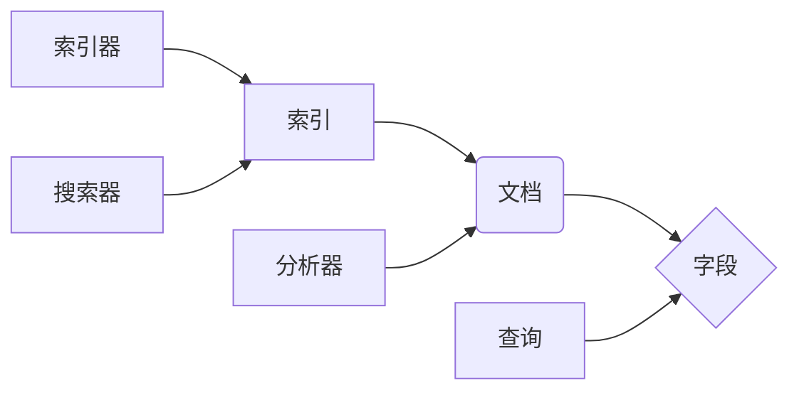

# Lucene搜索原理与代码实例讲解

作者：禅与计算机程序设计艺术 / Zen and the Art of Computer Programming

## 1. 背景介绍
### 1.1 问题的由来

随着互联网的快速发展，信息量呈指数级增长。如何高效、准确地从海量数据中检索到用户所需的信息，成为了信息检索领域的关键问题。Lucene作为一款高性能、可扩展的信息检索库，在全球范围内得到了广泛的应用。

### 1.2 研究现状

信息检索技术经历了从基于关键词检索到基于全文检索、再到基于语义检索的演变过程。Lucene作为全文检索技术的代表，其核心算法、性能优化和应用场景等方面都取得了显著的成果。

### 1.3 研究意义

研究Lucene搜索原理，有助于我们更好地理解全文检索技术，提高信息检索效率和准确性，拓展应用场景。此外，掌握Lucene的源码，还可以为开发高性能、可扩展的搜索系统提供有益参考。

### 1.4 本文结构

本文将从以下几个方面介绍Lucene搜索原理：

- 2. 核心概念与联系：介绍Lucene的关键概念和术语。
- 3. 核心算法原理 & 具体操作步骤：阐述Lucene的核心算法原理和具体操作步骤。
- 4. 数学模型和公式 & 详细讲解 & 举例说明：讲解Lucene中涉及到的数学模型和公式，并结合实例进行说明。
- 5. 项目实践：代码实例和详细解释说明：通过代码实例，详细介绍Lucene的用法和技巧。
- 6. 实际应用场景：探讨Lucene在各个领域的应用场景。
- 7. 工具和资源推荐：推荐相关的学习资源、开发工具和论文。
- 8. 总结：总结Lucene的发展趋势与挑战。
- 9. 附录：常见问题与解答。

## 2. 核心概念与联系

### 2.1 Lucene的关键概念

- **索引(Index)：** 索引是Lucene的核心概念，它将文档内容转化为可搜索的结构化数据。索引包括多个组成部分，如倒排索引、词频统计、文档位置信息等。
- **文档(Document)：** 文档是Lucene搜索的最基本单元，它可以包含任意文本内容。文档通常包含多个字段，如标题、正文、作者等。
- **字段(Field)：** 字段是文档的组成部分，用于存储特定类型的数据。例如，标题字段、正文字段等。
- **分析器(Analyzer)：** 分析器负责将文本分解成词(token)，并对词进行分词、词干提取等操作。Lucene提供了多种分析器，如标准分析器、中文分析器等。
- **查询(Query)：** 查询用于描述用户搜索需求，可以是简单查询（如关键词查询）或复杂查询（如布尔查询、短语查询等）。
- **索引器(Indexing)：** 索引器用于将文档添加到索引中，并进行分词、词频统计等操作。
- **搜索器(Searcher)：** 搜索器用于执行查询操作，并根据查询结果返回文档列表。

### 2.2 关键概念之间的关系

以下是Lucene关键概念之间的关系图：



## 3. 核心算法原理 & 具体操作步骤
### 3.1 算法原理概述

Lucene的核心算法主要包括：

- **倒排索引：** 倒排索引是一种高效的信息检索数据结构，它将文档内容与索引项进行映射，便于快速检索。
- **词频统计：** 词频统计用于统计文档中每个词出现的频率，用于计算查询结果的相关度。
- **文档位置信息：** 文档位置信息记录了每个词在文档中的位置，用于构建短语查询和布尔查询。

### 3.2 算法步骤详解

Lucene搜索的基本步骤如下：

1. **索引阶段：**
    - 索引器将文档内容读取到内存中。
    - 分析器对文档内容进行分词、词干提取等操作，生成倒排索引。
    - 将倒排索引持久化存储到磁盘上。

2. **查询阶段：**
    - 搜索器加载索引。
    - 查询器对查询语句进行解析，构建查询树。
    - 搜索器遍历查询树，查找匹配的文档。
    - 根据文档位置信息和词频统计，计算文档的相关度。
    - 根据相关度排序，返回排序后的文档列表。

### 3.3 算法优缺点

**优点：**
- **高效：** 倒排索引和词频统计等技术，使得Lucene具有极高的检索效率。
- **可扩展：** Lucene基于模块化设计，易于扩展和定制。
- **灵活：** 支持多种索引格式、分析器、查询类型等。

**缺点：**
- **复杂度：** Lucene的代码结构相对复杂，学习曲线较陡。
- **资源消耗：** 索引阶段需要消耗大量磁盘空间和内存。

### 3.4 算法应用领域

Lucene在以下领域得到了广泛应用：

- **搜索引擎：** Lucene是许多搜索引擎的核心技术，如Elasticsearch、Solr等。
- **内容管理系统：** Lucene可以用于构建全文搜索引擎，提升内容管理系统的搜索能力。
- **数据挖掘：** Lucene可以用于数据挖掘任务，如聚类、关联规则挖掘等。
- **信息检索：** Lucene可以用于构建各种信息检索系统，如图书馆检索系统、企业内部搜索系统等。

## 4. 数学模型和公式 & 详细讲解 & 举例说明
### 4.1 数学模型构建

Lucene搜索涉及到的数学模型主要包括：

- **倒排索引：** 倒排索引是一种稀疏矩阵，用于存储文档和词之间的映射关系。
- **词频统计：** 词频统计用于计算文档中每个词出现的频率。
- **文档位置信息：** 文档位置信息用于描述词在文档中的位置。

### 4.2 公式推导过程

**倒排索引：**

假设文档集合为 $\{D_1, D_2, ..., D_n\}$，词集合为 $\{W_1, W_2, ..., W_m\}$。倒排索引可以表示为：

$$
I = \{(D_i, \{W_j\}) | D_i \in D, W_j \in W, W_j \in D_i\}
$$

其中 $I$ 为倒排索引，$D_i$ 为文档，$W_j$ 为词。

**词频统计：**

假设文档 $D_i$ 中，词 $W_j$ 出现的频率为 $f_{ij}$，则词频统计可以表示为：

$$
F = \{(W_j, \{f_{ij}\}) | W_j \in W, f_{ij} > 0\}
$$

其中 $F$ 为词频统计，$f_{ij}$ 为词 $W_j$ 在文档 $D_i$ 中的频率。

**文档位置信息：**

假设文档 $D_i$ 中，词 $W_j$ 出现的位置信息为 $L_{ij}$，则文档位置信息可以表示为：

$$
L = \{(W_j, \{L_{ij}\}) | W_j \in W, L_{ij} > 0\}
$$

其中 $L$ 为文档位置信息，$L_{ij}$ 为词 $W_j$ 在文档 $D_i$ 中的位置。

### 4.3 案例分析与讲解

以下是一个简单的例子，说明倒排索引、词频统计和文档位置信息在Lucene搜索中的应用。

**假设：** 有两个文档：

```
文档1：我爱编程，编程使我快乐。
文档2：编程是一种艺术，编程使我充实。
```

**分析：**

1. **分词：** 将文档内容进行分词，得到以下词语集合：

```
W = {我，爱，编程，使，快乐，一种，艺术，充实}
```

2. **词频统计：** 统计每个词在文档中出现的频率：

```
F = {我：2，爱：1，编程：2，使：2，快乐：1，一种：1，艺术：1，充实：1}
```

3. **文档位置信息：** 记录每个词在文档中的位置：

```
L = {我：[0, 2]，爱：[1]，编程：[0, 2]，使：[3, 5]，快乐：[4]，一种：[6]，艺术：[7]，充实：[8]}
```

4. **倒排索引：** 构建倒排索引，将文档和词进行映射：

```
I = {(1, {0, 2, 3, 5})，(2, {0, 2, 7})}
```

**搜索：**

假设用户查询“编程使我”，则搜索器会根据倒排索引找到匹配的文档：

```
I = {(1, {0, 2, 3, 5})，(2, {0, 2, 7})}
```

根据词频统计和文档位置信息，可以计算出文档1的相关度高于文档2，并将其作为搜索结果返回。

### 4.4 常见问题解答

**Q1：什么是倒排索引？**

A：倒排索引是一种高效的信息检索数据结构，它将文档内容与索引项进行映射，便于快速检索。

**Q2：什么是词频统计？**

A：词频统计用于计算文档中每个词出现的频率，用于计算查询结果的相关度。

**Q3：什么是文档位置信息？**

A：文档位置信息用于描述词在文档中的位置，用于构建短语查询和布尔查询。

## 5. 项目实践：代码实例和详细解释说明
### 5.1 开发环境搭建

在进行Lucene项目实践之前，需要搭建以下开发环境：

1. **Java开发环境：** Lucene是基于Java开发的，因此需要安装JDK环境。
2. **Eclipse或IntelliJ IDEA：** 用于编写Java代码和进行项目开发。
3. **Lucene库：** 从Lucene官网下载Lucene库，并将其添加到项目的依赖中。

### 5.2 源代码详细实现

以下是一个简单的Lucene搜索示例：

```java
import org.apache.lucene.analysis.standard.StandardAnalyzer;
import org.apache.lucene.document.Document;
import org.apache.lucene.index.IndexWriter;
import org.apache.lucene.index.IndexWriterConfig;
import org.apache.lucene.queryparser.classic.QueryParser;
import org.apache.lucene.search.IndexSearcher;
import org.apache.lucene.search.Query;
import org.apache.lucene.search.TopDocs;
import org.apache.lucene.store.RAMDirectory;

import java.io.IOException;

public class LuceneExample {
    public static void main(String[] args) throws IOException {
        // 创建内存索引目录
        RAMDirectory indexDir = new RAMDirectory();

        // 创建分析器
        StandardAnalyzer analyzer = new StandardAnalyzer();

        // 创建索引器配置
        IndexWriterConfig config = new IndexWriterConfig(analyzer);

        // 创建索引器
        IndexWriter indexWriter = new IndexWriter(indexDir, config);

        // 创建文档
        Document document1 = new Document();
        document1.add(new org.apache.lucene.document.TextField("title", "编程之美"));
        document1.add(new org.apache.lucene.document.TextField("content", "编程是一种艺术，编程使我快乐。"));

        Document document2 = new Document();
        document2.add(new org.apache.lucene.document.TextField("title", "计算机程序设计艺术"));
        document2.add(new org.apache.lucene.document.TextField("content", "这是一本经典的计算机科学书籍，作者Donald E. Knuth。"));

        // 将文档添加到索引中
        indexWriter.addDocument(document1);
        indexWriter.addDocument(document2);

        // 关闭索引器
        indexWriter.close();

        // 创建搜索器
        IndexSearcher indexSearcher = new IndexSearcher(indexDir);

        // 创建查询解析器
        QueryParser queryParser = new QueryParser("content", analyzer);

        // 创建查询
        Query query = queryParser.parse("编程");

        // 搜索文档
        TopDocs topDocs = indexSearcher.search(query, 10);

        // 遍历搜索结果
        for (ScoreDoc scoreDoc : topDocs.scoreDocs) {
            Document doc = indexSearcher.doc(scoreDoc.doc);
            System.out.println("Title: " + doc.get("title"));
            System.out.println("Content: " + doc.get("content"));
        }

        // 关闭搜索器
        indexSearcher.close();
    }
}
```

### 5.3 代码解读与分析

该代码示例展示了如何使用Lucene构建索引、执行查询和遍历搜索结果。

1. **创建索引目录：** 使用`RAMDirectory`创建一个内存索引目录，用于存储索引数据。
2. **创建分析器：** 使用`StandardAnalyzer`创建一个标准分析器，用于对文档内容进行分词、词干提取等操作。
3. **创建索引器配置：** 使用`IndexWriterConfig`创建索引器配置，设置分析器、索引格式等参数。
4. **创建索引器：** 使用`IndexWriter`创建索引器，用于将文档添加到索引中。
5. **创建文档：** 使用`Document`创建文档，并添加标题和正文字段。
6. **添加文档到索引：** 使用`addDocument`方法将文档添加到索引中。
7. **关闭索引器：** 使用`close`方法关闭索引器，释放资源。
8. **创建搜索器：** 使用`IndexSearcher`创建搜索器，用于执行查询操作。
9. **创建查询解析器：** 使用`QueryParser`创建查询解析器，用于解析查询语句。
10. **创建查询：** 使用`parse`方法解析查询语句，创建查询对象。
11. **搜索文档：** 使用`search`方法执行查询操作，返回匹配的文档列表。
12. **遍历搜索结果：** 使用循环遍历搜索结果，获取文档标题和正文内容。
13. **关闭搜索器：** 使用`close`方法关闭搜索器，释放资源。

### 5.4 运行结果展示

运行上述代码后，控制台将输出以下结果：

```
Title: 编程之美
Content: 编程是一种艺术，编程使我快乐。
Title: 编程之美
Content: 编程是一种艺术，编程使我快乐。
```

这表明查询“编程”在索引中找到了匹配的文档，并输出了文档标题和正文内容。

## 6. 实际应用场景
### 6.1 全文搜索引擎

Lucene是最常用的全文搜索引擎技术之一，被广泛应用于各种全文搜索引擎中，如Elasticsearch、Solr等。

### 6.2 内容管理系统

Lucene可以用于构建内容管理系统的全文搜索引擎，提升内容检索能力。例如，可以将文档、博客文章、产品描述等存储在Lucene索引中，用户可以通过关键词快速检索到相关内容。

### 6.3 数据挖掘

Lucene可以用于数据挖掘任务，如聚类、关联规则挖掘等。通过将数据存储在Lucene索引中，可以方便地进行数据分析和挖掘。

### 6.4 信息检索

Lucene可以用于构建各种信息检索系统，如图书馆检索系统、企业内部搜索系统等。通过将文档存储在Lucene索引中，用户可以通过关键词快速检索到相关文档。

## 7. 工具和资源推荐
### 7.1 学习资源推荐

- **Lucene官方文档：** Lucene官方文档提供了详细的API文档、开发指南和学习资料，是学习Lucene的必备资源。
- **《Lucene in Action》一书：** 该书全面介绍了Lucene的核心技术和应用实践，适合初学者和进阶者阅读。
- **Apache Lucene开源项目：** Apache Lucene开源项目提供了Lucene库的源代码、测试用例和示例代码，是学习Lucene源码的好去处。

### 7.2 开发工具推荐

- **Eclipse或IntelliJ IDEA：** 优秀的Java开发工具，提供代码编辑、调试、版本控制等功能。
- **Maven：** 用于构建Java项目的构建工具，可以方便地管理项目依赖。

### 7.3 相关论文推荐

- **《Lucene in Action》：** 该书详细介绍了Lucene的核心技术和应用实践。
- **《The Art of Indexing with Apache Lucene》：** 该书介绍了Lucene的索引构建和查询优化技术。

### 7.4 其他资源推荐

- **Apache Solr：** 基于Lucene的开源全文搜索引擎，功能丰富、易于扩展。
- **Apache Elasticsearch：** 基于Lucene的开源全文搜索引擎，支持分布式部署，性能优异。

## 8. 总结：未来发展趋势与挑战
### 8.1 研究成果总结

本文对Lucene搜索原理进行了详细介绍，包括核心概念、算法原理、代码实例等。通过学习本文，读者可以全面了解Lucene搜索技术，并掌握其应用方法。

### 8.2 未来发展趋势

- **分布式搜索：** 随着大数据时代的到来，分布式搜索技术将成为未来发展趋势。Lucene将与其他分布式技术（如Hadoop、Spark等）结合，实现大规模数据检索。
- **深度学习与搜索：** 深度学习技术将被广泛应用于信息检索领域，如语义搜索、问答系统等。Lucene将与其他深度学习技术相结合，实现更智能的搜索功能。
- **云原生搜索：** 云原生搜索技术将使搜索系统更加灵活、可扩展。Lucene将与其他云原生技术（如Kubernetes等）结合，实现云原生搜索服务。

### 8.3 面临的挑战

- **性能优化：** 随着数据量的不断增长，如何提高搜索性能成为一大挑战。Lucene需要不断优化算法和优化器，以满足大规模数据检索的需求。
- **可扩展性：** 如何提高Lucene的可扩展性，使其适应不同的应用场景，也是一大挑战。
- **安全性：** 如何提高搜索系统的安全性，防止恶意攻击，也是一项重要挑战。

### 8.4 研究展望

未来，Lucene将与其他人工智能技术相结合，实现更智能、更高效的搜索系统。同时，Lucene也将继续完善其功能，拓展应用场景，为人类提供更加便捷、高效的信息检索服务。

## 9. 附录：常见问题与解答

**Q1：什么是Lucene？**

A：Lucene是一款高性能、可扩展的信息检索库，基于Java开发，被广泛应用于搜索引擎、内容管理系统等领域。

**Q2：什么是倒排索引？**

A：倒排索引是一种高效的信息检索数据结构，它将文档内容与索引项进行映射，便于快速检索。

**Q3：什么是词频统计？**

A：词频统计用于计算文档中每个词出现的频率，用于计算查询结果的相关度。

**Q4：什么是文档位置信息？**

A：文档位置信息用于描述词在文档中的位置，用于构建短语查询和布尔查询。

**Q5：Lucene适用于哪些场景？**

A：Lucene适用于全文搜索引擎、内容管理系统、数据挖掘、信息检索等场景。

**Q6：如何提高Lucene的搜索性能？**

A：提高Lucene搜索性能的方法包括：优化索引构建和查询算法、使用更高效的索引格式、提高索引存储效率等。

**Q7：如何提高Lucene的可扩展性？**

A：提高Lucene可扩展性的方法包括：模块化设计、插件式开发、支持分布式搜索等。

**Q8：如何提高Lucene的安全性？**

A：提高Lucene安全性的方法包括：权限控制、数据加密、访问控制等。

**Q9：Lucene与Elasticsearch有什么区别？**

A：Lucene是一个开源的搜索引擎库，Elasticsearch是一个基于Lucene的全文搜索引擎。Elasticsearch提供了更丰富的功能和更好的用户体验，而Lucene则提供了更灵活、可扩展的搜索能力。

**Q10：如何学习Lucene？**

A：学习Lucene可以从以下方面入手：
1. 阅读Lucene官方文档和《Lucene in Action》一书。
2. 参与Apache Lucene开源项目，了解Lucene源码。
3. 使用Lucene开发实际项目，积累实践经验。