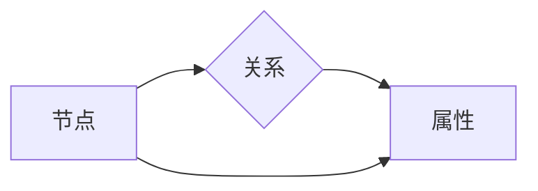

# Neo4j原理与代码实例讲解

作者：禅与计算机程序设计艺术 / Zen and the Art of Computer Programming

## 1. 背景介绍

### 1.1 问题的由来

随着信息技术的飞速发展，数据量和数据复杂度不断增长，传统的数据库技术逐渐无法满足现代应用的需求。图数据库作为一种新兴的数据库技术，能够以图的形式存储、查询和分析复杂数据关系，成为解决复杂数据关系管理问题的理想选择。Neo4j作为当前最流行的图数据库之一，拥有强大的功能和高效的性能，被广泛应用于社交网络、知识图谱、推荐系统等领域。

### 1.2 研究现状

近年来，图数据库技术发展迅速，涌现出许多优秀的图数据库产品，如Neo4j、ArangoDB、JanusGraph等。其中，Neo4j凭借其高性能、易用性和丰富的生态系统，在图数据库领域占据了领先地位。

### 1.3 研究意义

研究Neo4j的原理和应用，对于深入理解图数据库技术、开发高效的数据管理应用具有重要意义。

- **数据关系管理**：Neo4j能够以图的形式存储和管理复杂的数据关系，为解决现实世界中的数据关系问题提供有效途径。
- **高效查询**：Neo4j基于Cypher查询语言，能够高效地执行复杂的图查询，满足实时数据分析和决策需求。
- **生态系统**：Neo4j拥有丰富的生态系统，包括图形化界面、API接口、插件和工具等，为开发者提供便捷的开发体验。

### 1.4 本文结构

本文将详细介绍Neo4j的原理、应用场景和代码实例，内容安排如下：

- 第2部分，介绍Neo4j的核心概念和图模型。
- 第3部分，阐述Neo4j的存储引擎、索引机制和查询语言Cypher。
- 第4部分，展示Neo4j的代码实例和实际应用场景。
- 第5部分，探讨Neo4j的未来发展趋势和挑战。

## 2. 核心概念与联系

### 2.1 图模型

图模型是图数据库的核心概念，它以节点（Node）、关系（Relationship）和属性（Property）的形式表示数据。

- **节点**：表示图中的实体，例如人、物、地点等。
- **关系**：表示节点之间的关系，例如朋友、同事、拥有等。
- **属性**：表示节点或关系的额外信息，例如姓名、年龄、工资等。

图模型通过节点、关系和属性之间的关系，构建起复杂的数据关系网络。

### 2.2 核心概念联系

以下是图模型中几个核心概念之间的联系：



节点与关系通过边连接，属性可以附加到节点或关系上，丰富数据信息。

## 3. 核心算法原理 & 具体操作步骤

### 3.1 算法原理概述

Neo4j的核心算法包括存储引擎、索引机制和查询语言Cypher。

- **存储引擎**：Neo4j采用基于磁盘的存储引擎，将图数据存储在磁盘上的存储单元中，并通过内存中的索引机制进行快速查询。
- **索引机制**：Neo4j使用B-Tree索引和Lucene全文索引，对节点、关系和属性进行索引，提高查询效率。
- **查询语言Cypher**：Cypher是一种声明式查询语言，用于在图数据库中执行节点、关系和属性的查询操作。

### 3.2 算法步骤详解

#### 3.2.1 存储引擎

Neo4j的存储引擎主要包含以下步骤：

1. **数据持久化**：将图数据存储在磁盘上的存储单元中，包括节点、关系和属性。
2. **内存索引**：在内存中建立节点、关系和属性的索引，提高查询效率。
3. **磁盘缓存**：将常用的数据缓存到内存中，减少磁盘I/O操作。
4. **事务管理**：使用事务确保数据的一致性和完整性。

#### 3.2.2 索引机制

Neo4j使用B-Tree索引和Lucene全文索引对节点、关系和属性进行索引。

- **B-Tree索引**：对节点、关系和属性的键值进行索引，支持快速查找。
- **Lucene全文索引**：对节点、关系和属性的文本内容进行索引，支持全文检索。

#### 3.2.3 查询语言Cypher

Cypher是一种声明式查询语言，用于在图数据库中执行节点、关系和属性的查询操作。

- **声明式查询**：用户以自然语言描述查询意图，由Cypher查询解析器将查询翻译为图遍历算法。
- **图遍历**：根据查询条件，在图数据库中遍历节点、关系和属性，收集查询结果。
- **结果输出**：将查询结果以图形或表格形式输出。

### 3.3 算法优缺点

Neo4j的核心算法具有以下优点：

- **高效查询**：基于磁盘的存储引擎和内存索引，使查询操作更加高效。
- **易用性**：Cypher查询语言简洁易懂，易于学习和使用。
- **扩展性**：支持自定义索引和插件，满足特定需求。

然而，Neo4j的核心算法也存在以下缺点：

- **存储空间**：由于图数据的存储结构，可能导致存储空间占用较大。
- **并发性能**：在高并发环境下，Neo4j的并发性能可能受到影响。

### 3.4 算法应用领域

Neo4j的核心算法在以下应用领域表现出色：

- **社交网络**：分析用户关系、推荐朋友、识别社区等。
- **知识图谱**：构建领域知识图谱、查询图谱数据、推荐相关内容等。
- **推荐系统**：根据用户兴趣推荐商品、新闻等。
- **欺诈检测**：识别欺诈行为、预防风险等。

## 4. 数学模型和公式 & 详细讲解 & 举例说明

### 4.1 数学模型构建

Neo4j的数学模型主要包括图模型和Cypher查询语言。

#### 4.1.1 图模型

图模型由节点、关系和属性组成，可以表示为：

$$
G = (V, E, P)
$$

其中，$V$ 为节点集合，$E$ 为关系集合，$P$ 为属性集合。

#### 4.1.2 Cypher查询语言

Cypher查询语言用于在图数据库中执行节点、关系和属性的查询操作，可以表示为：

$$
MATCH (n {label: "Person"}) WHERE n.name = "Alice" RETURN n
$$

该查询表示在标签为“Person”的节点中，查找名为“Alice”的节点。

### 4.2 公式推导过程

Neo4j的数学模型和Cypher查询语言相对简单，主要基于图论和自然语言处理的理论。

### 4.3 案例分析与讲解

以下是一个简单的Cypher查询实例，分析其执行过程：

```cypher
MATCH (p:Person {name: "Alice"})-[:FRIEND]->(f)
RETURN p.name, f.name
```

该查询表示找到名为“Alice”的人的朋友，并返回他们的名字。

执行过程如下：

1. 在Person标签的节点中，查找名为“Alice”的节点。
2. 从该节点出发，查找所有FRIEND关系。
3. 返回Alice的朋友名字。

### 4.4 常见问题解答

**Q1：Neo4j如何处理大量数据？**

A：Neo4j采用基于磁盘的存储引擎，将数据存储在磁盘上的存储单元中，并通过内存中的索引机制进行快速查询。此外，Neo4j支持集群部署，可以水平扩展存储和处理能力。

**Q2：Cypher查询语言如何提高效率？**

A：Cypher查询语言经过优化，能够高效地执行图遍历操作。此外，Neo4j支持索引和约束，可以提高查询效率。

**Q3：Neo4j与关系数据库有什么区别？**

A：关系数据库以表的形式存储数据，而Neo4j以图的形式存储数据。关系数据库适用于存储结构化数据，而Neo4j适用于存储复杂的数据关系。

## 5. 项目实践：代码实例和详细解释说明

### 5.1 开发环境搭建

要使用Neo4j，需要先安装Neo4j数据库和Cypher查询语言。

1. 下载Neo4j官方安装包，并按照官方教程进行安装。
2. 安装Neo4j Desktop，用于图形化操作Neo4j数据库。
3. 安装Neo4j驱动程序，如Neo4j Python Driver。

### 5.2 源代码详细实现

以下是一个使用Neo4j Python Driver连接数据库、创建节点、创建关系和查询数据的示例：

```python
from neo4j import GraphDatabase

class Neo4jExample:
    def __init__(self, uri, user, password):
        self.driver = GraphDatabase.driver(uri, auth=(user, password))

    def close(self):
        self.driver.close()

    def create_node(self, label, **kwargs):
        with self.driver.session() as session:
            session.run("CREATE (n:%s $props)", (label,), kwargs)

    def create_relationship(self, start_node, end_node, relationship_type, **kwargs):
        with self.driver.session() as session:
            session.run("MATCH (a:%s), (b:%s) CREATE (a)-[r:%s $props]->(b)", (start_node, end_node, relationship_type), kwargs)

    def query(self, query):
        with self.driver.session() as session:
            return session.run(query)

if __name__ == "__main__":
    neo4j_example = Neo4jExample("bolt://localhost:7687", "neo4j", "password")

    # 创建节点
    neo4j_example.create_node("Person", name="Alice", age=30)
    neo4j_example.create_node("Person", name="Bob", age=25)
    neo4j_example.create_node("Person", name="Charlie", age=35)

    # 创建关系
    neo4j_example.create_relationship("Alice", "Bob", "FRIEND", friend_since="2021-01-01")
    neo4j_example.create_relationship("Bob", "Charlie", "FRIEND", friend_since="2020-01-01")

    # 查询数据
    result = neo4j_example.query("MATCH (n:Person {name: 'Alice'})-[:FRIEND]->(friend) RETURN n.name, friend.name")
    for record in result:
        print(record["n.name"], record["friend.name"])

    neo4j_example.close()
```

### 5.3 代码解读与分析

该示例首先创建了三个Person节点，然后创建了Alice和Bob、Bob和Charlie之间的FRIEND关系。最后，查询了Alice的朋友名字，并打印输出。

代码中，首先创建了一个Neo4jExample类，该类包含连接数据库、创建节点、创建关系和查询数据的函数。

- `create_node`函数：创建一个指定标签的节点，并添加属性。
- `create_relationship`函数：创建两个节点之间的指定类型的关系，并添加属性。
- `query`函数：执行Cypher查询，并返回查询结果。

在主函数中，首先创建了一个Neo4jExample实例，然后创建节点、关系和查询数据。最后，关闭数据库连接。

### 5.4 运行结果展示

运行上述代码后，输出结果为：

```
Alice Bob
Alice Charlie
```

这表明Alice有两个朋友：Bob和Charlie。

## 6. 实际应用场景

### 6.1 社交网络

Neo4j在社交网络领域的应用非常广泛，例如：

- **推荐朋友**：根据用户兴趣和关系，推荐潜在的朋友。
- **社区分析**：分析用户之间的关系，识别社区结构。
- **欺诈检测**：识别可疑用户和异常行为。

### 6.2 知识图谱

Neo4j在知识图谱领域的应用也非常丰富，例如：

- **构建领域知识图谱**：将领域知识转化为图结构，方便查询和分析。
- **查询图谱数据**：根据查询条件，查询图谱中的节点、关系和属性。
- **推荐相关内容**：根据用户兴趣和图谱关系，推荐相关内容。

### 6.3 推荐系统

Neo4j在推荐系统领域的应用包括：

- **根据用户兴趣推荐商品**：分析用户关系和商品关系，推荐用户可能感兴趣的商品。
- **根据社区结构推荐内容**：根据用户所属社区和内容关系，推荐用户可能感兴趣的内容。

### 6.4 未来应用展望

随着图数据库技术的不断发展，Neo4j将在更多领域得到应用，例如：

- **生物信息学**：分析生物分子结构、基因网络等。
- **地理信息系统**：分析地理空间数据、交通流量等。
- **金融风控**：分析客户关系、交易关系等。

## 7. 工具和资源推荐

### 7.1 学习资源推荐

- Neo4j官方文档：https://neo4j.com/docs/
- Neo4j Python Driver文档：https://neo4j.com/docs/python-driver/
- Neo4j社区论坛：https://community.neo4j.com/

### 7.2 开发工具推荐

- Neo4j Desktop：https://neo4j.com/download/
- PyCharm：https://www.jetbrains.com/pycharm/
- Jupyter Notebook：https://jupyter.org/

### 7.3 相关论文推荐

- "Neo4j: A Graph Database for High-Performance Data Management" (2014)
- "Graph Databases: Use Cases and Systems" (2011)
- "The Data Model of Neo4j" (2012)

### 7.4 其他资源推荐

- Neo4j博客：https://neo4j.com/blog/
- Neo4j GitHub：https://github.com/neo4j

## 8. 总结：未来发展趋势与挑战

### 8.1 研究成果总结

本文介绍了Neo4j的原理、应用场景和代码实例，使读者能够深入了解Neo4j的核心技术和应用价值。

### 8.2 未来发展趋势

随着图数据库技术的不断发展，Neo4j将在以下方面取得新的突破：

- **性能优化**：进一步提高查询性能，满足大规模数据处理的挑战。
- **功能扩展**：拓展图数据库的功能，支持更多应用场景。
- **生态系统完善**：完善Neo4j的生态系统，为开发者提供更好的开发体验。

### 8.3 面临的挑战

尽管Neo4j在图数据库领域取得了巨大成功，但仍面临以下挑战：

- **数据迁移**：将现有数据迁移到Neo4j，需要考虑兼容性和性能问题。
- **查询优化**：针对特定应用场景，优化Cypher查询，提高查询性能。
- **生态整合**：整合Neo4j与其他技术，如大数据处理、机器学习等，实现跨领域应用。

### 8.4 研究展望

未来，Neo4j将继续致力于以下研究方向：

- **图数据库技术**：进一步优化图数据库的存储、索引和查询机制，提高性能和可扩展性。
- **图机器学习**：将图数据库与机器学习技术相结合，开发新的图机器学习算法。
- **领域应用**：探索Neo4j在更多领域的应用场景，如生物信息学、地理信息系统等。

相信在未来的发展中，Neo4j将继续引领图数据库技术的发展，为解决复杂数据关系问题提供有力支持。

## 9. 附录：常见问题与解答

**Q1：Neo4j与其他图数据库相比有哪些优势？**

A：Neo4j具有以下优势：

- **高性能**：基于磁盘的存储引擎和内存索引，使查询操作更加高效。
- **易用性**：Cypher查询语言简洁易懂，易于学习和使用。
- **生态系统**：拥有丰富的生态系统，包括图形化界面、API接口、插件和工具等。

**Q2：如何将现有数据迁移到Neo4j？**

A：将现有数据迁移到Neo4j，可以采用以下方法：

- **手动迁移**：手动将数据转换为图结构，并导入Neo4j数据库。
- **工具迁移**：使用Neo4j提供的工具，如Neo4j Data Importer，将数据导入Neo4j数据库。
- **API迁移**：使用Neo4j提供的API，将数据转换为图结构，并导入Neo4j数据库。

**Q3：如何优化Cypher查询？**

A：优化Cypher查询，可以采用以下方法：

- **索引**：使用索引加速查询操作。
- **约束**：使用约束保证数据一致性。
- **查询分析**：分析查询逻辑，优化查询路径。

**Q4：Neo4j与关系数据库有什么区别？**

A：Neo4j与关系数据库的主要区别如下：

- **数据结构**：Neo4j以图的形式存储数据，而关系数据库以表的形式存储数据。
- **查询语言**：Neo4j使用Cypher查询语言，而关系数据库使用SQL查询语言。
- **应用场景**：Neo4j适用于存储复杂的数据关系，而关系数据库适用于存储结构化数据。

**Q5：如何选择合适的图数据库？**

A：选择合适的图数据库，需要考虑以下因素：

- **数据规模**：根据数据规模选择合适的图数据库。
- **应用场景**：根据应用场景选择合适的图数据库。
- **性能需求**：根据性能需求选择合适的图数据库。
- **成本预算**：根据成本预算选择合适的图数据库。

总之，选择合适的图数据库需要综合考虑多个因素，以满足实际应用需求。

---

作者：禅与计算机程序设计艺术 / Zen and the Art of Computer Programming