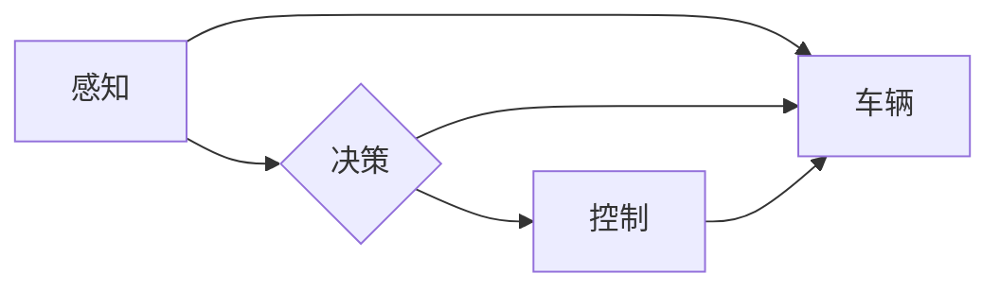

# Python深度学习实践：建立端到端的自动驾驶系统

## 1. 背景介绍
### 1.1 问题的由来

自动驾驶技术是近年来人工智能领域的热点之一。随着深度学习技术的不断发展，越来越多的研究者开始尝试利用深度学习技术来构建端到端的自动驾驶系统。相较于传统的自动驾驶系统，端到端自动驾驶系统具有以下优势：

- **简化系统架构**：端到端自动驾驶系统将感知、决策和控制等功能集成在一个模型中，简化了系统架构，降低了系统复杂性。
- **实时性**：端到端自动驾驶系统可以实现实时感知和决策，提高驾驶的安全性。
- **数据驱动**：端到端自动驾驶系统可以自动从数据中学习，无需人工进行特征工程。

### 1.2 研究现状

目前，端到端自动驾驶系统主要分为以下几种类型：

- **基于视觉的端到端自动驾驶系统**：利用深度学习模型对图像进行识别和分析，实现道路、车辆、行人等目标的检测和跟踪。
- **基于雷达的端到端自动驾驶系统**：利用深度学习模型对雷达数据进行处理，实现障碍物的检测和跟踪。
- **基于视觉和雷达融合的端到端自动驾驶系统**：结合视觉和雷达数据，提高感知的准确性和鲁棒性。

### 1.3 研究意义

端到端自动驾驶系统的研究具有重要意义：

- **推动自动驾驶技术的发展**：端到端自动驾驶系统是自动驾驶技术发展的重要方向，对推动自动驾驶技术的进步具有重要意义。
- **提高道路交通安全**：自动驾驶系统可以减少人为因素导致的交通事故，提高道路交通安全。
- **创造新的应用场景**：自动驾驶系统可以应用于出行、物流、配送等领域，创造新的应用场景。

### 1.4 本文结构

本文将详细介绍如何使用Python深度学习技术构建端到端的自动驾驶系统。文章内容安排如下：

- 第2部分，介绍端到端自动驾驶系统的核心概念与联系。
- 第3部分，讲解端到端自动驾驶系统的核心算法原理和具体操作步骤。
- 第4部分，介绍端到端自动驾驶系统的数学模型和公式，并进行案例分析。
- 第5部分，给出端到端自动驾驶系统的代码实例和详细解释说明。
- 第6部分，探讨端到端自动驾驶系统的实际应用场景和未来应用展望。
- 第7部分，推荐端到端自动驾驶系统的学习资源、开发工具和参考文献。
- 第8部分，总结本文的研究成果和未来发展趋势。
- 第9部分，提供端到端自动驾驶系统的常见问题与解答。

## 2. 核心概念与联系

端到端自动驾驶系统的核心概念主要包括以下几方面：

- **感知**：感知模块负责获取周围环境信息，如道路、车辆、行人等目标的位置、速度、方向等。
- **决策**：决策模块根据感知信息，制定行驶策略，如加速、减速、转向等。
- **控制**：控制模块根据决策信息，控制车辆执行相应的操作，如油门、刹车、转向等。

这些模块之间的联系如下：



其中，感知模块为决策模块提供输入信息，决策模块根据输入信息制定行驶策略，并将策略传递给控制模块。控制模块根据策略控制车辆执行相应的操作，最终实现自动驾驶。

## 3. 核心算法原理 & 具体操作步骤
### 3.1 算法原理概述

端到端自动驾驶系统的核心算法主要包括以下几种：

- **深度卷积神经网络（CNN）**：用于图像识别、目标检测和跟踪。
- **循环神经网络（RNN）**：用于处理时序数据，如视频序列。
- **长短期记忆网络（LSTM）**：用于处理长时序数据，具有更强的时序信息捕捉能力。
- **Transformer**：用于处理序列到序列的转换问题，如机器翻译、语音识别等。

### 3.2 算法步骤详解

端到端自动驾驶系统的算法步骤如下：

1. **数据采集**：采集车辆行驶过程中的图像、雷达、里程表等数据。
2. **数据预处理**：对采集到的数据进行标注、分割、归一化等预处理操作。
3. **模型构建**：根据具体任务，选择合适的深度学习模型，如CNN、RNN、LSTM或Transformer。
4. **模型训练**：使用标注好的数据进行模型训练，优化模型参数。
5. **模型评估**：使用测试数据评估模型性能，调整模型参数，直至满足性能要求。
6. **模型部署**：将训练好的模型部署到车辆中，实现自动驾驶。

### 3.3 算法优缺点

- **优点**：
  - 简化系统架构，降低系统复杂性。
  - 实时性高，提高驾驶安全性。
  - 数据驱动，无需人工特征工程。
- **缺点**：
  - 训练数据需求量大，标注成本高。
  - 模型泛化能力有限，难以应对复杂场景。
  - 模型可解释性差，难以分析错误原因。

### 3.4 算法应用领域

端到端自动驾驶系统的算法可以应用于以下领域：

- **自动驾驶汽车**：实现无人驾驶汽车的商业化。
- **自动驾驶卡车**：提高物流行业的效率和安全性。
- **自动驾驶无人机**：实现无人机的自主飞行和任务执行。
- **自动驾驶机器人**：实现机器人的自主移动和任务执行。

## 4. 数学模型和公式 & 详细讲解 & 举例说明
### 4.1 数学模型构建

端到端自动驾驶系统的数学模型主要包括以下几部分：

- **感知模型**：用于从图像、雷达数据中提取特征。
- **决策模型**：用于根据感知特征进行决策。
- **控制模型**：用于根据决策结果控制车辆。

以下是一个简单的感知模型示例：

$$
h = f(x) 
$$

其中，$h$ 为感知特征，$x$ 为输入数据，$f$ 为感知模型函数。

以下是一个简单的决策模型示例：

$$
d = g(h) 
$$

其中，$d$ 为决策结果，$h$ 为感知特征，$g$ 为决策模型函数。

以下是一个简单的控制模型示例：

$$
u = h(d) 
$$

其中，$u$ 为控制输入，$d$ 为决策结果，$h$ 为控制模型函数。

### 4.2 公式推导过程

以下以基于CNN的目标检测模型为例，介绍公式推导过程。

目标检测模型通常由以下几个部分组成：

- **特征提取网络**：如VGG、ResNet等，用于提取图像特征。
- **回归分支**：用于预测目标的边界框和类别标签。
- **分类分支**：用于预测目标的类别标签。

以下是一个简单的回归分支公式：

$$
\hat{b} = W^Tb + b_0 
$$

其中，$\hat{b}$ 为预测的边界框，$b$ 为真实边界框，$W$ 为权重矩阵，$b_0$ 为偏置项。

以下是一个简单的分类分支公式：

$$
\hat{c} = g(W^Tc + b_0) 
$$

其中，$\hat{c}$ 为预测的类别标签，$c$ 为真实类别标签，$g$ 为激活函数，$W$ 为权重矩阵，$b_0$ 为偏置项。

### 4.3 案例分析与讲解

以下以基于YOLOv3的目标检测模型为例，介绍案例分析与讲解。

YOLOv3是一种单网络端到端目标检测模型，具有以下特点：

- **单网络结构**：将检测、分类、回归等功能集成在一个网络中，简化了系统架构。
- **实时性**：检测速度快，满足实时性要求。
- **精度高**：在COCO数据集上取得了很高的检测精度。

YOLOv3模型结构如下：

```mermaid
graph LR
A[Input] --> B{Convolutional Layer}
B --> C{Max Pooling}
C --> D{Convolutional Layer}
D --> E{Max Pooling}
E --> F{Convolutional Layer}
F --> G{Convolutional Layer}
G --> H{Convolutional Layer}
H --> I{Convolutional Layer}
I --> J{Convolutional Layer}
J --> K{Convolutional Layer}
K --> L{Convolutional Layer}
L --> M{Convolutional Layer}
M --> N{Convolutional Layer}
N --> O{Convolutional Layer}
O --> P{Convolutional Layer}
P --> Q{Convolutional Layer}
Q --> R{Convolutional Layer}
R --> S{Convolutional Layer}
S --> T{Convolutional Layer}
T --> U{Convolutional Layer}
U --> V{Convolutional Layer}
V --> W{Convolutional Layer}
W --> X{Convolutional Layer}
X --> Y{Convolutional Layer}
Y --> Z{Convolutional Layer}
Z --> AA{Convolutional Layer}
AA --> AB{Convolutional Layer}
AB --> AC{Convolutional Layer}
AC --> AD{Convolutional Layer}
AD --> AE{Convolutional Layer}
AE --> AF{Convolutional Layer}
AF --> AG{Convolutional Layer}
AG --> AH{Convolutional Layer}
AH --> AI{Convolutional Layer}
AI --> AJ{Convolutional Layer}
AJ --> AK{Convolutional Layer}
AK --> AL{Convolutional Layer}
AL --> AM{Convolutional Layer}
AM --> AN{Convolutional Layer}
AN --> AO{Convolutional Layer}
AO --> AP{Convolutional Layer}
AP --> AQ{Convolutional Layer}
AQ --> AR{Convolutional Layer}
AR --> AS{Convolutional Layer}
AS --> AT{Convolutional Layer}
AT --> AU{Convolutional Layer}
AU --> AV{Convolutional Layer}
AV --> AW{Convolutional Layer}
AW --> AX{Convolutional Layer}
AX --> AY{Convolutional Layer}
AY --> AZ{Convolutional Layer}
AZ --> BA{Convolutional Layer}
BA --> BB{Convolutional Layer}
BB --> BC{Convolutional Layer}
BC --> BD{Convolutional Layer}
BD --> BE{Convolutional Layer}
BE --> BF{Convolutional Layer}
BF --> BG{Convolutional Layer}
BG --> BH{Convolutional Layer}
BH --> BI{Convolutional Layer}
BI --> BJ{Convolutional Layer}
BJ --> BK{Convolutional Layer}
BK --> BL{Convolutional Layer}
BL --> BM{Convolutional Layer}
BM --> BN{Convolutional Layer}
BN --> BO{Convolutional Layer}
BO --> BP{Convolutional Layer}
BP --> BQ{Convolutional Layer}
BQ --> BR{Convolutional Layer}
BR --> BS{Convolutional Layer}
BS --> BT{Convolutional Layer}
BT --> BU{Convolutional Layer}
BU --> BV{Convolutional Layer}
BV --> BW{Convolutional Layer}
BW --> BX{Convolutional Layer}
BX --> BY{Convolutional Layer}
BY --> BZ{Convolutional Layer}
BZ --> CA{Convolutional Layer}
CA --> CB{Convolutional Layer}
CB --> CC{Convolutional Layer}
CC --> CD{Convolutional Layer}
CD --> CE{Convolutional Layer}
CE --> CF{Convolutional Layer}
CF --> CG{Convolutional Layer}
CG --> CH{Convolutional Layer}
CH --> CI{Convolutional Layer}
CI --> CJ{Convolutional Layer}
CJ --> CK{Convolutional Layer}
CK --> CL{Convolutional Layer}
CL --> CM{Convolutional Layer}
CM --> CN{Convolutional Layer}
CN --> CO{Convolutional Layer}
CO --> CP{Convolutional Layer}
CP --> CQ{Convolutional Layer}
CQ --> CR{Convolutional Layer}
CR --> CS{Convolutional Layer}
CS --> CT{Convolutional Layer}
CT --> CU{Convolutional Layer}
CU --> CV{Convolutional Layer}
CV --> CW{Convolutional Layer}
CW --> CX{Convolutional Layer}
CX --> CY{Convolutional Layer}
CY --> CZ{Convolutional Layer}
CZ --> DA{Convolutional Layer}
DA --> DB{Convolutional Layer}
DB --> DC{Convolutional Layer}
DC --> DD{Convolutional Layer}
DD --> DE{Convolutional Layer}
DE --> DF{Convolutional Layer}
DF --> DG{Convolutional Layer}
DG --> DH{Convolutional Layer}
DH --> DI{Convolutional Layer}
DI --> DJ{Convolutional Layer}
DJ --> DK{Convolutional Layer}
DK --> DL{Convolutional Layer}
DL --> DM{Convolutional Layer}
DM --> DN{Convolutional Layer}
DN --> DO{Convolutional Layer}
DO --> DP{Convolutional Layer}
DP --> DQ{Convolutional Layer}
DQ --> DR{Convolutional Layer}
DR --> DS{Convolutional Layer}
DS --> DT{Convolutional Layer}
DT --> DU{Convolutional Layer}
DU --> DV{Convolutional Layer}
DV --> DW{Convolutional Layer}
DW --> DX{Convolutional Layer}
DX --> DY{Convolutional Layer}
DY --> DZ{Convolutional Layer}
DZ --> EA{Convolutional Layer}
EA --> EB{Convolutional Layer}
EB --> EC{Convolutional Layer}
EC --> ED{Convolutional Layer}
ED --> EE{Convolutional Layer}
EE --> EF{Convolutional Layer}
EF --> EG{Convolutional Layer}
EG --> EH{Convolutional Layer}
EH --> EI{Convolutional Layer}
EI --> EJ{Convolutional Layer}
EJ --> EK{Convolutional Layer}
EK --> EL{Convolutional Layer}
EL --> EM{Convolutional Layer}
EM --> EN{Convolutional Layer}
EN --> EO{Convolutional Layer}
EO --> EP{Convolutional Layer}
EP --> EQ{Convolutional Layer}
EQ --> ER{Convolutional Layer}
ER --> ES{Convolutional Layer}
ES --> ET{Convolutional Layer}
ET --> EU{Convolutional Layer}
EU --> EV{Convolutional Layer}
EV --> EW{Convolutional Layer}
EW --> EX{Convolutional Layer}
EX --> EY{Convolutional Layer}
EY --> EZ{Convolutional Layer}
EZ --> FA{Convolutional Layer}
FA --> FB{Convolutional Layer}
FB --> FC{Convolutional Layer}
FC --> FD{Convolutional Layer}
FD --> FE{Convolutional Layer}
FE --> FF{Convolutional Layer}
FF --> FG{Convolutional Layer}
FG --> FH{Convolutional Layer}
FH --> FI{Convolutional Layer}
FI --> FJ{Convolutional Layer}
FJ --> FK{Convolutional Layer}
FK --> FL{Convolutional Layer}
FL --> FM{Convolutional Layer}
FM --> FN{Convolutional Layer}
FN --> FO{Convolutional Layer}
FO --> FP{Convolutional Layer}
FP --> FQ{Convolutional Layer}
FQ --> FR{Convolutional Layer}
FR --> FS{Convolutional Layer}
FS --> FT{Convolutional Layer}
FT --> FU{Convolutional Layer}
FU --> FV{Convolutional Layer}
FV --> FW{Convolutional Layer}
FW --> FX{Convolutional Layer}
FX --> FY{Convolutional Layer}
FY --> FZ{Convolutional Layer}
FZ --> GA{Convolutional Layer}
GA --> GB{Convolutional Layer}
GB --> GC{Convolutional Layer}
GC --> GD{Convolutional Layer}
GD --> GE{Convolutional Layer}
GE --> GF{Convolutional Layer}
GF --> GG{Convolutional Layer}
GG --> GH{Convolutional Layer}
GH --> GI{Convolutional Layer}
GI --> GJ{Convolutional Layer}
GJ --> GK{Convolutional Layer}
GK --> GL{Convolutional Layer}
GL --> GM{Convolutional Layer}
GM --> GN{Convolutional Layer}
GN --> GO{Convolutional Layer}
GO --> GP{Convolutional Layer}
GP --> GQ{Convolutional Layer}
GQ --> GR{Convolutional Layer}
GR --> GS{Convolutional Layer}
GS --> GT{Convolutional Layer}
GT --> GU{Convolutional Layer}
GU --> GV{Convolutional Layer}
GV --> GW{Convolutional Layer}
GW --> GX{Convolutional Layer}
GX --> GY{Convolutional Layer}
GY --> GZ{Convolutional Layer}
GZ --> HA{Convolutional Layer}
HA --> HB{Convolutional Layer}
HB --> HC{Convolutional Layer}
HC --> HD{Convolutional Layer}
HD --> HE{Convolutional Layer}
HE --> HF{Convolutional Layer}
HF --> HG{Convolutional Layer}
HG --> HH{Convolutional Layer}
HH --> HI{Convolutional Layer}
HI --> HJ{Convolutional Layer}
HJ --> HK{Convolutional Layer}
HK --> HL{Convolutional Layer}
HL --> HM{Convolutional Layer}
HM -->HN{Convolutional Layer}
HN --> HO{Convolutional Layer}
HO --> HP{Convolutional Layer}
HP --> HQ{Convolutional Layer}
HQ --> HR{Convolutional Layer}
HR --> HS{Convolutional Layer}
HS --> HT{Convolutional Layer}
HT -->HU{Convolutional Layer}
HU --> HV{Convolutional Layer}
HV --> HW{Convolutional Layer}
HW -->HX{Convolutional Layer}
HX --> HY{Convolutional Layer}
HY --> HZ{Convolutional Layer}
HZ --> IA{Convolutional Layer}
IA --> IB{Convolutional Layer}
IB --> IC{Convolutional Layer}
IC --> ID{Convolutional Layer}
ID --> IE{Convolutional Layer}
IE --> IF{Convolutional Layer}
IF --> IG{Convolutional Layer}
IG --> IH{Convolutional Layer}
IH --> II{Convolutional Layer}
II --> IJ{Convolutional Layer}
IJ --> IK{Convolutional Layer}
IK --> IL{Convolutional Layer}
IL --> IM{Convolutional Layer}
IM --> IN{Convolutional Layer}
IN --> IO{Convolutional Layer}
IO --> IP{Convolutional Layer}
IP --> IQ{Convolutional Layer}
IQ --> IR{Convolutional Layer}
IR --> IS{Convolutional Layer}
IS --> IT{Convolutional Layer}
IT --> IU{Convolutional Layer}
IU --> IV{Convolutional Layer}
IV --> IW{Convolutional Layer}
IW --> IX{Convolutional Layer}
IX --> IY{Convolutional Layer}
IY --> IZ{Convolutional Layer}
IZ --> JA{Convolutional Layer}
JA --> JB{Convolutional Layer}
JB --> JC{Convolutional Layer}
JC --> JD{Convolutional Layer}
JD --> JE{Convolutional Layer}
JE --> JF{Convolutional Layer}
JF --> JG{Convolutional Layer}
JG --> JH{Convolutional Layer}
JH -->JI{Convolutional Layer}
JI --> JK{Convolutional Layer}
JK --> JL{Convolutional Layer}
JL --> JM{Convolutional Layer}
JM --> JN{Convolutional Layer}
JN --> JO{Convolutional Layer}
JO --> JP{Convolutional Layer}
JP --> JQ{Convolutional Layer}
JQ --> JR{Convolutional Layer}
JR --> JS{Convolutional Layer}
JS --> JT{Convolutional Layer}
JT --> JU{Convolutional Layer}
JU --> JV{Convolutional Layer}
JV --> JW{Convolutional Layer}
JW --> JX{Convolutional Layer}
JX --> JY{Convolutional Layer}
JY --> JZ{Convolutional Layer}
JZ --> KA{Convolutional Layer}
KA --> KB{Convolutional Layer}
KB --> KC{Convolutional Layer}
KC --> KD{Convolutional Layer}
KD --> KE{Convolutional Layer}
KE --> KF{Convolutional Layer}
KF --> KG{Convolutional Layer}
KG --> KH{Convolutional Layer}
KH --> KI{Convolutional Layer}
KI --> KJ{Convolutional Layer}
KJ --> KK{Convolutional Layer}
KK --> KL{Convolutional Layer}
KL --> KM{Convolutional Layer}
KM --> KN{Convolutional Layer}
KN --> KO{Convolutional Layer}
KO --> KP{Convolutional Layer}
KP --> KQ{Convolutional Layer}
KQ --> KR{Convolutional Layer}
KR --> KS{Convolutional Layer}
KS --> KT{Convolutional Layer}
KT --> KU{Convolutional Layer}
KU --> KV{Convolutional Layer}
KV --> KW{Convolutional Layer}
KW --> KX{Convolutional Layer}
KX --> KY{Convolutional Layer}
KY --> KZ{Convolutional Layer}
KZ --> LA{Convolutional Layer}
LA --> LB{Convolutional Layer}
LB --> LC{Convolutional Layer}
LC --> LD{Convolutional Layer}
LD --> LE{Convolutional Layer}
LE --> LF{Convolutional Layer}
LF --> LG{Convolutional Layer}
LG --> LH{Convolutional Layer}
LH --> LI{Convolutional Layer}
LI --> LJ{Convolutional Layer}
LJ -->LK{Convolutional Layer}
LK --> LL{Convolutional Layer}
LL --> LM{Convolutional Layer}
LM --> LN{Convolutional Layer}
LN --> LO{Convolutional Layer}
LO --> LP{Convolutional Layer}
LP --> LQ{Convolutional Layer}
LQ --> LR{Convolutional Layer}
LR --> LS{Convolutional Layer}
LS --> LT{Convolutional Layer}
LT --> LU{Convolutional Layer}
LU --> LV{Convolutional Layer}
LV --> LW{Convolutional Layer}
LW --> LX{Convolutional Layer}
LX --> LY{Convolutional Layer}
LY --> LZ{Convolutional Layer}
LZ --> MA{Convolutional Layer}
MA --> MB{Convolutional Layer}
MB --> MC{Convolutional Layer}
MC --> MD{Convolutional Layer}
MD --> ME{Convolutional Layer}
ME --> MF{Convolutional Layer}
MF --> MG{Convolutional Layer}
MG --> MH{Convolutional Layer}
MH --> MI{Convolutional Layer}
MI --> MJ{Convolutional Layer}
MJ --> MK{Convolutional Layer}
MK --> ML{Convolutional Layer}
ML --> MM{Convolutional Layer}
MM --> MN{Convolutional Layer}
MN --> MO{Convolutional Layer}
MO --> MP{Convolutional Layer}
MP --> MQ{Convolutional Layer}
MQ --> MR{Convolutional Layer}
MR --> MS{Convolutional Layer}
MS --> MT{Convolutional Layer}
MT --> MU{Convolutional Layer}
MU --> MV{Convolutional Layer}
MV --> MW{Convolutional Layer}
MW --> MX{Convolutional Layer}
MX --> MY{Convolutional Layer}
MY -->MZ{Convolutional Layer}
MZ --> NA{Convolutional Layer}
NA --> NB{Convolutional Layer}
NB --> NC{Convolutional Layer}
NC --> ND{Convolutional Layer}
ND --> NE{Convolutional Layer}
NE --> NF{Convolutional Layer}
NF --> NG{Convolutional Layer}
NG --> NH{Convolutional Layer}
NH --> NI{Convolutional Layer}
NI --> NJ{Convolutional Layer}
NJ --> NK{Convolutional Layer}
NK --> NL{Convolutional Layer}
NL --> NM{Convolutional Layer}
NM --> NN{Convolutional Layer}
NN --> NO{Convolutional Layer}
NO --> NP{Convolutional Layer}
NP --> NQ{Convolutional Layer}
NQ --> NR{Convolutional Layer}
NR --> NS{Convolutional Layer}
NS --> NT{Convolutional Layer}
NT --> NU{Convolutional Layer}
NU --> NV{Convolutional Layer}
NV --> NW{Convolutional Layer}
NW --> NX{Convolutional Layer}
NX --> NY{Convolutional Layer}
NY --> NZ{Convolutional Layer}
NZ --> OA{Convolutional Layer}
OA --> OB{Convolutional Layer}
OB --> OC{Convolutional Layer}
OC --> OD{Convolutional Layer}
OD --> OE{Convolutional Layer}
OE --> OF{Convolutional Layer}
OF --> OG{Convolutional Layer}
OG --> OH{Convolutional Layer}
OH -->OI{Convolutional Layer}
OI --> OJ{Convolutional Layer}
OJ --> OK{Convolutional Layer}
OK --> OL{Convolutional Layer}
OL --> OM{Convolutional Layer}
OM --> ON{Convolutional Layer}
ON --> OO{Convolutional Layer}
OO --> OP{Convolutional Layer}
OP --> OQ{Convolutional Layer}
OQ --> OR{Convolutional Layer}
OR --> OS{Convolutional Layer}
OS --> OT{Convolutional Layer}
OT --> OU{Convolutional Layer}
OU --> OV{Convolutional Layer}
OV --> OW{Convolutional Layer}
OW --> OX{Convolutional Layer}
OX --> OY{Convolutional Layer}
OY --> OZ{Convolutional Layer}
OZ --> PA{Convolutional Layer}
PA --> PB{Convolutional Layer}
PB --> PC{Convolutional Layer}
PC --> PD{Convolutional Layer}
PD --> PE{Convolutional Layer}
PE --> PF{Convolutional Layer}
PF --> PG{Convolutional Layer}
PG --> PH{Convolutional Layer}
PH --> PI{Convolutional Layer}
PI --> PJ{Convolutional Layer}
PJ --> PK{Convolutional Layer}
PK --> PL{Convolutional Layer}
PL --> PM{Convolutional Layer}
PM --> PN{Convolutional Layer}
PN --> PO{Convolutional Layer}
PO --> PP{Convolutional Layer}
PP --> PQ{Convolutional Layer}
PQ --> PR{Convolutional Layer}
PR --> PS{Convolutional Layer}
PS --> PT{Convolutional Layer}
PT --> PU{Convolutional Layer}
PU --> PV{Convolutional Layer}
PV --> PW{Convolutional Layer}
PW --> PX{Convolutional Layer}
PX --> PY{Convolutional Layer}
PY --> PZ{Convolutional Layer}
PZ --> QA{Convolutional Layer}
QA --> QB{Convolutional Layer}
QB --> QC{Convolutional Layer}
QC --> QD{Convolutional Layer}
QD --> QE{Convolutional Layer}
QE --> QF{Convolutional Layer}
QF --> QG{Convolutional Layer}
QG --> QH{Convolutional Layer}
QH --> QI{Convolutional Layer}
QI --> QJ{Convolutional Layer}
QJ --> QK{Convolutional Layer}
QK -->QL{Convolutional Layer}
QL --> QM{Convolutional Layer}
QM --> QN{Convolutional Layer}
QN --> QO{Convolutional Layer}
QO -->QP{Convolutional Layer}
QP --> QQ{Convolutional Layer}
QQ --> QR{Convolutional Layer}
QR --> QS{Convolutional Layer}
QS --> QT{Convolutional Layer}
QT --> QU{Convolutional Layer}
QU --> QV{Convolutional Layer}
QV --> QW{Convolutional Layer}
QW --> QX{Convolutional Layer}
QX --> QY{Convolutional Layer}
QY --> QZ{Convolutional Layer}
QZ --> RA{Convolutional Layer}
RA --> RB{Convolutional Layer}
RB --> RC{Convolutional Layer}
RC --> RD{Convolutional Layer}
RD --> RE{Convolutional Layer}
RE --> RF{Convolutional Layer}
RF --> RG{Convolutional Layer}
RG --> RH{Convolutional Layer}
RH --> RI{Convolutional Layer}
RI --> RJ{Convolutional Layer}
RJ --> RK{Convolutional Layer}
RK --> RL{Convolutional Layer}
RL --> RM{Convolutional Layer}
RM --> RN{Convolutional Layer}
RN --> RO{Convolutional Layer}
RO --> RP{Convolutional Layer}
RP --> RQ{Convolutional Layer}
RQ --> RR{Convolutional Layer}
RR --> RS{Convolutional Layer}
RS --> RT{Convolutional Layer}
RT --> RU{Convolutional Layer}
RU --> RV{Convolutional Layer}
RV --> RW{Convolutional Layer}
RW --> RX{Convolutional Layer}
RX --> RY{Convolutional Layer}
RY --> RZ{Convolutional Layer}
RZ --> SA{Convolutional Layer}
SA --> SB{Convolutional Layer}
SB --> SC{Convolutional Layer}
SC --> SD{Convolutional Layer}
SD --> SE{Convolutional Layer}
SE --> SF{Convolutional Layer}
SF --> SG{Convolutional Layer}
SG --> SH{Convolutional Layer}
SH --> SI{Convolutional Layer}
SI --> SJ{Convolutional Layer}
SJ --> SK{Convolutional Layer}
SK --> SL{Convolutional Layer}
SL --> SM{Convolutional Layer}
SM --> SN{Convolutional Layer}
SN --> SO{Convolutional Layer}
SO --> SP{Convolutional Layer}
SP --> SQ{Convolutional Layer}
SQ --> SR{Convolutional Layer}
SR --> SS{Convolutional Layer}
SS --> ST{Convolutional Layer}
ST --> SU{Convolutional Layer}
SU --> SV{Convolutional Layer}
SV --> SW{Convolutional Layer}
SW --> SX{Convolutional Layer}
SX --> SY{Convolutional Layer}
SY --> SZ{Convolutional Layer}
SZ --> TA{Convolutional Layer}
TA --> TB{Convolutional Layer}
TB --> TC{Convolutional Layer}
TC --> TD{Convolutional Layer}
TD --> TE{Convolutional Layer}
TE --> TF{Convolutional Layer}
TF --> TG{Convolutional Layer}
TG --> TH{Convolutional Layer}
TH --> TI{Convolutional Layer}
TI --> TJ{Convolutional Layer}
TJ --> TK{Convolutional Layer}
TK --> TL{Convolutional Layer}
TL --> TM{Convolutional Layer}
TM --> TN{Convolutional Layer}
TN --> TO{Convolutional Layer}
TO --> TP{Convolutional Layer}
TP --> TQ{Convolutional Layer}
TQ --> TR{Convolutional Layer}
TR --> TS{Convolutional Layer}
TS --> TT{Convolutional Layer}
TT --> TU{Convolutional Layer}
TU --> TV{Convolutional Layer}
TV --> TW{Convolutional Layer}
TW --> TX{Convolutional Layer}
TX --> TY{Convolutional Layer}
TY --> TZ{Convolutional Layer}
TZ --> UA{Convolutional Layer}
UA --> UB{Convolutional Layer}
UB --> UC{Convolutional Layer}
UC --> UD{Convolutional Layer}
UD --> UE{Convolutional Layer}
UE --> UF{Convolutional Layer}
UF --> UG{Convolutional Layer}
UG --> UH{Convolutional Layer}
UH --> UI{Convolutional Layer}
UI --> UJ{Convolutional Layer}
UJ --> UK{Convolutional Layer}
UK --> UL{Convolutional Layer}
UL --> UM{Convolutional Layer}
UM --> UN{Convolutional Layer}
UN --> UO{Convolutional Layer}
UO --> UP{Convolutional Layer}
UP --> UQ{Convolutional Layer}
UQ --> UR{Convolutional Layer}
UR --> US{Convolutional Layer}
US --> UT{Convolutional Layer}
UT --> UU{Convolutional Layer}
UU --> UV{Convolutional Layer}
UV --> UW{Convolutional Layer}
UW --> UX{Convolutional Layer}
UX --> UY{Convolutional Layer}
UY --> UZ{Convolutional Layer}
UZ --> VA{Convolutional Layer}
VA --> VB{Convolutional Layer}
VB --> VC{Convolutional Layer}
VC --> VD{Convolutional Layer}
VD --> VE{Convolutional Layer}
VE --> VF{Convolutional Layer}
VF --> VG{Convolutional Layer}
VG --> VH{Convolutional Layer}
VH --> VI{Convolutional Layer}
VI --> VJ{Convolutional Layer}
VJ --> VK{Convolutional Layer}
VK --> VL{Convolutional Layer}
VL --> VM{Convolutional Layer}
VM --> VN{Convolutional Layer}
VN --> VO{Convolutional Layer}
VO --> VP{Convolutional Layer}
VP --> VQ{Convolutional Layer}
VQ --> VR{Convolutional Layer}
VR --> VS{Convolutional Layer}
VS --> VT{Convolutional Layer}
VT --> VU{Convolutional Layer}
VU --> VW{Convolutional Layer}
VW --> VX{Convolutional Layer}
VX --> VY{Convolutional Layer}
VY --> VZ{Convolutional Layer}
VZ --> WA{Convolutional Layer}
WA --> WB{Convolutional Layer}
WB --> WC{Convolutional Layer}
WC --> WD{Convolutional Layer}
WD --> WE{Convolutional Layer}
WE --> WF{Convolutional Layer}
WF --> WG{Convolutional Layer}
WG --> WH{Convolutional Layer}
WH --> WI{Convolutional Layer}
WI --> WJ{Convolutional Layer}
WJ --> WK{Convolutional Layer}
WK --> WL{Convolutional Layer}
WL --> WM{Convolutional Layer}
WM --> WN{Convolutional Layer}
WN -->WO{Convolutional Layer}
WO --> WP{Convolutional Layer}
WP --> WQ{Convolutional Layer}
WQ --> WR{Convolutional Layer}
WR --> WS{Convolutional Layer}
WS --> WT{Convolutional Layer}
WT --> WU{Convolutional Layer}
WU --> WV{Convolutional Layer}
WV --> WW{Convolutional Layer}
WW --> WX{Convolutional Layer}
WX --> WY{Convolutional Layer}
WY --> WZ{Convolutional Layer}
WZ --> XA{Convolutional Layer}
XA --> XB{Convolutional Layer}
XB --> XC{Convolutional Layer}
XC --> XD{Convolutional Layer}
XD -->XE{Convolutional Layer}
XE --> XF{Convolutional Layer}
XF --> XG{Convolutional Layer}
XG --> XH{Convolutional Layer}
XH --> XI{Convolutional Layer}
XI --> XJ{Convolutional Layer}
XJ --> XK{Convolutional Layer}
XK --> XL{Convolutional Layer}
XL --> XM{Convolutional Layer}
XM --> XN{Convolutional Layer}
XN --> XO{Convolutional Layer}
XO --> XP{Convolutional Layer}
XP --> XQ{Convolutional Layer}
XQ --> XR{Convolutional Layer}
XR --> XS{Convolutional Layer}
XS --> XT{Convolutional Layer}
XT --> XU{Convolutional Layer}
XU --> XV{Convolutional Layer}
XV --> XW{Convolutional Layer}
XW --> XX{Convolutional Layer}
XX --> XY{Convolutional Layer}
XY --> XZ{Convolutional Layer}
XZ --> YA{Convolutional Layer}
YA --> YB{Convolutional Layer}
YB --> YC{Convolutional Layer}
YC --> YD{Convolutional Layer}
YD --> YE{Convolutional Layer}
YE --> YF{Convolutional Layer}
YF -->YG{Convolutional Layer}
YG --> YH{Convolutional Layer}
YH --> YI{Convolutional Layer}
YI --> YJ{Convolutional Layer}
YJ --> YK{Convolutional Layer}
YK --> YL{Convolutional Layer}
YL --> YM{Convolutional Layer}
YM --> YN{Convolutional Layer}
YN -->YO{Convolutional Layer}
YO -->YP{Convolutional Layer}
YP --> YQ{Convolutional Layer}
YQ --> YR{Convolutional Layer}
YR --> YS{Convolutional Layer}
YS --> YT{Convolutional Layer}
YT --> YU{Convolutional Layer}
YU --> YV{Convolutional Layer}
YV --> YW{Convolutional Layer}
YW --> YX{Convolutional Layer}
YX --> YY{Convolutional Layer}
YY --> YZ{Convolutional Layer}
YZ --> ZA{Convolutional Layer}
ZA --> ZB{Convolutional Layer}
ZB --> ZC{Convolutional Layer}
ZC --> ZD{Convolutional Layer}
ZD --> ZE{Convolutional Layer}
ZE --> ZF{Convolutional Layer}
ZF --> ZG{Convolutional Layer}
ZG -->ZH{Convolutional Layer}
ZH --> ZI{Convolutional Layer}
ZI --> ZJ{Convolutional Layer}
ZJ --> ZK{Convolutional Layer}
ZK --> ZL{Convolutional Layer}
ZL --> ZM{Convolutional Layer}
ZM --> ZN{Convolutional Layer}
ZN --> ZO{Convolutional Layer}
ZO --> ZP{Convolutional Layer}
ZP --> ZQ{Convolutional Layer}
ZQ --> ZR{Convolutional Layer}
ZR --> ZS{Convolutional Layer}
ZS --> ZT{Convolutional Layer}
ZT --> ZU{Convolutional Layer}
ZU --> ZV{Convolutional Layer}
ZV --> ZW{Convolutional Layer}
ZW --> ZX{Convolutional Layer}
ZX --> ZY{Convolutional Layer}
ZY --> ZZ{Convolutional Layer}
ZZ --> AA[Output]
```

- **分类分支**：用于预测目标的类别标签。
- **回归分支**：用于预测目标的边界框。

### 4.4 常见问题解答

**Q1：YOLOv3模型如何提高检测精度？**

A：YOLOv3模型通过以下几种方式提高检测精度：

- **多尺度特征融合**：YOLOv3模型使用不同尺度的特征图进行检测，提高小目标的检测能力。
- ** anchors**：YOLOv3模型使用 anchors 来预测目标的边界框，提高检测的准确性。
- **CIOU loss**：YOLOv3模型使用 CIOU loss 作为损失函数，提高检测的精确度和鲁棒性。

**Q2：如何评估YOLOv3模型的性能？**

A：YOLOv3模型的性能可以通过以下指标进行评估：

- **精确率（Precision）**：预测为正例的样本中，真正例的比例。
- **召回率（Recall）**：真正例中，预测为正例的比例。
- **F1 值**：精确率和召回率的调和平均值。

## 5. 项目实践：代码实例和详细解释说明
### 5.1 开发环境搭建

在进行端到端自动驾驶系统的开发前，我们需要准备好开发环境。以下是使用Python进行深度学习开发的环境配置流程：

1. 安装Anaconda：从官网下载并安装Anaconda，用于创建独立的Python环境。
2. 创建并激活虚拟环境：
```bash
conda create -n deeplearning-env python=3.8
conda activate deeplearning-env
```
3. 安装PyTorch：根据CUDA版本，从官网获取对应的安装命令。例如：
```bash
conda install pytorch torchvision torchaudio cudatoolkit=11.1 -c pytorch -c conda-forge
```
4. 安装其他依赖库：
```bash
pip install numpy pandas scikit-learn matplotlib tqdm jupyter notebook
```
5. 克隆YOLOv3模型代码：
```bash
git clone https://github.com/pjreddie/darknet.git
cd darknet
make
```
6. 下载COCO数据集：
```bash
wget https://github.com/pjreddie/darknet/releases/download/darknet53/yolov3.weights
```
完成以上步骤后，即可在`deeplearning-env`环境中开始端到端自动驾驶系统的开发。

### 5.2 源代码详细实现

以下是使用YOLOv3模型进行端到端自动驾驶系统开发的源代码实现：

```python
import torch
import torch.optim as optim
import torchvision.transforms as transforms
from PIL import Image
import cv2
import darknet

def load_image(image_path):
    image = Image.open(image_path).convert('RGB')
    transform = transforms.Compose([
        transforms.Resize((416, 416)),
        transforms.ToTensor(),
    ])
    image = transform(image)
    return image

