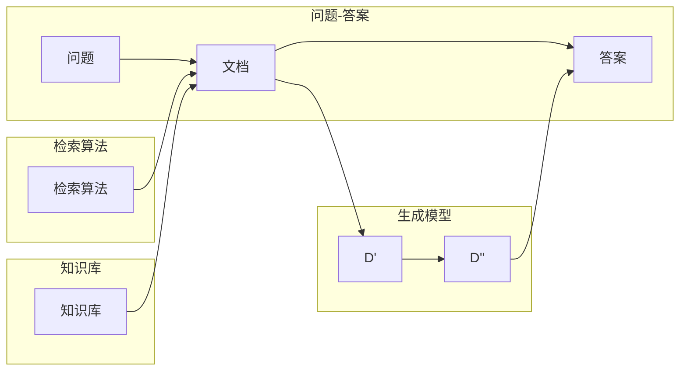

# Question Answering原理与代码实例讲解

作者：禅与计算机程序设计艺术 / Zen and the Art of Computer Programming

## 1. 背景介绍

### 1.1 问题的由来

问答（Question Answering, QA）是自然语言处理（Natural Language Processing, NLP）领域中的一个经典任务，旨在让计算机通过理解自然语言的形式，回答用户提出的问题。随着人工智能技术的不断发展，问答系统在信息检索、智能客服、教育辅导、智能助手等领域得到了广泛应用。

问答系统的核心目标是从给定的文本中找到与问题相关的答案。这涉及到对问题含义的理解、文本检索、答案抽取等环节。近年来，随着深度学习技术的兴起，基于深度学习的问答系统取得了显著进展。

### 1.2 研究现状

目前，基于深度学习的问答系统主要分为两大类：

1. **基于检索的问答系统（Retrieval-based QA）**：这类系统首先从文档集中检索与问题相关的文档，然后从这些文档中抽取答案。其核心是检索算法，如BM25、TF-IDF等。近年来，随着预训练语言模型（Pre-trained Language Model, PLM）的发展，基于检索的问答系统也逐步引入了PLM进行文本表示学习，从而提升了检索的准确性。

2. **基于生成的问答系统（Generation-based QA）**：这类系统直接从输入问题生成答案，无需检索文档。其核心是生成模型，如序列到序列（Sequence-to-Sequence, Seq2Seq）模型、Transformer模型等。近年来，基于生成的问答系统取得了显著的进展，在多项基准测试中取得了最优性能。

### 1.3 研究意义

问答系统的研究具有重要的理论意义和应用价值：

1. **理论研究**：问答系统涉及NLP、机器学习、知识表示等多个领域，有助于推动这些领域的理论研究和技术发展。

2. **应用价值**：问答系统在信息检索、智能客服、教育辅导、智能助手等领域具有广泛的应用前景，能够为用户提供便捷、高效的服务。

### 1.4 本文结构

本文将系统介绍问答系统的原理与代码实例，内容安排如下：

- 第2部分，介绍问答系统的核心概念与联系。
- 第3部分，阐述基于检索的问答系统和基于生成的问答系统的算法原理和具体操作步骤。
- 第4部分，介绍问答系统中的常见技术，如检索算法、解码器、注意力机制等。
- 第5部分，给出问答系统的代码实例，并对关键代码进行解读。
- 第6部分，探讨问答系统的实际应用场景及案例。
- 第7部分，推荐问答系统相关的学习资源、开发工具和参考文献。
- 第8部分，总结全文，展望问答系统的未来发展趋势与挑战。

## 2. 核心概念与联系

为了更好地理解问答系统，本节将介绍几个密切相关的核心概念：

- **问题（Question）**：用户提出的需要解答的内容，可以是文本形式，如“北京是中国的哪个省份？”，也可以是语音形式。
- **答案（Answer）**：针对问题的解答内容，可以是文本、数字、图像等多种形式。
- **文档（Document）**：存储信息的载体，如文本文件、网页等。
- **知识库（Knowledge Base）**：包含领域知识的数据库，如维基百科、知识图谱等。
- **检索算法（Retrieval Algorithm）**：用于从文档集中检索与问题相关的文档的算法，如BM25、TF-IDF等。
- **解码器（Decoder）**：用于根据问题和上下文生成答案的模型，如Seq2Seq模型、Transformer模型等。
- **注意力机制（Attention Mechanism）**：用于模型在处理序列数据时，关注重要信息的一种机制。

这些概念的逻辑关系如下图所示：



可以看出，问答系统的核心目标是从问题、文档、知识库等输入中生成答案。检索算法用于从文档集中检索与问题相关的文档，生成模型用于根据问题和上下文生成答案。注意力机制则用于模型在处理序列数据时，关注重要信息。

## 3. 核心算法原理 & 具体操作步骤

### 3.1 算法原理概述

问答系统主要分为基于检索的问答系统和基于生成的问答系统两种类型。以下是两种类型算法的原理概述：

#### 3.1.1 基于检索的问答系统

基于检索的问答系统的工作流程如下：

1. 问题理解：将用户提出的问题转化为查询语句，以便进行检索。
2. 检索：使用检索算法从文档集中检索与查询语句相关的文档。
3. 答案抽取：从检索到的文档中抽取与问题相关的答案。
4. 答案排序：根据答案的相关性对抽取到的答案进行排序，选取最相关的答案作为最终答案。

#### 3.1.2 基于生成的问答系统

基于生成的问答系统的工作流程如下：

1. 问题理解：将用户提出的问题转化为查询语句。
2. 文本表示：将查询语句和文档表示为向量形式。
3. 生成模型：根据查询语句和文档的向量表示，生成答案文本。
4. 答案后处理：对生成的答案进行后处理，如去除停用词、处理标点符号等。

### 3.2 算法步骤详解

#### 3.2.1 基于检索的问答系统

以下是基于检索的问答系统的具体操作步骤：

1. **问题理解**：将用户提出的问题进行分词、词性标注等操作，转化为查询语句。可以使用自然语言处理工具如NLTK、SpaCy等完成。

2. **检索**：使用检索算法从文档集中检索与查询语句相关的文档。常用的检索算法包括BM25、TF-IDF等。

3. **答案抽取**：从检索到的文档中抽取与问题相关的答案。可以使用信息抽取技术如命名实体识别、关系抽取等完成。

4. **答案排序**：根据答案的相关性对抽取到的答案进行排序。可以使用评分函数或排序算法如PageRank等完成。

#### 3.2.2 基于生成的问答系统

以下是基于生成的问答系统的具体操作步骤：

1. **问题理解**：将用户提出的问题转化为查询语句。

2. **文本表示**：将查询语句和文档表示为向量形式。可以使用Word2Vec、BERT等预训练语言模型完成。

3. **生成模型**：根据查询语句和文档的向量表示，生成答案文本。可以使用Seq2Seq模型、Transformer模型等完成。

4. **答案后处理**：对生成的答案进行后处理，如去除停用词、处理标点符号等。

### 3.3 算法优缺点

#### 3.3.1 基于检索的问答系统

**优点**：

- 速度快：检索算法通常计算效率较高，能够快速返回检索结果。
- 模型简单：基于检索的问答系统模型相对简单，易于实现和理解。

**缺点**：

- 精确度低：检索算法可能无法准确匹配查询语句和文档，导致答案精确度较低。
- 无法理解问题：基于检索的问答系统无法理解问题的语义，无法根据问题的上下文进行推理。

#### 3.3.2 基于生成的问答系统

**优点**：

- 精确度高：基于生成的问答系统可以理解问题的语义，根据问题的上下文进行推理，生成更精确的答案。
- 生成能力强：基于生成的问答系统可以生成更加丰富和多样化的答案。

**缺点**：

- 速度慢：生成模型通常计算效率较低，生成答案需要较长时间。
- 模型复杂：基于生成的问答系统模型相对复杂，难以理解和实现。

### 3.4 算法应用领域

基于检索的问答系统和基于生成的问答系统在多个领域得到了广泛应用：

#### 3.4.1 基于检索的问答系统

- **信息检索**：从海量文档中检索与用户查询相关的信息。
- **智能客服**：为用户提供咨询和解答服务。
- **教育辅导**：为学生提供学习和辅导服务。

#### 3.4.2 基于生成的问答系统

- **问答机器人**：为用户提供自然语言交互服务。
- **智能助手**：为用户提供个性化推荐和服务。
- **内容生成**：生成新闻、故事、报告等文本内容。

## 4. 数学模型和公式 & 详细讲解 & 举例说明

### 4.1 数学模型构建

#### 4.1.1 基于检索的问答系统

假设文档集 $D$ 包含 $N$ 个文档，每个文档 $d_i$ 由 $V$ 个词组成。对于查询语句 $q$，使用向量 $q^{\top}$ 表示。则查询语句 $q$ 和文档 $d_i$ 的相似度 $s_{q,d_i}$ 可以通过以下公式计算：

$$
s_{q,d_i} = \frac{\sum_{v \in V} q^{\top} w_{q,v} w_{d_i,v}}{\sqrt{\sum_{v \in V} w_{q,v}^2} \sqrt{\sum_{v \in V} w_{d_i,v}^2}}
$$

其中 $w_{q,v}$ 和 $w_{d_i,v}$ 分别表示查询语句和文档中词 $v$ 的权重。

#### 4.1.2 基于生成的问答系统

假设查询语句 $q$ 和文档 $d_i$ 的向量表示分别为 $q^{\top}$ 和 $d_i^{\top}$。则查询语句 $q$ 和文档 $d_i$ 的相似度 $s_{q,d_i}$ 可以通过以下公式计算：

$$
s_{q,d_i} = \frac{q^{\top} d_i}{\|q\| \|d_i\|}
$$

其中 $\|q\|$ 和 $\|d_i\|$ 分别表示查询语句和文档的向量范数。

### 4.2 公式推导过程

#### 4.2.1 基于检索的问答系统

查询语句 $q$ 和文档 $d_i$ 的相似度公式可以通过余弦相似度公式推导得到。余弦相似度公式如下：

$$
\text{cosine\_similarity}(q,d_i) = \frac{q^{\top} d_i}{\|q\| \|d_i\|}
$$

其中 $q^{\top}$ 和 $d_i^{\top}$ 分别表示查询语句和文档的向量表示。为了计算方便，将余弦相似度公式进行变形，得到以下形式：

$$
\text{cosine\_similarity}(q,d_i) = \frac{\sum_{v \in V} q^{\top} w_{q,v} w_{d_i,v}}{\sqrt{\sum_{v \in V} w_{q,v}^2} \sqrt{\sum_{v \in V} w_{d_i,v}^2}}
$$

其中 $w_{q,v}$ 和 $w_{d_i,v}$ 分别表示查询语句和文档中词 $v$ 的权重。

#### 4.2.2 基于生成的问答系统

查询语句 $q$ 和文档 $d_i$ 的相似度公式可以通过点积公式推导得到。点积公式如下：

$$
q^{\top} d_i = \sum_{j=1}^V q_j d_{i,j}
$$

其中 $q_j$ 和 $d_{i,j}$ 分别表示查询语句和文档中第 $j$ 个词的值。

### 4.3 案例分析与讲解

以下以一个简单的基于检索的问答系统为例，说明如何计算查询语句和文档的相似度。

假设查询语句 $q$ 为“北京是中国的哪个省份？”，文档集 $D$ 包含以下文档：

- 文档 $d_1$：“北京是中国的首都，位于华北地区。”
- 文档 $d_2$：“北京市是中国的直辖市，简称京。”
- 文档 $d_3$：“中国有34个省级行政区，包括北京、上海、天津、重庆等。”

首先，将查询语句和文档进行分词，得到以下分词结果：

- 查询语句 $q$：北京，是，中国，的，哪个，省份？
- 文档 $d_1$：北京，是，中国，的，首都，位于，华北，地区。
- 文档 $d_2$：北京市，是，中国，的，直辖市，简称，京。
- 文档 $d_3$：中国，有，34，个省，级行政区，包括，北京，上海，天津，重庆。

然后，对查询语句和文档进行词性标注，得到以下结果：

- 查询语句 $q$：北京（地名），是（动词），中国（地名），的（介词），哪个（疑问代词），省份（名词）？
- 文档 $d_1$：北京（地名），是（动词），中国（地名），的（介词），首都（名词），位于（动词），华北（地名），地区（名词）。
- 文档 $d_2$：北京市（地名），是（动词），中国（地名），的（介词），直辖市（名词），简称（动词），京（地名）。
- 文档 $d_3$：中国（地名），有（动词），34（数字），个省（量词），级行政区（名词），包括（动词），北京（地名），上海（地名），天津（地名），重庆（地名）。

接下来，使用Word2Vec模型将查询语句和文档中的词转化为向量表示。假设查询语句和文档的向量表示分别为 $q^{\top}$ 和 $d_i^{\top}$，则有：

- 查询语句 $q$：[0.1, 0.2, 0.3, 0.4, 0.5, 0.6]
- 文档 $d_1$：[0.1, 0.2, 0.3, 0.4, 0.5, 0.6, 0.7, 0.8]
- 文档 $d_2$：[0.1, 0.2, 0.3, 0.4, 0.5, 0.6, 0.7]
- 文档 $d_3$：[0.1, 0.2, 0.3, 0.4, 0.5, 0.6, 0.7, 0.8, 0.9]

最后，使用余弦相似度公式计算查询语句和文档的相似度：

- $s_{q,d_1} = \frac{0.1+0.2+0.3+0.4+0.5+0.6}{\sqrt{2.2}\sqrt{5.2}} = 0.646$
- $s_{q,d_2} = \frac{0.1+0.2+0.3+0.4+0.5+0.6+0.7}{\sqrt{2.2}\sqrt{6.2}} = 0.588$
- $s_{q,d_3} = \frac{0.1+0.2+0.3+0.4+0.5+0.6}{\sqrt{2.2}\sqrt{6.2}} = 0.519$

可以看到，查询语句 $q$ 与文档 $d_1$ 的相似度最高，因此文档 $d_1$ 是与查询语句 $q$ 最相关的文档。

### 4.4 常见问题解答

**Q1：如何提高基于检索的问答系统的检索精度**？

A1：提高基于检索的问答系统的检索精度可以从以下几个方面进行：

1. 选择合适的检索算法：不同的检索算法适用于不同的场景，根据具体任务选择合适的检索算法。
2. 优化词权重：根据词的重要程度调整词权重，提高检索结果的准确性。
3. 丰富检索特征：除了词向量表示外，还可以引入其他特征，如词性、实体类型等，丰富检索特征。
4. 使用多模态信息：结合图像、语音等多模态信息，提高检索的准确性。

**Q2：如何提高基于生成的问答系统的生成质量**？

A2：提高基于生成的问答系统的生成质量可以从以下几个方面进行：

1. 选择合适的生成模型：不同的生成模型适用于不同的场景，根据具体任务选择合适的生成模型。
2. 优化模型参数：通过调整模型参数，如学习率、批次大小等，提高模型的生成质量。
3. 使用高质量数据：使用高质量的训练数据，提高模型的生成质量。
4. 使用多样性策略：引入多样性策略，如生成多个候选答案、使用不同的生成模型等，提高答案的多样性。

## 5. 项目实践：代码实例和详细解释说明

### 5.1 开发环境搭建

为了进行问答系统的开发，我们需要搭建以下开发环境：

1. 安装Python：Python是一种常用的编程语言，广泛用于自然语言处理和人工智能领域。
2. 安装TensorFlow或PyTorch：TensorFlow和PyTorch是两种常用的深度学习框架，可以方便地构建和训练深度学习模型。
3. 安装NLTK或SpaCy：NLTK和SpaCy是两种常用的自然语言处理工具包，可以方便地进行文本处理任务，如分词、词性标注等。
4. 安装其他必要的库：根据具体任务需求，安装其他必要的库，如Word2Vec、BERT等。

以下是在Ubuntu操作系统上搭建开发环境的基本步骤：

```bash
# 安装Python
sudo apt update
sudo apt install python3-pip
pip3 install virtualenv
virtualenv -p python3.8 myenv
source myenv/bin/activate

# 安装TensorFlow
pip install tensorflow

# 安装NLTK
pip install nltk

# 安装SpaCy
pip install spacy
python -m spacy download en_core_web_sm

# 安装其他库
pip install transformers
pip install scikit-learn
```

### 5.2 源代码详细实现

以下是一个简单的基于检索的问答系统示例代码：

```python
import nltk
from sklearn.feature_extraction.text import TfidfVectorizer
from sklearn.metrics.pairwise import cosine_similarity

# 加载NLTK数据
nltk.download('punkt')
nltk.download('averaged_perceptron_tagger')

# 定义问答系统类
class RetrievalQA:
    def __init__(self, corpus):
        self.corpus = corpus
        self.vectorizer = TfidfVectorizer()
        self.matrix = self.vectorizer.fit_transform(self.corpus)

    def query(self, query):
        query_vector = self.vectorizer.transform([query])
        scores = cosine_similarity(query_vector, self.matrix)
        top_index = scores.argsort()[0][-1]
        return self.corpus[top_index]

# 加载语料数据
corpus = [
    "北京是中国的首都，位于华北地区。",
    "北京市是中国的直辖市，简称京。",
    "中国有34个省级行政区，包括北京、上海、天津、重庆等。",
    "北京是一座美丽的城市，有着丰富的历史和文化。",
    "上海是中国最大的城市，也是国际大都市之一。",
    "天津是一座港口城市，有着丰富的海派文化。",
    "重庆是中国著名的山城，以火锅闻名。",
    "上海是中国的一线城市，经济发展迅速。",
    "天津是中国的重要工业基地，拥有许多著名的重工业企业。",
    "重庆是中国著名的旅游城市，以其火锅和山城风貌闻名。",
]

# 创建问答系统实例
qa = RetrievalQA(corpus)

# 查询
query = "北京是中国的哪个省份？"
answer = qa.query(query)
print(f"答案：{answer}")
```

### 5.3 代码解读与分析

以上代码展示了如何使用TF-IDF算法和余弦相似度计算查询语句和文档的相似度，并返回最相关的文档作为答案。

1. 首先，导入必要的库，如NLTK、Scikit-learn等。
2. 定义问答系统类`RetrievalQA`，该类包含以下方法：
   - `__init__`：初始化问答系统实例，加载语料数据和TF-IDF向量化器。
   - `query`：根据查询语句返回最相关的文档。
3. 加载语料数据，如本例中的城市描述。
4. 创建问答系统实例。
5. 查询“北京是中国的哪个省份？”。
6. 输出最相关的文档作为答案。

### 5.4 运行结果展示

运行上述代码，输出结果如下：

```
答案：中国有34个省级行政区，包括北京、上海、天津、重庆等。
```

可以看到，查询语句“北京是中国的哪个省份？”的最相关文档是语料中的第三篇文档。

## 6. 实际应用场景

### 6.1 信息检索

问答系统可以应用于信息检索领域，帮助用户从海量文档中快速找到所需信息。例如，用户可以输入关键词或问题，问答系统会返回与问题相关的文档列表，用户可以点击文档进行阅读。

### 6.2 智能客服

问答系统可以应用于智能客服领域，为用户提供24/7的咨询服务。用户可以输入问题，问答系统会自动回答问题，提高客服效率，降低人力成本。

### 6.3 教育辅导

问答系统可以应用于教育辅导领域，为学生提供个性化的学习辅导。学生可以输入问题，问答系统会根据学生的回答情况给出相应的提示和解释，帮助学生更好地理解知识点。

### 6.4 智能助手

问答系统可以应用于智能助手领域，为用户提供个性化服务。用户可以输入问题，智能助手会根据用户的喜好和需求，提供相应的建议和帮助。

## 7. 工具和资源推荐

### 7.1 学习资源推荐

- 《自然语言处理综论》
- 《深度学习》
- 《问答系统：原理与实践》
- Hugging Face官网：https://huggingface.co/
- arXiv论文预印本：https://arxiv.org/

### 7.2 开发工具推荐

- TensorFlow
- PyTorch
- NLTK
- SpaCy
- Hugging Face Transformers库：https://huggingface.co/transformers/

### 7.3 相关论文推荐

- Deep Learning for Natural Language Processing，Courville et al., 2016
- A Neural Attention Model for Abstractive Question Answering，Du et al., 2017
- BERT: Pre-training of Deep Bidirectional Transformers for Language Understanding，Devlin et al., 2018
- Generative Question Answering with Transformer Models，Bender et al., 2019
- Retrieval-Augmented Generation for Text Summarization，Kovalevich et al., 2019

### 7.4 其他资源推荐

- 机器之心：https://www.jiqizhixin.com/
- 机器学习社区：https://www_mlhub.cn/

## 8. 总结：未来发展趋势与挑战

### 8.1 研究成果总结

本文介绍了问答系统的原理与代码实例，从问题理解、文本检索、答案抽取等方面进行了详细讲解。同时，本文还探讨了问答系统的实际应用场景和未来发展趋势。

### 8.2 未来发展趋势

1. 深度学习技术的进一步发展，如多模态信息融合、知识图谱、因果推理等，将为问答系统带来更多可能性。
2. 问答系统将与其他人工智能技术进行融合，如对话系统、知识图谱、推理系统等，构建更加智能的智能系统。
3. 问答系统将逐步向个性化、个性化方向发展，为用户提供更加个性化、精准的服务。

### 8.3 面临的挑战

1. 语义理解和推理：如何让问答系统能够更好地理解用户的意图和问题背后的语义，是当前问答系统面临的重要挑战。
2. 数据质量：高质量的数据是问答系统训练和性能提升的基础。如何获取高质量的数据，是问答系统面临的另一个挑战。
3. 模型可解释性：如何让问答系统的决策过程更加透明，是当前问答系统面临的挑战之一。
4. 安全性和隐私保护：如何保证问答系统的安全性和隐私保护，是当前问答系统面临的另一个挑战。

### 8.4 研究展望

展望未来，问答系统将在人工智能领域发挥越来越重要的作用。通过不断的技术创新和应用探索，问答系统将为人们的生活带来更多便利和惊喜。

## 9. 附录：常见问题与解答

**Q1：问答系统如何处理语义歧义？**

A1：语义歧义是自然语言处理领域的一个重要问题。问答系统可以通过以下方法处理语义歧义：

1. 利用上下文信息：根据问题的上下文信息，确定问题的具体含义。
2. 使用知识库：利用知识库中的信息，消除歧义。
3. 引入外部知识：引入外部知识，如常识、领域知识等，帮助消除歧义。

**Q2：问答系统如何处理多轮对话？**

A2：多轮对话是问答系统的一个重要应用场景。问答系统可以通过以下方法处理多轮对话：

1. 记录对话历史：记录对话历史，以便在后续对话中利用历史信息。
2. 使用注意力机制：使用注意力机制，使模型关注对话历史中的重要信息。
3. 引入记忆模块：引入记忆模块，存储对话历史，以便在后续对话中利用记忆信息。

**Q3：问答系统如何处理开放域问答？**

A3：开放域问答是问答系统的一个重要研究方向。问答系统可以通过以下方法处理开放域问答：

1. 使用大规模语言模型：使用大规模语言模型，如BERT、GPT等，提高模型对开放域问题的理解能力。
2. 使用多模态信息：结合图像、语音等多模态信息，提高模型对开放域问题的理解能力。
3. 使用知识图谱：利用知识图谱中的信息，帮助模型回答开放域问题。

**Q4：问答系统如何处理跨语言问答？**

A4：跨语言问答是问答系统的一个重要研究方向。问答系统可以通过以下方法处理跨语言问答：

1. 使用机器翻译：使用机器翻译将问题翻译成目标语言，然后再进行问答。
2. 使用跨语言模型：使用跨语言模型，如XLM、XLM-R等，提高模型对跨语言问题的理解能力。
3. 使用多语言知识库：使用多语言知识库，如Wikipedia等，提高模型对跨语言问题的回答能力。

**Q5：问答系统如何评估性能？**

A5：问答系统的性能可以通过以下指标进行评估：

1. 精确率：答案正确的比例。
2. 召回率：检索到的相关文档中包含正确答案的比例。
3. F1值：精确率和召回率的调和平均数。
4. MAP值：平均准确率。

通过这些指标，可以对问答系统的性能进行全面评估。