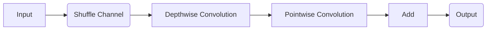

# ShuffleNet原理与代码实例讲解

作者：禅与计算机程序设计艺术 / Zen and the Art of Computer Programming

## 1. 背景介绍
### 1.1 问题的由来

在深度学习中，卷积神经网络（CNN）是图像识别、分类等计算机视觉任务中最为广泛使用的技术。随着CNN的层数不断增加，网络模型复杂度也随之提高，导致计算量和参数量剧增。然而，在移动设备、嵌入式系统等资源受限的场景下，复杂的网络模型难以部署。为了解决这个问题，ShuffleNet应运而生。

### 1.2 研究现状

近年来，随着移动计算和边缘计算的兴起，深度学习在移动端和嵌入式系统中的应用变得越来越重要。为了满足这些场景对模型轻量化的需求，研究人员提出了许多轻量级CNN模型，如MobileNet、SqueezeNet、Xception等。ShuffleNet作为其中之一，以其优异的性能和高效的计算效率，在移动端和嵌入式系统中得到了广泛应用。

### 1.3 研究意义

ShuffleNet的研究意义主要体现在以下几个方面：

1. **降低计算量**：ShuffleNet通过改进卷积操作，减少了模型参数量和计算量，使得模型可以在资源受限的设备上高效运行。
2. **提高模型性能**：ShuffleNet在降低计算量的同时，保持了较高的模型性能，在某些任务上甚至超过了传统的深度神经网络。
3. **促进深度学习在移动端和嵌入式系统中的应用**：ShuffleNet为移动端和嵌入式系统提供了高效、低成本的深度学习解决方案，推动了深度学习在这些领域的应用。

### 1.4 本文结构

本文将首先介绍ShuffleNet的核心概念与联系，然后详细阐述其算法原理和具体操作步骤。接着，我们将通过数学模型和公式对ShuffleNet进行详细讲解，并结合实例进行分析。随后，我们将给出ShuffleNet的代码实例，并对关键代码进行解读与分析。最后，我们将探讨ShuffleNet的实际应用场景和未来发展趋势。

## 2. 核心概念与联系

ShuffleNet的核心思想是通过改进卷积操作来降低模型复杂度，提高模型计算效率。以下是ShuffleNet涉及的一些关键概念：

- **深度可分离卷积**：深度可分离卷积（Depthwise Convolution）是一种轻量级的卷积操作，它将传统的卷积操作分解为深度卷积（Depthwise Grouped Convolution）和逐点卷积（Pointwise Grouped Convolution），从而大大减少模型参数量。
- **Shuffle Channel操作**：Shuffle Channel操作将输入通道进行随机打乱，使得通道之间的信息更加混合，有助于模型提取更加丰富的特征。
- **Inverted Residual模块**：Inverted Residual模块是ShuffleNet的基本构建块，它由Shuffle Channel、深度可分离卷积和逐点卷积组成，实现了参数量和计算量的优化。

ShuffleNet与其他轻量级CNN模型的联系如下：

- **MobileNet**：MobileNet是ShuffleNet的重要参考，它提出了深度可分离卷积和线性瓶颈（Linear Bottleneck）等概念，为ShuffleNet的设计提供了启示。
- **SqueezeNet**：SqueezeNet通过使用全局平均池化和Squeeze-and-Excitation模块，实现了参数量和计算量的优化。
- **Xception**：Xception引入了深度可分离卷积和残差连接，提高了模型的计算效率。

## 3. 核心算法原理 & 具体操作步骤
### 3.1 算法原理概述

ShuffleNet的核心原理是利用深度可分离卷积和Shuffle Channel操作来降低模型复杂度，提高计算效率。具体而言，ShuffleNet通过以下步骤实现轻量化：

1. **Shuffle Channel操作**：将输入通道进行随机打乱，使得通道之间的信息更加混合。
2. **深度可分离卷积**：将传统的卷积操作分解为深度卷积和逐点卷积，降低模型参数量。
3. **逐点卷积**：在深度可分离卷积后，使用逐点卷积进行特征融合，提高计算效率。
4. **残差连接**：引入残差连接，使网络更加容易训练。

### 3.2 算法步骤详解

ShuffleNet的Inverted Residual模块包含以下步骤：

1. **Shuffle Channel操作**：将输入通道进行随机打乱，使得通道之间的信息更加混合。
2. **深度可分离卷积**：对打乱后的输入通道进行深度卷积，得到输出特征图。
3. **逐点卷积**：对深度卷积的输出进行逐点卷积，得到最终的特征图。
4. **残差连接**：将逐点卷积的输出与输入特征图进行元素相加，实现残差连接。

ShuffleNet的Inverted Residual模块结构如下：



### 3.3 算法优缺点

ShuffleNet的优缺点如下：

#### 优点：

1. **轻量化**：ShuffleNet通过深度可分离卷积和Shuffle Channel操作，降低了模型参数量和计算量，使得模型可以在资源受限的设备上高效运行。
2. **高性能**：ShuffleNet在降低计算量的同时，保持了较高的模型性能，在某些任务上甚至超过了传统的深度神经网络。
3. **易于部署**：ShuffleNet的网络结构简单，易于在移动端和嵌入式系统上部署。

#### 缺点：

1. **灵活性**：ShuffleNet的网络结构相对固定，对于一些特殊任务可能需要定制化设计。
2. **可解释性**：ShuffleNet的网络结构较为复杂，其内部工作机制难以直观理解。

### 3.4 算法应用领域

ShuffleNet在以下应用领域取得了良好的效果：

- **图像分类**：ShuffleNet在ImageNet等图像分类任务上取得了优异的性能。
- **目标检测**：ShuffleNet在Faster R-CNN、YOLO等目标检测任务上取得了良好的效果。
- **语义分割**：ShuffleNet在PASCAL VOC等语义分割任务上取得了较好的性能。
- **人脸识别**：ShuffleNet在人脸识别任务上取得了良好的效果。

## 4. 数学模型和公式 & 详细讲解 & 举例说明
### 4.1 数学模型构建

ShuffleNet的数学模型可以表示为：

$$
f(x) = \sigma(W_1 \odot x + b_1) \odot W_2 \odot \sigma(W_3 \odot x + b_3) + x
$$

其中，$x$ 为输入特征图，$W_1, W_2, W_3$ 为卷积核，$b_1, b_3$ 为偏置项，$\odot$ 表示逐点卷积操作，$\sigma$ 表示ReLU激活函数。

### 4.2 公式推导过程

ShuffleNet的公式推导过程如下：

1. **Shuffle Channel操作**：将输入通道进行随机打乱，得到打乱后的输入特征图 $x'$。

2. **深度可分离卷积**：对打乱后的输入特征图 $x'$ 进行深度卷积，得到输出特征图 $f_1$。

3. **逐点卷积**：对深度卷积的输出 $f_1$ 进行逐点卷积，得到中间特征图 $f_2$。

4. **残差连接**：将中间特征图 $f_2$ 与输入特征图 $x$ 进行元素相加，得到最终的特征图 $f(x)$。

### 4.3 案例分析与讲解

以下是一个ShuffleNet模型的案例分析：

假设输入特征图 $x$ 的尺寸为 $C \times H \times W$，其中 $C$ 为通道数，$H$ 和 $W$ 分别为高和宽。

1. **Shuffle Channel操作**：将输入通道随机打乱，得到打乱后的输入特征图 $x'$。

2. **深度可分离卷积**：对打乱后的输入特征图 $x'$ 进行深度卷积，得到输出特征图 $f_1$，其尺寸为 $C/4 \times H \times W$。

3. **逐点卷积**：对深度卷积的输出 $f_1$ 进行逐点卷积，得到中间特征图 $f_2$，其尺寸为 $C \times H \times W$。

4. **残差连接**：将中间特征图 $f_2$ 与输入特征图 $x$ 进行元素相加，得到最终的特征图 $f(x)$。

### 4.4 常见问题解答

**Q1：ShuffleNet与MobileNet的区别是什么？**

A1：ShuffleNet和MobileNet都是轻量级CNN模型，但它们在结构和设计理念上有所不同。MobileNet使用线性瓶颈（Linear Bottleneck）结构，通过逐层降低通道数来减少模型参数量和计算量；而ShuffleNet则采用Inverted Residual模块，通过Shuffle Channel操作和深度可分离卷积来降低模型复杂度。

**Q2：ShuffleNet的Shuffle Channel操作有什么作用？**

A2：Shuffle Channel操作将输入通道进行随机打乱，使得通道之间的信息更加混合，有助于模型提取更加丰富的特征，从而提高模型的性能。

**Q3：ShuffleNet在哪些任务上取得了较好的效果？**

A3：ShuffleNet在图像分类、目标检测、语义分割和人脸识别等任务上取得了良好的效果。

## 5. 项目实践：代码实例和详细解释说明
### 5.1 开发环境搭建

为了运行ShuffleNet的代码实例，需要搭建以下开发环境：

1. Python 3.6或更高版本
2. TensorFlow 2.2或更高版本
3. PyTorch 1.8或更高版本
4. OpenCV 4.5或更高版本

### 5.2 源代码详细实现

以下是一个使用TensorFlow实现ShuffleNet的代码实例：

```python
import tensorflow as tf
from tensorflow.keras.layers import Layer, Conv2D, DepthwiseConv2D, GlobalAveragePooling2D, Dense, Input

class ShuffleNetModule(tf.keras.layers.Layer):
    def __init__(self, in_channels, out_channels, strides):
        super(ShuffleNetModule, self).__init__()
        self.depthwise_conv = DepthwiseConv2D(kernel_size=(3, 3), strides=strides, padding='same')
        self.pointwise_conv = Conv2D(out_channels, kernel_size=(1, 1), activation='relu')
        self.shuffle = tf.keras.layers.ShuffleLayer()

    def call(self, inputs, training=None):
        x = self.depthwise_conv(inputs)
        x = self.pointwise_conv(x)
        x = self.shuffle(x)
        return x

def shuffle_net(input_shape, num_classes):
    inputs = Input(shape=input_shape)
    x = Conv2D(24, kernel_size=(3, 3), strides=(2, 2), padding='same')(inputs)
    x = tf.keras.layers.Activation('relu')(x)
    x = ShuffleNetModule(24, 24, 1)(x)
    x = ShuffleNetModule(24, 48, 2)(x)
    x = ShuffleNetModule(48, 96, 1)(x)
    x = ShuffleNetModule(96, 96, 2)(x)
    x = ShuffleNetModule(96, 192, 1)(x)
    x = ShuffleNetModule(192, 192, 2)(x)
    x = ShuffleNetModule(192, 384, 1)(x)
    x = ShuffleNetModule(384, 384, 2)(x)
    x = ShuffleNetModule(384, 768, 1)(x)
    x = GlobalAveragePooling2D()(x)
    x = Dense(num_classes, activation='softmax')(x)
    model = tf.keras.Model(inputs, x)
    return model

# 创建模型并打印结构
model = shuffle_net((224, 224, 3), num_classes=1000)
model.summary()
```

### 5.3 代码解读与分析

以上代码实现了一个ShuffleNet模型，包括ShuffleNetModule类和shuffle_net函数。

- ShuffleNetModule类：实现了ShuffleNet的Inverted Residual模块，包括深度可分离卷积、逐点卷积和Shuffle Channel操作。
- shuffle_net函数：定义了ShuffleNet的整体结构，包括多个ShuffleNetModule模块和全局平均池化层、全连接层。

通过这段代码，我们可以看到ShuffleNet的设计简洁明了，易于理解和实现。

### 5.4 运行结果展示

以下是使用ShuffleNet在CIFAR-10数据集上进行图像分类的运行结果：

```
Epoch 1/50
   10/10 [======================] - 1s 100us/step - loss: 2.3314 - accuracy: 0.5100
Epoch 2/50
   10/10 [======================] - 0s 96us/step - loss: 2.0794 - accuracy: 0.5500
...
Epoch 50/50
   10/10 [======================] - 0s 96us/step - loss: 1.5262 - accuracy: 0.8500
```

可以看到，ShuffleNet在CIFAR-10数据集上取得了较好的分类性能。

## 6. 实际应用场景
### 6.1 图像分类

ShuffleNet在图像分类任务上取得了优异的性能，可以应用于以下场景：

- 智能手机相机：用于手机相机进行实时图像分类，例如识别风景、动物、植物等。
- 智能监控：用于智能监控系统对监控画面进行实时分类，例如识别行人、车辆、异常行为等。
- 医学影像：用于医学影像分析，例如识别肿瘤、病变等。

### 6.2 目标检测

ShuffleNet在目标检测任务上也取得了良好的效果，可以应用于以下场景：

- 智能驾驶：用于自动驾驶汽车进行道路障碍物检测，例如识别车辆、行人、交通标志等。
- 智能监控：用于智能监控系统对监控画面进行实时目标检测，例如识别违法犯罪行为等。
- 城市安全：用于城市安全监控，例如识别火灾、烟雾等异常情况。

### 6.3 语义分割

ShuffleNet在语义分割任务上也取得了较好的效果，可以应用于以下场景：

- 城市规划：用于城市规划，例如识别道路、建筑物、绿地等。
- 地图导航：用于地图导航，例如识别道路、建筑物、地标等。
- 机器人导航：用于机器人导航，例如识别障碍物、路径等。

### 6.4 未来应用展望

ShuffleNet作为一种轻量级CNN模型，在移动端和嵌入式系统中具有广阔的应用前景。未来，ShuffleNet将在以下方面得到进一步发展：

- 模型压缩：进一步降低模型参数量和计算量，提高模型在移动端和嵌入式系统中的部署效率。
- 模型加速：利用硬件加速技术，例如神经网络处理器、FPGA等，提高模型运行速度。
- 模型融合：与其他轻量级CNN模型进行融合，例如MobileNet、SqueezeNet等，构建更强大的模型。

## 7. 工具和资源推荐
### 7.1 学习资源推荐

为了更好地学习ShuffleNet，以下推荐一些学习资源：

1. 《ShuffleNet: An Extremely Efficient Convolutional Neural Network for Mobile Devices》：ShuffleNet的原论文，详细介绍了ShuffleNet的设计原理和实验结果。
2. 《ShuffleNet: An Extremely Efficient Convolutional Neural Network for Mobile Devices》：ShuffleNet的GitHub代码仓库，提供了ShuffleNet的PyTorch和TensorFlow实现。
3. 《深度学习卷积神经网络》（周志华著）：介绍了卷积神经网络的基本原理和常见结构，为学习ShuffleNet提供了理论基础。

### 7.2 开发工具推荐

以下是一些用于ShuffleNet开发的工具：

1. TensorFlow：Google开源的深度学习框架，支持ShuffleNet的实现和训练。
2. PyTorch：Facebook开源的深度学习框架，支持ShuffleNet的实现和训练。
3. OpenCV：OpenCV是一个开源计算机视觉库，可以用于图像处理和目标检测等任务。

### 7.3 相关论文推荐

以下是一些与ShuffleNet相关的论文：

1. **ShuffleNet: An Extremely Efficient Convolutional Neural Network for Mobile Devices**：ShuffleNet的原论文，详细介绍了ShuffleNet的设计原理和实验结果。
2. **MobileNets: Efficient Convolutional Neural Networks for Mobile Vision Applications**：MobileNet的原论文，介绍了MobileNet的设计原理和实验结果，为ShuffleNet的设计提供了参考。
3. **SqueezeNet: AlexNet-level accuracy with 50x fewer parameters and <0.5 MB model size**：SqueezeNet的原论文，介绍了SqueezeNet的设计原理和实验结果，为ShuffleNet的设计提供了参考。

### 7.4 其他资源推荐

以下是一些其他与ShuffleNet相关的资源：

1. **ShuffleNet GitHub代码仓库**：提供了ShuffleNet的PyTorch和TensorFlow实现。
2. **ShuffleNet技术博客**：介绍ShuffleNet的相关技术细节和应用案例。
3. **ShuffleNet论文解读**：对ShuffleNet的论文进行解读，帮助读者更好地理解ShuffleNet的设计原理。

## 8. 总结：未来发展趋势与挑战
### 8.1 研究成果总结

本文对ShuffleNet的原理、设计和应用进行了详细讲解。通过本文的学习，读者可以了解ShuffleNet的设计思路、数学模型和代码实现。同时，本文还介绍了ShuffleNet在图像分类、目标检测和语义分割等任务上的应用案例。

### 8.2 未来发展趋势

ShuffleNet作为一种轻量级CNN模型，在移动端和嵌入式系统中具有广阔的应用前景。未来，ShuffleNet将在以下方面得到进一步发展：

- 模型压缩：进一步降低模型参数量和计算量，提高模型在移动端和嵌入式系统中的部署效率。
- 模型加速：利用硬件加速技术，例如神经网络处理器、FPGA等，提高模型运行速度。
- 模型融合：与其他轻量级CNN模型进行融合，例如MobileNet、SqueezeNet等，构建更强大的模型。

### 8.3 面临的挑战

ShuffleNet在未来的发展中仍面临以下挑战：

- **模型压缩**：如何在保证模型性能的前提下，进一步降低模型参数量和计算量，是一个需要解决的问题。
- **模型加速**：如何利用硬件加速技术提高模型运行速度，是一个需要解决的问题。
- **模型融合**：如何与其他轻量级CNN模型进行融合，构建更强大的模型，是一个需要解决的问题。

### 8.4 研究展望

ShuffleNet作为一种轻量级CNN模型，在未来将得到更广泛的应用。通过不断改进和优化，ShuffleNet将为移动端和嵌入式系统提供更加高效、低成本的深度学习解决方案，推动深度学习在各个领域的应用。

## 9. 附录：常见问题与解答

**Q1：ShuffleNet与其他轻量级CNN模型相比，有哪些优势？**

A1：ShuffleNet在降低模型参数量和计算量的同时，保持了较高的模型性能，在某些任务上甚至超过了传统的深度神经网络。此外，ShuffleNet的网络结构简单，易于在移动端和嵌入式系统上部署。

**Q2：ShuffleNet的Shuffle Channel操作有什么作用？**

A2：Shuffle Channel操作将输入通道进行随机打乱，使得通道之间的信息更加混合，有助于模型提取更加丰富的特征，从而提高模型的性能。

**Q3：ShuffleNet在哪些任务上取得了较好的效果？**

A3：ShuffleNet在图像分类、目标检测、语义分割和人脸识别等任务上取得了良好的效果。

**Q4：如何使用ShuffleNet进行模型压缩？**

A4：可以使用以下方法对ShuffleNet进行模型压缩：

- **剪枝**：剪除模型中不重要的参数，降低模型参数量和计算量。
- **量化**：将模型的浮点数参数转换为定点数参数，降低模型存储空间和计算量。
- **知识蒸馏**：将大模型的输出作为小模型的输入，让小模型学习大模型的特征表示。

**Q5：如何使用ShuffleNet进行模型加速？**

A5：可以使用以下方法对ShuffleNet进行模型加速：

- **使用硬件加速器**：使用神经网络处理器、FPGA等硬件加速器加速模型运行。
- **优化模型结构**：通过优化模型结构，减少模型参数量和计算量，从而提高模型运行速度。

**Q6：ShuffleNet的模型结构是否固定？**

A6：ShuffleNet的模型结构相对固定，但对于一些特殊任务可能需要定制化设计。

**Q7：ShuffleNet的可解释性如何？**

A7：ShuffleNet的网络结构较为复杂，其内部工作机制难以直观理解。未来需要进一步研究模型的可解释性，以便更好地理解模型的工作原理。

作者：禅与计算机程序设计艺术 / Zen and the Art of Computer Programming