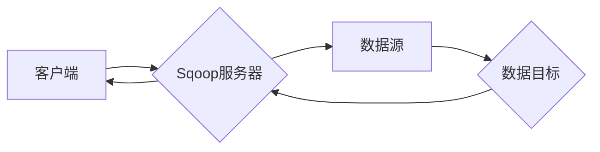

# Sqoop导入导出原理与代码实例讲解

作者：禅与计算机程序设计艺术 / Zen and the Art of Computer Programming

## 1. 背景介绍

### 1.1 问题的由来

随着大数据时代的到来，企业对于数据的处理和分析需求日益增长。数据仓库和数据湖成为了存储和分析大规模数据的重要平台。在数据仓库和数据湖中，Hadoop生态圈中的HDFS（Hadoop Distributed File System）和Hive成为了存储和查询数据的常用工具。然而，当企业需要将数据从其他数据源（如关系型数据库、NoSQL数据库等）迁移到HDFS或Hive时，就需要一种高效、可靠、易于操作的工具来处理数据的导入导出工作。

Sqoop正是为了解决这一需求而诞生的。Sqoop是一款开源的Hadoop数据迁移工具，可以将关系型数据库、NoSQL数据库或其他结构化数据源中的数据导入到HDFS或Hive中，也可以将HDFS或Hive中的数据导出到关系型数据库或其他数据源中。

### 1.2 研究现状

Sqoop自2009年开源以来，已经经历了多个版本的迭代，功能不断完善。目前，Sqoop已经成为Hadoop生态圈中数据迁移的事实标准。许多企业都使用Sqoop进行数据迁移和同步工作。

### 1.3 研究意义

Sqoop在数据迁移和同步领域具有重要的研究意义，主要体现在以下几个方面：

- **提高数据迁移效率**：Sqoop能够高效地处理大规模数据的导入导出，大大缩短了数据迁移时间。
- **降低数据迁移成本**：Sqoop的开源属性降低了数据迁移的实施成本。
- **简化数据迁移操作**：Sqoop提供简单易用的命令行界面和图形界面，降低了数据迁移的操作难度。
- **保证数据迁移质量**：Sqoop提供多种数据校验和清洗功能，保证了数据迁移的质量。

### 1.4 本文结构

本文将详细介绍Sqoop的导入导出原理和代码实例，主要包括以下内容：

- 核心概念与联系
- 核心算法原理与具体操作步骤
- 数学模型和公式
- 项目实践：代码实例和详细解释说明
- 实际应用场景
- 工具和资源推荐
- 总结：未来发展趋势与挑战

## 2. 核心概念与联系

### 2.1 数据源

数据源是指Sqoop需要迁移数据的原始存储位置。Sqoop支持多种数据源，包括关系型数据库、NoSQL数据库、HDFS、Hive等。

### 2.2 数据目标

数据目标是指Sqoop将数据迁移到的目标存储位置。Sqoop支持多种数据目标，包括HDFS、Hive、关系型数据库等。

### 2.3 数据映射

数据映射是指Sqoop将数据源中的数据字段与数据目标中的数据字段之间的映射关系。Sqoop支持多种数据映射方式，包括简单映射、嵌套映射等。

### 2.4 Sqoop架构

Sqoop的架构主要包括以下几个组件：

- Sqoop服务器：负责接收客户端的请求，并协调数据迁移过程。
- Sqoop客户端：负责发送数据迁移请求，并接收数据迁移结果。
- Sqoop Agent：负责与数据源和数据目标进行交互，执行数据迁移任务。

Mermaid流程图如下：



## 3. 核心算法原理与具体操作步骤

### 3.1 算法原理概述

Sqoop的导入导出原理主要包括以下步骤：

1. 客户端向Sqoop服务器发送数据迁移请求。
2. Sqoop服务器解析请求，并创建一个数据迁移任务。
3. Sqoop Agent与数据源和数据目标进行交互，执行数据迁移任务。
4. 数据迁移完成后，Sqoop服务器将结果返回给客户端。

### 3.2 算法步骤详解

以下是Sqoop数据迁移的基本步骤：

1. **创建Sqoop服务器**：
    - 在Sqoop服务器上安装Java环境。
    - 解压Sqoop安装包。
    - 配置Sqoop服务器配置文件。

2. **创建Sqoop客户端**：
    - 在客户端安装Java环境。
    - 解压Sqoop安装包。
    - 配置Sqoop客户端配置文件。

3. **创建数据源和数据目标**：
    - 数据源：根据需要选择关系型数据库或其他数据源，并配置相应的连接信息。
    - 数据目标：选择HDFS或Hive作为数据目标，并配置相应的连接信息。

4. **编写Sqoop命令**：
    - 使用Sqoop命令行工具或图形界面编写数据迁移命令。

5. **执行数据迁移**：
    - 运行Sqoop命令，执行数据迁移任务。

6. **监控数据迁移进度**：
    - 查看Sqoop日志文件，监控数据迁移进度。

7. **验证数据迁移结果**：
    - 检查数据目标中的数据，验证数据迁移结果。

### 3.3 算法优缺点

Sqoop作为一款开源的数据迁移工具，具有以下优点：

- **支持多种数据源和数据目标**：Sqoop支持多种数据源和数据目标，能够满足不同场景下的数据迁移需求。
- **易于使用**：Sqoop提供命令行工具和图形界面，降低了数据迁移的操作难度。
- **高效**：Sqoop采用了并行处理技术，能够高效地处理大规模数据迁移。
- **可靠**：Sqoop提供了数据校验和清洗功能，保证了数据迁移的质量。

然而，Sqoop也存在一些缺点：

- **不支持实时数据同步**：Sqoop不支持实时数据同步，适用于批量数据迁移。
- **性能受限于数据源和数据目标**：Sqoop的性能受限于数据源和数据目标，当数据源或数据目标性能较差时，数据迁移速度会受到影响。

### 3.4 算法应用领域

Sqoop在以下领域得到了广泛的应用：

- **数据仓库建设**：将关系型数据库中的数据迁移到HDFS或Hive中，构建数据仓库。
- **数据湖建设**：将NoSQL数据库或其他数据源中的数据迁移到HDFS或Hive中，构建数据湖。
- **数据集成**：将不同数据源中的数据迁移到HDFS或Hive中，进行数据集成和分析。
- **数据备份**：将数据从HDFS或Hive中迁移到关系型数据库中，进行数据备份。

## 4. 数学模型和公式

Sqoop的数据迁移过程可以抽象为一个数学模型。以下是数据迁移过程中的数学模型和公式：

### 4.1 数学模型构建

假设数据源中有 $N$ 条记录，每条记录有 $M$ 个字段。数据迁移过程可以表示为以下数学模型：

$$
X = \{x_1, x_2, ..., x_N\}
$$

其中，$x_i$ 表示第 $i$ 条记录，$x_i = \{x_{i1}, x_{i2}, ..., x_{iM}\}$ 表示第 $i$ 条记录的 $M$ 个字段。

### 4.2 公式推导过程

假设数据源中的数据记录为 $X$，数据目标中的数据记录为 $Y$。数据迁移过程可以表示为以下数学公式：

$$
Y = F(X)
$$

其中，$F$ 表示数据迁移函数。

### 4.3 案例分析与讲解

假设数据源是一个包含用户信息的表，表结构如下：

```sql
CREATE TABLE users (
    id INT,
    name VARCHAR(50),
    age INT,
    email VARCHAR(100)
);
```

将用户信息迁移到Hive中，可以使用以下Sqoop命令：

```bash
sqoop import --connect jdbc:mysql://localhost:3306/your_database --table users --target-dir /user/hive/warehouse/users_db.db --fields-terminated-by '\t' --lines-terminated-by '\
'
```

其中，`--connect` 参数指定数据源连接信息，`--table` 参数指定数据源表名，`--target-dir` 参数指定数据目标目录，`--fields-terminated-by` 和 `--lines-terminated-by` 参数指定数据格式。

### 4.4 常见问题解答

**Q1：Sqoop支持哪些数据源和数据目标？**

A：Sqoop支持多种数据源和数据目标，包括关系型数据库、NoSQL数据库、HDFS、Hive等。

**Q2：Sqoop如何处理数据类型转换？**

A：Sqoop会根据数据源和数据目标的数据类型进行自动转换。如果数据类型不匹配，Sqoop会进行相应的转换。

**Q3：Sqoop如何进行数据校验和清洗？**

A：Sqoop提供了多种数据校验和清洗功能，如数据去重、数据补全等。

## 5. 项目实践：代码实例和详细解释说明

### 5.1 开发环境搭建

以下是使用Sqoop进行数据迁移的开发环境搭建步骤：

1. 安装Java环境。
2. 下载Sqoop安装包。
3. 解压Sqoop安装包。
4. 配置Sqoop配置文件。

### 5.2 源代码详细实现

以下是使用Sqoop进行数据迁移的代码实例：

```bash
sqoop import --connect jdbc:mysql://localhost:3306/your_database --table users --target-dir /user/hive/warehouse/users_db.db --fields-terminated-by '\t' --lines-terminated-by '\
'
```

### 5.3 代码解读与分析

以上代码实例展示了如何使用Sqoop将关系型数据库中的用户信息迁移到Hive中。

- `sqoop import`：表示执行数据迁移操作。
- `--connect`：表示数据源连接信息。
- `--table`：表示数据源表名。
- `--target-dir`：表示数据目标目录。
- `--fields-terminated-by`：表示字段分隔符。
- `--lines-terminated-by`：表示行分隔符。

### 5.4 运行结果展示

数据迁移完成后，可以使用以下命令查看Hive中的数据：

```bash
hive -e "select * from users_db.users;"
```

输出结果如下：

```
+----+------------------+------+-------------------+
| id | name             | age  | email             |
+----+------------------+------+-------------------+
| 1  | 张三             | 25   | zhangsan@example.com |
| 2  | 李四             | 30   | lisi@example.com  |
| 3  | 王五             | 35   | wangwu@example.com |
+----+------------------+------+-------------------+
```

## 6. 实际应用场景

### 6.1 数据仓库建设

将关系型数据库中的数据迁移到HDFS或Hive中，构建数据仓库，为数据分析提供数据基础。

### 6.2 数据湖建设

将NoSQL数据库或其他数据源中的数据迁移到HDFS或Hive中，构建数据湖，进行数据存储和分析。

### 6.3 数据集成

将不同数据源中的数据迁移到HDFS或Hive中，进行数据集成和分析。

### 6.4 数据备份

将数据从HDFS或Hive中迁移到关系型数据库中，进行数据备份。

## 7. 工具和资源推荐

### 7.1 学习资源推荐

- 《Sqoop权威指南》
- 《Hadoop权威指南》
- 《Hive权威指南》

### 7.2 开发工具推荐

- Sqoop客户端
- Sqoop图形界面工具

### 7.3 相关论文推荐

- 《Sqoop: An Extensible and Scalable MapReduce Data Transfer Tool》

### 7.4 其他资源推荐

- Apache Sqoop官方文档
- Hadoop官方文档
- Hive官方文档

## 8. 总结：未来发展趋势与挑战

### 8.1 研究成果总结

本文对Sqoop的导入导出原理和代码实例进行了详细讲解，涵盖了Sqoop的核心概念、算法原理、操作步骤、数学模型和公式、项目实践、实际应用场景等内容。通过学习本文，读者可以深入了解Sqoop的工作原理，并能够熟练使用Sqoop进行数据迁移和同步工作。

### 8.2 未来发展趋势

随着大数据技术的发展，Sqoop将呈现以下发展趋势：

- **支持更多数据源和数据目标**：Sqoop将支持更多类型的数据源和数据目标，如区块链、边缘计算等。
- **提供更丰富的数据转换功能**：Sqoop将提供更多数据转换功能，如数据清洗、数据脱敏等。
- **集成更多大数据技术**：Sqoop将与其他大数据技术（如Spark、Flink等）进行集成，提供更强大的数据迁移能力。

### 8.3 面临的挑战

Sqoop在发展过程中也面临着以下挑战：

- **性能优化**：随着数据规模的不断扩大，Sqoop的性能优化将成为重要研究方向。
- **安全性提升**：数据安全和隐私保护将成为Sqoop的重要关注点。
- **易用性改进**：Sqoop的易用性需要进一步提升，降低用户的学习成本。

### 8.4 研究展望

Sqoop作为一款开源的数据迁移工具，在数据迁移和同步领域具有重要的应用价值。未来，Sqoop将继续完善功能，提升性能，为大数据时代的数据迁移和同步工作提供更加高效、可靠、易用的解决方案。

## 9. 附录：常见问题与解答

**Q1：什么是Sqoop？**

A：Sqoop是一款开源的Hadoop数据迁移工具，可以将关系型数据库、NoSQL数据库或其他结构化数据源中的数据导入到HDFS或Hive中，也可以将HDFS或Hive中的数据导出到关系型数据库或其他数据源中。

**Q2：Sqoop如何进行数据迁移？**

A：Sqoop通过Sqoop服务器和Sqoop Agent进行数据迁移。客户端向Sqoop服务器发送数据迁移请求，Sqoop服务器解析请求，并协调Sqoop Agent与数据源和数据目标进行交互，执行数据迁移任务。

**Q3：Sqoop支持哪些数据源和数据目标？**

A：Sqoop支持多种数据源和数据目标，包括关系型数据库、NoSQL数据库、HDFS、Hive等。

**Q4：Sqoop如何处理数据类型转换？**

A：Sqoop会根据数据源和数据目标的数据类型进行自动转换。如果数据类型不匹配，Sqoop会进行相应的转换。

**Q5：Sqoop如何进行数据校验和清洗？**

A：Sqoop提供了多种数据校验和清洗功能，如数据去重、数据补全等。