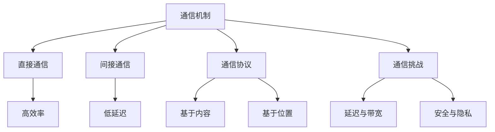
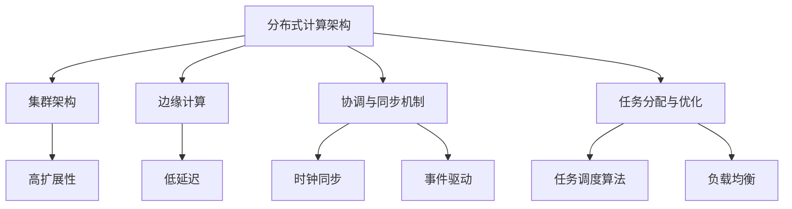
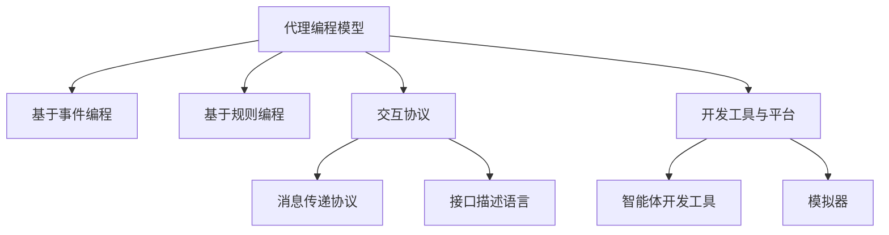
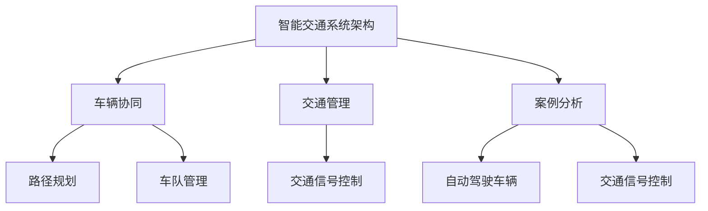
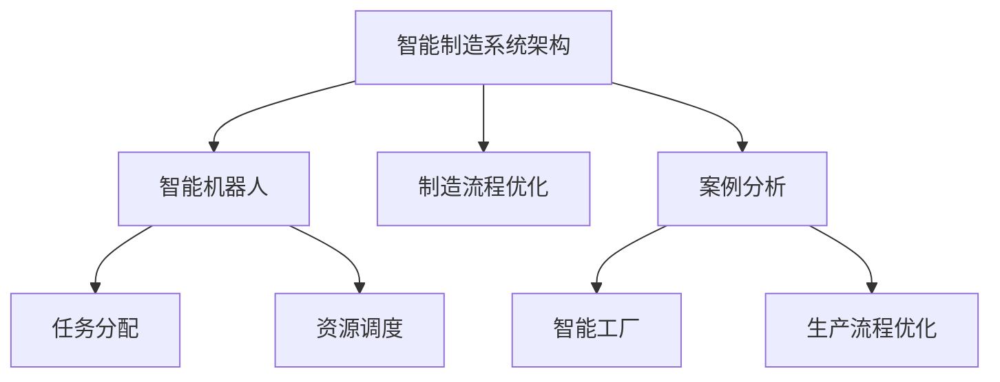
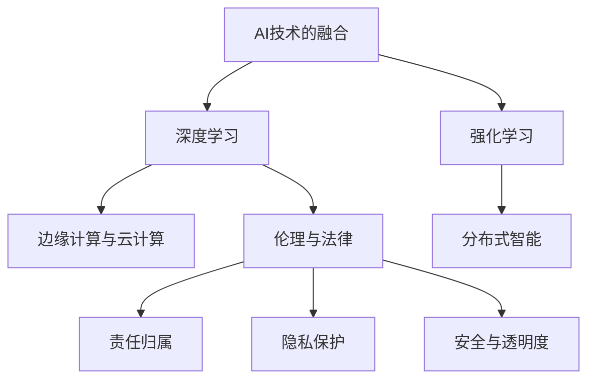
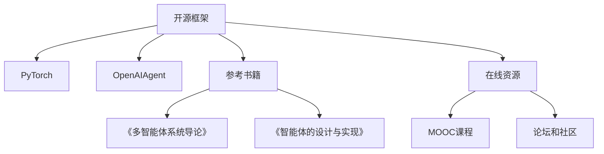

                 

### AI的下一个风口——多智能体系统的未来

关键词：多智能体系统、MAS、AI、分布式计算、边缘计算、智能交通、智能制造、协同、自主性、通信机制、架构、编程模型、应用实践、未来发展趋势

摘要：随着人工智能技术的迅猛发展，多智能体系统（MAS）成为了当前和未来智能系统设计中的重要方向。本文旨在全面探讨多智能体系统的基本概念、架构、编程模型及其在各领域的应用实践，并展望其未来的发展趋势。通过对多智能体系统的深入分析，我们希望揭示其潜在的技术挑战和解决方法，以及其在人工智能领域中的关键角色和广泛影响。

### 第一部分: AI的下一个风口——多智能体系统的基本概念

#### 第1章: 多智能体系统的定义与特点

**多智能体系统（MAS）** 是指由多个具有感知、决策和执行能力的智能体组成的系统，这些智能体可以分布在不同的环境或地理位置，通过通信机制实现协作，共同完成复杂的任务。这里的 **智能体（Agent）** 通常被定义为具有独立思考能力和行动能力的实体，它们可以自主感知环境、理解信息、做出决策并执行相应的行为。

**多智能体系统的特点** 可以概括为以下几点：

1. **分布式**：智能体分布在不同的地理位置或环境中，这使得多智能体系统能够处理大规模的数据和任务，同时提高了系统的容错性和灵活性。
2. **自主性**：每个智能体具有独立的决策能力，可以根据自身感知的环境信息自主选择行为，而不需要中央控制。
3. **协同性**：智能体之间需要通过通信机制相互协作，共同完成任务。协同性是多智能体系统的核心特点，也是其复杂性的来源。

**多智能体系统的应用场景** 非常广泛，以下是一些典型的例子：

- **物流与配送**：智能配送机器人可以协同工作，提高物流配送的效率。
- **智能交通**：车辆之间通过通信实现智能协调，减少交通拥堵，提高道路利用率。
- **智能制造**：智能机器人可以协同完成生产任务，提高生产效率和灵活性。

**图1. 多智能体系统的基本概念与特点**

```mermaid
graph TD
    A[多智能体系统(MAS)] --> B[智能体(Agent)]
    B --> C[分布式]
    B --> D[自主性]
    B --> E[协同性]
    A --> F[应用场景]
    F --> G[物流与配送]
    F --> H[智能交通]
    F --> I[智能制造]
```

#### 第2章: 多智能体系统的通信机制

**通信机制** 是多智能体系统中至关重要的组成部分，它决定了智能体之间如何交换信息、协调行动。多智能体系统的通信机制可以分为以下几种：

1. **直接通信**：智能体直接与其他智能体进行通信，这种方式具有较高的通信效率，但需要智能体具备较高的计算能力和通信带宽。
2. **间接通信**：智能体通过中间代理进行通信，这种方式可以减少直接通信的数量，降低系统的通信开销，但可能引入额外的延迟和复杂性。

**通信协议** 是通信机制的具体实现，常见的通信协议包括：

1. **基于内容的通信**：智能体通过共享的信息进行通信，例如共享地图、路径信息等。
2. **基于位置的通信**：智能体通过地理位置进行通信，这种方式适用于需要根据地理位置进行协调的场景。

**通信挑战** 是多智能体系统面临的重大挑战，主要包括：

- **延迟与带宽限制**：通信过程中的延迟和带宽限制会影响系统的响应速度和性能。
- **安全与隐私**：通信过程中的安全性和隐私保护是必须考虑的问题，防止恶意攻击和信息泄露。

**图2. 多智能体系统的通信机制**



### 第二部分: 多智能体系统的架构与技术基础

#### 第3章: 多智能体系统的架构

**多智能体系统的架构** 是指系统的整体结构及其组件的配置。一个良好的架构能够确保多智能体系统的高效运行和可扩展性。多智能体系统的架构可以从多个维度进行设计，包括：

1. **分布式计算架构**：多智能体系统通常采用分布式计算架构，利用多个计算节点协同工作，实现大规模数据处理和任务分配。常见的分布式计算架构包括集群架构和边缘计算。
2. **协调与同步机制**：协调与同步机制是确保多智能体系统能够有效协作的关键。时钟同步和事件驱动机制是两种常用的协调与同步机制。
3. **任务分配与优化**：任务分配与优化是多智能体系统架构中重要的组成部分。任务调度算法和负载均衡机制是确保系统能够高效利用资源的关键技术。

**分布式计算架构** 可以分为以下几种：

1. **集群架构**：多台计算机组成一个集群，每个计算机节点上运行一个智能体，通过网络进行通信。集群架构适用于需要处理大规模数据和任务的场景。
2. **边缘计算**：将计算任务分配到靠近数据源的设备上，例如智能设备、传感器等。边缘计算可以提高系统的响应速度和数据处理效率，适用于实时性要求较高的场景。

**协调与同步机制**：

1. **时钟同步**：确保智能体之间的时间同步，以便在时间维度上进行协调。常见的时钟同步机制包括NTP（网络时间协议）和GPS（全球定位系统）。
2. **事件驱动机制**：智能体基于事件进行协调，每个智能体在接收到事件后做出相应的决策和行动。事件驱动机制具有灵活性和响应速度快的特点。

**任务分配与优化**：

1. **任务调度算法**：智能体根据自身的计算能力和环境信息，选择合适的任务进行执行。常见的任务调度算法包括负载均衡算法和动态调度算法。
2. **负载均衡**：智能体之间通过负载均衡机制，分配任务以达到系统的整体性能最优。负载均衡机制可以防止某一部分过载，确保系统的高可用性和稳定性。

**图3. 多智能体系统的架构**



#### 第4章: 多智能体系统的编程模型

**多智能体系统的编程模型** 是指智能体的设计和实现方法，以及智能体之间的通信和协作方式。多智能体系统的编程模型可以从以下几个方面进行设计：

1. **代理编程模型**：代理编程模型是一种基于代理（Agent）的设计方法，智能体被视为具有自主性和协同能力的代理，通过代理编程模型可以方便地设计、实现和测试多智能体系统。
2. **交互协议**：交互协议定义了智能体之间如何进行通信和协作，常见的交互协议包括消息传递协议和接口描述语言。
3. **开发工具与平台**：开发工具和平台为多智能体系统的开发提供了便捷的工具和环境，常见的开发工具和平台包括智能体开发工具和模拟器。

**代理编程模型**：

1. **基于事件编程**：智能体基于事件进行编程，事件可以是环境中的变化、其他智能体的动作等。基于事件编程具有灵活性和响应速度快的特点。
2. **基于规则编程**：智能体基于规则进行编程，规则定义了智能体在不同情况下的行为。基于规则编程具有简单性和可解释性的特点。

**交互协议**：

1. **消息传递协议**：消息传递协议定义了智能体之间如何传递消息。常见的消息传递协议包括基于内容的通信和基于位置的通信。
2. **接口描述语言**：接口描述语言用于描述智能体的接口，定义了智能体之间的交互方式和数据格式。常见的接口描述语言包括SOAP和REST。

**开发工具与平台**：

1. **智能体开发工具**：智能体开发工具用于创建和测试智能体，常见的智能体开发工具包括AgentSmith和AgentBuilder。
2. **模拟器**：模拟器用于模拟智能体环境，测试多智能体系统的性能和稳定性。常见的模拟器包括Multi-Agent Simulation Toolkit（MASim）和Multi-Agent-based Simulation Platform（MASP）。

**图4. 多智能体系统的编程模型**



### 第三部分: 多智能体系统的应用实践

#### 第5章: 多智能体系统在智能交通中的应用

**智能交通系统架构** 是指智能交通系统中的各个组成部分及其相互关系。智能交通系统通常包括以下几个关键组件：

1. **车辆协同**：车辆之间通过通信实现协同驾驶，提高道路利用率和行车安全性。
2. **交通管理**：智能体参与交通管理和优化，包括交通信号控制、路况预测和交通流量调控等。

**协同驾驶算法** 是智能交通系统中实现车辆协同的关键技术。以下是一些常见的协同驾驶算法：

1. **路径规划**：智能体根据交通状况和车辆信息，规划最优路径，减少交通拥堵和行车时间。
2. **车队管理**：智能体协同管理车队，提高运输效率和安全性。车队管理包括任务分配、路径优化、车队调度等。

**案例分析**：

1. **自动驾驶车辆**：自动驾驶车辆通过多智能体系统实现协同驾驶，提高行车安全性和效率。自动驾驶车辆可以与周围车辆、交通信号和路况进行实时通信，根据环境信息进行自主决策。
2. **交通信号控制**：智能体参与交通信号控制，优化交通流量。智能体可以实时收集交通信息，根据路况和交通流量情况调整信号灯的变化周期，提高道路通行效率。

**图5. 多智能体系统在智能交通中的应用**



#### 第6章: 多智能体系统在智能制造中的应用

**智能制造系统架构** 是指智能制造系统中的各个组成部分及其相互关系。智能制造系统通常包括以下几个关键组件：

1. **智能机器人**：智能机器人协同完成生产任务，提高生产效率和灵活性。
2. **制造流程优化**：智能体优化制造流程，提高生产效率和降低成本。

**协同生产算法** 是智能制造系统中实现智能机器人协同生产的关键技术。以下是一些常见的协同生产算法：

1. **任务分配**：智能体根据自身的计算能力和环境信息，选择合适的任务进行执行，实现任务的合理分配和高效执行。
2. **资源调度**：智能体根据任务需求和资源状况，优化资源分配和调度，确保生产资源的最优利用。

**案例分析**：

1. **智能工厂**：智能工厂通过多智能体系统实现生产过程的自动化和智能化。智能机器人可以协同完成从原材料处理、生产加工到产品检验的各个环节，提高生产效率和降低成本。
2. **生产流程优化**：智能体参与生产流程优化，通过实时监控和数据分析，识别生产瓶颈和优化机会，提出改进措施，提高生产效率和降低成本。

**图6. 多智能体系统在智能制造中的应用**



### 第四部分: 多智能体系统的未来发展趋势

#### 第7章: 多智能体系统的未来发展方向

随着人工智能技术的不断发展和成熟，多智能体系统（MAS）在未来将面临许多新的机遇和挑战。以下是对多智能体系统未来发展趋势的探讨：

1. **AI技术的融合**：多智能体系统将与其他人工智能技术，如深度学习和强化学习，进行深度融合。深度学习可以帮助智能体从海量数据中学习模式和规律，强化学习则可以让智能体通过试错和反馈不断优化决策。
   
2. **边缘计算与云计算的结合**：未来的多智能体系统将更多地采用边缘计算与云计算的结合，以提高系统的实时性和响应速度。边缘计算可以在数据源头进行预处理和实时分析，而云计算则可以提供强大的计算能力和数据存储。
   
3. **分布式智能**：随着物联网和传感器网络的普及，未来的多智能体系统将更加分布式，智能体将分布在各种设备和节点上，形成一个庞大的分布式智能网络。这种分布式智能将能够更好地应对复杂的、动态的环境。
   
4. **多智能体系统的伦理与法律**：随着多智能体系统在各个领域的广泛应用，其伦理和法律问题也日益突出。如何界定智能体之间的责任归属、保护用户隐私、确保系统的安全性和透明度，将成为未来研究的重要方向。

**图7. 多智能体系统的未来发展方向**



### 附录

#### 附录A: 多智能体系统资源与工具

在多智能体系统的开发和研究过程中，有许多开源框架、参考书籍和在线资源可以帮助开发者更好地理解和应用这一技术。以下是一些常用的资源：

1. **开源框架**：
   - **PyTorch**：是一个流行的深度学习框架，可以用于构建和训练多智能体系统。
   - **OpenAIAgent**：是一个开源的多智能体系统平台，提供了丰富的API和工具，方便开发者进行智能体的创建和测试。

2. **参考书籍**：
   - **《多智能体系统导论》**：这是一本全面介绍多智能体系统的入门书籍，涵盖了基本概念、架构和编程模型等内容。
   - **《智能体的设计与实现》**：详细讲解了智能体的设计和实现技术，包括基于事件和基于规则的编程方法。

3. **在线资源**：
   - **MOOC课程**：许多大学和在线教育平台提供了关于多智能体系统的MOOC课程，如MIT的“Introduction to Multi-Agent Systems”等。
   - **论坛和社区**：如IEEE的“Multi-Agent Systems Community”和Google的“AI Forum”，这些论坛和社区提供了丰富的技术讨论和资源分享。

**图A. 多智能体系统资源与工具**



### 作者信息

作者：AI天才研究院/AI Genius Institute & 禅与计算机程序设计艺术 /Zen And The Art of Computer Programming

本文旨在全面探讨多智能体系统的基本概念、架构、编程模型及其在各领域的应用实践，并展望其未来的发展趋势。通过对多智能体系统的深入分析，我们希望揭示其潜在的技术挑战和解决方法，以及其在人工智能领域中的关键角色和广泛影响。本文参考了大量国内外相关研究文献，力求为读者提供全面而深入的技术见解。读者如有任何疑问或建议，欢迎随时与我们联系。感谢您的阅读！<|endoftext|>### 结论

本文通过对多智能体系统的定义、特点、通信机制、架构、编程模型以及应用实践和未来发展趋势的全面探讨，揭示了多智能体系统在人工智能领域中的重要地位和广泛应用前景。多智能体系统以其分布式、自主性和协同性的特点，为解决复杂问题提供了新的思路和方法。

首先，多智能体系统通过分布式的架构，能够处理大规模的数据和任务，提高了系统的容错性和灵活性。其次，智能体的自主性使得系统能够自主感知环境、做出决策并执行行为，减少了中央控制的复杂性。最后，智能体之间的协同性使得系统能够有效地合作，共同完成任务，提高了系统的整体性能。

在通信机制方面，多智能体系统采用了直接通信和间接通信两种方式，以及基于内容和基于位置的通信协议。这些机制为智能体之间的信息交换和协作提供了有效的支持。然而，通信过程中的延迟和带宽限制、安全与隐私保护等问题仍需要进一步研究和解决。

在架构和技术基础方面，多智能体系统采用了分布式计算架构、协调与同步机制以及任务分配与优化技术。这些架构和技术基础为多智能体系统的高效运行提供了保障。此外，代理编程模型、交互协议和开发工具与平台也为多智能体系统的开发提供了便利。

在应用实践方面，多智能体系统在智能交通和智能制造等领域展现了巨大的潜力。通过车辆协同、交通管理和制造流程优化等应用案例，我们可以看到多智能体系统如何提高效率和降低成本，解决现实问题。

展望未来，多智能体系统将与其他人工智能技术如深度学习和强化学习进行深度融合，实现更智能、更高效的系统。边缘计算与云计算的结合将为多智能体系统提供更强大的计算能力和数据处理能力。分布式智能将使得智能体更加分布化、智能化，形成庞大的智能网络。

然而，多智能体系统的发展也面临着诸多挑战，如伦理与法律问题、责任归属、隐私保护等。因此，我们需要在技术发展的同时，关注并解决这些问题，确保多智能体系统的可持续发展。

总之，多智能体系统作为人工智能领域的一个重要分支，具有广阔的应用前景和重要的发展潜力。本文希望为读者提供对多智能体系统的全面了解，并激发对这一领域的进一步研究和探索。我们相信，随着技术的不断进步和应用场景的拓展，多智能体系统将在未来发挥更加重要的作用。

