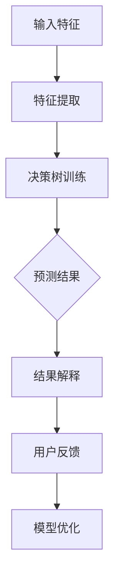
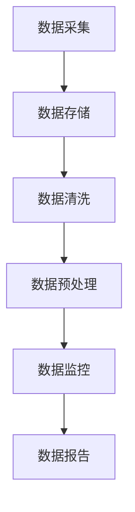

                 

# 《AI伦理：确保人工智能提供的信息准确可靠》

## 关键词：人工智能，伦理，准确性，可靠性，透明度，公平性，安全性，隐私保护

### 摘要
人工智能（AI）作为当今技术发展的热点，已经深入到我们的日常生活中。然而，随着AI技术的广泛应用，AI伦理问题也日益凸显。本文旨在探讨AI伦理的核心概念、基本原则以及实践方法，重点关注如何确保AI提供的信息准确可靠。我们将详细分析AI算法的准确性和可靠性，探讨数据质量管理、算法验证与测试以及模型监控与反馈等措施，并提出AI伦理教育的建议。通过本文，读者可以更好地理解AI伦理的重要性，并学会如何在实践中遵循AI伦理原则。

### 目录

## 第一部分：AI伦理基础

### 第1章：AI伦理概述

### 第2章：AI伦理的框架与实践

### 第3章：AI算法的可靠性与准确性

### 第4章：AI信息准确性的保障措施

### 第5章：AI伦理与社会互动

### 第6章：AI伦理教育与培训

### 第7章：AI伦理的未来展望

---

## 第一部分：AI伦理基础

### 第1章：AI伦理概述

### 1.1 AI伦理的定义与重要性

#### 1.1.1 AI伦理的定义

人工智能伦理（AI Ethics）是指在人工智能系统设计、开发、部署和应用过程中，遵循的一系列道德准则和伦理原则。它关注的是如何确保AI技术对人类社会的积极影响，同时避免可能的负面影响。AI伦理不仅涉及技术层面，还涉及法律、社会、文化等多个方面。

#### 1.1.2 AI伦理的重要性

AI伦理的重要性主要体现在以下几个方面：

1. **保护用户隐私**：AI系统在处理海量数据时，需要严格保护用户的隐私权，防止数据泄露和滥用。
2. **促进社会公平**：AI技术不应加剧社会不平等，而应有助于减少歧视和偏见。
3. **确保技术可靠性**：AI系统在提供信息和服务时必须可靠，以确保用户得到准确、有用的信息。
4. **增强公众信任**：遵循AI伦理原则可以增强公众对AI技术的信任，促进AI技术的普及和应用。

#### 1.1.3 AI伦理的发展历程

AI伦理的概念起源于20世纪70年代，当时计算机科学家开始关注人工智能可能带来的道德问题。1980年代，随着人工智能技术的快速发展，AI伦理研究逐渐成为一个独立的领域。近年来，随着AI技术的广泛应用，AI伦理问题变得更加复杂和紧迫。

### 1.2 AI伦理的基本原则

AI伦理的基本原则是确保AI系统的公正性、透明度、可靠性、可解释性和安全性。以下是这些原则的具体内容：

#### 1.2.1 公平性

公平性要求AI系统在处理数据和应用算法时，不应因种族、性别、年龄等因素而对用户产生偏见。例如，在招聘系统中，算法不应因申请者的性别或种族而做出不公平的决策。

#### 1.2.2 透明度

透明度要求AI系统的决策过程应透明，用户应能够理解AI系统是如何做出决策的。这包括公开算法的原理、数据来源和决策规则等。

#### 1.2.3 可靠性

可靠性要求AI系统在提供信息和服务时必须可靠，确保提供的信息准确无误。例如，自动驾驶系统在行驶过程中必须具备高可靠性的决策能力，以确保乘客的安全。

#### 1.2.4 可解释性

可解释性要求AI系统的决策过程应具备可解释性，以便用户能够理解AI系统是如何做出决策的。这对于提高用户对AI系统的信任至关重要。

#### 1.2.5 安全性

安全性要求AI系统在设计和应用过程中必须具备足够的安全措施，以防止恶意攻击和数据泄露。例如，医疗AI系统必须保护患者的医疗数据，防止数据被未授权访问。

### 1.3 AI伦理面临的挑战与争议

AI伦理在实践过程中面临诸多挑战和争议，主要包括：

#### 1.3.1 AI偏见与歧视

AI偏见与歧视是AI伦理领域的重要问题。例如，如果训练数据中存在性别或种族偏见，AI系统可能会在决策过程中体现这些偏见，导致不公平的结果。

#### 1.3.2 数据隐私保护

数据隐私保护是AI伦理的另一个关键问题。AI系统在处理数据时，需要确保用户隐私不被泄露或滥用。

#### 1.3.3 AI责任归属

当AI系统造成损害时，责任归属问题变得复杂。是责任归于开发者、使用者还是算法本身？如何界定责任？这些问题需要深入探讨和明确。

#### 1.3.4 AI与就业市场

AI技术的发展可能导致某些传统职业的减少，引发就业市场的不稳定。如何平衡AI技术的发展与就业市场的稳定，是AI伦理需要关注的问题。

### 第2章：AI伦理的框架与实践

#### 2.1 AI伦理框架的设计与实施

AI伦理框架是确保AI系统遵循伦理原则的重要工具。以下是设计AI伦理框架的步骤：

##### 2.1.1 确定项目目标和范围

首先，需要明确AI项目的目标和范围，以便确定需要遵循的伦理原则。

##### 2.1.2 进行伦理风险评估

在项目启动阶段，应进行伦理风险评估，识别可能出现的伦理问题，并制定相应的应对措施。

##### 2.1.3 制定伦理准则和标准

根据伦理风险评估的结果，制定详细的伦理准则和标准，以确保项目在开发和部署过程中遵循伦理原则。

##### 2.1.4 进行项目执行和监控

在项目执行过程中，需要定期监控项目的伦理表现，确保项目始终遵循伦理准则。

##### 2.1.5 定期审查和更新

随着技术的发展和项目的进展，需要定期审查和更新伦理框架，以适应新的伦理挑战。

#### 2.2 AI伦理实践案例研究

以下是一些AI伦理实践案例：

##### 2.2.1 案例一：医疗AI伦理实践

医疗AI在诊断和治疗中具有巨大潜力，但也面临伦理挑战。例如，在诊断决策中，如何确保AI系统不偏不倚地处理不同种族、性别和年龄的患者数据？

##### 2.2.2 案例二：自动驾驶AI伦理实践

自动驾驶技术在提高交通效率、减少交通事故方面具有巨大潜力。然而，在应对突发情况时，自动驾驶系统如何做出道德决策，以最小化人员伤亡？

##### 2.2.3 案例三：AI在法律领域的伦理实践

AI在法律领域的应用，如自动化合同审核、法律研究等，也面临伦理挑战。例如，如何确保AI系统的决策过程透明、公正，以及如何处理AI系统产生的法律意见的可靠性？

#### 2.3 AI伦理标准化与法规

AI伦理标准化和法规是确保AI系统遵循伦理原则的重要手段。以下是相关内容：

##### 2.3.1 国际AI伦理标准

国际社会正在制定一系列AI伦理标准，如ISO/IEC 27001、ISO/IEC 27002等，旨在规范AI系统的开发、部署和应用。

##### 2.3.2 国家AI伦理法规

各国政府也在制定AI伦理法规，以规范AI系统的开发和应用。例如，欧盟的《通用数据保护条例》（GDPR）对AI系统的数据隐私保护提出了严格要求。

##### 2.3.3 企业AI伦理规范

企业应制定AI伦理规范，以确保其AI系统遵循伦理原则。这些规范应包括AI系统的设计、开发、部署、监控和评估等方面。

### 第3章：AI算法的可靠性与准确性

#### 3.1 AI算法的准确性评估

AI算法的准确性是评估其性能的重要指标。以下内容将介绍评估AI算法准确性的方法：

##### 3.1.1 准确性评价指标

常用的准确性评价指标包括精确率、召回率、F1分数和准确率。以下是这些评价指标的公式：

$$
\text{精确率} = \frac{\text{实际为正且预测为正的样本数}}{\text{预测为正的样本数}}
$$

$$
\text{召回率} = \frac{\text{实际为正且预测为正的样本数}}{\text{实际为正的样本数}}
$$

$$
\text{F1分数} = 2 \times \frac{\text{精确率} \times \text{召回率}}{\text{精确率} + \text{召回率}}
$$

$$
\text{准确率} = \frac{\text{预测正确的样本数}}{\text{总样本数}}
$$

##### 3.1.2 实际应用中的准确性挑战

在实际应用中，AI算法的准确性可能受到以下因素的影响：

1. **数据质量**：数据质量差会导致算法性能下降。
2. **模型选择**：选择不当的模型会影响算法准确性。
3. **超参数调优**：超参数设置不当会导致算法性能下降。

##### 3.1.3 提高算法准确性的方法

以下是一些提高AI算法准确性的方法：

1. **数据预处理**：包括数据清洗、归一化和缺失值处理等。
2. **模型选择**：选择适合问题的模型，如神经网络、决策树和支持向量机等。
3. **超参数调优**：使用网格搜索、随机搜索等方法寻找最佳超参数。
4. **多模型集成**：结合多个模型的预测结果，提高整体准确性。

#### 3.2 AI算法的可靠性分析

AI算法的可靠性是评估其性能的另一个重要指标。以下内容将介绍评估AI算法可靠性的方法：

##### 3.2.1 可靠性指标

常用的可靠性指标包括算法稳定性、鲁棒性和错误率。以下是这些指标的定义：

$$
\text{稳定性} = \frac{\text{预测一致的样本数}}{\text{总样本数}}
$$

$$
\text{鲁棒性} = \frac{\text{在扰动数据上的准确性}}{\text{在原始数据上的准确性}}
$$

$$
\text{错误率} = 1 - \text{准确性}
$$

##### 3.2.2 算法稳定性与鲁棒性

算法稳定性是指模型在处理不同数据时能够保持一致的预测结果。鲁棒性是指模型对数据扰动、噪声和异常值的容忍能力。

##### 3.2.3 鲁棒性设计方法

以下是一些提高算法鲁棒性的方法：

1. **数据增强**：通过增加数据多样性和复杂性来提高模型鲁棒性。
2. **数据清洗**：去除异常值、噪声和错误数据。
3. **模型正则化**：通过添加正则化项来降低模型过拟合风险。
4. **集成学习**：结合多个模型的预测结果，提高整体鲁棒性。

#### 3.3 AI算法的透明性与可解释性

AI算法的透明性和可解释性是确保其决策过程可信的重要方面。以下内容将介绍提高AI算法透明性和可解释性的方法：

##### 3.3.1 透明性要求

透明性要求AI系统的决策过程能够被用户理解和验证。这包括提供模型结构、参数设置和决策规则等信息。

##### 3.3.2 可解释性技术

可解释性技术包括可视化、解释性模型和解释性算法等。以下是一个使用Mermaid流程图展示的决策树的可解释性流程：

##### 3.3.3 可解释性在实际应用中的挑战

在实际应用中，提高AI算法的可解释性面临以下挑战：

1. **复杂性**：一些高级AI算法（如深度学习）的决策过程非常复杂，难以解释。
2. **数据隐私**：为了保护用户隐私，部分信息可能无法公开。
3. **性能损失**：提高可解释性可能会牺牲算法性能。

### 第4章：AI信息准确性的保障措施

#### 4.1 数据质量管理

数据质量管理是确保AI系统提供准确信息的基础。以下内容将介绍数据质量管理的步骤和方法：

##### 4.1.1 数据质量标准

数据质量标准包括准确性、完整性、一致性、及时性和可靠性等。以下是数据质量标准的具体内容：

1. **准确性**：数据应真实、可靠，无错误或误导信息。
2. **完整性**：数据应包含所有必要的字段和记录，无遗漏。
3. **一致性**：数据应遵循统一的格式和标准，确保数据在系统间的一致性。
4. **及时性**：数据应能够及时更新，确保实时性和准确性。
5. **可靠性**：数据应具备高可靠性，能够在不同系统和环境中稳定存储和传输。

##### 4.1.2 数据清洗与预处理

数据清洗与预处理是提高数据质量的重要步骤。以下是一些常见的数据清洗与预处理方法：

1. **去除重复数据**：检测并删除重复的记录，确保数据的唯一性。
2. **填补缺失值**：处理缺失值，如使用平均值、中位数或插值法进行填补。
3. **归一化**：将数据缩放到相同的尺度，以消除数据量级差异的影响。
4. **特征工程**：创建新的特征，以增强模型的预测能力。

##### 4.1.3 数据质量管理工具

数据质量管理工具包括数据监控平台、数据治理工具和数据可视化工具等。以下是一个使用Mermaid流程图展示的数据质量管理流程：

#### 4.2 AI算法验证与测试

AI算法验证与测试是确保AI系统提供准确信息的关键步骤。以下内容将介绍算法验证与测试的方法：

##### 4.2.1 算法验证流程

算法验证流程包括以下步骤：

1. **数据集划分**：将数据集划分为训练集、验证集和测试集。
2. **模型训练**：使用训练集训练模型，调整模型参数。
3. **模型评估**：使用验证集评估模型性能，调整模型参数。
4. **模型测试**：使用测试集测试模型性能，评估模型的泛化能力。

##### 4.2.2 算法测试方法

以下是一些常见的算法测试方法：

1. **单元测试**：对模型的每个部分进行测试，确保每个部分都能正常工作。
2. **集成测试**：对整个模型进行测试，确保模型的整体性能。
3. **性能测试**：评估模型的准确性、召回率、F1分数等性能指标。
4. **可靠性测试**：评估模型的稳定性和鲁棒性。

##### 4.2.3 持续测试与迭代

持续测试与迭代是指在整个开发周期中不断测试和改进模型。以下是一些持续测试与迭代的方法：

1. **定期评估**：定期评估模型性能，识别潜在问题。
2. **反馈机制**：建立用户反馈机制，收集用户对模型反馈，用于改进模型。
3. **模型更新**：根据测试结果和用户反馈，更新模型参数和算法。

#### 4.3 AI模型监控与反馈

AI模型监控与反馈是确保AI系统提供准确信息的持续过程。以下内容将介绍模型监控与反馈的方法：

##### 4.3.1 模型监控指标

以下是一些常见的模型监控指标：

1. **准确性**：评估模型预测结果与实际结果的符合程度。
2. **召回率**：评估模型对正例样本的识别能力。
3. **F1分数**：综合考虑准确率和召回率，评估模型的总体性能。
4. **错误率**：评估模型预测错误的样本比例。

##### 4.3.2 异常检测与应对策略

以下内容将介绍异常检测与应对策略：

1. **异常检测方法**：使用统计方法、机器学习方法等检测异常样本。
2. **应对策略**：针对检测到的异常样本，采取以下策略：
   - **重新训练模型**：使用更高质量的数据重新训练模型。
   - **调整超参数**：调整模型超参数，以提高模型性能。
   - **更新数据集**：更新训练数据集，包括异常样本和用户反馈。

##### 4.3.3 用户反馈机制

以下内容将介绍用户反馈机制：

1. **反馈收集**：收集用户对模型预测结果的反馈，包括准确性、召回率和F1分数等。
2. **反馈分析**：分析用户反馈，识别潜在问题和改进机会。
3. **反馈应用**：根据用户反馈，更新模型参数和算法，以提高模型性能。

### 第5章：AI伦理与社会互动

#### 5.1 公众对AI伦理的认知与态度

以下内容将探讨公众对AI伦理的认知与态度：

##### 5.1.1 公众对AI伦理的了解程度

目前，公众对AI伦理的了解程度相对较低。通过调查发现，许多人认为AI伦理主要涉及数据隐私保护和避免AI偏见，但对具体伦理原则和实际应用知之甚少。

##### 5.1.2 公众对AI伦理的担忧与期望

公众对AI伦理的担忧主要集中在以下几个方面：

1. **数据隐私保护**：担心AI系统会滥用个人信息，导致隐私泄露。
2. **AI偏见与歧视**：担心AI系统在决策过程中出现偏见，导致不公平对待。
3. **就业影响**：担心AI技术会导致大量职业失业，影响就业市场。

同时，公众对AI伦理的期望包括：

1. **公平性**：希望AI系统能够公平地对待所有人。
2. **透明度**：希望AI系统的决策过程透明，易于理解。
3. **安全性**：希望AI系统能够保证高安全性和可靠性。

##### 5.1.3 提升公众AI伦理认知的方法

以下是一些提升公众AI伦理认知的方法：

1. **宣传教育**：通过媒体、教育机构和社交平台等渠道，宣传AI伦理知识和原则。
2. **案例研究**：通过实际案例，展示AI伦理问题及其影响，提高公众对AI伦理的关注。
3. **公众参与**：鼓励公众参与AI伦理讨论和决策，增强公众对AI伦理的认同感和参与感。

#### 5.2 AI伦理与社会责任

AI伦理与社会责任的结合是确保AI技术健康发展的关键。以下内容将探讨AI伦理与社会责任的结合：

##### 5.2.1 企业AI伦理责任

企业作为AI技术的开发者和应用者，有责任确保其AI系统的伦理性和社会责任。以下是企业AI伦理责任的具体内容：

1. **遵守伦理准则**：企业应制定并遵守AI伦理准则，确保AI系统的设计和应用遵循伦理原则。
2. **透明度**：企业应公开AI系统的决策过程和算法，以便用户监督和评估。
3. **数据隐私保护**：企业应采取措施保护用户数据隐私，防止数据泄露和滥用。
4. **公平性**：企业应确保AI系统在决策过程中公平对待所有用户，避免偏见和歧视。

##### 5.2.2 社会责任与伦理道德

社会责任和伦理道德是企业运营的核心价值观。以下内容将探讨社会责任与伦理道德的结合：

1. **企业社会责任**：企业应关注社会问题，如环境保护、员工福利、社区贡献等，履行社会责任。
2. **伦理道德**：企业应遵循伦理道德原则，如公正、诚实、尊重等，确保企业行为符合社会伦理标准。

##### 5.2.3 政府监管与政策支持

政府在AI伦理和社会责任方面扮演着重要角色。以下内容将探讨政府监管与政策支持：

1. **制定法规**：政府应制定相关法规，规范AI系统的开发和应用，确保AI技术符合伦理和社会责任要求。
2. **监管机构**：政府应设立专门的监管机构，监督AI系统的开发和应用，确保其遵循伦理准则。
3. **政策支持**：政府应提供政策支持，鼓励企业和社会参与AI伦理和社会责任的讨论和实践。

#### 5.3 AI伦理与国际合作

AI伦理与国际合作是确保全球AI技术健康发展的重要手段。以下内容将探讨AI伦理与国际合作的现状、趋势和挑战：

##### 5.3.1 国际AI伦理合作现状

目前，国际社会在AI伦理方面已开展多项合作，如：

1. **国际组织**：如联合国教科文组织（UNESCO）、国际标准化组织（ISO）等制定AI伦理准则和标准。
2. **国际合作项目**：如欧盟的“AI for Europe”项目，旨在推动全球AI伦理合作。
3. **国际会议和论坛**：如“人工智能与伦理”国际会议（AAAI Ethical, Legal, and Social Implications of AI Conference）等，促进国际间的交流与合作。

##### 5.3.2 国际AI伦理规范与发展趋势

国际AI伦理规范的发展趋势包括：

1. **数据隐私保护**：加强对数据隐私的保护，制定统一的隐私保护法规。
2. **公平性和多样性**：推动AI系统在性别、种族、年龄等方面的公平性和多样性。
3. **透明度和可解释性**：提高AI系统的透明度和可解释性，增强用户信任。

##### 5.3.3 跨国企业AI伦理实践

跨国企业在全球范围内开展AI研发和应用，应遵循国际AI伦理规范，确保其AI系统符合全球伦理标准。以下内容将探讨跨国企业AI伦理实践：

1. **本地化伦理规范**：跨国企业应了解并遵循不同国家和地区的AI伦理规范，确保其AI系统的合规性。
2. **全球伦理审查**：跨国企业应建立全球伦理审查机制，确保AI系统的开发和部署遵循伦理原则。
3. **跨文化合作**：跨国企业应与不同国家和地区的学者、专家和政府合作，共同推动全球AI伦理合作。

### 第6章：AI伦理教育与培训

#### 6.1 AI伦理教育的重要性

AI伦理教育对于培养具备AI伦理素养的专业人才至关重要。以下内容将探讨AI伦理教育的重要性：

##### 6.1.1 伦理教育对AI发展的影响

AI伦理教育有助于提高AI从业者的伦理意识，促进AI技术的健康发展。以下内容将分析伦理教育对AI发展的影响：

1. **减少偏见和歧视**：通过伦理教育，AI从业者可以了解如何避免AI系统在决策过程中出现偏见和歧视。
2. **提高透明度和可解释性**：伦理教育有助于AI从业者了解如何提高AI系统的透明度和可解释性，增强用户信任。
3. **增强社会责任感**：伦理教育有助于AI从业者认识到自己对社会和环境的责任，推动AI技术为社会带来积极影响。

##### 6.1.2 伦理教育的内容与目标

AI伦理教育的内容应包括以下几个方面：

1. **伦理原则和价值观**：介绍AI伦理的基本原则和价值观，如公平性、透明度、可靠性、可解释性和安全性等。
2. **伦理决策框架**：介绍伦理决策框架，帮助AI从业者应对AI伦理问题。
3. **案例研究**：通过分析真实案例，让AI从业者了解AI伦理问题的具体表现和解决方法。

AI伦理教育的目标包括：

1. **培养伦理意识**：让AI从业者认识到AI伦理的重要性，树立正确的伦理观念。
2. **提高实践能力**：通过实际案例分析，提高AI从业者解决AI伦理问题的能力。
3. **促进跨学科合作**：通过AI伦理教育，促进不同学科领域的合作，共同推动AI技术的发展。

##### 6.1.3 伦理教育的挑战与机遇

AI伦理教育面临以下挑战：

1. **课程设计**：如何设计出既符合实际需求，又能激发学生兴趣的AI伦理课程。
2. **师资力量**：如何培养和吸引具备AI伦理教学能力的师资力量。
3. **学生参与度**：如何提高学生在AI伦理课程中的参与度和学习效果。

同时，AI伦理教育也面临以下机遇：

1. **技术进步**：随着AI技术的不断发展，AI伦理教育的内容和形式也将不断创新。
2. **政策支持**：政府和社会对AI伦理教育的重视程度不断提高，为AI伦理教育提供了良好的政策环境。
3. **市场需求**：随着AI技术的普及和应用，对具备AI伦理素养的专业人才的需求日益增长。

#### 6.2 AI伦理课程设计

以下内容将探讨AI伦理课程的设计原则和实施方法：

##### 6.2.1 基础课程内容

AI伦理基础课程应包括以下内容：

1. **伦理学基础**：介绍伦理学的基本概念、原则和方法，为AI伦理教育提供理论基础。
2. **AI伦理原则**：介绍AI伦理的基本原则，如公平性、透明度、可靠性、可解释性和安全性等。
3. **伦理决策框架**：介绍伦理决策框架，帮助AI从业者应对AI伦理问题。
4. **案例分析**：通过分析真实案例，让AI从业者了解AI伦理问题的具体表现和解决方法。

##### 6.2.2 实践课程设计

AI伦理实践课程应包括以下内容：

1. **伦理实验**：设计伦理实验，让AI从业者亲身体验AI伦理问题，提高实践能力。
2. **项目实践**：通过实际项目，让AI从业者将AI伦理原则应用于实际场景，提高解决实际问题的能力。
3. **案例分析**：分析真实案例，讨论案例中的伦理问题及其解决方法。

##### 6.2.3 伦理案例教学

伦理案例教学是AI伦理教育的重要方法。以下内容将介绍伦理案例教学的方法和技巧：

1. **选择案例**：选择具有代表性的伦理案例，涵盖不同领域和场景。
2. **分析案例**：引导学生分析案例中的伦理问题，讨论案例中的决策过程和结果。
3. **讨论案例**：组织学生讨论案例，分享观点和见解，促进思维的碰撞和交流。
4. **反思案例**：引导学生反思案例，总结经验教训，提高伦理素养。

#### 6.3 AI伦理人才培养

以下内容将探讨AI伦理人才培养的模式和方法：

##### 6.3.1 人才培养模式

AI伦理人才培养模式应结合理论学习、实践训练和职业发展三个方面：

1. **理论学习**：通过课程学习和研讨会，让学生掌握AI伦理的基本概念、原则和理论。
2. **实践训练**：通过项目实践和案例分析，提高学生的实际操作能力和解决实际问题的能力。
3. **职业发展**：提供职业规划指导，帮助学生在职业发展过程中遵循AI伦理原则，实现个人价值。

##### 6.3.2 伦理素养评估

伦理素养评估是确保学生具备AI伦理素养的重要手段。以下内容将介绍伦理素养评估的方法：

1. **知识评估**：通过考试、作业等形式，评估学生掌握AI伦理知识的程度。
2. **技能评估**：通过项目实践、案例分析等形式，评估学生的实际操作能力和解决实际问题的能力。
3. **态度评估**：通过问卷调查、访谈等形式，评估学生对AI伦理的态度和价值观。

##### 6.3.3 伦理教育与职业发展

AI伦理教育与职业发展相结合，是培养AI伦理人才的关键。以下内容将探讨伦理教育与职业发展的关系：

1. **职业规划**：根据学生的兴趣和能力，提供个性化的职业规划指导。
2. **职业认证**：鼓励学生参加AI伦理认证考试，提高职业竞争力。
3. **持续学习**：鼓励学生不断学习和更新知识，适应职业发展的需求。

### 第7章：AI伦理的未来展望

#### 7.1 AI伦理研究前沿

AI伦理研究前沿是探索AI伦理问题的最新进展和发展方向。以下内容将介绍AI伦理研究前沿：

##### 7.1.1 新兴伦理问题

随着AI技术的不断发展，新兴伦理问题不断涌现，如：

1. **AI决策的伦理责任**：当AI系统造成损害时，如何确定责任归属？
2. **AI道德准则**：如何制定适用于不同领域和场景的AI道德准则？
3. **AI自主性**：如何界定AI系统的自主性，以及如何确保AI系统的道德行为？

##### 7.1.2 交叉领域研究

AI伦理研究正逐步与其他领域交叉融合，如：

1. **法律与伦理**：探讨AI技术与法律规范的结合，确保AI系统的合规性。
2. **心理学与伦理**：研究人类行为与AI伦理的关系，提高AI系统的可接受性和适应性。
3. **社会学与伦理**：探讨AI技术对社会结构、价值观和道德观念的影响。

##### 7.1.3 AI伦理标准化趋势

AI伦理标准化趋势是确保AI系统遵循伦理原则的重要手段。以下内容将介绍AI伦理标准化趋势：

1. **国际标准**：国际组织如ISO、IEC等制定AI伦理标准和指南，推动全球AI伦理标准化。
2. **行业规范**：各行业制定适用于自身的AI伦理规范和指南，确保AI系统在特定领域的合规性。
3. **企业标准**：企业制定AI伦理标准和流程，确保其AI系统遵循伦理原则。

#### 7.2 AI伦理的可持续发展

AI伦理的可持续发展是确保AI技术为社会带来积极影响的关键。以下内容将探讨AI伦理的可持续发展：

##### 7.2.1 社会责任与可持续性

AI伦理的可持续发展应关注社会责任和可持续性，以下内容将介绍：

1. **社会责任**：企业应关注AI技术对环境、社会和经济的影响，积极履行社会责任。
2. **可持续性**：AI技术应有助于解决社会问题，如环境保护、医疗健康、教育等，实现可持续发展目标。

##### 7.2.2 伦理AI的商业化路径

AI伦理的商业化路径是确保AI技术实现经济效益和社会效益的重要途径。以下内容将介绍：

1. **商业模式**：探索AI伦理在商业应用中的价值，构建可持续的商业模式。
2. **市场推广**：通过市场推广和宣传，提高用户对AI伦理的认同和接受度。
3. **政策支持**：政府应制定相关政策，支持AI伦理的商业化发展。

##### 7.2.3 可持续发展的挑战与机遇

AI伦理的可持续发展面临以下挑战和机遇：

1. **挑战**：
   - 技术风险：AI技术可能带来新的伦理风险和挑战。
   - 社会风险：AI技术的广泛应用可能引发社会不公和道德争议。
   - 道德风险：AI系统的道德决策可能引发道德困境和责任归属问题。
2. **机遇**：
   - 技术进步：随着AI技术的不断进步，AI伦理研究将取得新的突破。
   - 政策支持：政府和社会对AI伦理的重视程度不断提高，为AI伦理的可持续发展提供政策支持。
   - 市场需求：随着AI技术的普及和应用，对AI伦理的需求日益增长，为AI伦理的可持续发展创造良好市场环境。

#### 7.3 AI伦理的未来趋势

AI伦理的未来趋势将影响AI技术的健康发展和社会影响。以下内容将介绍AI伦理的未来趋势：

##### 7.3.1 伦理AI与人类福祉

伦理AI与人类福祉的关系是未来AI伦理研究的重要方向。以下内容将探讨：

1. **伦理AI的积极作用**：伦理AI有助于提高人类生活质量、促进社会公平和可持续发展。
2. **伦理AI的负面影响**：伦理AI可能引发新的伦理问题和社会不公，需要加强伦理监管和规范。

##### 7.3.2 伦理AI与技术进步

伦理AI与技术进步相互促进，共同推动AI技术的发展。以下内容将探讨：

1. **技术进步对伦理AI的推动**：技术进步为AI伦理提供了新的工具和方法，促进AI伦理研究的发展。
2. **伦理AI对技术进步的引导**：伦理AI规范和标准有助于引导技术进步，确保AI技术对社会产生积极影响。

##### 7.3.3 伦理AI的未来蓝图

伦理AI的未来蓝图是构建一个道德、公正和可持续的人工智能社会。以下内容将探讨：

1. **道德框架**：构建适用于不同领域和场景的伦理AI道德框架，确保AI系统的决策过程符合伦理原则。
2. **监管机制**：建立全球性的AI伦理监管机制，确保AI系统的开发和部署遵循伦理规范。
3. **社会共识**：推动全球社会对AI伦理的共识，共同应对AI伦理挑战，实现伦理AI的可持续发展。

### 结论

AI伦理是确保人工智能技术健康发展和社会福祉的重要保障。本文从AI伦理的定义、基本原则、框架与实践、算法的可靠性与准确性、保障措施、社会互动、教育与培训以及未来展望等方面进行了详细探讨。通过本文，读者可以更好地理解AI伦理的核心概念和实践方法，为推动AI技术的健康发展和社会福祉做出贡献。

### 作者信息

作者：AI天才研究院/AI Genius Institute & 禅与计算机程序设计艺术 /Zen And The Art of Computer Programming

---

本文旨在为读者提供一个全面而深入的AI伦理指南，帮助读者在AI技术的应用过程中遵循伦理原则，确保人工智能提供的信息准确可靠。通过对AI伦理的全面探讨，我们希望引起读者对AI伦理问题的关注，并鼓励大家在实践中积极践行AI伦理，共同构建一个道德、公正和可持续的人工智能社会。

