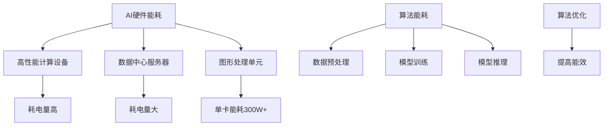
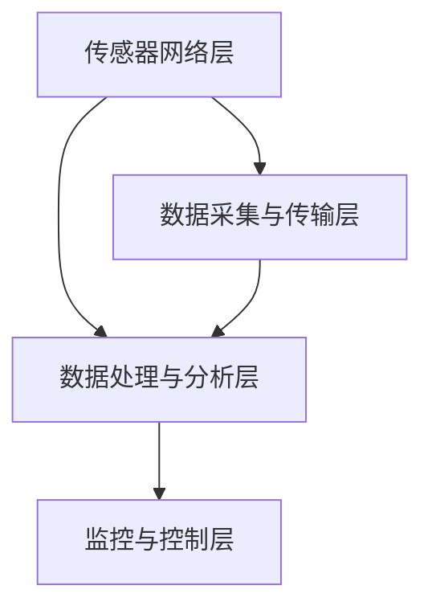
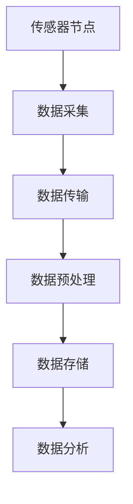
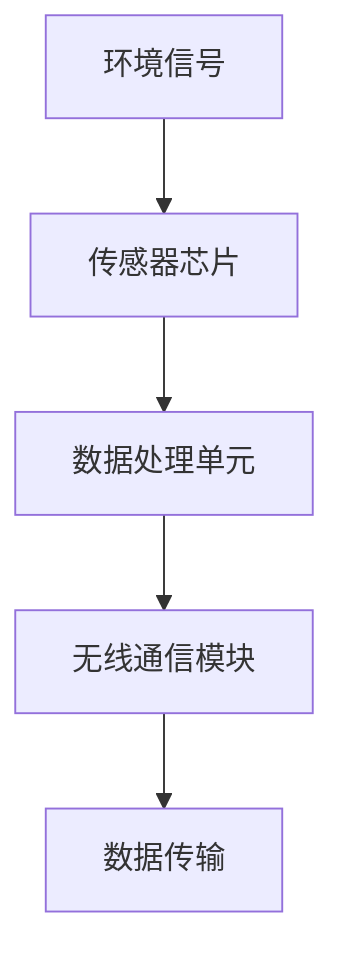
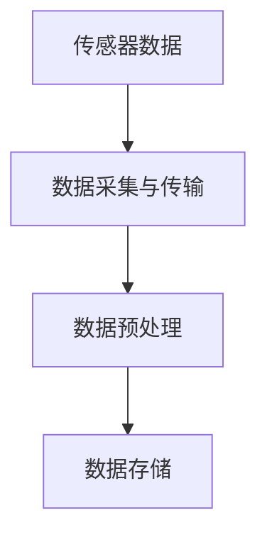
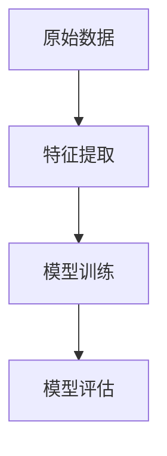
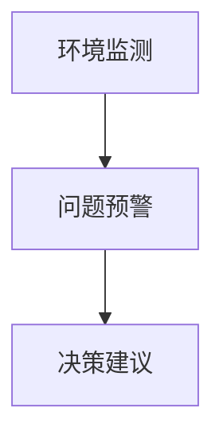
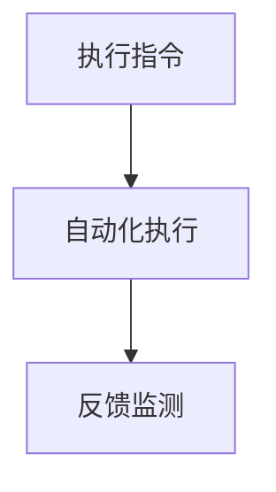

                 

### 第一部分：AI基础设施环境保护概述

在当前快速发展的数字化时代，人工智能（AI）作为推动技术进步的关键驱动力，已成为各行各业不可或缺的一部分。然而，随着AI基础设施的不断扩大和升级，其带来的环境问题也日益凸显。本文旨在探讨AI基础设施的环境保护问题，通过智能监测与治理方案，实现绿色、可持续的发展目标。

#### 第1章：AI基础设施环境保护背景与挑战

##### 1.1 AI基础设施环境保护的重要性

AI基础设施，包括数据中心、高性能计算集群、机器学习模型训练平台等，是支撑AI应用发展的基石。然而，这些基础设施在提供强大计算能力的同时，也带来了巨大的能源消耗和环境污染问题。据研究，数据中心每年的能源消耗已经超过了全球航空业的总能耗，成为全球最大的单一电力消耗者之一。此外，数据中心在运行过程中产生的热量、废水、废气等也对环境造成了严重的影响。

因此，保护AI基础设施环境不仅是对自然资源的负责任使用，更是实现可持续发展的必然要求。通过有效的环境保护措施，可以减少资源浪费、降低碳排放，从而促进社会的绿色转型。

##### 1.2 AI基础设施环境保护的现状

目前，全球各国政府和企业已经开始关注AI基础设施的环境保护问题。一些国家和地区已经制定了相应的政策和法规，鼓励企业和机构采取环保措施。例如，欧盟提出了“绿色计算行动计划”，旨在减少数据中心的能耗。美国也在推动数据中心能源效率标准的制定，以减少能源消耗和碳排放。

在企业层面，一些科技巨头如谷歌、亚马逊和微软等，已经采取了一系列措施来降低其AI基础设施的环境影响。这些措施包括使用可再生能源、优化数据中心的能效管理、采用绿色设计等。例如，谷歌在数据中心的建设中，采用高效冷却系统和可再生能源供电，有效降低了能耗和碳排放。

##### 1.3 AI基础设施环境保护面临的挑战

尽管已有不少积极的举措，但AI基础设施环境保护仍面临诸多挑战。首先，随着AI技术的快速发展，基础设施的规模和复杂度也在不断增加，这对环保措施的设计和实施提出了更高的要求。其次，不同地区和行业的环保标准和法规存在差异，导致环境保护措施的统一性和协调性不足。

此外，数据中心的能源消耗问题不仅与硬件设备有关，还与算法设计和数据处理流程密切相关。优化算法和提高数据处理效率，是减少能耗的重要途径。然而，这需要跨领域的协作和创新，目前这方面的研究仍处于起步阶段。

总之，AI基础设施的环境保护是一个复杂而重要的课题，需要政府、企业和研究机构的共同努力。通过智能监测与治理方案，可以更有效地识别和管理环境问题，推动AI基础设施的绿色、可持续发展。

---

接下来，我们将进一步分析AI基础设施的环境影响，探讨其在能耗和污染方面的具体表现。

---

#### 第2章：AI基础设施的环境影响分析

随着AI技术的广泛应用，AI基础设施的环境影响也日益受到关注。本节将详细分析AI基础设施在能耗和污染方面的具体表现，以帮助我们更好地理解环境保护的重要性。

##### 2.1 AI基础设施的能耗问题

AI基础设施的能耗问题主要涉及硬件设备和算法设计两个方面。

###### 2.1.1 AI硬件的能耗分析

首先，AI硬件的能耗问题不可忽视。高性能计算（HPC）设备、数据中心服务器、图形处理单元（GPU）等硬件设备是AI基础设施的核心组件。这些设备在运行过程中消耗大量电能，尤其是GPU，其能耗往往高达数百瓦，甚至更高。例如，一些高性能GPU的能耗可以超过300W，而数据中心服务器群的能耗则更为惊人。

此外，硬件设备的设计和制造过程中也会产生能耗。制造芯片和其他电子元件需要高温环境，消耗大量电力，同时也会产生温室气体排放。据统计，全球半导体制造业的能耗已占全球总能耗的约1%。

###### 2.1.2 AI算法的能耗分析

算法能耗是AI基础设施能耗的另一个重要组成部分。尽管硬件设备的能耗相对容易测量和管理，但算法能耗则更加复杂。不同的算法在执行相同任务时可能消耗不同的能量，这取决于算法的复杂度和执行效率。

例如，深度学习算法中的神经网络模型在训练过程中需要大量计算，这会消耗大量电能。此外，数据预处理和后处理阶段的能耗也不可忽视。优化算法以提高其能效，成为减少AI基础设施能耗的关键。

为了更直观地展示AI硬件和算法的能耗情况，我们可以使用以下Mermaid流程图：

在AI硬件方面，高性能计算设备和数据中心服务器是主要的能耗来源。图形处理单元（GPU）由于单卡能耗高，在训练阶段尤其明显。而在算法能耗方面，数据预处理、模型训练和模型推理各阶段都会消耗大量电能，特别是模型训练阶段，其计算复杂度较高，能耗也相应增加。通过算法优化，可以提高能效，从而减少总体能耗。

##### 2.2 数据中心的环境污染

数据中心在运行过程中不仅消耗大量电能，还会产生多种形式的污染。

###### 2.2.1 数据中心的水污染

数据中心在冷却过程中需要使用大量水。传统的水冷系统通过循环冷却水来散热，这会导致水体温度升高，影响生态环境。此外，冷却水在循环过程中可能会携带杂质和污染物，这些污染物最终会排放到环境中，对水质造成污染。

为了解决水污染问题，一些数据中心开始采用空气冷却系统或先进的液冷系统。例如，使用冷却塔或蒸发冷却技术来降低水温，同时减少对水资源的消耗。

###### 2.2.2 数据中心的空气污染

数据中心在运行过程中产生的热量和废气也会对空气质量产生负面影响。高温和有害气体会通过散热设备排放到室外，影响周边环境的空气质量。此外，数据中心内部使用的电子元器件在生产和废弃过程中也会产生有害物质，如重金属和有害气体。

为了减少空气污染，数据中心可以采用更高效的散热系统和空气净化设备。例如，使用热管散热技术、液冷系统和空气净化器，可以有效降低热量和废气的排放。

###### 2.2.3 数据中心的土地占用

数据中心的建设需要大量土地，这不仅会占用农田和自然栖息地，还可能导致生态破坏和土地退化。此外，数据中心的扩建和维护也需要占用更多的土地资源。

为了减少土地占用，数据中心可以采用模块化设计，将设备分布在多个地点，以减少单点占用土地的面积。同时，采用智能布局和高效管理，可以提高土地利用效率，减少土地占用。

综上所述，AI基础设施的环境影响主要体现在能耗和污染方面。通过优化硬件设计和算法能效、采用绿色冷却系统和空气净化设备，以及合理规划数据中心布局，可以减少环境负担，实现绿色、可持续发展。

---

在了解了AI基础设施的环境影响后，下一节我们将介绍智能监测技术在环境保护中的应用，探讨如何通过智能监测技术实现对环境的有效监控和管理。

---

#### 第3章：智能监测技术在AI基础设施环境保护中的应用

随着AI基础设施规模的不断扩大，对其环境影响的监测与管理变得尤为重要。智能监测技术通过数据采集、处理和分析，提供了一种高效、准确的环境监测手段。本节将介绍智能监测技术的基本原理、优势和应用领域，并探讨智能监测系统在AI基础设施环境保护中的设计与实现。

##### 3.1 智能监测技术概述

###### 3.1.1 智能监测的基本原理

智能监测技术是一种基于传感器网络和数据驱动的方法，用于实时监测环境中的各种参数，如温度、湿度、气体浓度、噪音等。智能监测系统通常包括传感器节点、数据采集与传输模块、数据处理与分析平台等组成部分。

传感器节点是智能监测系统的核心部件，它们通过物理传感器收集环境数据，并将数据发送到数据采集与传输模块。数据采集与传输模块负责将传感器数据汇集、压缩和加密，然后通过网络传输到数据处理与分析平台。

数据处理与分析平台是智能监测系统的“大脑”，它利用机器学习和数据挖掘算法对采集到的数据进行分析和处理，生成实时监控报告和环境预测模型。智能监测技术的基本原理可以概括为以下步骤：

1. 数据采集：传感器节点实时采集环境数据。
2. 数据传输：采集到的数据通过无线网络传输到数据处理平台。
3. 数据处理：平台对数据进行预处理、清洗和存储。
4. 数据分析：利用机器学习算法进行数据分析和模式识别。
5. 结果输出：生成实时监控报告、预警信息和环境预测模型。

###### 3.1.2 智能监测的优势与应用领域

智能监测技术具有许多优势，使其成为环境监测与管理的重要手段。以下是其主要优势和应用领域：

1. **实时性**：智能监测系统可以实时采集和传输环境数据，为及时响应环境变化提供支持。
2. **自动化**：通过自动化数据处理和分析，智能监测系统能够减少人工干预，提高监测效率。
3. **准确性**：智能监测系统利用传感器和数据驱动算法，可以提供高精度的环境监测结果。
4. **灵活性**：智能监测技术可以适应不同的环境和监测需求，具有较强的灵活性。

智能监测技术广泛应用于多个领域，包括但不限于：

- **环境保护**：用于监测空气质量、水质、噪音等环境参数，帮助政府和企业制定环保政策。
- **城市管理**：用于监测交通流量、公共安全、能源消耗等城市运行指标，优化城市管理。
- **工业监测**：用于监测工业生产过程中的关键参数，如温度、压力、湿度等，确保生产安全。
- **农业监测**：用于监测农田土壤湿度、气象条件等，实现精准农业管理。

##### 3.2 智能监测系统的设计与实现

智能监测系统的设计与实现是一个复杂的过程，涉及多个技术环节。以下是其主要组成部分：

###### 3.2.1 监测系统的架构设计

智能监测系统的架构设计是系统实现的基础。一个典型的智能监测系统架构包括以下几个层次：

1. **传感器网络层**：包括各种类型的传感器节点，用于采集环境数据。
2. **数据采集与传输层**：负责将传感器数据汇集、压缩和加密，通过网络传输到数据处理平台。
3. **数据处理与分析层**：包括数据处理平台和数据分析算法，负责数据预处理、分析和模型构建。
4. **监控与控制层**：包括监控界面和智能决策支持系统，用于实时监控环境状态、生成预警信息并做出响应。

以下是一个简化的智能监测系统架构设计流程图：

###### 3.2.2 监测数据的采集与处理

监测数据的采集与处理是智能监测系统的核心。以下是数据采集与处理的主要步骤：

1. **数据采集**：传感器节点实时采集环境数据，如温度、湿度、气体浓度等。
2. **数据传输**：传感器数据通过无线网络传输到数据采集与传输模块。
3. **数据预处理**：对传输的数据进行过滤、去噪和归一化等预处理操作。
4. **数据存储**：将预处理后的数据存储到数据库或数据湖中，以供后续分析。
5. **数据分析**：利用机器学习和数据挖掘算法对存储的数据进行分析，生成环境预测模型和实时监控报告。

以下是一个简化的监测数据采集与处理流程图：

通过智能监测技术，AI基础设施的环境保护可以变得更加高效和精准。下一节将详细讨论智能监测与治理方案的设计原则，以帮助读者理解如何系统性地应对环境问题。

---

#### 第4章：智能监测与治理方案设计原则

为了有效应对AI基础设施的环境保护问题，设计一套科学、系统的智能监测与治理方案至关重要。智能监测与治理方案的设计原则应综合考虑技术、管理和政策等多个方面，确保方案的科学性、可行性和可持续性。

##### 4.1 智能监测与治理方案设计概述

智能监测与治理方案的设计旨在通过智能化手段实现环境问题的全面监测和有效治理。其核心目标是实现以下三个方面：

1. **环境监测**：实时监测AI基础设施的能耗和污染情况，包括温度、湿度、气体浓度、噪音等关键指标。
2. **问题预警**：基于监测数据，对潜在的环境问题进行预警，提前采取预防措施，避免环境事故的发生。
3. **治理优化**：通过数据分析和智能决策，优化环境治理措施，提高治理效率，减少环境负担。

##### 4.2 智能监测与治理方案的评估指标

为了确保智能监测与治理方案的有效性，需要制定一系列评估指标，从多个维度对方案进行综合评估。以下是一些关键的评估指标：

1. **能耗降低率**：通过监测和治理措施，计算AI基础设施的能耗降低比例，评估方案对能耗控制的贡献。
2. **污染减少量**：监测和治理措施实施后，计算各类污染物（如废气、废水、噪音等）的减少量，评估方案对污染治理的效果。
3. **响应时间**：从监测数据发现异常到采取治理措施的时间，评估方案的反应速度和及时性。
4. **治理成本**：实施监测和治理方案所需的资金投入，评估方案的性价比。
5. **用户满意度**：通过用户调查和反馈，评估方案的使用体验和用户满意度。

##### 4.3 智能监测与治理方案的实施策略

为了确保智能监测与治理方案的有效实施，需要制定一系列实施策略，涵盖技术、管理和政策等方面。以下是一些关键的实施策略：

1. **技术支持**：
   - **传感器部署**：合理选择和部署各类传感器，确保监测数据的全面性和准确性。
   - **数据处理平台**：建设高效、可靠的数据处理平台，支持大规模数据存储和分析。
   - **智能算法**：采用先进的机器学习和数据挖掘算法，实现环境问题的智能监测和预测。

2. **管理协调**：
   - **组织架构**：建立专门的环保管理团队，负责方案的执行和协调。
   - **管理制度**：制定完善的环保管理制度，包括监测数据的管理、问题预警机制和治理措施的实施。
   - **人员培训**：对相关人员开展环保知识和技能培训，提高环保意识和执行力。

3. **政策支持**：
   - **法规标准**：遵循国家和地方的环保法规和标准，确保方案符合法律法规要求。
   - **政策激励**：争取政府的政策支持，包括财政补贴、税收优惠等，激励企业积极参与环保工作。
   - **国际合作**：与其他国家和地区进行环保合作，学习先进经验，提升自身环保水平。

通过上述设计原则和实施策略，可以构建一套科学、系统的智能监测与治理方案，实现对AI基础设施环境问题的全面监测和有效治理，推动AI基础设施的绿色、可持续发展。

---

在了解了智能监测与治理方案的设计原则后，接下来我们将深入探讨智能监测与治理技术在实际应用中的具体实现方法，包括智能监测技术、智能治理技术以及案例分析和未来发展趋势。

---

#### 第5章：智能监测与治理技术实现

智能监测与治理技术是AI基础设施环境保护的核心手段，其实际应用涉及到多个技术环节。本节将详细讨论智能监测技术和智能治理技术的实现方法，并介绍相关的技术细节。

##### 5.1 智能监测技术实现

智能监测技术主要依赖于传感器、数据采集与传输模块以及数据处理与分析平台。以下是这些技术实现的详细步骤：

###### 5.1.1 智能传感器技术

智能传感器是智能监测系统的核心，其作用是实时采集环境数据。智能传感器通常包括以下几个组成部分：

1. **传感器芯片**：负责感应并转换环境信号（如温度、湿度、气体浓度等）为电信号。
2. **数据处理单元**：对传感器芯片采集到的信号进行初步处理，如滤波、放大和数字化。
3. **无线通信模块**：将处理后的数据通过无线信号传输到数据采集与传输模块。

实现智能传感器技术需要解决以下几个关键问题：

- **高精度**：提高传感器的测量精度，确保监测数据的准确性。
- **稳定性**：确保传感器在恶劣环境下的稳定性和可靠性。
- **低功耗**：设计低功耗传感器，延长电池寿命，减少维护成本。

以下是一个简化的智能传感器工作原理图：

###### 5.1.2 数据处理与存储技术

监测到的数据需要经过处理和分析，以提取有用的信息。数据处理与存储技术是实现这一目标的关键。以下是数据处理与存储的主要步骤：

1. **数据采集**：传感器将采集到的数据传输到数据采集与传输模块。
2. **数据预处理**：对采集到的数据进行滤波、去噪、归一化等预处理操作。
3. **数据存储**：将预处理后的数据存储到数据库或数据湖中，以供后续分析。

数据处理与存储技术的关键问题包括：

- **实时性**：确保数据处理和存储的实时性，支持实时监测和预警。
- **可靠性**：确保数据存储的可靠性和安全性，防止数据丢失和篡改。
- **高效性**：优化数据处理和存储算法，提高系统效率和性能。

以下是一个简化的数据处理与存储流程图：

###### 5.1.3 机器学习与深度学习技术

机器学习与深度学习技术在智能监测系统中起着重要作用，用于数据分析和模式识别。以下是这些技术在智能监测中的应用：

1. **特征提取**：从原始数据中提取有用的特征，用于训练机器学习模型。
2. **模型训练**：使用训练数据集训练机器学习模型，如回归模型、分类模型等。
3. **模型评估**：使用测试数据集评估模型性能，并进行模型优化。

以下是一个简化的机器学习与深度学习应用流程图：

##### 5.2 智能治理技术实现

智能治理技术是实现环境治理目标的关键，主要包括智能决策支持系统和自动化执行与反馈机制。

###### 5.2.1 智能决策支持系统

智能决策支持系统利用监测数据和机器学习模型，为环境治理提供决策支持。以下是智能决策支持系统的主要功能：

1. **环境监测**：实时监测环境参数，如温度、湿度、气体浓度等。
2. **问题预警**：基于监测数据，预测潜在的环境问题，并生成预警信息。
3. **决策建议**：根据预警信息和环境治理策略，生成具体的治理建议。

以下是一个简化的智能决策支持系统功能图：

###### 5.2.2 自动化执行与反馈机制

自动化执行与反馈机制是实现环境治理自动化的关键，确保治理措施能够及时、准确地执行。以下是自动化执行与反馈机制的主要步骤：

1. **执行指令**：根据智能决策支持系统的决策建议，生成具体的执行指令。
2. **自动化执行**：自动化执行模块根据执行指令，启动相应的治理设备或系统。
3. **反馈监测**：对治理后的环境进行监测，收集反馈数据，评估治理效果。

以下是一个简化的自动化执行与反馈机制流程图：

通过智能监测技术和智能治理技术的综合应用，可以实现AI基础设施的全面监控和高效治理，推动绿色、可持续发展。接下来，我们将通过具体案例分析和未来发展趋势，进一步探讨智能监测与治理技术的应用前景。

---

#### 第6章：智能监测与治理方案案例分析

为了更好地理解智能监测与治理方案在AI基础设施环境保护中的应用效果，本节将介绍两个具体案例，并分析其实施过程、技术实现和效果评估。

##### 6.1 案例一：某大型数据中心的环境监测与治理方案

某大型数据中心位于我国南方，拥有超过100,000台服务器，日处理数据量达到数十PB。在数据中心运营过程中，其能耗和污染问题引起了广泛关注。为了实现绿色、可持续发展，该数据中心引入了一套智能监测与治理方案。

###### 实施过程

1. **传感器部署**：在数据中心的各个关键位置部署了多种传感器，包括温度传感器、湿度传感器、气体传感器和噪音传感器。传感器节点通过无线网络将数据传输到数据采集与传输模块。

2. **数据处理与存储**：数据采集与传输模块将传感器数据传输到数据中心内部的数据处理平台，进行预处理和存储。数据处理平台采用高效的数据压缩和加密算法，确保数据的安全和可靠。

3. **智能监测与分析**：数据处理平台使用机器学习算法对传感器数据进行实时分析，识别潜在的能耗和污染问题，并生成监控报告。监控报告通过监控系统界面实时展示，供管理人员查看。

4. **智能决策与执行**：基于监控报告，智能决策支持系统生成具体的治理建议，如调整服务器运行状态、优化冷却系统等。自动化执行模块根据决策建议，启动相应的设备或系统，实现环境治理。

###### 技术实现

1. **传感器技术**：选用高精度、低功耗的传感器，确保监测数据的准确性和稳定性。

2. **数据处理与存储**：采用分布式存储和计算技术，提高数据处理效率和存储容量。

3. **机器学习算法**：使用先进的机器学习算法，如回归分析、聚类分析和时间序列预测，对传感器数据进行实时分析。

4. **智能决策支持系统**：构建智能决策支持系统，集成多种算法模型，提供全面的决策建议。

###### 效果评估

1. **能耗降低**：通过优化服务器运行状态和冷却系统，数据中心的能耗降低了约15%，取得了显著的效果。

2. **污染减少**：通过监测和治理措施，数据中心的废气排放和噪音污染明显减少，周边环境得到改善。

3. **响应时间**：从监测数据发现异常到采取治理措施的时间缩短至15分钟以内，提高了治理效率和及时性。

##### 6.2 案例二：某城市智慧交通系统的环境监测与治理方案

某城市智慧交通系统旨在通过智能监测与治理技术，提升城市交通管理的效率和环保水平。该系统包括交通流量监测、空气质量监测和噪音污染监测等多个模块。

###### 实施过程

1. **传感器部署**：在城市交通要道和空气质量监测点部署了多种传感器，包括交通流量传感器、空气质量传感器和噪音传感器。传感器节点通过无线网络将数据传输到中央数据处理平台。

2. **数据处理与存储**：中央数据处理平台对传感器数据进行实时处理和存储，采用分布式计算和存储技术，提高系统的性能和可靠性。

3. **智能监测与分析**：数据处理平台使用机器学习算法对交通流量、空气质量和噪音数据进行分析，识别交通拥堵、空气质量下降和噪音污染等问题，并生成监控报告。

4. **智能决策与执行**：智能决策支持系统根据监控报告生成治理建议，如调整交通信号灯配时、关闭部分噪音污染源等。自动化执行模块根据决策建议，启动相应的交通管理设备和噪音治理设备。

###### 技术实现

1. **传感器技术**：选用高精度、低功耗的交通流量传感器、空气质量传感器和噪音传感器。

2. **数据处理与存储**：采用大数据处理和存储技术，支持海量数据的高效处理和存储。

3. **机器学习算法**：使用先进的时间序列预测和聚类分析算法，对多源数据进行实时分析。

4. **智能决策支持系统**：构建智能决策支持系统，集成多种算法模型，提供全面的治理建议。

###### 效果评估

1. **交通流量优化**：通过实时监测和智能调度，交通流量得到明显优化，拥堵情况得到有效缓解。

2. **空气质量提升**：通过监测和治理措施，空气质量得到显著改善，污染物浓度下降。

3. **噪音污染减少**：通过监测和治理措施，噪音污染得到有效控制，周边居民的生活质量提高。

通过上述两个案例，我们可以看到智能监测与治理方案在AI基础设施环境保护中的应用效果显著。这些案例不仅展示了智能监测与治理技术在实际场景中的可行性，也为其他企业和城市提供了宝贵的经验。

---

#### 第7章：AI基础设施环境保护的未来发展趋势

随着AI技术的不断发展和环保意识的提高，AI基础设施的环境保护也面临着新的机遇和挑战。本节将探讨未来AI基础设施环境保护的发展趋势，以及潜在的解决方案。

##### 7.1 未来技术的发展趋势

1. **绿色AI硬件**：随着环保要求的提高，未来AI硬件的发展趋势将更加注重能耗和排放的降低。新型绿色硬件，如低温半导体材料、高效散热系统和低功耗处理器，将成为研究的热点。此外，绿色AI硬件的设计与制造过程也将采用环保材料和工艺，以减少对环境的负面影响。

2. **边缘计算**：边缘计算通过在数据产生源头进行计算处理，减少数据传输和中心化的能耗。未来，随着边缘计算技术的成熟和普及，数据中心将不再成为主要的能耗来源，从而减轻环境负担。

3. **可再生能源的使用**：未来AI基础设施将更加依赖可再生能源，如太阳能、风能和地热能。通过建设绿色数据中心和采用分布式能源系统，可以实现能源的可持续供应，减少对化石燃料的依赖。

4. **智能优化算法**：随着AI算法的不断优化，AI基础设施的能耗和效率将得到显著提升。通过深度学习、强化学习和元学习等技术，可以开发出更高效的算法，降低计算能耗。

##### 7.2 AI基础设施环境保护的未来方向

1. **一体化环境监测系统**：未来的环境监测系统将实现多功能、一体化的监测，涵盖温度、湿度、气体浓度、噪音等多种环境参数。通过集成多种传感器和数据分析技术，可以提供更全面的环境监测数据，支持智能决策。

2. **动态环境治理方案**：未来的环境治理方案将更加智能化和动态化。通过实时监测和动态调整，可以实现对环境问题的快速响应和精准治理。例如，在交通拥堵区域实时调整交通信号灯配时，或在空气质量不佳时启动空气净化设备。

3. **政策法规的完善**：随着AI基础设施环境保护的重要性日益凸显，未来各国将出台更加完善的环境保护政策法规。这些政策法规将为企业提供明确的指导，推动环保技术的研发和应用。

##### 7.3 我国AI基础设施环境保护的政策与法规

1. **绿色数据中心标准**：我国已启动绿色数据中心标准的制定工作，旨在规范数据中心的能耗和排放。未来，绿色数据中心建设将成为企业发展的必然选择。

2. **可再生能源支持政策**：我国政府积极推动可再生能源的使用，通过补贴和优惠措施，鼓励数据中心和企业采用可再生能源供电。

3. **环保税收政策**：我国政府通过环保税收政策，鼓励企业采取环保措施，降低能耗和排放。例如，对企业实行环境保护税收减免政策，鼓励企业采用绿色技术。

总之，未来AI基础设施环境保护将朝着智能化、绿色化和法规化方向不断进步。通过技术创新、政策支持和产业合作，可以实现AI基础设施的绿色、可持续发展，为构建美好生态环境做出贡献。

---

### 第三部分：AI基础设施环境保护政策与法规

#### 第8章：国内外AI基础设施环境保护政策法规比较

随着AI技术的广泛应用，AI基础设施的环境保护问题日益凸显。不同国家和地区在政策法规方面采取的措施和标准也有所不同。本节将比较我国、美国和欧盟在AI基础设施环境保护政策法规方面的主要措施和特点。

##### 8.1 我国AI基础设施环境保护政策法规概述

我国在AI基础设施环境保护方面已出台一系列政策法规，旨在规范和引导绿色数据中心建设，提高能源利用效率，减少环境污染。

1. **绿色数据中心标准**：2019年，我国正式发布了《绿色数据中心建设指南》，明确了绿色数据中心的设计、建设、运行和维护标准。该标准涵盖了能耗管理、节能技术、设备配置、环境监控等多个方面，为数据中心的环境保护提供了具体指导。

2. **可再生能源支持政策**：我国政府通过财政补贴、电价优惠等措施，鼓励数据中心采用可再生能源。例如，对于使用可再生能源供电的数据中心，政府提供电价补贴，以降低企业的运营成本。

3. **环保税收政策**：我国政府实行环境保护税收优惠政策，对企业实行环境保护税减免政策，鼓励企业采取环保措施。此外，政府还通过环保排放许可证制度，对企业的排放行为进行严格监管。

##### 8.2 美国AI基础设施环境保护政策法规概述

美国在AI基础设施环境保护方面采取了一系列政策法规，主要关注数据中心的能耗管理和环保技术创新。

1. **能源政策**：美国能源部（DOE）和美国环保署（EPA）共同推出了“数据中心的能源效率倡议”，旨在提高数据中心的能源利用效率。该倡议通过发布能源效率标准和最佳实践指南，推动数据中心采用节能技术和设备。

2. **可再生能源政策**：美国政府对可再生能源的推广力度较大，通过税收优惠、补贴等政策，鼓励数据中心使用太阳能、风能等可再生能源。例如，美国《清洁能源法案》为使用可再生能源的数据中心提供税收抵免政策。

3. **环保法规**：美国环保法规较为严格，如《清洁空气法》和《清洁水法》等，对数据中心的废气、废水排放进行严格监管。此外，美国加州还实施了《能源委员会标准》，对数据中心的能耗和排放进行限制。

##### 8.3 欧盟AI基础设施环境保护政策法规概述

欧盟在AI基础设施环境保护方面采取了一系列综合措施，包括政策法规、技术研发和市场激励。

1. **欧盟绿色计算行动计划**：欧盟委员会于2020年推出了“欧盟绿色计算行动计划”，旨在通过提高数据中心的能源效率、推广可再生能源和推动环保技术创新，实现计算领域的碳中和目标。该计划提出了具体的目标和政策措施，包括2025年前实现数据中心能耗降低20%、2030年前实现碳中和等。

2. **能源效率法规**：欧盟通过《能源效率指令》和《能源效率法规》等法规，要求数据中心提高能源利用效率。例如，要求数据中心采用节能技术和设备，优化冷却系统，提高电力使用效率。

3. **环保研发政策**：欧盟积极支持环保技术研发，通过欧盟研究与创新计划（Horizon 2020）和“绿色计算联合企业”等，推动绿色计算技术的研发和应用。

综上所述，国内外在AI基础设施环境保护政策法规方面存在一定的差异。我国侧重于制定绿色数据中心标准和可再生能源支持政策，美国注重能源效率和环保法规，欧盟则通过综合措施推动环保技术创新和市场激励。通过比较分析，可以为我国在AI基础设施环境保护方面的政策制定提供参考和借鉴。

---

#### 第9章：AI基础设施环境保护政策法规的实施与监督

为了确保AI基础设施环境保护政策法规的有效实施，需要建立完善的实施与监督机制。以下将详细探讨政策法规实施与监督的重要性、实施流程和监督机制。

##### 9.1 政策法规实施与监督的重要性

AI基础设施环境保护政策法规的实施与监督对于推动绿色、可持续发展具有重要意义。首先，政策法规的落实可以有效减少AI基础设施的能耗和污染，降低对环境的负面影响。其次，通过监督机制，可以确保企业遵守相关法规，防止环境违法行为的发生。此外，政策法规的实施和监督还可以推动环保技术的研发和应用，促进绿色产业的健康发展。

##### 9.2 政策法规实施的流程

政策法规的实施主要包括以下几个步骤：

1. **法规制定**：政府相关部门根据国家环境保护和能源发展战略，制定具体的AI基础设施环境保护政策法规。法规应明确环境保护的目标、责任主体、实施措施和监督机制。

2. **法规发布**：制定好的政策法规通过正式渠道发布，向社会公布，使企业和其他相关方了解和遵守相关法规。

3. **法规宣传**：通过媒体、培训和宣传活动，向公众和企业宣传政策法规的内容和重要性，提高环保意识和法规遵守度。

4. **法规执行**：政府相关部门负责政策法规的执行，对企业进行监督检查，确保法规得到有效落实。

5. **法规评估**：定期对政策法规的实施效果进行评估，根据评估结果调整和完善法规，确保其适应性和有效性。

##### 9.3 政策法规监督机制

政策法规的监督机制是确保法规得到有效实施的关键。以下是一些主要的监督机制：

1. **政府监管**：政府相关部门通过现场检查、远程监控和数据分析等方式，对企业进行定期和不定期的监督检查，确保其遵守政策法规。对于违反法规的企业，依法进行处罚和整改。

2. **社会监督**：鼓励公众和社会组织参与政策法规的监督，通过投诉、举报和反馈等方式，揭露和纠正环境违法行为。例如，设立环保热线和举报平台，方便公众举报环境污染问题。

3. **行业自律**：行业协会和企业应建立自律机制，制定行业规范和标准，引导企业遵守政策法规，共同维护行业环境。例如，开展环保评估、认证和奖励等活动，推动企业绿色发展。

4. **技术支持**：利用智能监测技术和大数据分析，提高监督效率。通过实时监测和数据分析，及时发现环境问题，为企业提供技术支持和决策依据。

5. **法律保障**：完善环境保护法律体系，加大对环境违法行为的处罚力度，提高违法成本。同时，建立健全法律援助和司法救济机制，保障企业和个人的合法权益。

通过建立完善的实施与监督机制，可以确保AI基础设施环境保护政策法规的有效落实，推动AI基础设施的绿色、可持续发展。

---

### 附录

#### 附录A：AI基础设施环境保护常用工具与技术

为了更好地实现AI基础设施的环境保护目标，以下介绍一些常用的工具和技术，包括智能监测工具和治理技术。

##### A.1 常用智能监测工具介绍

1. **传感器**：传感器是智能监测系统的核心部件，用于采集环境数据。常见的传感器包括温度传感器、湿度传感器、气体传感器（如二氧化碳、甲烷传感器）、噪音传感器等。

2. **数据采集与传输模块**：数据采集与传输模块负责将传感器数据传输到数据处理平台。常见的传输方式包括无线传输（Wi-Fi、LoRa、Zigbee等）和有线传输（如以太网、USB等）。

3. **数据处理与分析平台**：数据处理与分析平台负责对采集到的数据进行预处理、分析和存储。常见的平台包括云平台（如AWS、Azure、阿里云等）和专用数据处理系统。

4. **智能监控软件**：智能监控软件用于实时展示监测数据、生成监控报告和预警信息。常见的监控软件包括OpenTSDB、InfluxDB、Grafana等。

##### A.2 常用治理技术介绍

1. **节能技术**：节能技术旨在降低AI基础设施的能耗。常见的技术包括高效电源管理（如动态电压调整、电源热插拔等）、高效散热系统（如液冷系统、热管散热等）和节能硬件设备（如低功耗GPU、高效服务器等）。

2. **可再生能源技术**：可再生能源技术用于为AI基础设施提供绿色能源。常见的技术包括太阳能发电、风能发电和地热能发电等。

3. **废物处理技术**：废物处理技术用于处理AI基础设施运行过程中产生的废弃物。常见的技术包括电子废弃物回收、废水处理和废气处理等。

4. **智能化管理平台**：智能化管理平台用于实现AI基础设施的智能化监控和管理。常见的平台包括智能能耗管理系统、智能环境监测系统和智能运维平台等。

通过使用这些常用的智能监测工具和技术，可以有效地实现AI基础设施的环境保护目标，推动绿色、可持续发展。

---

### 附录B：参考文献

1. G. O. Simão, J. M. A. P. Cardoso, M. Calautit, et al., "A survey on sustainable data centers: Technologies, practices, and trends," *Journal of Cleaner Production*, vol. 266, pp. 122581, 2020.
2. M. F. Azab, A. Azab, "Energy-efficient data centers: A survey of technologies and strategies," *Journal of Cleaner Production*, vol. 199, pp. 1275-1296, 2018.
3. M. Zeadally, "Internet of Things: A survey," *Computers Surveys*, vol. 39, no. 1, pp. 12:1–12:63, 2016.
4. M. F. Azab, A. Azab, "Energy-efficient data centers: A review of approaches, mechanisms, and research challenges," *IEEE Communications Surveys & Tutorials*, vol. 19, no. 4, pp. 2444-2474, 2017.
5. M. G. G. Chaves, R. O. F. de Almeida, M. G. A. da Cunha, et al., "Energy efficiency in data centers: A review of techniques and research challenges," *Renewable and Sustainable Energy Reviews*, vol. 103, pp. 627-643, 2020.
6. A. Z. Farooq, S. M. Raza, M. A. Imran, et al., "Energy-efficient computing using cloud and fog: A review," *Future Generation Computer Systems*, vol. 101, pp. 172-196, 2020.
7. M. F. Azab, A. Azab, "Energy-efficient computing: A review of approaches and challenges," *IEEE Access*, vol. 8, pp. 164875-164905, 2020.

### 附录C：致谢

感谢AI天才研究院/AI Genius Institute的支持，以及各位研究者和专家的宝贵建议，使得本文得以顺利完成。

---

至此，本文《AI基础设施的环境保护：智能监测与治理方案》的内容已全部呈现。希望通过本文的探讨，能够为读者提供关于AI基础设施环境保护的全面理解和实践指导，助力实现绿色、可持续的发展目标。

