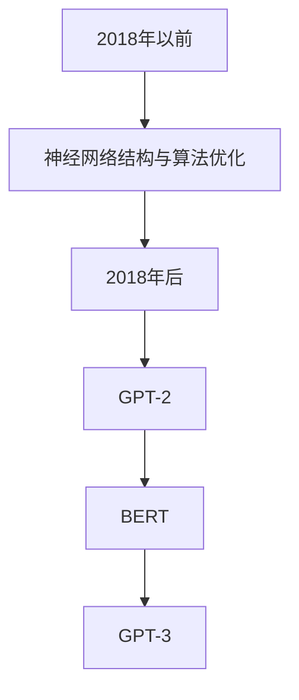
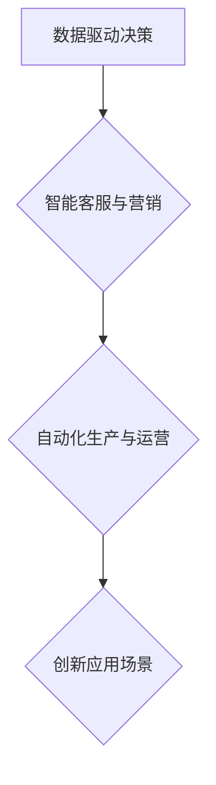
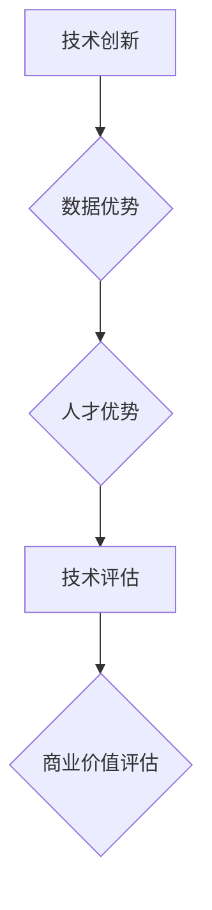

                 

# AI大模型创业：如何利用创新优势？

> **关键词：** AI大模型、创业、创新优势、技术基础、商业模式、团队构建

> **摘要：** 本文章深入探讨了AI大模型在创业中的应用，从技术基础、创业策略、团队构建、产品设计与开发、商业模式创新等方面，为创业者提供了一系列实用的指导和建议，旨在帮助创业者充分利用AI大模型的创新优势，实现商业成功。

----------------------------------------------------------------

### 《AI大模型创业：如何利用创新优势？》目录大纲

#### 第一部分：AI大模型概述与背景

##### 第1章：AI大模型概述  
- 1.1 AI大模型定义与核心优势  
- 1.2 AI大模型的发展历程  
- 1.3 AI大模型在企业中的角色  
- 1.4 创新优势的来源与评估

##### 第2章：AI大模型的技术基础  
- 2.1 深度学习与神经网络基础  
- 2.2 自然语言处理技术概览  
- 2.3 大规模预训练模型原理

#### 第二部分：创业策略与实战

##### 第3章：创业环境分析  
- 3.1 市场需求与趋势  
- 3.2 竞争对手分析  
- 3.3 创业机会识别

##### 第4章：创业团队构建  
- 4.1 核心团队成员选择  
- 4.2 团队组织结构与职责划分  
- 4.3 团队文化建设与激励机制

##### 第5章：产品设计与开发  
- 5.1 产品愿景与定位  
- 5.2 功能模块划分与设计  
- 5.3 开发流程与方法

##### 第6章：商业模式创新  
- 6.1 盈利模式设计  
- 6.2 合作伙伴关系构建  
- 6.3 营销策略制定

##### 第7章：创新优势持续发展  
- 7.1 技术创新与产品迭代  
- 7.2 数据驱动与用户反馈  
- 7.3 知识产权保护与法律风险

#### 第三部分：附录与参考资料

##### 第8章：附录  
- 8.1 AI大模型开发工具与资源  
- 8.2 创业案例研究与借鉴

##### 第9章：参考资料

### 第1章：AI大模型概述

#### 1.1 AI大模型定义与核心优势

**AI大模型定义：**

AI大模型是指那些拥有非常高的参数数量和复杂度的神经网络模型，例如GPT-3、BERT等。这些模型通常通过大规模数据训练，能够实现强大的自然语言理解和生成能力。

**核心优势：**

- **高精度：** AI大模型通过大量数据进行训练，具有较高的准确性和可靠性。

- **泛化能力强：** AI大模型能够处理各种类型的任务，如文本生成、翻译、问答等。

- **自动学习：** AI大模型能够自动从数据中学习并优化模型参数。

**核心概念与联系：**

**核心概念解释：**

- **参数数量：** AI大模型中的参数数量非常庞大，这些参数决定了模型的复杂度和性能。

- **大规模数据训练：** AI大模型通过大规模数据进行训练，从而获得更好的性能。

- **自然语言处理能力：** AI大模型具有强大的自然语言处理能力，能够对文本进行理解和生成。

#### 1.2 AI大模型的发展历程

**早期阶段：**

在2018年之前，AI大模型的研究主要集中在神经网络结构和训练算法的优化上。在这个阶段，一些代表性的模型如AlexNet、VGG等在图像识别领域取得了显著的成果。

**2018年后：**

随着计算能力的提升和数据规模的扩大，AI大模型的研究进入了一个新阶段。2018年，GPT-2的发布标志着自然语言处理领域的大规模模型时代的开始。随后，BERT、GPT-3等大模型相继出现，并在多个领域取得了突破。

**发展历程流程图：**

**核心概念解释：**

- **神经网络结构与算法优化：** 早期阶段的研究主要集中在如何优化神经网络结构和训练算法，以提高模型的性能。

- **GPT-2：** 2018年，OpenAI发布了GPT-2，这是一个具有15亿参数的预训练模型，标志着自然语言处理领域的大规模模型时代的开始。

- **BERT：** 2019年，Google发布了BERT，这是一个基于转换器架构的预训练模型，取得了在多个自然语言处理任务上的突破。

- **GPT-3：** 2020年，OpenAI发布了GPT-3，这是一个具有1750亿参数的预训练模型，展示了AI大模型在自然语言处理方面的强大能力。

#### 1.3 AI大模型在企业中的角色

**数据驱动决策：** AI大模型能够帮助企业从海量数据中提取有价值的信息，支持数据驱动的决策。

**智能客服与营销：** AI大模型能够实现智能客服、个性化推荐等，提高客户满意度和转化率。

**自动化生产与运营：** AI大模型能够实现生产流程的自动化，提高生产效率和产品质量。

**创新应用场景：** AI大模型在金融、医疗、教育等领域的创新应用，为企业带来了新的商业模式和竞争优势。

**AI大模型在企业中的角色流程图：**

**核心概念解释：**

- **数据驱动决策：** 企业可以利用AI大模型从数据中提取有价值的信息，支持决策过程。

- **智能客服与营销：** AI大模型能够实现智能客服、个性化推荐等功能，提高客户体验和转化率。

- **自动化生产与运营：** AI大模型能够自动化生产流程，提高生产效率和产品质量。

- **创新应用场景：** AI大模型在金融、医疗、教育等领域的创新应用，为企业带来了新的商业模式和竞争优势。

#### 1.4 创新优势的来源与评估

**创新优势来源：**

- **技术创新：** AI大模型在算法、架构等方面的创新。

- **数据优势：** 拥有丰富的数据和高质量的数据来源。

- **人才优势：** 拥有优秀的研发团队和丰富的技术积累。

**创新优势评估：**

- **技术评估：** 通过模型性能指标（如准确率、F1值等）来评估。

- **商业价值评估：** 通过市场接受度、盈利能力等来评估。

**创新优势来源与评估流程图：**

**核心概念解释：**

- **技术创新：** AI大模型在算法、架构等方面的创新，如转换器架构、自监督学习等。

- **数据优势：** 拥有丰富的数据和高质量的数据来源，能够提高模型的性能。

- **人才优势：** 拥有优秀的研发团队和丰富的技术积累，能够推动创新。

- **技术评估：** 通过模型性能指标（如准确率、F1值等）来评估模型的性能。

- **商业价值评估：** 通过市场接受度、盈利能力等来评估模型的商业价值。

---

### 第2章：AI大模型的技术基础

#### 2.1 深度学习与神经网络基础

##### 2.1.1 神经网络的基本结构

**神经网络组成：**

- **输入层：** 接收输入数据。

- **隐藏层：** 对输入数据进行处理和转换。

- **输出层：** 输出处理后的结果。

**神经网络工作原理：**

- **权重与偏置：** 网络中的每个神经元都与其他神经元相连，连接的权重和偏置决定数据的传递强度。

- **激活函数：** 用于定义神经元的输出，常见的激活函数有Sigmoid、ReLU等。

**核心概念与联系：**

**核心概念解释：**

- **输入层：** 输入层接收外部输入数据，这些数据将作为神经网络的输入。

- **隐藏层：** 隐藏层对输入数据进行处理和转换，通过一系列的计算，产生中间结果。

- **输出层：** 输出层对隐藏层的结果进行输出，用于实现特定的任务，如分类、回归等。

##### 2.1.2 常见的深度学习架构

**卷积神经网络（CNN）：** 主要用于图像识别和分类任务。

**循环神经网络（RNN）：** 主要用于序列数据处理，如语言模型和语音识别。

**长短时记忆网络（LSTM）：** RNN的一种变体，用于解决长序列依赖问题。

**生成对抗网络（GAN）：** 用于生成复杂数据，如图像和文本。

**核心概念与联系：**

**核心概念解释：**

- **卷积神经网络（CNN）：** CNN利用卷积操作提取图像的特征，适用于图像识别和分类任务。

- **循环神经网络（RNN）：** RNN适用于处理序列数据，通过记忆过去的信息，对序列中的每个元素进行建模。

- **长短时记忆网络（LSTM）：** LSTM是RNN的一种变体，能够解决长序列依赖问题，适用于复杂的序列数据处理任务。

- **生成对抗网络（GAN）：** GAN由两个神经网络组成，一个是生成器，另一个是判别器，通过对抗训练生成复杂数据。

##### 2.1.3 深度学习优化算法

**梯度下降：** 最常用的优化算法，通过不断调整模型参数以最小化损失函数。

**随机梯度下降（SGD）：** 梯度下降的一种变体，每次更新参数时使用全部数据集的一部分。

**Adam优化器：** 结合SGD和动量方法，自适应调整学习率。

**核心概念与联系：**

**核心概念解释：**

- **梯度下降：** 通过计算损失函数的梯度，更新模型参数，以减小损失函数的值。

- **随机梯度下降（SGD）：** 在梯度下降的基础上，每次更新参数时仅使用一部分数据，从而加快收敛速度。

- **Adam优化器：** 结合SGD和动量方法，自适应调整学习率，适用于各种类型的优化问题。

#### 2.2 自然语言处理技术概览

##### 2.2.1 词嵌入技术

**词嵌入概念：**

词嵌入是将词汇映射为固定大小的向量，用于神经网络处理。

**常见词嵌入方法：**

- **Word2Vec：** 基于分布式假设，通过训练得到词向量。

- **GloVe：** 全局向量表示，通过矩阵分解和最小化损失函数得到词向量。

**核心概念与联系：**

**核心概念解释：**

- **Word2Vec：** 通过训练神经网络，将文本数据映射为词向量。

- **GloVe：** 通过矩阵分解和最小化损失函数，将词汇映射为词向量。

##### 2.2.2 序列模型与注意力机制

**序列模型：**

序列模型用于处理序列数据，如语言模型和时间序列预测。

**注意力机制：**

注意力机制提高模型对序列中重要部分的关注，如机器翻译和问答系统。

**核心概念与联系：**

**核心概念解释：**

- **序列模型：** 通过处理序列数据，实现对文本的理解和生成。

- **注意力机制：** 通过对序列中的每个元素分配不同的权重，提高模型对重要信息的关注。

##### 2.2.3 转换器架构详解

**转换器架构（Transformer）：**

转换器架构是一种基于注意力机制的序列到序列模型，广泛应用于自然语言处理任务。

**编码器-解码器结构：**

转换器架构由编码器和解码器组成，编码器将输入序列编码为固定长度的向量，解码器生成输出序列。

**核心概念与联系：**

**核心概念解释：**

- **编码器-解码器结构：** 编码器将输入序列转换为固定长度的向量，解码器根据这些向量生成输出序列。

- **注意力机制：** 通过计算编码器和解码器之间的注意力权重，提高模型对序列中重要信息的关注。

#### 2.3 大规模预训练模型原理

##### 2.3.1 预训练的概念与意义

**预训练概念：**

预训练是在特定任务之前，使用大量未标记的数据对模型进行训练。

**预训练的意义：**

- **提高模型对通用知识的理解和应用能力：** 预训练模型能够从大量未标记数据中学习，提高对通用知识的理解和应用能力。

- **降低特定任务的数据需求：** 预训练模型已经从大量数据中学习到了通用知识，因此在特定任务上只需要少量数据进行微调即可获得较好的性能。

**核心概念与联系：**

**核心概念解释：**

- **预训练概念：** 在特定任务之前，使用大量未标记的数据对模型进行训练。

- **预训练的意义：** 提高模型对通用知识的理解和应用能力，降低特定任务的数据需求。

##### 2.3.2 自监督学习方法

**自监督学习方法：**

自监督学习方法利用未标记的数据进行训练，通过预测缺失的部分来学习。

**常见自监督任务：**

- **掩码语言模型（Masked Language Model，MLM）：** 预测被掩码的单词。

- **预测下一个句子（Next Sentence Prediction，NSP）：** 判断两个句子是否属于同一个段落。

**核心概念与联系：**

**核心概念解释：**

- **自监督学习方法：** 利用未标记的数据进行训练，通过预测缺失的部分来学习。

- **掩码语言模型（MLM）：** 预测被掩码的单词，提高模型对文本的理解能力。

- **预测下一个句子（NSP）：** 判断两个句子是否属于同一个段落，提高模型对上下文的理解能力。

##### 2.3.3 迁移学习与微调技术

**迁移学习概念：**

迁移学习是将预训练模型应用于其他相关任务，通过在特定任务上进行微调来提高性能。

**微调技术：**

在预训练模型的基础上，仅对特定任务进行微调，以提高任务性能。

**核心概念与联系：**

**核心概念解释：**

- **迁移学习概念：** 将预训练模型应用于其他相关任务，通过在特定任务上进行微调来提高性能。

- **微调技术：** 在预训练模型的基础上，仅对特定任务进行微调，以提高任务性能。

---

### 第3章：创业环境分析

#### 3.1 市场需求与趋势

**市场需求分析：**

- **数据分析：** 通过对市场调查、行业报告等获取市场数据，分析市场需求和趋势。

- **市场调研：** 与潜在客户进行沟通，了解他们的需求和痛点。

**趋势预测：**

- **行业动态：** 结合行业动态和未来发展趋势，预测AI大模型在创业领域的潜在需求。

- **技术进步：** 跟踪AI大模型技术的最新进展，预测未来可能的应用场景。

#### 3.2 竞争对手分析

**竞争对手识别：**

- **市场调研：** 通过市场调研和行业分析，识别主要竞争对手。

- **数据分析：** 分析竞争对手的产品、技术、市场占有率等，评估其优劣势。

**竞争优劣势分析：**

- **技术优势：** 分析竞争对手在技术方面的优势和不足。

- **市场地位：** 评估竞争对手在市场中的地位和影响力。

#### 3.3 创业机会识别

**机会识别：**

- **市场需求：** 结合市场需求和趋势，识别潜在的创业机会。

- **技术可行性：** 分析AI大模型技术在实际应用中的可行性。

**机会评估：**

- **市场潜力：** 评估识别的创业机会的市场潜力。

- **技术可行性：** 评估技术实现的可行性。

- **资源需求：** 评估创业所需的资源和条件。

---

### 第4章：创业团队构建

#### 4.1 核心团队成员选择

**团队成员角色定义：**

- **产品经理：** 负责产品的整体规划和设计。

- **数据科学家：** 负责模型训练和优化。

- **前端工程师：** 负责产品界面的开发和维护。

- **后端工程师：** 负责产品后台系统的开发和维护。

**人才选择标准：**

- **专业技能：** 拥有相关领域的专业技能和经验。

- **团队协作能力：** 具有良好的团队协作精神和沟通能力。

- **创业精神：** 具有强烈的创业精神和创新意识。

#### 4.2 团队组织结构与职责划分

**组织结构设计：**

- **矩阵式结构：** 结合项目管理和技术研发，提高团队协作效率。

- **扁平化结构：** 降低管理层级，提高决策效率。

**职责划分：**

- **产品经理：** 负责产品规划和设计，协调各部门的工作。

- **数据科学家：** 负责模型训练和优化，提供技术支持。

- **前端工程师：** 负责产品界面的开发和维护。

- **后端工程师：** 负责产品后台系统的开发和维护。

#### 4.3 团队文化建设与激励机制

**团队文化建设：**

- **共同愿景：** 塑造共同的目标和愿景，提高团队凝聚力。

- **积极氛围：** 培养积极向上的团队氛围，鼓励创新和协作。

**激励机制：**

- **绩效奖金：** 根据员工的工作绩效发放奖金。

- **股权激励：** 通过股权激励，让员工分享企业的成长成果。

- **职业发展：** 提供职业发展机会和培训，激励员工持续成长。

---

### 第5章：产品设计与开发

#### 5.1 产品愿景与定位

**产品愿景：**

- **创新驱动的AI解决方案：** 提供创新的AI大模型解决方案，帮助企业提升效率和竞争力。

- **用户导向：** 以用户需求为导向，提供优质的产品和服务。

**产品定位：**

- **高端市场：** 定位于高端市场和大型企业客户。

- **差异化竞争：** 通过独特的AI大模型技术和产品优势，与竞争对手形成差异化。

#### 5.2 功能模块划分与设计

**功能模块划分：**

- **核心模块：** AI大模型训练与优化、模型部署与推理。

- **辅助模块：** 数据预处理、后端服务、用户界面。

**模块设计：**

- **核心模块设计：** 深入分析用户需求，设计高效的模型训练与优化流程。

- **辅助模块设计：** 确保系统稳定可靠，提供良好的用户体验。

#### 5.3 开发流程与方法

**开发流程设计：**

- **需求分析：** 明确产品需求和功能。

- **设计阶段：** 设计系统架构和详细功能。

- **开发阶段：** 编写代码，实现产品功能。

- **测试阶段：** 进行功能测试和性能优化。

**开发方法选择：**

- **敏捷开发：** 采用敏捷开发方法，快速迭代，持续优化。

- **DevOps：** 实施DevOps文化，提高开发效率。

---

### 第6章：商业模式创新

#### 6.1 盈利模式设计

**盈利模式分析：**

- **订阅模式：** 向企业客户提供持续的服务，通过订阅收费。

- **服务收费：** 根据客户需求，提供定制化的服务，按项目收费。

- **广告收入：** 提供广告服务，通过广告收入盈利。

**盈利模式设计：**

- **多渠道盈利：** 结合多种盈利模式，提高收入来源。

- **利润最大化：** 通过优化运营成本，实现利润最大化。

#### 6.2 合作伙伴关系构建

**合作伙伴选择：**

- **技术合作伙伴：** 寻找在AI大模型技术领域有优势的合作伙伴。

- **渠道合作伙伴：** 寻找有丰富客户资源和销售渠道的合作伙伴。

**合作模式设计：**

- **联合开发：** 与合作伙伴共同开发新产品，共享收益。

- **代理销售：** 与合作伙伴签订代理销售协议，扩大市场覆盖。

#### 6.3 营销策略制定

**市场定位：**

- **高端市场：** 定位于高端市场和大型企业客户。

- **差异化营销：** 强调AI大模型技术的独特优势，与竞争对手形成差异化。

**营销策略设计：**

- **内容营销：** 通过高质量的内容，提高品牌知名度和用户信任度。

- **社交媒体营销：** 利用社交媒体平台，扩大品牌影响力。

- **活动营销：** 参加行业展会和活动，与潜在客户建立联系。

---

### 第7章：创新优势持续发展

#### 7.1 技术创新与产品迭代

**技术创新：**

- **跟踪最新技术：** 跟踪AI大模型领域的最新技术动态，不断进行技术创新。

- **研发投入：** 增加研发投入，支持技术团队进行前沿技术研究。

**产品迭代：**

- **用户反馈：** 通过用户反馈，了解用户需求和痛点，持续优化产品。

- **迭代发布：** 定期发布产品迭代版本，增加新功能和改进现有功能。

#### 7.2 数据驱动与用户反馈

**数据驱动：**

- **数据收集：** 收集用户行为数据，用于分析和优化产品。

- **数据分析：** 利用大数据分析技术，挖掘用户行为模式，指导产品优化。

**用户反馈：**

- **反馈机制：** 建立用户反馈机制，及时收集用户意见和建议。

- **用户调研：** 定期进行用户调研，了解用户需求和市场动态。

#### 7.3 知识产权保护与法律风险

**知识产权保护：**

- **专利申请：** 申请相关专利，保护技术创新成果。

- **版权保护：** 保护软件版权，防止侵权行为。

**法律风险防范：**

- **合规审查：** 定期进行合规审查，确保产品和服务符合法律法规。

- **风险控制：** 建立风险控制机制，防范法律风险。

---

### 第8章：附录

#### 8.1 AI大模型开发工具与资源

##### 8.1.1 主流深度学习框架对比

- **TensorFlow：** Google开发的开源深度学习框架，具有强大的生态系统和丰富的API。

- **PyTorch：** Facebook开发的开源深度学习框架，以其灵活性和动态计算图而受到广泛应用。

- **JAX：** Google开发的开源深度学习框架，具有自动微分和高性能计算能力。

- **其他框架简介：** 如Keras、Theano等，可根据项目需求选择合适的框架。

##### 8.1.2 创业案例研究与借鉴

- **国内AI创业公司案例分析：** 分析国内知名AI创业公司的成功案例，如百度的自动驾驶技术、商汤科技的人脸识别技术等。

- **国际AI创业公司案例分析：** 分析国际知名AI创业公司的成功案例，如OpenAI的GPT系列模型、DeepMind的AlphaGo等。

#### 8.2 创业案例研究与借鉴

- **国内AI创业公司案例分析：** 分析国内知名AI创业公司的成功案例，如百度的自动驾驶技术、商汤科技的人脸识别技术等。

- **国际AI创业公司案例分析：** 分析国际知名AI创业公司的成功案例，如OpenAI的GPT系列模型、DeepMind的AlphaGo等。

---

### 第9章：参考资料

- **参考书籍与论文：**

  - 《深度学习》（Goodfellow et al.）

  - 《自然语言处理综论》（Jurafsky and Martin）

  - 《机器学习》（Tom Mitchell）

- **在线资源与学习平台：**

  - Coursera、edX等在线学习平台提供的免费课程和教材。

- **行业报告与数据分析：**

  - various industry reports and data analysis reports from reputed market research firms。

---

### 总结

AI大模型在创业中的应用前景广阔，通过深入理解和充分利用AI大模型的创新优势，创业者可以在竞争激烈的市场中脱颖而出。本文从AI大模型概述、技术基础、创业策略与实战、团队构建、产品设计与开发、商业模式创新、持续发展等方面进行了全面探讨，为创业者提供了实用的指导和建议。希望本文能够帮助创业者充分利用AI大模型的创新优势，实现商业成功。

### 作者信息

- **作者：** AI天才研究院/AI Genius Institute & 禅与计算机程序设计艺术 /Zen And The Art of Computer Programming

---

[文章标题]：AI大模型创业：如何利用创新优势？

[文章关键词]：AI大模型、创业、创新优势、技术基础、商业模式、团队构建

[文章摘要]：本文深入探讨了AI大模型在创业中的应用，从技术基础、创业策略、团队构建、产品设计与开发、商业模式创新等方面，为创业者提供了一系列实用的指导和建议，旨在帮助创业者充分利用AI大模型的创新优势，实现商业成功。

