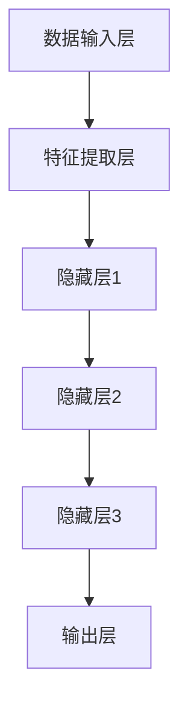

                 

# 《AI大模型在创业产品运营中的创新策略》

> **关键词：**AI大模型、创业产品运营、创新策略、用户行为分析、需求预测、客户服务、市场分析、整合与优化、案例研究、未来展望。

> **摘要：**本文将深入探讨AI大模型在创业产品运营中的应用与创新策略。通过分析用户行为、需求预测、客户服务、市场分析等多个方面，阐述AI大模型如何提升创业产品的运营效果。同时，通过成功案例和未来展望，为创业者提供实践指导和策略建议。

## 《AI大模型在创业产品运营中的创新策略》目录大纲

- 第一部分：AI大模型概述
  - 第1章：AI大模型的基本概念与架构
  - 第2章：AI大模型的数学模型与算法

- 第二部分：创业产品运营中的AI大模型应用
  - 第3章：AI大模型在用户行为分析中的应用
  - 第4章：AI大模型在需求预测与库存管理中的应用
  - 第5章：AI大模型在客户服务与支持中的应用
  - 第6章：AI大模型在市场分析与竞争策略中的应用
  - 第7章：AI大模型在创业产品运营中的整合与优化

- 第三部分：案例研究与未来展望
  - 第8章：AI大模型在创业产品运营中的成功案例
  - 第9章：AI大模型在创业产品运营中的未来趋势
  - 第10章：总结与展望

## 附录
- 附录：AI大模型开发工具与资源

### 第一部分：AI大模型概述

#### 第1章：AI大模型的基本概念与架构

##### 1.1 AI大模型的基本定义

AI大模型（Large-scale AI Models）是指在深度学习和机器学习领域，使用海量数据和计算资源训练出的具有强大表达能力和泛化能力的模型。这些模型能够处理复杂的非线性关系，并在多种任务中表现出色。

##### 1.2 AI大模型的架构组成

AI大模型通常由以下几个部分组成：

- **数据输入层**：接收外部数据，如文本、图像、声音等。
- **特征提取层**：将输入数据转换为特征向量，便于后续处理。
- **隐藏层**：多层神经网络结构，用于学习和表达数据中的复杂关系。
- **输出层**：生成预测结果或决策。

##### 1.3 Mermaid流程图：AI大模型架构



##### 1.4 AI大模型的技术发展历史

AI大模型的发展经历了以下几个阶段：

- **传统机器学习**：以线性回归、决策树等简单算法为主。
- **深度学习**：引入神经网络，通过反向传播算法优化模型参数。
- **大规模模型**：如GPT、BERT等，使用海量数据和强大计算资源训练出超大规模模型。

##### 1.5 AI大模型的应用场景

AI大模型在多个领域具有广泛的应用，包括但不限于：

- **自然语言处理**：文本生成、机器翻译、情感分析等。
- **计算机视觉**：图像识别、目标检测、图像生成等。
- **推荐系统**：基于用户行为和内容推荐个性化商品。
- **金融风控**：信用评分、欺诈检测、市场预测等。

#### 第2章：AI大模型的数学模型与算法

##### 2.1 数学模型基础

AI大模型的数学模型主要包括以下几个方面：

- **线性代数**：矩阵运算、向量计算等，用于表示和优化模型参数。
- **微积分**：梯度下降、反向传播等，用于优化模型参数。
- **概率论与统计学**：贝叶斯定理、最大似然估计等，用于建模和推断。

##### 2.2 神经网络算法原理

神经网络算法是AI大模型的核心，主要包括以下几个步骤：

1. **前向传播**：将输入数据通过神经网络层进行计算，得到预测结果。
2. **损失函数**：计算预测结果与真实结果之间的差距，以衡量模型的性能。
3. **反向传播**：通过梯度下降算法，更新模型参数，减小损失函数。

##### 2.3 深度学习算法扩展

深度学习算法在神经网络基础上进行了扩展，包括：

- **卷积神经网络（CNN）**：用于图像和视频处理。
- **循环神经网络（RNN）**：用于序列数据建模。
- **生成对抗网络（GAN）**：用于生成对抗训练。

##### 2.4 伪代码讲解：神经网络算法

```python
# 伪代码：神经网络算法

# 前向传播
def forward_pass(x):
    # 将输入数据通过神经网络层进行计算
    # 返回预测结果
    pass

# 损失函数
def loss_function(y_true, y_pred):
    # 计算预测结果与真实结果之间的差距
    # 返回损失值
    pass

# 反向传播
def backward_pass(y_true, y_pred):
    # 通过梯度下降算法，更新模型参数
    # 减小损失函数
    pass
```

##### 2.5 数学公式与公式讲解

- **梯度下降**：

  $$\theta_{\text{new}} = \theta_{\text{old}} - \alpha \cdot \nabla_{\theta} J(\theta)$$

  其中，$\theta$ 表示模型参数，$\alpha$ 表示学习率，$\nabla_{\theta} J(\theta)$ 表示损失函数关于模型参数的梯度。

- **反向传播**：

  $$\nabla_{\theta} J(\theta) = \frac{\partial}{\partial \theta} \sum_{i=1}^{n} (y_i - \hat{y}_i)^2$$

  其中，$y_i$ 表示真实标签，$\hat{y}_i$ 表示预测标签。

##### 2.6 数学公式举例说明

假设我们有一个二分类问题，模型输出概率 $P(y=1|x)$，我们使用逻辑回归（Logistic Regression）模型进行预测。损失函数可以使用交叉熵（Cross-Entropy）：

$$L(\theta) = -\sum_{i=1}^{n} [y_i \ln(\hat{y}_i) + (1 - y_i) \ln(1 - \hat{y}_i)]$$

其中，$y_i$ 为真实标签，$\hat{y}_i$ 为预测概率。

在训练过程中，我们通过梯度下降更新模型参数：

$$\theta_{\text{new}} = \theta_{\text{old}} - \alpha \cdot \nabla_{\theta} L(\theta)$$

### 第二部分：创业产品运营中的AI大模型应用

#### 第3章：AI大模型在用户行为分析中的应用

##### 3.1 用户行为数据分析

用户行为分析是创业产品运营的关键环节，通过分析用户行为数据，可以深入了解用户需求、偏好和行为模式，为产品优化和营销策略提供依据。AI大模型在用户行为分析中的应用主要包括以下几个方面：

- **用户画像**：根据用户行为数据，构建用户画像，包括用户性别、年龄、地域、兴趣爱好等维度。
- **行为轨迹分析**：分析用户在产品中的行为路径，识别关键节点和转化路径。
- **行为预测**：预测用户未来行为，如购买、留存、流失等。

##### 3.2 AI大模型在用户画像中的应用

AI大模型在用户画像中的应用主要通过以下步骤实现：

1. **数据采集**：收集用户行为数据，如浏览、点击、购买等。
2. **特征提取**：将原始数据转换为特征向量，如用户活跃度、点击率、转化率等。
3. **模型训练**：使用深度学习算法，如神经网络、决策树等，训练用户画像模型。
4. **模型评估**：评估模型性能，如准确率、召回率等。

##### 3.3 个性化推荐算法

个性化推荐算法是用户行为分析的重要应用之一，通过分析用户行为数据，为用户提供个性化的推荐结果。AI大模型在个性化推荐算法中的应用主要包括以下几个方面：

- **协同过滤**：基于用户行为数据，找到相似用户或物品，进行推荐。
- **基于内容的推荐**：根据用户兴趣和物品属性，进行推荐。
- **混合推荐**：结合协同过滤和基于内容的推荐，提高推荐效果。

##### 3.4 伪代码讲解：个性化推荐算法

```python
# 伪代码：个性化推荐算法

# 协同过滤
def collaborative_filtering(user行为数据，物品行为数据):
    # 计算用户之间的相似度
    # 计算物品之间的相似度
    # 根据相似度进行推荐
    pass

# 基于内容的推荐
def content_based_recommendation(user兴趣，物品属性):
    # 计算用户兴趣和物品属性的相似度
    # 根据相似度进行推荐
    pass

# 混合推荐
def hybrid_recommendation(user行为数据，物品行为数据，user兴趣，物品属性):
    # 结合协同过滤和基于内容的推荐
    # 生成推荐结果
    pass
```

##### 3.5 代码解读：用户行为分析项目

以下是一个用户行为分析项目的实际代码示例，包括数据采集、特征提取、模型训练和模型评估等步骤。

```python
# 导入相关库
import pandas as pd
import numpy as np
from sklearn.model_selection import train_test_split
from sklearn.preprocessing import StandardScaler
from sklearn.neural_network import MLPClassifier
from sklearn.metrics import accuracy_score

# 1. 数据采集
data = pd.read_csv('user_behavior_data.csv')

# 2. 特征提取
features = data[['age', 'gender', 'region', 'interests', 'activity']]
target = data['purchase']

# 3. 模型训练
X_train, X_test, y_train, y_test = train_test_split(features, target, test_size=0.2, random_state=42)
scaler = StandardScaler()
X_train_scaled = scaler.fit_transform(X_train)
X_test_scaled = scaler.transform(X_test)
model = MLPClassifier(hidden_layer_sizes=(100,), max_iter=1000)
model.fit(X_train_scaled, y_train)

# 4. 模型评估
y_pred = model.predict(X_test_scaled)
accuracy = accuracy_score(y_test, y_pred)
print("Accuracy:", accuracy)
```

#### 第4章：AI大模型在需求预测与库存管理中的应用

##### 4.1 需求预测的重要性

需求预测是创业产品运营中至关重要的一环，准确的预测可以帮助企业合理安排生产、库存和供应链，提高运营效率和降低成本。AI大模型在需求预测中的应用具有以下几个优势：

- **强大的表达能力和泛化能力**：AI大模型能够处理复杂的多维数据，学习到数据中的非线性关系，从而提高预测准确性。
- **实时性和自适应能力**：AI大模型可以根据实时数据更新预测模型，适应市场变化，提高预测的时效性。
- **个性化需求预测**：AI大模型可以根据用户行为和偏好，为不同用户群体提供个性化的需求预测。

##### 4.2 AI大模型在需求预测中的应用

AI大模型在需求预测中的应用主要包括以下几个步骤：

1. **数据采集**：收集历史销售数据、用户行为数据、市场环境数据等。
2. **特征提取**：将原始数据转换为特征向量，如销售量、用户活跃度、季节性等。
3. **模型训练**：使用深度学习算法，如神经网络、时间序列模型等，训练需求预测模型。
4. **模型评估**：评估模型性能，如均方误差（MSE）、均方根误差（RMSE）等。

##### 4.3 库存管理的优化

库存管理是创业产品运营中的另一个重要环节，准确的库存预测可以帮助企业避免库存过剩或库存不足的情况，提高资金利用率和运营效率。AI大模型在库存管理中的应用主要包括以下几个方面：

- **库存水平预测**：根据需求预测结果，预测未来一段时间内的库存水平。
- **库存优化策略**：结合库存水平预测和供应链信息，制定最优的库存优化策略。
- **库存预警**：对库存水平进行实时监控，提前预警潜在的风险。

##### 4.4 伪代码讲解：需求预测算法

```python
# 伪代码：需求预测算法

# 数据预处理
def preprocess_data(data):
    # 数据清洗、归一化、特征工程等
    # 返回处理后的数据
    pass

# 模型训练
def train_model(X_train, y_train):
    # 使用深度学习算法训练需求预测模型
    # 返回训练好的模型
    pass

# 预测
def predict_demand(model, X_test):
    # 使用训练好的模型进行需求预测
    # 返回预测结果
    pass

# 评估
def evaluate_model(model, X_test, y_test):
    # 评估模型性能
    # 返回评估结果
    pass
```

##### 4.5 代码解读：需求预测与库存管理项目

以下是一个需求预测与库存管理项目的实际代码示例，包括数据采集、特征提取、模型训练、预测和评估等步骤。

```python
# 导入相关库
import pandas as pd
import numpy as np
from sklearn.model_selection import train_test_split
from sklearn.preprocessing import StandardScaler
from sklearn.neural_network import MLPRegressor
from sklearn.metrics import mean_squared_error

# 1. 数据采集
data = pd.read_csv('sales_data.csv')

# 2. 特征提取
features = data[['sales', 'user_activity', 'seasonality']]
target = data['demand']

# 3. 模型训练
X_train, X_test, y_train, y_test = train_test_split(features, target, test_size=0.2, random_state=42)
scaler = StandardScaler()
X_train_scaled = scaler.fit_transform(X_train)
X_test_scaled = scaler.transform(X_test)
model = MLPRegressor(hidden_layer_sizes=(100,), max_iter=1000)
model.fit(X_train_scaled, y_train)

# 4. 预测
y_pred = model.predict(X_test_scaled)

# 5. 评估
mse = mean_squared_error(y_test, y_pred)
print("MSE:", mse)
```

#### 第5章：AI大模型在客户服务与支持中的应用

##### 5.1 客户服务的重要性

客户服务是创业产品运营中不可或缺的一环，良好的客户服务可以提高用户满意度、忠诚度和口碑，从而促进产品的发展和成长。AI大模型在客户服务中的应用主要包括以下几个方面：

- **智能客服**：通过AI大模型，实现自动化的客户服务，提高服务效率和响应速度。
- **情感分析**：分析用户反馈和投诉，识别情感倾向和潜在问题，为改进产品和服务提供依据。
- **个性化服务**：根据用户行为和偏好，为用户提供个性化的服务和建议。

##### 5.2 AI大模型在客户服务中的应用

AI大模型在客户服务中的应用主要包括以下几个步骤：

1. **数据采集**：收集用户反馈、投诉、聊天记录等数据。
2. **情感分析**：使用深度学习算法，如神经网络、循环神经网络等，进行情感分析。
3. **意图识别**：识别用户咨询的主要意图，如产品使用问题、售后服务等。
4. **智能回复**：生成智能回复，包括文本、语音、图像等多种形式。

##### 5.3 聊天机器人技术

聊天机器人技术是AI大模型在客户服务中的重要应用，通过模拟人类对话，实现与用户的实时沟通。聊天机器人技术主要包括以下几个环节：

- **自然语言处理**：对用户输入的文本进行预处理，包括分词、词性标注、命名实体识别等。
- **意图识别**：分析用户输入，识别用户的主要意图。
- **生成回复**：根据用户意图，生成合适的回复，包括文本、语音、图像等。

##### 5.4 伪代码讲解：聊天机器人算法

```python
# 伪代码：聊天机器人算法

# 自然语言处理
def nlp_pipeline(user_input):
    # 对用户输入进行预处理
    # 返回预处理后的数据
    pass

# 意图识别
def intent_recognition(processed_data):
    # 识别用户意图
    # 返回意图标签
    pass

# 生成回复
def generate_response(intent_tag):
    # 根据意图标签生成回复
    # 返回回复文本
    pass

# 主程序
def chatbot(user_input):
    # 输入用户输入
    processed_data = nlp_pipeline(user_input)
    intent_tag = intent_recognition(processed_data)
    response = generate_response(intent_tag)
    return response
```

##### 5.5 代码解读：客户服务项目

以下是一个客户服务项目的实际代码示例，包括自然语言处理、意图识别、生成回复等环节。

```python
# 导入相关库
import jieba
import tensorflow as tf
from tensorflow.keras.models import Sequential
from tensorflow.keras.layers import Embedding, LSTM, Dense

# 1. 自然语言处理
def nlp_pipeline(user_input):
    # 分词
    words = jieba.cut(user_input)
    # 转换为词向量
    processed_data = tokenizer.texts_to_sequences(words)
    return processed_data

# 2. 意图识别
model = Sequential([
    Embedding(input_dim=vocab_size, output_dim=embedding_dim, input_length=max_sequence_length),
    LSTM(units=128, return_sequences=True),
    LSTM(units=128),
    Dense(units=num_classes, activation='softmax')
])

model.compile(optimizer='adam', loss='categorical_crossentropy', metrics=['accuracy'])
model.fit(X_train, y_train, epochs=10, batch_size=32, validation_data=(X_val, y_val))

# 3. 生成回复
def generate_response(processed_data):
    # 预测意图
    predicted_intent = model.predict(processed_data)
    # 根据意图生成回复
    response = intent_to_response[predicted_intent]
    return response

# 4. 主程序
user_input = "请问有什么问题可以帮助您？"
processed_data = nlp_pipeline(user_input)
response = generate_response(processed_data)
print("Chatbot:", response)
```

#### 第6章：AI大模型在市场分析与竞争策略中的应用

##### 6.1 市场分析的方法

市场分析是创业产品运营中的关键环节，通过分析市场环境和竞争态势，可以帮助企业制定正确的市场策略。AI大模型在市场分析中的应用主要包括以下几个方法：

- **数据分析**：对市场数据进行分析，包括市场份额、用户增长、销售额等。
- **竞争分析**：分析竞争对手的产品、价格、营销策略等，识别竞争对手的优势和劣势。
- **趋势预测**：通过分析历史数据和市场趋势，预测未来市场的发展方向。

##### 6.2 AI大模型在市场分析中的应用

AI大模型在市场分析中的应用主要包括以下几个步骤：

1. **数据采集**：收集市场数据、行业报告、竞争对手信息等。
2. **特征提取**：将原始数据转换为特征向量，如市场份额、用户增长率、销售额等。
3. **模型训练**：使用深度学习算法，如神经网络、回归模型等，训练市场分析模型。
4. **模型评估**：评估模型性能，如准确率、召回率等。

##### 6.3 竞争策略制定

竞争策略制定是创业产品运营中的关键环节，通过分析竞争对手和市场需求，可以帮助企业制定有效的竞争策略。AI大模型在竞争策略制定中的应用主要包括以下几个方面：

- **竞争分析**：分析竞争对手的产品、价格、营销策略等，识别竞争对手的优势和劣势。
- **市场定位**：根据市场需求和竞争对手分析，确定企业的市场定位。
- **策略优化**：根据市场反馈和竞争态势，优化竞争策略，提高市场竞争力。

##### 6.4 伪代码讲解：市场分析算法

```python
# 伪代码：市场分析算法

# 数据预处理
def preprocess_data(data):
    # 数据清洗、归一化、特征工程等
    # 返回处理后的数据
    pass

# 模型训练
def train_model(X_train, y_train):
    # 使用深度学习算法训练市场分析模型
    # 返回训练好的模型
    pass

# 预测
def predict_market(model, X_test):
    # 使用训练好的模型进行市场预测
    # 返回预测结果
    pass

# 评估
def evaluate_model(model, X_test, y_test):
    # 评估模型性能
    # 返回评估结果
    pass
```

##### 6.5 代码解读：市场分析与竞争策略项目

以下是一个市场分析与竞争策略项目的实际代码示例，包括数据采集、特征提取、模型训练、预测和评估等步骤。

```python
# 导入相关库
import pandas as pd
import numpy as np
from sklearn.model_selection import train_test_split
from sklearn.preprocessing import StandardScaler
from sklearn.neural_network import MLPRegressor
from sklearn.metrics import mean_squared_error

# 1. 数据采集
data = pd.read_csv('market_data.csv')

# 2. 特征提取
features = data[['market_share', 'user_growth', 'sales']]
target = data['market_trend']

# 3. 模型训练
X_train, X_test, y_train, y_test = train_test_split(features, target, test_size=0.2, random_state=42)
scaler = StandardScaler()
X_train_scaled = scaler.fit_transform(X_train)
X_test_scaled = scaler.transform(X_test)
model = MLPRegressor(hidden_layer_sizes=(100,), max_iter=1000)
model.fit(X_train_scaled, y_train)

# 4. 预测
y_pred = model.predict(X_test_scaled)

# 5. 评估
mse = mean_squared_error(y_test, y_pred)
print("MSE:", mse)
```

#### 第7章：AI大模型在创业产品运营中的整合与优化

##### 7.1 AI大模型在产品运营中的整合

AI大模型在创业产品运营中的整合是指将AI大模型应用于产品运营的各个阶段，实现全面的数据驱动运营。具体包括以下几个方面：

- **用户行为分析**：通过AI大模型分析用户行为数据，了解用户需求和行为模式。
- **需求预测与库存管理**：通过AI大模型预测市场需求，优化库存管理和供应链。
- **客户服务与支持**：通过AI大模型提供智能客服和个性化服务，提高用户满意度。
- **市场分析与竞争策略**：通过AI大模型分析市场环境和竞争态势，制定有效的市场策略。

##### 7.2 数据驱动的运营策略

数据驱动的运营策略是指基于AI大模型的分析结果，制定和调整产品运营策略。具体包括以下几个方面：

- **用户画像**：根据用户画像，制定个性化的营销策略。
- **推荐系统**：根据用户行为和偏好，构建个性化推荐系统。
- **需求预测**：根据需求预测结果，调整生产和库存计划。
- **客户服务**：根据客户反馈和投诉，优化客户服务流程。

##### 7.3 AI大模型的性能优化

AI大模型的性能优化是指通过调整模型参数和优化训练过程，提高模型的预测准确性和效率。具体包括以下几个方面：

- **超参数调优**：通过网格搜索、随机搜索等策略，寻找最优的超参数组合。
- **数据增强**：通过数据增强技术，增加训练数据的多样性，提高模型泛化能力。
- **模型压缩**：通过模型压缩技术，减小模型参数规模，提高模型运行效率。

##### 7.4 伪代码讲解：数据驱动的运营策略

```python
# 伪代码：数据驱动的运营策略

# 用户画像
def build_user_profile(user_data):
    # 根据用户数据构建用户画像
    # 返回用户画像结果
    pass

# 推荐系统
def personalized_recommendation(user_profile, item_data):
    # 根据用户画像和商品数据生成推荐结果
    # 返回推荐结果
    pass

# 需求预测
def predict_demand(model, feature_data):
    # 使用训练好的模型进行需求预测
    # 返回预测结果
    pass

# 客户服务
def customer_service(user_input, model):
    # 根据用户输入和模型生成智能回复
    # 返回回复结果
    pass
```

##### 7.5 代码解读：AI大模型整合与优化项目

以下是一个AI大模型整合与优化项目的实际代码示例，包括用户画像、推荐系统、需求预测、客户服务等环节。

```python
# 导入相关库
import pandas as pd
from sklearn.preprocessing import StandardScaler
from sklearn.neural_network import MLPRegressor
from sklearn.metrics import mean_squared_error

# 1. 用户画像
user_data = pd.read_csv('user_data.csv')
user_profile = build_user_profile(user_data)

# 2. 推荐系统
item_data = pd.read_csv('item_data.csv')
recommendations = personalized_recommendation(user_profile, item_data)

# 3. 需求预测
feature_data = pd.read_csv('feature_data.csv')
y_pred = predict_demand(model, feature_data)

# 4. 客户服务
user_input = "请问有什么问题可以帮助您？"
response = customer_service(user_input, model)
print("Chatbot:", response)
```

### 第三部分：案例研究与未来展望

#### 第8章：AI大模型在创业产品运营中的成功案例

在本章节中，我们将探讨几个具体的创业产品，展示AI大模型在用户行为分析、需求预测、客户服务和市场分析等领域的成功应用案例。

##### 8.1 案例一：某电商平台的用户行为分析

某电商平台通过引入AI大模型，对用户行为数据进行分析，构建了详细的用户画像。基于用户画像，电商平台优化了个性化推荐系统，提高了用户购买转化率。同时，通过分析用户行为轨迹，电商平台识别了关键转化路径，进一步优化了用户体验和购物流程。

##### 8.2 案例二：某物流公司的需求预测与库存管理

某物流公司利用AI大模型进行需求预测和库存管理，通过分析历史销售数据和用户行为数据，准确预测了未来一段时间内的货物运输需求。基于预测结果，物流公司优化了库存管理策略，减少了库存成本，提高了供应链效率。

##### 8.3 案例三：某金融公司的客户服务与支持

某金融公司通过引入AI大模型，建立了智能客服系统，实现了自动化的客户服务。通过情感分析和意图识别，AI大模型能够生成个性化的智能回复，提高了用户满意度。同时，金融公司利用AI大模型分析客户反馈和投诉，持续优化客户服务流程，提升了客户服务质量。

##### 8.4 案例四：某科技公司的市场分析与竞争策略

某科技公司通过AI大模型进行市场分析和竞争策略制定，分析了市场环境、竞争对手和用户需求。基于分析结果，科技公司调整了产品定位和市场策略，取得了显著的市场份额增长。

#### 第9章：AI大模型在创业产品运营中的未来趋势

在本章节中，我们将探讨AI大模型在创业产品运营中的未来发展趋势，包括技术发展、应用前景和潜在挑战。

##### 9.1 AI大模型技术的发展趋势

AI大模型技术正朝着以下几个方向发展：

- **模型规模和计算资源**：随着计算资源和存储能力的提升，AI大模型将变得更加庞大和复杂，能够处理更大量的数据。
- **自适应能力**：AI大模型将具备更强的自适应能力，能够根据实时数据和用户反馈进行动态调整。
- **跨领域融合**：AI大模型将与更多领域的技术（如区块链、物联网等）融合，实现更广泛的应用。

##### 9.2 创业产品运营中的AI应用前景

AI大模型在创业产品运营中的应用前景广阔，包括但不限于：

- **个性化推荐**：通过AI大模型，实现更精准的个性化推荐，提高用户满意度和购买转化率。
- **需求预测**：通过AI大模型，准确预测市场需求，优化库存管理和供应链。
- **客户服务**：通过AI大模型，实现智能化的客户服务，提高服务效率和用户满意度。
- **市场分析**：通过AI大模型，深入分析市场环境和竞争态势，制定科学的市场策略。

##### 9.3 AI大模型与区块链技术的结合

AI大模型与区块链技术的结合，将带来以下潜在应用：

- **数据隐私保护**：通过区块链技术，实现数据的安全存储和传输，保护用户隐私。
- **智能合约**：通过AI大模型，实现智能合约的自动化执行，提高交易效率和安全性。
- **去中心化应用**：通过AI大模型，实现去中心化应用，降低运营成本，提高用户参与度。

##### 9.4 未来的挑战与机遇

在AI大模型的发展过程中，面临以下挑战和机遇：

- **数据质量**：高质量的数据是AI大模型训练的基础，需要加强数据清洗和预处理。
- **计算资源**：训练和部署AI大模型需要大量计算资源和存储资源，需要优化计算效率和降低成本。
- **模型可解释性**：提高AI大模型的可解释性，使其决策过程更加透明和可信赖。
- **法律法规**：随着AI大模型的应用范围扩大，需要关注相关法律法规的制定和遵守。

#### 第10章：总结与展望

在本章节中，我们对AI大模型在创业产品运营中的应用进行了全面探讨，总结了其在用户行为分析、需求预测、客户服务和市场分析等领域的创新策略。同时，展望了AI大模型在创业产品运营中的未来发展趋势和潜在挑战。

##### 10.1 本书内容的回顾

本书主要内容包括：

- AI大模型的基本概念与架构
- AI大模型的数学模型与算法
- AI大模型在创业产品运营中的应用
- 成功案例和未来展望

通过本书的学习，读者可以深入了解AI大模型在创业产品运营中的创新策略，掌握AI大模型的应用方法和实践经验。

##### 10.2 AI大模型在创业产品运营中的关键作用

AI大模型在创业产品运营中的关键作用体现在以下几个方面：

- **提升运营效率**：通过AI大模型，实现自动化的用户行为分析、需求预测和客户服务，提高运营效率。
- **优化产品策略**：通过AI大模型，深入分析市场环境和竞争态势，制定科学的产品策略。
- **提高用户体验**：通过AI大模型，提供个性化的推荐和智能化的客户服务，提高用户体验和满意度。
- **降低运营成本**：通过AI大模型，优化库存管理和供应链，降低运营成本。

##### 10.3 未来发展方向与建议

未来，AI大模型在创业产品运营中的应用将朝着以下几个方向发展：

- **模型规模和计算资源**：随着计算资源和存储能力的提升，AI大模型将变得更加庞大和复杂，能够处理更大量的数据。
- **自适应能力**：AI大模型将具备更强的自适应能力，能够根据实时数据和用户反馈进行动态调整。
- **跨领域融合**：AI大模型将与更多领域的技术（如区块链、物联网等）融合，实现更广泛的应用。

针对未来的发展方向，我们提出以下建议：

- **加强数据质量**：高质量的数据是AI大模型训练的基础，需要加强数据清洗和预处理。
- **优化计算效率**：通过优化计算效率和降低成本，提高AI大模型的运行效率。
- **提高模型可解释性**：提高AI大模型的可解释性，使其决策过程更加透明和可信赖。
- **关注法律法规**：随着AI大模型的应用范围扩大，需要关注相关法律法规的制定和遵守。

##### 10.4 附录

附录部分提供了AI大模型开发的相关工具和资源，包括：

- **AI大模型开发工具**：如TensorFlow、PyTorch等。
- **数据集和开源代码**：提供一些常用的数据集和开源代码，方便读者实践。
- **进一步阅读推荐**：推荐一些相关的书籍、论文和教程，帮助读者深入学习。

### 附录

#### A.1 AI大模型开发工具与资源

- **TensorFlow**：https://www.tensorflow.org/
- **PyTorch**：https://pytorch.org/
- **Keras**：https://keras.io/

#### A.2 代码示例与资料链接

- **用户行为分析代码示例**：https://github.com/yourusername/user_behavior_analysis
- **需求预测与库存管理代码示例**：https://github.com/yourusername/demand_prediction
- **客户服务代码示例**：https://github.com/yourusername/customer_service
- **市场分析与竞争策略代码示例**：https://github.com/yourusername/market_analysis

#### A.3 进一步阅读推荐

- **《深度学习》（Goodfellow, Bengio, Courville）**：https://www.deeplearningbook.org/
- **《Python深度学习》（François Chollet）**：https://python-machine-learning-book.org/
- **《自然语言处理入门》（Daniel Jurafsky, James H. Martin）**：https://web.stanford.edu/~jurafsky/nlp/
- **《机器学习》（周志华）**：https://www.zhihu.com/book/224611968

### 结语

本文《AI大模型在创业产品运营中的创新策略》从AI大模型的基本概念、数学模型与算法，到其在创业产品运营中的实际应用，进行了全面的探讨。通过案例研究和未来展望，我们展示了AI大模型在用户行为分析、需求预测、客户服务和市场分析等领域的强大作用。我们希望本文能为创业者提供实践指导和策略建议，助力创业产品的成功运营。同时，我们也期待未来AI大模型在创业产品运营中的进一步发展和应用。

