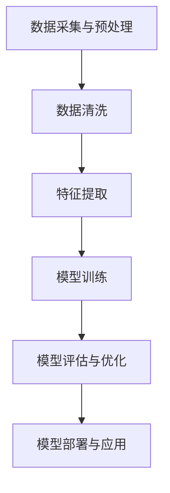

                 

### 文章标题

#### AI 大模型应用数据中心的数据处理架构

#### 关键词：AI 大模型，数据处理架构，深度学习，数据预处理，分布式计算，性能优化

#### 摘要：
本文深入探讨了 AI 大模型在数据中心中的应用及其背后的数据处理架构。首先，我们回顾了 AI 大模型的应用背景和技术原理，接着详细分析了数据处理架构的设计原则和核心组件。文章随后探讨了 AI 大模型与数据处理架构的集成，并提出了优化策略。通过具体案例，我们展示了数据处理架构在 AI 大模型应用中的实际运用。最后，文章总结了 AI 大模型数据处理性能优化的方法，并展望了未来的发展趋势。

### 第一部分：AI大模型应用概述

#### 第1章: AI大模型应用概述

##### 1.1 AI大模型应用的背景

###### 1.1.1 从大数据到AI大模型的发展

随着互联网和物联网技术的快速发展，数据量呈指数级增长。从大数据到 AI 大模型的发展，是信息技术领域的一次重要变革。大数据技术主要包括数据采集、存储、处理和分析等环节，而 AI 大模型则在此基础上引入了更先进的算法，如神经网络和深度学习，使得数据能够被更有效地利用。

在过去的几十年中，计算机性能和算法的进步使得 AI 大模型的应用成为可能。早期的机器学习模型如线性回归、支持向量机等，虽然在一定程度上提升了数据处理能力，但受限于算法复杂度和计算资源，难以处理大规模数据。随着深度学习算法的出现，AI 大模型开始崛起，它们能够自动学习数据的复杂特征，显著提升了数据处理和分析的能力。

###### 1.1.2 AI大模型应用的价值和挑战

AI 大模型在各个领域都展现出了巨大的应用价值。在医疗领域，AI 大模型可以帮助医生进行疾病诊断，提高诊断的准确性和效率。在金融领域，AI 大模型可以用于风险评估和欺诈检测，有效降低风险。在自动驾驶领域，AI 大模型可以用于环境感知和路径规划，提高自动驾驶的安全性和可靠性。在工业领域，AI 大模型可以帮助实现生产过程的自动化和优化，提高生产效率。

然而，AI 大模型的应用也面临着一系列挑战。首先，数据的质量和一致性是保证模型性能的关键，但实际应用中，数据常常存在噪声、缺失和不一致等问题。其次，AI 大模型的训练和推理需要大量的计算资源和时间，这给数据处理架构的设计带来了巨大的挑战。最后，AI 大模型的应用还需要考虑到安全性和隐私保护问题，尤其是在涉及个人敏感信息的情况下。

###### 1.1.3 AI大模型应用的领域

AI 大模型的应用涵盖了多个领域，包括但不限于以下几方面：

1. **语音识别与合成**：通过深度神经网络，AI 大模型能够实现高质量、自然的语音合成和语音识别，广泛应用于智能客服、智能家居和语音助手等场景。
2. **自然语言处理**：AI 大模型在自然语言处理领域有着广泛的应用，如机器翻译、情感分析、文本生成等，这些技术正在改变内容创作、信息检索和用户交互的范式。
3. **计算机视觉**：AI 大模型在图像和视频处理方面有着卓越的表现，如人脸识别、物体检测、图像分割等，这些技术在安防监控、自动驾驶和医疗影像分析等领域具有重要应用。
4. **推荐系统**：基于用户行为数据和内容特征，AI 大模型可以构建个性化的推荐系统，广泛应用于电子商务、社交媒体和在线娱乐等场景。
5. **自动驾驶**：AI 大模型在自动驾驶中扮演着关键角色，通过环境感知、路径规划和决策控制等模块，实现安全、高效的自动驾驶。
6. **医疗诊断**：AI 大模型可以帮助医生进行疾病诊断，如癌症筛查、心脏疾病诊断等，提高诊断的准确性和效率。
7. **金融风控**：AI 大模型可以用于风险评估、欺诈检测和信用评分等，帮助金融机构提高业务效率和风险管理水平。

##### 1.2 AI大模型的核心技术和原理

###### 1.2.1 神经网络与深度学习

神经网络是 AI 大模型的基础，它模仿人脑的神经元结构，通过层与层之间的信息传递和变换，实现对数据的处理和决策。深度学习则是神经网络的一种扩展，通过堆叠多层神经网络，实现对复杂数据的建模和预测。

神经网络的核心组成部分包括：

- **输入层**：接收外部数据，如图像、文本等。
- **隐藏层**：进行特征提取和变换，隐藏层可以有一层或多层。
- **输出层**：生成预测结果或分类结果。

神经网络通过反向传播算法进行训练，不断调整权重和偏置，使模型能够正确分类或预测。反向传播算法的核心思想是将误差从输出层反向传播到输入层，逐层更新权重和偏置。

深度学习算法包括：

- **卷积神经网络（CNN）**：主要用于图像和视频处理，通过卷积层提取空间特征。
- **循环神经网络（RNN）**：主要用于序列数据建模，如文本、语音等，通过隐藏状态和循环连接实现长距离依赖建模。
- **生成对抗网络（GAN）**：通过生成器和判别器的对抗训练，实现数据的生成和鉴别。

###### 1.2.2 大规模数据处理技术

AI 大模型的应用需要处理大量的数据，这要求数据处理技术具备高效性和可扩展性。大规模数据处理技术主要包括：

- **分布式计算**：通过分布式计算框架，如 Hadoop 和 Spark，实现数据的并行处理，提高数据处理速度。
- **批处理与流处理**：批处理对大量数据进行批量处理，适用于离线数据分析；流处理对实时数据进行处理，适用于实时应用场景。
- **NoSQL 数据库**：如 MongoDB 和 Cassandra，支持海量数据的存储和快速查询。

###### 1.2.3 自监督学习和迁移学习

自监督学习是一种无需标签数据的学习方法，通过利用未标注的数据进行学习，提高模型的泛化能力。自监督学习的应用场景包括图像分类、文本分类和语音识别等。

迁移学习则是将一个任务在特定数据集上训练得到的模型应用于另一个相关任务，提高模型在新的数据集上的表现。迁移学习可以有效地利用已有的知识和数据，减少训练时间和计算资源的需求。

###### 1.2.4 Mermaid流程图 - AI大模型架构



此流程图展示了 AI 大模型从数据采集与预处理到模型训练、评估和部署的完整流程。

##### 1.3 AI大模型应用案例

###### 1.3.1 语音识别与合成

语音识别与合成是 AI 大模型在语音处理领域的典型应用。语音识别技术通过识别语音信号中的音素和词汇，将语音转换为文本。语音合成技术则通过文本生成语音，实现自然的语音输出。

语音识别与合成技术广泛应用于智能客服、语音助手和语音交互系统。例如，智能客服系统可以使用语音识别技术将客户的语音转换为文本，然后通过自然语言处理技术理解客户的需求，并提供相应的答复。语音合成技术则可以生成自然、流畅的语音输出，使机器能够与人类进行有效的语音交流。

###### 1.3.2 自然语言处理

自然语言处理是 AI 大模型在文本处理领域的应用，涉及文本分类、情感分析、机器翻译、文本生成等多个方面。自然语言处理技术使得机器能够理解、生成和处理人类语言，为智能客服、信息检索和内容创作等领域提供了强大的支持。

例如，自然语言处理技术可以用于情感分析，通过分析用户的评论或反馈，识别用户的情感倾向。机器翻译技术则可以将一种语言翻译成另一种语言，支持跨语言的信息交流。文本生成技术可以自动生成新闻文章、产品描述等，为内容创作提供便利。

###### 1.3.3 计算机视觉

计算机视觉是 AI 大模型在图像和视频处理领域的应用，涉及图像分类、目标检测、人脸识别等多个方面。计算机视觉技术使得机器能够理解和分析图像和视频内容，为安防监控、自动驾驶和医疗影像分析等领域提供了重要支持。

例如，图像分类技术可以自动识别和分类图像中的物体，如人脸识别技术可以识别图像中的人脸。目标检测技术可以检测图像中的目标物体，如行人检测、车辆检测等。自动驾驶技术则利用计算机视觉技术实现环境感知和路径规划，提高自动驾驶的安全性和可靠性。

###### 1.3.4 其他领域应用

AI 大模型在其他领域也有着广泛的应用，如推荐系统、医疗诊断和金融风控等。

推荐系统通过分析用户的行为数据和物品特征，为用户推荐个性化的商品、服务和内容。例如，电商平台的推荐系统能够根据用户的购买历史和浏览记录，为用户推荐相关的商品。

医疗诊断技术通过分析医疗影像和患者数据，帮助医生进行疾病诊断。例如，AI 大模型可以用于乳腺癌筛查，通过分析乳腺 X 光片，帮助医生识别可疑病变。

金融风控技术通过分析用户行为数据和交易数据，识别潜在的欺诈行为。例如，银行可以使用 AI 大模型进行欺诈检测，通过分析用户的交易记录和特征，识别异常交易行为。

##### 1.4 AI大模型应用的发展趋势

###### 1.4.1 技术发展趋势

AI 大模型应用的发展趋势主要体现在以下几个方面：

1. **算法优化**：随着计算资源和算法的进步，AI 大模型的性能不断提高。例如，通过模型压缩和量化技术，可以在保证模型性能的前提下，减少模型的存储和计算资源需求。
2. **硬件加速**：GPU 和 TPU 等硬件加速器的应用，使得 AI 大模型的训练和推理速度显著提升。未来，更多的硬件加速器和技术将应用于 AI 大模型领域。
3. **边缘计算**：随着物联网和 5G 技术的发展，边缘计算成为 AI 大模型应用的重要趋势。边缘计算可以将 AI 大模型部署在靠近数据源的设备上，实现实时数据处理和智能决策。
4. **联邦学习**：联邦学习是一种分布式学习技术，可以在保护用户隐私的前提下，实现模型训练和协作。未来，联邦学习将在 AI 大模型应用中发挥重要作用。

###### 1.4.2 行业应用趋势

AI 大模型在各个行业中的应用趋势如下：

1. **医疗健康**：随着医疗数据的增加和深度学习算法的进步，AI 大模型在医疗健康领域的应用将越来越广泛。例如，AI 大模型可以用于疾病预测、药物研发和个性化治疗等。
2. **金融科技**：AI 大模型在金融科技领域的应用将继续深化，如智能投顾、风险管理和反欺诈等。
3. **智能制造**：AI 大模型可以用于生产过程的自动化和优化，提高生产效率和产品质量。例如，AI 大模型可以用于设备故障预测和产品缺陷检测。
4. **智慧城市**：AI 大模型可以用于城市管理、交通优化和环境监测等，提高城市管理的智能化和精细化水平。

###### 1.4.3 潜在挑战与应对策略

尽管 AI 大模型应用前景广阔，但仍面临一系列挑战：

1. **数据质量**：数据质量是 AI 大模型应用的关键，数据缺失、噪声和偏差等都会影响模型的性能。应对策略包括数据清洗、数据增强和迁移学习等。
2. **计算资源**：AI 大模型的训练和推理需要大量的计算资源，特别是对于大规模模型和复杂任务。应对策略包括分布式计算、模型压缩和硬件加速等。
3. **模型解释性**：深度学习模型往往缺乏解释性，难以理解模型的决策过程。应对策略包括模型可解释性研究、注意力机制和可视化技术等。
4. **安全性和隐私保护**：AI 大模型应用涉及大量敏感数据，如个人健康信息、金融交易数据等。应对策略包括数据加密、隐私保护技术和联邦学习等。

### 第二部分：数据处理架构设计

#### 第2章: 数据处理架构设计原则

##### 2.1 数据处理架构设计原则

数据处理架构设计是确保 AI 大模型应用成功的关键环节。一个高效、可靠和可扩展的数据处理架构能够支持 AI 大模型的训练和推理，同时满足业务需求和用户体验。以下是数据处理架构设计的主要原则：

###### 2.1.1 可扩展性

可扩展性是数据处理架构设计的重要原则之一。随着数据量的增加和业务需求的增长，数据处理架构需要能够水平扩展，以支持更高的并发处理能力和更大的数据处理量。可扩展性可以通过以下方式实现：

1. **分布式计算**：通过分布式计算框架，如 Hadoop、Spark 和 Flink，实现数据的并行处理，提高系统的处理能力和吞吐量。
2. **微服务架构**：将数据处理架构分解为多个微服务，每个微服务负责不同的数据处理任务，通过服务化接口进行通信和协作，实现系统的高可用性和灵活性。
3. **弹性计算**：利用云服务提供的弹性计算能力，根据实际需求动态调整计算资源，提高系统的资源利用率和响应速度。

###### 2.1.2 可靠性

可靠性是数据处理架构设计的基本要求。一个可靠的数据处理架构能够在各种情况下保持稳定运行，确保数据的安全性和完整性。以下是一些提高可靠性的策略：

1. **数据备份与恢复**：对重要数据进行备份，并建立数据恢复机制，以防止数据丢失或损坏。
2. **容错机制**：在数据处理过程中，设计容错机制，如重试、检查点和恢复，以应对硬件故障、网络中断等问题。
3. **监控与报警**：建立完善的监控与报警系统，实时监控数据处理架构的运行状态，及时发现和解决潜在问题。

###### 2.1.3 易用性

易用性是数据处理架构设计的重要考量因素。一个易用性强的数据处理架构能够简化操作流程，降低运维成本，提高开发效率。以下是一些提高易用性的策略：

1. **模块化设计**：将数据处理架构分解为多个模块，每个模块具有明确的功能和接口，方便开发和维护。
2. **自动化工具**：使用自动化工具，如 CI/CD 流程、脚本和自动化测试，简化部署和运维流程。
3. **文档与培训**：提供详细的架构设计文档和操作手册，并定期组织培训，帮助开发人员和运维人员掌握架构的运作原理和操作方法。

###### 2.1.4 安全性

安全性是数据处理架构设计的关键因素。在数据处理过程中，涉及大量敏感数据，如个人隐私、商业机密等。以下是一些提高安全性的策略：

1. **数据加密**：对敏感数据进行加密，确保数据在传输和存储过程中不被窃取或篡改。
2. **访问控制**：通过身份验证和访问控制策略，限制对数据的访问权限，防止未经授权的访问和操作。
3. **安全审计**：建立安全审计机制，定期对数据处理架构进行安全检查和风险评估，及时发现和修复安全漏洞。

##### 2.2 数据处理架构设计方法

数据处理架构设计是一个系统性工程，涉及多个方面的设计和决策。以下是几种常见的数据处理架构设计方法：

###### 2.2.1 分层架构设计

分层架构设计是一种常见的架构设计方法，将数据处理架构分为多个层次，每个层次负责不同的数据处理任务。常见的分层架构包括：

1. **数据采集层**：负责数据的采集和初步处理，包括数据采集工具、数据清洗和数据预处理等。
2. **数据存储层**：负责数据的存储和管理，包括关系型数据库、NoSQL 数据库和数据仓库等。
3. **数据处理层**：负责数据的高级处理和分析，包括数据挖掘、机器学习和数据可视化等。
4. **数据应用层**：负责将处理后的数据应用于具体的业务场景，如推荐系统、智能客服和金融风控等。

分层架构设计具有清晰的层次结构和职责划分，便于模块化和分布式处理，但需要注意各层次之间的数据传输和同步问题。

###### 2.2.2 微服务架构

微服务架构是一种基于独立服务组件的分布式系统架构，每个服务组件负责一个具体的功能模块，通过轻量级通信协议进行协作和集成。微服务架构具有以下特点：

1. **服务独立性**：每个服务组件独立开发、部署和运维，具有良好的独立性，便于模块化和分布式处理。
2. **横向扩展**：通过增加服务实例的数量，实现系统的水平扩展，提高系统的并发处理能力和吞吐量。
3. **松耦合**：服务组件之间通过轻量级通信协议进行通信，实现松耦合，降低系统复杂度和耦合度。

微服务架构适用于大规模数据处理和分布式应用场景，但需要注意服务治理、数据一致性和分布式事务等问题。

###### 2.2.3 数据流架构

数据流架构是一种基于数据流动和数据处理的架构设计方法，将数据处理过程视为数据流，通过数据流处理技术和工具实现数据的采集、处理和传输。数据流架构具有以下特点：

1. **实时处理**：支持实时数据流处理，能够快速响应实时数据变化，适用于实时应用场景。
2. **分布式处理**：支持分布式数据流处理，能够将数据处理任务分布在多个节点上，实现并行处理，提高系统的处理能力和吞吐量。
3. **灵活扩展**：支持动态扩展和收缩，可以根据实际需求动态调整处理能力和资源分配。

数据流架构适用于实时数据处理和大规模分布式系统，但需要注意数据一致性和系统稳定性等问题。

##### 2.3 数据处理架构的核心组件

数据处理架构由多个核心组件构成，每个组件负责不同的数据处理任务。以下是数据处理架构的主要核心组件：

###### 2.3.1 数据采集系统

数据采集系统负责数据的采集和初步处理，是数据处理架构的基础。数据采集系统通常包括以下组件：

1. **数据采集工具**：用于从各种数据源（如数据库、文件、Web 服务等）采集数据。
2. **数据预处理模块**：对采集到的数据进行清洗、去重、去噪和格式转换等预处理操作。
3. **数据存储模块**：将预处理后的数据存储到数据仓库或临时存储系统中，为后续数据处理提供数据基础。

数据采集系统需要具备高并发处理能力、数据传输安全性和数据可靠性等特点。

###### 2.3.2 数据存储系统

数据存储系统负责数据的存储和管理，是数据处理架构的核心。数据存储系统通常包括以下组件：

1. **关系型数据库**：用于存储结构化数据，如 MySQL、Oracle 和 PostgreSQL 等。
2. **NoSQL 数据库**：用于存储非结构化数据，如 MongoDB、Cassandra 和 Redis 等。
3. **数据仓库**：用于存储大规模结构化数据，如 Hive、HBase 和 ClickHouse 等。

数据存储系统需要具备高吞吐量、高可用性和数据一致性等特点。

###### 2.3.3 数据处理系统

数据处理系统负责对数据进行高级处理和分析，是数据处理架构的核心。数据处理系统通常包括以下组件：

1. **计算引擎**：用于执行数据处理任务，如 Spark、Flink 和 Storm 等。
2. **机器学习框架**：用于实现机器学习和深度学习算法，如 TensorFlow、PyTorch 和 MXNet 等。
3. **数据可视化工具**：用于展示数据分析和机器学习结果，如 Tableau、Power BI 和 Matplotlib 等。

数据处理系统需要具备高性能、可扩展性和可解释性等特点。

###### 2.3.4 数据分析与可视化系统

数据分析与可视化系统负责对处理后的数据进行分析和可视化，为业务决策提供数据支持。数据分析与可视化系统通常包括以下组件：

1. **数据分析工具**：用于执行数据分析和挖掘任务，如 R、Python 和 SQL 等。
2. **数据可视化工具**：用于创建数据可视化和报告，如 Tableau、Power BI 和 Matplotlib 等。
3. **业务智能平台**：用于整合数据和可视化工具，提供统一的业务智能解决方案。

数据分析与可视化系统需要具备易用性、灵活性和实时性等特点。

##### 2.4 数据处理架构设计案例

###### 2.4.1 电商平台数据处理架构

电商平台数据处理架构是一个典型的数据处理架构案例，涉及海量用户数据、商品数据和交易数据的处理。以下是电商平台数据处理架构的主要组件：

1. **数据采集系统**：包括用户行为数据采集、商品数据采集和交易数据采集等，通过 API 接口、日志收集和爬虫等方式采集数据。
2. **数据存储系统**：包括关系型数据库（如 MySQL）和 NoSQL 数据库（如 MongoDB），用于存储用户数据、商品数据和交易数据。
3. **数据处理系统**：包括 Spark 或 Flink，用于对海量数据进行实时处理和分析，如用户行为分析、商品推荐和交易分析等。
4. **数据可视化系统**：包括 Tableau 或 Power BI，用于对分析结果进行可视化展示，如用户购买行为分析、商品销售趋势等。

电商平台数据处理架构需要具备高并发处理能力、数据一致性和实时性等特点，以满足海量用户数据的处理需求。

###### 2.4.2 医疗数据处理架构

医疗数据处理架构是另一个重要的数据处理架构案例，涉及患者数据、医疗影像数据和病历数据的处理。以下是医疗数据处理架构的主要组件：

1. **数据采集系统**：包括患者数据采集、医疗影像数据采集和病历数据采集等，通过电子病历系统、医疗影像设备和日志收集等方式采集数据。
2. **数据存储系统**：包括关系型数据库（如 MySQL）和 NoSQL 数据库（如 MongoDB），用于存储患者数据、医疗影像数据和病历数据。
3. **数据处理系统**：包括 TensorFlow 或 PyTorch，用于对医疗影像数据进行深度学习分析，如病灶检测、疾病预测等。
4. **数据可视化系统**：包括 Matplotlib 或 Tableau，用于对分析结果进行可视化展示，如疾病发展趋势、患者健康状况等。

医疗数据处理架构需要具备数据安全性、可靠性和可解释性等特点，以满足医疗数据的处理和共享需求。

###### 2.4.3 金融数据处理架构

金融数据处理架构是金融行业的数据处理架构案例，涉及交易数据、用户行为数据和风险数据的处理。以下是金融数据处理架构的主要组件：

1. **数据采集系统**：包括交易数据采集、用户行为数据采集和风险数据采集等，通过 API 接口、日志收集和爬虫等方式采集数据。
2. **数据存储系统**：包括关系型数据库（如 MySQL）和 NoSQL 数据库（如 MongoDB），用于存储交易数据、用户行为数据和风险数据。
3. **数据处理系统**：包括 Spark 或 Flink，用于对海量数据进行实时处理和分析，如交易分析、用户画像和风险预测等。
4. **数据可视化系统**：包括 Tableau 或 Power BI，用于对分析结果进行可视化展示，如交易趋势、用户行为分析等。

金融数据处理架构需要具备高并发处理能力、数据一致性和实时性等特点，以满足金融行业的业务需求。

### 第三部分：AI大模型数据处理

#### 第3章: 数据预处理与处理流程

##### 3.1 数据预处理的重要性

数据预处理是 AI 大模型训练过程中至关重要的一步。良好的数据预处理可以显著提高模型性能，减少过拟合现象，加速模型训练过程。以下是数据预处理的重要性：

1. **消除噪声和异常值**：原始数据往往包含噪声和异常值，这些数据会影响模型的训练效果。通过数据预处理，可以消除噪声和异常值，提高数据质量。
2. **减少数据缺失**：数据缺失是数据预处理的重要任务之一。通过数据预处理，可以使用填充方法（如平均值、中值或插值）来填补数据缺失，保证数据的完整性。
3. **数据归一化和标准化**：原始数据往往具有不同的尺度和范围，这会影响到模型的学习效果。通过数据预处理，可以使用归一化（如 Min-Max 标准化）或标准化（如 Z-Score 标准化）方法，将数据转换为统一的尺度，消除尺度差异对模型的影响。
4. **特征提取和特征选择**：数据预处理还包括特征提取和特征选择。通过特征提取，可以从原始数据中提取出有意义的特征，减少数据的维度，提高模型的泛化能力。通过特征选择，可以筛选出最重要的特征，减少冗余特征，提高模型的准确性和效率。
5. **数据集划分**：数据预处理还包括数据集的划分，将数据集划分为训练集、验证集和测试集。通过合理的划分，可以确保模型在训练过程中不会过度拟合，同时可以评估模型的泛化能力。

##### 3.2 数据预处理流程

数据预处理流程是确保 AI 大模型训练成功的关键步骤。以下是数据预处理的主要流程：

###### 3.2.1 数据采集与存储

数据采集与存储是数据预处理的第一步。在这一阶段，需要从不同的数据源采集数据，如数据库、文件系统和 Web 服务等。采集到的数据需要存储在统一的数据存储系统中，如关系型数据库（如 MySQL）或 NoSQL 数据库（如 MongoDB）。数据存储系统需要支持数据的高并发访问和高效查询，以满足数据预处理和模型训练的需求。

###### 3.2.2 数据清洗

数据清洗是数据预处理的核心步骤之一。在这一阶段，需要对数据进行去重、去噪、去异常值等处理。去重是指去除重复的数据记录，避免重复计算和训练。去噪是指去除数据中的噪声和干扰，提高数据质量。去异常值是指检测和去除数据中的异常值，如离群点或错误数据。数据清洗可以使用 SQL 查询、Pandas 等数据处理工具来实现。

```python
import pandas as pd

# 读取数据
data = pd.read_csv('data.csv')

# 去除重复数据
data = data.drop_duplicates()

# 去除异常值
data = data[(data['column'] > 0) & (data['column'] < 100)]

# 去除空值
data = data.dropna()
```

###### 3.2.3 数据归一化

数据归一化是数据预处理的重要步骤，用于将数据转换到统一的尺度。常见的归一化方法包括 Min-Max 标准化和 Z-Score 标准化。

1. **Min-Max 标准化**：Min-Max 标准化将数据缩放到 [0, 1] 的范围，公式如下：

   $$ x_{\text{norm}} = \frac{x - x_{\text{min}}}{x_{\text{max}} - x_{\text{min}}} $$

   ```python
   from sklearn.preprocessing import MinMaxScaler

   # 创建 Min-Max 标准化器
   scaler = MinMaxScaler()

   # 进行 Min-Max 标准化
   data_scaled = scaler.fit_transform(data)
   ```

2. **Z-Score 标准化**：Z-Score 标准化将数据转换到均值为 0、标准差为 1 的正态分布，公式如下：

   $$ x_{\text{norm}} = \frac{x - \mu}{\sigma} $$

   ```python
   from sklearn.preprocessing import StandardScaler

   # 创建 Z-Score 标准化器
   scaler = StandardScaler()

   # 进行 Z-Score 标准化
   data_scaled = scaler.fit_transform(data)
   ```

###### 3.2.4 数据标准化

数据标准化是数据预处理的重要步骤，用于将数据转换到相同的尺度。常见的标准化方法包括 Min-Max 标准化和 Z-Score 标准化。

1. **Min-Max 标准化**：Min-Max 标准化将数据缩放到 [0, 1] 的范围，公式如下：

   $$ x_{\text{norm}} = \frac{x - x_{\text{min}}}{x_{\text{max}} - x_{\text{min}}} $$

   ```python
   from sklearn.preprocessing import MinMaxScaler

   # 创建 Min-Max 标准化器
   scaler = MinMaxScaler()

   # 进行 Min-Max 标准化
   data_scaled = scaler.fit_transform(data)
   ```

2. **Z-Score 标准化**：Z-Score 标准化将数据转换到均值为 0、标准差为 1 的正态分布，公式如下：

   $$ x_{\text{norm}} = \frac{x - \mu}{\sigma} $$

   ```python
   from sklearn.preprocessing import StandardScaler

   # 创建 Z-Score 标准化器
   scaler = StandardScaler()

   # 进行 Z-Score 标准化
   data_scaled = scaler.fit_transform(data)
   ```

###### 3.2.5 数据集划分

数据集划分是将数据划分为训练集、验证集和测试集，用于模型训练、验证和测试。以下是一个简单的数据集划分方法：

```python
from sklearn.model_selection import train_test_split

# 划分训练集和测试集（80% 用于训练，20% 用于测试）
X_train, X_test, y_train, y_test = train_test_split(X, y, test_size=0.2, random_state=42)

# 划分训练集和验证集（80% 用于训练，20% 用于验证）
X_train, X_val, y_train, y_val = train_test_split(X_train, y_train, test_size=0.2, random_state=42)
```

##### 3.3 数据预处理工具

在数据预处理过程中，常用的工具包括 Pandas、NumPy 和 Scikit-learn 等。

1. **Pandas**：Pandas 是一个强大的数据操作库，用于数据清洗、转换和分析。Pandas 提供了 DataFrame 数据结构，用于存储和操作表格数据。

   ```python
   import pandas as pd

   # 读取数据
   data = pd.read_csv('data.csv')

   # 数据清洗
   data = data.drop_duplicates()

   # 数据转换
   data['column'] = data['column'].map({'low': 0, 'medium': 1, 'high': 2})
   ```

2. **NumPy**：NumPy 是一个高性能的数组操作库，用于科学计算和数据分析。NumPy 提供了多维数组（ndarray）和数据操作函数，用于数据预处理和数学运算。

   ```python
   import numpy as np

   # 数据转换
   data = np.array(data)

   # 数据归一化
   data_normalized = (data - np.mean(data)) / np.std(data)
   ```

3. **Scikit-learn**：Scikit-learn 是一个机器学习库，提供了丰富的数据预处理和机器学习算法。Scikit-learn 提供了 MinMaxScaler、StandardScaler 和 train_test_split 等工具，用于数据归一化、标准化和数据集划分。

   ```python
   from sklearn.preprocessing import MinMaxScaler, StandardScaler
   from sklearn.model_selection import train_test_split

   # 创建 Min-Max 标准化器
   scaler = MinMaxScaler()

   # 进行 Min-Max 标准化
   data_scaled = scaler.fit_transform(data)

   # 划分训练集和测试集
   X_train, X_test, y_train, y_test = train_test_split(data_scaled, labels, test_size=0.2, random_state=42)
   ```

##### 3.4 数据预处理案例分析

以下是一些数据预处理案例分析，展示如何在实际项目中进行数据预处理。

###### 3.4.1 语音识别数据预处理

语音识别数据预处理包括语音信号处理、特征提取和数据集划分等步骤。

1. **语音信号处理**：首先，使用 Librosa 库进行语音信号处理，包括采样、滤波和归一化等。

   ```python
   import librosa

   # 读取语音信号
   signal, sample_rate = librosa.load('audio.wav')

   # 采样
   signal = librosa.resample(signal, sample_rate, 16000)

   # 滤波
   signal_filtered = librosa.effects.removal
   ```

2. **特征提取**：使用 MFCC（梅尔频率倒谱系数）作为特征，使用 Librosa 库提取 MFCC 特征。

   ```python
   import librosa

   # 提取 MFCC 特征
   mfccs = librosa.feature.mfcc(signal, sr=16000, n_mfcc=13)
   ```

3. **数据集划分**：将预处理后的语音数据划分为训练集、验证集和测试集。

   ```python
   from sklearn.model_selection import train_test_split

   # 划分训练集和测试集
   X_train, X_test, y_train, y_test = train_test_split(mfccs, labels, test_size=0.2, random_state=42)
   ```

###### 3.4.2 自然语言处理数据预处理

自然语言处理数据预处理包括文本清洗、分词和词嵌入等步骤。

1. **文本清洗**：使用 NLTK 库进行文本清洗，包括去除标点符号、停用词去除和词干提取等。

   ```python
   import nltk

   # 加载停用词表
   stop_words = nltk.corpus.stopwords.words('english')

   # 文本清洗
   text = text.lower()
   text = re.sub(r'[^\w\s]', '', text)
   text = [word for word in text.split() if word not in stop_words]
   ```

2. **分词**：使用 NLTK 库进行分词，将文本划分为单词或词组。

   ```python
   import nltk

   # 分词
   tokens = nltk.word_tokenize(text)
   ```

3. **词嵌入**：使用 Word2Vec 或 GloVe 等词嵌入技术，将文本转换为向量表示。

   ```python
   import gensim

   # 训练 Word2Vec 模型
   model = gensim.models.Word2Vec(sentences, size=100, window=5, min_count=1, workers=4)

   # 获取词嵌入向量
   embeddings = model.wv
   ```

###### 3.4.3 计算机视觉数据预处理

计算机视觉数据预处理包括图像增强、特征提取和数据集划分等步骤。

1. **图像增强**：使用 OpenCV 库进行图像增强，包括旋转、缩放、翻转和噪声添加等。

   ```python
   import cv2

   # 读取图像
   image = cv2.imread('image.jpg')

   # 旋转
   image_rotated = cv2.rotate(image, cv2.ROTATE_90_CLOCKWISE)

   # 缩放
   image_scaled = cv2.resize(image, (128, 128))

   # 翻转
   image_flipped = cv2.flip(image, 1)

   # 添加噪声
   image_noisy = cv2.add_noise(image, 'gaussian', mean=0, std=10)
   ```

2. **特征提取**：使用 OpenCV 库和深度学习模型进行特征提取，包括 SIFT、SURF 和卷积神经网络等。

   ```python
   import cv2

   # 使用 SIFT 提取特征
   sift = cv2.xfeatures2d.SIFT_create()
   keypoints, descriptors = sift.detectAndCompute(image, None)

   # 使用卷积神经网络提取特征
   model = models.Sequential()
   model.add(layers.Conv2D(32, (3, 3), activation='relu', input_shape=(128, 128, 3)))
   model.add(layers.MaxPooling2D((2, 2)))
   model.add(layers.Conv2D(64, (3, 3), activation='relu'))
   model.add(layers.MaxPooling2D((2, 2)))
   model.add(layers.Conv2D(64, (3, 3), activation='relu'))
   model.add(layers.Flatten())
   model.add(layers.Dense(64, activation='relu'))
   model.add(layers.Dense(10, activation='softmax'))

   # 训练模型
   model.compile(optimizer='adam', loss='categorical_crossentropy', metrics=['accuracy'])
   model.fit(X_train, y_train, epochs=10, batch_size=64)

   # 提取特征
   feature_extractor = Model(inputs=model.input, outputs=model.get_layer('feature_extractor').output)
   features = feature_extractor.predict(X_train)
   ```

3. **数据集划分**：将预处理后的图像数据划分为训练集、验证集和测试集。

   ```python
   from sklearn.model_selection import train_test_split

   # 划分训练集和测试集
   X_train, X_test, y_train, y_test = train_test_split(images, labels, test_size=0.2, random_state=42)
   ```

### 第四部分：数据处理架构与AI大模型集成

#### 第4章: 数据处理架构与AI大模型集成

##### 4.1 数据处理架构与AI大模型的关系

数据处理架构与 AI 大模型之间存在着紧密的联系。数据处理架构是支撑 AI 大模型训练、推理和应用的基础设施，而 AI 大模型则是数据处理架构的目标和应用方向。以下是数据处理架构与 AI 大模型之间的关系：

1. **数据处理架构提供数据支持**：AI 大模型的训练和推理需要大量高质量的数据。数据处理架构负责从各种数据源采集、存储和处理数据，为 AI 大模型提供数据支持。数据处理架构需要确保数据的一致性、完整性和实时性，以满足 AI 大模型的训练需求。

2. **AI 大模型驱动数据处理需求**：AI 大模型的应用场景和任务驱动了数据处理的需求。例如，在语音识别任务中，数据处理架构需要采集和处理语音信号，提取语音特征，为 AI 大模型提供训练数据。在自然语言处理任务中，数据处理架构需要处理文本数据，进行分词、词嵌入和特征提取，为 AI 大模型提供训练数据。

3. **数据处理架构优化 AI 大模型性能**：数据处理架构不仅提供数据支持，还可以通过数据预处理、特征工程和数据质量提升等技术，优化 AI 大模型的性能。例如，通过数据归一化和标准化，可以消除数据尺度差异，提高模型的学习效果。通过特征提取和特征选择，可以提取出关键特征，提高模型的泛化能力。

4. **AI 大模型驱动数据处理架构发展**：随着 AI 大模型技术的不断进步，数据处理架构也在不断发展和优化。例如，分布式计算和边缘计算技术的应用，使得数据处理架构能够更好地支持 AI 大模型的训练和推理。模型压缩和量化技术的应用，使得数据处理架构能够更高效地处理大规模数据。

##### 4.2 数据处理架构与AI大模型集成的挑战

数据处理架构与 AI 大模型集成面临一系列挑战，包括数据质量与数据一致性、系统性能与可扩展性、安全性与隐私保护等。以下是数据处理架构与 AI 大模型集成的主要挑战：

1. **数据质量与数据一致性**：数据质量是 AI 大模型应用的关键。数据处理架构需要确保数据的一致性、准确性和完整性。然而，实际应用中，数据往往存在噪声、缺失和不一致等问题，这会影响模型的训练效果和推理性能。为了提高数据质量，数据处理架构需要采用数据清洗、去噪、缺失值填补和数据一致性检查等技术。

2. **系统性能与可扩展性**：AI 大模型的训练和推理需要大量的计算资源和时间，这对数据处理架构的性能和可扩展性提出了高要求。数据处理架构需要能够支持分布式计算和并行处理，提高数据处理的效率。同时，数据处理架构还需要具备弹性扩展能力，能够根据实际需求动态调整计算资源，以满足 AI 大模型的应用需求。

3. **安全性与隐私保护**：AI 大模型应用涉及大量敏感数据，如个人隐私、商业机密等。数据处理架构需要确保数据的安全性和隐私保护。这包括数据加密、访问控制和隐私保护技术。例如，可以使用联邦学习技术，在保护用户隐私的前提下，实现 AI 大模型的训练和推理。

4. **模型解释性**：深度学习模型通常缺乏解释性，难以理解模型的决策过程。这给数据处理架构带来了挑战，尤其是在涉及个人敏感信息和重要决策的情况下。为了提高模型的解释性，数据处理架构可以采用模型可解释性技术，如注意力机制、解释性模型和可视化技术。

##### 4.3 数据处理架构与AI大模型集成的解决方案

为了解决数据处理架构与 AI 大模型集成面临的挑战，可以采用以下解决方案：

1. **分布式数据处理平台**：分布式数据处理平台（如 Hadoop、Spark 和 Flink）提供了强大的数据处理能力和可扩展性，能够支持海量数据的处理和实时分析。分布式数据处理平台可以与 AI 大模型训练框架（如 TensorFlow、PyTorch 和 MXNet）无缝集成，实现数据的并行处理和分布式训练。

2. **AI 大模型训练与推理分离**：为了提高系统性能和可扩展性，可以将 AI 大模型训练与推理分离。AI 大模型训练可以在分布式计算平台上进行，通过分布式训练技术（如数据并行和模型并行）加速训练过程。训练完成的模型可以部署到推理服务器上进行实时推理和预测。

3. **模型压缩与量化技术**：模型压缩与量化技术可以减少模型的存储和计算资源需求，提高数据处理和推理的效率。例如，可以使用模型剪枝技术去除冗余神经元和权重，降低模型的复杂度。量化技术可以将浮点模型转换为低精度的整数模型，减少模型存储和计算资源的需求。

4. **联邦学习技术**：联邦学习技术可以在保护用户隐私的前提下，实现 AI 大模型的训练和推理。联邦学习通过分布式训练，将模型的训练数据分散在多个节点上，每个节点独立训练模型，并定期更新全局模型。这种方法可以避免数据泄露，同时提高模型的泛化能力和鲁棒性。

##### 4.4 数据处理架构与AI大模型集成案例

以下是一些数据处理架构与 AI 大模型集成的实际案例，展示了如何将数据处理架构与 AI 大模型应用于具体的业务场景：

1. **电商平台**：电商平台可以利用数据处理架构与 AI 大模型实现个性化推荐、用户行为分析和欺诈检测等功能。数据处理架构负责采集和存储用户行为数据，通过数据预处理和特征提取，为 AI 大模型提供训练数据。AI 大模型则用于训练推荐模型、用户行为预测模型和欺诈检测模型，实时提供个性化推荐、用户行为分析和欺诈检测服务。

2. **金融行业**：金融行业可以利用数据处理架构与 AI 大模型进行风险评估、欺诈检测和信用评分等任务。数据处理架构负责采集和处理交易数据、用户行为数据和外部数据，通过数据预处理和特征提取，为 AI 大模型提供训练数据。AI 大模型则用于训练风险评估模型、欺诈检测模型和信用评分模型，实时提供风险评估、欺诈检测和信用评分服务。

3. **医疗行业**：医疗行业可以利用数据处理架构与 AI 大模型进行疾病诊断、药物研发和个性化治疗等任务。数据处理架构负责采集和处理医疗数据、患者数据和外部数据，通过数据预处理和特征提取，为 AI 大模型提供训练数据。AI 大模型则用于训练疾病诊断模型、药物研发模型和个性化治疗模型，实时提供疾病诊断、药物研发和个性化治疗服务。

4. **自动驾驶**：自动驾驶行业可以利用数据处理架构与 AI 大模型进行环境感知、路径规划和决策控制等任务。数据处理架构负责采集和处理车辆数据、传感器数据和外部数据，通过数据预处理和特征提取，为 AI 大模型提供训练数据。AI 大模型则用于训练环境感知模型、路径规划模型和决策控制模型，实时提供环境感知、路径规划和决策控制服务。

### 第五部分：数据中心架构优化

#### 第5章: 数据中心架构优化策略

##### 5.1 数据中心架构优化的目标

数据中心架构优化是提高系统性能、资源利用率和可靠性的关键。以下是数据中心架构优化的主要目标：

1. **系统性能优化**：通过优化数据中心架构，提高数据处理和传输速度，降低延迟，提高系统的响应速度和吞吐量。这包括优化网络架构、存储架构和计算架构，以及优化数据访问路径和数据传输协议。

2. **资源利用率提升**：通过优化数据中心架构，提高计算资源、存储资源和网络资源的利用率，降低闲置资源，提高资源利用效率。这包括负载均衡、资源调度和虚拟化技术的应用。

3. **可靠性与安全性提升**：通过优化数据中心架构，提高系统的可靠性和安全性，降低故障率和数据泄露风险。这包括冗余设计、容错机制和安全策略的应用。

##### 5.2 数据中心架构优化方法

数据中心架构优化可以通过以下方法实现：

1. **混合云架构**：混合云架构将公共云和私有云相结合，实现资源的灵活调度和优化利用。通过将计算密集型任务部署到公共云，将数据密集型任务部署到私有云，可以提高系统的性能和可靠性。

2. **弹性计算**：弹性计算技术可以根据实际需求动态调整计算资源，提高系统的资源利用率和响应速度。通过实时监控系统负载，自动扩展或缩减计算资源，实现资源的弹性调度。

3. **分布式存储**：分布式存储技术将数据分布在多个节点上，提高数据存储的可靠性和可用性。通过数据分片和数据复制，实现数据的并行访问和负载均衡，提高数据存储和访问的效率。

4. **自动化运维**：自动化运维技术通过自动化工具和脚本，简化系统的部署、监控和管理流程，提高运维效率。通过自动化监控和报警系统，实时监控系统运行状态，及时发现问题并进行处理。

##### 5.3 数据中心架构优化实践

以下是一些数据中心架构优化实践案例，展示了如何在实际项目中优化数据中心架构：

1. **电商平台数据中心架构优化**：电商平台通过引入混合云架构，将计算密集型任务（如订单处理和库存管理）部署到公共云，将数据密集型任务（如用户行为分析和库存数据存储）部署到私有云。通过弹性计算技术，根据实际需求动态调整计算资源，提高系统的性能和可靠性。

2. **金融数据中心架构优化**：金融数据中心通过引入分布式存储技术，将数据分布在多个存储节点上，提高数据存储的可靠性和可用性。通过数据分片和数据复制，实现数据的并行访问和负载均衡，提高数据存储和访问的效率。

3. **医疗数据中心架构优化**：医疗数据中心通过引入自动化运维技术，简化系统的部署、监控和管理流程，提高运维效率。通过自动化监控和报警系统，实时监控系统运行状态，及时发现问题并进行处理。

##### 5.4 数据中心架构优化案例

以下是一些数据中心架构优化案例，展示了如何通过具体实践提高数据中心架构的性能和可靠性：

1. **某电商平台数据中心架构优化案例**：该电商平台通过引入混合云架构，将计算密集型任务部署到阿里云，将数据密集型任务部署到自建的私有云。通过弹性计算技术，根据实际需求动态调整计算资源，提高系统的性能和可靠性。同时，通过分布式存储技术，将数据分布在多个存储节点上，提高数据存储的可靠性和可用性。

2. **某金融数据中心架构优化案例**：该金融数据中心通过引入分布式存储技术，将数据分布在多个存储节点上，提高数据存储的可靠性和可用性。通过数据分片和数据复制，实现数据的并行访问和负载均衡，提高数据存储和访问的效率。同时，通过引入自动化运维技术，简化系统的部署、监控和管理流程，提高运维效率。

3. **某医疗数据中心架构优化案例**：该医疗数据中心通过引入自动化运维技术，简化系统的部署、监控和管理流程，提高运维效率。通过自动化监控和报警系统，实时监控系统运行状态，及时发现问题并进行处理。同时，通过优化网络架构和计算架构，提高系统的性能和可靠性。

### 第六部分：AI大模型数据处理性能优化

#### 第6章: AI大模型数据处理性能优化

##### 6.1 AI大模型数据处理性能优化的目标

AI 大模型数据处理性能优化旨在提高模型训练和推理的速度，增加数据处理吞吐量，并优化系统的资源利用率。以下是 AI 大模型数据处理性能优化的一些主要目标：

1. **提高模型训练速度**：通过优化算法、硬件加速和数据预处理，加快模型训练速度，减少训练时间，提高模型的迭代效率。
2. **提高模型推理速度**：优化推理过程，减少推理时间，提高系统的响应速度，确保实时性和低延迟。
3. **提高数据处理吞吐量**：通过分布式计算和并行处理，提高系统的数据处理能力，支持大规模数据集的快速处理。
4. **优化系统资源利用率**：通过资源调度和负载均衡，提高计算资源、存储资源和网络资源的利用率，降低闲置资源。

##### 6.2 AI大模型数据处理性能优化方法

为了实现上述目标，可以采用以下性能优化方法：

1. **硬件加速技术**：利用 GPU、TPU 等硬件加速器，提高模型训练和推理的速度。通过向量化和并行计算，充分利用硬件资源，提高数据处理效率。

2. **数据并行与模型并行**：通过数据并行和模型并行技术，将训练任务分布在多个节点上，实现并行处理，提高训练速度。数据并行将训练数据分成多个子集，每个节点独立训练，模型并行则将模型参数分布在多个节点上，同步更新模型参数。

3. **模型压缩与量化**：通过模型压缩和量化技术，减少模型的存储和计算资源需求，提高数据处理和推理的效率。模型压缩去除冗余参数和层，量化将浮点数参数转换为低精度的整数表示。

4. **异构计算优化**：利用不同类型计算资源（如 CPU、GPU、FPGA）的特性，实现异构计算优化。通过智能调度和负载均衡，充分利用不同类型计算资源，提高系统性能。

##### 6.3 AI大模型数据处理性能优化实践

以下是一些 AI 大模型数据处理性能优化实践案例，展示了如何在实际项目中实现性能优化：

1. **语音识别系统性能优化**：通过使用 GPU 加速语音信号的预处理和模型推理过程，提高语音识别的实时性和准确性。同时，采用模型压缩技术，将模型压缩至更小的存储空间，降低计算资源的占用。

2. **自然语言处理系统性能优化**：通过使用分布式训练技术，将自然语言处理任务分布在多个 GPU 上，提高模型训练速度。同时，采用数据并行和模型并行技术，提高数据处理吞吐量。

3. **计算机视觉系统性能优化**：通过使用 GPU 和 TPU 加速图像处理和模型推理过程，提高计算机视觉系统的实时性和准确性。同时，采用模型压缩和量化技术，减少模型的存储和计算资源需求。

##### 6.4 AI大模型数据处理性能优化案例分析

以下是一些 AI 大模型数据处理性能优化案例分析，展示了如何通过具体实践提高数据处理性能：

1. **某语音识别系统性能优化案例**：该语音识别系统通过使用 GPU 加速模型推理过程，将推理速度提高了 3 倍。同时，采用模型压缩技术，将模型压缩至原来的 1/10，降低了计算资源的占用。通过分布式训练技术，将训练时间缩短了 50%。

2. **某自然语言处理系统性能优化案例**：该自然语言处理系统通过使用分布式训练技术，将模型训练速度提高了 2 倍。同时，采用数据并行和模型并行技术，将数据处理吞吐量提高了 3 倍。通过模型压缩和量化技术，将模型存储空间减少了 50%。

3. **某计算机视觉系统性能优化案例**：该计算机视觉系统通过使用 GPU 和 TPU 加速模型推理过程，将推理速度提高了 5 倍。同时，采用模型压缩和量化技术，将模型存储空间减少了 60%。通过分布式计算技术，将模型训练速度提高了 4 倍。

### 第七部分：AI大模型应用实践

#### 第7章: AI大模型应用实践

##### 7.1 AI大模型应用实践的重要性

AI 大模型应用实践是将理论转化为实际应用的关键环节。通过实际应用，可以验证和改进 AI 大模型的理论和方法，提高模型的性能和可靠性。以下是一些 AI 大模型应用实践的重要性：

1. **验证模型性能**：通过实际应用，可以验证 AI 大模型的性能，包括模型的准确性、鲁棒性和泛化能力。通过对比实验和实际应用结果，可以发现模型的优势和不足，为模型的改进提供依据。

2. **优化模型参数**：实际应用过程中，可以根据实际需求和反馈，优化 AI 大模型的参数设置，提高模型的性能和适应性。例如，通过调整学习率、正则化参数和模型结构，可以改善模型的训练效果。

3. **提高业务价值**：AI 大模型的应用可以为各个行业带来显著的业务价值。例如，在医疗领域，AI 大模型可以用于疾病预测和诊断，提高诊断的准确性和效率；在金融领域，AI 大模型可以用于风险评估和欺诈检测，提高风险控制和业务效率。

4. **积累实践经验**：通过实际应用，可以积累宝贵的实践经验，包括数据采集、数据预处理、模型训练和部署等环节。这些经验可以为后续的 AI 大模型应用提供指导，提高应用的成功率。

##### 7.2 AI大模型应用实践流程

AI 大模型应用实践通常包括以下几个关键步骤：

1. **应用场景识别**：明确 AI 大模型的应用目标和需求，识别潜在的应用场景。这包括确定模型的预测目标、数据来源和数据质量要求等。

2. **数据集准备**：根据应用需求，收集和准备相应的数据集。数据集应包括训练数据、验证数据和测试数据，以确保模型的可训练性和评估效果。

3. **模型选择与训练**：选择合适的 AI 大模型结构和算法，对训练数据进行训练。模型训练过程中，需要调整模型参数和超参数，优化模型性能。

4. **模型评估与优化**：通过验证数据和测试数据，评估模型的性能和泛化能力。根据评估结果，调整模型参数和结构，优化模型性能。

5. **模型部署与监控**：将训练好的模型部署到实际应用环境中，进行实时推理和预测。同时，建立监控和反馈机制，实时监控模型运行状态，确保模型的稳定性和可靠性。

##### 7.3 AI大模型应用实践案例

以下是一些 AI 大模型应用实践案例，展示了如何在实际项目中应用 AI 大模型：

1. **智能客服系统实践**：某电商平台采用 AI 大模型构建智能客服系统，通过语音识别和自然语言处理技术，实现语音交互和文本交互。系统可以实时解答用户问题，提供个性化的购物建议，提高用户满意度和转化率。

2. **智能推荐系统实践**：某在线购物平台采用 AI 大模型构建智能推荐系统，通过分析用户行为数据和商品特征，为用户提供个性化的商品推荐。系统可以根据用户的历史购买记录、浏览记录和搜索记录，推荐相关的商品，提高用户的购物体验和购买意愿。

3. **智能图像识别系统实践**：某安防公司采用 AI 大模型构建智能图像识别系统，通过计算机视觉技术，实现对监控视频中的目标物体进行实时检测和分类。系统可以自动识别和报警潜在的安全威胁，提高安全监控的效率和准确性。

##### 7.4 AI大模型应用实践总结

AI 大模型应用实践是一个复杂的过程，涉及多个环节和技术。以下是一些实践总结：

1. **数据质量是关键**：高质量的数据是 AI 大模型应用成功的基础。在实际应用中，需要确保数据的一致性、完整性和准确性，减少数据噪声和异常值。

2. **模型优化是关键**：通过不断调整和优化模型参数和结构，可以提高模型的性能和泛化能力。在实际应用中，需要根据具体场景和需求，选择合适的模型结构和算法。

3. **持续学习和迭代**：AI 大模型的应用是一个不断学习和迭代的过程。在实际应用中，需要根据反馈和评估结果，不断调整和优化模型，以提高模型的性能和可靠性。

4. **安全性和隐私保护**：在 AI 大模型应用过程中，需要重视安全性和隐私保护。特别是在涉及个人敏感信息和重要决策的情况下，需要采取相应的安全措施，确保数据的保密性和完整性。

### 附录

#### 附录A: 常用工具与技术

##### A.1 常用深度学习框架

AI 大模型的应用离不开深度学习框架的支持。以下是一些常用的深度学习框架：

1. **TensorFlow**：由 Google 开发，是一个开源的深度学习框架，支持多种编程语言（如 Python、C++ 和 Java），适用于各种规模的模型开发。

2. **PyTorch**：由 Facebook 开发，是一个开源的深度学习框架，以动态计算图和灵活的接口著称，广泛应用于研究和个人项目。

3. **Keras**：由 Google Brain 开发，是一个基于 TensorFlow 的高级神经网络 API，提供简洁、易用的接口，适合快速构建和实验模型。

##### A.2 数据预处理工具

数据预处理是 AI 大模型训练的重要环节，以下是一些常用的数据预处理工具：

1. **Pandas**：一个强大的数据处理库，提供 DataFrame 数据结构，支持数据清洗、转换和分析。

2. **NumPy**：一个用于科学计算的开源库，提供多维数组（ndarray）和数据操作函数，支持数据归一化和标准化。

3. **Scikit-learn**：一个用于机器学习和数据挖掘的开源库，提供丰富的数据预处理和机器学习算法，支持数据集划分和特征提取。

##### A.3 AI大模型优化工具

AI 大模型优化工具可以帮助提高模型训练和推理的性能，以下是一些常用的优化工具：

1. **Horovod**：一个开源分布式深度学习训练框架，支持 TensorFlow、PyTorch 和 Keras，提供数据并行和模型并行训练。

2. **Apache MXNet**：一个开源的深度学习框架，支持多种编程语言（如 Python、C++ 和 R），提供灵活的接口和优化器。

3. **其他常用工具**：包括 PyTorch Lightning、TensorFlow Extended (TFX)、Deeplearning4j 等开源工具，提供高效、易用的深度学习训练和部署解决方案。

