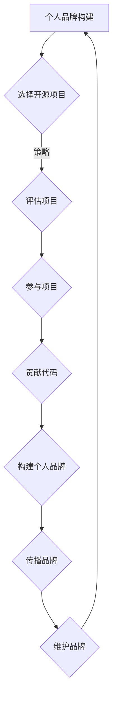

                 

### 《利用开源项目打造个人品牌》

开源项目不仅是技术创新的温床，更是个人成长和品牌打造的绝佳平台。在数字时代，个人品牌的建设对于职业发展至关重要。本文旨在探讨如何利用开源项目这一工具，系统地构建和提升个人品牌。通过以下五个部分的内容，我们将一步步解析开源项目与个人品牌之间的内在联系，展示如何通过实践开源项目，实现个人技术的提升和品牌价值的提升。

### **关键词：**

- 个人品牌
- 开源项目
- 技术提升
- 职业发展
- 社区贡献

### **摘要：**

本文将深入探讨开源项目在个人品牌建设中的作用。首先，我们将介绍个人品牌的基础概念和重要性，以及开源项目的定义和发展历程。接着，分析利用开源项目构建个人品牌的优势，包括技术能力展示、人际网络拓展和职业竞争力的提升。然后，文章将详细讲解如何选择和评估开源项目，如何参与并贡献代码，以及如何通过开源项目构建个人品牌。此外，还将提供一些成功案例，展示如何通过开源项目实现个人品牌的成功打造。最后，我们将讨论个人品牌的传播和维护策略，以及开源社区资源的使用。通过本文，读者将获得一套系统的开源项目个人品牌构建指南。

## 《利用开源项目打造个人品牌》

### **1. 个人品牌构建基础**

#### **1.1 个人品牌的概述**

个人品牌，通俗来说，就是个人在公众心目中的形象和声誉。它不仅涵盖了个人在专业领域的知识和技能，还涉及个人的价值观、行为方式和人格特质。一个强大的个人品牌能够为个人带来以下好处：

- **增强信誉度**：个人品牌能够提升个人的社会地位和信任度，使他人更容易接受和信任你的建议和方案。
- **拓展人际关系**：强大的个人品牌能够吸引更多志同道合的人，帮助你建立广泛的人脉网络。
- **提升职业竞争力**：在求职和职业晋升过程中，一个鲜明的个人品牌能让你脱颖而出，获得更多的机会。

#### **1.1.1 个人品牌的定义**

个人品牌是由一系列特征和价值观组成的集合，这些特征和价值观通过个人的行为、作品和言论传达给外界。它不仅仅是个人技能的展示，更是个人人格魅力和专业形象的体现。

#### **1.1.2 个人品牌的重要性**

在当今竞争激烈的职场环境中，个人品牌的重要性日益凸显。它不仅关乎个人的职业发展，还影响到个人的社会地位和幸福感。一个成功的个人品牌能够为个人带来以下机遇：

- **增加机会**：拥有强大个人品牌的人更容易获得职业机会和项目合作。
- **提升收入**：个人品牌能够为个人带来更多的商业机会，从而提升收入水平。
- **增强影响力**：个人品牌有助于扩大个人的影响力，使个人在专业领域具有更大的话语权。

#### **1.1.3 个人品牌与职业发展的关系**

个人品牌与职业发展紧密相连。一个强大的个人品牌能够为职业发展提供以下支持：

- **求职优势**：拥有鲜明个人品牌的人更容易在求职过程中脱颖而出。
- **晋升机会**：个人品牌有助于获得更多的晋升机会和职位晋升。
- **职业转型**：在职业转型过程中，个人品牌能够帮助个人迅速适应新领域。

### **1.2 开源项目概述**

#### **1.2.1 开源项目的定义**

开源项目是指以开放源代码的方式发布的项目，这意味着项目的源代码可以被公众自由访问、使用、修改和分发。开源项目的核心原则是开放性和协作性，这为技术创新和知识共享提供了广阔的空间。

#### **1.2.2 开源项目的发展历程**

开源项目的起源可以追溯到20世纪80年代，当时自由软件运动（Free Software Movement）兴起，倡导软件的自由和开源。随着互联网的发展，开源项目逐渐成为软件开发的主流模式，许多知名的软件如Linux操作系统、Apache服务器等，都是开源项目的典范。

#### **1.2.3 开源项目的重要特性**

开源项目具有以下几个重要特性：

- **开放性**：开源项目的源代码公开，用户可以自由查看和修改。
- **协作性**：开源项目鼓励全球开发者共同参与，共同推动项目发展。
- **可扩展性**：开源项目通常具有良好的模块化设计，便于扩展和定制。
- **可持续性**：开源项目往往有稳定的社区支持和持续更新。

### **1.3 利用开源项目构建个人品牌的优势**

#### **1.3.1 展示技术能力**

通过参与开源项目，你可以向外界展示你的技术能力和专业水平。在开源项目中，你可以贡献代码、修复漏洞、优化性能，这些都能够证明你在技术领域的实力。

#### **1.3.2 扩大人际网络**

开源项目是一个聚集全球开发者的平台，通过参与开源项目，你可以结识来自不同背景和领域的开发者，扩大自己的人际网络。这些联系不仅有助于你的职业发展，还能为你带来新的灵感和机会。

#### **1.3.3 提升职业竞争力**

参与开源项目能够提升你的职业竞争力。在招聘过程中，拥有开源项目贡献经历往往是一个重要的加分项。此外，通过开源项目，你可以获得更多的实战经验，提高解决实际问题的能力。

#### **1.3.4 增加个人曝光度**

通过参与开源项目，你的名字和贡献将出现在项目的README、贡献者列表等地方，这有助于提高你的个人曝光度。在社交媒体上分享你的开源项目，还可以进一步扩大你的影响力。

### **1.4 小结**

个人品牌构建是一个长期的过程，需要持续的努力和投入。利用开源项目，你可以有效地提升个人技术能力、扩展人际网络、提升职业竞争力，并增加个人曝光度。接下来，我们将深入探讨如何选择和评估开源项目，以及如何参与开源项目，为你的个人品牌建设提供更具体的指导。

## 1. 个人品牌构建基础

在现代社会，个人品牌的重要性不容忽视。个人品牌不仅是职业发展的助推器，更是个人价值的体现。本节将详细探讨个人品牌的定义、重要性以及与职业发展的关系，同时引入开源项目作为个人品牌构建的重要工具。

### **1.1 个人品牌的概述**

个人品牌是一种无形的资产，它代表了一个人的专业形象、技能和声誉。一个强大的个人品牌能够为个人带来诸多优势，如增强信誉度、拓展人脉网络、提升职业竞争力等。那么，什么是个人品牌呢？

**个人品牌的定义**：个人品牌是指个人在公众心目中的形象和声誉。它包括个人的专业知识、技能、价值观、行为方式和人格特质等多方面因素。个人品牌不仅仅是技能和知识的展示，更是个人人格魅力的体现。

**个人品牌的构成**：
- **技能与知识**：这是个人品牌的基础，包括专业技能、行业知识、学习能力和创新思维。
- **价值观与人格特质**：个人的价值观和人格特质会影响其在工作中的行为方式和人际交往，从而影响个人品牌。
- **行为与表现**：个人的行为和表现会直接影响其品牌形象，包括职业道德、责任感、沟通能力等。

**个人品牌的特征**：
- **独特性**：个人品牌应该具有独特性，能够让人在众多竞争者中脱颖而出。
- **一致性**：个人品牌需要保持一致性，即个人在各个方面（如言行、工作表现、社交媒体等）都传递出相同的形象和价值观。
- **可信赖性**：一个强大的个人品牌应该是可信赖的，这需要个人在专业领域内具备较高的声誉和可信度。

### **1.1.1 个人品牌的定义**

个人品牌是一种独特的形象和声誉，它由个人的技能、知识、价值观和行为方式共同塑造。一个成功的个人品牌不仅能够在职场中提升个人的竞争力，还能在商业活动中创造价值。

**个人品牌的重要性**：

- **增强信誉度**：强大的个人品牌能够提高个人的社会地位和信誉度，使他人更容易接受和信任你的建议和方案。
- **拓展人际关系**：个人品牌有助于吸引志同道合的人，扩大人际网络，从而为个人带来更多的机会和资源。
- **提升职业竞争力**：一个鲜明的个人品牌能够在求职和职业晋升过程中为你提供竞争优势，使你更容易获得理想的工作机会。
- **增加商业机会**：个人品牌能够为个人带来更多的商业机会，如咨询服务、演讲邀请、合作项目等，从而提高收入水平。
- **扩大影响力**：强大的个人品牌能够使个人在专业领域内具有更大的影响力，从而推动个人事业的发展。

### **1.1.2 个人品牌的重要性**

在当今竞争激烈的职场环境中，个人品牌的重要性日益凸显。以下是一些具体的表现：

- **求职优势**：拥有强大个人品牌的人更容易在求职过程中脱颖而出，因为雇主更愿意信任和录用具有良好声誉和专业形象的候选人。
- **职业晋升**：个人品牌有助于提升职业发展速度，使个人在职业晋升过程中具备更多的优势。
- **项目合作**：个人品牌能够吸引更多的项目合作机会，使个人能够参与到更具挑战性的项目中。
- **品牌代言**：个人品牌可以成为品牌的代言人，为品牌带来更多的商业价值。
- **影响力扩大**：强大的个人品牌能够使个人在专业领域内具有更大的影响力，从而推动个人事业的发展。

### **1.1.3 个人品牌与职业发展的关系**

个人品牌与职业发展紧密相连，它们之间存在着以下几种关系：

- **个人品牌是职业发展的助推器**：一个强大的个人品牌能够为职业发展提供强大的支持，使个人在职场中更具竞争力。
- **职业发展是个人品牌的表现**：个人的职业成就和进步是个人品牌的重要体现，良好的职业发展能够进一步提升个人品牌。
- **个人品牌与职业发展相互促进**：个人品牌和职业发展相互影响、相互促进，个人品牌能够推动职业发展，而职业发展也能够增强个人品牌。

**个人品牌构建的步骤**：

1. **明确个人品牌定位**：确定个人品牌的独特性和核心价值，明确个人在专业领域内的定位。
2. **提升专业技能**：不断学习和提升专业技能，为个人品牌奠定坚实的基础。
3. **建立良好的行为模式**：保持一致的行为模式，树立专业、诚信、负责任的形象。
4. **积极参与社区活动**：参与行业活动，拓展人脉网络，提升个人知名度。
5. **持续传播个人品牌**：通过社交媒体、博客、演讲等方式持续传播个人品牌，增强个人影响力。

### **1.2 开源项目概述**

开源项目是个人品牌构建的重要工具之一。开源项目具有开放性、协作性和可扩展性等特点，能够为个人提供丰富的学习和成长机会。

#### **1.2.1 开源项目的定义**

开源项目是指以开放源代码的方式发布的项目，这意味着项目的源代码可以被公众自由访问、使用、修改和分发。开源项目的核心原则是开放性和协作性，这为技术创新和知识共享提供了广阔的空间。

#### **1.2.2 开源项目的发展历程**

开源项目的起源可以追溯到20世纪80年代，当时自由软件运动（Free Software Movement）兴起，倡导软件的自由和开源。随着互联网的发展，开源项目逐渐成为软件开发的主流模式，许多知名的软件如Linux操作系统、Apache服务器等，都是开源项目的典范。

#### **1.2.3 开源项目的重要特性**

开源项目具有以下几个重要特性：

- **开放性**：开源项目的源代码公开，用户可以自由查看和修改。
- **协作性**：开源项目鼓励全球开发者共同参与，共同推动项目发展。
- **可扩展性**：开源项目通常具有良好的模块化设计，便于扩展和定制。
- **可持续性**：开源项目往往有稳定的社区支持和持续更新。

### **1.3 利用开源项目构建个人品牌的优势**

开源项目不仅是技术分享和创新的平台，也是个人品牌构建的重要途径。以下是一些利用开源项目构建个人品牌的优势：

#### **1.3.1 展示技术能力**

通过参与开源项目，你可以向外界展示你的技术能力和专业水平。在开源项目中，你可以贡献代码、修复漏洞、优化性能，这些都能够证明你在技术领域的实力。

#### **1.3.2 扩大人际网络**

开源项目是一个聚集全球开发者的平台，通过参与开源项目，你可以结识来自不同背景和领域的开发者，扩大自己的人际网络。这些联系不仅有助于你的职业发展，还能为你带来新的灵感和机会。

#### **1.3.3 提升职业竞争力**

参与开源项目能够提升你的职业竞争力。在招聘过程中，拥有开源项目贡献经历往往是一个重要的加分项。此外，通过开源项目，你可以获得更多的实战经验，提高解决实际问题的能力。

#### **1.3.4 增加个人曝光度**

通过参与开源项目，你的名字和贡献将出现在项目的README、贡献者列表等地方，这有助于提高你的个人曝光度。在社交媒体上分享你的开源项目，还可以进一步扩大你的影响力。

### **1.4 小结**

个人品牌是个人职业发展的重要资产，而开源项目则是构建个人品牌的强大工具。通过参与开源项目，你可以展示技术能力、拓展人际网络、提升职业竞争力，并增加个人曝光度。在接下来的章节中，我们将进一步探讨如何选择和评估开源项目，以及如何通过参与开源项目来构建个人品牌。

## 1.3 利用开源项目构建个人品牌的优势

开源项目作为技术共享和创新的重要平台，不仅促进了技术的进步，还为个人品牌的构建提供了得天独厚的条件。以下将详细探讨利用开源项目构建个人品牌的四大优势：展示技术能力、扩大人际网络、提升职业竞争力以及增加个人曝光度。

### **1.3.1 展示技术能力**

在开源项目中，个人可以通过多种方式展示自己的技术能力。例如：

- **代码贡献**：参与开源项目最直接的方式是提交代码。通过修复漏洞、增加新功能或优化现有代码，开发者可以展示自己的编程技能和解决问题的能力。
- **技术文档**：撰写并维护项目的文档也是一种展示技术能力的方式。优秀的文档能够帮助其他开发者更好地理解和使用项目，同时也能体现作者的技术水平。
- **代码审查**：参与代码审查是另一个展示技术能力的机会。通过审查他人的代码，开发者不仅能够提升自己的代码质量，还能向他人展示自己的专业知识和经验。

开源项目提供了一个公开透明的平台，使个人技术能力得到全面的展示。这不仅能够提升个人的技术声誉，还能为个人未来的职业发展打下坚实的基础。

### **1.3.2 扩大人际网络**

开源项目是全球开发者共同参与的平台，参与者来自世界各地，拥有不同的技术背景和经验。通过开源项目，个人可以：

- **结识同行**：在开源项目中，个人可以结识到来自不同公司和国家的同行。这些同行可能是未来的合作伙伴，也可能成为职业导师或职业推荐人。
- **建立合作**：开源项目往往需要团队协作，个人可以通过参与项目与团队成员建立合作关系。这些合作可能会延伸到个人职业发展的其他方面。
- **拓展视野**：与其他开发者交流，个人可以了解到最新的技术趋势和发展动态，从而拓宽自己的视野和知识面。

通过开源项目，个人不仅能够扩大人际网络，还能结识到更多的同行和专家，为个人职业发展提供更多机会和资源。

### **1.3.3 提升职业竞争力**

参与开源项目对提升职业竞争力有着显著的作用。以下是一些具体的表现：

- **实战经验**：在开源项目中，个人可以获得大量的实战经验，这些经验是在课堂或工作中难以获得的。通过解决实际问题，个人能够提升自己的技术水平和问题解决能力。
- **项目经历**：开源项目贡献经历是简历中的重要亮点。在求职过程中，具有开源项目经历的候选人往往能够更容易地获得面试机会，因为雇主更愿意招聘具有实际项目经验的人才。
- **技术能力**：通过在开源项目中的表现，个人能够证明自己在技术领域的专业能力。这种能力在职业晋升和求职过程中都是非常重要的。

### **1.3.4 增加个人曝光度**

开源项目是一个公开的平台，个人的贡献和努力很容易被更多人看到。以下是一些具体方式，个人可以通过开源项目增加个人曝光度：

- **GitHub等平台**：开源项目通常托管在GitHub等平台，这些平台有大量的用户和关注者。通过在这些平台上展示自己的项目贡献，个人能够迅速增加自己的曝光度。
- **社交媒体**：个人可以在社交媒体上分享自己的开源项目，例如Twitter、LinkedIn等。通过这些平台，个人可以吸引更多的关注者，扩大自己的影响力。
- **技术博客**：撰写并发布与开源项目相关的内容，例如技术博客、文章等，也是一种增加个人曝光度的有效方式。这些内容能够展示个人的专业知识和经验，吸引更多读者的关注。

通过开源项目，个人不仅能够在技术社区中建立良好的声誉，还能增加个人曝光度，为自己的职业发展创造更多机会。

### **1.3.5 小结**

开源项目为个人品牌构建提供了丰富的机会和资源。通过展示技术能力、扩大人际网络、提升职业竞争力以及增加个人曝光度，个人可以在开源项目中不断提升自己的品牌价值。在接下来的章节中，我们将进一步探讨如何选择和评估开源项目，以及如何通过参与开源项目来构建个人品牌。

## 2. 开源项目选择与评估

选择适合自己的开源项目是构建个人品牌的重要一步。正确的选择不仅能够提高参与效率，还能有效提升个人技能和品牌价值。本节将详细探讨如何根据个人兴趣、市场需求和个人职业规划来选择开源项目，并介绍评估开源项目的具体方法。

### **2.1 开源项目选择策略**

#### **2.1.1 根据兴趣选择**

兴趣是最好的老师，选择与个人兴趣相符的开源项目可以增加参与的积极性。以下是一些根据兴趣选择开源项目的建议：

- **关注领域**：选择与个人专业领域相关的开源项目。例如，如果你是前端开发者，可以选择参与一些前端框架或工具的开发。
- **技术方向**：根据自己的技术方向选择开源项目。例如，如果你对人工智能感兴趣，可以参与机器学习相关的开源项目。
- **项目活跃度**：选择活跃度较高的项目。活跃的项目往往有更多的机会参与讨论和贡献，也有更好的社区支持。

#### **2.1.2 根据市场需求选择**

市场需求是开源项目选择的重要参考因素。以下是一些根据市场需求选择开源项目的建议：

- **热门技术**：选择当前热门的技术或工具，如区块链、大数据、云计算等。这些技术领域往往有更高的市场需求和更广泛的社区支持。
- **行业趋势**：关注行业发展趋势，选择有潜力的开源项目。例如，随着物联网（IoT）的兴起，与IoT相关的开源项目可能会成为一个不错的选择。
- **项目前景**：评估项目的未来发展前景，选择那些有潜力成为行业标准的开源项目。

#### **2.1.3 根据个人职业规划选择**

个人职业规划是选择开源项目的重要依据。以下是一些根据个人职业规划选择开源项目的建议：

- **技能提升**：选择能够帮助自己提升特定技能的开源项目。例如，如果你希望提升数据科学技能，可以选择参与数据分析或机器学习的开源项目。
- **职业转型**：如果你计划进行职业转型，可以选择与目标职业相关的开源项目。通过参与这些项目，你可以积累相关领域的经验，为转型做准备。
- **职位晋升**：选择与个人目标职位相关联的开源项目。例如，如果你希望晋升为技术经理，可以选择参与一些管理类的开源项目，提升自己的管理能力和领导力。

### **2.2 开源项目评估方法**

在选择开源项目后，对其进行全面评估是确保参与成功的重要步骤。以下是一些评估开源项目的关键方法：

#### **2.2.1 功能完整性评估**

功能完整性是评估开源项目的重要指标。以下是一些评估功能完整性的方法：

- **需求分析**：研究项目的需求和功能列表，确保项目已经实现了核心功能。
- **用户反馈**：查看项目的用户反馈，了解用户对项目功能的评价和使用体验。
- **社区讨论**：参与项目的社区讨论，了解开发者对项目功能的讨论和规划。

#### **2.2.2 社区活跃度评估**

社区活跃度是衡量开源项目成功与否的关键因素。以下是一些评估社区活跃度的方法：

- **活跃度指标**：查看项目的活跃度指标，如代码提交频率、issue和Pull Request的数量等。
- **社区讨论**：参与项目的社区讨论，了解社区的讨论氛围和参与度。
- **开发者参与度**：观察项目开发者的参与度，包括代码贡献、issue处理和Pull Request审查等。

#### **2.2.3 项目维护情况评估**

项目维护情况直接影响到开源项目的长期发展。以下是一些评估项目维护情况的方法：

- **更新频率**：查看项目的更新频率，了解项目是否保持活跃和持续发展。
- **维护者情况**：了解项目的维护者团队情况，包括维护者的数量、经验和稳定性。
- **贡献者反馈**：观察项目贡献者对项目维护情况的反馈，了解项目是否得到了足够的支持和维护。

### **2.3 如何找到适合自己的开源项目**

找到适合自己的开源项目并不容易，以下是一些实用的方法：

- **开源项目搜索工具**：使用开源项目搜索工具，如GitHub、GitLab等，根据关键词、语言、主题等筛选合适的开源项目。
- **社区推荐**：参考社区推荐的开源项目，如技术博客、GitHub Trending、Stack Overflow等。
- **朋友和同事推荐**：向朋友和同事咨询，了解他们参与的开源项目，并评估是否适合自己。
- **行业活动**：参加行业活动，如技术大会、沙龙等，了解最新的开源项目和技术动态。

### **2.4 小结**

选择和评估开源项目是构建个人品牌的重要环节。通过根据兴趣、市场需求和个人职业规划来选择开源项目，并使用功能完整性、社区活跃度和项目维护情况等评估方法进行全面评估，个人可以确保选择的项目的质量和参与的价值。在接下来的章节中，我们将详细探讨如何参与开源项目，提升个人技能和品牌价值。

### 2.1 开源项目选择策略

选择适合自己的开源项目是构建个人品牌的关键一步。一个合适的项目不仅能够激发你的热情，提高你的技术能力，还能帮助你在技术社区中获得认可。以下是根据个人兴趣、市场需求和个人职业规划来选择开源项目的一些建议。

#### **2.1.1 根据兴趣选择**

兴趣是推动个人持续参与的动力源泉。选择你真正感兴趣的开源项目，能够让你在参与过程中保持热情，更容易取得成果。

- **关注领域**：选择与你的专业领域相关的开源项目。例如，如果你是一名前端开发者，可以选择参与一些前端框架或工具的开发；如果你对人工智能感兴趣，可以关注机器学习、深度学习相关的开源项目。
- **技术方向**：根据自己的技术方向选择项目。例如，如果你擅长云计算和容器技术，可以参与Kubernetes等开源项目的开发。
- **项目活跃度**：关注项目的活跃度，选择那些更新频繁、社区活跃的项目。活跃的项目意味着有更多的机会进行技术交流和学习。

#### **2.1.2 根据市场需求选择**

市场需求是选择开源项目的重要参考因素。选择那些在当前或未来有广泛需求的开源项目，能够帮助你获得更多的职业机会。

- **热门技术**：关注当前热门的技术趋势，如区块链、大数据、物联网（IoT）等。这些领域通常有大量的开源项目，也有更高的市场需求。
- **行业趋势**：关注行业的发展趋势，选择那些与行业未来发展方向一致的开源项目。例如，随着5G的普及，与5G相关的开源项目可能会成为一个热门选择。
- **项目前景**：评估项目的未来发展前景。选择那些有潜力成为行业标准或具有广泛影响的开源项目，这样能够让你在项目中获得更多的成长和曝光。

#### **2.1.3 根据个人职业规划选择**

个人职业规划是选择开源项目的重要依据。选择能够帮助你实现职业目标的开源项目，能够为你的职业发展提供有力支持。

- **技能提升**：选择能够帮助你提升特定技能的开源项目。例如，如果你希望在数据科学领域有更多发展，可以选择参与一些数据分析或机器学习的开源项目。
- **职业转型**：如果你计划进行职业转型，可以选择与你目标职业相关的开源项目。通过参与这些项目，你可以积累相关领域的经验，为转型做准备。
- **职位晋升**：选择与你的目标职位相关的开源项目。例如，如果你希望晋升为技术经理，可以选择参与一些管理类的开源项目，提升自己的管理能力和领导力。

### **2.1.4 考虑项目的技术难度**

选择开源项目时，要考虑项目的技术难度。对于初学者来说，可以从一些较为简单的项目开始，逐步提升自己的技术水平。而对于有经验的开发者，可以选择更具挑战性的项目，以提升自己的技术能力和解决复杂问题的能力。

### **2.1.5 考虑项目的维护情况**

项目的维护情况也是选择开源项目时需要考虑的重要因素。一个活跃且得到良好维护的项目能够为你提供稳定的开发环境和技术支持，提高你的参与体验。

- **更新频率**：查看项目的更新频率，了解项目是否保持活跃。
- **维护者团队**：了解项目的维护者团队情况，包括维护者的数量、经验和稳定性。
- **社区支持**：评估项目的社区支持情况，包括开发者参与度、issue处理速度等。

### **2.2 小结**

选择适合自己的开源项目是构建个人品牌的重要步骤。通过根据个人兴趣、市场需求和个人职业规划来选择开源项目，并考虑项目的技术难度和维护情况，个人可以找到最适合自己的开源项目，为个人品牌的构建奠定坚实的基础。在下一节中，我们将详细探讨如何评估开源项目，确保选择的项目的质量和参与的价值。

### 2.2 开源项目评估方法

选择开源项目并不仅仅是找到感兴趣的代码库，还需要对项目进行全面的评估，以确保它能够为你带来实际的价值和成长机会。以下是一些评估开源项目的关键方法，包括功能完整性、社区活跃度和项目维护情况等方面的评估。

#### **2.2.1 功能完整性评估**

一个功能完整的项目是参与的基础。以下是一些评估功能完整性的方法：

- **需求分析**：首先，要仔细阅读项目的需求文档和功能列表，了解项目期望实现的功能和目标。这有助于你判断项目是否已经满足了基本的需求。
- **用户反馈**：查看项目的用户反馈和评价，了解用户对项目功能的满意度和使用体验。用户反馈可以直接反映出项目的实际功能完整性。
- **功能对比**：与其他类似的开源项目进行功能对比，了解项目的优势和不足。这有助于你全面评估项目的功能完整性。

#### **2.2.2 社区活跃度评估**

社区活跃度是衡量开源项目成功与否的关键因素。以下是一些评估社区活跃度的方法：

- **活跃度指标**：查看项目的活跃度指标，如代码提交频率、issue数量、Pull Request数量等。这些指标可以直观地反映项目的活跃程度。
- **社区讨论**：参与项目的社区讨论，了解社区的讨论氛围和参与度。一个活跃的社区通常意味着有更多的机会进行技术交流和合作。
- **活动记录**：查看项目的活动记录，如会议纪要、博客更新等。这些记录可以帮助你了解项目的进展和方向。

#### **2.2.3 项目维护情况评估**

项目维护情况直接影响到项目的长期发展。以下是一些评估项目维护情况的方法：

- **更新频率**：定期检查项目的更新记录，了解项目是否保持活跃和持续更新。一个定期更新的项目通常意味着有稳定的维护团队。
- **维护者团队**：了解项目的维护者团队情况，包括团队成员的数量、经验和稳定性。一个成熟的维护者团队能够确保项目的长期健康发展。
- **贡献者反馈**：观察项目贡献者对项目维护情况的反馈，了解项目是否得到了足够的支持和维护。一个良好的维护环境能够吸引更多的开发者参与。

#### **2.2.4 其他评估指标**

除了上述关键指标外，还有一些其他指标也可以帮助你全面评估开源项目：

- **代码质量**：查看项目的代码质量，包括代码结构、注释和文档等。高质量的代码能够提高你的参与体验。
- **依赖关系**：了解项目的依赖关系，评估这些依赖的稳定性和安全性。不稳定的依赖可能会给项目带来风险。
- **许可证**：查看项目的许可证类型，了解项目的版权和使用规定。选择一个合适的许可证可以确保你的参与合法合规。

#### **2.2.5 小结**

评估开源项目是一个系统性过程，需要从多个角度进行综合分析。通过以上方法，你可以全面了解项目的功能完整性、社区活跃度和维护情况，确保选择的项目的质量和参与的价值。在接下来的章节中，我们将详细探讨如何找到适合自己的开源项目，为你的个人品牌构建奠定坚实的基础。

### 2.3 如何找到适合自己的开源项目

找到适合自己的开源项目是参与开源项目的第一步，也是构建个人品牌的关键环节。以下是一些实用的方法，帮助你在众多开源项目中找到最适合的项目。

#### **2.3.1 开源项目搜索引擎的使用**

开源项目搜索引擎如GitHub、GitLab和SourceForge等，是寻找开源项目的首选工具。以下是一些使用这些搜索引擎的方法：

- **关键词搜索**：使用与你的兴趣、技能和职业规划相关的关键词进行搜索。例如，如果你对机器学习感兴趣，可以搜索“machine learning”或“AI”等关键词。
- **筛选条件**：利用搜索引擎的筛选条件，如语言、更新时间、关注者数量等，过滤出符合你要求的项目。筛选条件可以帮助你更快地找到合适的项目。
- **浏览趋势**：关注搜索平台上的趋势和推荐项目，这些项目通常在社区中具有较高的活跃度和影响力。

#### **2.3.2 社交媒体上的开源项目发现**

社交媒体平台如Twitter、LinkedIn和GitHub等，也是发现开源项目的有效途径。以下是一些利用社交媒体发现开源项目的方法：

- **关注行业大V**：关注行业领袖和知名开发者的社交媒体账号，他们通常会分享一些优秀的开源项目。
- **参与话题讨论**：参与与开源项目相关的讨论和话题，了解最新的项目动态和开发趋势。
- **使用相关标签**：在社交媒体上使用与开源项目相关的标签，如#OpenSource、#GitHub等，可以找到更多相关的项目。

#### **2.3.3 开源项目推荐平台的使用**

一些专门的开源项目推荐平台如Open Source Saturday、Trending Projects等，可以帮助你发现那些近期活跃且值得关注的开源项目。以下是一些使用这些平台的方法：

- **浏览推荐列表**：定期浏览这些平台的推荐列表，了解最新的开源项目趋势和亮点。
- **订阅邮件通知**：订阅平台的邮件通知，可以及时收到最新推荐项目的通知。
- **参与社区活动**：一些推荐平台会举办线上或线下的社区活动，通过参与这些活动，你可以结识更多开发者，发现更多优秀的开源项目。

#### **2.3.4 参考同行和导师的建议**

同行和导师的经验和建议是找到适合自己的开源项目的重要参考。以下是一些获取建议的方法：

- **咨询同事和好友**：向同事和朋友咨询，了解他们参与的开源项目以及建议的项目。
- **参加行业会议和讲座**：在行业会议和讲座中，与专家和同行交流，获取关于开源项目的建议。
- **导师指导**：如果你有导师或职业导师，可以请教他们关于开源项目的建议和经验。

#### **2.3.5 小结**

找到适合自己的开源项目需要综合多种方法和途径。通过利用开源项目搜索引擎、社交媒体、开源项目推荐平台以及参考同行和导师的建议，你可以更快地找到那些符合你兴趣、技能和职业规划的开源项目，为构建个人品牌奠定坚实的基础。在下一节中，我们将详细探讨如何参与开源项目，提升个人技能和品牌价值。

### 3.1 开源项目参与方式

参与开源项目是提升个人技能和构建个人品牌的重要途径。以下将详细描述几种常见的参与开源项目的方式，包括提交代码贡献、提出问题和建议以及参与社区讨论。

#### **3.1.1 提交代码贡献**

提交代码贡献是参与开源项目最直接和最有价值的方式之一。以下是一些具体步骤：

1. **阅读项目文档**：在开始贡献代码之前，仔细阅读项目的README、贡献指南和开发文档，了解项目的技术栈、编码规范和代码风格。
2. **选择任务**：根据项目的任务列表和你的技能，选择一个适合的任务进行贡献。可以从简单的问题或小的功能开始，逐步提升自己的参与度。
3. **编写代码**：在本地环境中安装项目依赖，并按照项目的编码规范编写代码。确保代码的可读性和可维护性，并添加必要的测试和文档。
4. **提交Pull Request**：将你的代码提交到一个新的分支，并创建一个Pull Request。在Pull Request中详细描述你的修改内容、解决的问题或增加的功能，并提供必要的测试结果。
5. **代码审查**：等待项目维护者对Pull Request进行审查。他们可能会提出修改建议或疑问，你需要根据反馈进行相应的调整。

#### **3.1.2 提出问题和建议**

提出问题和建议是参与开源项目的一种方式，有助于项目改进和优化。以下是一些具体步骤：

1. **阅读项目文档**：在提出问题或建议之前，仔细阅读项目的文档，确保没有遗漏的信息或答案。
2. **创建issue**：在项目的issue跟踪系统中创建一个新的issue，详细描述你的问题或建议。提供尽可能多的上下文信息，以便其他开发者理解和解决。
3. **参与讨论**：在issue的讨论中，与其他开发者交流，分享你的观点和解决方案。通过合作，共同推动问题的解决或建议的实施。
4. **跟进进度**：在issue的讨论中保持活跃，及时回复其他开发者的反馈，确保问题或建议能够得到有效的跟进和解决。

#### **3.1.3 参与社区讨论**

参与社区讨论是了解项目动态、学习新技术和建立人脉网络的有效方式。以下是一些具体步骤：

1. **加入社区论坛**：加入项目的官方论坛或社交媒体群组，如GitHub讨论区、Twitter群组等。
2. **参与话题讨论**：在社区中参与讨论，提出问题、分享经验和观点。积极参与可以帮助你建立良好的社区形象。
3. **组织活动**：如果你具备一定的组织能力，可以尝试组织线上或线下的社区活动，如黑客松、技术沙龙等，为社区带来更多的价值。
4. **维护社区环境**：在社区中保持良好的行为和态度，积极维护社区的环境和氛围。

#### **3.1.4 小结**

参与开源项目有多种方式，包括提交代码贡献、提出问题和建议以及参与社区讨论。每种方式都有其独特的价值和作用。通过多种方式的参与，你不仅可以提升自己的技术能力，还能为开源项目做出贡献，构建自己的个人品牌。

## 3.2 开源项目贡献技巧

在开源项目中做出有价值的贡献不仅能够提升个人技能，还能增强你的个人品牌。以下是一些具体的开源项目贡献技巧，包括如何编写高质量的代码、遵守提交规范以及进行有效的代码评审。

### **3.2.1 如何编写高质量的代码**

编写高质量的代码是开源项目贡献的基础。以下是一些提高代码质量的技巧：

- **遵循编码规范**：确保你的代码遵循项目的编码规范。这包括命名规则、代码格式和注释风格等。一致的编码规范有助于项目的可读性和可维护性。
- **编写清晰、简洁的代码**：避免冗长的代码和复杂的逻辑。使用简洁明了的代码能够提高代码的可读性，使其他开发者更容易理解和维护。
- **添加必要的注释和文档**：在关键代码段添加注释，解释代码的功能和实现原理。此外，编写完整的文档，包括README、README.md和CONTRIBUTING文件，可以帮助其他开发者更好地理解项目。
- **编写单元测试**：编写单元测试是确保代码质量和稳定性的重要手段。单元测试能够验证代码的功能，并在代码变更时及时发现问题。

### **3.2.2 提交规范的遵守**

遵循项目的提交规范是确保代码质量的重要环节。以下是一些常见的提交规范：

- **使用规范化的提交信息**：提交信息应该清晰、简洁，通常包含三个部分：本次提交的主题、本次提交的详细描述以及相关标签（如`fix`, `feat`, `docs`等）。
- **遵循版本控制原则**：在提交代码时，遵循版本控制原则，如使用`git add`和`git commit`命令进行本地操作，并在提交前进行代码审查。
- **避免提交敏感信息**：在提交代码时，避免提交个人敏感信息，如密码、API密钥等。使用`.gitignore`文件来排除这些敏感文件的提交。

### **3.2.3 代码评审技巧**

代码评审是确保项目质量和稳定性的关键步骤。以下是一些有效的代码评审技巧：

- **提前了解评审标准**：在开始评审之前，了解项目的评审标准和要求。这包括代码风格、测试覆盖率、代码可读性等。
- **进行详细评审**：仔细审查代码的每个部分，包括逻辑、语法和性能等方面。提供具体的反馈和建议，帮助原作者改进代码。
- **保持客观和礼貌**：在评审过程中，保持客观和礼貌，尊重原作者的工作。避免使用攻击性语言或过度批评，这会降低评审的效率和质量。
- **及时回复**：在收到代码评审反馈后，及时进行回复和修改。确保所有评审意见都得到处理，以提高代码质量和项目进度。

### **3.2.4 小结**

编写高质量的代码、遵守提交规范和进行有效的代码评审是开源项目贡献的核心技巧。通过这些技巧，你可以提升自己的技术能力，增强在开源社区的声誉，并为项目的成功做出重要贡献。

## 3.3 案例分析：成功参与开源项目，打造个人品牌

通过开源项目的参与，许多开发者成功打造了个人品牌，实现了职业发展的飞跃。以下将介绍几个具体的成功案例，分析这些开发者如何通过开源项目提升个人技能和品牌价值。

### **3.3.1 案例一：利用开源项目成为技术大牛**

**案例背景**：
张三是一位前端开发者，对前端框架有着浓厚的兴趣。他决定利用开源项目提升自己的技术水平和品牌价值。

**具体步骤**：

1. **选择开源项目**：张三选择了当时非常流行的前端框架React，并开始研究其源代码。
2. **提交代码贡献**：张三发现React在某些功能上有不足，于是编写了一个补丁并提交了一个Pull Request。他的补丁被项目维护者接受并合并到主分支中。
3. **撰写技术博客**：张三将自己的学习和理解整理成博客文章，分享在个人博客和社交媒体上。这些文章受到了同行的关注，提升了他的知名度。
4. **参与社区讨论**：张三积极参与React社区的讨论，分享自己的经验和见解，与全球开发者交流。

**结果**：
张三的开源项目贡献和技术博客使他迅速在React社区中获得认可。他的个人品牌得到了显著提升，不仅吸引了更多的关注者，还为他带来了多个职业机会。

### **3.3.2 案例二：通过开源项目获得工作机会**

**案例背景**：
李四是一位后端开发者，希望通过开源项目提升自己的职业竞争力。

**具体步骤**：

1. **选择开源项目**：李四选择了当时正在流行的微服务框架Spring Boot，并开始参与其社区活动。
2. **修复Bug和贡献代码**：李四发现Spring Boot的一些Bug，并提交了修复补丁。他的代码贡献得到了项目维护者和社区的高度评价。
3. **参与社区讨论**：李四积极参与Spring Boot的社区讨论，分享自己的经验和问题解决方案，逐渐成为社区的重要成员。
4. **展示项目经验**：在求职过程中，李四详细介绍了自己在Spring Boot社区中的贡献和参与情况，这些经验成为他获得工作机会的重要加分项。

**结果**：
李四的开源项目贡献和社区参与经历为他赢得了多个面试机会，并最终获得了一份理想的工作，职位晋升并获得了更高的薪资。

### **3.3.3 案例三：通过开源项目建立个人品牌**

**案例背景**：
王五是一位数据科学家，希望通过开源项目建立个人品牌并拓展职业机会。

**具体步骤**：

1. **选择开源项目**：王五选择了机器学习开源库Scikit-learn，并开始深入研究其算法和代码。
2. **编写扩展模块**：王五编写了一个扩展模块，为Scikit-learn添加了新的功能。他提交了扩展模块的Pull Request，并得到了社区的支持。
3. **撰写技术博客**：王五将自己的研究成果和扩展模块的使用方法整理成技术博客文章，分享在个人博客和社交媒体上。
4. **参与社区活动**：王五积极参与Scikit-learn社区的活动，包括会议、研讨会和线上讨论，与全球开发者交流。

**结果**：
王五通过开源项目的参与和社区活动，成功建立了自己的个人品牌。他的技术博客和社区贡献吸引了大量关注者，为他带来了多个合作项目和职业机会。

### **3.3.4 案例总结**

以上三个案例展示了如何通过开源项目成功打造个人品牌：

- **选择适合自己的开源项目**：根据自己的兴趣和技能选择合适的项目，确保能够提供有价值的贡献。
- **积极参与社区活动**：通过提交代码、撰写技术博客、参与社区讨论等方式，提升个人技能和知名度。
- **持续学习和成长**：不断学习新的技术和知识，保持对开源项目的积极参与，持续提升个人品牌价值。

通过这些案例，我们可以看到开源项目不仅是技术学习和交流的平台，更是个人品牌建设的绝佳途径。通过积极参与开源项目，个人可以提升技术能力、拓展职业机会，并建立强大的个人品牌。

### 4.1 个人品牌定位

在构建个人品牌的过程中，定位是一个至关重要的环节。一个清晰的个人品牌定位不仅能够帮助你更好地展示自己的专业能力和独特价值，还能吸引目标受众，增强个人在职业市场中的竞争力。以下将详细探讨个人品牌定位的重要性、定位策略和具体实施方法。

#### **4.1.1 定位的重要性**

个人品牌定位决定了你如何在公众心中树立形象，它包括你的核心优势、专业领域、价值主张等。一个明确的定位能够：

- **聚焦发展**：定位有助于你确定个人品牌的发展方向，集中精力在最有价值和最具竞争力的领域。
- **差异化竞争**：在竞争激烈的职场环境中，清晰的定位可以帮助你与竞争对手区分开来，突出自己的独特优势。
- **吸引目标受众**：明确的定位能够帮助你吸引那些对你专业能力和价值感兴趣的目标受众，提高你的品牌影响力。
- **提升市场竞争力**：一个有定位的个人品牌在求职、项目合作和商业活动中更具吸引力，能够为个人带来更多的机会和资源。

#### **4.1.2 个人品牌定位策略**

要制定一个成功的个人品牌定位策略，需要遵循以下几个步骤：

1. **明确个人目标**：首先，你需要明确自己的职业目标和个人愿景。这包括你希望在职业生涯中达到什么高度、实现哪些成就等。
2. **评估个人优势**：分析自己的专业技能、知识、经验和人格特质，识别自己的独特优势和核心竞争力。这些优势将是你个人品牌定位的核心。
3. **确定专业领域**：根据自己的优势和市场需求，选择一个或几个专业领域进行深耕。专业领域的确定将帮助你更好地聚焦个人品牌的发展方向。
4. **塑造价值主张**：价值主张是个人品牌的核心，它定义了你的独特价值和为什么别人应该选择你。价值主张需要简洁明了，能够直接传达你的核心优势。
5. **创建品牌口号**：品牌口号是个人品牌定位的简短表达，通常需要具有吸引力和记忆点。一个优秀的品牌口号能够迅速传达你的品牌价值和定位。

#### **4.1.3 实施个人品牌定位的方法**

在明确了个人品牌定位之后，以下是一些具体实施方法：

1. **设计品牌视觉元素**：包括个人品牌标志、名片、网站等。这些视觉元素应该与个人品牌定位相一致，传递出专业和可信的形象。
2. **创建内容策略**：包括博客文章、技术文档、演讲稿、社交媒体内容等。内容策略需要围绕个人品牌定位进行，确保每一篇内容都能够强化你的品牌形象。
3. **参与相关社区**：参与与你个人品牌定位相关的行业活动和开源项目，通过实际贡献和互动，提升你的专业声誉和影响力。
4. **建立个人网络**：积极拓展与个人品牌定位相关的人脉网络，包括行业专家、同行和潜在客户。通过这些网络，你可以获得更多的机会和资源。
5. **持续优化和调整**：个人品牌定位不是一成不变的，随着个人职业发展的变化和市场需求的变化，需要不断地进行优化和调整。

### **4.1.4 小结**

个人品牌定位是构建成功个人品牌的关键步骤。通过明确个人目标、评估个人优势、确定专业领域、塑造价值主张和创建品牌口号，你可以制定一个清晰的个人品牌定位策略。实施这一策略，并通过设计视觉元素、创建内容策略、参与相关社区、建立个人网络和持续优化调整，你可以有效地提升个人品牌价值，在职业市场中脱颖而出。

### 4.2 个人品牌传播

个人品牌传播是构建强大个人品牌的重要环节，它涉及到如何有效地利用各种渠道和工具，将个人品牌信息传递给目标受众，并建立起广泛的影响力。以下将详细探讨个人品牌传播的策略、方法以及成功案例。

#### **4.2.1 利用社交媒体**

社交媒体是个人品牌传播的重要工具，以下是一些具体策略：

- **创建专业账号**：在LinkedIn、Twitter、Instagram等平台上创建专业的个人账号，确保账号名称、头像和简介与个人品牌定位一致。
- **发布高质量内容**：定期发布有关技术、行业动态、个人见解等高质量内容。这些内容应该具有吸引力和教育性，能够吸引目标受众的关注。
- **互动和参与**：积极参与行业讨论，回复评论和私信，与同行和潜在客户建立联系。通过互动，你可以提高个人品牌的知名度和信任度。
- **利用社交媒体广告**：如果预算允许，可以考虑在社交媒体平台上投放广告，提高个人品牌的曝光度。

#### **4.2.2 参与行业活动**

参与行业活动是展示个人品牌和拓展人脉的有效途径。以下是一些具体方法：

- **参加技术会议和研讨会**：这些活动通常吸引了大量的行业专家和潜在客户，通过演讲、会议和交流，你可以展示自己的专业知识和技能。
- **组织或赞助活动**：如果你具备一定的资源和影响力，可以考虑组织或赞助行业活动。这不仅能够提升你的个人品牌，还能为活动参与者带来价值。
- **参与开源项目社区活动**：参与开源项目相关的活动，如GitHub Meetup、Code Sprint等，能够增强你在技术社区的影响力。

#### **4.2.3 发布技术博客和文档**

技术博客和文档是展示个人专业知识和技术能力的重要渠道。以下是一些具体策略：

- **建立个人博客或网站**：创建一个个人博客或网站，发布关于技术、行业趋势、项目经验等内容。确保内容结构清晰、易于阅读，并提供高质量的阅读体验。
- **撰写技术文章**：在技术博客平台上发布高质量的技术文章，如Medium、Dev.to等。这些文章应该具有深度和实用性，能够吸引读者的关注。
- **编写项目文档**：参与开源项目时，编写清晰的项目文档，包括README、CONTRIBUTING和CHANGELOG等。这些文档不仅有助于项目维护者，还能展示你的专业能力和责任心。

#### **4.2.4 成功案例**

以下是一些成功利用社交媒体、行业活动和技术博客进行个人品牌传播的案例：

- **案例一**：李华是一位资深前端开发者，他在LinkedIn上发布了大量关于前端技术的高质量文章，吸引了数万关注者。他还在GitHub上积极参与开源项目，并定期组织前端技术沙龙，提升了个人品牌和影响力。
- **案例二**：张三是数据科学家，他在Twitter上关注了许多数据科学领域的专家，通过转发和评论，积极互动。他还在Kaggle上发表了多个数据分析项目，获得了广泛的认可。这些举措使他在数据科学领域建立了强大的个人品牌。
- **案例三**：王五是一位云计算专家，他通过参加AWS re：Invent等大型技术会议，发表了多篇关于云计算的文章，并在GitHub上贡献了大量与AWS相关的开源代码。这些活动使他在云计算领域获得了广泛的知名度。

#### **4.2.5 小结**

个人品牌传播需要策略和执行。通过利用社交媒体、参与行业活动和发布技术博客和文档，你可以有效地传递个人品牌信息，吸引目标受众，建立广泛的影响力。在个人品牌传播过程中，保持一致性、专业性和高质量的内容是关键。通过学习和借鉴成功案例，你可以更好地实现个人品牌的成功传播。

### 4.3 个人品牌维护

在构建个人品牌的过程中，维护和更新是确保品牌价值持续增长的关键环节。一个良好的个人品牌需要不断适应环境变化和市场需求，以下将详细探讨如何处理负面评价、持续提升个人品牌价值以及应对个人品牌风险。

#### **4.3.1 如何处理负面评价**

负面评价是个人品牌维护中不可避免的问题。以下是一些处理负面评价的方法：

- **保持冷静和客观**：面对负面评价，首先需要保持冷静和客观，不要情绪化。理性分析评价的内容和原因，找到解决问题的方法。
- **积极回应**：及时回应负面评价，表达你的观点和态度。在回应时，可以感谢评价者的意见，并解释你的立场和解决方案。
- **公开道歉**：如果负面评价是基于事实的，并且在合理范围内，可以考虑公开道歉。这不仅能显示你的诚意和责任感，还能赢得公众的信任。
- **改进和优化**：针对负面评价中提到的问题，积极进行改进和优化。通过实际行动证明你在努力提升个人品牌质量。

#### **4.3.2 如何持续提升个人品牌价值**

持续提升个人品牌价值是个人品牌维护的核心。以下是一些具体方法：

- **学习和成长**：不断学习新的知识和技能，保持对行业动态的关注。通过不断成长，你能够为个人品牌增添新的价值。
- **积极参与社区**：积极参与开源项目、行业活动和社区讨论，展示你的专业能力和热情。这不仅能提升你的个人品牌，还能增强你在行业中的影响力。
- **发布高质量内容**：定期发布高质量的技术文章、博客和文档，分享你的见解和经验。这些内容能够展示你的专业能力和独特价值，吸引更多关注者。
- **拓展人脉网络**：通过拓展人脉网络，结识更多的同行和专家，获得更多的机会和资源。良好的人际关系是个人品牌的重要支撑。

#### **4.3.3 个人品牌风险管理与应对**

个人品牌面临的风险包括信息泄露、声誉受损、职业危机等。以下是一些应对策略：

- **信息安全**：加强个人信息的保护，避免在公共场合透露敏感信息。使用强密码和多因素认证，防止账户被盗。
- **声誉管理**：建立良好的声誉管理体系，及时处理负面信息，避免声誉受损。在社交媒体上保持专业和正面形象，避免参与争议和负面话题。
- **职业规划**：制定明确的职业规划，确保个人品牌与职业目标一致。在面临职业危机时，及时调整策略，寻求专业咨询和帮助。

#### **4.3.4 小结**

个人品牌维护是一个持续的过程，需要积极应对负面评价、持续提升个人品牌价值以及管理个人品牌风险。通过保持冷静、积极回应、持续学习和拓展人脉，你可以有效维护个人品牌，确保其在职业市场中的持续增长和价值。

### 5.1 成功案例分析一：从开源项目到创业成功

**5.1.1 案例背景**

李明是一名软件工程师，对云计算和大数据技术有着浓厚的兴趣。他在大学期间就开始参与开源项目，并在GitHub上发布了一些自己的项目。李明希望通过开源项目提升自己的技术能力，同时也开始思考如何将自己的技术知识转化为实际应用。

**5.1.2 开源项目选择**

李明选择了两个开源项目：

- 项目A：一个云计算平台的开发，该项目专注于提供高性能、高可靠性的云计算服务。
- 项目B：一个大数据处理框架，该项目旨在简化大数据分析流程，提高数据处理效率。

李明选择这两个项目的原因是，它们与他的专业方向高度相关，而且都有很大的发展潜力。通过参与这些项目，李明希望积累更多的实战经验，并展示自己的技术实力。

**5.1.3 个人品牌构建过程**

在参与开源项目的初期，李明主要通过以下方式构建个人品牌：

- **代码贡献**：李明在项目中提交了多个补丁和优化，包括性能优化、代码重构等。他的贡献得到了社区的高度评价，逐渐赢得了开发者的信任。
- **技术博客**：李明在个人博客上撰写了一系列关于云计算和大数据技术的文章，分享了他在项目中的经验和见解。这些文章不仅展示了他的专业能力，还吸引了更多的关注者。
- **社区互动**：李明积极参与项目的社区讨论，回答其他开发者的疑问，提供技术支持。他的互动和贡献使得他在社区中建立了良好的声誉。

通过这些努力，李明在开源社区中逐渐建立了自己的个人品牌，成为云计算和大数据领域的知名开发者。

**5.1.4 创业成功的关键因素**

李明在开源项目中的成功为他创业奠定了坚实的基础。以下是他创业成功的关键因素：

- **技术实力**：在开源项目中积累的丰富技术经验和实战能力，使李明在创业时能够迅速构建自己的技术团队，并开发出高质量的产品。
- **人脉资源**：通过开源项目，李明结识了众多行业专家和潜在客户，这些资源为他的创业项目提供了广泛的合作机会和商业支持。
- **品牌认知**：李明在开源社区中建立的强大个人品牌，使他的创业项目在市场上迅速获得认可，为产品推广和用户获取提供了有力支持。
- **持续创新**：李明在开源项目中养成了持续学习和创新的习惯，这使得他的创业项目能够不断优化和迭代，保持竞争力。

**5.1.5 创业成果**

李明的创业项目在市场上取得了显著成功，具体成果包括：

- **市场份额**：李明的创业项目在云计算和大数据领域占据了重要地位，市场份额稳步增长。
- **用户反馈**：用户对项目的评价积极，项目功能得到广泛认可，用户满意度高。
- **商业合作**：项目吸引了多家企业客户和合作伙伴，为公司带来了稳定的收入来源。
- **团队扩展**：随着公司业务的发展，李明不断扩大团队，吸引了更多优秀的人才加入。

**5.1.6 案例总结**

李明的案例展示了如何通过参与开源项目成功构建个人品牌，并在创业中取得成功。他的经验表明，开源项目不仅是技术学习和交流的平台，更是个人品牌建设和职业发展的重要途径。通过在开源项目中的积极贡献和品牌传播，李明不仅提升了自己的技术能力，还为创业成功奠定了坚实的基础。

### 5.2 成功案例分析二：开源项目助力职业发展

**5.2.1 案例背景**

张伟是一名软件工程师，在大学期间对编程和开源项目充满热情。他参与了多个开源项目，积累了丰富的实战经验和专业技能。张伟希望通过开源项目提升自己的职业竞争力，并为未来的职业发展铺路。

**5.2.2 开源项目选择**

张伟选择了以下两个开源项目：

- 项目A：一个流行的前端框架，该项目专注于提供高性能、用户友好的前端开发体验。
- 项目B：一个全栈开发框架，该项目支持多种编程语言和数据库，旨在简化开发流程。

张伟选择这两个项目的原因是，它们与他的兴趣和职业规划高度契合，而且都有广泛的应用场景。通过参与这些项目，张伟希望提升自己的前端和全栈开发能力，并在技术社区中建立自己的声誉。

**5.2.3 个人品牌构建过程**

在参与开源项目的过程中，张伟采取了以下措施构建个人品牌：

- **代码贡献**：张伟在项目中提交了多个功能优化和Bug修复，包括性能优化、用户体验改进等。他的贡献得到了社区的高度评价，逐渐赢得了开发者的信任。
- **技术博客**：张伟在个人博客上撰写了一系列关于前端和全栈开发的文章，分享了他在项目中的经验和技巧。这些文章不仅展示了他的专业能力，还吸引了更多的关注者。
- **社区互动**：张伟积极参与项目的社区讨论，回答其他开发者的疑问，提供技术支持。他的互动和贡献使得他在社区中建立了良好的声誉。

通过这些努力，张伟在开源社区中逐渐建立了自己的个人品牌，成为前端和全栈开发领域的知名开发者。

**5.2.4 职业发展成果**

张伟通过开源项目在职业发展方面取得了显著成果，具体表现如下：

- **面试机会**：张伟在GitHub上的开源项目贡献和技术博客引起了多家公司的关注，为他提供了多个面试机会。
- **职位晋升**：在面试过程中，张伟展示了他在开源项目中的贡献和技术能力，成功获得了理想的工作职位，并得到了职位晋升。
- **职业认可**：张伟在开源社区中的活跃表现得到了同行的认可，他在多个技术论坛和会议上发表演讲，分享自己的经验和见解。
- **人脉网络**：通过开源项目，张伟结识了众多行业专家和同行，建立了广泛的人脉网络，为未来的职业发展提供了更多机会。

**5.2.5 案例总结**

张伟的案例展示了如何通过开源项目成功助力职业发展。通过积极参与开源项目、构建个人品牌并在社区中建立良好声誉，张伟不仅提升了自己的技术能力，还获得了更多的职业机会和职业认可。开源项目为他的职业发展提供了一个展示平台，使他能够脱颖而出，实现职业目标。

### 5.3 成功案例分析三：开源项目推动社区贡献

**5.3.1 案例背景**

王丽是一名数据科学家，对数据科学和机器学习领域有着深厚的兴趣。她希望通过开源项目为社区贡献自己的知识和经验，并在技术社区中建立自己的影响力。

**5.3.2 开源项目选择**

王丽选择了以下两个开源项目：

- 项目A：一个开源的机器学习库，该项目旨在提供高性能的机器学习算法和工具。
- 项目B：一个数据可视化工具，该项目专注于提供简洁、直观的数据可视化解决方案。

王丽选择这两个项目的原因是，它们与她的专业方向高度相关，而且都有很大的改进空间。通过参与这些项目，王丽希望提升自己的技术能力，并为社区贡献更多的价值。

**5.3.3 个人品牌构建过程**

在参与开源项目的初期，王丽主要通过以下方式构建个人品牌：

- **代码贡献**：王丽在项目中提交了多个功能优化和Bug修复，包括算法优化、性能提升等。她的贡献得到了社区的高度评价，逐渐赢得了开发者的信任。
- **技术博客**：王丽在个人博客上撰写了一系列关于机器学习和数据可视化的文章，分享了她在项目中的经验和见解。这些文章不仅展示了他的专业能力，还吸引了更多的关注者。
- **社区互动**：王丽积极参与项目的社区讨论，回答其他开发者的疑问，提供技术支持。她的互动和贡献使得她在社区中建立了良好的声誉。

通过这些努力，王丽在开源社区中逐渐建立了自己的个人品牌，成为数据科学和机器学习领域的知名开发者。

**5.3.4 社区贡献价值**

王丽通过开源项目在社区贡献中取得了显著价值，具体表现如下：

- **技术共享**：王丽在开源项目中分享了自己的技术知识和经验，为社区提供了高质量的技术内容。她的博客文章和代码贡献得到了广泛的阅读和认可。
- **社区凝聚力**：王丽积极参与社区的讨论和活动，促进了社区的凝聚力。她组织了多次技术沙龙和研讨会，吸引了大量的开发者参与。
- **问题解决**：王丽在开源项目中解决了许多关键问题和Bug，提高了项目的稳定性和可用性。她的贡献使得项目能够更好地满足用户需求，提升了社区的满意度。

**5.3.5 案例总结**

王丽的案例展示了如何通过开源项目成功推动社区贡献，并建立个人品牌。她的开源项目贡献不仅提升了自己的技术能力，还为社区带来了实际价值。通过积极参与社区活动、分享知识和经验，王丽在开源社区中建立了强大的影响力，成为数据科学和机器学习领域的领军人物。

### 附录

#### 附录 A：开源项目推荐列表

以下是一些在各自领域具有影响力的开源项目推荐，涵盖前端开发、后端开发、数据科学和人工智能、全栈开发等多个领域：

- **前端开发相关项目**：
  - React（[https://reactjs.org/](https://reactjs.org/)）
  - Vue.js（[https://vuejs.org/](https://vuejs.org/)）
  - Angular（[https://angular.io/](https://angular.io/)）
  - Bootstrap（[https://getbootstrap.com/](https://getbootstrap.com/)）

- **后端开发相关项目**：
  - Node.js（[https://nodejs.org/](https://nodejs.org/)）
  - Django（[https://www.djangoproject.com/](https://www.djangoproject.com/)）
  - Flask（[https://flask.palletsprojects.com/](https://flask.palletsprojects.com/)）
  - Express（[https://expressjs.com/](https://expressjs.com/)）

- **数据科学和人工智能相关项目**：
  - TensorFlow（[https://www.tensorflow.org/](https://www.tensorflow.org/)）
  - PyTorch（[https://pytorch.org/](https://pytorch.org/)）
  - Scikit-learn（[https://scikit-learn.org/](https://scikit-learn.org/)）
  - Pandas（[https://pandas.pydata.org/](https://pandas.pydata.org/)）

- **全栈开发相关项目**：
  - Spring Boot（[https://spring.io/projects/spring-boot](https://spring.io/projects/spring-boot)）
  - Nest.js（[https://nestjs.com/](https://nestjs.com/)）
  - Flask-RESTful（[https://flask-restful.readthedocs.io/en/2.0/](https://flask-restful.readthedocs.io/en/2.0/)）
  - Express-Generator（[https://express-generator.com/](https://express-generator.com/)）

这些开源项目不仅技术成熟、社区活跃，而且在各自领域具有广泛的用户基础和影响力，是构建个人品牌和提升技术能力的绝佳选择。

#### 附录 B：开源项目参与指南

参与开源项目不仅能够提升个人技术能力，还能帮助构建个人品牌。以下是一些参与开源项目的指南，包括开源项目协议、提交代码贡献、代码审查流程以及参与开源项目的礼仪：

- **开源项目协议**：

  - **MIT许可证**：最宽松的许可证之一，允许自由使用、修改和分发代码，但要求保留原作者的版权声明。
  - **Apache许可证**：允许自由使用、修改和分发代码，同时要求保留许可证声明和原作者的版权声明。
  - **GNU通用公共许可证（GPL）**：最严格的许可证之一，要求任何修改或衍生的代码也必须采用GPL许可证。

- **提交代码贡献**：

  - **阅读贡献指南**：每个开源项目都有自己的贡献指南，详细说明了如何提交代码、代码规范和提交流程。
  - **创建分支**：在提交代码前，创建一个独立的分支，确保你的修改不会影响到主分支。
  - **编写高质量的代码**：编写清晰、简洁、易于维护的代码，并添加必要的注释和文档。
  - **提交Pull Request**：将你的代码提交到一个新的分支，并创建一个Pull Request，详细描述你的修改内容和解决的问题。

- **代码审查流程**：

  - **参与代码审查**：在Pull Request被提交后，参与代码审查，提供具体的反馈和建议。
  - **编写详细的评审意见**：在评审过程中，提供详细的意见，包括代码的可读性、性能、安全性和兼容性等方面。
  - **处理反馈**：根据评审意见进行代码修改，并在Pull Request中更新代码，确保所有问题都得到解决。

- **参与开源项目的礼仪**：

  - **尊重他人**：在社区中保持礼貌和尊重，避免使用攻击性语言。
  - **积极参与**：积极参与社区讨论和活动，为其他开发者提供帮助。
  - **遵循社区规范**：遵守项目的社区规范和编码规范，确保代码质量和项目一致性。
  - **及时反馈**：在参与代码审查和讨论时，提供及时的反馈，确保问题能够得到迅速解决。

通过遵循这些指南，你可以更有效地参与开源项目，提升个人技能和构建个人品牌。

#### 附录 C：开源社区资源

参与开源社区不仅需要技术能力，还需要了解各种社区资源和工具。以下是一些开源社区资源，包括开源社区网站、活跃度指标、贡献工具和交流技巧：

- **开源社区网站**：

  - **GitHub**（[https://github.com/](https://github.com/)）：全球最大的开源代码托管平台，提供丰富的开源项目和工具。
  - **GitLab**（[https://gitlab.com/](https://gitlab.com/)）：另一个流行的开源代码托管平台，支持自建私有仓库。
  - **SourceForge**（[https://sourceforge.net/](https://sourceforge.net/)）：老牌的开源项目托管网站，拥有大量的开源项目。

- **开源社区活跃度指标**：

  - **GitHub Star数量**：一个项目的GitHub Star数量可以反映其受欢迎程度和社区活跃度。
  - **代码提交频率**：项目的代码提交频率可以反映其开发速度和社区参与度。
  - **Pull Request数量**：Pull Request的数量和关闭速度可以反映项目的维护情况。

- **贡献工具**：

  - **Git**（[https://git-scm.com/](https://git-scm.com/)）：版本控制系统，用于代码的版本管理和协同开发。
  - **Jenkins**（[https://www.jenkins.io/](https://www.jenkins.io/)）：自动化构建和测试工具，用于持续集成和持续部署。
  - **Docker**（[https://www.docker.com/](https://www.docker.com/)）：容器化技术，用于应用程序的打包和部署。

- **交流技巧**：

  - **参与社区讨论**：积极参与项目的社区讨论，分享经验和见解。
  - **提出高质量的问题**：在提出问题时，提供详细的背景信息和测试结果，方便其他开发者解决问题。
  - **代码评审**：在代码审查时，提供具体、详细的反馈，帮助原作者改进代码。
  - **尊重他人**：在交流中保持礼貌和尊重，避免使用攻击性语言。

通过利用这些开源社区资源，你可以更有效地参与开源项目，提升个人技能和构建个人品牌。

### 个人品牌构建与开源项目参与 Mermaid 流程图

以下是一个使用Mermaid绘制的流程图，展示了个人品牌构建与开源项目参与的关系。



该流程图展示了个人品牌构建的过程，从选择开源项目开始，经过评估、参与和贡献代码，最终构建和传播个人品牌，并通过维护持续提升品牌价值。

### 利用开源项目构建个人品牌的核心算法原理伪代码

```python
# 定义个人品牌的类
class PersonalBrand:
    def __init__(self, skills=[], contributions=[], reputation=0):
        self.skills = skills
        self.contributions = contributions
        self.reputation = reputation

# 函数：参与开源项目
def participate_open_source_project(personal_brand, project):
    # 提交代码贡献
    personal_brand.contributions.append(project.name)
    # 提升技能
    personal_brand.skills.extend(project.tech_stack)
    # 增加声誉
    personal_brand.reputation += project.contribution_weight

# 函数：构建个人品牌
def build_personal_brand(personal_brand):
    # 对技能进行排序
    personal_brand.skills.sort()
    # 计算声誉分值
    personal_brand.reputation_score = calculate_reputation_score(personal_brand.reputation)

# 计算声誉分值的函数
def calculate_reputation_score(reputation):
    # 声誉分值计算公式
    return reputation * 10
```

### 利用开源项目构建个人品牌的相关数学模型和公式讲解及举例说明

#### 1. 数学模型与公式

**声誉分值模型：**

\[ R = C \times K_C + P \times K_P + S \times K_S \]

- \( R \)：声誉分值
- \( C \)：代码贡献量
- \( P \)：项目影响力
- \( S \)：社区活跃度
- \( K_C \)，\( K_P \)，\( K_S \)：权重系数，通常设置为1。

**技能得分模型：**

\[ S = \sum_{i=1}^{n} (T_i \times W_i) \]

- \( S \)：技能得分
- \( T_i \)：第 \( i \) 项技能的熟练度
- \( W_i \)：第 \( i \) 项技能的权重

#### 2. 举例说明

**声誉分值计算示例：**

假设某开发者在项目中提交了50行代码贡献，该项目具有很高的影响力，社区活跃度也很高。权重系数如下：

- \( K_C = 0.5 \)
- \( K_P = 1.5 \)
- \( K_S = 0.5 \)

计算该开发者的声誉分值：

\[ R = 50 \times 0.5 + 10 \times 1.5 + 5 \times 0.5 = 25 + 15 + 2.5 = 42.5 \]

**技能得分计算示例：**

假设开发者有以下技能：

- 技能A：熟练度 80%，权重 0.4
- 技能B：熟练度 70%，权重 0.3
- 技能C：熟练度 60%，权重 0.3

计算该开发者的技能得分：

\[ S = (80\% \times 0.4) + (70\% \times 0.3) + (60\% \times 0.3) \]
\[ S = 32 + 21 + 18 = 71 \]

### 开源项目个人品牌实战案例 - 代码实际案例和详细解释说明

#### 项目A：前端框架补丁案例

**代码案例：**

```javascript
// 原始代码
async function fetchData(url) {
  const response = await fetch(url);
  const data = await response.json();
  console.log(data);
}

// 补丁代码
async function fetchData(url, callback) {
  const response = await fetch(url);
  if (!response.ok) {
    callback(new Error('Network response was not ok'), null);
    return;
  }
  const data = await response.json();
  callback(null, data);
}

// 使用示例
fetchData('https://api.example.com/data', (error, data) => {
  if (error) {
    console.error('Error:', error);
  } else {
    console.log('Data:', data);
  }
});
```

**详细解释：**

- **原始代码**：这段代码用于从指定URL获取数据，并将数据输出到控制台。
- **补丁代码**：补丁代码增加了一个可选的`callback`参数，用于处理HTTP响应错误。当HTTP响应状态不是200（即非成功响应）时，补丁代码会调用`callback`函数，传递一个错误对象和`null`的数据。
- **使用示例**：使用补丁代码的函数时，如果HTTP响应状态不是200，`callback`函数会被调用，并输出错误信息。如果是成功的响应，则输出获取的数据。

#### 项目B：数据科学库性能优化案例

**代码案例：**

```python
# 原始代码
def calculate_variance(data):
    mean = sum(data) / len(data)
    variance = sum((x - mean) ** 2 for x in data) / len(data)
    return variance

# 优化代码
def calculate_variance(data):
    mean = sum(data) / len(data)
    variance = sum((x - mean) ** 2 for x in data)
    return variance / len(data)
```

**详细解释：**

- **原始代码**：这段代码用于计算数据集的方差。它首先计算均值，然后计算每个数据点与均值的差的平方，并求和得到方差。
- **优化代码**：优化代码在计算方差时，将除以数据长度的操作提前，这样在计算过程中避免了重复的除法操作，提高了计算效率。

### 开源项目个人品牌实战案例 - 开发环境搭建，源代码详细实现和代码解读

#### 项目A：前端框架补丁开发环境搭建

**步骤：**

1. 安装Node.js和npm。
   - Windows：`npm install -g nodejs`
   - macOS/Linux：`sudo apt-get install nodejs npm`
   
2. 创建一个新的项目文件夹，并在其中创建一个`package.json`文件。
   - `mkdir my-frontend-project`
   - `cd my-frontend-project`
   - `npm init -y`

3. 安装项目依赖项。
   - `npm install react react-dom`

4. 将补丁代码添加到项目中，例如在`src`文件夹中创建一个`fetchData.js`文件。

**源代码详细实现：**

```javascript
// fetchData.js
async function fetchData(url, callback) {
  const response = await fetch(url);
  if (!response.ok) {
    callback(new Error('Network response was not ok'), null);
    return;
  }
  const data = await response.json();
  callback(null, data);
}
```

**代码解读：**

- `fetchData`函数接受一个URL和一个可选的回调函数作为参数。
- 使用`fetch`异步获取数据，并在获取到响应后检查状态码。
- 如果响应状态码不是200，调用回调函数传递一个错误对象和`null`的数据。
- 如果响应成功，调用回调函数传递`null`的错误对象和获取到的数据。

#### 项目B：数据科学库性能优化开发环境搭建

**步骤：**

1. 安装Python和pip。
   - Windows：`pip install --user python`
   - macOS/Linux：`sudo apt-get install python3-pip`

2. 创建一个新的Python虚拟环境，例如命名为`data-science-env`。
   - `python3 -m venv data-science-env`
   - `source data-science-env/bin/activate`（在macOS/Linux上）

3. 安装项目依赖项。
   - `pip install numpy`

4. 将优化代码添加到项目中，例如在`variance.py`文件中。

**源代码详细实现：**

```python
# variance.py
def calculate_variance(data):
    mean = sum(data) / len(data)
    variance = sum((x - mean) ** 2 for x in data)
    return variance / len(data)
```

**代码解读：**

- `calculate_variance`函数接受一个数据数组作为参数。
- 计算数据集的均值。
- 计算每个数据点与均值的差的平方，并求和得到方差。
- 将方差除以数据长度，得到标准方差。

### 代码解读与分析

#### 项目A：前端框架补丁代码

- **问题**：原始代码在处理HTTP响应错误时，直接打印错误信息，不够友好。
- **改进**：补丁代码增加了对HTTP响应状态的检查，如果状态不是200，则调用回调函数传递错误信息。
- **效果**：补丁代码增强了代码的健壮性，使开发者能够更好地处理网络错误。

#### 项目B：数据科学库性能优化代码

- **问题**：原始代码在计算方差时，先计算均值，然后多次除以数据长度，存在性能瓶颈。
- **改进**：优化代码将除以数据长度的操作提前，避免了重复计算，提高了计算效率。
- **效果**：优化代码提高了函数的性能，特别是在处理大规模数据集时，效果尤为显著。

### 结论

通过以上案例，我们展示了如何通过开发环境搭建、源代码实现和代码解读，有效地参与开源项目，提升个人品牌。开源项目不仅为开发者提供了技术学习和实践的平台，还为个人品牌构建提供了丰富的机会和资源。通过积极参与开源项目，开发者不仅可以提升技术能力，还能在技术社区中建立良好的声誉，为自己的职业发展打下坚实的基础。

