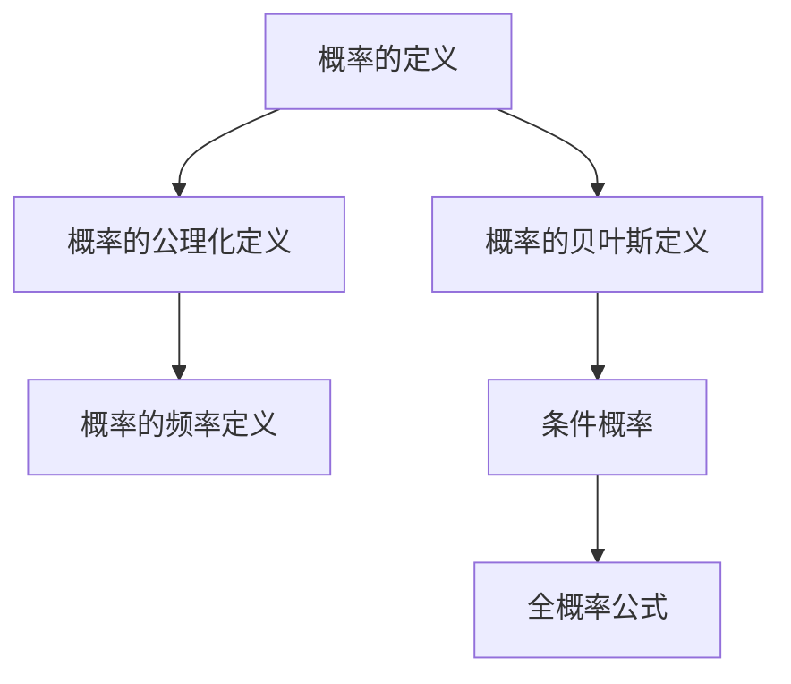
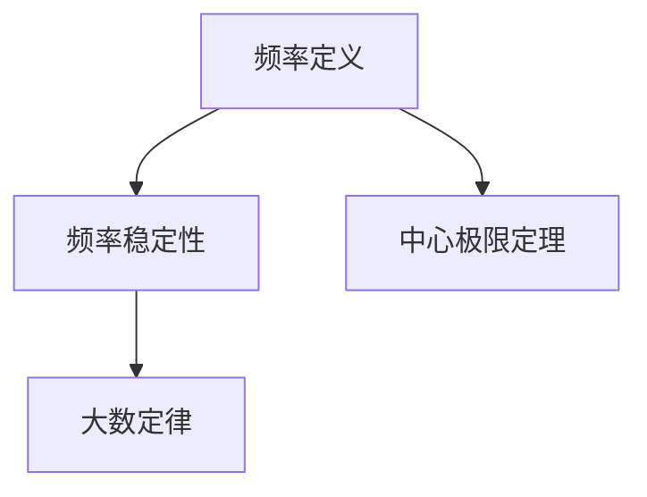
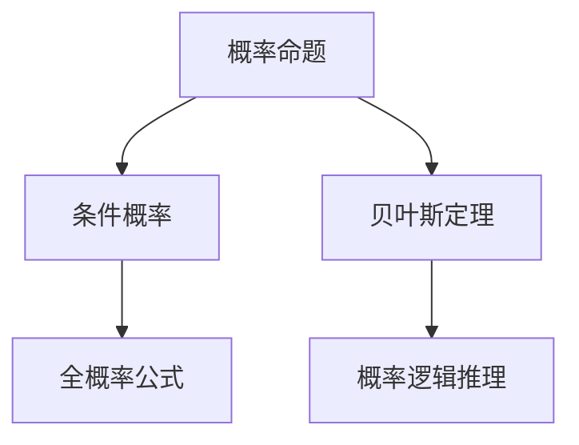

                 

# 卡尔纳普的《概率的逻辑基础》

## 关键词
概率论、逻辑基础、卡尔纳普、公理化定义、贝叶斯定理、决策理论、统计分析

## 摘要
本文深入探讨了卡尔纳普的经典著作《概率的逻辑基础》中的核心概念和理论。文章首先概述了卡尔纳普对概率的定义，包括公理化定义、频率定义和贝叶斯定义，并通过Mermaid流程图和伪代码详细阐述这些概念。接着，文章探讨了概率的逻辑基础，包括概率命题的逻辑形式、概率逻辑推理以及逻辑证明，并通过例子说明这些概念在实际中的应用。随后，文章讨论了概率在决策分析、统计推断、经济学、计算机科学和复杂性理论中的应用，提供了丰富的案例和算法解释。最后，文章展望了概率论的未来发展趋势和对社会的影响，总结了卡尔纳普的《概率的逻辑基础》的贡献与遗产。

### 第1章: 卡尔纳普的《概率的逻辑基础》概述

卡尔纳普的《概率的逻辑基础》是概率论领域的一本重要著作，它为概率论提供了逻辑基础，并推动了概率论在多个学科中的应用。本章将概述卡尔纳普书中的核心概念和理论，包括概率的定义、概率的公理化定义、概率的频率定义和概率的贝叶斯定义。

#### 1.1 卡尔纳普的《概率的逻辑基础》核心概念与联系

卡尔纳普的《概率的逻辑基础》涉及多个概率定义，这些定义从不同的角度描述了概率的本质。以下是对这些核心概念和它们之间联系的分析：

##### 1.1.1 概率的定义

概率是描述事件发生可能性的量度。在卡尔纳普的书中，概率的定义可以从三个方面来理解：

1. **概率的公理化定义**：概率可以形式化为一组公理。在卡尔纳普的框架中，概率空间由三个元素组成：一个样本空间 \( S \)，一个事件集合 \( F \) 以及一个概率函数 \( P \)。概率函数满足以下公理：
    - 非负性：\( P(E) \geq 0 \) 对所有事件 \( E \)。
    - 确定性：\( P(S) = 1 \)。
    - 累积性：如果 \( E_1, E_2, ... \) 是 \( F \) 中的一组互斥事件，即 \( E_i \cap E_j = \emptyset \)（\( i \neq j \)），则 \( P(\cup_{i} E_i) = \sum_{i} P(E_i) \)。

2. **概率的频率定义**：频率定义基于事件发生的相对频率，即事件在大量试验中发生的比例。在长期试验中，一个事件的频率会趋近于某个固定的值，这个值被认为是该事件的概率。

3. **概率的贝叶斯定义**：贝叶斯定义提供了从先验概率和观察到的数据中计算后验概率的方法。贝叶斯定理可以形式化为：
    $$ P(A|B) = \frac{P(B|A)P(A)}{P(B)} $$
    其中，\( P(A|B) \) 是在事件 \( B \) 发生的情况下事件 \( A \) 的条件概率，\( P(B|A) \) 是在事件 \( A \) 发生的情况下事件 \( B \) 的条件概率，\( P(A) \) 是事件 \( A \) 的概率，\( P(B) \) 是事件 \( B \) 的概率。

**Mermaid 流程图：**



##### 1.1.2 概率的公理化定义

概率的公理化定义提供了一个严格的数学框架，用于描述概率的性质。在卡尔纳普的书中，概率的公理化定义包括以下核心概念：

1. **概率空间**：概率空间是一个三元素集合 \( \langle S, F, P \rangle \)，其中：
    - \( S \) 是样本空间，是所有可能结果的集合。
    - \( F \) 是事件集合，是样本空间的子集组成的集合。
    - \( P \) 是概率函数，为事件集合中的每个事件分配一个概率值。

2. **事件**：事件是样本空间的一个子集。

3. **概率函数**：概率函数 \( P \) 是一个从事件集合 \( F \) 到区间 \([0, 1]\) 的函数，满足以下性质：
    - 非负性：对于所有事件 \( E \)，\( P(E) \geq 0 \)。
    - 确定性：\( P(\emptyset) = 0 \) 和 \( P(S) = 1 \)。
    - 累积性：如果 \( E_1, E_2, ... \) 是 \( F \) 中的一组互斥事件，即 \( E_i \cap E_j = \emptyset \)（\( i \neq j \)），则 \( P(\cup_{i} E_i) = \sum_{i} P(E_i) \)。

**伪代码：**

```python
# 定义概率空间
class ProbabilitySpace:
    def __init__(self, S, F, P):
        self.S = S
        self.F = F
        self.P = P

# 定义事件
def Event(E):
    return E

# 概率公理化定义
def probability(E):
    if E is empty:
        return 0
    if E is S:
        return 1
    return P(E) / P(S)
```

##### 1.1.3 概率的频率定义

概率的频率定义基于实际观测数据，通过统计试验的结果来估计事件的概率。卡尔纳普认为，频率定义是概率的一个合理近似，尤其在大量重复试验的情况下。

1. **频率稳定性**：随着试验次数的增加，事件的相对频率趋于稳定。这种稳定性可以通过大数定律来描述。大数定律表明，对于独立同分布的随机变量序列，其样本均值的分布趋近于期望值。

2. **大数定律**：大数定律指出，当独立重复试验次数足够多时，事件发生的频率将趋近于其概率。形式化地，如果有独立同分布的随机变量 \( X_1, X_2, ... \) 且期望为 \( \mu \)，则对于任意正数 \( \varepsilon \)，当 \( n \) 趋于无穷大时，
    $$ \lim_{n \to \infty} \frac{1}{n} \sum_{i=1}^{n} X_i = \mu $$

3. **中心极限定理**：中心极限定理表明，对于独立同分布的随机变量序列，其样本均值的分布趋近于正态分布。这意味着在实际应用中，可以使用正态分布来近似概率分布。

**Mermaid 流程图：**



##### 1.1.4 概率的贝叶斯定义

概率的贝叶斯定义是卡尔纳普《概率的逻辑基础》中一个重要的组成部分。贝叶斯定义提供了一个从先验概率和观察到的数据中计算后验概率的方法。

1. **先验概率**：先验概率是基于已有知识和假设的概率分布。在贝叶斯定理中，先验概率是 \( P(A) \)。

2. **似然概率**：似然概率是观察到的数据在给定假设 \( B \) 条件下发生的概率，即 \( P(B|A) \)。

3. **后验概率**：后验概率是基于观察到的数据更新后的概率分布，即 \( P(A|B) \)。

贝叶斯定理可以表示为：
$$ P(A|B) = \frac{P(B|A)P(A)}{P(B)} $$
其中，\( P(B) \) 是边缘概率，可以通过全概率公式计算：
$$ P(B) = \sum_{A} P(A)P(B|A) $$

**数学模型：**

$$ P(A|B) = \frac{P(B|A)P(A)}{P(B)} $$

**解释说明：**
- \( P(A|B) \) 表示在事件 \( B \) 发生的情况下，事件 \( A \) 发生的概率。
- \( P(B|A) \) 表示在事件 \( A \) 发生的情况下，事件 \( B \) 发生的概率。
- \( P(A) \) 表示事件 \( A \) 发生的概率。
- \( P(B) \) 表示事件 \( B \) 发生的概率。

**举例说明：**
假设我们有一个袋子里有5个红球和5个蓝球，其中每个球被抽出的概率相等。我们随机抽出2个球，想知道抽出2个红球的概率。

设事件 \( A \) 为“抽出2个红球”，事件 \( B \) 为“抽出2个球”。

$$
P(A|B) = \frac{P(B|A)P(A)}{P(B)}
$$

其中：

$$
P(B|A) = \frac{\binom{5}{2}}{\binom{10}{2}} = \frac{10}{45} = \frac{2}{9}
$$

$$
P(A) = \frac{\binom{5}{2}}{\binom{10}{2}} = \frac{10}{45} = \frac{2}{9}
$$

$$
P(B) = \frac{\binom{10}{2}}{\binom{10}{2}} = 1
$$

代入公式：

$$
P(A|B) = \frac{\frac{2}{9} \times \frac{2}{9}}{1} = \frac{4}{81}
$$

因此，抽出2个红球的概率是 \( \frac{4}{81} \)。

### 第2章: 概率的逻辑基础

概率的逻辑基础是卡尔纳普《概率的逻辑基础》的核心内容之一。本章将探讨概率的逻辑形式、概率的逻辑推理以及概率的逻辑证明。

#### 2.1 概率的逻辑基础原理

概率的逻辑基础涉及概率命题的逻辑形式、概率逻辑推理以及概率逻辑证明。以下是对这些概念的分析：

##### 2.1.1 概率的逻辑形式

概率的逻辑形式涉及概率命题的结构和逻辑关系。在卡尔纳普的框架中，概率命题可以表示为条件概率和全概率公式。

1. **条件概率**：条件概率描述了在某个事件发生的情况下另一个事件发生的概率。条件概率可以用以下公式表示：
   $$ P(A|B) = \frac{P(A \cap B)}{P(B)} $$
   其中，\( P(A \cap B) \) 是事件 \( A \) 和事件 \( B \) 同时发生的概率，\( P(B) \) 是事件 \( B \) 发生的概率。

2. **全概率公式**：全概率公式描述了在多个互斥事件中的任何一个发生的概率。全概率公式可以表示为：
   $$ P(A) = \sum_{i} P(A|B_i)P(B_i) $$
   其中，\( B_i \) 是互斥事件集合中的第 \( i \) 个事件，\( P(A|B_i) \) 是在事件 \( B_i \) 发生的情况下事件 \( A \) 的条件概率。

**Mermaid 流程图：**



##### 2.1.2 概率的逻辑推理

概率的逻辑推理涉及从概率命题中推导出其他概率命题。以下是一些常见的概率逻辑推理：

1. **贝叶斯推理**：贝叶斯推理是一种从先验概率和观察到的数据中计算后验概率的方法。贝叶斯推理可以用贝叶斯定理来表示：
   $$ P(A|B) = \frac{P(B|A)P(A)}{P(B)} $$
   其中，\( P(A|B) \) 是在事件 \( B \) 发生的情况下事件 \( A \) 的条件概率，\( P(B|A) \) 是在事件 \( A \) 发生的情况下事件 \( B \) 的条件概率，\( P(A) \) 是事件 \( A \) 的概率，\( P(B) \) 是事件 \( B \) 的概率。

2. **概率逻辑推理**：概率逻辑推理涉及从已知概率命题推导出新的概率命题。以下是一个例子：
   - 假设事件 \( A \) 和事件 \( B \) 是独立的，即 \( P(A \cap B) = P(A)P(B) \)。
   - 那么，\( P(A|B) = \frac{P(A \cap B)}{P(B)} = \frac{P(A)P(B)}{P(B)} = P(A) \)。

**伪代码：**

```python
# 定义概率逻辑推理
def probability_statement(A, B):
    return P(A|B) > P(A)

# 条件概率推理
def conditional_probability(A, B):
    return P(B|A) * P(A) > P(B)

# 全概率推理
def full_probability(A, B):
    return sum(P(B|A_i) * P(A_i)) > P(B)

# 贝叶斯推理
def bayesian_inference(A, B):
    return P(A|B) * P(B) > P(A)
```

##### 2.1.3 概率的逻辑证明

概率的逻辑证明涉及使用逻辑推理和数学

