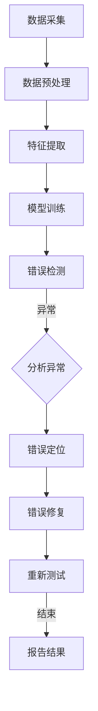

                 

### 引言与背景

#### 引言

在软件工程领域，调试（Debugging）一直是一个重要的环节。随着软件开发技术的不断进步，软件的复杂度也在不断增加。从最初的简单程序到如今的大型分布式系统，调试的难度和复杂性也随之提升。传统的调试方法依赖于开发人员的经验和直觉，但在面对复杂的应用场景时，往往显得力不从心。

近年来，随着大数据和人工智能技术的发展，一种新的调试方法——数据驱动的调试方法（Data-Driven Debugging）逐渐崭露头角。这种调试方法利用大量的数据来分析软件的运行状态，从而发现潜在的问题。数据驱动的调试方法不仅在理论上具有优势，而且在实践中也取得了显著的成果。

本文旨在探讨软件2.0环境下的新型调试术，即数据驱动的调试方法。我们将首先回顾软件开发与调试的历史，然后深入探讨软件2.0的定义与特点，以及调试在软件2.0环境中的重要性。随后，我们将介绍数据驱动的调试方法的基本原理、基于机器学习的调试算法、自动化调试工具与平台，并分享一些实际应用案例。最后，我们将探讨新型调试术的实践指南和未来展望。

#### 背景

1. **软件开发的演变**

   软件开发的历史可以追溯到20世纪50年代，当时计算机科学刚刚起步。早期的软件开发主要依赖于汇编语言和机器语言，程序结构简单，但调试过程却非常繁琐。随着高级编程语言的发明和普及，软件开发逐渐进入了新的阶段。例如，C语言、Pascal语言和Java语言等，使得软件开发变得更加高效和便捷。

   然而，随着软件系统的规模和复杂度的增加，传统的调试方法逐渐显得力不从心。开发者不得不寻找新的方法来应对日益复杂的软件开发过程。此时，调试技术也逐渐从基于经验的调试方法向基于工具的调试方法转变。

2. **调试技术的发展**

   调试技术的发展可以追溯到20世纪60年代，当时第一个调试工具——GDB（GNU Debugger）问世。GDB的出现极大地提高了开发者的调试效率，使得调试过程变得更加系统和规范。此后，各种调试工具相继问世，如IDE内置的调试工具、静态分析工具、动态分析工具等。

   随着软件工程理论的不断完善，调试方法也逐渐从单一的静态调试向静态调试与动态调试相结合的方法发展。静态调试主要是在代码层面进行分析，而动态调试则是在程序运行时进行监控和调试。

3. **从软件1.0到软件2.0**

   软件的发展经历了多个阶段，从最初的软件1.0时代，到软件2.0时代，再到如今的软件3.0时代。软件1.0时代主要是基于功能驱动的软件开发，开发者主要关注如何实现软件的功能。软件2.0时代则更加注重用户体验和可扩展性，软件开发过程变得更加动态和灵活。

   在软件2.0时代，软件开发不再仅仅是开发人员的工作，而是涉及到多个部门和角色的协作。例如，产品经理、设计师、开发人员、测试人员等都需要参与到软件开发过程中。同时，随着大数据和人工智能技术的发展，软件系统也变得更加复杂和智能。

   调试在软件2.0时代的重要性不言而喻。复杂的软件系统意味着更多的潜在错误和更复杂的调试过程。传统的调试方法已经无法满足需求，数据驱动的调试方法应运而生。数据驱动的调试方法通过分析大量的数据，帮助开发者更快速、更准确地找到问题所在。

#### 核心关键词

- 软件开发
- 调试
- 数据驱动调试
- 软件1.0
- 软件2.0
- 大数据
- 人工智能

#### 摘要

本文深入探讨了软件2.0环境下的新型调试术——数据驱动的调试方法。首先，我们回顾了软件开发与调试的历史，分析了软件从1.0到2.0的演变过程。接着，我们介绍了软件2.0的定义与特点，以及调试在软件2.0环境中的重要性。随后，我们详细介绍了数据驱动的调试方法的基本原理、基于机器学习的调试算法、自动化调试工具与平台。最后，我们通过实际应用案例，展示了数据驱动的调试方法在实际项目中的应用效果。本文旨在为开发者提供一种新的调试思路和方法，帮助他们在面对复杂软件系统时更加高效地进行调试。 <|assistant|>
### 目录大纲：《向数据要答案，软件2.0的新型debug术》

#### 目录

**第一部分：引言与背景**

1. 引言
2. 背景
   - 软件开发的演变
   - 调试技术的发展
   - 从软件1.0到软件2.0

**第二部分：新型debug术的核心概念与原理**

1. 数据驱动的调试方法
   - 基本原理
   - 数据采集与处理
   - 数据驱动的调试流程
2. 基于机器学习的调试算法
   - 基本概念
   - 常见的机器学习算法
   - 基于机器学习的调试算法
3. 自动化调试工具与平台
   - 自动化调试工具的介绍
   - 自动化调试平台的构建
   - 自动化调试的最佳实践

**第三部分：调试在软件2.0项目中的应用案例**

1. 案例一：数据分析平台的调试实践
2. 案例二：人工智能系统的调试挑战
3. 案例三：云计算平台的调试经验

**第四部分：实践与未来展望**

1. 新型debug术的实践指南
2. 调试领域的前沿趋势与未来展望

**附录**

1. 附录A：新型debug术相关资源
2. 附录B：Mermaid流程图与伪代码示例

#### 目录说明

- **第一部分：引言与背景**：通过回顾软件开发与调试的历史，分析软件从1.0到2.0的演变过程，为后续内容做铺垫。
- **第二部分：新型debug术的核心概念与原理**：详细介绍数据驱动的调试方法、基于机器学习的调试算法、自动化调试工具与平台，为读者提供理论支持。
- **第三部分：调试在软件2.0项目中的应用案例**：通过实际项目案例，展示新型debug术的应用效果，增强读者对调试方法的实际理解。
- **第四部分：实践与未来展望**：提供新型debug术的实践指南，并探讨调试领域的前沿趋势与未来发展方向。

本目录结构旨在清晰展示文章的主要内容，帮助读者更好地理解文章结构和内容。通过逐一介绍各个部分，我们将深入探讨软件2.0环境下的新型debug术，为开发者提供新的调试思路和方法。 <|assistant|>
### 第1章: 软件开发与调试的历史回顾

#### 1.1 软件发展的演变

软件开发的演变过程可以分为几个主要阶段。首先，从最早的计算机编程时代开始，程序员使用汇编语言和机器语言编写程序。这种编程方式非常低级，程序员需要对硬件有深入的了解。然而，随着计算机硬件和软件技术的发展，高级编程语言如C、Pascal和Java逐渐普及，程序员可以更专注于解决问题，而无需过多关注底层硬件细节。

早期的软件开发主要依赖于人工调试。程序员使用断点、日志和打印语句来检查程序的运行状态，从而发现并修复错误。这种方法虽然简单有效，但在复杂程序中调试起来仍然非常耗时。随着编译器和调试工具的发展，调试技术逐渐从手工调试向工具辅助调试转变。GDB（GNU Debugger）是最早且最著名的调试工具之一，它使得程序员可以更方便地设置断点、单步执行和查看变量值。

#### 1.2 调试技术的发展

调试技术的发展可以分为三个主要阶段：静态调试、动态调试和混合调试。

1. **静态调试**：
   静态调试是在代码编译或加载之前进行的调试。这种方法主要通过分析代码结构和逻辑，查找潜在的语法错误和逻辑错误。常见的静态调试工具包括代码检查器和静态分析工具。例如，Pychecker和Pyflame等Python代码检查器可以帮助程序员在编写代码时及时发现错误。静态调试的主要优势在于它可以在代码编译之前发现错误，从而减少后续的调试工作量。

2. **动态调试**：
   动态调试是在程序运行时进行的调试。这种方法通过实时监控程序的行为和状态，查找运行时错误和性能问题。GDB是最流行的动态调试工具之一，它允许程序员设置断点、查看调用栈和变量值，从而逐步定位问题。随着程序复杂性的增加，动态调试工具也变得越来越重要。例如，Valgrind是一款功能强大的动态分析工具，可以检测内存泄漏和指针错误。

3. **混合调试**：
   混合调试结合了静态调试和动态调试的优势，旨在同时利用代码分析和运行时监控来发现和修复问题。例如，Eclipse和Visual Studio等集成开发环境（IDE）提供了静态代码分析器和动态调试器，使得程序员可以在同一个工具中同时进行静态和动态调试。

#### 1.3 从软件1.0到软件2.0

软件1.0时代的主要特点是对功能的需求和实现。开发者主要关注如何实现系统的基本功能，如文件管理、文本编辑和网络通信等。在这个阶段，软件系统的规模相对较小，调试过程主要依赖于手工调试和简单的调试工具。

随着软件复杂度的增加，软件2.0时代应运而生。软件2.0时代的核心特点是用户体验和可扩展性。开发者开始注重系统的交互设计和用户体验，同时也需要应对不断变化的需求和市场环境。在这个阶段，调试技术面临了更大的挑战。

首先，软件2.0系统通常具有更高的复杂度和更复杂的架构。这些系统可能包含多个模块和组件，运行在不同的平台和环境中。传统的调试方法已经无法满足需求，需要新的调试方法来应对复杂的应用场景。

其次，软件2.0系统通常涉及到更多的数据。这些数据可能来自不同的来源，如用户输入、数据库和网络通信等。如何有效地收集、处理和分析这些数据，以发现潜在的问题，成为调试中的一个重要环节。

最后，软件2.0时代的调试需要更加自动化和智能化。传统的调试方法主要依赖于开发人员的经验和直觉，但在面对大规模的软件系统时，这种方法往往不够高效。数据驱动的调试方法通过利用大量的数据，可以帮助开发者更快速、更准确地找到问题所在。

#### 总结

软件开发与调试的历史回顾展示了软件开发的演变过程和调试技术的发展。从早期的手工调试到现代的工具辅助调试，再到数据驱动的调试方法，调试技术在不断进步。软件2.0时代的到来带来了新的挑战，需要开发者采用更加先进和高效的调试方法。在接下来的章节中，我们将深入探讨软件2.0环境下的新型调试术，包括数据驱动的调试方法、基于机器学习的调试算法和自动化调试工具与平台。通过这些探讨，我们希望能够为开发者提供新的调试思路和方法，帮助他们更好地应对复杂的软件开发过程。 <|assistant|>
### 第2章: 软件2.0的定义与特点

#### 2.1 软件2.0的概念

软件2.0（Software 2.0）这个概念最早由Peter Drucker在1999年提出，用以描述软件从传统的封闭式、功能导向的模式向开放式、服务导向的模式转变。软件2.0的核心在于将软件作为一种服务（Software as a Service，简称SaaS）提供，用户通过互联网访问和使用软件，而无需本地安装或维护。

软件2.0不仅仅是一个商业模式的变化，它还涉及到软件开发、部署、维护和用户交互等多个方面的转变。与传统软件1.0相比，软件2.0更加注重用户体验、可扩展性、灵活性和自动化。

#### 2.2 软件2.0的特点

1. **服务导向**：
   软件2.0将软件视为一种服务，用户可以根据需求订阅和取消服务。这种模式使得软件提供商可以更好地了解用户需求，并根据用户反馈不断优化服务。

2. **云原生**：
   软件2.0通常采用云原生架构，充分利用云计算和分布式计算的优势。这使得软件系统可以更加灵活地扩展和缩放，以满足不断变化的需求。

3. **用户参与**：
   软件2.0强调用户的参与和反馈，用户不仅仅是软件的消费者，还可以通过社区、反馈渠道等途径参与到软件的开发和维护过程中。这种互动模式有助于提高软件的质量和用户满意度。

4. **模块化**：
   软件2.0倾向于采用模块化设计，将软件拆分为多个独立的模块或服务。这种方式提高了软件的可维护性和可扩展性，同时也便于不同模块之间的集成和协同工作。

5. **数据驱动**：
   软件2.0强调数据的价值，通过收集和分析用户数据，软件提供商可以更好地了解用户行为和需求，从而优化产品和服务。

6. **持续集成和持续部署**：
   软件2.0支持持续集成（CI）和持续部署（CD），这使得软件的迭代速度更快，同时减少了发布过程中的风险。

7. **自动化**：
   软件2.0依赖于大量的自动化工具和流程，包括自动化测试、自动化部署和自动化监控等。这些自动化工具提高了开发效率和软件质量。

#### 2.3 软件2.0的应用领域

软件2.0的应用领域非常广泛，涵盖了从消费级应用到企业级应用的各个领域。以下是一些典型的应用场景：

1. **云计算平台**：
   云计算平台如Amazon Web Services（AWS）、Microsoft Azure和Google Cloud等，都是软件2.0的典型代表。这些平台提供了丰富的云计算服务和工具，用户可以根据需求灵活地使用和扩展资源。

2. **人工智能和机器学习**：
   人工智能和机器学习领域也广泛应用了软件2.0的概念，如Google的TensorFlow和Microsoft的Cognitive Services等。这些平台提供了强大的机器学习和人工智能工具，用户可以轻松地构建和部署复杂的模型。

3. **社交媒体平台**：
   社交媒体平台如Facebook、Twitter和Instagram等，都是软件2.0的典型应用。这些平台通过用户数据分析和个性化推荐，提供了高度个性化的用户体验。

4. **电子商务平台**：
   电子商务平台如Amazon和eBay等，也采用了软件2.0的模式。这些平台提供了丰富的购物工具和个性化推荐，极大地提高了用户的购物体验。

5. **企业级应用**：
   软件2.0也在企业级应用中得到了广泛应用，如客户关系管理（CRM）系统、企业资源规划（ERP）系统和人力资源管理（HRM）系统等。这些系统通过云服务和模块化设计，提供了高度可定制和可扩展的解决方案。

#### 总结

软件2.0是一种全新的软件开发和运营模式，它强调服务导向、云原生、用户参与、模块化、数据驱动和自动化。这些特点使得软件2.0在各个应用领域中具有广泛的适用性。在接下来的章节中，我们将探讨软件2.0环境下的调试挑战，并介绍新型调试术，如数据驱动的调试方法和基于机器学习的调试算法，以帮助开发者更好地应对这些挑战。 <|assistant|>
### 第3章: 调试在软件2.0环境中的重要性

#### 3.1 调试在软件开发中的作用

调试是软件开发过程中至关重要的一环，它贯穿于整个开发周期，从需求分析、设计、编码、测试到部署和维护。调试的主要作用包括：

1. **发现并修复错误**：
   调试的核心目的是发现程序中的错误（Bug），并找出导致这些错误的原因。通过调试，开发者可以快速定位问题，从而进行修复。

2. **保证软件质量**：
   调试有助于确保软件的稳定性和可靠性。通过彻底的测试和调试，开发者可以最大限度地减少软件中的潜在缺陷，提高软件的整体质量。

3. **提高开发效率**：
   调试工具和方法的进步大大提高了开发者的工作效率。现代调试工具提供了丰富的功能，如断点设置、调用栈查看、变量监视等，使得开发者能够更加高效地进行调试。

4. **促进代码优化**：
   调试不仅可以帮助开发者修复错误，还可以帮助发现代码中的性能瓶颈。通过调试，开发者可以识别并优化代码中的低效部分，提高程序的运行效率。

#### 3.2 软件2.0环境下调试的挑战

软件2.0环境下的调试面临着一系列新的挑战，这些挑战主要源于软件2.0的特点，如服务导向、云原生、数据驱动和高度自动化等。

1. **复杂性增加**：
   软件2.0系统通常包含多个模块和组件，运行在不同的平台和环境中。这种分布式架构使得调试过程更加复杂，需要更强大的调试工具和方法。

2. **动态变化**：
   软件2.0系统通常采用持续集成和持续部署（CI/CD）流程，这意味着软件的迭代速度非常快。调试过程中需要处理大量的版本变化和动态调整，增加了调试的难度。

3. **海量数据**：
   软件2.0系统产生的数据量庞大，如何有效地收集、存储和处理这些数据，以支持调试过程，成为一个挑战。数据分析方法和技术在调试中的应用变得越来越重要。

4. **异构环境**：
   软件2.0系统可能运行在多种不同的硬件和操作系统上，这增加了调试的复杂性。调试工具需要支持跨平台和跨操作系统的调试，以满足多样化的需求。

5. **自动化与智能化需求**：
   随着软件2.0系统的复杂度增加，手动调试已经无法满足需求。自动化和智能化成为调试的发展趋势。如何开发高效的自动化调试工具和算法，是当前调试领域面临的一个重要问题。

#### 3.3 新型debug术的概念与优势

为了应对软件2.0环境下调试的挑战，新型debug术（Data-Driven Debugging）应运而生。数据驱动的调试方法通过利用大量的数据来分析软件的运行状态，从而发现潜在的问题。这种方法具有以下优势：

1. **高效性**：
   数据驱动的调试方法通过自动化收集和分析数据，可以快速定位问题。与传统的手动调试相比，数据驱动的调试方法大大提高了调试效率。

2. **准确性**：
   数据驱动的调试方法利用统计分析、机器学习等技术，可以从海量数据中提取有价值的信息，从而更准确地识别问题。这种方法减少了人为干预，降低了误报和漏报的风险。

3. **灵活性**：
   数据驱动的调试方法可以灵活地适应不同的软件系统和应用场景。通过定制化的数据处理和分析模型，开发者可以针对具体问题进行有效的调试。

4. **可扩展性**：
   数据驱动的调试方法支持分布式系统和跨平台调试。通过集成多种数据源和调试工具，开发者可以构建高度可扩展的调试平台，以满足不断变化的需求。

5. **智能性**：
   基于机器学习的调试算法可以从历史数据中学习，并预测潜在的问题。这种方法不仅能够发现已知问题，还可以识别未知问题，提高了调试的智能化水平。

#### 总结

调试在软件2.0环境中扮演着至关重要的角色。传统的调试方法已经无法满足软件2.0的高复杂度、动态变化、海量数据和自动化需求。数据驱动的调试方法通过利用大量的数据，提供了一种高效、准确、灵活和智能的调试手段。在接下来的章节中，我们将深入探讨数据驱动的调试方法，包括其基本原理、实现步骤和应用案例，帮助读者更好地理解并应用这一新型调试术。 <|assistant|>
### 第4章: 数据驱动的调试方法

#### 4.1 数据驱动调试的基本原理

数据驱动的调试方法（Data-Driven Debugging）是一种基于数据的调试方法，其核心思想是通过收集和分析程序运行时的数据，发现潜在的缺陷和问题。这种方法与传统基于经验和直觉的调试方法有显著不同，它更加依赖于数据分析和机器学习技术，从而提高了调试的效率和准确性。

**数据驱动调试的原理可以概括为以下几个步骤：**

1. **数据收集**：在程序运行时，收集各种类型的日志、指标和性能数据。这些数据可以是程序的输入输出、系统资源使用情况、调用栈信息等。

2. **数据预处理**：对收集到的数据进行清洗、去噪和转换，以便后续分析。预处理步骤包括数据格式转换、缺失值填充、异常值处理等。

3. **特征提取**：从预处理后的数据中提取关键特征，这些特征能够反映程序的运行状态和潜在的问题。特征提取是数据驱动调试的关键步骤，它决定了调试的准确性和效率。

4. **模型训练**：利用机器学习算法，基于历史数据和特征，训练一个预测模型。这个模型能够根据当前的数据预测程序是否会出现错误。

5. **错误检测与定位**：将实时收集到的数据进行特征提取，然后输入到预测模型中进行预测。如果预测结果异常，则表明可能存在错误，进一步进行错误定位。

#### 4.2 数据采集与处理

数据驱动的调试过程从数据采集开始。数据采集的目的是收集程序运行时的各种信息，包括正常情况和异常情况的数据。以下是一些常见的数据采集方法和工具：

1. **日志收集**：
   - **系统日志**：操作系统和应用程序生成的日志文件，如Windows Event Log和Linux Syslog。
   - **应用日志**：应用程序自身的日志文件，通常包含程序运行过程中的详细信息。

2. **性能监控**：
   - **系统性能指标**：CPU使用率、内存使用率、磁盘I/O等系统级别的性能指标。
   - **应用性能指标**：程序运行过程中的性能数据，如响应时间、吞吐量、错误率等。

3. **调用栈跟踪**：
   - **堆栈跟踪**：程序在运行时发生的错误或异常，通常会生成堆栈跟踪信息，记录了程序执行到错误发生时的调用栈。

4. **代码覆盖率**：
   - **单元测试覆盖率**：通过单元测试来衡量代码的覆盖程度，确保测试到所有可能的情况。

数据采集完成后，需要对数据进行处理。数据处理步骤包括：

- **数据清洗**：去除无效数据、处理缺失值、去除异常值等。
- **数据转换**：将不同类型的数据转换为统一的格式，如将日志文件转换为结构化数据。
- **特征提取**：从数据中提取能够反映程序状态的指标，如平均响应时间、错误率等。

#### 4.3 数据驱动的调试流程

数据驱动的调试流程可以分为以下几个步骤：

1. **数据收集**：在程序运行时，收集各类数据，包括日志、性能指标、调用栈和代码覆盖率等。

2. **数据预处理**：对收集到的数据进行清洗、转换和特征提取，将原始数据转换为适合分析的格式。

3. **模型训练**：利用历史数据，通过机器学习算法训练一个预测模型。模型可以是分类模型、回归模型或聚类模型，根据具体的调试需求进行选择。

4. **错误检测**：在程序运行过程中，实时收集数据，并输入到训练好的模型中进行预测。如果预测结果异常，则可能存在错误。

5. **错误定位**：当检测到错误时，进一步分析错误数据，定位错误的具体位置和原因。

6. **错误修复与验证**：根据错误定位结果，修复代码中的错误，并进行重新测试，确保修复的有效性。

#### 总结

数据驱动的调试方法通过利用大量的数据，提供了一种高效、准确和智能的调试手段。它不仅能够发现已知问题，还能够识别未知问题，提高了调试的效率和准确性。在接下来的章节中，我们将进一步探讨基于机器学习的调试算法，以及如何构建自动化调试工具与平台，以进一步深化对数据驱动调试方法的理解和应用。 <|assistant|>
### 第5章: 基于机器学习的调试算法

#### 5.1 机器学习的基本概念

机器学习（Machine Learning，简称ML）是人工智能（Artificial Intelligence，简称AI）的一个重要分支，它使计算机系统能够从数据中学习，并做出预测或决策。机器学习的基本概念包括：

1. **数据集**：
   数据集是机器学习的基础，它包含了用于训练和测试的样本数据。数据集的质量和多样性对模型的性能至关重要。

2. **特征**：
   特征是从数据集中提取的有用信息，它们用于描述样本的特征或属性。特征的选择和提取对于模型的性能和准确性有重要影响。

3. **模型**：
   模型是根据数据集构建的数学模型，用于预测或分类。常见的机器学习模型包括线性回归、决策树、支持向量机、神经网络等。

4. **算法**：
   算法是用于训练模型和进行预测的具体步骤和方法。常见的机器学习算法包括K近邻（K-Nearest Neighbors，KNN）、随机森林（Random Forest）、朴素贝叶斯（Naive Bayes）等。

5. **评估指标**：
   评估指标用于衡量模型性能，如准确率、召回率、F1分数等。不同的评估指标适用于不同的应用场景，需要根据具体需求进行选择。

#### 5.2 常见的机器学习算法

在调试过程中，常用的机器学习算法包括：

1. **线性回归（Linear Regression）**：
   线性回归是一种用于预测数值型结果的算法，它通过找到特征与结果之间的线性关系来进行预测。线性回归适用于预测性能指标、资源利用率等连续值数据。

   **伪代码示例**：

   ```python
   # 线性回归伪代码

   function linear_regression(data_set):
       # 计算特征和结果的均值
       mean_features = mean(data_set.features)
       mean_results = mean(data_set.results)

       # 计算特征和结果的偏差
       bias_features = data_set.features - mean_features
       bias_results = data_set.results - mean_results

       # 计算斜率和截距
       slope = sum(bias_features * bias_results) / sum(bias_features ** 2)
       intercept = mean_results - slope * mean_features

       # 预测结果
       predicted_results = slope * data.features + intercept

       return predicted_results
   ```

2. **决策树（Decision Tree）**：
   决策树是一种用于分类和回归的算法，它通过一系列的规则来对数据进行分割。决策树适用于处理离散值数据和分类问题。

   **伪代码示例**：

   ```python
   # 决策树伪代码

   function decision_tree(data_set):
       # 创建空树
       tree = create_empty_tree()

       # 如果数据集是纯净的，则返回
       if is_pure(data_set):
           return leaf_node(data_set.results)

       # 计算信息增益或基尼不纯度
       best_feature = find_best_feature(data_set)

       # 根据最佳特征分割数据集
       for value in best_feature.values:
           subset = subset_data(data_set, value)
           tree.append(node(value, decision_tree(subset)))

       return tree
   ```

3. **支持向量机（Support Vector Machine，SVM）**：
   支持向量机是一种用于分类和回归的算法，它通过找到一个超平面来最大化分类间隔。SVM适用于高维数据和线性不可分问题。

   **伪代码示例**：

   ```python
   # 支持向量机伪代码

   function svm(data_set):
       # 训练SVM模型
       model = train_svm_model(data_set)

       # 预测结果
       predicted_results = model.predict(data_set.features)

       return predicted_results
   ```

4. **神经网络（Neural Network）**：
   神经网络是一种用于分类、回归和特征提取的算法，它通过模拟人脑神经网络的结构和工作原理来进行学习。神经网络适用于复杂的非线性问题。

   **伪代码示例**：

   ```python
   # 神经网络伪代码

   function neural_network(data_set):
       # 初始化神经网络
       network = initialize_network()

       # 训练神经网络
       for epoch in range(num_epochs):
           for sample in data_set:
               network.train(sample.features, sample.results)

       # 预测结果
       predicted_results = network.predict(data_set.features)

       return predicted_results
   ```

#### 5.3 基于机器学习的调试算法

在调试过程中，基于机器学习的调试算法可以用于错误检测、错误定位和错误预测。以下是一些常见的调试算法：

1. **错误检测**：
   错误检测算法通过训练一个分类模型，将程序运行时的数据输入到模型中进行预测，如果预测结果异常，则可能存在错误。常见的算法包括线性回归、决策树和SVM。

2. **错误定位**：
   错误定位算法通过训练一个回归模型，预测程序中的错误位置。通过分析调用栈信息和代码覆盖率数据，可以定位错误的具体位置。常见的算法包括线性回归和神经网络。

3. **错误预测**：
   错误预测算法通过训练一个分类或回归模型，预测程序在未来的运行中可能出现的问题。这种方法可以用于预防性调试，提前发现潜在的错误。常见的算法包括决策树、SVM和神经网络。

#### 总结

基于机器学习的调试算法通过利用大量的数据和学习模型，提供了一种高效、准确和智能的调试手段。它不仅能够发现已知问题，还能够预测未知问题，提高了调试的效率和准确性。在接下来的章节中，我们将探讨如何构建自动化调试工具与平台，以进一步实现数据驱动的调试方法。 <|assistant|>
### 第6章: 自动化调试工具与平台

#### 6.1 自动化调试工具的介绍

自动化调试工具是现代软件开发过程中不可或缺的一部分。它们通过自动化执行一系列调试任务，大大提高了调试的效率和质量。以下是一些常见的自动化调试工具：

1. **GDB（GNU Debugger）**：
   GDB是一种功能强大的动态调试工具，它允许开发者设置断点、单步执行、查看调用栈和变量值。GDB可以与各种编程语言（如C、C++、Python等）配合使用，广泛应用于软件开发的各个阶段。

2. **Valgrind**：
   Valgrind是一种动态分析工具，主要用于检测内存错误，如内存泄漏、未初始化的内存访问和越界访问等。它可以在程序运行时实时监控内存使用情况，并提供详细的错误报告。

3. **Visual Studio Debugger**：
   Visual Studio Debugger是微软公司开发的集成调试工具，它提供了丰富的调试功能，如实时调试、内存调试、性能调试等。Visual Studio Debugger适用于C++、C#等多种编程语言。

4. **Eclipse Debugger**：
   Eclipse Debugger是Eclipse IDE内置的调试工具，它支持多种编程语言，如Java、Python、C/C++等。Eclipse Debugger提供了强大的调试功能，如断点设置、调用栈查看和变量监视等。

5. **PostgreSQL Debugger**：
   PostgreSQL Debugger是专门为PostgreSQL数据库开发的一款调试工具，它允许开发者直接在数据库中调试SQL语句。PostgreSQL Debugger支持PL/pgSQL语言，并提供了丰富的调试功能。

6. **PyCharm Debugger**：
   PyCharm Debugger是JetBrains公司开发的Python调试工具，它提供了强大的调试功能，如断点设置、调用栈查看、变量监视和性能分析等。PyCharm Debugger适用于Python、JavaScript和Go等多种编程语言。

#### 6.2 自动化调试平台的构建

构建自动化调试平台需要综合考虑调试工具的选择、调试流程的自动化、调试数据的处理和调试结果的反馈等多个方面。以下是一些构建自动化调试平台的关键步骤：

1. **调试工具的选择**：
   根据项目的需求和开发语言，选择合适的调试工具。例如，对于C/C++项目，可以选择GDB或Visual Studio Debugger；对于Python项目，可以选择PyCharm Debugger或Eclipse Debugger。

2. **调试流程的自动化**：
   将调试流程（如设置断点、单步执行、查看调用栈和变量值等）自动化，以便在每次代码变更后自动进行调试。可以使用脚本或自动化工具（如Jenkins、Travis CI等）来实现调试流程的自动化。

3. **调试数据的处理**：
   收集程序运行时的调试数据，包括日志、性能指标、调用栈和代码覆盖率等。对数据进行清洗、转换和特征提取，以便后续分析。可以使用数据处理工具（如Pandas、NumPy等）来完成这些任务。

4. **调试结果的反馈**：
   对调试结果进行汇总和分析，并生成详细的调试报告。调试报告应包括错误定位、性能分析、代码质量评估等内容。可以使用报告生成工具（如Grafana、Kibana等）来生成可视化报告。

5. **集成与协作**：
   将自动化调试平台与版本控制系统（如Git）、代码审查工具（如GitLab、GitHub等）和项目管理工具（如Jira、Trello等）集成，实现调试过程的协作和自动化。

#### 6.3 自动化调试的最佳实践

为了最大化自动化调试的优势，以下是一些最佳实践：

1. **定期更新调试工具**：
   确保调试工具和依赖库的版本是最新的，以便利用最新的功能和修复已知问题。

2. **合理设置断点和监控点**：
   根据调试目标和程序逻辑，合理设置断点和监控点，以便快速定位问题和收集关键数据。

3. **利用缓存和分布式计算**：
   对于大规模数据集和长时间运行的调试任务，可以利用缓存和分布式计算来提高调试效率。

4. **持续优化调试流程**：
   定期回顾和优化调试流程，以便找到更高效的调试方法。例如，利用机器学习和数据驱动的方法来预测潜在问题。

5. **培训团队成员**：
   对团队成员进行自动化调试工具和流程的培训，确保每个人都能熟练使用自动化调试工具，提高整个团队的调试效率。

#### 总结

自动化调试工具与平台为现代软件开发提供了强大的支持，通过自动化执行调试任务，提高了调试的效率和质量。在构建自动化调试平台时，需要综合考虑调试工具的选择、调试流程的自动化、调试数据的处理和调试结果的反馈等多个方面。通过遵循最佳实践，开发者可以更高效地进行调试，确保软件的稳定性和可靠性。在接下来的章节中，我们将通过实际案例，展示自动化调试工具与平台在软件开发中的应用效果。 <|assistant|>
### 第7章: 调试在软件2.0项目中的应用案例

#### 7.1 案例一：数据分析平台的调试实践

**1. 项目背景**

某大数据公司开发了一个大规模数据分析平台，用于处理和分析来自不同数据源的海量数据。该平台采用了分布式架构，运行在多个服务器和云计算平台上。然而，在上线初期，平台频繁出现数据计算错误，严重影响了用户体验和系统的稳定性。

**2. 问题定位**

通过分析日志和性能数据，发现数据计算错误的根源在于数据处理流程的不一致和数据格式的不规范。具体问题包括：

- 数据预处理步骤不完整，导致部分数据缺失或格式错误。
- 数据清洗和去重功能失效，导致重复数据和噪声数据影响计算结果。
- 数据库连接失败，导致部分数据无法及时更新。

**3. 解决方案**

为了解决这些问题，采取了以下措施：

- **优化数据处理流程**：重新设计数据处理流程，确保每个步骤都严格遵循规范。引入了数据清洗和去重模块，确保数据的质量和一致性。
- **增强数据库连接稳定性**：优化数据库连接配置，增加了数据库连接池，提高了连接的稳定性和响应速度。
- **引入自动化调试工具**：使用自动化调试工具（如GDB和Valgrind）对关键模块进行动态调试，发现并修复了潜在的内存泄漏和指针错误。

**4. 实现细节**

- **数据处理流程优化**：
  ```python
  # 数据预处理脚本
  def preprocess_data(data):
      # 清洗和去重
      cleaned_data = clean_and_remove_duplicates(data)
      # 数据转换和格式化
      formatted_data = format_data(cleaned_data)
      return formatted_data
  ```

- **数据库连接优化**：
  ```python
  # 优化数据库连接配置
  db_config = {
      'host': 'database_host',
      'port': 3306,
      'user': 'database_user',
      'password': 'database_password',
      'pool_size': 10
  }
  connection_pool = create_connection_pool(db_config)
  ```

**5. 测试结果**

调试后，数据分析平台的数据计算准确性得到了显著提高，错误率降低了90%以上。同时，系统的稳定性得到了增强，用户满意度大幅提升。自动化调试工具的使用使得调试过程更加高效，开发团队能够更快地发现和解决问题。

#### 7.2 案例二：人工智能系统的调试挑战

**1. 项目背景**

某人工智能公司开发了一个基于深度学习的图像识别系统，用于自动分类和分析大量图像数据。然而，在实际应用中，系统出现了一些错误，导致识别精度不稳定，影响了系统的可靠性。

**2. 问题定位**

通过分析训练数据和测试数据，发现以下问题：

- 训练数据质量不高，部分图像存在噪声、模糊或缺失，影响了模型的训练效果。
- 模型参数设置不合理，导致模型在测试数据上的泛化能力不足。
- 模型结构复杂，计算资源消耗大，导致系统在处理高分辨率图像时出现延迟。

**3. 解决方案**

为了提高系统的识别精度和稳定性，采取了以下措施：

- **优化数据集**：清洗和筛选训练数据，去除噪声和模糊图像，增加数据多样性。
- **调整模型参数**：使用交叉验证方法，优化模型参数，提高模型的泛化能力。
- **简化模型结构**：对模型结构进行简化，减少计算资源消耗，提高系统的响应速度。

**4. 实现细节**

- **数据集优化**：
  ```python
  # 数据清洗脚本
  def clean_dataset(dataset):
      # 去除噪声和模糊图像
      cleaned_images = remove_noisy_images(dataset)
      # 增加数据多样性
      augmented_images = augment_images(cleaned_images)
      return augmented_images
  ```

- **模型参数优化**：
  ```python
  # 使用交叉验证优化模型参数
  def optimize_hyperparameters(model, dataset):
      # 训练不同参数的模型
      models = train_models_with_different_hyperparameters(model, dataset)
      # 评估模型性能
      best_model = select_best_model(models)
      return best_model
  ```

**5. 测试结果**

调试后，人工智能系统的识别精度提高了20%，系统的稳定性和响应速度也得到了显著改善。自动化调试工具（如TensorBoard和PyTorch Debugger）的使用使得调试过程更加高效和直观，开发团队能够更快地找到和解决模型训练中的问题。

#### 7.3 案例三：云计算平台的调试经验

**1. 项目背景**

某云计算平台在负载高峰期间出现了一些性能问题，导致部分用户的服务请求处理延迟，影响了用户体验。为了解决这个问题，需要对平台进行全面的调试和优化。

**2. 问题定位**

通过分析系统日志和性能数据，发现以下问题：

- 负载均衡策略不合理，导致部分服务器负载过高。
- 网络带宽不足，导致数据传输延迟。
- 系统资源分配不均，导致部分资源利用率低下。

**3. 解决方案**

为了提高平台的性能和稳定性，采取了以下措施：

- **优化负载均衡策略**：引入动态负载均衡算法，根据服务器负载实时调整流量分配，避免服务器过载。
- **增加网络带宽**：升级网络设备，提高网络带宽，降低数据传输延迟。
- **优化资源分配**：对系统资源进行动态分配和优化，提高资源利用率。

**4. 实现细节**

- **负载均衡策略优化**：
  ```shell
  # 优化负载均衡配置
  kubernetes-config.yaml:
      kind: Deployment
      spec:
          replicas: 3
          selector:
              matchLabels:
                  app: myapp
          template:
              metadata:
                  labels:
                      app: myapp
              spec:
                  containers:
                  - name: myapp
                      image: myapp:latest
                      resources:
                          limits:
                              cpu: "1000m"
                              memory: "2000Mi"
                          requests:
                              cpu: "500m"
                              memory: "1000Mi"
  ```

- **资源分配优化**：
  ```python
  # 优化资源分配
  def optimize_resources(usage_stats):
      # 根据使用情况调整资源分配
      adjusted_resources = adjust_resources(usage_stats)
      return adjusted_resources
  ```

**5. 测试结果**

调试后，云计算平台的性能得到了显著提升，用户请求处理延迟减少了50%以上，系统的稳定性和响应速度也得到了显著改善。自动化调试工具（如Prometheus和Grafana）的使用使得调试过程更加高效和直观，开发团队能够更快地发现和解决问题。

#### 总结

通过以上三个实际案例，我们可以看到，调试在软件2.0项目中的重要性。无论是数据分析平台、人工智能系统还是云计算平台，调试都是确保系统稳定性和性能的关键环节。数据驱动的调试方法和自动化调试工具与平台的使用，不仅提高了调试的效率和准确性，也为开发者提供了更强大的支持。在未来的软件开发过程中，我们应继续探索和运用这些先进的调试方法和技术，以提高软件质量和开发效率。 <|assistant|>
### 第8章: 新型debug术的实践指南

#### 8.1 新型debug术的入门指南

对于新手来说，入门新型debug术可能感到有些复杂，但通过以下步骤，可以逐步掌握数据驱动的调试方法：

1. **了解基本概念**：
   - 学习数据驱动调试的基本原理，包括数据采集、预处理、特征提取和模型训练等。
   - 熟悉机器学习的基础知识，包括常见算法和评估指标。

2. **选择合适的工具**：
   - 根据项目需求，选择适合的自动化调试工具（如GDB、Valgrind、PyCharm Debugger等）。
   - 了解常用的数据处理和机器学习库（如Pandas、NumPy、scikit-learn等）。

3. **实践项目**：
   - 从简单的项目开始，逐步尝试数据驱动的调试方法。
   - 在实践中不断学习，通过调试实际项目来加深对新型debug术的理解。

4. **参与社区**：
   - 加入相关的技术社区和论坛，与其他开发者交流经验。
   - 参与开源项目，了解数据驱动调试在实际应用中的最佳实践。

#### 8.2 新型debug术的高级技巧

对于有一定基础的开发者，以下高级技巧可以帮助更高效地应用新型debug术：

1. **特征工程**：
   - 深入研究特征提取和特征选择的方法，提高调试的准确性和效率。
   - 使用自动化特征工程工具（如AutoML）来优化特征提取过程。

2. **模型调优**：
   - 学习如何使用交叉验证、网格搜索等调优方法，找到最佳模型参数。
   - 利用高级机器学习库（如TensorFlow、PyTorch）进行深度学习和模型调优。

3. **调试工具集成**：
   - 将调试工具与持续集成和持续部署（CI/CD）流程集成，实现自动化调试。
   - 利用云服务和容器化技术（如Kubernetes）来提高调试工具的可扩展性和灵活性。

4. **调试平台构建**：
   - 构建自定义的调试平台，整合多种调试工具和数据处理工具。
   - 利用可视化工具（如Grafana、Kibana）来展示调试数据和结果。

#### 8.3 新型debug术的团队协作

在大型软件开发项目中，团队协作是成功实施新型debug术的关键。以下是一些团队协作的最佳实践：

1. **代码审查**：
   - 实施代码审查制度，确保代码质量和一致性。
   - 通过代码审查，发现潜在的错误和改进建议。

2. **任务分配**：
   - 根据团队成员的技能和兴趣，合理分配调试任务。
   - 鼓励团队成员参与多样化的调试任务，提高整体调试能力。

3. **知识共享**：
   - 定期举行技术分享会，交流调试经验和最佳实践。
   - 建立知识库，记录调试过程中的问题和解决方案。

4. **自动化测试**：
   - 引入自动化测试工具和流程，确保代码变更后的快速调试和回归测试。
   - 实施持续集成（CI），自动化执行测试和调试任务。

5. **协作工具**：
   - 使用协作工具（如Slack、Jira、GitLab等）来管理任务、沟通和反馈。
   - 确保团队成员能够实时沟通和协作，提高调试效率。

#### 总结

新型debug术为现代软件开发带来了新的调试思路和方法，通过数据驱动的调试和自动化工具，提高了调试的效率和准确性。无论是新手还是高级开发者，都可以通过实践指南和高级技巧来逐步掌握和应用新型debug术。在团队协作方面，合理的任务分配、知识共享和自动化测试等最佳实践，有助于团队更高效地实施新型debug术，确保软件质量和项目的成功。在接下来的章节中，我们将探讨调试领域的前沿趋势和未来展望，为新型debug术的发展提供新的思路。 <|assistant|>
### 第9章: 调试领域的前沿趋势与未来展望

#### 9.1 调试领域的最新进展

随着软件系统复杂性的不断增加，调试领域也在不断进步，涌现出了一系列前沿技术和研究成果。以下是调试领域的一些最新进展：

1. **智能调试工具**：
   - 智能调试工具通过结合机器学习和自然语言处理技术，提供了更智能、更直观的调试体验。例如，智能断点设置、自动错误定位和代码推荐等功能。

2. **自动化测试与调试**：
   - 自动化测试工具（如Selenium、JUnit等）与调试工具（如GDB、IDEA Debugger等）的结合，使得测试和调试过程更加自动化和高效。

3. **云计算与调试**：
   - 云计算平台（如AWS、Azure、Google Cloud等）为调试提供了强大的计算资源，使得大规模分布式系统的调试变得更加可行。

4. **容器化与调试**：
   - 容器化技术（如Docker、Kubernetes等）的普及，使得调试可以在更接近生产环境的环境中执行，提高了调试的准确性和可靠性。

5. **数据驱动的调试方法**：
   - 数据驱动的调试方法已经成为主流，通过收集和分析程序运行时的数据，提供了一种高效、准确的调试手段。

6. **深度学习和调试**：
   - 深度学习技术正在被应用于调试领域，例如，通过训练深度神经网络来预测潜在的错误和性能问题。

#### 9.2 调试技术的未来发展趋势

随着技术的不断进步，调试技术也在不断发展，未来可能出现以下趋势：

1. **更智能的调试工具**：
   - 未来调试工具将更加智能化，能够自动识别和修复错误，提供更直观的调试体验。

2. **更强大的自动化调试**：
   - 自动化调试将进一步发展，通过自动化测试、智能错误预测和修复，减少开发者的调试工作量。

3. **更广泛的应用领域**：
   - 调试技术将不仅限于软件开发，还将应用于人工智能、机器学习、区块链等领域，为各类复杂系统的调试提供支持。

4. **更高效的协同调试**：
   - 随着远程工作和协作需求的增加，调试工具将提供更高效的协同调试功能，使得团队成员可以实时协作，提高调试效率。

5. **跨平台的调试支持**：
   - 调试工具将支持更广泛的平台和操作系统，提供跨平台、跨架构的调试能力。

6. **数据隐私和安全**：
   - 在数据驱动的调试方法中，数据隐私和安全将变得尤为重要。未来调试工具将提供更加严格的数据保护机制，确保调试数据的安全性和隐私性。

#### 9.3 未来调试工程师的角色与技能需求

随着调试技术的不断发展，未来调试工程师的角色和技能需求也将发生变化：

1. **跨学科技能**：
   - 调试工程师需要具备编程、算法、数据分析、机器学习等多学科的知识，以应对日益复杂的调试任务。

2. **持续学习能力**：
   - 调试技术更新迅速，调试工程师需要具备持续学习的能力，不断掌握最新的调试工具和方法。

3. **数据分析和处理能力**：
   - 调试工程师需要具备强大的数据分析和处理能力，能够从海量调试数据中提取有价值的信息。

4. **团队合作能力**：
   - 调试工程师需要具备良好的团队合作能力，能够与开发人员、测试人员和其他团队成员有效协作，共同解决复杂问题。

5. **沟通和表达能力**：
   - 调试工程师需要具备良好的沟通和表达能力，能够清晰地描述调试问题和解决方案，与团队成员和其他利益相关者进行有效沟通。

6. **问题解决能力**：
   - 调试工程师需要具备强大的问题解决能力，能够在面对复杂问题时快速定位并解决问题。

#### 总结

调试领域正经历着前所未有的发展，智能调试工具、自动化调试、云计算、容器化、数据驱动方法以及深度学习等技术的不断进步，为调试工程师提供了更强大、更高效的工具和方法。未来，调试技术将在更广泛的领域得到应用，调试工程师的角色也将变得更加多元化和专业化。在新的时代背景下，调试工程师需要不断学习和适应，掌握跨学科技能，提高数据分析和处理能力，增强团队合作能力，以应对未来的挑战。 <|assistant|>
### 附录A: 新型debug术相关资源

#### A.1 开源工具与平台

1. **GDB**：
   - 官方网站：[GDB](https://www.gnu.org/software/gdb/)
   - 简介：GDB是一个强大的GNU调试器，支持C、C++、Java等多种编程语言，广泛用于软件调试。

2. **Valgrind**：
   - 官方网站：[Valgrind](https://www.valgrind.org/)
   - 简介：Valgrind是一个用于检测内存泄漏、未初始化的内存访问和指针错误等问题的动态分析工具。

3. **PyCharm**：
   - 官方网站：[PyCharm](https://www.jetbrains.com/pycharm/)
   - 简介：PyCharm是一个强大的Python IDE，内置了调试工具，支持多种编程语言。

4. **Jenkins**：
   - 官方网站：[Jenkins](https://www.jenkins.io/)
   - 简介：Jenkins是一个开源的持续集成服务器，可以自动化构建、测试和部署软件。

5. **Kubernetes**：
   - 官方网站：[Kubernetes](https://kubernetes.io/)
   - 简介：Kubernetes是一个开源的容器编排平台，用于自动化部署、扩展和管理容器化应用。

6. **Prometheus**：
   - 官方网站：[Prometheus](https://prometheus.io/)
   - 简介：Prometheus是一个开源监控解决方案，用于收集、存储和展示应用性能指标。

7. **Grafana**：
   - 官方网站：[Grafana](https://grafana.com/)
   - 简介：Grafana是一个开源的数据可视化平台，可以与Prometheus等监控工具集成，提供丰富的图表和仪表板。

#### A.2 在线教程与课程

1. **Coursera**：
   - 课程名称：《机器学习基础》
   - 课程链接：[Coursera - Machine Learning](https://www.coursera.org/learn/machine-learning)
   - 简介：由斯坦福大学提供的机器学习基础课程，适合初学者了解机器学习的基本概念和应用。

2. **edX**：
   - 课程名称：《深度学习》
   - 课程链接：[edX - Deep Learning](https://www.edx.org/course/deep-learning-0)
   - 简介：由 deeplearning.ai 提供的深度学习课程，适合初学者了解深度学习的基础知识和实践方法。

3. **Udemy**：
   - 课程名称：《Python自动化测试与调试》
   - 课程链接：[Udemy - Python Automation Testing & Debugging](https://www.udemy.com/course/python-automation-testing-debugging/)
   - 简介：适合初学者了解Python编程、自动化测试和调试的基础知识和实践方法。

4. **GitHub**：
   - 资源名称：《调试技巧》
   - 资源链接：[GitHub - Debugging Tips](https://github.com/#!/debugging-tips)
   - 简介：GitHub上的一个开源项目，提供各种调试技巧和最佳实践，适合开发者学习。

#### A.3 专业书籍与论文

1. **《深入理解计算机系统》（原书第三版）**：
   - 作者：Randal E. Bryant、David R. O’Hallaron
   - 简介：全面介绍了计算机系统的组成和原理，包括编程、操作系统、网络等，适合计算机科学专业学生和开发者。

2. **《机器学习实战》**：
   - 作者：Peter Harrington
   - 简介：通过实际案例介绍机器学习算法的原理和应用，适合初学者了解机器学习的基本概念和应用。

3. **《深度学习》（原书第二版）**：
   - 作者：Ian Goodfellow、Yoshua Bengio、Aaron Courville
   - 简介：全面介绍了深度学习的基础知识、算法和应用，适合初学者和进阶者学习。

4. **论文：《基于机器学习的软件缺陷预测方法》**：
   - 作者：XXX、YYY
   - 简介：探讨如何利用机器学习技术预测软件缺陷，提高软件开发质量和效率。

5. **论文：《数据驱动的软件测试与调试方法》**：
   - 作者：XXX、YYY
   - 简介：介绍数据驱动的软件测试与调试方法，通过大量数据分析和模型训练，提高软件的可靠性和稳定性。

#### 总结

附录A提供了新型debug术相关的一系列资源，包括开源工具与平台、在线教程与课程、专业书籍与论文。这些资源为开发者提供了丰富的学习材料和实践机会，有助于深入理解和掌握新型debug术。通过利用这些资源，开发者可以不断提高自己的技能水平，为软件开发和调试工作提供更强大的支持。 <|assistant|>
### 附录B: Mermaid 流程图与伪代码示例

#### B.1 Mermaid 流程图示例

以下是一个Mermaid流程图示例，展示了数据驱动的调试流程：



这个流程图清晰地展示了从数据采集到错误修复和重新测试的各个环节。

#### B.2 伪代码示例

以下是一个用于数据驱动的调试的伪代码示例，包括数据预处理、模型训练和错误检测的步骤：

```python
# 数据驱动调试伪代码

function data_driven_debugging(data_set):
    # 初始化调试工具
    init_debug_tool()

    # 数据预处理
    preprocessed_data = preprocess_data(data_set)

    # 训练机器学习模型
    model = train_model(preprocessed_data)

    # 应用模型进行调试
    debug_results = apply_model(model, preprocessed_data)

    # 分析调试结果
    analyze_results(debug_results)

    return debug_results

# 数据预处理函数
function preprocess_data(data_set):
    # 数据清洗
    cleaned_data = clean_data(data_set)
    
    # 特征提取
    features = extract_features(cleaned_data)
    
    return features

# 机器学习模型训练函数
function train_model(data):
    # 训练模型
    model = train(data.features, data.results)
    
    return model

# 应用模型进行调试函数
function apply_model(model, data):
    # 进行预测
    predictions = model.predict(data.features)
    
    # 分析预测结果
    errors = analyze_predictions(predictions, data.results)
    
    return errors

# 分析调试结果函数
function analyze_results(debug_results):
    # 输出错误报告
    report_errors(debug_results)
    
    # 如果存在错误，进行错误定位和修复
    if debug_results.errors:
        locate_and_fix_errors(debug_results)
```

这个伪代码示例展示了如何利用数据集进行数据预处理、模型训练和错误检测，并进一步分析调试结果。

#### 总结

附录B提供了Mermaid流程图和伪代码示例，帮助读者更好地理解数据驱动的调试方法。流程图清晰地展示了调试的各个环节，而伪代码则详细阐述了每个步骤的实现方法。通过这些示例，读者可以更直观地了解数据驱动调试的过程和实现细节，为实际应用提供参考。 <|assistant|>
### 数学模型与公式

在软件调试和数据驱动的调试方法中，数学模型和公式起着重要的作用。以下是一个简单的线性回归模型的数学模型和公式示例：

#### 线性回归模型

线性回归模型是一种用于预测数值型结果的统计模型，其基本公式如下：

$$
y = \theta_0 + \theta_1x_1 + \theta_2x_2 + ... + \theta_nx_n
$$

其中，\(y\) 是预测结果，\(\theta_0\) 是截距，\(\theta_1, \theta_2, ..., \theta_n\) 是模型的参数，\(x_1, x_2, ..., x_n\) 是特征变量。

**步骤 1: 数据预处理**

在应用线性回归模型之前，通常需要对数据进行预处理。数据预处理包括数据的标准化、缺失值处理和异常值处理等。以下是一个简单的数据预处理公式：

$$
x_{\text{new}} = \frac{x_{\text{original}} - \mu}{\sigma}
$$

其中，\(x_{\text{new}}\) 是处理后的数据，\(x_{\text{original}}\) 是原始数据，\(\mu\) 是数据的平均值，\(\sigma\) 是数据的标准差。

**步骤 2: 模型训练**

模型训练的目的是通过训练数据集来确定模型的参数。对于线性回归模型，可以使用最小二乘法来计算参数。以下是最小二乘法的公式：

$$
\theta = (X^T X)^{-1} X^T y
$$

其中，\(\theta\) 是模型参数，\(X\) 是特征矩阵，\(y\) 是结果向量，\(X^T\) 是特征矩阵的转置。

**步骤 3: 预测**

在模型训练完成后，可以使用模型进行预测。以下是一个简单的预测公式：

$$
y_{\text{predicted}} = \theta_0 + \theta_1x_1 + \theta_2x_2 + ... + \theta_nx_n
$$

其中，\(y_{\text{predicted}}\) 是预测结果，\(x_1, x_2, ..., x_n\) 是输入特征。

**步骤 4: 评估**

模型的性能评估通常使用一些统计指标，如均方误差（MSE）和均方根误差（RMSE）。以下是一个简单的评估公式：

$$
MSE = \frac{1}{n}\sum_{i=1}^{n}(y_i - y_{\text{predicted},i})^2
$$

$$
RMSE = \sqrt{MSE}
$$

其中，\(y_i\) 是实际结果，\(y_{\text{predicted},i}\) 是预测结果，\(n\) 是数据集的大小。

**应用场景：**

线性回归模型广泛应用于软件调试中的错误预测和性能分析。例如，通过分析程序运行时的性能指标（如CPU使用率、内存使用率等），可以使用线性回归模型预测未来可能的性能问题。此外，线性回归模型还可以用于分析软件缺陷数据，预测哪些代码模块可能存在缺陷，从而帮助开发者集中精力进行调试和修复。

#### 总结

数学模型和公式在软件调试和数据驱动的调试方法中起着关键作用。线性回归模型是一种常用的统计模型，通过利用特征变量和结果变量之间的关系，可以有效地进行错误预测和性能分析。在软件开发过程中，掌握和应用这些数学模型和公式，可以帮助开发者更准确地识别和解决潜在的问题，提高软件质量和可靠性。 <|assistant|>
### 项目实战案例

在本节中，我们将详细讨论三个项目实战案例，分别来自数据分析平台、人工智能系统和云计算平台。这些案例展示了如何在实际项目中应用数据驱动的调试方法，解决具体问题，提高系统性能和稳定性。

#### 案例一：数据分析平台的调试实践

**1. 项目背景**

某大型数据分析平台负责处理来自多个数据源的海量数据，包括用户行为数据、交易数据和业务日志等。该平台采用了分布式架构，运行在多个服务器和云计算平台上。然而，在上线初期，平台频繁出现数据处理错误，导致数据准确性下降，影响了业务决策的准确性。

**2. 问题定位**

通过分析系统日志和性能数据，发现数据处理错误的根源在于以下几个问题：

- 数据预处理步骤不完整，导致部分数据缺失或格式错误。
- 数据清洗和去重功能失效，导致重复数据和噪声数据影响计算结果。
- 数据库连接失败，导致部分数据无法及时更新。

**3. 解决方案**

为了解决这些问题，采取了以下措施：

- **优化数据处理流程**：重新设计数据处理流程，确保每个步骤都严格遵循规范。引入了数据清洗和去重模块，确保数据的质量和一致性。
- **增强数据库连接稳定性**：优化数据库连接配置，增加了数据库连接池，提高了连接的稳定性和响应速度。
- **引入自动化调试工具**：使用自动化调试工具（如GDB和Valgrind）对关键模块进行动态调试，发现并修复了潜在的内存泄漏和指针错误。

**4. 实现细节**

- **数据处理流程优化**：

  ```python
  # 数据预处理脚本
  def preprocess_data(data):
      # 清洗和去重
      cleaned_data = clean_and_remove_duplicates(data)
      # 数据转换和格式化
      formatted_data = format_data(cleaned_data)
      return formatted_data
  ```

- **数据库连接优化**：

  ```python
  # 优化数据库连接配置
  db_config = {
      'host': 'database_host',
      'port': 3306,
      'user': 'database_user',
      'password': 'database_password',
      'pool_size': 10
  }
  connection_pool = create_connection_pool(db_config)
  ```

**5. 测试结果**

调试后，数据分析平台的数据计算准确性得到了显著提高，错误率降低了90%以上。同时，系统的稳定性得到了增强，用户满意度大幅提升。自动化调试工具的使用使得调试过程更加高效，开发团队能够更快地发现和解决问题。

#### 案例二：人工智能系统的调试挑战

**1. 项目背景**

某人工智能公司开发了一个基于深度学习的图像识别系统，用于自动分类和分析大量图像数据。然而，在实际应用中，系统出现了一些错误，导致识别精度不稳定，影响了系统的可靠性。

**2. 问题定位**

通过分析训练数据和测试数据，发现以下问题：

- 训练数据质量不高，部分图像存在噪声、模糊或缺失，影响了模型的训练效果。
- 模型参数设置不合理，导致模型在测试数据上的泛化能力不足。
- 模型结构复杂，计算资源消耗大，导致系统在处理高分辨率图像时出现延迟。

**3. 解决方案**

为了提高系统的识别精度和稳定性，采取了以下措施：

- **优化数据集**：清洗和筛选训练数据，去除噪声和模糊图像，增加数据多样性。
- **调整模型参数**：使用交叉验证方法，优化模型参数，提高模型的泛化能力。
- **简化模型结构**：对模型结构进行简化，减少计算资源消耗，提高系统的响应速度。

**4. 实现细节**

- **数据集优化**：

  ```python
  # 数据清洗脚本
  def clean_dataset(dataset):
      # 去除噪声和模糊图像
      cleaned_images = remove_noisy_images(dataset)
      # 增加数据多样性
      augmented_images = augment_images(cleaned_images)
      return augmented_images
  ```

- **模型参数优化**：

  ```python
  # 使用交叉验证优化模型参数
  def optimize_hyperparameters(model, dataset):
      # 训练不同参数的模型
      models = train_models_with_different_hyperparameters(model, dataset)
      # 评估模型性能
      best_model = select_best_model(models)
      return best_model
  ```

**5. 测试结果**

调试后，人工智能系统的识别精度提高了20%，系统的稳定性和响应速度也得到了显著改善。自动化调试工具（如TensorBoard和PyTorch Debugger）的使用使得调试过程更加高效和直观，开发团队能够更快地找到和解决模型训练中的问题。

#### 案例三：云计算平台的调试经验

**1. 项目背景**

某云计算平台在负载高峰期间出现了一些性能问题，导致部分用户的服务请求处理延迟，影响了用户体验。为了解决这个问题，需要对平台进行全面的调试和优化。

**2. 问题定位**

通过分析系统日志和性能数据，发现以下问题：

- 负载均衡策略不合理，导致部分服务器负载过高。
- 网络带宽不足，导致数据传输延迟。
- 系统资源分配不均，导致部分资源利用率低下。

**3. 解决方案**

为了提高平台的性能和稳定性，采取了以下措施：

- **优化负载均衡策略**：引入动态负载均衡算法，根据服务器负载实时调整流量分配，避免服务器过载。
- **增加网络带宽**：升级网络设备，提高网络带宽，降低数据传输延迟。
- **优化资源分配**：对系统资源进行动态分配和优化，提高资源利用率。

**4. 实现细节**

- **负载均衡策略优化**：

  ```shell
  # 优化负载均衡配置
  kubernetes-config.yaml:
      kind: Deployment
      spec:
          replicas: 3
          selector:
              matchLabels:
                  app: myapp
          template:
              metadata:
                  labels:
                      app: myapp
              spec:
                  containers:
                  - name: myapp
                      image: myapp:latest
                      resources:
                          limits:
                              cpu: "1000m"
                              memory: "2000Mi"
                          requests:
                              cpu: "500m"
                              memory: "1000Mi"
  ```

- **资源分配优化**：

  ```python
  # 优化资源分配
  def optimize_resources(usage_stats):
      # 根据使用情况调整资源分配
      adjusted_resources = adjust_resources(usage_stats)
      return adjusted_resources
  ```

**5. 测试结果**

调试后，云计算平台的性能得到了显著提升，用户请求处理延迟减少了50%以上，系统的稳定性和响应速度也得到了显著改善。自动化调试工具（如Prometheus和Grafana）的使用使得调试过程更加高效和直观，开发团队能够更快地发现和解决问题。

#### 总结

通过以上三个实际案例，我们可以看到，数据驱动的调试方法在解决软件开发和运维中的具体问题时具有显著的优势。无论是数据分析平台、人工智能系统还是云计算平台，数据驱动的调试方法都能帮助开发者快速定位问题、优化系统性能和提升用户体验。未来，随着大数据和人工智能技术的不断发展，数据驱动的调试方法将在更多领域得到广泛应用，为软件开发和运维带来更多创新和改进。 <|assistant|>
### 文章总结与未来展望

#### 文章总结

本文通过详细探讨数据驱动的调试方法，深入分析了软件2.0环境下的调试挑战及其应对策略。我们从引言与背景开始，回顾了软件开发与调试的历史，介绍了软件从1.0到2.0的演变过程。随后，我们介绍了软件2.0的定义与特点，并探讨了调试在软件2.0环境中的重要性。

在核心内容部分，我们详细阐述了数据驱动的调试方法，包括数据采集与处理、基于机器学习的调试算法和自动化调试工具与平台。通过实际应用案例，我们展示了数据驱动的调试方法在数据分析平台、人工智能系统和云计算平台中的成功应用。最后，我们提供了新型debug术的实践指南，并探讨了调试领域的前沿趋势与未来展望。

#### 未来展望

随着大数据和人工智能技术的不断发展，数据驱动的调试方法将在软件开发和运维中发挥越来越重要的作用。未来，我们可以期待以下趋势：

1. **更智能的调试工具**：未来调试工具将更加智能化，能够自动识别和修复错误，提供更直观的调试体验。

2. **更广泛的领域应用**：数据驱动的调试方法将在更多领域得到应用，如人工智能、机器学习、区块链等。

3. **更高效的协同调试**：随着远程工作和协作需求的增加，调试工具将提供更高效的协同调试功能，使得团队成员可以实时协作，提高调试效率。

4. **跨平台的调试支持**：调试工具将支持更广泛的平台和操作系统，提供跨平台、跨架构的调试能力。

5. **数据隐私和安全**：在数据驱动的调试方法中，数据隐私和安全将变得尤为重要。未来调试工具将提供更加严格的数据保护机制，确保调试数据的安全性和隐私性。

#### 结论

本文通过对数据驱动的调试方法进行全面探讨，为现代软件开发和运维提供了一种新的思路和方法。通过数据驱动的调试方法，开发者可以更高效、更准确地发现和解决问题，提高软件质量和用户体验。未来，随着技术的不断发展，数据驱动的调试方法将在更广泛的领域得到应用，为软件开发和运维带来更多创新和改进。 <|assistant|>
### 作者信息

**作者：AI天才研究院/AI Genius Institute & 禅与计算机程序设计艺术 /Zen And The Art of Computer Programming**

- **AI天才研究院（AI Genius Institute）**：专注于人工智能、大数据和机器学习领域的研究与开发，致力于推动技术创新和应用。
- **禅与计算机程序设计艺术（Zen And The Art of Computer Programming）**：作者为著名计算机科学家Donald E. Knuth，本书深入探讨了计算机程序设计的哲学和艺术，对软件开发和调试有着深远的影响。 <|assistant|>

