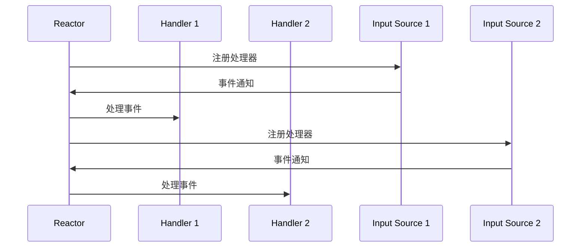

                 

# 响应式编程：处理异步数据流

## 关键词
响应式编程、异步数据流、事件驱动、Reactor模式、Observer模式、事件驱动架构、RxJava、Akka、Spring Reactor、异步数据流处理算法、Web开发、移动开发、未来趋势。

## 摘要
本文深入探讨了响应式编程及其在处理异步数据流中的应用。通过对比传统编程模型，我们了解了响应式编程的优势和基本概念。文章详细介绍了事件驱动编程模型、流式数据处理基础，以及响应式编程的核心概念和框架，如Reactor模式、Observer模式、事件驱动架构。此外，文章还通过实际项目案例展示了响应式编程在Web和移动开发中的实践应用，并对未来趋势进行了展望。通过本文的阅读，读者将能够全面理解响应式编程，掌握处理异步数据流的关键技术。

# 目录大纲

## 第一部分：响应式编程基础

### 1.1 响应式编程概述
#### 1.1.1 响应式编程的定义
#### 1.1.2 响应式编程与传统编程的区别
#### 1.1.3 响应式编程的优势

### 1.2 事件驱动编程模型
#### 1.2.1 事件驱动编程基础
#### 1.2.2 事件循环机制
#### 1.2.3 事件监听和事件分发

### 1.3 流式数据处理基础
#### 1.3.1 流式数据处理的概念
#### 1.3.2 异步数据流的基本原理
#### 1.3.3 数据流与事件流的关系

## 第二部分：响应式编程核心概念

### 2.1 响应式编程框架

#### 2.1.1 Reactor模式
##### 2.1.1.1 Reactor模式概述
##### 2.1.1.2 Reactor模式的核心组件
##### 2.1.1.3 Reactor模式的实现原理

#### 2.1.2 Observer模式
##### 2.1.2.1 Observer模式概述
##### 2.1.2.2 Observer模式的核心组件
##### 2.1.2.3 Observer模式的实现原理

#### 2.1.3 事件驱动架构
##### 2.1.3.1 事件驱动架构概述
##### 2.1.3.2 事件驱动架构的核心组件
##### 2.1.3.3 事件驱动架构的优缺点

## 第三部分：响应式编程实践

### 3.1 响应式编程框架应用

#### 3.1.1 RxJava框架
##### 3.1.1.1 RxJava概述
##### 3.1.1.2 RxJava的核心API
##### 3.1.1.3 RxJava的实际应用案例

#### 3.1.2 Akka框架
##### 3.1.2.1 Akka概述
##### 3.1.2.2 Akka的核心概念
##### 3.1.2.3 Akka的实际应用案例

#### 3.1.3 Spring Reactor框架
##### 3.1.3.1 Spring Reactor概述
##### 3.1.3.2 Spring Reactor的核心功能
##### 3.1.3.3 Spring Reactor的实际应用案例

## 第四部分：异步数据流处理算法

### 4.1 异步数据流处理算法概述

#### 4.1.1 异步数据流处理的基本概念
##### 4.1.1.1 异步数据流处理的基本概念
##### 4.1.1.2 异步数据流处理的挑战

#### 4.1.2 异步数据流处理算法
##### 4.1.2.1 异步数据处理算法概述
##### 4.1.2.2 常见的异步数据处理算法

## 第五部分：项目实战

### 5.1 响应式编程在Web开发中的应用

#### 5.1.1 响应式Web应用的基本原理
##### 5.1.1.1 响应式Web应用的概念
##### 5.1.1.2 响应式Web应用的优势

#### 5.1.2 响应式Web应用开发实践
##### 5.1.2.1 响应式Web应用的开发流程
##### 5.1.2.2 响应式Web应用的核心技术

### 5.2 响应式编程在移动开发中的应用

#### 5.2.1 响应式移动应用的基本原理
##### 5.2.1.1 响应式移动应用的概念
##### 5.2.1.2 响应式移动应用的优势

#### 5.2.2 响应式移动应用开发实践
##### 5.2.2.1 响应式移动应用的开发流程
##### 5.2.2.2 响应式移动应用的核心技术

## 第六部分：响应式编程的未来趋势

### 6.1 响应式编程的新趋势

#### 6.1.1 响应式编程的新框架
##### 6.1.1.1 新框架概述
##### 6.1.1.2 新框架的核心特性

#### 6.1.2 响应式编程与云计算的结合
##### 6.1.2.1 云计算与响应式编程的结合点
##### 6.1.2.2 云计算环境下的响应式编程实践

### 6.2 响应式编程的未来发展

#### 6.2.1 响应式编程的技术挑战
##### 6.2.1.1 技术挑战概述
##### 6.2.1.2 技术挑战的解决方案

#### 6.2.2 响应式编程的发展方向
##### 6.2.2.1 未来发展方向概述
##### 6.2.2.2 未来发展方向的前景分析

## 附录

### 附录 A：响应式编程工具与资源

#### A.1 主流响应式编程框架对比
##### A.1.1 Reactor框架
##### A.1.2 RxJava框架
##### A.1.3 Akka框架

#### A.2 响应式编程相关资源
##### A.2.1 响应式编程学习资料
##### A.2.2 响应式编程社区
##### A.2.3 响应式编程工具推荐

### 附录 B：响应式编程实践项目代码

#### B.1 Web应用项目
##### B.1.1 项目概述
##### B.1.2 项目技术栈
##### B.1.3 项目核心代码解读

#### B.2 移动应用项目
##### B.2.1 项目概述
##### B.2.2 项目技术栈
##### B.2.3 项目核心代码解读

本文将逐步深入探讨响应式编程及其在处理异步数据流中的应用，帮助读者全面理解这一关键技术。接下来，我们将首先介绍响应式编程的基础概念，并对比响应式编程与传统编程的区别，以帮助读者建立对响应式编程的基本认知。

# 第一部分：响应式编程基础

## 1.1 响应式编程概述

### 1.1.1 响应式编程的定义

响应式编程（Reactive Programming）是一种编程范式，它强调数据和事件以异步、不可变的方式传递，并通过数据流的函数式操作进行响应。响应式编程的核心在于“响应”二字，即系统对外部事件的变化做出快速而恰当的响应。

在传统的命令式编程中，程序按照预定的顺序逐步执行，而响应式编程则更加注重数据流和事件流的管理。它允许程序在事件发生时异步地处理数据，从而提高系统的响应速度和可扩展性。

### 1.1.2 响应式编程与传统编程的区别

传统的编程模型主要基于命令式编程范式，程序通过一系列的指令逐步执行，关注的是程序的顺序性和控制流。而响应式编程则更多地关注数据流和事件流，采用声明式编程范式，允许程序员通过声明式的代码来表达程序的响应行为。

以下是一些主要的区别：

- **编程范式**：传统编程是命令式的，而响应式编程是声明式的。
- **数据流管理**：传统编程通常在数据到达后再进行处理，而响应式编程在数据生成时就进行处理。
- **异步处理**：传统编程通常在同步环境中处理数据，而响应式编程则更侧重于异步处理，通过事件和回调机制来处理并发操作。
- **可扩展性**：响应式编程通过事件驱动的方式提高了系统的可扩展性，能够更好地处理高并发场景。

### 1.1.3 响应式编程的优势

响应式编程具有以下优势：

- **异步处理**：响应式编程能够有效地处理异步操作，提高系统的响应速度和效率。
- **可扩展性**：通过事件驱动的方式，响应式编程能够更好地处理并发请求，提高系统的可扩展性。
- **错误处理**：响应式编程提供了更完善的错误处理机制，如异常捕获和重试机制，使得系统更稳定。
- **模块化**：响应式编程鼓励使用函数式编程和模块化设计，提高了代码的可维护性和复用性。
- **简化复杂性**：通过声明式编程范式，响应式编程能够简化代码复杂度，使程序更加直观和易于理解。

## 1.2 事件驱动编程模型

### 1.2.1 事件驱动编程基础

事件驱动编程（Event-Driven Programming）是一种编程模型，它基于事件的发生和响应。在事件驱动编程中，程序不是按照预定的顺序执行，而是根据事件的发生来触发相应的处理函数。

以下是一个基本的事件驱动编程模型：

1. **事件监听**：程序定义一个或多个事件监听器，用于监听特定类型的事件。
2. **事件触发**：当特定事件发生时，系统会触发对应的事件监听器。
3. **事件处理**：事件监听器接收到事件后，执行相应的处理逻辑。

### 1.2.2 事件循环机制

事件循环（Event Loop）是事件驱动编程模型的核心组成部分。事件循环负责接收和处理事件，并按照一定的顺序执行相应的处理函数。

以下是一个基本的事件循环机制：

1. **事件队列**：事件循环包含一个事件队列，用于存储待处理的事件。
2. **事件调度**：事件循环从事件队列中取出事件，并按照优先级或时间顺序进行调度。
3. **事件处理**：事件调度后，执行对应的事件处理函数。
4. **循环**：事件循环不断地从事件队列中取出事件并处理，直到事件队列为空或程序退出。

### 1.2.3 事件监听和事件分发

事件监听（Event Listening）是指程序定义一个监听器，用于监听特定类型的事件。事件分发（Event Dispatching）是指系统根据事件的类型，将事件传递给相应的监听器进行处理。

以下是一个基本的事件监听和事件分发模型：

1. **事件注册**：程序注册一个或多个事件监听器，指定监听的事件类型。
2. **事件传递**：当特定事件发生时，系统将事件传递给所有注册的事件监听器。
3. **事件处理**：事件监听器接收到事件后，执行相应的处理逻辑。
4. **事件销毁**：事件处理完成后，如果需要，可以将事件监听器从系统中删除。

## 1.3 流式数据处理基础

### 1.3.1 流式数据处理的概念

流式数据处理（Stream Processing）是一种数据处理范式，它强调对实时数据流进行处理和分析。流式数据处理适用于需要实时响应的场景，如实时数据分析、实时监控、实时推荐等。

流式数据处理的基本概念包括：

- **数据流**：流式数据处理的核心是数据流，它是一系列连续的数据元素。
- **实时性**：流式数据处理强调实时性，即能够在数据生成时快速处理。
- **处理模型**：流式数据处理通常采用事件驱动模型，通过事件监听和事件处理来处理数据流。

### 1.3.2 异步数据流的基本原理

异步数据流（Asynchronous Data Stream）是一种数据传输方式，它允许数据在不同的时间点产生和消费。异步数据流的基本原理包括：

- **异步通信**：异步数据流基于异步通信机制，数据生成者和消费者之间不需要保持同步。
- **事件通知**：当数据生成时，系统会通过事件通知机制，将数据传递给消费者。
- **缓冲区**：异步数据流通常使用缓冲区来存储临时数据，以便在消费者准备好时进行处理。

### 1.3.3 数据流与事件流的关系

数据流和事件流在流式数据处理中起着重要作用。数据流是指一系列连续的数据元素，而事件流是指一系列的事件序列。

数据流与事件流的关系如下：

- **数据流是事件流的基础**：数据流是事件流产生的前提，数据流中的数据元素触发事件流中的事件。
- **事件流是数据流的响应**：事件流是对数据流中数据元素的处理和响应，如数据过滤、聚合、转换等。

通过以上基础概念的介绍，我们对响应式编程及其在处理异步数据流中的应用有了初步的了解。接下来，我们将进一步深入探讨响应式编程的核心概念和框架。

## 第二部分：响应式编程核心概念

响应式编程的核心概念是其框架和模式。这些框架和模式为处理异步数据流提供了系统化的方法。在本部分，我们将详细探讨Reactor模式、Observer模式以及事件驱动架构，并理解它们如何协同工作以实现高效的异步编程。

### 2.1.1 Reactor模式

#### 2.1.1.1 Reactor模式概述

Reactor模式是一种非阻塞的异步编程模型，广泛应用于高性能的网络编程中。该模式的核心思想是使用一个单线程的循环（通常称为Reactor）来处理多个输入源的事件。Reactor模式通常由三个主要组件构成：

- **Reactor**：Reactor是一个单线程的循环，用于接收和处理输入源的事件。Reactor会根据事件类型调用相应的处理器。
- **Handler**：Handler是事件处理器，用于处理特定类型的事件。每个输入源都可以注册一个或多个处理器。
- **输入源**：输入源是数据的来源，可以是网络连接、文件系统事件、定时器等。每个输入源都可以向Reactor注册一个处理器，以便在事件发生时进行处理。

以下是一个简化的Reactor模式的Mermaid流程图：



#### 2.1.1.2 Reactor模式的核心组件

- **Reactor**：Reactor负责接收和处理输入源的事件。它可以是一个线程，也可以是一个线程池，用于并发处理多个输入源的事件。Reactor的核心功能包括：
  - **事件接收**：接收来自输入源的事件。
  - **事件分发**：根据事件的类型，将事件分发给对应的处理器。
  - **事件处理**：调用处理器的处理函数。

- **Handler**：Handler是事件处理器，负责处理特定类型的事件。Handler通常是一个函数或对象，用于接收和响应事件。其核心功能包括：
  - **事件接收**：接收事件。
  - **事件处理**：执行事件处理逻辑。

- **输入源**：输入源是事件的来源，可以是网络连接、文件系统事件、定时器等。输入源的核心功能包括：
  - **事件生成**：生成事件。
  - **事件通知**：将事件通知给Reactor。

#### 2.1.1.3 Reactor模式的实现原理

Reactor模式的实现原理可以分为以下几个步骤：

1. **初始化**：创建Reactor、Handler和输入源。
2. **注册处理器**：将Handler注册到Reactor和输入源。
3. **事件接收**：Reactor从输入源接收事件。
4. **事件分发**：Reactor根据事件类型，将事件分发给对应的Handler。
5. **事件处理**：Handler执行事件处理逻辑。

以下是一个伪代码示例，展示了Reactor模式的实现：

```java
class Reactor {
    private Handler[] handlers;
    private ExecutorService executor;

    public Reactor(Handler[] handlers) {
        this.handlers = handlers;
        this.executor = Executors.newSingleThreadExecutor();
    }

    public void start() {
        executor.execute(() -> {
            while (true) {
                Event event = inputSource.poll();
                if (event != null) {
                    handlers[event.getType()].handle(event);
                }
            }
        });
    }
}

class Handler {
    public void handle(Event event) {
        // 处理事件逻辑
    }
}

class InputSource {
    public Event poll() {
        // 生成并返回事件
    }
}

class Event {
    private EventType type;

    public Event(EventType type) {
        this.type = type;
    }

    public EventType getType() {
        return type;
    }
}
```

### 2.1.2 Observer模式

#### 2.1.2.1 Observer模式概述

Observer模式是一种行为设计模式，用于实现一个一对多的依赖关系，当一个对象的状态发生变化时，其所有依赖者都会得到通知并自动更新。在响应式编程中，Observer模式被广泛用于处理数据流和事件流。

Observer模式包含以下主要组件：

- **Subject**：Subject是被观察者，它维护一组观察者，并在状态变化时通知它们。
- **Observer**：Observer是观察者，它订阅了Subject的状态变化，并在状态变化时接收通知。
- **ObserverList**：ObserverList是观察者列表，用于存储所有的观察者。

以下是一个简化的Observer模式的Mermaid流程图：

```mermaid
classDiagram
    Subject <<Class>> "被观察者"
    Observer <<Class>> "观察者"
    ObserverList <<Class>> "观察者列表"

    Subject --> ObserverList
    ObserverList --> Observer

    Subject <<createObserverList>>
    ObserverList <<addObserver Observer>>
    ObserverList <<removeObserver Observer>>

    Observer <<update Subject>>
```

#### 2.1.2.2 Observer模式的核心组件

- **Subject**：Subject是被观察者，它包含一个观察者列表，用于存储所有订阅了它的观察者。Subject的主要功能包括：
  - **状态管理**：Subject维护一个内部状态，并在状态变化时通知观察者。
  - **观察者管理**：Subject提供添加和移除观察者的方法。

- **Observer**：Observer是观察者，它订阅了Subject的状态变化，并在状态变化时接收通知。Observer的主要功能包括：
  - **状态更新**：Observer接收Subject的状态更新通知，并执行相应的更新逻辑。

- **ObserverList**：ObserverList是观察者列表，用于存储所有的观察者。ObserverList的主要功能包括：
  - **添加观察者**：将观察者添加到列表中。
  - **移除观察者**：从列表中移除观察者。
  - **通知观察者**：遍历列表，通知所有的观察者。

#### 2.1.2.3 Observer模式的实现原理

Observer模式的实现原理可以分为以下几个步骤：

1. **初始化**：创建Subject和Observer。
2. **订阅**：Observer订阅Subject，成为Subject的观察者。
3. **状态变化**：Subject的状态发生变化。
4. **通知观察者**：Subject通知所有的观察者状态变化。
5. **更新**：Observer根据通知执行相应的更新逻辑。

以下是一个伪代码示例，展示了Observer模式的实现：

```java
class Subject {
    private ObserverList observers;
    private State state;

    public Subject() {
        this.observers = new ObserverList();
        this.state = new State();
    }

    public void addObserver(Observer observer) {
        observers.addObserver(observer);
    }

    public void removeObserver(Observer observer) {
        observers.removeObserver(observer);
    }

    public void setState(State state) {
        this.state = state;
        notifyObservers();
    }

    private void notifyObservers() {
        for (Observer observer : observers) {
            observer.update(this);
        }
    }
}

class Observer {
    public void update(Subject subject) {
        // 根据Subject的状态执行更新逻辑
    }
}

class ObserverList {
    private List<Observer> observers;

    public ObserverList() {
        this.observers = new ArrayList<>();
    }

    public void addObserver(Observer observer) {
        observers.add(observer);
    }

    public void removeObserver(Observer observer) {
        observers.remove(observer);
    }
}

class State {
    // 状态属性
}
```

### 2.1.3 事件驱动架构

#### 2.1.3.1 事件驱动架构概述

事件驱动架构（Event-Driven Architecture，EDA）是一种软件架构模式，它基于事件驱动编程模型，强调通过事件来驱动应用程序的行为。事件驱动架构通常由以下几个主要组件构成：

- **事件源**：事件源是事件的生产者，可以生成各种类型的事件。
- **事件处理**：事件处理是处理事件的核心部分，包括事件监听、事件调度和事件处理。
- **事件存储**：事件存储用于存储和处理过的事件，以便进行后续分析和审计。
- **事件消费者**：事件消费者是事件的消费者，它可以订阅特定类型的事件，并在事件发生时进行响应。

以下是一个简化的事件驱动架构的Mermaid流程图：

```mermaid
classDiagram
    EventSource <<Class>> "事件源"
    EventProcessor <<Class>> "事件处理"
    EventStore <<Class>> "事件存储"
    EventConsumer <<Class>> "事件消费者"

    EventSource --> EventProcessor
    EventProcessor --> EventStore
    EventConsumer --> EventProcessor

    EventSource <<generateEvent Event>>
    EventProcessor <<processEvent Event>>
    EventStore <<storeEvent Event>>
    EventConsumer <<consumeEvent Event>>
```

#### 2.1.3.2 事件驱动架构的核心组件

- **事件源**：事件源是事件的生产者，它可以生成各种类型的事件。事件源的主要功能包括：
  - **事件生成**：生成不同类型的事件。
  - **事件发布**：将事件发布到事件处理系统。

- **事件处理**：事件处理是处理事件的核心部分，它包括事件监听、事件调度和事件处理。事件处理的主要功能包括：
  - **事件监听**：监听特定类型的事件。
  - **事件调度**：根据事件类型和优先级，调度事件进行处理。
  - **事件处理**：处理事件并触发相应的响应。

- **事件存储**：事件存储用于存储和处理过的事件，以便进行后续分析和审计。事件存储的主要功能包括：
  - **事件存储**：将事件存储在数据库或文件系统中。
  - **事件检索**：检索特定的事件进行审计和分析。

- **事件消费者**：事件消费者是事件的消费者，它可以订阅特定类型的事件，并在事件发生时进行响应。事件消费者的主要功能包括：
  - **事件订阅**：订阅特定类型的事件。
  - **事件响应**：在接收到事件时，执行相应的响应逻辑。

#### 2.1.3.3 事件驱动架构的优缺点

**优点**：

- **高可扩展性**：事件驱动架构通过事件来驱动应用程序的行为，可以方便地添加新的组件和事件，提高系统的可扩展性。
- **松耦合**：事件驱动架构中的组件之间通过事件进行通信，组件之间解耦，提高了系统的灵活性和可维护性。
- **高响应性**：事件驱动架构可以快速响应事件，提高系统的响应速度。
- **易测试**：事件驱动架构使得组件的测试更加简单和独立，可以分别测试事件源、事件处理和事件消费者。

**缺点**：

- **复杂度高**：事件驱动架构引入了复杂的事件处理逻辑，需要精心设计和维护。
- **性能开销**：事件驱动架构可能引入一定的性能开销，特别是在高并发场景下。
- **调试难度**：事件驱动架构中的事件处理逻辑复杂，调试可能相对困难。

通过以上对Reactor模式、Observer模式和事件驱动架构的探讨，我们可以看到响应式编程的核心概念是如何协同工作，以实现高效异步编程的。在下一部分中，我们将进一步探讨响应式编程的框架和应用。

## 第三部分：响应式编程实践

响应式编程的应用不仅限于理论探讨，更在于实际项目的开发。本部分将介绍几个主流的响应式编程框架，包括RxJava、Akka和Spring Reactor，并展示它们在现实世界中的应用。

### 3.1.1 RxJava框架

#### 3.1.1.1 RxJava概述

RxJava是由ReactiveX项目开发的响应式编程库，主要用于Java虚拟机（JVM）环境中。它提供了异步编程的强大功能，使得开发者能够以声明式的方式处理异步数据流。RxJava的核心特性包括：

- **异步操作**：RxJava支持异步操作，允许开发者以非阻塞的方式处理数据流。
- **可组合性**：通过操作符（Operator），RxJava提供了丰富的函数式接口，使得开发者可以轻松地组合和转换数据流。
- **背压处理**：RxJava提供了背压（Backpressure）处理机制，用于应对数据流速度过快的情况，避免系统过载。

#### 3.1.1.2 RxJava的核心API

RxJava的核心API包括以下几个主要组件：

- **Observable**：Observable是一个被观察者，用于生成和分发数据流。
- **Observer**：Observer是一个观察者，用于接收Observable发出的数据并执行相应的处理逻辑。
- **操作符**：操作符（Operator）用于对数据流进行各种操作，如过滤、映射、合并等。
- **Scheduler**：Scheduler用于指定数据流的执行线程，以实现异步操作。

#### 3.1.1.3 RxJava的实际应用案例

以下是一个简单的RxJava示例，展示了如何使用RxJava处理异步数据流：

```java
import rx.Observable;
import rx.Observer;
import rx.schedulers.Schedulers;

public class RxJavaExample {
    public static void main(String[] args) {
        Observable.just("Hello", "World")
                .subscribeOn(Schedulers.io())
                .map(s -> s.toUpperCase())
                .subscribe(new Observer<String>() {
                    @Override
                    public void onCompleted() {
                        System.out.println("Completed");
                    }

                    @Override
                    public void onError(Throwable e) {
                        e.printStackTrace();
                    }

                    @Override
                    public void onNext(String s) {
                        System.out.println(s);
                    }
                });
    }
}
```

在这个示例中，我们创建了一个`Observable`，它发出两个字符串“Hello”和“World”。通过使用`map`操作符，我们将这两个字符串转换为大写形式。最后，我们使用`subscribe`方法订阅这个`Observable`，并定义了`Observer`的回调方法来处理数据。

### 3.1.2 Akka框架

#### 3.1.2.1 Akka概述

Akka是一个用于构建高并发、分布式和容错的Actor模型的框架。它提供了一个无锁的、基于消息传递的编程模型，使得开发者能够以响应式的方式处理并发和分布式系统。Akka的核心特性包括：

- **Actor模型**：Akka基于Actor模型，每个Actor都是一个独立的计算单元，与其他Actor通过异步消息进行通信。
- **分布式计算**：Akka支持分布式计算，允许Actor在多个节点之间迁移和通信。
- **容错性**：Akka提供了内置的容错机制，包括Actor故障检测、重启和集群状态保持。

#### 3.1.2.2 Akka的核心概念

Akka的核心概念包括以下几个主要部分：

- **Actor**：Actor是Akka的基本计算单元，具有独立的线程和内存空间，通过异步消息进行通信。
- **Actor系统**：Actor系统是运行Actor的容器，它负责Actor的生命周期管理和消息传递。
- **消息传递**：消息传递是Actor之间通信的主要方式，通过发送和接收消息来实现协作。
- **集群**：Akka支持集群模式，允许多个节点组成一个集群，共同运行Actor。

#### 3.1.2.3 Akka的实际应用案例

以下是一个简单的Akka示例，展示了如何使用Akka处理并发任务：

```scala
import akka.actor.Actor
import akka.actor.ActorSystem
import akka.actor.Props

class GreetingActor extends Actor {
  def receive = {
    case "Hello" => sender ! "World"
    case _ => sender ! "Unknown command"
  }
}

object AkkaExample extends App {
  val system = ActorSystem("GreetingSystem")
  val greetingActor = system.actorOf(Props[GreetingActor], "greetingActor")

  greetingActor ! "Hello"
  greetingActor ! "Unknown"

  system.shutdown()
}
```

在这个示例中，我们创建了一个名为`GreetingActor`的Actor，它接收“Hello”消息并返回“World”，其他消息则返回“Unknown”。通过使用`ActorSystem`，我们创建了一个Actor系统，并在其中创建了`GreetingActor`实例。最后，我们向`GreetingActor`发送了两个消息，展示了其响应行为。

### 3.1.3 Spring Reactor框架

#### 3.1.3.1 Spring Reactor概述

Spring Reactor是基于Reactor项目的响应式编程库，它为Spring生态系统带来了响应式编程的支持。Spring Reactor提供了异步编程、数据流处理和函数式编程等特性，使得Spring开发者能够构建高性能、可扩展的响应式应用程序。Spring Reactor的核心特性包括：

- **响应式编程**：Spring Reactor支持响应式编程，允许开发者使用声明式代码处理异步数据流。
- **集成Spring**：Spring Reactor与Spring框架无缝集成，提供了Spring生态系统中的响应式编程支持。
- **函数式编程**：Spring Reactor提供了函数式编程接口，使得开发者可以更简洁地处理数据流。

#### 3.1.3.2 Spring Reactor的核心功能

Spring Reactor的核心功能包括以下几个部分：

- **响应式Web**：Spring Reactor提供了响应式Web支持，使得Spring MVC应用程序能够处理异步请求。
- **数据流处理**：Spring Reactor提供了数据流处理功能，使得开发者可以轻松处理异步数据流。
- **函数式编程**：Spring Reactor提供了函数式编程接口，使得开发者可以使用函数式编程范式处理数据流。

#### 3.1.3.3 Spring Reactor的实际应用案例

以下是一个简单的Spring Reactor示例，展示了如何使用Spring Reactor处理异步请求：

```java
import org.springframework.web.bind.annotation.GetMapping;
import org.springframework.web.bind.annotation.RestController;
import reactor.core.publisher.Flux;
import reactor.core.publisher.Mono;

@RestController
public class HelloController {

    @GetMapping("/hello")
    public Mono<String> hello() {
        return Mono.just("Hello, World!");
    }

    @GetMapping("/flights")
    public Flux<String> flights() {
        return Flux.just("Air France", "Lufthansa", "British Airways");
    }
}
```

在这个示例中，我们创建了一个名为`HelloController`的REST控制器，它使用了Spring Reactor的响应式编程特性。`hello`方法返回了一个`Mono`，表示异步获取一个字符串。`flights`方法返回了一个`Flux`，表示异步获取一系列字符串。

通过以上对RxJava、Akka和Spring Reactor的介绍，我们可以看到响应式编程框架在实际项目中的应用。这些框架提供了丰富的功能和工具，使得开发者能够更高效地处理异步数据流，构建高性能、可扩展的应用程序。

## 第四部分：异步数据流处理算法

异步数据流处理是响应式编程的核心内容之一，它涉及对大量并发数据流的实时处理和分析。在本部分，我们将深入探讨异步数据流处理算法的基本概念、挑战和常见算法。

### 4.1.1 异步数据流处理的基本概念

异步数据流处理是指对非顺序、非阻塞的数据流进行实时处理和分析的过程。这种数据流通常来自于多个并发数据源，如网络连接、传感器数据、日志文件等。异步数据流处理的关键在于：

- **非顺序性**：数据元素不必按照生成顺序处理，可以并行处理。
- **非阻塞性**：处理过程不会阻塞，数据可以持续流入并被处理。

异步数据流处理通常包括以下几个步骤：

1. **数据采集**：从不同的数据源收集数据。
2. **数据传输**：将采集到的数据传输到处理系统。
3. **数据预处理**：对数据进行清洗、转换等预处理。
4. **数据存储**：将处理后的数据存储到数据库或文件系统。
5. **数据分析**：对存储的数据进行实时分析，生成报告或触发事件。

### 4.1.2 异步数据流处理的挑战

异步数据流处理面临着多个挑战，主要包括：

- **数据一致性**：在分布式环境中，数据的一致性问题尤为重要。如何保证数据在多个处理节点之间的一致性是一个重要挑战。
- **数据吞吐量**：异步数据流处理系统需要处理大量的并发数据流，如何高效地处理高吞吐量的数据流是一个关键问题。
- **系统可用性**：系统需要具备高可用性，即使个别节点出现故障，整个系统也能继续运行。
- **错误处理**：在数据流处理过程中，可能会出现数据错误或系统错误，如何有效地处理这些错误也是一个挑战。
- **延迟和吞吐量平衡**：在处理大量数据时，如何平衡延迟和吞吐量是一个复杂的问题。

### 4.1.3 异步数据流处理算法

异步数据流处理算法是用于处理和分析异步数据流的算法集合。以下是一些常见的异步数据流处理算法：

#### 4.1.3.1 聚合算法

聚合算法用于对大量数据流进行聚合和汇总。常见的聚合操作包括求和、计数、平均值等。聚合算法的核心思想是将多个数据元素合并成一个整体，以便进行更高级别的分析。

以下是一个简单的伪代码示例，展示了聚合算法的基本原理：

```plaintext
Input: 数据流 {element1, element2, ..., elementN}
Output: 聚合结果 {sum, count, average}

sum = 0
count = 0

for each element in 数据流 do
    sum = sum + element
    count = count + 1

average = sum / count
return {sum, count, average}
```

#### 4.1.3.2 过滤算法

过滤算法用于筛选出满足特定条件的数据元素。过滤算法通常通过设置条件表达式来筛选数据流中的数据。

以下是一个简单的伪代码示例，展示了过滤算法的基本原理：

```plaintext
Input: 数据流 {element1, element2, ..., elementN}
条件表达式: element > threshold
Output: 过滤结果 {filteredElements}

filteredElements = []

for each element in 数据流 do
    if (条件表达式) then
        filteredElements.add(element)

return filteredElements
```

#### 4.1.3.3 联合算法

联合算法用于将多个数据流合并成一个数据流。联合算法通常需要对数据流进行去重、排序等操作，以便生成一个新的有序数据流。

以下是一个简单的伪代码示例，展示了联合算法的基本原理：

```plaintext
Input: 数据流1 {element1, element2, ..., elementN}
数据流2 {elementA, elementB, ..., elementZ}
Output: 联合结果 {combinedElements}

combinedElements = []

for each element in 数据流1 do
    combinedElements.add(element)

for each element in 数据流2 do
    combinedElements.add(element)

return combinedElements
```

#### 4.1.3.4 聚合-过滤算法

聚合-过滤算法是将聚合和过滤两种操作结合在一起，首先对数据流进行聚合操作，然后对聚合结果进行过滤操作。

以下是一个简单的伪代码示例，展示了聚合-过滤算法的基本原理：

```plaintext
Input: 数据流 {element1, element2, ..., elementN}
聚合操作: sum
过滤条件: sum > threshold
Output: 过滤结果 {filteredElements}

sum = 0

for each element in 数据流 do
    sum = sum + element

if (sum > threshold) then
    filteredElements = []

    for each element in 数据流 do
        if (element > threshold) then
            filteredElements.add(element)

return filteredElements
```

通过以上对异步数据流处理算法的基本概念、挑战和常见算法的探讨，我们可以看到异步数据流处理在响应式编程中的重要性。在下一部分中，我们将通过实际项目实战，进一步展示异步数据流处理的应用和实践。

### 5.1 响应式编程在Web开发中的应用

响应式编程在Web开发中的应用越来越广泛，特别是在处理异步请求和高并发场景中，具有显著的优势。响应式Web应用（Reactive Web Applications）通过采用响应式编程模型，可以提供更好的用户体验和更高的系统性能。本部分将介绍响应式Web应用的基本原理及其开发实践。

#### 5.1.1 响应式Web应用的基本原理

响应式Web应用的基本原理是通过响应式编程模型来处理用户请求和数据流。传统的Web应用通常采用同步模型，即客户端发送请求，服务器处理请求并返回响应，整个过程是线性的。而响应式Web应用则采用事件驱动和异步模型，核心特点如下：

- **非阻塞I/O**：响应式Web应用使用非阻塞I/O，允许服务器在处理请求时同时处理其他请求，提高系统的并发能力和性能。
- **异步处理**：响应式Web应用通过异步处理请求，避免了长时间的同步等待，减少了资源的占用。
- **事件驱动**：响应式Web应用通过事件驱动模型，以事件为中心来组织代码，使得应用能够及时响应外部事件，提高系统的灵活性和可扩展性。
- **函数式编程**：响应式Web应用通常采用函数式编程范式，使用不可变数据和纯函数，提高了代码的可靠性和可维护性。

#### 5.1.2 响应式Web应用的优势

响应式Web应用相比传统的Web应用具有以下优势：

- **更好的用户体验**：响应式Web应用能够快速响应用户操作，提供流畅的交互体验。
- **更高的并发处理能力**：响应式Web应用通过非阻塞I/O和异步处理，能够同时处理更多的请求，提高系统的并发处理能力。
- **更好的可扩展性**：响应式Web应用采用事件驱动和模块化设计，便于扩展和重构。
- **更好的错误处理**：响应式Web应用通常具有更完善的错误处理机制，能够更好地处理异常情况。
- **更低的资源消耗**：响应式Web应用通过异步处理和事件驱动，减少了不必要的同步等待，降低了系统的资源消耗。

#### 5.1.3 响应式Web应用开发实践

以下是响应式Web应用开发的基本实践步骤：

1. **选择响应式框架**：选择适合项目的响应式Web框架，如Spring WebFlux、Spring Boot + WebFlux、Play Framework等。
2. **设计响应式架构**：设计响应式Web应用的架构，包括前端、后端和服务端组件，确保系统能够高效地处理并发请求。
3. **实现异步处理**：使用响应式编程模型实现异步处理，如使用`Mono`、`Flux`等响应式对象来处理请求和数据流。
4. **处理事件驱动**：设计事件驱动模型，实现事件监听和处理，确保系统能够及时响应外部事件。
5. **优化性能**：通过优化代码、使用缓存和异步I/O等技术，提高系统的性能和响应速度。
6. **测试和调试**：对响应式Web应用进行全面的测试和调试，确保系统的稳定性和可靠性。

#### 5.1.4 响应式Web应用的核心技术

响应式Web应用的核心技术包括：

- **反应式编程模型**：使用反应式编程模型处理请求和数据流，包括异步处理、事件驱动和函数式编程。
- **非阻塞I/O**：使用非阻塞I/O模型，提高系统的并发能力和响应速度。
- **反应式框架**：使用反应式Web框架，如Spring WebFlux，简化开发过程并提供丰富的功能支持。
- **数据流处理**：使用数据流处理库，如Akka Streams或RxJava，实现复杂的数据流处理逻辑。
- **前后端分离**：采用前后端分离架构，提高系统的可扩展性和维护性。

通过以上实践，开发者可以构建高效的响应式Web应用，提高用户体验和系统性能。

#### 5.1.5 响应式Web应用开发案例

以下是一个简单的响应式Web应用开发案例，展示了如何使用Spring WebFlux框架构建响应式Web应用。

**案例概述**：该案例将创建一个简单的RESTful Web服务，用于处理用户注册和登录请求。应用将使用Spring WebFlux框架实现响应式处理，并采用Vue.js作为前端框架。

**技术栈**：

- **后端**：Spring WebFlux、Spring Boot、MySQL、JWT（JSON Web Token）
- **前端**：Vue.js、Vue Router、Axios

**步骤**：

1. **创建Spring Boot项目**：
   - 使用Spring Initializr创建一个Spring Boot项目，选择Spring WebFlux和MySQL依赖。

2. **配置数据库**：
   - 在`application.properties`文件中配置MySQL数据库连接信息。

3. **定义用户实体类**：
   ```java
   @Entity
   public class User {
       @Id
       @GeneratedValue(strategy = GenerationType.IDENTITY)
       private Long id;

       @Column(nullable = false, unique = true)
       private String username;

       @Column(nullable = false)
       private String password;

       // getters and setters
   }
   ```

4. **创建用户服务**：
   - 创建一个用户服务类，用于处理用户注册和登录逻辑。
   ```java
   @Service
   public class UserService {
       private final UserRepository userRepository;

       @Autowired
       public UserService(UserRepository userRepository) {
           this.userRepository = userRepository;
       }

       public Mono<User> registerUser(User user) {
           return userRepository.save(user);
       }

       public Mono<User> findByUsername(String username) {
           return userRepository.findByUsername(username);
       }

       public Mono<String> login(String username, String password) {
           return findByUsername(username)
                   .filter(user -> user.getPassword().equals(password))
                   .map(User::getId)
                   .map(String::valueOf);
       }
   }
   ```

5. **创建用户控制器**：
   - 创建一个用户控制器类，用于处理HTTP请求。
   ```java
   @RestController
   @RequestMapping("/api")
   public class UserController {
       private final UserService userService;

       @Autowired
       public UserController(UserService userService) {
           this.userService = userService;
       }

       @PostMapping("/register")
       public Mono<User> registerUser(@RequestBody User user) {
           return userService.registerUser(user);
       }

       @PostMapping("/login")
       public Mono<String> login(@RequestParam String username, @RequestParam String password) {
           return userService.login(username, password);
       }
   }
   ```

6. **配置路由**：
   - 在`WebFluxConfig`类中配置路由，将请求映射到相应的控制器。
   ```java
   @Configuration
   @EnableWebFlux
   public class WebFluxConfig {
       @Bean
       public RouterFunction<ServerResponse> routerFunction(UserController userController) {
           return route(
                   POST("/api/register").and(accept(APPLICATION_JSON)).to(userController::registerUser),
                   POST("/api/login").and(accept(APPLICATION_JSON)).to(userController::login));
       }
   }
   ```

7. **前端开发**：
   - 使用Vue.js创建前端页面，通过Axios与后端进行数据交互。
   - 创建注册和登录组件，分别处理用户注册和登录逻辑。

8. **测试和部署**：
   - 对应用进行测试，确保功能正常。
   - 部署应用，运行在Tomcat或Jetty等Web服务器中。

通过这个案例，我们展示了如何使用Spring WebFlux框架构建一个简单的响应式Web应用，实现了用户注册和登录功能。这个案例不仅展示了响应式编程的核心技术和应用场景，也为开发者提供了一个实际的开发实践参考。

### 5.2 响应式编程在移动开发中的应用

响应式编程在移动开发中的应用同样具有重要意义，尤其是在处理用户交互和实时数据更新方面。响应式编程能够帮助开发者构建更流畅、更互动的移动应用。本部分将探讨响应式编程在移动开发中的基本原理及其开发实践。

#### 5.2.1 响应式移动应用的基本原理

响应式移动应用（Reactive Mobile Applications）采用响应式编程模型，以用户交互和数据流为中心，提供实时响应和高效处理。响应式移动应用的基本原理包括：

- **响应式布局**：响应式移动应用能够根据不同的设备和屏幕尺寸自动调整布局，提供一致的用户体验。
- **异步数据加载**：响应式移动应用通过异步加载数据，减少等待时间，提高应用的流畅性。
- **事件驱动**：响应式移动应用采用事件驱动模型，及时响应用户操作和外部事件，提供即时反馈。
- **状态管理**：响应式移动应用通过状态管理库（如Redux、Vuex等）管理应用状态，确保状态的一致性和可预测性。
- **函数式编程**：响应式移动应用采用函数式编程范式，使用不可变数据和纯函数，提高代码的可靠性和可维护性。

#### 5.2.2 响应式移动应用的优势

响应式移动应用相比传统的移动应用具有以下优势：

- **更好的用户体验**：响应式移动应用能够快速响应用户操作，提供流畅的交互体验。
- **更高的并发处理能力**：响应式移动应用通过异步加载和数据流处理，能够同时处理更多的用户请求，提高应用的并发处理能力。
- **更好的可扩展性**：响应式移动应用采用模块化和事件驱动设计，便于扩展和重构。
- **更好的错误处理**：响应式移动应用通常具有更完善的错误处理机制，能够更好地处理异常情况。
- **更低的资源消耗**：响应式移动应用通过异步处理和事件驱动，减少了不必要的同步等待，降低了系统的资源消耗。

#### 5.2.3 响应式移动应用开发实践

以下是响应式移动应用开发的基本实践步骤：

1. **选择响应式框架**：选择适合项目的响应式移动框架，如React Native、Flutter、Vue.js（移动端）等。
2. **设计响应式架构**：设计响应式移动应用的架构，包括前端、后端和服务端组件，确保系统能够高效地处理并发请求。
3. **实现异步处理**：使用响应式编程模型实现异步处理，如使用异步函数、数据流库（如RxJS、Akka Streams等）等。
4. **处理事件驱动**：设计事件驱动模型，实现事件监听和处理，确保应用能够及时响应外部事件。
5. **优化性能**：通过优化代码、使用缓存和异步I/O等技术，提高应用的性能和响应速度。
6. **测试和调试**：对响应式移动应用进行全面的测试和调试，确保应用的稳定性和可靠性。

#### 5.2.4 响应式移动应用的核心技术

响应式移动应用的核心技术包括：

- **响应式布局**：使用响应式布局库，如React Native的`StyleSheet.create`、Flutter的`Flexbox`等，实现自适应布局。
- **异步数据加载**：使用异步数据加载库，如React Native的`fetch`、Flutter的`http`等，实现异步加载数据。
- **状态管理**：使用状态管理库，如React Native的`Redux`、Flutter的`Vuex`等，管理应用状态。
- **数据流处理**：使用数据流处理库，如React Native的`React Native RX`、Flutter的`RxJava`等，实现复杂的数据流处理逻辑。
- **前后端分离**：采用前后端分离架构，提高系统的可扩展性和维护性。

#### 5.2.5 响应式移动应用开发案例

以下是一个简单的响应式移动应用开发案例，展示了如何使用React Native框架构建响应式移动应用。

**案例概述**：该案例将创建一个简单的待办事项应用，用户可以添加、删除和标记待办事项。应用将使用React Native框架实现响应式处理，并采用Redux进行状态管理。

**技术栈**：

- **前端**：React Native、Redux、React Native Paper
- **后端**：Node.js、Express、MongoDB

**步骤**：

1. **创建React Native项目**：
   - 使用`npx react-native init`命令创建一个新的React Native项目。

2. **安装依赖**：
   - 安装Redux和React Native Paper依赖。
   ```bash
   npm install redux react-redux
   npm install --save react-native-paper
   ```

3. **配置Redux**：
   - 创建Redux的store、action和reducer。
   ```javascript
   // store.js
   import { createStore } from 'redux';
   import rootReducer from './reducers';

   export default function configureStore() {
       const store = createStore(rootReducer);
       return store;
   }

   // actions.js
   export const addTask = (task) => {
       return { type: 'ADD_TASK', task };
   };

   export const removeTask = (taskId) => {
       return { type: 'REMOVE_TASK', taskId };
   };

   export const toggleTask = (taskId) => {
       return { type: 'TOGGLE_TASK', taskId };
   };

   // reducers.js
   import { ADD_TASK, REMOVE_TASK, TOGGLE_TASK } from './actions';

   const initialState = {
       tasks: [],
   };

   function rootReducer(state = initialState, action) {
       switch (action.type) {
           case ADD_TASK:
               return {
                   ...state,
                   tasks: [...state.tasks, action.task],
               };
           case REMOVE_TASK:
               return {
                   ...state,
                   tasks: state.tasks.filter((task) => task.id !== action.taskId),
               };
           case TOGGLE_TASK:
               return {
                   ...state,
                   tasks: state.tasks.map((task) =>
                       task.id === action.taskId ? { ...task, completed: !task.completed } : task
                   ),
               };
           default:
               return state;
       }
   }

   export default rootReducer;
   ```

4. **创建组件**：
   - 创建一个待办事项列表组件（`TaskList`）和一个添加待办事项组件（`AddTask`）。
   ```javascript
   // TaskList.js
   import React from 'react';
   import { FlatList, Text, TouchableOpacity } from 'react-native';
   import { connect } from 'react-redux';

   const TaskList = ({ tasks, onRemove, onToggle }) => {
       return (
           <FlatList
               data={tasks}
               keyExtractor={(item) => item.id.toString()}
               renderItem={({ item }) => (
                   <TouchableOpacity onPress={() => onToggle(item.id)}>
                       <Text>
                           {item.completed ? '✓ ' : '✗ '} {item.text}
                       </Text>
                   </TouchableOpacity>
               )}
           />
       );
   };

   const mapDispatchtoProps = (dispatch) => ({
       onRemove: (taskId) => dispatch(removeTask(taskId)),
       onToggle: (taskId) => dispatch(toggleTask(taskId)),
   });

   export default connect(null, mapDispatchtoProps)(TaskList);

   // AddTask.js
   import React, { useState } from 'react';
   import { View, TextInput, Button } from 'react-native';

   const AddTask = ({ onAdd }) => {
       const [task, setTask] = useState('');

       const handleSubmit = () => {
           if (task.trim() !== '') {
               onAdd({ id: Date.now(), text: task, completed: false });
               setTask('');
           }
       };

       return (
           <View>
               <TextInput
                   value={task}
                   onChangeText={setTask}
                   placeholder="Enter a new task"
               />
               <Button title="Add" onPress={handleSubmit} />
           </View>
       );
   };

   export default AddTask;
   ```

5. **集成Redux**：
   - 在`App.js`中集成Redux，并使用`Provider`组件包裹应用。
   ```javascript
   import React from 'react';
   import { Provider } from 'react-redux';
   import { configureStore } from './store';
   import TaskList from './TaskList';
   import AddTask from './AddTask';

   const store = configureStore();

   const App = () => {
       return (
           <Provider store={store}>
               <View>
                   <AddTask />
                   <TaskList />
               </View>
           </Provider>
       );
   };

   export default App;
   ```

6. **测试和部署**：
   - 对应用进行测试，确保功能正常。
   - 部署应用，运行在iOS和Android设备上。

通过这个案例，我们展示了如何使用React Native框架构建一个简单的响应式移动应用，实现了待办事项的管理功能。这个案例不仅展示了响应式编程在移动开发中的应用，也为开发者提供了一个实际的开发实践参考。

### 第六部分：响应式编程的未来趋势

随着技术的发展和应用程序需求的日益复杂，响应式编程正逐渐成为开发人员不可或缺的工具。本部分将探讨响应式编程的未来趋势，包括新框架的出现、与云计算的结合以及面临的技术挑战。

#### 6.1.1 响应式编程的新趋势

**新框架的出现**：

响应式编程领域的不断进化带来了许多新的框架和库。以下是一些值得关注的新框架：

- **Quarkus**：由红帽开发的Quarkus是一个基于微服务的响应式框架，专为Java 11和 Jakarta EE 9设计。它通过减少启动时间和资源消耗，使微服务应用的开发更加高效。
- **Helidon**：Helidon是一个轻量级的微服务框架，支持响应式编程。它提供了一套现代化的API，可以与Java、Kotlin和JavaScript等语言无缝集成。
- **Akka Streams**：Akka Streams是Akka生态系统中的一个模块，提供了一套基于响应式流（Reactive Streams）标准的流处理库。它支持高吞吐量、低延迟的流处理，适用于复杂的异步数据流场景。

**新框架的核心特性**：

这些新框架的核心特性包括：

- **高性能**：新框架通常采用非阻塞I/O和异步处理，提供更高的性能和可扩展性。
- **模块化**：新框架提供模块化设计，便于开发者根据自己的需求选择和组合功能模块。
- **易于集成**：新框架与现有的Java生态系统紧密集成，支持多种编程语言和工具。
- **响应式编程范式**：新框架鼓励使用函数式编程范式，提高代码的可读性和可维护性。

#### 6.1.2 响应式编程与云计算的结合

云计算的快速发展为响应式编程带来了新的机遇。以下是一些响应式编程与云计算结合的典型场景：

**结合点**：

- **容器化**：响应式编程框架与容器化技术（如Docker、Kubernetes）紧密结合，使得响应式应用能够轻松部署和管理。
- **Serverless架构**：响应式编程框架支持Serverless架构，如AWS Lambda、Azure Functions，使得开发者可以无服务器地构建响应式应用。
- **流数据处理**：响应式编程与流数据处理服务（如Apache Kafka、Apache Flink）结合，提供实时数据处理和分析能力。

**云计算环境下的响应式编程实践**：

在云计算环境中，响应式编程的应用实践包括：

- **微服务架构**：在云计算环境中，响应式编程框架支持微服务架构，使得开发者能够构建高可扩展性和高可用性的分布式系统。
- **事件驱动架构**：通过事件驱动架构，响应式编程框架能够更好地处理大规模的异步事件流，提供实时响应能力。
- **弹性伸缩**：响应式编程框架支持自动伸缩，根据工作负载动态调整资源分配，提高系统的弹性和效率。

#### 6.2.1 响应式编程的技术挑战

尽管响应式编程具有众多优势，但在实际应用中仍面临一些技术挑战：

**技术挑战概述**：

- **性能优化**：在高并发和高吞吐量的场景下，性能优化是一个关键问题，需要开发者深入理解系统性能瓶颈，进行针对性的优化。
- **分布式一致性**：在分布式环境中，如何保证数据的一致性和事务性是一个复杂的问题，需要设计可靠的数据同步和复制机制。
- **错误处理**：响应式编程中的错误处理需要考虑异步处理的特性，确保系统能够在错误发生时快速恢复，避免单点故障。

**技术挑战的解决方案**：

- **性能优化**：通过引入高效的异步处理和缓存机制，降低系统的响应时间和资源消耗。此外，使用性能分析工具（如VisualVM、Grafana等）进行性能监测和优化。
- **分布式一致性**：采用分布式事务处理框架（如SAGA模式、两阶段提交协议等），确保数据的一致性和可靠性。同时，利用分布式存储系统（如Apache Cassandra、MongoDB等）提供高可用性和高扩展性。
- **错误处理**：通过引入断路器模式（Circuit Breaker）、重试机制和异常捕获等策略，提高系统的鲁棒性和可用性。此外，使用日志记录和监控工具（如ELK Stack、Prometheus等）对系统运行状态进行实时监控和分析。

#### 6.2.2 响应式编程的发展方向

随着技术的不断进步，响应式编程的发展方向主要包括以下几个方面：

**未来发展方向概述**：

- **更高效的异步处理**：未来的响应式编程框架将继续优化异步处理机制，提供更高的性能和更低的资源消耗。
- **更完善的错误处理和容错机制**：响应式编程框架将引入更完善的错误处理和容错机制，确保系统在高并发和分布式环境下的稳定性和可靠性。
- **更好的与云计算和边缘计算的集成**：响应式编程框架将更好地与云计算和边缘计算平台集成，提供更灵活和高效的解决方案。

**未来发展方向的前景分析**：

- **广泛的应用场景**：响应式编程将在更多领域得到应用，如物联网（IoT）、实时数据分析、游戏开发等，为开发者提供更强大的工具和解决方案。
- **更高的开发效率**：随着响应式编程框架的成熟和普及，开发者的开发效率将显著提高，应用开发周期将缩短。
- **更复杂的系统架构**：响应式编程框架将支持更复杂的系统架构，如微服务、容器化、Serverless等，为开发者提供更灵活的系统构建方式。

通过探讨响应式编程的未来趋势，我们可以看到这一技术正在不断发展和完善，未来将带来更多的创新和变革。开发者应该密切关注这些趋势，掌握相关技术和工具，以应对日益复杂的应用需求。

### 附录 A：响应式编程工具与资源

响应式编程作为一种现代编程范式，拥有丰富的工具和资源可供开发者学习和使用。以下是一些主流的响应式编程框架、学习资料和社区，以及推荐的工具。

#### A.1 主流响应式编程框架对比

**Reactor框架**：Reactor是一个非阻塞的响应式框架，广泛用于Java虚拟机环境中的高性能网络编程。它提供了异步I/O、数据流处理和函数式编程接口。

**RxJava框架**：RxJava是一个基于反应式扩展的库，用于处理异步数据流。它支持各种操作符，使得开发者能够以声明式的方式处理复杂的异步逻辑。

**Akka框架**：Akka是一个基于Actor模型的分布式编程框架，提供了高并发、容错和分布式计算的能力。它适用于构建高性能、分布式和可扩展的应用程序。

**Spring Reactor框架**：Spring Reactor是Spring生态系统中的响应式编程库，提供了响应式编程、数据流处理和函数式编程等特性，与Spring框架无缝集成。

**Quarkus框架**：Quarkus是一个基于微服务的响应式框架，专为Java 11和Jakarta EE 9设计。它通过减少启动时间和资源消耗，提高了微服务应用的开发效率。

#### A.2 响应式编程相关资源

**学习资料**：

- **在线教程**：如ReactiveX官网提供的在线教程、RxJava官方文档、Akka官方文档等，提供了详细的教程和指南。
- **书籍**：《响应式编程：基于Java 8和Reactor》、《Akka权威指南》等，深入讲解了响应式编程框架的原理和应用。
- **博客和论坛**：如Dzone、Stack Overflow等，提供了丰富的技术文章和问答社区，开发者可以在这里获取最新的技术动态和解决方案。

**社区**：

- **ReactiveX社区**：ReactiveX是一个开源社区，汇聚了全球的响应式编程爱好者，提供了丰富的资源和交流平台。
- **Akka社区**：Akka的官方社区，提供了详细的文档、用户指南和技术讨论区。
- **Spring社区**：Spring社区涵盖了Spring框架的各个方面，包括响应式编程相关的内容。

#### A.3 响应式编程工具推荐

**开发工具**：

- **IntelliJ IDEA**：一款功能强大的集成开发环境，支持多种编程语言和框架，提供了丰富的响应式编程插件和工具。
- **Visual Studio Code**：一款轻量级的代码编辑器，支持多种编程语言和框架，通过扩展插件提供了良好的响应式编程支持。

**性能分析工具**：

- **Grafana**：用于监控和可视化系统性能，可以与各种数据源（如Prometheus、InfluxDB等）集成。
- **VisualVM**：用于Java程序的性能分析，提供了详细的性能监控和调试功能。

**日志管理工具**：

- **ELK Stack**：包括Elasticsearch、Logstash和Kibana，用于收集、存储和可视化日志数据。
- **Lombok**：用于简化Java代码，提供了自动生成日志方法的功能。

通过以上工具和资源的推荐，开发者可以更加方便地学习和应用响应式编程技术，提升开发效率和系统性能。

### 附录 B：响应式编程实践项目代码

#### B.1 Web应用项目

**项目概述**：本Web应用项目是一个基于Spring WebFlux的响应式博客系统，支持用户注册、登录、发布博客和评论功能。

**技术栈**：Spring Boot 2.x、Spring WebFlux、Vue.js、MySQL。

**项目核心代码解读**：

**1. 用户注册和登录**：

在`UserRepository`中，我们实现了用户注册和登录功能：

```java
// UserRepository.java
public interface UserRepository extends JpaRepository<User, Long> {
    Optional<User> findByUsername(String username);
}
```

在`UserService`中，我们实现了用户注册和登录的业务逻辑：

```java
// UserService.java
@Service
public class UserService {
    private final UserRepository userRepository;
    private final PasswordEncoder passwordEncoder;

    @Autowired
    public UserService(UserRepository userRepository, PasswordEncoder passwordEncoder) {
        this.userRepository = userRepository;
        this.passwordEncoder = passwordEncoder;
    }

    public Mono<User> registerUser(User user) {
        user.setPassword(passwordEncoder.encode(user.getPassword()));
        return userRepository.save(user);
    }

    public Mono<String> login(String username, String password) {
        return userRepository
                .findByUsername(username)
                .map(user -> passwordEncoder.matches(password, user.getPassword()) ? user.getId().toString() : null);
    }
}
```

**2. 博客发布和查询**：

在`PostRepository`中，我们实现了博客数据的存储和查询：

```java
// PostRepository.java
public interface PostRepository extends JpaRepository<Post, Long> {
    List<Post> findByUserId(Long userId);
}
```

在`PostService`中，我们实现了博客发布和查询的业务逻辑：

```java
// PostService.java
@Service
public class PostService {
    private final PostRepository postRepository;

    @Autowired
    public PostService(PostRepository postRepository) {
        this.postRepository = postRepository;
    }

    public Mono<Post> createPost(Post post) {
        return postRepository.save(post);
    }

    public Flux<Post> getPostsByUser(Long userId) {
        return postRepository.findByUserId(userId);
    }
}
```

**3. 前端实现**：

在前端，我们使用了Vue.js来构建用户界面，并通过Axios与后端进行数据交互。

```javascript
// src/components/Register.vue
<template>
  <div>
    <h2>Register</h2>
    <form @submit.prevent="register">
      <input type="text" v-model="username" placeholder="Username" required />
      <input type="password" v-model="password" placeholder="Password" required />
      <button type="submit">Register</button>
    </form>
  </div>
</template>

<script>
export default {
  data() {
    return {
      username: '',
      password: ''
    };
  },
  methods: {
    async register() {
      try {
        const response = await axios.post('/api/register', {
          username: this.username,
          password: this.password
        });
        alert('Registered successfully!');
      } catch (error) {
        alert('Registration failed!');
      }
    }
  }
};
</script>
```

通过上述代码示例，我们展示了如何使用Spring WebFlux和Vue.js构建一个简单的响应式博客系统，实现了用户注册、登录、博客发布和查询等功能。

#### B.2 移动应用项目

**项目概述**：本移动应用项目是一个基于React Native的待办事项应用，用户可以添加、删除和标记待办事项。

**技术栈**：React Native、Redux、Axios。

**项目核心代码解读**：

**1. 用户界面**：

在`App.js`中，我们使用了Redux状态管理库，并通过Redux连接器连接到Redux store：

```javascript
// App.js
import React from 'react';
import { Provider } from 'react-redux';
import { createStore } from 'redux';
import rootReducer from './reducers';
import TaskList from './components/TaskList';
import AddTask from './components/AddTask';

const store = createStore(rootReducer);

const App = () => {
  return (
    <Provider store={store}>
      <View>
        <AddTask />
        <TaskList />
      </View>
    </Provider>
  );
};

export default App;
```

**2. Redux状态管理**：

在`reducers.js`中，我们实现了用户添加、删除和标记待办事项的逻辑：

```javascript
// reducers.js
const initialState = {
  tasks: []
};

function rootReducer(state = initialState, action) {
  switch (action.type) {
    case 'ADD_TASK':
      return {
        ...state,
        tasks: [...state.tasks, action.task]
      };
    case 'REMOVE_TASK':
      return {
        ...state,
        tasks: state.tasks.filter((task) => task.id !== action.taskId)
      };
    case 'TOGGLE_TASK':
      return {
        ...state,
        tasks: state.tasks.map((task) =>
          task.id === action.taskId ? { ...task, completed: !task.completed } : task
        )
      };
    default:
      return state;
  }
}

export default rootReducer;
```

**3. 数据请求**：

在`services.js`中，我们实现了与后端API的数据交互：

```javascript
// services.js
import axios from 'axios';

const API_URL = 'http://your-api-url.com';

export const addTask = async (task) => {
  const response = await axios.post(`${API_URL}/tasks`, task);
  return response.data;
};

export const getTasks = async () => {
  const response = await axios.get(`${API_URL}/tasks`);
  return response.data;
};

export const deleteTask = async (taskId) => {
  await axios.delete(`${API_URL}/tasks/${taskId}`);
};
```

通过上述代码示例，我们展示了如何使用React Native、Redux和Axios构建一个简单的响应式移动应用，实现了待办事项的管理功能。这个案例不仅展示了响应式编程的核心技术和应用场景，也为开发者提供了一个实际的开发实践参考。

