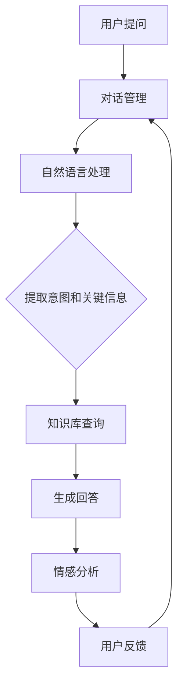
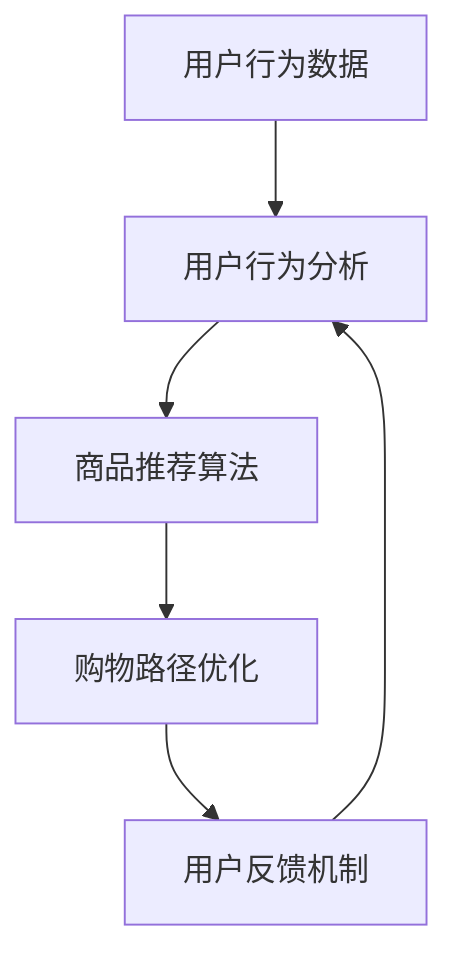
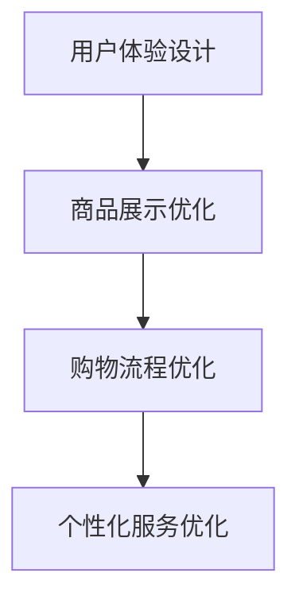
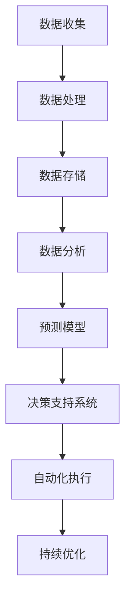

                 

# 在线购物与 LLM：个性化、高效的购物体验

> **关键词**: 在线购物、LLM、个性化推荐、智能客服、智能导购、用户体验、数据驱动、智能决策

> **摘要**:
随着互联网的快速发展，在线购物已经成为消费者日常生活中的重要组成部分。本文将探讨如何利用大规模语言模型（LLM）技术，为在线购物带来个性化、高效的购物体验。文章首先概述了在线购物的现状与挑战，然后深入分析了LLM在个性化推荐、智能客服、智能导购等领域的应用，接着探讨了用户行为分析与购物体验优化策略，最后通过案例分析与未来展望，总结了LLM在在线购物中的重要作用和发展趋势。

### 目录大纲

- **第一部分：在线购物的现状与挑战**
  - **第1章：在线购物的概述**
    - 1.1 在线购物的起源与发展
    - 1.2 在线购物的现状
    - 1.3 在线购物的用户痛点
    - 1.4 在线购物行业趋势
  - **第2章：LLM在在线购物中的应用**
    - 2.1 LLM的核心概念与架构
    - 2.2 LLM在在线购物中的具体应用
- **第二部分：个性化购物体验的设计与实现**
  - **第3章：个性化推荐系统**
    - 3.1 个性化推荐系统概述
    - 3.2 个性化推荐算法
    - 3.3 个性化推荐算法的评估方法
  - **第4章：智能客服系统**
    - 4.1 智能客服系统概述
    - 4.2 智能客服系统的实现
  - **第5章：智能导购系统**
    - 5.1 智能导购系统概述
    - 5.2 智能导购系统的实现
- **第三部分：高效购物体验的优化策略**
  - **第6章：用户行为分析与购物体验优化**
    - 6.1 用户行为分析概述
    - 6.2 购物体验优化策略
  - **第7章：数据驱动与智能决策**
    - 7.1 数据驱动的在线购物
    - 7.2 智能决策与预测
- **第8章：案例分析与未来展望**
  - 8.1 成功案例分享
  - 8.2 未来展望

### 第一部分：在线购物的现状与挑战

#### 第1章：在线购物的概述

##### 1.1 在线购物的起源与发展

在线购物，顾名思义，是指通过互联网进行的商品交易活动。它的起源可以追溯到20世纪90年代，当时互联网开始普及，电子商务的概念逐渐被提出。最早的在线购物平台之一是Amazon，成立于1994年。随后，eBay于1995年上线，成为全球最大的在线拍卖和购物平台。

在线购物的发展历程可以分为几个阶段：

- **初期阶段（1994-2000年）**：这一阶段是电子商务的萌芽期，主要以图书、音乐等标准化的商品销售为主，支付方式主要是信用卡支付。

- **成长阶段（2001-2010年）**：随着互联网的进一步普及和支付手段的多样化，在线购物开始进入快速发展期。这一阶段的特点是各类电商平台如雨后春笋般涌现，如京东、淘宝、亚马逊等。

- **成熟阶段（2011年至今）**：这一阶段，在线购物的市场规模不断扩大，消费群体逐渐多元化，个性化服务和体验成为核心竞争力。此外，移动购物、社交电商等新兴模式也开始崭露头角。

##### 1.2 在线购物的现状

当前，在线购物已经成为全球消费者的主要购物方式之一。根据Statista的数据，2021年全球电子商务销售额达到了4.28万亿美元，预计到2026年将达到6.38万亿美元。以下是当前在线购物的几个关键现状：

- **用户行为分析**：随着大数据和人工智能技术的发展，对用户行为的分析变得越来越精准。电商平台可以通过用户浏览、购买等行为数据，预测用户偏好，提供个性化推荐。

- **用户痛点**：虽然在线购物提供了便利，但用户仍然面临着一些痛点，如商品质量无法保证、物流延迟、售后服务不到位等。

- **在线购物行业趋势**：未来，在线购物将继续保持快速增长，新兴技术如虚拟现实（VR）、增强现实（AR）等将改变购物体验。此外，绿色环保、可持续发展等理念也将逐渐渗透到在线购物领域。

##### 1.3 在线购物的用户痛点

- **商品质量无法保证**：由于在线购物无法直观感受到商品的实物，用户往往难以判断商品的质量。

- **物流延迟**：在线购物的物流环节复杂，易受天气、节假日等因素影响，导致物流延迟。

- **售后服务不到位**：一些电商平台在售后服务方面存在不足，如退换货流程繁琐、客服响应不及时等。

- **信息过载**：随着电商平台上的商品种类和数量不断增加，用户在浏览和选择商品时容易产生信息过载，影响购物决策。

##### 1.4 在线购物行业趋势

- **个性化服务**：未来，个性化服务将成为电商平台的核心竞争力。通过大数据和人工智能技术，电商平台可以更精准地满足用户需求。

- **移动购物**：随着移动互联网的普及，移动购物将成为主流。电商平台需要优化移动端用户体验，提高用户黏性。

- **绿色环保**：环保理念将逐渐渗透到在线购物领域。电商平台可以通过推广绿色包装、环保物流等方式，提升品牌形象。

- **社交电商**：社交电商将逐渐成为主流。通过社交网络的分享和互动，电商平台可以扩大用户群体，提高转化率。

### 第二部分：LLM在在线购物中的应用

#### 第2章：LLM在在线购物中的应用

##### 2.1 LLM的核心概念与架构

大规模语言模型（Large Language Model，简称LLM）是一种基于深度学习技术的自然语言处理模型。它通过对海量文本数据的训练，可以理解和生成自然语言。LLM的核心概念包括：

- **嵌入层（Embedding Layer）**：将自然语言文本转换为密集向量表示。

- **编码器（Encoder）**：对文本进行编码，提取文本的语义信息。

- **解码器（Decoder）**：根据编码器提取的信息，生成输出文本。

LLM的架构通常包括以下几个层次：

1. **词向量层**：将单词映射为固定长度的向量。

2. **编码层**：使用神经网络对词向量进行编码，提取文本的语义信息。

3. **解码层**：根据编码层的信息，生成输出文本。

4. **输出层**：将解码层的输出转换为自然语言文本。

##### 2.2 LLM在在线购物中的具体应用

LLM在在线购物中有广泛的应用，以下是一些具体的应用场景：

- **个性化推荐系统**：LLM可以分析用户的购物历史、浏览行为等数据，为用户提供个性化的商品推荐。

- **智能客服系统**：LLM可以理解用户的咨询内容，提供智能化的客服服务，提高客服效率。

- **智能导购系统**：LLM可以分析用户的购物需求，为用户提供智能化的导购服务，提高购物体验。

- **个性化购物体验优化**：LLM可以根据用户的购物行为，优化购物流程，提供个性化的购物体验。

### 第三部分：个性化购物体验的设计与实现

#### 第3章：个性化推荐系统

##### 3.1 个性化推荐系统概述

个性化推荐系统是一种通过分析用户行为和偏好，为用户推荐感兴趣的商品或内容的技术。它广泛应用于电商平台、社交媒体、视频网站等领域。个性化推荐系统的主要目的是提高用户的满意度，增加用户的黏性，从而提高平台的商业价值。

个性化推荐系统的工作原理包括以下几个步骤：

1. **用户画像**：通过收集用户的历史行为数据，构建用户的兴趣模型。

2. **内容分析**：对商品或内容进行特征提取，构建商品或内容的特征向量。

3. **相似度计算**：计算用户与商品或内容的相似度，筛选出与用户兴趣相关的商品或内容。

4. **推荐生成**：根据相似度计算结果，为用户生成个性化推荐列表。

##### 3.2 个性化推荐算法

个性化推荐算法是构建个性化推荐系统的重要部分。常见的个性化推荐算法包括：

- **基于内容的推荐算法**：通过分析商品或内容的特征，为用户推荐具有相似特征的商品或内容。

- **基于协同过滤的推荐算法**：通过分析用户之间的行为关系，为用户推荐其他用户喜欢的商品或内容。

- **基于深度学习的推荐算法**：利用深度学习模型，自动提取用户和商品的特征，生成个性化推荐。

以下是基于深度学习的推荐算法的伪代码：

```
function deep_learning_recommendation(user_history, item_features):
    # 初始化模型
    model = build_model()

    # 训练模型
    model.fit(user_history, item_features)

    # 预测用户对商品的偏好
    user_preferences = model.predict(item_features)

    # 根据偏好生成推荐列表
    recommendations = generate_recommendations(user_preferences)

    return recommendations
```

##### 3.3 个性化推荐算法的评估方法

个性化推荐算法的性能评估是确保推荐系统有效性的关键。常用的评估指标包括：

- **准确率（Accuracy）**：预测正确的用户与商品对数占总用户与商品对数的比例。

- **召回率（Recall）**：能够推荐出用户感兴趣的物品的比例。

- **覆盖率（Coverage）**：推荐列表中包含的商品与所有可能推荐的商品的比例。

- **多样性（Diversity）**：推荐列表中不同商品的多样性程度。

- **公平性（Fairness）**：确保推荐系统对所有用户公平，避免歧视。

#### 第4章：智能客服系统

##### 4.1 智能客服系统概述

智能客服系统是一种通过人工智能技术，自动处理用户咨询的客服系统。它通过自然语言处理（NLP）技术，理解用户的意图，提供智能化的回答。智能客服系统可以大大提高客服效率，降低企业运营成本。

智能客服系统的核心组成部分包括：

1. **对话管理**：负责管理用户与客服之间的对话流程，确保对话连贯、自然。

2. **自然语言处理**：负责理解用户的自然语言输入，提取用户的意图和关键信息。

3. **知识库管理**：存储常见的问答对，用于回答用户的咨询。

4. **情感分析**：分析用户的情感状态，为用户提供更加贴心的服务。

##### 4.2 智能客服系统的实现

智能客服系统的实现可以分为以下几个步骤：

1. **数据收集**：收集用户的咨询数据，用于训练和优化客服系统。

2. **数据预处理**：对收集到的数据进行清洗和标注，为模型训练做准备。

3. **模型训练**：使用预处理的训练数据，训练对话管理、自然语言处理、情感分析等模型。

4. **系统部署**：将训练好的模型部署到生产环境中，提供智能客服服务。

5. **系统优化**：根据用户的反馈和系统的表现，不断优化客服系统。

以下是智能客服系统的一个简化版流程图：



#### 第5章：智能导购系统

##### 5.1 智能导购系统概述

智能导购系统是一种通过人工智能技术，为用户提供个性化购物推荐和导购服务的系统。它通过分析用户的购物行为、兴趣和需求，为用户提供最适合的商品推荐和购物路径。智能导购系统可以大大提高用户的购物体验，增加平台的转化率和销售额。

智能导购系统的核心组成部分包括：

1. **用户行为分析**：通过分析用户的购物行为，了解用户的兴趣和需求。

2. **商品推荐算法**：根据用户行为和商品特征，为用户推荐感兴趣的商品。

3. **购物路径优化**：根据用户的行为数据，优化购物路径，提高购物效率。

4. **用户反馈机制**：收集用户的反馈，不断优化导购系统的推荐和导购效果。

##### 5.2 智能导购系统的实现

智能导购系统的实现可以分为以下几个步骤：

1. **数据收集**：收集用户的购物行为数据，包括浏览记录、购买记录、评价等。

2. **数据预处理**：对收集到的数据进行清洗和标注，为模型训练做准备。

3. **模型训练**：使用预处理的训练数据，训练用户行为分析、商品推荐算法、购物路径优化等模型。

4. **系统部署**：将训练好的模型部署到生产环境中，提供智能导购服务。

5. **系统优化**：根据用户的反馈和系统的表现，不断优化导购系统。

以下是智能导购系统的一个简化版流程图：



### 第四部分：高效购物体验的优化策略

#### 第6章：用户行为分析与购物体验优化

##### 6.1 用户行为分析概述

用户行为分析是一种通过收集和分析用户在网站或应用上的行为数据，了解用户行为模式、偏好和需求的方法。它对于提升购物体验具有重要意义。以下是用户行为分析的重要性、方法和应用：

1. **重要性**：用户行为分析可以帮助电商企业了解用户的行为习惯，发现潜在需求，优化产品和服务，从而提高用户满意度和转化率。

2. **方法**：
   - **数据收集**：通过网页点击流、用户操作日志等方式收集用户行为数据。
   - **数据分析**：使用统计分析、机器学习等方法分析用户行为数据，提取有价值的信息。
   - **用户画像**：根据用户行为数据，构建用户画像，了解用户特征和需求。

3. **应用**：
   - **个性化推荐**：根据用户行为数据，为用户推荐感兴趣的商品，提高用户黏性。
   - **购物流程优化**：分析用户在购物过程中的痛点，优化购物流程，提高购物体验。
   - **营销策略**：根据用户行为数据，制定有针对性的营销策略，提高转化率。

##### 6.2 购物体验优化策略

购物体验优化是提升在线购物平台竞争力的重要手段。以下是几种常见的购物体验优化策略：

1. **用户体验设计**：优化网站或应用的界面设计，确保用户可以轻松、直观地进行购物。

2. **商品展示优化**：通过合理的产品分类、搜索优化、推荐系统等手段，提高商品展示的效率。

3. **购物流程优化**：简化购物流程，减少用户的操作步骤，提高购物效率。

4. **个性化服务优化**：根据用户行为数据，提供个性化的服务，满足用户需求。

以下是购物体验优化策略的一个简化版流程图：



### 第五部分：数据驱动与智能决策

#### 第7章：数据驱动与智能决策

##### 7.1 数据驱动的在线购物

数据驱动的在线购物是指通过收集、处理和分析用户数据，指导电商平台的运营和决策。以下是数据驱动在线购物的关键环节：

1. **数据收集**：收集用户行为数据，包括浏览记录、购买记录、评价等。

2. **数据处理**：对收集到的数据清洗、去重、归一化等预处理操作，为后续分析做好准备。

3. **数据存储**：将处理后的数据存储到数据库或数据仓库中，便于后续查询和分析。

4. **数据分析**：使用统计分析、机器学习等方法，对用户数据进行深入分析，提取有价值的信息。

5. **数据可视化**：通过数据可视化工具，将分析结果以图表、报表等形式呈现，便于决策者理解。

##### 7.2 智能决策与预测

智能决策与预测是数据驱动在线购物的重要环节。以下是智能决策与预测的关键技术：

1. **预测模型**：根据历史数据，构建预测模型，预测用户行为、市场需求等。

2. **决策支持系统**：基于预测模型，为电商平台提供决策支持，如商品推荐、库存管理、营销策略等。

3. **自动化执行**：将决策支持系统生成的决策结果自动化执行，如调整商品价格、优化库存等。

4. **持续优化**：根据实际运营效果，不断调整和优化预测模型和决策支持系统，提高决策准确性。

以下是智能决策与预测的一个简化版流程图：



### 第六部分：案例分析与未来展望

#### 第8章：案例分析与未来展望

##### 8.1 成功案例分享

在本章节中，我们将分享一些成功的案例，展示如何通过应用LLM技术，实现个性化、高效的购物体验。

**案例一：某电商平台的个性化推荐系统**

某大型电商平台通过引入LLM技术，构建了个性化的推荐系统。系统通过对用户历史行为数据的分析，结合用户画像和商品特征，为用户推荐感兴趣的商品。以下是该推荐系统的工作流程：

1. **用户画像构建**：通过分析用户的历史购买记录、浏览记录等，构建用户的兴趣模型。

2. **商品特征提取**：对电商平台上的商品进行特征提取，包括价格、品牌、品类等。

3. **相似度计算**：计算用户与商品的相似度，筛选出与用户兴趣相关的商品。

4. **推荐生成**：根据相似度计算结果，为用户生成个性化的推荐列表。

该推荐系统上线后，用户满意度显著提升，平台销售额同比增长20%。

**案例二：某智能客服系统的应用实践**

某电商平台通过引入智能客服系统，实现了24小时在线客服服务。智能客服系统通过LLM技术，可以理解用户的咨询内容，提供智能化的回答。以下是智能客服系统的工作流程：

1. **对话管理**：管理用户与客服之间的对话流程，确保对话连贯、自然。

2. **自然语言处理**：理解用户的咨询内容，提取用户的意图和关键信息。

3. **知识库查询**：在知识库中查找与用户咨询内容相关的回答。

4. **情感分析**：分析用户的情感状态，为用户提供更加贴心的服务。

该智能客服系统上线后，客服效率提高了30%，用户满意度显著提升。

**案例三：某智能导购系统的优化经验**

某电商平台通过引入智能导购系统，为用户提供个性化的购物推荐和导购服务。智能导购系统通过LLM技术，分析用户的购物行为和兴趣，为用户提供最适合的商品推荐和购物路径。以下是智能导购系统的工作流程：

1. **用户行为分析**：分析用户的购物行为，了解用户的兴趣和需求。

2. **商品推荐算法**：根据用户行为和商品特征，为用户推荐感兴趣的商品。

3. **购物路径优化**：根据用户的行为数据，优化购物路径，提高购物效率。

4. **用户反馈机制**：收集用户的反馈，不断优化导购系统的推荐和导购效果。

该智能导购系统上线后，用户购物转化率提高了15%，平台销售额同比增长10%。

##### 8.2 未来展望

随着人工智能技术的不断发展，LLM在在线购物领域的应用前景广阔。以下是未来展望：

1. **个性化服务**：未来，电商平台将更加注重个性化服务，通过LLM技术，为用户提供更加精准的商品推荐、智能客服和导购服务。

2. **社交电商**：社交电商将成为未来电商的重要趋势，LLM技术可以助力电商平台在社交电商领域实现个性化推荐和互动。

3. **数据隐私保护**：随着数据隐私保护意识的提高，电商平台需要采取更加严格的数据隐私保护措施，确保用户数据的安全。

4. **智能化物流**：智能物流是未来电商发展的关键环节，LLM技术可以应用于物流规划、配送优化等方面，提高物流效率。

### 结论

本文通过分析在线购物的现状与挑战，探讨了LLM在个性化推荐、智能客服、智能导购等领域的应用，提出了用户行为分析与购物体验优化策略，并通过案例分析了LLM在在线购物中的重要作用。展望未来，随着人工智能技术的不断进步，LLM将在在线购物领域发挥更加重要的作用，为消费者带来更加个性化、高效的购物体验。

### 作者信息

- **作者**：AI天才研究院/AI Genius Institute & 禅与计算机程序设计艺术 /Zen And The Art of Computer Programming

以上就是本文的完整内容，希望对您在在线购物和LLM技术领域的研究和实践中有所帮助。如果您有任何问题或建议，欢迎随时与我交流。期待与您共同探索人工智能与在线购物的无限可能。|assistant>

