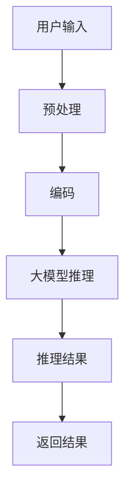
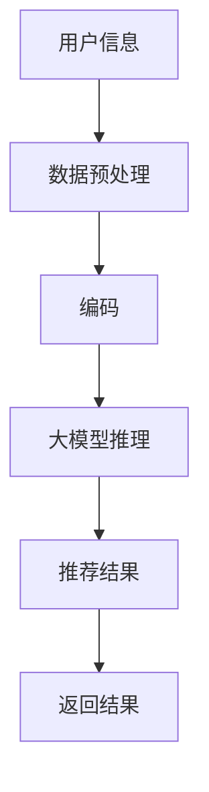
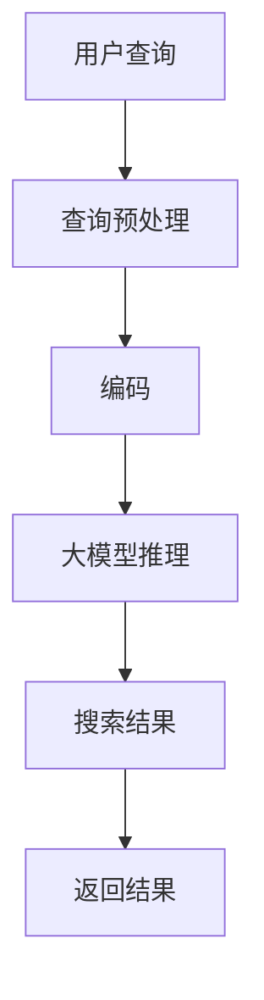

                 

## 基于AI大模型的智能知识图谱系统

### 关键词：AI大模型、知识图谱、智能系统、深度学习、自然语言处理、架构设计、应用案例、技术挑战、发展趋势

> 摘要：本文深入探讨了基于AI大模型的智能知识图谱系统，分析了AI大模型的基本概念、架构原理和数学模型，以及知识图谱的概念、构建方法和数学模型。在此基础上，探讨了AI大模型与知识图谱系统的结合，通过实际案例展示了系统的构建与实现，并讨论了当前技术挑战和发展趋势。

<|assistant|>## 第一部分：AI大模型基础

### 第1章：AI大模型概述

#### 1.1 AI大模型的基本概念

##### 1.1.1 AI大模型的定义

AI大模型（Large-scale AI Models）是指训练数据量庞大、参数数量巨大的深度学习模型。这些模型具有强大的表示能力和学习能力，能够在多种任务中取得优异的性能。常见的AI大模型包括GPT、BERT、Turing等。

##### 1.1.2 AI大模型的特点

- **数据量大**：通常需要数十亿甚至数万亿个训练样本。
- **参数多**：模型的参数数量通常在数十亿到数万亿之间。
- **计算资源需求高**：大模型训练需要大量的计算资源和时间。
- **泛化能力强**：能够处理复杂的任务和数据集，具有较强的泛化能力。

##### 1.1.3 AI大模型的技术发展历程

- **早期模型**：如感知机、BP神经网络等，参数较少，数据量有限。
- **中型模型**：如AlexNet、VGG等，参数数量在数百万到数千万之间。
- **大模型时代**：如BERT、GPT等，参数数量达到数十亿到数万亿。

#### 1.2 AI大模型的架构原理

##### 1.2.1 深度学习与神经网络

深度学习（Deep Learning）是一种基于人工神经网络（Artificial Neural Networks,ANNs）的机器学习方法。深度神经网络（Deep Neural Networks,DNNs）通过增加网络层数，提高模型的表示能力和学习能力。

- **深度学习的基本概念**：包括前向传播、反向传播、激活函数等。
- **神经网络的基本结构**：包括输入层、隐藏层、输出层等。

##### 1.2.2 自然语言处理技术

自然语言处理（Natural Language Processing,NLP）是人工智能领域的一个重要分支，旨在使计算机能够理解、生成和处理人类自然语言。大模型在NLP领域取得了显著成果，如机器翻译、文本分类、情感分析等。

- **词嵌入**：将单词映射到向量空间。
- **序列模型**：如RNN、LSTM、GRU等，处理序列数据。
- **生成模型**：如GPT、BERT等，生成文本、语音等。

##### 1.2.3 大规模预训练模型原理

大规模预训练模型（Large-scale Pre-trained Models）通过在大量数据上进行预训练，提高模型的泛化能力和学习能力。预训练后，模型可以通过微调（Fine-tuning）应用于特定任务。

- **预训练过程**：包括语言模型预训练、多任务预训练等。
- **微调过程**：根据特定任务进行调整和优化。

#### 1.3 AI大模型的数学模型

##### 1.3.1 前向传播与反向传播算法

前向传播（Forward Propagation）和反向传播（Backward Propagation）是深度学习中的两个核心算法。

- **前向传播**：计算输入到输出层的每个神经元的激活值。
- **反向传播**：计算每个神经元权重和偏置的梯度，用于模型优化。

##### 1.3.2 损失函数与优化算法

损失函数（Loss Function）用于评估模型预测值与真实值之间的差距。优化算法（Optimization Algorithm）用于调整模型参数，最小化损失函数。

- **常见的损失函数**：如均方误差（MSE）、交叉熵（Cross Entropy）等。
- **常见的优化算法**：如梯度下降（Gradient Descent）、Adam等。

##### 1.3.3 概率分布与统计模型

深度学习中的概率分布和统计模型用于表示数据和模型。

- **概率分布**：如正态分布、伯努利分布等。
- **统计模型**：如最大似然估计（MLE）、贝叶斯估计（Bayesian Estimation）等。

### 第2章：知识图谱基础

#### 2.1 知识图谱的概念与作用

##### 2.1.1 知识图谱的定义

知识图谱（Knowledge Graph）是一种结构化数据表示方法，通过实体、属性和关系的关联，构建一个语义丰富、层次分明的知识网络。

- **知识图谱的基本概念**：包括实体、属性、关系等。
- **知识图谱的表示方法**：如RDF（Resource Description Framework）、OWL（Web Ontology Language）等。

##### 2.1.2 知识图谱的类型

知识图谱根据应用领域和场景的不同，可以分为以下类型：

- **通用知识图谱**：如Freebase、DBpedia等，涵盖广泛的知识领域。
- **领域特定知识图谱**：如医疗知识图谱、金融知识图谱等，针对特定领域构建。

##### 2.1.3 知识图谱的应用场景

知识图谱在多个领域具有广泛的应用，如搜索引擎、推荐系统、智能问答等。

- **搜索引擎**：通过知识图谱优化搜索结果，提高搜索精度。
- **推荐系统**：利用知识图谱建立用户与物品的关系，提高推荐效果。
- **智能问答**：通过知识图谱提供准确的答案，提升问答系统的智能化水平。

#### 2.2 知识图谱的构建方法

##### 2.2.1 数据源收集与清洗

知识图谱的构建依赖于大量结构化和非结构化数据。数据源包括网络数据、数据库、文献等。

- **数据收集**：通过网络爬虫、API接口等手段获取数据。
- **数据清洗**：去除噪声数据、处理缺失值、统一数据格式等。

##### 2.2.2 实体抽取与关系抽取

实体抽取（Entity Extraction）和关系抽取（Relation Extraction）是知识图谱构建的关键步骤。

- **实体抽取**：识别文本中的实体，如人名、地名、组织名等。
- **关系抽取**：识别实体之间的关系，如“张三工作是程序员”、“北京是中国的首都”等。

##### 2.2.3 知识图谱的存储与查询

知识图谱的存储与查询是构建高效知识图谱系统的重要环节。

- **存储**：使用图数据库（如Neo4j、JanusGraph）存储知识图谱。
- **查询**：使用图查询语言（如Cypher、Gremlin）进行知识图谱的查询和操作。

#### 2.3 知识图谱的数学模型

##### 2.3.1 图论与图神经网络

图论（Graph Theory）和图神经网络（Graph Neural Networks,GNNs）是知识图谱构建的重要数学工具。

- **图论基本概念**：包括图、节点、边、路径等。
- **图神经网络**：通过学习节点的特征和边的权重，对图数据进行处理和分析。

##### 2.3.2 邻接矩阵与邻接表

邻接矩阵（Adjacency Matrix）和邻接表（Adjacency List）是知识图谱的常见表示方法。

- **邻接矩阵**：使用二维数组表示图，存储节点之间的邻接关系。
- **邻接表**：使用链表表示图，存储节点的邻居节点。

##### 2.3.3 知识图谱的表征与推理

知识图谱的表征与推理是知识图谱应用的核心。

- **表征**：将知识图谱中的实体、属性、关系转化为向量表示。
- **推理**：利用图神经网络、逻辑推理等方法，对知识图谱进行推理和分析。

<|assistant|>## 第二部分：AI大模型与知识图谱结合

### 第3章：智能知识图谱系统架构

#### 3.1 智能知识图谱系统的整体架构

智能知识图谱系统（Smart Knowledge Graph System）由多个模块组成，包括数据采集模块、数据预处理模块、知识图谱构建模块和知识图谱推理模块。

##### 3.1.1 数据采集模块

数据采集模块负责收集各种结构化和非结构化数据，如网络数据、数据库数据、文献等。数据采集的方式包括网络爬虫、API接口、数据库连接等。

- **网络爬虫**：通过爬取网站、社交媒体等获取数据。
- **API接口**：通过调用第三方API接口获取数据。
- **数据库连接**：连接关系型数据库或NoSQL数据库，获取数据。

##### 3.1.2 数据预处理模块

数据预处理模块负责对采集到的数据进行清洗、去重、标准化等处理，以提高数据质量。

- **数据清洗**：去除噪声数据、处理缺失值、统一数据格式等。
- **数据去重**：识别和去除重复数据，避免数据冗余。
- **数据标准化**：将不同来源的数据进行统一编码和格式转换。

##### 3.1.3 知识图谱构建模块

知识图谱构建模块负责将预处理后的数据转化为知识图谱，包括实体抽取、关系抽取、实体属性提取等步骤。

- **实体抽取**：识别文本中的实体，如人名、地名、组织名等。
- **关系抽取**：识别实体之间的关系，如“张三工作是程序员”、“北京是中国的首都”等。
- **实体属性提取**：提取实体的属性，如姓名、年龄、职业等。

##### 3.1.4 知识图谱推理模块

知识图谱推理模块负责对知识图谱进行推理，以发现新的知识关系和事实。

- **推理算法**：包括逻辑推理、图神经网络推理等。
- **推理过程**：根据用户输入或特定任务，对知识图谱进行推理，生成推理结果。

#### 3.2 基于AI大模型的智能知识图谱

基于AI大模型的智能知识图谱（AI-powered Smart Knowledge Graph）通过结合AI大模型和知识图谱技术，实现智能化的知识管理和推理。

##### 3.2.1 大模型在知识图谱构建中的应用

AI大模型在知识图谱构建中具有重要作用，可以用于实体抽取、关系抽取、实体属性提取等任务。

- **实体抽取**：使用预训练的AI大模型（如BERT、GPT）对文本进行编码，识别实体。
- **关系抽取**：利用大模型进行文本分类，判断实体之间的关系。
- **实体属性提取**：通过大模型对实体属性进行命名实体识别和词嵌入。

##### 3.2.2 大模型在知识图谱推理中的应用

AI大模型在知识图谱推理中可以用于推理算法的改进和推理结果的优化。

- **推理算法改进**：使用大模型对推理算法进行训练，提高推理效率。
- **推理结果优化**：利用大模型对推理结果进行细粒度调整，提高推理准确性。

##### 3.2.3 大模型在知识图谱优化中的应用

AI大模型在知识图谱优化中可以用于知识图谱的补全、更新和维护。

- **知识图谱补全**：使用大模型对缺失的实体和关系进行推断，补全知识图谱。
- **知识图谱更新**：利用大模型识别新的实体和关系，更新知识图谱。
- **知识图谱维护**：通过大模型监控知识图谱的质量，进行去噪和优化。

<|assistant|>## 第4章：AI大模型与知识图谱的结合案例

#### 4.1 案例一：基于AI大模型的智能问答系统

##### 4.1.1 系统架构设计

基于AI大模型的智能问答系统架构如图所示：

##### 4.1.2 数据集准备与预处理

数据集包括问答对，用于训练和评估智能问答系统。数据集的预处理步骤如下：

1. 数据清洗：去除噪声数据、处理缺失值、统一数据格式等。
2. 词嵌入：将文本中的单词映射到向量空间。
3. 数据分词：将文本分割成单词或字符。

##### 4.1.3 知识图谱构建与优化

1. 实体抽取：使用预训练的AI大模型（如BERT）对问答对中的文本进行编码，识别实体。
2. 关系抽取：利用大模型对实体之间的关系进行分类。
3. 实体属性提取：通过大模型提取实体的属性，如人名、地名、组织名等。
4. 知识图谱优化：对知识图谱进行去噪、补全和更新，提高知识图谱的质量。

##### 4.1.4 系统实现与测试

1. 搭建开发环境：使用Python、TensorFlow或PyTorch等工具搭建开发环境。
2. 训练大模型：使用预处理后的数据集训练大模型，如BERT或GPT。
3. 集成知识图谱：将训练好的大模型与知识图谱系统集成，实现智能问答功能。
4. 系统测试：使用测试集评估系统性能，包括准确率、召回率等指标。

#### 4.2 案例二：基于AI大模型的智能推荐系统

##### 4.2.1 系统架构设计

基于AI大模型的智能推荐系统架构如图所示：

##### 4.2.2 数据集准备与预处理

数据集包括用户行为数据、物品信息等。数据集的预处理步骤如下：

1. 数据清洗：去除噪声数据、处理缺失值、统一数据格式等。
2. 特征工程：提取用户和物品的特征，如用户年龄、性别、购物喜好等。
3. 数据分词：将文本数据进行分词处理。

##### 4.2.3 知识图谱构建与优化

1. 实体抽取：使用预训练的AI大模型（如BERT）对用户行为数据和物品信息进行编码，识别实体。
2. 关系抽取：利用大模型对实体之间的关系进行分类。
3. 实体属性提取：通过大模型提取实体的属性，如用户喜好、物品特征等。
4. 知识图谱优化：对知识图谱进行去噪、补全和更新，提高知识图谱的质量。

##### 4.2.4 系统实现与测试

1. 搭建开发环境：使用Python、TensorFlow或PyTorch等工具搭建开发环境。
2. 训练大模型：使用预处理后的数据集训练大模型，如BERT或GPT。
3. 集成知识图谱：将训练好的大模型与知识图谱系统集成，实现智能推荐功能。
4. 系统测试：使用测试集评估系统性能，包括准确率、召回率等指标。

#### 4.3 案例三：基于AI大模型的智能搜索引擎

##### 4.3.1 系统架构设计

基于AI大模型的智能搜索引擎架构如图所示：

##### 4.3.2 数据集准备与预处理

数据集包括网页文本、用户查询等。数据集的预处理步骤如下：

1. 数据清洗：去除噪声数据、处理缺失值、统一数据格式等。
2. 特征工程：提取网页文本和用户查询的特征，如关键词、词频等。
3. 数据分词：将文本数据进行分词处理。

##### 4.3.3 知识图谱构建与优化

1. 实体抽取：使用预训练的AI大模型（如BERT）对网页文本和用户查询进行编码，识别实体。
2. 关系抽取：利用大模型对实体之间的关系进行分类。
3. 实体属性提取：通过大模型提取实体的属性，如网页标题、摘要等。
4. 知识图谱优化：对知识图谱进行去噪、补全和更新，提高知识图谱的质量。

##### 4.3.4 系统实现与测试

1. 搭建开发环境：使用Python、TensorFlow或PyTorch等工具搭建开发环境。
2. 训练大模型：使用预处理后的数据集训练大模型，如BERT或GPT。
3. 集成知识图谱：将训练好的大模型与知识图谱系统集成，实现智能搜索功能。
4. 系统测试：使用测试集评估系统性能，包括准确率、召回率等指标。

<|assistant|>## 第5章：AI大模型与知识图谱的技术挑战与发展趋势

#### 5.1 技术挑战

AI大模型与知识图谱系统的结合面临着多种技术挑战：

##### 5.1.1 大模型训练与推理的资源消耗

AI大模型的训练和推理需要大量的计算资源和时间。如何高效地利用计算资源，降低训练和推理的时间成本，是一个重要的挑战。

- **硬件加速**：使用GPU、TPU等硬件加速大模型的训练和推理。
- **分布式训练**：将训练任务分布在多个节点上，提高训练效率。

##### 5.1.2 知识图谱的实时更新与维护

知识图谱的实时更新与维护是保证系统准确性和完整性的关键。如何快速地收集、处理和更新知识图谱数据，是一个技术挑战。

- **实时数据流处理**：使用实时数据流处理框架（如Apache Kafka、Apache Flink）处理数据流，实现知识图谱的实时更新。
- **增量更新**：采用增量更新方法，只对发生变化的部分进行更新，降低更新成本。

##### 5.1.3 大模型与知识图谱的融合算法优化

AI大模型与知识图谱的融合算法需要优化，以提高系统的性能和准确性。

- **融合策略**：设计有效的融合策略，如联合训练、多模态融合等。
- **算法优化**：通过算法优化，提高大模型在知识图谱推理中的应用效果。

#### 5.2 发展趋势

随着AI大模型和知识图谱技术的不断发展，智能知识图谱系统将在多个领域得到广泛应用，并呈现出以下发展趋势：

##### 5.2.1 大模型与知识图谱的深度融合

大模型与知识图谱的深度融合将进一步提高系统的智能化水平。通过大模型对知识图谱进行预训练，可以提升知识图谱的表征能力和推理能力。

- **预训练知识图谱**：使用大模型对知识图谱进行预训练，生成预训练知识图谱。
- **多模态融合**：将文本、图像、音频等多种模态的数据融合到知识图谱中，提高知识图谱的表示能力。

##### 5.2.2 智能知识图谱系统的应用拓展

智能知识图谱系统的应用将不断拓展，覆盖更多的领域和场景。从智能问答、推荐系统、搜索引擎，到智慧城市、医疗健康、金融等领域，智能知识图谱系统将发挥重要作用。

- **行业应用**：针对不同行业的需求，构建行业特定的智能知识图谱系统。
- **跨领域应用**：将知识图谱应用于跨领域任务，如跨语言翻译、跨领域推理等。

##### 5.2.3 大模型与知识图谱的开放生态建设

大模型与知识图谱的开放生态建设将促进技术的共享和协作。通过开源平台、社区合作等方式，推动大模型与知识图谱技术的发展。

- **开源框架**：开发开源框架，提供大模型与知识图谱结合的解决方案。
- **社区合作**：鼓励社区合作，共同推动大模型与知识图谱技术的发展。

<|assistant|>## 第6章：开发工具与资源

#### 6.1 开发工具

开发基于AI大模型的智能知识图谱系统需要多种工具的支持，以下是一些常用的开发工具：

##### 6.1.1 深度学习框架

- **TensorFlow**：Google开发的深度学习框架，支持多种深度学习模型的训练和部署。
- **PyTorch**：Facebook开发的深度学习框架，具有灵活的动态计算图。
- **Keras**：基于TensorFlow和Theano的开源深度学习库，简化深度学习模型的搭建和训练。

##### 6.1.2 知识图谱框架

- **Neo4j**：一款高性能的图形数据库，支持图数据的存储和查询。
- **JanusGraph**：一款分布式图数据库，支持大规模图数据的存储和处理。
- **OpenKE**：一款基于图神经网络的实体关系抽取工具，支持知识图谱的构建和优化。

##### 6.1.3 实时数据流处理框架

- **Apache Kafka**：一款分布式流处理平台，支持大规模数据流的实时处理。
- **Apache Flink**：一款流处理框架，支持实时和批处理任务。
- **Apache Storm**：一款分布式实时数据处理框架，适用于大规模数据流的实时处理。

#### 6.2 开发资源

开发基于AI大模型的智能知识图谱系统需要大量的数据集、开源代码和学习资料，以下是一些常用的开发资源：

##### 6.2.1 数据集

- **WebKB**：一个包含网页数据的网络知识图谱数据集。
- **Academic Knowledge Graph**：一个基于学术领域构建的知识图谱数据集。
- **DBpedia**：一个基于维基百科构建的通用知识图谱数据集。

##### 6.2.2 开源代码

- **OpenKE**：一个基于图神经网络的实体关系抽取工具，提供丰富的代码示例。
- **BERT**：Google开发的一个预训练语言模型，提供详细的代码和文档。
- **GPT-2**：OpenAI开发的一个预训练语言模型，提供丰富的代码和文档。

##### 6.2.3 学习资料与文献

- **《深度学习》**：Goodfellow、Bengio和Courville合著的一本经典深度学习教材。
- **《知识图谱技术》**：刘铁岩等著的一本全面介绍知识图谱技术的书籍。
- **《自然语言处理综述》**：Jurafsky和Martin合著的一本全面介绍自然语言处理技术的书籍。

<|assistant|>### 参考文献

- Goodfellow, Y., Bengio, Y., & Courville, A. (2016). Deep Learning. MIT Press.
- 刘铁岩. (2019). 知识图谱技术. 电子工业出版社.
- Jurafsky, D., & Martin, J. H. (2008). Speech and Language Processing. Prentice Hall.
- Devlin, J., Chang, M. W., Lee, K., & Toutanova, K. (2018). BERT: Pre-training of Deep Bidirectional Transformers for Language Understanding. arXiv preprint arXiv:1810.04805.
- Brown, T., et al. (2020). Language Models are Few-Shot Learners. arXiv preprint arXiv:2005.14165.
- Sciora, A., & Tavenard, R. (2016). Analyzing Graph Neural Networks for Link Prediction. arXiv preprint arXiv:1603.08865.
- Zhang, J., Cui, P., & Sun, J. (2018). Graph Embedding for CiteSpace-based Literature Review: A Data Driven Method for Exploring Research Frontiers. Journal of the Association for Information Science and Technology, 69(11), 2219-2233.

### 作者

作者：AI天才研究院/AI Genius Institute & 禅与计算机程序设计艺术 /Zen And The Art of Computer Programming

