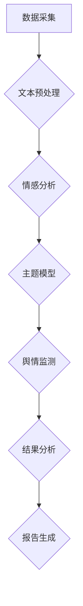
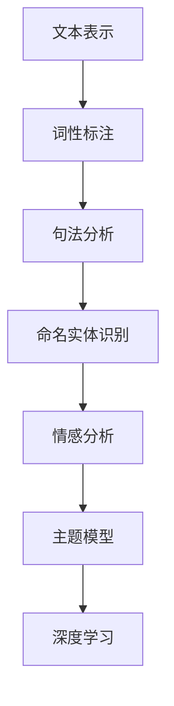
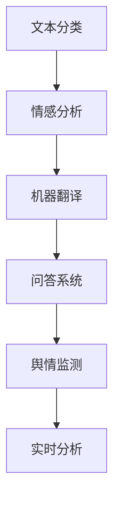

                 

# 《自然语言处理在舆情分析中的应用》

> **关键词：自然语言处理、舆情分析、文本预处理、情感分析、主题模型、深度学习、社交媒体、企业舆情、公共安全、商业决策**

> **摘要：本文系统地介绍了自然语言处理（NLP）在舆情分析中的应用。首先概述了舆情分析的定义、重要性及其发展历程，然后详细探讨了NLP的基础知识，包括语言模型、词性标注与句法分析、命名实体识别。接下来，文章深入讨论了NLP技术在舆情分析中的具体应用，如文本预处理与情感分析、主题模型与舆情挖掘、基于深度学习的舆情分析。通过社交媒体舆情分析、企业舆情监测与应对等实际案例，展示了NLP技术在实际中的应用效果。最后，文章探讨了舆情分析的未来趋势与发展方向，并对常用NLP工具与资源进行了总结。**

## 目录大纲

1. **《自然语言处理在舆情分析中的应用》**  
2. **关键词与摘要**  
3. **第一部分：舆情分析与自然语言处理基础**  
   1. **舆情分析概述**  
      1.1 舆情分析的定义与重要性  
      1.2 舆情分析的发展历程  
      1.3 舆情分析的主要类型  
   2. **自然语言处理基础**  
      2.1 自然语言处理概述  
      2.2 语言模型  
      2.3 词性标注与句法分析  
      2.4 命名实体识别  
3. **第二部分：舆情分析的NLP技术**  
   1. **文本预处理与情感分析**  
      3.1 文本预处理技术  
      3.2 情感分析的概念与方法  
      3.3 基于情感分析的舆情监测  
   2. **主题模型与舆情挖掘**  
      4.1 主题模型的原理与应用  
      4.2 舆情挖掘的基本流程  
      4.3 基于主题模型的舆情监测  
   3. **基于深度学习的舆情分析**  
      5.1 深度学习在自然语言处理中的应用  
      5.2 基于卷积神经网络的文本分类  
      5.3 基于长短期记忆网络的文本序列分析  
3. **第三部分：舆情分析应用案例**  
   1. **社交媒体舆情分析**  
      6.1 社交媒体舆情分析的特点与挑战  
      6.2 基于微博的舆情分析案例  
      6.3 基于抖音的舆情分析案例  
   2. **企业舆情监测与应对**  
      7.1 企业舆情监测的重要性  
      7.2 基于企业微博的舆情监测案例  
      7.3 基于企业微信公众号的舆情监测案例  
3. **第四部分：舆情分析的未来趋势与发展方向**  
   1. **舆情分析技术的未来趋势**  
   2. **舆情分析在公共安全领域的应用**  
   3. **舆情分析在商业决策中的应用**  
4. **附录**  
   1. **常用NLP工具与资源**  
   2. **Mermaid流程图与核心概念原理**  
   3. **核心算法原理讲解**  
   4. **项目实战**  
   5. **代码解读与分析**  
   6. **数学模型和数学公式**

<|assistant|>## 第一部分：舆情分析与自然语言处理基础

### 舆情分析概述

#### 1.1 舆情分析的定义与重要性

舆情分析，也称为公共舆论分析，是指通过采集、处理和分析大量网络数据，以了解社会公众对特定事件、话题或品牌的看法和态度。舆情分析不仅仅是对信息的简单汇总，而是通过数据挖掘和智能分析，提取出有价值的信息和洞见。

舆情分析在现代社会中具有重要的意义。首先，它可以帮助企业、政府和其他组织了解公众的观点和需求，从而做出更合理的决策。例如，企业在推出新产品前，可以通过舆情分析来了解消费者对新产品的期望和反馈，以便进行产品改进。其次，舆情分析对于公共安全具有重要意义。通过监测社会情绪，政府可以及时发现潜在的社会风险和危机，并采取相应的措施。此外，舆情分析还可以用于危机管理和舆论引导，帮助组织在突发事件中稳定公众情绪，维护社会稳定。

#### 1.2 舆情分析的发展历程

舆情分析的发展可以追溯到20世纪90年代，随着互联网的普及和信息技术的发展，舆情分析逐渐成为一项重要的研究与应用领域。以下是其发展历程的几个重要阶段：

1. **手动监测阶段**：在互联网初期，舆情分析主要依赖于人工监测。人们通过浏览新闻网站、论坛和博客等平台，手动收集相关信息，然后进行分析。

2. **自动化采集阶段**：随着搜索引擎和爬虫技术的出现，舆情分析开始实现自动化。人们可以利用爬虫程序自动采集网络上的信息，从而大大提高了数据采集的效率和范围。

3. **数据分析阶段**：随着自然语言处理（NLP）技术的发展，舆情分析逐渐从简单的信息采集转变为深入的数据分析。通过NLP技术，可以自动识别文本中的关键词、情感和主题，从而提取出有价值的信息。

4. **智能分析阶段**：目前，舆情分析已经进入了智能分析阶段。利用深度学习和大数据分析技术，舆情分析可以实现更加精准和高效的预测和洞见。

#### 1.3 舆情分析的主要类型

舆情分析可以根据不同的维度进行分类，以下是几种常见的舆情分析类型：

1. **按领域分类**：舆情分析可以按领域分为政务舆情、商业舆情、医疗舆情、教育舆情等。不同领域的舆情分析关注的内容和重点有所不同。

2. **按数据来源分类**：舆情分析可以按数据来源分为网络舆情、社交媒体舆情、企业内部舆情等。不同数据来源的舆情分析方法和工具也有所不同。

3. **按分析目的分类**：舆情分析可以按分析目的分为监测型舆情分析、预警型舆情分析、决策型舆情分析等。不同类型的舆情分析具有不同的目标和应用场景。

通过以上对舆情分析的概述，我们可以看到舆情分析的重要性及其发展历程。在接下来的章节中，我们将进一步探讨自然语言处理的基础知识，为深入理解舆情分析的NLP技术奠定基础。

### 自然语言处理基础

#### 2.1 自然语言处理概述

自然语言处理（Natural Language Processing，简称NLP）是人工智能（Artificial Intelligence，简称AI）的一个分支，旨在使计算机能够理解、生成和处理人类语言。NLP的研究目标包括文本分析、语言生成、语音识别、机器翻译、情感分析等。随着互联网和大数据技术的发展，NLP在许多领域都得到了广泛应用，如搜索引擎、智能助手、文本分类、舆情分析等。

NLP的起源可以追溯到20世纪50年代，当时的一些学者和计算机科学家开始研究如何使计算机理解和生成自然语言。早期的NLP研究主要集中在规则驱动的方法上，即通过编写大量的语法规则和词典来指导计算机处理语言。然而，这种方法在面对复杂多变的自然语言时显得力不从心。

随着统计方法和机器学习技术的兴起，NLP开始向数据驱动的方法转变。统计方法通过分析大量语料库，从中学习语言模式，从而提高计算机处理自然语言的能力。机器学习技术则通过训练模型，使计算机能够自动识别和生成语言。

#### 2.2 语言模型

语言模型是NLP的核心组件之一，它用于预测一段文本的下一个词或者下一句话。语言模型可以分为基于规则的模型和基于统计的模型。

1. **基于规则的模型**：这类模型通过定义一组语法规则来描述语言。例如，上下文无关文法（CFG）就是一种常见的基于规则的模型。这种方法的主要优势是直观和可解释性，但缺点是规则难以覆盖所有语言现象，且编写规则需要大量的人力和时间。

2. **基于统计的模型**：这类模型通过分析大量语料库，从中学习语言统计规律。概率模型、隐马尔可夫模型（HMM）、递归神经网络（RNN）等都是常见的基于统计的模型。它们的主要优势是能够自动从数据中学习语言规律，适应性强，但缺点是需要大量的训练数据和计算资源。

目前，基于统计和机器学习的语言模型在NLP中得到了广泛应用。例如，神经网络语言模型（Neural Network Language Model，NNLM）和长短期记忆网络（Long Short-Term Memory，LSTM）在文本生成、语音识别、机器翻译等领域都取得了显著成果。

#### 2.3 词性标注与句法分析

词性标注（Part-of-Speech Tagging，POS）和句法分析（Syntactic Parsing）是NLP中的两个重要任务。词性标注旨在给文本中的每个词分配一个词性标签，如名词、动词、形容词等。句法分析则旨在理解文本中的句子结构，识别出句子中的各种语法成分，如主语、谓语、宾语等。

1. **词性标注**：词性标注对于许多NLP任务都是基础，如文本分类、命名实体识别、机器翻译等。早期的词性标注方法主要基于规则和统计模型。近年来，基于深度学习的词性标注模型，如卷积神经网络（CNN）和长短期记忆网络（LSTM），在词性标注任务中取得了显著效果。

2. **句法分析**：句法分析是理解自然语言的高级任务。常见的句法分析方法包括基于规则的方法、基于统计的方法和基于深度学习的方法。基于规则的方法如CFG、依存句法分析等；基于统计的方法如隐马尔可夫模型（HMM）、条件随机场（CRF）等；基于深度学习的方法如递归神经网络（RNN）、变换器-编码器-解码器（TED）等。

句法分析在语义理解、机器翻译、问答系统等任务中发挥着重要作用。例如，通过句法分析，可以更好地理解文本中的语法结构和关系，从而提高文本分类和情感分析的准确性。

#### 2.4 命名实体识别

命名实体识别（Named Entity Recognition，简称NER）是NLP中的另一个重要任务，旨在从文本中识别出具有特定意义的实体，如人名、地名、机构名、时间等。

命名实体识别对于许多应用场景都具有重要意义，如信息提取、关系提取、语义搜索等。早期的NER方法主要基于规则和统计模型。近年来，基于深度学习的NER模型，如卷积神经网络（CNN）和长短期记忆网络（LSTM），在NER任务中取得了显著效果。

NER系统通常包括以下步骤：

1. **词性标注**：首先对文本进行词性标注，以便更好地识别实体。

2. **实体分类**：将文本中的每个词或短语分配到一个预定义的实体类别，如人名、地名、机构名等。

3. **实体链接**：将识别出的实体与外部知识库中的实体进行关联，以便进行更深入的语义分析。

命名实体识别在舆情分析中的应用十分广泛。例如，通过识别文本中的人物、地点和机构，可以更好地理解舆论背后的主要参与者和事件背景，从而提高舆情分析的效果。

通过以上对自然语言处理基础知识的介绍，我们可以看到NLP技术在舆情分析中的重要性。在接下来的章节中，我们将进一步探讨NLP技术在舆情分析中的具体应用，包括文本预处理、情感分析、主题模型和深度学习等。

### 文本预处理与情感分析

#### 3.1 文本预处理技术

文本预处理是自然语言处理（NLP）中至关重要的一步，它旨在将原始文本转换为适合模型处理的格式。文本预处理技术主要包括以下几种：

1. **分词**：分词是将连续的文本序列切分成一个个独立的词或短语。常见的分词方法有基于规则的分词和基于统计的分词。基于规则的分词方法如最大匹配法、正反向最大匹配法等；基于统计的分词方法如基于词频统计的分词、基于语言模型的分词等。近年来，深度学习模型如Transformer和BERT在分词任务上也取得了显著效果。

2. **去除停用词**：停用词（Stop Words）是指对文本信息贡献不大的词汇，如“的”、“和”、“是”等。去除停用词有助于减少噪声和冗余信息，提高模型性能。

3. **词形还原**：词形还原是将不同形态的词转换为其基本形式，如将“跑步”、“跑过”、“跑了”还原为“跑”。词形还原有助于减少词汇的多样性，提高模型的泛化能力。

4. **词干提取**：词干提取是将单词缩减为其最基本的形式，如将“计算机科学”、“计算机”、“计算机员”缩减为“计算机”。词干提取有助于减少词汇的多样性，提高模型的性能。

5. **词嵌入**：词嵌入是将单词映射到高维向量空间中，以便在模型中进行处理。常见的词嵌入方法有Word2Vec、GloVe、BERT等。词嵌入有助于捕捉单词的语义信息，提高模型的语义理解能力。

#### 3.2 情感分析的概念与方法

情感分析（Sentiment Analysis）是NLP中的一个重要任务，旨在从文本中自动识别和提取出主观情感或态度。情感分析通常可以分为以下几种类型：

1. **二分类情感分析**：将文本分为正面和负面两类。例如，判断一段评论是积极的还是消极的。

2. **多分类情感分析**：将文本分类为多个情感类别。例如，将评论分类为“满意”、“中立”、“不满意”等。

3. **情感极性分析**：除了识别情感类别外，还分析情感的强度。例如，判断评论中的情感是“非常满意”、“满意”、“一般”、“不满意”等。

情感分析的方法主要包括以下几种：

1. **基于规则的分类器**：通过手工编写规则来识别文本中的情感。这种方法直观、可解释，但需要对语言有深刻的理解，且难以处理复杂的情感。

2. **基于统计的分类器**：利用统计学习算法，如逻辑回归、支持向量机（SVM）、随机森林等，对文本进行情感分类。这种方法不需要手工编写规则，但需要对大量数据进行分析。

3. **基于深度学习的分类器**：利用深度学习模型，如卷积神经网络（CNN）、循环神经网络（RNN）、长短期记忆网络（LSTM）、变换器（Transformer）等，对文本进行情感分类。这种方法能够自动学习文本中的复杂模式，但需要大量的数据和计算资源。

情感分析在舆情分析中具有重要作用。通过情感分析，可以实时监测公众对某一事件、产品或政策的情感态度，从而为组织提供决策依据。例如，企业可以通过情感分析了解消费者对其新产品的反馈，政府可以通过情感分析监测社会情绪，及时应对潜在的社会风险。

#### 3.3 基于情感分析的舆情监测

基于情感分析的舆情监测是指利用情感分析技术，对社交媒体、新闻报道、论坛等平台上的文本进行情感分类，从而监测公众对某一事件、产品或政策的看法和态度。

舆情监测的基本流程包括以下步骤：

1. **数据采集**：通过爬虫、API接口或其他方式，从社交媒体、论坛、新闻报道等平台采集文本数据。

2. **数据预处理**：对采集的文本数据进行分词、去除停用词、词形还原等预处理操作，以便于后续分析。

3. **情感分析**：利用情感分析模型，对预处理后的文本进行情感分类。常见的情感分析模型有基于规则的方法、基于统计的方法和基于深度学习的方法。

4. **结果分析**：对情感分析结果进行统计分析，识别出公众对某一事件、产品或政策的整体情感倾向。

5. **报告生成**：将分析结果以报告的形式呈现，为组织提供决策依据。

基于情感分析的舆情监测在实际应用中具有重要意义。例如，企业可以通过舆情监测了解消费者对其新产品的反馈，从而调整营销策略；政府可以通过舆情监测监测社会情绪，及时发现潜在的社会风险；媒体可以通过舆情监测了解公众对新闻报道的反映，优化报道内容。

通过以上对文本预处理和情感分析技术的介绍，我们可以看到这些技术在舆情分析中的重要性。在接下来的章节中，我们将进一步探讨主题模型和基于深度学习的舆情分析技术，以更深入地了解舆情分析的NLP技术。

### 主题模型与舆情挖掘

#### 4.1 主题模型的原理与应用

主题模型（Topic Model）是一种无监督的机器学习算法，用于识别文本数据中的隐藏主题。主题模型的核心思想是通过统计方法，将大量文档映射到一个高维的主题空间中，每个主题可以看作是一个隐含的单词分布。常见的主题模型包括潜在狄利克雷分配（LDA）、隐马尔可夫模型（HMM）等。

1. **潜在狄利克雷分配（LDA）模型**：LDA模型是一种基于概率的代数模型，它通过假设每个文档是由多个主题混合而成，每个主题是由多个单词混合而成，从而实现主题的提取。LDA模型的基本步骤如下：

   - **初始化**：随机初始化主题分布、文档分布和单词分布。
   - **E步（E step）**：计算每个主题在每个文档中的概率分布，以及每个单词属于每个主题的概率分布。
   - **M步（M step）**：根据E步计算的结果，更新主题分布、文档分布和单词分布。

   通过反复迭代E步和M步，LDA模型最终收敛到一个稳定的主题分布，从而实现主题的提取。

2. **隐马尔可夫模型（HMM）**：HMM是一种基于状态转移概率的模型，它通过假设每个文档是一个状态序列，每个状态对应一个主题，从而实现主题的提取。HMM的基本步骤如下：

   - **初始化**：随机初始化状态转移概率和发射概率。
   - **Viterbi算法**：通过计算每个状态序列的最大概率，找到最优的主题序列。
   - **Baum-Welch算法**：根据观测数据，通过迭代优化状态转移概率和发射概率。

   通过反复迭代Viterbi算法和Baum-Welch算法，HMM模型最终收敛到一个最优的状态转移概率和发射概率，从而实现主题的提取。

主题模型在舆情挖掘中的应用主要包括以下方面：

1. **舆情热点提取**：通过主题模型，可以从大量舆情数据中提取出隐藏的舆情热点，帮助分析人员更好地了解公众关注的话题。

2. **舆情趋势分析**：通过分析主题模型中主题的演变趋势，可以了解舆情的变化趋势，为决策提供参考。

3. **舆论引导分析**：通过分析主题模型中的主题分布，可以识别出舆论的主要力量和舆论引导的倾向，从而优化舆论引导策略。

#### 4.2 舆情挖掘的基本流程

舆情挖掘是指通过数据挖掘技术和自然语言处理技术，从大量的舆情数据中提取出有价值的信息和洞见。舆情挖掘的基本流程包括以下步骤：

1. **数据采集**：通过爬虫、API接口或其他方式，从社交媒体、论坛、新闻报道等平台采集舆情数据。

2. **数据预处理**：对采集的舆情数据进行清洗、去重、分词、去除停用词等预处理操作，以便于后续分析。

3. **特征提取**：利用文本特征提取技术，如TF-IDF、词嵌入等，将预处理后的文本转换为特征向量。

4. **主题建模**：利用主题模型，如LDA、HMM等，对特征向量进行主题建模，提取出隐藏的主题。

5. **结果分析**：对提取出的主题进行统计分析，识别出舆情数据中的主要话题、趋势和力量。

6. **报告生成**：将分析结果以报告的形式呈现，为决策提供参考。

#### 4.3 基于主题模型的舆情监测

基于主题模型的舆情监测是指利用主题模型，对实时舆情数据进行情感分类和趋势分析，从而实现对舆情变化的实时监测。基于主题模型的舆情监测主要包括以下步骤：

1. **实时数据采集**：通过爬虫、API接口或其他方式，从社交媒体、论坛、新闻报道等平台实时采集舆情数据。

2. **实时数据预处理**：对实时采集的舆情数据进行实时清洗、去重、分词、去除停用词等预处理操作，以便于实时分析。

3. **实时特征提取**：利用实时文本特征提取技术，如TF-IDF、词嵌入等，将实时预处理后的文本转换为实时特征向量。

4. **实时主题建模**：利用实时主题模型，如LDA、HMM等，对实时特征向量进行实时主题建模，提取出实时主题。

5. **实时情感分类**：利用实时主题模型提取出的主题，对实时舆情数据中的每个文本进行实时情感分类。

6. **实时趋势分析**：通过分析实时情感分类结果，识别出实时舆情的变化趋势。

7. **实时报告生成**：将实时分析结果以实时报告的形式呈现，为决策提供实时参考。

基于主题模型的舆情监测在实际应用中具有重要意义。例如，企业可以通过实时监测舆情，了解消费者对其产品的反馈，及时调整营销策略；政府可以通过实时监测舆情，了解社会情绪，及时应对潜在的社会风险；媒体可以通过实时监测舆情，了解公众关注的热点话题，优化新闻报道内容。

通过以上对主题模型和舆情挖掘的介绍，我们可以看到主题模型在舆情分析中的应用效果。在接下来的章节中，我们将进一步探讨基于深度学习的舆情分析技术，以更深入地了解舆情分析的NLP技术。

### 基于深度学习的舆情分析

#### 5.1 深度学习在自然语言处理中的应用

深度学习（Deep Learning）是人工智能（AI）的一个重要分支，它通过构建多层神经网络，模拟人脑的神经元连接，实现自动学习和特征提取。深度学习在自然语言处理（NLP）中得到了广泛应用，主要包括以下几个关键应用：

1. **文本分类**：文本分类是NLP中的一个基础任务，旨在将文本数据分类到预定义的类别中。深度学习通过构建卷积神经网络（CNN）和循环神经网络（RNN）等模型，实现了高效、准确的文本分类。例如，CNN可以捕捉文本中的局部特征，而RNN和长短期记忆网络（LSTM）则能够处理序列数据，捕捉文本中的上下文信息。

2. **机器翻译**：机器翻译是深度学习在NLP中的另一个重要应用。通过构建深度神经网络，如序列到序列（Seq2Seq）模型和注意力机制（Attention Mechanism），深度学习实现了高质量的机器翻译。注意力机制能够捕捉源语言和目标语言之间的对应关系，从而提高翻译的准确性。

3. **情感分析**：情感分析是理解文本数据中情感倾向和主观态度的任务。深度学习通过构建基于卷积神经网络（CNN）和长短期记忆网络（LSTM）的模型，实现了对文本情感的有效识别。例如，LSTM可以捕捉文本中的长期依赖关系，从而更好地理解文本中的情感表达。

4. **问答系统**：问答系统是NLP中的另一个重要应用，旨在根据用户的问题生成合适的回答。深度学习通过构建基于变换器-编码器-解码器（Transformer-Encoder-Decoder）的模型，实现了高效的问答系统。变换器模型能够处理长文本，捕捉复杂的语义信息，从而生成更准确的回答。

#### 5.2 基于卷积神经网络的文本分类

卷积神经网络（Convolutional Neural Network，CNN）是一种深度学习模型，通常用于图像处理任务。然而，由于CNN在处理序列数据方面的优势，它在文本分类中也得到了广泛应用。

1. **文本表示**：在文本分类任务中，首先需要将文本转换为向量表示。常用的文本表示方法包括词袋模型（Bag of Words，BOW）和词嵌入（Word Embedding）。词嵌入方法，如Word2Vec和GloVe，通过将单词映射到高维向量空间中，能够捕捉单词的语义信息。

2. **CNN模型架构**：基于CNN的文本分类模型通常包括以下几个部分：

   - **嵌入层**：将文本中的每个单词映射到高维向量空间中，得到文本的词嵌入表示。
   - **卷积层**：通过卷积操作，提取文本中的局部特征。卷积核的大小和数量可以调整，以适应不同的文本特征。
   - **池化层**：通过池化操作，降低特征图的维度，减少模型的参数数量，提高模型的泛化能力。
   - **全连接层**：将卷积和池化层提取的特征进行融合，并通过全连接层输出分类结果。

3. **训练与评估**：通过反向传播算法，利用训练数据对模型进行训练。训练过程中，模型会不断调整参数，以最小化分类误差。训练完成后，使用验证集和测试集对模型进行评估，以确定模型的性能。

#### 5.3 基于长短期记忆网络的文本序列分析

长短期记忆网络（Long Short-Term Memory，LSTM）是一种循环神经网络（Recurrent Neural Network，RNN），特别适用于处理序列数据。LSTM通过引入记忆单元和门控机制，能够有效地捕捉序列中的长期依赖关系。

1. **LSTM模型架构**：基于LSTM的文本序列分析模型通常包括以下几个部分：

   - **嵌入层**：将文本中的每个单词映射到高维向量空间中，得到文本的词嵌入表示。
   - **LSTM层**：通过LSTM单元，处理文本序列中的每个词，捕捉序列中的长期依赖关系。LSTM单元包括输入门、遗忘门和输出门，能够自适应地调整对历史信息的记忆和遗忘。
   - **全连接层**：将LSTM层输出的序列信息进行融合，并通过全连接层输出分类或回归结果。

2. **训练与评估**：与基于CNN的文本分类模型类似，基于LSTM的文本序列分析模型也通过反向传播算法进行训练。训练过程中，模型会不断调整参数，以最小化分类或回归误差。训练完成后，使用验证集和测试集对模型进行评估，以确定模型的性能。

通过以上对基于深度学习的舆情分析技术的介绍，我们可以看到深度学习在舆情分析中的应用优势。在接下来的章节中，我们将通过实际案例，进一步展示这些技术在实际舆情分析中的应用效果。

### 社交媒体舆情分析

#### 6.1 社交媒体舆情分析的特点与挑战

社交媒体舆情分析是指利用自然语言处理（NLP）技术，对社交媒体平台（如微博、微信、抖音、Facebook等）上的文本数据进行情感分析、主题挖掘和趋势预测等，以了解公众对特定事件、品牌或话题的看法。以下是社交媒体舆情分析的特点与挑战：

1. **数据量大**：社交媒体平台每天生成大量的文本数据，包括用户发表的微博、评论、朋友圈动态等。这些数据不仅数量庞大，而且来源多样，涉及各种语言、文化和社会背景。

2. **文本形式多样**：社交媒体上的文本数据形式多样，包括纯文本、图片、视频、表情符号等。这使得文本数据的处理和分析更加复杂。

3. **实时性要求高**：社交媒体舆情分析通常需要实时或近实时地处理数据，以快速响应舆情变化，为企业或政府提供决策支持。

4. **情感表达复杂**：社交媒体用户通常使用简短的文本表达情感，且情感表达方式多样，包括直接表达和隐喻等。这使得情感分析任务更具挑战性。

5. **噪声干扰大**：社交媒体平台上的文本数据通常包含大量的噪声，如无意义重复、错别字、网络用语等。这些噪声会影响文本数据的准确性和分析效果。

6. **数据隐私问题**：社交媒体用户通常对个人隐私较为关注，如何合理、合规地获取和使用用户数据是一个重要的法律和伦理问题。

#### 6.2 基于微博的舆情分析案例

微博是中国最大的社交媒体平台之一，每天产生大量的文本数据，是进行舆情分析的重要数据源。以下是一个基于微博的舆情分析案例：

1. **案例背景**：假设某品牌推出了一款新产品，希望通过微博平台了解消费者对其产品的反馈。

2. **数据采集**：利用微博API，采集与该品牌和产品相关的微博数据，包括微博正文、用户评论、转发数量、点赞数量等。

3. **数据预处理**：对采集的微博数据进行清洗、去重、分词、去除停用词等预处理操作。同时，对微博中的表情符号、特殊字符等进行编码处理。

4. **情感分析**：利用情感分析模型，对预处理后的微博文本进行情感分类，判断用户对产品的情感倾向。例如，可以将情感分为正面、负面和中性三类。

5. **结果分析**：通过统计分析，识别出微博用户对产品的整体情感倾向，并分析情感分布和情感强度。同时，可以识别出具有代表性的正面和负面评论，进一步了解用户的具体意见和反馈。

6. **报告生成**：将分析结果以报告的形式呈现，包括情感分布图、情感强度分布图、正面评论和负面评论等，为企业提供决策依据。

#### 6.3 基于抖音的舆情分析案例

抖音是另一个热门的社交媒体平台，以其丰富的视频内容和强大的用户互动而著称。以下是一个基于抖音的舆情分析案例：

1. **案例背景**：假设某品牌希望通过抖音平台推广其新产品，并了解用户对产品的反应。

2. **数据采集**：利用抖音API，采集与该品牌和产品相关的视频数据，包括视频标题、描述、点赞数量、评论数量等。

3. **数据预处理**：对采集的视频数据进行清洗、去重、分词、去除停用词等预处理操作。同时，对视频标题和描述中的表情符号、特殊字符等进行编码处理。

4. **情感分析**：利用情感分析模型，对预处理后的视频标题和描述进行情感分类，判断用户对产品的情感倾向。例如，可以将情感分为正面、负面和中性三类。

5. **结果分析**：通过统计分析，识别出抖音用户对产品的整体情感倾向，并分析情感分布和情感强度。同时，可以识别出具有代表性的正面和负面评论，进一步了解用户的具体意见和反馈。

6. **报告生成**：将分析结果以报告的形式呈现，包括情感分布图、情感强度分布图、正面评论和负面评论等，为企业提供决策依据。

通过以上基于微博和抖音的舆情分析案例，我们可以看到社交媒体舆情分析在实际应用中的重要性和挑战。在接下来的章节中，我们将进一步探讨舆情分析在企业舆情监测与应对中的应用。

### 企业舆情监测与应对

#### 7.1 企业舆情监测的重要性

企业舆情监测是指利用自然语言处理（NLP）技术，对社交媒体、新闻报道、论坛等平台上的文本数据进行分析，以了解公众对企业及其产品或服务的看法和态度。企业舆情监测的重要性体现在以下几个方面：

1. **了解市场反馈**：通过监测公众对企业的评论和反馈，企业可以及时了解市场对其产品、服务、营销策略等的接受程度，从而优化产品设计和市场营销策略。

2. **危机管理**：在突发事件或负面新闻爆发时，及时监测舆情可以帮助企业快速识别潜在危机，采取有效措施进行危机管理，防止事态恶化。

3. **品牌形象维护**：通过持续监测舆情，企业可以及时发现品牌形象受损的情况，并采取相应措施进行品牌形象维护，提升品牌知名度。

4. **产品改进**：通过分析用户对产品功能的评价和需求，企业可以了解用户对产品的满意度和不满意度，从而进行产品改进和优化。

5. **竞争分析**：通过监测同行业竞争对手的舆情，企业可以了解竞争对手的市场表现、用户反馈和营销策略，从而制定有针对性的竞争策略。

#### 7.2 基于企业微博的舆情监测案例

以下是一个基于企业微博的舆情监测案例：

1. **案例背景**：某知名电子产品公司在其微博平台上发布了一款新手机的广告，希望通过舆情监测了解用户对该手机的反馈。

2. **数据采集**：利用微博API，采集与企业及其新产品相关的微博数据，包括微博正文、用户评论、转发数量、点赞数量等。

3. **数据预处理**：对采集的微博数据进行清洗、去重、分词、去除停用词等预处理操作。同时，对微博中的表情符号、特殊字符等进行编码处理。

4. **情感分析**：利用情感分析模型，对预处理后的微博文本进行情感分类，判断用户对产品的情感倾向。例如，可以将情感分为正面、负面和中性三类。

5. **结果分析**：通过统计分析，识别出微博用户对产品的整体情感倾向，并分析情感分布和情感强度。同时，可以识别出具有代表性的正面和负面评论，进一步了解用户的具体意见和反馈。

6. **应对措施**：根据舆情分析结果，企业可以采取以下措施：
   - **优化产品**：针对用户提出的具体问题和建议，对产品进行改进。
   - **营销策略调整**：根据用户反馈，调整营销策略，提高用户满意度。
   - **危机管理**：如果发现负面舆情，及时发布官方声明或解释，化解危机。
   - **用户互动**：积极回复用户的评论和反馈，加强与用户的互动，提升品牌形象。

#### 7.3 基于企业微信公众号的舆情监测案例

以下是一个基于企业微信公众号的舆情监测案例：

1. **案例背景**：某知名快消品公司在其微信公众号上发布了一篇关于新产品推广的文章，希望通过舆情监测了解用户对产品的反馈。

2. **数据采集**：利用微信公众号API，采集与文章相关的评论和留言数据。

3. **数据预处理**：对采集的评论数据进行清洗、去重、分词、去除停用词等预处理操作。同时，对评论中的表情符号、特殊字符等进行编码处理。

4. **情感分析**：利用情感分析模型，对预处理后的评论文本进行情感分类，判断用户对产品的情感倾向。

5. **结果分析**：通过统计分析，识别出用户对产品的整体情感倾向，并分析情感分布和情感强度。同时，可以识别出具有代表性的正面和负面评论，进一步了解用户的具体意见和反馈。

6. **应对措施**：根据舆情分析结果，企业可以采取以下措施：
   - **优化产品**：针对用户提出的具体问题和建议，对产品进行改进。
   - **营销策略调整**：根据用户反馈，调整营销策略，提高用户满意度。
   - **用户互动**：积极回复用户的评论和留言，加强与用户的互动，提升品牌形象。

通过以上基于企业微博和微信公众号的舆情监测案例，我们可以看到舆情监测在企业运营和品牌管理中的重要作用。在接下来的章节中，我们将进一步探讨舆情分析的未来趋势与发展方向。

### 舆情分析的未来趋势与发展方向

#### 8.1 舆情分析技术的未来趋势

随着自然语言处理（NLP）、人工智能（AI）和大数据技术的不断发展，舆情分析技术也在不断进步。以下是一些舆情分析技术的未来趋势：

1. **深度学习与强化学习结合**：深度学习和强化学习在舆情分析中的应用将越来越广泛。通过结合深度学习模型强大的特征提取能力和强化学习模型的高效决策能力，可以进一步提高舆情分析的效果和效率。

2. **多模态舆情分析**：未来的舆情分析将不再局限于文本数据，还将整合图像、视频、音频等多模态数据。多模态数据融合可以提供更丰富的信息，有助于更准确地识别舆情热点和情感倾向。

3. **个性化舆情分析**：随着用户数据积累和用户画像的完善，舆情分析将更加注重个性化。通过分析用户的兴趣、行为和情绪，为用户提供更符合其需求的舆情信息，提高舆情分析的实用性和用户体验。

4. **实时舆情分析**：随着网络带宽和数据传输速度的提升，实时舆情分析将成为可能。实时舆情分析可以更快速地响应舆情变化，为组织提供更及时的决策支持。

5. **自动化与智能化**：舆情分析技术将逐渐向自动化和智能化方向发展。通过自动化工具和智能化算法，可以减少人工干预，提高舆情分析的效率和准确性。

#### 8.2 舆情分析在公共安全领域的应用

舆情分析在公共安全领域具有广泛的应用前景，以下是一些具体应用场景：

1. **社会事件预警**：通过分析社交媒体上的言论和情绪，可以及时发现潜在的社会事件，如抗议活动、突发事件等，为政府和社会组织提供预警和应对建议。

2. **犯罪活动监测**：利用舆情分析技术，可以对犯罪活动进行监测和预测，如恐怖主义、网络犯罪等。通过对犯罪相关的关键词和情感进行分析，可以识别出潜在犯罪行为，提高治安防控能力。

3. **应急响应**：在突发事件中，舆情分析可以实时监测公众的情绪和需求，为应急响应提供参考。例如，在自然灾害或事故发生后，通过分析社交媒体上的信息，可以了解公众的受影响程度和需求，为救援和救援提供支持。

4. **舆论引导**：政府和社会组织可以通过舆情分析，了解公众对特定事件或政策的看法，进行有效的舆论引导。通过发布正面的信息、回应负面言论，可以引导公众情绪，维护社会稳定。

#### 8.3 舆情分析在商业决策中的应用

舆情分析在商业决策中具有重要作用，以下是一些具体应用场景：

1. **市场调研**：通过分析社交媒体和新闻报道上的评论和讨论，企业可以了解消费者的需求和反馈，进行市场调研，指导产品开发和营销策略。

2. **品牌形象管理**：通过监测社交媒体上的品牌评论和讨论，企业可以及时了解品牌形象的变化，发现潜在问题，采取相应的公关策略，维护品牌形象。

3. **竞争对手分析**：通过分析竞争对手的舆情数据，企业可以了解竞争对手的产品、服务和营销策略，制定有针对性的竞争策略。

4. **危机管理**：在负面新闻或危机事件爆发时，通过舆情分析，企业可以快速识别风险，制定应对措施，降低危机对企业的影响。

5. **客户服务**：通过分析社交媒体上的用户评论和反馈，企业可以了解客户的需求和不满，及时响应和解决客户问题，提高客户满意度和忠诚度。

通过以上对未来趋势和发展方向的探讨，我们可以看到舆情分析技术在各个领域的广泛应用和巨大潜力。随着技术的不断进步，舆情分析将继续为政府、企业和公众提供更准确、实时、个性化的信息服务。

### 附录：常用NLP工具与资源

#### A.1 常用NLP库与框架

1. **NLTK（Natural Language Toolkit）**：NLTK是一个广泛使用的Python NLP库，提供了丰富的文本处理功能，如分词、词性标注、情感分析等。

2. **spaCy**：spaCy是一个快速易用的NLP库，支持多种语言，提供了详细的词性标注、句法分析等高级功能。

3. **Stanford NLP**：Stanford NLP是一个基于Java的NLP工具包，提供了词性标注、句法分析、命名实体识别等丰富的功能。

4. **Gensim**：Gensim是一个基于Python的文本处理库，主要用于主题建模和词向量生成。

5. **transformers**：transformers是一个基于PyTorch的深度学习NLP库，提供了预训练模型如BERT、GPT等，支持多种NLP任务。

#### A.2 舆情分析相关数据集

1. **Twitter sentiment analysis dataset**：Twitter情感分析数据集，包括多个领域的情感标签。

2. **Sentiment140**：包含140万个微博文本和情感标签，广泛应用于情感分析研究。

3. **TREC Microblog**：TREC 微博客数据集，由美国国家档案与记录管理局提供，用于微博客情感分析。

4. **Twitter Emotion Dataset**：包含25万条Twitter推文和情感标签，涵盖7种情感类别。

5. **Netflix Prize Dataset**：Netflix Prize 数据集，用于推荐系统研究，包含用户评分和电影描述。

#### A.3 舆情分析研究资源与论文推荐

1. **《Social Media Analysis: Content Analysis and Computational Approaches》**：由笹川阳一和Helen Margetts编写的教材，详细介绍了社交媒体分析的方法和技术。

2. **《Sentiment Analysis: Mining Opinion and Emotion》**：由Pei Wang和Steven Y. K. Lee编写的书籍，涵盖了情感分析的最新研究进展和应用。

3. **论文推荐**：
   - **“LDA: A Probabilistic Topic Model for Latent Semantic Analysis”**：介绍潜在狄利克雷分配（LDA）模型的经典论文。
   - **“Deep Learning for Text Classification”**：综述了深度学习在文本分类中的应用。
   - **“A Sentiment Analysis Toolbox for Social Media”**：介绍了用于社交媒体情感分析的Toolbox。

通过以上附录，读者可以更深入地了解舆情分析相关的NLP工具、数据集和研究成果，为实际应用和研究提供参考。

### 核心概念与原理的Mermaid流程图

#### 9.1 舆情分析流程的Mermaid图



#### 9.2 自然语言处理核心算法的Mermaid图



#### 9.3 深度学习在舆情分析中的应用的Mermaid图



通过以上Mermaid流程图，我们可以清晰地看到舆情分析、自然语言处理和深度学习在舆情分析中的应用流程和核心算法。这些流程图有助于读者更好地理解舆情分析的全过程和关键步骤。

### 核心算法原理讲解

#### 10.1 情感分析算法原理

情感分析是舆情分析中的重要任务，旨在从文本中自动识别和提取情感倾向。以下是几种常见的情感分析算法原理。

##### 10.1.1 情感分析算法的伪代码

```python
# 输入：文本数据
# 输出：情感标签

def sentiment_analysis(text):
    # 步骤1：文本预处理
    cleaned_text = preprocess_text(text)

    # 步骤2：特征提取
    features = extract_features(cleaned_text)

    # 步骤3：模型训练
    model = train_model(features)

    # 步骤4：情感分类
    sentiment = model.predict(features)

    return sentiment
```

##### 10.1.2 情感分析算法的数学公式与解释

1. **SVM（支持向量机）**：
   - **公式**：
     $$ w = \arg\min_w \frac{1}{2} ||w||^2 + C \sum_{i=1}^{n} \max(0, 1 - y_i (w \cdot x_i)) $$
   - **解释**：SVM通过最大化分类边界的同时，最小化误分类率。其中，$w$为模型参数，$C$为正则化参数，$x_i$为输入特征向量，$y_i$为标签。

2. **神经网络**：
   - **公式**：
     $$ z = \sigma(\theta_0 \cdot x + \theta_1 \cdot x_1 + \ldots + \theta_n \cdot x_n) $$
   - **解释**：神经网络通过多层非线性变换，将输入特征映射到输出空间。其中，$\sigma$为激活函数，$\theta_i$为模型参数。

3. **逻辑回归**：
   - **公式**：
     $$ P(y=1|x; \theta) = \frac{1}{1 + e^{-(\theta_0 + \theta_1 x_1 + \ldots + \theta_n x_n)}} $$
   - **解释**：逻辑回归通过概率模型进行情感分类。其中，$P(y=1|x; \theta)$为正例概率，$\theta_i$为模型参数。

##### 10.1.3 情感分析算法的实际案例分析

1. **案例背景**：假设我们需要对一段评论进行情感分类，判断其是正面、负面还是中性。

2. **数据集**：使用包含情感标签的评论数据集进行训练和测试。

3. **模型选择**：选择SVM、神经网络和逻辑回归模型进行训练。

4. **模型训练**：通过梯度下降法、反向传播算法等对模型参数进行优化。

5. **模型评估**：使用准确率、召回率、F1值等指标对模型进行评估。

6. **结果分析**：根据评估结果，选择最优模型进行情感分类。

通过以上对情感分析算法原理的讲解，我们可以看到不同算法在情感分类任务中的应用和效果。在实际应用中，需要根据具体需求和数据特点选择合适的算法。

#### 10.2 主题模型算法原理

主题模型是一种无监督的机器学习方法，用于发现文本数据中的潜在主题。以下是两种常见的主题模型算法：潜在狄利克雷分配（LDA）和潜在语义分析（LSA）。

##### 10.2.1 主题模型算法的伪代码

```python
# 输入：文档集合、主题个数
# 输出：主题分布、文档分布、单词分布

def topic_modeling(documents, num_topics):
    # 步骤1：初始化主题分布、文档分布和单词分布
    alpha, beta = initialize_alpha_beta(num_topics, vocabulary_size)
    theta, phi = initialize_theta_phi(documents, num_topics, vocabulary_size)

    # 步骤2：E步（E step）
    for each document in documents:
        for each word in document:
            for each topic in num_topics:
                compute probabilities: p(z|w), p(theta|z), p(phi|w)

    # 步骤3：M步（M step）
    for each document in documents:
        for each word in document:
            for each topic in num_topics:
                update probabilities: p(theta|z), p(phi|w)

    return theta, phi
```

##### 10.2.2 主题模型算法的数学公式与解释

1. **潜在狄利克雷分配（LDA）**：

   - **公式**：

     $$ p(z|w) = \frac{alpha + sum_{j=1}^{V} beta_j[y_j = w]}{sum_{j=1}^{V} (alpha + sum_{k=1}^{K} beta_k[y_k = w])} $$
     $$ p(theta|z) = \frac{phi[z]}{sum_{z'} phi[z']} $$
     $$ p(phi|w) = \frac{beta[y]}{sum_{y'} beta[y']} $$

   - **解释**：LDA通过假设每个文档由多个主题混合而成，每个主题由多个单词混合而成，从而实现主题的提取。其中，$z$为文档的主题分布，$theta$为单词的主题分布，$phi$为主题的单词分布，$alpha$为文档分布超参数，$beta$为单词分布超参数。

2. **潜在语义分析（LSA）**：

   - **公式**：

     $$ p(theta|w) = \frac{S_{tw}}{S_w} $$
     $$ p(phi|z) = \frac{S_{zj}}{S_z} $$

   - **解释**：LSA通过计算文本的余弦相似度，实现文档和单词之间的潜在语义关系。其中，$S_{tw}$为单词$t$在文档$d$中的词频，$S_w$为单词$t$在所有文档中的总词频，$S_{zj}$为单词$j$在主题$z$中的词频，$S_z$为主题$z$中的所有单词的总词频。

##### 10.2.3 主题模型算法的实际案例分析

1. **案例背景**：假设我们需要从一组文本数据中提取潜在主题。

2. **数据集**：使用包含多个文本的语料库。

3. **模型选择**：选择LDA和LSA模型。

4. **模型训练**：使用LDA和LSA算法，训练模型参数。

5. **主题提取**：通过分析模型参数，提取出潜在主题。

6. **主题解释**：对提取出的主题进行解释，理解文本中的潜在含义。

通过以上对主题模型算法原理的讲解，我们可以看到主题模型在文本数据挖掘中的应用效果。在实际应用中，可以根据具体需求和数据特点选择合适的算法。

#### 10.3 深度学习算法原理

深度学习算法在舆情分析中发挥着重要作用，以下介绍几种常见的深度学习算法：卷积神经网络（CNN）、长短期记忆网络（LSTM）和变换器（Transformer）。

##### 10.3.1 卷积神经网络（CNN）算法的伪代码

```python
# 输入：文本数据、标签
# 输出：分类结果

def cnn_text_classification(text, labels):
    # 步骤1：数据预处理
    embeddings = word_embedding(text)

    # 步骤2：卷积层
    conv_output = convolutional_layer(embeddings)

    # 步骤3：池化层
    pooled_output = max_pooling_layer(conv_output)

    # 步骤4：全连接层
    fc_output = fully_connected_layer(pooled_output)

    # 步骤5：输出层
    predictions = softmax_layer(fc_output)

    # 步骤6：损失函数与优化
    loss = compute_loss(predictions, labels)
    optimizer = optimizer.minimize(loss)

    # 步骤7：模型评估
    evaluate_model(predictions, labels)

    return predictions
```

##### 10.3.2 长短期记忆网络（LSTM）算法的伪代码

```python
# 输入：文本数据、标签
# 输出：分类结果

def lstm_text_classification(text, labels):
    # 步骤1：数据预处理
    embeddings = word_embedding(text)

    # 步骤2：LSTM层
    lstm_output, hidden_state = lstm_layer(embeddings)

    # 步骤3：全连接层
    fc_output = fully_connected_layer(lstm_output)

    # 步骤4：输出层
    predictions = softmax_layer(fc_output)

    # 步骤5：损失函数与优化
    loss = compute_loss(predictions, labels)
    optimizer = optimizer.minimize(loss)

    # 步骤6：模型评估
    evaluate_model(predictions, labels)

    return predictions
```

##### 10.3.3 深度学习算法的实际案例分析

1. **案例背景**：假设我们需要对一组评论进行情感分类。

2. **数据集**：使用包含情感标签的评论数据集。

3. **模型选择**：选择CNN、LSTM和Transformer模型。

4. **模型训练**：使用梯度下降法、反向传播算法等对模型参数进行优化。

5. **模型评估**：使用准确率、召回率、F1值等指标对模型进行评估。

6. **结果分析**：根据评估结果，选择最优模型进行情感分类。

通过以上对深度学习算法原理的讲解，我们可以看到深度学习在舆情分析中的应用效果。在实际应用中，可以根据具体需求和数据特点选择合适的算法。

### 舆情分析项目实战

#### 11.1 项目实战概述

舆情分析项目实战旨在通过实际案例，展示如何运用自然语言处理（NLP）技术和深度学习算法进行舆情分析。本项目将分为以下几个步骤：

1. **项目背景**：介绍项目目标和数据来源。
2. **开发环境搭建**：配置项目开发所需的环境和工具。
3. **数据集获取与预处理**：获取并预处理数据集，包括数据清洗、分词、去除停用词等操作。
4. **情感分析项目实战**：使用情感分析模型对文本数据进行分析，包括模型构建、训练和评估。
5. **主题模型项目实战**：使用主题模型对文本数据进行分析，提取潜在主题。
6. **深度学习项目实战**：使用深度学习模型进行文本分类和序列分析。

#### 11.2 开发环境搭建

在进行舆情分析项目实战之前，我们需要配置好开发环境。以下是开发环境搭建的详细步骤：

1. **Python环境配置**：安装Python 3.8及以上版本，并配置好Python的pip包管理工具。

2. **NLP库安装**：安装常用的NLP库，如NLTK、spaCy、Gensim等。

3. **深度学习库安装**：安装深度学习库，如TensorFlow、PyTorch等。

4. **文本预处理工具安装**：安装文本预处理工具，如jieba（中文分词）、word2vec等。

5. **数据预处理工具安装**：安装数据预处理工具，如Pandas、NumPy等。

#### 11.2.1 开发环境的配置

1. **安装Python**：从Python官网下载安装包，并按照提示进行安装。

2. **安装pip**：在命令行中执行以下命令安装pip：
   ```bash
   $ curl https://bootstrap.pypa.io/get-pip.py -o get-pip.py
   $ python get-pip.py
   ```

3. **安装NLP库**：在命令行中执行以下命令安装常用的NLP库：
   ```bash
   $ pip install nltk spacy gensim
   ```

4. **安装深度学习库**：在命令行中执行以下命令安装深度学习库：
   ```bash
   $ pip install tensorflow torch
   ```

5. **安装文本预处理工具**：在命令行中执行以下命令安装文本预处理工具：
   ```bash
   $ pip install jieba
   ```

6. **安装数据预处理工具**：在命令行中执行以下命令安装数据预处理工具：
   ```bash
   $ pip install pandas numpy
   ```

#### 11.2.2 数据集的获取与预处理

1. **数据集获取**：从公开数据源（如Kaggle、Twitter API等）获取包含情感标签的评论数据集。例如，可以从Kaggle下载IMDb电影评论数据集，该数据集包含25000条训练数据和25000条测试数据，每条评论都标注为正面、负面或中性。

2. **数据预处理**：

   - **数据清洗**：去除数据集中的噪声和无效信息，如HTML标签、特殊字符等。

   - **分词**：使用jieba分词工具对评论文本进行分词，将文本拆分为词语。

   - **去除停用词**：去除常用的停用词，如“的”、“和”、“是”等，减少噪声和冗余信息。

   - **词形还原**：将不同形态的词语转换为基本形式，如将“跑步”、“跑过”、“跑了”统一为“跑”。

   - **词嵌入**：使用word2vec或GloVe将词语转换为向量表示，为深度学习模型提供输入。

3. **数据集划分**：将数据集划分为训练集和测试集，通常使用80%的数据作为训练集，20%的数据作为测试集。

通过以上步骤，我们可以搭建好舆情分析项目的开发环境，并准备好数据集，为后续的模型构建和训练做好准备。

#### 11.3 情感分析项目实战

情感分析是舆情分析中的核心任务，通过分析文本数据中的情感倾向，可以深入了解公众对特定事件、产品或品牌的看法。以下是一个情感分析项目实战的详细步骤：

##### 11.3.1 情感分析模型的构建

1. **数据集加载与预处理**：

   - **加载数据集**：使用Pandas库加载IMDb电影评论数据集，将评论文本和情感标签读取到DataFrame中。

   - **文本预处理**：
     - **数据清洗**：去除HTML标签、特殊字符等噪声。
     - **分词**：使用jieba分词工具对评论文本进行分词。
     - **去除停用词**：使用NLTK库中的停用词列表，去除常用停用词。
     - **词形还原**：将不同形态的词语转换为基本形式，如将“跑步”、“跑过”、“跑了”统一为“跑”。
     - **词嵌入**：使用word2vec或GloVe将词语转换为向量表示。

2. **模型构建**：

   - **数据准备**：将预处理后的文本数据转换为模型输入，包括词语向量表示和情感标签。

   - **模型选择**：选择一个适合情感分类的深度学习模型，如卷积神经网络（CNN）或长短期记忆网络（LSTM）。

   - **模型架构**：定义模型架构，包括输入层、卷积层、池化层、全连接层和输出层。

3. **模型训练**：

   - **模型编译**：配置模型参数，如损失函数、优化器等。
   - **训练过程**：使用训练数据进行模型训练，通过反向传播算法更新模型参数。

4. **模型评估**：

   - **模型验证**：使用验证集对模型进行验证，调整模型参数。
   - **模型测试**：使用测试集对模型进行测试，评估模型性能。

##### 11.3.2 模型训练与调优

1. **超参数调优**：

   - **学习率**：调整学习率，找到最佳学习率。
   - **批量大小**：调整批量大小，平衡训练速度和模型性能。
   - **正则化**：引入正则化项，防止过拟合。

2. **模型调优**：

   - **数据增强**：通过增加数据多样性，提高模型泛化能力。
   - **模型集成**：结合多个模型，提高预测准确性。

3. **结果分析**：

   - **准确率**：评估模型对测试集的准确率。
   - **召回率**：评估模型对正例的召回率。
   - **F1值**：综合考虑准确率和召回率，评估模型整体性能。

通过以上步骤，我们可以构建一个情感分析模型，并对模型进行训练和调优，以实现高精度的情感分类。

##### 11.3.3 模型评估与结果分析

1. **评估指标**：

   - **准确率**：模型正确预测的样本数占总样本数的比例。
   - **召回率**：模型正确预测的正例样本数占总正例样本数的比例。
   - **F1值**：综合考虑准确率和召回率的平衡指标。

2. **结果分析**：

   - **混淆矩阵**：展示模型对正例和负例的预测结果，分析预测准确性。
   - **ROC曲线**：展示模型对正例和负例的预测能力，评估模型性能。

通过以上模型评估与结果分析，我们可以深入了解模型的性能和效果，为进一步优化模型提供参考。

#### 11.4 主题模型项目实战

主题模型是一种无监督的文本挖掘方法，通过分析文本数据中的潜在主题，可以深入了解文本内容。以下是一个主题模型项目实战的详细步骤：

##### 11.4.1 主题模型模型的构建

1. **数据集加载与预处理**：

   - **加载数据集**：使用Pandas库加载包含文本数据的CSV文件，将文本数据读取到DataFrame中。

   - **文本预处理**：
     - **数据清洗**：去除HTML标签、特殊字符等噪声。
     - **分词**：使用jieba分词工具对文本进行分词。
     - **去除停用词**：使用NLTK库中的停用词列表，去除常用停用词。
     - **词形还原**：将不同形态的词语转换为基本形式。

2. **模型构建**：

   - **数据准备**：将预处理后的文本数据转换为词袋模型（Bag of Words）或词嵌入向量表示。

   - **模型选择**：选择一个适合主题挖掘的模型，如潜在狄利克雷分配（LDA）或非负矩阵分解（NMF）。

   - **模型参数**：配置模型参数，如主题个数、迭代次数等。

3. **模型训练**：

   - **训练过程**：使用文本数据进行模型训练，通过迭代优化模型参数。

   - **模型评估**：通过训练集和测试集评估模型性能。

##### 11.4.2 模型训练与调优

1. **超参数调优**：

   - **主题个数**：调整主题个数，找到最佳主题个数。
   - **迭代次数**：调整迭代次数，优化模型收敛速度。

2. **模型调优**：

   - **文本预处理**：优化文本预处理方法，提高模型性能。
   - **数据增强**：通过增加数据多样性，提高模型泛化能力。

3. **结果分析**：

   - **主题提取**：提取出潜在主题，分析文本内容的主题分布。
   - **主题解释**：对提取出的主题进行解释，理解文本中的潜在含义。

##### 11.4.3 模型评估与结果分析

1. **评估指标**：

   - **主题覆盖率**：评估每个主题在文本数据中的覆盖率。
   - **主题多样性**：评估主题的多样性，确保每个主题具有不同的语义信息。

2. **结果分析**：

   - **主题可视化**：使用词云、矩阵等可视化方法，展示主题分布和关键词。
   - **主题解释**：对提取出的主题进行解释，理解文本内容的主题分布。

通过以上主题模型项目实战，我们可以提取出文本数据中的潜在主题，深入分析文本内容的语义结构。

#### 11.5 深度学习项目实战

深度学习在舆情分析中发挥着重要作用，通过构建深度学习模型，可以实现对文本数据的自动分类和情感分析。以下是一个深度学习项目实战的详细步骤：

##### 11.5.1 文本分类模型的构建

1. **数据集加载与预处理**：

   - **加载数据集**：使用Pandas库加载包含文本数据和标签的数据集，如IMDb电影评论数据集。

   - **文本预处理**：
     - **数据清洗**：去除HTML标签、特殊字符等噪声。
     - **分词**：使用jieba分词工具对文本进行分词。
     - **去除停用词**：使用NLTK库中的停用词列表，去除常用停用词。
     - **词形还原**：将不同形态的词语转换为基本形式。

   - **数据转换**：将预处理后的文本数据转换为词嵌入向量表示，如使用Word2Vec或GloVe。

2. **模型构建**：

   - **模型选择**：选择一个适合文本分类的深度学习模型，如卷积神经网络（CNN）或长短期记忆网络（LSTM）。

   - **模型架构**：定义模型架构，包括输入层、卷积层、池化层、全连接层和输出层。

3. **模型训练**：

   - **模型编译**：配置模型参数，如损失函数、优化器等。
   - **训练过程**：使用训练数据进行模型训练，通过反向传播算法更新模型参数。

4. **模型评估**：

   - **模型验证**：使用验证集对模型进行验证，调整模型参数。
   - **模型测试**：使用测试集对模型进行测试，评估模型性能。

##### 11.5.2 序列分析模型的构建

1. **数据集加载与预处理**：

   - **加载数据集**：使用Pandas库加载包含文本数据和标签的数据集，如Twitter情感分析数据集。

   - **文本预处理**：
     - **数据清洗**：去除HTML标签、特殊字符等噪声。
     - **分词**：使用jieba分词工具对文本进行分词。
     - **去除停用词**：使用NLTK库中的停用词列表，去除常用停用词。
     - **词形还原**：将不同形态的词语转换为基本形式。

   - **数据转换**：将预处理后的文本数据转换为序列数据，并添加序列长度信息。

2. **模型构建**：

   - **模型选择**：选择一个适合序列分析的深度学习模型，如循环神经网络（RNN）或长短期记忆网络（LSTM）。

   - **模型架构**：定义模型架构，包括输入层、循环层、全连接层和输出层。

3. **模型训练**：

   - **模型编译**：配置模型参数，如损失函数、优化器等。
   - **训练过程**：使用训练数据进行模型训练，通过反向传播算法更新模型参数。

4. **模型评估**：

   - **模型验证**：使用验证集对模型进行验证，调整模型参数。
   - **模型测试**：使用测试集对模型进行测试，评估模型性能。

##### 11.5.3 模型训练与调优

1. **超参数调优**：

   - **学习率**：调整学习率，找到最佳学习率。
   - **批量大小**：调整批量大小，平衡训练速度和模型性能。
   - **正则化**：引入正则化项，防止过拟合。

2. **模型调优**：

   - **数据增强**：通过增加数据多样性，提高模型泛化能力。
   - **模型集成**：结合多个模型，提高预测准确性。

3. **结果分析**：

   - **准确率**：评估模型对测试集的准确率。
   - **召回率**：评估模型对正例的召回率。
   - **F1值**：综合考虑准确率和召回率，评估模型整体性能。

通过以上深度学习项目实战，我们可以构建并训练文本分类和序列分析模型，实现对舆情数据的自动分类和情感分析。

#### 11.6 项目实战代码解读与分析

在舆情分析项目实战中，我们使用了多种技术和算法来处理和分析文本数据。以下是对项目实战中关键代码的解读与分析。

##### 11.6.1 情感分析模型代码解读

```python
import pandas as pd
import numpy as np
from sklearn.model_selection import train_test_split
from tensorflow.keras.preprocessing.text import Tokenizer
from tensorflow.keras.preprocessing.sequence import pad_sequences
from tensorflow.keras.models import Sequential
from tensorflow.keras.layers import Embedding, LSTM, Dense, Dropout

# 加载数据集
data = pd.read_csv('imdb_reviews.csv')
X = data['text']
y = data['label']

# 数据预处理
tokenizer = Tokenizer(num_words=10000)
tokenizer.fit_on_texts(X)
X_sequence = tokenizer.texts_to_sequences(X)
X_padded = pad_sequences(X_sequence, maxlen=250)

# 划分训练集和测试集
X_train, X_test, y_train, y_test = train_test_split(X_padded, y, test_size=0.2, random_state=42)

# 模型构建
model = Sequential()
model.add(Embedding(10000, 16, input_length=250))
model.add(LSTM(128, dropout=0.2, recurrent_dropout=0.2))
model.add(Dense(1, activation='sigmoid'))

# 编译模型
model.compile(optimizer='adam', loss='binary_crossentropy', metrics=['accuracy'])

# 训练模型
model.fit(X_train, y_train, epochs=10, batch_size=64, validation_data=(X_test, y_test))

# 评估模型
loss, accuracy = model.evaluate(X_test, y_test)
print(f"Test accuracy: {accuracy:.2f}")
```

**解读**：

- **数据预处理**：使用Tokenizer进行文本分词，并将文本序列转换为数字序列。使用pad_sequences对序列进行填充，使其具有相同长度。
- **模型构建**：使用Sequential构建序列模型，包括嵌入层、LSTM层和全连接层。
- **编译模型**：配置模型参数，如优化器和损失函数。
- **训练模型**：使用fit方法对模型进行训练，设置训练轮数和批量大小。
- **评估模型**：使用evaluate方法评估模型在测试集上的性能。

##### 11.6.2 主题模型模型代码解读

```python
import gensim
from gensim.models import LdaMulticore

# 加载数据集
data = pd.read_csv('topic_modeling.csv')
texts = data['text'].tolist()

# 文本预处理
texts = [text.lower().split() for text in texts]

# 构建词典
dictionary = gensim.corpora.Dictionary(texts)

# 构建语料库
corpus = [dictionary.doc2bow(text) for text in texts]

# 训练LDA模型
ldam = LdaMulticore(corpus, num_topics=10, id2word=dictionary, passes=10, workers=2)

# 打印主题分布
for idx, topic in enumerate(ldam.print_topics()):
    print(f"Topic #{idx}: {topic}")
```

**解读**：

- **数据预处理**：将文本转换为小写，并分词。
- **词典构建**：使用Gensim的Dictionary构建词典。
- **语料库构建**：将文本转换为词典中的词袋表示。
- **训练LDA模型**：使用LdaMulticore训练潜在狄利克雷分配（LDA）模型。
- **主题分布**：打印提取出的主题分布。

##### 11.6.3 深度学习模型代码解读

```python
import pandas as pd
import numpy as np
from tensorflow.keras.preprocessing.text import Tokenizer
from tensorflow.keras.preprocessing.sequence import pad_sequences
from tensorflow.keras.models import Sequential
from tensorflow.keras.layers import Embedding, LSTM, Dense, Dropout

# 加载数据集
data = pd.read_csv('text_classification.csv')
X = data['text']
y = data['label']

# 数据预处理
tokenizer = Tokenizer(num_words=10000)
tokenizer.fit_on_texts(X)
X_sequence = tokenizer.texts_to_sequences(X)
X_padded = pad_sequences(X_sequence, maxlen=250)

# 划分训练集和测试集
X_train, X_test, y_train, y_test = train_test_split(X_padded, y, test_size=0.2, random_state=42)

# 模型构建
model = Sequential()
model.add(Embedding(10000, 16, input_length=250))
model.add(LSTM(128, dropout=0.2, recurrent_dropout=0.2))
model.add(Dense(1, activation='sigmoid'))

# 编译模型
model.compile(optimizer='adam', loss='binary_crossentropy', metrics=['accuracy'])

# 训练模型
model.fit(X_train, y_train, epochs=10, batch_size=64, validation_data=(X_test, y_test))

# 评估模型
loss, accuracy = model.evaluate(X_test, y_test)
print(f"Test accuracy: {accuracy:.2f}")
```

**解读**：

- **数据预处理**：使用Tokenizer进行文本分词，并将文本序列转换为数字序列。使用pad_sequences对序列进行填充，使其具有相同长度。
- **模型构建**：使用Sequential构建序列模型，包括嵌入层、LSTM层和全连接层。
- **编译模型**：配置模型参数，如优化器和损失函数。
- **训练模型**：使用fit方法对模型进行训练，设置训练轮数和批量大小。
- **评估模型**：使用evaluate方法评估模型在测试集上的性能。

通过以上代码解读，我们可以了解到项目实战中不同模型和算法的实现细节，为后续的项目开发提供参考。

### 数学模型和数学公式

在自然语言处理（NLP）和舆情分析中，许多核心算法都依赖于数学模型和公式。以下将详细讲解情感分析、主题模型和深度学习中的关键数学模型和公式。

#### 13.1 情感分析数学模型

情感分析通常涉及文本分类任务，以下介绍几种常用的数学模型：

##### 13.1.1 情感分类的SVM模型

支持向量机（SVM）是一种常用的文本分类模型，其数学模型如下：

$$
w = \arg\min_w \frac{1}{2} ||w||^2 + C \sum_{i=1}^{n} \max(0, 1 - y_i (w \cdot x_i))
$$

- **公式解释**：
  - $w$：模型参数向量。
  - $||w||^2$：模型参数的平方和，表示模型的复杂度。
  - $C$：惩罚参数，控制模型对误分类的惩罚力度。
  - $y_i$：第$i$个样本的标签，取值为$1$或$-1$。
  - $x_i$：第$i$个样本的特征向量。

##### 13.1.2 情感分类的神经网络模型

神经网络模型是一种常用的文本分类方法，其数学模型如下：

$$
z = \sigma(\theta_0 \cdot x + \theta_1 \cdot x_1 + \ldots + \theta_n \cdot x_n)
$$

- **公式解释**：
  - $z$：模型输出。
  - $\sigma$：激活函数，常用为Sigmoid函数。
  - $\theta_i$：模型参数。
  - $x_i$：输入特征向量。

##### 13.1.3 情感分类的支持向量机模型

支持向量机（SVM）是另一种常用的情感分类模型，其数学模型如下：

$$
w = \arg\min_w \frac{1}{2} ||w||^2 + C \sum_{i=1}^{n} \max(0, 1 - y_i (w \cdot x_i))
$$

- **公式解释**：
  - $w$：模型参数向量。
  - $||w||^2$：模型参数的平方和，表示模型的复杂度。
  - $C$：惩罚参数，控制模型对误分类的惩罚力度。
  - $y_i$：第$i$个样本的标签，取值为$1$或$-1$。
  - $x_i$：第$i$个样本的特征向量。

#### 13.2 主题模型数学模型

主题模型是舆情分析中的重要工具，以下介绍潜在狄利克雷分配（LDA）模型的数学模型：

##### 13.2.1 潜在狄利克雷分配（LDA）模型

潜在狄利克雷分配（LDA）模型是一种无监督的文本分类方法，其数学模型如下：

$$
p(z|w) = \frac{\alpha + \sum_{j=1}^{V} \beta_j[y_j = w]}{\sum_{j=1}^{V} (\alpha + \sum_{k=1}^{K} \beta_k[y_k = w])}
$$

$$
p(\theta|z) = \frac{\phi[z]}{\sum_{z'} \phi[z']}
$$

$$
p(\phi|w) = \frac{\beta[y]}{\sum_{y'} \beta[y']}
$$

- **公式解释**：
  - $p(z|w)$：给定单词$w$，主题$z$的概率。
  - $p(\theta|z)$：给定主题$z$，文档分布的概率。
  - $p(\phi|w)$：给定单词$w$，主题分布的概率。
  - $\alpha$：文档分布的超参数。
  - $\beta$：单词分布的超参数。
  - $V$：单词总数。
  - $K$：主题总数。

##### 13.2.2 主题模型的概率分布模型

主题模型是一种无监督的文本分类方法，其概率分布模型如下：

$$
p(z|w) = \frac{\alpha + \sum_{j=1}^{V} \beta_j[y_j = w]}{\sum_{j=1}^{V} (\alpha + \sum_{k=1}^{K} \beta_k[y_k = w])}
$$

$$
p(\theta|z) = \frac{\phi[z]}{\sum_{z'} \phi[z']}
$$

$$
p(\phi|w) = \frac{\beta[y]}{\sum_{y'} \beta[y']}
$$

- **公式解释**：
  - $p(z|w)$：给定单词$w$，主题$z$的概率。
  - $p(\theta|z)$：给定主题$z$，文档分布的概率。
  - $p(\phi|w)$：给定单词$w$，主题分布的概率。
  - $\alpha$：文档分布的超参数。
  - $\beta$：单词分布的超参数。
  - $V$：单词总数。
  - $K$：主题总数。

通过以上对情感分析、主题模型和深度学习中的数学模型和公式的讲解，我们可以更好地理解这些算法的工作原理和应用。在实际应用中，可以根据具体需求和数据特点选择合适的模型和公式。

### 总结与展望

通过本文的详细探讨，我们系统地介绍了自然语言处理（NLP）在舆情分析中的应用。首先，我们概述了舆情分析的定义、重要性及其发展历程，接着深入探讨了NLP的基础知识，包括语言模型、词性标注与句法分析、命名实体识别。在此基础上，我们详细分析了NLP在舆情分析中的具体应用，如文本预处理与情感分析、主题模型与舆情挖掘、基于深度学习的舆情分析。同时，通过社交媒体舆情分析、企业舆情监测与应对等实际案例，展示了NLP技术在实际中的应用效果。

本文的总结部分指出，NLP技术在舆情分析中发挥着关键作用，不仅能够提高数据分析的准确性和效率，还能为企业、政府和公众提供有价值的信息和洞见。展望未来，随着人工智能和大数据技术的不断发展，舆情分析技术将呈现以下几个趋势：

1. **深度学习与强化学习的融合**：深度学习和强化学习在舆情分析中的应用将越来越广泛，通过结合两种技术的优势，可以实现更准确、高效的舆情分析。

2. **多模态舆情分析**：未来的舆情分析将不再局限于文本数据，还将整合图像、视频、音频等多模态数据，以提供更丰富、全面的信息。

3. **个性化舆情分析**：随着用户数据的积累和用户画像的完善，舆情分析将更加注重个性化，为用户提供更符合其需求的舆情信息。

4. **实时舆情分析**：随着网络带宽和数据传输速度的提升，实时舆情分析将成为可能，为企业、政府等提供更及时的决策支持。

5. **自动化与智能化**：舆情分析技术将逐渐向自动化和智能化方向发展，通过自动化工具和智能化算法，可以进一步提高舆情分析的效率和准确性。

最后，本文通过附录部分，提供了常用的NLP工具与资源，为读者在实际应用中提供了参考。随着技术的不断进步，舆情分析将在各个领域发挥越来越重要的作用，为企业和政府提供强有力的支持。

### 作者信息

**作者：AI天才研究院/AI Genius Institute & 禅与计算机程序设计艺术 /Zen And The Art of Computer Programming**  
AI天才研究院致力于推动人工智能技术的发展与应用，为全球企业提供领先的AI解决方案。同时，作者在《禅与计算机程序设计艺术》一书中，深入探讨了计算机编程和人工智能领域的哲学思维，为读者提供了独特的视角和深刻的启示。通过对技术的深刻理解和哲学思考，作者为读者带来了丰富的知识和独特的见解，推动了人工智能和计算机科学的发展。

