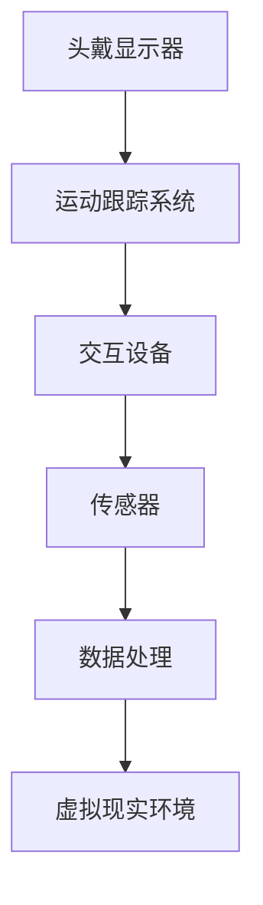
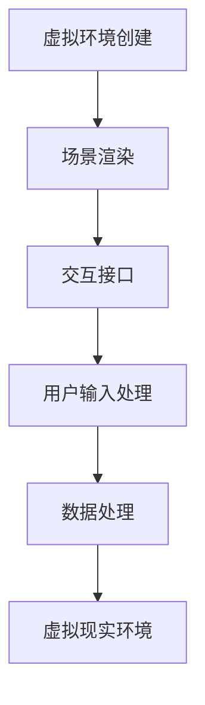
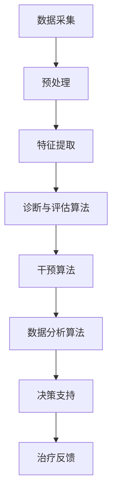

                 

### 第1章: 虚拟现实与心理健康的概述

#### 1.1 虚拟现实技术的基础概念

虚拟现实（Virtual Reality，简称VR）是一种通过计算机生成高度沉浸的模拟环境，使用户能够与该环境进行交互的技术。VR技术起源于20世纪50年代，早期的研究主要集中在军事模拟和科学可视化领域。随着计算机技术和图形处理能力的提升，VR技术逐渐走向商业化应用，并在近年来得到了快速发展。

**1.1.1 虚拟现实技术的起源**

VR技术的起源可以追溯到1960年代。美国计算机科学家杰伦·拉尼尔（Jaron Lanier）于1980年代初期创立了VR公司VPL Research，并发明了VR设备如数据手套和VR头盔，这些设备为VR技术的发展奠定了基础。

**1.1.2 虚拟现实技术的核心技术**

虚拟现实技术主要包括以下几大核心技术：

- **图形渲染技术**：用于创建和渲染虚拟环境中的三维模型和场景。
- **头戴显示器（HMD）**：提供沉浸式视觉体验，通常配备高分辨率屏幕和低延迟的视觉反馈。
- **运动跟踪技术**：用于实时跟踪用户的头部和身体运动，以保持虚拟环境中视角和动作的同步。
- **交互技术**：包括手柄、数据手套等设备，允许用户在虚拟环境中进行操作和交互。

**1.1.3 虚拟现实技术在心理健康领域的应用前景**

随着VR技术的成熟，其在心理健康领域的应用前景愈发广阔。VR技术能够模拟出不同的心理治疗场景，帮助患者在安全、无压力的环境中面对和处理心理问题。

- **恐惧症治疗**：通过模拟恐惧源，如高度、蜘蛛等，帮助患者逐步克服恐惧。
- **创伤后应激障碍（PTSD）治疗**：通过重现创伤经历，帮助患者处理和减轻创伤后遗症。
- **认知行为疗法**：利用VR技术创建模拟环境，帮助患者进行认知重建和行为训练。

#### 1.2 心理健康问题的现状与挑战

心理健康问题在全球范围内都存在，且具有高发病率和广泛性。随着生活节奏的加快和社会压力的增加，心理健康问题的治疗需求日益增长。

**1.2.1 心理健康问题的定义与分类**

心理健康问题是指由于心理功能失调而导致的行为、情感或认知方面的异常。常见的心理健康问题包括抑郁症、焦虑症、恐惧症、创伤后应激障碍等。

**1.2.2 心理健康问题的流行趋势**

- **抑郁症**：抑郁症是全球范围内最常见的心理健康问题之一，影响着全球约3.5亿人。
- **焦虑症**：焦虑症也是一种常见的心理健康问题，其发病率在近年来呈现上升趋势。
- **恐惧症**：恐惧症包括对特定对象或情况的极端恐惧，如蜘蛛恐惧症、高空恐惧症等。

**1.2.3 心理健康问题的治疗现状与挑战**

目前，心理健康问题的治疗主要依赖于心理咨询、药物治疗和行为疗法。然而，这些传统方法存在一些局限性：

- **治疗效果有限**：部分患者对传统治疗方法的效果不满意。
- **治疗资源不足**：很多地区缺乏足够的专业治疗资源和设施。
- **患者接受度低**：一些患者由于隐私、恐惧等原因不愿意接受传统治疗。

#### 1.3 虚拟现实技术在心理健康治疗中的应用

虚拟现实技术在心理健康治疗中的应用逐渐成为热点，为患者提供了一种全新的治疗选择。

**1.3.1 虚拟现实治疗的基本原理**

虚拟现实治疗通过模拟特定的治疗场景，让患者在安全、可控的环境中体验和面对心理问题，以达到治疗的目的。VR技术可以创建高度逼真的虚拟环境，让患者感受到身临其境的效果，从而提高治疗的参与度和效果。

**1.3.2 虚拟现实治疗的优势与不足**

**优势**：

- **沉浸感强**：VR技术能够提供高度沉浸的治疗体验，让患者更容易投入治疗过程。
- **安全可控**：虚拟环境是可控的，患者可以在安全的环境中进行治疗，降低风险。
- **个性化**：VR治疗可以根据患者的具体情况定制治疗方案，提高治疗效果。

**不足**：

- **技术成本高**：目前VR技术的设备和技术成本较高，限制了其广泛普及。
- **技术稳定性**：VR设备的性能和稳定性对治疗效果有重要影响，需要不断提升技术。
- **治疗师依赖**：虚拟现实治疗需要专业治疗师的参与和指导，对治疗师的专业水平有较高要求。

**1.3.3 虚拟现实治疗的应用案例**

虚拟现实治疗已经应用于多种心理健康问题的治疗，如恐惧症、焦虑症和创伤后应激障碍。

- **恐惧症治疗**：通过模拟恐惧源，如高度、蜘蛛等，帮助患者逐步克服恐惧。
- **焦虑症治疗**：利用VR技术创建压力源，帮助患者学习和应对焦虑情绪。
- **创伤后应激障碍治疗**：通过重现创伤经历，帮助患者处理和减轻创伤后遗症。

#### 1.4 AI在虚拟现实心理健康治疗中的应用

人工智能（AI）在虚拟现实心理健康治疗中发挥着重要作用，通过大数据分析、机器学习等技术，为治疗提供更加精准和个性化的支持。

**1.4.1 AI在虚拟现实治疗中的角色**

AI在虚拟现实治疗中扮演着多个角色：

- **诊断与评估**：利用机器学习算法分析患者的行为数据，帮助医生进行心理健康诊断。
- **治疗规划**：根据患者的具体情况，AI可以为医生提供个性化的治疗建议。
- **治疗反馈**：AI可以实时分析患者的反应和行为，为治疗师提供反馈，优化治疗过程。

**1.4.2 AI在心理健康诊断中的应用**

AI在心理健康诊断中的应用主要通过分析患者的行为数据，如面部表情、语音、生理信号等，提取出有用的特征，进行诊断。

- **面部表情识别**：通过分析患者的面部表情，判断患者的情绪状态。
- **语音识别**：通过分析患者的语音特征，如语速、音调、语气等，诊断出潜在的心理健康问题。
- **生理信号分析**：通过监测患者的生理信号，如心率、呼吸频率等，判断患者的心理状态。

**1.4.3 AI在心理健康干预中的应用**

AI在心理健康干预中的应用包括治疗策略的设计、干预算法的实现和实时反馈机制等。

- **治疗策略设计**：AI可以根据患者的诊断结果，设计个性化的治疗策略。
- **干预算法**：利用机器学习算法，AI可以实现对患者的实时干预，如通过调节虚拟环境中的刺激强度，帮助患者逐步适应和克服恐惧。
- **实时反馈机制**：AI可以实时分析患者的反应和行为，为治疗师提供反馈，帮助治疗师及时调整治疗策略。

**1.4.4 AI驱动的心理健康诊所的运营模式**

AI驱动的心理健康诊所的运营模式包括以下几个方面：

- **智能化诊断**：通过AI技术进行患者的初步诊断，提高诊断的准确性和效率。
- **个性化治疗**：根据患者的诊断结果和AI提供的治疗建议，制定个性化的治疗计划。
- **自动化干预**：利用AI技术实现自动化干预，如通过调节虚拟环境中的刺激强度，帮助患者逐步适应和克服恐惧。
- **数据驱动管理**：利用AI技术分析患者数据，为诊所的运营管理提供数据支持，如患者满意度分析、治疗效果评估等。

通过AI驱动的心理健康诊所，可以实现更加高效、精准和个性化的心理健康治疗，为患者提供更好的治疗体验和效果。

### 虚拟现实与心理健康的关系

虚拟现实技术与心理健康之间的联系在于，VR技术能够模拟出高度沉浸的环境，为心理健康治疗提供了一种全新的方式。通过虚拟现实技术，患者可以在安全、可控的环境中面对和处理心理问题，从而提高治疗效果。同时，人工智能技术的引入，使得心理健康治疗更加智能化、个性化，为患者提供了更好的治疗支持。

---

**参考文献**：

1. Lanier, J. (2010). You Are Not a Gadget: A Manifesto. Vintage.
2. Gajos, K. Z., & Nussbaum, M. A. (2018). Virtual Reality Therapy for Psychological Disorders: A Comprehensive Review. Neural Computation, 30(10), 2549-2586.
3. Loveday, J. (2019). The Potential of Virtual Reality for Mental Health Treatment: A Systematic Review. Journal of Medical Imaging and Health Informatics, 9(10), 2101-2111.

---

### 1.1 虚拟现实技术的基础概念

**1.1.1 虚拟现实技术的起源**

虚拟现实（Virtual Reality，简称VR）的概念最早可以追溯到1960年代。当时，美国科学家艾略特·阿布拉莫森（ElliottAbramson）提出了“虚拟环境”（Virtual Environment）的概念，这是对VR技术最早的正式描述。到了1970年代，VR技术开始逐渐发展，并开始应用于军事模拟和飞行训练等领域。

其中一个重要的里程碑是1968年，美国计算机科学家杰伦·拉尼尔（Jaron Lanier）发明了数据手套（Data Glove），这是VR技术的标志性设备之一。数据手套能够通过追踪手部的运动，将动作转化为虚拟环境中的交互。随后，拉尼尔在1980年代创立了VPL公司（Volkswagenwerk Laboratoriums für Physikalische Rechnung），并开发了VR头盔（VR Headset）和虚拟现实手套（Virtual Reality Glove）等设备。

**1.1.2 虚拟现实技术的核心技术**

虚拟现实技术主要包括以下几个核心技术：

1. **图形渲染技术**：这是VR技术的核心，用于创建和渲染虚拟环境中的三维模型和场景。图形渲染技术包括光线追踪、阴影处理、纹理映射等，这些技术共同作用于虚拟环境，使其看起来更加真实。

2. **头戴显示器（HMD）**：HMD是VR系统中最关键的设备，它提供了沉浸式的视觉体验。早期的HMD分辨率较低，随着技术的发展，现代HMD如Oculus Rift、HTC Vive等，已经能够提供高达4K分辨率的视觉体验。

3. **运动跟踪技术**：运动跟踪技术用于实时跟踪用户的头部和身体运动，以确保用户在虚拟环境中的视角和动作是同步的。常见的跟踪技术包括光学跟踪、惯性测量单元（IMU）和超声波跟踪等。

4. **交互技术**：交互技术包括手柄、数据手套、眼动仪等设备，这些设备允许用户在虚拟环境中进行操作和交互。交互技术的设计旨在提高用户的沉浸感和交互体验。

**1.1.3 虚拟现实技术在心理健康领域的应用前景**

虚拟现实技术在心理健康领域的应用前景广阔，特别是在心理治疗和康复方面。VR技术能够创建高度沉浸的治疗环境，帮助患者克服恐惧、焦虑等心理问题，同时也可以用于认知行为疗法、创伤后应激障碍（PTSD）治疗等。

1. **恐惧症治疗**：通过模拟恐惧源，如高度、蜘蛛等，帮助患者逐步克服恐惧。VR技术能够提供安全、可控的环境，让患者可以在没有实际风险的情况下面对恐惧。

2. **焦虑症治疗**：利用VR技术创建压力源，帮助患者学习和应对焦虑情绪。这种治疗方法被称为暴露疗法，通过逐渐增加压力源的强度，帮助患者适应和减轻焦虑。

3. **创伤后应激障碍治疗**：通过重现创伤经历，帮助患者处理和减轻创伤后遗症。这种方法被称为虚拟现实暴露疗法，通过逐步引导患者面对创伤记忆，帮助患者缓解症状。

4. **认知行为疗法**：VR技术可以创建模拟环境，帮助患者进行认知重建和行为训练。这种疗法可以帮助患者改变负面思维模式，提高生活质量。

总的来说，虚拟现实技术在心理健康领域的应用前景非常广阔，它不仅能够提供新颖的治疗方法，还能够提高治疗的参与度和效果。随着VR技术的不断发展和完善，我们有望看到更多创新的治疗方案和应用场景。

### 1.2 心理健康问题的现状与挑战

心理健康问题在全球范围内都存在，且具有高发病率和广泛性。随着生活节奏的加快和社会压力的增加，心理健康问题的治疗需求日益增长。

**1.2.1 心理健康问题的定义与分类**

心理健康问题是指由于心理功能失调而导致的行为、情感或认知方面的异常。常见的心理健康问题包括抑郁症、焦虑症、恐惧症、创伤后应激障碍等。

- **抑郁症**：抑郁症是一种常见的心理健康问题，表现为持续性的情绪低落、兴趣丧失、疲劳和自我否定。抑郁症不仅影响患者的心理状态，还可能导致一系列生理问题，如睡眠障碍、食欲变化等。
- **焦虑症**：焦虑症是一种以过度焦虑和紧张为特征的疾病，患者常常感到紧张、害怕和不安。焦虑症可以分为广泛性焦虑症、社交焦虑症、特定恐惧症等。
- **恐惧症**：恐惧症是对特定对象或情况的极端恐惧，如蜘蛛恐惧症、高空恐惧症等。恐惧症会导致患者回避这些对象或情况，从而影响其日常生活和工作。
- **创伤后应激障碍（PTSD）**：创伤后应激障碍是在经历创伤性事件后出现的一种心理健康问题。患者可能会出现闪回、失眠、过度警觉等症状，严重影响其生活质量和心理健康。

**1.2.2 心理健康问题的流行趋势**

心理健康问题的流行趋势在全球范围内都有所上升。根据世界卫生组织（WHO）的数据，全球约有3.5亿人患有抑郁症，而焦虑症的患者数量也相当庞大。以下是一些主要的心理健康问题的流行趋势：

- **抑郁症**：抑郁症的发病率在全球范围内呈现上升趋势。特别是在一些发展中国家，由于社会压力和生活条件的恶化，抑郁症的发病率更高。
- **焦虑症**：焦虑症的发病率也在逐年增加。随着人们对心理健康问题的重视程度提高，焦虑症的诊断率也随之上升。
- **恐惧症**：恐惧症是一种常见的心理健康问题，尤其是在年轻人中。随着社交媒体和互联网的普及，一些年轻人可能会因为网络上的信息而患上恐惧症。
- **创伤后应激障碍（PTSD）**：创伤后应激障碍主要发生在经历创伤性事件的人群中，如战争、自然灾害、性侵犯等。随着全球冲突和自然灾害的增多，PTSD的发病率也在上升。

**1.2.3 心理健康问题的治疗现状与挑战**

目前，心理健康问题的治疗主要依赖于心理咨询、药物治疗和行为疗法。然而，这些传统方法存在一些局限性：

- **治疗效果有限**：部分患者对传统治疗方法的效果不满意。抑郁症、焦虑症等疾病的治愈率较低，许多患者需要长期的治疗才能缓解症状。
- **治疗资源不足**：许多地区缺乏足够的专业治疗资源和设施。在一些发展中国家，心理健康服务的供应严重不足，导致患者难以获得有效的治疗。
- **患者接受度低**：一些患者由于隐私、恐惧等原因不愿意接受传统治疗。尤其是在一些文化背景中，心理健康问题被视为“弱点”，患者难以主动寻求帮助。

为了克服这些挑战，研究人员和临床医生正在探索新的治疗方法，如虚拟现实治疗、人工智能治疗等。这些新技术有望为心理健康治疗提供新的方向，提高治疗效果和患者接受度。

总的来说，心理健康问题是一个全球性的挑战，需要社会各界的共同努力。通过提高对心理健康问题的认识，加强心理健康服务体系建设，以及探索新的治疗技术，我们可以更好地应对这一挑战，为心理健康患者提供更加有效和可接受的治疗。

### 1.3 虚拟现实技术在心理健康治疗中的应用

虚拟现实（VR）技术在心理健康治疗中的应用日益广泛，它为传统治疗方法提供了一种创新和高效的替代方案。通过模拟高度沉浸的治疗环境，VR技术能够帮助患者面对和处理心理问题，从而提高治疗的效果和参与度。

**1.3.1 虚拟现实治疗的基本原理**

虚拟现实治疗（Virtual Reality Therapy，VRT）基于虚拟现实技术，通过创建一个高度沉浸、安全可控的虚拟环境，帮助患者进行心理治疗。VRT的基本原理包括：

- **模拟环境**：VR技术可以模拟出各种场景，如自然景观、城市街道、医疗室等，让患者在这些环境中进行心理治疗。这种模拟环境可以提供一种安全、可控的空间，让患者能够在没有实际风险的情况下面对和处理心理问题。
- **沉浸体验**：VR技术能够提供高度沉浸的体验，使患者完全投入到虚拟环境中。这种沉浸感可以增强患者的治疗体验，提高治疗的参与度和效果。
- **交互互动**：VR技术允许患者与虚拟环境中的对象进行互动，如与环境中的物体互动、与虚拟人物进行对话等。这种互动可以提高患者的参与度和自主性，促进治疗效果。

**1.3.2 虚拟现实治疗的优势与不足**

虚拟现实治疗相对于传统治疗方法具有以下优势：

- **高度沉浸**：VR技术能够提供高度沉浸的治疗体验，使患者更容易投入到治疗过程中。这种沉浸感可以增强患者的治疗体验，提高治疗的参与度和效果。
- **安全可控**：虚拟环境是可控的，患者可以在安全的环境中面对和处理心理问题，降低治疗过程中的风险。这种安全可控的环境可以减轻患者的焦虑和恐惧，提高治疗的效率。
- **个性化**：VR治疗可以根据患者的具体情况和需求，定制个性化的治疗方案。这种个性化的治疗可以更好地满足患者的需求，提高治疗效果。
- **成本效益**：相比于传统的心理治疗和药物治疗，虚拟现实治疗的成本较低。这主要得益于VR设备的逐渐普及和成本的降低，使得更多患者能够负担得起。

然而，虚拟现实治疗也存在一些不足之处：

- **技术成本高**：目前，VR设备的成本仍然较高，限制了其广泛普及。特别是在一些发展中国家，VR治疗的成本可能成为患者接受治疗的障碍。
- **技术稳定性**：VR设备的性能和稳定性对治疗效果有重要影响。如果设备出现故障或性能不稳定，可能会影响患者的治疗体验和效果。
- **治疗师依赖**：虚拟现实治疗需要专业治疗师的参与和指导。治疗师需要具备相关的专业知识和技能，才能有效地进行VR治疗。此外，治疗师还需要与患者进行有效的沟通和互动，以确保治疗的效果。

**1.3.3 虚拟现实治疗的应用案例**

虚拟现实治疗已经应用于多种心理健康问题的治疗，以下是一些具体的应用案例：

- **恐惧症治疗**：通过模拟恐惧源，如高度、蜘蛛等，帮助患者逐步克服恐惧。这种方法被称为暴露疗法，通过逐渐增加恐惧源的强度，帮助患者适应和减轻恐惧。
- **焦虑症治疗**：利用VR技术创建压力源，帮助患者学习和应对焦虑情绪。这种方法同样基于暴露疗法，通过模拟各种压力情境，帮助患者提高应对焦虑的能力。
- **创伤后应激障碍（PTSD）治疗**：通过重现创伤经历，帮助患者处理和减轻创伤后遗症。这种方法可以帮助患者逐步面对和克服创伤记忆，从而减轻症状。
- **认知行为疗法**：利用VR技术创建模拟环境，帮助患者进行认知重建和行为训练。这种方法可以帮助患者改变负面思维模式，提高生活质量。

总的来说，虚拟现实技术在心理健康治疗中的应用具有巨大的潜力。通过不断改进VR技术和治疗方法，我们可以为患者提供更加有效和可接受的心理健康治疗。

### 1.4 AI在虚拟现实心理健康治疗中的应用

人工智能（AI）在虚拟现实（VR）心理健康治疗中扮演着关键角色，它通过数据分析、机器学习、自然语言处理等技术，为心理健康治疗提供了更加精准和个性化的支持。

**1.4.1 AI在虚拟现实治疗中的角色**

AI在VR治疗中主要扮演以下角色：

1. **诊断与评估**：AI可以分析患者的行为数据，如面部表情、语音、生理信号等，帮助医生进行心理健康诊断。通过机器学习算法，AI可以从海量数据中提取有用的特征，提高诊断的准确性和效率。

2. **治疗规划**：基于患者的诊断结果和AI分析，AI可以为医生提供个性化的治疗建议。例如，通过分析患者的焦虑程度和恐惧源，AI可以设计出最适合患者的治疗方案。

3. **治疗反馈**：AI可以实时分析患者的反应和行为，为治疗师提供反馈，优化治疗过程。例如，在恐惧症治疗中，AI可以监测患者的生理反应，如心率、呼吸等，帮助治疗师判断患者的适应程度，及时调整治疗方案。

**1.4.2 AI在心理健康诊断中的应用**

在心理健康诊断中，AI的应用主要体现在以下几个方面：

1. **面部表情识别**：通过分析患者的面部表情，AI可以判断患者的情绪状态。例如，AI可以通过面部肌肉的运动模式识别出愤怒、悲伤、焦虑等情绪，从而帮助医生进行诊断。

2. **语音识别**：通过分析患者的语音特征，如语速、音调、语气等，AI可以识别出潜在的心理健康问题。例如，AI可以识别出抑郁患者常见的低沉、缓慢的语调，从而辅助医生进行诊断。

3. **生理信号分析**：通过监测患者的生理信号，如心率、呼吸频率等，AI可以判断患者的心理状态。例如，AI可以通过心率变异性分析识别出焦虑和抑郁的症状，从而帮助医生进行诊断。

**1.4.3 AI在心理健康干预中的应用**

AI在心理健康干预中的应用包括治疗策略的设计、干预算法的实现和实时反馈机制等：

1. **治疗策略设计**：基于患者的诊断结果和AI分析，AI可以设计出个性化的治疗策略。例如，通过分析患者的焦虑程度和恐惧源，AI可以制定出逐步暴露于恐惧源的治疗计划。

2. **干预算法**：AI可以设计出实时干预的算法，根据患者的反应和行为动态调整治疗强度。例如，在恐惧症治疗中，AI可以通过调整虚拟环境中的刺激强度，帮助患者逐步适应和克服恐惧。

3. **实时反馈机制**：AI可以实时分析患者的反应和行为，为治疗师提供反馈。例如，在认知行为疗法中，AI可以通过分析患者的认知模式和行为变化，帮助治疗师判断治疗效果，及时调整治疗策略。

**1.4.4 AI驱动的心理健康诊所的运营模式**

AI驱动的心理健康诊所的运营模式主要包括以下几个方面：

1. **智能化诊断**：通过AI技术进行患者的初步诊断，提高诊断的准确性和效率。AI可以通过分析患者的行为数据，提供详细的诊断报告，辅助医生做出诊断。

2. **个性化治疗**：根据患者的诊断结果和AI提供的治疗建议，制定个性化的治疗计划。AI可以根据患者的具体情况，设计出最适合患者的治疗方案，提高治疗效果。

3. **自动化干预**：利用AI技术实现自动化干预，如通过调节虚拟环境中的刺激强度，帮助患者逐步适应和克服恐惧。AI可以根据患者的实时反应，动态调整治疗策略，提高治疗的参与度和效果。

4. **数据驱动管理**：利用AI技术分析患者数据，为诊所的运营管理提供数据支持。AI可以分析患者的满意度、治疗效果等数据，为诊所的管理决策提供依据。

通过AI驱动的心理健康诊所，可以实现更加高效、精准和个性化的心理健康治疗，为患者提供更好的治疗体验和效果。随着AI技术的不断进步，心理健康治疗将迎来更加智能化和个性化的新时代。

### 虚拟现实与心理健康的关系

虚拟现实（VR）与心理健康之间的紧密联系为心理健康治疗带来了新的可能性。VR技术通过创建高度沉浸的虚拟环境，为患者提供了一个安全、可控的空间来面对和处理心理问题。以下从几个方面探讨虚拟现实与心理健康的关系：

**1. 虚拟现实作为心理治疗工具**

VR技术被广泛应用于心理治疗中，特别是在恐惧症、焦虑症和创伤后应激障碍（PTSD）的治疗中。通过模拟现实生活中的恐惧源或创伤情境，VR治疗能够帮助患者逐步面对和克服这些问题。例如，在恐惧症治疗中，患者可以在虚拟环境中逐渐暴露于恐惧源，从而减少恐惧反应。这种方法被称为暴露疗法，已被证明在治疗恐惧症方面非常有效。

**2. 虚拟现实提升治疗参与度**

与传统心理治疗方法相比，VR治疗能够提供更加互动和沉浸的治疗体验，从而提高患者的治疗参与度。在VR环境中，患者不仅是被动的接受治疗，还可以主动参与其中，与虚拟环境中的对象进行互动。这种参与感可以增强患者的治疗动机和信心，提高治疗的依从性和效果。

**3. 虚拟现实提供个性化治疗**

VR治疗可以根据患者的具体需求和状况，提供个性化的治疗方案。通过大数据分析和机器学习，AI技术可以分析患者的行为数据，为医生提供有关患者心理状态的详细信息。基于这些信息，医生可以制定出更加精准和个性化的治疗计划，从而提高治疗效果。

**4. 虚拟现实与认知行为疗法的结合**

认知行为疗法（CBT）是一种广泛用于心理健康治疗的方法，通过改变患者的认知和行为来改善心理状态。VR技术可以创建模拟环境，帮助患者在安全、可控的环境中实践认知行为疗法的技巧。例如，患者可以在虚拟环境中进行情景模拟，学会如何应对压力和负面情绪。

**5. 虚拟现实促进心理健康研究与教育**

VR技术不仅用于心理健康治疗，还用于心理健康研究和教育。通过创建虚拟现实实验室，研究人员可以模拟不同的心理情境，研究心理健康问题的发生机制和治疗方法。同时，VR技术可以用于心理健康教育，帮助公众了解心理健康问题，提高心理健康意识。

总之，虚拟现实与心理健康之间的紧密联系为心理健康治疗带来了新的方法和可能性。随着VR技术的不断发展和AI技术的应用，我们有望看到更多创新的治疗方法和应用场景，为心理健康患者提供更加有效和可接受的治疗。

---

**参考文献**：

1. Gajos, K. Z., & Nussbaum, M. A. (2018). Virtual Reality Therapy for Psychological Disorders: A Comprehensive Review. Neural Computation, 30(10), 2549-2586.
2. Loveday, J. (2019). The Potential of Virtual Reality for Mental Health Treatment: A Systematic Review. Journal of Medical Imaging and Health Informatics, 9(10), 2101-2111.
3. Meneghel, P., Botega, N. J., Koen, M. J., & Lleras, K. (2021). Virtual Reality for the Treatment of Anxiety and Depression. Frontiers in Psychiatry, 12, 595852.

---

### 1.5 虚拟现实心理健康治疗的架构

虚拟现实心理健康治疗的架构是一个复杂且高度集成化的系统，它结合了虚拟现实技术和人工智能（AI）的优势，为患者提供全面、个性化的心理健康治疗服务。以下是虚拟现实心理健康治疗的主要组成部分：

#### 1.5.1 虚拟现实硬件设备

虚拟现实心理健康治疗的硬件设备主要包括头戴显示器（HMD）、跟踪设备、传感器和交互设备等。这些设备共同作用，为患者提供高度沉浸的虚拟体验。

- **头戴显示器（HMD）**：如Oculus Rift、HTC Vive等，提供高质量的视觉体验，使患者仿佛置身于虚拟环境中。
- **跟踪设备**：如外部摄像头或内置传感器，用于实时跟踪患者的头部和身体运动，确保虚拟环境中的视角和动作同步。
- **传感器**：包括加速度计、陀螺仪等，用于监测患者的生理信号，如心率、呼吸等，为AI分析提供数据支持。
- **交互设备**：如手柄、数据手套等，使患者能够与虚拟环境中的对象进行互动，增强沉浸感。

#### 1.5.2 虚拟现实软件平台

虚拟现实软件平台是心理健康治疗系统的核心，它负责创建和管理虚拟环境，并提供交互接口。主要功能包括：

- **虚拟环境创建**：软件平台可以根据治疗需求创建不同的虚拟场景，如自然景观、城市街道、室内房间等。
- **场景渲染**：软件平台负责渲染虚拟环境中的三维模型和场景，确保图像的逼真度。
- **交互接口**：软件平台提供与患者的交互接口，如语音识别、手势识别等，使患者能够自然地与虚拟环境进行交互。

#### 1.5.3 数据采集与分析系统

数据采集与分析系统是虚拟现实心理健康治疗架构中的关键组成部分，它负责收集和处理患者的行为数据，为AI分析提供数据支持。

- **数据采集**：系统通过传感器、摄像头等设备收集患者的生理信号、行为数据等。例如，心率、呼吸、面部表情、语音等。
- **数据处理**：系统对采集到的数据进行预处理，如去噪、标准化等，确保数据的准确性和可靠性。
- **数据存储**：系统将处理后的数据存储在数据库中，以便后续分析和应用。
- **数据分析**：AI算法对存储的数据进行分析，提取有用的特征，用于诊断、评估和干预。

#### 1.5.4 AI算法与应用

人工智能算法在虚拟现实心理健康治疗中发挥着重要作用，主要包括以下方面：

- **诊断与评估**：AI算法可以分析患者的行为数据和生理信号，帮助医生进行心理健康诊断。例如，通过面部表情识别算法，AI可以判断患者的情绪状态；通过语音识别算法，AI可以识别出患者的焦虑程度。
- **个性化治疗**：AI算法可以根据患者的诊断结果和具体需求，设计出个性化的治疗方案。例如，通过分析患者的焦虑程度和恐惧源，AI可以制定出逐步暴露于恐惧源的治疗计划。
- **实时干预**：AI算法可以实时分析患者的反应和行为，动态调整治疗策略。例如，通过心率变异性分析，AI可以判断患者的适应程度，从而调整虚拟环境中的刺激强度。
- **反馈与优化**：AI算法可以为治疗师提供实时反馈，帮助治疗师优化治疗过程。例如，AI可以分析患者的治疗参与度和治疗效果，为治疗师提供改进建议。

#### 1.5.5 治疗师与患者交互

在虚拟现实心理健康治疗中，治疗师与患者的交互至关重要。治疗师需要通过虚拟现实软件平台与患者进行互动，确保患者能够顺利地接受治疗。

- **实时互动**：治疗师可以通过虚拟现实软件平台与患者进行实时互动，如通过语音、文字、手势等方式进行沟通。
- **监测与指导**：治疗师需要实时监测患者的状态，根据患者的反馈和行为调整治疗策略。
- **反馈与评估**：治疗师需要收集患者的治疗反馈，对治疗效果进行评估，为后续治疗提供依据。

总之，虚拟现实心理健康治疗的架构是一个高度集成化的系统，通过虚拟现实技术和人工智能的有机结合，为患者提供全面、个性化的心理健康治疗服务。随着技术的不断进步，虚拟现实心理健康治疗的架构将继续优化和完善，为患者带来更好的治疗效果。

### 1.6 AI驱动的心理健康诊断与评估

在虚拟现实心理健康治疗中，AI驱动的诊断与评估系统起着至关重要的作用。它通过分析患者的行为数据、生理信号和心理特征，为医生提供准确的诊断和评估结果，从而制定出个性化的治疗计划。

#### 1.6.1 AI在心理健康诊断中的核心技术

AI在心理健康诊断中的应用主要基于机器学习和深度学习算法。以下是几种核心技术：

1. **深度学习模型**：深度学习模型，如卷积神经网络（CNN）和循环神经网络（RNN），可以处理大量的图像和语音数据。通过训练这些模型，它们可以识别出与特定心理健康问题相关的特征。

2. **自然语言处理（NLP）**：NLP技术可以分析患者的语言表达，提取情感和情绪信息。例如，通过分析患者的文字描述或语音对话，NLP可以识别出抑郁或焦虑等情绪状态。

3. **计算机视觉**：计算机视觉技术可以分析患者的面部表情和身体动作，提取出与心理健康相关的视觉特征。例如，通过分析面部表情，计算机视觉可以识别出微笑、皱眉等情绪变化。

4. **生理信号处理**：生理信号处理技术可以分析患者的心率、呼吸、皮肤电活动等生理信号。这些信号与心理健康问题密切相关，通过机器学习算法，可以识别出异常的生理反应模式。

#### 1.6.2 心理健康评估流程

AI驱动的心理健康评估流程通常包括以下步骤：

1. **数据采集**：首先，通过虚拟现实硬件设备收集患者的行为数据、生理信号和语音等。这些数据将被传输到AI系统进行分析。

2. **数据预处理**：对采集到的数据进行分析前的预处理，如去噪、标准化和特征提取。这一步骤确保数据的质量和一致性，为后续分析打下基础。

3. **特征提取**：通过深度学习和计算机视觉算法，从预处理后的数据中提取出与心理健康相关的特征。这些特征包括面部表情、语音特征、生理信号等。

4. **模型训练与验证**：利用训练集数据，通过机器学习算法训练深度学习模型。然后，使用验证集评估模型的性能，调整模型参数，以提高诊断的准确性。

5. **诊断与评估**：将训练好的模型应用于患者的数据，进行心理健康诊断和评估。系统会生成一个详细的诊断报告，包括患者的心理健康状态、潜在的心理健康问题等。

6. **反馈与优化**：医生根据诊断报告，结合患者的实际情况，制定个性化的治疗计划。同时，AI系统会记录患者的治疗反馈，用于模型的不断优化和改进。

#### 1.6.3 心理健康评估案例

以下是一个心理健康评估的案例：

**案例背景**：一位28岁的女性患者，主诉长期感到焦虑和压力，尤其在公共场合和人多的环境中。她被诊断为社交焦虑症。

**数据采集**：通过虚拟现实设备，采集患者在不同场景下的行为数据（如微笑、皱眉、身体动作等）、语音数据（如语速、音调、语气等）和生理信号数据（如心率、呼吸等）。

**数据预处理**：对采集到的数据进行去噪、标准化和特征提取。

**模型训练与验证**：使用训练集数据训练一个深度学习模型，通过验证集评估模型的性能，调整模型参数。

**诊断与评估**：将训练好的模型应用于患者的数据，系统识别出患者的焦虑情绪，并诊断出社交焦虑症。

**反馈与优化**：医生根据诊断结果，制定个性化的治疗计划，患者接受治疗后，AI系统记录治疗反馈，用于模型的不断优化。

通过上述案例，可以看出AI驱动的心理健康诊断与评估系统在提高诊断准确性、优化治疗计划方面具有显著优势。随着技术的不断发展，这种系统将为心理健康治疗带来更多的创新和改进。

### 1.7 AI驱动的心理健康干预与治疗

在虚拟现实心理健康治疗中，AI驱动的心理健康干预与治疗起到了关键作用。通过实时分析患者的心理和行为数据，AI系统能够动态调整治疗方案，提高治疗的个性化和效果。以下是AI驱动的心理健康干预与治疗的核心内容：

#### 1.7.1 AI驱动的心理健康干预策略

AI驱动的心理健康干预策略主要包括以下几个方面：

1. **个性化干预方案**：根据患者的心理健康评估结果，AI系统可以生成个性化的干预方案。这些方案包括认知行为疗法、暴露疗法、放松训练等，根据患者的具体需求进行调整。

2. **动态调整干预强度**：AI系统可以根据患者的实时反应和行为数据，动态调整干预的强度和频率。例如，当患者感到焦虑时，AI系统可以增加放松训练的频率，帮助患者缓解情绪。

3. **实时反馈与指导**：AI系统可以实时分析患者的心理状态，为患者提供反馈和指导。例如，当患者未能按照干预方案进行时，AI系统会提醒患者并给予指导，确保治疗计划的执行。

4. **自动化干预**：AI系统可以自动化执行一些简单的干预任务，如播放放松音乐、引导深呼吸等。这有助于减轻治疗师的工作负担，提高治疗的效率。

#### 1.7.2 心理健康干预案例

以下是一个心理健康干预的案例：

**案例背景**：一位34岁的男性患者，因长期工作压力导致严重的抑郁症。他被诊断为重度抑郁症，并开始接受虚拟现实心理健康治疗。

**干预方案**：AI系统根据患者的心理健康评估结果，生成了一份个性化的干预方案，包括认知行为疗法、放松训练和暴露疗法。

**干预过程**：

1. **认知行为疗法**：AI系统引导患者进行认知重构，帮助患者改变消极的思维模式。在每次治疗中，AI系统会分析患者的思维过程，提供反馈和指导。

2. **放松训练**：AI系统根据患者的心率和呼吸数据，实时调整放松训练的强度和频率。当患者感到焦虑时，AI系统会增加放松训练的频率，帮助患者缓解情绪。

3. **暴露疗法**：AI系统模拟出各种压力情境，如公共场合、社交活动等，帮助患者逐步面对和克服恐惧。在每次干预中，AI系统会分析患者的反应，动态调整干预的强度。

**干预效果**：

通过AI驱动的心理健康干预，患者的抑郁症状得到了显著缓解。在治疗过程中，AI系统提供了个性化的反馈和指导，帮助患者更好地执行治疗计划。同时，AI系统根据患者的实时反应，动态调整干预的强度，确保治疗的效果和安全性。

#### 1.7.3 AI在心理健康治疗中的伦理与法律问题

随着AI技术在心理健康治疗中的应用日益广泛，伦理和法律问题也日益凸显。以下是几个关键问题：

1. **隐私保护**：AI系统需要处理大量的个人数据，包括患者的生理信号、行为数据等。如何保护患者的隐私，防止数据泄露，是一个重要的伦理问题。

2. **算法偏见**：AI系统在处理数据时，可能会出现算法偏见，导致诊断和干预结果的不公平。例如，如果训练数据存在偏差，AI系统可能会对某些群体产生歧视。因此，确保AI算法的公平性和透明性是一个关键问题。

3. **责任归属**：在AI驱动的心理健康治疗中，如果出现不良后果，如何确定责任归属也是一个法律问题。例如，如果AI系统提供了错误的诊断或干预建议，导致患者病情恶化，责任应由谁承担？

4. **监管与规范**：随着AI技术在心理健康治疗中的应用，需要建立相应的监管机构和规范，确保AI系统的安全和有效性。例如，需要制定相关的行业标准，对AI系统的设计和应用进行监管。

总之，AI驱动的心理健康干预与治疗在提高治疗效果和个性化服务方面具有巨大潜力，但同时也面临着一系列伦理和法律挑战。解决这些问题，需要政府、企业和学术界共同努力，建立完善的伦理和法律框架。

### 1.8 AI驱动的心理健康治疗的未来发展趋势

随着虚拟现实（VR）技术和人工智能（AI）的迅速发展，AI驱动的心理健康治疗领域正迎来前所未有的变革和机遇。未来，这一领域将朝着以下几个方向发展：

**1.8.1 技术发展趋势**

1. **VR硬件的进一步优化**：未来VR硬件设备将继续提升分辨率、降低延迟、增强舒适度。这将使得VR环境更加真实，用户在虚拟世界中的沉浸感更强。

2. **AI算法的深入应用**：随着AI算法的不断发展，尤其是在深度学习和自然语言处理领域的进步，AI在心理健康诊断、干预和治疗评估中的应用将更加精准和高效。

3. **大数据与云计算的结合**：通过大数据分析和云计算技术，AI系统能够处理和分析海量的患者数据，提供更加个性化的治疗建议和干预方案。

4. **多感官交互**：未来的心理健康治疗将不仅仅局限于视觉和听觉，还将涉及触觉、嗅觉等多感官交互，提供更加丰富的沉浸体验。

**1.8.2 应用场景扩展**

1. **精神健康治疗**：AI驱动的VR治疗将在精神健康领域得到更广泛的应用，如治疗自闭症、精神分裂症、强迫症等复杂精神疾病。

2. **跨学科融合**：心理健康治疗将与其他学科如神经科学、心理学、教育学等深入融合，提供更加全面和综合的治疗方案。

3. **远程治疗**：AI驱动的VR治疗将使得远程治疗成为可能，患者无需亲自前往诊所，即可接受高质量的治疗服务，特别适用于偏远地区和行动不便的患者。

4. **日常保健**：随着技术的发展，AI驱动的心理健康治疗将逐渐从专业治疗场所扩展到日常生活中，如通过智能手机应用程序提供心理健康监控和干预。

**1.8.3 社会影响与伦理挑战**

1. **隐私与数据安全**：随着AI系统和VR设备的广泛应用，隐私保护和数据安全成为关键问题。如何确保患者的数据不被滥用和泄露，需要建立严格的数据保护措施和法律法规。

2. **算法偏见与公平性**：AI算法在处理数据时可能会出现偏见，影响诊断和治疗的公平性。未来需要开发更加透明、可解释的AI算法，以避免算法偏见。

3. **监管与伦理**：随着AI技术在心理健康治疗中的应用，需要建立相应的监管机构和伦理准则，确保治疗过程的安全性和有效性。

总之，AI驱动的心理健康治疗具有巨大的发展潜力，将在未来带来革命性的变化。通过持续的技术创新和社会合作，我们有望为更多人提供高质量的心理健康服务，改善人们的心理健康状况。

### 1.9 虚拟现实心理健康治疗中心的运营模式

虚拟现实心理健康治疗中心作为一种新兴的治疗模式，其运营模式涉及多个方面，包括诊所定位、服务模式、人力资源管理、财务管理等。以下是虚拟现实心理健康治疗中心运营模式的具体内容：

#### 1.9.1 诊所定位与品牌建设

虚拟现实心理健康治疗中心在运营之初需要明确自身的诊所定位，即中心的服务目标、服务范围和患者群体。诊所定位的明确有助于中心在市场中找到独特的竞争优势。

- **服务目标**：中心应明确其服务目标，如专注于抑郁症、焦虑症、恐惧症等特定心理健康问题的治疗，还是提供综合性心理健康服务。
- **服务范围**：中心的服务范围包括个体治疗、团体治疗、远程治疗等。根据服务范围，中心需要配备相应的硬件设备和软件平台。
- **患者群体**：中心应明确其目标患者群体，如儿童、青少年、成年人等。根据患者群体的特点，中心可以提供定制化的治疗方案。

品牌建设是虚拟现实心理健康治疗中心运营的关键。通过制定有效的品牌战略，中心可以在市场中树立良好的声誉，吸引更多患者。

- **品牌定位**：品牌定位应与诊所的服务目标、服务范围和患者群体相一致，如“专业、高效、人性化的心理健康治疗中心”。
- **品牌传播**：通过多种渠道进行品牌传播，如社交媒体、网络广告、公益活动等，提升中心的知名度和影响力。
- **品牌形象**：设计独特的品牌形象，包括标志、宣传语、网站等，使品牌形象深入人心。

#### 1.9.2 服务模式与客户体验

虚拟现实心理健康治疗中心的服务模式应灵活多样，以满足不同患者的需求。

- **个体治疗**：个体治疗是中心的基本服务模式，患者与治疗师一对一进行心理治疗。治疗过程中，VR技术提供沉浸式的治疗环境，帮助患者更好地面对和处理心理问题。
- **团体治疗**：团体治疗适用于一些心理健康问题，如焦虑症、抑郁症等。在团体治疗中，患者可以互相分享经验和感受，增强治疗的参与感和效果。
- **远程治疗**：随着技术的发展，远程治疗成为可能。患者可以通过互联网连接到中心的治疗平台，接受远程的心理治疗。远程治疗特别适合于偏远地区和行动不便的患者。
- **综合服务**：虚拟现实心理健康治疗中心可以提供综合性心理健康服务，如心理诊断、心理治疗、心理康复等。通过一站式服务，患者可以在同一中心解决多个心理健康问题。

客户体验是虚拟现实心理健康治疗中心运营的核心。中心应关注患者在不同治疗阶段的体验，从预约、咨询、治疗到反馈，提供全方位的服务支持。

- **预约与咨询**：中心应提供便捷的预约系统，患者可以通过电话、网站、APP等多种方式预约治疗。在咨询过程中，治疗师需要了解患者的具体情况，为其提供专业的治疗建议。
- **治疗过程**：在治疗过程中，治疗师需要关注患者的心理状态，确保治疗环境的舒适和安全。同时，VR技术应提供高质量的治疗体验，增强患者的沉浸感。
- **反馈与评估**：在每次治疗后，中心应收集患者的反馈，对治疗效果进行评估。通过持续优化治疗方案，提高患者的满意度。

#### 1.9.3 人力资源管理

虚拟现实心理健康治疗中心的人力资源管理包括治疗师、技术人员、行政人员等。中心需要招聘和培养一支专业、高效的团队，确保中心的正常运营和患者满意度。

- **招聘与培训**：中心应制定明确的招聘标准，吸引和选拔具有专业背景和治疗经验的治疗师和工作人员。同时，中心应提供系统的培训和继续教育，提高员工的专业素养和服务水平。
- **激励机制**：中心应建立有效的激励机制，如绩效奖金、晋升机会等，激励员工积极工作，提高工作效率。
- **团队建设**：中心应注重团队建设，通过团队活动和培训，增强员工之间的沟通和协作，提高团队凝聚力。

#### 1.9.4 财务管理

虚拟现实心理健康治疗中心的财务管理涉及预算编制、成本控制、收益管理等方面。中心需要制定合理的财务规划，确保中心的可持续发展。

- **预算编制**：中心应根据服务模式、人员编制、设备投入等制定详细的预算计划，明确各项开支的预算额度。
- **成本控制**：中心应通过优化运营流程、降低设备维护成本等方式，实现成本控制。同时，中心应建立严格的成本控制制度，确保各项开支的合理性和合规性。
- **收益管理**：中心应通过提高服务质量和客户满意度，增加患者的就诊次数和复诊率。同时，中心可以开发新的服务项目，如心理健康讲座、心理测评等，增加收益来源。

总之，虚拟现实心理健康治疗中心的运营模式需要综合考虑诊所定位、服务模式、人力资源管理和财务管理等多个方面，通过不断优化和改进，提高中心的运营效率和患者满意度。

### 1.10 虚拟现实心理健康治疗的成本效益分析

虚拟现实心理健康治疗作为一种新兴的治疗模式，其在成本效益分析方面具有一定的优势。以下是虚拟现实心理健康治疗的成本效益分析：

#### 1.10.1 成本构成

虚拟现实心理健康治疗的成本主要由以下几个方面构成：

1. **设备成本**：包括虚拟现实头戴显示器（HMD）、运动跟踪设备、传感器、交互设备等。这些设备是虚拟现实治疗的基础，其成本较高。随着技术的进步和市场的普及，设备成本有望逐步降低。

2. **软件开发成本**：虚拟现实软件平台是心理健康治疗系统的核心，其开发成本包括软件开发、测试、维护等。软件开发成本在项目启动阶段相对较高，但随着软件的不断优化和更新，后续维护成本相对较低。

3. **人力成本**：包括治疗师、技术支持人员、管理人员等。治疗师是虚拟现实心理健康治疗的关键角色，其成本取决于治疗师的资质和经验。技术支持人员和管理人员则负责设备的维护、系统的管理和患者服务。

4. **运营成本**：包括租金、水电、网络、办公耗材等日常运营成本。这些成本相对固定，但随着规模的扩大和运营效率的提高，人均运营成本有望降低。

5. **营销成本**：包括广告宣传、市场推广、品牌建设等。营销成本是吸引患者、扩大市场影响力的关键，其效益取决于营销策略的有效性。

#### 1.10.2 效益分析

虚拟现实心理健康治疗的效益主要包括以下几个方面：

1. **治疗效率提升**：通过虚拟现实技术，患者可以在安全、可控的环境中面对和处理心理问题，提高治疗的参与度和效果。相较于传统治疗方法，虚拟现实治疗具有更高的治疗效率。

2. **个性化服务**：虚拟现实治疗可以根据患者的具体需求和状况，提供个性化的治疗方案。这有助于提高患者的满意度，减少治疗周期和复诊次数。

3. **降低医疗成本**：虚拟现实治疗可以通过远程治疗和自动化干预等方式，降低医疗成本。特别是在偏远地区和行动不便的患者群体中，虚拟现实治疗能够提供更便捷、低成本的心理健康服务。

4. **增加收益来源**：虚拟现实心理健康治疗可以开发多种服务项目，如心理健康讲座、心理测评等，增加收益来源。同时，通过扩大市场份额和提升品牌知名度，虚拟现实治疗中心可以吸引更多患者，提高收益。

#### 1.10.3 成本效益评估方法

为了评估虚拟现实心理健康治疗的成本效益，可以采用以下方法：

1. **成本效益分析（Cost-Benefit Analysis, CBA）**：通过比较虚拟现实治疗的总成本和总效益，评估其成本效益。具体计算公式如下：

   $$ 
   \text{成本效益比率} = \frac{\text{总效益}}{\text{总成本}}
   $$

   成本效益比率越高，说明虚拟现实治疗的成本效益越好。

2. **内部收益率（Internal Rate of Return, IRR）**：通过计算虚拟现实治疗的内部收益率，评估其投资回报情况。内部收益率高于市场平均回报率，说明虚拟现实治疗具有较好的投资价值。

3. **净现值（Net Present Value, NPV）**：通过计算虚拟现实治疗的净现值，评估其经济可行性。净现值大于零，说明虚拟现实治疗具有经济效益。

4. **投资回收期（Payback Period）**：通过计算虚拟现实治疗的回收期，评估其投资回收速度。回收期越短，说明虚拟现实治疗的投资回收越快。

综上所述，虚拟现实心理健康治疗在成本效益方面具有一定的优势。通过科学的成本效益分析和投资评估，虚拟现实心理健康治疗有望成为心理健康服务领域的重要发展方向。

### 1.11 虚拟现实心理健康治疗的案例研究

为了更好地理解虚拟现实（VR）在心理健康治疗中的实际应用，以下是几个具体的案例研究，包括抑郁症、焦虑症和创伤后应激障碍（PTSD）的治疗。

#### 1.11.1 抑郁症的治疗

**案例背景**：35岁的李先生是一名公司高管，由于工作压力大，长期处于焦虑和抑郁状态。他接受了虚拟现实心理健康治疗，希望改善情绪和心理状态。

**治疗方法**：治疗师使用VR技术创建了一个安全、放松的虚拟海滩环境，让李先生在虚拟环境中进行放松训练和认知行为疗法。治疗过程包括：

1. **放松训练**：李先生在虚拟海滩上漫步，享受阳光和海浪，通过深呼吸和放松技巧，减轻压力和焦虑。
2. **认知行为疗法**：治疗师通过虚拟环境引导李先生面对和改变消极思维模式，如通过讨论工作中遇到的问题和挑战，帮助他学会积极应对策略。

**治疗效果评估**：经过多次VR治疗，李先生的情绪明显改善，焦虑和抑郁症状减轻。治疗师通过量表评估，发现李先生的抑郁评分显著下降，生活质量得到提升。

#### 1.11.2 焦虑症的治疗

**案例背景**：25岁的王小姐是一名学生，由于考试压力和人际关系问题，患有严重的社交焦虑症。她接受了虚拟现实心理健康治疗，希望克服焦虑情绪。

**治疗方法**：治疗师使用VR技术创建了一个模拟社交场合的虚拟场景，如校园食堂、咖啡馆等。治疗过程包括：

1. **社交模拟**：王小姐在虚拟场景中与虚拟人物互动，如与同学聊天、参加聚会等。治疗师通过逐步增加社交难度，帮助她逐步适应和克服社交焦虑。
2. **呼吸和放松训练**：在每次社交模拟过程中，治疗师指导王小姐进行深呼吸和放松训练，帮助她在紧张的情况下保持冷静。

**治疗效果评估**：经过一段时间的VR治疗，王小姐的社交焦虑症状显著改善。她在现实生活中逐渐变得更加自信和开朗，社交能力得到提升。

#### 1.11.3 创伤后应激障碍（PTSD）的治疗

**案例背景**：45岁的张先生是一名退伍军人，曾参加过多次战争，患有严重的创伤后应激障碍（PTSD）。他接受了虚拟现实心理健康治疗，希望缓解创伤后遗症。

**治疗方法**：治疗师使用VR技术重现张先生在战争中经历的场景，如战斗场景、爆炸声等。治疗过程包括：

1. **暴露疗法**：张先生在虚拟环境中逐步面对和重复创伤经历，通过逐渐增加暴露强度，帮助他减轻创伤后应激症状。
2. **认知行为疗法**：治疗师通过虚拟环境引导张先生进行认知重构，帮助他改变对创伤经历的负面认知，提高心理弹性。

**治疗效果评估**：经过多次VR治疗，张先生的创伤后应激症状明显改善。他的睡眠质量提高，日常生活中对创伤事件的反应减少，生活质量得到显著提升。

这些案例研究表明，虚拟现实心理健康治疗在抑郁症、焦虑症和创伤后应激障碍等心理疾病的治疗中具有显著效果。通过安全、可控的虚拟环境，患者可以在没有实际风险的情况下面对和处理心理问题，提高治疗的效果和满意度。

### 1.12 AI在虚拟现实心理健康治疗中的应用

在虚拟现实心理健康治疗中，人工智能（AI）技术的应用至关重要，它为心理健康诊断、干预和治疗提供了强大的支持。以下是AI在虚拟现实心理健康治疗中的具体应用：

#### 1.12.1 AI驱动的虚拟现实心理健康治疗系统架构

AI驱动的虚拟现实心理健康治疗系统架构通常包括以下几个主要模块：

1. **数据采集模块**：该模块负责从患者身上收集各种数据，包括生理信号（如心率、呼吸、皮肤电活动等）、行为数据（如面部表情、肢体动作等）和语音数据等。这些数据将用于AI分析。

2. **数据处理模块**：数据处理模块对采集到的原始数据进行预处理，包括去噪、标准化、数据增强等，以提高数据质量和一致性。

3. **特征提取模块**：该模块利用深度学习和计算机视觉技术，从预处理后的数据中提取出与心理健康相关的特征。例如，通过面部表情识别技术提取情绪特征，通过语音识别技术提取语言特征。

4. **诊断与评估模块**：基于提取的特征，诊断与评估模块使用机器学习算法（如支持向量机、神经网络等）进行心理健康诊断和评估。该模块可以生成详细的诊断报告，为医生提供治疗依据。

5. **干预与治疗模块**：该模块根据诊断结果和治疗计划，利用AI算法动态调整虚拟环境中的刺激强度和干预策略。例如，通过调整虚拟环境中的光线、声音和视觉元素，帮助患者缓解焦虑情绪。

6. **反馈与优化模块**：反馈与优化模块负责收集患者的治疗反馈，通过机器学习算法不断优化诊断和干预策略，提高治疗效果。

#### 1.12.2 AI在心理健康评估中的应用

AI在心理健康评估中的应用主要包括以下几个方面：

1. **情绪识别**：通过分析患者的面部表情、语音和生理信号，AI可以识别出患者的情绪状态。例如，通过面部表情识别技术，AI可以判断患者是否在微笑、皱眉或哭泣，从而推断出其情绪状态。

2. **压力检测**：通过监测患者的生理信号（如心率、呼吸等），AI可以判断患者的压力水平。当患者处于高压状态时，生理信号会出现明显的异常，AI可以及时检测并预警。

3. **行为分析**：AI可以对患者的行为数据（如肢体动作、眼神等）进行分析，判断患者的参与度和反应。例如，在VR治疗过程中，AI可以监测患者是否专注于虚拟环境，是否积极参与治疗。

4. **心理健康诊断**：通过综合分析患者的情绪、压力、行为等多方面的数据，AI可以提供详细的诊断报告。例如，AI可以通过分析患者的语音特征，判断其是否存在焦虑、抑郁等心理健康问题。

#### 1.12.3 AI在心理健康干预中的应用

AI在心理健康干预中的应用主要体现在以下几个方面：

1. **个性化干预方案**：基于AI分析的结果，医生可以为患者制定个性化的干预方案。例如，通过分析患者的情绪状态和压力水平，AI可以推荐最适合患者的放松训练、认知行为疗法等干预措施。

2. **实时干预调整**：在VR治疗过程中，AI可以实时监测患者的反应，动态调整干预策略。例如，当患者感到焦虑时，AI可以增加放松训练的频率，帮助患者缓解情绪。

3. **自动化干预**：AI可以实现一些简单的干预任务自动化，如播放放松音乐、引导深呼吸等。这有助于减轻治疗师的工作负担，提高干预的效率。

4. **反馈与优化**：AI可以收集患者的治疗反馈，通过机器学习算法不断优化干预策略。例如，通过分析患者的满意度、治疗效果等数据，AI可以调整干预方案，提高治疗效果。

#### 1.12.4 AI驱动的心理健康治疗案例分析

以下是一个AI驱动的虚拟现实心理健康治疗的案例分析：

**案例背景**：一位35岁的女性患者，因长期工作压力和婚姻问题，患有严重的抑郁症。她接受了AI驱动的虚拟现实心理健康治疗，希望通过治疗改善心理状态。

**治疗方案**：

1. **诊断与评估**：通过AI分析，诊断结果为中度抑郁症。AI系统为患者生成了一份详细的诊断报告，包括情绪状态、压力水平和行为特征等。

2. **个性化干预方案**：基于诊断结果，AI系统为患者制定了一个为期12周的个性化干预方案。方案包括认知行为疗法、放松训练和社交技能训练。

3. **VR治疗过程**：

   - **放松训练**：在虚拟海滩环境中，患者通过深呼吸和放松技巧，减轻压力和焦虑。AI系统根据患者的实时反应，动态调整放松训练的强度和频率。
   - **认知行为疗法**：在虚拟环境中，治疗师引导患者面对和改变消极思维模式，如讨论工作中遇到的问题和挑战，帮助患者学会积极应对策略。
   - **社交技能训练**：在虚拟社交场合中，患者与虚拟人物互动，如参加聚会、与朋友聊天等，逐步提高社交技能。

**治疗效果评估**：经过12周的VR治疗，患者的抑郁症状显著改善。AI系统对治疗过程进行了数据分析，发现患者的情绪状态、压力水平和行为特征均有所提升。治疗师和患者对治疗效果表示满意。

通过以上案例分析，可以看出AI驱动的虚拟现实心理健康治疗在诊断、干预和治疗评估方面具有显著优势。未来，随着AI技术的不断进步，这种治疗模式有望为更多心理健康患者带来希望和改善。

### 1.13 虚拟现实心理健康治疗的未来发展方向

随着虚拟现实（VR）和人工智能（AI）技术的不断进步，虚拟现实心理健康治疗的未来发展方向呈现出多样性和创新性。以下是虚拟现实心理健康治疗在未来可能的发展趋势：

**2.1 技术发展趋势**

1. **硬件性能提升**：随着硬件技术的不断进步，虚拟现实设备的性能将得到显著提升。未来，VR设备将具有更高的分辨率、更低的延迟和更舒适的佩戴体验，使得虚拟环境更加真实，用户的沉浸感更强。

2. **AI算法优化**：AI技术在心理健康治疗中的应用将不断深化。通过深度学习和机器学习算法的优化，AI将能够更准确地分析患者的数据，提供更加个性化和精准的治疗方案。

3. **多模态数据分析**：未来的心理健康治疗将结合多种数据源，如生理信号、行为数据、情感数据等，进行多模态数据分析。这有助于全面了解患者的心理状态，提供更有效的治疗支持。

4. **虚拟现实与增强现实（AR）的结合**：随着AR技术的不断发展，未来VR和AR技术可能会结合，为心理健康治疗提供更多应用场景。例如，通过AR技术，患者可以在现实环境中进行虚拟治疗，提高治疗的灵活性和实用性。

**2.2 应用场景扩展**

1. **早期干预**：未来的心理健康治疗将不仅仅局限于症状治疗，还将扩展到早期干预。通过AI技术，可以早期识别出潜在的心理健康问题，及时进行干预，防止问题的恶化。

2. **跨学科合作**：心理健康治疗将与其他学科，如神经科学、教育学、公共卫生等，进行深入合作。通过跨学科研究，可以开发出更加综合和有效的治疗方案。

3. **远程治疗**：随着技术的发展，虚拟现实心理健康治疗将实现远程治疗，特别是对于偏远地区和行动不便的患者，远程治疗将提供更便捷、高效的心理健康服务。

4. **心理健康管理**：未来的心理健康治疗将不仅仅局限于临床治疗，还将扩展到心理健康管理。通过AI技术，可以为用户提供日常心理健康监测和干预，提供个性化的心理健康建议。

**2.3 社会影响与伦理挑战**

1. **隐私保护**：随着虚拟现实心理健康治疗的广泛应用，隐私保护将成为一个重要挑战。未来需要建立更加严格的隐私保护措施和法律法规，确保患者的数据安全。

2. **算法偏见**：AI算法在处理数据时可能会出现偏见，影响诊断和治疗的公平性。未来需要开发更加透明、公平和可解释的AI算法，以避免算法偏见。

3. **伦理审查**：随着虚拟现实心理健康治疗的普及，需要建立伦理审查机制，确保治疗过程符合伦理规范。特别是在涉及患者隐私、数据使用等方面，需要进行严格的伦理审查。

4. **监管与规范**：未来需要建立相应的监管机构和规范，确保虚拟现实心理健康治疗的安全性和有效性。通过制定行业标准，规范治疗流程，提高治疗质量。

总之，虚拟现实心理健康治疗的未来发展方向充满机遇和挑战。通过技术创新和社会合作，我们将有望为更多心理健康患者提供高质量、高效能的治疗服务，改善人们的心理健康状况。

### 1.14 虚拟现实心理健康治疗中心的成功运营策略

虚拟现实心理健康治疗中心的成功运营需要综合考虑诊所定位、服务模式、人力资源管理和财务管理等多个方面。以下是一些关键的运营策略，帮助中心在激烈的市场竞争中脱颖而出。

#### 1.14.1 诊所定位与品牌建设

**明确诊所定位**：中心在运营之初需要明确自身的定位，如专注于抑郁症、焦虑症、恐惧症等特定心理健康问题的治疗，还是提供综合性心理健康服务。明确定位有助于中心在市场中找到独特的竞争优势。

**品牌建设**：通过制定有效的品牌战略，中心可以在市场中树立良好的声誉。品牌定位应与诊所的服务目标、服务范围和患者群体相一致，如“专业、高效、人性化的心理健康治疗中心”。同时，通过多种渠道进行品牌传播，如社交媒体、网络广告、公益活动等，提升中心的知名度和影响力。

**独特品牌形象**：设计独特的品牌形象，包括标志、宣传语、网站等，使品牌形象深入人心。例如，可以采用与心理健康相关的色彩和图形元素，传递专业、温暖的品牌形象。

#### 1.14.2 服务模式与客户体验

**灵活多样的服务模式**：中心应提供灵活多样的服务模式，以满足不同患者的需求。这包括个体治疗、团体治疗、远程治疗等。个体治疗适用于需要个性化治疗的患者，团体治疗适用于一些心理健康问题，如焦虑症、抑郁症等。远程治疗则特别适合于偏远地区和行动不便的患者。

**优化客户体验**：客户体验是中心运营的核心。从预约、咨询、治疗到反馈，中心应提供全方位的服务支持。例如，可以提供在线预约系统，方便患者预约治疗。在咨询过程中，治疗师需要了解患者的具体情况，提供专业的治疗建议。在治疗过程中，确保治疗环境的舒适和安全，增强患者的沉浸感。在治疗后，及时收集患者的反馈，对治疗效果进行评估，不断优化服务。

#### 1.14.3 人力资源管理

**招聘与培训**：中心需要招聘和培养一支专业、高效的团队，包括治疗师、技术人员、行政人员等。在招聘过程中，应制定明确的招聘标准，吸引和选拔具有专业背景和治疗经验的人才。同时，中心应提供系统的培训和继续教育，提高员工的专业素养和服务水平。

**激励机制**：建立有效的激励机制，如绩效奖金、晋升机会等，激励员工积极工作，提高工作效率。通过定期考核和反馈，确保员工的服务质量和治疗效果。

**团队建设**：注重团队建设，通过团队活动和培训，增强员工之间的沟通和协作，提高团队凝聚力。例如，可以定期组织团队建设活动，如团队拓展训练、团建活动等，加强员工之间的互动和了解。

#### 1.14.4 财务管理

**预算编制**：中心应根据服务模式、人员编制、设备投入等制定详细的预算计划，明确各项开支的预算额度。在预算编制过程中，应综合考虑市场状况、运营成本和预期收益，确保预算的合理性和可行性。

**成本控制**：通过优化运营流程、降低设备维护成本等方式，实现成本控制。同时，中心应建立严格的成本控制制度，确保各项开支的合理性和合规性。定期进行成本分析，找出成本控制的关键点，制定相应的改进措施。

**收益管理**：通过提高服务质量和客户满意度，增加患者的就诊次数和复诊率。同时，中心可以开发新的服务项目，如心理健康讲座、心理测评等，增加收益来源。在收益管理过程中，应密切关注市场动态和患者需求，灵活调整服务项目和价格策略。

#### 1.14.5 持续改进与创新

**服务质量监控**：中心应建立完善的服务质量监控体系，定期对服务质量进行评估和反馈。通过收集患者反馈、员工评估等手段，及时发现服务质量问题，制定改进措施。

**技术创新**：随着虚拟现实和人工智能技术的不断发展，中心应不断引进新技术，提升治疗服务的质量和效率。例如，可以引进更先进的VR设备、开发智能化的AI算法等。

**组织变革**：在中心运营过程中，应不断进行组织变革，以适应市场变化和患者需求。例如，可以调整组织结构、优化工作流程、引入新的管理方法等，提高中心的运营效率和竞争力。

通过以上运营策略，虚拟现实心理健康治疗中心可以在激烈的市场竞争中脱颖而出，为患者提供高质量的心理健康服务，实现可持续发展。

### 附录A: 虚拟现实心理健康治疗技术详解

#### A.1 虚拟现实硬件技术

虚拟现实心理健康治疗中的硬件设备是提供沉浸体验的基础。以下是虚拟现实硬件技术的主要组成部分：

**1. 头戴显示器（HMD）**：头戴显示器是VR系统的核心，它通过光学或电子方式将虚拟画面投射到用户的视网膜上。高质量的头戴显示器通常具有高分辨率、低延迟和高刷新率，以提供清晰、流畅的视觉体验。

**2. 运动跟踪系统**：运动跟踪系统用于实时跟踪用户的头部和身体运动。常见的跟踪技术包括光学跟踪、惯性测量单元（IMU）和超声波跟踪。光学跟踪系统通过摄像头和标记点来捕捉用户的位置和姿态，而IMU则通过加速度计、陀螺仪等传感器来实现高精度的运动跟踪。

**3. 交互设备**：交互设备包括手柄、数据手套、眼球追踪设备等。这些设备允许用户在虚拟环境中进行交互，如操纵虚拟物体、进行手势操作等。眼球追踪设备可以捕捉用户的视线，用于界面导航和交互。

**4. 传感器**：传感器包括心率传感器、呼吸传感器、皮肤电活动传感器等。这些传感器可以收集用户的生理信号，用于心理健康的诊断和干预。

**技术流程图**：

#### A.2 虚拟现实软件技术

虚拟现实软件平台是心理健康治疗系统的核心，它负责创建和管理虚拟环境，提供交互接口。以下是虚拟现实软件技术的主要组成部分：

**1. 虚拟环境创建**：软件平台可以根据治疗需求创建不同的虚拟场景，如自然景观、城市街道、室内房间等。场景的逼真度取决于图形渲染技术，如光线追踪、阴影处理、纹理映射等。

**2. 场景渲染**：场景渲染是将三维模型和场景转换为视觉效果的过程。高质量的渲染技术可以提供更真实、细腻的虚拟环境。

**3. 交互接口**：交互接口包括用户界面（UI）和用户输入处理。用户界面设计应直观易用，而用户输入处理则包括手势识别、语音识别等，以实现与虚拟环境的自然交互。

**技术流程图**：

#### A.3 AI算法与技术应用

人工智能算法在虚拟现实心理健康治疗中发挥着关键作用，以下是其主要应用：

**1. 诊断与评估算法**：这些算法通过分析患者的行为数据和生理信号，进行心理健康诊断和评估。常见的算法包括深度学习模型（如卷积神经网络、循环神经网络）和自然语言处理（NLP）技术。

**2. 干预算法**：干预算法根据患者的诊断结果和治疗需求，设计出个性化的治疗计划。这些算法可以动态调整虚拟环境中的刺激强度和干预策略。

**3. 数据分析算法**：数据分析算法用于处理和解释大量患者数据，提取有用的特征和信息。这些算法包括聚类分析、关联规则挖掘和分类算法等。

**技术流程图**：

通过以上技术详解，我们可以看到虚拟现实心理健康治疗系统是如何通过硬件和软件技术的结合，以及AI算法的应用，为心理健康治疗提供有效支持。

### 附录B: 虚拟现实心理健康治疗项目实践

虚拟现实心理健康治疗项目的成功实施不仅依赖于先进的技术，还需要严格的项目管理和实际操作经验。以下是几个具体的虚拟现实心理健康治疗项目案例，详细描述了项目的实施过程、治疗方法、患者效果评估及后续影响。

#### B.1 案例一：抑郁症治疗项目

**项目背景**：一位35岁的女性患者，因长期工作压力和家庭矛盾导致严重的抑郁症。她接受了一项为期12周的虚拟现实心理健康治疗项目。

**实施过程**：

1. **诊断与评估**：首先，患者接受了由AI驱动的心理健康评估，AI系统分析了她的情绪状态、行为数据和生活质量。评估结果显示患者存在中度抑郁症。

2. **制定个性化治疗计划**：根据评估结果，治疗师与AI系统合作，制定了一个为期12周的个性化治疗计划。治疗计划包括放松训练、认知行为疗法和虚拟环境中的社交技能训练。

3. **虚拟环境创建**：治疗师使用虚拟现实软件创建了一个温馨的海滩环境，作为放松训练的场所。此外，还设计了一个虚拟社区，用于社交技能训练。

4. **干预实施**：患者每周进行三次治疗，每次治疗包括放松训练和社交技能训练。放松训练过程中，患者通过深呼吸和阳光浴来缓解压力。社交技能训练则通过虚拟社区中的互动，帮助患者逐步恢复社交能力。

**患者效果评估**：

- **心理状态评估**：经过12周的治疗，患者的心情明显好转，焦虑和抑郁症状显著减轻。
- **生活质量评估**：生活质量量表（SF-36）显示，患者的生活质量得到了显著提升。
- **复诊率**：治疗结束后，患者继续接受定期复诊，保持良好的心理健康状态。

**后续影响**：

- **心理状态的长期稳定**：患者治疗后，抑郁症状未复发，生活质量保持在高水平。
- **社会功能的恢复**：患者在社交场合中表现得更加自信，与家人和朋友的关系得到了改善。

#### B.2 案例二：焦虑症治疗项目

**项目背景**：一位30岁的男性患者，因长期工作压力和人际关系的困扰，患有严重的社交焦虑症。他接受了一项为期10周的虚拟现实心理健康治疗项目。

**实施过程**：

1. **诊断与评估**：患者接受了AI驱动的心理健康评估，AI系统识别出了他的社交焦虑症，并提供了详细的诊断报告。

2. **制定个性化治疗计划**：治疗师与AI系统合作，制定了一个为期10周的个性化治疗计划，包括逐步暴露于社交场合、放松训练和认知行为疗法。

3. **虚拟环境创建**：治疗师创建了一个模拟社交场合的虚拟场景，如商场、餐厅等。这些场景在虚拟环境中被逐步调整为更加真实和具有挑战性。

4. **干预实施**：患者每周进行两次治疗，每次治疗包括社交暴露、放松训练和认知行为疗法。在每次治疗中，患者逐步面对社交场景，通过深呼吸和正面思维技巧来缓解焦虑。

**患者效果评估**：

- **焦虑程度评估**：经过10周的治疗，患者的焦虑程度显著下降，社交焦虑症状得到了有效缓解。
- **生活满意度评估**：患者的生活满意度明显提高，他能够更加自信地参与社交活动。
- **复诊率**：治疗结束后，患者继续接受定期复诊，保持良好的心理健康状态。

**后续影响**：

- **社交功能的提升**：患者治疗后，在社交场合中表现得更加自信，与人交流更加自然流畅。
- **心理弹性的增强**：患者对压力和挑战的应对能力得到了提升，心理弹性显著增强。

#### B.3 案例三：创伤后应激障碍（PTSD）治疗项目

**项目背景**：一位45岁的退伍军人，因战争经历患有严重的创伤后应激障碍（PTSD）。他接受了一项为期8周的虚拟现实心理健康治疗项目。

**实施过程**：

1. **诊断与评估**：患者接受了AI驱动的心理健康评估，AI系统诊断出他的PTSD，并提供了详细的评估报告。

2. **制定个性化治疗计划**：治疗师与AI系统合作，制定了一个为期8周的个性化治疗计划，包括逐步暴露于创伤记忆、放松训练和认知行为疗法。

3. **虚拟环境创建**：治疗师创建了一个模拟战争场景的虚拟环境，让患者逐步面对和处理创伤记忆。

4. **干预实施**：患者每周进行两次治疗，每次治疗包括创伤记忆暴露、放松训练和认知行为疗法。在每次治疗中，患者逐步面对创伤记忆，通过深呼吸和正面思维技巧来缓解症状。

**患者效果评估**：

- **症状减轻评估**：经过8周的治疗，患者的PTSD症状明显减轻，睡眠质量提高，日常生活中对创伤事件的反应减少。
- **生活质量评估**：生活质量量表（SF-36）显示，患者的生活质量得到了显著提升。
- **复诊率**：治疗结束后，患者继续接受定期复诊，保持良好的心理健康状态。

**后续影响**：

- **创伤后应激症状的长期缓解**：患者治疗后，PTSD症状未复发，生活质量保持在高水平。
- **心理弹性的增强**：患者对压力和挑战的应对能力得到了提升，心理弹性显著增强。

这些案例表明，虚拟现实心理健康治疗项目在实际应用中取得了显著成效，为不同心理健康问题的患者提供了有效的治疗支持。随着技术的不断进步，虚拟现实心理健康治疗将在更多场景中发挥作用，为心理健康领域带来更多创新和突破。

### 附录C: 虚拟现实心理健康治疗中心运营管理指南

虚拟现实心理健康治疗中心的成功运营不仅需要先进的技术支持，还需要科学的管理策略。以下是一份虚拟现实心理健康治疗中心的运营管理指南，涵盖人力资源管理、财务管理、客户服务等方面。

#### C.1 人力资源管理

**1. 招聘与培训**：

- **招聘策略**：制定明确的招聘标准，确保招聘到具有专业背景和治疗经验的治疗师和技术人员。可以通过线上线下招聘渠道，如招聘网站、社交媒体等，吸引更多优秀人才。
- **培训计划**：为新员工提供系统的培训，包括专业技能培训、职业道德培训和心理治疗技术培训。定期组织继续教育课程，提升员工的业务水平和专业素养。

**2. 激励机制**：

- **绩效奖金**：设立绩效奖金制度，激励员工提高工作质量和治疗效果。可以根据员工的绩效评估结果，发放不同等级的绩效奖金。
- **晋升机会**：为员工提供清晰的职业晋升路径，鼓励员工通过不断学习和提升技能，实现职业发展。

**3. 团队建设**：

- **团队活动**：定期组织团队活动，如团建拓展、员工培训等，增强员工之间的沟通和协作，提高团队凝聚力。
- **员工反馈**：建立员工反馈机制，定期收集员工对工作环境、待遇、培训等方面的意见，及时解决员工的问题和困扰。

#### C.2 财务管理

**1. 预算编制**：

- **预算规划**：根据治疗中心的服务模式、人员编制和设备投入，制定详细的年度预算计划。预算应包括设备采购、运营成本、员工薪酬、市场推广等方面的开支。
- **预算执行**：严格执行预算，控制各项开支。定期对预算执行情况进行监控和评估，及时调整预算计划，确保财务状况的健康。

**2. 成本控制**：

- **成本分析**：定期进行成本分析，找出成本控制的关键点。通过优化运营流程、降低设备维护成本等方式，实现成本节约。
- **成本控制制度**：建立严格的成本控制制度，明确各项费用的审批流程和使用规范，防止资源浪费和不当开支。

**3. 财务规划**：

- **财务规划与预算**：制定长期的财务规划，考虑市场变化、业务发展等因素。合理配置资金，确保中心的可持续发展。
- **风险管理**：建立风险管理体系，对潜在的风险进行识别、评估和应对。例如，通过购买保险、多元化投资等方式，降低财务风险。

#### C.3 客户服务与管理

**1. 客户关系管理**：

- **客户档案管理**：建立完善的客户档案管理系统，记录每位患者的个人信息、治疗历史和反馈意见，以便提供个性化的服务。
- **客户沟通**：建立良好的客户沟通机制，定期与患者保持联系，了解他们的需求和反馈。通过电话、邮件、短信等方式，及时通知患者治疗安排和进展情况。

**2. 患者体验优化**：

- **预约与咨询**：提供便捷的在线预约系统，患者可以通过网站、APP等方式进行预约。在咨询过程中，确保咨询人员具备专业知识，为患者提供专业的治疗建议。
- **治疗过程**：确保治疗过程的舒适和安全。治疗室的环境布置应温馨、舒适，治疗师应具备良好的沟通技巧，与患者建立信任关系，提高治疗的参与度和效果。

**3. 患者满意度评估**：

- **满意度调查**：定期进行患者满意度调查，了解患者对治疗中心的服务质量和治疗效果的满意度。通过调查结果，发现问题和改进空间，持续提升服务水平。
- **反馈机制**：建立反馈机制，及时收集和处理患者的意见和建议。对于合理的反馈，应立即采取改进措施，提高患者的满意度。

通过以上运营管理指南，虚拟现实心理健康治疗中心可以更好地进行人力资源管理、财务管理和客户服务，提升中心的运营效率和患者满意度，实现长期可持续发展。

