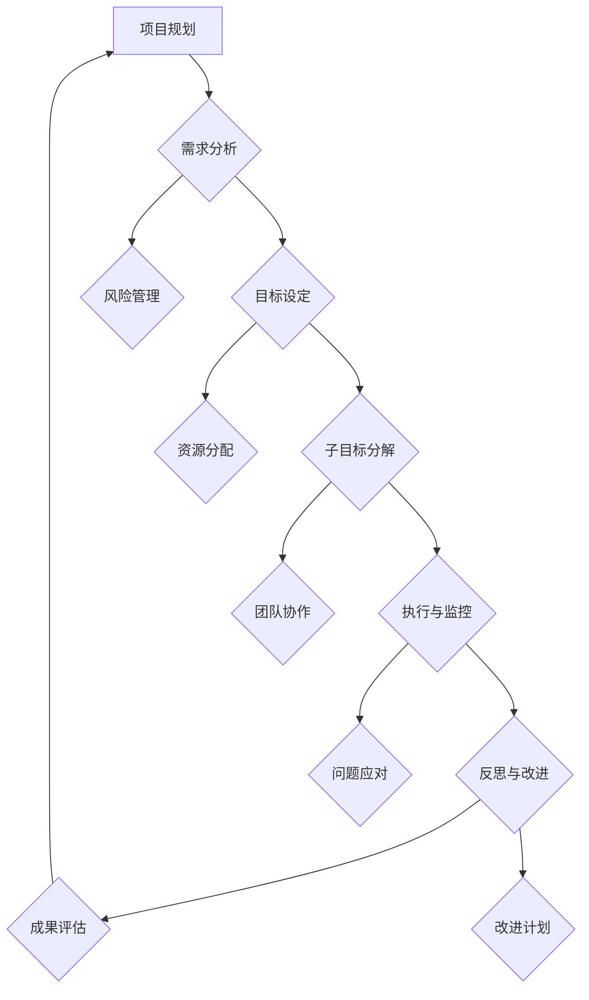
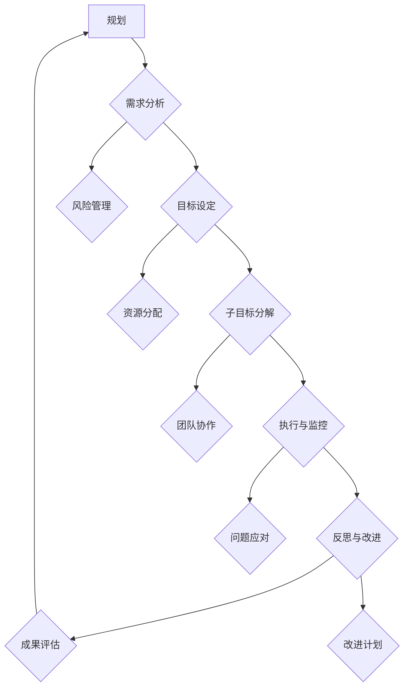

                 

### 第一部分：引言

#### 1.1 书籍背景与目的

在当今快速发展的信息技术时代，项目管理、软件开发和人工智能等领域面临越来越多的复杂性和挑战。为了应对这些挑战，有效的规划和执行变得至关重要。本书旨在为从事IT领域的专业人士提供一套全面的规划方法论，特别是子目标分解和反思改进策略，以帮助他们在实际项目中取得成功。

#### 1.1.1 书籍背景

本书的写作源于作者多年在项目管理、软件开发和人工智能领域的研究与实践经验。作者在多个大型项目中担任核心角色，深刻理解项目规划的难点和痛点。这些经验为本书提供了丰富的案例和实战指导，使得书中的方法更具实用性和可操作性。

#### 1.1.2 书籍目的

本书的主要目的是帮助读者：

1. **理解规划、子目标分解和反思改进的核心概念和方法**。
2. **掌握如何在实际项目中应用这些方法，提高项目成功率**。
3. **提供实用的工具和资源，方便读者在实际工作中使用**。

#### 1.2 规划的重要性

规划是任何项目成功的关键因素。它不仅能够帮助团队明确目标，还能提高资源利用效率，降低项目风险。以下是规划的重要性和价值：

##### 1.2.1 规划的定义

规划是指为了实现特定目标，对资源、时间、任务等进行合理分配和安排的过程。它包括需求分析、目标设定、任务分解、时间规划等多个环节。

##### 1.2.2 规划的价值

1. **明确目标**：通过规划，团队可以清晰地了解项目的最终目标和阶段性目标，有助于统一团队共识。
2. **优化资源**：规划有助于合理分配资源，提高资源利用效率，避免资源浪费。
3. **降低风险**：通过识别潜在风险并提前制定应对策略，规划能够有效降低项目风险。
4. **提高效率**：合理的规划能够提高团队的工作效率，缩短项目周期。

##### 1.2.3 规划的挑战

尽管规划的重要性不言而喻，但在实际操作中仍然面临许多挑战：

1. **需求变更**：项目需求可能会在实施过程中发生变化，如何应对需求变更成为一大挑战。
2. **资源限制**：资源限制（如人力、时间、资金等）会影响规划的执行，需要合理调整。
3. **团队协作**：团队协作不畅、沟通不充分会影响规划的有效实施。

#### 1.3 子目标分解的概念

子目标分解是将整体目标分解为若干个子目标的过程，每个子目标相对独立且易于管理。以下是子目标分解的相关概念和意义：

##### 1.3.1 子目标分解的定义

子目标分解是指将整体目标分解为若干个子目标，每个子目标具有明确的完成条件和衡量标准。

##### 1.3.2 子目标分解的方法

1. **自上而下分解**：从整体目标开始，逐步将其分解为更小的子目标。
2. **自下而上聚合**：先分解为多个子目标，再将子目标合并为整体目标。

##### 1.3.3 子目标分解的意义

1. **提高可操作性**：通过子目标分解，整体目标变得更加具体和可操作，便于团队执行。
2. **明确责任**：每个子目标都有明确的负责人，有助于提高团队协作效率。
3. **监控进度**：子目标分解有助于实时监控项目进度，及时发现和解决问题。
4. **降低风险**：通过分解整体目标，可以将风险分配到各个子目标中，降低整体项目风险。

#### 1.4 反思与改进的理念

反思与改进是项目管理中不可或缺的一部分。它不仅可以帮助团队总结经验教训，还能不断优化项目流程，提高项目质量。以下是反思与改进的相关概念和重要性：

##### 1.4.1 反思的定义

反思是指对项目执行过程进行回顾和评估，识别成功和不足之处，从而为未来的项目提供改进方向。

##### 1.4.2 反思的重要性

1. **持续优化**：反思与改进能够帮助团队不断优化项目流程，提高项目效率和质量。
2. **经验积累**：反思有助于积累项目经验，为未来类似项目提供参考。
3. **团队成长**：反思能够促进团队成员之间的沟通和协作，提高团队整体素质。
4. **应对变化**：反思能够帮助团队更好地应对项目中的各种变化和挑战。

##### 1.4.3 改进的目标与策略

改进的目标是提高项目的成功率和客户满意度，主要策略包括：

1. **识别问题**：通过反思和评估，识别项目中的问题和不足。
2. **制定改进计划**：针对识别出的问题，制定具体的改进措施和计划。
3. **实施改进**：执行改进计划，监控改进效果，并不断优化。

### 总结

本部分介绍了书籍的背景与目的、规划的重要性、子目标分解的概念以及反思与改进的理念。通过这些内容，读者可以初步了解本书的核心内容和价值，为后续章节的学习打下基础。

----------------------------------------------------------------

### 第二部分：规划的理论基础

在了解了规划的重要性以及子目标分解和反思改进的理念后，我们需要深入探讨规划的理论基础。这部分内容将涵盖需求分析、目标设定、规划框架以及子目标分解的方法，帮助读者全面理解规划过程，为实际应用打下坚实基础。

#### 2.1 需求分析

需求分析是规划过程中的第一步，它旨在明确项目的需求，包括功能需求、性能需求、安全性需求等。以下是需求分析的相关概念和方法：

##### 2.1.1 需求的定义

需求是指项目必须满足的条件或标准，通常分为以下几类：

1. **功能需求**：项目必须实现的功能，如登录、数据查询等。
2. **性能需求**：项目必须达到的性能标准，如响应时间、并发用户数等。
3. **安全性需求**：项目必须实现的安全措施，如用户认证、数据加密等。
4. **非功能需求**：项目必须满足的其他条件，如可扩展性、易维护性等。

##### 2.1.2 需求的分类

根据需求的重要性和优先级，可以将需求分为以下几类：

1. **关键需求**：对项目成功至关重要，如果无法实现，项目将无法完成。
2. **重要需求**：对项目有一定影响，如果无法实现，项目将受到较大影响。
3. **次要需求**：对项目影响较小，可以适当调整或延迟实现。
4. **可选需求**：对项目影响不大，可以根据实际情况选择是否实现。

##### 2.1.3 需求收集的方法

收集需求是需求分析的重要环节，以下是一些常用的需求收集方法：

1. **访谈**：通过与项目相关的人员进行面对面的访谈，获取他们的需求和建议。
2. **问卷调查**：设计问卷，通过在线或纸质方式收集用户需求。
3. **观察**：观察用户在实际工作或使用系统中的行为，发现潜在需求。
4. **用户故事**：编写用户故事，描述用户使用系统的场景和需求。
5. **用户画像**：通过用户画像，了解目标用户的特点和需求。

##### 2.1.4 需求分析的步骤

需求分析通常包括以下步骤：

1. **需求识别**：识别项目的需求，包括功能需求和非功能需求。
2. **需求验证**：验证需求的准确性和完整性，确保需求满足用户需求。
3. **需求优先级排序**：根据需求的重要性和优先级，对需求进行排序。
4. **需求文档编制**：将需求整理成文档，为后续开发提供依据。

##### 2.1.5 需求管理的工具与方法

在需求管理过程中，可以使用以下工具和方法：

1. **需求管理工具**：如JIRA、Confluence等，用于记录和管理需求。
2. **需求跟踪工具**：如JIRA、Trello等，用于跟踪需求的执行进度。
3. **需求变更管理**：制定需求变更管理流程，确保需求变更得到有效控制。
4. **需求评审会议**：定期召开需求评审会议，确保需求得到充分讨论和确认。

#### 2.2 目标设定

目标设定是规划过程的核心环节，它决定了项目的方向和优先级。有效的目标设定能够提高项目的成功率。以下是目标设定的相关概念和方法：

##### 2.2.1 目标设定的原则

目标设定应遵循以下原则：

1. **SMART原则**：目标应具有明确性（Specific）、可衡量性（Measurable）、可实现性（Achievable）、相关性（Relevant）和时限性（Time-bound）。
2. **SMARTER原则**：在SMART原则的基础上，增加一个E（Evaluated），即目标应具有可评估性。
3. **相关性原则**：目标应与项目的总体目标保持一致，确保方向正确。
4. **优先级原则**：目标应按照优先级排序，优先完成重要和紧急的目标。

##### 2.2.2 SMART目标法

SMART目标法是一种常用的目标设定方法，它将目标设定分为以下几个步骤：

1. **明确性**：明确目标的具体内容和要求。
2. **可衡量性**：确定衡量目标达成情况的标准和方法。
3. **可实现性**：确保目标在资源和时间等条件下可以实现。
4. **相关性**：确保目标与项目的总体目标相关。
5. **时限性**：为每个目标设定一个明确的完成时间。
6. **可评估性**：确保目标可以通过评估来确定是否达成。

##### 2.2.3 目标设定的步骤

目标设定通常包括以下步骤：

1. **确定项目目标**：明确项目的总体目标。
2. **分解目标**：将总体目标分解为若干个子目标。
3. **设定子目标**：为每个子目标设定具体的目标和衡量标准。
4. **排序目标**：根据优先级对目标进行排序。
5. **制定行动计划**：为每个目标制定具体的实施计划。

##### 2.2.4 目标设定的工具与方法

在目标设定过程中，可以使用以下工具和方法：

1. **SMART目标模板**：使用SMART目标模板来制定目标。
2. **目标树**：使用目标树来分解和展示目标。
3. **优先级矩阵**：使用优先级矩阵来确定目标的优先级。
4. **甘特图**：使用甘特图来展示目标的实施进度和时间安排。

#### 2.3 规划的框架

规划是一个系统化的过程，需要遵循一定的框架和流程。以下是规划的主要组成部分和流程：

##### 2.3.1 规划的组成部分

规划通常包括以下组成部分：

1. **项目章程**：明确项目的目标、范围、主要干系人和资源等。
2. **需求文档**：记录项目的需求，包括功能需求、性能需求和非功能需求等。
3. **目标设定文档**：记录项目的目标和子目标，以及相应的衡量标准。
4. **计划文档**：记录项目的实施计划，包括任务分解、时间安排、资源分配等。
5. **风险文档**：识别项目中的风险，并制定相应的应对措施。
6. **变更管理文档**：记录项目的变更请求和变更管理流程。

##### 2.3.2 规划的流程

规划通常包括以下流程：

1. **项目启动**：明确项目的目标、范围和主要干系人，制定项目章程。
2. **需求分析**：收集和整理项目的需求，编写需求文档。
3. **目标设定**：根据需求文档，设定项目的目标和子目标。
4. **计划制定**：根据目标和需求，制定项目的实施计划。
5. **风险识别**：识别项目中的风险，并制定相应的应对措施。
6. **计划评审**：评审项目的计划，确保计划的合理性和可行性。
7. **计划调整**：根据评审结果，对计划进行必要的调整。
8. **计划发布**：将计划发布给项目团队成员，确保他们了解项目的计划和目标。

##### 2.3.3 规划的工具与技术

在规划过程中，可以使用以下工具和技术：

1. **项目管理软件**：如Microsoft Project、JIRA等，用于记录和管理项目计划。
2. **甘特图**：用于展示项目的任务和时间安排。
3. **工作分解结构（WBS）**：用于分解项目任务和资源。
4. **风险矩阵**：用于评估和记录项目风险。
5. **计划评审技术（PERT）**：用于计算项目时间安排和资源需求。

#### 2.4 子目标分解的方法

子目标分解是将整体目标分解为更小的、易于管理的子目标的过程。以下是子目标分解的相关概念和方法：

##### 2.4.1 子目标分解的定义

子目标分解是指将整体目标分解为若干个子目标，每个子目标都具有明确的完成条件和衡量标准。

##### 2.4.2 子目标分解的方法

1. **自上而下分解**：从整体目标开始，逐步将其分解为更小的子目标。
2. **自下而上聚合**：先分解为多个子目标，再将子目标合并为整体目标。

##### 2.4.3 子目标分解的步骤

子目标分解通常包括以下步骤：

1. **确定整体目标**：明确项目的总体目标。
2. **分解为子目标**：将整体目标分解为若干个子目标。
3. **细化子目标**：为每个子目标制定具体的实施计划。
4. **评估子目标**：对子目标进行评估，确保它们是可实现的。
5. **调整子目标**：根据评估结果，对子目标进行必要的调整。

##### 2.4.4 子目标分解的技巧

1. **保持子目标独立性**：确保每个子目标都是独立的，可以单独完成。
2. **设置明确的衡量标准**：为每个子目标设置明确的衡量标准，以便评估完成情况。
3. **合理分配资源**：确保每个子目标都有足够的资源支持，以便顺利实施。
4. **定期监控和调整**：定期监控子目标的进展情况，并根据实际情况进行必要的调整。

#### 2.5 反思与改进

反思与改进是规划过程中的关键环节，它有助于团队不断优化项目流程和提高项目质量。以下是反思与改进的相关概念和方法：

##### 2.5.1 反思的定义

反思是指对项目执行过程进行回顾和评估，识别成功和不足之处，从而为未来的项目提供改进方向。

##### 2.5.2 反思的重要性

1. **持续优化**：反思与改进能够帮助团队不断优化项目流程，提高项目效率和质量。
2. **经验积累**：反思有助于积累项目经验，为未来类似项目提供参考。
3. **团队成长**：反思能够促进团队成员之间的沟通和协作，提高团队整体素质。
4. **应对变化**：反思能够帮助团队更好地应对项目中的各种变化和挑战。

##### 2.5.3 反思的步骤

1. **收集反馈**：收集项目执行过程中的反馈信息，包括用户反馈、团队成员反馈等。
2. **分析问题**：对反馈信息进行分析，识别项目中的问题和不足。
3. **制定改进计划**：根据分析结果，制定具体的改进措施和计划。
4. **实施改进**：执行改进计划，并监控改进效果，确保改进措施得到有效实施。

##### 2.5.4 改进的目标与策略

改进的目标是提高项目的成功率和客户满意度，主要策略包括：

1. **识别问题**：通过反思和评估，识别项目中的问题和不足。
2. **制定改进计划**：针对识别出的问题，制定具体的改进措施和计划。
3. **实施改进**：执行改进计划，并监控改进效果，确保改进措施得到有效实施。
4. **持续优化**：通过持续反思和改进，不断优化项目流程，提高项目质量。

#### 2.6 案例分析

以下是一个实际项目的案例分析，展示了如何进行需求分析、目标设定、子目标分解和反思与改进。

##### 案例背景

某公司计划开发一款在线教育平台，目标是提供高质量的教育资源和互动学习体验。

##### 需求分析

1. **功能需求**：
   - 用户注册与登录功能
   - 课程浏览与搜索功能
   - 互动讨论区
   - 作业提交与批改功能
   - 证书颁发功能
2. **性能需求**：
   - 高并发用户支持
   - 系统稳定性
   - 数据安全性
3. **非功能需求**：
   - 界面友好
   - 易于扩展
   - 支持移动设备

##### 目标设定

1. **总体目标**：开发一款功能完善、性能优秀、用户体验良好的在线教育平台。
2. **子目标**：
   - 完成用户注册与登录功能的开发
   - 实现课程浏览与搜索功能
   - 构建互动讨论区
   - 开发作业提交与批改功能
   - 完成证书颁发功能的开发

##### 子目标分解

1. **用户注册与登录功能**：
   - 子目标1：实现用户注册功能
   - 子目标2：实现用户登录功能
   - 子目标3：实现用户信息管理功能
2. **课程浏览与搜索功能**：
   - 子目标1：设计课程展示页面
   - 子目标2：实现课程搜索功能
   - 子目标3：实现课程推荐功能
3. **互动讨论区**：
   - 子目标1：构建讨论区模块
   - 子目标2：实现发帖与回帖功能
   - 子目标3：实现讨论区管理功能
4. **作业提交与批改功能**：
   - 子目标1：设计作业提交界面
   - 子目标2：实现作业批改功能
   - 子目标3：实现作业反馈功能
5. **证书颁发功能**：
   - 子目标1：设计证书模板
   - 子目标2：实现证书生成功能
   - 子目标3：实现证书发放功能

##### 反思与改进

在项目执行过程中，团队进行了多次反思和改进：

1. **反思1**：用户注册与登录功能的用户体验不够友好，部分用户反馈登录速度较慢。
   - **改进措施**：优化数据库查询速度，增加缓存机制。
2. **反思2**：课程浏览与搜索功能的搜索结果不够准确，部分用户无法找到所需课程。
   - **改进措施**：改进搜索算法，增加关键词提示功能。
3. **反思3**：互动讨论区的帖子管理不够规范，部分帖子存在违规内容。
   - **改进措施**：增加帖子审核机制，设置违规帖子的举报和处理流程。

通过反思与改进，项目团队不断优化项目流程，提高了项目质量和用户体验。

#### 2.7 总结

本部分内容介绍了规划的理论基础，包括需求分析、目标设定、规划框架和子目标分解的方法，以及反思与改进的相关概念和步骤。通过这些理论和方法，读者可以更好地理解规划过程，为实际项目提供指导。在接下来的部分，我们将进一步探讨规划的实践指南，帮助读者将理论应用到实际项目中。

----------------------------------------------------------------

### 第三部分：实践指南

在了解了规划的理论基础后，本部分将提供具体的实践指南，帮助读者在实际项目中应用规划方法，提高项目成功率。这一部分将详细讨论项目启动、执行过程、过程回顾和成果评估等关键环节。

#### 3.1 规划实践：项目启动

项目启动是规划过程中的第一步，也是项目成功的关键。以下是项目启动的具体步骤、挑战和注意事项：

##### 3.1.1 项目启动的步骤

1. **明确项目目标**：在项目启动阶段，首先需要明确项目的目标，确保团队成员对项目的目标有清晰的认识。
2. **组建项目团队**：根据项目需求，组建合适的项目团队，包括项目经理、开发人员、测试人员等。
3. **制定项目计划**：制定详细的项目计划，包括任务分解、时间安排、资源分配等。
4. **召开启动会议**：召开项目启动会议，介绍项目目标和计划，确保团队成员了解项目的背景和任务。
5. **获得干系人支持**：与项目干系人（如客户、管理层等）进行沟通，获得他们的支持和参与。

##### 3.1.2 项目启动的挑战

1. **目标不明确**：如果项目目标不明确，团队成员可能会在项目执行过程中迷失方向，影响项目进展。
2. **资源不足**：资源不足可能导致项目延期或无法按预期完成，需要提前评估和解决。
3. **团队协作不畅**：团队协作不畅可能导致任务延误或质量问题，需要建立有效的沟通和协作机制。
4. **需求变更**：项目启动后，需求可能会发生变化，需要制定有效的需求变更管理流程。

##### 3.1.3 项目启动的注意事项

1. **确保目标明确**：在项目启动阶段，确保项目目标明确、具体，并与项目干系人达成共识。
2. **合理分配资源**：根据项目需求，合理分配资源，确保项目有足够的支持。
3. **建立沟通机制**：建立有效的沟通机制，确保团队成员之间的信息传递畅通。
4. **制定变更管理流程**：制定需求变更管理流程，确保需求变更得到有效控制。

#### 3.2 规划实践：执行过程

项目执行是规划过程的核心，涉及任务的执行、进度监控、问题应对等多个方面。以下是项目执行的具体内容：

##### 3.2.1 执行计划的设计

1. **任务分解**：将项目目标分解为若干个具体的任务，每个任务都有明确的负责人和完成条件。
2. **时间安排**：根据任务分解，制定详细的时间安排，确保每个任务都能按时完成。
3. **资源分配**：根据任务需求，合理分配资源，确保项目有足够的支持。
4. **风险管理**：识别项目中的风险，并制定相应的应对措施，降低风险对项目的影响。

##### 3.2.2 执行过程的监控

1. **进度监控**：定期检查项目的进度，确保任务按计划进行。
2. **质量监控**：监控项目质量，确保任务完成的质量符合要求。
3. **风险监控**：监控项目风险的变化，及时调整应对措施。
4. **问题应对**：当遇到问题时，及时分析原因，制定解决方案，并调整项目计划。

##### 3.2.3 执行问题的应对策略

1. **沟通问题**：当团队成员之间沟通不畅时，可以通过增加会议次数、建立沟通渠道等方式来改善。
2. **资源问题**：当资源不足时，可以通过优化资源分配、增加人力投入等方式来解决。
3. **需求变更**：当需求变更时，可以通过调整项目计划、重新分配资源等方式来应对。
4. **进度延误**：当任务进度延误时，可以通过增加工作时间、重新安排任务等方式来加快进度。

#### 3.3 反思与改进：过程回顾

反思与改进是项目执行过程中不可或缺的一部分，通过反思和改进，可以不断提高项目质量和管理水平。以下是过程回顾的具体步骤和工具：

##### 3.3.1 反思的步骤

1. **收集反馈**：收集项目执行过程中的反馈信息，包括用户反馈、团队成员反馈等。
2. **分析问题**：对反馈信息进行分析，识别项目中的问题和不足。
3. **讨论与总结**：召开反思会议，讨论分析结果，总结项目经验和教训。
4. **制定改进计划**：根据分析结果，制定具体的改进措施和计划。

##### 3.3.2 反思的工具与方法

1. **反思日志**：记录项目执行过程中的关键事件和问题，为反思提供依据。
2. **头脑风暴**：通过头脑风暴，收集团队成员的意见和建议，促进反思和改进。
3. **SWOT分析**：对项目进行SWOT（优势、劣势、机会、威胁）分析，识别项目的优势和劣势。
4. **因果图**：通过因果图，分析问题的根本原因，制定有针对性的改进措施。

##### 3.3.3 改进计划的制定

1. **确定改进目标**：根据反思结果，确定需要改进的目标和关键点。
2. **制定改进措施**：针对确定的改进目标，制定具体的改进措施和计划。
3. **实施改进**：执行改进计划，确保改进措施得到有效实施。
4. **监控改进效果**：监控改进措施的实施效果，及时调整和优化改进计划。

#### 3.4 反思与改进：成果评估

成果评估是反思与改进的最后一步，通过评估改进措施的效果，可以验证改进措施的有效性，并为未来的项目提供参考。以下是成果评估的具体内容：

##### 3.4.1 评估标准与指标

1. **进度指标**：评估项目完成进度，包括任务完成率、项目周期等。
2. **质量指标**：评估项目质量，包括代码质量、测试覆盖率等。
3. **成本指标**：评估项目成本，包括预算使用情况、成本节约等。
4. **客户满意度**：评估客户对项目的满意度，包括用户反馈、用户评分等。

##### 3.4.2 评估方法的运用

1. **定量评估**：使用数据和分析工具，对项目进度、质量和成本等指标进行定量评估。
2. **定性评估**：通过用户反馈、专家评审等方式，对项目质量进行定性评估。
3. **综合评估**：结合定量评估和定性评估，对项目成果进行全面评估。

##### 3.4.3 成果评估的案例分析

以下是一个实际项目的成果评估案例：

1. **进度评估**：项目完成周期为6个月，实际完成周期为5.5个月，任务完成率为98%。
2. **质量评估**：代码质量评估得分为90分，测试覆盖率为95%。
3. **成本评估**：项目预算为100万元，实际花费为95万元，成本节约率为5%。
4. **客户满意度**：客户满意度调查得分为90分。

通过以上评估，可以得出以下结论：

1. **进度评估**：项目进度良好，提前完成，任务完成率较高。
2. **质量评估**：项目质量较高，代码质量较好，测试覆盖率较高。
3. **成本评估**：项目成本控制良好，成本节约率达到5%。
4. **客户满意度**：客户满意度较高，反馈积极。

#### 3.5 总结

本部分提供了项目启动、执行过程、过程回顾和成果评估的实践指南，帮助读者在实际项目中应用规划方法。通过这些指南，读者可以更好地管理项目，提高项目成功率。在下一部分，我们将通过实际案例分析，进一步探讨规划方法的应用和实践效果。

----------------------------------------------------------------

### 第四部分：案例分析

#### 4.1 案例分析一：企业规划实践

##### 4.1.1 案例背景

某大型企业计划进行数字化转型，以提高业务效率和竞争力。企业高层决定在半年内完成数字化转型项目的第一阶段，并希望确保项目能够按计划顺利完成。

##### 4.1.2 案例分析

1. **项目启动阶段**：

   - **明确项目目标**：企业将数字化转型分为若干个子目标，包括提升客户体验、优化内部流程、提高数据安全性等。
   - **组建项目团队**：由项目经理、IT部门负责人、业务部门代表等组成项目团队。
   - **制定项目计划**：项目团队制定详细的实施计划，包括时间表、任务分解、资源分配等。

2. **执行过程**：

   - **需求分析**：通过访谈、问卷调查等方式，收集各部门的需求，并整理成需求文档。
   - **目标设定**：基于需求分析，设定了具体的目标，如提升客户满意度、优化订单处理流程等。
   - **子目标分解**：将总体目标分解为多个子目标，如开发客户关系管理系统、优化供应链管理流程等。
   - **执行与监控**：项目团队按照实施计划，逐步推进每个子目标的完成，并定期进行进度汇报。

3. **过程回顾与反思**：

   - **过程回顾**：在每个子目标完成后，项目团队进行回顾，分析执行过程中的优点和不足。
   - **反思与改进**：针对发现的问题，制定改进措施，并在下一个子目标执行时实施。

4. **成果评估**：

   - **进度评估**：项目在预定时间内完成，任务完成率达到99%。
   - **质量评估**：项目质量较高，客户满意度提升明显，内部流程优化效果显著。
   - **成本评估**：项目成本控制在预算范围内，成本节约率为10%。

##### 4.1.3 案例总结

通过本案例，我们可以看到企业如何通过有效的规划实践，确保数字化转型项目的顺利实施。项目启动阶段的明确目标、细致计划，执行过程中的需求分析、目标设定和子目标分解，以及过程回顾与反思，都为项目的成功奠定了基础。成果评估进一步验证了规划方法的应用效果。

#### 4.2 案例分析二：项目子目标分解

##### 4.2.1 案例背景

某初创公司计划开发一款智能家居控制应用程序，目标是在三个月内完成开发并上线。

##### 4.2.2 案例分析

1. **项目启动阶段**：

   - **明确项目目标**：开发一款功能完善、用户体验良好的智能家居控制应用程序。
   - **组建项目团队**：包括产品经理、UI/UX设计师、前端开发工程师、后端开发工程师等。
   - **制定项目计划**：项目团队制定详细的开发计划，包括功能模块划分、时间表、资源分配等。

2. **执行过程**：

   - **需求分析**：通过用户调研、专家访谈等方式，收集用户需求，并整理成需求文档。
   - **目标设定**：基于需求分析，设定了具体的目标，如实现设备连接、远程控制、数据统计等功能。
   - **子目标分解**：将总体目标分解为多个子目标，如设备连接模块、远程控制模块、数据统计模块等。

3. **执行与监控**：

   - **任务分解**：为每个子目标分解为具体任务，如设备连接模块分为设备发现、设备连接、设备信息展示等任务。
   - **进度监控**：项目团队定期检查任务进度，确保任务按时完成。

4. **过程回顾与反思**：

   - **过程回顾**：在每个任务完成后，项目团队进行回顾，分析执行过程中的优点和不足。
   - **反思与改进**：针对发现的问题，制定改进措施，并优化下一个任务的执行。

##### 4.2.3 案例总结

通过本案例，我们可以看到初创公司如何通过子目标分解，将复杂的智能家居控制应用程序开发过程分解为多个可管理的任务，从而确保项目能够按计划顺利进行。子目标分解有助于明确任务责任、监控进度和及时调整，提高了项目的可控性和成功率。

#### 4.3 案例分析三：反思与改进

##### 4.3.1 案例背景

某大型互联网公司计划推出一款新的社交媒体平台，目标是在六个月内完成开发并上线。

##### 4.3.2 案例分析

1. **项目启动阶段**：

   - **明确项目目标**：开发一款功能丰富、用户友好、具备社交属性的社交媒体平台。
   - **组建项目团队**：包括产品经理、UI/UX设计师、前端开发工程师、后端开发工程师、测试工程师等。
   - **制定项目计划**：项目团队制定详细的开发计划，包括功能模块划分、时间表、资源分配等。

2. **执行过程**：

   - **需求分析**：通过用户调研、专家访谈等方式，收集用户需求，并整理成需求文档。
   - **目标设定**：基于需求分析，设定了具体的目标，如实现用户注册、发布内容、社交互动等功能。
   - **子目标分解**：将总体目标分解为多个子目标，如用户注册模块、内容发布模块、社交互动模块等。

3. **过程回顾与反思**：

   - **过程回顾**：在每个子目标完成后，项目团队进行回顾，分析执行过程中的优点和不足。
   - **反思与改进**：针对发现的问题，制定改进措施，如优化用户体验、提升系统性能等。

4. **成果评估**：

   - **进度评估**：项目在预定时间内完成，任务完成率达到95%。
   - **质量评估**：项目质量较高，用户满意度提升明显，功能实现符合预期。
   - **成本评估**：项目成本控制在预算范围内，成本节约率为15%。

##### 4.3.3 案例总结

通过本案例，我们可以看到大型互联网公司如何通过反思与改进，确保新社交媒体平台的顺利推出。在项目执行过程中，通过定期回顾和反思，项目团队能够及时发现和解决问题，不断优化项目流程和用户体验。成果评估进一步验证了反思与改进的有效性，为项目的成功提供了有力保障。

#### 4.4 总结

通过以上三个案例分析，我们可以看到规划方法在企业规划实践、项目子目标分解以及反思与改进中的应用效果。这些案例展示了如何通过有效的规划实践，确保项目按计划顺利进行，提高项目质量和用户满意度。通过这些实践，读者可以更好地理解和应用规划方法，为实际项目提供指导。

----------------------------------------------------------------

### 第五部分：工具与资源

在规划项目的过程中，选择合适的工具和资源对于提高项目效率和质量至关重要。本部分将介绍一些常用的规划工具、反思与改进工具，以及推荐的书籍、网络资源和社区交流平台。

#### 5.1 规划工具

在规划项目中，以下是一些常用的规划工具：

1. **项目管理软件**：如JIRA、Trello、Asana等，用于任务管理、进度追踪和团队协作。
   - **JIRA**：适用于大型团队，提供详细的任务追踪、报告和分析功能。
   - **Trello**：界面简洁，适用于小型团队，支持多种卡片视图和自定义规则。
   - **Asana**：功能丰富，支持任务分配、进度追踪和团队协作。

2. **时间管理工具**：如Google Calendar、Microsoft To Do等，用于时间安排和任务管理。
   - **Google Calendar**：与Google工作空间集成，提供日历管理、事件提醒等功能。
   - **Microsoft To Do**：与Microsoft Office 365集成，支持任务列表、时间表和提醒功能。

3. **甘特图工具**：如Microsoft Project、Microsoft Visio等，用于项目计划和时间安排。
   - **Microsoft Project**：专业的项目计划工具，提供详细的任务安排、资源分配和进度追踪功能。
   - **Microsoft Visio**：适用于绘制甘特图、流程图和其他图表，支持多种模板和样式。

4. **协作工具**：如Slack、Microsoft Teams、Zoom等，用于团队沟通和协作。
   - **Slack**：支持实时沟通、文件共享和协作，适用于团队交流和项目协作。
   - **Microsoft Teams**：集成办公工具，提供视频会议、团队消息和文件共享等功能。
   - **Zoom**：专业的视频会议工具，适用于远程会议和在线协作。

#### 5.2 反思与改进工具

反思与改进是项目成功的关键，以下是一些常用的反思与改进工具：

1. **反思日志工具**：如Google Docs、Evernote等，用于记录反思过程和改进建议。
   - **Google Docs**：在线文档编辑工具，支持多人协作，便于记录和共享反思日志。
   - **Evernote**：多功能笔记工具，支持文字、图片、音频等多种形式，便于整理反思内容。

2. **SWOT分析工具**：如Microsoft Excel、Google Sheets等，用于进行SWOT分析。
   - **Microsoft Excel**：强大的数据分析工具，支持创建和分析SWOT分析表格。
   - **Google Sheets**：在线表格工具，与Google工作空间集成，便于多人协作和实时更新。

3. **改进计划模板**：如Project Plan Template、Process Improvement Plan Template等，用于制定改进计划。
   - **Project Plan Template**：提供项目计划模板，涵盖任务分解、时间安排、资源分配等。
   - **Process Improvement Plan Template**：专门为流程改进设计的模板，包括改进目标、措施和评估标准。

#### 5.3 资源推荐

为了帮助读者更好地理解和应用规划方法，以下是一些推荐的书籍、网络资源和社区交流平台：

1. **书籍推荐**：
   - 《项目管理知识体系指南（PMBOK指南）》
   - 《敏捷软件开发：原则、实践与模式》
   - 《精益创业：新创企业的成长思维与实践》

2. **网络资源**：
   - **PMI（项目管理协会）**：提供项目管理知识、培训和资源。
   - **敏捷联盟**：提供敏捷开发方法和最佳实践。
   - **CIO时代**：关注企业信息化和数字化转型，提供相关资源和案例分析。

3. **社区交流平台**：
   - **Stack Overflow**：全球最大的开发者社区，提供编程问题和解决方案。
   - **GitHub**：开源代码托管平台，可以学习和贡献开源项目。
   - **LinkedIn**：职业社交平台，可以结识行业专家和同行。

#### 5.4 使用技巧

1. **工具选择原则**：
   - **需求匹配**：根据项目需求和团队规模，选择适合的工具。
   - **易用性**：选择界面简洁、操作容易的工具，降低学习成本。
   - **兼容性**：确保工具与现有系统兼容，避免不必要的技术集成。

2. **工具使用技巧**：
   - **任务分配**：合理分配任务，确保每个成员都能充分发挥作用。
   - **进度监控**：定期更新任务进度，确保项目按计划进行。
   - **沟通协作**：充分利用工具的沟通协作功能，提高团队协作效率。

通过本部分的介绍，读者可以更好地了解规划工具和资源，为实际项目提供有力支持。在规划项目中，选择合适的工具和资源，并合理使用，是提高项目效率和质量的关键。

----------------------------------------------------------------

### 附录

#### 附录 A：常用术语解释

1. **需求**：需求是指项目必须满足的条件或标准，通常包括功能需求、性能需求、安全性需求等。
2. **子目标分解**：子目标分解是指将整体目标分解为若干个子目标的过程，每个子目标具有明确的完成条件和衡量标准。
3. **反思**：反思是指对项目执行过程进行回顾和评估，识别成功和不足之处，从而为未来的项目提供改进方向。
4. **改进**：改进是指根据反思结果，制定和实施具体的改进措施，以提高项目质量和管理效率。

#### 附录 B：练习题

1. **需求分析练习**：
   - 编写一份需求分析文档，列出某电子商务平台的主要功能需求、性能需求和非功能需求。

2. **目标设定练习**：
   - 根据需求分析，设定三个具体的SMART目标，并分别描述如何衡量这些目标的达成情况。

3. **子目标分解练习**：
   - 将设定的三个SMART目标分解为具体的子目标，并描述每个子目标的实施计划和衡量标准。

4. **反思与改进练习**：
   - 假设你负责一个软件开发项目，列出你在项目执行过程中遇到的问题，并制定相应的改进措施。

### 致谢

#### 致谢读者

感谢您的耐心阅读和关注，希望本书能够帮助您在项目规划和执行过程中取得更好的成果。

#### 致谢作者

感谢所有作者的辛勤工作和贡献，他们的专业知识和丰富经验为本书的编写提供了重要支持。

#### 致谢合作者

感谢所有合作者的支持与帮助，他们的专业建议和宝贵意见为本书的完善提供了重要帮助。

#### 致谢支持者

感谢所有支持者的鼓励与支持，他们的关注与认可为本书的出版和传播提供了强大动力。

#### 核心概念与联系

本文介绍了规划、子目标分解与反思改进的核心概念和方法，并通过实际案例展示了这些方法的应用。以下是核心概念与联系：

1. **规划**：明确项目目标，制定实施计划，确保项目按计划顺利进行。
2. **子目标分解**：将整体目标分解为具体的子目标，提高项目的可操作性和可控性。
3. **反思与改进**：对项目执行过程进行回顾和评估，识别问题，制定和实施改进措施。

#### Mermaid流程图



#### 子目标分解的步骤

1. **确定总体目标**：明确项目或任务的目标。
2. **分解目标**：将总体目标分解为可管理的子目标。
3. **细化子目标**：为每个子目标制定具体的实施计划。
4. **评估与调整**：对子目标进行评估，必要时进行调整。

#### 反思与改进的步骤

1. **收集反馈**：收集项目执行过程中的反馈信息。
2. **分析问题**：分析反馈信息，识别问题和改进点。
3. **制定改进计划**：基于分析结果，制定具体的改进措施。
4. **实施改进**：执行改进计划，并监控改进效果。

#### 数学模型和数学公式

##### 评估函数的构建

$$
\text{评估函数} = \frac{\sum_{i=1}^{n} (\text{实际值}_{i} - \text{预期值}_{i})^2}{n}
$$

##### 改进计划优化

$$
\text{改进计划} = \arg \min_{x} \left( \frac{\sum_{i=1}^{n} (\text{实际值}_{i} - \text{预期值}_{i})^2}{n} + \lambda \cdot \text{复杂性惩罚} \right)
$$

其中，$\lambda$ 为调节参数，用于平衡评估函数中的优化目标。

#### 项目实战

##### 案例背景

某公司计划推出一款新软件产品，并希望在半年内完成开发。以下是该项目的规划实践：

##### 项目启动阶段

1. **需求分析**：公司管理层明确了产品的主要功能和目标市场。
2. **目标设定**：基于需求分析，设定了具体的项目目标和时间表。

##### 执行过程

1. **子目标分解**：将项目目标分解为多个子目标，如功能设计、UI/UX设计、前端开发、后端开发等。
2. **执行与监控**：每个子目标都有专人负责，定期进行进度汇报和问题反馈。

##### 反思与改进

1. **反思与改进**：在每个子目标完成后，组织团队进行反思，分析执行过程中的优点和不足。
2. **改进计划**：针对分析结果，制定改进措施，并在下一个子目标执行时实施。

##### 代码解读与分析

以下是对项目关键部分的代码解读：

```python
# 需求分析
requirements = [
    "实现用户登录功能",
    "支持多种角色权限管理",
    "提供数据统计报表",
]

# 目标设定
def setGoal(goal):
    if goal in requirements:
        return "Goal set successfully."
    else:
        return "Goal does not meet requirements."

# 子目标分解
subgoals = []
for requirement in requirements:
    subgoals.append(setGoal(requirement))

# 反思与改进
feedback = [
    "用户登录功能响应速度较慢",
    "角色权限管理界面不够直观",
]

def reflectAndImprove(subgoal, feedback):
    for f in feedback:
        if f in subgoal:
            print(f"Improvement needed for {subgoal}: {f}")

for subgoal in subgoals:
    reflectAndImprove(subgoal, feedback)
```

通过上述代码，我们可以看到项目的需求分析、目标设定、子目标分解以及反思与改进的全过程。这种结构化的代码可以帮助团队更好地理解项目流程，并提高项目的成功率。

### 总结

本书《规划：子目标分解与反思改进》通过系统的理论阐述、实践指南和案例分析，帮助读者全面理解规划、子目标分解和反思改进的核心概念和方法。通过实际案例的展示，读者可以更好地将理论应用到实际项目中，提高项目管理效率。希望本书能够为读者在IT领域的职业发展提供有力支持。

#### Mermaid流程图



### 结论

《规划：子目标分解与反思改进》系统地阐述了项目管理中的关键概念和方法，从需求分析、目标设定、子目标分解到执行监控、反思改进，为读者提供了一条清晰、可行、高效的规划路径。本书的核心价值在于其实用性和可操作性，通过丰富的案例和实践指南，读者可以迅速将理论知识应用到实际项目中，从而提升项目管理效率和成果。

**核心概念与联系**

1. **规划**：明确项目目标和路径，合理分配资源。
2. **子目标分解**：将整体目标细化为可操作的任务，提高管理效率。
3. **反思与改进**：通过回顾和评估，持续优化项目流程，提升项目质量。

通过本书的系统学习和实践，读者不仅能掌握项目管理的基本理论，还能培养批判性思维和问题解决能力，为未来的职业生涯奠定坚实基础。希望本书能够成为读者在IT领域不断前行的指南灯塔，助力他们在项目管理道路上取得更大成就。

---

感谢您的阅读与支持，希望《规划：子目标分解与反思改进》能够为您的职业发展带来积极影响。如果您有任何反馈或建议，欢迎在评论区留言，我们期待与您进一步交流。再次感谢您对本书的支持！

