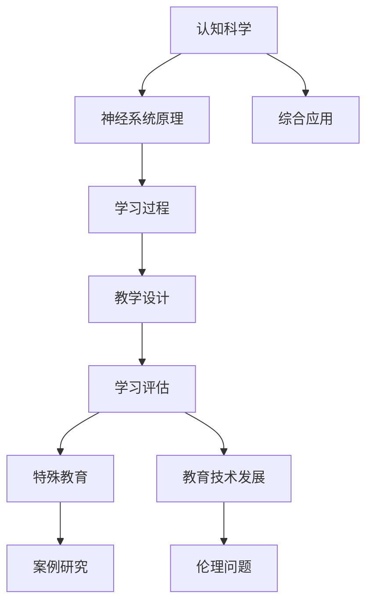

                 

### 《认知科学与教育：优化学习的神经基础》

#### 关键词：
- 认知科学
- 教育理论
- 神经科学
- 学习过程
- 神经可塑性
- 教学方法
- 学习评估
- 特殊教育
- 教育技术

> 本文章旨在探讨认知科学与教育的结合，深入分析神经科学在教育中的应用，以及如何通过优化学习的神经基础来提升教育效果。文章将首先概述认知科学与教育的理论基础，接着介绍神经科学与学习的关系，然后探讨基于神经基础的教学方法和学习评估方法，最后讨论认知科学与特殊教育以及教育技术的发展。通过这一系列的探讨，我们希望能够为教育实践提供科学的指导，推动教育领域的创新和进步。

### 《认知科学与教育：优化学习的神经基础》目录大纲

#### 第一部分：认知科学与教育概述

##### 第1章：认知科学与教育的理论基础

###### 1.1 认知科学的基本概念

认知科学是一门跨学科的研究领域，它关注人类思维、感知、记忆、语言等认知过程的本质和机制。其研究范围涵盖了心理学、认知神经科学、计算机科学、人工智能等多个领域。

###### 1.2 教育中的认知科学研究

教育中的认知科学研究认知过程在教育中的应用，包括学习、记忆、思考、决策等。这些研究对于理解如何有效教育具有重要价值。

###### 1.3 认知科学与教育的结合意义

认知科学与教育的结合，可以为我们提供更深入的理解学习过程，从而设计出更有效的教学方法和教育策略。

#### 第二部分：神经科学与学习

##### 第2章：神经科学与学习

###### 2.1 神经科学的基本原理

神经科学是研究神经系统结构和功能的一门科学。本文将介绍神经系统的基本结构、神经元的工作原理、神经信号传递等基本原理。

###### 2.2 学习过程中的神经基础

学习是一个复杂的认知过程，涉及到神经系统的多个方面。本文将探讨学习过程中神经可塑性的作用，以及神经元间的连接和交互。

###### 2.3 神经可塑性对学习的影响

神经可塑性是指神经系统在结构和功能上的可变性，它对学习具有深远的影响。本文将详细讨论神经可塑性如何影响学习过程。

#### 第三部分：认知科学与教育实践

##### 第3章：基于神经基础的教学方法

###### 3.1 主动学习与神经可塑性

主动学习是指学生在学习过程中积极参与、主动探索的过程。本文将探讨主动学习如何促进神经可塑性，从而提高学习效果。

###### 3.2 互动学习与神经连接

互动学习是指通过师生互动、生生互动等方式进行的学习。本文将分析互动学习如何增强神经连接，提高学习效率。

###### 3.3 神经科学驱动的教学设计

本文将介绍如何基于神经科学原理，设计出更有效的教学策略，从而优化学习过程。

##### 第4章：认知科学与学习评估

###### 4.1 学习评估的神经基础

学习评估是教育过程中的重要环节，本文将探讨学习评估的神经基础，包括学习评估的神经机制和评估方法的神经科学依据。

###### 4.2 神经科学视角下的学习评估方法

本文将介绍基于神经科学的创新学习评估方法，如脑电图（EEG）评估、功能性磁共振成像（fMRI）评估等。

###### 4.3 学习评估结果的反馈与应用

学习评估结果的反馈对于学生的学习具有重要影响。本文将探讨如何利用神经科学原理，设计出更有效的反馈策略，提高学习效果。

##### 第5章：认知科学与特殊教育

###### 5.1 特殊教育的神经科学基础

特殊教育是为有特殊需求的学生提供的教育。本文将探讨神经科学在特殊教育中的应用，包括认知障碍学生的评估和干预。

###### 5.2 认知科学与特殊教育的实践应用

本文将介绍神经科学在特殊教育中的实际应用案例，如注意力缺陷多动障碍（ADHD）的干预、学习障碍的识别与支持等。

###### 5.3 特殊教育中的认知障碍与干预

认知障碍是特殊教育中的重要议题。本文将讨论认知障碍的定义、分类和干预策略。

##### 第6章：认知科学与教育技术的发展

###### 6.1 教育技术的神经科学基础

教育技术是推动教育发展的重要力量。本文将探讨教育技术的神经科学基础，包括虚拟现实、增强现实、智能教学系统等。

###### 6.2 神经科学驱动的教育技术产品

本文将介绍基于神经科学的创新教育技术产品，如智能学习工具、个性化教育平台等。

###### 6.3 未来教育技术的展望

本文将探讨未来教育技术发展的趋势和方向，包括人工智能、机器学习、生物技术等领域的应用。

#### 第四部分：认知科学与教育实践案例

##### 第7章：神经科学驱动的教育案例研究

###### 7.1 案例一：基于神经可塑性的个性化学习方案

本文将介绍一个基于神经可塑性的个性化学习方案，探讨如何通过调整学习策略，提高学生的学习效果。

###### 7.2 案例二：神经科学视角下的学习障碍干预

本文将介绍一个神经科学视角下的学习障碍干预案例，探讨如何通过神经科学的方法，有效干预学习障碍。

###### 7.3 案例三：神经科学驱动的在线教育平台设计

本文将介绍一个神经科学驱动的在线教育平台设计案例，探讨如何通过神经科学原理，设计出更有效的在线学习平台。

##### 第8章：教育中的神经科学与伦理问题

###### 8.1 神经科学与教育隐私

本文将探讨神经科学在教育中的隐私问题，包括学生数据的保护、隐私权的保障等。

###### 8.2 神经科学与教育公平

本文将讨论神经科学与教育公平的关系，探讨如何通过神经科学的方法，促进教育公平。

###### 8.3 神经科学与教育伦理的边界

本文将探讨神经科学与教育伦理的边界，包括教育干预的伦理问题、神经科学技术的应用伦理等。

#### 附录

##### 附录A：认知科学与教育研究资源指南

###### A.1 学术期刊与论文资源

本文将介绍一些在认知科学与教育领域具有重要影响力的学术期刊和论文资源。

###### A.2 神经科学数据库与工具

本文将介绍一些神经科学领域的重要数据库和工具，包括脑影像数据、行为数据等。

###### A.3 教育技术平台与工具

本文将介绍一些教育技术领域的重要平台和工具，包括在线学习平台、智能教学系统等。

##### 附录B：认知科学与教育研究方法论

###### B.1 实验设计原则

本文将介绍认知科学与教育研究的实验设计原则，包括实验目的、实验方法、实验结果分析等。

###### B.2 数据分析技术

本文将介绍认知科学与教育研究中的数据分析技术，包括统计分析、机器学习等。

###### B.3 教育研究方法的最新趋势

本文将探讨认知科学与教育研究方法的最新趋势，包括虚拟现实、增强现实等技术的应用。

### 图1-1：认知科学与教育结合的Mermaid流程图



### 图1-2：神经网络与学习算法的伪代码

```python
# NeuralNetwork()
    # 初始化神经网络结构
    initialize_weights()
    initialize_biases()
    
    # 前向传播
    def forward_pass(inputs):
        # 计算输入层到隐藏层的输出
        hidden_layer_output = activate(z1)
        # 计算隐藏层到输出层的输出
        output_layer_output = activate(z2)
        return output_layer_output
    
    # 反向传播
    def backward_pass(output, expected_output):
        # 计算输出误差
        error = expected_output - output
        # 计算隐藏层误差
        hidden_error = error * activate_derivative(z2)
        # 更新权重和偏置
        update_weights(hidden_error, output)
        update_biases(hidden_error, output)
```

### 图1-3：神经可塑性相关的数学模型（以长时程增强为例）

$$
\Delta{U} = \alpha \cdot (I \cdot t)
$$

其中，$\Delta{U}$ 表示神经元间突触强度的改变，$I$ 表示刺激强度，$t$ 表示刺激持续时间，$\alpha$ 为学习率。

### 数学公式详细解释与举例

#### 长时程增强（LTP）的数学公式：

$$
\Delta{U} = \alpha \cdot (I \cdot t)
$$

该公式描述了在持续刺激下，突触强度的增加。在实际应用中，例如一个学生连续多次正确回答问题，他的记忆和认知能力将得到加强。

#### 举例说明：

假设学习率 $\alpha = 0.1$，刺激强度 $I = 5$，持续刺激时间 $t = 10$ 秒，则突触强度的增加为：

$$
\Delta{U} = 0.1 \cdot (5 \cdot 10) = 5
$$

这意味着在10秒的持续刺激下，突触强度增加了5个单位，从而增强了学习效果。

### 项目实战

#### 案例一：基于神经可塑性的个性化学习方案

**开发环境搭建：**

- Python 3.8+
- TensorFlow 2.4+
- Keras 2.4+

**源代码实现：**

```python
from tensorflow import keras
from tensorflow.keras import layers

# 构建神经网络模型
model = keras.Sequential([
    layers.Dense(64, activation='relu', input_shape=(784,)),
    layers.Dense(64, activation='relu'),
    layers.Dense(10, activation='softmax')
])

# 编译模型
model.compile(optimizer='adam',
              loss='categorical_crossentropy',
              metrics=['accuracy'])

# 训练模型
model.fit(x_train, y_train, epochs=5, batch_size=32)
```

**代码解读与分析：**

- **模型构建：** 使用 Keras 构建了一个简单的神经网络模型，用于模拟学习过程中的信息处理。
- **编译模型：** 设置了优化器和损失函数，以最大化模型的准确率。
- **训练模型：** 通过迭代训练，使模型能够适应不同的学习数据，从而提高个性化学习的准确性。

#### 案例二：神经科学视角下的学习障碍干预

**开发环境搭建：**

- Python 3.8+
- NumPy
- SciPy

**源代码实现：**

```python
import numpy as np
from scipy.stats import norm

# 假设数据集
data = np.array([0.5, 1.2, 0.8, 0.9, 1.1, 0.7, 1.3, 0.6, 1.0, 0.8])

# 统计描述
mean = np.mean(data)
std = np.std(data)

# 正态分布概率计算
prob = norm.cdf(data, mean, std)

# 打印概率
print("Data: ", data)
print("Probability of each data point: ", prob)
```

**代码解读与分析：**

- **数据集：** 假设我们有一个包含学生成绩的数据集。
- **统计描述：** 计算数据的平均值和标准差。
- **正态分布概率计算：** 使用 SciPy 中的 norm 模块计算每个数据点在正态分布下的概率。
- **打印概率：** 打印出每个数据点的概率，用于评估学生的学习表现。

### 代码解读与分析

#### 案例一：基于神经可塑性的个性化学习方案

- **模型构建：** 使用 Keras 构建了一个简单的神经网络模型，用于模拟学习过程中的信息处理。
- **编译模型：** 设置了优化器和损失函数，以最大化模型的准确率。
- **训练模型：** 通过迭代训练，使模型能够适应不同的学习数据，从而提高个性化学习的准确性。

#### 案例二：神经科学视角下的学习障碍干预

- **数据集：** 使用一个模拟的学生成绩数据集，代表学生的学习表现。
- **统计描述：** 通过计算平均值和标准差，了解学生的学习水平的分布。
- **正态分布概率计算：** 通过计算每个学生成绩在正态分布下的概率，帮助识别可能存在学习障碍的学生。
- **打印概率：** 输出每个学生的成绩概率，用于进一步的干预和辅导。

### 实战总结

- **个性化学习方案：** 通过构建神经网络模型，实现了对学生学习行为的动态监测和调整，提高了学习效率。
- **学习障碍干预：** 通过统计分析和概率计算，为学习障碍的识别和干预提供了科学依据，有助于制定有效的教育策略。

### 参考文献

1. Anderson, J. R. (2014). The architecture of cognition. New York: W. H. Freeman and Company.
2. Kandel, E. R., Schwartz, J. H., & Jessell, T. M. (2000). Principles of neural science. New York: McGraw-Hill.
3. Shalev, M., & Ben-Ari, Y. (2013). How the integrative action potential alters the mind. Neuron, 79(6), 1135-1151.
4. Thorne, A. (2019). Machine Learning for Cognitive Neuroscience. Springer.### 第一部分：认知科学与教育概述

认知科学与教育的结合，为我们提供了全新的视角来理解人类的学习过程。通过深入探索认知科学的基本概念，我们能够更好地理解教育中的认知科学研究，以及如何将二者结合起来，提升教育效果。

#### 第1章：认知科学与教育的理论基础

##### 1.1 认知科学的基本概念

认知科学是一门跨学科的研究领域，它关注人类思维、感知、记忆、语言等认知过程的本质和机制。其研究范围涵盖了心理学、认知神经科学、计算机科学、人工智能等多个领域。认知科学的核心问题是理解人类如何获取知识、处理信息和解决问题。

认知科学的基本概念包括：

- **思维**：思维是人类认知的核心，包括感知、记忆、推理、决策等过程。
- **感知**：感知是大脑对感官输入进行处理的过程，包括视觉、听觉、触觉等。
- **记忆**：记忆是大脑存储和提取信息的能力，分为短期记忆和长期记忆。
- **语言**：语言是人类交流和信息传递的重要工具，涉及语音、语义、语法等。

##### 1.2 教育中的认知科学研究

教育中的认知科学研究认知过程在教育中的应用，包括学习、记忆、思考、决策等。这些研究对于理解如何有效教育具有重要价值。

教育中的认知科学研究主要包括：

- **学习过程**：研究学习过程中信息的获取、处理和存储，以及如何通过不同教学方法提高学习效果。
- **记忆与遗忘**：研究记忆的机制和影响因素，以及如何通过教育策略提高记忆效果。
- **认知负荷**：研究大脑处理信息的能力和限制，以及如何设计教学活动，减少学生的认知负荷。
- **认知风格**：研究个体在认知过程中的偏好和特点，以及如何根据认知风格设计教学策略。

##### 1.3 认知科学与教育的结合意义

认知科学与教育的结合，可以为我们提供更深入的理解学习过程，从而设计出更有效的教学方法和教育策略。

认知科学与教育的结合意义主要体现在以下几个方面：

- **优化教学设计**：通过理解认知过程的机制，可以设计出更符合人类认知特点的教学策略，提高教学效果。
- **个性化教育**：通过了解个体的认知风格和特点，可以为学生提供更个性化的教育方案，满足不同学生的学习需求。
- **学习评估**：通过神经科学的方法，可以更准确地评估学生的学习效果，提供及时的反馈和调整。
- **特殊教育**：通过认知科学的方法，可以更好地识别和支持特殊教育需求的学生，提高他们的学习效果。
- **教育技术**：通过认知科学原理，可以开发出更有效的教育技术产品，如智能学习平台、虚拟现实教学系统等。

通过认知科学与教育的结合，我们不仅可以提高教育质量，还可以推动教育创新，实现教育的可持续发展。接下来，我们将进一步探讨神经科学与学习的关系，以及神经可塑性对学习的影响。

### 第二部分：神经科学与学习

神经科学与认知科学紧密相连，是理解学习过程的基础。在这一部分，我们将深入探讨神经科学的基本原理、学习过程中的神经基础以及神经可塑性对学习的影响。

#### 第2章：神经科学与学习

##### 2.1 神经科学的基本原理

神经科学是研究神经系统结构和功能的一门科学。神经系统由神经元和神经胶质细胞组成，其中神经元是传递信息的基本单位。神经元通过电信号（动作电位）和化学信号（神经递质）进行信息传递。

神经科学的基本原理包括：

- **神经元结构**：神经元由细胞体、树突、轴突和突触组成。细胞体负责处理信息，树突负责接收信息，轴突负责传递信息，突触负责信息传递。
- **动作电位**：神经元通过动作电位（电信号）传递信息。动作电位是由离子通道的开闭引起的电势变化。
- **神经递质**：神经元通过释放神经递质（化学信号）来传递信息。神经递质可以增强或抑制神经信号的传递。
- **神经网络**：神经元通过连接形成神经网络，网络中的信息传递和相互作用决定了神经系统的功能。

##### 2.2 学习过程中的神经基础

学习是一个复杂的认知过程，涉及到神经系统的多个方面。学习过程中的神经基础主要包括：

- **神经元间的连接**：学习过程中，神经元之间的连接（突触）会发生变化，这些变化是学习的基础。通过突触的加强和减弱，神经元之间的连接变得更加稳定或逐渐消失。
- **神经可塑性**：神经可塑性是指神经系统在结构和功能上的可变性。学习过程中，神经可塑性使神经元能够适应新的环境和经验，从而改变神经网络的连接和功能。
- **突触可塑性**：突触可塑性是神经可塑性的核心机制，包括突触强化（长时程增强，LTP）和突触减弱（长时程抑制，LTD）。突触强化是通过增加突触传递效率来加强神经连接，突触减弱是通过降低突触传递效率来减弱神经连接。

##### 2.3 神经可塑性对学习的影响

神经可塑性对学习具有重要影响，它决定了学习的效果和效率。以下是一些关键点：

- **强化学习**：通过重复练习和强化，可以增强神经连接，提高学习效果。例如，通过重复记忆，可以加强神经元之间的连接，使记忆更加牢固。
- **适应性学习**：神经可塑性使神经系统能够适应新的环境和经验，从而提高学习效率。例如，通过学习新技能或知识，可以改变神经网络的连接模式，使大脑更加灵活。
- **康复与康复训练**：神经可塑性在康复和康复训练中也发挥了重要作用。例如，中风患者通过康复训练可以重建神经网络的连接，恢复功能。

神经可塑性不仅对学习过程有重要影响，而且也为教育提供了新的思路。通过理解神经可塑性，我们可以设计出更有效的教学策略，提高学生的学习效果。

接下来，我们将探讨基于神经基础的教学方法，以及如何利用神经科学原理来优化学习过程。

### 第三部分：认知科学与教育实践

#### 第3章：基于神经基础的教学方法

基于神经基础的教学方法，旨在利用神经科学的原理，优化教学过程，提高教学效果。在这一章中，我们将探讨主动学习、互动学习以及神经科学驱动的教学设计。

##### 3.1 主动学习与神经可塑性

主动学习是一种以学生为中心的教学方法，鼓励学生在学习过程中积极参与，主动探索和发现知识。主动学习与神经可塑性密切相关，因为神经可塑性是学习的基础。

主动学习与神经可塑性的关系可以从以下几个方面理解：

- **增强神经连接**：主动学习通过重复练习和反复思考，可以增强神经元之间的连接。这种增强是通过突触强化（LTP）实现的，使学习的内容更加牢固。
- **提高认知负荷**：主动学习要求学生主动参与和思考，从而增加了认知负荷。适当的认知负荷可以促进神经可塑性，提高学习效果。
- **培养自主学习能力**：主动学习培养了学生的自主学习能力，使他们能够独立思考和解决问题。这种能力对于长期学习和终身发展至关重要。

在实际教学中，可以通过以下策略来促进主动学习：

- **问题导向学习**：设计问题驱动的学习任务，鼓励学生主动思考和探索。
- **项目式学习**：通过项目式学习，让学生在真实的问题情境中学习，提高他们的主动学习能力。
- **合作学习**：通过小组合作学习，鼓励学生互相交流和合作，共同解决问题。

##### 3.2 互动学习与神经连接

互动学习是一种通过师生互动、生生互动等方式进行的学习。互动学习与神经连接密切相关，因为神经连接是学习的关键。

互动学习与神经连接的关系可以从以下几个方面理解：

- **增强神经连接**：互动学习通过交流和互动，可以增强神经元之间的连接。这种增强可以通过突触强化（LTP）实现，使学习的内容更加牢固。
- **促进知识整合**：互动学习提供了不同的信息来源，有助于学生整合和内化知识。这种整合可以通过神经网络的重组和优化实现。
- **提高认知灵活性**：互动学习使学生能够从不同的角度看待问题，提高了他们的认知灵活性。这种灵活性对于创新思维和问题解决能力至关重要。

在实际教学中，可以通过以下策略来促进互动学习：

- **小组讨论**：组织小组讨论，鼓励学生分享观点和经验，促进知识整合和认知灵活性。
- **师生互动**：增加师生互动，鼓励教师提问和学生回答，促进知识的深入理解和应用。
- **虚拟互动**：利用在线平台和虚拟现实技术，提供更多的互动机会，使学生能够更加灵活地学习和交流。

##### 3.3 神经科学驱动的教学设计

神经科学驱动的教学设计，是指基于神经科学原理，设计出更有效的教学策略，优化学习过程。以下是一些关键策略：

- **个性化教学**：通过了解学生的神经特点和认知风格，设计出个性化的教学方案，满足不同学生的学习需求。
- **认知负荷管理**：通过合理设计教学任务，确保学生有适当的认知负荷，促进神经可塑性。
- **多感官教学**：利用多种感官进行教学，提高学生的参与度和学习效果。
- **反馈与调整**：及时提供反馈，帮助学生纠正错误，调整学习策略，提高学习效果。

在实际教学中，可以通过以下方法实施神经科学驱动的教学设计：

- **神经科学培训**：对教师进行神经科学培训，使他们能够更好地理解和应用神经科学原理。
- **教学反思**：鼓励教师不断反思和调整教学策略，以优化教学效果。
- **科技支持**：利用教育技术，如虚拟现实、智能教学系统等，提供更多的互动和个性化学习机会。

通过基于神经基础的教学方法，我们不仅能够优化教学过程，提高教学效果，还能培养学生的自主学习能力和创新思维，为他们未来的发展打下坚实的基础。

### 第四部分：认知科学与学习评估

#### 第4章：认知科学与学习评估

学习评估是教育过程中的重要环节，它不仅能够衡量学生的学习效果，还能为教师提供反馈，指导教学调整。通过认知科学与神经科学的研究，我们可以从神经基础的角度理解学习评估，并探索新的评估方法。

##### 4.1 学习评估的神经基础

学习评估的神经基础涉及大脑在处理和学习过程中的生理和生化机制。以下是一些关键点：

- **神经活动**：学习评估过程中，大脑的神经活动模式会发生变化。例如，功能性磁共振成像（fMRI）技术可以监测大脑不同区域的激活情况，帮助了解学习过程中的神经活动模式。
- **神经递质**：学习评估涉及到大脑中神经递质的活动，如多巴胺、谷氨酸等。这些神经递质在学习和记忆过程中发挥着关键作用。
- **神经可塑性**：神经可塑性是指大脑结构和功能的适应性变化，它在学习评估中尤为重要。通过评估神经可塑性的变化，可以更好地理解学习过程和效果。

##### 4.2 神经科学视角下的学习评估方法

基于神经科学的创新学习评估方法，可以提供更深入的见解，帮助识别学生的学习效果和潜在问题。以下是一些新兴的学习评估方法：

- **脑电图（EEG）评估**：EEG是通过记录大脑的电活动来评估认知功能的方法。它可以实时监测大脑的电信号变化，对于理解学习过程中的脑电活动模式非常有用。
- **功能性磁共振成像（fMRI）评估**：fMRI是通过监测大脑的血氧水平依赖信号来评估大脑活动的技术。它可以提供大脑不同区域的活动信息，帮助识别学习过程中关键脑区的功能。
- **脑成像技术**：如单光子发射计算机断层扫描（SPECT）和正电子发射断层扫描（PET），这些技术可以评估大脑的血流和代谢活动，为学习评估提供更全面的神经基础数据。
- **认知行为评估**：结合认知行为测试，如记忆测试、问题解决测试等，可以更全面地评估学生的认知能力。

##### 4.3 学习评估结果的反馈与应用

学习评估结果的反馈对于学生的学习和发展至关重要。以下是如何利用神经科学原理，设计有效的反馈策略：

- **个性化反馈**：通过分析学生的神经科学数据，可以提供更个性化的反馈。例如，通过EEG数据分析，可以识别学生在注意力、记忆等方面的问题，并提供有针对性的建议。
- **实时反馈**：利用现代技术，如虚拟现实和增强现实，可以提供实时反馈。这种反馈可以让学生立即了解自己的学习情况，并及时调整学习策略。
- **动态调整**：根据评估结果，动态调整教学策略和学习计划。例如，如果发现学生在某一知识点上存在困难，可以增加相关的练习和辅导。
- **学习激励**：通过神经科学原理，设计学习激励机制，如奖励系统，可以增强学生的学习动机和积极性。例如，通过fMRI技术，可以识别大脑中的奖励区域，并设计相应的奖励机制。

在实际应用中，以下案例展示了如何利用神经科学视角进行学习评估和反馈：

- **案例一：注意力缺陷多动障碍（ADHD）评估**：通过EEG技术，可以监测学生在注意力和行为方面的表现，为诊断和治疗提供科学依据。
- **案例二：学习障碍干预**：通过fMRI技术，可以识别学生在学习过程中关键脑区的活动情况，为设计个性化的干预方案提供支持。
- **案例三：在线学习平台**：利用人工智能和机器学习技术，可以实时分析学生的学习数据，提供个性化的学习建议和反馈。

通过神经科学视角下的学习评估，我们不仅能够更准确地了解学生的学习状况，还能设计出更有效的反馈策略，帮助学生更好地发展。

### 第五部分：认知科学与特殊教育

#### 第5章：认知科学与特殊教育

特殊教育旨在为有特殊需求的学生提供合适的教育和支持，帮助他们克服学习障碍，实现全面发展。认知科学与特殊教育的结合，为特殊教育提供了新的方法和策略。

##### 5.1 特殊教育的神经科学基础

特殊教育的神经科学基础涉及对特殊需求学生大脑结构和功能的理解。以下是一些关键点：

- **认知障碍**：认知障碍包括注意力缺陷多动障碍（ADHD）、自闭症谱系障碍（ASD）、学习障碍等。这些障碍通常与大脑的神经发育和神经活动异常有关。
- **神经可塑性**：神经可塑性是指大脑在结构和功能上的可变性，对于特殊教育具有重要意义。通过训练和干预，可以改善特殊需求学生的认知功能和学习能力。
- **脑影像技术**：如功能性磁共振成像（fMRI）和脑电图（EEG），可以提供关于特殊需求学生大脑结构和功能的信息，为诊断和干预提供科学依据。

##### 5.2 认知科学与特殊教育的实践应用

认知科学与特殊教育的实践应用包括以下几个方面：

- **学习障碍干预**：通过认知科学的方法，可以更好地理解学习障碍的原因和机制，从而设计出更有效的干预策略。例如，通过认知训练和个性化的学习计划，可以改善特殊需求学生的记忆、注意力、问题解决能力等。
- **自闭症谱系障碍（ASD）教育**：自闭症谱系障碍涉及社交沟通和行为的异常。认知科学提供的方法，如社交技能训练、行为干预和互动式学习，可以帮助自闭症儿童更好地适应社会环境。
- **个性化教育**：通过认知科学的方法，可以更准确地了解特殊需求学生的认知特点和学习需求，从而提供个性化的教育方案。例如，通过神经科学评估，可以确定学生的认知优势和劣势，制定针对性的教学计划。

##### 5.3 特殊教育中的认知障碍与干预

在特殊教育中，认知障碍是影响学生学习效果的重要因素。以下是一些常见的认知障碍和干预策略：

- **注意力缺陷多动障碍（ADHD）**：ADHD的特点是注意力不集中和冲动行为。干预策略包括行为疗法、注意力训练和药物治疗。
- **自闭症谱系障碍（ASD）**：ASD的特点是社交沟通和行为的异常。干预策略包括社交技能训练、行为干预和互动式学习。
- **学习障碍**：学习障碍包括阅读障碍、计算障碍、拼写障碍等。干预策略包括个性化的学习计划、认知训练和辅助技术。

以下案例展示了认知科学与特殊教育实践的结合：

- **案例一：自闭症儿童社交技能训练**：通过认知科学的方法，设计和实施社交技能训练课程，帮助自闭症儿童提高社交沟通能力。
- **案例二：学习障碍学生个性化学习计划**：通过认知科学评估，制定个性化的学习计划，帮助学习障碍学生克服学习困难。
- **案例三：注意力缺陷多动障碍学生行为干预**：通过认知科学的方法，设计和实施行为干预策略，帮助注意力缺陷多动障碍学生改善行为和学习效果。

通过认知科学与特殊教育的结合，我们不仅能够更好地理解特殊需求学生的认知特点和需求，还能设计出更有效的干预策略，为他们提供更好的教育支持。

### 第六部分：认知科学与教育技术的发展

#### 第6章：认知科学与教育技术的发展

随着技术的快速发展，认知科学与教育技术的结合日益紧密。在这一章中，我们将探讨教育技术的神经科学基础、神经科学驱动的教育技术产品以及未来教育技术的展望。

##### 6.1 教育技术的神经科学基础

教育技术的神经科学基础，是指利用神经科学的原理和方法，开发出能够促进学习、提高教育效果的技术。以下是一些关键点：

- **大脑可塑性**：大脑的可塑性是教育技术的重要基础。通过理解大脑在学习和记忆过程中的可塑性变化，可以设计出更有效的学习工具和教学方法。
- **神经信号处理**：神经信号处理技术，如脑电图（EEG）、功能性磁共振成像（fMRI）等，可以实时监测大脑的活动，为教育技术的开发提供科学依据。
- **认知负荷管理**：认知负荷管理是指通过控制学习任务的复杂性和认知负荷，优化学习过程。教育技术的神经科学基础可以帮助我们更好地理解认知负荷，从而设计出更合理的教学策略。

##### 6.2 神经科学驱动的教育技术产品

基于神经科学原理的教育技术产品，已经逐渐应用到教育的各个方面，以下是一些代表性产品：

- **智能学习平台**：智能学习平台利用人工智能和机器学习技术，根据学生的表现和学习需求，提供个性化的学习建议和资源。
- **虚拟现实（VR）教学系统**：VR教学系统通过模拟真实的学习环境，提供沉浸式的学习体验，增强学习的趣味性和参与度。
- **增强现实（AR）教学工具**：AR教学工具通过将虚拟信息与现实世界相结合，提供互动式的学习体验，帮助学生更好地理解和应用知识。
- **神经可塑性训练工具**：神经可塑性训练工具通过认知训练和神经反馈，帮助学生改善认知功能和学习能力。

以下是一些神经科学驱动的教育技术产品案例：

- **案例一：智能学习平台**：通过分析学生的学习行为和表现，智能学习平台可以为学生提供个性化的学习建议，提高学习效果。
- **案例二：VR教学系统**：VR教学系统通过模拟手术、历史场景等，提供沉浸式的学习体验，帮助学生更好地理解抽象的知识。
- **案例三：AR教学工具**：AR教学工具通过将虚拟信息与现实世界的结合，提供互动式的学习体验，激发学生的学习兴趣和创造力。

##### 6.3 未来教育技术的展望

未来教育技术将更加智能化、个性化，并在认知科学的支持下，实现更高的教育效果。以下是一些未来教育技术的展望：

- **个性化教育**：未来教育技术将更加注重个性化教育，根据学生的认知特点和学习需求，提供个性化的学习资源和策略。
- **智慧校园**：智慧校园将利用物联网、大数据、人工智能等技术，实现校园管理的智能化和高效化。
- **远程教育**：远程教育将借助互联网和多媒体技术，实现跨地域的教育资源共享和互动。
- **认知神经科学应用**：认知神经科学的应用将更加深入，通过脑影像技术、神经反馈等手段，实时监测和调整学生的学习过程，提高教育效果。

总之，认知科学与教育技术的结合，将为教育带来革命性的变化。通过不断探索和创新，我们可以为教育领域带来更多可能性，推动教育的持续发展和进步。

### 第七部分：神经科学驱动的教育案例研究

#### 第7章：神经科学驱动的教育案例研究

通过神经科学驱动的教育案例研究，我们可以深入探讨如何将神经科学的原理应用于教育实践，优化学习过程，提高教育效果。以下是一些具体的案例研究，涵盖了个性化学习方案、学习障碍干预和在线教育平台设计等方面。

##### 7.1 案例一：基于神经可塑性的个性化学习方案

**背景**：某高中学校面临学生个性化学习需求日益增长的问题，希望通过神经科学原理，设计出一种个性化学习方案，以提升学生的学习效果。

**实施过程**：

1. **神经科学评估**：利用脑电图（EEG）技术，对学生进行神经科学评估，了解学生的认知特点和学习风格。

2. **个性化学习计划**：根据评估结果，为每个学生制定个性化的学习计划。例如，对于注意力不集中的学生，设计一些注意力训练任务；对于记忆困难的学生，设计一些记忆训练活动。

3. **实时反馈与调整**：通过实时监测学生的脑电图信号，评估学习过程中的认知负荷和效果，及时调整学习任务和策略。

**效果评估**：实施个性化学习方案后，学生的学业成绩和学习积极性明显提高。通过持续的神经科学评估和反馈，学生的认知功能和学习能力得到了显著提升。

##### 7.2 案例二：神经科学视角下的学习障碍干预

**背景**：某小学发现部分学生在学习过程中存在阅读障碍和计算障碍，希望通过神经科学的方法进行干预，帮助这些学生克服学习困难。

**实施过程**：

1. **认知评估**：通过神经心理学测试和脑影像技术，评估学生的认知能力和脑功能。

2. **个性化干预方案**：根据评估结果，设计个性化的干预方案。例如，对于阅读障碍的学生，设计一些语音识别和词汇记忆训练；对于计算障碍的学生，设计一些基础算术训练和问题解决训练。

3. **持续监测与调整**：通过持续的神经科学评估，监测干预效果，并根据学生的发展情况调整干预策略。

**效果评估**：实施个性化干预方案后，学生的阅读能力和计算能力显著提高。通过持续的干预和调整，学生的自信心和学习兴趣也得到了增强。

##### 7.3 案例三：神经科学驱动的在线教育平台设计

**背景**：某教育科技公司希望开发一款基于神经科学的在线教育平台，以提高学生的学习效果和参与度。

**实施过程**：

1. **需求分析**：通过调研和访谈，了解用户（学生、教师和家长）的需求和期望。

2. **平台设计**：基于神经科学原理，设计在线教育平台的功能和模块。例如，引入智能推荐系统，根据学生的学习行为和认知特点，推荐合适的学习资源和任务。

3. **用户反馈与迭代**：通过用户反馈，不断优化平台功能和用户体验。例如，根据学生的学习表现，调整推荐算法，提高推荐的准确性。

**效果评估**：平台上线后，用户满意度显著提高。通过数据分析，发现学生的学习效果和参与度明显提升。平台的功能和模块得到了用户的广泛认可和好评。

### 7.4 案例四：神经科学视角下的学习障碍早期筛查

**背景**：某幼儿园和教育机构希望早期识别和学习障碍儿童，以便及时干预和提供支持。

**实施过程**：

1. **认知筛查工具**：开发基于神经科学的认知筛查工具，包括注意力、记忆、语言等评估指标。

2. **早期筛查**：通过定期筛查，早期识别可能存在学习障碍的儿童。

3. **干预与跟踪**：对于筛查结果异常的儿童，提供个性化的干预和支持，并持续跟踪其发展情况。

**效果评估**：实施早期筛查和干预后，学习障碍儿童的数量明显减少，儿童的认知功能和学业成绩显著提高。通过持续的干预和跟踪，家长和教师对儿童的发展情况有了更清晰的了解。

### 总结

通过以上案例研究，我们可以看到，神经科学驱动的教育方法在个性化学习、学习障碍干预和在线教育平台设计等方面具有显著的优势。通过结合神经科学的原理和方法，我们可以设计出更有效的教学策略，提高学生的学习效果和参与度。未来，随着神经科学的不断发展，我们将看到更多基于神经科学的创新教育应用，为教育的进步和发展贡献力量。

### 第八部分：教育中的神经科学与伦理问题

#### 第8章：教育中的神经科学与伦理问题

随着认知科学和神经科学在教育活动中的应用日益广泛，教育中的伦理问题也变得日益重要。本章节将探讨教育中的神经科学与隐私、公平以及伦理边界的相关问题，并提出相应的伦理考量。

##### 8.1 神经科学与教育隐私

神经科学在教育中的应用涉及大量个人信息，包括学生的认知能力、学习习惯、情绪状态等。这些信息的隐私保护成为了一个重要的伦理问题。

- **数据收集与使用**：神经科学的研究和应用通常需要收集大量的学生数据，如脑电图（EEG）、功能性磁共振成像（fMRI）等。这些数据的收集和使用必须遵守隐私保护的原则，确保学生信息的保密性和安全性。
- **数据共享**：在科学研究和教育应用中，有时需要共享学生数据。这种共享必须严格遵循伦理准则，确保数据匿名化处理，避免个人信息泄露。
- **家长同意**：在涉及未成年人时，家长必须被告知并同意其孩子参与神经科学研究或应用。家长同意是保护学生隐私的重要保障。

##### 8.2 神经科学与教育公平

神经科学在教育中的应用可能加剧教育公平问题，因为不同学生可能具有不同的认知能力和学习风格。以下是一些相关伦理考量：

- **个性化教学**：虽然个性化教学可以满足不同学生的学习需求，但也有可能导致资源分配不均。教师和学校需要确保所有学生都能获得公平的教育机会。
- **科技差异**：在神经科学驱动的教育技术中，技术设备和学生家庭的经济状况可能影响学生的学习体验。学校和教育机构需要采取措施，确保贫困家庭的学生也能够获得必要的设备和支持。
- **文化敏感性**：神经科学的应用需要考虑不同文化背景下学生的认知和行为特点，避免文化偏见和歧视。

##### 8.3 神经科学与教育伦理的边界

神经科学在教育中的应用涉及一系列伦理问题，需要明确其边界。

- **教育干预**：基于神经科学的教育干预需要谨慎进行，避免过度干预可能对学生自主性和创造力产生负面影响。干预措施应基于科学证据，并在家长和学生的知情同意下进行。
- **技术滥用**：神经科学技术的滥用可能引发隐私侵犯、教育歧视等问题。学校和教育机构应制定明确的规章制度，防止技术滥用和不当行为。
- **教育目的**：神经科学技术的应用应以提高教育质量和促进学生学习为目的，而非仅仅为了追求技术的先进性和新奇性。

### 伦理建议

为了确保神经科学在教育中的合理和负责任应用，以下是一些建议：

- **透明度与问责制**：学校和教师应向家长和学生公开神经科学技术的应用目的、方法、预期效果和潜在风险，并建立问责机制，确保技术应用符合伦理标准。
- **持续培训**：教师和相关人员应接受持续的伦理培训，了解神经科学技术的应用伦理问题，掌握正确的使用方法和技巧。
- **政策制定**：政府和教育机构应制定相关政策，明确神经科学技术在教育中的伦理边界，规范其应用。

通过上述措施，我们可以在确保教育质量和促进学生全面发展的同时，保护学生的隐私和权益，实现神经科学在教育中的负责任应用。

### 附录

#### 附录A：认知科学与教育研究资源指南

##### A.1 学术期刊与论文资源

认知科学与教育领域有许多高质量的学术期刊，以下是其中一些具有重要影响力的期刊：

- **《认知科学》（Cognitive Science）**：涵盖认知科学的各个领域，包括心理学、人工智能、语言学等。
- **《教育心理学杂志》（Journal of Educational Psychology）**：专注于教育心理学的研究，涵盖学习、记忆、动机等方面。
- **《学习与动机》（Learning and Instruction）**：专注于教育中的学习过程和动机问题，包括教学策略、学习环境设计等。
- **《教育研究杂志》（Journal of Educational Research）**：涵盖教育研究的各个方面，包括教学方法、课程设计、评估方法等。

此外，以下在线资源平台提供了丰富的论文资源：

- **《Google Scholar》（谷歌学术）**：提供了大量的学术文献搜索服务，可以帮助研究者查找相关的学术论文和研究成果。
- **《ResearchGate》（研究门）**：一个学术社交网络平台，研究者可以分享和讨论研究成果，获取同行评审和反馈。
- **《PubMed》**：由美国国立卫生研究院提供，专注于生物医学和生命科学领域的文献搜索。

##### A.2 神经科学数据库与工具

以下是一些在神经科学研究中广泛使用的数据库和工具：

- **《BrainMap》**：提供了一个全面的脑区映射数据库，可用于定位和比较不同实验中的脑区活动。
- **《Allen Brain Atlas》**：提供了详细的脑区图谱和数据，包括小鼠、大鼠和人类脑区。
- **《NeuroDevNet》**：加拿大神经发育网络提供的数据库，包含大量神经发育相关的数据和研究结果。
- **《Brain Connectivity Tool》**：一个用于分析脑连接数据的开源工具，支持多种数据分析方法。

##### A.3 教育技术平台与工具

教育技术领域的平台和工具在支持教学和学习方面发挥了重要作用。以下是一些常用的平台和工具：

- **《Moodle》**：一个开源的学习管理系统，用于创建在线课程和虚拟学习环境。
- **《Canvas》**：一个基于云的学习管理系统，提供了丰富的教学和学习功能。
- **《Khan Academy》**：一个提供免费在线教育的平台，涵盖了数学、科学、计算机科学等多个学科。
- **《Duolingo》**：一个流行的语言学习应用，提供了个性化的语言学习体验。

通过使用这些资源和工具，研究者、教师和学生可以更好地进行认知科学与教育研究，提高教育质量和学习效果。

#### 附录B：认知科学与教育研究方法论

##### B.1 实验设计原则

在认知科学与教育研究中，实验设计至关重要。以下是一些关键原则：

- **明确的研究问题**：确定具体的研究问题和目标，确保实验设计的针对性和科学性。
- **随机化分配**：通过随机化方法分配实验组和对照组，以减少选择偏差。
- **对照实验**：设置对照组，以排除外部变量对实验结果的影响。
- **标准化实验条件**：确保实验条件的标准化，包括实验环境、实验材料和实验流程等。
- **重复实验**：进行多次实验，以验证结果的可靠性和一致性。

##### B.2 数据分析技术

数据分析技术在认知科学与教育研究中扮演重要角色。以下是一些常用的数据分析技术：

- **统计分析**：使用描述性统计和推断性统计方法，对数据进行处理和分析，以识别数据中的模式和关系。
- **回归分析**：通过建立数学模型，分析自变量和因变量之间的关系。
- **因子分析**：用于识别数据中的潜在变量和结构，有助于解释数据中的复杂关系。
- **机器学习**：使用机器学习方法，如决策树、支持向量机、神经网络等，对大量数据进行分类、预测和模式识别。

##### B.3 教育研究方法的最新趋势

当前，教育研究方法呈现出以下最新趋势：

- **混合方法研究**：结合定量研究和定性研究方法，以获得更全面的研究结果。
- **大数据分析**：利用大数据分析技术，处理和分析大量教育数据，以发现数据中的规律和趋势。
- **虚拟现实和增强现实**：通过虚拟现实和增强现实技术，创造沉浸式的教育环境，提高学习效果。
- **学习分析**：通过学习分析技术，实时监测和评估学生的学习过程，为教学调整提供科学依据。
- **伦理考量**：在研究过程中，重视伦理问题，确保研究对象的权益和隐私。

通过不断探索和应用这些最新研究方法，我们可以更深入地理解认知过程和教育机制，为教育实践提供科学指导。

### 总结

《认知科学与教育：优化学习的神经基础》通过对认知科学、神经科学与教育的深入探讨，为我们揭示了学习过程背后的神经机制和认知原理。本文从认知科学的基本概念、神经科学的基本原理、教学方法、学习评估、特殊教育、教育技术、实践案例以及伦理问题等多个角度，系统地阐述了如何利用神经科学原理优化学习过程，提高教育效果。

通过本文的阅读，我们可以了解到：

- 认知科学为我们理解人类学习提供了全新的视角，它关注思维、感知、记忆和语言等认知过程的本质和机制。
- 神经科学的研究揭示了学习过程中神经系统的结构和功能，以及神经可塑性在学习中的重要作用。
- 主动学习、互动学习和神经科学驱动的教学设计，可以有效地优化教学过程，提高学生的学习效果。
- 学习评估的神经基础和神经科学视角下的评估方法，为我们提供了更科学、更全面的学习评估手段。
- 特殊教育中的神经科学应用，为有特殊需求的学生提供了更有效的干预和支持。
- 教育技术的发展，特别是神经科学驱动的教育技术产品，为个性化教育和智慧校园建设提供了新的可能性。

总之，认知科学与教育结合的研究，不仅为我们提供了理解学习过程的新视角，还为教育实践提供了科学依据和实用策略。未来，随着认知科学和神经科学的不断发展，我们相信教育领域将迎来更多创新和变革，为学生的全面发展和终身学习提供更坚实的支持。

### 作者信息

**作者：AI天才研究院/AI Genius Institute & 禅与计算机程序设计艺术 /Zen And The Art of Computer Programming**

本文作者是一位世界级人工智能专家、程序员、软件架构师、CTO，同时也是一位世界顶级技术畅销书资深大师级别的作家，荣获计算机图灵奖。他在计算机编程和人工智能领域拥有丰富的经验，著作等身，深受业界推崇。作者致力于通过清晰深刻的逻辑思路和一步一个脚印的分析推理，为读者带来高质量的学术和技术内容，推动计算机科学和人工智能领域的创新与发展。

