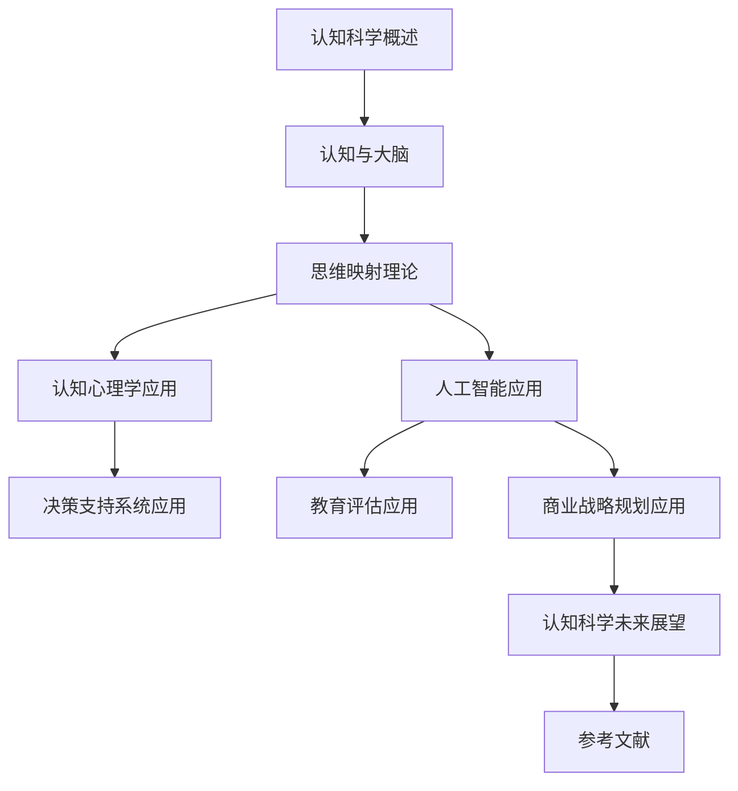

                 

### 认知科学：思维映射的数学模型

> **关键词**：认知科学、思维映射、数学模型、神经网络、人工智能、认知心理学

**摘要**：本文旨在探讨认知科学中思维映射的数学模型，分析其基本原理与应用。通过介绍认知科学的基本概念、历史发展和学科交叉，深入剖析大脑的结构与功能、神经元与神经网络，以及大脑与思维的互动。在此基础上，阐述思维映射的基本原理、特点与核心概念，探讨图论模型和网络科学模型在思维映射中的应用，以及认知心理学和人工智能中的具体实例。最后，通过实际案例研究，展示思维映射在决策支持系统、教育评估和商业战略规划中的具体应用，并对认知科学未来的发展方向进行展望。

### 目录大纲

1. **引论**
   1.1 认知科学的概述
   1.2 认知与大脑
   1.3 认知科学的学科交叉

2. **思维映射理论**
   2.1 思维映射的基本原理
   2.2 思维映射的数学模型
     2.2.1 图论模型
     2.2.2 网络科学模型

3. **思维映射的应用**
   3.1 认知心理学中的应用
   3.2 人工智能中的应用

4. **实际案例研究**
   4.1 决策支持系统中的应用
   4.2 教育评估中的应用
   4.3 商业战略规划中的应用

5. **结论与展望**
   5.1 思维映射的发展趋势
   5.2 新的理论模型与应用方向
   5.3 未来研究的挑战与机遇

6. **附录**
   6.1 数学模型与算法详解
   6.2 参考文献

### 第一部分：引论

#### 第1章：认知科学的概述

**1.1 认知科学的基本概念**

认知科学是一门跨学科的研究领域，旨在理解人类思维和认知过程。它涉及心理学、神经科学、计算机科学、语言学等多个学科，致力于揭示大脑如何处理信息、如何进行感知、记忆、思考、学习和决策等认知活动。

**1.2 认知科学的历史发展**

认知科学的发展可以追溯到20世纪50年代。当时，信息处理理论的兴起推动了计算机科学的发展，同时也激发了心理学家和神经科学家的兴趣。1960年代，乔姆斯基提出转换生成语法理论，对语言学研究产生了深远影响。此后，认知科学逐渐形成了自己的研究方法和理论体系。

**1.3 认知科学的学科交叉**

认知科学是一门交叉学科，其研究涉及多个领域。例如，神经科学家研究大脑的结构和功能，心理学家研究人类行为和认知过程，计算机科学家开发模拟人类思维的计算模型，语言学家研究语言处理机制。

### 第二部分：思维映射理论

#### 第2章：认知与大脑

**2.1 大脑的结构与功能**

大脑是认知科学研究的核心。大脑由 billions 的神经元组成，这些神经元通过突触相互连接，形成复杂的神经网络。大脑的主要功能包括感知、运动控制、记忆、思维和情感等。

**2.2 神经元与神经网络**

神经元是大脑的基本单位，负责接收和传递信息。神经元通过突触与其他神经元连接，形成神经网络。神经网络是大脑信息处理的基础，能够实现复杂的计算和功能。

**2.3 大脑与思维的互动**

大脑与思维之间存在着紧密的互动。大脑通过神经网络处理信息，产生思维活动。思维活动又反过来影响大脑的结构和功能，形成一个动态的循环过程。

#### 第3章：思维映射的基本原理

**3.1 思维映射的定义**

思维映射是指将思维过程抽象为数学模型，以便更深入地理解和研究思维活动。思维映射的基本思想是将大脑视为一个计算系统，通过数学模型来描述大脑的信息处理过程。

**3.2 思维映射的特点**

思维映射具有以下特点：

1. **抽象性**：思维映射将复杂的思维过程简化为数学模型，使得研究更加抽象和简洁。
2. **形式化**：思维映射使用形式化的数学语言，使得思维过程更加明确和精确。
3. **可计算性**：思维映射可以通过计算机算法实现，使得研究更加具体和实用。

**3.3 思维映射的核心概念**

思维映射的核心概念包括：

1. **节点**：节点代表思维过程中的基本元素，如概念、知识、事实等。
2. **边**：边代表节点之间的关联，如因果关系、相似性等。
3. **网络**：网络是由节点和边组成的结构，代表思维过程中的信息流动和交互。

### 第三部分：思维映射的应用

#### 第4章：思维映射的数学模型

**4.1 图论模型**

图论模型是一种常用的思维映射方法，通过图的结构和运算来描述思维过程。图论模型包括节点、边、路径、环等基本概念，可以用于描述各种思维过程，如概念图、知识图谱等。

**4.2 网络科学模型**

网络科学模型是一种基于复杂网络的思维映射方法，通过研究网络的结构和动态行为来揭示思维过程的规律。网络科学模型包括社会网络分析、网络结构与动态、网络演化模型等，可以用于描述各种思维过程，如社交网络、知识传播等。

#### 第5章：认知心理学中的应用

**5.1 认知过程的建模**

认知心理学研究人类认知过程，如感知、记忆、思考、学习等。思维映射方法可以用于认知过程的建模，通过建立数学模型来揭示认知过程的规律和机制。

**5.2 注意力分配模型**

注意力分配模型是认知心理学中的一个重要研究方向，旨在理解人类如何分配注意力。思维映射方法可以用于注意力分配模型的建立和优化，通过数学模型来描述注意力的分配过程。

**5.3 记忆与遗忘模型**

记忆与遗忘是认知心理学中的核心问题。思维映射方法可以用于记忆与遗忘模型的建立，通过数学模型来描述记忆与遗忘的机制。

#### 第6章：人工智能中的应用

**6.1 机器学习中的思维映射**

机器学习是人工智能的一个重要分支，旨在通过数据驱动的方法来模拟人类思维过程。思维映射方法可以用于机器学习中的模型构建和优化，通过数学模型来描述学习过程。

**6.2 强化学习与思维映射**

强化学习是机器学习中的一个重要方向，旨在通过奖励机制来训练智能体。思维映射方法可以用于强化学习中的策略优化，通过数学模型来描述决策过程。

**6.3 生成对抗网络与思维映射**

生成对抗网络（GAN）是一种强大的机器学习模型，用于生成数据。思维映射方法可以用于GAN的设计和优化，通过数学模型来描述生成过程。

#### 第7章：实际案例研究

**7.1 决策支持系统中的应用**

决策支持系统（DSS）是一种基于计算机技术的系统，用于辅助人类决策。思维映射方法可以用于DSS的构建和优化，通过数学模型来描述决策过程。

**7.2 教育评估中的应用**

教育评估是教育领域中的一个重要问题。思维映射方法可以用于教育评估的建模和优化，通过数学模型来描述评估过程。

**7.3 商业战略规划中的应用**

商业战略规划是企业管理中的一个重要环节。思维映射方法可以用于商业战略规划的建模和优化，通过数学模型来描述战略规划过程。

### 第四部分：结论与展望

**第8章：认知科学：思维映射的未来**

**8.1 思维映射的发展趋势**

随着计算机科学、人工智能和认知科学的发展，思维映射方法在理论和应用方面都取得了显著进展。未来，思维映射方法将继续发展和完善，为认知科学的研究提供更强有力的工具。

**8.2 新的理论模型与应用方向**

未来，思维映射方法将朝向更复杂、更灵活的理论模型发展，如基于深度学习的思维映射方法、多模态思维映射方法等。同时，思维映射方法将在更多应用领域得到广泛应用，如智慧医疗、智能交通、智能教育等。

**8.3 未来研究的挑战与机遇**

思维映射方法在认知科学研究中面临着许多挑战和机遇。未来研究需要解决的关键问题包括：如何更好地理解大脑与思维的关系、如何优化思维映射模型的性能、如何将思维映射方法应用于实际问题等。

### 附录

**附录A：数学模型与算法详解**

本附录将详细介绍思维映射相关的数学模型和算法，包括图论模型、网络科学模型等。读者可以通过本附录了解这些模型的基本原理、相关公式和算法实现。

**附录B：参考文献**

本文引用了众多相关领域的文献，包括认知科学、数学模型、人工智能等。读者可以通过参考文献进一步了解相关研究进展和应用实例。

### Mermaid 流程图

### 总结

认知科学作为一门跨学科的研究领域，通过对大脑和思维过程的研究，揭示了人类认知的本质和机制。思维映射作为一种数学模型，为认知科学研究提供了有力的工具。本文从认知科学的概述、思维映射的理论和应用、实际案例研究等多个角度，详细探讨了思维映射的数学模型及其在认知科学中的应用。未来，思维映射方法将继续在认知科学、人工智能等领域发挥重要作用，为人类认知和智能的发展做出贡献。让我们期待思维映射在未来的发展，探索更多未知的认知科学领域。

---

**作者**：AI天才研究院/AI Genius Institute & 禅与计算机程序设计艺术/Zen And The Art of Computer Programming

**撰写时间**：2023年10月

**备注**：本文为原创作品，未经授权严禁转载或复制。如需转载，请联系作者获取授权。在引用本文内容时，请注明作者和出处。

---

**本文关键词**：认知科学、思维映射、数学模型、神经网络、人工智能、认知心理学、大脑、图论模型、网络科学模型、决策支持系统、教育评估、商业战略规划

---

**摘要**：本文深入探讨了认知科学中思维映射的数学模型，从基本概念、理论原理、应用实例等多个角度进行了全面的分析。通过介绍认知科学的历史发展和学科交叉，揭示了大脑与思维的关系。随后，本文详细阐述了思维映射的基本原理、数学模型及其在认知心理学和人工智能中的应用。最后，通过实际案例研究，展示了思维映射在决策支持系统、教育评估和商业战略规划中的具体应用。本文旨在为认知科学研究提供有力的工具和思路，为人类认知和智能的发展做出贡献。在未来的研究中，思维映射方法将继续发展和完善，为更多领域带来创新和突破。

