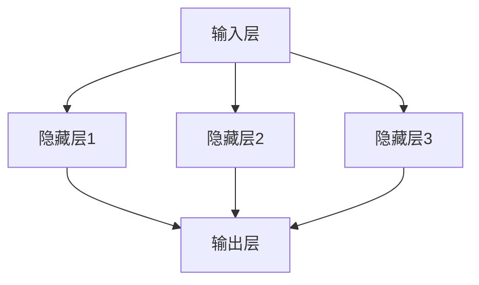

                 

### 《认知计算：模拟人脑的新尝试》

> **关键词：** 认知计算，人工神经网络，深度学习，计算机视觉，自然语言处理，人工智能

**摘要：** 本文深入探讨了认知计算这一前沿技术领域，从基础理论到实际应用，详细阐述了认知计算的核心概念、工作原理、模型与方法，以及其在人工智能、自然语言处理和计算机视觉等领域的广泛应用。通过具体案例和项目实战，本文展现了认知计算系统的设计与实现，并对认知计算的未来发展趋势进行了展望。本文旨在为读者提供一个全面、系统的认知计算知识体系，以及实用的开发工具和学习资源。

### 第一部分：认知计算基础理论

#### 第1章：认知计算的背景与概念

认知计算是一种模拟人类思维过程的计算方法，通过模仿人类大脑的信息处理机制来实现智能行为。认知计算的核心目标是实现人类智能的机器模拟，从而提高机器的智能水平。与传统计算相比，认知计算更加关注不确定性的处理，通过模仿人类大脑的思维方式来解决复杂问题。

在认知计算的背景下，理解其概念是至关重要的。认知计算的定义是指通过模拟人类大脑的结构和功能，使计算机能够执行类似人类思维的任务。这一概念涉及到多个领域，包括神经科学、心理学、认知科学和计算机科学。

首先，让我们从认知计算的定义开始。认知计算是一种计算方法，旨在模拟人类大脑的信息处理过程。它结合了神经科学和认知科学的研究成果，通过构建复杂的计算模型，实现对人类智能的模拟。认知计算的目标是实现更高层次的智能行为，如推理、学习、记忆和情感处理等。

接下来，我们将探讨认知计算与传统计算之间的区别。传统计算主要基于逻辑和算法，侧重于处理确定性的问题。例如，传统计算在解决数学问题、科学计算和工程优化等领域具有显著优势。然而，传统计算在面对复杂、不确定的问题时，往往表现出局限性。

相比之下，认知计算更加关注不确定性的处理。它通过模仿人类大脑的思维方式，利用大量的神经元和复杂的神经网络来实现智能行为。认知计算能够处理模糊性、不确定性以及动态变化的问题，从而在许多领域展现出独特的优势。

最后，我们来看一下认知计算的重要性。随着人工智能技术的不断发展，认知计算已成为一个重要的研究热点。它不仅能够提高机器的智能水平，还能够为各个行业带来深远的影响。

在医疗领域，认知计算可以辅助医生进行诊断和治疗。通过分析大量医疗数据，认知计算可以帮助医生发现潜在的疾病信号，提高诊断的准确性和效率。

在金融领域，认知计算可以用于风险管理和投资决策。通过分析市场数据和历史交易记录，认知计算可以预测市场趋势，为投资者提供更有针对性的建议。

在教育领域，认知计算可以用于个性化学习和智能教学。通过分析学生的学习行为和知识结构，认知计算可以为学生提供个性化的学习资源和教学方案，提高学习效果。

总之，认知计算作为一种模拟人类思维过程的计算方法，具有广泛的应用前景。它不仅能够推动人工智能技术的发展，还能够为各个行业带来创新和变革。

#### 第2章：人脑的工作原理

人脑是认知计算的基石，要深入理解认知计算，我们需要首先了解人脑的工作原理。人脑由大脑、小脑和脑干三部分组成，其中大脑是主导智能活动的核心。大脑包含数以亿计的神经元，它们通过突触连接形成一个复杂的神经网络。

首先，让我们来看一下人脑的结构。大脑由两个半球组成，每个半球又分为四个部分：前额叶、顶叶、颞叶和枕叶。这些部分各自负责不同的功能。例如，前额叶负责决策和规划，顶叶负责空间感知和运动控制，颞叶负责听觉和记忆，枕叶负责视觉处理。

神经元是人脑的基本功能单元，它们通过电信号进行通讯。神经元由细胞体、树突和轴突组成。细胞体是神经元的中心，负责接收和处理信号。树突负责接收其他神经元的信息，并将其传递到细胞体。轴突负责将处理后的信号传递到其他神经元。

神经元之间的通讯机制是通过突触实现的。突触是神经元之间的连接点，由突触前膜、突触后膜和突触间隙组成。当神经信号到达突触前膜时，会释放出神经递质，神经递质通过突触间隙传递到突触后膜，从而改变后神经元的电活动。

神经网络是人脑的核心特性之一，它由大量的神经元通过突触连接形成一个复杂的网络。神经网络具有自适应性和学习能力，能够根据输入数据进行调整和优化。神经网络通过层次结构实现对复杂问题的处理，不同层次之间的信息传递和整合是神经网络的核心特性。

人脑的工作原理可以概括为以下几个步骤：

1. **感知与刺激**：人脑通过感官系统接收外部刺激，如视觉、听觉、触觉等。
2. **信息处理**：感官信息通过神经系统传递到大脑，大脑对信息进行加工和处理。
3. **决策与行动**：大脑根据处理后的信息做出决策，并指挥身体进行相应的行动。

通过理解人脑的工作原理，我们可以更好地设计认知计算模型，模拟人脑的思维方式，实现更高级别的智能行为。

#### 第3章：认知计算的模型与方法

认知计算的模型与方法是构建和实现认知计算系统的核心。在这一章节中，我们将详细介绍认知计算中的主要模型与方法，包括人工神经网络、深度学习和认知计算的核心算法。

首先，人工神经网络是认知计算的基础。人工神经网络（Artificial Neural Networks，ANNs）是一种模拟人脑神经元结构和功能的计算模型。它由大量的人工神经元通过连接组成，每个神经元都可以接收输入信号，进行加权求和，并通过激活函数产生输出信号。

人工神经网络的基本结构包括输入层、隐藏层和输出层。输入层接收外部输入信号，隐藏层负责处理和加工这些信号，输出层产生最终输出。神经元的连接权值和激活函数是神经网络的关键参数，通过调整这些参数，神经网络可以学习和模拟复杂的函数。

下面是一个简单的神经网络结构的 Mermaid 流程图：



在这个例子中，输入层有3个神经元，隐藏层有3个神经元，输出层有1个神经元。每个隐藏层神经元都接收来自输入层的输入信号，通过加权求和和激活函数产生输出信号，最终输出层的神经元产生最终输出。

人工神经网络的核心算法是反向传播算法（Backpropagation Algorithm）。反向传播算法是一种用于训练神经网络的优化算法，它通过不断调整神经元的连接权值和阈值，使网络的输出与期望输出之间的误差最小化。反向传播算法的主要步骤如下：

1. **前向传播**：将输入信号通过神经网络传递，计算每个神经元的输出。
2. **计算误差**：计算输出层的实际输出与期望输出之间的误差。
3. **反向传播**：将误差反向传播到隐藏层，通过梯度下降法更新神经元的连接权值和阈值。
4. **重复迭代**：重复前向传播和反向传播的过程，直到网络收敛到满意的误差水平。

下面是一个简单的反向传播算法的伪代码：

```pseudo
function backpropagation(inputs, targets, weights, biases):
    for each layer in reversed order:
        compute the output error for each neuron
        update the weights and biases using gradient descent
    return updated weights and biases
```

深度学习（Deep Learning）是认知计算的重要组成部分，它通过多层神经网络来实现对数据的自动特征提取和分类。深度学习的核心思想是利用大量数据进行训练，通过层层提取特征，最终实现高层次的抽象表示。

深度学习的基础是多层感知机（Multilayer Perceptron，MLP），它是一种由输入层、多个隐藏层和输出层组成的前馈神经网络。在深度学习中，隐藏层可以包含数十层甚至数百层，每一层都对输入数据进行特征提取和变换。

下面是一个简单的多层感知机的伪代码：

```pseudo
function multilayer_perceptron(inputs, weights, biases):
    hidden_layers = []
    for hidden_layer in hidden_layers:
        z = dot_product(inputs, weights) + biases
        a = activation_function(z)
        hidden_layers.append(a)
    z = dot_product(hidden_layers[-1], weights) + biases
    a = activation_function(z)
    return a
```

在深度学习中，常用的激活函数包括 sigmoid 函数、ReLU 函数和 tanh 函数。sigmoid 函数可以将输入映射到 [0, 1] 区间，ReLU 函数可以引入非线性，提高网络的收敛速度，tanh 函数可以保持输出在 [-1, 1] 区间内。

深度学习的训练过程主要包括两个步骤：前向传播和反向传播。前向传播是将输入信号通过神经网络传递，计算每个神经元的输出。反向传播是通过计算输出层的实际输出与期望输出之间的误差，将误差反向传播到隐藏层，并更新神经元的连接权值和阈值。

下面是一个简单的深度学习训练的伪代码：

```pseudo
function train(inputs, targets, epochs, learning_rate):
    for epoch in range(epochs):
        for input in inputs:
            output = multilayer_perceptron(input, weights, biases)
            error = calculate_error(output, targets)
            backpropagation(input, targets, weights, biases, learning_rate)
    return weights, biases
```

认知计算的核心算法还包括强化学习（Reinforcement Learning）和迁移学习（Transfer Learning）。强化学习是一种通过奖励机制来引导模型学习最优策略的算法。在强化学习中，模型通过与环境的交互来学习最优行为策略。迁移学习则是利用预训练模型来加速新任务的学习，通过将已有模型的权重迁移到新任务上，提高模型的训练效率。

总之，认知计算的模型与方法涵盖了从人工神经网络到深度学习，再到强化学习和迁移学习的一系列算法。这些算法共同构成了认知计算的核心，使得计算机能够模拟人类的思维过程，实现更高层次的智能行为。

### 第4章：认知计算的应用领域

认知计算作为一种前沿技术，已经广泛应用于多个领域，带来了显著的变革和创新。在人工智能、自然语言处理和计算机视觉等核心领域，认知计算展示了其强大的能力和广泛的应用前景。

首先，人工智能是认知计算最为重要的应用领域之一。人工智能（Artificial Intelligence，AI）是指通过计算机模拟人类智能的技术，认知计算为人工智能的发展提供了新的思路和方法。通过模拟人类大脑的信息处理机制，认知计算能够实现更高层次的智能行为，如推理、学习、记忆和情感处理等。在人工智能领域，认知计算的应用涵盖了多个子领域，包括语音识别、图像识别、智能机器人、自动驾驶和智能助手等。

#### 人工智能

在人工智能领域，认知计算通过深度学习技术实现了许多突破。例如，在语音识别方面，认知计算模型可以处理复杂的语音信号，识别出不同的语音内容，并实现实时语音转文字的功能。在图像识别方面，认知计算模型可以通过分析图像的特征，实现人脸识别、物体分类和场景识别等任务。此外，认知计算还在智能机器人领域发挥着重要作用，通过模拟人类大脑的决策过程，智能机器人能够更好地理解和适应复杂环境，实现自主导航和任务执行。

#### 自然语言处理

自然语言处理（Natural Language Processing，NLP）是认知计算的另一个重要应用领域。NLP是指计算机对人类语言进行处理和理解的技术，认知计算为NLP的发展提供了强大的支持。通过模拟人类大脑的语言处理机制，认知计算能够实现更高级别的语言理解和生成。

在自然语言处理中，认知计算的应用包括情感分析、文本分类、机器翻译和问答系统等。情感分析是指通过分析文本数据中的情感倾向，判断文本的情感属性，如正面、负面或中性。文本分类是指将文本数据分类到不同的类别，如新闻分类、邮件分类和产品评论分类等。机器翻译是指将一种语言翻译成另一种语言，认知计算通过模拟人类大脑的语言处理机制，可以实现高质量的语言翻译。问答系统是指通过计算机理解用户的问题，并生成相应的回答，认知计算在问答系统中发挥着关键作用，能够提供更智能和准确的回答。

#### 计算机视觉

计算机视觉（Computer Vision）是认知计算的另一个重要应用领域。计算机视觉是指通过计算机对图像和视频进行分析和理解的技术，认知计算为计算机视觉的发展提供了新的思路和方法。

在计算机视觉中，认知计算的应用包括图像识别、目标检测、图像分割和视频分析等。图像识别是指通过分析图像的特征，识别出图像中的对象和场景，如人脸识别、车辆识别和场景识别等。目标检测是指通过在图像中检测出特定的对象，并标注出对象的位置和属性，如行人检测、车辆检测和目标跟踪等。图像分割是指将图像分割成不同的区域，每个区域具有不同的特征，如医学图像分割、图像去噪和图像增强等。视频分析是指通过对视频数据的分析，提取出有用的信息和知识，如视频内容分类、视频目标跟踪和视频行为识别等。

#### 其他应用领域

除了人工智能、自然语言处理和计算机视觉，认知计算还在医疗、金融、教育和其他领域有着广泛的应用。

在医疗领域，认知计算可以用于疾病诊断、治疗方案推荐和医疗数据分析等。通过分析大量的医疗数据，认知计算可以辅助医生进行诊断和治疗，提高医疗服务的质量和效率。

在金融领域，认知计算可以用于风险管理、投资决策和市场预测等。通过分析市场数据和历史交易记录，认知计算可以预测市场趋势，为投资者提供更准确的投资建议。

在教育领域，认知计算可以用于个性化学习和智能教学。通过分析学生的学习行为和知识结构，认知计算可以为学生提供个性化的学习资源和教学方案，提高学习效果。

总之，认知计算作为一种模拟人类思维过程的计算方法，已经在多个领域取得了显著的成果。随着技术的不断进步，认知计算将在人工智能、自然语言处理、计算机视觉和其他领域发挥越来越重要的作用，为人类社会带来更多的便利和创新。

### 第二部分：认知计算的实现与实践

#### 第5章：认知计算系统设计

认知计算系统的设计是实现认知计算功能的关键步骤。一个有效的认知计算系统不仅需要强大的硬件支持，还需要合理的软件架构和高效的数据处理机制。在本章节中，我们将详细讨论认知计算系统的架构、数据处理与存储、以及算法优化与性能调优。

#### 5.1 认知计算系统的架构

认知计算系统的架构可以分为硬件和软件两个主要部分。

**硬件架构：**

在硬件层面，认知计算系统通常需要高性能的计算资源和存储设备。为了满足大规模数据处理和复杂计算的需求，系统可能需要使用高性能的CPU、GPU和TPU等计算设备。此外，系统还需要高速的存储设备，如固态硬盘（SSD）和分布式存储系统，以确保数据的快速读取和写入。

硬件架构的设计需要考虑以下几个关键因素：

1. **计算能力：** 确保系统能够处理大量的数据和复杂的计算任务。
2. **存储容量：** 提供足够的存储空间来存储大量的训练数据和模型。
3. **扩展性：** 系统应具有可扩展性，以便在需求增加时能够轻松扩展硬件资源。
4. **可靠性：** 确保系统稳定运行，避免因硬件故障导致数据丢失或系统崩溃。

**软件架构：**

在软件层面，认知计算系统需要设计合适的软件框架和算法，以满足认知计算的需求。常见的软件架构包括：

1. **模块化设计：** 将系统分解为多个模块，每个模块负责不同的功能，如数据采集、数据处理、模型训练和模型评估等。
2. **分布式计算：** 利用分布式计算框架，如 TensorFlow、PyTorch 和 Horovod，将计算任务分配到多个计算节点上，提高系统的计算效率。
3. **微服务架构：** 通过微服务架构，将系统分解为多个小型服务，每个服务独立部署和扩展，提高系统的灵活性和可维护性。

**案例：** 一个典型的认知计算系统架构可能包括以下组件：

- **数据采集模块：** 负责从不同的数据源收集数据，如传感器数据、社交媒体数据和医疗数据等。
- **数据处理模块：** 对采集到的数据进行清洗、预处理和特征提取，为模型训练提供高质量的数据。
- **模型训练模块：** 使用深度学习框架训练模型，包括前向传播、反向传播和优化算法等。
- **模型评估模块：** 对训练好的模型进行评估和验证，确保模型具有良好的性能和泛化能力。
- **模型部署模块：** 将训练好的模型部署到生产环境中，提供实时预测和决策支持。

#### 5.2 数据处理与存储

数据处理与存储是认知计算系统设计中的关键环节，直接影响到系统的性能和效率。

**数据处理：**

数据处理主要包括以下几个步骤：

1. **数据采集：** 从各种数据源采集数据，如传感器数据、网络数据和用户行为数据等。
2. **数据清洗：** 清除数据中的噪声和异常值，确保数据的质量。
3. **数据预处理：** 将原始数据转换为适合模型训练的格式，如归一化、标准化和缺失值填补等。
4. **特征提取：** 从数据中提取出有用的特征，为模型训练提供输入。

**数据存储：**

数据存储需要考虑以下几个关键因素：

1. **数据类型：** 根据数据类型选择合适的存储方案，如关系数据库、NoSQL 数据库和图数据库等。
2. **存储容量：** 提供足够的存储空间来存储大量的数据。
3. **访问速度：** 确保数据能够快速读取和写入，以满足实时计算的需求。
4. **数据备份与恢复：** 确保数据的安全性和可靠性，防止数据丢失和故障。

常见的存储方案包括：

- **关系数据库：** 如 MySQL、PostgreSQL 和 MongoDB，适合存储结构化数据。
- **NoSQL 数据库：** 如 Cassandra、HBase 和 Redis，适合存储非结构化数据和大规模数据。
- **分布式文件系统：** 如 Hadoop HDFS 和 Amazon S3，适合存储大量数据并提供高可用性。

**案例：** 一个典型的认知计算系统数据处理与存储流程可能包括以下步骤：

1. 数据采集：从传感器和网络中收集数据，如环境传感器数据、社交媒体数据和用户行为数据等。
2. 数据清洗：清除数据中的噪声和异常值，确保数据质量。
3. 数据预处理：对数据进行归一化和标准化处理，转换为适合模型训练的格式。
4. 特征提取：从数据中提取出有用的特征，如时间序列特征、文本特征和图像特征等。
5. 数据存储：将预处理后的数据存储到关系数据库或NoSQL数据库中，为模型训练提供数据支持。

#### 5.3 算法优化与性能调优

算法优化与性能调优是提高认知计算系统性能的关键。为了实现高效的计算和快速的模型训练，系统需要采用多种优化策略。

**算法优化：**

1. **模型选择：** 选择适合特定任务的模型，如卷积神经网络（CNN）用于图像识别，循环神经网络（RNN）用于序列数据处理等。
2. **超参数调整：** 调整模型的超参数，如学习率、批次大小和正则化参数等，以优化模型性能。
3. **优化算法：** 采用高效的优化算法，如Adam、RMSProp 和 AdaGrad 等，以加速模型训练过程。

**性能调优：**

1. **计算资源分配：** 根据任务需求和计算资源情况，合理分配计算资源，如CPU、GPU 和内存等。
2. **并行计算：** 利用分布式计算和并行计算技术，提高系统的计算效率。
3. **缓存策略：** 采用缓存策略，如LRU（Least Recently Used）缓存算法，减少数据访问延迟。
4. **内存管理：** 合理管理内存使用，避免内存溢出和内存碎片化。

**案例：** 在一个认知计算系统中，为了优化性能，可以采取以下措施：

1. 选择适合图像识别任务的卷积神经网络模型，如ResNet或VGG。
2. 调整模型超参数，如学习率设置为0.001，批次大小设置为64。
3. 使用GPU进行模型训练，利用CUDA加速计算。
4. 采用数据并行训练策略，将训练数据分为多个批次，同时在多个GPU上并行训练。
5. 利用LRU缓存算法，减少数据读取延迟。

通过有效的算法优化和性能调优，认知计算系统可以显著提高计算效率，实现更快、更准确的模型训练和预测。

### 第6章：认知计算项目案例

在本章节中，我们将通过几个实际项目案例来展示认知计算的应用和实现过程。这些案例涵盖了情感分析、图像识别和自然语言处理等领域，通过具体的项目实战，读者可以更深入地理解认知计算的概念和技巧。

#### 6.1 案例一：基于认知计算的情感分析系统

情感分析是自然语言处理中的一个重要任务，旨在从文本数据中提取出情感倾向。在本案例中，我们将构建一个基于认知计算的情感分析系统，用于分析社交媒体上的用户评论，判断其情感倾向是积极、消极还是中性。

**项目目标：**
- 构建一个能够分析社交媒体评论的情感分析系统。
- 系统应能够自动分类评论的情感倾向，并输出相应的情感标签。

**实现步骤：**

1. **数据采集：**
   - 从社交媒体平台（如Twitter、Facebook等）采集用户评论数据。
   - 数据采集过程中需要遵守数据隐私和平台政策，确保数据的合法性和安全性。

2. **数据预处理：**
   - 清洗数据，去除噪声和无关信息，如HTML标签、特殊字符和停用词。
   - 对评论进行分词，提取出具有意义的词汇。
   - 建立词汇表，将词汇映射为索引，用于后续的特征表示。

3. **特征提取：**
   - 使用词袋模型（Bag-of-Words，BoW）或词嵌入（Word Embedding）技术，将评论转换为特征向量。
   - 词袋模型将评论中的词汇表示为向量，忽略词汇的顺序。
   - 词嵌入技术通过学习词汇的上下文关系，生成更丰富的特征表示。

4. **模型训练：**
   - 选择一个合适的情感分析模型，如支持向量机（SVM）、朴素贝叶斯（Naive Bayes）或深度学习模型。
   - 使用训练数据集训练模型，通过反向传播算法优化模型参数。
   - 调整模型超参数，如正则化参数和learning rate，以提高模型性能。

5. **模型评估：**
   - 使用验证数据集评估模型性能，计算准确率、召回率和F1分数等指标。
   - 调整模型结构和超参数，以达到更好的性能。

6. **模型部署：**
   - 将训练好的模型部署到生产环境中，提供实时情感分析服务。
   - 系统接收用户评论，通过模型预测情感倾向，并返回相应的情感标签。

**代码示例：**

下面是一个简单的情感分析模型的实现代码，使用Python和TensorFlow框架：

```python
import tensorflow as tf
from tensorflow.keras.preprocessing.text import Tokenizer
from tensorflow.keras.preprocessing.sequence import pad_sequences
from tensorflow.keras.models import Sequential
from tensorflow.keras.layers import Embedding, LSTM, Dense

# 数据预处理
tokenizer = Tokenizer(num_words=10000)
tokenizer.fit_on_texts(train_comments)
train_sequences = tokenizer.texts_to_sequences(train_comments)
train_padded = pad_sequences(train_sequences, maxlen=100)

# 模型构建
model = Sequential()
model.add(Embedding(10000, 16, input_length=100))
model.add(LSTM(16, dropout=0.2, recurrent_dropout=0.2))
model.add(Dense(1, activation='sigmoid'))

# 模型编译
model.compile(optimizer='adam', loss='binary_crossentropy', metrics=['accuracy'])

# 模型训练
model.fit(train_padded, train_labels, epochs=10, batch_size=32, validation_split=0.1)

# 模型评估
test_sequences = tokenizer.texts_to_sequences(test_comments)
test_padded = pad_sequences(test_sequences, maxlen=100)
predictions = model.predict(test_padded)
predicted_labels = (predictions > 0.5)

# 模型部署
# ...（部署到生产环境中）

```

通过以上步骤，我们可以构建一个基于认知计算的情感分析系统，实现自动分类社交媒体评论的情感倾向。

#### 6.2 案例二：认知计算在图像识别中的应用

图像识别是计算机视觉中的一个核心任务，旨在从图像中识别出特定的对象或场景。在本案例中，我们将构建一个基于认知计算的图像识别系统，用于识别和分类图像中的物体。

**项目目标：**
- 构建一个能够识别和分类图像中物体的图像识别系统。
- 系统应能够自动分类图像，并输出相应的物体标签。

**实现步骤：**

1. **数据采集：**
   - 从公开数据集（如ImageNet、COCO等）中采集图像数据。
   - 数据集应包含不同类别的图像，确保模型的泛化能力。

2. **数据预处理：**
   - 对图像进行缩放和裁剪，使其具有统一的大小和形状。
   - 对图像进行归一化处理，将像素值缩放到[0, 1]之间。

3. **特征提取：**
   - 使用卷积神经网络（CNN）提取图像特征。
   - 卷积神经网络通过多个卷积层和池化层，逐步提取图像的底层和高级特征。

4. **模型训练：**
   - 选择一个预训练的CNN模型，如VGG、ResNet或Inception。
   - 使用预训练模型的权重作为起点，通过迁移学习微调模型，使其适应特定的图像识别任务。

5. **模型评估：**
   - 使用验证数据集评估模型性能，计算准确率、召回率和F1分数等指标。
   - 调整模型结构和超参数，以达到更好的性能。

6. **模型部署：**
   - 将训练好的模型部署到生产环境中，提供实时图像识别服务。
   - 系统接收图像输入，通过模型预测物体标签，并返回相应的分类结果。

**代码示例：**

下面是一个简单的图像识别模型的实现代码，使用Python和TensorFlow框架：

```python
import tensorflow as tf
from tensorflow.keras.applications import VGG16
from tensorflow.keras.preprocessing.image import ImageDataGenerator
from tensorflow.keras.optimizers import Adam
from tensorflow.keras.models import Model
from tensorflow.keras.layers import Input, Flatten, Dense

# 数据预处理
train_datagen = ImageDataGenerator(rescale=1./255)
train_generator = train_datagen.flow_from_directory(
        train_data_dir,
        target_size=(224, 224),
        batch_size=32,
        class_mode='categorical')

# 模型构建
base_model = VGG16(weights='imagenet', include_top=False, input_shape=(224, 224, 3))
x = base_model.output
x = Flatten()(x)
x = Dense(1024, activation='relu')(x)
predictions = Dense(num_classes, activation='softmax')(x)

model = Model(inputs=base_model.input, outputs=predictions)

# 模型编译
model.compile(optimizer=Adam(learning_rate=0.0001), loss='categorical_crossentropy', metrics=['accuracy'])

# 模型训练
model.fit(train_generator, epochs=10, validation_data=validation_generator)

# 模型评估
# ...（使用验证数据集评估模型性能）

# 模型部署
# ...（部署到生产环境中）

```

通过以上步骤，我们可以构建一个基于认知计算的图像识别系统，实现自动分类图像中的物体。

#### 6.3 案例三：自然语言处理中的认知计算

自然语言处理（NLP）是认知计算的一个重要应用领域，旨在使计算机理解和生成人类语言。在本案例中，我们将构建一个基于认知计算的文本分类系统，用于分类新闻文章的类别。

**项目目标：**
- 构建一个能够自动分类新闻文章类别的文本分类系统。
- 系统应能够处理大量文本数据，并输出相应的类别标签。

**实现步骤：**

1. **数据采集：**
   - 从新闻网站或数据集（如20 Newsgroups）中采集新闻文章数据。
   - 数据集应包含多个类别，如政治、体育、娱乐等。

2. **数据预处理：**
   - 清洗数据，去除噪声和无关信息，如HTML标签、特殊字符和停用词。
   - 对文本进行分词，提取出具有意义的词汇。
   - 建立词汇表，将词汇映射为索引，用于后续的特征表示。

3. **特征提取：**
   - 使用词袋模型（Bag-of-Words，BoW）或词嵌入（Word Embedding）技术，将文本转换为特征向量。
   - 词袋模型将文本中的词汇表示为向量，忽略词汇的顺序。
   - 词嵌入技术通过学习词汇的上下文关系，生成更丰富的特征表示。

4. **模型训练：**
   - 选择一个合适的文本分类模型，如朴素贝叶斯（Naive Bayes）、支持向量机（SVM）或深度学习模型。
   - 使用训练数据集训练模型，通过反向传播算法优化模型参数。
   - 调整模型超参数，如学习率和批次大小，以提高模型性能。

5. **模型评估：**
   - 使用验证数据集评估模型性能，计算准确率、召回率和F1分数等指标。
   - 调整模型结构和超参数，以达到更好的性能。

6. **模型部署：**
   - 将训练好的模型部署到生产环境中，提供实时文本分类服务。
   - 系统接收文本输入，通过模型预测类别标签，并返回相应的分类结果。

**代码示例：**

下面是一个简单的文本分类模型的实现代码，使用Python和scikit-learn框架：

```python
from sklearn.feature_extraction.text import TfidfVectorizer
from sklearn.model_selection import train_test_split
from sklearn.naive_bayes import MultinomialNB
from sklearn.metrics import accuracy_score, classification_report

# 数据预处理
corpus = ['这是一个关于政治的新闻。',
          '这是一条关于体育的新闻。',
          '这是一篇关于娱乐的文章。']

labels = ['政治', '体育', '娱乐']

# 分词和特征提取
vectorizer = TfidfVectorizer(stop_words='english')
X = vectorizer.fit_transform(corpus)

# 模型训练
X_train, X_test, y_train, y_test = train_test_split(X, labels, test_size=0.2, random_state=42)
model = MultinomialNB()
model.fit(X_train, y_train)

# 模型评估
y_pred = model.predict(X_test)
accuracy = accuracy_score(y_test, y_pred)
print('Accuracy:', accuracy)
print(classification_report(y_test, y_pred))

# 模型部署
# ...（部署到生产环境中）

```

通过以上步骤，我们可以构建一个基于认知计算的文本分类系统，实现自动分类新闻文章的类别。

以上三个案例展示了认知计算在不同领域的应用和实现过程，通过具体的项目实战，读者可以更深入地理解认知计算的概念和技巧。这些案例不仅提供了详细的步骤和代码示例，还涉及到了数据采集、预处理、特征提取、模型训练、评估和部署等关键环节，为读者提供了一个完整的认知计算项目实践指南。

### 第7章：认知计算的未来发展趋势

随着技术的不断进步，认知计算正在迅速发展，并在人工智能领域发挥着越来越重要的作用。在本章节中，我们将探讨认知计算的未来发展趋势，包括技术挑战与突破、社会影响与伦理问题，以及未来发展的展望。

#### 7.1 技术挑战与突破

认知计算在技术层面面临着一系列挑战。首先，计算资源的限制是一个重要问题。认知计算模型通常需要大量的计算资源和存储空间，这给硬件设备提出了更高的要求。随着模型规模的不断扩大，如何高效地利用现有的计算资源成为一个重要的课题。

为了应对计算资源的限制，研究人员提出了一系列优化策略，包括：

1. **硬件加速：** 通过使用GPU、TPU和其他硬件加速器，可以提高计算效率。硬件加速技术能够显著减少模型训练和推理的时间，从而提高系统的响应速度。
2. **分布式计算：** 通过将计算任务分布在多个计算节点上，可以有效提高系统的计算能力。分布式计算技术使得大规模模型的训练和推理成为可能，从而推动了认知计算的发展。
3. **数据并行和模型并行：** 数据并行和模型并行是提高分布式计算效率的重要手段。数据并行将数据集划分为多个部分，每个计算节点独立处理一部分数据，并在训练完成后进行参数同步。模型并行则是将模型拆分为多个部分，每个计算节点处理不同部分，并在训练过程中进行参数交换。

其次，数据质量和隐私保护是认知计算面临的另一个重大挑战。认知计算依赖于大量高质量的数据进行训练，但数据质量直接影响到模型的性能。此外，随着数据隐私问题的日益突出，如何在保护用户隐私的前提下进行数据分析和挖掘成为了一个重要的伦理问题。

为了解决这些问题，研究人员提出了一系列解决方案：

1. **数据增强：** 通过数据增强技术，可以在不增加真实数据的情况下提高模型泛化能力。数据增强包括数据生成、数据扩充和数据变换等方法，可以有效提高模型的鲁棒性。
2. **联邦学习：** 联邦学习是一种分布式学习方法，可以在不同设备上进行模型训练，同时保护用户隐私。联邦学习通过加密和差分隐私技术，确保用户数据在本地进行计算，不泄露给第三方。
3. **隐私保护技术：** 包括差分隐私、同态加密和联邦学习等，这些技术可以在保护用户隐私的前提下进行数据分析和挖掘。

除了计算资源和数据质量，认知计算在算法层面也面临着一些挑战。如何设计更高效的算法，使得模型在处理大规模数据和复杂任务时能够保持良好的性能是一个重要的研究方向。

为了应对这些挑战，研究人员提出了一系列突破性技术：

1. **生成对抗网络（GAN）：** 生成对抗网络通过两个对抗网络（生成器和判别器）的博弈，可以生成高质量的数据，从而提高模型训练效果。
2. **自监督学习：** 自监督学习是一种无需标注数据的方法，通过利用未标注的数据进行训练，可以有效提高模型泛化能力。
3. **强化学习：** 强化学习通过模拟人类决策过程，可以在复杂环境中实现智能行为。结合认知计算，强化学习可以用于自动驾驶、智能机器人等领域。

总之，认知计算在技术层面面临着一系列挑战，但通过不断的技术突破和创新，这些挑战正在逐步得到解决。随着计算资源的提升、数据质量和隐私保护技术的进步，以及新算法的发展，认知计算将在未来取得更大的突破。

#### 7.2 社会影响与伦理问题

认知计算的发展将对社会产生深远的影响，同时也引发了一系列伦理问题。首先，在医疗领域，认知计算可以辅助医生进行诊断和治疗，提高医疗服务的质量和效率。然而，这也引发了对医生职业地位和患者隐私保护的担忧。如何确保认知计算在医疗领域的应用不取代医生，而是作为医生的辅助工具，是一个重要的伦理问题。

在金融领域，认知计算可以用于风险管理、投资决策和市场预测，为投资者提供更准确和个性化的建议。然而，这也可能导致市场的不公平和透明度降低，尤其是在高频交易和算法交易中。如何确保认知计算在金融领域的应用公平、透明，并且不损害市场秩序，是另一个重要的伦理问题。

在教育领域，认知计算可以用于个性化学习和智能教学，为学生提供定制化的学习资源和教学方案。然而，这也可能导致教育资源的不平等，使得经济条件较差的学生无法享受到优质的教育资源。如何确保认知计算在教育领域的应用能够促进教育公平，是一个重要的伦理问题。

此外，认知计算的发展还可能对就业产生影响。随着认知计算在各个领域的广泛应用，某些工作岗位可能被自动化取代，导致失业问题。如何通过技术进步创造新的就业机会，以及如何确保社会各阶层的劳动者能够适应和利用这些新技术，是另一个重要的伦理问题。

为了应对这些社会影响和伦理问题，需要从政策、法律和技术等多个层面进行综合考虑和应对。首先，政府和企业应制定相应的政策和标准，确保认知计算在各个领域的应用符合伦理要求。其次，学术界和工业界应加强合作，共同研究和解决认知计算带来的伦理问题。此外，公众也需要提高对认知计算的认识和理解，积极参与到伦理问题的讨论和决策过程中。

总之，认知计算的发展对社会产生了深远的影响，同时也带来了一系列伦理问题。通过合理的政策制定、技术改进和公众参与，我们可以确保认知计算在社会中的积极应用，最大程度地减少其负面影响。

#### 7.3 未来发展趋势与展望

认知计算作为人工智能领域的一个重要分支，正在快速发展，并展现出广阔的应用前景。未来，随着技术的不断进步，认知计算将在多个领域取得重大突破，推动人工智能和计算机科学的发展。

首先，在医疗领域，认知计算将进一步提升医疗服务的质量和效率。通过分析海量医疗数据，认知计算可以辅助医生进行诊断和治疗，提高诊断的准确性和效率。未来，认知计算有望在疾病预测、药物研发和个性化医疗等方面发挥更大的作用。

在金融领域，认知计算将继续优化风险管理、投资决策和市场预测。随着数据质量和算法的不断提高，认知计算将能够更准确地预测市场趋势，为投资者提供更有针对性的建议。此外，认知计算还可以用于信用评估、反欺诈和客户关系管理等领域，提高金融机构的运营效率和服务质量。

在教育领域，认知计算将推动个性化学习和智能教学的发展。通过分析学生的学习行为和知识结构，认知计算可以为每个学生提供定制化的学习资源和教学方案，提高学习效果。未来，认知计算还可以用于学习评估、教育管理和教育研究等领域，促进教育公平和个性化教育的发展。

除了上述领域，认知计算在工业、交通、农业和环境监测等众多领域也有广泛的应用前景。例如，在工业领域，认知计算可以用于智能监控、故障诊断和设备维护，提高生产效率和设备可靠性。在交通领域，认知计算可以用于智能交通管理、自动驾驶和交通预测，提高交通流畅度和安全性。在农业领域，认知计算可以用于作物生长监测、病虫害防治和智能灌溉，提高农业生产效率和农产品质量。在环境监测领域，认知计算可以用于空气质量监测、水资源管理和生态保护，提供科学决策依据。

未来，认知计算的发展将面临一系列技术挑战，包括计算资源限制、数据质量和隐私保护等。然而，随着硬件加速、分布式计算和隐私保护技术的不断进步，这些挑战将逐步得到解决。此外，认知计算在算法层面也将取得更多突破，如生成对抗网络、自监督学习和强化学习等，这些新技术将进一步提高认知计算的性能和应用范围。

总之，认知计算作为人工智能的一个重要分支，具有广阔的应用前景。未来，随着技术的不断进步，认知计算将在各个领域取得重大突破，为人类社会带来更多便利和创新。

### 第8章：认知计算开发工具

在构建和实现认知计算系统时，选择合适的开发工具和平台是至关重要的。本章将介绍一些常见的认知计算开发工具，包括开源深度学习框架、认知计算专用工具以及开发环境的搭建与配置。

#### 8.1 开源深度学习框架

开源深度学习框架是认知计算开发的重要工具，提供了丰富的功能和支持，可以帮助开发者快速构建和训练深度学习模型。以下是一些流行的深度学习框架：

1. **TensorFlow：** 由Google开发，是一个广泛使用的开源深度学习框架。TensorFlow提供了丰富的API，支持多种编程语言（如Python、C++和Java），并且拥有庞大的社区和丰富的资源。

2. **PyTorch：** 由Facebook开发，是一个基于Python的深度学习框架，以其灵活性和动态计算图而著称。PyTorch在学术界和工业界都有很高的知名度，特别适用于研究和新模型开发。

3. **Keras：** 是一个高层次的深度学习API，旨在简化深度学习模型的构建和训练。Keras可以与TensorFlow和Theano等后端深度学习框架结合使用，提供直观和易于使用的接口。

4. **MXNet：** 是Apache Software Foundation的一个开源深度学习框架，由Apache MXNet社区维护。MXNet具有高性能和灵活性，适用于各种规模的任务。

5. **Caffe：** 是由Berkeley Vision and Learning Center（BVLC）开发的一个开源深度学习框架，以其高效的卷积神经网络（CNN）训练而闻名。

这些开源深度学习框架都提供了大量的文档、教程和示例代码，可以帮助开发者快速上手和实现复杂的项目。

#### 8.2 认知计算专用工具

除了开源深度学习框架，还有一些专为认知计算设计的专用工具，这些工具提供了特定的功能，以支持认知计算系统的开发。

1. **TensorBoard：** 是TensorFlow的一个可视化工具，用于监控和可视化训练过程。TensorBoard可以显示模型参数、损失函数、准确率和其他指标，帮助开发者理解模型性能和调试问题。

2. **TensorFlow Serving：** 是一个用于部署和管理TensorFlow模型的微服务系统。TensorFlow Serving提供了REST API，使模型可以轻松地集成到生产环境中，并提供高性能的服务。

3. **DL4J（Deep Learning for Java）：** 是一个基于Java的开源深度学习库，专为Java生态系统设计。DL4J支持多种深度学习模型和算法，并与Hadoop和Spark等大数据框架兼容。

4. **MindSpore：** 是华为开发的一个开源深度学习框架，旨在提供灵活、高效和可扩展的深度学习解决方案。MindSpore支持多种编程范式，包括动态计算图和静态计算图，适用于不同规模的任务。

#### 8.3 开发环境的搭建与配置

搭建一个高效的认知计算开发环境是成功进行项目开发的基础。以下是一些关键步骤和注意事项：

1. **选择操作系统：** 开发者可以选择Linux、Mac OS或Windows等操作系统。Linux系统因其稳定性和可定制性，常被用于深度学习开发。

2. **安装基础软件：** 安装Python、Git、JDK等基础软件，这些软件是深度学习开发和部署的必要工具。

3. **安装深度学习框架：** 根据项目需求选择合适的深度学习框架，并按照官方文档安装。例如，对于TensorFlow，可以安装TensorFlow 2.x版本，并确保兼容CUDA和cuDNN库，以支持GPU加速。

4. **配置Python环境：** 使用虚拟环境管理工具（如virtualenv或conda）配置Python环境，以隔离项目依赖和避免版本冲突。

5. **安装依赖库：** 安装项目所需的依赖库，包括数据预处理库（如NumPy、Pandas）、数据处理库（如scikit-learn、TensorFlow Data)、和可视化库（如Matplotlib、Seaborn等）。

6. **配置GPU加速：** 如果使用GPU进行深度学习训练，需要安装CUDA和cuDNN库，并确保CUDA版本与深度学习框架兼容。

7. **配置Jupyter Notebook或Google Colab：** Jupyter Notebook和Google Colab是方便的交互式开发环境，特别适用于深度学习和数据科学项目。可以安装Jupyter Notebook客户端，并配置Jupyter Lab，以提供更丰富的交互体验。

通过以上步骤，开发者可以搭建一个高效、稳定的认知计算开发环境，为项目开发提供坚实的基础。

#### 8.4 代码示例

以下是一个简单的代码示例，展示了如何使用Python和TensorFlow框架搭建一个简单的深度学习模型：

```python
import tensorflow as tf
from tensorflow.keras import layers

# 创建一个简单的模型
model = tf.keras.Sequential([
    layers.Dense(128, activation='relu', input_shape=(784,)),
    layers.Dropout(0.2),
    layers.Dense(10, activation='softmax')
])

# 编译模型
model.compile(optimizer='adam',
              loss='sparse_categorical_crossentropy',
              metrics=['accuracy'])

# 加载数据集
mnist = tf.keras.datasets.mnist
(x_train, y_train), (x_test, y_test) = mnist.load_data()
x_train, x_test = x_train / 255.0, x_test / 255.0

# 训练模型
model.fit(x_train, y_train, epochs=5)

# 评估模型
test_loss, test_acc = model.evaluate(x_test, y_test, verbose=2)
print('\nTest accuracy:', test_acc)
```

通过这个简单的示例，开发者可以了解如何使用TensorFlow创建和训练一个深度学习模型。

总之，认知计算开发工具的选择和配置对于项目成功至关重要。通过了解和使用这些工具，开发者可以更高效地构建和实现认知计算系统，为人工智能领域的发展做出贡献。

### 第9章：认知计算学习资源

对于希望深入了解认知计算的开发者和学生，掌握相关的学习资源是至关重要的。本章将介绍一些推荐的书籍、在线课程、教程和论坛与社区，以帮助读者系统地学习和掌握认知计算的知识。

#### 9.1 相关书籍推荐

1. **《深度学习》（Deep Learning）**：由Ian Goodfellow、Yoshua Bengio和Aaron Courville合著，这是深度学习领域的经典教材。书中详细介绍了深度学习的理论基础、算法和应用，适合初学者和高级研究者。

2. **《认知计算：理论与实践》（Cognitive Computing: An Introduction）**：由Miguel A. Carmon和Helen P. Benjamin合著，本书系统地介绍了认知计算的基础理论、应用场景和发展趋势，适合对认知计算感兴趣的读者。

3. **《机器学习实战》（Machine Learning in Action）**：由Peter Harrington著，本书通过实际案例和代码示例，介绍了机器学习的基本概念和算法实现，适合希望动手实践的开发者。

4. **《Python机器学习》（Python Machine Learning）**：由Sébastien Maronne著，本书使用Python语言介绍了机器学习的基本概念和算法，适合Python编程基础较好的读者。

5. **《人工智能：一种现代的方法》（Artificial Intelligence: A Modern Approach）**：由Stuart J. Russell和Peter N. Norvig合著，这是人工智能领域的权威教材，涵盖了人工智能的基本理论、方法和应用。

#### 9.2 在线课程与教程

1. **Coursera的“深度学习”课程**：由Andrew Ng教授主讲，这是深度学习领域最受欢迎的在线课程之一。课程涵盖了深度学习的理论基础、算法实现和应用实践。

2. **edX的“人工智能导论”课程**：由MIT和Stanford大学联合提供，课程内容包括机器学习、自然语言处理和计算机视觉等人工智能的核心领域。

3. **Udacity的“深度学习纳米学位”**：这是一个实践导向的纳米学位课程，通过项目实践和理论知识的学习，帮助开发者掌握深度学习的核心技术。

4. **Google的“深度学习特别化课程”**：这是Google提供的免费课程，涵盖了深度学习的理论基础、实践方法和工具使用。

5. **YouTube教程**：YouTube上有很多免费的开源教程和视频课程，涵盖了从基础到高级的认知计算相关主题，适合不同水平的开发者。

#### 9.3 论坛与社区

1. **Stack Overflow**：这是一个全球最大的开发者社区，涵盖了各种编程语言和技术问题。在Stack Overflow上，开发者可以提问、解答问题和分享经验。

2. **Reddit的AI和深度学习板块**：Reddit上有多个与AI和深度学习相关的子版块，如/r/MachineLearning、/r/deeplearning等，开发者可以在这里讨论最新的研究进展和技术应用。

3. **知乎**：知乎是中国最大的知识分享平台，有很多专业的人工智能和深度学习话题。开发者可以在知乎上提问、回答问题和参与讨论。

4. **AI研习社**：这是一个专注于人工智能和深度学习的社区，提供丰富的教程、资源和讨论。

5. **专业论坛**：如arXiv.org、ACL（Association for Computational Linguistics）和NeurIPS（Neural Information Processing Systems）等，这些论坛是学术研究者发布最新研究成果的重要平台。

通过利用这些书籍、在线课程、教程和论坛与社区资源，开发者可以系统地学习和掌握认知计算的知识，不断提升自己的技术能力，为人工智能领域的发展做出贡献。

### 附录

#### 附录 A：术语表

在认知计算领域，理解一些核心概念和术语是非常重要的。以下是一些常见的术语及其解释：

**认知计算（Cognitive Computing）**：一种模拟人类思维过程的计算方法，通过模仿人类大脑的结构和功能来实现智能行为。

**人工神经网络（Artificial Neural Networks，ANNs）**：一种模拟人脑神经元结构和功能的计算模型，由大量的人工神经元通过连接组成。

**深度学习（Deep Learning）**：一种基于多层神经网络的学习方法，通过多层网络结构自动提取数据的特征表示，实现高层次的抽象。

**卷积神经网络（Convolutional Neural Networks，CNNs）**：一种用于图像识别和计算机视觉的深度学习模型，通过卷积操作提取图像的特征。

**自然语言处理（Natural Language Processing，NLP）**：一种计算机科学领域，旨在使计算机能够理解和生成人类语言。

**强化学习（Reinforcement Learning）**：一种通过奖励机制来引导模型学习最优策略的机器学习方法。

**迁移学习（Transfer Learning）**：一种利用预训练模型来加速新任务学习的机器学习方法。

**联邦学习（Federated Learning）**：一种分布式学习方法，通过在不同设备上进行模型训练，同时保护用户隐私。

**自监督学习（Self-Supervised Learning）**：一种无需标注数据的方法，通过利用未标注的数据进行训练，提高模型的泛化能力。

通过了解这些核心概念和术语，读者可以更好地理解认知计算的理论和实践，为深入学习打下坚实的基础。

#### 附录 B：认知计算相关概念与技术的详细介绍

**人工神经网络（Artificial Neural Networks，ANNs）**

人工神经网络（ANNs）是一种模拟人脑神经元结构和功能的计算模型，由大量的人工神经元通过连接组成。每个神经元都可以接收输入信号，通过加权求和和激活函数产生输出信号。ANNs通过学习输入和输出之间的关系，实现对数据的分类、预测和特征提取。

**神经网络的基本结构**

ANNs的基本结构包括输入层、隐藏层和输出层。输入层接收外部输入信号，隐藏层负责处理和加工这些信号，输出层产生最终输出。

- **输入层（Input Layer）**：输入层包含多个神经元，每个神经元接收一个输入信号。
- **隐藏层（Hidden Layer）**：隐藏层包含多个神经元，每个神经元都接收来自输入层的输入信号，通过加权求和和激活函数产生输出信号。
- **输出层（Output Layer）**：输出层包含一个或多个神经元，产生最终输出。

**神经网络的工作原理**

神经网络的工作原理可以概括为以下几个步骤：

1. **前向传播（Forward Propagation）**：将输入信号通过神经网络传递，计算每个神经元的输出。
2. **计算误差（Calculate Error）**：计算输出层的实际输出与期望输出之间的误差。
3. **反向传播（Backpropagation）**：将误差反向传播到隐藏层，通过梯度下降法更新神经元的连接权值和阈值。
4. **重复迭代（Repeat Iterations）**：重复前向传播和反向传播的过程，直到网络收敛到满意的误差水平。

**深度学习（Deep Learning）**

深度学习是一种基于多层神经网络的学习方法，通过多层网络结构自动提取数据的特征表示，实现高层次的抽象。深度学习在图像识别、语音识别、自然语言处理和计算机视觉等领域取得了显著的成果。

**深度学习的基本概念**

- **卷积神经网络（Convolutional Neural Networks，CNNs）**：CNNs是一种用于图像识别和计算机视觉的深度学习模型，通过卷积操作提取图像的特征。
- **循环神经网络（Recurrent Neural Networks，RNNs）**：RNNs是一种用于序列数据处理和预测的深度学习模型，通过循环结构处理序列数据。
- **生成对抗网络（Generative Adversarial Networks，GANs）**：GANs是一种基于对抗训练的深度学习模型，通过生成器和判别器的博弈生成高质量的数据。

**深度学习的工作原理**

1. **数据预处理**：对输入数据进行预处理，如归一化、标准化和去噪等。
2. **模型构建**：选择合适的模型结构，如CNNs、RNNs或GANs。
3. **模型训练**：使用训练数据集训练模型，通过反向传播算法优化模型参数。
4. **模型评估**：使用验证数据集评估模型性能，计算准确率、召回率和F1分数等指标。
5. **模型部署**：将训练好的模型部署到生产环境中，提供实时预测和决策支持。

**认知计算的核心算法**

认知计算的核心算法包括人工神经网络、深度学习、强化学习和迁移学习等。以下是对这些算法的详细介绍：

- **人工神经网络（Artificial Neural Networks，ANNs）**：ANNs是一种模拟人脑神经元结构和功能的计算模型，通过大量的人工神经元通过连接组成网络，实现数据的分类、预测和特征提取。
- **深度学习（Deep Learning）**：深度学习是一种基于多层神经网络的学习方法，通过多层网络结构自动提取数据的特征表示，实现高层次的抽象。
- **强化学习（Reinforcement Learning）**：强化学习是一种通过奖励机制来引导模型学习最优策略的机器学习方法，适用于序列决策问题。
- **迁移学习（Transfer Learning）**：迁移学习是一种利用预训练模型来加速新任务学习的机器学习方法，通过将预训练模型的权重迁移到新任务上，提高模型的训练效率。

通过理解这些核心概念和技术，读者可以更深入地了解认知计算的理论基础和实践方法，为在人工智能领域的研究和应用提供指导。希望这个附录能够帮助读者更好地理解和掌握认知计算相关的内容。

