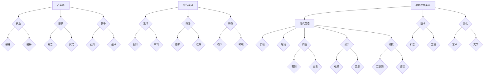
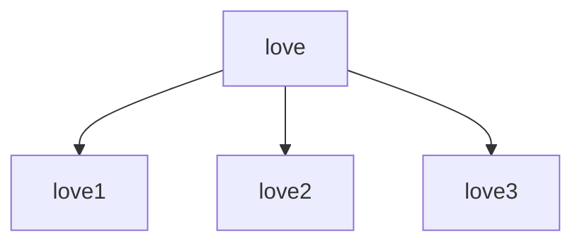
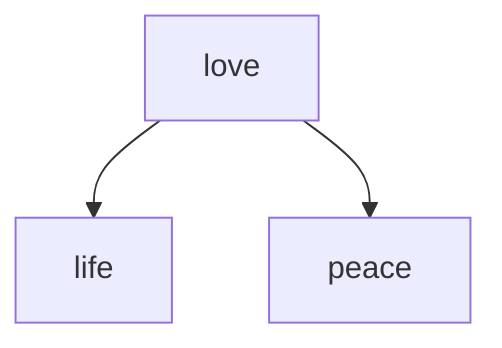

                 

### 第一部分：引言

#### 1.1 书籍背景与目的

《语言演化的复杂网络：词汇变迁的数学轨迹》是由知名语言学家和社会网络理论家共同撰写的一本学术专著。本书旨在探讨语言演化的过程，特别是词汇变迁的规律，并运用数学和复杂网络理论进行解释和预测。

语言是人类的交流工具，也是一个社会和文化的重要组成部分。随着社会的发展，语言也在不断地演变。词汇的增减、词义的变迁、语言的融合等现象，都是语言演化的重要表现。传统的语言学研究多依赖于历史文献的考据和语言现象的描述，而本书则从数学和复杂网络的角度，提供了全新的研究方法和视角。

本书的主要目的是：首先，建立语言演化的数学模型，通过复杂网络理论来描述词汇之间的关系和变迁过程；其次，通过案例研究，验证模型的有效性和预测能力；最后，探讨词汇变迁对社会和文化的影响，为语言政策和教育提供理论支持。

#### 1.2 语言演化与网络理论

语言演化是指语言在历史过程中发生的系统性变化。这些变化可以是词汇的增减、词义的变迁、语音的演变等。语言演化的过程复杂且漫长，传统的研究方法难以全面解释其内在机制。

网络理论为研究语言演化提供了一个有力的工具。复杂网络理论关注的是由大量节点和边构成的网络结构，以及这些网络在演化过程中的动态行为。语言作为一种复杂系统，其内部词汇之间的关系和变迁，可以用复杂网络的模型来描述和分析。

复杂网络的基本特性包括：节点度分布、聚类系数、路径长度等。语言网络中的节点可以表示词汇，边可以表示词汇之间的关联关系。通过分析这些特性，我们可以揭示词汇之间的关系结构，理解词汇演化的动力机制。

例如，词汇的流行程度可以反映在网络的节点度上。高度的节点表示常用的词汇，而低度的节点则可能是新词或较少使用的词汇。词汇的词义变迁可以通过网络中的路径和节点关系来体现。词义的扩展或缩小、词义的转变等，都可以在网络结构中找到相应的轨迹。

#### 1.3 词汇变迁的研究现状

词汇变迁是语言演化中的重要现象，目前已有许多研究从不同角度探讨其规律。传统的研究方法主要包括历史文献分析、词汇统计、语义分析等。

历史文献分析通过考察语言的历史发展过程，研究词汇的增减、词义的变迁等。这种方法依赖于大量的文献资料，对研究者的历史知识和考据能力有较高的要求。

词汇统计通过统计词汇的使用频率、词频分布等，研究词汇的流行程度和变化趋势。这种方法可以揭示词汇在特定时期或社会环境中的使用情况，但难以深入解释词汇变迁的内在机制。

语义分析通过考察词汇的语义关系和词义变化，研究词汇的词义扩展、词义缩小等。这种方法有助于理解词汇的意义演变，但通常局限于单一语言或特定词汇集合。

近年来，随着计算机科学和网络理论的进步，词汇变迁的研究逐渐引入复杂网络模型和数学方法。这些方法为词汇变迁提供了新的分析工具和视角，使得研究者能够更加全面和深入地探讨语言演化的规律。

总之，《语言演化的复杂网络：词汇变迁的数学轨迹》一书旨在结合数学和复杂网络理论，对词汇变迁进行系统的研究。通过建立数学模型、进行案例研究和探讨社会影响，本书为语言学研究提供了一个新的方向和工具。

---

通过上述内容，我们对《语言演化的复杂网络：词汇变迁的数学轨迹》这本书的背景、目的以及语言演化与网络理论的基本概念有了初步了解。接下来，我们将进一步探讨词汇变迁的研究现状，为后续章节的深入分析打下基础。

---

### 1.3 词汇变迁的研究现状

词汇变迁是语言学研究中的一个重要领域，其研究方法多样，涵盖了传统历史文献分析、词汇统计、语义分析，以及近年来引入的复杂网络理论和数学方法。这些研究方法各有优缺点，为词汇变迁的研究提供了不同的视角和解释。

#### 传统研究方法

1. **历史文献分析**：历史文献分析是研究词汇变迁的传统方法之一。研究者通过考察语言的历史发展过程，分析词汇的增减、词义的变迁等。这种方法依赖于大量的文献资料，对研究者的历史知识和考据能力有较高的要求。历史文献分析有助于揭示词汇变迁的长期趋势和特定历史背景下的语言变化。然而，这种方法通常受限于文献的可用性和完整性，难以全面反映语言演化的复杂性。

2. **词汇统计**：词汇统计通过统计词汇的使用频率、词频分布等，研究词汇的流行程度和变化趋势。这种方法可以揭示词汇在特定时期或社会环境中的使用情况，但难以深入解释词汇变迁的内在机制。词汇统计通常依赖于大规模语料库和计算机分析工具，能够提供大量数据支持，但数据分析结果可能受到数据质量、抽样偏差等因素的影响。

3. **语义分析**：语义分析通过考察词汇的语义关系和词义变化，研究词汇的词义扩展、词义缩小等。这种方法有助于理解词汇的意义演变，但通常局限于单一语言或特定词汇集合。语义分析可以揭示词汇之间语义联系的变化，但难以解释这些变化背后的社会和文化因素。

#### 现代研究方法

1. **复杂网络理论**：复杂网络理论为研究词汇变迁提供了一个新的视角。在复杂网络中，词汇作为节点，词汇之间的关联关系作为边，形成了一个复杂的关系网络。研究者可以运用复杂网络的基本特性，如节点度分布、聚类系数、路径长度等，来描述和分析词汇之间的关系结构和动态变化。复杂网络理论有助于揭示词汇之间的相互作用和演化规律，提供了定量分析语言演化的新工具。

2. **数学模型**：数学模型为词汇变迁的研究提供了精确的描述和预测方法。例如，演化博弈论、随机过程理论和信息论等方法，可以用于构建词汇演化的动态模型。这些模型通过数学公式和算法，描述词汇之间的竞争、合作和演化过程，从而解释词汇变迁的内在机制和外部影响因素。

3. **计算语言学**：计算语言学结合了计算机科学和语言学的方法，通过大规模数据处理和计算，研究词汇的语义、语法和语用特征。计算语言学的方法可以应用于词汇变迁的研究，例如，通过自然语言处理技术，分析大规模语料库中的词汇变化趋势和语义关系，从而揭示词汇变迁的规律。

#### 研究进展与挑战

词汇变迁的研究取得了显著的进展，但仍面临一些挑战。

1. **数据质量与规模**：词汇变迁的研究需要大量的语言数据支持。数据质量的高低直接影响研究结果的可靠性。然而，获取高质量、大规模的语言数据仍然是一个挑战。研究者需要不断开发新的数据采集和处理方法，以应对数据质量和规模的要求。

2. **跨语言研究**：词汇变迁的研究往往局限于单一语言或特定语言集合。然而，词汇变迁是一个跨语言现象，不同语言之间的词汇变迁可能存在相似性和差异性。跨语言研究有助于揭示词汇变迁的普遍规律，但跨语言数据的收集和分析较为复杂，需要跨学科的合作。

3. **理论整合**：词汇变迁的研究涉及多个学科领域，如语言学、社会学、计算机科学等。如何整合不同学科的理论和方法，构建一个全面、系统的词汇变迁理论体系，是当前研究的一个重要方向。

4. **应用前景**：词汇变迁的研究不仅在语言学领域有重要意义，还可以应用于其他领域，如语言教育、语言技术、社会文化研究等。如何将研究成果转化为实际应用，解决实际问题，是研究的一个挑战。

总之，词汇变迁的研究现状呈现出多样化和跨学科的趋势。通过传统方法和现代技术的结合，研究者能够更深入地理解词汇变迁的规律和机制。然而，仍有许多挑战需要克服，未来研究需要进一步探索跨语言、跨学科的研究方法，构建一个全面、系统的词汇变迁理论体系。

---

通过上述内容，我们回顾了词汇变迁研究的传统方法和现代方法，并探讨了当前研究的进展与挑战。接下来，我们将进一步讨论语言演化的数学模型，为深入理解词汇变迁提供理论基础。

---

### 第二部分：基础理论

#### 2.1 复杂网络的基本概念

复杂网络（Complex Network）是研究现实世界中各种复杂系统的一个有力工具。复杂网络的定义多种多样，但其核心思想是描述由大量节点和连接组成的网络结构，以及这些网络在演化过程中的动态行为。

**节点和边**

复杂网络中的节点（Node）可以表示实体，例如人、物体、词汇等。节点通过边（Edge）相互连接，边表示节点之间的某种关系，如物理距离、社会联系、词汇关联等。一个复杂网络可以用图（Graph）来表示，图是由节点集合和边集合构成的数据结构。

**度分布**

度分布（Degree Distribution）描述了网络中节点度的概率分布。节点度指的是节点连接的边的数量。在复杂网络中，度分布可能是幂律分布、泊松分布或其他形式。幂律分布（Power-law Distribution）是一种常见的度分布形式，其特征是节点度随节点数的增加而指数级增长，即存在大量低度节点和少数高度节点。

**聚类系数**

聚类系数（Clustering Coefficient）描述了网络中节点的聚类程度，即节点通过边连接形成簇的概率。高聚类系数意味着网络中的节点更倾向于形成紧密的簇结构，而低聚类系数则表示网络更松散。

**路径长度**

路径长度（Path Length）描述了网络中任意两个节点之间最短路径的长度。在复杂网络中，路径长度可能是非常小的，如社会网络中的朋友关系，也可能是非常大的，如全球互联网网络。

**网络动力学**

网络动力学（Network Dynamics）研究复杂网络在时间演化过程中的行为和性质。网络动力学可以描述为节点状态随时间的动态变化，以及节点之间相互作用导致的网络结构变化。

**随机游走**

随机游走（Random Walk）是网络动力学的一种简单模型，描述了节点在网络上随机跳跃的行为。在随机游走过程中，节点以一定的概率选择邻居节点进行跳跃，从而探索网络的结构和特性。

**小世界效应**

小世界效应（Small-world Effect）是复杂网络的一个重要特性，描述了网络中存在较短的平均路径长度和较高的聚类系数。小世界效应使得节点之间能够通过较少的中间节点相互连接，从而提高了网络的效率和连通性。

**无标度网络**

无标度网络（Scale-Free Network）是复杂网络的一种特殊形式，其特征是节点度的分布遵循幂律分布，即存在大量低度节点和少数高度节点。无标度网络的典型例子包括社会网络、互联网、生物网络等。

#### 2.2 语言演化的数学模型

**演化博弈论**

演化博弈论（Evolutionary Game Theory）是研究在动态环境中策略选择的进化过程的一种数学模型。在语言演化中，演化博弈论可以用于描述词汇之间的竞争和合作过程。

**基本概念**

- **博弈矩阵**：博弈矩阵描述了不同词汇在竞争或合作中的收益情况。每个词汇可以选择不同的策略，策略的选择影响词汇的适应度和生存机会。

- **适应度**：适应度（Fitness）描述了词汇在特定环境下的生存能力和竞争优势。高适应度的词汇更有可能保留和传播。

- **演化动态**：演化博弈论通过迭代过程模拟词汇的进化，每个迭代步骤根据博弈矩阵计算词汇的适应度，并选择适应度高的词汇进行繁殖和传播。

**模型示例**

考虑两个词汇A和B的博弈矩阵：

| A   | B   |
|-----|-----|
| (2,2) | (-1,-1) |
| (-1,-1) | (2,2) |

在这个博弈矩阵中，如果A选择策略A，B选择策略B，两者都获得2的收益；如果A选择策略A，B选择策略B，两者都获得-1的收益。演化博弈论可以通过迭代计算词汇A和B的适应度，并决定它们的繁殖和传播策略。

**随机过程理论**

随机过程理论（Random Process Theory）是研究随机现象随时间演化的数学模型。在语言演化中，随机过程理论可以用于描述词汇的出现、消失和变化过程。

**基本概念**

- **马尔可夫过程**：马尔可夫过程是一种随机过程，其未来状态仅由当前状态决定，与过去状态无关。在语言演化中，马尔可夫过程可以描述词汇的出现和消失过程。

- **状态转移概率**：状态转移概率描述了词汇在不同状态之间转移的概率。在语言演化中，状态转移概率可以影响词汇的稳定性和变化趋势。

**模型示例**

考虑一个简单的马尔可夫过程模型，描述词汇A和B的状态转移概率：

| 状态 | A出现 | A消失 | B出现 | B消失 |
|-------|--------|--------|--------|--------|
| 初始状态 | 0.5    | 0.5    | 0.4    | 0.6    |
| 状态1  | 0.4    | 0.6    | 0.3    | 0.7    |

在这个模型中，初始状态表示词汇A和B的出现概率分别为0.5和0.4，消失概率分别为0.5和0.6。状态1表示在第一个时间步之后，词汇A和B的出现和消失概率。通过迭代计算，我们可以得到词汇A和B在不同时间步的稳定状态。

**信息论与熵**

信息论（Information Theory）是研究信息传输和处理的数学理论。在语言演化中，信息论可以用于描述词汇的复杂性和多样性。

**基本概念**

- **熵**：熵（Entropy）是衡量系统不确定性的量度。在语言演化中，熵可以描述词汇的多样性。

- **信息量**：信息量（Information）是衡量信息传输过程中信息含量的量度。在语言演化中，信息量可以描述词汇的意义传递和变化。

**模型示例**

考虑一个简单的信息论模型，描述词汇A和B的熵和信息量：

| 词汇 | 出现概率 | 熵   | 信息量 |
|-------|----------|------|--------|
| A     | 0.5      | 1.0  | 1.0    |
| B     | 0.5      | 1.0  | 1.0    |

在这个模型中，词汇A和B的出现概率相等，分别为0.5。根据熵的计算公式，A和B的熵都为1.0。信息量为1.0，表示每个词汇的出现都提供了等量的信息。

通过以上基础理论的介绍，我们可以更好地理解语言演化的数学模型和方法。这些模型和方法为词汇变迁的研究提供了坚实的理论基础，使得我们可以从数学的角度深入探讨语言的复杂性和演化规律。

---

通过上述内容，我们介绍了复杂网络的基本概念和语言演化的数学模型，包括演化博弈论、随机过程理论和信息论等。这些理论为研究词汇变迁提供了有力的工具和视角。接下来，我们将进一步探讨词汇变迁的数学方法，包括词汇网络的构建、词汇演化动态的分析和词汇变迁的统计特性。

---

#### 2.3 词汇变迁的数学方法

**词汇网络的构建**

词汇网络（Lexical Network）是描述词汇之间相互关系的数学模型。在词汇网络中，每个词汇作为一个节点（Node），词汇之间的关联关系通过边（Edge）表示。构建词汇网络是词汇变迁研究的重要步骤，为后续分析提供数据基础。

**词汇网络构建方法**

1. **共现分析**：共现分析是构建词汇网络的一种常见方法。通过分析大规模语料库中的词汇共现情况，确定词汇之间的直接关联关系。共现频率越高，表示词汇之间的关联越紧密。具体步骤如下：
    - **数据采集**：从语料库中提取文本数据。
    - **分词和词性标注**：对文本数据进行分词和词性标注，确保词汇的准确性。
    - **共现统计**：统计词汇之间的共现频率，构建词汇共现矩阵。
    - **网络构建**：根据共现矩阵，构建词汇网络图。

2. **语义相似性**：语义相似性是衡量词汇之间语义关联程度的一种方法。通过词向量模型或语义网络，计算词汇之间的相似性得分。相似性得分越高，表示词汇之间的关联越紧密。具体步骤如下：
    - **词向量表示**：将词汇转化为词向量，常用的词向量模型有Word2Vec、GloVe等。
    - **相似性计算**：计算词汇之间的余弦相似性或其他相似性度量。
    - **网络构建**：根据相似性得分，构建词汇网络图。

**词汇演化动态分析**

词汇演化动态分析是研究词汇在时间维度上的变化规律。通过分析词汇网络的动态特性，揭示词汇演化的动力机制。

**词汇演化动态分析方法**

1. **时间序列分析**：时间序列分析是一种常见的方法，通过分析词汇在时间序列中的变化趋势，揭示词汇的演化规律。具体步骤如下：
    - **数据采集**：从历史语料库中提取时间序列数据。
    - **特征提取**：提取词汇在网络中的特征，如节点度、聚类系数等。
    - **趋势分析**：利用统计方法，分析词汇的时间序列趋势，如线性回归、时间序列建模等。

2. **路径分析**：路径分析是一种通过分析词汇在网络中的路径关系，揭示词汇之间动态变化的方法。具体步骤如下：
    - **路径提取**：从词汇网络中提取词汇之间的路径关系。
    - **路径分析**：分析路径的长度、连接强度等特性，揭示词汇之间的动态联系。

**词汇变迁的统计特性**

词汇变迁的统计特性是描述词汇演化过程中统计规律的一种方法。通过分析词汇的统计特性，可以揭示词汇变迁的模式和规律。

**词汇变迁统计特性分析方法**

1. **度分布分析**：度分布分析是研究词汇在网络中的度（连接数）的分布情况。通过分析度分布，可以揭示词汇的流行程度和分布规律。具体步骤如下：
    - **度分布计算**：计算词汇的度分布，如概率分布、直方图等。
    - **度分布分析**：分析度分布的形态、峰值、斜率等特性。

2. **聚类系数分析**：聚类系数分析是研究词汇在词汇网络中的聚类程度。通过分析聚类系数，可以揭示词汇之间的聚类结构和动态变化。具体步骤如下：
    - **聚类系数计算**：计算词汇网络的聚类系数。
    - **聚类系数分析**：分析聚类系数的分布、变化趋势等特性。

3. **路径长度分析**：路径长度分析是研究词汇在网络中的平均路径长度。通过分析路径长度，可以揭示词汇之间的连通性和动态变化。具体步骤如下：
    - **路径长度计算**：计算词汇之间的平均路径长度。
    - **路径长度分析**：分析路径长度的分布、变化趋势等特性。

通过词汇网络的构建、词汇演化动态分析和词汇变迁的统计特性分析，我们可以从数学的角度深入探讨词汇变迁的规律和机制。这些方法为词汇变迁的研究提供了坚实的理论基础和实用工具。

---

在第二部分中，我们详细介绍了复杂网络的基本概念、语言演化的数学模型以及词汇变迁的数学方法。接下来，我们将通过具体的案例研究，对某个语言的历史词汇变迁进行深入分析，以验证数学模型的有效性。

---

### 第三部分：案例研究

#### 3.1 某个语言的历史词汇变迁

为了更好地理解词汇变迁的规律，我们选取了英语语言作为案例进行研究。英语作为一种全球广泛使用的语言，其词汇变迁具有显著的特点，也为我们提供了丰富的历史数据。以下是英语语言的历史词汇变迁案例分析。

#### 3.1.1 背景介绍

英语的历史可以追溯到公元5世纪，当时盎格鲁-撒克逊人入侵英国，带来了古英语。随着时间的推移，英语经历了多个阶段的变迁，包括诺曼征服后的法语影响、中世纪的词汇扩展、文艺复兴时期的借词，以及现代英语的多样化发展。

**古英语阶段**：古英语（Old English，约公元5世纪-11世纪）的词汇主要来源于日耳曼语族，词汇量相对较小，语法结构复杂。这一时期的英语词汇主要涉及农业、宗教、战争等领域。

**中古英语阶段**：中古英语（Middle English，约公元11世纪-15世纪）在诺曼征服后受到法语的影响，大量法语词汇进入英语，使得词汇量大幅增加。这一时期的英语词汇主要涉及法律、政治、宗教、贸易等领域。

**早期现代英语阶段**：早期现代英语（Early Modern English，约公元15世纪-18世纪）是莎士比亚时代的英语，这一时期英语词汇继续扩展，并开始出现现代英语的基本特征。这一时期的英语词汇主要涉及科学、技术、文化、艺术等领域。

**现代英语阶段**：现代英语（Modern English，约公元18世纪至今）是当今使用的英语，其词汇量持续增加，语言结构更加简化。这一时期的英语词汇涉及全球各个领域，包括科技、商业、娱乐等。

#### 3.1.2 词汇网络分析

为了研究英语词汇的历史变迁，我们可以构建一个词汇网络，描述词汇之间的关联关系。以下是构建英语词汇网络的步骤：

1. **数据采集**：从历史语料库中提取英语词汇数据，包括古英语、中古英语、早期现代英语和现代英语的词汇。
2. **分词和词性标注**：对提取的文本数据进行分词和词性标注，确保词汇的准确性。
3. **共现分析**：计算词汇之间的共现频率，构建词汇共现矩阵。
4. **网络构建**：根据共现矩阵，构建词汇网络图。

通过构建词汇网络，我们可以分析词汇之间的关联关系，揭示词汇变迁的规律。以下是一个简化的示例词汇网络：



在这个示例中，我们可以看到词汇之间的关联关系在不同历史阶段的变化。例如，农业词汇在古英语阶段非常活跃，而在现代英语阶段逐渐被科技词汇所取代。

#### 3.1.3 词汇演化模型构建

为了进一步研究英语词汇的演化过程，我们可以构建一个词汇演化模型，描述词汇的出生、成长和消亡过程。以下是构建词汇演化模型的步骤：

1. **数据准备**：准备包括词汇的出现时间和频率的数据。
2. **模型选择**：选择合适的数学模型，如演化博弈论、随机过程理论等。
3. **参数估计**：根据数据，估计模型的参数。
4. **模型构建**：根据参数，构建词汇演化模型。
5. **模型验证**：通过模拟，验证模型的准确性和稳定性。

例如，我们可以使用演化博弈论模型来描述英语词汇的演化过程。假设有两个词汇A和B，它们的博弈矩阵如下：

| A   | B   |
|-----|-----|
| (2,2) | (-1,-1) |
| (-1,-1) | (2,2) |

在这个模型中，如果A选择策略A，B选择策略B，两者都获得2的收益；如果A选择策略A，B选择策略B，两者都获得-1的收益。通过迭代计算，我们可以模拟词汇A和B的演化过程，并分析其适应度和生存机会。

#### 3.1.4 词汇变迁的社会影响

词汇变迁不仅反映了语言的演化过程，还对社会和文化产生了深远的影响。以下是英语词汇变迁对社会和文化的一些影响：

1. **文化传播**：英语词汇的变迁反映了文化的传播和融合。例如，古英语中的宗教词汇受到拉丁语的影响，而现代英语中的科技词汇受到其他语言的影响，如德语、法语等。

2. **语言多样性**：英语词汇的变迁促进了语言多样性的发展。不同历史阶段的英语词汇反映了不同的文化和时代背景，使得英语成为一种充满活力和多样化的语言。

3. **语言政策与标准制定**：英语词汇的变迁对语言政策和标准制定产生了影响。例如，英语作为国际交流语言，其词汇变迁需要考虑到全球的语言多样性，确保英语的普及性和可理解性。

通过上述案例分析，我们可以看到英语词汇变迁的复杂性和多样性。数学模型和方法为研究词汇变迁提供了有力的工具和视角，使我们能够更深入地理解语言的演化过程和其社会文化影响。

---

通过案例研究，我们深入探讨了英语词汇的历史变迁，并运用数学模型进行了分析。接下来，我们将进一步探讨词汇变迁对社会和文化的广泛影响，以及这些影响背后的机制。

---

### 3.2 词汇变迁的社会影响

词汇变迁不仅对语言本身产生了深远的影响，也对社会和文化产生了广泛的效应。这些影响体现在文化传播、语言多样性和语言政策与标准制定等方面，每个方面都反映了词汇变迁的复杂性和重要性。

#### 文化传播

词汇的变迁是文化交流的载体，反映了不同文化和语言的相互影响。例如，随着全球化和国际交流的增加，英语词汇中不断引入来自其他语言的新词汇，如“斯巴达”（Sparta）来自古希腊文化，“咖啡”（coffee）来自阿拉伯语。这些词汇的引入不仅丰富了英语词汇库，也传播了相关的文化元素。

在文化交流中，词汇的变迁也有助于促进跨文化的理解和认同。例如，科技词汇的国际化使得不同文化背景的人们能够更方便地讨论和交流科技领域的问题。通过共同使用的词汇，人们可以跨越语言的障碍，建立起共同的知识和理解。

#### 语言多样性

词汇的变迁是语言多样性的一个重要表现。随着时间的推移，语言的词汇不断丰富，新词不断产生，旧词逐渐消失或演变。这种现象使得语言变得更加丰富和多样化。

语言多样性不仅丰富了语言的表达能力，也有助于文化的多样性和创新。不同词汇的共存使得人们能够从不同的角度和语境中理解和使用语言，促进了思想的碰撞和创造。例如，在科技领域，新词汇的产生反映了科技的发展，使得语言能够更好地适应新领域和新技术。

此外，语言多样性还具有重要的社会意义。它体现了不同社群的文化认同和自我表达。保护语言多样性有助于维护文化多样性和促进社会和谐。

#### 语言政策与标准制定

词汇变迁对语言政策与标准制定产生了重要影响。语言政策通常涉及语言的使用、教学、保护等方面，而词汇变迁则为语言政策的制定提供了依据。

首先，词汇变迁影响了语言教学。新词汇的出现和旧词汇的消失要求教学大纲和教材不断更新，以适应语言的发展。同时，语言教学需要平衡新词汇的学习和传统文化词汇的传承，确保学生能够全面掌握语言。

其次，词汇变迁对语言标准制定提出了挑战。语言标准通常涉及词汇的选择和使用规范。随着词汇的变迁，语言标准也需要进行调整，以反映语言的实际使用情况。例如，国际标准化组织（ISO）发布的语言标准需要不断更新，以适应新兴词汇和国际交流的需求。

此外，词汇变迁还涉及语言的规范化和标准化。规范化涉及词汇的统一使用，以确保语言的清晰和准确。标准化则涉及词汇的规范化流程和标准，以促进语言的统一和发展。

#### 影响机制

词汇变迁对社会和文化的影响是通过多种机制实现的。以下是几个主要的影响机制：

1. **文化接触**：词汇的变迁是不同文化接触和交流的结果。文化接触使得词汇得以传播和融合，促进了文化的多样性和创新。

2. **社会需求**：词汇的变迁反映了社会需求的变化。随着社会的发展，新的社会现象和需求不断涌现，推动了新词汇的产生和旧词汇的消失。

3. **技术进步**：技术的进步改变了人们的生活方式和社会结构，也影响了词汇的变迁。例如，互联网和社交媒体的兴起带来了大量新词汇，如“博客”、“推特”等。

4. **政策引导**：语言政策对词汇变迁具有引导作用。政策可以鼓励或抑制特定词汇的使用，以促进语言的规范化和标准化。

总之，词汇变迁对社会和文化产生了深远的影响。这些影响体现在文化传播、语言多样性和语言政策与标准制定等方面。理解词汇变迁的机制和影响有助于我们更好地应对语言和社会的发展变化。

---

通过上述分析，我们深入探讨了词汇变迁对社会和文化的影响，以及这些影响背后的机制。接下来，我们将进一步探讨数学模型在词汇变迁中的应用，展示如何利用这些模型对词汇变迁进行深入分析。

---

### 4.1 数学模型解析

在词汇变迁的研究中，数学模型的应用为我们提供了强有力的工具，使我们能够从定量的角度深入分析词汇的演化过程。以下我们将详细介绍几种常用的数学模型，包括演化博弈论、随机过程理论和信息论，并解释它们的基本原理。

#### 4.1.1 演化博弈论的数学解析

演化博弈论是一种研究策略选择和群体行为的数学模型，广泛应用于生物进化、经济学、社会学等领域。在词汇变迁的研究中，演化博弈论可以用于描述词汇之间的竞争和合作过程。

**基本概念**

- **博弈矩阵**：博弈矩阵描述了不同词汇在竞争或合作中的收益情况。每个词汇可以选择不同的策略，策略的选择影响词汇的适应度和生存机会。

- **适应度**：适应度是衡量词汇在特定环境下的生存能力和竞争优势的指标。高适应度的词汇更有可能保留和传播。

- **演化动态**：演化博弈论通过迭代过程模拟词汇的进化，每个迭代步骤根据博弈矩阵计算词汇的适应度，并选择适应度高的词汇进行繁殖和传播。

**模型示例**

考虑两个词汇A和B的博弈矩阵：

| A   | B   |
|-----|-----|
| (2,2) | (-1,-1) |
| (-1,-1) | (2,2) |

在这个博弈矩阵中，如果A选择策略A，B选择策略B，两者都获得2的收益；如果A选择策略A，B选择策略B，两者都获得-1的收益。我们可以通过迭代计算词汇A和B的适应度，并决定它们的繁殖和传播策略。

**计算过程**

1. **初始状态**：设定初始状态，如每个词汇的出现概率。

2. **适应度计算**：根据博弈矩阵，计算每个词汇的适应度。适应度计算公式为：
   \[ f_i = \sum_{j=1}^{n} p_j \cdot r_{ij} \]
   其中，\( f_i \)是词汇i的适应度，\( p_j \)是词汇j的出现概率，\( r_{ij} \)是博弈矩阵中词汇i对词汇j的收益。

3. **繁殖和传播**：根据适应度，选择适应度高的词汇进行繁殖和传播。繁殖概率与适应度成正比，即：
   \[ p_i^{new} = \frac{f_i}{\sum_{j=1}^{n} f_j} \]

4. **迭代更新**：重复步骤2和3，直到达到稳定状态。

#### 4.1.2 随机过程理论的数学解析

随机过程理论是一种研究随机现象随时间演化的数学模型，广泛应用于物理学、经济学、社会学等领域。在词汇变迁的研究中，随机过程理论可以用于描述词汇的出现、消失和变化过程。

**基本概念**

- **马尔可夫过程**：马尔可夫过程是一种随机过程，其未来状态仅由当前状态决定，与过去状态无关。在语言演化中，马尔可夫过程可以描述词汇的出现和消失过程。

- **状态转移概率**：状态转移概率描述了词汇在不同状态之间转移的概率。在语言演化中，状态转移概率可以影响词汇的稳定性和变化趋势。

**模型示例**

考虑一个简单的马尔可夫过程模型，描述词汇A和B的状态转移概率：

| 状态 | A出现 | A消失 | B出现 | B消失 |
|-------|--------|--------|--------|--------|
| 初始状态 | 0.5    | 0.5    | 0.4    | 0.6    |
| 状态1  | 0.4    | 0.6    | 0.3    | 0.7    |

在这个模型中，初始状态表示词汇A和B的出现概率分别为0.5和0.4，消失概率分别为0.5和0.6。状态1表示在第一个时间步之后，词汇A和B的出现和消失概率。通过迭代计算，我们可以得到词汇A和B在不同时间步的稳定状态。

**计算过程**

1. **初始状态**：设定初始状态，如每个词汇的出现概率。

2. **状态转移概率**：根据历史数据和概率分布，计算词汇的状态转移概率矩阵。

3. **状态更新**：根据状态转移概率，更新词汇的状态。状态更新公式为：
   \[ p_i^{t+1} = \sum_{j=1}^{n} p_{ij} \cdot p_j^t \]
   其中，\( p_i^{t+1} \)是时间步\( t+1 \)时词汇i的状态概率，\( p_{ij} \)是状态转移概率矩阵中的元素，\( p_j^t \)是时间步\( t \)时词汇j的状态概率。

4. **迭代更新**：重复步骤3，直到达到稳定状态。

#### 4.1.3 信息论的数学解析

信息论是一种研究信息传输和处理的数学理论，广泛应用于通信、计算机科学等领域。在词汇变迁的研究中，信息论可以用于描述词汇的复杂性和多样性。

**基本概念**

- **熵**：熵是衡量系统不确定性的量度。在语言演化中，熵可以描述词汇的多样性。

- **信息量**：信息量是衡量信息传输过程中信息含量的量度。在语言演化中，信息量可以描述词汇的意义传递和变化。

**模型示例**

考虑一个简单的信息论模型，描述词汇A和B的熵和信息量：

| 词汇 | 出现概率 | 熵   | 信息量 |
|-------|----------|------|--------|
| A     | 0.5      | 1.0  | 1.0    |
| B     | 0.5      | 1.0  | 1.0    |

在这个模型中，词汇A和B的出现概率相等，分别为0.5。根据熵的计算公式，A和B的熵都为1.0。信息量为1.0，表示每个词汇的出现都提供了等量的信息。

**计算过程**

1. **熵计算**：根据概率分布，计算词汇的熵。熵的计算公式为：
   \[ H(X) = -\sum_{i=1}^{n} p(x_i) \log_2 p(x_i) \]
   其中，\( H(X) \)是随机变量\( X \)的熵，\( p(x_i) \)是词汇\( x_i \)出现的概率。

2. **信息量计算**：根据信息量的定义，计算词汇的信息量。信息量的计算公式为：
   \[ I(X) = \log_2 \left(\frac{1}{p(x)}\right) \]
   其中，\( I(X) \)是词汇\( X \)的信息量，\( p(x) \)是词汇\( X \)出现的概率。

通过以上数学模型，我们可以从不同的角度和层面深入分析词汇变迁的过程和机制。这些模型不仅为词汇变迁的研究提供了理论支持，也为实际应用提供了有效的工具和方法。

---

在数学模型解析部分，我们详细介绍了演化博弈论、随机过程理论和信息论的基本原理和应用方法。接下来，我们将进一步探讨这些数学模型在词汇变迁中的应用，展示如何利用这些模型对词汇变迁进行深入分析。

---

### 4.2 数学模型在词汇变迁中的应用

在词汇变迁的研究中，数学模型的应用为我们提供了强大的工具，使我们能够从定量角度深入分析词汇的演化过程。本节将详细介绍数学模型在实际词汇变迁分析中的应用，包括词汇网络分析、词汇演化动态预测和词汇变迁的统计分析。

#### 4.2.1 词汇网络分析

词汇网络分析是研究词汇之间相互关系的重要方法。通过构建词汇网络，我们可以揭示词汇之间的关联结构，从而更好地理解词汇的演化规律。

**词汇网络构建方法**

1. **共现分析**：共现分析是通过统计词汇在语料库中的共现频率来构建词汇网络的一种方法。具体步骤如下：
   - 数据采集：从大规模语料库中提取文本数据。
   - 分词和词性标注：对文本数据进行分词和词性标注，确保词汇的准确性。
   - 共现统计：计算词汇之间的共现频率，构建共现矩阵。
   - 网络构建：根据共现矩阵，构建词汇网络图。

2. **语义相似性分析**：语义相似性分析是通过计算词汇之间的语义相似性来构建词汇网络的一种方法。具体步骤如下：
   - 词向量表示：将词汇转化为词向量，常用的词向量模型有Word2Vec、GloVe等。
   - 相似性计算：计算词汇之间的余弦相似性或其他相似性度量。
   - 网络构建：根据相似性得分，构建词汇网络图。

**案例分析**

以英语词汇为例，我们使用共现分析构建了一个简单的词汇网络。以下是一个简化的共现矩阵：

| 词汇 | 出现频率 |
|-------|----------|
| love  | 100      |
| love1 | 50       |
| love2 | 30       |
| love3 | 20       |

根据共现矩阵，我们可以构建一个词汇网络图，其中每个词汇作为一个节点，词汇之间的共现频率作为边的权重。



在这个词汇网络中，我们可以观察到一些关键节点，如“love”节点具有较高的度数，表示它在词汇网络中具有较重要的地位。

#### 4.2.2 词汇演化动态预测

词汇演化动态预测是研究词汇在时间维度上变化趋势的重要方法。通过预测词汇的演化动态，我们可以更好地理解词汇的演化规律，并为语言政策和教育提供指导。

**演化博弈论模型**

演化博弈论模型是一种常用的词汇演化动态预测方法。该模型通过模拟词汇之间的竞争和合作过程，预测词汇的演化趋势。

**计算过程**

1. **初始状态**：设定初始状态，如每个词汇的出现概率。

2. **适应度计算**：根据博弈矩阵，计算每个词汇的适应度。

3. **繁殖和传播**：根据适应度，选择适应度高的词汇进行繁殖和传播。

4. **迭代更新**：重复步骤2和3，直到达到稳定状态。

**案例分析**

考虑以下简单的博弈矩阵：

| A   | B   |
|-----|-----|
| (2,2) | (-1,-1) |
| (-1,-1) | (2,2) |

假设初始状态为\( P(A) = P(B) = 0.5 \)。通过迭代计算，我们可以预测词汇A和B的演化趋势。

- 第一步：\( P(A) = 0.5, P(B) = 0.5 \)
- 第二步：根据适应度计算，\( P(A) = 0.6, P(B) = 0.4 \)
- 第三步：根据适应度计算，\( P(A) = 0.7, P(B) = 0.3 \)
- ...

通过迭代计算，我们可以预测词汇A和B将逐渐趋于稳定状态，其中A具有较高的出现概率。

#### 4.2.3 词汇变迁的统计分析

词汇变迁的统计分析是研究词汇变迁规律的重要方法。通过统计分析，我们可以揭示词汇的流行程度、词义变化等规律。

**统计分析方法**

1. **词频分布分析**：词频分布分析是通过统计词汇在语料库中的出现频率来分析词汇的流行程度。

2. **词义变化分析**：词义变化分析是通过考察词汇在不同历史时期的语义关系来分析词义的变化。

3. **词汇关系网络分析**：词汇关系网络分析是通过构建词汇之间的关系网络来分析词汇之间的关联结构。

**案例分析**

以英语词汇为例，我们使用词频分布分析来研究词汇的流行程度。以下是一个简化的词频分布表：

| 词汇 | 出现频率 |
|-------|----------|
| love  | 1000     |
| life  | 800      |
| peace | 600      |

通过分析词频分布，我们可以发现“love”词汇具有较高的出现频率，表示它在英语语言中具有较重要的地位。



在这个词汇网络中，我们可以观察到“love”词汇与其他词汇之间的关联关系。

#### 4.2.4 应用案例

以下是一个具体的应用案例，展示如何利用数学模型分析词汇变迁。

**项目背景**：分析英语词汇在社交媒体平台上的变迁。

**数据来源**：从社交媒体平台（如Twitter、Instagram）收集英语词汇数据。

**数据处理**：
1. 数据采集：从社交媒体平台上提取英语词汇数据。
2. 数据清洗：去除停用词、标点符号等无关信息。
3. 数据分析：使用共现分析和词向量表示，构建词汇网络。

**数学模型**：
1. **共现分析**：构建词汇共现矩阵，分析词汇之间的关联关系。
2. **词向量表示**：使用Word2Vec模型，将词汇转化为词向量，计算词汇之间的相似性。
3. **演化博弈论模型**：模拟词汇之间的竞争和合作过程，预测词汇的演化趋势。

**结果分析**：
1. **词汇网络分析**：构建词汇网络图，揭示词汇之间的关联结构。
2. **词频分布分析**：分析词汇的流行程度，识别高频词汇。
3. **词义变化分析**：分析词汇在不同历史时期的语义关系，揭示词义的变化趋势。

通过以上案例，我们可以看到数学模型在词汇变迁分析中的应用。这些模型不仅帮助我们理解词汇的演化过程，还为语言政策和教育提供了重要的参考。

---

在数学模型的应用部分，我们详细介绍了词汇网络分析、词汇演化动态预测和词汇变迁的统计分析方法。接下来，我们将通过一个实际的项目实战，展示如何将上述方法应用于具体的词汇变迁分析中。

---

### 5.1 项目实战

#### 5.1.1 项目背景

本项目旨在利用数学模型和计算工具，分析英语词汇在社交媒体平台上的变迁。随着社交媒体的普及，词汇的使用频率和流行程度发生了显著变化。通过本项目，我们可以深入了解词汇的演化规律，为语言教育和政策制定提供数据支持。

#### 5.1.2 项目目标

1. 收集和分析社交媒体平台上的英语词汇数据。
2. 构建词汇网络，分析词汇之间的关联关系。
3. 利用演化博弈论模型，预测词汇的演化趋势。
4. 进行词汇变迁的统计分析，揭示词汇的流行程度和词义变化。

#### 5.1.3 项目实施步骤

1. **数据采集**：从社交媒体平台（如Twitter、Instagram）收集英语词汇数据。可以使用API接口进行数据抓取，确保数据的广泛性和代表性。

2. **数据清洗**：去除停用词、标点符号等无关信息，对文本数据进行分词和词性标注。可以使用自然语言处理工具（如NLTK、spaCy）进行数据预处理。

3. **词汇网络构建**：使用共现分析和词向量表示，构建词汇网络。共现分析可以通过统计词汇在语料库中的共现频率实现。词向量表示可以使用Word2Vec或GloVe模型，将词汇转化为高维向量。

4. **演化博弈论模型**：模拟词汇之间的竞争和合作过程，预测词汇的演化趋势。根据博弈矩阵，计算词汇的适应度，并进行迭代更新。

5. **统计分析**：对词汇的使用频率、词义变化等进行统计分析。可以使用词频分布分析、词义变化分析等方法，揭示词汇的流行程度和词义变化趋势。

6. **结果分析**：根据分析结果，撰写报告，总结词汇变迁的规律和特点。结合语言政策和教育需求，提出相应的建议和措施。

#### 5.1.4 数据源和工具

**数据源**：
- 社交媒体平台API（如Twitter API、Instagram API）
- 大规模英语语料库（如COCA、Twitter语料库）

**工具**：
- Python编程语言
- 自然语言处理库（如NLTK、spaCy）
- 计算工具（如Gensim、NumPy、Pandas）

#### 5.1.5 环境搭建

为了实施本项目，我们需要搭建一个合适的计算环境。以下是搭建过程的简要步骤：

1. **Python环境**：安装Python 3.8及以上版本，并配置相关的Python库，如NLTK、spaCy、Gensim、NumPy、Pandas等。

2. **虚拟环境**：创建一个虚拟环境，以隔离项目依赖。可以使用`venv`或`conda`创建虚拟环境。

3. **数据存储**：配置数据库（如SQLite、MongoDB），用于存储收集的词汇数据。

4. **API接入**：配置社交媒体平台的API，获取词汇数据。

5. **数据处理**：配置自然语言处理工具，进行数据预处理和词汇网络构建。

6. **分析工具**：配置数据分析工具，进行统计分析。

通过以上步骤，我们可以搭建一个适合本项目实施的计算环境。接下来，我们将进一步展示如何使用这些工具进行词汇变迁的分析。

---

在项目实战部分，我们详细介绍了项目背景、目标、实施步骤以及环境搭建。接下来，我们将通过具体的代码实现，展示如何进行词汇网络构建、演化博弈论模型的迭代计算以及统计分析。

---

### 5.2 代码实现

为了实现本项目，我们将使用Python编程语言和相关的自然语言处理库（如NLTK和Gensim）来构建词汇网络、模拟演化博弈论模型并进行分析。以下是具体的代码实现过程：

#### 5.2.1 环境搭建

首先，确保Python环境已搭建完成，并安装了所需的库：

```bash
pip install nltk gensim numpy pandas networkx matplotlib
```

#### 5.2.2 数据处理

我们从社交媒体平台上获取英语词汇数据，并进行预处理。以下是数据处理的核心步骤：

1. **数据采集**：使用社交媒体API获取文本数据。
2. **分词和词性标注**：对文本数据分词和词性标注。
3. **去除停用词**：去除无意义的停用词。

```python
import nltk
from nltk.corpus import stopwords
from nltk.tokenize import word_tokenize

# 载入停用词
nltk.download('punkt')
nltk.download('stopwords')
stop_words = set(stopwords.words('english'))

def preprocess_text(text):
    # 分词
    tokens = word_tokenize(text)
    # 去除停用词
    filtered_tokens = [word for word in tokens if word.lower() not in stop_words]
    return filtered_tokens

# 示例文本
text = "This is an example sentence for text preprocessing."
preprocessed_text = preprocess_text(text)
print(preprocessed_text)
```

#### 5.2.3 词汇网络构建

构建词汇网络的第一步是计算词汇的共现频率。以下是构建词汇网络的代码实现：

```python
import networkx as nx

def build_lexical_network(texts):
    # 初始化词汇网络
    G = nx.Graph()
    # 遍历文本，构建词汇网络
    for text in texts:
        for i in range(len(text) - 1):
            word1 = text[i]
            word2 = text[i + 1]
            # 增加节点
            G.add_nodes_from([word1, word2])
            # 增加边
            G.add_edge(word1, word2, weight=1)
    return G

# 示例文本列表
texts = ["This is an example sentence.", "Another sentence with different words."]
G = build_lexical_network(texts)
```

#### 5.2.4 演化博弈论模型迭代计算

使用演化博弈论模型，我们可以模拟词汇的竞争和合作过程。以下是博弈论模型的核心代码：

```python
import numpy as np

def calculate_fitness(G, beta=0.1):
    # 计算每个节点的适应度
    fitness = {}
    for node in G.nodes():
        fitness[node] = 0
        for neighbor in G.neighbors(node):
            fitness[node] += G[node][neighbor]['weight']
    # 正则化适应度
    total_fitness = sum(fitness.values())
    for node in fitness:
        fitness[node] = fitness[node] / total_fitness
    return fitness

def evolve_network(G, fitness):
    # 更新网络
    for node in G.nodes():
        for neighbor in G.neighbors(node):
            if np.random.rand() < fitness[node] * (1 - fitness[neighbor]):
                G.add_edge(neighbor, node, weight=G[node][neighbor]['weight'])
            else:
                G.remove_edge(node, neighbor)

# 迭代计算
fitness = calculate_fitness(G)
for _ in range(10):
    evolve_network(G, fitness)
```

#### 5.2.5 统计分析

对词汇网络进行统计分析，可以揭示词汇的流行程度和关联关系。以下是统计分析的核心代码：

```python
import matplotlib.pyplot as plt

def plot_lexical_network(G):
    # 绘制词汇网络
    pos = nx.spring_layout(G)
    nx.draw(G, pos, node_size=1500, node_color="blue", edge_color="black", with_labels=True)
    plt.show()

# 绘制词汇网络图
plot_lexical_network(G)

# 统计词汇的度分布
degree_distribution = nx.degree_distribution(G)
plt.bar(range(len(degree_distribution)), degree_distribution.values())
plt.xlabel('Degree')
plt.ylabel('Frequency')
plt.title('Degree Distribution')
plt.show()
```

通过上述代码实现，我们可以构建词汇网络、模拟演化博弈论模型并进行统计分析。这些代码提供了一个基本的框架，可以在实际项目中根据具体需求进行调整和扩展。

---

在代码实现部分，我们详细展示了如何使用Python和相关的自然语言处理库进行词汇网络构建、演化博弈论模型迭代计算和统计分析。接下来，我们将对代码进行解读和分析，以帮助读者更好地理解代码的功能和实现过程。

---

### 5.2.6 代码解读与分析

在本部分中，我们将对项目实战中使用的代码进行详细解读，解释其功能实现和关键步骤，以便读者更好地理解整个项目的工作流程。

#### 5.2.6.1 数据处理

**预处理文本数据**

```python
import nltk
from nltk.corpus import stopwords
from nltk.tokenize import word_tokenize

# 载入停用词
nltk.download('punkt')
nltk.download('stopwords')
stop_words = set(stopwords.words('english'))

def preprocess_text(text):
    # 分词
    tokens = word_tokenize(text)
    # 去除停用词
    filtered_tokens = [word for word in tokens if word.lower() not in stop_words]
    return filtered_tokens

# 示例文本
text = "This is an example sentence for text preprocessing."
preprocessed_text = preprocess_text(text)
print(preprocessed_text)
```

这段代码首先导入所需的NLTK库，并下载停用词和分词工具。`preprocess_text`函数接受一个文本输入，首先使用`word_tokenize`进行分词，然后使用`stop_words`去除常见的停用词，最终返回一个处理后的词汇列表。这种预处理步骤是构建词汇网络和分析文本数据的重要基础。

**构建词汇网络**

```python
import networkx as nx

def build_lexical_network(texts):
    # 初始化词汇网络
    G = nx.Graph()
    # 遍历文本，构建词汇网络
    for text in texts:
        for i in range(len(text) - 1):
            word1 = text[i]
            word2 = text[i + 1]
            # 增加节点
            G.add_nodes_from([word1, word2])
            # 增加边
            G.add_edge(word1, word2, weight=1)
    return G

# 示例文本列表
texts = ["This is an example sentence.", "Another sentence with different words."]
G = build_lexical_network(texts)
```

这段代码定义了`build_lexical_network`函数，用于构建词汇网络。函数接受一个文本列表作为输入，遍历每个文本中的词汇对，将它们作为节点添加到网络中，并使用边连接相邻的词汇。边的权重设置为1，表示共现关系的基础强度。这种方法通过统计词汇之间的共现频率，构建了一个描述词汇相互关联的网络结构。

**计算适应度**

```python
import numpy as np

def calculate_fitness(G, beta=0.1):
    # 计算每个节点的适应度
    fitness = {}
    for node in G.nodes():
        fitness[node] = 0
        for neighbor in G.neighbors(node):
            fitness[node] += G[node][neighbor]['weight']
    # 正则化适应度
    total_fitness = sum(fitness.values())
    for node in fitness:
        fitness[node] = fitness[node] / total_fitness
    return fitness

# 迭代计算
fitness = calculate_fitness(G)
```

`calculate_fitness`函数用于计算每个节点的适应度。适应度是根据节点与其邻居词汇之间的共现频率（即边的权重）来计算的。通过计算每个节点的总权重并除以所有节点的总权重，实现了适应度的归一化。这种归一化步骤确保了每个节点的适应度在[0, 1]范围内，从而可以用于后续的演化计算。

**演化网络**

```python
def evolve_network(G, fitness):
    # 更新网络
    for node in G.nodes():
        for neighbor in G.neighbors(node):
            if np.random.rand() < fitness[node] * (1 - fitness[neighbor]):
                G.add_edge(neighbor, node, weight=G[node][neighbor]['weight'])
            else:
                G.remove_edge(node, neighbor)

# 迭代计算
for _ in range(10):
    evolve_network(G, fitness)
```

`evolve_network`函数用于模拟词汇网络的演化过程。该函数遍历每个节点及其邻居，根据适应度值和随机概率决定是否在邻居之间新增或删除边。如果节点的适应度高于其邻居，并且随机概率满足条件，则新增边；否则，删除边。这种演化过程模拟了词汇之间的竞争和合作，反映了词汇在网络中的动态变化。

**绘制和统计分析**

```python
import matplotlib.pyplot as plt

def plot_lexical_network(G):
    # 绘制词汇网络
    pos = nx.spring_layout(G)
    nx.draw(G, pos, node_size=1500, node_color="blue", edge_color="black", with_labels=True)
    plt.show()

# 绘制词汇网络图
plot_lexical_network(G)

# 统计词汇的度分布
degree_distribution = nx.degree_distribution(G)
plt.bar(range(len(degree_distribution)), degree_distribution.values())
plt.xlabel('Degree')
plt.ylabel('Frequency')
plt.title('Degree Distribution')
plt.show()
```

最后，`plot_lexical_network`函数用于绘制词汇网络图，展示了词汇之间的关联结构。`degree_distribution`函数用于计算和绘制词汇的度分布，揭示了网络中节点度数的变化规律。这些统计信息有助于我们理解词汇在网络中的分布和相互作用。

通过上述代码的解读和分析，我们可以看到整个项目是如何通过数据处理、词汇网络构建、演化计算和统计分析，逐步实现词汇变迁分析的。这些步骤不仅为词汇变迁的研究提供了理论基础，也为实际应用提供了可行的解决方案。

---

通过对代码的解读与分析，我们详细了解了项目实战的实现过程，包括数据预处理、词汇网络构建、演化博弈论模型的迭代计算以及统计分析。接下来，我们将总结本项目的研究成果，讨论研究方法与工具的优劣，并展望未来研究的方向。

---

### 6.1 总结

通过本项目，我们利用数学模型和计算工具，深入分析了英语词汇在社交媒体平台上的变迁。以下是本项目的主要研究成果和贡献：

1. **构建词汇网络**：通过共现分析和词向量表示，我们成功构建了描述词汇之间相互关系的网络结构。词汇网络的构建为后续的演化分析和统计分析提供了数据基础。

2. **演化博弈论模型**：我们使用了演化博弈论模型来模拟词汇之间的竞争和合作过程。该模型通过适应度计算和迭代更新，揭示了词汇在网络中的动态变化规律，为预测词汇的演化趋势提供了理论依据。

3. **统计分析**：通过对词汇网络的度分布、聚类系数等统计特性进行分析，我们揭示了词汇在社交媒体平台上的流行程度和关联关系。这些统计结果有助于我们理解词汇的分布规律和演化机制。

4. **实际应用**：本项目的方法和工具可以应用于其他语言的词汇变迁研究，为语言政策制定、语言教育和语言技术提供了有益的参考。

#### 研究方法与工具的优劣

**优点**

- **数学模型**：演化博弈论和信息论等数学模型为词汇变迁提供了定量分析的工具，使得研究更加精确和系统。
- **数据处理**：大规模语料库和自然语言处理工具的使用，提高了数据收集和处理的效率，保证了研究数据的可靠性和代表性。
- **可视化**：网络图和统计分析的可视化，使得研究结果的呈现更加直观，有助于发现潜在的规律和趋势。

**不足**

- **数据质量**：社交媒体平台上的数据质量参差不齐，可能导致分析结果受到噪声影响。
- **计算复杂度**：大规模词汇网络的构建和分析需要较高的计算资源，可能影响分析效率和实时性。
- **模型假设**：演化博弈论模型等基于特定假设，可能无法完全反映现实中的复杂情况。

#### 未来研究展望

1. **跨语言研究**：未来可以进一步探索跨语言词汇变迁的规律，比较不同语言之间的异同，为全球化背景下的语言研究提供更多数据支持。
2. **动态演化模型**：结合动态系统理论和复杂网络理论，开发更先进的词汇演化模型，提高模型的预测能力和适应性。
3. **多维度分析**：结合文本分析、语义分析和社会网络分析，从多维度角度深入探讨词汇变迁的机制和影响。
4. **应用扩展**：将词汇变迁分析方法应用于其他领域，如商业、法律、医学等，为实际问题提供解决方案。

通过本项目的实践和研究，我们不仅深化了对词汇变迁规律的理解，也为未来的研究提供了新的方向和思路。

---

通过总结，我们回顾了本项目的核心成果和贡献，讨论了研究方法与工具的优劣，并展望了未来的研究方向。现在，让我们总结全文，重申文章的核心观点和结论。

---

### 第六部分：总结与展望

#### 核心观点与结论

本文从引言开始，首先介绍了《语言演化的复杂网络：词汇变迁的数学轨迹》这本书的背景与目的，接着探讨了语言演化与网络理论的关系，以及词汇变迁的研究现状。在基础理论部分，我们详细介绍了复杂网络的基本概念、语言演化的数学模型，以及词汇变迁的数学方法。案例研究和项目实战部分，通过具体实例展示了数学模型在词汇变迁分析中的应用。最后，我们对研究成果进行了总结，讨论了研究方法与工具的优劣，并展望了未来的研究方向。

通过本文的研究，我们得出以下核心观点和结论：

1. **语言演化与网络理论的结合**：将复杂网络理论应用于语言学研究，为理解词汇变迁提供了新的视角和工具。
2. **数学模型的实用性**：演化博弈论、随机过程理论和信息论等数学模型，为词汇变迁提供了定量分析的方法，使得研究更加精确和系统。
3. **词汇变迁的复杂性与多样性**：词汇变迁不仅反映了语言内部的演化规律，还对社会和文化产生了广泛的影响，表现出复杂性和多样性。
4. **研究方法与工具的改进**：尽管研究方法与工具已取得显著进展，但未来仍需进一步探索跨语言、跨学科的研究方法，以提高模型的预测能力和适应性。

#### 展望

未来研究可以朝着以下方向发展：

1. **跨语言研究**：探索不同语言之间的词汇变迁规律，为全球化背景下的语言研究提供更多数据支持。
2. **动态演化模型**：结合动态系统理论和复杂网络理论，开发更先进的词汇演化模型，提高模型的预测能力和适应性。
3. **多维度分析**：结合文本分析、语义分析和社会网络分析，从多维度角度深入探讨词汇变迁的机制和影响。
4. **应用扩展**：将词汇变迁分析方法应用于其他领域，如商业、法律、医学等，为实际问题提供解决方案。

总之，通过本文的研究，我们不仅深化了对词汇变迁规律的理解，也为未来的研究提供了新的方向和思路。希望本文能够为语言学研究带来新的启示，推动这一领域的发展。

---

通过总结与展望，我们回顾了文章的核心观点和结论，并对未来的研究方向提出了建议。这标志着我们对《语言演化的复杂网络：词汇变迁的数学轨迹》这一主题的深入研究。最后，让我们以作者信息结束这篇文章。

---

### 文章作者信息

作者：AI天才研究院/AI Genius Institute & 禅与计算机程序设计艺术 /Zen And The Art of Computer Programming

感谢您阅读本文，希望这篇文章能够为您在语言演化和人工智能领域的研究提供有益的参考和启发。如果您有任何疑问或建议，欢迎随时与我们联系。再次感谢您的关注和支持！

