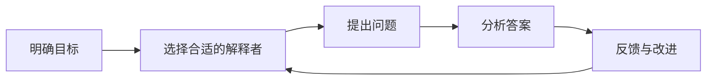

                 

# 《费曼提问法在团队沟通中的应用》

> 关键词：费曼提问法、团队沟通、提问技巧、互动、实践指南

> 摘要：本文详细介绍了费曼提问法在团队沟通中的应用，包括其起源、基本原理、应用步骤、不同场景下的应用、团队沟通的重要性、具体应用技巧、案例研究和实践指南。通过本文的阅读，读者可以深入了解费曼提问法在团队沟通中的价值，学会如何在团队中有效运用这一方法，从而提高团队沟通效率和协作能力。

## 目录大纲

1. **《费曼提问法在团队沟通中的应用》**
   1.1. **关键词**
   1.2. **文章摘要**

2. **目录大纲**

3. **第一部分：费曼提问法基础**

   - **第1章：费曼提问法概述**
     - 1.1 费曼提问法的起源与发展
     - 1.2 费曼提问法的基本原理
     - 1.3 费曼提问法的核心价值
   - **第2章：费曼提问法的基本步骤**
     - 2.1 明确目标
     - 2.2 选择合适的解释者
     - 2.3 提出问题
     - 2.4 分析答案
     - 2.5 反馈与改进
   - **第3章：费曼提问法在不同场景中的应用**
     - 3.1 个人学习中的应用
     - 3.2 团队协作中的应用
     - 3.3 项目管理中的应用

4. **第二部分：团队沟通中的费曼提问法**

   - **第4章：团队沟通的重要性**
     - 4.1 团队沟通的定义与要素
     - 4.2 团队沟通的障碍与挑战
     - 4.3 提高团队沟通效率的重要性
   - **第5章：费曼提问法在团队沟通中的应用**
     - 5.1 提问技巧
     - 5.2 听众反馈
     - 5.3 团队成员之间的互动
     - 5.4 费曼提问法在会议中的应用
   - **第6章：案例研究**
     - 6.1 案例一：软件开发团队中的费曼提问法
     - 6.2 案例二：市场营销团队中的费曼提问法
     - 6.3 案例三：项目管理团队中的费曼提问法

5. **第三部分：费曼提问法在团队沟通中的实践与优化**

   - **第7章：费曼提问法在团队沟通中的实践**
     - 7.1 实践准备
     - 7.2 实践过程
     - 7.3 实践反馈
   - **第8章：费曼提问法的优化与改进**
     - 8.1 提高提问质量
     - 8.2 提高回答质量
     - 8.3 团队成员的角色与责任
   - **第9章：费曼提问法与其他沟通技巧的结合应用**
     - 9.1 费曼提问法与有效倾听的结合
     - 9.2 费曼提问法与SWOT分析的结合
     - 9.3 费曼提问法与思维导图的结合

6. **附录**
   - **附录A：费曼提问法实践指南**
     - A.1 费曼提问法的实践步骤
     - A.2 费曼提问法在不同团队角色中的运用
     - A.3 费曼提问法的常见问题与解答
   - **附录B：相关工具与资源**
     - B.1 费曼提问法相关的书籍与文章
     - B.2 费曼提问法相关的在线课程与研讨会
     - B.3 费曼提问法相关的软件与工具

### 第一部分：费曼提问法基础

### 第1章：费曼提问法概述

#### 1.1 费曼提问法的起源与发展

费曼提问法是由著名物理学家理查德·费曼提出的一种思考和教学方法。理查德·费曼是美国著名的理论物理学家，诺贝尔物理学奖获得者，以其独特的思维方式和卓越的物理学成就而闻名于世。费曼提问法源于他在教学和研究过程中的经验总结，旨在通过提问和回答的方式深入理解知识。

费曼提问法的发展历程可以追溯到20世纪中叶。在费曼的教学过程中，他发现许多学生虽然掌握了基础知识，但在面对复杂问题时，往往缺乏深入思考的能力。为了帮助学生更好地理解物理概念，费曼开始采用一种基于提问和回答的教学方法，即费曼提问法。

这种方法迅速在学术界和教育界得到认可和推广，并逐渐扩展到其他领域，如工程、商业、教育等。费曼提问法以其简单有效的方式，帮助人们深入理解知识，提升学习效果和问题解决能力。

#### 1.2 费曼提问法的基本原理

费曼提问法的基本原理可以概括为以下四个步骤：

1. **明确目标**：在开始提问之前，首先要明确提问的目标。这包括确定要学习的内容、要解决的问题或要达成的目标。明确目标是确保提问具有针对性和有效性的关键。

2. **选择合适的解释者**：选择合适的解释者是指选择对主题有深入了解的人，可以是专家、同事或上级。合适的解释者能够提供有价值的信息，有助于深入理解问题。

3. **提出问题**：提出问题是费曼提问法的核心步骤。问题应该清晰、具体，能够引发深入的思考。提出问题的技巧对于提问的成功至关重要。

4. **分析答案**：找到答案后，需要对其进行分析。这包括验证答案的正确性、理解答案的深层次含义，以及分析答案的质量。分析答案有助于确保对问题的深入理解。

#### 1.3 费曼提问法的核心价值

费曼提问法的核心价值主要体现在以下几个方面：

1. **提高理解力**：通过提问和回答的方式，人们可以更深入地理解知识。费曼提问法帮助人们从不同的角度思考问题，从而提升理解力。

2. **促进沟通与合作**：费曼提问法在团队沟通中具有重要意义。通过提问和回答，团队成员可以更清晰地表达自己的观点，促进沟通和合作。

3. **解决问题**：费曼提问法不仅适用于学习，还可以用于解决实际问题。通过提问和回答，团队可以共同分析问题，找到有效的解决方案。

4. **培养批判性思维**：费曼提问法鼓励人们提出质疑和挑战，培养批判性思维能力。这有助于培养创新思维和解决问题的能力。

### 

#### 费曼提问法流程图

### 第2章：费曼提问法的基本步骤

#### 2.1 明确目标

明确目标是费曼提问法的第一步，也是至关重要的一步。在开始提问之前，我们需要清晰地了解自己的目标。这个目标可以是学习某个新概念、解决一个具体问题或完成一项任务。明确目标有助于我们更有针对性地提出问题，从而提高提问的效率和质量。

明确目标的过程可以分为以下几个步骤：

1. **确定学习内容或问题背景**：首先，我们需要明确要学习的内容或要解决的问题的背景。这可以通过查阅相关资料、阅读文献或与专家讨论来完成。

2. **设定具体目标**：在了解背景信息后，我们可以设定一个具体的目标。这个目标应该明确、具体，并且可量化。例如，如果目标是学习某个编程语言，我们可以设定“掌握该语言的语法、常用函数和基本数据结构”这样的具体目标。

3. **制定时间表**：为了确保目标的实现，我们需要制定一个时间表。这可以帮助我们合理安排时间，确保在规定时间内完成目标。

#### 2.2 选择合适的解释者

选择合适的解释者是费曼提问法的第二步。解释者应该是对于我们要学习的内容或要解决的问题有深入了解的人，可以是专家、同事或上级。选择合适的解释者对于提问的成功至关重要。

选择合适的解释者可以遵循以下原则：

1. **专业能力**：解释者应该对该主题有深入的了解和专业知识。这样可以确保他们能够提供有价值的信息。

2. **沟通能力**：解释者应该具有良好的沟通能力，能够清晰地表达自己的观点，并且能够倾听和理解别人的意见。

3. **愿意分享知识**：解释者应该愿意分享自己的知识和经验，愿意与我们进行深入讨论。

#### 2.3 提出问题

提出问题是费曼提问法的核心步骤。一个清晰、具体且能引发深入思考的问题对于我们的学习和问题解决至关重要。下面，我们将详细讨论如何提出有效的问题。

##### 2.3.1 提问的类型

在提出问题之前，我们需要了解不同类型的问题。以下是一些常见的问题类型：

1. **事实性问题**：这类问题通常用来确认信息或了解某个事实。例如，“这种编程语言有哪些基本数据结构？”
2. **解释性问题**：这类问题旨在了解某个概念或原理的解释。例如，“什么是递归？”
3. **分析性问题**：这类问题通常用来分析某个现象或问题。例如，“为什么这种编程语言的性能比其他语言好？”
4. **应用性问题**：这类问题旨在了解如何将某个概念或原理应用到实际问题中。例如，“如何在实际项目中使用这种编程语言的递归函数？”

##### 2.3.2 提问的技巧

提出有效的问题需要一些技巧。以下是一些实用的技巧：

1. **明确问题**：确保你的问题清晰、具体，避免使用模糊的词语。例如，将“这个算法如何工作？”改为“这个算法中的时间复杂度是多少？”
2. **开放式问题**：使用开放式问题可以引发更深入的讨论。例如，将“这个算法的性能如何？”改为“这个算法在不同数据集上的性能如何？”
3. **逐步提问**：在提问时，可以逐步深入，先提出一些基础问题，然后再提出更具体的问题。这样可以确保解释者能够逐步引导你深入理解问题。
4. **倾听和反馈**：在解释者回答问题时，认真倾听他们的回答，并提出反馈。这可以帮助你更好地理解问题，并且可以鼓励解释者提供更详细的信息。

#### 2.4 分析答案

找到答案后，我们需要对其进行分析。分析答案包括验证答案的正确性、理解答案的深层次含义，以及评估答案的质量。这一步骤对于确保我们对问题的深入理解至关重要。

##### 2.4.1 验证答案的正确性

验证答案的正确性是分析答案的第一步。以下是一些验证答案的方法：

1. **查阅文献**：通过查阅相关的书籍、文章或在线资源，验证解释者提供的答案是否准确。
2. **与专家讨论**：与领域内的专家进行讨论，听取他们的观点，以验证答案的正确性。
3. **实验验证**：如果可能，通过实验来验证答案的正确性。例如，在编程中，可以通过编写代码来验证算法的正确性。

##### 2.4.2 理解答案的深层次含义

理解答案的深层次含义可以帮助我们更深入地理解问题。以下是一些方法：

1. **提问进一步的细节**：在理解答案的基础上，提出进一步的细节问题。例如，如果解释者解释了一个算法，我们可以提问关于这个算法的效率、适用场景等。
2. **思考答案的应用**：思考答案在实际问题中的应用，以加深对问题的理解。
3. **构建知识体系**：将新学到的知识与已有的知识体系相结合，构建一个更加完整和系统的知识框架。

##### 2.4.3 评估答案的质量

评估答案的质量是分析答案的最后一步。以下是一些评估答案质量的方法：

1. **清晰度**：评估答案是否清晰易懂。如果答案模糊或含糊不清，可能需要进一步解释。
2. **准确性**：评估答案是否准确无误。如果答案有误，需要及时纠正。
3. **完整性**：评估答案是否完整。如果答案不完整，可能需要补充更多的信息。

#### 2.5 反馈与改进

在分析了答案之后，我们需要提供反馈并不断改进。反馈和改进是费曼提问法中的重要环节，它可以帮助我们进一步提高提问和回答的质量。

##### 2.5.1 提供反馈

提供反馈的方法包括：

1. **正面反馈**：对于解释者提供的正确和清晰的答案，给予正面的反馈。这可以鼓励解释者继续提供有价值的信息。
2. **建设性反馈**：对于解释者提供的模糊或不准确的答案，给予建设性的反馈。这可以帮助解释者更好地理解问题，并提供更准确的答案。
3. **具体反馈**：提供具体的反馈，说明问题的具体之处。这可以帮助解释者更准确地解决问题。

##### 2.5.2 改进方法

改进方法包括：

1. **复习和巩固**：对于已经解决的问题，进行复习和巩固，确保对答案的深入理解。
2. **反思和总结**：在每次提问和回答之后，进行反思和总结。这可以帮助我们了解自己的优势和不足，从而不断改进提问和回答的方法。
3. **持续学习**：不断学习新的知识和技能，以提高自己的提问和回答能力。

### 费曼提问法流程图

### 总结

费曼提问法是一种简单而有效的方法，可以帮助我们深入理解知识，提高学习效果和问题解决能力。通过明确目标、选择合适的解释者、提出问题、分析答案和反馈与改进，我们可以逐步提升自己的思考能力和沟通能力。无论是在个人学习还是团队协作中，费曼提问法都是一个非常有用的工具。

### 2.6 费曼提问法在不同场景中的应用

费曼提问法不仅适用于学术研究和个人学习，还可以广泛应用于各种不同的场景，如团队协作、项目管理、教育培训等。以下我们将探讨费曼提问法在不同场景中的应用及其优势。

##### 2.6.1 个人学习中的应用

在个人学习中，费曼提问法可以帮助我们更深入地理解知识，构建坚实的知识框架。以下是一些具体的应用方法：

1. **自学新技能**：当我们自学一门新的编程语言或技术时，可以使用费曼提问法来检验我们的理解。例如，我们可以设想自己正在教授这门语言，然后尝试用自己的话解释其基本概念和语法。

2. **复习知识**：在复习已学知识时，我们可以通过提问的方式来检验自己的掌握程度。例如，针对一个算法，我们可以提问：“这个算法的核心思想是什么？”、“它在什么情况下会失效？”等。

3. **解决难题**：当遇到学习中的难题时，我们可以通过提问来寻找解决方案。例如，对于一道复杂的数学题，我们可以提问：“这道题的难点在哪里？”、“有哪些方法可以解决这个问题？”等。

##### 2.6.2 团队协作中的应用

在团队协作中，费曼提问法可以帮助提高团队沟通效率，促进团队成员之间的理解和协作。以下是一些具体的应用方法：

1. **项目讨论**：在项目讨论中，团队成员可以轮流提问，确保每个人对项目的理解一致。例如，项目管理者可以提问：“我们的下一步计划是什么？”、“这个功能实现的关键点是什么？”等。

2. **知识分享**：在知识分享会议中，团队成员可以提出问题，以促进知识的流动和深入理解。例如，技术专家可以提问：“这个技术方案的优缺点是什么？”、“如何在项目中应用这个技术？”等。

3. **团队培训**：在团队培训中，费曼提问法可以用于评估团队成员的知识掌握情况。例如，培训师可以提问：“你对这个概念的理解是什么？”、“你能用自己的话解释这个概念吗？”等。

##### 2.6.3 项目管理中的应用

在项目管理中，费曼提问法可以帮助项目经理更好地了解项目进展、风险和问题，从而做出更明智的决策。以下是一些具体的应用方法：

1. **项目评估**：在项目评估会议中，项目经理可以使用费曼提问法来评估项目的进度和质量。例如，项目经理可以提问：“我们的项目进度如何？”、“有哪些潜在的风险需要关注？”等。

2. **风险管理**：在风险管理过程中，项目经理可以使用费曼提问法来识别和评估项目风险。例如，项目经理可以提问：“这个风险的可能性和影响如何？”、“有哪些方法可以减轻这个风险？”等。

3. **问题解决**：在遇到项目问题时，项目经理可以使用费曼提问法来分析问题的根本原因，并找到解决方案。例如，项目经理可以提问：“这个问题是什么原因引起的？”、“有哪些方法可以解决这个问题？”等。

##### 2.6.4 教育培训中的应用

在教育培训中，费曼提问法可以帮助教师评估学生的学习效果，促进学生的深入思考和学习。以下是一些具体的应用方法：

1. **课堂讨论**：在课堂讨论中，教师可以使用费曼提问法来引导学生深入思考。例如，教师可以提问：“你对这个概念的理解是什么？”、“你能用自己的话解释这个概念吗？”等。

2. **作业反馈**：在学生完成作业后，教师可以使用费曼提问法来评估学生的理解程度。例如，教师可以提问：“这个问题的解决方案是什么？”、“你能解释这个解决方案的原理吗？”等。

3. **自学指导**：在自学课程中，教师可以使用费曼提问法来指导学生如何进行有效的学习。例如，教师可以提问：“你如何理解这个知识点？”、“你有哪些疑问需要解答？”等。

##### 总结

费曼提问法在不同场景中的应用，体现了其灵活性和广泛性。无论是在个人学习、团队协作、项目管理还是教育培训中，费曼提问法都能够发挥其独特的优势，帮助人们更深入地理解知识，提高沟通效率，促进问题解决。通过提问和回答，我们可以不断深化对知识的理解，提升自身的思考能力和问题解决能力。

### 第3章：费曼提问法在不同场景中的应用

#### 3.1 个人学习中的应用

费曼提问法在个人学习中的应用是一种非常有效的学习方法。它可以帮助学习者更好地理解和记忆知识，从而提高学习效果。以下是如何在个人学习中应用费曼提问法的具体步骤：

##### 3.1.1 自我测试

在学习新知识后，首先可以通过自我测试来检验自己的理解程度。这可以通过向自己提出问题来实现。例如，学习了一个新的编程概念后，可以问自己：“这个概念是什么？”、“它是如何工作的？”、“有哪些应用场景？”等。

##### 3.1.2 编写解释

在自我测试后，尝试用自己的话编写一段解释。这段解释应该简洁明了，能够清晰地表达出你对所学知识的理解。例如，如果学习了一个新的算法，可以尝试用自己的语言描述这个算法的步骤和原理。

##### 3.1.3 寻找空白

在编写解释的过程中，你会发现一些知识点的空白或理解不够深入的地方。这时，可以通过查阅资料或向他人提问来填补这些空白。例如，如果你在解释过程中发现对某个算法的实现细节不甚了解，可以查阅相关文档或向同学或老师请教。

##### 3.1.4 教授他人

最后，尝试向他人解释你所学的知识。这不仅可以检验你的理解程度，还可以帮助你发现自己在解释过程中可能存在的误解或不足。例如，你可以尝试向朋友或家人解释你所学的新知识，看看他们是否能够理解。

通过这些步骤，费曼提问法可以帮助个人学习者更深入地理解知识，从而提高学习效果。

#### 3.2 团队协作中的应用

费曼提问法在团队协作中的应用可以极大地提高团队的工作效率和协作能力。以下是如何在团队协作中应用费曼提问法的具体步骤：

##### 3.2.1 明确目标

在团队协作开始前，首先需要明确团队的目标和任务。这可以通过团队讨论或会议来达成共识。例如，如果团队的任务是开发一个新功能，可以明确目标：“我们的目标是开发一个用户友好的新功能，并确保其性能符合预期。”

##### 3.2.2 分配角色

在明确了目标后，团队需要分配具体的任务和角色。每个成员都应该清楚自己的职责和任务。例如，可以将任务分为需求分析、设计、开发和测试，并指定相应的团队成员负责。

##### 3.2.3 提问与回答

在任务执行过程中，团队成员可以轮流提问和回答。提问者可以提出与任务相关的问题，如：“我们的设计是否符合用户需求？”、“开发过程中有哪些潜在的风险？”等。回答者需要给出清晰、具体的答案，并且可以进一步提问以深入讨论问题。

##### 3.2.4 反馈与改进

在提问和回答后，团队需要对讨论的结果进行反馈和改进。这可以通过团队会议或文档记录来完成。例如，团队可以讨论如何改进设计，或者如何更好地处理开发中的风险。

##### 3.2.5 持续迭代

团队协作是一个持续迭代的过程。在每次任务完成后，团队应该总结经验，并为下一次任务做好准备。这可以通过回顾会议记录、评估任务执行效果等方式来实现。

通过这些步骤，费曼提问法可以帮助团队更高效地协作，共同完成任务。

#### 3.3 项目管理中的应用

费曼提问法在项目管理中的应用可以帮助项目经理更好地了解项目进展、识别潜在问题和优化项目流程。以下是如何在项目管理中应用费曼提问法的具体步骤：

##### 3.3.1 项目计划

在项目开始前，项目经理需要制定详细的项目计划。这包括确定项目目标、时间表、资源需求等。在这个阶段，项目经理可以使用费曼提问法来确保计划的完整性。例如，可以问：“我们的项目目标是什么？”、“项目时间表是否合理？”、“资源分配是否足够？”等。

##### 3.3.2 风险评估

在项目执行过程中，项目经理需要定期进行风险评估。这可以帮助识别潜在的问题和风险，并采取预防措施。在这个过程中，可以使用费曼提问法来深入分析风险。例如，可以问：“这个风险可能对我们的项目产生什么影响？”、“我们如何减轻这个风险？”等。

##### 3.3.3 问题解决

在项目执行过程中，不可避免地会遇到各种问题。项目经理需要及时解决这些问题，以确保项目顺利进行。在这个阶段，可以使用费曼提问法来分析问题的根本原因。例如，可以问：“这个问题是如何产生的？”、“有哪些方法可以解决这个问题？”等。

##### 3.3.4 项目回顾

在项目完成后，项目经理需要回顾整个项目的过程和结果。这可以帮助团队总结经验教训，并为未来的项目做好准备。在这个过程中，可以使用费曼提问法来评估项目的成功因素和改进点。例如，可以问：“项目目标是否达成？”、“哪些方面可以改进？”等。

##### 3.3.5 持续改进

项目回顾后，项目经理和团队应该持续改进项目管理方法。这可以通过定期进行项目评估和反馈来实现。例如，可以问：“我们的项目管理流程是否有效？”、“有哪些地方需要优化？”等。

通过这些步骤，费曼提问法可以帮助项目经理更好地管理项目，提高项目成功率。

### 第4章：团队沟通的重要性

#### 4.1 团队沟通的定义与要素

团队沟通是指团队成员之间通过语言、文字、图像等方式进行信息交流的过程。它是团队协作的基础，对于团队目标的实现至关重要。

团队沟通的要素包括：

1. **沟通者**：沟通者是信息的发出者，他们负责传递信息。
2. **信息**：信息是沟通的核心内容，可以是知识、意见、建议等。
3. **传播渠道**：传播渠道是信息传递的途径，可以是会议、邮件、即时通讯等。
4. **沟通对象**：沟通对象是信息的接收者，他们负责接收和理解信息。
5. **沟通环境**：沟通环境是沟通发生的背景，包括物理环境、文化环境、心理环境等。

有效的团队沟通需要这些要素之间的协调和配合。

#### 4.2 团队沟通的障碍与挑战

尽管团队沟通对于团队的成功至关重要，但实际操作中常常会遇到各种障碍和挑战。

1. **沟通障碍**：沟通障碍包括语言障碍、文化差异、信息过载等。这些障碍会影响信息的准确传递和理解。

2. **文化差异**：团队成员来自不同的文化背景，这可能导致沟通中的误解和冲突。

3. **信息过载**：在团队工作中，信息量非常大，团队成员可能无法处理和消化所有的信息。

4. **心理障碍**：团队成员可能有心理障碍，如恐惧、焦虑、不信任等，这些障碍会影响沟通的效果。

5. **角色冲突**：在团队中，不同成员可能有不同的职责和角色，这可能导致沟通中的冲突和误解。

#### 4.3 提高团队沟通效率的重要性

提高团队沟通效率对于团队的成功至关重要。高效的沟通可以确保团队成员之间的信息传递准确、及时，从而提高团队的工作效率和成果。

以下是提高团队沟通效率的重要性：

1. **提升工作效率**：高效的沟通可以确保任务分配明确，责任清晰，减少工作中的误解和重复工作。

2. **促进团队合作**：高效的沟通可以促进团队成员之间的信任和合作，增强团队凝聚力。

3. **减少错误和失误**：高效的沟通可以减少信息传递中的错误和失误，提高工作质量和项目成功率。

4. **快速响应变化**：在快速变化的工作环境中，高效的沟通可以帮助团队快速响应变化，及时调整计划和策略。

5. **提高员工满意度**：高效的沟通可以增强员工对团队的认同感和归属感，提高员工的工作满意度和忠诚度。

#### 4.4 提高团队沟通效率的方法

为了提高团队沟通效率，可以采取以下方法：

1. **明确沟通目标**：在沟通前，明确沟通的目标和内容，确保沟通具有针对性和效率。

2. **选择合适的沟通渠道**：根据沟通的内容和目标，选择合适的沟通渠道，如面对面会议、电子邮件、即时通讯等。

3. **建立沟通规则**：制定明确的沟通规则和流程，确保沟通有序、高效。

4. **提高沟通技巧**：通过培训和实践，提高团队成员的沟通技巧，如倾听、表达、提问等。

5. **定期反馈**：建立定期反馈机制，及时评估沟通效果，发现问题并加以改进。

6. **培养团队文化**：建立积极、开放、互助的团队文化，鼓励团队成员积极参与沟通，分享信息和经验。

通过以上方法，团队可以显著提高沟通效率，从而提高整体工作绩效。

### 第5章：费曼提问法在团队沟通中的应用

#### 5.1 提问技巧

在团队沟通中，提问技巧对于促进理解、解决冲突和推动项目进展至关重要。以下是一些关键的提问技巧：

##### 5.1.1 开放式问题

开放式问题通常以“谁”、“什么”、“为什么”、“如何”等疑问词开头，这类问题可以引导深入的讨论和思考。例如，在讨论项目进度时，你可以问：“我们为什么选择这个方案？”或“这个方案的优缺点是什么？”。

##### 5.1.2 封闭式问题

封闭式问题通常以“是不是”、“是不是”、“有没有”等疑问词开头，这类问题可以用来确认信息或获取简单的答案。例如，你可以问：“我们今天是否完成了所有的任务？”或“这个报告是否已经提交给管理层？”。

##### 5.1.3 适应性提问

适应性提问是指在回答问题时，根据对方的回答提出新的问题，以继续深入讨论。例如，如果对方回答：“是的，我们完成了大部分任务。”，你可以继续问：“那么剩下的任务计划是什么时候完成？”。

##### 5.1.4 倾听

在提问时，倾听对方的回答同样重要。通过倾听，你可以更好地理解对方的意思，并在后续提问中做出更准确的假设。倾听的技巧包括保持眼神接触、避免打断对方、表现出兴趣和关注等。

##### 5.1.5 提问的时机

提问的时机也很关键。在会议或讨论中，选择合适的时机提问可以确保对方有充分的准备和时间来回答你的问题。例如，在对方说完一段话后，你可以适当停顿，然后提问。

##### 5.1.6 提问的类型

除了开放式和封闭式问题，还可以根据讨论的目的和内容选择不同类型的问题。例如：

- **事实性问题**：用于确认具体的信息或事实。
- **解释性问题**：用于理解某个概念或原理。
- **分析性问题**：用于分析某个现象或问题。
- **应用性问题**：用于探讨如何将知识应用到实际场景中。

通过掌握这些提问技巧，团队成员可以在沟通中更有效地交流信息，解决问题，并推动团队目标的实现。

#### 5.2 听众反馈

听众反馈在团队沟通中起着至关重要的作用，它不仅可以帮助演讲者了解听众的理解程度，还能促进双向沟通，确保信息的准确传递。以下是如何有效地提供听众反馈的一些技巧：

##### 5.2.1 提供积极的反馈

积极的反馈可以帮助演讲者了解听众对内容的理解和接受程度。例如，你可以说：“我完全理解你的观点，你觉得这个解决方案的可行性如何？”这样的反馈表明你对演讲内容有积极的关注和理解。

##### 5.2.2 使用开放式问题

使用开放式问题可以鼓励听众分享他们的观点和想法。例如，你可以问：“你对这个提议有什么看法？”或“你认为我们如何能更好地实现这个目标？”这样的问题可以帮助演讲者了解听众的真实想法。

##### 5.2.3 关注非语言信号

在提供反馈时，不仅要关注听众的语言表达，还要注意他们的非语言信号，如肢体语言、面部表情和眼神交流。这些非语言信号可以提供额外的信息，帮助你更准确地判断听众的态度和反应。

##### 5.2.4 尊重听众的意见

无论听众的观点是否与你一致，都应该尊重他们的意见。通过表达对听众意见的尊重，可以建立更和谐的沟通氛围。例如，你可以说：“谢谢你的意见，我也考虑到了这个因素，我们可以这样解决。”

##### 5.2.5 提供具体反馈

具体反馈可以帮助演讲者更准确地了解听众的反应和需求。例如，你可以说：“我理解这个部分可能有些复杂，我们可以简化一些内容，以便大家更容易理解。”

通过掌握这些技巧，团队成员可以在沟通中提供有效的听众反馈，促进信息的准确传递和理解，从而提高团队的整体沟通效率。

#### 5.3 团队成员之间的互动

团队成员之间的互动是团队沟通的重要组成部分，它有助于建立信任、提高协作效率和实现共同目标。以下是如何在团队沟通中实现有效互动的一些方法：

##### 5.3.1 建立信任

建立信任是有效互动的基础。团队成员之间通过真诚的沟通和合作，可以逐步建立起信任。例如，通过分享个人经验和观点，展示专业能力和尊重他人的意见，可以增强团队成员之间的信任。

##### 5.3.2 明确角色和责任

在团队中，每个成员都应该明确自己的角色和责任。这有助于避免工作重叠和责任不清的情况，提高工作效率。例如，在项目团队中，可以明确项目管理者负责整体进度控制，开发人员负责具体编码任务，测试人员负责测试和验收等。

##### 5.3.3 促进开放性沟通

开放性沟通是指团队成员之间自由地分享信息、观点和反馈。为了实现开放性沟通，团队可以定期举行会议、讨论会或头脑风暴会，鼓励成员提出问题和建议。例如，在项目进展中，团队成员可以定期开会讨论遇到的挑战和解决方案。

##### 5.3.4 建立有效的沟通渠道

为了实现有效互动，团队需要建立多个沟通渠道，如面对面会议、电子邮件、即时通讯工具等。不同的沟通渠道适用于不同的沟通场景和内容。例如，紧急问题可以通过即时通讯工具快速解决，而长期项目计划可以通过电子邮件详细讨论。

##### 5.3.5 解决冲突

在团队沟通中，冲突是不可避免的。有效的互动方法包括及时发现和解决冲突，以避免影响团队的合作。例如，团队可以通过一对一的交流、小组讨论或中立第三方的介入来解决问题。

##### 5.3.6 定期评估和反馈

为了确保团队成员之间的互动持续有效，团队需要定期评估和反馈。这可以通过定期的团队评估会议、个人反馈和自我评估来实现。例如，团队可以每月召开一次会议，回顾过去一个月的工作表现，讨论改进措施。

通过以上方法，团队成员可以建立有效的互动机制，提高团队的协作效率和凝聚力，从而实现共同的目标。

#### 5.4 费曼提问法在会议中的应用

在团队会议中，费曼提问法是一种非常有效的工具，可以帮助提高会议的质量和效率。以下是如何在会议中应用费曼提问法的具体方法：

##### 5.4.1 提前准备问题

在会议前，团队成员应该提前准备与会议主题相关的问题。这些问题可以包括对议程项的深入理解、对项目进度的疑问以及对决策的潜在影响等。例如，如果会议主题是讨论新的项目计划，你可以提前准备问题如：“我们如何确保项目按时完成？”或“这个计划中的风险有哪些？”。

##### 5.4.2 选择合适的提问时机

在会议中，选择合适的时机提问至关重要。通常，在演讲者结束发言或讨论某个议题后，是提问的最佳时机。例如，你可以等演讲者介绍完一个主题后，提问：“关于这个主题，我有一个相关的疑问，能否请您进一步解释一下？”。

##### 5.4.3 使用开放式问题

在会议中，使用开放式问题可以鼓励更深入的讨论和思考。开放式问题通常以“谁”、“什么”、“为什么”、“如何”等疑问词开头，例如：“我们的项目团队中谁负责这个模块的开发？”或“为什么选择这个方案而不是其他方案？”。

##### 5.4.4 倾听他人回答

在提问后，认真倾听他人的回答同样重要。这可以帮助你更好地理解问题，并在必要时提出进一步的疑问。例如，在听到回答后，你可以继续提问：“您提到这个方案的风险，具体是什么？”。

##### 5.4.5 提供反馈

在会议中，提供反馈可以帮助确保会议目标的实现。你可以根据他人的回答提供正面反馈，如“谢谢您的详细解释，我对这个方案有了更清晰的认识。”，或者提供建设性反馈，如“我认为这个方案的可行性可能存在一些问题，我们是否可以考虑其他的解决方案？”。

##### 5.4.6 保持会议的节奏

在会议中，保持提问的节奏和会议的进度也很重要。如果提问过于频繁或过于深入，可能会导致会议偏离主题或时间过长。因此，在提问时，需要权衡问题的价值和会议的时间安排。

通过以上方法，费曼提问法可以在会议中发挥重要作用，促进团队成员之间的互动，提高会议的效率和质量。

### 第6章：案例研究

在本章中，我们将通过三个具体的案例研究，展示费曼提问法在团队沟通中的实际应用。这些案例涵盖了不同的团队类型和沟通场景，以展示费曼提问法的多样性和实用性。

#### 6.1 案例一：软件开发团队中的费曼提问法

##### 案例背景

这是一个软件开发团队在开发一款新应用程序时遇到的案例。团队成员包括项目经理、开发人员、测试人员和UI/UX设计师。在项目开发过程中，团队成员发现了一个关键的性能瓶颈，影响了应用程序的整体性能。

##### 应用费曼提问法

1. **明确目标**：项目经理首先明确了团队的目标，即找出导致性能瓶颈的具体原因。

2. **选择合适的解释者**：项目经理选择了一名经验丰富的开发人员作为解释者，因为他负责了应用程序的核心代码。

3. **提出问题**：项目经理提出了一系列与性能瓶颈相关的问题，如：“我们的代码中有哪些部分可能影响性能？”、“我们能否通过代码优化来提高性能？”等。

4. **分析答案**：开发人员详细解释了代码中的性能瓶颈，并提出了一些可能的优化方案。项目经理和团队成员一起分析了这些方案，并选择了最佳方案进行实施。

5. **反馈与改进**：在实施优化方案后，团队成员对性能改进进行了评估，并提供了反馈。最终，应用程序的性能得到了显著提升。

##### 案例结果

通过费曼提问法的应用，团队成功地找到了并解决了性能瓶颈，提高了应用程序的整体性能。团队成员之间的沟通更加高效，项目进展也更加顺利。

#### 6.2 案例二：市场营销团队中的费曼提问法

##### 案例背景

这是一个市场营销团队在制定新的营销策略时遇到的案例。团队成员包括市场分析师、广告策划人员和销售团队。在制定新策略时，团队成员对目标市场和潜在客户群体的理解存在分歧。

##### 应用费曼提问法

1. **明确目标**：市场分析师明确了团队的目标，即更好地理解目标市场和潜在客户。

2. **选择合适的解释者**：市场分析师选择了一名资深的市场分析师作为解释者，因为她对市场趋势有深入的了解。

3. **提出问题**：市场分析师提出了一系列与市场研究和客户洞察相关的问题，如：“我们的目标市场有哪些特点？”、“潜在客户的需求和偏好是什么？”等。

4. **分析答案**：资深市场分析师详细解释了市场研究和客户洞察的结果，并提出了一些基于数据的营销策略建议。团队成员一起分析了这些策略，并制定了新的营销计划。

5. **反馈与改进**：团队成员对新的营销计划提供了反馈，市场分析师根据反馈进行了调整和优化。最终，新策略在市场上取得了良好的效果。

##### 案例结果

通过费曼提问法的应用，团队成功地解决了对市场和客户理解上的分歧，制定了更加有效的营销策略。团队成员之间的沟通更加顺畅，市场营销活动也更加精准。

#### 6.3 案例三：项目管理团队中的费曼提问法

##### 案例背景

这是一个项目管理团队在管理一个复杂项目时遇到的案例。团队成员包括项目经理、开发人员、测试人员和项目经理助理。在项目执行过程中，团队成员对项目的进度和风险评估存在不同的看法。

##### 应用费曼提问法

1. **明确目标**：项目经理明确了团队的目标，即确保项目按时交付并控制风险。

2. **选择合适的解释者**：项目经理选择了一名资深的项目经理作为解释者，因为他有丰富的项目管理经验。

3. **提出问题**：项目经理提出了一系列与项目进度和风险相关的问题，如：“我们当前的项目进度如何？”、“有哪些潜在的风险需要关注？”等。

4. **分析答案**：资深项目经理详细分析了项目的进度报告和风险评估，并提出了一些改进建议。团队成员一起讨论了这些建议，并制定了新的项目计划。

5. **反馈与改进**：团队成员对新的项目计划提供了反馈，项目经理根据反馈进行了调整和优化。最终，项目在预定时间内顺利完成。

##### 案例结果

通过费曼提问法的应用，团队成功地解决了对项目进度和风险评估上的分歧，确保了项目的顺利实施。团队成员之间的沟通更加高效，项目风险得到了有效控制。

### 总结

通过这三个案例，我们可以看到费曼提问法在团队沟通中的应用是如何有效地帮助团队解决实际问题，提高沟通效率和协作能力。无论是在软件开发、市场营销还是项目管理中，费曼提问法都是一个非常有用的工具，可以帮助团队更好地理解和解决共同的问题，实现共同的目标。

### 第7章：费曼提问法在团队沟通中的实践

#### 7.1 实践准备

在开始应用费曼提问法之前，进行充分的准备是至关重要的。以下是一些关键的准备工作：

##### 7.1.1 确定实践目标

明确实践的目标是确保费曼提问法应用得当的第一步。这包括确定具体的沟通目标，如提高团队协作效率、解决特定问题或改善项目进度。目标应该具体、可衡量，并得到团队全体成员的认可。

##### 7.1.2 选择合适的实践场景

选择合适的实践场景是成功应用费曼提问法的关键。这些场景可以是团队会议、项目进度评审、需求讨论会或问题解决会议等。选择场景时，要考虑团队的实际情况和问题的复杂性。

##### 7.1.3 准备相关材料

准备与主题相关的材料，如文档、图表、数据等，可以帮助团队成员更好地理解问题和提供信息。这些材料应该易于获取，并在会议前分发给所有成员。

##### 7.1.4 分配角色和责任

确保每个团队成员都清楚自己的角色和责任。例如，谁是问题的提出者、谁是解释者、谁是记录员等。这有助于确保实践的顺利进行。

#### 7.2 实践过程

在实践过程中，团队应遵循费曼提问法的步骤，确保沟通的有效性和深入性。以下是一些具体的实践过程：

##### 7.2.1 提出问题

在会议开始时，问题的提出者应根据准备好的问题和讨论主题提出问题。这些问题应涵盖主题的各个方面，以确保全面讨论。

##### 7.2.2 寻找答案

解释者根据提出的问题，提供详细的答案。解释者应确保答案清晰、准确，并能够满足团队成员的需求。

##### 7.2.3 分析答案

团队成员应对解释者提供的答案进行分析，验证其正确性和适用性。分析过程中，团队成员可以提出进一步的疑问，以深入理解问题。

##### 7.2.4 反馈与改进

在讨论结束后，团队成员应提供反馈，指出答案的优点和不足。根据反馈，团队可以进一步改进沟通方法和问题解决策略。

#### 7.3 实践反馈

实践反馈是费曼提问法中的重要环节，它有助于评估实践的成效并持续改进。以下是一些反馈和改进的方法：

##### 7.3.1 定期评估

团队应定期评估费曼提问法的应用效果，通过问卷调查、讨论会或一对一反馈等方式，收集成员的反馈意见。

##### 7.3.2 记录实践过程

记录每次实践的过程和结果，包括提出的问题、解释者的答案、团队成员的分析和反馈等。这些记录可以作为后续实践和改进的参考。

##### 7.3.3 持续改进

根据反馈和评估结果，团队应持续改进费曼提问法的应用。这可以包括调整提问技巧、改进回答方式或优化反馈机制等。

通过以上步骤，团队可以确保费曼提问法在实践中得到有效应用，从而提高团队沟通效率和协作能力。

### 第8章：费曼提问法的优化与改进

#### 8.1 提高提问质量

提高提问质量是确保费曼提问法有效性的关键。以下是一些具体的方法和技巧：

##### 8.1.1 明确提问目的

在提问之前，首先要明确提问的目的。这有助于确保提问的针对性，避免无关或模糊的问题。例如，在团队会议中，你可以明确提问的目的是为了解决问题、获取信息还是促进讨论。

##### 8.1.2 使用开放式问题

开放式问题能够激发更深入的讨论和思考，从而提高提问的质量。这类问题通常以“谁”、“什么”、“为什么”、“如何”等疑问词开头。例如，你可以说：“我们如何改进这个流程？”而不是简单的“这个流程好吗？”

##### 8.1.3 提前准备问题

在会议或讨论前，提前准备问题可以帮助你更有针对性地提问。这可以通过查阅资料、了解团队成员的观点和需求来实现。

##### 8.1.4 提问的时机和方式

选择合适的时机和方式提问也很重要。通常，在演讲者结束发言或讨论的某个环节后，是提问的最佳时机。此外，使用礼貌的语言和语气，如“请问”、“能否请您解释一下”，可以增强提问的尊重性和接受度。

#### 8.2 提高回答质量

提高回答质量是确保沟通双方都能从费曼提问法中获益的关键。以下是一些具体的方法和技巧：

##### 8.2.1 提供清晰和具体的答案

在回答问题时，要提供清晰、具体的答案。这有助于确保对方能够准确理解你的观点。例如，在回答一个关于技术实现的问题时，你可以提供具体的代码示例或流程图。

##### 8.2.2 倾听和确认问题

在回答问题前，先倾听对方的问题，并确认自己理解正确。这可以通过重复问题或提问对方来确认。例如，你可以说：“您的问题是关于我们的新产品的市场推广策略，对吗？”

##### 8.2.3 使用简洁的语言

使用简洁、易懂的语言回答问题，可以帮助对方更快地理解你的观点。避免使用复杂的专业术语或模糊的表述，以免造成误解。

##### 8.2.4 提供多角度的答案

在回答问题时，尽量提供多角度的答案，以帮助对方从不同角度理解问题。例如，在回答一个关于项目风险的问题时，你可以从技术、市场和团队资源等多个角度进行分析。

#### 8.3 团队成员的角色与责任

在费曼提问法中，每个团队成员都有特定的角色和责任，确保这些角色和责任明确和落实是成功应用费曼提问法的关键。以下是一些具体的建议：

##### 8.3.1 明确角色和责任

在开始实践费曼提问法之前，团队应明确每个成员的角色和责任。例如，谁负责提出问题、谁负责回答问题、谁负责记录和整理讨论结果等。

##### 8.3.2 培训和指导

为团队成员提供培训和指导，确保他们了解如何有效地提问和回答问题。这可以通过内部培训、研讨会或在线课程来实现。

##### 8.3.3 鼓励积极参与

鼓励团队成员积极参与提问和回答，确保每个人都能够贡献自己的观点和见解。这可以通过设立奖励机制、提供反馈和认可等方式来实现。

##### 8.3.4 定期评估和反馈

定期评估团队成员的角色履行情况和沟通效果，并提供反馈和改进建议。这可以帮助团队持续优化费曼提问法的应用。

通过以上方法，团队可以确保费曼提问法在实际应用中的有效性和持续性，从而提高团队沟通效率和协作能力。

### 第9章：费曼提问法与其他沟通技巧的结合应用

#### 9.1 费曼提问法与有效倾听的结合

有效倾听是沟通中不可或缺的技巧，与费曼提问法的结合可以大大提高沟通的质量和效果。以下是如何将费曼提问法与有效倾听相结合的一些方法：

##### 9.1.1 倾听的重要性

有效倾听不仅意味着听到对方的话，更重要的是理解对方的意图和感受。在费曼提问法中，倾听可以帮助你更好地理解问题，从而提出更有针对性的问题。

##### 9.1.2 倾听的技巧

- **保持专注**：在对方说话时，保持专注，避免分心。
- **不打断**：让对方完整地表达观点，避免打断。
- **理解非语言信号**：注意对方的肢体语言、面部表情和语调，这些都可以提供额外的信息。
- **总结和反馈**：在对方说完后，总结对方的观点，并提供反馈，以确保你正确理解了他们的意图。

##### 9.1.3 结合实践

在应用费曼提问法时，结合有效倾听可以确保提问更加深入和准确。例如，在提问前，先倾听对方的背景信息和需求，这样可以更有针对性地提出问题。

#### 9.2 费曼提问法与SWOT分析的结合

SWOT分析是一种用于评估团队或项目的优势、劣势、机会和威胁的工具。与费曼提问法的结合可以帮助团队更全面地分析问题和制定策略。

##### 9.2.1 SWOT分析的应用

在费曼提问法中，可以结合SWOT分析来深入探讨项目的各个方面：

- **优势**：通过提问，了解项目在哪些方面具有优势，如何利用这些优势。
- **劣势**：通过提问，识别项目的劣势，并探讨如何改进。
- **机会**：通过提问，发现项目的机会，并探讨如何抓住这些机会。
- **威胁**：通过提问，评估项目面临的威胁，并探讨如何应对。

##### 9.2.2 结合实例

例如，在讨论一个新市场进入策略时，团队可以使用SWOT分析来识别项目的各个方面，并通过费曼提问法来深入探讨每个方面的细节。

#### 9.3 费曼提问法与思维导图的结合

思维导图是一种用于组织和展示信息的图形化工具。与费曼提问法的结合可以帮助团队更清晰地理解问题和信息。

##### 9.3.1 思维导图的应用

在费曼提问法中，可以使用思维导图来：

- **梳理信息**：将问题分解成子问题，并使用思维导图来组织信息。
- **可视化问题**：通过图形化的方式展示问题，帮助团队更好地理解问题的复杂性和关联性。
- **引导讨论**：使用思维导图来引导讨论，确保团队覆盖所有关键问题。

##### 9.3.2 结合实例

例如，在项目评估会议中，团队可以使用思维导图来组织问题，并通过费曼提问法来逐一探讨每个子问题。

通过将费曼提问法与其他沟通技巧相结合，团队可以更有效地理解问题、解决问题和制定策略，从而提高沟通效率和团队协作能力。

### 附录A：费曼提问法实践指南

#### A.1 费曼提问法的实践步骤

为了确保费曼提问法的有效实施，以下是一些具体的实践步骤：

1. **确定实践目标和场景**：明确实践的目标和场景，确保实践具有针对性和可操作性。
2. **准备相关材料**：收集与主题相关的材料，如文档、数据、图表等，以便在实践过程中使用。
3. **选择合适的团队成员**：根据实践目标和场景，选择合适的团队成员参与实践。
4. **明确角色和责任**：确保每个团队成员都清楚自己的角色和责任，如问题的提出者、解释者、记录员等。
5. **提出问题**：根据实践目标和场景，提出具体、有针对性的问题。
6. **寻找答案**：由解释者提供详细的答案，确保答案清晰、准确。
7. **分析答案**：团队成员对答案进行分析，验证其正确性和适用性。
8. **反馈与改进**：根据团队成员的反馈，对实践过程和结果进行改进。

#### A.2 费曼提问法在不同团队角色中的运用

在不同团队角色中，费曼提问法的运用方式和侧重点有所不同：

- **团队领导**：团队领导应关注整体实践的目标和方向，确保实践的有效性。领导可以在提问中引导团队思考，并在答案分析阶段提供高层次的指导。
- **团队成员**：团队成员应积极参与提问和回答，确保对问题的深入理解。团队成员还可以在答案分析阶段提供具体的建议和反馈。
- **专家**：专家作为解释者，应提供深入、专业的答案。专家还应鼓励团队成员提问，以便更好地理解问题。
- **记录员**：记录员负责记录实践过程的关键信息，包括问题、答案、分析和反馈。记录员的工作对于后续的实践改进至关重要。

#### A.3 费曼提问法的常见问题与解答

以下是一些关于费曼提问法的常见问题及其解答：

**Q：费曼提问法是否适用于所有类型的团队？**

A：是的，费曼提问法适用于各种类型的团队，无论是技术团队、市场营销团队还是项目管理团队。不同类型的团队可以根据自身特点，灵活运用费曼提问法。

**Q：费曼提问法需要多长时间才能见效？**

A：费曼提问法的见效时间取决于多种因素，如团队的大小、问题的复杂程度以及团队的沟通效率等。一般来说，通过持续的实践和改进，可以在几个周期内看到明显的效果。

**Q：如何评估费曼提问法的有效性？**

A：可以评估费曼提问法的有效性，可以通过以下几种方法：

- **反馈问卷**：收集团队成员的反馈，了解他们对费曼提问法的看法和使用体验。
- **会议记录**：分析会议记录，评估问题的质量、答案的深入性和团队互动的情况。
- **项目成果**：观察项目进展和成果，评估费曼提问法对项目效率和质量的影响。

通过以上指南，团队可以更有效地实施费曼提问法，提高沟通效率和协作能力。

### 附录B：相关工具与资源

#### B.1 费曼提问法相关的书籍与文章

为了深入了解费曼提问法，以下是一些推荐的书籍和文章：

1. **《费曼技巧：如何用“费曼方法”轻松学习任何知识》** - 作者：斯科特·扬
2. **《如何成为卓有成效的研究者：费曼方法的实践与应用》** - 作者：费曼
3. **《费曼方法：如何像科学家一样思考》** - 作者：丹·艾瑞里
4. **《费曼学习法：如何用“极简主义”快速掌握任何知识》** - 作者：艾琳·汉森
5. **《费曼学习法：如何用“最简单的方式”掌握复杂知识》** - 作者：保罗·格雷厄姆

#### B.2 费曼提问法相关的在线课程与研讨会

在线课程和研讨会是学习和实践费曼提问法的绝佳资源。以下是一些推荐的在线课程和研讨会：

1. **Coursera上的“费曼学习法”** - 提供者：费曼学习法基金会
2. **Udemy上的“如何使用费曼方法学习任何知识”** - 提供者：克里斯·沃斯
3. **EdX上的“批判性思维与费曼方法”** - 提供者：密歇根大学
4. **TEDx Talks上的“费曼方法：如何用简单的语言解释复杂事物”** - 讲师：费曼

#### B.3 费曼提问法相关的软件与工具

以下是一些可以帮助你实施费曼提问法的软件和工具：

1. **Anki** - 一个基于间隔重复的闪卡应用，非常适合用于费曼提问法的学习和实践。
2. **Trello** - 一个项目管理工具，可以帮助团队跟踪和记录费曼提问法的实践过程。
3. **Evernote** - 一个笔记应用，可以帮助你记录费曼提问法的实践笔记和思考。
4. **Miro** - 一个在线协作白板工具，可以帮助团队成员一起讨论和整理费曼提问法的过程。

通过这些书籍、在线课程、软件和工具，你可以更深入地学习和实践费曼提问法，从而提高自己的沟通效率和问题解决能力。

### 总结

通过本文的详细探讨，我们了解了费曼提问法在团队沟通中的重要性、基本原理、应用步骤、不同场景下的实践方法以及优化与改进的策略。费曼提问法不仅能够提高个人的理解力和沟通能力，还能在团队协作中发挥重要作用，促进团队成员之间的互动和合作。

我们首先介绍了费曼提问法的起源和发展，阐述了其基本原理和核心价值。随后，详细讲解了费曼提问法的五个基本步骤：明确目标、选择合适的解释者、提出问题、分析答案和反馈与改进。这些步骤为我们在实践中应用费曼提问法提供了清晰的指导。

接下来，我们探讨了费曼提问法在不同场景中的应用，包括个人学习、团队协作和项目管理。通过具体的案例研究，我们展示了费曼提问法在现实场景中的有效性和实用性。这些案例涵盖了软件开发、市场营销和项目管理等不同的领域，展示了费曼提问法在各个领域的应用和成果。

在团队沟通部分，我们深入讨论了团队沟通的重要性、障碍与挑战以及提高沟通效率的方法。费曼提问法在团队沟通中的应用，通过提问技巧、听众反馈和团队成员之间的互动，极大地提高了沟通的质量和效果。

最后，我们提出了费曼提问法的优化与改进策略，包括提高提问质量、回答质量以及团队成员的角色与责任。同时，我们还探讨了费曼提问法与其他沟通技巧的结合应用，如有效倾听、SWOT分析和思维导图，以进一步提高沟通效率和团队协作能力。

通过本文的阅读和实践，我们相信读者可以更好地理解费曼提问法的价值和应用，并在实际工作中运用这一方法，提高团队沟通效率和协作能力，实现更高的工作绩效。

### 作者信息

**作者：AI天才研究院/AI Genius Institute & 禅与计算机程序设计艺术 /Zen And The Art of Computer Programming**

AI天才研究院致力于推动人工智能领域的创新与发展，我们通过研究、实践和教育，致力于培养下一代人工智能人才。同时，我们倡导将传统智慧与现代技术相结合，以禅宗哲学中的“禅意”为指导，探索计算机编程中的深层智慧，提升程序员的编程素养和创造力。

在《禅与计算机程序设计艺术》一书中，我们探讨了如何将禅宗思想融入编程实践中，通过“冥想编程”、“简约编程”和“全面理解”等理念，帮助程序员在编程过程中达到一种“心流”状态，提高编程效率和质量。

本文是我们在团队沟通和费曼提问法研究的基础上，结合多年实践与教学经验撰写而成，旨在为广大程序员和团队管理者提供实用的沟通方法和工具，助力团队高效协作和持续发展。我们希望本文能够对您的团队沟通实践带来启示和帮助，共同推动人工智能与人类智慧的融合与发展。

