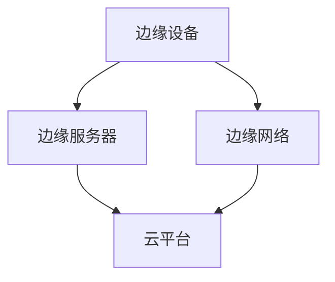
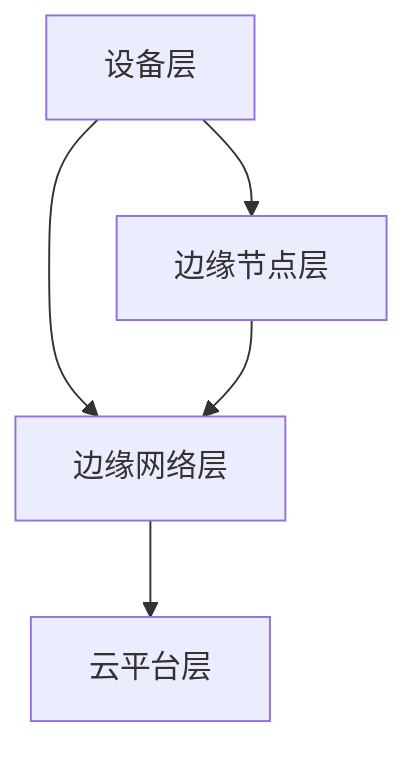

                 

# 边缘计算优势：在设备端进行数据处理

> **关键词：** 边缘计算、数据处理、设备端、云计算、5G、物联网。

> **摘要：** 本文深入探讨了边缘计算在设备端进行数据处理的优越性，包括其背景、技术原理、应用场景、优势与挑战，以及未来发展趋势。通过详细分析，我们揭示了边缘计算如何优化数据处理流程，提高效率，保障数据安全，并推动智能技术的发展。

## 引言

随着物联网（IoT）和5G技术的飞速发展，数据生成和处理的需求急剧增加。传统的云计算模式已无法满足实时、高效的数据处理需求。边缘计算作为一种新兴的计算模式，应运而生。它通过在设备端进行数据处理，提高了系统的响应速度，降低了网络延迟，保障了数据隐私，优化了资源利用。

边缘计算的核心思想是将计算、存储和网络能力分散到网络的边缘，即靠近数据源或用户的位置。这样可以大大缩短数据传输的距离和时间，提高数据处理的速度和效率。同时，边缘计算还可以充分利用设备的计算资源，降低对中心服务器的依赖。

本文将分几个部分详细介绍边缘计算的优势和实现方式。首先，我们将回顾边缘计算的背景和概念，探讨其与云计算的区别。接着，我们将深入分析边缘计算的技术原理和架构。然后，我们将列举边缘计算在实际应用中的多种场景。接下来，我们将详细讨论边缘计算的优势和挑战。最后，我们将展望边缘计算的未来发展趋势，并分享一些边缘计算的开发实践。

## 第一部分：边缘计算概述

### 第1章：边缘计算的背景和概念

#### 1.1 边缘计算的定义和重要性

边缘计算（Edge Computing）是一种分布式计算架构，它将计算、存储、网络和服务推向网络的边缘，即靠近数据源或用户的位置。与传统云计算模式不同，边缘计算强调在本地设备上进行数据处理，而不是将所有数据传输到远程数据中心进行处理。

边缘计算的定义可以从以下几个方面来理解：

1. **位置**：边缘计算是指在网络的边缘进行数据处理和存储，而不是在数据中心或云端。
2. **规模**：边缘计算通常涉及小规模、分布式的计算节点，这些节点可以是各种智能设备、服务器、传感器等。
3. **功能**：边缘计算不仅包括数据处理，还包括数据分析和实时响应。

边缘计算的重要性主要体现在以下几个方面：

1. **降低延迟**：由于数据处理发生在本地，数据传输的距离大大缩短，从而降低了延迟，提高了响应速度。
2. **数据隐私**：在本地进行数据处理可以更好地保护数据隐私，避免敏感数据在传输过程中被窃取或泄露。
3. **网络带宽节省**：将部分数据处理任务分散到边缘，可以减少需要传输到云端的数据量，从而节省网络带宽。
4. **资源优化**：边缘计算充分利用了本地设备的计算资源，避免了中心服务器的过度负载。

#### 1.2 边缘计算与云计算的区别

边缘计算与云计算是两种不同的计算模式，它们各有优缺点。以下是它们之间的主要区别：

1. **位置**：云计算是在远程数据中心进行数据处理，而边缘计算是在网络的边缘，即靠近数据源或用户的位置。
2. **规模**：云计算通常涉及大规模的数据中心和服务器集群，而边缘计算则是小规模、分布式的计算节点。
3. **数据处理方式**：云计算通常将数据全部传输到数据中心进行处理，而边缘计算则是在本地设备上进行部分数据处理，然后将结果传输到云端。
4. **延迟**：云计算的延迟通常较高，因为数据需要在网络上传输较长距离，而边缘计算的延迟较低，因为数据处理发生在本地。
5. **网络带宽**：云计算需要大量网络带宽来传输数据，而边缘计算则可以节省网络带宽，因为只有处理结果需要传输到云端。
6. **数据隐私**：云计算可能面临数据隐私问题，因为敏感数据在传输过程中可能被窃取或泄露，而边缘计算可以更好地保护数据隐私。

#### 1.3 边缘计算的架构和组成部分

边缘计算的架构可以分为以下几个主要组成部分：

1. **边缘设备**：包括各种智能设备、传感器、物联网设备等，它们是数据生成和处理的起点。
2. **边缘服务器**：包括专门用于边缘计算的物理或虚拟服务器，它们提供计算、存储和网络服务。
3. **边缘网络**：连接边缘设备和边缘服务器的网络，可以是局域网、无线网络或专用网络。
4. **云平台**：提供数据处理、存储、分析和管理的云平台，可以是私有云或公有云。
5. **中间件**：用于协调和管理边缘设备和云平台之间的数据传输和处理的中间件。

边缘计算的架构示意图如下：



#### 1.4 边缘计算的核心优势

边缘计算的核心优势主要包括以下几个方面：

1. **低延迟**：由于数据处理发生在本地，数据传输的距离大大缩短，从而降低了延迟，提高了响应速度。这对于需要实时响应的应用场景尤为重要。
2. **数据隐私**：在本地进行数据处理可以更好地保护数据隐私，避免敏感数据在传输过程中被窃取或泄露。
3. **网络带宽节省**：将部分数据处理任务分散到边缘，可以减少需要传输到云端的数据量，从而节省网络带宽。
4. **资源优化**：边缘计算充分利用了本地设备的计算资源，避免了中心服务器的过度负载。
5. **可靠性**：边缘计算通过分布式架构提高了系统的可靠性，即使部分节点出现故障，也不会影响整个系统的正常运行。
6. **灵活性**：边缘计算可以根据不同的应用场景和需求进行灵活部署和配置，满足多样化的计算需求。

### 第2章：边缘计算的技术原理

#### 2.1 边缘计算的网络架构

边缘计算的网络架构是边缘计算实现的基础，它涉及多个层面的网络技术和架构设计。以下是边缘计算网络架构的主要组成部分：

1. **设备层**：包括各种边缘设备，如智能传感器、智能设备、物联网设备等，这些设备是数据生成和处理的起点。
2. **边缘节点层**：包括边缘服务器、边缘网关等，它们提供计算、存储和网络服务，是数据处理和存储的核心。
3. **边缘网络层**：连接边缘节点和云平台的网络，可以是局域网、无线网络或专用网络。边缘网络需要具备高带宽、低延迟和可靠性的特点。
4. **云平台层**：提供数据处理、存储、分析和管理的云平台，可以是私有云或公有云。云平台与边缘网络通过边缘网关进行数据传输和通信。

边缘计算的网络架构示意图如下：



#### 2.2 边缘计算的安全挑战和解决方案

边缘计算在数据隐私和安全方面面临着诸多挑战，以下是一些主要的安全挑战和相应的解决方案：

1. **数据泄露**：由于边缘设备数量庞大，且分布广泛，数据泄露的风险较高。解决方案包括：
   - 数据加密：对数据进行加密处理，确保数据在传输和存储过程中的安全性。
   - 访问控制：通过严格的访问控制机制，限制对数据的访问权限，确保只有授权用户才能访问数据。
   - 安全审计：定期进行安全审计，发现并修复安全漏洞，确保系统的安全性。

2. **网络攻击**：边缘网络容易受到各种网络攻击，如分布式拒绝服务攻击（DDoS）、中间人攻击（MITM）等。解决方案包括：
   - 防火墙和入侵检测系统（IDS）：在边缘节点部署防火墙和入侵检测系统，实时监控网络流量，防止恶意攻击。
   - 虚拟专用网络（VPN）：通过VPN技术建立安全的通信通道，确保数据传输的安全性。
   - 安全更新和补丁：定期更新设备和软件的补丁，修复已知的安全漏洞。

3. **设备安全问题**：边缘设备可能受到恶意软件、病毒等攻击，导致设备失控或数据泄露。解决方案包括：
   - 设备监控：实时监控设备的状态和运行情况，发现异常情况及时报警。
   - 设备加固：通过加固设备和操作系统，提高设备的抗攻击能力。
   - 安全审计：定期进行安全审计，发现并修复设备中的安全漏洞。

#### 2.3 边缘计算中的数据处理与存储

边缘计算中的数据处理与存储是边缘计算实现的核心，以下是一些关键技术和方法：

1. **数据处理**：边缘计算中的数据处理主要包括数据采集、数据预处理、数据分析和数据存储等步骤。以下是一些常用的数据处理技术：
   - 数据采集：通过传感器、智能设备等边缘设备采集数据，如温度、湿度、流量等。
   - 数据预处理：对采集到的数据进行清洗、过滤、去噪等处理，提高数据的质量和可用性。
   - 数据分析：通过机器学习、数据挖掘等技术对数据进行分析，提取有用的信息和知识。
   - 数据存储：将处理后的数据存储在边缘设备或边缘服务器中，便于后续的查询和分析。

2. **数据存储**：边缘计算中的数据存储需要考虑到数据量、数据安全、数据访问速度等因素。以下是一些常用的数据存储技术：
   - 分布式存储：通过分布式存储系统，如HDFS、Cassandra等，实现数据的分布式存储，提高存储的可靠性和性能。
   - 缓存技术：通过缓存技术，如Redis、Memcached等，提高数据的访问速度和响应速度。
   - 数据压缩：通过数据压缩技术，如Hadoop的压缩算法，减少数据存储空间，提高存储效率。
   - 数据加密：对存储的数据进行加密处理，确保数据在存储过程中的安全性。

#### 2.4 边缘计算中的实时数据处理

边缘计算中的实时数据处理是边缘计算的一个重要应用方向，它涉及以下关键技术：

1. **实时数据处理框架**：如Apache Kafka、Apache Flink等，用于处理实时数据流，实现数据的高效处理和分析。
2. **实时数据处理算法**：如实时机器学习算法、实时数据挖掘算法等，用于对实时数据进行分析和预测。
3. **实时数据处理引擎**：如Apache Storm、Apache Spark Streaming等，用于处理大规模实时数据，实现实时数据处理和分析。
4. **边缘计算平台**：如Amazon AWS Greengrass、Microsoft Azure IoT Edge等，提供实时数据处理的环境和工具，方便开发者进行实时数据处理。

### 第3章：边缘计算的应用场景

#### 3.1 边缘计算在物联网中的应用

边缘计算在物联网（IoT）中扮演着重要角色，它通过在设备端进行数据处理，提高了物联网系统的性能和效率。以下是一些典型的应用场景：

1. **智能家居**：边缘计算可以实现对家庭设备的实时监控和控制，如智能照明、智能空调、智能门锁等。通过在设备端进行数据处理，可以实现更快的响应速度和更高的系统稳定性。
2. **智能工厂**：边缘计算可以用于工厂设备的监控和故障诊断，如机器视觉系统、传感器网络等。通过在设备端进行数据处理，可以实现对生产过程的实时监控和优化，提高生产效率。
3. **智能交通**：边缘计算可以用于交通信号控制、智能停车管理等，如通过边缘计算对道路流量进行实时监控和优化，提高交通效率。
4. **智能医疗**：边缘计算可以用于医疗设备的监控和数据分析，如通过边缘计算对医疗设备生成的数据进行实时处理和分析，提高医疗服务的质量和效率。

#### 3.2 边缘计算在智能制造中的应用

边缘计算在智能制造领域具有广泛的应用前景，它通过在设备端进行数据处理，可以实现生产过程的智能化和自动化。以下是一些典型的应用场景：

1. **设备监控**：边缘计算可以用于实时监控设备的运行状态，如温度、湿度、振动等参数。通过在设备端进行数据处理，可以实现对设备的早期故障预测和预防性维护。
2. **质量控制**：边缘计算可以用于实时监控产品的质量，如通过边缘计算对生产过程中生成的数据进行实时分析，发现质量问题并及时处理。
3. **供应链优化**：边缘计算可以用于实时监控供应链的各个环节，如通过边缘计算对物流运输过程中的数据进行实时分析，优化供应链的运作效率。
4. **生产调度**：边缘计算可以用于实时优化生产调度计划，如通过边缘计算对生产过程中的数据进行实时分析，优化生产线的调度和排程。

#### 3.3 边缘计算在智能交通中的应用

边缘计算在智能交通领域具有重要的应用价值，它通过在交通设备端进行数据处理，可以提高交通系统的效率和安全性。以下是一些典型的应用场景：

1. **交通信号控制**：边缘计算可以用于实时优化交通信号灯的运行策略，如通过边缘计算对交通流量进行实时监控和预测，优化交通信号灯的切换时间，提高交通效率。
2. **智能停车管理**：边缘计算可以用于实时监控停车场的停车位状态，如通过边缘计算对停车场内的传感器数据进行实时分析，提高停车场的利用率。
3. **自动驾驶**：边缘计算可以用于自动驾驶车辆的感知和决策，如通过边缘计算对车辆周围的传感器数据进行实时处理，提高自动驾驶的准确性和安全性。
4. **智能出行服务**：边缘计算可以用于实时优化出行服务的调度和路线规划，如通过边缘计算对乘客的出行需求进行实时分析，优化出行服务的资源配置。

#### 3.4 边缘计算在智能医疗中的应用

边缘计算在智能医疗领域具有重要的应用潜力，它通过在设备端进行数据处理，可以提高医疗服务的质量和效率。以下是一些典型的应用场景：

1. **远程监控**：边缘计算可以用于远程监控患者的健康状况，如通过边缘计算对医疗设备生成的数据进行实时分析，及时发现患者的异常状况。
2. **智能诊断**：边缘计算可以用于辅助医生的诊断决策，如通过边缘计算对医疗图像进行实时分析，提高诊断的准确性和效率。
3. **智能药物管理**：边缘计算可以用于实时监控药物的使用情况，如通过边缘计算对药物使用数据进行实时分析，优化药物的管理和调配。
4. **移动医疗**：边缘计算可以用于支持移动医疗设备的应用，如通过边缘计算对移动医疗设备生成的数据进行实时处理，提高移动医疗的便利性和效率。

## 第二部分：边缘计算的优势与挑战

### 第4章：边缘计算的优势分析

边缘计算作为一种新兴的计算模式，在数据处理、系统性能、网络带宽、数据隐私和资源利用等方面具有显著的优势。以下是对边缘计算优势的详细分析：

#### 4.1 数据隐私保护

边缘计算在数据隐私保护方面具有显著优势。由于数据处理发生在本地设备上，敏感数据无需上传至云端，从而降低了数据泄露的风险。这特别适用于医疗、金融等对数据隐私要求极高的行业。边缘计算确保了数据的私密性和安全性，减少了因数据传输过程中可能受到的网络攻击。

#### 4.2 延迟降低

边缘计算通过将数据处理任务从云端转移到网络边缘，大大降低了数据传输的距离和时间，从而显著减少了系统的响应时间。这对于需要实时响应的应用场景至关重要，如自动驾驶、智能制造、智能交通等。边缘计算实现了实时数据处理，提高了系统的效率和用户体验。

#### 4.3 网络带宽节省

边缘计算通过在本地设备上处理部分数据，减少了需要传输到云端的数据量，从而节省了网络带宽。这对于网络条件有限或者数据传输成本较高的场景尤为重要。例如，在远程地区或偏远地区，通过边缘计算可以有效降低数据传输的负担，提高网络资源的利用率。

#### 4.4 资源优化

边缘计算充分利用了本地设备的计算资源，避免了中心服务器的过度负载。通过分布式架构，边缘计算可以将计算任务分散到多个边缘节点上，从而提高了整体系统的性能和可靠性。此外，边缘计算还可以根据实际需求动态调整计算资源，实现了资源的高效利用。

#### 4.5 实时性和可靠性

边缘计算通过本地实时数据处理，实现了对实时数据的快速响应和高效处理。这对于需要快速决策和实时监控的应用场景，如金融交易、医疗监控、紧急响应等，具有重要意义。边缘计算还通过分布式架构提高了系统的可靠性，即使某些边缘节点出现故障，也不会影响整个系统的正常运行。

#### 4.6 灵活性和可扩展性

边缘计算具有高度灵活性和可扩展性。通过部署在网络的边缘，边缘计算可以根据不同的应用场景和需求进行灵活部署和扩展。无论是家庭、工厂、交通枢纽还是医疗中心，边缘计算都可以根据实际需求进行定制化部署，实现高效的数据处理和智能服务。

#### 4.7 系统集成和协同

边缘计算可以与云计算、物联网、5G等技术相结合，实现系统的高度集成和协同。边缘计算可以作为云计算的补充，将部分数据处理任务分散到边缘节点上，提高整体系统的性能和效率。同时，边缘计算与物联网的结合，可以实现设备之间的智能协同，提高系统的智能化水平。

### 第5章：边缘计算的实际应用案例

边缘计算在各个行业和领域中得到了广泛应用，以下是一些典型的实际应用案例：

#### 5.1 智能家居中的边缘计算应用

在家居环境中，边缘计算可以实现对各种智能设备的实时监控和管理。例如，智能门锁、智能摄像头、智能照明、智能空调等。边缘计算可以在设备端对采集到的数据进行分析和处理，实现智能控制和自动化管理。例如，通过边缘计算，智能空调可以实时监测室内温度和湿度，根据用户习惯和环境条件自动调节温度和湿度，提供舒适的生活环境。

#### 5.2 智能工厂中的边缘计算应用

在制造业中，边缘计算可以用于设备监控、质量控制、生产调度等。通过边缘计算，工厂可以实现设备的实时监控和故障预测，提高生产效率。例如，边缘计算可以实时分析设备的工作状态，预测设备的故障风险，及时进行维护和保养，避免设备故障导致的生产中断。此外，边缘计算还可以用于生产线的实时调度，根据生产需求和设备状态动态调整生产计划，优化生产流程。

#### 5.3 自动驾驶中的边缘计算应用

在自动驾驶领域，边缘计算是实现自动驾驶汽车的关键技术之一。通过边缘计算，自动驾驶汽车可以实时处理车辆周围的传感器数据，实现对路况、行人、障碍物等的快速识别和响应。例如，边缘计算可以用于实时分析摄像头和雷达数据，识别行人和车辆的位置和动作，预测可能的危险情况，及时采取避让措施。边缘计算还用于自动驾驶汽车的导航和路径规划，通过实时处理道路信息，优化行驶路线，提高行驶安全性。

#### 5.4 智能医疗中的边缘计算应用

在医疗领域，边缘计算可以用于远程监控、智能诊断、药物管理等方面。通过边缘计算，医疗机构可以实现对患者的实时监控和远程诊断。例如，通过安装在患者身上的传感器，边缘计算可以实时收集患者的生理数据，如心率、血压、血糖等，分析数据，及时发现异常情况，提供个性化的医疗建议。边缘计算还可以用于医疗影像的分析和诊断，通过实时处理医疗影像数据，辅助医生进行诊断和治疗决策。

### 第6章：边缘计算的技术挑战

尽管边缘计算具有诸多优势，但其在实际应用中仍面临着一系列技术挑战。以下是对这些挑战的详细分析：

#### 6.1 能耗管理

边缘设备通常依赖于电池供电，因此能耗管理是一个重要的挑战。边缘设备需要在有限的电池寿命内高效运行，这意味着需要优化算法和硬件设计，以减少能耗。例如，可以使用能量感知计算技术，根据设备的工作负载和能源消耗情况动态调整计算资源和功耗。此外，还可以采用分布式能源管理策略，将能量管理任务分散到多个边缘节点上，提高能源利用效率。

#### 6.2 安全性问题

边缘计算涉及大量的设备、网络和数据处理，因此面临较大的安全风险。边缘设备可能受到恶意攻击，导致数据泄露或设备失控。为此，需要采取一系列安全措施，包括数据加密、访问控制、安全审计等。此外，还需要确保边缘设备的可靠性和稳定性，防止设备故障导致的数据丢失或系统瘫痪。

#### 6.3 软硬件协同优化

边缘计算需要在有限的硬件资源上运行复杂的软件算法，因此软硬件协同优化是一个关键挑战。需要设计高效的软件算法和硬件架构，确保在有限资源下实现最佳性能。例如，可以采用硬件加速技术，如GPU、FPGA等，提高计算效率。此外，还可以通过优化编译器和编程模型，提高软件执行效率。

#### 6.4 网络延迟优化

边缘计算需要在本地处理数据，但网络延迟仍然是一个挑战。特别是在移动场景中，网络延迟可能对实时应用造成严重影响。为此，需要优化网络架构和协议，减少数据传输延迟。例如，可以采用边缘网关和缓存技术，减少数据传输距离。此外，还可以通过边缘计算与5G技术的结合，利用5G网络的高速低延迟特性，提高数据处理效率。

### 第7章：边缘计算的未来发展趋势

边缘计算作为一项新兴技术，其发展前景广阔。以下是对边缘计算未来发展趋势的展望：

#### 7.1 边缘计算与5G技术的融合

5G技术的快速发展为边缘计算提供了更高速、低延迟的网络环境。边缘计算与5G技术的融合将极大地推动物联网、智能制造、智能交通等领域的应用。通过5G网络，边缘设备可以实现实时数据传输和高效处理，提高系统的响应速度和可靠性。

#### 7.2 边缘计算在工业互联网中的应用

工业互联网是边缘计算的重要应用领域之一。通过边缘计算，工业设备可以实现实时监控、故障预测和优化控制，提高生产效率和设备寿命。未来，随着工业互联网的普及，边缘计算将在工业自动化、智能制造等方面发挥重要作用。

#### 7.3 边缘计算在智慧城市中的应用

智慧城市是边缘计算的重要应用场景之一。通过边缘计算，城市可以实现交通管理、能源管理、环境监测等方面的智能化。例如，通过边缘计算，城市可以实现实时交通流量监控和智能调度，优化交通流，减少拥堵。此外，边缘计算还可以用于环境监测，实时分析空气质量、水质等数据，提供科学决策支持。

#### 7.4 边缘计算的发展前景与展望

随着技术的进步和应用的不断拓展，边缘计算在未来将具有广泛的应用前景。预计边缘计算将在以下几个方面取得突破：

1. **性能提升**：通过硬件加速、新型算法和架构设计，边缘计算的性能将得到大幅提升，满足更复杂的应用需求。
2. **能耗降低**：随着节能技术的不断发展，边缘设备的能耗将逐步降低，提高设备的续航能力和使用体验。
3. **安全性增强**：随着安全技术的不断完善，边缘计算的安全风险将得到有效控制，保障系统的安全稳定运行。
4. **应用多样化**：边缘计算将逐步渗透到各个行业和领域，推动智能化水平的提升，实现更广泛的应用场景。

## 第三部分：边缘计算开发实践

### 第8章：边缘计算开发环境搭建

边缘计算开发环境搭建是进行边缘计算项目开发的基础，以下是一个典型的边缘计算开发环境搭建步骤：

#### 8.1 开发环境配置

1. **硬件环境**：根据项目需求选择合适的边缘设备，如树莓派、Arduino等。确保设备具备足够的计算能力和存储空间。
2. **操作系统**：选择适合边缘设备的操作系统，如Ubuntu、Raspbian等。确保操作系统稳定可靠，支持所需的边缘计算框架。
3. **网络环境**：确保边缘设备可以连接到互联网，方便进行软件安装和更新。

#### 8.2 常用边缘计算平台介绍

1. **Apache Kafka**：是一款分布式流处理平台，适用于大规模数据处理和实时数据传输。
2. **Apache Flink**：是一款分布式数据处理框架，适用于实时数据分析和处理。
3. **TensorFlow Lite**：是一款轻量级机器学习框架，适用于在边缘设备上进行机器学习推理。
4. **IoT Edge**：是微软提供的边缘计算平台，支持在边缘设备上运行云端模型和自定义应用程序。

#### 8.3 边缘计算编程工具

1. **Python**：是一款广泛使用的编程语言，适用于边缘计算项目的开发和部署。
2. **Node.js**：是一款基于JavaScript的编程语言，适用于边缘计算项目的开发和部署。
3. **Visual Studio Code**：是一款强大的代码编辑器，适用于边缘计算项目的开发和调试。

### 第9章：边缘计算项目实战

以下是一个简单的边缘计算项目实战案例，展示如何使用边缘计算进行实时数据处理和预测：

#### 9.1 边缘计算项目设计

1. **项目目标**：使用边缘计算实时分析传感器数据，预测设备的故障风险。
2. **技术选型**：使用树莓派作为边缘设备，安装Python和TensorFlow Lite。
3. **数据采集**：连接传感器，采集温度、湿度等数据。
4. **数据处理**：使用TensorFlow Lite进行数据预处理和故障预测。

#### 9.2 边缘计算数据处理

1. **数据采集**：使用Python编写程序，实时采集传感器数据。
2. **数据预处理**：使用TensorFlow Lite对数据进行预处理，包括数据清洗、归一化等。
3. **故障预测**：使用预先训练的故障预测模型，对采集到的数据进行分析，预测设备故障风险。

#### 9.3 边缘计算算法实现

以下是故障预测算法的实现伪代码：

```python
# 导入必要的库
import tensorflow as tf
import numpy as np

# 加载故障预测模型
model = tf.keras.models.load_model("fault_prediction_model.h5")

# 采集传感器数据
def collect_data():
    temperature = read_temperature_sensor()
    humidity = read_humidity_sensor()
    return np.array([temperature, humidity])

# 预测设备故障风险
def predict_fault(data):
    prediction = model.predict(data)
    if prediction > 0.5:
        return "High Risk"
    else:
        return "Low Risk"

# 主程序
def main():
    while True:
        data = collect_data()
        risk_level = predict_fault(data)
        print("Fault Risk Level:", risk_level)

if __name__ == "__main__":
    main()
```

#### 9.4 边缘计算性能优化

1. **硬件优化**：使用硬件加速器（如GPU、FPGA）提高数据处理速度。
2. **算法优化**：使用更高效的算法和模型，提高预测准确性。
3. **网络优化**：优化数据传输协议和缓存策略，减少数据传输延迟。

### 第10章：边缘计算安全策略

边缘计算的安全策略是保障系统安全稳定运行的关键。以下是一些常用的边缘计算安全策略：

#### 10.1 边缘安全架构设计

1. **访问控制**：对边缘设备的访问进行严格控制，确保只有授权用户才能访问设备。
2. **数据加密**：对传输和存储的数据进行加密处理，防止数据泄露。
3. **安全审计**：定期进行安全审计，发现并修复安全漏洞。

#### 10.2 常见攻击类型及防御策略

1. **分布式拒绝服务攻击（DDoS）**：通过大量请求占用网络资源，导致系统瘫痪。防御策略包括：流量分析、防火墙、黑名单等。
2. **中间人攻击（MITM）**：在通信过程中窃取数据。防御策略包括：VPN、TLS等。
3. **恶意软件攻击**：通过恶意软件入侵系统。防御策略包括：病毒扫描、安全更新等。

#### 10.3 边缘计算设备的安全加固

1. **硬件加固**：使用硬件加密模块、安全启动等硬件安全功能。
2. **软件加固**：使用安全操作系统、安全加固库等软件安全措施。
3. **设备监控**：实时监控设备状态，发现异常情况及时报警。

#### 10.4 数据加密和隐私保护技术

1. **数据加密**：对传输和存储的数据进行加密处理，确保数据安全。
2. **隐私保护**：通过数据脱敏、匿名化等技术，保护用户隐私。

## 附录

### 附录A：边缘计算资源与工具

以下是一些常用的边缘计算资源和工具：

1. **边缘计算框架**：
   - **Apache Kafka**：分布式流处理平台。
   - **Apache Flink**：分布式数据处理框架。
   - **TensorFlow Lite**：轻量级机器学习框架。

2. **开源边缘计算平台**：
   - **AWS Greengrass**：亚马逊提供的边缘计算平台。
   - **Azure IoT Edge**：微软提供的边缘计算平台。
   - **EdgeX Foundry**：开放源码的边缘计算框架。

3. **边缘计算开发社区和论坛**：
   - **边缘计算论坛**：https://www.edgecomputingforum.org/
   - **边缘计算社区**：https://www.edgecomputingcommunity.org/

### 附录B：边缘计算经典论文和报告

以下是一些边缘计算领域的经典论文和报告：

1. **论文**：
   - **"Edge Computing: Vision and Challenges"**：介绍边缘计算的概念和挑战。
   - **"Fog Computing: A Taxonomy and Survey"**：探讨雾计算和边缘计算的关系。

2. **报告**：
   - **Gartner报告**：关于边缘计算的全球市场分析和预测。
   - **IDC报告**：关于边缘计算的行业趋势和市场洞察。

3. **开源边缘计算项目**：
   - **EdgeX Foundry**：开放源码的边缘计算框架。
   - **Apache Kafka**：分布式流处理平台。
   - **Apache Flink**：分布式数据处理框架。

### 附录C：边缘计算研究热点与前沿技术

以下是一些边缘计算领域的研究热点和前沿技术：

1. **边缘计算中的机器学习应用**：
   - **联邦学习**：在边缘设备上进行机器学习模型训练，保护数据隐私。
   - **边缘推理**：在边缘设备上运行预训练的机器学习模型，实现实时预测。

2. **软硬件协同优化技术**：
   - **硬件加速**：使用GPU、FPGA等硬件加速计算，提高处理速度。
   - **软件优化**：优化编译器和编程模型，提高软件执行效率。

3. **边缘计算与5G技术的融合**：
   - **5G网络**：提供高速、低延迟的通信环境，支持大规模边缘设备的连接。
   - **边缘网关**：连接5G网络和边缘设备，实现数据传输和协同处理。

4. **边缘计算在新兴行业中的应用**：
   - **智能制造**：实现智能工厂和工业物联网。
   - **智慧城市**：实现智能交通、智能环保、智能安防等。

### 结语

边缘计算作为一项新兴技术，正逐渐改变我们的生活方式和工作方式。通过在设备端进行数据处理，边缘计算提高了系统的响应速度、降低了网络延迟、保障了数据隐私、优化了资源利用。本文详细介绍了边缘计算的优势、技术原理、应用场景、安全策略和开发实践，并展望了其未来发展趋势。希望本文能够为读者提供一个全面、深入的边缘计算指南，激发读者对这一领域的兴趣和探索。在未来的发展中，边缘计算将继续推动智能技术的发展，为人类创造更美好的未来。

## 作者信息

**作者：AI天才研究院/AI Genius Institute & 禅与计算机程序设计艺术 /Zen And The Art of Computer Programming**

