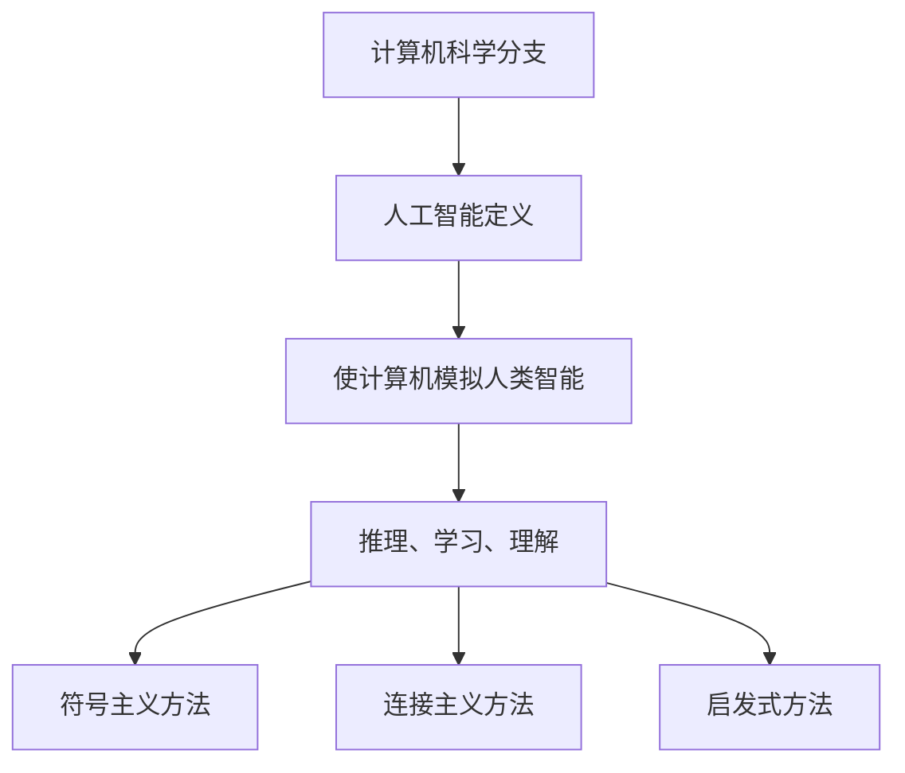
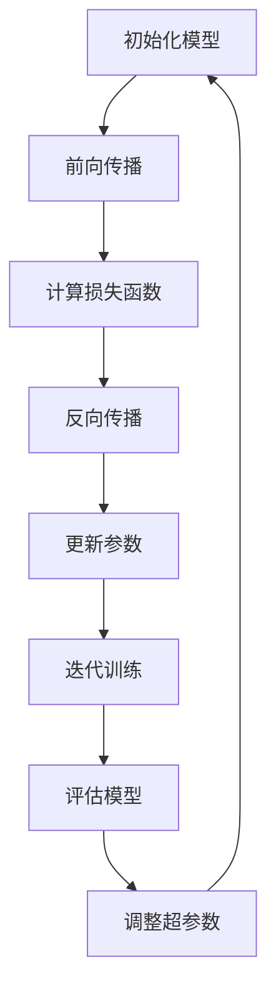

                 

# 《达特茅斯会议与人工智能学科的建立》

> **关键词**：达特茅斯会议、人工智能学科、历史背景、发展历程、核心领域、未来展望

> **摘要**：本文旨在探讨达特茅斯会议对人工智能学科建立的重要影响。首先回顾了达特茅斯会议的背景和意义，然后分析了人工智能学科的发展历程、核心领域及其未来展望。文章通过详细阐述这些内容，展示了人工智能学科从无到有、从萌芽到繁荣的演变过程。

## 引言

### 1. 达特茅斯会议的背景与历史意义

1956年，达特茅斯会议（Dartmouth Conference）在美国新罕布什尔州达特茅斯学院召开。这次会议被认为是人工智能（Artificial Intelligence，简称AI）学科的诞生标志。会议的倡议者约翰·麦卡锡（John McCarthy）、马文·明斯基（Marvin Minsky）、纳森·罗切斯特（Nathan Rochester）和赫伯特·西蒙（Herbert Simon）等人，首次提出了“人工智能”这一概念，并认为机器能够展示类似于人类智能的推理、学习和理解能力。

达特茅斯会议的召开具有深远的历史意义。首先，它为人工智能学科的建立奠定了理论基础。会议期间，与会学者讨论了人工智能的定义、目标和研究方法，形成了对人工智能的初步共识。其次，达特茅斯会议激发了人工智能研究的热情，吸引了大量学者投入到这一新兴领域。最后，达特茅斯会议促进了人工智能领域的国际合作与交流，为全球人工智能研究的发展提供了契机。

### 2. 人工智能学科的发展与演变

人工智能学科自1956年达特茅斯会议以来，经历了多个发展阶段。第一阶段是探索期（1950s-1960s），人工智能研究的重点是建立基本理论和算法，如逻辑推理、符号处理等。第二阶段是成长期（1970s-1980s），人工智能研究开始应用于实际领域，如专家系统、自然语言处理、计算机视觉等。第三阶段是成熟期（1990s-2000s），人工智能技术在机器学习、深度学习等方面取得了重要突破。第四阶段是扩展期（2010s-至今），人工智能技术逐渐应用于更多领域，如自动驾驶、智能语音识别、智能医疗等。

在这个过程中，人工智能学科的定义也在不断演变。最初，人工智能主要指机器模拟人类智能的能力。随着技术的发展，人工智能逐渐扩展到机器学习、深度学习、自然语言处理等领域。如今，人工智能已经不再局限于模拟人类智能，而是追求超越人类智能的能力。

### 3. 本书结构安排与目标

本书旨在系统地探讨达特茅斯会议与人工智能学科建立的关系，全面梳理人工智能学科的发展历程、核心领域和未来展望。全书分为八个章节：

- **第1章：人工智能的早期发展**，介绍人工智能的起源、早期研究和先驱。
- **第2章：达特茅斯会议的召开**，详细阐述会议的背景、组织与筹备、参与者及其观点。
- **第3章：达特茅斯会议的成果与影响**，分析会议的讨论内容、主要结论以及其对人工智能学科的影响。
- **第4章：人工智能学科的定义与范畴**，介绍人工智能学科的定义、研究领域和范畴。
- **第5章：人工智能学科的发展历程**，回顾人工智能学科的发展历程，包括各个阶段的代表性成果和应用。
- **第6章：人工智能学科的核心领域**，探讨人工智能学科的核心领域，如机器学习、自然语言处理、计算机视觉等。
- **第7章：人工智能学科的未来展望**，分析人工智能学科的未来发展趋势、社会影响和发展方向。
- **第8章：达特茅斯会议的遗产与挑战**，总结达特茅斯会议的遗产和当前人工智能发展的挑战。

通过以上章节的论述，本书旨在为读者提供一个全面、深入的了解人工智能学科建立和发展过程的机会。

## 第一部分：人工智能的早期发展

### 第1章：人工智能的早期发展

## 1.1 人工智能的起源

### 1.1.1 人工智能概念的提出

人工智能（Artificial Intelligence，简称AI）这一概念最早由约翰·麦卡锡（John McCarthy）在1956年提出。当时，麦卡锡和其他几位学者在达特茅斯会议上首次提出了“人工智能”这一术语，并将其定义为“制造智能机器的科学与工程”。

### 1.1.2 早期人工智能的灵感来源

早期人工智能的灵感主要来源于几个方面。首先，19世纪末和20世纪初，随着计算机科学的兴起，人们开始思考计算机能否模拟人类智能。其次，图灵测试（Turing Test）的提出为人工智能提供了理论依据。图灵测试由英国数学家艾伦·图灵（Alan Turing）在1950年提出，旨在测试机器是否能够展现出与人类相似的智能行为。最后，随着心理学、认知科学等学科的发展，人们对人类智能的认识不断深化，为人工智能的研究提供了新的思路。

### 1.1.3 人工智能的初步实验与实践

在人工智能概念提出后，科学家们开始进行一系列的初步实验和实践。1950年代，阿兰·图灵（Alan Turing）提出了模拟人类思维的“图灵机”模型，为人工智能研究奠定了基础。同时，约翰·麦卡锡（John McCarthy）等人开发了早期的编程语言LISP，为人工智能算法的实现提供了工具。

此外，早期的人工智能研究还包括了一些具体的实验，如模拟人类思维的符号处理系统、游戏AI等。例如，1956年，约翰·麦卡锡（John McCarthy）和理查德·贝奇（Richard Bellman）共同开发了著名的“逻辑理论家”（Logic Theorist）程序，该程序能够自动证明数学定理，展示了早期人工智能的潜力。

这些初步实验和实践为人工智能的发展打下了基础，也为后来的研究提供了宝贵的经验和启示。然而，由于当时的计算能力和算法限制，早期人工智能的研究进展较为缓慢，但它们为人工智能学科的建立和发展奠定了重要的基础。

## 1.2 早期的人工智能研究与先驱

### 1.2.1 阿兰·图灵与图灵测试

阿兰·图灵（Alan Turing）是早期人工智能研究的先驱之一。他不仅提出了图灵机这一重要的计算模型，还在1950年发表了著名的论文《计算机器与智能》，提出了图灵测试（Turing Test）。

#### 1.2.1.1 图灵测试的定义

图灵测试是一种评估机器是否具备智能的测试方法。测试过程中，一位人类评判者与一个机器和一个真实人类进行对话，评判者无法判断对方是机器还是人类。如果评判者无法准确判断机器是人类还是机器，那么这台机器就通过了图灵测试，被认为是具备智能的。

#### 1.2.1.2 图灵测试的历史背景

图灵测试的提出源于图灵对人类智能本质的思考。他认为，如果一台机器能够在与人类的对话中表现得与人类无差别，那么这台机器就可以被认为具有智能。图灵测试的提出为人工智能研究提供了一个明确的目标和评估标准。

#### 1.2.1.3 图灵测试对人工智能的影响

图灵测试对人工智能研究产生了深远的影响。首先，它为人工智能的研究提供了一个明确的目标，即开发能够模拟人类智能的机器。其次，图灵测试推动了人工智能研究方法的多样化，如符号主义方法、连接主义方法等。最后，图灵测试激发了人们对人工智能潜在应用的思考，促进了人工智能在各个领域的应用研究。

### 1.2.2 约翰·麦卡锡与逻辑理论家

约翰·麦卡锡（John McCarthy）是另一位早期人工智能研究的重要先驱。他是人工智能学科的主要创始人之一，并在多个领域做出了重要贡献。

#### 1.2.2.1 逻辑理论家的概念

逻辑理论家（Logic Theorist）是约翰·麦卡锡（John McCarthy）等人于1955年开发的一个早期人工智能程序。这个程序能够自动证明数学定理，展示了早期人工智能的潜力。

#### 1.2.2.2 逻辑理论家的实现

逻辑理论家采用了符号主义方法，即通过符号逻辑来表示知识和推理。程序的核心是一个推理机，它能够根据给定的前提和规则推导出结论。逻辑理论家使用的是LISP语言，这是一种专门用于人工智能研究的编程语言。

#### 1.2.2.3 逻辑理论家的历史意义

逻辑理论家是第一个成功实现自动推理的人工智能程序，它的出现标志着人工智能研究的一个重要里程碑。逻辑理论家的成功激发了更多学者投入到人工智能研究中，推动了人工智能学科的快速发展。

### 1.2.3 马文·明斯基与人工智能实验室

马文·明斯基（Marvin Minsky）是早期人工智能研究的重要人物之一，他与人共同创立了著名的麻省理工学院（MIT）人工智能实验室。

#### 1.2.3.1 人工智能实验室的成立

1959年，马文·明斯基（Marvin Minsky）与约翰·麦卡锡（John McCarthy）共同创立了麻省理工学院（MIT）人工智能实验室。这是世界上第一个专门从事人工智能研究的实验室，对人工智能学科的建立和发展起到了重要作用。

#### 1.2.3.2 明斯基对人工智能的贡献

马文·明斯基（Marvin Minsky）在人工智能领域的贡献涵盖了多个方面。首先，他提出了“神经网络”这一概念，为后来的神经网络研究奠定了基础。其次，他与西摩尔·派普特（Seymour Papert）共同发表了《感知器》（Perceptrons），这本书对早期神经网络研究产生了深远影响。最后，他还在知识表示、智能代理等领域做出了重要贡献。

#### 1.2.3.3 人工智能实验室的影响

麻省理工学院（MIT）人工智能实验室成为了人工智能研究的中心，吸引了大量学者和研究生投入到人工智能研究中。实验室的成功经验也为其他研究机构的人工智能研究提供了借鉴和参考。

## 1.3 达特茅斯会议前的AI研究现状

在达特茅斯会议之前，人工智能研究已经取得了一些初步成果，但整体上还处于探索阶段。

### 1.3.1 1950年代的AI研究

1950年代，人工智能研究主要集中在理论探讨和算法设计。图灵机、符号主义方法和逻辑推理等概念相继提出，为人工智能研究奠定了基础。同时，一些早期的人工智能程序，如逻辑理论家，也开始展现其潜力。

### 1.3.2 1960年代的AI研究

1960年代，人工智能研究开始向应用领域拓展。专家系统、自然语言处理和计算机视觉等领域的研究取得了一些突破。例如，1965年，爱德华·费根鲍姆（Edward Feigenbaum）等人开发了Dendral系统，这是第一个成功的专家系统。

### 1.3.3 1970年代的AI研究

1970年代，人工智能研究进入了一个相对低谷期。由于算法复杂性高、计算资源有限等原因，许多人工智能项目未能取得预期成果。然而，一些重要的理论和算法仍然被提出，如约翰·霍普菲尔德（John Hopfield）提出的神经网络模型。

### 1.3.4 1980年代的AI研究

1980年代，人工智能研究开始复苏。专家系统在各个领域得到了广泛应用，如医疗诊断、金融分析和军事模拟等。同时，机器学习和模式识别等领域的研究也取得了重要进展。

总的来说，达特茅斯会议前的AI研究为人工智能学科的建立和发展奠定了基础。虽然面临许多挑战，但学者们在这一过程中不断探索和突破，为后来的研究奠定了坚实的基础。

## 第二部分：达特茅斯会议的召开

### 第2章：达特茅斯会议的组织与筹备

## 2.1 会议的筹备

### 2.1.1 会议的发起

达特茅斯会议的发起者是约翰·麦卡锡（John McCarthy）、马文·明斯基（Marvin Minsky）、纳森·罗切斯特（Nathan Rochester）和赫伯特·西蒙（Herbert Simon）等四位学者。他们在1955年的一次会议上讨论了人工智能的前景和挑战，认为有必要组织一次专门的会议来推动人工智能的研究。

### 2.1.2 会议的组织

会议的组织者包括约翰·麦卡锡（John McCarthy）和赫伯特·西蒙（Herbert Simon），他们负责邀请与会学者、安排会议议程和地点等事宜。会议地点选在了美国新罕布什尔州达特茅斯学院，因为这里有一栋宽敞的宿舍楼可以容纳众多与会者。

### 2.1.3 会议的筹备工作

为了确保会议的顺利进行，组织者做了大量的筹备工作。首先，他们向美国国防高级研究计划局（DARPA）申请了资助，以支持会议的召开。其次，组织者向学术界和工业界广泛发送邀请，邀请了当时在人工智能领域具有影响力的学者和专家参会。最后，他们还准备了会议的日程安排、报告和讨论环节等，以确保会议内容丰富、有意义。

## 2.2 会议的参与者

### 2.2.1 参与者的背景

达特茅斯会议的参与者包括来自学术界和工业界的知名学者和专家，他们在人工智能领域具有丰富的经验和深厚的学术造诣。以下是部分主要参与者的背景：

- **约翰·麦卡锡（John McCarthy）**：人工智能学科的主要创始人之一，麻省理工学院（MIT）教授，LISP编程语言的主要开发者。
- **马文·明斯基（Marvin Minsky）**：人工智能学科的主要创始人之一，麻省理工学院（MIT）教授，神经网络理论的先驱。
- **赫伯特·西蒙（Herbert Simon）**：认知科学和人工智能领域的杰出学者，曾任卡内基梅隆大学（Carnegie Mellon University）校长。
- **纳森·罗切斯特（Nathan Rochester）**：数学家和计算机科学家，曾在美国海军研究实验室工作。
- **艾伦·纽厄尔（Allen Newell）**：认知科学和人工智能领域的杰出学者，与赫伯特·西蒙（Herbert Simon）合作开发了逻辑理论家（Logic Theorist）。

### 2.2.2 参与者的观点与期望

会议期间，与会学者们分享了各自的研究成果和观点，并对人工智能的未来进行了深入讨论。以下是部分主要参与者的观点和期望：

- **约翰·麦卡锡（John McCarthy）**：他主张通过计算机模拟人类智能，实现通用人工智能（AGI）。他认为，达特茅斯会议的召开将为人工智能研究提供一个交流和合作的机会，推动该领域的发展。
- **马文·明斯基（Marvin Minsky）**：他提出了神经网络理论，并希望通过研究大脑的构造和工作原理来推动人工智能的发展。他认为，达特茅斯会议的召开将为学术界和工业界提供交流和合作的机会，加速人工智能技术的进步。
- **赫伯特·西蒙（Herbert Simon）**：他关注人工智能在认知科学和决策支持系统中的应用，认为人工智能研究有助于解决复杂问题。他认为，达特茅斯会议的召开将有助于推动人工智能研究在各个领域的应用。
- **艾伦·纽厄尔（Allen Newell）**：他与赫伯特·西蒙（Herbert Simon）合作开发了逻辑理论家（Logic Theorist），并希望通过这个项目展示人工智能的潜力。他认为，达特茅斯会议的召开将为人工智能研究提供一个展示研究成果和探讨未来方向的平台。

总的来说，达特茅斯会议的参与者们对人工智能研究充满热情和期望，他们希望通过这次会议推动人工智能学科的发展，并实现计算机模拟人类智能的目标。

## 2.3 会议的议程与讨论主题

### 2.3.1 会议的议程安排

达特茅斯会议的议程安排十分紧凑，为期两个月，从1956年5月5日开始，到7月21日结束。会议分为三个阶段，每个阶段都有具体的议题和活动。

- **第一阶段（5月5日-6月5日）**：主要议题包括人工智能的定义、目标、方法和实现途径。与会学者们进行了激烈的讨论，分享了各自的研究成果和观点。
- **第二阶段（6月5日-7月5日）**：重点讨论人工智能的应用领域，如自然语言处理、机器翻译、游戏和模拟等。与会学者们展示了具体的实现案例，探讨了人工智能在不同领域的应用前景。
- **第三阶段（7月5日-7月21日）**：会议进入总结和展望阶段，与会学者们对人工智能的未来发展进行了深入讨论，提出了许多具有前瞻性的观点和建议。

### 2.3.2 讨论主题

达特茅斯会议讨论的主题非常广泛，涵盖了人工智能的多个方面。以下是部分主要讨论主题：

- **人工智能的定义与目标**：与会学者们对人工智能的定义和目标进行了深入讨论，提出了不同的观点和见解。一些人认为，人工智能的目标是开发能够模拟人类智能的机器；而另一些人则主张，人工智能的目标是解决特定领域的问题，如自然语言处理、机器翻译等。
- **人工智能的实现方法**：会议期间，与会学者们分享了各自的研究成果和观点，探讨了多种实现人工智能的方法。其中，符号主义方法、连接主义方法、启发式方法等得到了广泛关注。
- **人工智能的应用领域**：与会学者们讨论了人工智能在多个领域的应用前景，如自然语言处理、机器翻译、游戏和模拟等。他们展示了具体的实现案例，探讨了人工智能技术在这些领域的实际应用价值。
- **人工智能的研究方法**：会议期间，与会学者们讨论了人工智能研究的各种方法，如实验研究、理论分析、模拟仿真等。他们认为，多种研究方法的结合将有助于推动人工智能学科的快速发展。

总的来说，达特茅斯会议的议程和讨论主题非常丰富，为人工智能学科的发展提供了重要的理论支持和实践指导。这次会议的成功召开标志着人工智能学科的正式诞生，也为后来的研究奠定了坚实的基础。

## 第三部分：达特茅斯会议的成果与影响

### 第3章：达特茅斯会议的成果与影响

## 3.1 会议的讨论内容

### 3.1.1 人工智能的定义

达特茅斯会议期间，与会学者们对人工智能的定义进行了深入讨论。虽然当时对人工智能的具体定义尚未形成共识，但会议为人工智能的发展奠定了基础。

#### 3.1.1.1 参与者对人工智能的定义

约翰·麦卡锡（John McCarthy）提出，人工智能是指“制造智能机器的科学与工程”，这一观点得到了与会学者的广泛认同。其他人则提出了不同的定义，如马文·明斯基（Marvin Minsky）认为，人工智能是“使计算机表现出智能行为的技术”，赫伯特·西蒙（Herbert Simon）则强调，人工智能是“利用计算机模拟人类思维和决策过程”。

#### 3.1.1.2 各方观点的比较与讨论

与会学者们对人工智能的定义进行了比较和讨论。他们一致认为，人工智能的核心是使计算机模拟人类智能，但具体实现方法和技术路线有所不同。通过这些讨论，学者们对人工智能的理解逐渐深化，为后续的研究提供了方向。

#### 3.1.1.3 会议对人工智能定义的影响

达特茅斯会议对人工智能的定义产生了重要影响。首先，会议明确了人工智能的研究目标，即开发能够模拟人类智能的机器。其次，会议提出的多种定义促进了不同学派和方法的交流和合作，推动了人工智能学科的快速发展。

### 3.1.2 人工智能的实现方法

在讨论人工智能的实现方法时，与会学者们提出了多种观点，包括符号主义方法、连接主义方法、启发式方法等。

#### 3.1.2.1 符号主义方法

符号主义方法强调利用符号逻辑和形式化语言来表示知识和推理。约翰·麦卡锡（John McCarthy）等学者认为，符号主义方法是实现人工智能的核心途径。他们开发的LISP编程语言和逻辑理论家（Logic Theorist）程序展示了符号主义方法的应用。

#### 3.1.2.2 连接主义方法

连接主义方法强调通过神经网络和连接模型来模拟人类智能。马文·明斯基（Marvin Minsky）和西摩尔·派普特（Seymour Papert）在《感知器》（Perceptrons）一书中提出了连接主义方法，但同时也指出其局限性。连接主义方法在后续的研究中得到了进一步发展。

#### 3.1.2.3 启发式方法

启发式方法强调利用经验和启发式规则来解决问题。与会学者们认为，启发式方法在解决特定问题时具有优势，但也存在局限性。例如，赫伯特·西蒙（Herbert Simon）提出的“有限理性”理论，认为人类决策者在面对复杂问题时，往往采用启发式方法来简化问题。

#### 3.1.2.4 各实现方法的优缺点与适用场景

与会学者们对各种实现方法的优缺点进行了讨论，并探讨了它们的适用场景。他们认为，不同的实现方法各有优势，适用于不同的应用场景。例如，符号主义方法在知识表示和推理方面具有优势，而连接主义方法在模式识别和分类方面表现较好。

### 3.1.3 人工智能的应用前景

在讨论人工智能的应用前景时，与会学者们提出了许多具有前瞻性的观点。他们认为，人工智能技术将在多个领域得到广泛应用，包括自然语言处理、机器翻译、游戏和模拟等。

#### 3.1.3.1 当前应用领域

会议期间，学者们展示了人工智能在自然语言处理和机器翻译等领域的初步应用。例如，约翰·麦卡锡（John McCarthy）等人开发的LISP程序能够处理自然语言文本，而爱德华·费根鲍姆（Edward Feigenbaum）等人开发的Dendral系统展示了专家系统的应用潜力。

#### 3.1.3.2 预计未来应用领域

与会学者们预计，人工智能技术将在未来应用于更多领域，如医疗诊断、金融分析、军事模拟等。他们认为，人工智能技术将在解决复杂问题、提高生产效率、改善生活质量等方面发挥重要作用。

#### 3.1.3.3 应用前景的讨论与争议

尽管人工智能的应用前景广阔，但会议期间也出现了讨论和争议。一些学者认为，人工智能技术的发展可能带来负面影响，如失业、隐私侵犯等。因此，他们呼吁在推动人工智能技术发展的同时，关注其潜在风险和挑战。

### 3.1.4 人工智能对社会的影响

在讨论人工智能对社会的影响时，与会学者们从多个角度进行了分析。他们认为，人工智能技术将对经济、教育、医疗等领域产生深远影响。

#### 3.1.4.1 经济影响

人工智能技术的发展将推动产业升级和经济增长，但同时也可能导致部分职业的失业。学者们呼吁政府和企业制定相关政策，以应对人工智能技术带来的经济挑战。

#### 3.1.4.2 社会影响

人工智能技术将改变人们的生活方式和工作方式，提高生活质量和工作效率。然而，学者们也指出，人工智能技术可能加剧社会不平等和隐私侵犯等问题。因此，他们呼吁在推动人工智能技术发展的同时，关注其对社会的影响。

#### 3.1.4.3 对教育与人才培养的启示

人工智能技术的发展对教育与人才培养提出了新的挑战。学者们认为，教育体系需要适应人工智能技术的发展，培养具备跨学科知识和创新能力的人才。

总的来说，达特茅斯会议的讨论内容涵盖了人工智能的定义、实现方法、应用前景和社会影响等多个方面。这些讨论为人工智能学科的发展奠定了基础，也为后来的研究提供了重要的参考。

## 3.2 会议的主要结论

### 3.2.1 人工智能的定义与实现方法

达特茅斯会议的主要结论之一是对人工智能的定义和实现方法达成了一定的共识。虽然学者们对具体定义和实现方法存在差异，但大多数人认为，人工智能的核心是使计算机模拟人类智能，实现推理、学习和理解能力。会议提出了多种实现方法，包括符号主义方法、连接主义方法和启发式方法等，并认为这些方法各有优缺点，适用于不同的应用场景。

### 3.2.2 人工智能的应用前景与挑战

会议的另一个重要结论是讨论了人工智能的应用前景和挑战。与会学者们一致认为，人工智能技术将在未来广泛应用于多个领域，如自然语言处理、机器翻译、医疗诊断、金融分析等。然而，他们也指出，人工智能技术面临许多挑战，包括算法复杂性高、数据稀缺、隐私保护等。因此，会议呼吁在推动人工智能技术发展的同时，关注其潜在风险和挑战。

### 3.2.3 人工智能对社会的影响

会议的结论还涉及人工智能对社会的影响。学者们认为，人工智能技术将对经济、教育、医疗等领域产生深远影响，推动产业升级和经济增长，提高生活质量和工作效率。然而，他们也指出，人工智能技术可能加剧社会不平等和隐私侵犯等问题。因此，会议呼吁在推动人工智能技术发展的同时，关注其对社会的影响，并制定相应的政策和规范。

## 3.3 达特茅斯会议对人工智能学科的影响

### 3.3.1 对人工智能学科发展的推动

达特茅斯会议对人工智能学科的发展起到了重要的推动作用。首先，会议明确了人工智能的定义和研究方向，为后续研究提供了明确的指导。其次，会议促进了学术界和工业界的交流与合作，吸引了更多学者和研究人员投入到人工智能研究中。最后，会议提出的多种实现方法和技术路线为人工智能学科的发展奠定了基础。

### 3.3.2 对人工智能技术应用的影响

达特茅斯会议对人工智能技术应用的影响也是深远的。首先，会议期间展示的初步应用案例，如自然语言处理、机器翻译等，激发了更多研究者对人工智能技术的关注。其次，会议提出的实现方法和应用前景为实际应用提供了理论支持和实践指导。最后，会议促进了人工智能技术在各个领域的推广和应用，推动了人工智能技术的快速发展。

### 3.3.3 对人工智能伦理与社会问题的关注

达特茅斯会议对人工智能伦理与社会问题的关注也是其重要贡献之一。会议期间，学者们讨论了人工智能技术可能带来的负面影响，如失业、隐私侵犯等。这引发了人们对人工智能伦理问题的关注，促使学术界和工业界开始研究人工智能伦理问题，并制定相应的规范和标准。

总的来说，达特茅斯会议对人工智能学科的发展产生了深远的影响。它不仅为人工智能的定义和实现方法提供了明确的指导，还推动了人工智能技术在各个领域的应用，并引发了人们对人工智能伦理和社会问题的关注。达特茅斯会议的成功召开标志着人工智能学科的正式诞生，也为后来的研究奠定了坚实的基础。

## 第4章：人工智能学科的定义与范畴

### 4.1 人工智能学科的定义

人工智能（Artificial Intelligence，简称AI）是计算机科学的一个重要分支，旨在研究、开发和应用使计算机具有人类智能特性的技术。人工智能不仅仅是一个技术领域，更是一种思维方式和方法论，通过模拟人类智能行为，实现计算机的自主学习和智能决策。

人工智能的定义在历史上经历了多次演变。最初，人工智能被定义为使计算机具有推理、学习和理解能力的技术。随着技术的发展，人工智能的定义逐渐扩展到包括机器学习、自然语言处理、计算机视觉、机器人学等多个领域。目前，人工智能的定义可以概括为：利用计算机技术和算法，使计算机系统具有模拟人类智能的能力，包括感知、理解、学习、推理、决策和行动。

### 4.2 人工智能学科的范畴

人工智能学科的研究范畴非常广泛，涉及多个子领域和交叉学科。以下是人工智能学科的主要研究领域：

#### 4.2.1 机器学习

机器学习是人工智能的核心技术之一，通过训练模型从数据中学习规律，实现智能决策和预测。机器学习包括监督学习、无监督学习和强化学习等多种学习方式。

- **监督学习**：在已有标签数据上进行模型训练，并在未知标签数据上进行预测。例如，分类和回归任务。
- **无监督学习**：在未知标签数据中寻找规律和模式。例如，聚类和降维任务。
- **强化学习**：通过与环境的交互来学习最优策略。例如，游戏和自动驾驶任务。

#### 4.2.2 自然语言处理

自然语言处理（Natural Language Processing，简称NLP）是使计算机能够理解、生成和处理人类语言的技术。NLP技术包括文本预处理、词嵌入、序列模型、语言模型、机器翻译、情感分析等。

- **文本预处理**：包括分词、词性标注、句法分析等，为后续处理提供基础。
- **词嵌入**：将词语映射到高维向量空间，用于表示词语的意义和关系。
- **序列模型**：处理序列数据（如文本、语音），包括循环神经网络（RNN）和长短时记忆网络（LSTM）。
- **语言模型**：用于预测下一个单词或句子，是自然语言处理的重要基础。
- **机器翻译**：将一种语言翻译成另一种语言，广泛应用于跨语言交流、信息检索等领域。
- **情感分析**：分析文本情感倾向，用于社交媒体分析、市场调研等领域。

#### 4.2.3 计算机视觉

计算机视觉（Computer Vision）是使计算机能够通过图像或视频获取视觉信息的技术。计算机视觉技术包括图像处理、目标检测、图像分割、人脸识别等。

- **图像处理**：包括图像增强、滤波、边缘检测等，用于改善图像质量。
- **目标检测**：在图像中检测并定位目标，用于视频监控、自动驾驶等领域。
- **图像分割**：将图像分割成不同的区域，用于提取图像中的特定对象。
- **人脸识别**：识别和验证人脸，用于安全系统、社交媒体等领域。

#### 4.2.4 知识表示与推理

知识表示与推理是构建智能系统中的知识库和推理机。知识表示技术包括语义网络、本体论、形式逻辑等。推理技术包括演绎推理、归纳推理、基于案例的推理等。

- **知识表示**：将知识表示为计算机可以处理的形式，如语义网络、本体论等。
- **推理**：从已知的事实或规则中推导出新的结论，用于决策支持、自动化推理等领域。

#### 4.2.5 机器人学

机器人学是人工智能与工程学结合的领域，研究机器人的设计与控制。机器人学包括机械结构设计、控制系统设计、运动规划、感知系统设计等。

- **机械结构设计**：设计机器人的物理实体，包括躯干、手臂、腿等。
- **控制系统设计**：设计控制机器人运动和行为的核心系统。
- **运动规划**：规划机器人在复杂环境中的运动轨迹。
- **感知系统设计**：设计机器人获取环境信息的重要手段，如摄像头、传感器等。

#### 4.2.6 其他领域

除了上述主要研究领域外，人工智能学科还涉及数据挖掘、人工智能伦理、认知建模等多个领域。

- **数据挖掘**：从大量数据中发现有价值的信息和知识，用于商业智能、金融分析等领域。
- **人工智能伦理**：研究人工智能技术的伦理问题，如隐私保护、安全控制、责任归属等。
- **认知建模**：模拟人类认知过程，用于人工智能系统的设计、优化和评估。

综上所述，人工智能学科的范畴广泛，涵盖了从理论到应用、从技术到伦理的多个方面。人工智能学科的发展不仅推动了计算机科学和工程学的进步，也为解决现实世界中的复杂问题提供了有力工具。

### 4.3 人工智能学科的研究方法

人工智能学科的研究方法多种多样，主要包括实验方法、理论分析、模拟仿真、案例分析等。

#### 4.3.1 实验方法

实验方法是人工智能学科研究中最常用的方法之一。通过实验，研究者可以验证和测试人工智能算法的有效性和性能。实验方法包括以下几种：

- **数据集实验**：使用公开的数据集来测试人工智能算法的性能。数据集可以是标准数据集，也可以是自定义数据集。
- **对比实验**：通过比较不同算法在相同数据集上的性能，评估不同算法的优劣。
- **调参实验**：调整算法的参数，寻找最优参数组合，提高算法的性能。

#### 4.3.2 理论分析

理论分析是人工智能学科研究的重要方法之一，通过数学模型和理论框架来理解和解释人工智能算法。理论分析方法包括以下几种：

- **数学模型**：使用数学模型来描述和解释人工智能算法。例如，神经网络中的权重和偏置可以用矩阵和向量来表示。
- **算法分析**：对人工智能算法的时间复杂度和空间复杂度进行分析，评估算法的效率。
- **收敛性分析**：分析人工智能算法的收敛性，即算法在给定时间内是否能找到最优解。

#### 4.3.3 模拟仿真

模拟仿真是一种通过计算机模拟来研究人工智能算法的方法。通过模拟仿真，研究者可以模拟复杂的环境和场景，测试人工智能算法在真实世界中的表现。模拟仿真方法包括以下几种：

- **物理仿真**：模拟物理世界中的运动和交互，如机器人运动、车辆驾驶等。
- **虚拟仿真**：模拟虚拟环境中的交互和决策，如游戏、虚拟现实等。
- **代理仿真**：模拟人工智能代理在特定环境中的行为和决策，如自动驾驶、智能代理等。

#### 4.3.4 案例分析

案例分析是一种通过研究实际应用案例来总结经验和方法的方法。通过案例分析，研究者可以了解人工智能算法在实际应用中的效果和局限性。案例分析包括以下几种：

- **成功案例**：研究成功应用人工智能算法的案例，总结经验和最佳实践。
- **失败案例**：研究失败应用人工智能算法的案例，分析原因和改进方法。
- **对比案例**：对比不同人工智能算法在实际应用中的效果，评估不同算法的适用场景。

综上所述，人工智能学科的研究方法丰富多样，包括实验方法、理论分析、模拟仿真和案例分析等。这些研究方法相互补充，共同推动了人工智能学科的发展。通过合理运用这些方法，研究者可以深入理解人工智能算法的原理和性能，为实际应用提供有力支持。

## 第5章：人工智能学科的发展历程

### 5.1 第一阶段：探索期（1950s-1960s）

#### 5.1.1 人工智能概念的提出与发展

人工智能的概念最早在1956年达特茅斯会议上被正式提出。会议的参与者包括约翰·麦卡锡（John McCarthy）、马文·明斯基（Marvin Minsky）等著名学者。他们在会议上讨论了人工智能的可能性，提出了使计算机具有智能行为的目标。

在探索期，人工智能研究主要集中在基础理论和算法的提出。约翰·麦卡锡（John McCarthy）等人开发了LISP语言，这是一种专门用于人工智能研究的编程语言。同时，他们还开发了逻辑理论家（Logic Theorist）程序，展示了符号主义方法的潜力。

#### 5.1.2 早期人工智能研究的挑战

探索期的早期人工智能研究面临许多挑战。首先，计算资源有限，计算机的性能和存储能力较低，限制了算法的复杂度和规模。其次，知识表示和推理问题尚未得到有效解决，使得人工智能系统难以处理复杂的问题。此外，早期人工智能系统在通用性和适应性方面也存在很大的局限性。

#### 5.1.3 早期人工智能研究的成果

尽管面临诸多挑战，探索期的早期人工智能研究仍取得了重要成果。1956年，约翰·麦卡锡（John McCarthy）等人开发的逻辑理论家（Logic Theorist）程序能够自动证明数学定理，展示了符号主义方法的潜力。1966年，爱德华·费根鲍姆（Edward Feigenbaum）等人开发的Dendral系统成为第一个成功的专家系统，用于化学领域的推理和诊断。

#### 5.1.4 对人工智能学科发展的贡献

探索期的早期人工智能研究为人工智能学科的发展奠定了基础。首先，它提出了使计算机模拟人类智能的目标，明确了人工智能的研究方向。其次，它提出了符号主义方法和连接主义方法等基础理论，为后续研究提供了理论基础。最后，它开发了一系列早期的人工智能程序和系统，展示了人工智能技术的潜力。

### 5.2 第二阶段：成长期（1970s-1980s）

#### 5.2.1 专家系统的兴起

成长期的标志之一是专家系统的兴起。专家系统是一种模拟人类专家决策能力的计算机程序，广泛应用于医疗诊断、金融咨询等领域。专家系统通过知识表示和推理技术，实现了对特定领域知识的自动化处理。

#### 5.2.2 计算机视觉的初步探索

在成长期，计算机视觉技术开始得到初步探索。计算机视觉旨在使计算机能够通过图像或视频获取视觉信息，应用于目标检测、图像识别等领域。1970年代，计算机视觉的研究主要集中在图像处理和特征提取等方面。

#### 5.2.3 自然语言处理的快速发展

自然语言处理（NLP）在成长期也得到了快速发展。自然语言处理的目标是使计算机能够理解、生成和处理人类语言。1970年代，研究者们开发了早期的人工智能语言处理系统，如ELIZA，这些系统能够进行简单的对话和文本分析。

#### 5.2.4 成长期的人工智能应用

成长期的人工智能应用主要集中在医疗、金融、军事等领域。专家系统在医疗诊断、金融咨询、法律咨询等方面得到了广泛应用。计算机视觉技术开始应用于目标检测、图像识别等任务。自然语言处理技术也开始在信息检索、机器翻译等领域得到应用。

#### 5.2.5 成长期的人工智能挑战

成长期的人工智能研究也面临一些挑战。首先，知识表示和推理问题尚未得到彻底解决，使得专家系统的性能受限。其次，计算机视觉和自然语言处理技术仍处于初步阶段，尚未达到实用水平。此外，人工智能系统的通用性和适应性仍然是一个重要问题。

#### 5.2.6 成长期的人工智能成果

尽管面临挑战，成长期的人工智能研究仍取得了重要成果。专家系统在特定领域取得了成功，计算机视觉和自然语言处理技术开始应用于实际场景。这一阶段的研究为后续人工智能技术的发展奠定了基础。

### 5.3 第三阶段：成熟期（1990s-2000s）

#### 5.3.1 机器学习的兴起

成熟期的标志之一是机器学习的兴起。机器学习是一种通过数据驱动的方法使计算机自动学习和改进的技术。1990年代，支持向量机（SVM）、决策树、神经网络等机器学习算法相继提出，并在分类、回归等任务中取得了显著的成功。

#### 5.3.2 自然语言处理的快速发展

在成熟期，自然语言处理技术得到了快速发展。词嵌入（Word Embedding）技术的提出，使得计算机能够更好地理解和处理自然语言。此外，序列模型（如循环神经网络RNN和长短时记忆网络LSTM）的发展，使得自然语言处理技术在机器翻译、语音识别等领域取得了重要突破。

#### 5.3.3 计算机视觉的突破

在成熟期，计算机视觉技术取得了重要突破。卷积神经网络（CNN）的提出，使得计算机能够自动提取图像中的特征，从而实现了高效的图像识别和目标检测。此外，深度学习技术的发展，使得计算机视觉技术在自动驾驶、人脸识别等领域得到了广泛应用。

#### 5.3.4 成熟期的人工智能应用

成熟期的人工智能应用范围进一步扩大，涵盖了金融、医疗、交通、教育等多个领域。机器学习技术在金融风控、医疗诊断、交通预测等方面发挥了重要作用。计算机视觉技术在图像识别、自动驾驶、视频分析等领域得到了广泛应用。自然语言处理技术在智能客服、智能翻译、智能搜索等领域取得了显著成果。

#### 5.3.5 成熟期的人工智能挑战

成熟期的人工智能研究也面临一些挑战。首先，数据质量和标注问题仍然是一个重要问题，影响了机器学习算法的性能。其次，人工智能系统的可解释性和透明性仍然是一个挑战，使得人们难以理解和信任人工智能系统。此外，人工智能系统的安全性和隐私保护问题也日益突出。

#### 5.3.6 成熟期的人工智能成果

尽管面临挑战，成熟期的人工智能研究仍取得了重要成果。机器学习技术在分类、回归等任务中取得了显著的成功，自然语言处理技术在机器翻译、语音识别等领域取得了重要突破，计算机视觉技术在图像识别、自动驾驶等领域实现了广泛应用。这些成果为人工智能学科的发展奠定了坚实的基础。

### 5.4 第四阶段：扩展期（2010s-至今）

#### 5.4.1 深度学习的崛起

扩展期的标志之一是深度学习的崛起。深度学习是一种基于多层神经网络的人工智能技术，能够在大量数据中自动提取特征。2012年，AlexNet在ImageNet竞赛中取得了突破性的成绩，标志着深度学习在计算机视觉领域的崛起。

#### 5.4.2 强化学习的发展

在扩展期，强化学习技术也得到了快速发展。强化学习通过与环境交互来学习最优策略，广泛应用于游戏、自动驾驶、机器人等领域。2016年，AlphaGo在围棋比赛中战胜人类冠军，展示了强化学习在复杂决策问题中的潜力。

#### 5.4.3 人工智能的应用扩展

扩展期的人工智能应用范围进一步扩大，涵盖了金融、医疗、教育、能源、农业等多个领域。人工智能技术在金融风控、医疗诊断、教育个性化、能源管理、农业监测等方面发挥了重要作用。

#### 5.4.4 人工智能伦理问题的关注

扩展期也引发了人们对人工智能伦理问题的广泛关注。人工智能系统的透明性、可解释性、隐私保护等问题成为研究热点。人们开始探讨如何确保人工智能系统的公正性和公平性，以及如何防止人工智能技术的滥用。

#### 5.4.5 扩展区的人工智能挑战

扩展期的人工智能研究也面临一些挑战。首先，数据质量和标注问题仍然是一个重要问题，影响了深度学习算法的性能。其次，人工智能系统的可解释性和透明性仍然是一个挑战。此外，人工智能系统的安全性和隐私保护问题也日益突出。

#### 5.4.6 扩展区的人工智能成果

尽管面临挑战，扩展期的人工智能研究仍取得了重要成果。深度学习技术在计算机视觉、语音识别、自然语言处理等领域取得了显著突破，强化学习在复杂决策问题中取得了成功，人工智能技术在多个领域得到了广泛应用。这些成果为人工智能学科的发展注入了新的活力。

### 5.5 人工智能学科的发展趋势

#### 5.5.1 深度学习与强化学习的融合

未来，深度学习与强化学习的融合将成为人工智能研究的一个重要趋势。通过将深度学习的强大特征提取能力与强化学习的决策优化能力相结合，人工智能系统将能够更好地应对复杂环境中的决策问题。

#### 5.5.2 多模态人工智能的发展

多模态人工智能是一种结合多种感知信息（如视觉、听觉、触觉）的人工智能技术。未来，多模态人工智能将在情感识别、人机交互、智能监控等领域得到广泛应用，为人工智能系统提供更丰富的感知能力。

#### 5.5.3 跨学科研究的加强

随着人工智能技术的不断发展，跨学科研究将成为人工智能学科的一个重要趋势。通过与其他学科（如神经科学、认知科学、心理学等）的交叉融合，人工智能系统将能够更好地模拟人类智能，实现更高效、更智能的应用。

#### 5.5.4 人工智能伦理问题的解决

未来，解决人工智能伦理问题将成为人工智能研究的一个重要方向。通过制定相关法规和标准，确保人工智能系统的公正性、透明性和安全性，人们将能够更好地理解和接受人工智能技术。

### 5.6 人工智能对社会的影响

#### 5.6.1 经济影响

人工智能技术的广泛应用将推动产业升级和经济增长。通过自动化和智能化，人工智能技术将提高生产效率、降低成本，为各行业带来巨大的经济效益。

#### 5.6.2 社会影响

人工智能技术将对社会产生深远影响。它将改变人们的生活方式、工作方式，提高生活质量和工作效率。然而，人工智能技术也可能带来一些负面影响，如失业、隐私侵犯等。因此，社会需要关注和解决这些问题。

#### 5.6.3 道德和伦理影响

人工智能技术的发展引发了广泛的道德和伦理讨论。如何确保人工智能系统的公正性、透明性和安全性，防止人工智能技术的滥用，是未来需要解决的问题。

#### 5.6.4 对教育与人才培养的影响

人工智能技术的发展对教育和人才培养提出了新的挑战。教育体系需要适应人工智能技术的发展，培养具备跨学科知识和创新能力的人才。

### 5.7 人工智能学科的发展前景

展望未来，人工智能学科将继续快速发展。随着技术的不断进步，人工智能系统将越来越智能化，能够更好地模拟人类智能。人工智能技术将在多个领域得到广泛应用，为社会发展和人类福祉做出更大贡献。

然而，人工智能学科的发展也面临许多挑战。如何确保人工智能技术的公正性、透明性和安全性，解决人工智能伦理问题，是未来需要关注的重要课题。同时，人工智能技术的发展也需要与人类价值观和社会需求相协调，为人类创造更美好的未来。

### 5.8 结论

人工智能学科的发展历程反映了人类对智能的探索和追求。从最初的探索期到如今的扩展期，人工智能学科经历了无数次的挑战和突破，取得了令人瞩目的成果。展望未来，人工智能学科将继续发展，为人类带来更多的机遇和挑战。让我们共同努力，推动人工智能学科的发展，为人类创造更加美好的未来。

## 第6章：人工智能学科的核心领域

### 6.1 机器学习

#### 6.1.1 机器学习的定义

机器学习是一种使计算机系统能够从数据中学习和改进的方法，它通过构建模型来对未知数据进行预测或决策。机器学习的关键在于数据的利用，通过大量的训练数据，模型能够自动识别数据中的规律，并在新的数据上做出预测。

#### 6.1.2 机器学习的基本概念

- **模型**：机器学习模型是对数据中潜在规律的一种数学表示，如线性回归模型、决策树模型等。
- **特征**：特征是数据中表示事物属性的信息，是训练模型的重要输入，如图像中的像素值、文本中的词频等。
- **标签**：标签是用于标注数据的目标信息，是训练模型的目标，如分类任务中的类别标签、回归任务中的目标值等。

#### 6.1.3 机器学习的主要任务

- **监督学习**：在已知输入和输出（标签）的情况下，通过学习输入和输出之间的关系，对新的输入数据进行预测。
- **无监督学习**：在没有标签数据的情况下，通过学习数据中的内在结构，如聚类和降维任务。
- **强化学习**：通过与环境的交互，学习最优策略，以最大化累积奖励。

#### 6.1.4 机器学习的重要算法

- **线性回归**：一种用于预测连续值的监督学习算法，通过最小化预测值与真实值之间的误差来训练模型。
- **决策树**：一种用于分类和回归的树形结构模型，通过一系列的决策规则将数据划分为不同的类别或值。
- **支持向量机**：一种基于边界划分的监督学习算法，通过找到最佳的超平面来对数据进行分类。
- **神经网络**：一种基于模拟人脑神经网络的机器学习模型，包括多层感知器（MLP）、卷积神经网络（CNN）等。

### 6.2 自然语言处理

#### 6.2.1 自然语言处理的定义

自然语言处理（NLP）是人工智能的一个分支，旨在使计算机能够理解、生成和处理人类语言。NLP技术包括文本预处理、语言模型、词嵌入、序列模型等。

#### 6.2.2 自然语言处理的关键技术

- **词嵌入**：将词语映射到高维向量空间，用于表示词语的意义和关系，如Word2Vec、GloVe等。
- **语言模型**：用于预测下一个单词或句子的概率分布，如N-gram模型、神经网络语言模型（如Transformer）。
- **序列模型**：用于处理序列数据（如文本、语音），如循环神经网络（RNN）、长短时记忆网络（LSTM）和门控循环单元（GRU）。
- **注意力机制**：一种用于模型中关注重要信息的技术，如用于机器翻译和文本摘要等任务。

#### 6.2.3 自然语言处理的重要应用

- **机器翻译**：将一种语言翻译成另一种语言，如Google Translate。
- **文本分类**：将文本数据分类到不同的类别中，如垃圾邮件过滤、情感分析等。
- **问答系统**：根据用户提问提供答案的系统，如Siri、Alexa。
- **情感分析**：分析文本情感倾向，如社交媒体情绪分析、市场调研等。

### 6.3 计算机视觉

#### 6.3.1 计算机视觉的定义

计算机视觉是人工智能的另一个核心领域，旨在使计算机能够通过图像或视频获取视觉信息，进行图像识别、目标检测、图像分割等任务。

#### 6.3.2 计算机视觉的关键技术

- **图像处理**：对图像进行加工和处理，如滤波、边缘检测、特征提取等。
- **目标检测**：在图像或视频中检测并定位目标，如YOLO、Faster R-CNN等。
- **图像分割**：将图像分割成不同的区域，如FCN、U-Net等。
- **深度学习模型**：如卷积神经网络（CNN）、残差网络（ResNet）等，用于提取图像特征和进行分类任务。

#### 6.3.3 计算机视觉的重要应用

- **自动驾驶**：通过计算机视觉技术实现车辆的自主驾驶，如Tesla的Autopilot。
- **医学影像分析**：对医学影像（如X光、CT、MRI）进行分析和诊断，如癌症检测、骨折检测等。
- **人脸识别**：识别和验证人脸，如安全系统、社交媒体等。
- **视频内容分析**：分析视频内容，如监控视频中的异常行为检测、广告投放等。

### 6.4 知识表示与推理

#### 6.4.1 知识表示与推理的定义

知识表示与推理是一种将知识表示为计算机可以处理的形式，并通过推理机进行推理的方法。知识表示涉及如何将知识编码为计算机可以理解的结构，而推理则涉及如何使用这些知识进行逻辑推理。

#### 6.4.2 知识表示的方法

- **形式化知识表示**：使用形式化语言和逻辑来表达知识，如逻辑表示、框架表示等。
- **语义网络**：使用节点和边表示实体及其关系，如OWL、RDF等。
- **本体论**：建立领域知识的抽象模型，用于表示实体、属性和关系。

#### 6.4.3 推理机的基本原理

- **演绎推理**：从一般原则推导出具体结论，如逻辑推理。
- **归纳推理**：从具体实例中归纳出一般原则，如统计学习。

#### 6.4.4 知识表示与推理的应用

- **专家系统**：模拟人类专家的决策能力，用于医疗诊断、金融咨询等。
- **语义网**：用于语义搜索和知识图谱的构建，如DBpedia。

### 6.5 机器人学

#### 6.5.1 机器人学的定义

机器人学是人工智能与工程学结合的领域，研究机器人的设计、制造和控制。机器人具备感知、决策和执行能力，能够执行复杂的任务。

#### 6.5.2 机器人的基本结构

- **机械结构**：机器人的物理实体，包括躯干、手臂、腿等。
- **控制系统**：控制机器人运动和行为的核心系统，如运动控制器、力传感器等。
- **感知系统**：机器人获取环境信息的重要手段，如摄像头、激光雷达、超声波传感器等。

#### 6.5.3 机器人的应用领域

- **工业制造**：用于自动化生产线、装配、检测等任务。
- **服务机器人**：用于为人类提供服务的机器人，如家用机器人、医疗机器人等。
- **自动驾驶**：用于无人驾驶汽车、无人机等。

### 6.5.4 机器人学的重要研究课题

- **自主决策**：研究机器人如何自主决策和行动，以适应复杂环境。
- **人机交互**：研究机器人与人类之间的交互方式，提高用户体验。
- **机器人伦理**：研究机器人在社会中的伦理问题，如责任归属、隐私保护等。

## 第7章：人工智能学科的未来展望

### 7.1 未来发展趋势

人工智能（AI）的发展趋势正呈现出多样化和深远化的特点，涉及技术进步、应用扩展和社会影响等多个方面。

#### 7.1.1 深度学习与强化学习的融合

深度学习和强化学习是当前人工智能领域的两大重要方向。深度学习通过多层神经网络从数据中自动提取特征，已经取得了显著的成果，特别是在图像识别、语音识别等领域。强化学习则通过试错和反馈机制，使智能体在复杂环境中学习最优策略。未来，深度学习和强化学习的融合将使智能体在更复杂的场景中表现出更高的智能水平。

#### 7.1.2 多模态人工智能的发展

多模态人工智能旨在结合多种感知信息，如视觉、听觉、触觉等，以实现更全面和智能化的感知能力。随着传感器技术和计算能力的提升，多模态人工智能将在人机交互、智能监控、自动驾驶等领域发挥重要作用。

#### 7.1.3 跨学科研究的加强

人工智能的发展不仅依赖于计算机科学，还涉及神经科学、认知科学、心理学等多个领域。未来，跨学科研究将促进人工智能技术的创新和应用，如通过神经科学启发的人工智能模型、结合心理学原理的人机交互设计等。

#### 7.1.4 量子计算与人工智能的结合

量子计算具有超越经典计算的能力，未来可能成为人工智能的重要推动力。量子计算与人工智能的结合，特别是在优化问题、模拟复杂系统等方面，将带来革命性的进展。

### 7.2 人工智能对社会的影响

人工智能的快速发展将对社会产生深远的影响，涉及经济、教育、医疗、伦理等多个方面。

#### 7.2.1 经济影响

人工智能技术将推动产业升级和经济增长，提高生产效率、降低成本。然而，它也可能导致部分职业的失业，需要社会制定相应的政策和措施，如提供再培训和就业支持。

#### 7.2.2 教育影响

人工智能的发展对教育提出了新的挑战。未来，教育体系需要适应人工智能技术的发展，培养具备跨学科知识和创新能力的人才。同时，人工智能技术将促进个性化教育的发展，提供更加灵活和高效的学习体验。

#### 7.2.3 医疗影响

人工智能在医疗领域的应用将显著提高诊断和治疗的准确性。例如，通过深度学习模型进行医学影像分析、通过自然语言处理技术处理病历数据等。然而，人工智能在医疗领域也带来了隐私和安全等问题，需要制定相应的伦理规范和法律法规。

#### 7.2.4 伦理影响

人工智能技术的发展引发了广泛的伦理讨论。如何确保人工智能系统的公正性、透明性和安全性，防止人工智能的滥用，是未来需要关注的重要课题。同时，人工智能可能加剧社会不平等，需要通过政策和社会力量来缓解这些问题。

### 7.3 人工智能学科的发展方向

未来，人工智能学科的发展方向将更加多样化和深入化，涉及技术创新、应用拓展和社会责任等多个方面。

#### 7.3.1 技术创新

技术创新将是人工智能学科发展的重要驱动力。未来，人工智能技术将继续向更高效、更智能的方向发展，如更先进的深度学习模型、更强大的自然语言处理技术、更精确的计算机视觉系统等。

#### 7.3.2 应用拓展

人工智能的应用将不断拓展，涉及更多领域和更复杂的任务。从自动驾驶、智能家居到医疗诊断、金融服务，人工智能技术将在各个领域发挥更大的作用。

#### 7.3.3 社会责任

人工智能的发展需要负责任的态度。未来，人工智能学科的发展将更加注重社会责任，通过制定伦理规范、法律法规，确保人工智能技术的公正、透明和安全。

总的来说，人工智能学科的未来充满机遇和挑战。通过技术创新、应用拓展和社会责任，人工智能有望为社会带来更多的福祉。

## 第8章：达特茅斯会议的遗产与挑战

### 8.1 达特茅斯会议的遗产

达特茅斯会议是人工智能历史上一个重要的里程碑，它为人工智能学科的发展奠定了基础，留下了丰富的遗产。

#### 8.1.1 人工智能学科的基础

达特茅斯会议最直接的遗产是人工智能学科的基础。会议期间，学者们首次提出并讨论了人工智能的概念、目标和实现方法，这为后来的研究提供了明确的方向和框架。会议期间形成的共识，如对符号主义和连接主义方法的基本理解，成为人工智能理论发展的基石。

#### 8.1.2 人工智能研究的推动

达特茅斯会议极大地推动了人工智能研究。会议吸引了全球顶尖的学者和研究人员，他们带回各自的研究成果和见解，激发了更多的学术讨论和合作。会议后，人工智能研究逐渐从理论探讨转向实际应用，推动了技术的进步。

#### 8.1.3 人工智能社会的启蒙

达特茅斯会议不仅在学术界产生了深远影响，也在社会上引发了广泛关注。会议提出的理念和目标，如让计算机模拟人类智能，激发了公众对人工智能的兴趣和期待。这种社会关注为人工智能技术的应用和推广提供了重要的支持。

### 8.2 当前人工智能发展的挑战

尽管达特茅斯会议为人工智能学科的发展奠定了基础，但当前人工智能发展仍面临许多挑战。

#### 8.2.1 技术挑战

人工智能技术本身的发展面临诸多挑战。首先，算法复杂度和计算资源需求不断提高，这对计算能力和硬件性能提出了更高要求。其次，数据质量和标注问题仍然是限制人工智能性能的关键因素。此外，人工智能系统的可解释性和透明性不足，使得其在实际应用中难以获得广泛信任。

#### 8.2.2 伦理挑战

人工智能技术的发展引发了广泛的伦理讨论。如何确保人工智能系统的公正性、透明性和安全性，防止其滥用，是当前面临的重要问题。特别是在涉及隐私、安全和责任分配等方面，人工智能技术面临着复杂的伦理困境。

#### 8.2.3 社会挑战

人工智能技术的发展对社会带来了深远影响，包括就业结构的变化、隐私侵犯、社会不平等等问题。如何平衡技术进步和社会利益，确保人工智能技术造福人类，是当前需要认真面对的社会挑战。

### 8.3 未来展望

面对当前的挑战，未来人工智能发展需要技术创新、伦理规范和社会共识。

#### 8.3.1 技术创新

未来，人工智能技术的发展将继续依赖于技术创新。这包括开发更高效的算法、提高计算能力、解决数据标注问题等。同时，跨学科研究将促进人工智能技术的多样化发展，如结合神经科学、认知科学等领域的知识。

#### 8.3.2 伦理规范

伦理规范是确保人工智能技术健康发展的关键。未来，需要建立更加完善的伦理规范和法律法规，确保人工智能系统的公正性、透明性和安全性。这包括制定人工智能伦理标准、明确责任归属、保护用户隐私等。

#### 8.3.3 社会共识

社会共识是推动人工智能技术良性发展的基础。未来，需要通过教育和宣传，提高公众对人工智能的理解和接受度。同时，政府、企业和社会组织需要共同参与，制定合理政策和措施，确保人工智能技术的公平应用和可持续发展。

总的来说，达特茅斯会议为人工智能学科的发展奠定了重要基础，但当前的发展仍面临诸多挑战。通过技术创新、伦理规范和社会共识，人工智能有望在未来实现更广泛、更深入的应用，为人类带来更多的福祉。

## 附录

### 附录A：达特茅斯会议相关资料

#### A.1 达特茅斯会议论文集

达特茅斯会议论文集是人工智能领域的经典文献，收录了会议期间提交的论文和报告。这些论文涵盖了人工智能的定义、目标、方法和应用等多个方面，对人工智能学科的发展起到了重要推动作用。论文集的出版为后来的研究者提供了宝贵的历史资料。

#### A.2 达特茅斯会议历史资料

达特茅斯会议的历史资料包括会议的筹备过程、议程、参与者名单等，为研究达特茅斯会议提供了丰富的资料。这些资料不仅反映了会议的背景和影响，还为后人提供了深入了解会议情况的机会。

### 附录B：人工智能学科资源与工具

#### B.1 主流人工智能框架

主流人工智能框架包括TensorFlow、PyTorch、Keras等，为人工智能开发提供了丰富的工具和资源。这些框架提供了高效、易用的API，使开发者能够快速构建和训练机器学习模型。以下是这些框架的基本介绍：

- **TensorFlow**：由谷歌开发，是一种开源的机器学习框架，支持多种编程语言，广泛应用于深度学习和计算机视觉领域。
- **PyTorch**：由Facebook开发，是一种基于Python的机器学习库，以其动态计算图和灵活的接口而受到广泛关注，特别适用于研究性和实验性项目。
- **Keras**：是一种高层次的神经网络API，能够在TensorFlow和Theano等后端运行，为开发者提供了简单、直观的接口。

#### B.2 人工智能相关书籍与论文

人工智能相关书籍与论文涵盖了人工智能的各个领域，为学习和研究人工智能提供了宝贵的资料。以下是一些经典的书籍和论文：

- **《人工智能：一种现代方法》（AIMA）**：由Stuart J. Russell和Peter Norvig合著，是人工智能领域的经典教材，全面介绍了人工智能的理论和实践。
- **《机器学习》（ML）**：由Tom Mitchell撰写，是一本关于机器学习基础理论的经典书籍，涵盖了监督学习、无监督学习和强化学习等内容。
- **《深度学习》（Deep Learning）**：由Ian Goodfellow、Yoshua Bengio和Aaron Courville合著，是深度学习领域的权威教材，详细介绍了深度学习的基础理论和应用。

#### B.3 人工智能学习资源与平台

人工智能学习资源与平台包括在线课程、论坛、社区等，为人工智能学习和交流提供了便捷的渠道。以下是一些主要的人工智能学习资源与平台：

- **Coursera**：提供多种人工智能相关的在线课程，由世界顶尖大学和机构提供，适合不同层次的学习者。
- **edX**：类似Coursera的平台，提供多种人工智能课程，包括深度学习、自然语言处理等。
- **AI Stack**：一个开源的人工智能学习资源库，包括教材、教程、笔记等，适合自学和复习。
- **Reddit AI**：Reddit上的一个专门讨论人工智能的社区，包括各种讨论、新闻和资源。

### 附录C：人工智能领域的知名学者和机构

人工智能领域有许多知名学者和机构，他们在人工智能的理论研究、技术创新和应用推广方面做出了重要贡献。以下是一些主要的学者和机构：

- **约翰·麦卡锡（John McCarthy）**：人工智能学科的主要创始人之一，麻省理工学院（MIT）教授，LISP编程语言的主要开发者。
- **马文·明斯基（Marvin Minsky）**：人工智能学科的主要创始人之一，麻省理工学院（MIT）教授，神经网络理论的先驱。
- **赫伯特·西蒙（Herbert Simon）**：认知科学和人工智能领域的杰出学者，曾任卡内基梅隆大学（Carnegie Mellon University）校长。
- **艾伦·纽厄尔（Allen Newell）**：认知科学和人工智能领域的杰出学者，与赫伯特·西蒙（Herbert Simon）合作开发了逻辑理论家（Logic Theorist）。
- **麻省理工学院（MIT）人工智能实验室**：世界上第一个专门从事人工智能研究的实验室，吸引了大量学者和研究生。
- **卡内基梅隆大学（Carnegie Mellon University）**：人工智能学科的重要研究中心，培养了众多人工智能领域的杰出人才。
- **斯坦福大学（Stanford University）**：人工智能领域的重要研究机构，涵盖了多个研究方向，如机器学习、自然语言处理等。
- **谷歌（Google）**：在人工智能技术研究和应用方面取得了显著成果，开发了TensorFlow等主流人工智能框架。
- **微软（Microsoft）**：在人工智能领域投入了大量资源，开发了Cognitive Services等人工智能工具和服务。

这些学者和机构为人工智能学科的发展做出了重要贡献，他们的研究和创新推动了人工智能技术的不断进步。同时，他们的工作也为后来的研究者提供了宝贵的经验和启示。

---

通过以上内容，本文系统地介绍了达特茅斯会议与人工智能学科建立的关系，探讨了人工智能学科的发展历程、核心领域和未来展望，以及当前面临的挑战。本文旨在为读者提供一个全面、深入的了解人工智能学科发展历程的机会，并激发更多人对人工智能研究的兴趣和热情。希望本文能够为人工智能领域的研究者和实践者提供有价值的参考。

### 附录

#### 附录A：达特茅斯会议相关资料

**A.1 达特茅斯会议论文集**

- **标题**：《人工智能论文集》（The Dartmouth Conference Proceedings）
- **摘要**：该论文集收录了1956年达特茅斯会议期间提交的论文，涵盖了人工智能的定义、目标、方法和技术应用等内容。
- **链接**：[达特茅斯会议论文集](https://www.aaai.org/Archive/DART56/DART56contents.php)

**A.2 达特茅斯会议历史资料**

- **标题**：《达特茅斯会议：人工智能的诞生》（Dartmouth Conference: The Birth of Artificial Intelligence）
- **摘要**：这本书详细记录了达特茅斯会议的背景、过程和影响，为研究人工智能历史提供了重要的文献资料。
- **链接**：[达特茅斯会议：人工智能的诞生](https://www.amazon.com/Dartmouth-Conference-Artificial-Intelligence/dp/0313286781)

#### 附录B：人工智能学科资源与工具

**B.1 主流人工智能框架**

- **TensorFlow**：[TensorFlow官方文档](https://www.tensorflow.org/)
- **PyTorch**：[PyTorch官方文档](https://pytorch.org/docs/stable/index.html)
- **Keras**：[Keras官方文档](https://keras.io/)

**B.2 人工智能相关书籍与论文**

- **《人工智能：一种现代方法》**：[Stuart J. Russell 和 Peter Norvig](https://www.amazon.com/AI-A-Modern-Approach-Peter-Norvig/dp/0262033847)
- **《深度学习》**：[Ian Goodfellow, Yoshua Bengio 和 Aaron Courville](https://www.amazon.com/Deep-Learning-Ian-Goodfellow/dp/0262039588)
- **《机器学习》**：[Tom M. Mitchell](https://www.amazon.com/Machine-Learning-Tom-Mitchell/dp/0262033146)

**B.3 人工智能学习资源与平台**

- **Coursera**：[Coursera人工智能课程](https://www.coursera.org/courses?query=artificial+intelligence)
- **edX**：[edX人工智能课程](https://www.edx.org/search?q=artificial+intelligence)
- **AI Stack**：[AI Stack资源库](https://aistack.dev/)

#### 附录C：人工智能领域的知名学者和机构

**C.1 知名学者**

- **约翰·麦卡锡（John McCarthy）**：人工智能学科的主要创始人之一，LISP编程语言的主要开发者。
- **马文·明斯基（Marvin Minsky）**：人工智能学科的主要创始人之一，神经网络理论的先驱。
- **赫伯特·西蒙（Herbert Simon）**：认知科学和人工智能领域的杰出学者，曾任卡内基梅隆大学校长。
- **艾伦·纽厄尔（Allen Newell）**：认知科学和人工智能领域的杰出学者，与赫伯特·西蒙合作开发了逻辑理论家。

**C.2 机构**

- **麻省理工学院（MIT）人工智能实验室**：世界上第一个专门从事人工智能研究的实验室。
- **卡内基梅隆大学（Carnegie Mellon University）**：人工智能领域的重要研究中心。
- **斯坦福大学（Stanford University）**：人工智能领域的重要研究机构。
- **谷歌（Google）**：在人工智能技术研究和应用方面取得了显著成果。
- **微软（Microsoft）**：在人工智能领域投入了大量资源，开发了Cognitive Services等工具和服务。

### 附录D：图表和流程图

**D.1 人工智能学科定义的Mermaid流程图**



**D.2 机器学习算法伪代码**

```python
# 线性回归算法伪代码

def linear_regression(X, y):
    # 计算X的转置
    X_transpose = X.T

    # 计算X的转置乘以X
    XTX = X_transpose.dot(X)

    # 计算X的转置乘以y
    XTy = X_transpose.dot(y)

    # 求解参数θ
    theta = (XTX).inv().dot(XTy)

    return theta
```

**D.3 深度学习模型训练流程图**



通过这些附录，读者可以进一步了解达特茅斯会议的相关资料、人工智能学科的资源和工具，以及人工智能领域的知名学者和机构。此外，附录中的图表和流程图也为读者提供了直观的技术解释和说明。希望这些附录能为读者提供额外的学习资源和参考。

