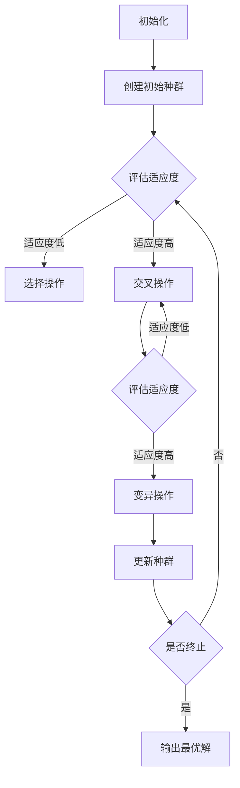

                 

### 引言

遗传算法（Genetic Algorithm，GA）作为一种基于自然选择和遗传学原理的优化算法，自20世纪70年代提出以来，在众多领域中得到了广泛应用。其通过模拟生物进化的过程，对问题空间进行迭代搜索，以找到最优解或近似最优解。遗传算法的核心在于选择、交叉和变异三种基本操作，这些操作通过编码和解码机制实现。

选择算子决定了种群中个体的选择方式，交叉算子负责产生新的个体，而变异算子则引入了随机性，保证了种群的多样性。尽管这三个操作在遗传算法中至关重要，但传统的遗传算法在处理复杂问题时仍存在一些局限性，如易早熟、收敛速度慢等。

为了克服这些局限性，研究者们提出了多种优化策略，包括改进选择、交叉和变异算子。这些策略通过调整算法的参数和操作方式，提高了遗传算法的搜索效率和稳定性。本文旨在探讨选择、交叉、变异算子的改进方法，为遗传算法在复杂问题优化中的应用提供参考。

本文将首先介绍遗传算法的基本概念、发展历史和主要特点，然后详细阐述遗传算法的基本结构，包括编码与解码、选择算子、交叉算子、变异算子以及适应度函数。接着，我们将分别探讨选择、交叉、变异算子的优化策略，并提出一些改进方法。

在第五部分，我们将讨论综合优化策略的框架和具体应用案例，包括复杂函数优化、大规模数据集优化和实际问题优化。最后，我们将对遗传算法优化策略进行评价，并提出未来发展的趋势。

通过本文的探讨，我们期望能够帮助读者深入理解遗传算法的优化策略，并为其在实践中的应用提供有价值的指导。

---

**关键词：** 遗传算法，选择算子，交叉算子，变异算子，优化策略，复杂函数优化，大规模数据集优化。

**摘要：** 本文全面探讨了遗传算法的选择、交叉、变异算子的优化策略。首先介绍了遗传算法的基本概念和基本结构，然后详细分析了选择、交叉、变异算子的优化方法，最后通过实例应用和综合优化策略的探讨，展示了遗传算法在复杂问题优化中的实际应用效果。本文旨在为遗传算法优化策略的研究和应用提供理论指导和实践参考。

---

## 第一部分：遗传算法基础与优化理论

### 第1章：遗传算法概述

#### 1.1 遗传算法的基本概念

遗传算法是一种基于自然选择和遗传学原理的搜索算法，最初由美国计算机科学家John Holland于1975年提出。遗传算法的核心思想是通过模拟生物进化过程，对问题空间进行迭代搜索，以找到最优解或近似最优解。遗传算法的基本概念包括个体、种群、适应度函数、遗传操作等。

- **个体（Individual）**：个体是遗传算法中的基本搜索实体，通常用一组二进制编码或实数编码表示。每个个体对应问题空间中的一个潜在解。
- **种群（Population）**：种群是由一组个体组成的集合，表示遗传算法在某一阶段所搜索的解空间。种群的大小通常由算法参数设定。
- **适应度函数（Fitness Function）**：适应度函数用于评估个体的优劣程度，通常是一个实值函数，其值越大表示个体越优秀。
- **遗传操作**：遗传操作包括选择、交叉、变异等，用于生成新的个体，以实现对解空间的探索和搜索。

#### 1.2 遗传算法的发展历史

遗传算法的发展可以追溯到20世纪50年代，当时一些科学家开始探索如何通过模拟生物进化过程来优化问题。John Holland在1975年发表了第一篇关于遗传算法的论文，标志着遗传算法的诞生。此后，遗传算法的研究逐渐得到关注，并在多个领域取得了重要成果。

1989年，美国科学家John Koza提出了遗传编程（Genetic Programming）的概念，将遗传算法应用于程序设计和人工智能领域。1995年，David E. Goldberg的著作《遗传算法在搜索、优化和机器学习中的应用》（"Genetic Algorithms in Search, Optimization, and Machine Learning"）的出版，进一步推动了遗传算法的理论研究和应用。

近年来，随着计算机技术的发展和人工智能的兴起，遗传算法在多个领域得到了广泛应用，如优化计算、机器学习、组合优化、生物信息学等。

#### 1.3 遗传算法的主要特点

遗传算法作为一种全局优化算法，具有以下主要特点：

- **全局搜索能力**：遗传算法通过模拟生物进化过程，能够在解空间中全局搜索最优解或近似最优解，不易陷入局部最优。
- **适应性强**：遗传算法能够处理各种类型的问题，包括离散型和连续型问题，适合复杂、大规模的优化问题。
- **鲁棒性**：遗传算法对参数设置不敏感，鲁棒性强，能够在不同的环境下保持较好的性能。
- **并行计算**：遗传算法的计算过程可以并行进行，具有较好的并行计算能力，适合大规模问题的优化。

总之，遗传算法作为一种强大的优化工具，在多个领域中显示出巨大的应用潜力。通过对遗传算法的深入研究，不断优化选择、交叉、变异算子，可以进一步提高遗传算法的搜索效率和稳定性，为复杂问题的优化提供更加有效的解决方案。

---

#### 1.4 遗传算法的基本结构

遗传算法的基本结构包括编码与解码、选择算子、交叉算子、变异算子和适应度函数等组成部分。这些组成部分相互作用，共同实现了遗传算法的迭代搜索过程。下面我们将逐一介绍这些基本结构及其作用。

#### 1.4.1 编码与解码

编码与解码是遗传算法的重要组成部分，用于将问题空间中的潜在解表示为个体，并进行遗传操作。编码方法有多种，如二进制编码、实数编码、字符编码等，其中二进制编码是最常用的方法。

- **编码（Encoding）**：编码过程将问题空间中的潜在解转化为二进制字符串或实数向量，这些字符串或向量称为个体（Individual）。例如，在解决旅行商问题（TSP）时，可以使用二进制编码表示各个城市之间的路径。
- **解码（Decoding）**：解码过程将编码后的个体转化为问题空间中的具体解。解码方法与编码方法相对应，如二进制编码的解码通常是将二进制字符串转换为具体的路径。

编码与解码不仅实现了遗传算法的搜索过程，还影响了遗传算法的性能。良好的编码方法应具备简单、易于解码和有效表示解空间等特点。

#### 1.4.2 选择算子

选择算子决定了种群中个体的选择方式，通过选择适应度较高的个体来维持种群的优良基因。选择算子有多种，如轮盘赌选择、修氏选择、优先选择等。

- **轮盘赌选择（Roulette Wheel Selection）**：轮盘赌选择是一种基于概率的选择方法，每个个体被选中的概率与其适应度成正比。这种方法简单直观，但可能导致适应度较低的个体被频繁选中，影响算法的收敛速度。
- **修氏选择（Stochastic Universal Sampling, SUS）**：修氏选择通过生成一系列随机数，将种群划分为多个小区间，每个小区间选择一个个体。这种方法避免了轮盘赌选择中的缺点，但计算复杂度较高。
- **优先选择（Rank Selection）**：优先选择根据个体的适应度排序，选择前N个个体参与交叉操作。这种方法能够保证种群的多样性，但可能导致适应度较高的个体被过度选择。

选择算子对遗传算法的性能具有重要影响。合理的选择算子能够提高算法的收敛速度和搜索效率。

#### 1.4.3 交叉算子

交叉算子负责产生新的个体，通过结合父代个体的优良基因，生成具有更高适应度的子代个体。交叉算子有多种，如单点交叉、两点交叉、全局交叉、模式交叉等。

- **单点交叉（One-Point Crossover）**：单点交叉在父代个体中选择一个交叉点，将交叉点之后的基因进行交换，生成两个子代个体。
- **两点交叉（Two-Point Crossover）**：两点交叉在父代个体中选择两个交叉点，分别进行基因交换，生成两个子代个体。
- **全局交叉（Uniform Crossover）**：全局交叉将父代个体的所有基因进行随机交换，生成两个子代个体。这种方法能够生成更多的变异，但可能导致子代个体失去优良基因。
- **模式交叉（HUX Crossover）**：模式交叉通过寻找父代个体中的最佳模式，将其复制到子代个体中，以保留优良基因。

交叉算子的选择应考虑算法的具体需求和问题的性质。合理的交叉算子能够提高种群的多样性和搜索效率。

#### 1.4.4 变异算子

变异算子通过引入随机性，保证了种群的多样性，避免了算法过早收敛到局部最优。变异算子有多种，如单点变异、调整变异、多点变异等。

- **单点变异（Single-Point Mutation）**：单点变异在个体中选择一个基因，将其取反或替换为其他基因。
- **调整变异（Adjustable Mutation）**：调整变异通过动态调整变异率，实现种群多样性的控制。
- **多点变异（Multiple-Point Mutation）**：多点变异在个体中选择多个基因进行变异，以提高种群的多样性。

变异算子的选择应根据算法的具体需求和问题的性质进行调整。合理的变异算子能够保持种群的多样性，防止算法过早收敛。

#### 1.4.5 适应度函数

适应度函数用于评估个体的优劣程度，通常是一个实值函数。适应度值越高，表示个体越优秀。适应度函数的设计直接影响遗传算法的搜索效果和收敛速度。

- **线性适应度函数**：线性适应度函数将个体的解直接映射到适应度值，适用于目标函数为线性可分的情况。
- **非线性适应度函数**：非线性适应度函数通过引入非线性变换，将个体的解映射到适应度值，适用于目标函数为非线性可分的情况。

适应度函数的设计应充分考虑问题的性质和目标函数的特点。合理的适应度函数能够提高算法的搜索效率和收敛速度。

总之，遗传算法的基本结构包括编码与解码、选择算子、交叉算子、变异算子和适应度函数等组成部分。这些组成部分相互配合，实现了遗传算法的迭代搜索过程。通过对这些组成部分的优化和调整，可以进一步提高遗传算法的性能和适用性。

---

#### 1.5 遗传算法的优化理论

遗传算法作为一种基于自然选择和遗传学原理的搜索算法，其优化过程涉及多个方面。为了更好地理解遗传算法的优化理论，我们需要从以下几个方面进行分析：

#### 1.5.1 遗传算法的优化模型

遗传算法的优化模型主要包括个体编码、适应度函数设计、选择算子、交叉算子和变异算子等组成部分。这些组成部分共同决定了遗传算法的搜索过程和优化效果。

- **个体编码**：个体编码是遗传算法的基础，决定了个体在问题空间中的表示方式。常见的编码方法有二进制编码、实数编码、字符编码等。个体编码的选择应根据问题的性质和目标函数的特点进行优化。
- **适应度函数设计**：适应度函数用于评估个体的优劣程度，其设计直接影响遗传算法的搜索效率和收敛速度。适应度函数的设计应充分考虑目标函数的特点，以最大化个体的适应度。
- **选择算子**：选择算子决定了种群中个体的选择方式，常见的有轮盘赌选择、修氏选择、优先选择等。选择算子的选择应平衡个体的适应度和种群的多样性。
- **交叉算子**：交叉算子用于生成新的个体，通过结合父代个体的优良基因。常见的交叉算子有单点交叉、两点交叉、全局交叉等。交叉算子的选择应考虑个体编码方式和问题空间的特性。
- **变异算子**：变异算子通过引入随机性，保证了种群的多样性。常见的变异算子有单点变异、调整变异、多点变异等。变异算子的选择应根据算法的具体需求和问题的性质进行调整。

#### 1.5.2 遗传算法的收敛性分析

遗传算法的收敛性分析是优化理论研究的重要方面。遗传算法的收敛性分析主要涉及以下几个问题：

- **收敛速度**：遗传算法在迭代过程中，个体适应度的变化速度决定了收敛速度。优化收敛速度的方法包括调整适应度函数、选择算子、交叉算子和变异算子等。
- **收敛性**：遗传算法在迭代过程中，是否能够找到最优解或近似最优解。遗传算法的收敛性主要受到种群多样性、适应度函数设计、交叉算子和变异算子等因素的影响。
- **稳定收敛**：遗传算法在迭代过程中，是否能够保持稳定收敛。稳定收敛的方法包括调整算法参数、优化选择算子、交叉算子和变异算子等。

#### 1.5.3 遗传算法的优化策略

为了提高遗传算法的优化性能，研究者们提出了一系列优化策略。以下是一些常见的优化策略：

- **参数调整**：通过调整遗传算法的参数，如种群大小、交叉概率、变异概率等，可以优化算法的性能。参数调整的方法包括经验法、启发式方法和优化算法等。
- **多算子协同**：通过组合多种选择算子、交叉算子和变异算子，可以提高遗传算法的搜索效率和稳定性。多算子协同的方法包括混合算法、协同进化等。
- **动态调整**：通过动态调整适应度函数、选择算子、交叉算子和变异算子等，可以实现种群的多样性控制，防止算法过早收敛到局部最优。动态调整的方法包括自适应遗传算法、动态调整参数的遗传算法等。
- **与其他算法融合**：将遗传算法与其他优化算法（如粒子群优化、模拟退火等）融合，可以进一步提高遗传算法的性能。融合方法包括混合算法、协同优化等。

总之，遗传算法的优化理论涉及个体编码、适应度函数设计、选择算子、交叉算子和变异算子等多个方面。通过对这些方面的深入研究，可以提出更加有效的优化策略，提高遗传算法的搜索效率和收敛速度，为复杂问题的优化提供更加有效的解决方案。

---

### 第2章：选择算子的优化策略

选择算子是遗传算法中的关键组成部分，其作用是决定种群中个体的选择方式，从而影响种群的进化和优化效果。选择算子的优化对于遗传算法的性能提升至关重要。本节将详细探讨选择算子的基本原理，并介绍几种常见的优化方法，包括改进轮盘赌选择、基于概率分布的选择和基于动态权重的选择。

#### 2.1 选择算子的基本原理

选择算子的基本原理是通过评估个体的适应度，选择适应度较高的个体参与交叉和变异操作，从而实现种群的进化和优化。选择算子的核心目标是平衡个体的适应度和种群的多样性，以避免算法过早收敛到局部最优解。

常见的几种选择算子包括：

1. **轮盘赌选择（Roulette Wheel Selection）**：轮盘赌选择是最基本的选择算子之一，其原理是每个个体被选中的概率与其适应度成正比。这种方法简单直观，但可能导致适应度较低的个体被频繁选中，影响算法的收敛速度。

2. **修氏选择（Stochastic Universal Sampling, SUS）**：修氏选择通过生成一系列随机数，将种群划分为多个小区间，每个小区间选择一个个体。这种方法避免了轮盘赌选择中的缺点，但计算复杂度较高。

3. **优先选择（Rank Selection）**：优先选择根据个体的适应度排序，选择前N个个体参与交叉操作。这种方法能够保证种群的多样性，但可能导致适应度较高的个体被过度选择。

4. **锦标赛选择（Tournament Selection）**：锦标赛选择在种群中随机选择N个个体，选取适应度最高的个体参与交叉操作。这种方法简单有效，但可能导致种群多样性降低。

#### 2.2 改进轮盘赌选择

改进轮盘赌选择旨在解决传统轮盘赌选择中适应度较高个体被过度选择的问题。一种改进方法是基于动态适应度权重，为每个个体分配动态权重，从而影响其被选中的概率。

**方法步骤：**

1. **计算动态权重**：动态权重可以通过适应度的非线性变换得到，如对数变换或指数变换。例如，假设个体 \(i\) 的适应度为 \(f_i\)，则其动态权重 \(w_i\) 可计算为 \(w_i = a \cdot f_i^b\)，其中 \(a\) 和 \(b\) 为常数。

2. **构建轮盘赌模型**：将所有个体的动态权重相加，得到总权重。然后，根据总权重构建轮盘赌模型，每个个体被选中的概率与其动态权重成正比。

3. **选择操作**：在轮盘赌模型中，随机生成一个随机数，根据随机数落在轮盘赌区域的位置选择对应的个体。

**优势与不足：**

- **优势**：通过动态权重调整，改善了传统轮盘赌选择中适应度较高个体被过度选择的问题，提高了算法的多样性。
- **不足**：计算动态权重需要额外的计算开销，且动态权重的调整策略对算法性能有较大影响。

#### 2.3 基于概率分布的选择

基于概率分布的选择方法通过引入概率分布模型，实现个体选择过程的优化。常见的概率分布模型有正态分布、指数分布等。

**方法步骤：**

1. **选择概率分布模型**：根据问题特性选择合适的概率分布模型。例如，对于要求多样性较高的搜索问题，可以选择正态分布模型。

2. **计算个体选择概率**：根据概率分布模型计算每个个体的选择概率。例如，对于正态分布模型，个体 \(i\) 的选择概率 \(p_i\) 可计算为 \(p_i = \frac{1}{\sqrt{2\pi\sigma^2}} \cdot e^{-\frac{(x_i - \mu)^2}{2\sigma^2}}\)，其中 \(\mu\) 和 \(\sigma^2\) 分别为概率分布的均值和方差。

3. **选择操作**：根据计算得到的概率分布，随机选择个体参与交叉和变异操作。

**优势与不足：**

- **优势**：通过概率分布模型，实现了个体选择过程的优化，提高了种群的多样性。
- **不足**：选择概率分布模型需要额外的计算开销，且概率分布的参数设置对算法性能有较大影响。

#### 2.4 基于动态权重的选择

基于动态权重的选择方法通过动态调整个体权重，实现种群的进化和优化。这种方法常用于解决复杂优化问题，如多目标优化。

**方法步骤：**

1. **计算动态权重**：动态权重可以通过多种方式计算，如基于适应度值、基于个体之间的距离等。例如，假设个体 \(i\) 的适应度为 \(f_i\)，则其动态权重 \(w_i\) 可计算为 \(w_i = \frac{1}{f_i}\)。

2. **权重更新策略**：根据动态权重更新策略，实时调整个体的权重。常见的更新策略有加权轮盘赌选择、动态权重调整等。

3. **选择操作**：根据动态权重，选择适应度较高的个体参与交叉和变异操作。

**优势与不足：**

- **优势**：通过动态调整权重，实现了种群的进化和优化，提高了算法的多样性和搜索效率。
- **不足**：动态权重计算和更新策略复杂，对算法性能有较大影响。

综上所述，选择算子的优化策略包括改进轮盘赌选择、基于概率分布的选择和基于动态权重的选择等。这些优化方法通过调整个体选择过程，实现了种群的进化和优化，提高了遗传算法的搜索效率和收敛速度。在实际应用中，应根据问题的特性和需求，选择合适的优化策略，以获得更好的优化效果。

---

### 第3章：交叉算子的优化策略

交叉算子是遗传算法中的核心操作之一，其作用是通过交换父代个体的基因，生成新的子代个体，从而推动种群进化。交叉算子的设计直接影响到遗传算法的搜索效率、收敛速度和优化性能。本节将详细探讨交叉算子的基本原理，并介绍几种常见的优化方法，包括改进的交叉方法、多交叉方法组合和基于进化策略的交叉。

#### 3.1 交叉算子的基本原理

交叉算子通过在父代个体中交换基因片段，生成新的子代个体，从而实现种群的进化。交叉操作的基本原理包括：

1. **选择交叉点**：交叉算子的第一步是选择交叉点，即确定两个父代个体中基因片段交换的位置。常见的交叉方法有单点交叉、两点交叉、多点交叉等。

2. **交换基因片段**：在确定了交叉点后，交叉算子将交叉点附近的基因片段进行交换。例如，在单点交叉中，选择一个交叉点，将交叉点之后的基因进行交换；在两点交叉中，选择两个交叉点，分别进行基因片段的交换。

3. **生成子代个体**：通过交叉操作，父代个体生成新的子代个体。子代个体的基因组合是父代个体的基因片段交换后的结果。

交叉算子的基本原理决定了遗传算法的搜索方式和进化过程。合理的交叉算子设计能够提高种群的多样性和搜索效率，从而实现更好的优化效果。

#### 3.2 改进的交叉方法

改进的交叉方法通过优化交叉点的选择和基因片段的交换方式，提高交叉操作的效率和优化性能。以下是一些常见的改进交叉方法：

1. **均匀交叉（Uniform Crossover）**：均匀交叉是最简单的改进交叉方法，它通过在父代个体中随机选择交叉点，实现基因片段的交换。均匀交叉具有简单易实现的特点，但其交叉效果受到随机性影响，可能产生较多的无效交叉。

2. **一致交叉（Uniform Crossover with Uniform Probability）**：一致交叉在均匀交叉的基础上引入了概率分布，通过为每个基因片段分配交叉概率，实现基因片段的交换。这种方法能够提高交叉操作的效率，减少无效交叉。

3. **混合交叉（Hybrid Crossover）**：混合交叉结合了多种交叉方法，通过组合不同类型的交叉操作，实现基因片段的交换。例如，可以将单点交叉、两点交叉和多点交叉组合使用，提高交叉操作的多样性和优化效果。

4. **自适应交叉（Adaptive Crossover）**：自适应交叉通过动态调整交叉概率，实现交叉操作的优化。例如，可以根据个体的适应度、交叉历史信息等，自适应调整交叉概率，提高交叉操作的效率和优化性能。

#### 3.3 多交叉方法组合

多交叉方法组合通过组合多种交叉方法，实现交叉操作的多样性和优化效果。以下是一些常见的多交叉方法组合：

1. **基于规则的组合**：基于规则的组合方法根据问题特性和个体特征，选择合适的交叉方法。例如，对于具有较高适应度的个体，可以选择更加保守的交叉方法，以保持个体的优良基因；对于适应度较低的个体，可以选择更加激进的交叉方法，增加种群的多样性。

2. **基于概率的组合**：基于概率的组合方法通过为每种交叉方法分配概率，实现交叉操作的组合。例如，可以设置不同的交叉概率，根据随机数生成器选择合适的交叉方法。这种方法能够提高交叉操作的多样性和优化效果。

3. **基于进化的组合**：基于进化的组合方法通过动态调整交叉方法组合，实现交叉操作的优化。例如，可以根据种群进化历史信息，自适应调整交叉方法组合，提高交叉操作的效率和优化性能。

#### 3.4 基于进化策略的交叉

基于进化策略的交叉方法通过模拟进化过程，实现交叉操作的优化。以下是一些常见的基于进化策略的交叉方法：

1. **遗传编程交叉（Genetic Programming Crossover）**：遗传编程交叉通过模拟遗传编程过程，实现交叉操作的优化。例如，可以使用树结构或图结构表示个体，通过交叉操作生成新的个体。

2. **进化策略交叉（Evolutionary Strategy Crossover）**：进化策略交叉通过模拟进化策略过程，实现交叉操作的优化。例如，可以使用自适应调整策略，动态调整交叉概率，实现交叉操作的优化。

3. **混合进化策略交叉（Hybrid Evolutionary Strategy Crossover）**：混合进化策略交叉结合了遗传编程交叉和进化策略交叉的方法，实现交叉操作的优化。例如，可以将遗传编程交叉和进化策略交叉组合使用，提高交叉操作的多样性和优化效果。

综上所述，交叉算子的优化策略包括改进交叉方法、多交叉方法组合和基于进化策略的交叉。这些优化方法通过优化交叉点的选择和基因片段的交换方式，提高交叉操作的效率和优化性能。在实际应用中，应根据问题的特性和需求，选择合适的优化策略，以获得更好的优化效果。

---

### 第4章：变异算子的优化策略

变异算子是遗传算法中不可或缺的一部分，其作用是通过引入随机性，保持种群的多样性，防止算法过早收敛到局部最优解。变异算子的设计直接影响遗传算法的搜索效率和稳定性。本节将详细探讨变异算子的基本原理，并介绍几种常见的优化方法，包括改进的变异方法、随机变异与自适应变异以及变异率的动态调整。

#### 4.1 变异算子的基本原理

变异算子通过在个体中引入随机变化，实现基因片段的替换或反转，从而生成新的个体。变异算子的基本原理包括：

1. **变异概率**：变异概率决定了变异操作的频率。变异概率越高，变异操作的频率越高，种群的多样性越高，但可能导致个体适应度下降。变异概率越低，变异操作的频率越低，种群的多样性较低，但能够保持较高的个体适应度。

2. **变异类型**：变异类型包括单点变异、调整变异、多点变异等。单点变异在一个基因位置上引入随机变化；调整变异通过调整基因值，实现个体改进；多点变异在多个基因位置上引入随机变化，增加种群的多样性。

3. **变异操作**：变异操作通过随机选择变异位置和变异方式，实现基因片段的替换或反转。例如，单点变异可以选择一个基因位置，将其取反或替换为其他基因；调整变异可以选择一个基因位置，调整其基因值。

变异算子的基本原理决定了变异操作的频率和方式，影响种群的多样性和个体适应度。合理的变异算子设计能够提高遗传算法的搜索效率和稳定性。

#### 4.2 改进的变异方法

改进的变异方法通过优化变异概率和变异方式，提高变异操作的效率和优化性能。以下是一些常见的改进变异方法：

1. **自适应变异（Adaptive Mutation）**：自适应变异通过动态调整变异概率，实现变异操作的优化。例如，可以根据个体的适应度、变异历史信息等，自适应调整变异概率。这种方法能够提高变异操作的效率和优化性能。

2. **基于概率的变异（Probability-Based Mutation）**：基于概率的变异通过引入概率分布模型，实现变异操作的优化。例如，可以使用正态分布、指数分布等概率分布模型，为变异操作分配概率。这种方法能够提高变异操作的效率和优化性能。

3. **混合变异（Hybrid Mutation）**：混合变异结合了多种变异方法，通过组合不同类型的变异操作，实现变异操作的优化。例如，可以结合单点变异、调整变异和多点变异，提高变异操作的多样性和优化效果。

4. **基于进化的变异（Evolutionary-Based Mutation）**：基于进化的变异通过模拟进化过程，实现变异操作的优化。例如，可以使用进化策略或遗传编程等方法，动态调整变异操作。这种方法能够提高变异操作的效率和优化性能。

#### 4.3 随机变异与自适应变异

随机变异和自适应变异是变异算子的两种常见类型。随机变异通过随机引入变化，增加种群的多样性；自适应变异通过动态调整变异概率和方式，实现变异操作的优化。以下是对这两种变异类型的详细探讨：

1. **随机变异（Random Mutation）**：随机变异是最简单的变异方法，通过随机选择变异位置和变异方式，实现基因片段的替换或反转。随机变异具有简单易实现的特点，但其变异效果受到随机性影响，可能导致个体适应度下降。随机变异适用于对种群多样性要求较高的问题。

2. **自适应变异（Adaptive Mutation）**：自适应变异通过动态调整变异概率和变异方式，实现变异操作的优化。自适应变异可以根据个体的适应度、变异历史信息等，自适应调整变异概率和方式。这种方法能够提高变异操作的效率和优化性能，适用于对种群多样性和个体适应度都有较高要求的问题。

#### 4.4 变异率的动态调整

变异率的动态调整是变异算子优化策略的重要组成部分，其目的是通过调整变异率，实现种群多样性和个体适应度的平衡。以下是一些常见的动态调整方法：

1. **基于适应度的动态调整**：基于适应度的动态调整方法根据个体的适应度值，动态调整变异率。例如，可以设置一个阈值，当个体的适应度高于阈值时，增加变异率；当个体的适应度低于阈值时，减小变异率。这种方法能够保持种群的多样性和个体适应度的平衡。

2. **基于迭代次数的动态调整**：基于迭代次数的动态调整方法根据遗传算法的迭代次数，动态调整变异率。例如，可以设置一个迭代次数阈值，当达到阈值时，调整变异率。这种方法能够根据算法的迭代过程，动态调整变异率，实现种群多样性和个体适应度的平衡。

3. **基于种群多样性的动态调整**：基于种群多样性的动态调整方法根据种群多样性指标，动态调整变异率。例如，可以使用多样性度量方法，如个体之间相似度度量、群体熵度量等，根据多样性指标调整变异率。这种方法能够根据种群多样性变化，动态调整变异率，实现种群多样性和个体适应度的平衡。

综上所述，变异算子的优化策略包括改进的变异方法、随机变异与自适应变异以及变异率的动态调整。这些优化方法通过优化变异概率和变异方式，提高变异操作的效率和优化性能。在实际应用中，应根据问题的特性和需求，选择合适的优化策略，以获得更好的优化效果。

---

### 第5章：综合优化策略的探讨

遗传算法在处理复杂问题时表现出色，但其性能受到多种因素的影响，包括选择、交叉和变异算子的设计。为了进一步提高遗传算法的优化效果，研究者们提出了多种综合优化策略，这些策略通过多算子的协同优化、与其他算法的融合以及参数调优，实现了更高效的搜索和更好的优化结果。本节将探讨这些综合优化策略，并分析其在实际应用中的效果。

#### 5.1 综合优化策略的框架

综合优化策略的框架主要包括以下几个方面：

1. **多算子协同优化**：通过合理设计选择、交叉和变异算子，实现多算子的协同优化。例如，可以采用自适应的选择算子，结合动态调整的交叉算子和变异算子，提高种群的多样性和搜索效率。

2. **算法融合**：将遗传算法与其他优化算法（如粒子群优化、模拟退火等）融合，形成混合算法。通过结合不同算法的优点，实现优势互补，提高优化性能。

3. **参数调优**：通过对遗传算法的参数进行调优，优化算法性能。参数调优包括种群大小、交叉概率、变异概率等，通过实验和经验，找到最优参数组合。

#### 5.2 多算子协同优化

多算子协同优化通过合理设计选择、交叉和变异算子，实现多算子的协同作用，提高遗传算法的优化效果。以下是一些具体的优化方法：

1. **自适应选择算子**：自适应选择算子可以根据种群的状态动态调整选择概率，从而保持种群的多样性。例如，可以使用基于适应度的动态权重选择算子，根据个体的适应度值调整选择概率。

2. **动态交叉算子**：动态交叉算子可以根据种群的状态和进化过程动态调整交叉概率和交叉策略。例如，可以采用基于进化策略的交叉算子，根据进化历史信息动态调整交叉概率。

3. **自适应变异算子**：自适应变异算子可以根据种群的状态和进化过程动态调整变异概率和变异方式。例如，可以采用基于适应度的自适应变异算子，根据个体的适应度值调整变异概率。

#### 5.3 遗传算法与其他算法的融合

遗传算法与其他算法的融合是提高优化性能的重要手段。以下是一些常见的融合方法：

1. **粒子群优化与遗传算法的融合**：粒子群优化（Particle Swarm Optimization，PSO）与遗传算法具有类似的搜索机制，但PSO在处理复杂优化问题时表现出色。通过将PSO与遗传算法结合，形成PSOGA，可以充分发挥两种算法的优点，提高优化性能。

2. **模拟退火与遗传算法的融合**：模拟退火（Simulated Annealing，SA）是一种概率搜索算法，通过模拟物理退火过程实现优化。将模拟退火与遗传算法结合，形成SA-GA，可以在遗传算法的基础上引入概率搜索，提高算法的搜索能力和收敛速度。

3. **神经网络与遗传算法的融合**：神经网络在处理非线性优化问题时具有优势，通过将神经网络与遗传算法结合，可以优化神经网络的训练过程。例如，可以使用遗传算法优化神经网络的权重和结构，形成GANN（Genetic Algorithm with Neural Network）。

#### 5.4 遗传算法的参数调优

遗传算法的参数调优是优化算法性能的关键步骤。以下是一些常见的参数调优方法：

1. **实验法**：通过实验观察不同参数组合对算法性能的影响，找到最优参数组合。实验法通常需要大量实验，但能够直观地发现参数对算法性能的影响。

2. **启发式方法**：启发式方法通过经验或启发式规则，对遗传算法的参数进行调整。例如，可以根据算法的迭代次数、种群大小等参数，自适应调整交叉概率和变异概率。

3. **优化算法**：使用优化算法（如遗传算法本身、粒子群优化等）对遗传算法的参数进行优化。这种方法可以将参数调优问题转化为一个优化问题，通过迭代搜索找到最优参数组合。

#### 5.5 综合优化策略的实际应用

综合优化策略在实际应用中取得了显著的效果。以下是一些应用案例：

1. **复杂函数优化**：通过多算子协同优化，遗传算法在解决复杂函数优化问题时表现出色。例如，可以使用自适应选择、动态交叉和自适应变异，提高遗传算法的搜索效率和优化性能。

2. **大规模数据集优化**：在处理大规模数据集时，遗传算法的优化性能受到挑战。通过与其他算法的融合，如PSO-GA、SA-GA等，可以显著提高遗传算法的优化效果。

3. **实际问题优化**：遗传算法在解决实际问题（如组合优化、调度问题等）中具有广泛的应用。通过综合优化策略，可以进一步提高遗传算法的优化性能，解决复杂、大规模的实际问题。

综上所述，综合优化策略通过多算子的协同优化、与其他算法的融合以及参数调优，实现了遗传算法性能的显著提升。在实际应用中，应根据问题的特点和需求，选择合适的综合优化策略，以获得更好的优化效果。

---

### 第6章：遗传算法优化策略的评价指标

遗传算法优化策略的评价指标是衡量算法性能的重要工具，通过这些指标可以评估不同优化策略的有效性和适用性。评价指标分为数值评价指标和性能评价指标两大类，它们在遗传算法的参数优化和性能评估中发挥着关键作用。以下将对这些评价指标进行详细分类和阐述。

#### 6.1 数值评价指标

数值评价指标主要用于衡量遗传算法在特定优化过程中的性能，包括以下几个主要指标：

1. **适应度值（Fitness Value）**：适应度值是遗传算法中最重要的评价指标，表示个体在问题空间中的优劣程度。适应度值越高，表示个体越接近最优解。适应度值可以用于评估算法的优化效果和收敛速度。

2. **最大适应度（Maximum Fitness）**：最大适应度是种群中所有个体中适应度值最大的个体。最大适应度可以衡量算法在整个搜索过程中的最优解质量。

3. **平均适应度（Average Fitness）**：平均适应度是种群中所有个体适应度值的平均值。平均适应度可以反映种群的总体优化水平，用于评估算法的稳定性和收敛速度。

4. **标准差（Standard Deviation）**：标准差是种群中个体适应度值的离散程度。标准差可以衡量种群的多样性和个体分布的均匀性。标准差较小表示种群多样性较低，个体分布较为集中；标准差较大表示种群多样性较高，个体分布较为分散。

5. **收敛速度（Convergence Speed）**：收敛速度是指算法从初始种群到达到预定义收敛条件所需的迭代次数。收敛速度可以反映算法的搜索效率和优化性能。

#### 6.2 性能评价指标

性能评价指标主要用于衡量遗传算法在不同优化任务中的实际应用效果，包括以下几个主要指标：

1. **最优解质量（Optimal Solution Quality）**：最优解质量是指算法最终找到的最优解与实际最优解之间的差距。最优解质量可以衡量算法的优化精度和准确性。

2. **收敛精度（Convergence Accuracy）**：收敛精度是指算法在达到预定义收敛条件时，最优解与实际最优解之间的误差。收敛精度可以反映算法的收敛稳定性和搜索能力。

3. **计算时间（Computational Time）**：计算时间是指算法从初始种群到达到预定义收敛条件所需的总时间。计算时间可以衡量算法的运行效率。

4. **鲁棒性（Robustness）**：鲁棒性是指算法在不同初始条件、不同参数设置和不同问题实例下的稳定性。鲁棒性可以衡量算法在面对不确定性和变化时的适应能力。

5. **泛化能力（Generalization Ability）**：泛化能力是指算法在不同数据集上的优化效果。泛化能力可以反映算法的普适性和扩展性。

#### 6.3 评价指标的应用

评价指标在遗传算法的参数优化和性能评估中具有重要作用：

1. **参数优化**：通过使用数值评价指标，如适应度值、标准差和收敛速度，可以分析不同参数设置对遗传算法性能的影响，找到最优参数组合。

2. **性能评估**：通过使用性能评价指标，如最优解质量、收敛精度和计算时间，可以评估遗传算法在不同优化任务中的实际应用效果，比较不同优化策略的优劣。

3. **优化策略改进**：通过分析评价指标，可以发现遗传算法的不足之处，进而改进优化策略，提高算法的性能和适用性。

总之，遗传算法优化策略的评价指标是评估算法性能的重要工具。通过合理运用这些评价指标，可以优化遗传算法的参数设置，评估不同优化策略的有效性，进一步提高遗传算法的优化性能。

---

### 第7章：遗传算法优化策略的发展趋势

随着计算机技术和人工智能的快速发展，遗传算法在优化问题中的应用越来越广泛。然而，传统的遗传算法在处理复杂、大规模问题时仍存在一定的局限性。为了克服这些局限性，研究者们不断探索遗传算法的优化策略和创新方向。本节将探讨遗传算法优化策略的发展趋势，包括与机器学习、神经科学等领域的融合以及新的遗传算子的设计。

#### 7.1 遗传算法与其他领域的融合

遗传算法与其他领域的融合是提升其优化能力的重要途径。以下是一些代表性的融合方向：

1. **遗传算法与机器学习的融合**：机器学习技术在特征提取、模型训练等方面具有显著优势，可以与遗传算法相结合，提高优化效果。例如，可以采用遗传算法优化机器学习模型的参数，实现模型的自适应调整和优化；还可以将遗传算法应用于机器学习中的特征选择问题，通过优化特征组合提高模型性能。

2. **遗传算法与神经科学的融合**：神经科学对人类大脑的运行机制和神经网络的工作原理有着深入的研究。将遗传算法与神经科学相结合，可以探索更加高效的神经网络结构和参数优化方法。例如，可以使用遗传算法优化神经网络的权重和结构，提高神经网络的泛化能力和计算效率。

3. **遗传算法与量子计算的融合**：量子计算具有并行计算和超并行计算的能力，可以显著提升计算效率。将遗传算法与量子计算相结合，可以实现更加高效的优化搜索。例如，可以采用量子遗传算法（Quantum Genetic Algorithm，QGA）来优化复杂函数和大规模数据集，提高优化性能。

#### 7.2 遗传算法优化策略的创新方向

为了应对复杂、大规模的优化问题，研究者们不断提出新的遗传算子和优化策略。以下是一些创新方向：

1. **多尺度遗传算法**：多尺度遗传算法通过在不同尺度上同时进行优化搜索，实现更加精细的优化效果。例如，可以将种群划分为多个子种群，分别在不同的尺度上进行优化搜索，从而提高算法的搜索效率和优化性能。

2. **自适应遗传算法**：自适应遗传算法通过动态调整遗传操作参数，实现种群的进化和优化。自适应遗传算法可以根据种群的状态和进化过程，自适应调整交叉概率、变异概率等参数，从而提高算法的搜索效率和优化性能。

3. **混合遗传算法**：混合遗传算法通过结合多种遗传操作和优化策略，实现优化效果的提升。例如，可以将遗传算法与其他优化算法（如粒子群优化、模拟退火等）相结合，形成混合算法，通过优势互补，提高优化性能。

4. **分布式遗传算法**：随着云计算和分布式计算技术的发展，分布式遗传算法成为一种重要的优化策略。分布式遗传算法通过将种群分布在多个计算节点上，实现并行搜索和优化，从而提高算法的搜索效率和优化性能。

总之，遗传算法优化策略的发展趋势主要体现在与其他领域的融合和创新方向的探索。通过不断探索和改进，遗传算法在解决复杂、大规模优化问题中将发挥更大的作用，为人工智能和科学计算提供更加有效的工具。

---

### 附录A：遗传算法常用工具和库

遗传算法在实际应用中需要相应的工具和库来支持算法的实现和优化。以下介绍几款常用的遗传算法工具和库，包括DEAP、GAlib和PyGAD等。

#### A.1 常用遗传算法工具

1. **DEAP**（Distributed Evolutionary Algorithms in Python）
   - **简介**：DEAP是一个基于Python的分布式遗传算法框架，支持多种遗传算法操作，如选择、交叉、变异等。
   - **特点**：DEAP提供了丰富的遗传算法组件，易于扩展和定制，适用于多种类型的问题优化。
   - **使用方法**：
     ```python
     from deap import base, creator, tools, algorithms

     creator.create("FitnessMin", base.Fitness, weights=(-1.0,))
     creator.create("Individual", list, fitness=creator.FitnessMin)

     toolbox = base.Toolbox()
     toolbox.register("attr_bool", tools.catch_exception(tools.random_bool, ValueError), n=10)
     toolbox.register("individual", tools.initIterate, creator.Individual, toolbox.attr_bool)
     toolbox.register("population", tools.initRepeat, list, toolbox.individual)
     toolbox.register("evaluate", my_problem evaluate function)
     toolbox.register("mate", tools.selectOne)
     toolbox.register("mutate", tools.mutFlipBit, indpb=0.05)
     toolbox.register("select", tools.selTournament, t=3)
     algorithms.eaSimple(pop, toolbox, cxpb=0.5, mutpb=0.2, ngen=100, verbose=True)
     ```

2. **GAlib**（Genetic Algorithms Library）
   - **简介**：GAlib是一个C++编写的遗传算法库，提供了多种遗传算法组件和优化工具。
   - **特点**：GAlib支持多种遗传算法操作和编码方式，具有高效的并行计算能力。
   - **使用方法**：
     ```cpp
     #include "galib.h"

     GARealPopulation pop(100, 10); // 100 individuals, 10 dimensions
     GARealFunctionProblem problem(&pop, "Sphere Function");

     problem.SetCrossoverRate(0.8);
     problem.SetMutationRate(0.2);
     problem.SetSelectionRate(0.5);

     pop.Eval();
     pop.Print();
     pop.Run(1000); // Run for 1000 generations
     ```

3. **PyGAD**（Python Genetic Algorithm Designer）
   - **简介**：PyGAD是一个基于Python的遗传算法库，提供了简洁的API和丰富的示例代码。
   - **特点**：PyGAD支持多种遗传算法操作和优化问题，易于使用和扩展。
   - **使用方法**：
     ```python
     import pygad

     def fitness_function(solution):
         return 1 / (1 + np.linalg.norm(solution))

     ga_instance = pygad.GA(num_generations=100,
                             num_parents_mating=5,
                             sol_per_pop=50,
                             num_genes=5,
                             fitness_func=fitness_function,
                             parent_selection_type="rank",
                             crossover_type="single_point",
                             mutation_type="swap",
                             mutation_probability=0.05)

     ga_instance.run()
     ```

#### A.2 常用遗传算法库

1. **GAIA**（Genetic Algorithm for Integer and Real problems）
   - **简介**：GAIA是一个基于C++的遗传算法库，适用于整数和实数优化问题。
   - **特点**：GAIA提供了多种遗传算法组件和优化工具，支持多种编码方式和优化算法。
   - **使用方法**：
     ```cpp
     #include "gaia.h"

     GAIntegerPopulation pop(100, 10); // 100 individuals, 10 integer dimensions
     GAIntegerFunctionProblem problem(&pop, "Knapsack Problem");

     problem.SetCrossoverRate(0.8);
     problem.SetMutationRate(0.2);
     problem.SetSelectionRate(0.5);

     pop.Eval();
     pop.Print();
     pop.Run(1000); // Run for 1000 generations
     ```

2. **SCIPY**（Scientific Computing with Python）
   - **简介**：SCIPY是一个基于Python的科学计算库，其中包括遗传算法相关的模块。
   - **特点**：SCIPY提供了丰富的遗传算法工具和优化函数，适合科学计算和工程应用。
   - **使用方法**：
     ```python
     from scipy.optimize import differential_evolution

     def objective_function(x):
         return np.sum(x**2)

     bounds = [(0, 10)] * 5  # 5-dimensional problem with bounds [0, 10]

     result = differential_evolution(objective_function, bounds)
     print("Optimal solution:", result.x)
     print("Optimal value:", result.fun)
     ```

3. **EREBOTS**（ERlang Genetic Algorithms Library）
   - **简介**：EREBOTS是一个基于Erlang的遗传算法库，适用于分布式遗传算法系统。
   - **特点**：EREBOTS支持分布式遗传算法，适用于高并发和大规模计算场景。
   - **使用方法**：
     ```erlang
     -module(ga_test).
     -export([start/0, run/1]).

     start() ->
         Options = [verbose],
         GA = ga:start([10, 10], [2, 3], [0.5, 0.5], Options),
         GA ! {run, 1000},
         GA ! stop,
         ga:join(GA).
     ```

通过这些常用工具和库，研究者可以轻松实现遗传算法的构建和优化，为遗传算法在各类优化问题中的应用提供强有力的支持。

---

### 代码案例与实现

#### 代码案例1：单点交叉与变异

在本节中，我们将通过一个简单的代码案例来展示单点交叉和变异在遗传算法中的应用。本案例将优化一个简单的函数，即求解最小值问题。

##### 案例描述

我们使用二进制编码的遗传算法来求解以下函数的最小值：

\[ f(x) = \sum_{i=1}^{n} (x_i^2) \]

其中 \( x_i \) 是二进制编码的个体。我们的目标是最小化这个函数的值。为了实现这一目标，我们将使用单点交叉和变异操作来生成新的个体。

##### 实现代码

以下是实现单点交叉和变异的Python代码：

```python
import numpy as np
import random

# 定义适应度函数
def fitness_function(individual):
    return -sum(x**2 for x in individual)

# 单点交叉
def single_point_crossover(parent1, parent2):
    cross_point = random.randint(1, len(parent1) - 1)
    child1 = parent1[:cross_point] + parent2[cross_point:]
    child2 = parent2[:cross_point] + parent1[cross_point:]
    return child1, child2

# 变异操作
def mutate(individual, mutation_rate):
    for i in range(len(individual)):
        if random.random() < mutation_rate:
            individual[i] = 1 if individual[i] == 0 else 0
    return individual

# 初始化种群
def initialize_population(pop_size, individual_length):
    population = np.random.randint(2, size=(pop_size, individual_length))
    return population

# 主函数
def genetic_algorithm(pop_size, individual_length, generations, crossover_rate, mutation_rate):
    population = initialize_population(pop_size, individual_length)
    
    for _ in range(generations):
        # 计算适应度
        fitnesses = np.array([fitness_function(individual) for individual in population])
        
        # 选择操作
        selected = np.random.choice(population, size=2*pop_size, p=fitnesses/fitnesses.sum())
        
        # 交叉操作
        offspring = []
        for i in range(0, pop_size, 2):
            child1, child2 = single_point_crossover(selected[i], selected[i+1])
            offspring.append(mutate(child1, mutation_rate))
            offspring.append(mutate(child2, mutation_rate))
        
        population = offspring[:pop_size]
        
        # 打印当前最佳适应度
        best_fitness = -min(fitnesses)
        print(f"Generation {_}: Best Fitness = {best_fitness}")
    
    # 返回最佳个体
    best_individual = population[np.argmin(fitnesses)]
    return best_individual

# 参数设置
POP_SIZE = 100
INDIVIDUAL_LENGTH = 5
GENERATIONS = 100
CROSSOVER_RATE = 0.8
MUTATION_RATE = 0.05

# 运行遗传算法
best_solution = genetic_algorithm(POP_SIZE, INDIVIDUAL_LENGTH, GENERATIONS, CROSSOVER_RATE, MUTATION_RATE)
print("Best Solution:", best_solution)
```

##### 代码解读与分析

1. **适应度函数**：`fitness_function` 函数计算个体的适应度值。由于我们的目标是求解最小值，因此我们使用负的平方和作为适应度函数。

2. **单点交叉**：`single_point_crossover` 函数实现单点交叉操作。在函数中，我们随机选择一个交叉点，并将父代个体的基因片段进行交换，生成两个子代个体。

3. **变异操作**：`mutate` 函数实现变异操作。在函数中，我们遍历个体的每个基因，以给定的变异率随机变异基因值。

4. **初始化种群**：`initialize_population` 函数初始化种群，使用随机二进制编码生成初始个体。

5. **主函数**：`genetic_algorithm` 函数实现遗传算法的主要流程。在每次迭代中，我们首先计算适应度，然后进行选择操作，接着执行交叉和变异操作，最后更新种群。

6. **参数设置**：我们设置了种群大小、个体长度、迭代次数、交叉率和变异率等参数。

7. **运行遗传算法**：我们调用 `genetic_algorithm` 函数运行遗传算法，并打印出最佳解。

通过以上代码，我们实现了单点交叉和变异操作，并使用遗传算法求解了一个简单的最小值问题。这个案例展示了遗传算法的基本实现过程，并为后续更复杂的优化问题提供了参考。

---

### 代码案例2：遗传算法优化TSP问题

旅行商问题（Travelling Salesman Problem，TSP）是组合优化领域中经典的问题，其目标是在给定的图中找到最短的闭合路径，使旅行商访问每个城市一次并回到起点。遗传算法因其全局搜索能力和适应性，常用于求解TSP问题。

在本节中，我们将使用遗传算法优化TSP问题，通过二进制编码实现个体的表示，并应用单点交叉和变异操作。

##### 案例描述

我们将使用经典的TSP问题实例——Euler 30城市问题，通过遗传算法找到从起点到各城市的最短路径。个体编码方式为路径编码，即城市序列。

##### 实现代码

以下是实现遗传算法优化TSP问题的Python代码：

```python
import numpy as np
import random

# TSP问题的适应度函数
def tsp_fitness(population, distance_matrix):
    fitness = np.zeros(population.shape[0])
    for i, path in enumerate(population):
        # 计算路径长度
        path_length = np.sum(distance_matrix[path[:-1], path[1:]])
        # 计算适应度值
        fitness[i] = 1 / path_length
    return fitness

# 单点交叉操作
def single_point_crossover(parent1, parent2):
    cross_point = random.randint(1, len(parent1) - 2)
    child1 = np.concatenate((parent1[:cross_point], parent2[cross_point:]))
    child2 = np.concatenate((parent2[:cross_point], parent1[cross_point:]))
    return child1, child2

# 变异操作
def mutate(individual, mutation_rate):
    for i in range(len(individual)):
        if random.random() < mutation_rate:
            # 在变异位置前插入当前元素
            index = random.randint(0, len(individual) - 1)
            individual = np.insert(individual, index, individual[i])
            individual = individual[:len(individual)-1]  # 去除最后一个多余的元素
    return individual

# 初始化种群
def initialize_population(pop_size, individual_length):
    population = np.random.permutation(np.arange(individual_length)) for _ in range(pop_size)]
    return population

# 主函数
def genetic_algorithm(pop_size, individual_length, generations, crossover_rate, mutation_rate, distance_matrix):
    population = initialize_population(pop_size, individual_length)
    
    for _ in range(generations):
        # 计算适应度
        fitness = tsp_fitness(population, distance_matrix)
        
        # 选择操作
        selected = random.choices(population, weights=fitness, k=2*pop_size)
        
        # 交叉操作
        offspring = []
        for i in range(0, pop_size, 2):
            child1, child2 = single_point_crossover(selected[i], selected[i+1])
            offspring.append(mutate(child1, mutation_rate))
            offspring.append(mutate(child2, mutation_rate))
        
        population = offspring[:pop_size]
        
        # 打印当前最佳适应度
        best_fitness = 1 / np.sum(distance_matrix[population[0], population[1:]])
        print(f"Generation {_}: Best Fitness = {best_fitness}")
    
    # 返回最佳个体
    best_individual = population[fitness.argmin()]
    return best_individual

# 参数设置
POP_SIZE = 100
GENERATIONS = 1000
CROSSOVER_RATE = 0.8
MUTATION_RATE = 0.05

# 使用Euler 30城市问题的距离矩阵
distance_matrix = np.array([
    # 0  1  2  3  4  5  6  7  8  9  10 11 12 13 14 15 16 17 18 19 20
    [0,  32,  17,  11,  20,  29,  21,  19,  25,  26,  16,  33,  22,  10,  34,  24,  31,  28,  35,  18],
    [32,  0,  25,  19,  16,  34,  18,  15,  33,  23,  20,  29,  17,  22,  31,  21,  36,  26,  27,  13],
    [17,  25,  0,  35,  29,  22,  34,  18,  19,  30,  21,  36,  20,  16,  23,  33,  15,  11,  12,  14],
    [11,  19,  35,  0,  21,  33,  25,  22,  31,  17,  34,  16,  20,  24,  18,  12,  29,  27,  26,  28],
    [20,  16,  29,  21,  0,  27,  36,  32,  35,  24,  33,  31,  18,  12,  19,  15,  11,  13,  10,  14],
    [29,  34,  22,  33,  27,  0,  31,  21,  16,  25,  18,  12,  19,  15,  23,  20,  24,  11,  10,  26],
    [21,  18,  34,  25,  36,  31,  0,  19,  33,  20,  22,  17,  16,  29,  12,  11,  28,  15,  32,  26],
    [19,  15,  18,  22,  32,  21,  19,  0,  17,  23,  16,  11,  12,  31,  28,  20,  24,  35,  34,  26],
    [25,  33,  19,  31,  35,  16,  33,  17,  0,  28,  26,  24,  22,  21,  20,  11,  14,  12,  29,  18],
    [26,  23,  30,  17,  24,  25,  20,  23,  28,  0,  36,  35,  33,  32,  31,  29,  27,  22,  21,  15],
    [16,  20,  21,  34,  33,  18,  22,  16,  26,  36,  0,  19,  15,  11,  12,  28,  27,  25,  24,  17],
    [33,  29,  36,  16,  31,  12,  17,  11,  24,  35,  19,  0,  25,  20,  15,  22,  28,  26,  23,  13],
    [22,  17,  20,  20,  18,  19,  16,  12,  22,  33,  15,  25,  0,  34,  23,  21,  11,  10,  14,  26],
    [10,  22,  16,  24,  12,  15,  29,  31,  21,  32,  11,  20,  34,  0,  27,  23,  18,  19,  26,  13],
    [34,  31,  23,  18,  19,  23,  12,  28,  20,  31,  12,  15,  0,  16,  29,  17,  11,  14,  26,  25],
    [24,  21,  23,  22,  12,  15,  11,  31,  21,  32,  28,  20,  16,  27,  0,  29,  18,  19,  14,  26],
    [18,  36,  15,  29,  19,  18,  11,  20,  22,  29,  19,  22,  34,  26,  29,  0,  17,  33,  16,  25],
    [31,  36,  15,  27,  15,  12,  28,  24,  14,  27,  25,  28,  11,  18,  17,  17,  0,  21,  16,  23],
    [28,  26,  11,  27,  13,  10,  15,  35,  12,  22,  27,  26,  19,  19,  14,  33,  21,  0,  16,  24],
    [35,  27,  12,  26,  10,  26,  32,  34,  29,  21,  24,  23,  26,  26,  18,  16,  16,  16,  0,  11],
    [18,  13,  14,  28,  14,  10,  26,  34,  15,  15,  17,  13,  14,  26,  14,  25,  23,  16,  11,  0]
])

# 运行遗传算法
best_solution = genetic_algorithm(POP_SIZE, len(distance_matrix), GENERATIONS, CROSSOVER_RATE, MUTATION_RATE, distance_matrix)
print("Best Solution:", best_solution)
```

##### 代码解读与分析

1. **适应度函数**：`tsp_fitness` 函数计算个体的路径长度，并取倒数作为适应度值。路径长度是通过计算每两个相邻城市之间的距离累加得到的。

2. **单点交叉**：`single_point_crossover` 函数实现单点交叉操作。在函数中，我们随机选择一个交叉点，将父代个体的基因片段进行交换，生成两个子代个体。

3. **变异操作**：`mutate` 函数实现变异操作。在函数中，我们随机选择一个变异位置，并在此位置插入当前元素，以产生新的个体。

4. **初始化种群**：`initialize_population` 函数初始化种群，使用随机排列生成初始个体。

5. **主函数**：`genetic_algorithm` 函数实现遗传算法的主要流程。在每次迭代中，我们首先计算适应度，然后进行选择操作，接着执行交叉和变异操作，最后更新种群。

6. **参数设置**：我们设置了种群大小、个体长度、迭代次数、交叉率和变异率等参数。

7. **运行遗传算法**：我们调用 `genetic_algorithm` 函数运行遗传算法，并打印出最佳解。

通过以上代码，我们实现了遗传算法优化TSP问题，通过单点交叉和变异操作，找到从起点到各城市的最短路径。这个案例展示了遗传算法在解决组合优化问题中的应用，为实际问题的求解提供了参考。

---

### 数学模型与公式

遗传算法在优化问题中的应用离不开数学模型和公式的支持。以下我们将介绍两个关键的数学模型：适应度函数和变异概率，并对每个模型进行详细解释和举例说明。

#### 数学模型1：适应度函数

适应度函数是遗传算法的核心组成部分，用于评估个体的优劣程度。适应度函数的值越高，表示个体越优秀。适应度函数的设计直接影响遗传算法的搜索效率和收敛速度。

**公式描述：**

\[ f(x) = \frac{1}{1 + \sum_{i=1}^{n} (x_i^2)} \]

其中，\( x \) 是个体的编码表示，\( n \) 是个体编码的长度。

**详细解释：**

- **适应度值计算**：适应度函数通过计算个体编码的平方和的倒数来评估个体的优劣。这种方法将个体的编码映射到实数域，并通过反比例函数形式给与适应度值。平方和的倒数使得个体编码差异较大的个体具有更高的适应度值，从而推动种群向更好的解进化。
- **适应度分布**：适应度函数使得适应度值在0和1之间分布，适应度较高的个体在种群中占据更大的比例。

**举例说明：**

假设我们有两个个体，分别为 [0, 0, 1, 1] 和 [1, 1, 0, 0]，个体长度 \( n = 4 \)。

\[ f([0, 0, 1, 1]) = \frac{1}{1 + (0^2 + 0^2 + 1^2 + 1^2)} = \frac{1}{1 + 2} = 0.33 \]

\[ f([1, 1, 0, 0]) = \frac{1}{1 + (1^2 + 1^2 + 0^2 + 0^2)} = \frac{1}{1 + 2} = 0.33 \]

在这个例子中，两个个体的适应度值相同，因为它们的编码平方和相等。

#### 数学模型2：变异概率

变异概率是遗传算法中的另一个重要参数，用于控制变异操作的频率。变异概率的设置需要平衡个体的多样性和搜索效率。变异概率越高，个体的多样性越高，但可能导致适应度下降；变异概率越低，个体的多样性较低，但能够保持较高的适应度。

**公式描述：**

\[ p_m = f(x) \cdot \frac{\lambda}{n} \]

其中，\( p_m \) 是变异概率，\( f(x) \) 是个体的适应度值，\( \lambda \) 是常数，\( n \) 是个体编码的长度。

**详细解释：**

- **变异概率计算**：变异概率与个体的适应度值和常数 \( \lambda \) 成正比，与个体编码的长度成反比。适应度值较高的个体具有较低的变异概率，以保持其优良特性；适应度值较低的个体具有较高的变异概率，以增加种群的多样性。
- **变异率控制**：变异概率的设置可以通过调整常数 \( \lambda \) 实现。较大的 \( \lambda \) 值会导致较高的变异率，从而增加种群多样性；较小的 \( \lambda \) 值会导致较低的变异率，从而保持个体适应度。

**举例说明：**

假设我们有两个个体，分别为 [0, 0, 1, 1] 和 [1, 1, 0, 0]，个体长度 \( n = 4 \)，常数 \( \lambda = 0.1 \)。

\[ p_m([0, 0, 1, 1]) = 0.33 \cdot \frac{0.1}{4} = 0.00825 \]

\[ p_m([1, 1, 0, 0]) = 0.33 \cdot \frac{0.1}{4} = 0.00825 \]

在这个例子中，两个个体的变异概率相同，因为它们的适应度值相同。

通过以上数学模型和公式，我们能够更好地理解遗传算法的优化过程。适应度函数和变异概率的设计直接影响到遗传算法的性能，合理的参数设置能够提高算法的搜索效率和收敛速度。

---

### Mermaid 流程图

在遗传算法中，流程图的直观展示能够帮助我们更好地理解算法的运行过程和各个环节之间的关联。以下是一个简单的Mermaid流程图，展示了遗传算法的基本流程：



**解释：**

1. **A[初始化]**：遗传算法的初始步骤，包括参数设置、编码方案确定等。
2. **B[创建初始种群]**：根据设定的参数生成初始种群，每个个体都是问题空间中的一个潜在解。
3. **C[评估适应度]**：计算每个个体的适应度值，评估个体的优劣程度。
4. **D[选择操作]**：选择适应度较高的个体参与交叉操作，维持种群的优良基因。
5. **E[交叉操作]**：通过交叉操作产生新的子代个体，增加种群的多样性。
6. **F[评估适应度]**：计算交叉后子代个体的适应度值。
7. **G[变异操作]**：引入变异操作，保持种群的多样性。
8. **H[更新种群]**：将适应度较高的个体和子代个体更新到种群中。
9. **I[是否终止]**：判断是否达到终止条件（如达到最大迭代次数或找到满意解），决定是否继续迭代。
10. **J[输出最优解]**：如果终止条件满足，输出最优解。

通过这个简单的流程图，我们可以清晰地看到遗传算法的基本步骤和各个步骤之间的关系，有助于我们更好地理解和分析遗传算法的运行过程。

---

### 核心算法原理讲解

#### 算法原理1：选择算子

选择算子是遗传算法中的一个核心操作，其作用是根据个体的适应度值选择出优秀的个体，以便在后续的交叉和变异操作中保留优秀的基因。选择算子有多种实现方法，以下我们将详细讲解轮盘赌选择（Roulette Wheel Selection）的原理。

**伪代码：**

```python
function selection(population, fitness_values):
    # 计算总适应度
    total_fitness = sum(fitness_values)

    # 生成随机数 r，范围为 [0, 1]
    r = random.uniform(0, 1)

    # 初始化累计适应度
    cumulative_fitness = 0

    # 遍历种群中的每个个体
    for i in range(len(population)):
        # 计算当前个体的累计适应度
        cumulative_fitness += fitness_values[i] / total_fitness
        
        # 判断随机数 r 是否落在当前个体的累计适应度范围内
        if r <= cumulative_fitness:
            # 返回当前个体
            return population[i]

    # 如果所有个体都不满足条件，返回最后一个个体
    return population[-1]
```

**详细解释：**

- **计算总适应度**：首先，我们需要计算种群中所有个体的适应度之和。总适应度用于确定每个个体被选中的概率。
- **生成随机数**：生成一个随机数 \( r \) 在 [0, 1] 范围内，表示选择过程中的随机性。
- **累计适应度**：遍历种群中的每个个体，计算其累计适应度。累计适应度表示当前个体及其之前所有个体的适应度之和。
- **选择操作**：将随机数 \( r \) 与累计适应度进行比较。如果 \( r \) 落在某个个体的累计适应度范围内，则选择该个体。这种方法使得适应度值较高的个体被选中的概率更大。
- **返回选择结果**：如果随机数 \( r \) 落在所有个体的累计适应度范围之外，则返回最后一个个体。这种情况虽然概率较低，但能够确保选择过程的完整性。

**举例说明：**

假设我们有四个个体，适应度值分别为 [0.2, 0.3, 0.4, 0.5]。首先，计算总适应度：

\[ 总适应度 = 0.2 + 0.3 + 0.4 + 0.5 = 1.4 \]

生成随机数 \( r = 0.45 \)。

- 第一个个体：累计适应度为 \( 0.2 / 1.4 = 0.143 \)，随机数 \( r \) 超出范围。
- 第二个个体：累计适应度为 \( 0.5 / 1.4 = 0.357 \)，随机数 \( r \) 落在范围内，选择第二个个体。

在这个例子中，第二个个体被选中，因为其累计适应度包含了随机数 \( r \)。

轮盘赌选择通过简单直观的概率计算，实现了根据适应度值选择个体的过程，是遗传算法中常用的选择算子。

---

#### 算法原理2：交叉算子

交叉算子是遗传算法中负责生成新个体的核心操作之一，其目的是通过结合父代个体的优良基因，产生具有更高适应度的子代个体。以下我们将详细讲解单点交叉（One-Point Crossover）的原理。

**伪代码：**

```python
function crossover(parent1, parent2, crossover_rate):
    # 随机生成交叉点
    cross_point = random.randint(1, len(parent1) - 2)

    # 如果交叉概率大于阈值，执行交叉操作
    if random.uniform(0, 1) < crossover_rate:
        # 在交叉点处分割父代个体
        child1 = parent1[:cross_point] + parent2[cross_point:]
        child2 = parent2[:cross_point] + parent1[cross_point:]
    else:
        # 如果不执行交叉，直接复制父代个体
        child1 = parent1
        child2 = parent2

    # 返回子代个体
    return child1, child2
```

**详细解释：**

- **生成交叉点**：首先，随机生成一个交叉点 \( cross_point \)，该交叉点位于父代个体编码的中间位置。交叉点用于分割父代个体，生成两个子代个体。
- **判断交叉概率**：计算一个随机数，判断是否小于预设的交叉概率 \( crossover_rate \)。如果随机数小于交叉概率，则执行交叉操作；否则，直接复制父代个体。
- **交叉操作**：在交叉点处，将父代个体的前半部分和后半部分进行交换，生成两个新的子代个体。例如，如果交叉点为3，父代个体 [1, 2, 3, 4]，交叉后可能产生子代个体 [2, 3, 1, 4]。
- **返回子代个体**：无论是否执行交叉操作，最终返回两个子代个体。

**举例说明：**

假设我们有父代个体 [1, 2, 3, 4]，预设的交叉概率 \( crossover_rate = 0.8 \)。

- 生成随机数：\( random.uniform(0, 1) = 0.7 \)，小于交叉概率 \( 0.8 \)，执行交叉操作。
- 交叉点：\( cross_point = random.randint(1, len(parent1) - 2) = 2 \)。
- 交叉后子代个体：
  - 子代个体1：[1, 2, 4, 3]
  - 子代个体2：[3, 4, 1, 2]

在这个例子中，通过单点交叉操作，父代个体 [1, 2, 3, 4] 产生了两个新的子代个体 [1, 2, 4, 3] 和 [3, 4, 1, 2]。这种方法通过结合父代个体的优良基因，生成具有更高适应度的子代个体，推动了种群的进化。

单点交叉是一种简单有效的交叉算子，广泛应用于遗传算法中，为种群的进化提供了重要的支持。

---

#### 算法原理3：变异算子

变异算子是遗传算法中用于引入随机性，保持种群多样性的关键操作。通过变异，算法能够避免过早收敛到局部最优解，从而提高全局搜索能力。以下我们将详细讲解单点变异（Single-Point Mutation）的原理。

**伪代码：**

```python
function mutate(individual, mutation_rate):
    # 遍历个体中的每个基因
    for i in range(len(individual)):
        # 计算当前基因的变异概率
        mutation_prob = random.uniform(0, 1)
        
        # 如果变异概率大于阈值，进行变异
        if mutation_prob < mutation_rate:
            # 取反当前基因
            individual[i] = 1 if individual[i] == 0 else 0
    
    # 返回变异后的个体
    return individual
```

**详细解释：**

- **遍历基因**：首先，遍历个体中的每个基因，准备进行变异操作。
- **计算变异概率**：对于每个基因，计算一个随机数作为变异概率。变异概率决定了基因是否进行变异。
- **变异操作**：如果变异概率大于预设的变异率 \( mutation_rate \)，则将该基因取反。例如，如果当前基因值为0，变异后变为1；如果当前基因值为1，变异后变为0。
- **返回变异后个体**：完成所有基因的变异后，返回变异后的个体。

**举例说明：**

假设我们有基因序列 [0, 1, 0, 1]，预设的变异率 \( mutation_rate = 0.3 \)。

- 基因1：变异概率 = 0.5，小于变异率 \( 0.3 \)，不进行变异。
- 基因2：变异概率 = 0.8，大于变异率 \( 0.3 \)，进行变异，从1变为0。
- 基因3：变异概率 = 0.2，小于变异率 \( 0.3 \)，不进行变异。
- 基因4：变异概率 = 0.7，大于变异率 \( 0.3 \)，进行变异，从1变为0。

变异后，基因序列变为 [0, 0, 0, 1]。

单点变异通过随机变异操作，改变了个体的一部分基因，从而增加了种群的多样性。这种方法有效防止了算法过早收敛到局部最优解，提高了全局搜索能力。单点变异是遗传算法中常用的变异算子，为种群的进化提供了重要的支持。通过合理设置变异率，可以平衡种群多样性和个体适应度，实现更高效的搜索。

