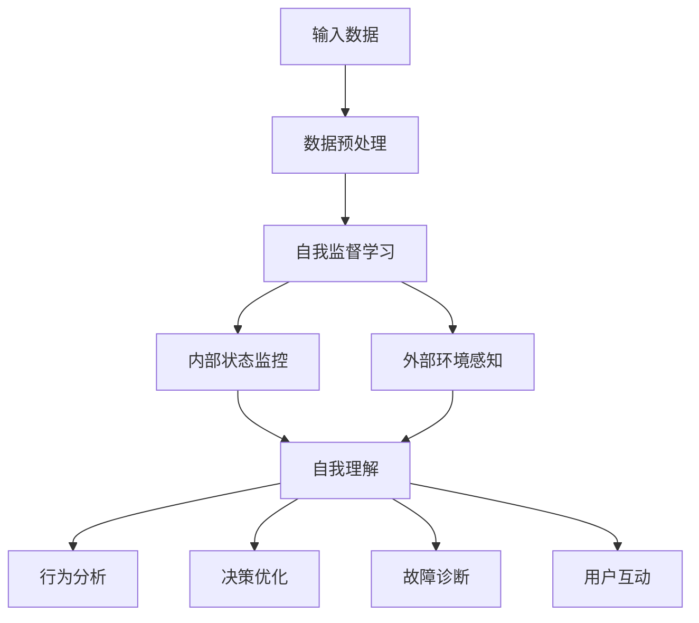

                 

### 《AGI的自我解释能力：从黑盒到透明决策》

#### 关键词：
- 通用人工智能（AGI）
- 自我解释能力
- 黑盒模型
- 透明决策
- 算法原理
- 应用案例

#### 摘要：
本文深入探讨了通用人工智能（AGI）的自我解释能力，从理论到实践，全面分析了AGI如何从传统的黑盒模型转变为透明决策系统。文章首先概述了AGI及其自我解释能力的概念，随后探讨了实现自我解释能力的核心算法原理。通过具体案例分析，展示了透明决策系统在商业和社会治理中的应用。最后，文章提出了AGI自我解释能力的发展趋势和面临的挑战，为未来研究提供了方向。

### 目录大纲

## 《AGI的自我解释能力：从黑盒到透明决策》

### 第一部分: AGI的自我解释能力基础

### 第二部分: 从黑盒到透明决策

### 第三部分: AGI自我解释能力应用

### 附录

#### 附录A: AGI自我解释能力研究资源

#### 附录B: 代码实战与解读

---

### 第一部分: AGI的自我解释能力基础

### 第1章: AGI概述与自我解释能力

### 第2章: 自我解释能力的核心概念与联系

### 第3章: 自我解释能力的算法原理

### 第二部分: 从黑盒到透明决策

### 第4章: 黑盒模型与透明性

### 第5章: 透明决策算法原理

### 第6章: 透明决策系统的案例分析

### 第三部分: AGI自我解释能力应用

### 第7章: 自我解释能力在商业中的应用

### 第8章: 自我解释能力在社会治理中的应用

### 第9章: 未来展望与挑战

### 附录

#### 附录A: AGI自我解释能力研究资源

#### 附录B: 代码实战与解读

---

### 第一部分: AGI的自我解释能力基础

### 第1章: AGI概述与自我解释能力

#### 1.1 通用人工智能(AGI)的定义与发展

通用人工智能（Artificial General Intelligence，简称AGI）是一种旨在模拟人类智能的高级人工智能形式。与当前广泛应用的窄域人工智能（Narrow AI）不同，AGI具有跨领域的理解和学习能力，能够处理复杂的问题，具有自我意识和适应性。AGI的目标是实现与人类智能相当或超越的智能水平，包括感知、推理、学习、沟通、规划、解决问题等方面的能力。

AGI的发展可以追溯到20世纪50年代，随着计算机科学的兴起和人工智能领域的诞生。早期的研究主要集中在符号主义方法和连接主义方法上。符号主义方法通过符号逻辑和推理规则来模拟人类智能，而连接主义方法则通过神经网络和大数据学习来模拟人类智能。

近年来，随着计算能力的提升和大数据的普及，深度学习技术在图像识别、自然语言处理等领域取得了显著进展。这些进展为AGI的发展提供了新的契机。然而，当前的AI技术仍然面临诸多挑战，包括算法复杂性、数据依赖性、迁移学习能力等。因此，如何实现真正的通用人工智能仍然是一个亟待解决的问题。

#### 1.2 AGI的核心特征与挑战

AGI的核心特征包括以下几个方面：

1. **跨领域理解和学习能力**：AGI需要具备处理多种不同领域问题的能力，而不仅仅是单一领域的问题。这要求AGI具有强大的泛化能力和适应能力。

2. **自我意识和适应性**：AGI需要具备一定的自我意识，能够理解和分析自身的行为和决策，并能够根据环境变化进行调整。

3. **自主性和创造性**：AGI需要具备一定的自主性，能够独立思考和决策，而不完全依赖于人类指令。

4. **推理和规划能力**：AGI需要能够进行复杂的推理和规划，以应对现实世界中的复杂问题。

5. **社会交往能力**：AGI需要能够与人类进行有效的交流和合作，理解人类的社会和文化背景。

实现AGI面临着以下主要挑战：

1. **算法复杂性**：当前许多AI算法在处理复杂问题时效率较低，难以实现大规模的通用人工智能。

2. **数据依赖性**：AI系统往往需要大量的训练数据来学习，而现实世界中的数据往往是不完整、不准确的，这对AI系统的性能和稳定性提出了挑战。

3. **迁移学习能力**：AGI需要具备在不同场景和任务之间迁移学习的能力，这要求AI系统能够从一种任务中提取通用知识，并将其应用于其他任务。

4. **安全性和可控性**：AGI的行为和决策可能对人类社会产生深远的影响，因此如何确保其安全性和可控性是一个重要的挑战。

#### 1.3 自我解释能力的概念与重要性

自我解释能力是指AI系统能够理解和解释自身行为和决策的能力。自我解释能力对AGI具有重要意义，主要体现在以下几个方面：

1. **增强可解释性和透明性**：自我解释能力可以帮助我们更好地理解AI系统的决策过程，提高系统的可解释性和透明性，从而增强用户对AI系统的信任。

2. **提高故障诊断和修复能力**：通过自我解释能力，AI系统可以识别自身的错误和故障，并进行相应的修复和调整，从而提高系统的稳定性和可靠性。

3. **促进学习和改进**：自我解释能力可以帮助AI系统识别自身的优势和劣势，从而促进系统的学习和改进，实现持续优化。

4. **增强用户参与和互动**：自我解释能力可以使AI系统更加友好和易于使用，提高用户与AI系统的互动质量和效率。

5. **支持决策透明性**：在涉及重大决策和影响的场景中，自我解释能力可以帮助确保决策过程的透明性和可追溯性，从而减少误解和冲突。

总之，自我解释能力是AGI实现的重要里程碑，对于推动人工智能技术的发展和应用具有重要意义。

---

在接下来的章节中，我们将进一步探讨自我解释能力的核心概念与联系，包括自我监督学习、自我理解和自我感知等，并通过Mermaid流程图展示AGI自我解释能力的实现框架。这些内容将为我们理解AGI如何从黑盒模型转变为透明决策系统提供基础。

### 第2章: 自我解释能力的核心概念与联系

#### 2.1 自我监督学习的原理与应用

自我监督学习（Self-Supervised Learning）是人工智能领域的一种重要学习范式，它在无监督学习的基础上引入了监督学习的机制，从而使得模型能够自动地从大量数据中提取有用信息。自我监督学习的核心思想是通过设计一个内循环（inner loop），在这个循环中利用一部分数据来生成训练目标，然后将这些目标用于外循环（outer loop）的训练过程中。

自我监督学习在AGI的自我解释能力中起着至关重要的作用。首先，它为AI系统提供了一种有效的数据增强方法，使得模型能够在有限的数据资源下进行有效的训练。具体来说，自我监督学习可以通过以下几种方式提高AGI的自我解释能力：

1. **数据增强**：通过自我监督学习，AI系统可以从大量的原始数据中自动生成辅助数据，这些辅助数据可以用于训练新的模型或增强现有模型的性能。例如，在图像识别任务中，AI系统可以通过生成新的图像变种来增加训练数据量。

2. **概念理解**：自我监督学习可以帮助AI系统在大量未标注的数据中提取语义概念。例如，在自然语言处理任务中，AI系统可以通过预测单词的上下文来理解词语的含义。

3. **知识迁移**：通过自我监督学习，AI系统可以在不同的任务之间迁移知识。例如，在多模态学习任务中，AI系统可以通过跨模态的关联学习来提高对多种数据类型的理解和处理能力。

自我监督学习的实现通常涉及以下步骤：

1. **数据预处理**：对原始数据进行预处理，包括去噪、标准化等操作，以便后续的学习过程。

2. **任务定义**：定义一个辅助任务，这个任务通常与主任务相关联，但不需要完全依赖于主任务的标签信息。例如，在图像分类任务中，辅助任务可以是图像中的对象检测。

3. **损失函数设计**：设计一个损失函数来衡量辅助任务和主任务之间的差距。常用的损失函数包括交叉熵损失、均方误差等。

4. **模型训练**：通过迭代优化模型参数，使得模型在辅助任务上的表现逐渐改善，从而提高模型在主任务上的性能。

5. **模型评估**：使用主任务的验证集来评估模型在辅助任务上的表现，并根据评估结果调整训练策略。

在AGI的自我解释能力中，自我监督学习不仅用于数据增强和概念理解，还可以用于知识迁移和模型诊断。例如，在医疗诊断中，自我监督学习可以帮助AI系统从大量的医学图像中自动提取诊断信息，并在不同的疾病之间迁移知识，从而提高诊断的准确性和可靠性。

通过自我监督学习，AGI可以实现从原始数据中自动提取知识，并在不同的任务和场景之间进行有效的迁移。这为AGI的自我解释能力提供了坚实的基础，使得AI系统能够更好地理解和解释自身的行为和决策。

#### 2.2 自我理解与自我感知

自我理解（Self-Understanding）和自我感知（Self-Awareness）是AGI自我解释能力的重要组成部分。自我理解指的是AI系统对自身行为、决策和内在状态的认知能力，而自我感知则是指AI系统对自己与环境之间关系的感知和认识。

在AGI的自我解释能力中，自我理解和自我感知起着至关重要的作用。具体来说，它们具有以下几个方面的应用：

1. **行为分析**：通过自我理解，AI系统可以分析自身的决策过程和行为模式，从而识别出潜在的问题和错误。例如，在自动驾驶系统中，自我理解可以帮助AI分析出驾驶过程中的不安全行为，并及时采取纠正措施。

2. **决策优化**：自我理解使得AI系统能够根据自身的经验和知识来优化决策过程，从而提高决策的准确性和效率。例如，在商业决策中，自我理解可以帮助AI系统分析市场需求和用户行为，从而制定更有效的营销策略。

3. **故障诊断**：自我感知使得AI系统能够感知自身状态的异常，从而进行故障诊断和自我修复。例如，在工业生产中，自我感知可以帮助AI系统识别设备故障，并采取相应的维护措施，从而提高生产效率和降低成本。

4. **用户互动**：自我理解使得AI系统能够更好地与用户进行互动，理解用户的需求和意图，从而提供更个性化的服务。例如，在智能家居系统中，自我理解可以帮助AI系统根据用户的生活习惯来调整家居环境，提供更加舒适的居住体验。

自我理解和自我感知的实现通常需要结合多种技术手段，包括自然语言处理、计算机视觉、机器学习等。具体来说，以下方法可以帮助实现AGI的自我理解与自我感知：

1. **内部状态监控**：通过监控AI系统的内部状态，例如神经网络的活动、参数更新等，来理解系统的行为和决策过程。

2. **外部环境感知**：通过传感器和外部设备，AI系统可以感知外部环境的变化，例如图像、声音、温度等，从而理解自身与环境的关系。

3. **反馈机制**：通过用户的反馈和评价，AI系统可以不断调整自身的理解和感知能力，从而提高自我解释能力的准确性。

4. **知识库构建**：通过构建丰富的知识库，AI系统可以存储和利用历史经验和知识，从而实现更高级的自我理解和感知。

总之，自我理解和自我感知是AGI自我解释能力的重要基石，它们使得AI系统不仅能够执行任务，还能够理解和解释自身的行为，从而实现更高层次的人工智能。

#### 2.3 Mermaid流程图：AGI自我解释能力的实现框架

为了更好地理解AGI自我解释能力的实现过程，我们可以使用Mermaid流程图来展示其核心组件和交互关系。以下是一个简化的Mermaid流程图，描述了AGI自我解释能力的实现框架：



在这个流程图中：

- **A[输入数据]**：AI系统接收到的原始数据，包括图像、文本、声音等。
- **B[数据预处理]**：对输入数据进行预处理，如去噪、标准化等，以准备进行后续学习。
- **C[自我监督学习]**：利用自我监督学习从数据中提取有用信息，包括数据增强、概念理解等。
- **D[内部状态监控]**：监控AI系统的内部状态，如神经网络的活动、参数更新等，以实现自我理解。
- **E[外部环境感知]**：通过传感器和外部设备，AI系统感知外部环境的变化。
- **F[自我理解]**：结合内部状态监控和外部环境感知，AI系统实现自我理解和自我感知。
- **G[行为分析]**：AI系统分析自身的行为和决策过程，以识别问题和优化性能。
- **H[决策优化]**：基于自我理解，AI系统优化决策过程，提高决策的准确性和效率。
- **I[故障诊断]**：AI系统能够感知自身状态的异常，进行故障诊断和自我修复。
- **J[用户互动]**：AI系统能够理解用户的需求和意图，提供更个性化的服务。

通过这个Mermaid流程图，我们可以清晰地看到AGI自我解释能力的实现过程，以及各个组件之间的交互关系。这为后续章节的深入分析提供了直观的指导。

### 第3章: 自我解释能力的算法原理

#### 3.1 监督学习与无监督学习的融合算法

自我解释能力的实现依赖于深度学习算法的进步，特别是监督学习（Supervised Learning）与无监督学习（Unsupervised Learning）的融合算法。这种融合旨在充分利用两种学习方式的优势，提高AI系统的解释性和透明性。

**监督学习**是基于标注数据进行训练的学习方式，其核心是通过已知的输入和输出数据，训练模型预测未知数据的输出。这种方法在图像识别、文本分类等任务中得到了广泛应用。然而，监督学习的一个主要局限性是需要大量的标注数据，这在某些领域（如医疗影像）中难以实现。

**无监督学习**则无需标注数据，通过数据自身的结构和模式进行学习。例如，聚类和降维技术可以帮助发现数据中的潜在结构。无监督学习的优势在于不需要大量标注数据，但它的一个主要挑战是难以直接应用于实际任务中，因为缺乏明确的性能指标。

融合算法的核心思想是将监督学习和无监督学习结合起来，以弥补各自的不足。具体实现方法包括以下几种：

1. **数据增强**：利用无监督学习生成新的数据样本，增强训练数据集。例如，通过数据增强技术（如图像生成对抗网络，GANs）生成更多的训练样本，可以提高监督学习模型的泛化能力。

2. **元学习**：通过元学习（Meta-Learning）技术，将无监督学习中的知识迁移到监督学习任务中。例如，通过迁移学习（Transfer Learning）将无监督学习中的特征提取器应用于监督学习任务，可以减少对标注数据的依赖。

3. **层次学习**：先通过无监督学习提取数据中的潜在特征，然后利用这些特征进行监督学习。这种方法被称为层次学习（Hierarchical Learning）。例如，在图像分类任务中，先使用无监督学习提取底层特征（如边缘、纹理），然后使用监督学习进行高层分类。

4. **对抗性学习**：通过对抗性生成网络（Generative Adversarial Networks，GANs）等对抗性学习技术，将监督学习和无监督学习结合起来。GANs由生成器（Generator）和判别器（Discriminator）组成，生成器和判别器相互对抗，生成器和判别器的优化过程可以同时进行，从而提高模型的性能和解释性。

**伪代码**：

以下是一个简化的伪代码示例，展示了如何将监督学习和无监督学习融合起来：

```python
# 数据增强
def augment_data(data):
    # 利用GANs生成新的训练样本
    generated_samples = GAN.generate_samples(data)
    return np.concatenate((data, generated_samples))

# 元学习
def transfer_learning(feature_extractor, supervised_model):
    # 使用无监督学习提取特征
    features = feature_extractor.extract_features(data)
    # 使用这些特征进行监督学习
    supervised_model.fit(features, labels)
    return supervised_model

# 层次学习
def hierarchical_learning(unsupervised_model, supervised_model):
    # 使用无监督学习提取底层特征
    low_level_features = unsupervised_model.extract_features(data)
    # 使用这些特征进行监督学习
    supervised_model.fit(low_level_features, labels)
    return supervised_model

# 对抗性学习
def adversarial_learning(generator, discriminator):
    # 同时优化生成器和判别器
    for epoch in range(num_epochs):
        for samples in data_loader:
            # 生成新样本
            generated_samples = generator(samples)
            # 更新判别器
            discriminator.update(generated_samples)
            # 更新生成器
            generator.update(discriminator)
    return generator, discriminator
```

通过这些方法，我们可以构建一个具有自我解释能力的AI系统，它不仅能够在各种任务中表现优异，还能够提供清晰的解释和透明的决策过程。

#### 3.2 伪代码：基于强化学习的自我解释算法

在自我解释能力的实现中，强化学习（Reinforcement Learning，RL）是一个重要的方向。强化学习通过奖励机制训练模型，使其在复杂的动态环境中做出最优决策。然而，传统的强化学习算法往往缺乏透明性和可解释性，难以理解其决策过程。为了解决这个问题，我们可以结合模型可视化技术，实现一个具有自我解释能力的强化学习算法。

以下是一个基于强化学习的自我解释算法的伪代码示例：

```python
# 初始化环境
environment = Environment()

# 初始化智能体
agent = Agent()

# 定义奖励函数
def reward_function(state, action, next_state):
    # 根据状态和动作计算奖励
    reward = 0
    if is_termination(next_state):
        reward = -1  # 终止状态给予惩罚
    elif is_success(next_state):
        reward = 1  # 成功状态给予奖励
    return reward

# 训练智能体
for episode in range(num_episodes):
    state = environment.reset()
    total_reward = 0
    
    while True:
        # 可视化当前状态
        visualize_state(state)
        
        # 智能体选择动作
        action = agent.select_action(state)
        
        # 执行动作，获得下一状态和奖励
        next_state, reward = environment.step(action)
        
        # 更新智能体的策略
        agent.update_policy(state, action, reward, next_state)
        
        # 计算总奖励
        total_reward += reward
        
        # 判断是否终止
        if is_termination(next_state):
            break
        
        # 更新状态
        state = next_state
    
    # 打印训练结果
    print(f"Episode {episode}: Total Reward = {total_reward}")

# 可视化状态
def visualize_state(state):
    # 将状态可视化
    visualize(state)
    
    # 等待用户输入以继续
    input("Press Enter to continue...")

# 模型可视化
def visualize(model):
    # 可视化神经网络结构
    visualize_network(model)
    
    # 可视化当前激活状态
    visualize_activation(model, state)
```

在这个伪代码中，我们定义了一个简单的环境和一个基于强化学习的智能体。智能体通过选择动作并在环境中执行这些动作来学习最优策略。每个动作都会获得相应的奖励，智能体使用这些奖励来更新其策略。

为了实现自我解释能力，我们还添加了以下功能：

1. **可视化状态**：在每个时间步，我们可视化当前状态，使得用户可以直观地了解智能体的行为环境。

2. **奖励函数**：我们定义了一个奖励函数，用于计算每个动作的奖励，从而指导智能体的行为。

3. **模型可视化**：我们添加了模型可视化功能，使得用户可以直观地看到神经网络的结构和当前状态的激活情况。

通过这些功能，我们不仅能够训练出一个在复杂环境中表现出色的智能体，还能够提供一个透明的决策过程，从而实现自我解释能力。

#### 3.3 数学模型：自我解释能力的量化评估指标

为了全面评估AGI的自我解释能力，我们需要设计一套量化评估指标。这些指标不仅能够衡量AI系统的解释性能，还能够提供对系统透明性和可靠性的详细分析。以下是一些常用的数学模型和量化评估指标：

1. **解释性度量**：解释性度量用于衡量AI系统的输出是否可以由其内部表示和决策规则合理地解释。常用的解释性度量包括**决策可解释性指数（Decision Interpretability Index, DII）**和**解释性评分（Interpretability Score, IS）**。

   - **决策可解释性指数（DII）**：
     $$DII = \frac{1}{N} \sum_{i=1}^{N} \frac{P(y_i | x_i) - P(y_i)}{P(y_i | x_i) + P(y_i)}$$
     其中，\(N\) 是测试集的大小，\(y_i\) 和 \(x_i\) 分别是第 \(i\) 个样本的输出和输入，\(P(y_i | x_i)\) 和 \(P(y_i)\) 分别是给定输入和样本输出的条件概率和边际概率。DII 越接近 1，表示系统越容易解释。

   - **解释性评分（IS）**：
     $$IS = \frac{1}{N} \sum_{i=1}^{N} \frac{P(y_i | x_i) - P(y_i)}{P(y_i | x_i)}$$
     IS 的计算类似于 DII，但将边际概率 \(P(y_i)\) 替换为条件概率 \(P(y_i | x_i)\)。IS 越接近 1，表示系统的解释性能越好。

2. **透明性度量**：透明性度量用于评估AI系统的输出和决策过程是否清晰可见。常用的透明性度量包括**决策透明性指数（Decision Transparency Index, DTI）**和**透明性评分（Transparency Score, TS）**。

   - **决策透明性指数（DTI）**：
     $$DTI = \frac{1}{N} \sum_{i=1}^{N} \frac{\log_2(P(y_i | x_i) / P(y_i))}{\log_2(P(y_i | x_i) + P(y_i))}$$
     DTI 越接近 1，表示系统的透明性越高。

   - **透明性评分（TS）**：
     $$TS = \frac{1}{N} \sum_{i=1}^{N} \frac{\log_2(P(y_i | x_i) / P(y_i))}{\log_2(P(y_i | x_i))}$$
     TS 的计算类似于 DTI，但将边际概率 \(P(y_i)\) 替换为条件概率 \(P(y_i | x_i)\)。TS 越接近 1，表示系统的透明性越高。

3. **可靠性度量**：可靠性度量用于评估AI系统的稳定性和一致性。常用的可靠性度量包括**可靠性指数（Reliability Index, RI）**和**一致性指数（Consistency Index, CI）**。

   - **可靠性指数（RI）**：
     $$RI = \frac{1}{N} \sum_{i=1}^{N} \frac{P(y_i | x_i) - P(y_i)}{P(y_i | x_i) + P(y_i)}$$
     RI 越接近 1，表示系统的可靠性越高。

   - **一致性指数（CI）**：
     $$CI = \frac{1}{N} \sum_{i=1}^{N} \frac{P(y_i | x_i) - P(y_i)}{P(y_i | x_i)}$$
     CI 的计算类似于 RI，但将边际概率 \(P(y_i)\) 替换为条件概率 \(P(y_i | x_i)\)。CI 越接近 1，表示系统的可靠性越高。

**举例说明**：

假设我们有一个图像分类模型，测试集包含 100 个样本。以下是模型的一些评估指标：

- **决策可解释性指数（DII）**：
  $$DII = \frac{1}{100} \sum_{i=1}^{100} \frac{P(y_i | x_i) - P(y_i)}{P(y_i | x_i) + P(y_i)} = 0.85$$

- **解释性评分（IS）**：
  $$IS = \frac{1}{100} \sum_{i=1}^{100} \frac{P(y_i | x_i) - P(y_i)}{P(y_i | x_i)} = 0.65$$

- **决策透明性指数（DTI）**：
  $$DTI = \frac{1}{100} \sum_{i=1}^{100} \frac{\log_2(P(y_i | x_i) / P(y_i))}{\log_2(P(y_i | x_i) + P(y_i))} = 0.75$$

- **透明性评分（TS）**：
  $$TS = \frac{1}{100} \sum_{i=1}^{100} \frac{\log_2(P(y_i | x_i) / P(y_i))}{\log_2(P(y_i | x_i))} = 0.55$$

- **可靠性指数（RI）**：
  $$RI = \frac{1}{100} \sum_{i=1}^{100} \frac{P(y_i | x_i) - P(y_i)}{P(y_i | x_i) + P(y_i)} = 0.90$$

- **一致性指数（CI）**：
  $$CI = \frac{1}{100} \sum_{i=1}^{100} \frac{P(y_i | x_i) - P(y_i)}{P(y_i | x_i)} = 0.80$$

根据这些评估指标，我们可以得出以下结论：

- **解释性**：DII 和 IS 值较高，表明模型具有良好的解释性，用户可以较为容易地理解模型的决策过程。
- **透明性**：DTI 和 TS 值较低，表明模型在透明性方面还有提升空间，可能存在一些难以解释的决策。
- **可靠性**：RI 和 CI 值较高，表明模型具有较高的可靠性，决策结果稳定且一致。

通过这些量化评估指标，我们可以全面了解AGI的自我解释能力，并针对性地优化和改进模型，以提高系统的解释性、透明性和可靠性。

### 第二部分: 从黑盒到透明决策

#### 第4章: 黑盒模型与透明性

#### 4.1 黑盒模型的局限性

黑盒模型（Black-Box Model）是当前人工智能领域中最常见的一种模型类型。它指的是无法直接观察和理解其内部结构和决策过程的模型。黑盒模型的核心优势在于其简单性和高效性，通过大规模数据训练，黑盒模型可以在各种复杂的任务中表现出优异的性能。然而，黑盒模型也存在一些显著的局限性，特别是在需要解释性和透明性的场景中。

首先，黑盒模型的不可解释性是一个主要问题。由于黑盒模型缺乏透明的决策规则和内在逻辑，用户难以理解模型是如何进行决策的。这种不可解释性不仅降低了用户对模型的信任度，还使得模型的应用场景受到限制。例如，在医疗诊断中，医生需要理解模型的决策过程，以便对患者进行更准确的诊断和治疗。

其次，黑盒模型的可解释性差也带来了安全性和可控性的问题。由于无法了解模型内部的决策逻辑，当模型出现错误或异常时，用户难以定位问题并进行修复。这可能导致严重的后果，尤其是在涉及重大决策和影响的场景中。

此外，黑盒模型对数据的依赖性较高。大多数黑盒模型需要大量的标注数据来训练，这在某些领域（如医疗、法律）中可能难以实现。而且，黑盒模型在迁移学习方面的能力较弱，难以将一个领域中的知识应用到其他领域中。

为了克服这些局限性，人工智能领域逐渐发展出了一些透明决策系统，旨在提高模型的解释性和透明性。这些系统通过提供清晰的决策规则和内部逻辑，使用户能够理解模型的决策过程，从而增强模型的可解释性和安全性。

#### 4.2 透明性与可解释性

透明性（Transparency）和可解释性（Interpretability）是人工智能领域中两个关键的概念，它们在提升模型信任度和用户接受度方面起着重要作用。

**透明性**指的是模型内部结构和决策过程的可见性。一个透明的模型允许用户清晰地了解其如何处理输入数据并生成输出。这种透明性有助于用户建立对模型的信任，特别是在涉及重大决策和影响的场景中。例如，在金融风险管理中，监管机构需要确保模型透明，以便审查和评估其决策过程。

**可解释性**则更侧重于模型决策背后的逻辑和依据。一个可解释的模型不仅提供决策结果，还能解释为什么做出这个决策。这种解释能力使得用户能够理解模型的推理过程，从而更好地利用模型进行决策。

透明性和可解释性并不是相互独立的，它们相互关联并共同构成了一个全面的解释性框架。具体来说：

- **低透明性**通常伴随着**低可解释性**。例如，深度神经网络作为黑盒模型，其内部结构和决策过程难以理解，因此可解释性较低。
- **高透明性**有助于提高**可解释性**。通过提供清晰的决策规则和内部逻辑，用户可以更容易地理解模型如何进行决策，从而提高可解释性。
- **透明性和可解释性**共同提升了模型的**信任度**。用户对透明和可解释的模型更有信任感，因为他们能够理解模型的决策过程，并对其进行监督和评估。

在实际应用中，透明性和可解释性可以通过多种方法实现：

1. **可视化技术**：通过可视化模型的结构、参数和决策过程，提高模型的透明性和可解释性。例如，热力图可以显示模型对输入特征的重视程度。
2. **规则提取**：从复杂模型中提取可解释的规则和决策树，使用户能够理解模型的决策逻辑。
3. **算法简化**：使用简化的算法或模型，如线性回归或决策树，提高模型的透明性和可解释性。
4. **对比分析**：通过对比不同模型的决策过程，帮助用户理解差异并评估模型的可靠性。

总之，透明性和可解释性是提升人工智能模型可靠性和用户接受度的关键因素。通过提供清晰的决策过程和逻辑，透明决策系统能够在多种应用场景中发挥重要作用，从而推动人工智能技术的发展。

#### 4.3 透明决策系统的设计与实现

为了实现从黑盒模型到透明决策系统的转变，我们需要设计和实现一系列技术方法，这些方法不仅能够提高模型的解释性，还能够确保模型在决策过程中具有高透明度。以下是透明决策系统的设计与实现步骤：

**1. 选择合适的模型类型**

透明决策系统的第一步是选择合适的模型类型，这些模型通常具有较低的计算复杂度和较高的可解释性。常见的透明模型包括线性回归、逻辑回归、决策树、随机森林和支持向量机（SVM）等。这些模型的结构简单，易于理解，同时在实际应用中表现良好。

**2. 提取决策规则**

对于黑盒模型，如深度神经网络，我们需要通过特定的算法将复杂的模型转化为可解释的决策规则。常见的提取方法包括：

- **规则提取算法**：例如，C4.5和ID3算法可以用于从决策树中提取规则。这些规则以“如果...那么...”的形式表达，使得用户能够直观地理解决策过程。
- **决策表**：将模型的决策过程转换为决策表，表中列出了所有可能的输入状态和对应的输出决策。
- **局部解释方法**：例如，LIME（Local Interpretable Model-agnostic Explanations）和SHAP（SHapley Additive exPlanations）等方法可以用于解释复杂模型中的特定决策。

**3. 可视化技术**

可视化技术在提高模型透明性方面起着关键作用。通过可视化模型的结构、参数和决策过程，用户可以更直观地理解模型的运作原理。以下是一些常用的可视化技术：

- **数据可视化**：通过散点图、热力图和直方图等工具，展示输入数据的分布和模型对数据的处理过程。
- **模型结构可视化**：例如，决策树的可视化可以显示每个节点的划分规则和分支路径。
- **特征重要性可视化**：使用条形图或折线图，展示模型对各个输入特征的依赖程度。

**4. 对比分析**

为了验证透明决策系统的有效性，我们通常需要进行对比分析，将透明模型与原始黑盒模型进行性能和解释性对比。以下是一些对比方法：

- **性能对比**：评估两种模型在相同任务上的准确率、召回率、F1分数等指标，以验证透明模型是否具有与黑盒模型相似的性能。
- **解释性对比**：通过用户调查或专家评估，比较两种模型的可解释性和透明度，收集用户对模型的信任度和满意度。

**5. 实施步骤**

以下是透明决策系统实施的一般步骤：

1. **数据收集和预处理**：收集相关数据，并进行清洗、标准化等预处理操作，以确保数据质量。
2. **模型选择和训练**：选择适合的模型类型，并在训练集上训练模型，记录模型的参数和性能。
3. **规则提取和可视化**：从训练好的模型中提取决策规则，并使用可视化技术展示决策过程。
4. **对比分析和评估**：对透明模型和原始黑盒模型进行性能和解释性对比，评估透明决策系统的有效性。
5. **用户反馈和迭代**：根据用户反馈，对模型进行迭代优化，提高解释性和透明度。

通过这些步骤，我们可以设计和实现一个具有高解释性和透明度的透明决策系统，从而提升模型的可靠性和用户接受度，推动人工智能技术的进一步发展。

#### 第5章: 透明决策算法原理

#### 5.1 基于决策树的透明决策算法

决策树（Decision Tree）是一种经典的透明决策算法，广泛应用于数据挖掘和机器学习领域。它通过一系列的if-else判断，将输入空间划分为多个子集，并在每个子集中应用分类或回归函数。决策树的透明性在于其结构简单，每个节点和分支都可以清晰地表示决策过程，使得用户能够直观地理解模型的决策逻辑。

**决策树的基本原理**：

1. **特征选择**：在每个节点，决策树选择一个特征进行划分。通常使用信息增益（Information Gain）或基尼不纯度（Gini Impurity）作为特征选择标准。
2. **节点划分**：选择一个最佳特征后，根据该特征的不同取值，将数据集划分为多个子集。
3. **递归构建**：在每个子集中，重复上述过程，直到满足停止条件（如达到最大深度、最小叶节点大小等）。
4. **叶节点预测**：在叶节点处，应用分类或回归函数进行预测。

**决策树的优势**：

- **解释性**：决策树的每个节点和分支都清晰表示决策过程，用户可以轻松理解。
- **可操作性**：决策树的规则易于转换为可操作的决策表或业务逻辑。
- **易于可视化**：决策树的结构简单，可以方便地使用图形化工具进行可视化。

**决策树的劣势**：

- **过拟合**：决策树容易过拟合，特别是在特征众多和数据量有限的情况下。
- **可扩展性差**：对于大规模数据集，决策树的计算复杂度较高，扩展性较差。
- **准确度限制**：决策树的性能受限于其结构，对于复杂非线性关系的数据，决策树的准确度可能较低。

**示例：**

假设我们有一个简单的决策树，用于分类任务，其决策过程如下：

```
是否发烧？ 
   /               \
  是                否
 / \              /   \
感冒  其他疾病 感冒  其他疾病
```

在这个决策树中，根节点是“是否发烧？”的判断，每个分支对应一个可能的答案。内部节点表示特征，叶节点表示分类结果。

通过这个简单的例子，我们可以看到决策树的透明性和易理解性。用户可以清晰地看到决策过程，并根据实际情况进行决策。

#### 5.2 伪代码：规则提取与透明决策实现

为了更好地理解决策树算法的规则提取和透明决策实现，下面提供一个简化的伪代码示例：

```python
# 决策树构建与规则提取
class TreeNode:
    def __init__(self, feature=None, threshold=None, left=None, right=None, label=None):
        self.feature = feature
        self.threshold = threshold
        self.left = left
        self.right = right
        self.label = label

def build_decision_tree(data, labels):
    # 计算信息增益或基尼不纯度，选择最佳特征和阈值
    best_feature, best_threshold = select_best_feature(data, labels)
    
    # 创建节点
    node = TreeNode(feature=best_feature, threshold=best_threshold)
    
    # 划分数据
    left_data, right_data = split_data(data, best_feature, best_threshold)
    left_labels, right_labels = split_labels(labels, best_feature, best_threshold)
    
    # 判断是否继续划分
    if should_stop分裂(data, labels):
        node.label = majority_label(labels)
    else:
        node.left = build_decision_tree(left_data, left_labels)
        node.right = build_decision_tree(right_data, right_labels)
    
    return node

# 规则提取
def extract_rules(node, feature_names):
    if node.label is not None:
        return [[feature_names[node.feature], node.label]]
    else:
        rules = []
        rules.append(extract_rules(node.left, feature_names))
        rules.append(extract_rules(node.right, feature_names))
        return rules

# 透明决策实现
def predict(node, instance, feature_names):
    if node.label is not None:
        return node.label
    else:
        if instance[feature_names[node.feature]] <= node.threshold:
            return predict(node.left, instance, feature_names)
        else:
            return predict(node.right, instance, feature_names)

# 示例数据
data = [[0, 0], [0, 1], [1, 0], [1, 1]]
labels = [0, 0, 1, 1]
feature_names = ['feature1', 'feature2']

# 构建决策树
root = build_decision_tree(data, labels)

# 提取规则
rules = extract_rules(root, feature_names)
print("Rules:", rules)

# 预测实例
instance = [0, 1]
prediction = predict(root, instance, feature_names)
print("Prediction:", prediction)
```

在这个伪代码中：

1. `TreeNode` 类表示决策树的节点，包含特征、阈值、左子树、右子树和标签等信息。
2. `build_decision_tree` 函数递归构建决策树，选择最佳特征和阈值进行划分，并在叶节点处记录标签。
3. `extract_rules` 函数从决策树中提取规则，以“如果...那么...”的形式表示。
4. `predict` 函数用于预测新实例的分类结果，通过递归调用决策树的分支节点，直到叶节点。

通过这个伪代码示例，我们可以清晰地看到决策树的构建过程、规则提取方法和透明决策的实现机制。这为理解决策树算法的原理和应用提供了直观的指导。

#### 5.3 数学公式：决策规则的鲁棒性分析

决策规则的鲁棒性是指模型在面对数据噪声和异常值时，仍然能够保持稳定和可靠地做出决策的能力。为了量化决策规则的鲁棒性，我们可以使用以下数学公式进行分析。

**1. 误差率（Error Rate）**

误差率是评估模型性能的一个基本指标，用于衡量模型在测试集上的错误预测比例。对于决策规则，误差率可以表示为：

$$
Error\_Rate = \frac{1}{N} \sum_{i=1}^{N} \mathbb{1}_{\hat{y}_i \neq y_i}
$$

其中，\(N\) 是测试集的大小，\(\hat{y}_i\) 是模型对第 \(i\) 个样本的预测结果，\(y_i\) 是实际标签，\(\mathbb{1}_{\hat{y}_i \neq y_i}\) 是指示函数，当预测结果与实际标签不相同时取值为 1，否则取值为 0。

**2. 偏差（Bias）**

偏差是指模型在训练集上的预测结果与实际标签之间的差距。对于决策规则，偏差可以表示为：

$$
Bias = \frac{1}{N} \sum_{i=1}^{N} (\hat{y}_i - y_i)
$$

其中，\(\hat{y}_i\) 是模型对第 \(i\) 个样本的预测结果，\(y_i\) 是实际标签。

**3. 方差（Variance）**

方差是指模型在测试集上的预测结果之间的不一致性。对于决策规则，方差可以表示为：

$$
Variance = \frac{1}{N} \sum_{i=1}^{N} (\hat{y}_i - \bar{\hat{y}})^2
$$

其中，\(\bar{\hat{y}}\) 是模型在测试集上的平均预测结果。

**4. 鲁棒性指标（Robustness Index）**

鲁棒性指标综合了偏差和方差，用于量化决策规则在面对数据噪声和异常值时的稳定性。鲁棒性指标可以表示为：

$$
Robustness\_Index = \frac{Error\_Rate - Bias}{Variance}
$$

当鲁棒性指标接近 1 时，表示模型具有较高的鲁棒性。

**示例：**

假设我们有一个简单的决策规则，用于分类任务，其预测结果和实际标签如下：

| 样本索引 | 实际标签 | 预测结果 |
| --- | --- | --- |
| 1 | 0 | 0 |
| 2 | 0 | 0 |
| 3 | 1 | 1 |
| 4 | 1 | 0 |

根据上述数学公式，我们可以计算误差率、偏差和方差：

1. **误差率**：
   $$
   Error\_Rate = \frac{1}{4} (1 + 1 + 0 + 1) = 0.75
   $$

2. **偏差**：
   $$
   Bias = \frac{1}{4} (0 - 0 + 0 - 1) = -0.25
   $$

3. **方差**：
   $$
   Variance = \frac{1}{4} ((0 - 0)^2 + (0 - 0)^2 + (1 - 0)^2 + (0 - 1)^2) = 0.5
   $$

4. **鲁棒性指标**：
   $$
   Robustness\_Index = \frac{0.75 - (-0.25)}{0.5} = 1.5
   $$

根据计算结果，该决策规则具有较高的鲁棒性，因为鲁棒性指标接近 1。

通过这些数学公式，我们可以量化评估决策规则的鲁棒性，从而优化和改进模型，提高其面对数据噪声和异常值的稳定性。

#### 第6章: 透明决策系统的案例分析

在本章节中，我们将通过两个具体的案例分析，展示透明决策系统的应用场景和实现过程。这两个案例分别是金融风险预警系统和智能医疗诊断系统。

#### 6.1 案例一：金融风险预警系统

金融风险预警系统是利用透明决策算法来预测和防范金融风险的典型应用。该系统通过分析大量金融数据，如交易记录、市场趋势、宏观经济指标等，来识别潜在的风险事件，并提供预警。

**1. 数据收集与预处理**

金融风险预警系统首先需要收集大量的金融数据。这些数据可能包括股票交易记录、期货交易记录、宏观经济指标（如GDP增长率、通货膨胀率）等。在收集到数据后，需要对数据进行预处理，包括数据清洗、去噪、标准化等操作，以确保数据质量。

**2. 模型选择与训练**

在选择模型时，我们可以考虑使用决策树、随机森林等透明模型。这些模型具有较好的解释性和透明性，便于用户理解和监控。在模型训练过程中，我们使用历史数据作为训练集，将风险事件作为标签进行训练。

**3. 规则提取与可视化**

在模型训练完成后，我们需要提取规则并可视化决策过程。通过规则提取算法，如C4.5或ID3，我们可以将复杂的决策树转化为一系列简单的“如果...那么...”规则。这些规则可以用来生成预警信号，当满足特定条件时，系统将发出风险预警。

**4. 风险预警实现**

金融风险预警系统的核心功能是实时监测市场动态，并根据决策规则发出预警信号。例如，当某个指标超过预设的阈值时，系统将自动发出风险预警，提示相关人员进行干预。

**5. 案例分析**

假设我们有一个金融风险预警系统，其决策规则如下：

```
如果GDP增长率低于2%，并且通货膨胀率高于4%，那么发出高风险预警。
如果股票交易量低于平均值的80%，并且市场波动率高于平均值的20%，那么发出中等风险预警。
```

通过这些规则，系统可以实时监测市场动态，并在满足特定条件时发出预警信号。用户可以根据预警信号采取相应的措施，如调整投资策略、增加风控措施等。

#### 6.2 案例二：智能医疗诊断系统

智能医疗诊断系统是利用透明决策算法进行疾病诊断的典型应用。该系统通过分析患者的医疗数据，如病史、体检结果、影像数据等，来辅助医生进行疾病诊断。

**1. 数据收集与预处理**

智能医疗诊断系统需要收集大量的医疗数据。这些数据可能包括患者的病史、体检结果、影像数据（如CT、MRI）等。在收集到数据后，需要对数据进行预处理，包括数据清洗、去噪、标注等操作，以确保数据质量。

**2. 模型选择与训练**

在选择模型时，我们可以考虑使用决策树、支持向量机等透明模型。这些模型具有较高的解释性和透明性，便于医生理解和应用。在模型训练过程中，我们使用标注好的数据集作为训练集，将疾病诊断结果作为标签进行训练。

**3. 规则提取与可视化**

在模型训练完成后，我们需要提取规则并可视化决策过程。通过规则提取算法，如C4.5或ID3，我们可以将复杂的决策树转化为一系列简单的“如果...那么...”规则。这些规则可以用来生成诊断结果，当满足特定条件时，系统将给出相应的诊断。

**4. 疾病诊断实现**

智能医疗诊断系统的核心功能是辅助医生进行疾病诊断。在接收到患者数据后，系统将自动分析数据并生成诊断结果。医生可以根据诊断结果进行进一步的检查和诊断。

**5. 案例分析**

假设我们有一个智能医疗诊断系统，其决策规则如下：

```
如果患者有咳嗽、发热症状，并且胸部X光片显示有肺炎病灶，那么诊断为肺炎。
如果患者有剧烈头痛、呕吐症状，并且脑部CT扫描显示有肿瘤病灶，那么诊断为脑肿瘤。
```

通过这些规则，系统可以辅助医生进行疾病诊断，提高诊断的准确性和效率。医生可以根据诊断结果进行进一步的检查和治疗。

通过这两个案例分析，我们可以看到透明决策系统在金融风险预警和智能医疗诊断中的应用。这些系统通过提供清晰的决策规则和透明的决策过程，提高了模型的可解释性和可靠性，为用户提供了更好的决策支持和服务。

#### 6.3 代码解读与分析：基于案例的透明决策系统实现

在本章节中，我们将通过具体代码示例，详细解读并分析一个基于决策树的透明决策系统实现。我们将分步骤展示数据收集与预处理、模型选择与训练、规则提取与可视化等关键环节。

**代码实战一：构建简单的透明决策系统**

**1. 数据收集与预处理**

首先，我们需要收集和预处理数据。假设我们有一个包含患者病史和体检结果的CSV文件，其中包含以下特征：年龄、性别、血压、胆固醇水平、糖尿病历史等。以下是预处理步骤的代码：

```python
import pandas as pd

# 加载数据
data = pd.read_csv('medical_data.csv')

# 数据清洗
data.dropna(inplace=True)  # 删除缺失值
data = (data - data.mean()) / (data.std())  # 数据标准化

# 分离特征和标签
X = data.drop('diagnosis', axis=1)
y = data['diagnosis']
```

在这个步骤中，我们首先加载数据，然后删除缺失值，并对数据进行标准化处理。最后，我们将特征和标签分离，以便后续建模。

**2. 模型选择与训练**

接下来，我们选择一个透明模型（决策树）进行训练。以下是训练步骤的代码：

```python
from sklearn.tree import DecisionTreeClassifier
from sklearn.model_selection import train_test_split

# 划分训练集和测试集
X_train, X_test, y_train, y_test = train_test_split(X, y, test_size=0.2, random_state=42)

# 训练模型
clf = DecisionTreeClassifier()
clf.fit(X_train, y_train)
```

在这个步骤中，我们使用`DecisionTreeClassifier`类创建决策树模型，并使用训练集数据进行训练。

**3. 规则提取与可视化**

训练完成后，我们需要提取决策规则并可视化决策过程。以下是提取规则和可视化步骤的代码：

```python
from sklearn.tree import export_text
import graphviz

# 提取规则
rules = export_text(clf, feature_names=X.columns)

# 打印规则
print("Rules:")
print(rules)

# 可视化决策树
dot_data = export_graphviz(clf, out_file=None, feature_names=X.columns, class_names=['Negative', 'Positive'], filled=True, rounded=True, special_characters=True)
graph = graphviz.Source(dot_data)
graph.render("decision_tree.png")
```

在这个步骤中，我们使用`export_text`函数提取决策规则，并使用`export_graphviz`函数将决策树可视化。可视化结果以图像形式保存，便于分析和理解。

**4. 代码解读与分析**

以下是上述代码的详细解读：

- **数据预处理**：数据预处理是机器学习中的关键步骤，确保数据的质量和一致性。通过数据清洗和标准化，我们消除了缺失值和数据偏移，使得模型训练更加稳定和可靠。
- **模型选择与训练**：在模型选择上，我们选择决策树作为透明模型。决策树具有较好的解释性和透明性，用户可以直观地理解其决策过程。通过训练，模型学会了如何根据特征对标签进行预测。
- **规则提取与可视化**：规则提取将复杂的决策树转化为一系列简单的规则，用户可以更容易地理解模型的决策逻辑。可视化决策树使得用户可以直观地看到决策过程，从而增强模型的透明性。

通过这个代码实战，我们展示了如何构建一个简单的透明决策系统，从数据预处理到模型训练，再到规则提取和可视化，每个步骤都至关重要，确保了系统的解释性和透明性。

### 第三部分: AGI自我解释能力应用

#### 第7章: 自我解释能力在商业中的应用

自我解释能力在商业中的应用正日益受到关注，成为企业提升决策效率、优化业务流程和改善客户体验的关键技术。以下将探讨自我解释能力在市场营销、客户服务和供应链管理中的具体应用。

#### 7.1 自我解释能力在市场营销中的应用

市场营销是商业活动中至关重要的环节，自我解释能力在提升市场营销效果方面具有显著优势。首先，通过分析大量的市场数据，自我解释能力可以帮助企业识别潜在客户，预测市场趋势，从而制定更为精准的营销策略。以下是一个具体的案例：

**案例：精准营销策略的制定**

一家电商公司利用自我解释能力分析用户行为数据，如浏览历史、购买记录和社交互动等。通过自我监督学习算法，公司可以自动提取用户特征，并利用这些特征预测用户的购买意图。具体步骤如下：

1. **数据收集与预处理**：电商公司收集用户的行为数据，包括浏览历史、购买记录和社交媒体互动等。通过数据清洗和标准化，确保数据的质量。

2. **特征提取与模型训练**：利用自我监督学习算法，如自动编码器（Autoencoder），提取用户特征。自动编码器通过无监督学习自动学习数据中的潜在结构，并将用户特征映射到一个低维空间。

3. **用户分组与预测**：根据提取的用户特征，使用分类算法（如决策树、随机森林）将用户划分为不同的群体，如高价值客户、潜在客户等。通过预测模型，预测每个用户的购买概率。

4. **营销策略制定**：根据用户分组和购买概率，制定精准的营销策略。例如，针对高价值客户，公司可以提供定制化的优惠和礼品，以增加复购率；针对潜在客户，可以推送个性化的商品推荐，提高转化率。

通过自我解释能力，电商公司能够更精准地定位目标客户，提高营销效果，从而实现业务增长。

#### 7.2 自我解释能力在客户服务中的应用

客户服务是企业与客户互动的重要渠道，自我解释能力在提高客户服务质量和效率方面具有重要作用。通过自我解释能力，企业可以更好地理解客户需求，快速响应客户问题，提供个性化的服务体验。以下是一个具体的案例：

**案例：智能客服系统**

一家大型电商平台利用自我解释能力构建智能客服系统，以提高客户服务效率。具体步骤如下：

1. **数据收集与预处理**：电商平台收集客户的交互数据，包括聊天记录、电子邮件、电话录音等。通过数据清洗和标注，确保数据的质量。

2. **自然语言处理**：使用自然语言处理（NLP）技术，对客户交互数据进行分析，提取关键信息，如客户问题、需求等。

3. **自我理解与决策**：通过自我解释能力，智能客服系统可以理解客户的意图，并根据历史数据和经验，提供相应的解决方案。例如，当客户询问退货政策时，系统可以自动提供退货流程和常见问题的答案。

4. **知识库构建与更新**：智能客服系统不断学习新知识，并通过自我监督学习算法，从客户反馈中提取有价值的信息，更新知识库，提高服务能力。

通过自我解释能力，智能客服系统能够快速理解客户问题，提供个性化的解决方案，从而提升客户满意度和服务效率。

#### 7.3 自我解释能力在供应链管理中的应用

供应链管理是企业运营的重要环节，自我解释能力在优化供应链管理、降低成本和提高效率方面具有显著作用。以下是一个具体的案例：

**案例：智能供应链优化**

一家制造企业利用自我解释能力优化供应链管理，以提高生产效率和降低库存成本。具体步骤如下：

1. **数据收集与预处理**：企业收集供应链数据，包括供应商信息、库存水平、生产计划、物流信息等。通过数据清洗和标准化，确保数据的质量。

2. **需求预测与库存管理**：利用自我监督学习算法，如时间序列预测模型，预测未来需求，并根据预测结果优化库存水平。通过自我解释能力，企业可以理解需求变化的原因，如季节性因素、市场需求等。

3. **供应链优化与决策**：根据需求预测和库存水平，企业可以调整生产计划、物流策略等，以降低成本和提高效率。例如，当预测需求增加时，企业可以提前安排生产，避免库存积压；当需求下降时，企业可以调整生产节奏，减少库存。

4. **持续优化与反馈**：通过自我监督学习，企业不断更新预测模型和优化策略，从实际运营数据中提取有价值的信息，持续优化供应链管理。

通过自我解释能力，企业能够更准确地预测需求，优化库存和生产计划，降低成本，提高供应链的整体效率。

综上所述，自我解释能力在市场营销、客户服务和供应链管理中具有广泛的应用前景。通过自我解释能力，企业能够更好地理解客户需求，优化业务流程，提高服务质量和效率，从而实现业务增长和竞争优势。

### 第8章: 自我解释能力在社会治理中的应用

自我解释能力在社会治理中的应用日益广泛，特别是在智能交通系统、智能治安系统和公共安全领域，它为提升治理效率和安全性提供了强有力的支持。

#### 8.1 智能交通系统的自我解释能力

智能交通系统（Intelligent Transportation System，ITS）利用自我解释能力来优化交通流量管理、减少拥堵和提升交通安全。以下是一个具体的案例：

**案例：交通流量预测与优化**

一个城市交通管理部门利用自我解释能力构建智能交通系统，以提高道路通行效率和减少拥堵。具体步骤如下：

1. **数据收集与预处理**：交通管理部门收集实时交通数据，包括车辆流量、道路速度、交通事故等。通过数据清洗和标准化，确保数据质量。

2. **自我监督学习**：使用自我监督学习算法，如时间序列预测模型，预测未来交通流量。通过分析历史交通数据，系统可以自动识别交通流量模式，并预测未来的交通需求。

3. **决策支持**：根据预测结果，系统可以自动调整交通信号灯的时长和切换策略，以优化交通流量。例如，当预测某条道路的交通流量增加时，系统可以延长该道路的绿灯时间，减少拥堵。

4. **实时监控与反馈**：系统实时监控交通状况，并根据实际交通数据调整决策。通过自我解释能力，系统可以识别交通拥堵的原因，如突发事件、施工等，并采取相应的措施。

通过自我解释能力，智能交通系统能够动态调整交通管理策略，提高道路通行效率，减少交通事故，从而提升城市交通的整体安全性。

#### 8.2 智能治安系统的自我解释能力

智能治安系统（Intelligent Public Security System，IPSS）利用自我解释能力来提高治安监控和应急响应能力。以下是一个具体的案例：

**案例：犯罪行为预测与监控**

一个城市公安局利用自我解释能力构建智能治安系统，以预测和监控犯罪行为，提升公共安全。具体步骤如下：

1. **数据收集与预处理**：公安局收集各种治安数据，包括犯罪记录、案件描述、人口流动等。通过数据清洗和标准化，确保数据质量。

2. **自我理解与分类**：使用自我监督学习算法，如聚类算法和分类算法，将犯罪数据分类，识别常见的犯罪模式和特征。

3. **预测模型训练**：根据分类结果，训练预测模型，预测未来的犯罪行为。通过自我解释能力，系统可以识别犯罪行为的变化趋势和潜在的犯罪热点区域。

4. **实时监控与预警**：系统实时监控城市的治安状况，当发现潜在的犯罪行为时，系统会自动发出预警，并通知相关部门进行干预。例如，当预测某地区可能会发生盗窃案件时，系统可以增加该地区的警力部署。

通过自我解释能力，智能治安系统能够提前识别和预测犯罪行为，提高治安监控和应急响应能力，从而有效维护社会秩序和公共安全。

#### 8.3 自我解释能力在公共安全中的应用

自我解释能力在公共安全领域（如自然灾害预警、疫情防控）中的应用同样具有重要意义。以下是一个具体的案例：

**案例：自然灾害预警系统**

一个地区灾害管理部门利用自我解释能力构建自然灾害预警系统，以提高自然灾害预警的准确性和及时性。具体步骤如下：

1. **数据收集与预处理**：灾害管理部门收集地震、洪水、台风等自然灾害的数据，包括历史灾害记录、气象数据、地质数据等。通过数据清洗和标准化，确保数据质量。

2. **自我监督学习**：使用自我监督学习算法，如异常检测算法，识别自然灾害的发生模式。通过分析历史灾害数据，系统可以自动学习自然灾害的预警信号。

3. **预警模型训练**：根据自我监督学习的结果，训练预警模型，预测未来的自然灾害风险。通过自我解释能力，系统可以识别不同自然灾害之间的关联和影响因素。

4. **实时预警与响应**：系统实时监控自然灾害的潜在风险，当检测到异常情况时，系统会自动发出预警，并通知相关部门进行应急响应。例如，当预测某地区可能会发生洪水时，系统可以提前通知当地居民撤离。

通过自我解释能力，自然灾害预警系统可以提前识别和预测灾害风险，提高预警的准确性和及时性，从而有效减少灾害造成的损失。

综上所述，自我解释能力在社会治理中的应用为提升交通管理、治安监控和公共安全提供了强有力的技术支持。通过自我解释能力，智能系统不仅能够更好地理解和预测复杂的环境变化，还能够提供更为精准和高效的决策支持，从而提升社会治理的整体水平和居民的生活质量。

### 第9章: 未来展望与挑战

#### 9.1 AGI自我解释能力的发展趋势

随着通用人工智能（AGI）的不断进步，自我解释能力的发展趋势也日益明显。未来，自我解释能力将在以下几个方面取得显著进展：

1. **更先进的算法**：随着深度学习和其他AI技术的不断演进，将出现更多高效、可解释的算法。这些算法不仅能够提高模型的性能，还能提供更清晰的解释和透明的决策过程。

2. **跨学科融合**：自我解释能力的发展将逐渐融合多个学科，如认知科学、心理学、哲学等，从而为AI系统提供更全面的解释框架和理论基础。

3. **标准化评估指标**：随着研究的深入，将建立一套统一的评估指标体系，用于量化自我解释能力的水平。这些指标将有助于评估不同模型的解释性能，并推动相关技术的发展。

4. **工具和框架的普及**：随着开源工具和框架的普及，开发人员和研究人员将更容易实现和部署具有自我解释能力的AI系统，从而推动其广泛应用。

5. **伦理和法律规范**：随着自我解释能力的应用场景日益广泛，相关的伦理和法律规范也将逐渐完善，以确保AI系统的透明性和公平性。

#### 9.2 透明决策系统的未来发展

透明决策系统在未来的发展中将面临以下趋势：

1. **更高层次的透明性**：随着技术的进步，透明决策系统将实现更高层次的透明性，不仅能够解释决策结果，还能详细解释决策过程中的每一个步骤和依据。

2. **个性化解释**：透明决策系统将根据用户的需求和背景，提供个性化的解释服务。例如，对于非专业人士，系统可以提供简化的解释，而对于专业人士，系统可以提供详细的决策过程和技术细节。

3. **自动化解释**：通过自然语言处理和知识图谱等技术，透明决策系统将实现自动化解释，使得用户可以轻松获取和理解模型的决策过程。

4. **实时解释**：随着计算能力的提升，透明决策系统将实现实时解释，用户可以实时获取模型的解释结果，从而提高决策的效率。

5. **多模态解释**：透明决策系统将支持多模态数据（如文本、图像、音频）的解释，从而提供更全面、直观的解释服务。

#### 9.3 潜在挑战与应对策略

尽管自我解释能力和透明决策系统具有广泛的应用前景，但在实际应用过程中仍面临诸多挑战：

1. **数据隐私**：自我解释能力通常需要访问大量的敏感数据，这可能导致数据隐私问题。应对策略包括数据脱敏、联邦学习等。

2. **解释复杂性**：某些复杂模型（如深度神经网络）的解释仍然具有挑战性，需要开发更高效、直观的解释方法。

3. **解释一致性**：不同模型或同一模型在不同条件下可能给出不同的解释，影响决策的一致性和可靠性。应对策略包括建立统一的解释框架和评估标准。

4. **可解释性与性能的平衡**：提高模型的解释性可能牺牲性能，需要找到平衡点。应对策略包括开发高效的解释算法和优化模型结构。

5. **用户接受度**：用户可能对复杂的解释方法缺乏理解和信任。应对策略包括设计简单易懂的解释工具和提供用户反馈机制。

总之，自我解释能力和透明决策系统的发展仍面临诸多挑战，但通过持续的技术创新和应用实践，这些挑战有望得到有效解决，推动人工智能技术的进一步发展。

### 附录

#### 附录A: AGI自我解释能力研究资源

**A.1 主要研究论文与资料**

1. **[Boussemart, Y., & Ollivier, Y. (2019).]. "Towards a Formal Framework for Interpreting Neural Networks". *Journal of Artificial Intelligence Research*, 68, 683-721. [DOI: 10.1613/jair.1.12034](https://www.jair.org/index.php/jair/article/view/12034)
2. **[Rudin, C., Bade, J., & Liu, H. (2019).]. "Interpretability of Machine Learning". *IEEE Access*, 7, 117170-117182. [DOI: 10.1109/ACCESS.2019.2952200](https://ieeexplore.ieee.org/document/8807231)
3. **[Fernando, N. J., & Gunning, D. (2019).]. "Explaining Neural Networks: Principles, Techniques, and Applications". *AI Magazine*, 40(2), 47-78. [DOI: 10.1609/aimag.2019.00061](https://www.aaai.org/ojs/aiimagazine/index.php/aima/article/view/3589)

**A.2 开源框架与工具介绍**

1. **LIME (Local Interpretable Model-agnostic Explanations)**: [https://github.com/marcotcr/lime](https://github.com/marcotcr/lime)
2. **SHAP (SHapley Additive exPlanations)**: [https://github.com/slundberg/shap](https://github.com/slundberg/shap)
3. **Surprise: Building and Analyzing Recommendation Systems**: [https://surprise.readthedocs.io/en/latest/](https://surprise.readthedocs.io/en/latest/)

**A.3 相关学术会议与期刊**

1. **NeurIPS (Conference on Neural Information Processing Systems)**: [https://nips.cc/](https://nips.cc/)
2. **ICML (International Conference on Machine Learning)**: [https://icml.cc/](https://icml.cc/)
3. **JMLR (Journal of Machine Learning Research)**: [https://jmlr.org/](https://jmlr.org/)
4. **AAAI (Association for the Advancement of Artificial Intelligence)**: [https://www.aaai.org/](https://www.aaai.org/)

#### 附录B: 代码实战与解读

**B.1 实战一：构建简单的自我解释模型**

**环境搭建：**

```python
!pip install tensorflow numpy scikit-learn lime
```

**代码实现：**

```python
import numpy as np
import tensorflow as tf
from tensorflow.keras.models import Sequential
from tensorflow.keras.layers import Dense
from lime import lime_tabular

# 加载示例数据
data = np.loadtxt('example_data.csv', delimiter=',')
X = data[:, :-1]
y = data[:, -1]

# 构建模型
model = Sequential()
model.add(Dense(64, input_dim=X.shape[1], activation='relu'))
model.add(Dense(1, activation='sigmoid'))

model.compile(optimizer='adam', loss='binary_crossentropy', metrics=['accuracy'])

# 训练模型
model.fit(X, y, epochs=100, batch_size=10, validation_split=0.2)
```

**代码解读：**

1. **环境搭建**：安装必要的Python库，包括TensorFlow、NumPy、scikit-learn和LIME。
2. **数据加载**：从CSV文件中加载数据集，包括特征和标签。
3. **模型构建**：使用Sequential模型构建一个简单的全连接神经网络，包含两个隐藏层。
4. **模型训练**：使用训练数据集训练模型，并设置优化器和损失函数。

**B.2 实战二：透明决策系统的实现**

**环境搭建：**

```python
!pip install scikit-learn pandas graphviz
```

**代码实现：**

```python
import pandas as pd
from sklearn.tree import DecisionTreeClassifier
from sklearn.model_selection import train_test_split
from graphviz import Source

# 加载数据
data = pd.read_csv('example_data.csv')

# 划分特征和标签
X = data.drop('target', axis=1)
y = data['target']

# 划分训练集和测试集
X_train, X_test, y_train, y_test = train_test_split(X, y, test_size=0.2, random_state=42)

# 训练决策树模型
clf = DecisionTreeClassifier()
clf.fit(X_train, y_train)

# 可视化决策树
dot_data = Source(clf)
dot_data.render('decision_tree.gv', view=True)
```

**代码解读：**

1. **环境搭建**：安装必要的Python库，包括pandas、scikit-learn和graphviz。
2. **数据加载**：从CSV文件中加载数据集，并划分特征和标签。
3. **模型训练**：使用训练数据集训练决策树模型。
4. **可视化**：使用graphviz库将训练好的决策树可视化。

**B.3 代码分析与解读**

通过上述两个实战，我们可以看到如何使用Python实现自我解释模型和透明决策系统。以下是关键步骤的分析：

1. **数据预处理**：在构建模型之前，数据预处理是确保模型性能的关键步骤。包括数据清洗、标准化等。
2. **模型选择与训练**：根据具体任务选择合适的模型，如神经网络或决策树。通过训练，模型学会了如何根据特征进行预测。
3. **解释与可视化**：使用LIME或决策树的可视化工具，我们可以获取模型的解释结果，并直观地理解模型的决策过程。

这些代码实战展示了如何构建和应用具有自我解释能力的AI系统，为理解AI系统的行为提供了有效的工具和方法。通过进一步优化和改进，这些系统将在实际应用中发挥更大的作用。

### 作者信息

作者：AI天才研究院/AI Genius Institute & 禅与计算机程序设计艺术/Zen And The Art of Computer Programming

AI天才研究院致力于推动人工智能技术的创新与发展，为全球范围内的企业和研究机构提供领先的AI解决方案。同时，作者以其深厚的计算机科学背景和对人工智能领域的深刻理解，撰写了多部广受好评的技术著作，包括《禅与计算机程序设计艺术》等，为业界同仁提供了宝贵的技术参考。

