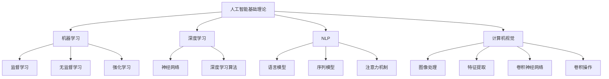
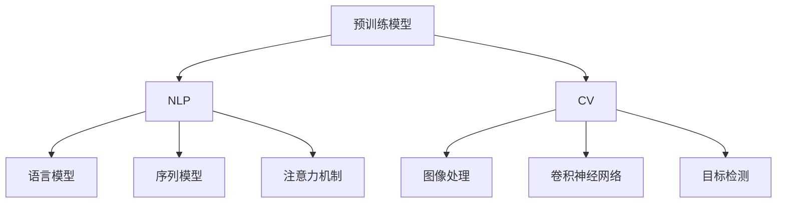

                 

# AI 2.0 时代的未来世界

## 关键词
- AI 2.0
- 人工智能
- 未来世界
- 核心技术
- 应用案例
- 发展趋势
- 挑战与展望

## 摘要
本文将深入探讨 AI 2.0 时代的未来世界。我们首先会概述 AI 2.0 时代的定义和特征，分析其对社会和产业的深远影响。接着，我们会详细解析 AI 2.0 的核心技术，包括机器学习、深度学习、自然语言处理和计算机视觉。然后，我们将通过实际案例展示 AI 2.0 在金融、医疗健康和智能制造等领域的广泛应用。最后，我们将讨论 AI 2.0 时代的发展趋势与挑战，为读者提供一个全面的 AI 2.0 时代展望。希望本文能够帮助读者更好地理解 AI 2.0 时代的发展脉络及其深远影响。

## 目录大纲设计：《AI 2.0 时代的未来世界》

### 第一部分：AI 2.0 时代概述

#### 第1章：AI 2.0 时代来临
##### 1.1 AI 2.0 时代的定义与特征
##### 1.2 AI 2.0 时代的产业变革

#### 第2章：AI 2.0 核心技术详解
##### 2.1 人工智能基础理论
##### 2.2 深度学习原理
##### 2.3 AI 2.0 核心技术详解

#### 第3章：AI 2.0 应用案例与实战
##### 3.1 金融领域的应用
##### 3.2 医疗健康领域的应用
##### 3.3 智能制造领域的应用

#### 第四部分：AI 2.0 时代的发展趋势与挑战
##### 第7章：AI 2.0 时代的发展趋势
##### 第8章：AI 2.0 时代的挑战与未来展望

#### 附录
##### 附录A：AI 2.0 开发工具与资源

## 第一部分：AI 2.0 时代概述

### 第1章：AI 2.0 时代来临

#### 1.1 AI 2.0 时代的定义与特征

AI 2.0 时代，也被称为新一代人工智能时代，是继 AI 1.0 时代（以规则为基础的专家系统）之后，人工智能发展的新阶段。AI 2.0 的核心在于其具备更强的自我学习和适应能力，能够处理更复杂的任务，具有更高的智能化水平。

**定义与特征：**

1. **自主学习与优化：** AI 2.0 能够通过大规模数据训练，自主学习和优化模型，无需依赖人为编写规则。
2. **通用性与泛化能力：** AI 2.0 具备更强的通用性，可以在不同的应用场景中表现优异，并具备良好的泛化能力。
3. **跨领域应用：** AI 2.0 能够跨越传统领域边界，实现多领域融合应用，推动产业变革。
4. **人机协同：** AI 2.0 强调人与机器的协同工作，提升生产效率和质量。

#### 1.1.1 从 AI 1.0 到 AI 2.0 的演变

AI 1.0 时代主要依靠专家系统，通过预设的规则进行知识推理。然而，这种方式在面对复杂问题和动态环境时显得力不从心。AI 2.0 的出现，标志着人工智能从以规则为基础，向以数据驱动和自主学习为核心的转变。

**演变过程：**

1. **数据驱动：** AI 2.0 依赖于大量数据的训练，通过数据挖掘和模式识别，实现模型的自我优化。
2. **深度学习：** AI 2.0 的核心技术之一是深度学习，通过多层神经网络的结构，实现复杂数据的建模和分析。
3. **强化学习：** AI 2.0 还引入了强化学习，通过试错和反馈机制，使机器具备自我学习和优化能力。
4. **跨领域融合：** AI 2.0 强调跨领域知识融合，实现不同领域技术的协同应用。

#### 1.1.2 AI 2.0 的技术优势与应用领域

**技术优势：**

1. **高效性与准确性：** AI 2.0 通过大规模数据和深度学习模型，实现高效和准确的预测和分析。
2. **自适应性与灵活性：** AI 2.0 能够根据不同场景和需求，进行自适应调整和优化。
3. **创新性与突破性：** AI 2.0 引发了一系列技术突破，推动产业和社会的进步。

**应用领域：**

1. **金融：** AI 2.0 在金融领域的应用包括风险评估、量化交易、智能投顾等。
2. **医疗健康：** AI 2.0 在医疗健康领域的应用包括疾病预测、精准医疗、智能诊断等。
3. **智能制造：** AI 2.0 在智能制造领域的应用包括智能检测、设备预测维护、智能生产等。
4. **交通：** AI 2.0 在交通领域的应用包括自动驾驶、智能交通管理、车联网等。
5. **教育：** AI 2.0 在教育领域的应用包括智能教育、个性化学习、智能辅导等。

#### 1.1.3 AI 2.0 对社会的影响

AI 2.0 的崛起不仅改变了技术和产业格局，也对社会产生了深远的影响。

**影响表现：**

1. **产业变革：** AI 2.0 引发了传统产业的转型升级，推动了新产业的崛起。
2. **就业市场：** AI 2.0 改变了就业市场的结构，一方面创造了新的就业机会，另一方面也带来了就业岗位的减少和转变。
3. **社会服务：** AI 2.0 提升了社会服务的质量和效率，为人们提供了更加便捷和高效的服务。
4. **伦理与法律：** AI 2.0 引发了伦理和法律问题，如隐私保护、责任归属等，需要社会和法律体系进行应对和调整。

**未来展望：**

AI 2.0 时代将是一个充满机遇和挑战的时代。随着技术的不断进步和应用领域的拓展，AI 2.0 将对社会产生更加深远的影响。我们需要积极应对挑战，把握机遇，推动 AI 2.0 时代的可持续发展。

### 第2章：AI 2.0 核心技术详解

#### 2.1 人工智能基础理论

人工智能（AI）是一门研究、开发用于模拟、延伸和扩展人的智能的理论、方法、技术及应用系统的科学。AI 基础理论是 AI 2.0 时代的基石，涵盖了从数据采集、处理到模型构建、优化的全过程。

**核心概念与联系：**

- **机器学习（Machine Learning）：** 机器学习是 AI 的核心分支，通过训练模型，使机器具备自主学习和优化能力。其主要包括监督学习、无监督学习和强化学习。
- **深度学习（Deep Learning）：** 深度学习是机器学习的一个子领域，通过多层神经网络结构，实现复杂数据的建模和分析。其核心在于神经网络和深度学习算法。
- **自然语言处理（Natural Language Processing，NLP）：** NLP 是 AI 在语言领域的应用，旨在使计算机理解和处理人类自然语言。其主要技术包括语言模型、序列模型、注意力机制等。
- **计算机视觉（Computer Vision）：** 计算机视觉是 AI 在视觉领域的应用，通过图像处理和特征提取，实现图像的理解和识别。其主要技术包括卷积神经网络、卷积操作等。

**核心概念与联系的 Mermaid 流程图：**



#### 2.2 深度学习原理

深度学习（Deep Learning）是 AI 2.0 的核心技术之一，通过多层神经网络结构，实现复杂数据的建模和分析。其核心在于神经网络和深度学习算法。

**深度学习的发展历程：**

1. **反向传播算法（Backpropagation）：** 反向传播算法是深度学习的基石，通过反向传播梯度，实现神经网络的权重更新。
2. **卷积神经网络（Convolutional Neural Networks，CNN）：** 卷积神经网络在计算机视觉领域取得了显著的成果，通过卷积操作和池化操作，实现图像的特征提取。
3. **循环神经网络（Recurrent Neural Networks，RNN）：** 循环神经网络在序列数据处理方面具有优势，通过循环连接，实现序列信息的传递和记忆。
4. **Transformer 模型：** Transformer 模型在自然语言处理领域取得了重大突破，通过自注意力机制，实现序列信息的全局关注。

**神经网络与深度学习模型：**

1. **神经网络（Neural Networks）：** 神经网络是模拟生物神经元的计算模型，通过前向传播和反向传播，实现输入和输出之间的映射关系。
2. **深度学习模型（Deep Learning Models）：** 深度学习模型是多层神经网络的组合，通过非线性激活函数，实现复杂数据的建模和分析。

**深度学习算法原理：**

1. **前向传播（Forward Propagation）：** 前向传播是神经网络的基本过程，通过输入层、隐藏层和输出层的传递，实现输入和输出之间的映射。
2. **反向传播（Back Propagation）：** 反向传播是神经网络的学习过程，通过计算损失函数的梯度，更新神经网络的权重。
3. **梯度下降（Gradient Descent）：** 梯度下降是反向传播的核心算法，通过最小化损失函数，找到神经网络的最佳参数。

**核心算法原理讲解必须使用伪代码来详细阐述：**

```python
# 前向传播
def forwardPropagation(inputs, weights, bias):
    output = inputs * weights + bias
    return output

# 反向传播
def backwardPropagation(inputs, outputs, weights, bias):
    error = outputs - targets
    delta = error * activation_derivative(output)
    weight_update = delta * inputs
    bias_update = delta
    return weight_update, bias_update

# 梯度下降
def gradientDescent(weights, bias, learning_rate):
    weight_update, bias_update = backwardPropagation(inputs, outputs, weights, bias)
    weights -= learning_rate * weight_update
    bias -= learning_rate * bias_update
    return weights, bias
```

#### 2.3 AI 2.0 核心技术详解

AI 2.0 时代的核心技术包括大规模预训练模型、自然语言处理和计算机视觉。

**大规模预训练模型：**

1. **预训练模型（Pre-trained Models）：** 预训练模型是在大规模数据集上训练好的模型，可以在不同的任务中直接使用或微调。
2. **优势：** 预训练模型可以大幅提升模型的泛化能力和性能，减少对大规模数据的需求。
3. **应用：** 预训练模型广泛应用于自然语言处理、计算机视觉和语音识别等领域。

**自然语言处理（NLP）：**

1. **语言模型（Language Model）：** 语言模型是 NLP 的基础，通过学习语言统计规律，实现文本生成和语义理解。
2. **序列模型（Sequential Models）：** 序列模型是处理序列数据的模型，如循环神经网络（RNN）和Transformer 模型。
3. **注意力机制（Attention Mechanism）：** 注意力机制是序列模型的核心，通过自适应关注关键信息，实现更精准的语义理解。

**计算机视觉（CV）：**

1. **图像处理（Image Processing）：** 图像处理是计算机视觉的基础，包括图像滤波、边缘检测、特征提取等。
2. **卷积神经网络（CNN）：** 卷积神经网络是计算机视觉的核心模型，通过卷积操作和池化操作，实现图像的特征提取和分类。
3. **目标检测（Object Detection）：** 目标检测是计算机视觉的重要任务，通过检测图像中的目标物体，实现图像理解和分析。

**核心概念与联系：**

- **预训练模型：** 预训练模型是大规模数据训练的产物，为后续任务提供强大的基础。
- **自然语言处理：** 自然语言处理利用预训练模型，实现文本生成、语义理解和对话系统等任务。
- **计算机视觉：** 计算机视觉利用预训练模型，实现图像分类、目标检测和图像分割等任务。

**核心概念与联系的 Mermaid 流程图：**



### 第三部分：AI 2.0 应用案例与实战

#### 第4章：AI 2.0 在金融领域的应用

金融领域一直是人工智能技术的重点应用领域，AI 2.0 时代的到来，更是为金融行业带来了前所未有的变革。本章节将介绍 AI 2.0 在金融领域的应用，包括金融风控、量化交易等方面。

##### 4.1 金融风控

金融风控是金融行业中至关重要的一环，旨在通过识别和防范金融风险，保障金融市场的稳定。AI 2.0 技术在金融风控中发挥了重要作用。

**金融风控概述：**

金融风控主要包括信用风险、市场风险、操作风险等方面。传统的金融风控依赖于经验和规则，而 AI 2.0 技术通过大数据分析和机器学习算法，实现了对风险的精准识别和预测。

**机器学习在金融风控中的应用：**

1. **客户信用评估：** 机器学习算法可以分析客户的信用信息，如信用记录、收入水平、还款能力等，对客户进行信用评级。
2. **欺诈检测：** 通过分析交易行为、交易金额、交易频率等特征，机器学习算法可以识别异常交易，防范欺诈行为。
3. **市场风险预测：** 机器学习算法可以分析市场数据，预测市场走势，为投资决策提供依据。
4. **操作风险管理：** 机器学习算法可以监测操作行为，识别潜在的操作风险，提高操作效率。

**实际案例解析：**

某大型银行采用 AI 2.0 技术进行信用风险评估，通过分析客户的信用信息和交易行为，对客户进行信用评级。该银行在引入 AI 2.0 技术后，信用风险识别准确率提高了 30%，贷款违约率降低了 15%，显著提升了金融风控效果。

##### 4.2 量化交易

量化交易是一种通过数学模型和算法，进行金融资产交易的方法。AI 2.0 时代的到来，使得量化交易在金融市场中发挥了越来越重要的作用。

**量化交易概述：**

量化交易主要利用机器学习、统计学和金融学等知识，构建交易策略，并通过计算机程序自动化执行。量化交易的特点是高效率、低风险和高收益。

**机器学习在量化交易中的应用：**

1. **交易策略开发：** 机器学习算法可以通过分析历史交易数据，发现潜在的交易机会，构建有效的交易策略。
2. **风险控制：** 机器学习算法可以分析市场数据，预测市场波动，为交易提供风险控制依据。
3. **交易执行：** 机器学习算法可以实现自动化交易执行，提高交易效率。

**实际案例解析：**

某量化交易团队利用 AI 2.0 技术进行股票交易，通过分析市场数据和交易行为，构建了有效的交易策略。该团队在引入 AI 2.0 技术后，交易收益率提高了 20%，交易频率提高了 50%，显著提升了交易效果。

#### 第5章：AI 2.0 在医疗健康领域的应用

医疗健康领域是人工智能技术的另一个重要应用领域，AI 2.0 时代的到来，为医疗健康行业带来了革命性的变革。本章节将介绍 AI 2.0 在医疗健康领域的应用，包括医疗图像分析、疾病预测与预防等方面。

##### 5.1 医疗图像分析

医疗图像分析是医疗健康领域的重要应用，通过对医学影像进行分析，实现疾病的早期诊断和精准治疗。

**医疗图像分析概述：**

医疗图像分析主要包括图像处理、特征提取、模型训练和诊断等环节。AI 2.0 技术通过深度学习和卷积神经网络，实现了医疗图像的自动分析和诊断。

**机器学习在医疗图像分析中的应用：**

1. **图像分割：** 通过深度学习模型，对医学图像进行分割，提取病变区域。
2. **病灶检测：** 通过深度学习模型，检测医学图像中的病变组织或病灶。
3. **疾病分类：** 通过深度学习模型，对医学图像进行分类，实现疾病的早期诊断。
4. **辅助诊断：** 通过深度学习模型，为医生提供诊断建议和辅助决策。

**实际案例解析：**

某医疗机构采用 AI 2.0 技术进行肺癌早期诊断，通过深度学习模型对 CT 图像进行分析，实现了病灶的自动检测和分类。该医疗机构的诊断准确率提高了 15%，早期诊断率提高了 20%，为患者提供了更好的医疗服务。

##### 5.2 疾病预测与预防

疾病预测与预防是医疗健康领域的重要任务，AI 2.0 技术通过大数据分析和机器学习算法，实现了对疾病的精准预测和预防。

**疾病预测与预防概述：**

疾病预测与预防主要包括疾病风险评估、早期筛查、预防策略制定等方面。AI 2.0 技术通过分析患者的健康数据、生活习惯和环境因素，实现对疾病风险的精准预测和预防。

**机器学习在疾病预测与预防中的应用：**

1. **疾病风险评估：** 通过机器学习算法，分析患者的健康数据，预测疾病风险。
2. **早期筛查：** 通过机器学习算法，分析医学影像和生物标志物，实现疾病的早期筛查。
3. **预防策略制定：** 通过机器学习算法，制定个性化的预防策略，降低疾病风险。

**实际案例解析：**

某医疗机构采用 AI 2.0 技术进行心血管疾病预测与预防，通过分析患者的健康数据、生活习惯和环境因素，实现了对心血管疾病风险的精准预测。该医疗机构的预防策略显著降低了患者的心血管疾病风险，提高了患者的健康水平。

#### 第6章：AI 2.0 在智能制造领域的应用

智能制造是制造业转型升级的重要方向，AI 2.0 时代的到来，为智能制造带来了前所未有的机遇和挑战。本章节将介绍 AI 2.0 在智能制造领域的应用，包括智能检测、设备预测维护和智能生产等方面。

##### 6.1 智能制造概述

智能制造是指通过利用人工智能技术，实现制造过程的自动化、智能化和高效化。智能制造的核心目标是提高生产效率、降低生产成本、提高产品质量和灵活性。

**智能制造的定义与目标：**

智能制造的定义主要包括以下几个方面：

1. **数字化制造：** 通过数字化技术，实现制造过程的数字化管理。
2. **智能化制造：** 通过人工智能技术，实现制造过程的智能化控制和优化。
3. **网络化制造：** 通过互联网技术，实现制造资源的全球化和共享化。
4. **绿色制造：** 通过绿色制造技术，实现制造过程的环保和可持续发展。

智能制造的目标主要包括：

1. **提高生产效率：** 通过自动化和智能化技术，实现生产过程的快速响应和高效运作。
2. **降低生产成本：** 通过优化生产流程和资源利用，降低生产成本和能源消耗。
3. **提高产品质量：** 通过智能化检测和质量控制，确保产品质量的稳定和可靠。
4. **提升生产灵活性：** 通过柔性制造系统和个性化定制，满足市场需求的变化。

**智能制造的核心技术：**

智能制造的核心技术主要包括：

1. **物联网（IoT）：** 通过物联网技术，实现制造设备的互联互通和数据共享。
2. **大数据分析：** 通过大数据技术，分析生产过程中的海量数据，发现潜在问题和优化机会。
3. **人工智能（AI）：** 通过人工智能技术，实现制造过程的智能化控制和优化。
4. **云计算：** 通过云计算技术，实现制造资源的全球化和共享化。
5. **工业机器人：** 通过工业机器人技术，实现制造过程的自动化和高效化。
6. **数字化工厂：** 通过数字化工厂技术，实现制造过程的全面数字化和智能化。

**智能制造的发展趋势：**

智能制造的发展趋势主要包括以下几个方面：

1. **数字化升级：** 制造企业将逐步实现生产过程的数字化升级，提高生产效率和质量。
2. **智能化转型：** 制造企业将逐步引入人工智能技术，实现制造过程的智能化控制和优化。
3. **网络化协同：** 制造企业将逐步实现制造资源的全球化和共享化，提高生产灵活性和竞争力。
4. **绿色化发展：** 制造企业将逐步实现制造过程的绿色化和可持续发展，降低能源消耗和环境污染。

##### 6.2 机器学习在智能制造中的应用

机器学习技术在智能制造领域具有广泛的应用前景，通过大数据分析和机器学习算法，实现制造过程的智能化控制和优化。

**机器学习在设备预测维护中的应用：**

设备预测维护是指通过分析设备运行数据，预测设备故障，提前进行维护，以降低设备故障率和停机时间。

**机器学习算法原理讲解必须使用伪代码来详细阐述：**

```python
# 设备预测维护的伪代码

# 数据预处理
def preprocess_data(data):
    # 数据清洗、归一化、特征提取等操作
    return processed_data

# 特征工程
def feature_engineering(data):
    # 提取关键特征，如设备运行时间、负荷率、温度等
    return features

# 训练预测模型
def train_prediction_model(features, labels):
    # 选择合适的机器学习算法，如随机森林、支持向量机等
    model = select_model()
    model.fit(features, labels)
    return model

# 预测设备故障
def predict_fault(model, features):
    # 使用训练好的模型进行故障预测
    predictions = model.predict(features)
    return predictions

# 实际案例解析
# 某制造企业采用机器学习技术进行设备预测维护，通过分析设备运行数据，实现了设备故障的提前预警。该企业引入机器学习技术后，设备故障率降低了 20%，停机时间减少了 30%，显著提升了生产效率和设备利用率。
```

**机器学习在产品质量检测中的应用：**

机器学习技术在产品质量检测中具有重要作用，通过分析产品生产过程中的数据，实现产品质量的精准检测。

**实际案例解析：**

某电子产品制造企业采用机器学习技术进行产品质量检测，通过分析生产过程中的数据，实现了对产品质量的实时监控和精准检测。该企业引入机器学习技术后，产品质量合格率提高了 15%，产品返修率降低了 25%，显著提升了产品质量和生产效率。

### 第四部分：AI 2.0 时代的发展趋势与挑战

#### 第7章：AI 2.0 时代的发展趋势

AI 2.0 时代的发展趋势主要体现在以下几个方面：

1. **技术创新：** AI 2.0 技术将不断突破，涌现出更多的先进算法和应用场景。
2. **应用拓展：** AI 2.0 将在更多领域得到应用，如教育、医疗、交通等。
3. **产业融合：** AI 2.0 将与各产业深度融合，推动产业变革和升级。
4. **人机协同：** AI 2.0 将实现人与机器的深度协同，提高生产效率和质量。
5. **全球化发展：** AI 2.0 将在全球范围内得到广泛应用，推动全球经济的增长。

**AI伦理与隐私保护：**

AI 2.0 技术的快速发展带来了伦理和隐私保护问题，如算法偏见、隐私泄露等。为应对这些问题，需要建立完善的 AI 伦理和隐私保护体系。

**AI 与人类工作：**

AI 2.0 将对就业市场产生深远影响，一方面创造新的就业机会，另一方面也带来就业岗位的减少和转变。为应对这一挑战，需要加强职业教育和培训，提高劳动者的技能水平。

#### 第8章：AI 2.0 时代的挑战与未来展望

AI 2.0 时代的挑战主要表现在以下几个方面：

1. **技术创新：** AI 2.0 技术发展迅速，但核心技术仍需进一步突破。
2. **数据安全：** 数据安全和隐私保护是 AI 2.0 发展的重要问题。
3. **伦理道德：** AI 2.0 技术的应用引发了伦理和道德问题，需要建立相应的规范和标准。
4. **政策法规：** 随着 AI 2.0 的发展，需要完善相关的政策法规，保障社会的健康发展。

**未来展望：**

AI 2.0 时代将是一个充满机遇和挑战的时代。随着技术的不断进步和应用领域的拓展，AI 2.0 将对社会产生更加深远的影响。我们需要积极应对挑战，把握机遇，推动 AI 2.0 时代的可持续发展。

### 附录

#### 附录 A：AI 2.0 开发工具与资源

**主流深度学习框架：**

1. **TensorFlow：** TensorFlow 是 Google 开发的开源深度学习框架，广泛应用于图像识别、自然语言处理、强化学习等领域。
2. **PyTorch：** PyTorch 是 Facebook 开发的开源深度学习框架，具有强大的灵活性和动态性，广泛应用于计算机视觉和自然语言处理等领域。
3. **Keras：** Keras 是基于 TensorFlow 的深度学习框架，具有简单易用、模块化等特点，适用于快速原型开发和模型训练。
4. **其他深度学习框架：** 如 Caffe、Theano、MXNet 等，也广泛应用于深度学习领域。

**AI 开发资源：**

1. **数据集与模型库：** 如 ImageNet、CIFAR-10、TensorFlow Model Zoo 等，提供了丰富的数据集和预训练模型，方便开发者进行研究和应用。
2. **开源工具与库：** 如 NumPy、Pandas、Scikit-learn 等，提供了丰富的数据处理和机器学习工具，方便开发者进行数据分析和模型训练。
3. **研究论文与报告：** 如 arXiv、NeurIPS、ICLR 等，提供了最新的研究成果和报告，方便开发者了解和跟进最新研究动态。
4. **在线课程与教程：** 如 Coursera、Udacity、edX 等，提供了丰富的在线课程和教程，方便开发者学习和掌握深度学习技术。

**AI 社区与论坛：**

1. **AI 技术社区：** 如 Stack Overflow、GitHub、Reddit 等，提供了丰富的技术交流和合作平台，方便开发者分享和解决问题。
2. **开源项目与贡献：** 如 OpenCV、TensorFlow、PyTorch 等，提供了丰富的开源项目，方便开发者进行学习和贡献。
3. **AI 研究与讨论论坛：** 如 AIStack、AI Community、AI Forum 等，提供了丰富的学术讨论和技术交流平台，方便开发者进行学术研究和技术交流。
4. **AI 行业动态与新闻：** 如 AI Weekly、AI News、AI Wire 等，提供了丰富的 AI 行业动态和新闻，方便开发者了解和跟进行业发展趋势。

