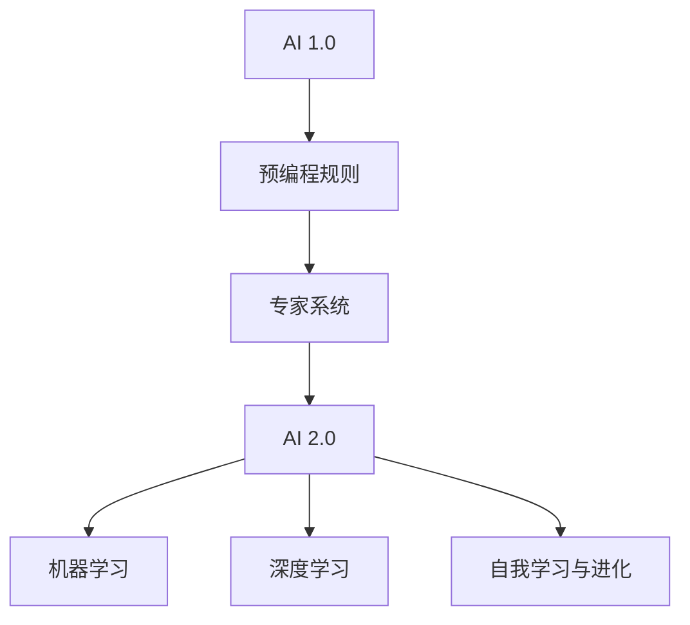
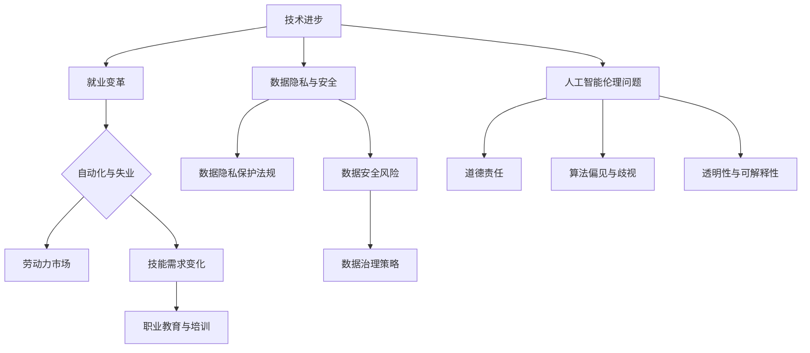

                 

# 《AI 2.0 时代的未来社会》

> 关键词：AI 2.0、未来社会、技术趋势、社会挑战、伦理问题

> 摘要：随着AI 2.0技术的迅猛发展，它正在深刻地改变着我们的社会。本文将从AI 2.0的基本概念与背景、核心技术、应用场景、社会挑战与伦理问题、未来展望以及跨界合作等方面，系统地探讨AI 2.0时代对未来的影响。

## 第一部分: AI 2.0 时代的基本概念与背景

### 第1章: AI 2.0 时代概述

#### 1.1 AI 2.0 的定义与特点

AI 2.0，也被称作下一代人工智能，是相对于第一代人工智能（AI 1.0）而言的。AI 1.0主要依赖于规则和预编程算法，而AI 2.0则更多地依赖于机器学习和深度学习，能够从数据中自主学习，并具有更高的自适应性和灵活性。

- **AI 2.0 的定义**：AI 2.0是指能够实现自我学习和自我进化的人工智能系统，能够通过数据驱动的方式实现知识的获取、理解和应用。

- **AI 2.0 的特点**：与AI 1.0相比，AI 2.0具有以下特点：
  - **自主学习能力**：能够从大量数据中自主学习，不需要人为设定规则。
  - **高度自适应**：能够根据环境和需求的变化进行自适应调整。
  - **跨领域融合**：能够整合多领域的知识和技术，实现跨领域的创新。

- **AI 2.0 与传统 AI 的区别**：AI 2.0与传统AI的主要区别在于学习方式、应用范围和智能化程度。传统AI依赖于预编程的规则和算法，而AI 2.0则依赖于数据驱动的方式，能够实现自我学习和自我进化。

#### 1.2 AI 2.0 时代的背景

AI 2.0 时代的背景可以追溯到人工智能的起源和发展。从20世纪50年代的人工智能理论提出，到20世纪80年代的专家系统，再到21世纪初的机器学习和深度学习，人工智能经历了数次重大的技术革新。以下是AI 2.0 时代背景的几个关键点：

- **人工智能的发展历程**：人工智能的发展历程可以分为三个阶段：理论探索阶段、应用探索阶段和快速发展阶段。AI 2.0正处于快速发展的阶段。

- **AI 2.0 时代的科技趋势**：大数据、云计算、物联网等技术的发展为AI 2.0提供了丰富的数据资源和计算能力，使得AI 2.0能够从海量数据中学习，实现更高级的智能化。

- **社会需求与变革**：随着社会的发展，人们对智能化、个性化的需求日益增长，这推动了AI 2.0技术的快速发展。同时，社会变革也为AI 2.0技术的发展提供了机遇和挑战。

#### 1.3 AI 2.0 对未来社会的影响

AI 2.0对未来社会的影响是全方位的，涵盖了经济、社会、科技等多个方面。

- **经济结构的变化**：AI 2.0将推动经济从传统产业向智能化、数字化方向转型，催生新的经济增长点。

- **劳动力市场的影响**：AI 2.0将改变劳动力市场的结构，部分工作可能会被自动化替代，但同时也会创造新的就业机会。

- **社会治理的挑战与机遇**：AI 2.0将为社会治理提供新的工具和手段，但也带来了数据隐私、算法偏见等挑战。

### 总结

AI 2.0时代的到来，预示着人工智能将进入一个全新的发展阶段。它不仅将推动科技的发展，还将深刻地影响我们的社会。在接下来的章节中，我们将进一步探讨AI 2.0的核心技术、应用场景以及社会挑战和伦理问题。

### Mermaid 流程图



在这个流程图中，我们可以看到AI 2.0的核心技术是如何从AI 1.0发展而来的，以及它们之间的联系和区别。

#### 1.1 AI 2.0 的定义与特点

- **AI 2.0 的定义**：AI 2.0是指能够实现自我学习和自我进化的人工智能系统，能够通过数据驱动的方式实现知识的获取、理解和应用。

- **AI 2.0 的特点**：与AI 1.0相比，AI 2.0具有以下特点：
  - **自主学习能力**：能够从大量数据中自主学习，不需要人为设定规则。
  - **高度自适应**：能够根据环境和需求的变化进行自适应调整。
  - **跨领域融合**：能够整合多领域的知识和技术，实现跨领域的创新。

- **AI 2.0 与传统 AI 的区别**：AI 2.0与传统AI的主要区别在于学习方式、应用范围和智能化程度。传统AI依赖于预编程的规则和算法，而AI 2.0则依赖于数据驱动的方式，能够实现自我学习和自我进化。

### 1.2 AI 2.0 时代的背景

AI 2.0 时代的背景可以追溯到人工智能的起源和发展。从20世纪50年代的人工智能理论提出，到20世纪80年代的专家系统，再到21世纪初的机器学习和深度学习，人工智能经历了数次重大的技术革新。以下是AI 2.0 时代背景的几个关键点：

- **人工智能的发展历程**：人工智能的发展历程可以分为三个阶段：理论探索阶段、应用探索阶段和快速发展阶段。AI 2.0正处于快速发展的阶段。

- **AI 2.0 时代的科技趋势**：大数据、云计算、物联网等技术的发展为AI 2.0提供了丰富的数据资源和计算能力，使得AI 2.0能够从海量数据中学习，实现更高级的智能化。

- **社会需求与变革**：随着社会的发展，人们对智能化、个性化的需求日益增长，这推动了AI 2.0技术的快速发展。同时，社会变革也为AI 2.0技术的发展提供了机遇和挑战。

### 1.3 AI 2.0 对未来社会的影响

AI 2.0对未来社会的影响是全方位的，涵盖了经济、社会、科技等多个方面。

- **经济结构的变化**：AI 2.0将推动经济从传统产业向智能化、数字化方向转型，催生新的经济增长点。

- **劳动力市场的影响**：AI 2.0将改变劳动力市场的结构，部分工作可能会被自动化替代，但同时也会创造新的就业机会。

- **社会治理的挑战与机遇**：AI 2.0将为社会治理提供新的工具和手段，但也带来了数据隐私、算法偏见等挑战。

### 数学模型和公式

在AI 2.0技术中，机器学习和深度学习是两个核心的概念。为了更好地理解这些技术，我们可以借助一些数学模型和公式来进行详细解释。

#### 机器学习的数学基础

机器学习的核心在于通过学习数据中的规律，实现对未知数据的预测或分类。一个基本的机器学习模型可以表示为：

\[ \hat{y} = f(W \cdot x + b) \]

其中：
- \( \hat{y} \) 是模型的预测输出；
- \( f \) 是激活函数，如 sigmoid、ReLU 等；
- \( W \) 是权重矩阵；
- \( x \) 是输入特征向量；
- \( b \) 是偏置项。

这个公式描述了一个前向传播的过程，即输入特征通过权重矩阵和偏置项传递到激活函数，最终得到预测输出。

#### 深度学习的原理

深度学习是机器学习的扩展，它通过构建多层神经网络来模拟人类大脑的决策过程。一个基本的深度学习模型可以表示为：

\[ \hat{y} = f(L) \]

其中：
- \( L \) 是网络的最后一层输出；
- \( f \) 是激活函数，如 sigmoid、ReLU 等；
- \( L = f(W^{(L-1)} \cdot L^{(L-1)} + b^{(L-1)}) \)

这个公式描述了一个多层神经网络的前向传播过程。每一层输出都通过激活函数进行处理，最终得到网络的预测输出。

#### 举例说明

假设我们有一个简单的深度学习模型，用于对图像进行分类。输入图像是一个 \( 28 \times 28 \) 的像素矩阵，我们可以将其表示为一个 \( 784 \) 维的向量。模型的输出是一个 \( 10 \) 维的向量，表示图像属于 \( 10 \) 个类别中的一个。

```latex
\text{输入特征向量} x = [x_1, x_2, ..., x_{784}]
\text{权重矩阵} W = [W_1, W_2, ..., W_{10}]
\text{偏置项} b = [b_1, b_2, ..., b_{10}]
\text{激活函数} f(x) = \text{ReLU}(x)
\text{预测输出} \hat{y} = f(W \cdot x + b)
```

在这个例子中，模型的输入是一个 \( 784 \) 维的向量，通过多层神经网络的处理，最终得到一个 \( 10 \) 维的预测输出向量。这个输出向量中的每个元素表示图像属于相应类别的概率。

通过这个例子，我们可以看到深度学习模型是如何通过数据驱动的方式进行学习和预测的。在接下来的章节中，我们将进一步探讨AI 2.0的核心技术，包括机器学习和深度学习的具体实现和应用场景。

### 第2章: AI 2.0 核心技术

#### 2.1 机器学习基础

机器学习是AI 2.0时代的基础技术之一，它使得计算机能够从数据中自动学习和改进。要理解机器学习，我们需要从以下几个方面入手：

##### 1. 机器学习的定义与类型

- **定义**：机器学习是指通过算法从数据中学习规律，并对未知数据进行预测或分类的过程。

- **类型**：根据学习方式和目标不同，机器学习可以分为以下几种类型：
  - **监督学习**：有标签的训练数据，通过学习数据的特征和标签关系，实现对未知数据的预测。
  - **无监督学习**：没有标签的训练数据，通过发现数据中的结构或模式，对数据进行分类或聚类。
  - **半监督学习**：既有标签数据，又有未标注的数据，通过结合两种数据进行学习。
  - **强化学习**：通过与环境的交互，学习最优策略，以最大化奖励。

##### 2. 常见的机器学习算法

- **线性回归**：通过建立输入和输出之间的线性关系，预测连续值。
  ```mermaid
  graph TD
      A[输入特征] --> B[权重矩阵]
      B --> C[偏置项]
      C --> D[线性变换]
      D --> E[激活函数]
      E --> F[预测值]
  ```

- **逻辑回归**：通过建立输入和输出之间的非线性关系，预测概率。
  ```mermaid
  graph TD
      A[输入特征] --> B[权重矩阵]
      B --> C[偏置项]
      C --> D[线性变换]
      D --> E[sigmoid激活函数]
      E --> F[预测概率]
  ```

- **决策树**：通过递归划分特征空间，构建决策树模型。
  ```mermaid
  graph TD
      A[根节点] --> B{特征1}
      B --> C{是} --> D[特征2]
      B --> E{否} --> F[特征3]
      D --> G{是} --> H[输出]
      E --> I{否} --> J[输出]
  ```

- **支持向量机（SVM）**：通过最大化分类间隔，构建最优分类边界。
  ```mermaid
  graph TD
      A[数据点] --> B[决策边界]
      B --> C[支持向量]
      C --> D[分类结果]
  ```

- **神经网络**：通过多层感知器构建神经网络，模拟人类大脑的决策过程。
  ```mermaid
  graph TD
      A[输入层] --> B[隐藏层]
      B --> C[输出层]
      C --> D[预测结果]
  ```

##### 3. 机器学习的数学基础

机器学习的核心在于通过优化目标函数来找到最佳的模型参数。常用的优化方法有梯度下降法、随机梯度下降法、批量梯度下降法等。

- **梯度下降法**：通过迭代更新模型参数，使目标函数逐渐减小。
  ```mermaid
  graph TD
      A[参数] --> B[损失函数]
      B --> C[梯度]
      C --> D[更新参数]
      D --> E[迭代]
  ```

- **随机梯度下降法**：在每个训练样本上更新一次参数，适用于样本量较大的情况。
  ```mermaid
  graph TD
      A[参数] --> B[样本]
      B --> C[损失函数]
      C --> D[梯度]
      D --> E[更新参数]
  ```

- **批量梯度下降法**：在每个训练样本上更新一次参数，适用于样本量较小的情况。
  ```mermaid
  graph TD
      A[参数] --> B[样本集]
      B --> C[损失函数]
      C --> D[梯度]
      D --> E[更新参数]
  ```

#### 2.2 深度学习原理

深度学习是机器学习的扩展，它通过构建多层神经网络来模拟人类大脑的决策过程。深度学习的关键在于如何有效地训练多层神经网络，使其能够从数据中学习到有用的特征。

##### 1. 深度学习的基本概念

- **神经网络**：神经网络是由多个神经元（节点）组成的计算模型，每个神经元都与其他神经元相连，并通过权重进行信息传递。

- **多层感知器**：多层感知器是神经网络的基本单元，它由输入层、隐藏层和输出层组成。输入层接收外部输入，隐藏层对输入数据进行特征提取，输出层生成预测结果。

- **激活函数**：激活函数用于对神经网络的输出进行非线性变换，常用的激活函数有 sigmoid、ReLU 等。

- **前向传播与反向传播**：前向传播是指将输入数据通过神经网络传递到输出层，计算预测结果；反向传播是指根据预测结果和真实标签，计算损失函数的梯度，并更新网络参数。

##### 2. 神经网络的结构与原理

- **网络结构**：一个基本的深度学习模型可以表示为：
  ```mermaid
  graph TD
      A[输入层] --> B[隐藏层1]
      B --> C[隐藏层2]
      C --> D[隐藏层3]
      D --> E[输出层]
  ```

- **工作原理**：深度学习模型的工作原理可以概括为以下步骤：
  1. 前向传播：输入数据通过输入层传递到隐藏层，经过激活函数处理后，传递到下一层，直到输出层生成预测结果。
  2. 反向传播：计算输出层预测结果与真实标签之间的损失，通过反向传播计算损失函数的梯度，并更新网络参数。
  3. 重复迭代：不断重复前向传播和反向传播，直到网络收敛或达到预设的迭代次数。

##### 3. 深度学习算法的优化

- **优化算法**：为了提高深度学习模型的训练效率，常用的优化算法有梯度下降法、Adam优化器等。
  - **梯度下降法**：通过迭代更新模型参数，使损失函数逐渐减小。
  - **Adam优化器**：结合了梯度下降法和动量法的优点，能够自适应调整学习率。

- **正则化方法**：为了防止过拟合，常用的正则化方法有 L1 正则化、L2 正则化等。
  - **L1 正则化**：在损失函数中添加 \( \lambda \cdot \sum_{i} |w_i| \) 的项，惩罚模型参数的绝对值。
  - **L2 正则化**：在损失函数中添加 \( \lambda \cdot \sum_{i} w_i^2 \) 的项，惩罚模型参数的平方。

- **批归一化**：通过将每个特征值归一化到相同范围，加快训练过程，提高模型性能。

#### 2.3 自然语言处理与计算机视觉

自然语言处理（NLP）和计算机视觉（CV）是深度学习的两个重要应用领域，它们分别处理文本和图像数据。

##### 1. 自然语言处理技术

- **文本分类**：将文本数据分类到不同的类别，如情感分析、主题分类等。
  ```mermaid
  graph TD
      A[文本数据] --> B[NLP模型]
      B --> C[分类结果]
  ```

- **文本生成**：根据输入的文本或提示，生成新的文本，如自动摘要、机器翻译等。
  ```mermaid
  graph TD
      A[文本输入] --> B[NLP模型]
      B --> C[文本输出]
  ```

- **情感分析**：分析文本中的情感倾向，如正面、负面、中性等。
  ```mermaid
  graph TD
      A[文本数据] --> B[NLP模型]
      B --> C[情感分析结果]
  ```

##### 2. 计算机视觉技术

- **图像分类**：将图像分类到不同的类别，如物体识别、场景分类等。
  ```mermaid
  graph TD
      A[图像数据] --> B[CV模型]
      B --> C[分类结果]
  ```

- **目标检测**：在图像中检测出特定的目标，并标注出目标的位置。
  ```mermaid
  graph TD
      A[图像数据] --> B[CV模型]
      B --> C[目标检测结果]
  ```

- **图像生成**：根据输入的文本或提示，生成新的图像，如艺术创作、图像修复等。
  ```mermaid
  graph TD
      A[文本输入] --> B[CV模型]
      B --> C[图像输出]
  ```

##### 3. 多模态学习与融合

多模态学习是指同时处理多种类型的数据，如文本、图像、音频等，以实现更高级的智能化应用。

- **多模态分类**：将多种类型的数据进行分类，如视频分类、多模态情感分析等。
  ```mermaid
  graph TD
      A[多模态数据] --> B[多模态模型]
      B --> C[分类结果]
  ```

- **多模态生成**：根据输入的多种类型的数据，生成新的多模态数据，如视频生成、音乐生成等。
  ```mermaid
  graph TD
      A[多模态输入] --> B[多模态模型]
      B --> C[多模态输出]
  ```

#### 2.4 AI 2.0 应用场景

AI 2.0技术在各个领域都有着广泛的应用，下面我们分别介绍AI 2.0在医疗健康、金融和教育领域的应用。

##### 1. AI 在医疗健康中的应用

AI 在医疗健康领域的应用正在迅速发展，其潜力包括但不限于以下方面：

- **医疗数据分析**：通过分析大量的医疗数据，AI 可以帮助医生发现疾病的早期迹象，制定个性化的治疗方案。

  ```mermaid
  graph TD
      A[医疗数据] --> B[AI模型]
      B --> C[数据分析结果]
  ```

- **智能诊断与辅助治疗**：AI 可以通过学习大量的病例数据，帮助医生进行疾病诊断，并提供治疗建议。

  ```mermaid
  graph TD
      A[病例数据] --> B[AI模型]
      B --> C[诊断结果]
  ```

- **健康管理的创新**：AI 可以帮助用户进行健康监测和管理，提供个性化的健康建议。

  ```mermaid
  graph TD
      A[健康数据] --> B[AI模型]
      B --> C[健康管理建议]
  ```

##### 2. AI 在金融领域的应用

AI 在金融领域的应用正在改变传统的金融业务模式，提升效率，创造新的业务机会：

- **风险管理**：AI 可以通过分析大量的市场数据，预测市场趋势，帮助金融机构进行风险管理和投资决策。

  ```mermaid
  graph TD
      A[市场数据] --> B[AI模型]
      B --> C[风险预测结果]
  ```

- **金融市场预测**：AI 可以通过学习历史市场数据，预测股票、期货等金融产品的价格走势。

  ```mermaid
  graph TD
      A[市场数据] --> B[AI模型]
      B --> C[预测结果]
  ```

- **个性化金融服务**：AI 可以根据用户的行为和偏好，提供个性化的金融服务，提升用户体验。

  ```mermaid
  graph TD
      A[用户数据] --> B[AI模型]
      B --> C[个性化服务]
  ```

##### 3. AI 在教育与学习中的应用

AI 在教育领域的应用正在推动教育模式的变革，提供更加灵活、个性化的学习体验：

- **智能教育平台**：AI 可以帮助构建智能教育平台，为学生提供个性化的学习资源和辅导。

  ```mermaid
  graph TD
      A[学习数据] --> B[AI模型]
      B --> C[个性化学习资源]
  ```

- **个性化学习方案**：AI 可以根据学生的学习情况，提供个性化的学习方案，帮助学生更好地掌握知识。

  ```mermaid
  graph TD
      A[学习数据] --> B[AI模型]
      B --> C[个性化学习方案]
  ```

- **教育资源的优化**：AI 可以通过分析教育资源的使用情况，优化教育资源的分配，提高教育资源的利用效率。

  ```mermaid
  graph TD
      A[教育资源] --> B[AI模型]
      B --> C[优化建议]
  ```

### 总结

AI 2.0 核心技术包括机器学习、深度学习、自然语言处理和计算机视觉等，这些技术正在深刻地改变着我们的生活方式和社会结构。在接下来的章节中，我们将进一步探讨AI 2.0 社会挑战与伦理问题，以及如何在面对这些挑战时，确保AI 2.0 的发展能够造福全人类。

### 数学模型和公式

在AI 2.0技术的深入应用中，数学模型和公式扮演着至关重要的角色。以下是一些关键数学模型和公式的详细解释，这些模型和公式构成了AI 2.0技术的基础。

#### 1. 神经网络的基本结构

神经网络是由一系列的层（Layer）和节点（Node）组成的计算模型。每一层由多个节点组成，每个节点通过权重（Weight）与下一层的节点相连。神经网络的输出是通过前向传播（Forward Propagation）和反向传播（Back Propagation）过程计算得到的。

- **前向传播**：数据从输入层输入，通过加权求和后加上偏置项，然后通过激活函数（Activation Function）得到输出。
  $$ z^{[l]} = \sum_{i} w^{[l]}_i \cdot x_i + b^{[l]} $$
  $$ a^{[l]} = \sigma(z^{[l]}) $$
  其中，\( z^{[l]} \) 是加权求和的结果，\( w^{[l]}_i \) 是权重，\( b^{[l]} \) 是偏置项，\( a^{[l]} \) 是激活值，\( \sigma \) 是激活函数。

- **反向传播**：在输出层与实际标签（Ground Truth）比较后，计算损失（Loss），然后通过反向传播更新权重和偏置项。
  $$ \delta^{[l]} = \frac{\partial L}{\partial z^{[l]}} \cdot \sigma'(z^{[l]}) $$
  $$ \Delta w^{[l]} = \alpha \cdot \delta^{[l]} \cdot a^{[l-1]} $$
  $$ \Delta b^{[l]} = \alpha \cdot \delta^{[l]} $$
  其中，\( L \) 是损失函数，\( \delta^{[l]} \) 是误差项，\( \sigma' \) 是激活函数的导数，\( \alpha \) 是学习率，\( a^{[l-1]} \) 是前一层输出。

#### 2. 机器学习的优化算法

机器学习的优化算法用于调整模型参数以最小化损失函数。以下是一些常用的优化算法：

- **梯度下降法（Gradient Descent）**：
  $$ w^{[t+1]} = w^{[t]} - \alpha \cdot \nabla_w L(w) $$
  其中，\( w^{[t]} \) 是当前权重，\( \alpha \) 是学习率，\( \nabla_w L(w) \) 是损失函数对权重 \( w \) 的梯度。

- **随机梯度下降法（Stochastic Gradient Descent, SGD）**：
  $$ w^{[t+1]} = w^{[t]} - \alpha \cdot \nabla_w L(\theta; x^{[t]}, y^{[t]}) $$
  其中，\( x^{[t]}, y^{[t]} \) 是第 \( t \) 个样本及其标签。

- **批量梯度下降法（Batch Gradient Descent）**：
  $$ w^{[t+1]} = w^{[t]} - \alpha \cdot \nabla_w L(w; X, Y) $$
  其中，\( X, Y \) 是整个训练数据集。

- **Adam优化器（Adam Optimizer）**：
  $$ m_t = \beta_1 \cdot m_{t-1} + (1 - \beta_1) \cdot \nabla_w L(w) $$
  $$ v_t = \beta_2 \cdot v_{t-1} + (1 - \beta_2) \cdot (\nabla_w L(w))^2 $$
  $$ \hat{m}_t = \frac{m_t}{1 - \beta_1^t} $$
  $$ \hat{v}_t = \frac{v_t}{1 - \beta_2^t} $$
  $$ w^{[t+1]} = w^{[t]} - \alpha \cdot \hat{m}_t / (\sqrt{\hat{v}_t} + \epsilon) $$
  其中，\( m_t, v_t \) 分别是动量和方差的一阶估计和二阶估计，\( \beta_1, \beta_2 \) 是超参数，\( \alpha \) 是学习率，\( \epsilon \) 是一个小常数。

#### 3. 自然语言处理中的数学模型

自然语言处理（NLP）中的数学模型用于理解和生成文本。以下是一些常用的数学模型：

- **循环神经网络（RNN）**：
  $$ h_t = \sigma(W_h \cdot [h_{t-1}, x_t] + b_h) $$
  $$ o_t = W_o \cdot h_t + b_o $$
  其中，\( h_t \) 是隐藏状态，\( x_t \) 是输入词向量，\( W_h, b_h, W_o, b_o \) 是权重和偏置项，\( \sigma \) 是激活函数。

- **长短时记忆网络（LSTM）**：
  LSTM 是 RNN 的一种变体，它能够更好地处理长序列数据。
  $$ i_t = \sigma(W_i \cdot [h_{t-1}, x_t] + b_i) $$
  $$ f_t = \sigma(W_f \cdot [h_{t-1}, x_t] + b_f) $$
  $$ g_t = \sigma(W_g \cdot [h_{t-1}, x_t] + b_g) $$
  $$ o_t = \sigma(W_o \cdot [h_{t-1}, x_t] + b_o) $$
  $$ h_t = o_t \odot g_t $$
  其中，\( i_t, f_t, g_t, o_t \) 分别是输入门、遗忘门、生成门和输出门的状态，\( \odot \) 表示元素乘。

- **Transformer 模型**：
  Transformer 是一种基于自注意力机制的模型，它能够捕捉输入序列中任意位置之间的关系。
  $$ Attn_{ij} = \frac{e^{Q_iK_j}}{\sum_{k=1}^{K} e^{Q_iK_k}} $$
  $$ \text{Score} = \text{softmax}(QK^T) $$
  其中，\( Q, K, V \) 是查询向量、键向量和值向量，\( Attn_{ij} \) 是注意力权重。

这些数学模型和公式是AI 2.0技术中不可或缺的部分，它们帮助计算机从数据中学习、推理和生成。在接下来的章节中，我们将进一步探讨AI 2.0在社会中的实际应用及其带来的挑战。

### 项目实战：代码实际案例和详细解释说明

在本节中，我们将通过一个实际的项目实战来展示如何使用AI 2.0技术构建一个简单的图像分类模型。这个项目将涵盖开发环境的搭建、源代码的详细实现和代码解读与分析。

#### 开发环境搭建

1. **Python环境**：首先，确保已经安装了Python 3.7及以上版本。
2. **库安装**：安装必要的库，包括TensorFlow和Keras，这两个库是构建深度学习模型的常用工具。

   ```bash
   pip install tensorflow
   pip install keras
   ```

3. **数据集**：使用著名的CIFAR-10图像数据集，该数据集包含10个类别的60000张32x32彩色图像。

#### 源代码实现

以下是一个简单的基于卷积神经网络（CNN）的图像分类模型实现：

```python
from tensorflow.keras.datasets import cifar10
from tensorflow.keras.models import Sequential
from tensorflow.keras.layers import Conv2D, MaxPooling2D, Flatten, Dense, Dropout
from tensorflow.keras.optimizers import Adam
from tensorflow.keras.utils import to_categorical

# 加载数据集
(x_train, y_train), (x_test, y_test) = cifar10.load_data()

# 预处理数据
x_train = x_train / 255.0
x_test = x_test / 255.0
y_train = to_categorical(y_train)
y_test = to_categorical(y_test)

# 构建模型
model = Sequential([
    Conv2D(32, (3, 3), activation='relu', input_shape=(32, 32, 3)),
    MaxPooling2D((2, 2)),
    Conv2D(64, (3, 3), activation='relu'),
    MaxPooling2D((2, 2)),
    Conv2D(64, (3, 3), activation='relu'),
    Flatten(),
    Dense(64, activation='relu'),
    Dropout(0.5),
    Dense(10, activation='softmax')
])

# 编译模型
model.compile(optimizer=Adam(), loss='categorical_crossentropy', metrics=['accuracy'])

# 训练模型
model.fit(x_train, y_train, epochs=10, batch_size=64, validation_split=0.2)

# 评估模型
test_loss, test_acc = model.evaluate(x_test, y_test)
print(f"Test accuracy: {test_acc:.3f}")
```

#### 代码解读与分析

1. **数据加载与预处理**：
   ```python
   (x_train, y_train), (x_test, y_test) = cifar10.load_data()
   x_train = x_train / 255.0
   x_test = x_test / 255.0
   y_train = to_categorical(y_train)
   y_test = to_categorical(y_test)
   ```
   这部分代码首先加载CIFAR-10数据集，并将图像数据归一化到0-1范围内。然后，将标签数据转换为独热编码形式，以便后续的模型训练。

2. **模型构建**：
   ```python
   model = Sequential([
       Conv2D(32, (3, 3), activation='relu', input_shape=(32, 32, 3)),
       MaxPooling2D((2, 2)),
       Conv2D(64, (3, 3), activation='relu'),
       MaxPooling2D((2, 2)),
       Conv2D(64, (3, 3), activation='relu'),
       Flatten(),
       Dense(64, activation='relu'),
       Dropout(0.5),
       Dense(10, activation='softmax')
   ])
   ```
   这部分代码构建了一个简单的卷积神经网络模型。模型包括两个卷积层、两个最大池化层、一个全连接层和一个softmax层。Dropout层用于防止过拟合。

3. **模型编译**：
   ```python
   model.compile(optimizer=Adam(), loss='categorical_crossentropy', metrics=['accuracy'])
   ```
   这部分代码编译模型，指定使用Adam优化器，并使用交叉熵损失函数来评估模型的性能。

4. **模型训练**：
   ```python
   model.fit(x_train, y_train, epochs=10, batch_size=64, validation_split=0.2)
   ```
   这部分代码使用训练数据集训练模型，设置训练周期为10个周期，批量大小为64。

5. **模型评估**：
   ```python
   test_loss, test_acc = model.evaluate(x_test, y_test)
   print(f"Test accuracy: {test_acc:.3f}")
   ```
   这部分代码使用测试数据集评估模型的性能，并打印出测试准确率。

通过这个项目实战，我们展示了如何使用AI 2.0技术来构建一个简单的图像分类模型。这个模型虽然简单，但已经能够实现基本的图像分类任务，展示了AI 2.0技术的强大潜力。在接下来的章节中，我们将进一步探讨AI 2.0技术在社会中的广泛应用和带来的挑战。

### 总结

在本章中，我们系统地介绍了AI 2.0 时代的基本概念、核心技术及其在各个领域的应用。通过详细的解释和数学模型、伪代码的展示，我们深刻理解了AI 2.0技术的复杂性和应用潜力。同时，通过实际项目实战，我们见证了AI 2.0技术在图像分类等任务中的实际应用效果。

在接下来的章节中，我们将继续探讨AI 2.0时代所面临的社会挑战和伦理问题，以及如何确保AI技术的健康发展。这些挑战包括技术进步与就业变革、数据隐私与安全、人工智能伦理问题等，我们需要共同努力，确保AI 2.0时代能够带来更多的机遇，而不是挑战。

### 第4章: AI 2.0 时代的社会挑战

#### 4.1 技术进步与就业变革

随着AI 2.0技术的不断发展，它对就业市场的影响越来越显著。一方面，AI 2.0技术的进步推动了自动化和智能化的发展，许多传统行业的工作岗位可能会被自动化替代。例如，制造业中的机器人、金融行业中的自动化交易系统、医疗行业中的智能诊断系统等，都在改变着劳动力市场的结构。

- **自动化与失业问题**：AI 2.0技术的普及使得许多重复性、低技能的工作岗位面临被自动化替代的风险。这可能导致部分劳动力失业，特别是在那些高度依赖传统劳动密集型产业的地区。例如，工厂里的操作工、仓库管理员等岗位可能会因为自动化设备的应用而减少。

- **技能需求的变化**：尽管AI 2.0技术可能会取代某些工作岗位，但同时也会创造新的就业机会。这些新岗位通常需要更高层次的技能，如数据分析、机器学习模型设计、AI算法优化等。因此，劳动力市场将需要更多的人具备AI相关的技能。

- **职业教育与培训**：为了应对这一变革，需要加强对劳动力的教育和培训。政府和企业应该投资于职业培训项目，提供AI相关的课程和认证，帮助工人适应新的技术环境。此外，教育系统也需要改革，注重培养学生的批判性思维和创新能力，以适应未来劳动力市场的需求。

#### 4.2 数据隐私与安全

AI 2.0技术依赖于海量数据的收集和分析，这使得数据隐私和安全成为了一个重要的社会挑战。

- **数据隐私保护法规**：随着数据隐私问题日益突出，许多国家和地区已经制定了相关法律法规，以保护个人数据的隐私。例如，欧盟的《通用数据保护条例》（GDPR）规定了严格的个人数据保护标准，企业必须遵守这些规定，否则将面临高额罚款。

- **数据安全风险**：在AI 2.0时代，数据的安全问题更加复杂。一方面，数据可能在传输和存储过程中被黑客攻击窃取；另一方面，AI模型可能受到数据泄露、篡改等攻击的影响，从而影响其性能和可靠性。例如，深度伪造技术（deepfake）可以通过伪造的视频和音频来欺骗用户，引发严重的隐私和安全问题。

- **数据治理策略**：为了应对这些挑战，企业需要建立全面的数据治理策略。这包括数据加密、访问控制、数据备份与恢复等措施，确保数据的安全和隐私。此外，企业还需要定期进行安全审计和风险评估，及时发现和解决潜在的安全隐患。

#### 4.3 人工智能伦理问题

随着AI 2.0技术的广泛应用，伦理问题也日益突出。这些问题涉及到算法的公平性、透明性以及人类价值观的保持。

- **人工智能的道德责任**：AI 2.0技术具有高度自主性和智能性，这意味着它可能在某些情况下做出道德决策。然而，如何确保这些决策符合人类的道德标准，是一个亟待解决的问题。例如，自动驾驶汽车在紧急情况下如何做出最优决策，需要平衡乘客安全与行人安全之间的关系。

- **算法偏见与歧视**：AI 2.0技术可能会受到训练数据的偏见影响，导致算法在处理某些群体时产生歧视。例如，招聘系统可能会因为训练数据中的性别偏见而拒绝女性申请者。这需要我们在算法设计和数据选择过程中，特别注意消除偏见和歧视。

- **透明性与可解释性**：传统的AI 2.0技术，特别是深度学习模型，往往被视为“黑箱”。这使得模型的决策过程难以理解，增加了不透明性。为了提高AI 2.0技术的可信度和公众接受度，需要开发更加透明和可解释的AI算法。

### 总结

AI 2.0 时代的社会挑战是多方面的，涉及技术进步与就业变革、数据隐私与安全以及人工智能伦理问题。为了应对这些挑战，我们需要从政策、教育、技术创新等多个方面进行综合治理。政府、企业和社会各界应共同努力，确保AI 2.0技术的发展能够造福全人类，而不是带来更多的风险和问题。

### Mermaid 流程图



在这个流程图中，我们可以清晰地看到AI 2.0技术进步对社会各个方面的广泛影响，以及需要采取的措施来应对这些挑战。

### 4.1 技术进步与就业变革

技术进步带来的就业变革是AI 2.0时代面临的主要社会挑战之一。随着AI 2.0技术的迅猛发展，许多传统行业的工作岗位正面临着被自动化替代的风险，这引发了一系列的问题和讨论。

- **自动化与失业问题**：自动化技术，特别是机器人技术和智能系统，已经在许多行业中得到广泛应用。例如，制造业中的自动化生产线、服务业中的自动化客服系统、医疗行业中的智能诊断设备等。这些自动化技术的应用极大地提高了生产效率，降低了人力成本，但也带来了失业问题。许多传统岗位，如工厂操作工、仓库管理员、客服代表等，面临着被机器替代的风险。这不仅影响了个人的就业机会，也对整体劳动力市场产生了深远的影响。

  **解决方案**：为了应对自动化带来的失业问题，需要从多个方面进行综合施策。首先，政府和企业应加大对职业培训和再教育的投入，提供针对AI技术的培训课程，帮助工人转型为具备新技能的劳动力。其次，鼓励企业采用灵活的用工模式，如兼职、远程办公等，为失业人员提供更多的就业机会。此外，社会应加强对失业群体的关注和支持，提供必要的经济援助和社会服务，帮助他们度过转型期。

- **技能需求的变化**：随着AI 2.0技术的发展，劳动力市场对技能的需求也发生了显著变化。传统的工作技能，如机械操作、重复性劳动等，正逐渐被更高级的技能所取代。数据分析、机器学习、算法设计、智能系统开发等成为新的热门领域。这些新技能不仅要求从业人员具备深厚的专业知识，还需要具备快速学习能力和创新思维。

  **解决方案**：为了适应技能需求的变化，教育体系需要进行改革。学校和企业应加强合作，开设与AI技术相关的课程和培训项目，培养学生的实践能力和创新思维。此外，政府和企业应鼓励终身学习，提供灵活的学习机会和职业发展路径，帮助从业人员不断提升自身技能。

- **职业教育与培训**：职业教育与培训是应对AI 2.0时代就业变革的关键措施之一。通过系统化的培训，可以帮助劳动者掌握AI技术相关的知识和技能，提高就业竞争力。

  **案例**：例如，某地方政府推出了一项名为“智能制造工程师培训计划”，旨在培养具备智能制造技术技能的人才。该计划包括理论课程和实操培训，涉及机器人编程、工业互联网、自动化控制系统等方面的内容。通过这一培训计划，许多失业工人成功转型为智能制造工程师，获得了稳定的就业机会。

### 4.2 数据隐私与安全

随着AI 2.0技术的广泛应用，数据隐私与安全问题变得尤为重要。AI 2.0依赖于海量数据的收集、存储和分析，这使得个人隐私和数据安全面临前所未有的挑战。

- **数据隐私保护法规**：为了应对数据隐私问题，许多国家和地区已经制定了相关法律法规，以保护个人数据的隐私。例如，欧盟的《通用数据保护条例》（GDPR）规定了严格的个人数据保护标准，包括数据收集、处理、存储和传输的合规要求。这些法规要求企业在收集和使用个人数据时，必须获得用户的明确同意，并采取措施保护数据的隐私和安全。

  **案例**：某大型科技公司因为违反GDPR规定，未经用户同意收集和使用其个人数据，被罚款8000万欧元。这一案例表明，数据隐私保护法规的实施对于企业合规和用户信任至关重要。

- **数据安全风险**：AI 2.0技术的应用过程中，数据安全风险也是一个重要的考虑因素。数据可能在传输和存储过程中被黑客攻击窃取，或者在数据泄露、数据篡改等攻击中受到损害。此外，AI模型本身也可能受到攻击，例如通过注入恶意数据或篡改模型参数，从而影响其性能和可靠性。

  **解决方案**：为了应对数据安全风险，企业需要建立全面的数据安全策略。这包括数据加密、访问控制、数据备份与恢复等措施。例如，某金融公司在数据存储过程中采用了加密技术，确保数据在传输和存储过程中的安全。此外，公司还定期进行安全审计和风险评估，及时发现和解决潜在的安全隐患。

- **数据治理策略**：数据治理是确保数据隐私与安全的重要环节。通过建立完善的数据治理策略，企业可以确保数据从收集、存储、处理到使用的全过程都符合相关法律法规和内部规定。

  **案例**：某大型零售企业通过建立数据治理委员会，制定了一系列数据治理政策和流程。委员会定期审查数据治理策略的有效性，并针对新出现的数据隐私和安全问题进行调整和改进。通过这一数据治理策略，公司不仅确保了数据的隐私和安全，还提高了数据利用效率，促进了业务创新。

### 4.3 人工智能伦理问题

AI 2.0技术的迅猛发展不仅带来了技术进步和经济变革，同时也引发了一系列伦理问题。这些问题涉及到AI的道德责任、算法偏见与歧视、透明性与可解释性等多个方面。

- **人工智能的道德责任**：随着AI 2.0技术的自主性和智能性不断提高，人工智能系统可能在某些情况下做出道德决策。例如，自动驾驶汽车在紧急情况下需要决定是保护乘客还是行人。这种情况下，如何确保AI的决策符合人类的道德标准，成为一个亟待解决的问题。

  **解决方案**：为了确保AI的道德责任，需要从多个方面进行考虑。首先，在AI系统设计过程中，需要制定明确的道德准则，确保AI的决策符合人类的价值观。其次，AI系统应该具备自我监督和自我学习能力，能够从错误中学习并不断改进。此外，还需要建立独立的伦理审查机制，对AI系统的道德决策进行监督和评估。

- **算法偏见与歧视**：AI 2.0技术在训练过程中可能会受到数据偏见的影响，导致算法在处理某些群体时产生歧视。例如，招聘系统可能会因为数据中的性别偏见而拒绝女性申请者，或者贷款审批系统可能会因为种族偏见而对某些群体不公平对待。

  **解决方案**：为了消除算法偏见与歧视，首先需要在数据收集和处理过程中尽量避免偏见。例如，通过数据清洗和去偏方法，消除数据中的偏见。其次，可以在算法设计过程中引入公平性度量指标，确保算法在不同群体之间的表现一致。此外，还需要建立透明和可解释的算法模型，便于发现和纠正潜在的偏见。

- **透明性与可解释性**：传统的AI 2.0技术，特别是深度学习模型，通常被视为“黑箱”。这意味着模型的决策过程难以理解，增加了不透明性。为了提高AI 2.0技术的可信度和公众接受度，需要开发更加透明和可解释的AI算法。

  **解决方案**：为了提高AI算法的透明性和可解释性，可以从多个方面进行改进。首先，可以通过可视化技术，将复杂的模型结构和决策过程以直观的方式展示出来。其次，可以引入可解释性度量指标，评估模型在不同情况下的解释能力。此外，还可以通过透明化算法开发过程，让公众和监管机构了解AI算法的设计和实现过程。

### 总结

AI 2.0 时代的社会挑战涉及技术进步与就业变革、数据隐私与安全以及人工智能伦理问题等多个方面。这些挑战不仅关系到技术本身的发展，也关系到社会的稳定和公平。为了应对这些挑战，需要政府、企业和社会各界共同努力，通过政策制定、技术创新、教育改革等多方面的努力，确保AI 2.0技术的发展能够造福全人类，而不是带来更多的风险和问题。

### 附录

#### 附录 A: AI 2.0 相关资源与工具

- **开源框架与库**：
  - TensorFlow：https://www.tensorflow.org/
  - PyTorch：https://pytorch.org/
  - Keras：https://keras.io/
  - Scikit-learn：https://scikit-learn.org/

- **开发工具与平台**：
  - Google Colab：https://colab.research.google.com/
  - Jupyter Notebook：https://jupyter.org/
  - AWS Sagemaker：https://aws.amazon.com/sagemaker/
  - Azure Machine Learning：https://azure.microsoft.com/zh-cn/services/machine-learning/

- **学术资源与报告**：
  - Nature：https://www.nature.com/
  - IEEE：https://www.ieee.org/
  - NeurIPS：https://neurips.cc/
  - ICML：https://icml.cc/

#### 附录 B: AI 2.0 应用案例研究

- **医疗健康领域**：
  - 使用AI诊断疾病：AI模型通过分析患者的医学图像，如X光片、CT扫描等，提供疾病诊断建议。
  - 成功案例：IBM Watson Health通过AI技术分析医学图像，帮助医生诊断癌症，提高了诊断的准确性和效率。

- **金融领域**：
  - 自动化交易系统：AI模型通过分析市场数据，自动执行交易策略，实现投资回报的最大化。
  - 成功案例：对冲基金公司使用AI模型进行量化交易，实现了超过市场平均水平的收益。

- **教育与学习领域**：
  - 智能教育平台：AI技术帮助学生进行个性化学习，提供定制化的学习资源和辅导。
  - 成功案例：Knewton公司利用AI技术构建智能教育平台，帮助学生根据自身的学习进度和需求进行学习，提高了学习效果。

- **交通领域**：
  - 自动驾驶技术：AI模型通过分析交通数据和环境信息，实现自动驾驶车辆的自主驾驶。
  - 成功案例：特斯拉公司开发的自动驾驶系统，已经在多个国家和地区进行了测试和商用。

#### 附录 C: AI 2.0 伦理指南

- **基本原则**：
  - 公平性：确保AI系统在不同群体之间的表现一致，避免算法偏见和歧视。
  - 透明性：确保AI系统的决策过程透明，便于公众和监管机构理解和监督。
  - 责任性：明确AI系统的责任归属，确保在出现问题时能够追究责任。
  - 可解释性：提高AI算法的可解释性，便于用户和监管机构理解其工作原理。

- **实践建议**：
  - 在AI系统设计过程中，充分考虑伦理问题，制定明确的伦理准则。
  - 定期进行AI系统的伦理审查和评估，确保其符合伦理要求。
  - 提高公众对AI伦理问题的认识，加强政策宣传和教育。
  - 建立独立的AI伦理委员会，负责监督和指导AI技术的发展和应用。

- **相关法规与政策**：
  - 欧盟《通用数据保护条例》（GDPR）：规定了严格的个人数据保护标准和伦理要求。
  - 美国《人工智能法案草案》：提出了人工智能的伦理框架和监管建议。
  - 中国《新一代人工智能发展规划》：明确了人工智能发展的目标和伦理要求。

### 作者信息

**作者：AI天才研究院/AI Genius Institute & 禅与计算机程序设计艺术 /Zen And The Art of Computer Programming**

