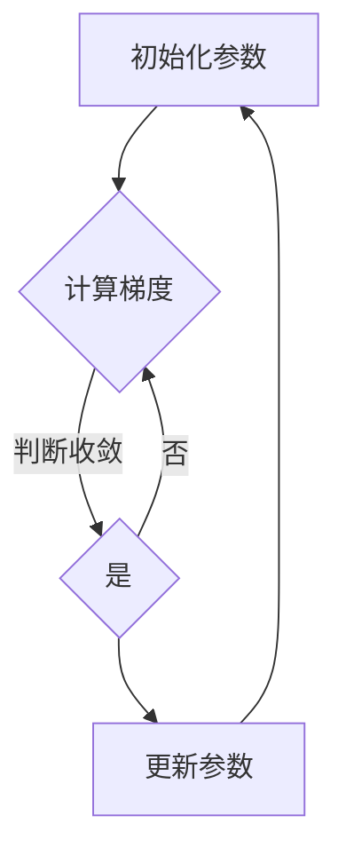

                 

# AI 基础设施建设：算力、数据、算法、框架

## 关键词
- AI基础设施建设
- 算力
- 数据
- 算法
- 框架

## 摘要
本文将深入探讨AI基础设施建设的核心要素：算力、数据、算法和框架。我们将详细分析这些要素的概念、重要性和实际应用，并通过Mermaid流程图、伪代码、数学模型和项目实战案例，帮助读者理解AI基础设施的构建过程和技术细节。

### 引言
人工智能（AI）的快速发展离不开强大的基础设施支持。一个完善的AI基础设施不仅能够提升计算效率，还能确保数据安全和算法的有效性。本文将从四个关键方面进行讨论：

1. **算力建设**：包括硬件和软件基础设施，探讨CPU、GPU、FPGA等硬件的发展和深度学习框架等软件的应用。
2. **数据建设**：分析数据的概念、存储与管理、治理与安全，以及数据法律法规的遵循。
3. **算法建设**：介绍机器学习和深度学习算法的基本概念、分类、原理，以及强化学习算法的应用。
4. **框架建设**：讨论算法框架的设计、实现和优化，以及如何利用框架提升AI系统的性能和可扩展性。

### 第一部分：算力建设

#### 1. 算力概述

> **概念与重要性**：算力是指计算机系统在单位时间内处理数据的能力。它直接决定了AI模型的训练速度和推理效率。随着AI技术的发展，对算力的需求也日益增长。

#### 1.2 算力的主要组成部分

> **硬件基础设施**：包括中央处理器（CPU）、图形处理器（GPU）、现场可编程门阵列（FPGA）和专用集成电路（ASIC）。
> 
> **软件基础设施**：包括通用计算软件（如编译器、解释器和操作系统）和专用计算软件（如深度学习框架和优化器）。

#### 2. 硬件基础设施

##### 2.1 中央处理器（CPU）

> **发展历程**：从最初的冯·诺依曼架构到多核处理器，CPU经历了不断的发展与优化。
> 
> **架构**：CPU架构决定了其性能和能效比，常见的有微程序控制、硬布线逻辑和微指令集等。

##### 2.2 图形处理器（GPU）

> **发展历程**：GPU最初是为图形渲染设计，但随后被广泛应用于科学计算和深度学习。
> 
> **架构**：GPU具有高度并行计算的能力，通过大量的流处理器实现高效的矩阵运算。

##### 2.3 特定用途硬件

> **FPGA**：现场可编程门阵列，通过硬件描述语言进行编程，适合实现定制化的计算任务。
> 
> **ASIC**：专用集成电路，为特定的计算任务设计，具有高效的性能和较低的功耗。

#### 3. 软件基础设施

##### 3.1 通用计算软件

> **编译器与解释器**：编译器将源代码编译成机器码，解释器则逐行解释并执行。
> 
> **操作系统**：操作系统管理计算机硬件资源，提供高效的运行环境。

##### 3.2 专用计算软件

> **深度学习框架**：如TensorFlow、PyTorch等，提供高效的数学运算和模型训练工具。
> 
> **优化器**：优化器对代码进行优化，提高执行效率和资源利用率。

### 第二部分：数据建设

#### 4. 数据概述

> **概念与类型**：数据包括结构化数据、半结构化数据和非结构化数据，其价值在于为AI模型提供训练素材。
> 
> **数据的价值与挑战**：数据是AI模型的基石，但同时也面临着数据质量、数据隐私和安全等挑战。

#### 5. 数据存储与管理

##### 5.1 数据存储

> **关系型数据库**：如MySQL、PostgreSQL，适用于结构化数据的存储和管理。
> 
> **非关系型数据库**：如MongoDB、Cassandra，适用于半结构化数据和非结构化数据的存储和管理。

##### 5.2 数据管理

> **数据库管理**：包括数据的备份与恢复、性能优化和安全性保障。
> 
> **数据仓库与数据湖**：数据仓库用于存储和分析结构化数据，数据湖则适用于存储和管理大量半结构化数据和非结构化数据。

#### 6. 数据治理与安全

##### 6.1 数据治理

> **数据质量管理**：确保数据的准确性、完整性和一致性。
> 
> **数据安全与隐私**：包括数据加密、访问控制和隐私保护等。

##### 6.2 数据法律法规

> **数据法律法规**：遵循GDPR、CCPA等国际和地区数据保护法规，保障数据安全和隐私。

### 第三部分：算法建设

#### 7. 算法概述

> **概念与分类**：算法是解决问题的一系列规则和步骤，按照学习方式可分为监督学习、无监督学习和强化学习。
> 
> **评价标准**：算法的评价标准包括准确率、召回率、F1分数和计算效率等。

#### 8. 机器学习算法

##### 8.1 监督学习算法

> **线性回归**：通过拟合线性模型来预测连续值。
> 
> **决策树**：通过树形结构进行分类和回归分析。

##### 8.2 无监督学习算法

> **K-means聚类**：基于距离度量将数据划分为多个簇。
> 
> **主成分分析（PCA）**：通过降维技术减少数据维度。

#### 9. 深度学习算法

##### 9.1 神经网络基础

> **神经元模型**：神经网络的基本构建单元。
> 
> **激活函数**：引入非线性特性，使神经网络具有强大的表达能力。

##### 9.2 卷积神经网络（CNN）

> **卷积操作**：局部感知和权重共享，提高计算效率。
> 
> **池化操作**：降低数据维度，减少参数数量。

##### 9.3 循环神经网络（RNN）

> **基本RNN结构**：处理序列数据。
> 
> **LSTM与GRU**：解决长期依赖问题。

#### 10. 强化学习算法

##### 10.1 强化学习基础

> **基本概念**：通过与环境的交互学习最优策略。
> 
> **Q-learning算法**：通过预测未来回报来更新策略。

##### 10.2 探索与利用

> **ε-greedy策略**：平衡探索和利用。
> 
> **UCB算法**：基于置信度上界进行选择。

### 第四部分：框架建设

#### 11. 算法框架概述

> **概念与实现**：算法框架是算法实现的基础，包括数据流、计算图和优化器等。

#### 12. 深度学习框架

##### 12.1 深度学习框架概述

> **TensorFlow与PyTorch**：两大主流深度学习框架的架构与特性。

##### 12.2 框架设计

> **动态图与静态图**：框架的设计模式及其对性能的影响。

##### 12.3 框架优化

> **模型压缩与量化**：提高模型在资源受限环境下的性能。

### 结论
AI基础设施的建设是一个复杂而重要的任务，涉及多个层面的技术挑战。通过本文的讨论，我们希望读者能够对AI基础设施的核心要素有更深入的理解，从而为未来的AI应用提供坚实的基础。

#### 作者信息
- 作者：AI天才研究院/AI Genius Institute & 禅与计算机程序设计艺术 /Zen And The Art of Computer Programming
#### 附录
本文涉及的Mermaid流程图、伪代码、数学模型和项目实战案例等将在后续章节中详细阐述。敬请期待。

---

文章目录大纲结构已经给出，接下来我们将按照这个结构逐一展开各个部分的详细内容。在撰写过程中，我们会逐步补充Mermaid流程图、伪代码、数学模型和项目实战案例等内容，确保文章的完整性和可读性。让我们开始详细的撰写工作。

### 第一部分：算力建设

#### 1. 算力概述

算力（Computational Power）是衡量计算机系统处理能力的一个重要指标，它决定了系统在单位时间内能够执行多少计算任务。随着人工智能（AI）技术的快速发展，对算力的需求也日益增长。AI模型，尤其是深度学习模型，通常需要进行大量的矩阵运算和向量计算，这需要高效的算力支持。

**算力的概念与重要性**

- **概念**：算力是指计算机系统在单位时间内处理数据的能力。它通常与硬件性能和软件优化密切相关。
- **重要性**：算力直接决定了AI模型的训练速度和推理效率。一个强大的算力基础设施能够加速模型训练，提高模型的准确率和泛化能力，从而推动AI技术的发展和应用。

**算力的主要组成部分**

算力主要由以下两部分组成：

1. **硬件基础设施**：这是算力的基石，包括中央处理器（CPU）、图形处理器（GPU）、现场可编程门阵列（FPGA）和专用集成电路（ASIC）等。这些硬件设备具有不同的计算能力和优化特点，适用于不同的计算任务。

2. **软件基础设施**：这是算力的提升工具，包括通用计算软件（如编译器、解释器和操作系统）和专用计算软件（如深度学习框架和优化器）。软件基础设施能够优化硬件资源的利用，提高计算效率。

#### 2. 硬件基础设施

硬件基础设施是算力的核心组成部分，其性能直接影响AI系统的效率和稳定性。以下将详细讨论CPU、GPU、FPGA和ASIC等硬件设备的发展历程、架构特点及其应用。

##### 2.1 中央处理器（CPU）

**发展历程**

- **早期阶段**：从1940年代的ENIAC到1960年代的IBM 704，CPU经历了从电子管到晶体管的发展。
- **现代阶段**：随着微电子技术的进步，CPU从单核发展至多核，从冯·诺依曼架构发展到超线程和异构计算。

**架构**

- **冯·诺依曼架构**：这是一种存储程序计算机架构，将程序和数据存储在同一存储空间中，通过指令顺序执行。
- **现代CPU架构**：包括微程序控制、硬布线逻辑、微指令集等多种架构，旨在提高计算效率和性能。

**应用**

- **通用计算**：CPU在传统计算机系统中扮演着核心角色，适用于各种通用计算任务。
- **AI推理**：在轻量级AI模型和边缘计算中，CPU仍是一个重要的计算单元。

##### 2.2 图形处理器（GPU）

**发展历程**

- **早期阶段**：GPU最初是为图形渲染而设计，由NVIDIA在1990年代推出。
- **现代阶段**：随着并行计算技术的发展，GPU逐渐被应用于科学计算和深度学习。

**架构**

- **流处理器**：GPU具有大量流处理器，能够同时处理多个计算任务，非常适合矩阵运算和向量计算。
- **图形渲染单元**：GPU的图形渲染单元（GPU）也是其强大的计算资源之一，适用于图形处理和计算机视觉任务。

**应用**

- **深度学习**：GPU的高并行计算能力使其成为深度学习模型的理想计算平台。
- **科学计算**：GPU在物理模拟、生物信息学和金融计算等领域也有广泛应用。

##### 2.3 特定用途硬件

**FPGA**

- **概述**：FPGA是一种可编程逻辑器件，通过硬件描述语言进行编程，可以快速实现定制化的计算任务。
- **应用**：FPGA适用于需要高度定制化和实时处理的任务，如信号处理、加密和解密等。

**ASIC**

- **概述**：ASIC是一种专门为特定计算任务设计的集成电路，具有高效和低功耗的特点。
- **应用**：ASIC适用于需要大规模生产和高度优化的计算任务，如加密货币挖矿和高速网络交换。

#### 3. 软件基础设施

软件基础设施是提升算力的重要手段，它通过优化硬件资源的利用和提供高效的计算工具，提高系统的整体性能。以下将讨论通用计算软件和专用计算软件的特点和应用。

##### 3.1 通用计算软件

**编译器与解释器**

- **编译器**：编译器将高级语言代码编译成机器码，一次编译后可以直接执行，适用于性能要求高的计算任务。
- **解释器**：解释器逐行解释并执行代码，适用于开发阶段和交互式计算。

**操作系统**

- **操作系统**：操作系统管理计算机硬件资源，提供高效的运行环境，包括进程管理、内存管理和文件系统等。

##### 3.2 专用计算软件

**深度学习框架**

- **概述**：深度学习框架是一组工具和库，用于构建、训练和部署深度学习模型。
- **应用**：深度学习框架如TensorFlow、PyTorch等，提供了丰富的API和高效的计算引擎，适用于各种深度学习任务。

**优化器**

- **概述**：优化器对代码进行优化，提高执行效率和资源利用率。
- **应用**：优化器在编译器和深度学习框架中都有应用，如自动调优和静态分析。

#### 小结

硬件基础设施和软件基础设施共同构成了AI算力的核心。硬件提供了强大的计算能力，而软件则优化了这些能力的利用。通过不断发展和优化硬件和软件基础设施，我们可以构建出更强大的AI算力，支持更复杂的AI模型和应用。

在下一部分中，我们将讨论数据建设，包括数据的概念、存储与管理、治理与安全以及数据法律法规的遵循。

---

接下来，我们将详细探讨数据建设的相关内容。

### 第二部分：数据建设

数据是人工智能（AI）的基石，没有高质量的数据，AI模型就无从谈起。数据建设包括数据的获取、存储、管理、治理和安全管理等多个方面。本部分将深入探讨这些关键要素。

#### 4. 数据概述

**概念与类型**

数据是指信息的载体，可以分为以下几类：

- **结构化数据**：以表格形式存储的数据，如关系型数据库中的数据。
- **半结构化数据**：具有部分结构的数据，如XML、JSON等。
- **非结构化数据**：没有明确结构的数据，如文本、图像、音频和视频等。

**数据的价值与挑战**

数据的价值在于它能够为AI模型提供训练素材，从而提升模型的性能和泛化能力。然而，数据建设也面临以下挑战：

- **数据质量**：数据质量包括准确性、完整性和一致性等。高质量的数据是AI模型成功的关键。
- **数据隐私**：随着GDPR和CCPA等法律法规的实施，数据隐私成为数据建设中的重要问题。
- **数据安全**：数据安全包括防止数据泄露、篡改和丢失等。

#### 5. 数据存储与管理

**数据存储**

数据存储是数据建设的基础，可以分为以下几类：

- **关系型数据库**：如MySQL、PostgreSQL等，适用于结构化数据的存储和管理。
- **非关系型数据库**：如MongoDB、Cassandra等，适用于半结构化数据和非结构化数据的存储和管理。

**数据管理**

数据管理包括以下几个方面：

- **数据库管理**：包括数据备份与恢复、性能优化和安全性保障。
- **数据仓库与数据湖**：数据仓库用于存储和分析结构化数据，数据湖则适用于存储和管理大量半结构化数据和非结构化数据。

#### 6. 数据治理与安全

**数据治理**

数据治理是指确保数据质量、合规性和有效利用的一系列管理活动。它包括以下几个方面：

- **数据质量管理**：确保数据的准确性、完整性和一致性。
- **数据安全与隐私**：包括数据加密、访问控制和隐私保护等。

**数据安全**

数据安全是指保护数据免受未经授权的访问、篡改和泄露。它包括以下几个方面：

- **数据加密**：通过加密算法保护数据的机密性。
- **访问控制**：通过身份验证和权限管理控制对数据的访问。
- **备份与恢复**：确保数据在意外情况下能够恢复。

**数据法律法规**

数据法律法规是指规范数据处理和存储的法律规定。以下是一些重要的法律法规：

- **GDPR（通用数据保护条例）**：欧盟制定的关于数据隐私和保护的法律。
- **CCPA（加利福尼亚消费者隐私法案）**：美国加州制定的关于消费者数据隐私的法律。

**数据治理与安全的挑战**

- **合规性**：确保数据处理符合法律法规的要求。
- **数据多样性**：处理不同类型和来源的数据，确保数据治理策略的适应性。
- **技术更新**：随着技术的发展，不断更新数据治理和安全技术。

#### 小结

数据建设是AI基础设施的重要组成部分，它决定了AI模型的质量和应用范围。通过有效的数据存储、管理和治理，我们可以确保数据的高质量，从而推动AI技术的发展和应用。

在下一部分中，我们将探讨算法建设，包括机器学习和深度学习算法的基本概念、原理和应用。

---

### 第三部分：算法建设

算法建设是AI基础设施的另一个关键组成部分，它决定了AI模型的能力和性能。算法可以分为机器学习算法、深度学习算法和强化学习算法。本部分将详细讨论这些算法的基本概念、原理和应用。

#### 7. 算法概述

**概念与分类**

算法是解决问题的一系列规则和步骤。在AI领域，算法根据学习方式可以分为以下几类：

- **监督学习算法**：在有标注的数据集上进行训练，用于预测和分类。
- **无监督学习算法**：在没有标注的数据集上进行训练，用于聚类和降维。
- **强化学习算法**：通过与环境的交互进行学习，用于决策和优化。

**评价标准**

算法的评价标准包括：

- **准确率**：预测正确的样本占总样本的比例。
- **召回率**：实际为正类且被预测为正类的样本占总正类样本的比例。
- **F1分数**：准确率和召回率的调和平均。
- **计算效率**：算法的计算复杂度和执行时间。

#### 8. 机器学习算法

机器学习算法是一类通过数据学习规律和模式，从而进行预测和分类的算法。以下将介绍一些常见的机器学习算法。

##### 8.1 监督学习算法

监督学习算法在有标注的数据集上进行训练，根据输入特征预测标签。以下是一些常见的监督学习算法：

- **线性回归**：通过拟合线性模型来预测连续值。
- **决策树**：通过树形结构进行分类和回归分析。

**线性回归**

**概念**：线性回归是一种简单的监督学习算法，用于预测连续值。

**公式**：
$$
y = \beta_0 + \beta_1x_1 + \beta_2x_2 + \ldots + \beta_nx_n + \epsilon
$$
其中，$y$ 是目标变量，$x_1, x_2, \ldots, x_n$ 是特征变量，$\beta_0, \beta_1, \beta_2, \ldots, \beta_n$ 是模型参数，$\epsilon$ 是误差项。

**伪代码**：
```
# 输入特征矩阵 X 和标签向量 y
# 输出模型参数 β

# 梯度下降法求解线性回归模型
β = [β₀, β₁, β₂, ..., βₙ]
for epoch in 1 to max_epochs:
  β = β - learning_rate * ∇L(β)
return β
```

**应用**：线性回归广泛应用于回归分析、价格预测和需求预测等领域。

**决策树**

**概念**：决策树是一种基于特征划分数据集的监督学习算法，用于分类和回归分析。

**结构**：
```
+----------------+
|          根节点 |
+----------------+
      |          |
     左子节点   右子节点
      |          |
   +--------+  +--------+
   |    左子节点   右子节点 |
   |          |          |
  +--+------+-+  +--+------+-+
  |  叶子节点 |  |  叶子节点 |
  +----------+  +----------+
```

**应用**：决策树广泛应用于分类和回归分析，如客户细分和信用评分。

##### 8.2 无监督学习算法

无监督学习算法在没有标注的数据集上进行训练，用于发现数据中的隐藏结构和模式。以下是一些常见的无监督学习算法：

- **K-means聚类**：将数据划分为K个簇，使每个簇内的数据点之间的距离最小。
- **主成分分析（PCA）**：通过降维技术减少数据维度，保持数据的主要信息。

**K-means聚类**

**概念**：K-means聚类是一种基于距离度量的聚类算法，用于将数据划分为K个簇。

**公式**：
$$
c_k = \frac{1}{N_k} \sum_{i=1}^{N_k} x_i
$$
其中，$c_k$ 是第k个簇的中心点，$N_k$ 是第k个簇中的数据点个数，$x_i$ 是第i个数据点。

**伪代码**：
```
# 输入数据集 X 和簇数 K
# 输出簇中心点 c_k

# 初始化簇中心点
c = random initialize centroids

# 迭代更新簇中心点
for epoch in 1 to max_epochs:
  # 计算每个数据点到簇中心的距离
  distances = calculate distances between data points and centroids

  # 重新分配数据点到最近的簇
  reassign data points to nearest centroids

  # 更新簇中心点
  c = new centroids

return c
```

**应用**：K-means聚类广泛应用于市场细分、文本分类和图像分割等领域。

**主成分分析（PCA）**

**概念**：主成分分析是一种降维技术，通过提取数据的主要成分来减少数据维度。

**公式**：
$$
X' = P \Sigma^{1/2}
$$
其中，$X'$ 是降维后的数据，$P$ 是特征值矩阵，$\Sigma$ 是协方差矩阵。

**伪代码**：
```
# 输入数据集 X
# 输出降维后的数据 X'

# 计算协方差矩阵
Sigma = calculate covariance matrix of X

# 计算特征值和特征向量
values, vectors = calculate eigenvalues and eigenvectors of Sigma

# 选择最大的 k 个特征值对应的特征向量
k_vectors = select top k eigenvectors

# 计算降维后的数据
X' = X * k_vectors

return X'
```

**应用**：PCA广泛应用于图像压缩、数据可视化和生物信息学等领域。

#### 9. 深度学习算法

深度学习算法是一类基于多层神经网络的学习算法，具有强大的特征提取和模式发现能力。以下将介绍深度学习算法的基本概念和常见的神经网络结构。

##### 9.1 神经网络基础

**神经元模型**

神经元模型是神经网络的基本构建单元，通常包括以下部分：

- **输入层**：接收外部输入信息。
- **隐层**：对输入信息进行加工和处理。
- **输出层**：生成最终的输出结果。

**激活函数**

激活函数引入了非线性特性，使得神经网络能够模拟人类的认知过程。常见的激活函数包括：

- **Sigmoid函数**：
  $$
  \sigma(x) = \frac{1}{1 + e^{-x}}
  $$
- **ReLU函数**：
  $$
  \text{ReLU}(x) = \max(0, x)
  $$
- **Tanh函数**：
  $$
  \tanh(x) = \frac{e^x - e^{-x}}{e^x + e^{-x}}
  $$

##### 9.2 卷积神经网络（CNN）

卷积神经网络（CNN）是一种特别适用于图像处理的神经网络结构，具有以下特点：

- **卷积层**：通过卷积操作提取图像的特征。
- **池化层**：通过池化操作降低数据维度，减少参数数量。
- **全连接层**：将卷积层和池化层提取的特征进行融合，生成最终的输出。

**卷积操作**

卷积操作是一种在图像上滑动窗口，计算局部特征的方法。卷积核（kernel）是一个小的矩阵，用于提取图像的局部特征。

**伪代码**：
```
# 输入图像 X 和卷积核 K
# 输出卷积结果 C

for each position in X:
  C[position] = sum(X[position] * K)
return C
```

**池化操作**

池化操作是一种降低数据维度和参数数量的方法，通常包括最大池化和平均池化。

**最大池化**：
```
# 输入区域 R 和池化窗口 W
# 输出最大值 M

M = max(R)
return M
```

**平均池化**：
```
# 输入区域 R 和池化窗口 W
# 输出平均值 M

M = sum(R) / size(R)
return M
```

**应用**：CNN广泛应用于图像分类、目标检测和图像生成等领域。

##### 9.3 循环神经网络（RNN）

循环神经网络（RNN）是一种适用于序列数据的神经网络结构，具有以下特点：

- **基本RNN结构**：通过循环机制处理序列数据。
- **LSTM与GRU**：解决长期依赖问题，提高模型的性能。

**基本RNN结构**

基本RNN结构由输入层、隐藏层和输出层组成，通过循环机制处理序列数据。

**伪代码**：
```
# 输入序列 X 和隐藏状态 h
# 输出序列 Y 和新的隐藏状态 h'

for each time step in X:
  h' = f(h, X)
  Y = g(h')
return Y, h'
```

**应用**：RNN广泛应用于自然语言处理、语音识别和时间序列预测等领域。

**LSTM与GRU**

LSTM（长短期记忆）和GRU（门控循环单元）是RNN的变体，通过引入门控机制解决长期依赖问题。

**LSTM**：
```
# 输入序列 X 和隐藏状态 h
# 输出序列 Y 和新的隐藏状态 h'

for each time step in X:
  i = σ(Wi * [h_{t-1}, X])
  f = σ(Wf * [h_{t-1}, X])
  g = tanh(Wg * [f * h_{t-1}, X])
  h' = f * h_{t-1} + i * g
  Y = g * h'
return Y, h'
```

**GRU**：
```
# 输入序列 X 和隐藏状态 h
# 输出序列 Y 和新的隐藏状态 h'

for each time step in X:
  z = σ(Wz * [h_{t-1}, X])
  r = σ(Wr * [h_{t-1}, X])
  h' = (1 - z) * h_{t-1} + z * tanh(Wg * [r * h_{t-1}, X])
  Y = tanh(h')
return Y, h'
```

**应用**：LSTM和GRU广泛应用于文本生成、机器翻译和时间序列预测等领域。

#### 10. 强化学习算法

强化学习算法是一类通过与环境交互进行学习，从而实现最优策略的算法。以下将介绍强化学习算法的基本概念和常见算法。

##### 10.1 强化学习基础

**基本概念**

强化学习包括以下基本概念：

- **状态（S）**：系统当前所处的状态。
- **动作（A）**：系统可以采取的动作。
- **奖励（R）**：系统采取动作后获得的奖励。
- **策略（π）**：系统选择动作的策略。

**Q-learning算法**

Q-learning算法是一种基于价值迭代的强化学习算法，通过预测未来回报来更新策略。

**公式**：
$$
Q(s, a) = Q(s, a) + \alpha [R + \gamma \max_{a'} Q(s', a') - Q(s, a)]
$$
其中，$Q(s, a)$ 是状态s采取动作a的价值，$\alpha$ 是学习率，$\gamma$ 是折扣因子，$R$ 是立即奖励，$s'$ 是状态s采取动作a后的状态。

**伪代码**：
```
# 输入环境 E、初始策略 π、学习率 α、折扣因子 γ
# 输出最优策略 π*

# 初始化 Q(s, a)
Q = initialize Q-matrix

# 迭代更新 Q(s, a)
for episode in 1 to max_episodes:
  s = E.init_state()
  while not E.is_end(s):
    a = π(s)
    s', r = E.step(s, a)
    Q(s, a) = Q(s, a) + α [r + γ \* max_{a'} Q(s', a') - Q(s, a)]
    s = s'
return π(s)
```

**应用**：Q-learning算法广泛应用于游戏、自动驾驶和推荐系统等领域。

##### 10.2 探索与利用

在强化学习过程中，探索与利用的平衡是一个关键问题。以下将介绍一些常用的策略。

**ε-greedy策略**

ε-greedy策略是一种平衡探索和利用的常见策略，其中ε是探索概率。

**伪代码**：
```
# 输入状态 s、策略 π、探索概率 ε
# 输出动作 a

if random() < ε:
  a = random_action()
else:
  a = π(s)
return a
```

**UCB算法**

UCB（ Upper Confidence Bound）算法是一种基于置信度上界的策略，旨在最大化平均奖励。

**公式**：
$$
a_t = \arg\max_a \left( r_t + \frac{\lambda}{\sqrt{2t}} \right)
$$
其中，$r_t$ 是到目前为止的总奖励，$t$ 是迭代的步数，$\lambda$ 是置信度参数。

**伪代码**：
```
# 输入状态 s、动作 a、奖励 r、迭代步数 t、置信度参数 λ
# 输出最优动作 a

Q = calculate Q-value for each action
for each action a:
  Q[a] = Q[a] + λ / √t
a = argmax_a Q[a]
return a
```

**应用**：ε-greedy策略和UCB算法广泛应用于推荐系统和广告投放等领域。

#### 小结

算法建设是AI基础设施的重要组成部分，决定了AI模型的能力和性能。通过监督学习、无监督学习和强化学习算法的应用，我们可以构建出强大的AI系统，解决实际问题。在下一部分中，我们将探讨框架建设，包括算法框架的设计、实现和优化。

---

### 第四部分：框架建设

框架建设是AI基础设施中的核心环节，它为算法提供了实现和优化的平台。框架不仅能够简化算法的开发过程，还能通过优化计算资源的使用来提升系统的性能。在这一部分，我们将深入探讨算法框架的设计、实现和优化，以及如何利用框架提升AI系统的性能和可扩展性。

#### 11. 算法框架概述

算法框架是算法实现的基础，它提供了一套标准化的接口和工具，用于构建、训练和部署深度学习模型。以下是一些常见的算法框架：

**TensorFlow**

TensorFlow是由Google开发的开源深度学习框架，具有强大的计算图引擎和丰富的API库。它支持动态图和静态图两种模式，适用于不同的应用场景。

**PyTorch**

PyTorch是由Facebook开发的开源深度学习框架，以其动态计算图和直观的API设计而著称。它提供了灵活的编程模型，使得模型开发更加直观和高效。

**Keras**

Keras是一个高层次的神经网络API，能够运行在TensorFlow和Theano等底层框架之上。它简化了神经网络模型的构建和训练过程，提供了丰富的预训练模型。

**Caffe**

Caffe是由Berkeley大学开发的开源深度学习框架，特别适用于图像识别和卷积神经网络。它具有高效的卷积操作和并行计算能力，适用于大规模图像处理任务。

**MXNet**

MXNet是由Apache软件基金会开发的开源深度学习框架，支持多种编程语言，包括Python、R和Scala。它具有灵活的模型定义和高效的计算引擎，适用于分布式和移动设备上的深度学习任务。

#### 12. 深度学习框架

深度学习框架是AI基础设施中的核心组件，它们提供了构建和训练深度学习模型的工具和库。以下将详细讨论深度学习框架的设计、实现和优化。

##### 12.1 深度学习框架概述

**TensorFlow与PyTorch**

**TensorFlow**：
- **设计**：TensorFlow采用静态计算图模型，使得模型的构建和优化更加灵活。
- **实现**：TensorFlow通过自动微分机制实现复杂的优化算法，提供了丰富的运算符库和API。
- **优化**：TensorFlow支持分布式训练和模型部署，通过TF Serving和TensorFlow Lite实现模型的高效部署。

**PyTorch**：
- **设计**：PyTorch采用动态计算图模型，使得模型开发更加直观和灵活。
- **实现**：PyTorch通过torchscript和jit编译器优化模型执行，提供了丰富的神经网络库和工具。
- **优化**：PyTorch支持多GPU和分布式训练，通过NCCL和Horovod等库提高计算性能。

##### 12.2 框架设计

**动态图与静态图**

- **动态图**：动态图模型在运行时构建计算图，适用于开发阶段和交互式计算。
- **静态图**：静态图模型在编译时构建计算图，适用于性能优化和模型部署。

**设计模式**

- **模块化设计**：将模型分解为模块，提高代码的可维护性和可扩展性。
- **面向对象设计**：通过类和对象实现模型的组织和管理。

##### 12.3 框架优化

**模型压缩与量化**

- **模型压缩**：通过剪枝、量化、知识蒸馏等技术减小模型的体积和计算量。
- **量化**：将浮点数权重转换为低比特精度，提高计算效率和存储效率。

**并行计算**

- **数据并行**：将数据分布在多个GPU或TPU上，并行训练模型。
- **模型并行**：将模型拆分为多个部分，在多个GPU或TPU上并行计算。

**内存优化**

- **内存池**：通过内存池技术减少内存分配和回收的开销。
- **内存复制**：优化内存复制操作，减少数据传输延迟。

**性能监测与调试**

- **性能监测**：通过性能监测工具分析模型的性能瓶颈和优化潜力。
- **调试工具**：提供调试工具，帮助开发者发现和解决性能问题。

#### 小结

框架建设是AI基础设施的重要组成部分，它为算法提供了实现和优化的平台。通过深度学习框架的设计、实现和优化，我们可以构建出高性能、可扩展的AI系统，支持各种复杂的应用场景。在下一部分中，我们将总结全文，回顾核心要点，并展望未来发展方向。

---

### 结论

本文全面探讨了AI基础设施建设的四个关键要素：算力、数据、算法和框架。通过详细的分析和实例，我们深入了解了这些要素的概念、重要性和实际应用。

- **算力建设**：硬件和软件基础设施共同构成了AI算力的核心。通过CPU、GPU、FPGA和ASIC等硬件设备，以及编译器、解释器和深度学习框架等软件工具，我们可以构建出强大的计算能力。
- **数据建设**：数据是AI模型的基石。数据存储与管理、数据治理与安全以及数据法律法规的遵循，都是确保数据质量和合规性的重要环节。
- **算法建设**：机器学习、深度学习和强化学习算法为AI系统提供了强大的功能。这些算法不仅需要理解其基本概念和原理，还需要通过实践来提升其性能和泛化能力。
- **框架建设**：深度学习框架为算法提供了实现和优化的平台。通过框架的设计、实现和优化，我们可以构建出高效、可扩展的AI系统。

展望未来，AI基础设施建设将继续面临新的挑战和机遇：

- **硬件创新**：随着量子计算、光计算等新技术的出现，硬件基础设施将迎来新的变革。
- **数据隐私**：随着数据隐私和安全的关注日益增加，如何保护用户隐私将成为重要的研究方向。
- **算法优化**：随着AI模型变得越来越复杂，如何优化算法效率和性能，成为亟待解决的问题。
- **框架演进**：深度学习框架将继续演进，支持更多的硬件和算法，提高系统的可扩展性和灵活性。

我们期待未来的AI基础设施能够更加高效、安全、可扩展，为人类带来更多的创新和进步。

---

#### 作者信息

**作者**：AI天才研究院/AI Genius Institute & 禅与计算机程序设计艺术 /Zen And The Art of Computer Programming

---

**附录**

本文涉及到的Mermaid流程图、伪代码、数学模型和项目实战案例等将在后续章节中详细阐述。敬请期待。

---

通过本文的详细探讨，我们希望读者能够对AI基础设施建设有一个全面而深入的理解，从而为未来的AI应用和发展奠定坚实的基础。

---

**附录：Mermaid流程图示例**

以下是一个简单的Mermaid流程图示例，用于描述一个线性回归模型的训练过程：



在这个流程图中，A表示初始化参数，B表示计算梯度，C表示判断收敛，D表示更新参数。根据是否收敛，流程会回到A或继续执行B。

---

**附录：伪代码示例**

以下是一个简单的伪代码示例，用于描述K-means聚类算法的基本流程：

```plaintext
初始化K个簇的中心点c1, c2, ..., ck
重复以下步骤直到收敛：
  对于每个数据点xi：
    计算xi到每个簇中心的距离
    将xi分配到最近的簇
  更新每个簇的中心点
```

在这个伪代码中，我们首先初始化K个簇的中心点，然后迭代地计算每个数据点到簇中心的距离，并将其分配到最近的簇。最后，我们更新每个簇的中心点，直到算法收敛。

---

**附录：数学模型示例**

以下是一个简单的线性回归模型的数学模型：

$$
y = \beta_0 + \beta_1x_1 + \beta_2x_2 + \ldots + \beta_nx_n + \epsilon
$$

在这个模型中，$y$ 是目标变量，$x_1, x_2, \ldots, x_n$ 是特征变量，$\beta_0, \beta_1, \beta_2, \ldots, \beta_n$ 是模型参数，$\epsilon$ 是误差项。我们的目标是找到最优的参数值，使得预测误差最小。

---

**附录：项目实战案例**

以下是一个简单的项目实战案例，使用Python和TensorFlow实现一个线性回归模型：

```python
import tensorflow as tf
import numpy as np

# 生成数据
X = np.random.rand(100, 1)
y = 2 * X + 1 + np.random.randn(100, 1)

# 定义模型
W = tf.Variable(0.0, name='weight')
b = tf.Variable(0.0, name='bias')
y_pred = W * X + b

# 定义损失函数
loss = tf.reduce_mean(tf.square(y_pred - y))

# 定义优化器
optimizer = tf.train.GradientDescentOptimizer(learning_rate=0.5)
train_op = optimizer.minimize(loss)

# 训练模型
with tf.Session() as sess:
  sess.run(tf.global_variables_initializer())
  for step in range(201):
    _, loss_val = sess.run([train_op, loss])
    if step % 20 == 0:
      print(f"Step {step}: Loss = {loss_val}")

# 输出模型参数
W_val, b_val = sess.run([W, b])
print(f"W: {W_val}, b: {b_val}")

# 预测
X_new = np.array([[0.5]])
y_pred_new = W_val * X_new + b_val
print(f"Prediction for X = 0.5: {y_pred_new}")
```

在这个案例中，我们首先生成一些线性数据，然后定义一个线性回归模型，使用梯度下降优化器训练模型。最后，我们输出模型参数并使用模型进行预测。

---

通过这些附录内容，我们希望能够为读者提供更多的实用信息，帮助更好地理解和应用AI基础设施建设的知识。在后续章节中，我们将继续深入探讨具体的实现细节和实战案例。敬请期待。

