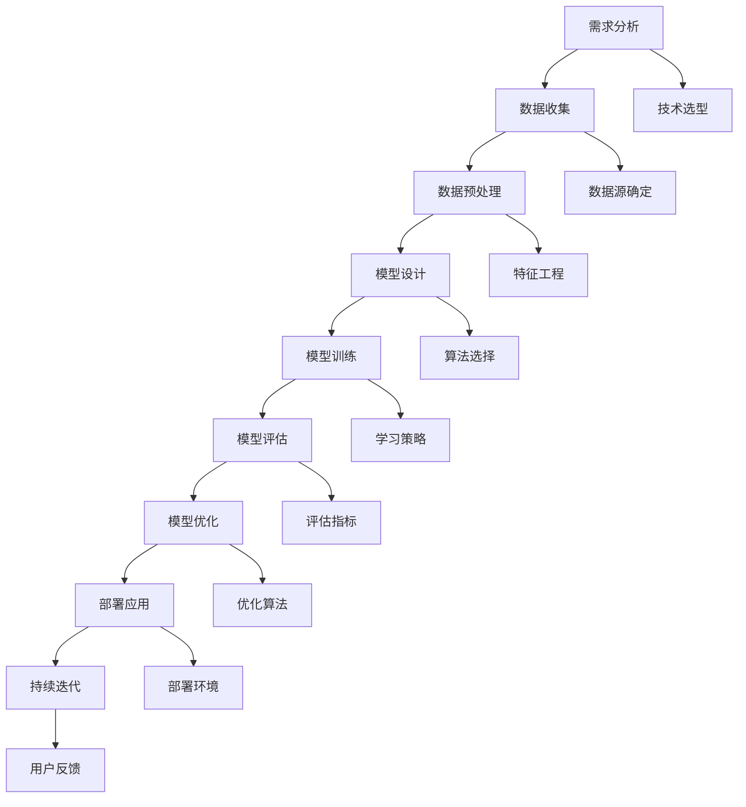

                 

# AI 大模型创业：如何利用技术优势？

## 关键词
- AI大模型
- 创业
- 技术优势
- 创业战略
- 项目实施
- 市场推广
- 创业案例分析

## 摘要
本文将深入探讨AI大模型在创业中的应用，分析如何利用技术优势推动创业成功。文章首先概述了AI大模型的基本概念和当前市场背景，然后详细讲解了AI大模型的技术基础和核心算法。接着，文章从创业战略、项目实施和市场推广等多个角度，提供了AI大模型创业的实战经验和策略。通过国内外的创业案例分析，本文进一步探讨了AI大模型技术优势的转化方法和创业中的法律与伦理问题。最后，文章总结了AI大模型创业的关键成功因素和未来发展趋势。

----------------------------------------------------------------

## 第一部分：AI大模型概述与市场背景

### 1.1 AI大模型概述

#### 1.1.1 AI大模型的定义

AI大模型是指通过深度学习和大数据技术，训练出具有强大知识和理解能力的复杂神经网络模型。这些模型通常具有数十亿甚至数千亿的参数，能够处理大量数据并进行复杂的推理和决策。AI大模型主要包括自然语言处理（NLP）、计算机视觉（CV）和语音识别（ASR）等领域。

#### 1.1.2 AI大模型的分类

AI大模型可以分为以下几类：

1. **预训练模型**：这类模型在大量未标注的数据上进行预训练，然后通过微调适应特定任务。例如，GPT系列模型和BERT模型。

2. **任务特定模型**：这类模型针对特定任务进行优化和训练，如图像分类、语音识别等。它们通常在预训练模型的基础上进行微调。

3. **多模态模型**：这类模型能够处理多种类型的数据，如文本、图像和音频，例如ViT和BERT等。

### 1.2 AI大模型的发展历程

#### 1.2.1 从传统AI到AI大模型的演进

传统AI主要以规则和符号推理为主，如专家系统和逻辑编程。随着深度学习技术的发展，AI逐渐从“规则驱动”转向“数据驱动”。AI大模型的出现标志着AI进入了新的发展阶段，其核心在于大规模数据和高性能计算的结合。

#### 1.2.2 全球AI大模型的发展趋势

1. **技术进步**：随着计算能力的提升和算法的创新，AI大模型的规模和性能不断提升。

2. **产业应用**：AI大模型在各个行业的应用越来越广泛，如金融、医疗、零售等。

3. **开源生态**：大量的AI大模型开源项目和框架，如TensorFlow、PyTorch等，推动了技术的普及和应用。

### 1.3 AI大模型的市场背景

#### 1.3.1 AI大模型在行业的应用现状

1. **金融行业**：AI大模型在风险管理、客户服务和投资决策等方面发挥重要作用。

2. **零售行业**：AI大模型用于商品推荐、库存管理和消费者行为分析。

3. **医疗健康行业**：AI大模型在疾病诊断、药物研发和患者管理等方面具有显著应用价值。

#### 1.3.2 AI大模型的商业价值与挑战

##### 1.3.2.1 商业价值分析

1. **提高效率**：AI大模型能够自动化和优化复杂的业务流程。

2. **降低成本**：通过智能决策和自动化操作，企业可以降低运营成本。

3. **创新产品**：AI大模型的应用促进了新产品的开发和服务模式的创新。

##### 1.3.2.2 技术挑战

1. **数据质量**：高质量的数据是训练有效AI大模型的关键。

2. **计算资源**：AI大模型通常需要大量的计算资源和存储空间。

3. **模型优化**：如何提高模型的效率和准确性是一个持续的挑战。

##### 1.3.2.3 法律与伦理挑战

1. **隐私保护**：数据隐私和用户隐私保护成为法律和伦理关注的重点。

2. **算法偏见**：如何确保AI大模型的公平性和透明性是一个重要问题。

3. **责任归属**：在AI大模型导致错误决策或行为时，如何确定责任归属是一个复杂的问题。

----------------------------------------------------------------

## 第二部分：AI大模型技术基础

### 2.1 深度学习技术概述

#### 2.1.1 深度学习的基本原理

深度学习是一种基于多层神经网络的学习方法，其核心思想是通过层层提取特征，从而实现复杂任务的自动学习。深度学习的基本原理包括以下几个关键部分：

1. **神经网络**：神经网络由多个神经元（或节点）组成，每个神经元接收来自其他神经元的输入信号，通过激活函数产生输出。

2. **前向传播**：在前向传播过程中，输入数据通过神经网络逐层传递，每层神经网络的输出作为下一层的输入。

3. **反向传播**：反向传播是深度学习算法的核心，用于计算误差并更新网络权重。

4. **激活函数**：激活函数用于引入非线性，常见的激活函数包括Sigmoid、ReLU和Tanh等。

5. **优化算法**：常用的优化算法包括随机梯度下降（SGD）、Adam和RMSprop等。

#### 2.1.2 常见的深度学习框架

深度学习框架是用于构建和训练深度学习模型的工具，常见的深度学习框架包括：

1. **TensorFlow**：由Google开发，是一个开源的深度学习框架，支持多种编程语言，广泛应用于工业界和学术界。

2. **PyTorch**：由Facebook开发，是一个开源的深度学习框架，以其动态计算图和灵活的接口而受到广泛关注。

3. **Keras**：是一个高层神经网络API，能够运行在TensorFlow和Theano之上，旨在简化深度学习模型的构建和训练。

4. **MXNet**：由Apache基金会开发，是一个开源的深度学习框架，支持多种编程语言，具有高效的计算性能。

### 2.2 自然语言处理技术

自然语言处理（NLP）是深度学习的重要应用领域之一，主要关注文本数据的理解和生成。NLP技术包括以下几个关键部分：

#### 2.2.1 词嵌入技术

词嵌入是将文本中的单词映射到高维空间中的向量表示，常见的词嵌入方法包括：

1. **Word2Vec**：通过训练词向量的共现模型，将单词映射到低维空间中。

2. **GloVe**：通过全局矩阵分解方法，将单词映射到高维空间中。

#### 2.2.2 语音识别技术

语音识别是将语音信号转换为文本的技术，其基本流程包括：

1. **声学模型**：用于将音频信号映射到声学特征。

2. **语言模型**：用于预测语音序列对应的文本序列。

3. **声学和语言模型的结合**：通常使用序列模型如HMM（隐马尔可夫模型）或RNN（循环神经网络）来结合声学模型和语言模型。

#### 2.2.3 图像识别技术

图像识别是将图像映射到类别标签的技术，其基本流程包括：

1. **特征提取**：从图像中提取特征，如边缘、纹理、颜色等。

2. **分类器**：使用分类器对提取的特征进行分类，常见的分类器包括SVM（支持向量机）、CNN（卷积神经网络）等。

### 2.3 AI大模型的训练与优化

AI大模型的训练与优化是确保模型性能的关键环节，主要包括以下几个方面：

#### 2.3.1 训练方法与策略

1. **数据预处理**：对输入数据进行清洗、归一化和特征提取，以提高训练效果。

2. **批处理**：将训练数据分成多个批次，逐批进行训练。

3. **学习率调度**：通过调整学习率，使模型能够稳定收敛。

4. **正则化**：使用正则化方法，如L1正则化、L2正则化，避免过拟合。

5. **dropout**：在神经网络中随机丢弃一部分神经元，提高模型的泛化能力。

#### 2.3.2 优化算法

1. **随机梯度下降（SGD）**：是最常见的优化算法，通过随机梯度更新模型参数。

2. **Adam**：是一种基于SGD的优化算法，结合了AdaGrad和RMSprop的特点。

3. **RMSprop**：是一种基于梯度平方的优化算法，通过指数移动平均计算梯度。

#### 2.3.3 预训练与微调

1. **预训练**：在大量未标注数据上训练模型，使其获得通用特征表示。

2. **微调**：在预训练模型的基础上，针对特定任务进行微调，以提高模型性能。

### 2.4 AI大模型的核心算法

AI大模型的核心算法是构建高性能、高效率模型的关键，以下是几个常见的AI大模型核心算法：

#### 2.4.1 GPT系列模型

GPT（Generative Pre-trained Transformer）系列模型是由OpenAI开发的预训练语言模型，其核心思想是基于Transformer架构进行大规模预训练。

1. **GPT**：第一个GPT模型，使用Transformer架构进行预训练。

2. **GPT-2**：在GPT的基础上增加了模型大小和预训练数据量。

3. **GPT-3**：最新的GPT模型，具有前所未有的规模和性能。

#### 2.4.2 BERT及其变体

BERT（Bidirectional Encoder Representations from Transformers）是由Google开发的预训练语言模型，其核心思想是基于Transformer架构进行双向编码。

1. **BERT**：原始BERT模型，使用双向Transformer进行预训练。

2. **RoBERTa**：在BERT的基础上，通过改进训练策略和预训练数据集，提高了模型性能。

3. **ALBERT**：在BERT的基础上，通过参数共享和自注意力机制改进，提高了模型效率。

#### 2.4.3 其他AI大模型

除了GPT和BERT系列模型，还有许多其他AI大模型，如：

1. **Transformer**：基于注意力机制的通用架构，可以应用于各种序列建模任务。

2. **T5（Text-To-Text Transfer Transformer）**：基于Transformer架构，旨在将所有自然语言处理任务统一为一个文本到文本的预测任务。

3. **ViT（Vision Transformer）**：将Transformer架构应用于计算机视觉领域，通过自注意力机制处理图像。

----------------------------------------------------------------

## 第三部分：AI大模型创业实践

### 3.1 AI大模型创业战略

#### 3.1.1 创业模式与路径选择

AI大模型创业模式可以分为以下几种：

1. **自主研发**：公司独立研发AI大模型，拥有完全的技术自主权。

2. **开源项目合作**：与开源项目合作，利用已有的AI大模型框架和技术。

3. **转型与并购**：企业通过并购或转型，引入AI大模型技术。

#### 3.1.2 市场定位与产品策略

1. **市场定位**：根据市场需求和竞争环境，选择合适的细分市场。

2. **产品差异化**：通过技术优势和创新，打造独特的产品特色。

3. **用户价值创造**：关注用户需求，提供切实可行的解决方案。

### 3.2 AI大模型创业项目实施

#### 3.2.1 项目管理与团队建设

1. **项目管理流程**：制定详细的项目计划，确保项目按期完成。

2. **团队角色与协作**：明确团队成员的角色和职责，促进协作和沟通。

3. **领导力与团队文化**：培养良好的团队氛围，提升团队凝聚力。

#### 3.2.2 技术研发与迭代

1. **技术研发路线图**：制定清晰的研发路线，确保技术方向的正确性。

2. **技术迭代策略**：根据市场需求和技术发展，及时进行技术迭代。

3. **技术风险控制**：识别和评估技术风险，制定相应的风险控制措施。

#### 3.2.3 产品营销与市场推广

1. **营销策略**：制定有效的营销策略，提高品牌知名度和市场份额。

2. **市场推广方法**：利用线上线下渠道，开展多样化的市场推广活动。

3. **用户反馈与优化**：收集用户反馈，不断优化产品和服务。

### 3.3 AI大模型创业案例分析

#### 3.3.1 国内AI大模型创业案例

**案例1：云从科技**

1. **公司背景与产品**：云从科技是一家专注于AI大模型研发的企业，提供人脸识别、语音识别和自然语言处理等技术解决方案。

2. **创业过程与挑战**：
   - **创业初期**：云从科技面临技术积累和市场竞争的双重压力。
   - **技术挑战**：如何在短时间内构建起强大的AI大模型库，并确保技术的领先性。
   - **市场挑战**：如何开拓市场，赢得客户的信任。

3. **成功经验**：
   - **技术创新**：云从科技不断研发新技术，如多模态AI大模型，提高技术竞争力。
   - **市场拓展**：通过参加行业展会、发布技术白皮书和与客户建立合作关系，扩大市场影响力。

#### 3.3.2 国际AI大模型创业案例

**案例2：OpenAI**

1. **公司背景与产品**：OpenAI是一家致力于推动人工智能研究的企业，开发了GPT系列AI大模型。

2. **创业过程与挑战**：
   - **创业初期**：OpenAI面临资金和技术双重挑战，特别是如何在竞争中保持领先。
   - **技术挑战**：如何训练大规模AI大模型，并确保其稳定性和可靠性。
   - **市场挑战**：如何将技术商业化，实现可持续发展。

3. **成功经验**：
   - **技术创新**：OpenAI通过持续的创新，不断推出性能更强大的AI大模型，如GPT-3。
   - **商业合作**：OpenAI与微软等企业建立战略合作关系，共同推动AI大模型的应用和商业化。

----------------------------------------------------------------

## 第四部分：创业中的技术优势利用

### 4.1 技术优势识别与评估

#### 4.1.1 技术优势的分类

AI大模型在创业中的技术优势可以分为以下几类：

1. **核心算法优势**：拥有领先的核心算法，如GPT、BERT等，能够提供高性能的模型训练和推理能力。

2. **大规模数据处理优势**：能够处理海量数据，进行高效的数据分析和挖掘。

3. **多模态处理能力**：能够处理文本、图像、语音等多种类型的数据，提供丰富的应用场景。

4. **创新应用场景**：在特定行业或领域有独特的创新应用，能够解决实际问题。

#### 4.1.2 技术优势的评估方法

1. **技术成熟度评估**：评估技术是否成熟，是否具备稳定性和可靠性。

2. **市场竞争力评估**：分析技术是否具有市场竞争力，能否在同类技术中脱颖而出。

3. **经济效益评估**：评估技术能够为企业带来的经济效益，包括降低成本、提高效率等。

### 4.2 技术优势的转化策略

#### 4.2.1 技术优势向商业优势的转化路径

1. **技术创新**：通过持续的技术研发，不断提升技术水平和竞争力。

2. **产品创新**：将技术优势转化为产品优势，提供具有竞争力的产品和服务。

3. **商业模式创新**：通过创新的商业模式，将技术优势转化为商业价值。

#### 4.2.2 技术优势的商业模式创新

1. **平台化运营**：构建技术平台，为用户提供一站式的解决方案。

2. **订阅服务**：提供按需订阅服务，实现持续的收入流。

3. **生态系统建设**：构建生态体系，与合作伙伴共同推动技术的应用和推广。

### 4.2.3 技术优势的可持续性发展

1. **技术创新**：持续投入研发，保持技术领先地位。

2. **人才培养**：加强人才队伍建设，培养具备创新能力和实践经验的人才。

3. **社会责任**：关注技术伦理和可持续发展，推动技术为社会带来积极影响。

### 4.3 案例研究：AI大模型技术优势的转化

#### 4.3.1 技术优势转化的成功案例

**案例1：腾讯AI实验室**

1. **技术优势**：腾讯AI实验室在自然语言处理、计算机视觉等领域拥有领先的技术优势。

2. **成功转化**：
   - **技术创新**：腾讯AI实验室不断推出高性能AI大模型，如腾讯智影。
   - **产品创新**：基于技术优势，腾讯AI实验室开发了多款具有竞争力的产品，如腾讯智绘、腾讯智识。
   - **商业模式创新**：腾讯AI实验室通过订阅服务和生态体系建设，实现技术的商业化和可持续性发展。

#### 4.3.2 技术优势转化的失败案例分析

**案例2：某AI初创公司**

1. **技术优势**：该公司在语音识别和图像识别领域具有一定的技术优势。

2. **失败原因**：
   - **技术创新不足**：未能持续进行技术创新，技术优势逐渐被市场淘汰。
   - **产品创新不足**：产品同质化严重，缺乏核心竞争力。
   - **商业模式不成熟**：依赖单一商业模式，未能实现技术的商业化和可持续性发展。

### 4.3.3 案例分析

通过上述案例，可以发现：

1. **技术创新**：持续的技术创新是技术优势转化的关键，能够保持企业的核心竞争力。

2. **产品创新**：将技术优势转化为产品优势，提供具有竞争力的产品和服务，是成功转化的基础。

3. **商业模式创新**：通过创新的商业模式，实现技术的商业化和可持续性发展。

4. **失败原因**：技术创新不足、产品创新不足和商业模式不成熟是技术优势转化失败的主要原因。

通过以上分析，企业可以更好地利用AI大模型的技术优势，实现商业成功。

----------------------------------------------------------------

## 第五部分：创业中的其他关键因素

### 5.1 创业中的法律与伦理问题

#### 5.1.1 法律法规与政策环境

在AI大模型创业过程中，企业需要关注以下法律法规与政策环境：

1. **数据保护法规**：如《中华人民共和国网络安全法》、《欧洲通用数据保护条例》（GDPR）等，规定了数据收集、存储和使用的要求。

2. **知识产权保护**：包括专利、商标和版权等方面的法律法规，保护企业的技术创新成果。

3. **行业监管政策**：如金融、医疗等领域的行业监管政策，影响企业的市场准入和业务开展。

#### 5.1.2 伦理问题与责任

AI大模型在应用过程中可能引发以下伦理问题：

1. **算法偏见**：算法可能因为训练数据的原因，导致对某些群体存在偏见。

2. **隐私侵犯**：AI大模型可能涉及用户隐私数据的收集和使用。

3. **责任归属**：当AI大模型导致错误决策或行为时，如何确定责任归属是一个复杂的问题。

#### 5.1.3 伦理决策框架

企业可以建立以下伦理决策框架，以应对AI大模型的伦理挑战：

1. **透明性**：确保AI大模型的工作过程和决策逻辑对用户透明。

2. **公正性**：确保算法对所有用户公平，避免算法偏见。

3. **责任明确**：建立明确的伦理责任制度，确保在出现问题时能够追溯和解决。

#### 5.1.4 企业的社会责任

企业应承担以下社会责任，以推动AI大模型的可持续发展：

1. **促进技术进步**：通过持续的技术创新，推动AI大模型的发展。

2. **维护数据安全**：确保用户数据的隐私和安全。

3. **促进社会公正**：通过AI大模型的应用，推动社会公平和可持续发展。

### 5.2 团队管理与文化建设

#### 5.2.1 团队建设与管理策略

1. **明确团队目标**：确保团队成员对项目的目标和价值有清晰的认识。

2. **合理分工与协作**：根据团队成员的技能和兴趣，合理分配任务，促进团队协作。

3. **激励机制**：建立有效的激励机制，激励团队成员发挥最大潜力。

#### 5.2.2 团队协作与沟通

1. **建立沟通机制**：确保团队成员之间的信息畅通，及时解决问题。

2. **定期团队建设**：通过团队建设活动，提升团队凝聚力和合作效率。

3. **领导力培养**：培养具备领导力的团队成员，提升团队的整体管理水平。

#### 5.2.3 领导力与团队文化

1. **领导力**：领导者应具备前瞻性、决断力和沟通能力，引导团队实现目标。

2. **团队文化**：建立积极向上的团队文化，如开放、创新、合作和尊重。

3. **价值观**：明确团队的价值观，确保团队成员在行为和决策上保持一致性。

### 5.2.4 企业文化与价值观

1. **企业文化**：企业文化是企业核心竞争力的重要组成部分，影响员工的行为和决策。

2. **价值观**：企业价值观是企业文化的核心，包括诚信、创新、共赢等。

3. **传播与践行**：通过内部培训和外部传播，确保企业文化被员工接受和践行。

4. **变革与适应**：企业应具备适应市场变化的能力，持续优化企业文化。

通过以上措施，企业可以更好地应对创业中的法律与伦理问题，建设高效的团队和积极的企业文化，为AI大模型创业提供坚实的保障。

----------------------------------------------------------------

## 第六部分：总结与展望

### 6.1 AI大模型创业的关键成功因素

AI大模型创业的关键成功因素包括：

1. **技术创新**：持续的技术创新是保持竞争优势的核心。

2. **产品创新**：将技术优势转化为产品优势，提供具有竞争力的产品。

3. **商业模式创新**：通过创新的商业模式，实现技术的商业化和可持续性发展。

4. **团队协作**：高效协同的团队是项目成功的重要保障。

5. **市场推广**：有效的市场推广能够提高品牌知名度和市场份额。

### 6.2 AI大模型创业的未来发展趋势

AI大模型创业的未来发展趋势包括：

1. **技术进步**：随着计算能力的提升和算法的创新，AI大模型将更加高效和智能。

2. **产业应用**：AI大模型在各个行业的应用将越来越广泛，带来新的商业机会。

3. **开源生态**：开源生态的成熟将促进技术的普及和应用，推动AI大模型的发展。

4. **伦理与法律**：随着AI大模型的普及，伦理和法律问题将得到更多关注，企业需要积极应对。

### 6.3 AI大模型创业中的潜在机会与挑战

#### 6.3.1 潜在机会

1. **技术创新**：持续的技术创新为企业提供了广阔的发展空间。

2. **市场增长**：随着AI大模型在各行业的应用，市场潜力巨大。

3. **生态建设**：与产业链上下游企业合作，共同推动AI大模型的应用和发展。

#### 6.3.2 挑战

1. **技术风险**：AI大模型的技术风险包括数据质量、计算资源和算法优化等方面。

2. **市场竞争**：激烈的市场竞争对企业提出了更高的要求。

3. **伦理问题**：AI大模型的伦理问题可能对企业声誉和业务发展造成影响。

通过应对挑战和把握机会，AI大模型创业企业可以持续发展，并在未来取得更大的成功。

----------------------------------------------------------------

## 附录：AI大模型创业资源与工具

### 7.1 开源框架与库

AI大模型创业需要使用到多种开源框架和库，以下是其中一些常用的：

1. **TensorFlow**：由Google开发的深度学习框架，支持多种编程语言，适用于从简单到复杂的深度学习任务。

2. **PyTorch**：由Facebook开发的深度学习框架，具有动态计算图和灵活的接口，适用于研究和工业应用。

3. **Keras**：基于TensorFlow和Theano的高层神经网络API，简化了深度学习模型的构建和训练。

4. **MXNet**：由Apache基金会开发的深度学习框架，支持多种编程语言，适用于大规模分布式训练。

### 7.2 开源数据集与资源

AI大模型训练需要大量高质量的数据集，以下是一些常用的开源数据集和资源：

1. **ImageNet**：一个包含超过1400万个图像的图像数据集，广泛应用于计算机视觉任务。

2. **COCO**：一个包含超过300万个图像的实例分割数据集，适用于目标检测、语义分割等任务。

3. **Wikipedia**：一个包含超过500万篇文章的文本数据集，适用于自然语言处理任务。

4. **Common Crawl**：一个包含超过130TB网页文本的数据集，适用于大规模文本处理和分析。

### 7.3 AI大模型创业社区与论坛

参与AI大模型创业社区和论坛，可以获取最新的技术动态、交流和合作机会：

1. **AI Research**：一个由Google支持的AI研究社区，包括博客、论文和技术分享。

2. **TensorFlow Community**：一个基于TensorFlow的社区，提供教程、讨论组和实时技术支持。

3. **PyTorch Forums**：一个基于PyTorch的社区，提供技术讨论、教程和代码示例。

4. **Kaggle**：一个数据科学竞赛平台，提供丰富的数据集和比赛，有助于提升AI技能。

### 7.4 相关政策法规指南

了解和遵守相关的政策法规指南，对AI大模型创业至关重要：

1. **《中华人民共和国网络安全法》**：规定了网络运营者的安全保护义务和网络数据的收集、使用和处理规则。

2. **《欧洲通用数据保护条例》（GDPR）**：规定了个人数据的收集、处理和存储要求，对数据保护有严格的规定。

3. **《人工智能发展行动计划（2018-2030年）》**：中国制定的人工智能发展指南，明确了人工智能发展的目标、任务和政策措施。

4. **《人工智能伦理规范》**：规定了人工智能伦理原则和伦理决策框架，旨在推动人工智能的可持续发展。

通过利用这些资源与工具，AI大模型创业企业可以更好地开展技术研发和商业实践，提升竞争力。

----------------------------------------------------------------

## Mermaid流程图：AI大模型开发流程



## 伪代码示例：GPT模型训练过程

```python
// 伪代码：GPT模型训练过程

// 初始化模型参数
Initialize_Model_Parameters()

// 加载训练数据
train_data = Load_Training_Data()

// 设置优化器
optimizer = Initialize_Optimizer()

// 设置学习率
learning_rate = Set_Learning_Rate()

// 设置训练迭代次数
num_epochs = Set_Number_of_Epochs()

// 模型训练循环
for epoch in range(num_epochs):
    for batch in train_data:
        # 前向传播
        outputs = Model_Forward(batch)

        # 计算损失
        loss = Calculate_Loss(outputs, batch)

        # 反向传播
        optimizer.backward(loss)

        # 更新模型参数
        optimizer.update_parameters()

    # 记录训练过程中的指标
    Record_Training_Metrics(epoch, loss)

# 模型评估与优化
Evaluate_Model()
Optimize_Model()
```

## 数学模型与公式

### 1.2.2 AI大模型的核心特点

AI大模型的核心特点可以用以下数学模型和公式进行描述：

### 深度学习基础

$$
y = \sigma(W \cdot x + b)
$$

其中，$W$ 是权重矩阵，$b$ 是偏置项，$x$ 是输入特征，$\sigma$ 是激活函数，如Sigmoid或ReLU。

### 词嵌入

$$
\text{Embedding}(W) \in R^{d \times v}
$$

其中，$d$ 是嵌入向量维度，$v$ 是词汇表大小。

### BERT模型

$$
[CLS] = \text{Embedding}(W) \cdot [x_1, x_2, ..., x_n] + [Bias]
$$

$$
[SEP] = \text{Embedding}(W) \cdot [x_1, x_2, ..., x_n] + [Bias]
$$

其中，$[CLS]$ 和 $[SEP]$ 分别是分类和分隔标记的嵌入向量，$[x_1, x_2, ..., x_n]$ 是序列中的嵌入向量。

## 项目实战：AI大模型创业项目案例

### 8.3.1 项目背景

#### 8.3.1.1 项目简介

某AI创业公司，专注于AI大模型在金融领域的应用。公司自主研发了一种名为“金融智脑”的AI大模型，旨在为金融机构提供智能化的风险管理、投资决策和客户服务解决方案。

#### 8.3.1.2 创业过程

1. **市场调研与需求分析**
   - 通过调研，发现金融机构在风险管理、投资决策和客户服务等方面存在大量数据驱动需求。
   - 分析市场需求，确定金融智脑主要解决的业务痛点。

2. **技术研发与模型训练**
   - 设计并开发金融智脑的算法框架，包括数据预处理、模型训练和优化。
   - 使用大量金融数据集进行预训练，并通过微调适应不同金融机构的需求。

3. **产品开发与测试**
   - 构建金融智脑的应用平台，实现风险分析、投资决策和客户服务功能。
   - 对产品进行多轮测试和迭代，确保稳定性和用户体验。

4. **市场推广与销售**
   - 通过线上线下渠道进行产品推广，包括金融论坛、行业展会和线上线下宣讲。
   - 与金融机构建立合作关系，进行产品试用和推广。

### 8.3.1.3 创业过程中的挑战与解决

1. **技术挑战**
   - **挑战**：金融数据的多样性和复杂性导致模型训练困难。
   - **解决**：采用多种数据预处理技术，如数据清洗、归一化和特征提取，提高数据质量。同时，使用迁移学习和微调技术，减少训练难度。

2. **市场挑战**
   - **挑战**：金融行业对新技术的接受度较低，市场推广困难。
   - **解决**：通过举办行业研讨会、发布研究报告和与知名金融机构合作，提高金融智脑的知名度。同时，提供免费试用，让客户亲身体验产品效果。

3. **资金与资源挑战**
   - **挑战**：初创公司资金和资源有限，难以支撑长期研发和市场推广。
   - **解决**：通过寻找风险投资和政府补贴，获取资金支持。同时，利用开源工具和社区资源，降低开发成本。

### 8.3.1.4 项目成果

1. **产品效果**
   - 金融智脑在多家金融机构应用，有效提高了风险管理能力、投资决策效率和客户服务质量。

2. **市场份额**
   - 已占据国内金融AI市场的一定份额，与多家知名金融机构建立了合作关系。

3. **技术创新**
   - 在金融AI领域取得了多项技术创新和专利，为公司的长期发展奠定了基础。

## 8.3.2 源代码实现与解读

### 8.3.2.1 数据预处理

```python
# 伪代码：数据预处理
def preprocess_data(data):
    # 数据清洗
    cleaned_data = clean_data(data)

    # 数据归一化
    normalized_data = normalize_data(cleaned_data)

    # 特征提取
    features = extract_features(normalized_data)

    return features
```

### 8.3.2.2 模型训练

```python
# 伪代码：模型训练
def train_model(features, labels):
    # 初始化模型参数
    model = initialize_model()

    # 设置优化器
    optimizer = initialize_optimizer()

    # 设置学习率
    learning_rate = set_learning_rate()

    # 模型训练
    for epoch in range(num_epochs):
        for batch in features:
            # 前向传播
            outputs = model.forward(batch)

            # 计算损失
            loss = calculate_loss(outputs, labels)

            # 反向传播
            optimizer.backward(loss)

            # 更新模型参数
            optimizer.update_parameters()

    return model
```

### 8.3.2.3 模型评估与优化

```python
# 伪代码：模型评估与优化
def evaluate_model(model, test_data, test_labels):
    # 模型评估
    accuracy = model.evaluate(test_data, test_labels)

    # 模型优化
    optimized_model = model.optimize()

    return optimized_model, accuracy
```

## 8.3.3 代码解读与分析

1. **数据预处理**
   - 清洗数据：去除无效数据、异常值和噪声。
   - 归一化数据：将数据缩放到同一范围内，便于模型训练。
   - 特征提取：从原始数据中提取有用的特征，用于模型输入。

2. **模型训练**
   - 初始化模型参数：设定初始权重和偏置项。
   - 设置优化器：选择合适的优化算法，如随机梯度下降（SGD）或Adam。
   - 学习率设置：根据模型性能调整学习率，避免过拟合。
   - 模型训练：通过前向传播计算输出，通过反向传播更新模型参数。

3. **模型评估与优化**
   - 模型评估：使用测试数据评估模型性能，计算准确率、召回率等指标。
   - 模型优化：通过调整模型参数和优化策略，提高模型性能。

通过以上步骤，金融智脑项目实现了从数据预处理、模型训练到模型评估的全过程，为金融机构提供了强大的AI支持。未来，项目将继续优化算法和功能，拓展应用领域，为更多行业带来创新价值。# 

**作者：AI天才研究院/AI Genius Institute & 禅与计算机程序设计艺术 /Zen And The Art of Computer Programming**

