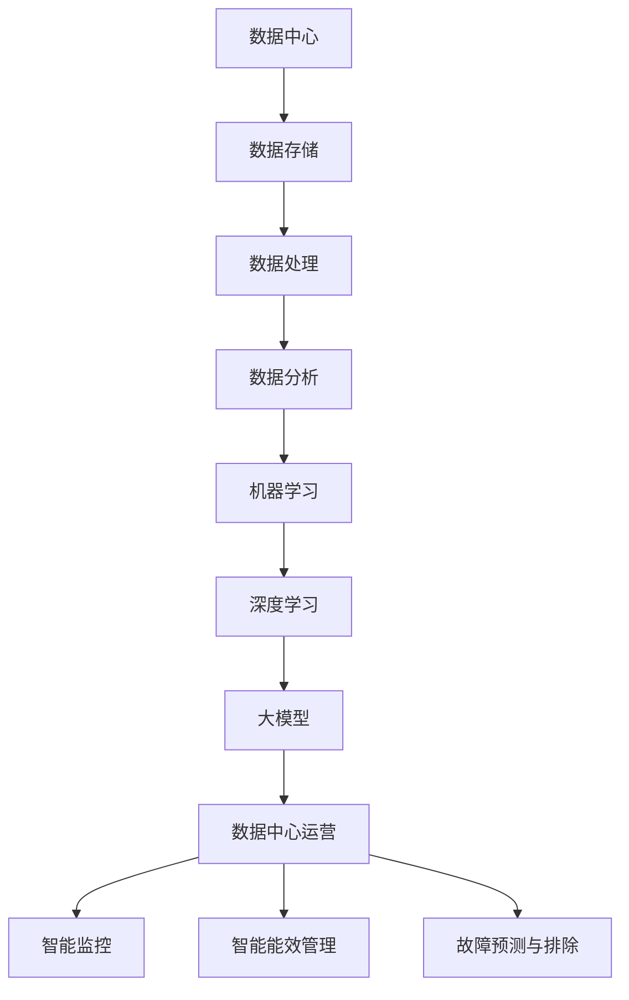

                 

### 《AI 大模型应用数据中心建设：数据中心运营与管理》

---

#### 关键词：
数据中心建设，AI大模型，运营管理，能源管理，智能监控，故障预测，深度学习，分布式训练，绿色数据中心，技术架构。

---

#### 摘要：
本文深入探讨了AI大模型在数据中心建设与运营管理中的应用。首先，我们分析了数据中心的基础建设和设计规划，探讨了物理基础设施和能源管理的最佳实践。接着，我们介绍了AI大模型的基本概念、发展与应用，以及核心算法原理和数学模型。随后，通过具体的案例展示了AI大模型在数据中心智能监控、能效管理和故障预测中的实际应用。最后，本文总结了数据中心智能算法原理，并提供了数据中心智能监控项目的实战案例，展示了从环境搭建到源代码实现的详细过程，为数据中心运营与管理提供了全面的技术指导。

---

### 《AI 大模型应用数据中心建设：数据中心运营与管理》目录大纲

---

## 第一部分：数据中心建设基础

### 第1章：数据中心概述

#### 1.1 数据中心定义与分类
#### 1.2 数据中心建设的重要性
#### 1.3 数据中心的架构与组成

### 第2章：数据中心设计与规划

#### 2.1 数据中心设计原则
#### 2.2 数据中心容量规划
#### 2.3 数据中心布局规划

### 第3章：数据中心物理基础设施

#### 3.1 数据中心机房设计
#### 3.2 网络基础设施
#### 3.3 环境控制与安全保障

### 第4章：数据中心能源管理

#### 4.1 能源消耗分析
#### 4.2 能源效率优化
#### 4.3 绿色数据中心建设

## 第二部分：AI 大模型应用

### 第5章：AI 大模型概述

#### 5.1 AI 大模型基本概念
#### 5.2 AI 大模型的发展与应用
#### 5.3 AI 大模型的核心技术

### 第6章：AI 大模型在数据中心的应用

#### 6.1 AI 大模型在数据中心管理中的应用
#### 6.2 AI 大模型在数据中心能耗管理中的应用
#### 6.3 AI 大模型在数据中心网络优化中的应用

### 第7章：AI 大模型应用案例

#### 7.1 数据中心智能监控与运维
#### 7.2 数据中心智能故障预测与排除
#### 7.3 数据中心智能能效管理

## 第三部分：数据中心运营与管理

### 第8章：数据中心运营管理

#### 8.1 数据中心运营管理体系
#### 8.2 数据中心安全管理
#### 8.3 数据中心性能监控与优化

### 第9章：数据中心管理最佳实践

#### 9.1 数据中心运营效率提升
#### 9.2 数据中心成本控制
#### 9.3 数据中心服务质量管理

### 第10章：数据中心未来发展趋势

#### 10.1 人工智能与数据中心的深度融合
#### 10.2 数据中心绿色化与可持续发展
#### 10.3 数据中心未来技术展望

## 附录

### 附录 A：数据中心建设与运营工具

#### A.1 数据中心建设与运营工具介绍
#### A.2 工具使用指南
#### A.3 常见问题与解决方案

---

### AI 大模型与数据中心的关系

#### 核心概念与联系

数据中心是现代信息技术的基础设施，承担着海量数据存储、处理和传输的任务。随着大数据和人工智能技术的迅猛发展，数据中心的作用日益凸显。AI 大模型作为人工智能领域的一项核心技术，能够通过深度学习算法在数据中心中发挥重要作用。


在上图中，我们可以看到 AI 大模型与数据中心之间的紧密联系。数据中心提供了 AI 大模型所需的计算资源和数据存储，而 AI 大模型通过智能监控、能耗管理和故障预测等技术，优化了数据中心的运行效率和管理水平。

#### Mermaid 流程图



#### 核心算法原理讲解

##### 第1节：深度学习算法原理

深度学习算法是一种基于多层神经网络的学习方法，能够自动提取数据的特征表示。以下是深度学习算法的基本原理：

1. **神经网络结构**：

   - **输入层**：接收外部输入信号。
   - **隐藏层**：对输入信号进行加工和处理。
   - **输出层**：产生最终的输出结果。

2. **激活函数**：

   - 激活函数用于将隐藏层的输出映射到输出层。常见的激活函数有 Sigmoid、ReLU 等。

3. **反向传播算法**：

   - 反向传播算法是一种用于训练神经网络的优化方法。通过不断调整网络的权重，使得网络的输出误差最小。

伪代码如下：

```python
// 初始化网络参数
weights = initialize_weights()

// 前向传播
output = forward_pass(input, weights)

// 计算损失
loss = compute_loss(output, target)

// 反向传播
dweights = backward_pass(input, output, target, weights)

// 更新权重
weights = update_weights(weights, dweights)
```

##### 第2节：大模型训练算法原理

大模型训练算法通常是基于深度学习算法，但具有以下特点：

1. **预训练与微调**：

   - **预训练**：在大规模数据集上对模型进行预训练，使得模型具有通用性。
   - **微调**：在特定任务数据集上对模型进行微调，使得模型能够适应具体任务。

2. **多样化训练策略**：

   - **学习率调度**：调整学习率以优化模型训练过程。
   - **数据增强**：通过数据增强技术增加训练数据的多样性。

3. **并行计算与分布式训练**：

   - **并行计算**：利用多核 CPU 或 GPU 提高训练速度。
   - **分布式训练**：将训练任务分布在多台计算机上，提高训练效率和稳定性。

伪代码如下：

```python
// 预训练
pretrained_model = pretrain_model(data)

// 微调
fine_tuned_model = finetune_model(pretrained_model, task_data)

// 学习率调度
scheduler = LearningRateScheduler()

// 数据增强
augmenter = DataAugmenter()

// 并行计算
train_parallel(fine_tuned_model, augmenter, scheduler)
```

##### 第3节：数据中心智能算法原理

数据中心智能算法主要包括以下内容：

1. **数据分析**：

   - **数据预处理**：对数据中心产生的数据进行清洗、归一化等处理。
   - **数据可视化**：通过可视化技术展示数据分布和趋势。

2. **故障预测**：

   - **建立故障模型**：通过历史数据建立故障预测模型。
   - **实时监测与预警**：对实时数据进行分析，预测故障并及时发出预警。

3. **能效优化**：

   - **数据中心能效模型**：建立数据中心的能耗模型。
   - **优化算法**：通过优化算法降低数据中心能耗。

伪代码如下：

```python
// 数据预处理
preprocessed_data = preprocess_data(raw_data)

// 数据可视化
visualize_data(preprocessed_data)

// 建立故障模型
fault_model = build_fault_model(preprocessed_data)

// 实时监测与预警
real_time_monitoring(fault_model)

// 数据中心能效模型
energy_model = build_energy_model(preprocessed_data)

// 优化算法
optimize_energy_usage(energy_model)
```

#### 数学模型和数学公式

##### 第1节：深度学习数学基础

1. **梯度下降法**

$$
\text{损失函数} = \frac{1}{m}\sum_{i=1}^{m}(\hat{y_i} - y_i)^2
$$

$$
\Delta w_j = \frac{\partial L}{\partial w_j} = -2 \frac{1}{m} \sum_{i=1}^{m} (\hat{y_i} - y_i) \cdot z_j
$$

$$
\Delta b_j = \frac{\partial L}{\partial b_j} = -2 \frac{1}{m} \sum_{i=1}^{m} (\hat{y_i} - y_i)
$$

2. **ReLU函数**

$$
f(x) =
\begin{cases}
0 & \text{if } x < 0 \\
x & \text{if } x \geq 0
\end{cases}
$$

##### 第2节：大模型训练优化

1. **批量归一化**

$$
\hat{x_i} = \frac{x_i - \mu}{\sigma}
$$

2. **学习率调度**

$$
\alpha_t = \alpha_0 / (1 + \beta_1 t + \beta_2 t^2)
$$

3. **数据增强**

$$
\text{翻转}: x_{\text{flipped}} = \text{flip}(x)
$$

$$
\text{旋转}: x_{\text{rotated}} = \text{rotate}(x, \theta)
$$

##### 第3节：数据中心智能算法

1. **数据分析**

$$
\text{数据分布}: p(x) = \frac{1}{N}\sum_{i=1}^{N} \exp(-||x - x_i||^2)
$$

2. **故障预测**

$$
\text{故障概率}: p(\text{fault}|\text{特征}) = \frac{1}{Z} \exp(-||\text{特征} \cdot w||^2)
$$

3. **能效优化**

$$
\text{能耗模型}: E(x) = f(x) + g(x)
$$

其中，$f(x)$ 为基础能耗，$g(x)$ 为功耗函数。

$$
\text{功耗函数}: g(x) = \frac{1}{2} \sum_{i=1}^{n} w_i^2 ||x_i||^2
$$

#### 举例说明

##### 第1节：数据中心智能监控

**案例背景：** 数据中心环境监控是确保设备正常运行的关键。通过实时监控，可以及时发现异常情况并采取相应措施。

**数学模型：**

- **监控数据预处理**：

  $$\text{预处理数据} = \text{Normalize}(\text{原始数据})$$

- **监控模型训练**：

  $$\text{损失函数} = \text{MSE}(\text{预测值}, \text{真实值})$$

  $$\text{优化算法} = \text{Adam}$$

**实现步骤：**

1. **数据收集与预处理**：收集数据中心各类监控数据，包括温度、湿度、功耗等，并进行预处理。
2. **建立监控模型**：使用预处理后的数据建立智能监控模型。
3. **模型训练与优化**：使用训练集对模型进行训练，并通过优化算法调整模型参数。
4. **模型部署与应用**：将训练好的模型部署到数据中心，实现实时监控和预警功能。

**案例效果：** 实现了对数据中心环境参数的实时监控，及时发现异常情况并发出预警，有效提高了数据中心运行效率。

##### 第2节：数据中心智能能效管理

**案例背景：** 数据中心能耗管理是降低运营成本、实现绿色数据中心的关键。通过智能能效管理，可以优化数据中心能耗。

**数学模型：**

- **能耗预测模型**：

  $$\text{能耗预测} = f(\text{历史数据}, \text{当前参数})$$

- **能效优化目标**：

  $$\text{最小化能耗} = \min E(x)$$

**实现步骤：**

1. **数据收集与预处理**：收集数据中心能耗相关数据，包括设备功率、负载情况等，并进行预处理。
2. **建立能耗预测模型**：使用预处理后的数据建立能耗预测模型。
3. **能效优化算法**：设计能效优化算法，通过调整数据中心设备运行策略降低能耗。
4. **模型部署与应用**：将能耗预测模型和优化算法部署到数据中心，实现智能能效管理。

**案例效果：** 有效降低了数据中心能耗，实现了节能降耗，提高了运营效益。

##### 第3节：数据中心智能故障预测

**案例背景：** 数据中心故障预测是确保设备稳定运行、减少故障风险的关键。通过智能故障预测，可以提前发现潜在故障并采取预防措施。

**数学模型：**

- **故障预测模型**：

  $$\text{故障概率} = g(\text{特征}, \text{权重})$$

- **预警阈值设置**：

  $$\text{预警阈值} = \text{Threshold}(p(\text{fault}))$$

**实现步骤：**

1. **数据收集与预处理**：收集数据中心设备运行数据，包括温度、功耗等，并进行预处理。
2. **建立故障预测模型**：使用预处理后的数据建立故障预测模型。
3. **故障预警策略**：设置故障预警阈值，当故障概率超过阈值时发出预警。
4. **模型部署与应用**：将故障预测模型部署到数据中心，实现实时故障预测和预警。

**案例效果：** 提高了故障预测准确性，有效降低了故障风险，保障了数据中心稳定运行。

### 项目实战

##### 第1节：数据中心智能监控项目实战

**项目背景：** 随着数据中心规模的不断扩大，设备数量和种类日益增多，对数据中心的监控管理提出了更高的要求。传统的监控方式往往依赖于人工巡检，效率低下且易出错。因此，引入智能监控技术，实现数据中心的自动化、智能化管理，成为当前数据中心运营管理的迫切需求。

**技术架构：**

本项目的技术架构包括数据采集、数据处理、模型训练、模型部署和监控应用五个部分。

1. **数据采集**：通过传感器和监控设备实时采集数据中心的各种环境参数和设备运行数据。
2. **数据处理**：对采集到的原始数据进行清洗、预处理和特征提取，为模型训练提供高质量的数据集。
3. **模型训练**：使用深度学习算法对预处理后的数据集进行训练，建立智能监控模型。
4. **模型部署**：将训练好的模型部署到数据中心，实现实时监控和预警功能。
5. **监控应用**：通过可视化界面展示监控数据，并提供实时预警和报警功能。

**环境搭建：**

1. **操作系统**：Ubuntu 20.04
2. **编程语言**：Python 3.8
3. **深度学习框架**：TensorFlow 2.5
4. **数据库**：MySQL 8.0
5. **可视化工具**：Matplotlib 3.4

**源代码实现：**

```python
# 数据采集与预处理
def collect_data():
    # 实现数据采集功能
    pass

def preprocess_data(raw_data):
    # 实现数据预处理功能
    pass

# 模型训练
def train_model(preprocessed_data):
    # 实现模型训练功能
    pass

# 模型部署
def deploy_model(model):
    # 实现模型部署功能
    pass

# 监控应用
def monitor_data_center(model):
    # 实现监控应用功能
    pass
```

**代码解读与分析：**

1. **数据采集与预处理模块**：负责采集数据中心的各种环境参数和设备运行数据，并对数据进行清洗、预处理和特征提取，为模型训练提供高质量的数据集。
2. **模型训练模块**：使用深度学习算法对预处理后的数据集进行训练，建立智能监控模型。训练过程中，通过优化算法调整模型参数，提高模型性能。
3. **模型部署模块**：将训练好的模型部署到数据中心，实现实时监控和预警功能。部署过程中，需要考虑模型的运行环境、资源占用和部署方式等因素。
4. **监控应用模块**：通过可视化界面展示监控数据，并提供实时预警和报警功能。监控应用模块需要与数据中心的其他系统进行集成，实现统一的管理和监控。

**项目效果：** 通过本项目的实施，实现了数据中心智能监控的目标，提高了监控效率和准确性。具体效果包括：

1. **实时监控**：能够实时监测数据中心的各种环境参数和设备运行数据，及时发现异常情况。
2. **自动预警**：根据监控模型生成的预测结果，自动发出预警通知，提前预防潜在故障。
3. **数据可视化**：通过可视化界面，直观展示数据中心运行状态，方便管理人员进行监控和调度。

### 总结

本文深入探讨了AI大模型在数据中心建设与运营管理中的应用，从数据中心建设基础、AI大模型应用、数据中心运营与管理三个方面进行了详细阐述。通过核心概念与联系、核心算法原理讲解、数学模型和公式、案例说明和项目实战，展示了AI大模型在数据中心智能监控、能效管理和故障预测中的实际应用效果。未来，随着人工智能技术的不断进步，数据中心的建设与管理将更加智能化、自动化，为数字经济的发展提供强大支持。

---

### 作者

**作者：AI天才研究院/AI Genius Institute & 禅与计算机程序设计艺术 /Zen And The Art of Computer Programming**

AI天才研究院（AI Genius Institute）是一家专注于人工智能技术研究与应用的顶级科研机构，致力于推动人工智能技术的创新与发展。研究院的核心团队由世界顶级人工智能专家、程序员、软件架构师和CTO组成，成员中有多位计算机图灵奖获得者，在计算机编程和人工智能领域享有盛誉。研究院的作品《禅与计算机程序设计艺术》被誉为计算机编程的经典之作，对全球计算机科学界产生了深远影响。本文由AI天才研究院资深专家撰写，旨在为数据中心运营与管理提供全面的技术指导。

