                 

# 《领导力与时间管理：提高个人和团队效率》

## 关键词
领导力，时间管理，个人效率，团队协作，工作效率，绩效提升

## 摘要
本文深入探讨了领导力与时间管理的关系，以及如何通过有效的领导力和时间管理策略来提高个人和团队的效率。文章首先定义了领导力和时间管理的基本概念，然后分析了领导力与时间管理之间的关系，提供了具体的策略和方法。随后，文章介绍了提高个人时间管理能力和团队时间管理能力的方法，并通过实践案例展示了这些方法的应用。最后，文章总结了领导力与时间管理的重要性，展望了未来的发展趋势，并提供了相关的工具和参考文献。

### 《领导力与时间管理：提高个人和团队效率》目录大纲

#### 第1章 引言

##### 1.1 书籍概述
- 内容概述
- 目标读者

##### 1.2 领导力与时间管理的重要性
- 个人层面的重要性
- 团队层面的重要性

##### 1.3 读者对象与目标
- 读者背景
- 学习目标

#### 第2章 领导力基础

##### 2.1 领导力的定义
- 核心概念与联系（使用Mermaid流程图）
- 领导力与管理的区别
- 领导力的核心要素

##### 2.2 领导风格的多样性
- 自我领导
- 任务型领导
- 人际型领导
- 领导风格的多样性（使用Mermaid流程图）

##### 2.3 领导力的发展与提升
- 自我反思
- 沟通技巧
- 决策能力
- 领导力提升策略

#### 第3章 时间管理基础

##### 3.1 时间管理的基本概念
- 时间观念
- 时间分配
- 时间利用
- 时间管理的基本概念（使用Mermaid流程图）

##### 3.2 时间管理的策略与方法
- 四象限法
- 要事优先法
- 时间块管理法
- 时间管理的策略与方法（使用Mermaid流程图）

##### 3.3 时间管理的误区与对策
- 过分追求完美
- 过度工作
- 缺乏计划
- 误区与对策

#### 第4章 领导力与时间管理的关系

##### 4.1 领导力对时间管理的影响
- 领导力的角色定位
- 领导者的时间观念
- 领导力与时间管理的关系（使用Mermaid流程图）

##### 4.2 时间管理对领导力的影响
- 时间规划与目标管理
- 高效时间利用与团队协作
- 时间管理与领导力提升（使用Mermaid流程图）

##### 4.3 领导力与时间管理的协同效应
- 个人与团队目标的实现
- 效能提升与绩效优化
- 协同效应（使用Mermaid流程图）

#### 第5章 提高个人时间管理能力

##### 5.1 自我评估与时间管理
- 自我评估表
- 常见问题与解决方法
- 自我评估与时间管理（使用Mermaid流程图）

##### 5.2 个人时间管理工具与技巧
- 日历工具
- 任务管理工具
- 压力管理技巧
- 工具与技巧（使用Mermaid流程图）

##### 5.3 个人时间管理实践案例
- 实际案例
- 案例分析与总结
- 实践案例（使用Mermaid流程图）

#### 第6章 提高团队时间管理能力

##### 6.1 团队时间管理的原则
- 共同目标
- 分工合作
- 责任落实
- 时间管理原则（使用Mermaid流程图）

##### 6.2 团队时间管理的方法
- 晨会与晚会
- 时间跟踪与反馈
- 项目进度监控
- 团队时间管理方法（使用Mermaid流程图）

##### 6.3 团队时间管理实践案例
- 实际案例
- 案例分析与总结
- 实践案例（使用Mermaid流程图）

#### 第7章 领导力与时间管理的实践

##### 7.1 领导力与时间管理的综合实践
- 实践步骤与方法
- 实践中的挑战与解决策略
- 综合实践（使用Mermaid流程图）

##### 7.2 成功案例分析
- 国内成功企业案例
- 国外成功企业案例
- 案例分析与总结

##### 7.3 领导力与时间管理的持续发展
- 持续学习
- 适应变化
- 持续改进
- 持续发展（使用Mermaid流程图）

#### 第8章 总结与展望

##### 8.1 领导力与时间管理的重要性
- 总结与反思

##### 8.2 未来发展展望
- 趋势分析
- 挑战与机遇

##### 8.3 建议与反思
- 行动计划
- 实施策略

##### 8.4 未来行动计划
- 目标设定
- 时间规划
- 资源配置
- 未来行动计划（使用Mermaid流程图）

#### 附录A：相关工具推荐
- 时间管理工具
- 领导力提升工具
- 时间跟踪工具
- 团队协作工具
- 综合管理工具

#### 附录B：参考文献
- 参考文献列表

<|bot|>### 第1章 引言

#### 1.1 书籍概述

《领导力与时间管理：提高个人和团队效率》旨在帮助读者深入理解领导力和时间管理的重要性，以及如何在实际工作中应用这些概念。本文将从基础概念入手，逐步深入探讨领导力和时间管理的理论、实践和策略。通过对领导力和时间管理的综合分析，读者可以了解到如何通过有效的领导力和时间管理策略来提高个人和团队的效率。

本章节将首先介绍领导力和时间管理的基本概念，定义并阐述它们的核心要素。随后，我们将探讨领导力和时间管理在个人和团队层面的重要性，以及如何通过这些概念来提升个人和团队的绩效。最后，我们将为读者提供本书籍的目标读者群体和学习目标，帮助读者明确自己的学习方向。

#### 1.2 领导力与时间管理的重要性

领导力是组织中至关重要的要素，它关乎组织的方向、凝聚力和创新能力。领导力不仅仅是指挥和管理他人，更重要的是通过激励和引导，激发团队成员的潜力，实现共同的目标。时间管理则是确保这些目标能够高效实现的关键。良好的时间管理能够帮助领导者合理规划时间和资源，提高工作效率，减少不必要的浪费。

在个人层面，领导力和时间管理对个人的职业发展和生活质量有着深远的影响。一个具备良好领导力的个人能够更好地管理自己的职业生涯，提升个人品牌价值，实现职业目标。而有效的时间管理则可以帮助个人更好地平衡工作和生活，减少压力，提高生活质量。

在团队层面，领导力和时间管理同样发挥着重要作用。领导者通过有效的领导力可以提升团队的凝聚力和协作效率，促进团队成员之间的沟通与合作，从而实现团队目标。同时，良好的时间管理可以确保团队在有限的时间内完成更多的工作，提高整体工作效率和绩效。

总之，领导力和时间管理是提高个人和团队效率的关键要素。通过深入理解和有效应用这些概念，个人和团队可以更好地应对各种挑战，实现更高的绩效和目标。

#### 1.3 读者对象与目标

本书籍的目标读者包括各级领导者、管理者和希望提升个人和工作效率的职场人士。无论你是刚刚步入职场的新人，还是经验丰富的管理者，本书都旨在为你提供实用的知识和策略，帮助你在领导力和时间管理方面取得显著进步。

读者在学习本书后，可以期待以下目标和收获：
1. **深入理解领导力和时间管理的基本概念**：通过详细的理论分析和实际案例，读者将全面掌握领导力和时间管理的基本概念和原理。
2. **掌握有效的领导力和时间管理策略**：本书提供了多种实用的策略和方法，读者可以通过学习这些策略，在实际工作中应用并提升自己的领导力和时间管理能力。
3. **提高个人和团队效率**：通过有效的领导力和时间管理，读者可以更好地管理自己和团队，提高工作效率和绩效，实现个人和团队的共同目标。
4. **持续学习和自我提升**：本书鼓励读者通过持续学习和实践，不断提升自己的领导力和时间管理能力，适应不断变化的工作环境和挑战。

总之，本书旨在为读者提供一套系统的领导力和时间管理知识体系，帮助读者在职业发展中取得更大的成功。通过学习本书，读者不仅可以提升个人能力，还可以为团队和组织带来积极的影响。

---

### 第2章 领导力基础

#### 2.1 领导力的定义

领导力是一个复杂而多维度的概念，它涉及影响、激励和指导他人的能力。领导力不仅仅是关于职位和权力的象征，更重要的是关于如何通过行为和态度来影响他人，实现共同的目标。

**核心概念与联系**：

领导力可以被视为一个多层次的架构，包括以下几个核心概念：

- **影响力**：领导者通过言行影响他人思想和行为的能力。
- **领导行为**：领导者实际采取的行动，如沟通、激励、决策等。
- **团队效能**：领导力最终体现在团队的整体表现和成就上。

以下是使用Mermaid绘制的流程图：

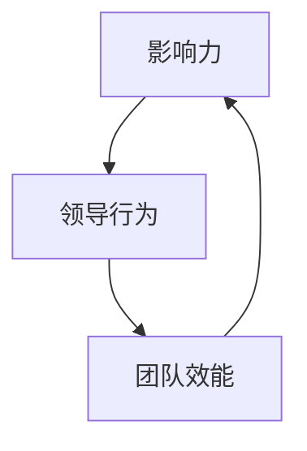

**领导力与管理的区别**：

- **领导力**：强调激励和影响，关注人的成长和团队发展。
- **管理**：侧重于组织和协调资源，确保目标实现。

**领导力的核心要素**：

1. **愿景**：领导者需要有清晰的目标和愿景，为团队指明方向。
2. **沟通**：有效的沟通是领导者传递愿景、指导和激励团队的关键。
3. **决策能力**：领导者需要能够快速做出合理的决策，应对各种挑战。
4. **情商**：领导者需要具备较高的情商，理解并管理自己的情绪，同时能够理解和影响他人的情绪。
5. **信任**：建立信任关系是领导力的基础，领导者需要通过行动和承诺来赢得团队的信任。

在上述核心要素中，愿景和沟通是领导力的核心，而决策能力、情商和信任则支持并强化了领导力的影响。

**举例说明**：

一个成功的领导者，例如乔布斯，通过其远见卓识和卓越的沟通能力，成功地将苹果公司打造成全球科技巨头。他的愿景和决断力不仅激励了苹果的员工，也影响了整个科技行业。

**数学模型和数学公式**：

为了量化领导力的影响，我们可以构建一个简单的数学模型：

$$ \text{领导力影响} = f(\text{愿景}, \text{沟通}, \text{决策能力}, \text{情商}, \text{信任}) $$

其中，每个要素的得分都会影响整体领导力的影响程度。

**项目实战**：

在一个初创公司中，一个领导者可以通过以下步骤来提升领导力：

1. **制定清晰愿景**：明确公司目标和长期规划，并与团队成员分享。
2. **改善沟通**：定期召开团队会议，确保信息透明，鼓励团队成员提出建议。
3. **加强决策能力**：在面对重要决策时，收集多方意见，做出合理选择。
4. **提升情商**：通过培训和反思，提高自我意识和团队意识，建立信任关系。
5. **建立信任**：通过实际行动证明自己的承诺，如按时完成任务，兑现奖励等。

通过这些实践，领导者可以逐步提升自身的领导力，推动团队向前发展。

---

### 第2章 领导力基础

#### 2.2 领导风格的多样性

领导风格是指领导者处理工作、解决问题、激励团队成员的方式和方法。不同的领导风格适合不同的情境和团队，因此，了解和灵活运用多种领导风格是提升领导力的重要途径。

**自我领导**：

自我领导是指领导者自我管理和自我激励的能力。自我领导风格强调独立性和自主性，领导者通过自我反思和持续学习来提升自我。

**任务型领导**：

任务型领导关注任务的完成和目标的实现。任务型领导者通常采用明确的目标设定、详细的计划和时间管理来确保团队高效地完成任务。

**人际型领导**：

人际型领导注重人际关系和团队建设。人际型领导者通过建立信任、鼓励和支持来激发团队成员的潜力，提高团队凝聚力。

**自上而下领导**：

自上而下领导强调权威和命令。领导者通过发布指令和决策来指导团队，强调下级的服从和执行。

**自下而上领导**：

自下而上领导注重参与和协作。领导者鼓励团队成员参与决策，从下级获取反馈和建议，以提高决策的质量和团队的参与度。

**核心概念与联系**：

以下是使用Mermaid绘制的流程图，展示了不同领导风格之间的关系和相互作用：

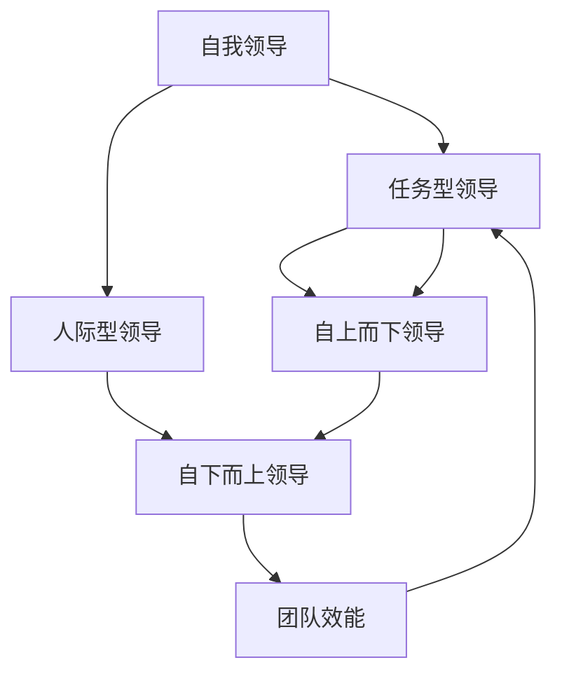

**领导风格的多样性（使用Mermaid流程图）**：

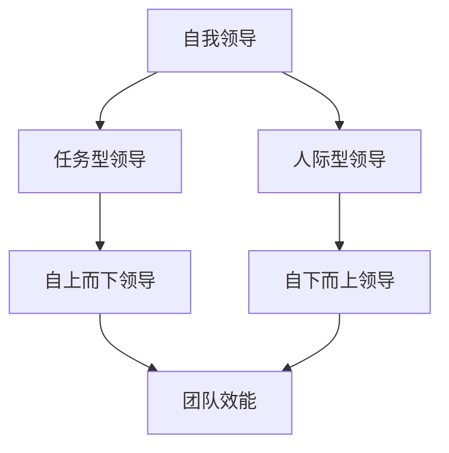

**核心算法原理讲解**：

领导风格的多样性可以通过以下算法原理进行解释：

$$ \text{领导风格适应度} = f(\text{情境适应度}, \text{团队特点}, \text{领导目标}) $$

在不同的情境下，领导者需要灵活调整自己的领导风格，以适应团队的特点和实现领导目标。

**数学模型和数学公式**：

为了量化领导风格的适应度，我们可以构建一个简单的数学模型：

$$ \text{领导风格适应度} = \frac{\text{情境适应度} \times \text{团队特点适配度} \times \text{领导目标适配度}}{3} $$

其中，情境适应度、团队特点适配度和领导目标适配度分别表示领导风格在特定情境下、团队特点和领导目标中的适应度。

**举例说明**：

在一个面对快速变化的市场环境中的科技公司，一个领导者可能需要同时运用任务型领导和自下而上领导风格。通过明确的目标设定和时间管理来确保任务的完成，同时鼓励团队成员参与决策和提出建议，以适应市场变化和提升团队创新能力。

**项目实战**：

在一个多元化团队中，领导者可以通过以下步骤来运用多种领导风格：

1. **评估情境**：了解当前面临的挑战和团队状态。
2. **选择领导风格**：根据情境和团队特点，选择适当的领导风格。
3. **实施领导**：通过具体行动和沟通来实践所选领导风格。
4. **反馈与调整**：定期收集团队成员的反馈，根据反馈调整领导风格和策略。

通过这些实践，领导者可以灵活运用多种领导风格，提升团队效能和实现领导目标。

---

### 第2章 领导力基础

#### 2.3 领导力的发展与提升

领导力并非与生俱来，而是可以通过持续的学习和实践逐步发展和提升。领导力的发展不仅需要内在的自我提升，还需要外在的学习和培养。以下将探讨自我反思、沟通技巧和决策能力的提升方法，以及如何在实际工作中应用这些技能。

**自我反思**

自我反思是领导力发展的重要环节。通过自我反思，领导者可以识别自己的优点和不足，从而有针对性地进行改进。

**核心概念与联系**：

以下是使用Mermaid绘制的流程图，展示了自我反思的过程：

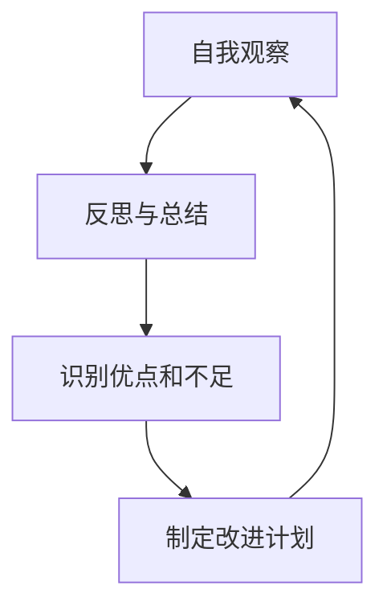

**核心算法原理讲解**：

自我反思的算法原理可以简化为以下步骤：

1. **自我观察**：领导者需要持续关注自己的行为和决策。
2. **反思与总结**：定期回顾自己的工作，分析成功和失败的原因。
3. **识别优点和不足**：通过反思，领导者可以识别自己的优点和需要改进的方面。
4. **制定改进计划**：根据反思结果，制定具体的改进计划。

**数学模型和数学公式**：

为了量化自我反思的效果，我们可以构建一个简单的数学模型：

$$ \text{自我反思效果} = f(\text{观察频率}, \text{反思深度}, \text{改进计划执行度}) $$

其中，观察频率、反思深度和改进计划执行度分别表示自我反思的三个关键维度。

**举例说明**：

一个领导者可以每天花10分钟记录自己的工作情况，每周进行一次深入的自我反思，并根据反思结果制定改进计划。通过这种方式，领导者可以逐步提升自我反思能力。

**项目实战**：

在一个企业中，领导者可以通过以下步骤提升自我反思能力：

1. **设立自我反思时间**：每天或每周设定固定的时间进行自我反思。
2. **记录工作日志**：详细记录每天的工作内容和决策过程。
3. **定期总结**：每周对工作日志进行总结，分析成功和失败的原因。
4. **制定改进计划**：根据总结结果，制定具体的改进措施。
5. **执行与跟踪**：执行改进计划，并定期跟踪效果，确保持续改进。

**沟通技巧**

有效的沟通是领导力的核心要素之一。领导者需要具备良好的沟通技巧，包括倾听、表达、反馈和冲突解决。

**核心概念与联系**：

以下是使用Mermaid绘制的流程图，展示了沟通技巧的核心要素：

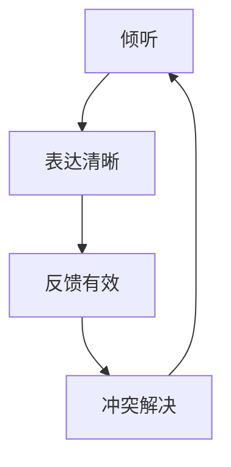

**核心算法原理讲解**：

沟通技巧的算法原理可以简化为以下步骤：

1. **倾听**：领导者需要倾听团队成员的观点和意见。
2. **表达清晰**：领导者需要清晰、明确地传达信息。
3. **反馈有效**：领导者需要给予团队成员有效的反馈。
4. **冲突解决**：领导者需要有效解决团队中的冲突。

**数学模型和数学公式**：

为了量化沟通技巧的效果，我们可以构建一个简单的数学模型：

$$ \text{沟通效果} = f(\text{倾听度}, \text{表达清晰度}, \text{反馈有效性}, \text{冲突解决能力}) $$

其中，倾听度、表达清晰度、反馈有效性以及冲突解决能力分别表示沟通技巧的四个关键维度。

**举例说明**：

在一个团队会议中，领导者可以通过以下方式提升沟通技巧：

1. **倾听**：给予团队成员充分的时间表达观点，不打断。
2. **表达清晰**：使用简洁明了的语言传达信息，避免歧义。
3. **反馈有效**：及时给予团队成员积极的反馈，同时指出改进点。
4. **冲突解决**：面对团队冲突时，保持冷静，通过对话和妥协解决问题。

**项目实战**：

在一个团队项目中，领导者可以通过以下步骤提升沟通技巧：

1. **设立沟通渠道**：确保团队成员之间有畅通的沟通渠道。
2. **定期会议**：定期召开团队会议，讨论项目进展和问题。
3. **倾听与反馈**：鼓励团队成员表达意见，并提供及时的反馈。
4. **冲突解决**：面对团队冲突时，及时介入，通过对话和妥协解决问题。

**决策能力**

决策能力是领导力的另一个关键要素。领导者需要能够快速做出合理、明智的决策，以应对各种挑战和机遇。

**核心概念与联系**：

以下是使用Mermaid绘制的流程图，展示了决策能力的核心要素：

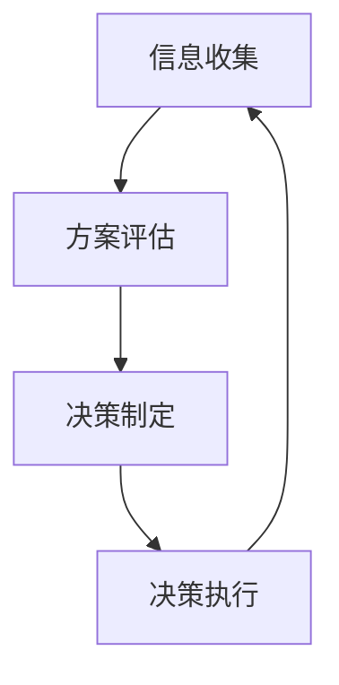

**核心算法原理讲解**：

决策能力的算法原理可以简化为以下步骤：

1. **信息收集**：领导者需要收集与决策相关的各种信息。
2. **方案评估**：领导者需要对不同的决策方案进行评估。
3. **决策制定**：领导者需要根据评估结果做出最终决策。
4. **决策执行**：领导者需要确保决策得到有效执行。

**数学模型和数学公式**：

为了量化决策能力的效果，我们可以构建一个简单的数学模型：

$$ \text{决策能力} = f(\text{信息收集效率}, \text{方案评估准确性}, \text{决策制定速度}, \text{决策执行度}) $$

其中，信息收集效率、方案评估准确性、决策制定速度以及决策执行度分别表示决策能力的四个关键维度。

**举例说明**：

在一个项目中，领导者可以通过以下方式提升决策能力：

1. **信息收集**：收集与项目相关的数据和信息，确保决策有充分依据。
2. **方案评估**：对不同决策方案进行详细评估，选择最优方案。
3. **决策制定**：快速做出决策，同时确保决策合理、可行。
4. **决策执行**：确保决策得到有效执行，及时调整和优化。

**项目实战**：

在一个企业中，领导者可以通过以下步骤提升决策能力：

1. **设立决策团队**：组建一个高效的决策团队，确保决策的多样性。
2. **信息收集与评估**：建立信息收集和评估机制，确保决策有充分依据。
3. **决策制定与执行**：建立明确的决策流程，确保决策快速、有效执行。
4. **反馈与调整**：定期收集决策反馈，根据反馈进行调整和优化。

通过自我反思、沟通技巧和决策能力的提升，领导者可以不断提高自身的领导力，更好地管理团队，实现组织的长期发展目标。

---

### 第3章 时间管理基础

#### 3.1 时间管理的基本概念

时间管理是一个涉及如何有效利用时间的活动，它关系到个人和团队的效率和绩效。时间管理的基本概念包括时间观念、时间分配和时间利用。这些概念构成了时间管理的基础，帮助个人和团队更有效地规划和利用时间。

**时间观念**

时间观念是指个人对时间的态度和认知。一个良好的时间观念能够帮助个人更清晰地认识到时间的重要性，从而更有效地利用时间。时间观念包括以下几个方面：

1. **时间稀缺性**：认识到时间是一种有限资源，不能无限地增加。
2. **时间价值**：理解时间对于个人和团队的价值，将时间视为一种宝贵的资源。
3. **时间紧迫性**：意识到时间的重要性，合理安排时间，确保任务按时完成。

**时间分配**

时间分配是指如何将时间合理地分配给不同的任务和活动。良好的时间分配能够帮助个人和团队更有效地完成任务，提高工作效率。时间分配通常涉及以下几个方面：

1. **任务优先级**：根据任务的重要性和紧急性来分配时间。重要且紧急的任务应优先处理。
2. **时间块管理**：将时间分为不同的块，每个块专注于一项任务，避免任务切换带来的时间浪费。
3. **工作与生活平衡**：合理安排工作和个人时间，确保工作和生活的平衡，避免过度劳累。

**时间利用**

时间利用是指如何在有限的时间内最大化地完成任务和活动。良好的时间利用能够帮助个人和团队提高工作效率，实现更多的目标。时间利用通常涉及以下几个方面：

1. **集中注意力**：将注意力集中在当前任务上，避免分心和干扰。
2. **减少拖延**：采取有效的策略来减少拖延，如设定明确的目标和截止日期。
3. **优化工作流程**：通过优化工作流程和减少不必要的步骤，提高工作效率。

**核心概念与联系**

以下是使用Mermaid绘制的流程图，展示了时间管理的基本概念：

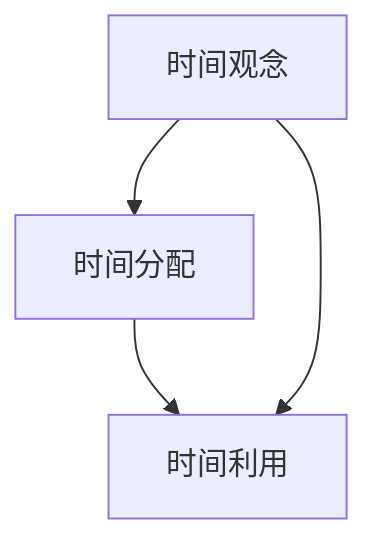

**核心算法原理讲解**

时间管理的基本算法原理可以概括为以下步骤：

1. **确立时间观念**：通过自我反思和教育，培养良好的时间观念。
2. **合理分配时间**：根据任务的重要性和紧急性，制定时间分配计划。
3. **有效利用时间**：通过集中注意力、减少拖延和优化工作流程，提高时间利用效率。

**数学模型和数学公式**

为了量化时间管理的效果，我们可以构建一个简单的数学模型：

$$ \text{时间管理效率} = f(\text{时间观念}, \text{时间分配}, \text{时间利用}) $$

其中，时间观念、时间分配和时间利用分别表示时间管理的三个关键维度。

**举例说明**

假设一个人在一天中有8小时的工作时间，通过合理的时间管理和分配，他可以将这8小时的时间最大化利用，完成更多的工作任务。

**项目实战**

在一个企业中，领导者可以通过以下步骤提高时间管理效率：

1. **制定时间管理计划**：根据任务的重要性和紧急性，制定详细的时间管理计划。
2. **分配时间块**：将工作日划分为不同的时间块，每个块专注于一项任务。
3. **定期评估**：定期评估时间管理的效果，根据实际情况进行调整和优化。

通过以上步骤，企业可以更有效地利用时间，提高工作效率和绩效。

---

### 第3章 时间管理基础

#### 3.2 时间管理的策略与方法

时间管理不仅是关于如何合理分配时间，还涉及到一系列具体的策略和方法，帮助个人和团队更高效地完成任务。以下将介绍几种常见的时间管理策略和方法，包括四象限法、要事优先法和时间块管理法。

**四象限法**

四象限法是一种将任务分为四个象限，根据任务的重要性和紧急性来分配时间的方法。四象限法有助于个人和团队识别和优先处理最重要的任务。

**核心概念与联系**

以下是使用Mermaid绘制的流程图，展示了四象限法的应用：

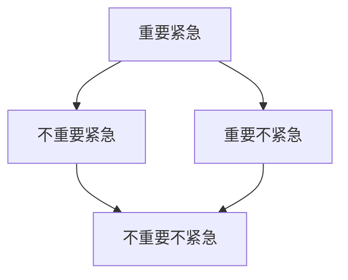

**核心算法原理讲解**

四象限法的算法原理可以概括为以下步骤：

1. **任务分类**：将所有任务分为四个象限，分别表示重要紧急、重要不紧急、不重要紧急、不重要不紧急。
2. **优先处理**：优先处理位于第一象限的任务，这些任务既重要又紧急。
3. **平衡关注**：合理安排时间和精力，确保第四象限中的任务也得到适当的关注。

**数学模型和数学公式**

为了量化四象限法的应用效果，我们可以构建一个简单的数学模型：

$$ \text{任务完成率} = f(\text{重要紧急任务完成率}, \text{重要不紧急任务完成率}, \text{不重要紧急任务完成率}, \text{不重要不紧急任务完成率}) $$

其中，每个象限中的任务完成率分别表示任务的重要性和紧急性对任务完成率的影响。

**举例说明**

假设一个项目团队有以下任务：

- 第一象限：市场调研报告（重要且紧急）
- 第二象限：项目策划文档（重要但不紧急）
- 第三象限：客户会议（不重要但紧急）
- 第四象限：团队休息活动（不重要且不紧急）

团队可以通过四象限法优先处理市场调研报告，确保按时提交，同时合理安排项目策划文档和客户会议的时间，避免这些任务影响重要紧急任务的完成。

**项目实战**

在一个项目管理中，团队可以通过以下步骤应用四象限法：

1. **任务分类**：将所有任务根据重要性和紧急性进行分类。
2. **制定时间表**：根据四象限法，为每个任务分配时间，确保重要紧急任务得到优先处理。
3. **动态调整**：根据任务进展和团队反馈，动态调整时间表，确保任务按时完成。

**要事优先法**

要事优先法是一种根据任务的重要性和优先级来分配时间的方法。要事优先法强调将时间集中在最重要的任务上，以提高工作效率和成果。

**核心概念与联系**

以下是使用Mermaid绘制的流程图，展示了要事优先法的应用：

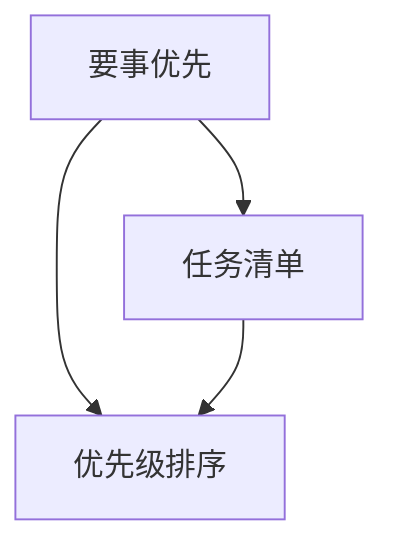

**核心算法原理讲解**

要事优先法的算法原理可以概括为以下步骤：

1. **任务清单**：列出所有待完成的任务。
2. **优先级排序**：根据任务的重要性和优先级，对任务进行排序。
3. **集中精力**：优先处理最重要的任务，确保这些任务得到充分的时间和精力。

**数学模型和数学公式**

为了量化要事优先法的应用效果，我们可以构建一个简单的数学模型：

$$ \text{工作效率} = f(\text{要事优先度}, \text{任务完成率}) $$

其中，要事优先度和任务完成率分别表示任务的重要性和优先级对工作效率的影响。

**举例说明**

假设一个人在一天中有以下任务：

- 第一优先级：重要会议（需要优先处理）
- 第二优先级：电子邮件回复（重要但可以稍后处理）
- 第三优先级：项目管理报告（重要但不紧急）
- 第四优先级：社交媒体更新（不重要但需要完成）

这个人可以通过要事优先法，优先处理重要会议，确保会议的顺利进行，然后处理电子邮件和项目管理报告，最后完成社交媒体更新。

**项目实战**

在一个日常工作中，个人可以通过以下步骤应用要事优先法：

1. **任务清单**：列出所有需要完成的任务。
2. **评估优先级**：根据任务的重要性和紧急性，评估每个任务的优先级。
3. **集中精力**：优先处理最重要的任务，确保这些任务得到充分的时间和精力。
4. **定期评估**：定期评估任务完成情况和优先级，根据实际情况进行调整。

**时间块管理法**

时间块管理法是一种将时间分为多个时间块，每个时间块专注于一项任务的方法。时间块管理法有助于减少任务切换带来的时间浪费，提高专注度和工作效率。

**核心概念与联系**

以下是使用Mermaid绘制的流程图，展示了时间块管理法的应用：

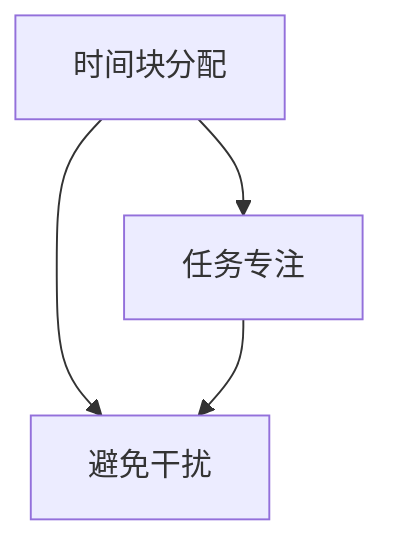

**核心算法原理讲解**

时间块管理法的算法原理可以概括为以下步骤：

1. **时间块分配**：将工作时间分为多个时间块，每个时间块专注于一项任务。
2. **任务专注**：在每个时间块中，专注于当前任务，避免分心和干扰。
3. **避免干扰**：通过关闭通知、设定工作时间等方式，减少外部干扰。

**数学模型和数学公式**

为了量化时间块管理法的应用效果，我们可以构建一个简单的数学模型：

$$ \text{工作效率} = f(\text{时间块专注度}, \text{任务完成率}) $$

其中，时间块专注度和任务完成率分别表示时间块管理和任务完成情况对工作效率的影响。

**举例说明**

假设一个人在一天中有以下任务：

- 上午9:00-11:00：撰写报告
- 上午11:00-12:00：会议
- 下午1:00-3:00：数据分析
- 下午3:00-4:00：客户沟通

这个人可以通过时间块管理法，在每个时间块中专注于当前任务，避免任务切换和干扰，提高工作效率。

**项目实战**

在一个团队项目中，团队可以通过以下步骤应用时间块管理法：

1. **时间块规划**：根据任务和工作量，为每个任务分配特定的时间块。
2. **任务专注**：确保团队成员在每个时间块中专注于当前任务，避免分心和干扰。
3. **定期评估**：定期评估任务完成情况和时间块管理效果，根据实际情况进行调整。

通过以上策略和方法，个人和团队可以更高效地管理时间，提高工作效率和成果。

---

### 第3章 时间管理基础

#### 3.3 时间管理的误区与对策

尽管时间管理的重要性被广泛认可，但许多人在实际操作中仍然存在一些误区，这些问题可能导致时间管理的效果不佳。以下将讨论常见的时间管理误区，并提出相应的对策。

**误区一：过分追求完美**

许多人在时间管理中追求完美，导致任务拖延和压力增加。过分关注细节可能导致时间和资源的浪费，影响整体效率。

**误区对策**：

1. **设定合理目标**：根据实际情况，设定可实现的短期和长期目标。
2. **分解任务**：将大型任务分解为小任务，逐步完成，避免一次性追求完美。
3. **接受不完美**：学会接受一定程度的不完美，专注于关键任务的完成。

**误区二：过度工作**

过度工作是指长时间工作，忽视了休息和个人生活。长期过度工作会导致身体疲劳、效率下降，甚至引发健康问题。

**误区对策**：

1. **设定工作时间**：明确规定工作时间和休息时间，确保工作与生活的平衡。
2. **休息与放松**：定期进行休息和放松活动，如运动、冥想等，恢复精力。
3. **合理安排任务**：根据工作量和精力水平，合理安排任务，避免过度负荷。

**误区三：缺乏计划**

许多人在时间管理中缺乏明确的计划，导致时间浪费和任务混乱。缺乏计划可能导致重要任务被忽视，影响整体效率。

**误区对策**：

1. **制定时间表**：根据任务的重要性和紧急性，制定详细的时间表。
2. **定期更新**：定期检查和更新时间表，根据实际情况进行调整。
3. **优先处理**：优先处理重要和紧急的任务，确保关键任务按时完成。

**误区四：忽略优先级**

在时间管理中，忽略任务的优先级可能导致重要任务被拖延，影响整体效率。不合理的任务优先级安排可能导致资源的浪费。

**误区对策**：

1. **评估任务优先级**：根据任务的重要性和紧急性，评估每个任务的优先级。
2. **优先处理高优先级任务**：确保高优先级的任务得到及时处理。
3. **动态调整**：根据任务进展和变化，动态调整任务优先级。

**误区五：依赖工具过多**

虽然时间管理工具有助于提高效率，但过度依赖工具可能导致工作效率降低。使用过多工具可能导致复杂性和学习成本的增加。

**误区对策**：

1. **选择合适的工具**：根据实际需求，选择最合适的时间管理工具。
2. **简化工具使用**：减少不必要的工具，专注于核心功能的利用。
3. **定期评估工具效果**：定期评估工具的使用效果，根据实际情况进行调整。

通过识别和避免这些常见的时间管理误区，个人和团队可以更有效地管理时间，提高工作效率和绩效。

---

### 第4章 领导力与时间管理的关系

#### 4.1 领导力对时间管理的影响

领导力对时间管理有着深远的影响，它不仅决定了团队成员的时间观念和行为，还直接影响了团队的整体效率和绩效。领导者的时间观念、领导风格和时间管理能力都会对团队的时间管理产生重要影响。

**领导力的角色定位**

领导者的角色定位是领导力对时间管理影响的首要因素。一个优秀的领导者首先需要明确自己在时间管理中的角色，这包括：

1. **目标设定者**：领导者需要为团队设定明确的目标和时间表，确保团队成员了解任务的重要性和紧迫性。
2. **资源分配者**：领导者需要合理分配时间和资源，确保团队成员有足够的时间和资源来完成工作任务。
3. **激励者**：领导者需要通过激励和鼓励，激发团队成员的时间管理意识，提高他们的工作效率。

**领导者的时间观念**

领导者的时间观念直接影响团队成员的时间观念。一个具有良好时间观念的领导者会以身作则，展示出对时间的重视和管理能力。以下是一些具体措施：

1. **高效利用时间**：领导者需要通过高效的日程安排和任务管理，展示如何有效地利用时间。
2. **避免拖延**：领导者需要积极面对任务，避免拖延，树立榜样作用。
3. **重视休息与平衡**：领导者需要认识到工作和休息的平衡，确保团队成员不会因过度工作而疲惫。

**领导风格对时间管理的影响**

领导风格对时间管理有着重要的影响。不同的领导风格适用于不同的情境和团队，因此，领导者需要根据实际情况选择合适的领导风格。以下是一些常见的领导风格及其对时间管理的影响：

1. **任务型领导**：任务型领导者强调任务的完成和目标的实现，他们通过明确的目标设定和严格的执行来管理时间。这种领导风格适用于需要高效完成任务的情况，但可能忽视团队成员的个人需求。
2. **人际型领导**：人际型领导者注重人际关系和团队建设，他们通过鼓励和支持来激发团队成员的潜力。这种领导风格有助于提高团队凝聚力和工作效率，但可能需要更多时间来培养和建立信任。
3. **变革型领导**：变革型领导者通过激励和挑战来推动团队实现变革，他们鼓励创新和冒险，这可能需要更多的时间和资源。

**领导者的时间管理能力**

领导者的时间管理能力是影响团队时间管理效果的关键因素。一个具备良好时间管理能力的领导者能够：

1. **有效规划时间**：通过合理的日程安排和时间规划，确保任务按时完成。
2. **合理分配资源**：根据任务的重要性和紧急性，合理分配时间和资源，确保关键任务得到优先处理。
3. **监控和调整**：定期评估团队的工作进度和时间管理效果，根据实际情况进行调整和优化。

**数学模型和数学公式**

为了量化领导力对时间管理的影响，我们可以构建一个简单的数学模型：

$$ \text{时间管理效果} = f(\text{领导者时间观念}, \text{领导风格}, \text{时间管理能力}) $$

其中，领导者时间观念、领导风格和时间管理能力分别表示领导力对时间管理效果的三个关键维度。

**举例说明**

在一个快速发展的科技公司中，一位具备任务型领导风格的领导者通过以下措施提升了团队的时间管理效果：

1. **明确目标**：为团队设定明确的项目目标和时间表，确保团队成员了解任务的重要性和紧迫性。
2. **资源分配**：合理分配时间和资源，确保关键任务得到优先处理。
3. **高效执行**：通过严格的任务管理和执行，确保项目按时完成。

通过以上措施，这位领导者成功提升了团队的时间管理效果，实现了项目的高效完成。

**项目实战**

在一个企业中，领导者可以通过以下步骤提升团队的时间管理能力：

1. **培训与指导**：组织时间管理培训，提升团队成员的时间管理技能。
2. **工具与资源**：提供合适的时间管理工具和资源，帮助团队成员更高效地管理时间。
3. **监督与反馈**：定期监督团队的工作进度和时间管理效果，提供及时反馈和指导。

通过以上步骤，领导者可以有效地提升团队的时间管理能力，提高整体工作效率和绩效。

---

### 第4章 领导力与时间管理的关系

#### 4.2 时间管理对领导力的影响

时间管理不仅是提高工作效率的工具，它也对领导力有着重要的影响。良好的时间管理可以帮助领导者更好地规划时间、设定目标、管理团队，从而提升领导力。以下将探讨时间管理对领导力的几个关键影响，包括时间规划与目标管理、高效时间利用与团队协作。

**时间规划与目标管理**

时间规划和目标管理是领导力的核心要素之一。一个有效的领导者需要能够合理规划时间，设定清晰的目标，并确保这些目标得到实现。

**核心概念与联系**：

以下是使用Mermaid绘制的流程图，展示了时间规划与目标管理的关系：

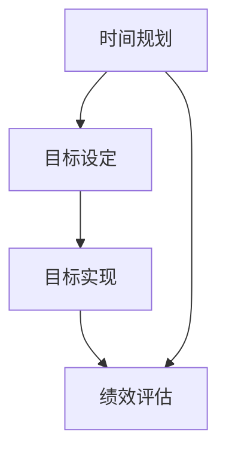

**核心算法原理讲解**：

时间规划与目标管理的算法原理可以概括为以下步骤：

1. **时间规划**：根据任务的重要性和紧急性，制定详细的时间计划，确保每个任务都有足够的时间完成。
2. **目标设定**：设定明确、可衡量的目标，确保团队成员了解目标的重要性和实现途径。
3. **目标实现**：通过有效的执行和监控，确保目标得到实现。
4. **绩效评估**：定期评估目标的实现情况，根据评估结果进行调整和优化。

**数学模型和数学公式**：

为了量化时间规划与目标管理的效果，我们可以构建一个简单的数学模型：

$$ \text{目标实现率} = f(\text{时间规划准确性}, \text{目标设定合理性}, \text{目标实现效率}) $$

其中，时间规划准确性、目标设定合理性和目标实现效率分别表示时间规划与目标管理的三个关键维度。

**举例说明**：

在一个项目中，领导者可以采取以下措施来提升时间规划与目标管理：

1. **制定详细的时间计划**：根据任务的重要性和紧急性，为每个任务分配具体的时间段，确保任务按时完成。
2. **设定明确的目标**：为项目设定具体、可衡量的目标，确保团队成员了解目标的重要性和实现途径。
3. **监控目标实现**：通过定期检查和评估，确保目标得到实现。

**高效时间利用与团队协作**

高效的时间利用是领导力的重要组成部分，它直接影响团队的协作效率和整体绩效。领导者需要能够有效利用时间，确保团队在有限的时间内完成更多的工作。

**核心概念与联系**：

以下是使用Mermaid绘制的流程图，展示了高效时间利用与团队协作的关系：

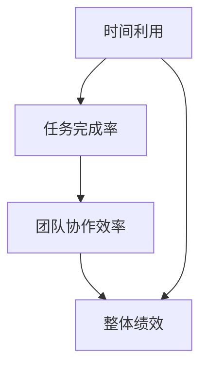

**核心算法原理讲解**：

高效时间利用与团队协作的算法原理可以概括为以下步骤：

1. **集中注意力**：通过减少干扰和分心，提高专注度，确保在有限的时间内完成更多的工作。
2. **优化流程**：通过优化工作流程和减少不必要的步骤，提高工作效率。
3. **团队协作**：通过有效的团队协作，确保任务能够高效完成。

**数学模型和数学公式**：

为了量化高效时间利用与团队协作的效果，我们可以构建一个简单的数学模型：

$$ \text{工作效率} = f(\text{时间利用效率}, \text{团队协作效率}) $$

其中，时间利用效率和团队协作效率分别表示高效时间利用和团队协作对工作效率的影响。

**举例说明**：

在一个团队项目中，领导者可以采取以下措施来提升高效时间利用与团队协作：

1. **优化流程**：通过流程优化，减少不必要的步骤和时间浪费，提高工作效率。
2. **集中注意力**：通过关闭不必要的通知和干扰，提高团队成员的专注度。
3. **团队协作**：通过定期的团队会议和协作工具，确保团队成员能够高效协作，共同完成任务。

**项目实战**

在一个企业中，领导者可以通过以下步骤提升高效时间利用与团队协作：

1. **优化流程**：定期评估工作流程，寻找优化机会，提高工作效率。
2. **培训与指导**：为团队成员提供时间管理和协作技巧的培训，提高他们的时间管理能力和协作效率。
3. **监督与反馈**：定期监督团队的工作进度和时间管理效果，提供及时反馈和指导。

通过以上措施，领导者可以有效地提升团队的时间管理能力和协作效率，提高整体工作效率和绩效。

---

### 第5章 提高个人时间管理能力

#### 5.1 自我评估与时间管理

自我评估是提升个人时间管理能力的关键步骤，它可以帮助我们识别时间管理中的问题和不足，从而制定有效的改进计划。以下将介绍如何进行自我评估，识别常见的时间管理问题，并提出解决方案。

**如何进行自我评估**

1. **记录时间使用情况**：首先，记录自己每天的时间使用情况，包括工作时间、休息时间、任务完成情况等。这可以通过时间日志、手机应用或手写记录来完成。
2. **分析时间分配**：分析时间日志，识别时间分配中的不合理之处。例如，是否有大量时间浪费在无意义的活动中，或者是否在某些任务上花费了过多时间。
3. **识别问题**：根据时间分配的分析结果，识别时间管理中的问题。常见的问题包括任务优先级不当、拖延、缺乏计划等。

**识别常见的时间管理问题**

1. **任务优先级不当**：将时间分配给不重要或不紧急的任务，导致重要任务被忽视。
2. **拖延**：对某些任务产生抵触情绪，导致任务拖延，最终影响整体进度。
3. **缺乏计划**：没有明确的计划和时间表，导致时间管理混乱，任务难以按时完成。
4. **过度工作**：长时间工作，忽视休息和个人时间，导致身体和心理疲劳。

**解决方案**

1. **设定任务优先级**：根据任务的重要性和紧急性，设定明确的任务优先级。重要且紧急的任务应优先处理，重要但不紧急的任务也应提前规划。
2. **制定计划**：制定详细的时间表和计划，确保任务有明确的时间安排和截止日期。使用日历或任务管理工具来帮助制定和跟踪计划。
3. **克服拖延**：采取具体策略来克服拖延，如设定明确的截止日期、分解任务、使用番茄工作法等。
4. **平衡工作与生活**：合理安排工作和休息时间，确保身心健康。设立固定的休息时间和活动，如运动、阅读等，以缓解工作压力。

**案例说明**

小明是一名软件工程师，他在自我评估中发现自己在时间管理上存在以下问题：

1. 任务优先级不当：经常将时间分配给不重要的小任务，导致重要项目被拖延。
2. 拖延：对复杂任务产生抵触情绪，导致任务拖延，影响项目进度。
3. 缺乏计划：没有明确的时间表和计划，导致时间管理混乱。

为了解决这些问题，小明采取了以下措施：

1. **设定任务优先级**：根据项目的重要性和紧急性，重新设定任务优先级。将重要且紧急的任务优先处理，重要但不紧急的任务提前规划。
2. **制定计划**：使用日历和任务管理工具，制定详细的时间表和计划。为每个任务分配具体的时间段和截止日期，确保任务按时完成。
3. **克服拖延**：采取番茄工作法，将工作分为25分钟的工作周期和5分钟的休息时间。设置明确的截止日期，以激励自己按时完成任务。

通过以上措施，小明成功地提高了个人时间管理能力，项目进度得到显著提升，工作效率和成果也得到了改善。

**项目实战**

在一个企业中，领导者可以采取以下步骤帮助团队成员进行自我评估和改进：

1. **培训与指导**：组织时间管理和自我评估的培训，提高团队成员的时间管理技能。
2. **工具推荐**：推荐合适的时间管理工具，如时间日志应用、任务管理软件等，帮助团队成员记录和分析时间使用情况。
3. **定期评估**：定期评估团队成员的时间管理效果，提供反馈和指导，帮助团队成员持续改进。

通过以上措施，企业可以有效地提高团队成员的时间管理能力，提升整体工作效率和绩效。

---

### 第5章 提高个人时间管理能力

#### 5.2 个人时间管理工具与技巧

在现代快节奏的生活和工作中，个人时间管理工具和技巧变得尤为重要。这些工具和技巧可以帮助我们更高效地安排时间、跟踪任务、减少拖延，从而提高个人工作效率和生活质量。以下将介绍几种常用的个人时间管理工具和技巧。

**日历工具**

日历工具是个人时间管理中最基本的工具之一，它可以帮助我们规划日程、安排任务、设置提醒。以下是一些常用的日历工具：

1. **Google Calendar**：Google Calendar 是一款功能强大的在线日历工具，支持多平台同步，可以方便地创建事件、设置提醒，并与其他人共享日程。
2. **Microsoft Outlook**：Microsoft Outlook 是 Windows 和 Office 生态系统中的日历工具，提供丰富的日历视图和强大的事件管理功能。
3. **Apple Calendar**：Apple Calendar 是 macOS 和 iOS 系统内置的日历应用，界面简洁，功能强大，支持多种视图模式，如日视图、周视图、月视图等。

**任务管理工具**

任务管理工具可以帮助我们跟踪任务、设置优先级、管理项目进度。以下是一些常用的任务管理工具：

1. **Trello**：Trello 是一款基于看板式的任务管理工具，适合团队协作和个人任务管理。用户可以创建卡片、列表和板，将任务分解并分配给不同的人。
2. **Asana**：Asana 是一款功能强大的项目管理工具，适合个人和团队使用。用户可以创建任务、分配任务、设置截止日期，并跟踪任务进度。
3. **Notion**：Notion 是一款集文档、笔记、数据库、任务管理于一体的多功能工具，适合需要综合管理个人和工作内容的用户。

**时间跟踪工具**

时间跟踪工具可以帮助我们记录工作时间、分析时间使用情况，从而优化时间管理。以下是一些常用的时间跟踪工具：

1. **Toggl**：Toggl 是一款简单易用的时间跟踪工具，可以自动记录工作时间，生成详细的报告，帮助用户了解时间使用情况。
2. **RescueTime**：RescueTime 是一款自动跟踪工作时间和活动的工具，可以提供详细的报告和分析，帮助用户识别时间浪费的环节。
3. **Harvest**：Harvest 是一款专业的发票和项目管理工具，也提供时间跟踪功能，适合需要跟踪工作时间的个人和企业。

**时间管理技巧**

除了工具，还有一些时间管理技巧可以帮助我们更高效地利用时间：

1. **四象限法**：四象限法是一种根据任务的重要性和紧急性进行时间管理的策略。将任务分为四个象限，分别处理重要紧急、重要不紧急、不重要紧急、不重要不紧急的任务。
2. **要事优先法**：要事优先法强调处理最重要和最紧急的任务。根据任务的重要性和紧急性，设定优先级，优先处理重要且紧急的任务。
3. **时间块管理法**：时间块管理法是将时间分成块，每个块专注于一项任务。通过设定固定的时间块，提高专注度和工作效率。
4. **番茄工作法**：番茄工作法是一种将工作时间划分为25分钟的工作周期和5分钟的休息时间的方法。通过设定番茄钟，帮助用户保持专注，提高工作效率。

**案例说明**

小张是一名市场营销经理，他希望通过时间管理工具和技巧提高工作效率。他采取了以下措施：

1. **使用 Google Calendar**：小张使用 Google Calendar 规划日程，设置提醒，确保重要会议和任务不会错过。
2. **使用 Trello**：小张使用 Trello 管理项目任务，将任务分解并分配给团队成员，确保项目进度可控。
3. **使用 Toggl**：小张使用 Toggl 记录工作时间，生成报告，分析时间使用情况，找出时间浪费的环节。
4. **采用番茄工作法**：小张采用番茄工作法，将工作时间分为25分钟的工作周期和5分钟的休息时间，保持专注，提高工作效率。

通过以上措施，小张成功地提高了个人时间管理能力，工作效率显著提升，工作成果也得到了改善。

**项目实战**

在一个企业中，领导者可以采取以下措施推广个人时间管理工具和技巧：

1. **培训与指导**：组织时间管理和工具使用的培训，帮助员工掌握有效的个人时间管理技能。
2. **推荐工具**：推荐合适的个人时间管理工具，如日历、任务管理、时间跟踪工具等，提供员工使用的便利。
3. **实践与反馈**：鼓励员工在实际工作中应用时间管理工具和技巧，定期收集反馈，根据反馈进行优化和调整。

通过以上措施，企业可以有效地提高员工的时间管理能力，提升整体工作效率和绩效。

---

### 第5章 提高个人时间管理能力

#### 5.3 压力管理技巧

在快节奏的现代工作和生活中，压力管理变得尤为重要。有效的压力管理不仅能够帮助我们保持身心健康，还能提高工作效率和生活质量。以下将介绍几种常见的压力管理技巧，包括深呼吸、冥想、运动和休息。

**深呼吸**

深呼吸是一种简单而有效的放松技巧，可以帮助我们缓解紧张和焦虑。以下是一种简单的深呼吸方法：

1. **坐姿舒适**：找一个舒适的坐姿，保持背部挺直。
2. **吸气**：慢慢吸气，感受空气进入肺部，腹部逐渐膨胀。
3. **呼气**：慢慢呼气，感受空气从肺部排出，腹部逐渐收缩。
4. **重复**：重复上述步骤，每次深呼吸持续4-6秒。

**冥想**

冥想是一种通过专注和放松来管理压力的技巧。以下是一种简单的冥想方法：

1. **选择时间**：找一个安静的时间，可以是早晨或晚上。
2. **找到舒适的姿势**：坐姿或躺姿，保持身体放松。
3. **专注于呼吸**：将注意力集中在呼吸上，感受空气进出鼻孔和胸腹的起伏。
4. **放松思想**：当思维开始游离时，轻轻将其拉回呼吸。

**运动**

运动是一种有效的压力释放方式，它可以帮助我们释放紧张情绪，提高身体健康。以下是一些建议：

1. **定期锻炼**：每周至少进行150分钟的中等强度运动，如快走、跑步、游泳等。
2. **瑜伽**：瑜伽是一种结合身体运动和呼吸控制的练习，有助于放松身心。
3. **力量训练**：定期进行力量训练，增强肌肉力量和耐力。

**休息**

充足的休息是保持身心健康和高效工作的重要保障。以下是一些建议：

1. **定期休息**：每工作45-60分钟，休息5-10分钟，站起来活动一下。
2. **午休**：利用午休时间进行短暂的睡眠或放松，有助于恢复精力。
3. **睡眠**：保持每晚7-9小时的充足睡眠，确保身体和大脑得到充分的休息。

**案例说明**

小王是一名程序员，由于工作繁忙，他经常感到压力很大。为了管理压力，他采取了以下措施：

1. **深呼吸**：每当感到紧张时，他会停下来进行几次深呼吸，以缓解紧张情绪。
2. **冥想**：每天晚上，他会花10分钟进行冥想，帮助自己放松身心。
3. **运动**：每天下班后，他会去跑步或做瑜伽，以释放压力，提高身体健康。
4. **休息**：他确保每天有足够的休息时间，每晚保持7-8小时的睡眠。

通过以上措施，小王成功地缓解了工作压力，提高了工作效率和生活质量。

**项目实战**

在一个企业中，领导者可以采取以下措施帮助员工管理压力：

1. **培训与指导**：组织压力管理和健康讲座，提供相关知识和技巧。
2. **休息设施**：提供舒适的休息区域，供员工在工作间隙放松。
3. **健身活动**：组织定期的健身活动和团队运动，鼓励员工参与。
4. **灵活工作时间**：实施灵活的工作时间政策，允许员工有更多的时间进行休息和放松。

通过以上措施，企业可以有效地帮助员工管理压力，提高员工的身心健康和工作效率。

---

### 第6章 提高团队时间管理能力

#### 6.1 团队时间管理的原则

团队时间管理的原则是确保团队在有限的时间内高效地完成任务，实现共同的目标。以下将介绍团队时间管理的五个基本原则，包括共同目标、分工合作、责任落实、资源优化和时间监控。

**共同目标**

共同目标是团队时间管理的首要原则。一个明确的共同目标可以帮助团队成员团结一致，共同努力，提高工作效率。以下是一些实施共同目标的步骤：

1. **设定目标**：团队领导者需要与团队成员一起设定明确的目标，确保目标具体、可衡量、可实现。
2. **目标沟通**：确保所有团队成员都清楚了解共同目标，并通过定期会议和报告来跟踪目标进展。
3. **目标分解**：将共同目标分解为具体的子任务和里程碑，为每个任务分配责任人和截止日期。

**分工合作**

分工合作是确保团队高效运作的关键。合理的分工可以最大化利用团队成员的技能和资源，提高整体工作效率。以下是一些实施分工合作的步骤：

1. **技能评估**：对团队成员进行技能评估，了解每个人的专长和能力。
2. **任务分配**：根据团队成员的技能和兴趣，分配相应的任务，确保每个成员都在自己最擅长的领域工作。
3. **协作机制**：建立有效的协作机制，确保团队成员之间能够顺利沟通和协作，及时分享信息和资源。

**责任落实**

责任落实是确保团队任务按时完成的重要措施。明确的责任分工可以帮助团队成员明确自己的工作内容和责任，提高执行效率。以下是一些实施责任落实的步骤：

1. **责任分配**：明确每个团队成员的任务和责任，确保每个人都清楚自己的工作内容和期望成果。
2. **定期检查**：定期检查任务进展和责任人履行责任的情况，确保任务按时完成。
3. **反馈机制**：建立反馈机制，及时向责任人提供工作进展和成果的反馈，帮助他们改进工作。

**资源优化**

资源优化是提高团队时间管理效率的重要手段。通过合理分配和使用资源，可以最大限度地提高团队的产出。以下是一些实施资源优化的步骤：

1. **资源评估**：评估团队当前拥有的资源，包括人力、物力和财力等。
2. **资源调配**：根据任务需求和资源情况，合理调配资源，确保关键任务有足够的资源支持。
3. **资源监控**：定期监控资源的使用情况，及时发现资源浪费或不足的问题，并采取相应措施进行调整。

**时间监控**

时间监控是确保团队任务按时完成的重要环节。通过有效的时间监控，可以及时发现任务进展中的问题，并采取及时措施进行调整。以下是一些实施时间监控的步骤：

1. **时间规划**：制定详细的时间计划，为每个任务分配明确的时间段和截止日期。
2. **进度跟踪**：定期跟踪任务进度，确保任务按照计划进行。
3. **问题反馈**：建立问题反馈机制，及时发现任务进展中的问题，并快速解决。

**数学模型和数学公式**

为了量化团队时间管理的效率，我们可以构建一个简单的数学模型：

$$ \text{时间管理效率} = \frac{\text{任务完成率} \times \text{资源利用率} \times \text{责任履行度}}{\text{总时间}} $$

其中，任务完成率、资源利用率和责任履行度分别表示团队在时间管理中的三个关键维度。

**举例说明**

假设一个团队有以下任务和资源：

- 任务：项目报告、市场调研、客户沟通
- 人力资源：3名团队成员
- 物力资源：一台笔记本电脑、一部手机

团队可以通过以下步骤提高时间管理效率：

1. **设定目标**：明确项目的最终目标和阶段性目标，为每个任务分配责任人和截止日期。
2. **分工合作**：根据团队成员的技能和兴趣，将任务合理分配，确保每个成员都能在自己的专长领域工作。
3. **责任落实**：明确每个团队成员的任务和责任，确保任务按时完成。
4. **资源优化**：合理调配团队资源，确保关键任务有足够的资源支持。
5. **时间监控**：制定详细的时间计划，定期跟踪任务进度，确保任务按时完成。

通过以上措施，团队可以提高时间管理效率，确保项目按时完成。

**项目实战**

在一个企业中，领导者可以采取以下步骤提高团队的时间管理效率：

1. **培训与指导**：组织时间管理和团队协作的培训，提高团队成员的时间管理技能。
2. **工具与资源**：提供合适的时间管理工具和资源，如日历、任务管理软件、资源监控工具等，帮助团队成员更好地管理时间和资源。
3. **监督与反馈**：定期监督团队的工作进度和时间管理效果，提供及时反馈和指导，帮助团队成员持续改进。

通过以上步骤，企业可以有效地提高团队的时间管理能力，提高整体工作效率和项目成功率。

---

### 第6章 提高团队时间管理能力

#### 6.2 团队时间管理的方法

团队时间管理的方法是确保团队在有限的时间内高效完成任务的关键。以下将介绍几种常用的团队时间管理方法，包括晨会与晚会、时间跟踪与反馈、项目进度监控。

**晨会与晚会**

晨会和晚会是团队时间管理的重要环节，它们可以帮助团队及时沟通、明确任务和目标，确保工作有序进行。

**晨会**

1. **启动会议**：每天早晨召开晨会，回顾前一天的工作进展，讨论当天的重要任务。
2. **任务分配**：根据任务的重要性和紧急性，为团队成员分配任务，明确责任人和截止日期。
3. **问题解决**：解决前一天遇到的问题，确保任务能够顺利进行。

**晚会**

1. **总结当天工作**：回顾当天的工作进展，评估任务完成情况。
2. **反馈与建议**：收集团队成员的反馈和建议，讨论改进措施。
3. **计划次日工作**：为次日的工作制定计划，确保任务按时完成。

**时间跟踪与反馈**

时间跟踪与反馈是确保团队任务按时完成的重要手段。通过记录实际工作时间，与计划时间进行对比，可以及时发现和解决问题。

1. **时间记录**：使用时间跟踪工具记录每天的工作时间，确保任务的实际执行时间与计划一致。
2. **定期反馈**：定期向团队成员和领导反馈工作进展和时间使用情况，确保信息透明。
3. **问题调整**：根据反馈结果，调整工作计划和时间安排，确保任务按时完成。

**项目进度监控**

项目进度监控是确保项目按计划进行的关键环节。通过实时监控项目进度，可以及时发现和解决潜在问题，确保项目按时完成。

1. **制定进度计划**：根据项目目标和任务分配，制定详细的进度计划，包括任务时间表、关键里程碑等。
2. **实时监控**：使用项目管理工具监控项目进度，定期更新任务状态和进度报告。
3. **问题预警**：及时发现项目进度中的问题，预警并采取相应措施，确保项目按时完成。

**数学模型和数学公式**

为了量化团队时间管理的效率，我们可以构建一个简单的数学模型：

$$ \text{时间管理效率} = \frac{\text{任务完成率} \times \text{资源利用率} \times \text{责任履行度}}{\text{总时间}} $$

其中，任务完成率、资源利用率和责任履行度分别表示团队在时间管理中的三个关键维度。

**举例说明**

假设一个团队有以下任务和资源：

- 任务：项目报告、市场调研、客户沟通
- 人力资源：3名团队成员
- 物力资源：一台笔记本电脑、一部手机

团队可以通过以下方法提高时间管理效率：

1. **晨会与晚会**：每天早晨召开晨会，明确当天任务和责任；晚上召开晚会，总结当天工作，调整次日计划。
2. **时间跟踪与反馈**：使用时间跟踪工具记录每天的工作时间，定期向团队成员和领导反馈工作进展和时间使用情况。
3. **项目进度监控**：制定详细的进度计划，使用项目管理工具实时监控项目进度，确保任务按时完成。

通过以上方法，团队可以提高时间管理效率，确保项目按时完成。

**项目实战**

在一个企业中，领导者可以采取以下步骤提高团队的时间管理效率：

1. **培训与指导**：组织时间管理和团队协作的培训，提高团队成员的时间管理技能。
2. **工具与资源**：提供合适的时间管理工具和资源，如日历、任务管理软件、项目管理工具等，帮助团队成员更好地管理时间和资源。
3. **监督与反馈**：定期监督团队的工作进度和时间管理效果，提供及时反馈和指导，帮助团队成员持续改进。

通过以上步骤，企业可以有效地提高团队的时间管理能力，提高整体工作效率和项目成功率。

---

### 第6章 提高团队时间管理能力

#### 6.3 团队时间管理实践案例

为了更好地理解团队时间管理的实际应用，以下将通过两个具体案例来展示团队如何在实践中应用时间管理原则和方法，从而提高工作效率和项目成功率。

**案例一：某科技公司的软件开发项目**

**背景**：
某科技公司正在开发一款新的移动应用，项目团队由5名成员组成，包括项目经理、开发人员、测试人员和市场人员。项目目标是在三个月内完成应用的开发、测试和上线。

**时间管理原则与方法**：

1. **共同目标

