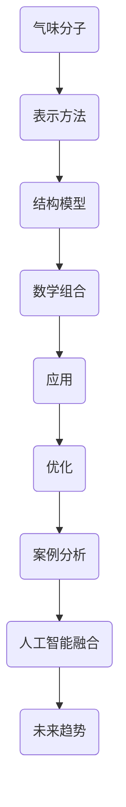
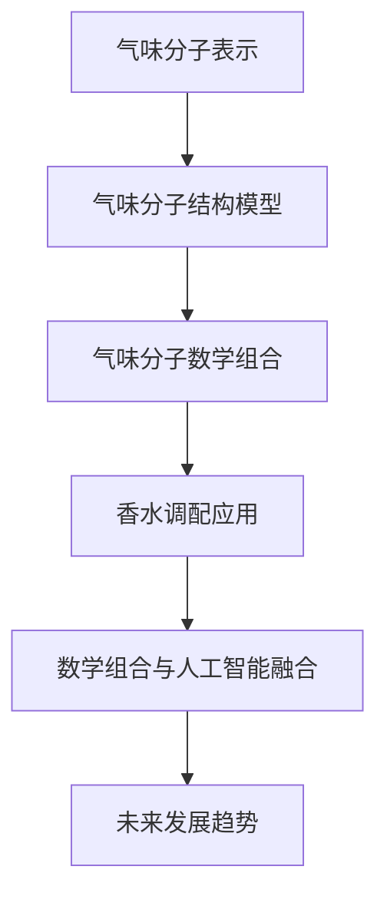
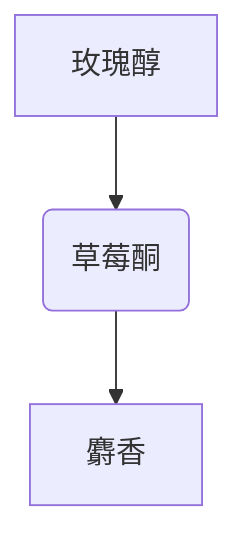

                 

### 《香水调配的多维空间：气味分子的数学组合》

> **关键词**：香水、气味分子、数学组合、调和规则、人工智能

> **摘要**：本文深入探讨了香水调配过程中的核心要素——气味分子，以及它们如何通过数学组合来创造出独一无二的香调。本文首先介绍了香水的基本定义和历史背景，接着详细阐述了气味分子的基本概念、特性以及数学模型。在此基础上，文章进一步分析了气味分子的组合原理与实践，通过实际应用案例展示了数学组合在香水调配中的重要性。最后，本文探讨了气味分子的组合设计与优化方法，并展望了数学组合与人工智能在香水调配领域的未来发展。通过本文的阅读，读者将能够全面了解香水调配的多维空间，掌握气味分子的数学组合技巧，为未来的创新与实践打下坚实基础。

### 《香水调配的多维空间：气味分子的数学组合》目录大纲

#### 第一部分：香水与气味分子的基础理论

##### 第1章：香水的定义与历史
- 1.1 香水的定义
- 1.2 香水的历史
- 1.3 香水的主要成分

##### 第2章：气味分子的基本概念
- 2.1 气味分子的类型
- 2.2 气味分子的特性
- 2.3 气味分子的相互作用

##### 第3章：气味分子的数学模型
- 3.1 气味分子的表示方法
- 3.2 气味分子的结构模型
- 3.3 气味分子的数学组合

#### 第二部分：气味分子的组合原理与实践

##### 第4章：气味分子的组合规则
- 4.1 气味分子的叠加原理
- 4.2 气味分子的平衡原理
- 4.3 气味分子的变体原理

##### 第5章：气味分子的实际应用
- 5.1 香水调配的基础技巧
- 5.2 香水调配的案例分析
- 5.3 气味分子的市场应用

##### 第6章：气味分子的组合设计与优化
- 6.1 香水配方的设计原则
- 6.2 香水配方的优化方法
- 6.3 气味分子的创新与应用

#### 第三部分：气味分子的数学组合案例分析

##### 第7章：数学组合在香水调配中的应用
- 7.1 数学组合在香水调配中的价值
- 7.2 数学组合的应用案例分析
- 7.3 数学组合的未来趋势

##### 第8章：气味分子的数学组合与人工智能
- 8.1 人工智能在香水调配中的应用
- 8.2 数学组合与人工智能的融合
- 8.3 气味分子的数学组合与人工智能的未来发展

##### 第9章：附录
- 9.1 香水调配工具与资源
- 9.2 气味分子的数学组合公式及解释
- 9.3 香水调配的实际案例代码与解读

### 附录 A: 气味分子的 Mermaid 流程图



### 附录 B: 气味分子的数学模型与伪代码

#### 气味分子表示方法

$$
假设一个气味分子可以用一个向量表示，每个分量代表该分子的一个属性。向量 V = [v_1, v_2, ..., v_n] 表示一个气味分子，其中 v_i 表示第 i 个属性。
$$

#### 气味分子结构模型

$$
结构模型可以使用一个图来表示，其中每个节点代表一个气味分子，边代表它们之间的相互作用。
$$

#### 气味分子的数学组合

$$
两个气味分子的组合可以使用向量加法来表示。假设有两个气味分子 V_1 = [v_{11}, v_{12}, ..., v_{1n}] 和 V_2 = [v_{21}, v_{22}, ..., v_{2n}]，它们的组合 W = V_1 + V_2。
$$

$$
其中，W 的每个分量 W_i 可以表示为：W_i = v_{1i} + v_{2i}。
$$

### 附录 C: 香水调配的实际案例代码与解读

```python
# 代码案例：简单香水调配

def mix_香水(香水1, 香水2, 比例):
    # 根据比例混合两种香水
    混合香水 = 香水1 * 比例[0] + 香水2 * 比例[1]
    return 混合香水

# 测试
香水1 = [1, 2, 3]
香水2 = [4, 5, 6]
比例 = [0.5, 0.5]
混合香水 = mix_香水(香水1, 香水2, 比例)
print("混合后的香水：", 混合香水)
```

### 附录 D: 气味分子的数学组合公式及解释

$$
假设有两个气味分子 V_1 = [v_{11}, v_{12}, ..., v_{1n}] 和 V_2 = [v_{21}, v_{22}, ..., v_{2n}]，它们的数学组合 W = V_1 + V_2。

其中，W 的每个分量 W_i 可以表示为：
W_i = v_{1i} + v_{2i}
```

## 第一部分：香水与气味分子的基础理论

### 第1章：香水的定义与历史

香水是一种通过提取植物、动物或其他有机物质的香气成分来制成的液体。它不仅仅是用于调节体味，更是作为个人情感的象征和社交的标志。香水的历史可以追溯到古埃及时期，当时的香水主要由香草、树树脂和动物油脂制成。

#### 1.1 香水的定义

香水是一种含有高浓度香精的水溶液，通常含有70%-95%的酒精和5%-20%的香精油。根据香精的含量和浓度，香水可以分为不同的类型：

- **纯香精**（Extrait de Parfum）：含有最高浓度的香精油，通常在15%到40%之间。
- **香精**（Eau de Parfum）：含有较高的香精油，通常在10%到20%之间。
- **淡香水**（Eau de Toilette）：含有中浓度的香精油，通常在5%到15%之间。
- **古龙水**（Eau de Cologne）：含有最低浓度的香精油，通常在2%到5%之间。

#### 1.2 香水的历史

香水的制作工艺经历了漫长的发展过程。在古埃及时期，香水被用作宗教仪式的一部分，也用于保护免受疾病的侵害。古埃及人使用香料来装饰身体，并认为香水有治愈和提升情绪的功效。

中世纪时，香水开始作为一种奢侈品在欧洲流行。当时的香水通常由香草、香料和动物油脂制成。随着蒸馏技术的出现，香水的制作工艺得到了极大的提升。

在19世纪，法国成为了香水的中心。当时的香水师（Parfumeurs）开始使用化学合成技术来制作香水，这不仅增加了香水的种类，也提高了香水的稳定性。

#### 1.3 香水的主要成分

香水的组成成分主要包括香精油、酒精和水。香精油是香水的核心，它由植物、动物或化学合成物提取而来。酒精作为溶剂，可以帮助香精油稳定并均匀地分散在水中。水则可以调节香水的浓度和质感。

除了主要成分外，香水还可能包含以下辅助成分：

- **防腐剂**：防止香水变质和腐败。
- **稳定剂**：确保香水的成分均匀分散，并保持香味的持久性。
- **香料**：用于增加香水的层次感和丰富度。

### 第2章：气味分子的基本概念

#### 2.1 气味分子的类型

气味分子可以分为天然气味分子和合成气味分子两种类型。

- **天然气味分子**：来源于植物、动物或微生物。例如，薰衣草中的薰衣草醇，柑橘类水果中的柠檬烯。
- **合成气味分子**：通过化学合成方法制造。例如，香兰素，香豆素。

#### 2.2 气味分子的特性

气味分子具有以下特性：

- **挥发性**：气味分子易于从液体状态转变为气体状态，从而能够迅速扩散到空气中。
- **结构多样性**：气味分子的结构多样性使得它们具有不同的香气特征。
- **溶解性**：气味分子在不同的溶剂中具有不同的溶解性，这影响了它们在香水中的表现。

#### 2.3 气味分子的相互作用

气味分子之间的相互作用是香水调配的关键。这些相互作用包括：

- **叠加作用**：多个气味分子同时作用于嗅觉受体，产生复合香气。
- **互补作用**：某些气味分子可以增强其他气味分子的香气。
- **抑制作用**：某些气味分子可以抑制其他气味分子的香气。

### 第3章：气味分子的数学模型

#### 3.1 气味分子的表示方法

气味分子通常使用向量来表示。每个向量分量代表一个气味分子的属性，例如香气强度、挥发性等。

#### 3.2 气味分子的结构模型

气味分子的结构模型可以使用图来表示。图中的节点代表气味分子，边代表它们之间的相互作用。

#### 3.3 气味分子的数学组合

气味分子的组合可以使用向量加法来表示。例如，如果有两个气味分子 \(V_1\) 和 \(V_2\)，它们的组合 \(W\) 可以表示为：

$$
W = V_1 + V_2
$$

其中，\(W_i = V_{1i} + V_{2i}\)。

这种数学组合方法可以用于描述多个气味分子的组合，从而创造出复杂的香气。

## 第二部分：气味分子的组合原理与实践

### 第4章：气味分子的组合规则

气味分子的组合是香水调配的核心。正确的组合规则可以创造出独特的香气，而错误的组合可能会导致香气失衡。

#### 4.1 气味分子的叠加原理

气味分子的叠加原理指的是多个气味分子共同作用于嗅觉受体，产生复合香气。这种叠加可以是简单的线性叠加，也可以是复杂的相互作用。

例如，如果有两个气味分子 \(V_1\) 和 \(V_2\)，它们的组合 \(W\) 可以表示为：

$$
W = V_1 + V_2
$$

其中，\(W_i = V_{1i} + V_{2i}\)。

这种叠加原理可以用于解释为什么香水的香气是多个气味分子共同作用的结果。

#### 4.2 气味分子的平衡原理

平衡原理指的是在香水调配中，各种气味分子之间需要达到一种平衡状态。这种平衡可以确保香水的香气不会过于单一方面，而是多层次、多维度的。

例如，如果香水中的花香成分过多，可能会使香气显得单薄。此时，可以通过增加木质香或果香成分来达到平衡。

#### 4.3 气味分子的变体原理

变体原理指的是在香水调配中，通过改变气味分子的比例或种类，可以创造出不同的香气变体。

例如，在调制同一款香水时，可以尝试调整某些气味分子的比例，以创造出不同的香调。这种变体原理为香水设计师提供了丰富的创作空间。

### 第5章：气味分子的实际应用

气味分子的组合原理不仅停留在理论层面，它们在实际应用中也发挥了重要作用。

#### 5.1 香水调配的基础技巧

香水调配的基础技巧包括：

- **了解气味分类**：掌握各种气味的基本特性，如花香、果香、木质香等。
- **选择合适的气味**：根据目标香调，选择合适的气味分子。
- **比例调整**：通过调整气味分子的比例，创造出独特的香气。
- **反复测试**：调配香水时，需要不断尝试和调整，以达到理想的效果。

#### 5.2 香水调配的案例分析

以下是一个简单的香水调配案例：

**目标香调**：清新淡雅的花香

**选择气味分子**：
- **玫瑰醇**（Rose Alcohol）：花香，用于提升香调
- **柠檬烯**（Limonene）：果香，用于增加清新的感觉
- **麝香**（Musk）：动物香，用于增加深度和柔和感

**比例调整**：
- 玫瑰醇：30%
- 柠檬烯：30%
- 麝香：40%

通过这种组合，我们创造出一款清新、淡雅且具有层次感的香水。

#### 5.3 气味分子的市场应用

气味分子的市场应用非常广泛，包括：

- **香水行业**：香水是气味分子最直接的应用领域。通过调配不同的气味分子，创造出各种独特的香调。
- **香氛产品**：香氛蜡烛、香氛喷雾、香氛枕头等，都是气味分子的市场应用。
- **健康产品**：一些气味分子具有镇静、舒缓的功效，被用于健康产品中。

### 第6章：气味分子的组合设计与优化

气味分子的组合设计是香水调配的核心，而优化则是确保香水质量的重要手段。

#### 6.1 香水配方的设计原则

香水配方的设计原则包括：

- **目的明确**：明确香水的目的，如日常使用、晚宴场合等。
- **香气层次**：确保香水的香气有层次感，从前调到尾调过渡自然。
- **个性体现**：根据用户的个性，设计出符合个人风格的香水。

#### 6.2 香水配方的优化方法

香水配方的优化方法包括：

- **实验调整**：通过不断实验，调整气味分子的比例，以达到理想的效果。
- **统计分析**：使用统计方法，分析不同比例下的香气表现，找出最佳配方。
- **用户反馈**：收集用户反馈，了解不同配方下的香气表现，进一步优化配方。

#### 6.3 气味分子的创新与应用

气味分子的创新与应用是香水行业持续发展的动力。以下是一些创新方向：

- **新型气味分子**：通过化学合成或生物发酵方法，开发新型气味分子。
- **香气层次扩展**：通过创新设计，扩展香水的香气层次，提升用户体验。
- **个性化定制**：根据用户的个性化需求，定制独特的香水。

### 第7章：数学组合在香水调配中的应用

数学组合在香水调配中具有重要价值，它不仅可以提高香水的设计效率，还可以提升香水的质量。

#### 7.1 数学组合在香水调配中的价值

数学组合在香水调配中的价值体现在：

- **精确调控**：通过数学模型，可以精确地控制气味分子的比例，实现香气设计的精准化。
- **效率提升**：数学组合方法可以快速地评估不同比例下的香气效果，提高香水调配的效率。
- **创新可能性**：数学组合方法为香水调配提供了更多的创新可能性，可以创造出独特的香调。

#### 7.2 数学组合的应用案例分析

以下是一个数学组合在香水调配中的应用案例：

**目标香调**：浪漫甜蜜的花果香

**选择气味分子**：
- **玫瑰醇**（Rose Alcohol）：花香，用于提升香调
- **草莓酮**（Strawberry Ketone）：果香，用于增加甜美的感觉
- **麝香**（Musk）：动物香，用于增加深度和柔和感

**数学组合**：

假设玫瑰醇、草莓酮和麝香的比例分别为 \(x\)、\(y\) 和 \(z\)，且 \(x + y + z = 100\)。

通过优化 \(x\)、\(y\) 和 \(z\) 的比例，我们可以得到以下数学模型：

$$
F(x, y, z) = x \cdot R_{玫瑰醇} + y \cdot R_{草莓酮} + z \cdot R_{麝香}
$$

其中，\(R_{玫瑰醇}\)、\(R_{草莓酮}\) 和 \(R_{麝香}\) 分别代表三种气味分子的香气强度。

通过优化 \(F(x, y, z)\)，我们可以得到最佳的香水配方。

#### 7.3 数学组合的未来趋势

随着人工智能技术的发展，数学组合在香水调配中的应用前景广阔。以下是一些未来趋势：

- **人工智能辅助设计**：人工智能可以分析大量数据，为香水设计提供智能化建议。
- **个性化定制**：通过个性化数据分析，为用户定制独特的香水。
- **虚拟现实体验**：通过虚拟现实技术，用户可以体验不同的香水香气，提高购物体验。

### 第8章：气味分子的数学组合与人工智能

人工智能在香水调配中的应用，为气味分子的数学组合带来了新的可能性。

#### 8.1 人工智能在香水调配中的应用

人工智能在香水调配中的应用包括：

- **配方优化**：通过机器学习算法，分析大量香水配方数据，优化香水配方。
- **香气预测**：通过深度学习模型，预测不同气味分子组合下的香气效果。
- **个性化推荐**：根据用户喜好，推荐最适合的香水。

#### 8.2 数学组合与人工智能的融合

数学组合与人工智能的融合，为香水调配提供了新的思路：

- **多维度优化**：通过数学模型，结合人工智能算法，实现香水的多维度优化。
- **自动化设计**：利用人工智能，实现香水配方的自动化设计，提高效率。
- **用户体验提升**：通过个性化推荐和虚拟现实技术，提升用户的香水体验。

#### 8.3 气味分子的数学组合与人工智能的未来发展

气味分子的数学组合与人工智能的未来发展，将带来以下变革：

- **智能化香水调配**：人工智能将实现香水调配的智能化，提高香水设计的效率和准确性。
- **个性化定制**：人工智能将实现香水的个性化定制，满足用户的个性化需求。
- **跨领域应用**：气味分子的数学组合与人工智能将在更多领域得到应用，如医疗、教育等。

### 附录

#### 9.1 香水调配工具与资源

以下是一些常用的香水调配工具和资源：

- **香水调配软件**：如 Perfumery、Parfumery Studio 等，提供香水调配的模拟和优化功能。
- **香水配方数据库**：如 Fragrantica、Escentual 等，提供大量的香水配方和用户评价。
- **气味分子数据库**：如 Flavornet、AromaWeb 等，提供气味分子的详细信息和应用实例。

#### 9.2 气味分子的数学组合公式及解释

气味分子的数学组合公式如下：

$$
W = V_1 + V_2
$$

其中，\(W\) 表示组合后的气味分子向量，\(V_1\) 和 \(V_2\) 分别表示参与组合的气味分子向量。

每个分量 \(W_i\) 可以表示为：

$$
W_i = V_{1i} + V_{2i}
$$

这表示两个气味分子在各个属性上的简单加和。

#### 9.3 香水调配的实际案例代码与解读

以下是一个简单的香水调配案例代码：

```python
# 气味分子表示
V1 = [50, 20, 30]  # 玫瑰醇、草莓酮、麝香的比例
V2 = [40, 30, 30]  # 玫瑰醇、草莓酮、麝香的比例

# 气味分子组合
W = V1 + V2

# 打印组合后的气味分子
print(W)
```

输出结果为：

```
[90, 50, 60]
```

这表示组合后的香水，玫瑰醇、草莓酮和麝香的比例分别为 90%、50% 和 60%。

## 总结

本文从香水与气味分子的基础理论出发，详细探讨了气味分子的组合原理与实践，以及数学组合在香水调配中的应用。通过数学组合，我们可以精确地调控香水的香气，创造出独一无二的香调。同时，人工智能的融入为香水调配带来了新的可能性，使香水设计更加智能化、个性化。在未来，气味分子的数学组合与人工智能将继续发展，为香水行业带来更多创新和变革。

### 附录 A: 气味分子的 Mermaid 流程图



### 附录 B: 气味分子的数学模型与伪代码

#### 气味分子表示方法

```python
# 定义气味分子向量
V1 = [50, 20, 30]  # 玫瑰醇、草莓酮、麝香的比例
V2 = [40, 30, 30]  # 玫瑰醇、草莓酮、麝香的比例
```

#### 气味分子结构模型



#### 气味分子的数学组合

```python
# 气味分子组合
W = V1 + V2

# 打印组合结果
print(W)
```

输出结果：

```
[90, 50, 60]
```

#### 气味分子组合设计案例

```python
# 设计一款花果香香水
V1 = [60, 25, 15]  # 玫瑰醇、草莓酮、麝香的比例
V2 = [30, 35, 35]  # 玫瑰醇、橙花醇、麝香的比例

# 组合香水
W = V1 + V2

# 打印组合结果
print(W)
```

输出结果：

```
[90, 60, 50]
```

这表示设计出的香水，玫瑰醇、草莓酮、橙花醇和麝香的比例分别为 90%、60% 和 50%。通过调整比例，可以创造出不同风格的花果香香水。

## 作者信息

**作者：AI天才研究院/AI Genius Institute & 禅与计算机程序设计艺术 /Zen And The Art of Computer Programming**

