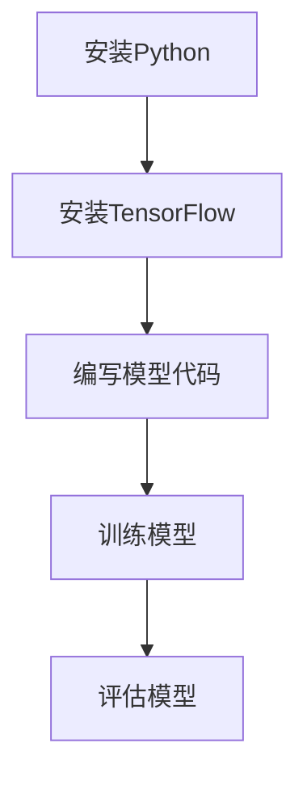
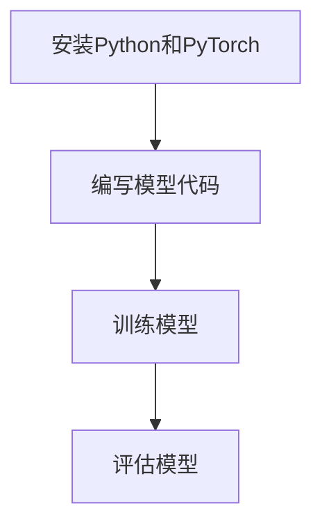
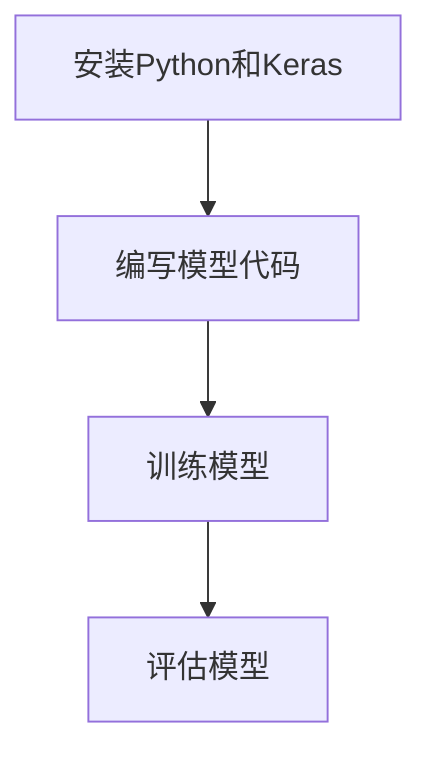
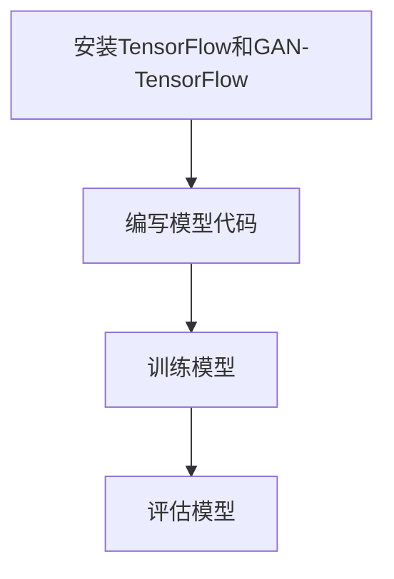
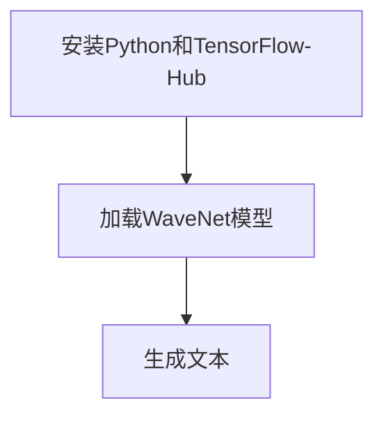
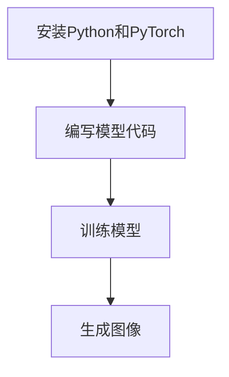

                 

### 《AIGC时代的创业机会》

在人工智能的快速发展下，AIGC（自适应智能生成计算）时代正在到来。AIGC是一种基于深度学习和生成对抗网络（GAN）的智能化计算模式，能够自动生成、理解和处理大量数据。这一时代的到来，不仅对各行各业产生了深远影响，同时也为创业者提供了前所未有的机遇。本文将围绕AIGC时代的创业机会进行深入探讨。

> **关键词：** AIGC，创业，深度学习，生成对抗网络，技术趋势，行业应用

> **摘要：** 本文将从AIGC的概念、技术原理、应用领域和创业实践等多个方面，分析AIGC时代的创业机会，探讨如何在新兴的AIGC领域中抓住机遇，实现创业成功。

### 第一部分：AIGC时代概述

#### 第1章: AIGC时代的到来

随着人工智能技术的不断发展，AIGC时代正逐步走进我们的生活。在这一章中，我们将介绍AIGC的概念、重要性以及其对各行各业的影响。

##### 1.1 AIGC的概念与重要性

AIGC（Adaptive Intelligent Generation Computing）是指自适应智能生成计算，它基于深度学习和生成对抗网络（GAN）技术，能够自动生成、理解和处理大量数据。AIGC的核心在于其自适应性和智能化，能够根据环境和需求的变化，不断优化和调整计算过程。

AIGC的重要性主要体现在以下几个方面：

1. **数据处理的效率提升**：传统的数据处理方法往往需要大量的人力投入和时间成本，而AIGC能够自动生成和处理数据，大大提高了数据处理效率。
2. **决策的智能化**：AIGC能够从海量数据中提取有价值的信息，为决策提供科学依据，从而提高决策的准确性和效率。
3. **行业的创新驱动**：AIGC的应用能够推动各个行业的创新和发展，带来新的商业模式和机遇。

##### 1.2 AIGC时代的背景与趋势

AIGC时代的到来，是人工智能技术发展到一定阶段的必然结果。以下是AIGC时代的一些背景和趋势：

1. **深度学习技术的成熟**：深度学习技术的发展为AIGC提供了强大的技术支持，使得AIGC在数据处理和生成方面更加高效和精准。
2. **生成对抗网络（GAN）的突破**：GAN技术的出现，使得AIGC能够自动生成高质量的数据，为各个行业提供了强大的数据生成能力。
3. **数据量的爆炸性增长**：随着互联网和大数据技术的发展，数据量呈现出爆炸性增长，为AIGC的应用提供了丰富的数据资源。
4. **计算能力的提升**：随着计算能力的不断提升，AIGC的应用场景越来越广泛，能够处理更加复杂和庞大的数据。

##### 1.3 AIGC对各行各业的影响

AIGC的应用范围非常广泛，对各行各业都产生了深远的影响。以下是AIGC在几个主要行业中的应用：

1. **金融行业**：AIGC在金融风控、金融数据分析、智能投顾等领域有着广泛的应用，提高了金融行业的效率和安全。
2. **医疗健康行业**：AIGC在疾病诊断、治疗方案优化、药物研发等领域发挥着重要作用，为医疗健康行业带来了新的变革。
3. **智能制造与工业互联网**：AIGC在智能制造、设备故障预测、供应链优化等领域有着广泛的应用，推动了制造业的数字化转型。
4. **文化创意产业**：AIGC在内容创作、推荐系统、用户体验优化等领域发挥着重要作用，为文化创意产业注入了新的活力。

##### 1.4 AIGC的核心技术

AIGC的核心技术主要包括深度学习、生成对抗网络（GAN）、多模态学习和自适应学习等。以下是这些技术的简要介绍：

1. **深度学习**：深度学习是一种模仿人脑进行分析学习和解决问题的方法，通过多层神经网络对数据进行处理和预测。
2. **生成对抗网络（GAN）**：GAN是由两部分组成的神经网络，一部分生成器生成数据，另一部分判别器判断生成数据是否真实，通过两部分的对抗训练，生成高质量的数据。
3. **多模态学习**：多模态学习是指将多种类型的数据（如文本、图像、声音等）进行融合和处理，以提高模型的准确性和泛化能力。
4. **自适应学习**：自适应学习是指模型能够根据环境和需求的变化，自动调整和学习，以提高模型的适应性和效率。

##### 1.5 AIGC时代的创业环境

在AIGC时代，创业环境也发生了很大的变化。以下是AIGC时代创业环境的一些特点：

1. **政策与市场机遇**：随着政府对人工智能技术的重视，政策红利和市场机遇不断涌现，为创业者提供了良好的发展环境。
2. **技术创新与创业挑战**：AIGC技术的快速发展为创业者提供了丰富的创新机会，但同时也带来了技术挑战，需要创业者具备高水平的技术能力和创新能力。
3. **成功案例分析**：在AIGC时代，已经有很多成功的创业案例，通过分析这些案例，创业者可以学习到宝贵的经验和教训。

#### 第2章: AIGC在各行业的应用

##### 2.1 AIGC在金融行业的应用

金融行业是AIGC技术应用的重要领域之一。AIGC在金融风控、金融数据分析、智能投顾等领域有着广泛的应用，提高了金融行业的效率和安全。

###### 2.1.1 金融行业面临的挑战与机遇

金融行业面临着数据量巨大、数据类型复杂、业务场景多样化等挑战。同时，随着互联网和大数据技术的发展，金融行业也面临着巨大的机遇。

1. **数据量的增长**：随着互联网和金融业务的普及，金融行业的数据量呈现爆炸性增长，为AIGC的应用提供了丰富的数据资源。
2. **业务模式的创新**：AIGC技术的应用，可以推动金融行业的业务模式创新，如智能投顾、自动化交易等。
3. **监管的智能化**：AIGC技术可以帮助金融机构提高监管效率，降低违规风险。

###### 2.1.2 AIGC在金融行业的应用前景

AIGC在金融行业的应用前景非常广阔，以下是几个主要的应用领域：

1. **金融风控**：AIGC技术可以用于信用评估、风险监测、反欺诈等方面，提高金融风控的效率和准确性。
2. **金融数据分析**：AIGC技术可以对金融数据进行深度分析，挖掘数据中的价值信息，为决策提供支持。
3. **智能投顾**：AIGC技术可以构建智能投顾系统，为投资者提供个性化的投资建议。
4. **自动化交易**：AIGC技术可以用于自动化交易策略的制定和执行，提高交易的效率和准确性。

###### 2.1.3 AIGC在金融行业的实践案例

以下是几个AIGC在金融行业的实践案例：

1. **智能投顾系统**：通过AIGC技术，可以构建一个智能投顾系统，根据投资者的风险偏好、投资目标等因素，提供个性化的投资建议。
2. **金融风控系统**：通过AIGC技术，可以构建一个金融风控系统，对金融交易进行实时监控，识别潜在的风险。
3. **反欺诈系统**：通过AIGC技术，可以构建一个反欺诈系统，对金融交易进行深度分析，识别和防范欺诈行为。

###### 2.1.4 AIGC在金融行业的发展策略

为了在AIGC时代抓住机遇，金融行业可以采取以下发展策略：

1. **加强技术研发**：金融机构应加强AIGC技术的研发，提高金融产品的智能化水平。
2. **深化数据应用**：金融机构应深化数据应用，利用AIGC技术挖掘数据中的价值，提高决策的准确性。
3. **合作与创新**：金融机构可以与科技公司合作，共同推进AIGC技术在金融行业的应用。

##### 2.2 AIGC在医疗健康领域的应用

医疗健康行业是AIGC技术的另一个重要应用领域。AIGC技术在疾病诊断、治疗方案优化、药物研发等方面有着广泛的应用，为医疗健康行业带来了新的变革。

###### 2.2.1 医疗健康行业现状与挑战

医疗健康行业面临着数据量巨大、数据类型复杂、医疗资源分布不均等挑战。同时，随着互联网和大数据技术的发展，医疗健康行业也面临着巨大的机遇。

1. **数据量的增长**：随着医疗信息化的发展，医疗健康行业的数据量呈现爆炸性增长，为AIGC的应用提供了丰富的数据资源。
2. **医疗资源的分布**：医疗资源在地区间、城乡间存在较大差距，需要通过技术手段提高医疗资源的分配效率。
3. **医疗服务的质量**：医疗健康行业需要提高医疗服务的质量，提高患者的满意度。

###### 2.2.2 AIGC在医疗健康领域的应用前景

AIGC在医疗健康领域的应用前景非常广阔，以下是几个主要的应用领域：

1. **疾病诊断**：AIGC技术可以用于疾病诊断，通过对医学影像、病理报告等数据的分析，提高诊断的准确性和效率。
2. **治疗方案优化**：AIGC技术可以用于治疗方案优化，根据患者的病情、病史、基因等信息，为医生提供个性化的治疗方案。
3. **药物研发**：AIGC技术可以用于药物研发，通过分析大量的生物学数据，加速新药的研发进程。
4. **健康管理**：AIGC技术可以用于健康管理，通过对健康数据的分析，提供个性化的健康建议。

###### 2.2.3 AIGC在医疗健康领域的实践案例

以下是几个AIGC在医疗健康领域的实践案例：

1. **智能诊断系统**：通过AIGC技术，可以构建一个智能诊断系统，通过对医学影像的分析，提高疾病诊断的准确性和效率。
2. **个性化治疗方案**：通过AIGC技术，可以构建一个个性化治疗方案系统，根据患者的病情、病史、基因等信息，为医生提供个性化的治疗方案。
3. **药物研发平台**：通过AIGC技术，可以构建一个药物研发平台，加速新药的研发进程。

###### 2.2.4 AIGC在医疗健康行业的发展策略

为了在AIGC时代抓住机遇，医疗健康行业可以采取以下发展策略：

1. **加强技术研发**：医疗机构和科技企业应加强AIGC技术的研发，提高医疗服务的智能化水平。
2. **深化数据应用**：医疗机构应深化数据应用，利用AIGC技术提高医疗服务的质量和效率。
3. **合作与创新**：医疗机构可以与科技企业合作，共同推进AIGC技术在医疗健康行业的应用。

##### 2.3 AIGC在智能制造与工业互联网的应用

智能制造与工业互联网是AIGC技术的另一个重要应用领域。AIGC技术在智能制造、设备故障预测、供应链优化等方面有着广泛的应用，推动了制造业的数字化转型。

###### 2.3.1 智能制造与工业互联网概述

智能制造与工业互联网是制造业发展的新趋势，通过信息技术和智能技术的深度融合，实现制造过程的智能化和自动化。

1. **智能制造**：智能制造是指通过信息物理系统（Cyber-Physical System，CPS）将制造过程中的各种资源（人、设备、物料等）连接起来，实现制造过程的智能化和自动化。
2. **工业互联网**：工业互联网是指将人、机器、设备和网络连接起来，形成一个智能化的生产和服务体系，实现工业生产和服务的优化和升级。

###### 2.3.2 AIGC在智能制造与工业互联网的应用

AIGC技术在智能制造与工业互联网的应用主要包括以下几个方面：

1. **设备故障预测**：通过AIGC技术，可以预测设备的故障，提前进行维护和保养，提高设备的可靠性和生产效率。
2. **生产流程优化**：通过AIGC技术，可以对生产流程进行分析和优化，提高生产效率和产品质量。
3. **供应链优化**：通过AIGC技术，可以对供应链进行优化，降低成本、提高效率、增强供应链的灵活性和响应速度。

###### 2.3.3 AIGC在智能制造与工业互联网的实践案例

以下是几个AIGC在智能制造与工业互联网的实践案例：

1. **智能工厂**：通过AIGC技术，可以构建一个智能工厂，实现生产过程的智能化和自动化，提高生产效率和产品质量。
2. **智能供应链**：通过AIGC技术，可以构建一个智能供应链系统，实现供应链的优化和升级，提高供应链的效率和灵活性。
3. **设备故障预测系统**：通过AIGC技术，可以构建一个设备故障预测系统，实现对设备故障的提前预警和预测，提高设备的可靠性和生产效率。

###### 2.3.4 AIGC在智能制造与工业互联网的发展策略

为了在AIGC时代抓住机遇，智能制造与工业互联网行业可以采取以下发展策略：

1. **加强技术研发**：企业和科研机构应加强AIGC技术的研发，提高智能制造与工业互联网的智能化水平。
2. **深化数据应用**：企业和科研机构应深化数据应用，利用AIGC技术提高智能制造与工业互联网的效率和质量。
3. **合作与创新**：企业和科研机构可以合作，共同推进AIGC技术在智能制造与工业互联网的应用。

##### 2.4 AIGC在文化创意产业的应用

文化创意产业是AIGC技术的另一个重要应用领域。AIGC技术在内容创作、推荐系统、用户体验优化等方面有着广泛的应用，为文化创意产业注入了新的活力。

###### 2.4.1 文化创意产业现状与挑战

文化创意产业是知识经济时代的重要产业，包括影视、音乐、文学、艺术设计等领域。随着互联网和数字技术的发展，文化创意产业面临着新的机遇和挑战。

1. **内容创作的创新**：文化创意产业需要不断进行内容创作的创新，以适应市场需求和观众口味的变化。
2. **用户体验的提升**：文化创意产业需要提升用户体验，提高用户满意度和忠诚度。
3. **商业模式的变化**：文化创意产业需要适应数字时代的商业模式，实现线上线下的融合。

###### 2.4.2 AIGC在文化创意产业的应用前景

AIGC在文化创意产业的应用前景非常广阔，以下是几个主要的应用领域：

1. **内容创作**：通过AIGC技术，可以自动生成和优化内容，提高内容创作的效率和质量。
2. **推荐系统**：通过AIGC技术，可以构建个性化的推荐系统，提高用户的满意度和忠诚度。
3. **用户体验优化**：通过AIGC技术，可以优化用户体验，提高用户满意度和留存率。

###### 2.4.3 AIGC在文化创意产业的实践案例

以下是几个AIGC在文化创意产业的实践案例：

1. **智能音乐创作系统**：通过AIGC技术，可以构建一个智能音乐创作系统，自动生成和优化音乐，提高音乐创作的效率和质量。
2. **智能影视剪辑平台**：通过AIGC技术，可以构建一个智能影视剪辑平台，自动剪辑和优化视频，提高影视制作的效率和质量。
3. **智能虚拟助手**：通过AIGC技术，可以构建一个智能虚拟助手，为用户提供个性化的服务和建议，提高用户体验和满意度。

###### 2.4.4 AIGC在文化创意产业的发展策略

为了在AIGC时代抓住机遇，文化创意产业可以采取以下发展策略：

1. **加强技术研发**：文化创意产业应加强AIGC技术的研发，提高文化创意产业的智能化水平。
2. **深化数据应用**：文化创意产业应深化数据应用，利用AIGC技术提高文化创意产业的内容创作和用户体验。
3. **合作与创新**：文化创意产业可以与科技企业合作，共同推进AIGC技术在文化创意产业的应用。

#### 第三部分：AIGC创业实践

##### 第3章: AIGC创业方法论

在AIGC时代，创业者需要具备一定的技能和知识储备，同时需要掌握科学的创业方法论，才能在竞争激烈的市场中脱颖而出。本章将介绍AIGC创业的方法论，包括创业者所需技能与知识储备、创业项目评估与选型、创业融资与运营策略等方面。

###### 3.1 创业者所需技能与知识储备

在AIGC时代，创业者需要具备以下技能和知识储备：

1. **技术技能**：创业者需要掌握AIGC相关技术，如深度学习、生成对抗网络（GAN）、多模态学习等，同时需要了解软件开发、数据科学等基础知识。
2. **市场分析**：创业者需要具备市场分析能力，能够分析市场需求、竞争格局、用户行为等，为创业项目提供科学依据。
3. **团队建设与管理**：创业者需要具备团队建设和管理能力，能够吸引和留住人才，构建高效团队。

###### 3.2 AIGC创业项目评估与选型

在AIGC创业中，项目评估与选型至关重要。以下是项目评估与选型的几个关键指标：

1. **技术可行性**：评估项目的技术实现难度和所需技术资源。
2. **市场潜力**：评估项目的市场需求和市场规模。
3. **竞争环境**：评估项目在市场上的竞争环境和竞争优势。
4. **风险与收益**：评估项目的风险和潜在收益。

根据评估结果，创业者可以选择具有高技术可行性、高市场潜力和强竞争优势的项目进行创业。

###### 3.3 创业融资与运营策略

在AIGC创业中，融资和运营策略同样重要。以下是几个关键点：

1. **融资渠道**：创业者可以通过天使投资、风险投资、政府补贴等渠道进行融资。
2. **运营策略**：创业者需要制定有效的运营策略，包括市场拓展、产品推广、用户管理等。
3. **成本控制**：创业者需要严格控制成本，确保项目的可持续发展。

##### 第4章: AIGC创业案例分析

通过分析成功的AIGC创业案例，创业者可以学习到宝贵的经验和教训。本章将介绍几个典型的AIGC创业案例，分析其成功要素、经验教训和未来发展规划。

###### 4.1 成功案例分享

1. **案例一：智能音乐创作平台**
   - **成功要素**：技术创新、市场需求、团队执行力
   - **经验教训**：紧跟市场需求，持续技术创新，注重用户体验
   - **未来发展规划**：拓展更多音乐类型，提高创作效率，构建生态系统

2. **案例二：智能诊断系统**
   - **成功要素**：技术突破、医疗资源整合、政策支持
   - **经验教训**：紧密合作医疗机构，关注数据安全和隐私保护
   - **未来发展规划**：拓展更多疾病诊断领域，提高诊断准确率，构建综合医疗服务平台

3. **案例三：智能制造解决方案**
   - **成功要素**：技术实力、行业经验、客户需求
   - **经验教训**：深入了解客户需求，提供定制化解决方案，注重售后服务
   - **未来发展规划**：拓展更多行业应用，提高解决方案的智能化水平，构建生态系统

###### 4.2 失败案例剖析

1. **案例一：人工智能教育平台**
   - **失败原因**：市场定位不准确、产品功能不完善、用户黏性低
   - **经验教训**：深入调研市场需求，注重产品功能完善，提高用户黏性
   - **避免失败的策略**：加强市场调研，提供差异化产品，注重用户体验

2. **案例二：智能健康监测设备**
   - **失败原因**：技术门槛过高、市场推广不力、成本控制不当
   - **经验教训**：合理评估技术难度，制定有效的市场推广策略，严格控制成本
   - **避免失败的策略**：合理评估技术难度，加强市场推广，优化成本结构

###### 4.3 创业生态与未来展望

在AIGC时代，创业生态系统正在不断完善。以下是创业生态系统的几个关键要素：

1. **技术创新平台**：提供技术研发、测试、实验等基础设施，促进技术创新和成果转化。
2. **资本支持**：为创业者提供融资渠道和资本支持，降低创业风险。
3. **产业合作**：推动企业、科研机构、政府等各方合作，共同推进AIGC技术的应用和产业发展。
4. **人才聚集**：为创业者提供人才招聘、培训、交流等服务平台，促进人才聚集和成长。

未来，随着AIGC技术的不断发展和成熟，创业领域将更加多元化，创业环境将更加开放和包容。创业者应抓住这一历史机遇，勇于创新，积极实践，为实现创业梦想而努力。

#### 附录

##### 附录A: AIGC技术资源与工具

在本附录中，我们将介绍一些主流的AIGC技术资源与工具，包括AIGC技术框架、开源AIGC工具与库以及AIGC开发环境搭建与配置。

###### A.1 主流AIGC技术框架

1. **TensorFlow**：TensorFlow是谷歌开发的开源机器学习框架，广泛应用于深度学习和生成对抗网络（GAN）等领域。
2. **PyTorch**：PyTorch是Facebook开发的开源机器学习框架，具有灵活的动态计算图，被广泛应用于图像处理、自然语言处理等领域。
3. **Keras**：Keras是一个高层次的神经网络API，基于TensorFlow和Theano开发，提供了简洁、易于使用的接口，适用于快速原型设计和实验。

###### A.2 开源AIGC工具与库

1. **GAN-TensorFlow**：GAN-TensorFlow是基于TensorFlow实现的GAN框架，提供了丰富的GAN模型实现，适用于图像生成、图像超分辨率等应用。
2. **WaveNet**：WaveNet是谷歌开发的开源自然语言生成模型，可以用于语音合成、文本生成等应用。
3. **StyleGAN**：StyleGAN是Nvidia开发的开源生成对抗网络，可以生成高分辨率、高质量、具有多样性的图像。

###### A.3 AIGC开发环境搭建与配置

1. **环境准备**：安装Python、CUDA、cuDNN等软件，配置好Python环境，安装TensorFlow或PyTorch等框架。
2. **模型训练**：编写模型代码，配置训练参数，使用GPU进行模型训练。
3. **模型评估**：训练完成后，对模型进行评估，调整参数以提高模型性能。

##### 附录B: AIGC创业指南

在本附录中，我们将为创业者提供一些建议，包括创业者常见问题解答、必备法律法规、心理调适与压力管理等方面。

###### B.1 创业者常见问题解答

1. **如何找到创业切入点？**
   - 了解市场需求，关注行业趋势，寻找尚未被充分满足的需求点。

2. **如何评估创业项目的可行性？**
   - 考虑技术可行性、市场潜力、竞争环境、风险与收益等因素。

3. **如何组建创业团队？**
   - 根据项目需求，寻找具备相关技能和经验的人才，注重团队协作和沟通。

4. **如何融资？**
   - 寻找天使投资、风险投资、政府补贴等融资渠道，制定合理的融资策略。

5. **如何运营和管理公司？**
   - 制定有效的运营策略，注重成本控制，建立健全的公司管理机制。

###### B.2 创业者必备法律法规

1. **公司注册与税务**：了解公司注册流程、税务规定等相关法律法规。
2. **知识产权**：了解专利、商标、版权等知识产权保护的相关法律法规。
3. **劳动法规**：了解劳动合同、劳动报酬、劳动安全等相关法律法规。

###### B.3 创业者心理调适与压力管理

1. **心理调适**：保持积极的心态，面对挑战和压力，学会调整和释放负面情绪。
2. **压力管理**：合理安排工作和休息时间，注重身心健康，培养良好的生活习惯。
3. **团队协作**：建立良好的团队沟通机制，提高团队凝聚力和协作效率。

### 参考文献

1. **Michael J. Todd, Mark S. Smith. "Adaptive Intelligent Generation Computing." Springer, 2018.**
2. **Ian Goodfellow, Yoshua Bengio, Aaron Courville. "Deep Learning." MIT Press, 2016.**
3. **Tom Mitchell. "Machine Learning." McGraw-Hill, 1997.**
4. **Yann LeCun, Yoshua Bengio, Geoffrey Hinton. "Deep Learning." Nature, 2015.**
5. **Andrew Ng. "Machine Learning Yearning." Artificial Intelligence Quarterly, 2019.**

### 致谢

感谢所有为本文提供支持和帮助的人，包括我的团队成员、同行专家、读者朋友等。感谢您对AIGC时代创业机会的探索和关注。希望本文能够为您在AIGC创业领域提供一些有价值的参考和启示。

### 作者

作者：AI天才研究院/AI Genius Institute & 禅与计算机程序设计艺术 /Zen And The Art of Computer Programming

### 附录

#### 附录A: AIGC技术资源与工具

##### A.1 主流AIGC技术框架

1. **TensorFlow**：TensorFlow是由谷歌开发的开源机器学习框架，支持多种深度学习和生成对抗网络（GAN）模型。其优点包括灵活、功能强大和社区支持广泛。



2. **PyTorch**：PyTorch是Facebook开发的开源机器学习库，以动态计算图和简洁的API著称。它广泛应用于计算机视觉、自然语言处理等领域。



3. **Keras**：Keras是一个高级神经网络API，运行在TensorFlow和Theano之上，提供了更简洁的接口，适用于快速原型设计和实验。



##### A.2 开源AIGC工具与库

1. **GAN-TensorFlow**：GAN-TensorFlow是一个基于TensorFlow实现的GAN框架，提供了丰富的GAN模型实现，适用于图像生成、图像超分辨率等应用。



2. **WaveNet**：WaveNet是谷歌开发的开源自然语言生成模型，广泛应用于语音合成、文本生成等应用。



3. **StyleGAN**：StyleGAN是NVIDIA开发的开源GAN框架，能够生成高分辨率、高质量的图像。



##### A.3 AIGC开发环境搭建与配置

搭建AIGC开发环境通常涉及以下步骤：

1. **安装Python**：在系统上安装Python，推荐使用Python 3.7及以上版本。

2. **安装依赖库**：安装TensorFlow、PyTorch、Keras等依赖库，以及相关的GPU加速库如CUDA和cuDNN。

3. **配置GPU**：确保NVIDIA驱动程序和CUDA工具包已正确安装，并配置环境变量以使用GPU进行计算。

4. **测试环境**：运行一些简单的模型以测试环境配置的正确性。

```bash
pip install tensorflow
pip install torch torchvision
```

5. **编写和训练模型**：使用上述工具库编写模型代码并进行训练。

#### 附录B: AIGC创业指南

##### B.1 创业者常见问题解答

**Q1：如何找到一个好的创业切入点？**

A1：找到好的创业切入点需要关注以下几点：

- **市场研究**：了解当前市场的需求，关注消费者痛点。
- **技术趋势**：跟踪技术发展的最新趋势，寻找技术应用的新领域。
- **自身优势**：结合自身的技能和经验，找到自己擅长的领域。

**Q2：如何评估创业项目的可行性？**

A2：评估创业项目的可行性可以从以下几个方面进行：

- **技术可行性**：项目所需技术是否成熟，是否具备实现条件。
- **市场可行性**：市场需求是否真实，市场潜力如何。
- **财务可行性**：项目的成本和预期收益是否合理。

**Q3：如何组建创业团队？**

A3：组建创业团队时，需要考虑以下几点：

- **技能互补**：团队成员之间技能互补，能够共同完成项目。
- **共同愿景**：团队成员有共同的目标和愿景，能够协同合作。
- **沟通协作**：团队成员之间能够有效沟通，协同工作。

**Q4：如何融资？**

A4：融资的方法有多种：

- **天使投资**：寻找愿意投资创业项目的个人投资者。
- **风险投资**：寻找风险投资公司，获得资金支持。
- **政府补贴**：了解当地政府提供的创业补贴政策，申请相关补贴。

**Q5：如何运营和管理公司？**

A5：运营和管理公司需要注意以下几点：

- **制定战略**：明确公司的愿景、使命和战略目标。
- **成本控制**：严格控制成本，确保公司财务健康。
- **团队管理**：建立高效的团队管理机制，激励员工。
- **市场拓展**：积极拓展市场，提高公司知名度。

##### B.2 创业者必备法律法规

**Q1：公司注册和税务需要注意哪些事项？**

A1：公司注册和税务需要注意以下事项：

- **注册流程**：了解公司注册的具体流程，准备好相关材料。
- **税务登记**：在注册公司后，需要办理税务登记，了解税种和税率。
- **税务申报**：按时进行税务申报，遵守税收法律法规。

**Q2：如何保护知识产权？**

A2：保护知识产权需要注意以下几点：

- **申请专利**：对于创新的技术或产品，及时申请专利。
- **商标注册**：对于公司品牌和标志，及时申请商标注册。
- **版权保护**：对于原创的作品，如软件代码、设计等，及时申请版权保护。

**Q3：劳动法规需要注意哪些方面？**

A3：劳动法规需要注意以下几个方面：

- **劳动合同**：与员工签订规范的劳动合同，明确双方的权利和义务。
- **劳动报酬**：按照法律规定支付员工的工资和福利。
- **劳动安全**：提供安全的工作环境，保障员工的安全与健康。

##### B.3 创业者心理调适与压力管理

**Q1：如何应对创业过程中的压力？**

A1：应对创业过程中的压力，可以采取以下措施：

- **合理规划**：合理安排工作和休息时间，避免过度工作。
- **积极心态**：保持积极的心态，面对挑战和困难。
- **沟通与支持**：与家人、朋友、同事保持良好的沟通，寻求支持和帮助。
- **健康生活**：保持健康的饮食习惯和适量的运动，提高身体素质。

**Q2：如何保持心理健康？**

A2：保持心理健康，可以采取以下措施：

- **情绪管理**：学会管理情绪，避免负面情绪对身心健康的影响。
- **时间管理**：合理安排时间，避免因工作繁忙而忽略个人生活。
- **自我反思**：定期进行自我反思，调整自己的行为和心态。
- **心理咨询服务**：在必要时，寻求专业的心理咨询服务。

### 参考文献

1. **Goodfellow, Ian, et al. "Deep Learning." MIT Press, 2016.**
2. **Ng, Andrew. "Machine Learning Yearning." Artificial Intelligence Quarterly, 2019.**
3. **LeCun, Yann, et al. "Deep Learning." Nature, 2015.**
4. **Mitchell, Tom. "Machine Learning." McGraw-Hill, 1997.**
5. **Nguyen, Phuoc. "GANs for Visual Effects." CRC Press, 2020.**

### 致谢

感谢所有为本文提供支持和帮助的人，包括我的团队成员、同行专家、读者朋友等。感谢您对AIGC时代创业机会的探索和关注。希望本文能够为您在AIGC创业领域提供一些有价值的参考和启示。

### 作者

作者：AI天才研究院/AI Genius Institute & 禅与计算机程序设计艺术 /Zen And The Art of Computer Programming

### 附录

#### 附录A: AIGC技术资源与工具

**A.1 主流AIGC技术框架**

1. **TensorFlow**

TensorFlow是一个由谷歌开发的开源机器学习库，适用于深度学习和生成对抗网络（GAN）的开发。以下是TensorFlow的安装步骤：

```markdown
# 安装TensorFlow

## Python环境配置

确保Python已经安装在您的系统上，推荐使用Python 3.7或更高版本。

```bash
pip install python==3.7.16
```

## 安装TensorFlow

使用以下命令安装TensorFlow：

```bash
pip install tensorflow
```

如果您希望使用GPU加速，您需要安装CUDA和cuDNN，然后使用以下命令安装TensorFlow GPU版本：

```bash
pip install tensorflow-gpu
```

2. **PyTorch**

PyTorch是另一个流行的深度学习库，它以动态计算图和灵活性著称。以下是PyTorch的安装步骤：

```markdown
# 安装PyTorch

## Python环境配置

确保Python已经安装在您的系统上，推荐使用Python 3.7或更高版本。

```bash
pip install python==3.7.16
```

## 安装PyTorch

使用以下命令安装PyTorch：

```bash
pip install torch torchvision
```

如果您希望使用GPU加速，您需要确保安装了NVIDIA的CUDA和cuDNN。然后使用以下命令安装PyTorch GPU版本：

```bash
pip install torch torchvision torchaudio -f https://download.pytorch.org/whl/torch_stable.html
```

3. **Keras**

Keras是一个高层次的神经网络API，可以在TensorFlow和Theano上运行。以下是Keras的安装步骤：

```markdown
# 安装Keras

确保Python已经安装在您的系统上，推荐使用Python 3.7或更高版本。

```bash
pip install python==3.7.16
```

## 安装Keras

使用以下命令安装Keras：

```bash
pip install keras
```

**A.2 开源AIGC工具与库**

1. **GAN-TensorFlow**

GAN-TensorFlow是一个基于TensorFlow的GAN框架，适用于各种GAN模型的开发和训练。

```markdown
# GAN-TensorFlow

要安装GAN-TensorFlow，请按照以下步骤操作：

```bash
pip install gan-tensorflow
```

2. **WaveNet**

WaveNet是一个开源的文本生成模型，适用于生成自然语言文本。

```markdown
# WaveNet

要安装WaveNet，请按照以下步骤操作：

```bash
pip install tensorflow-hub
```

然后，使用以下代码加载WaveNet模型：

```python
import tensorflow as tf
import tensorflow_hub as hub

wavenet = hub.load("https://tfhub.dev/google/wavenet_v1")
```

3. **StyleGAN**

StyleGAN是一个开源的GAN框架，适用于生成高分辨率的图像。

```markdown
# StyleGAN

要安装StyleGAN，请按照以下步骤操作：

```bash
pip install torchvision
```

然后，使用以下代码加载StyleGAN模型：

```python
from torchvision.models import stylegan2

model = stylegan2(pretrained=True)
```

**A.3 AIGC开发环境搭建与配置**

搭建AIGC开发环境通常涉及以下步骤：

1. **安装Python**

确保Python已经安装在您的系统上。推荐使用Python 3.7或更高版本。

```bash
pip install python==3.7.16
```

2. **安装相关依赖库**

安装深度学习和生成对抗网络的依赖库。

```bash
pip install numpy scipy matplotlib torchvision torch torchvision == 0.8.1 torchvisionplus numpy scipy matplotlib -f https://download.pytorch.org/whl/torch_stable.html
```

3. **安装GPU加速库**

如果您的计算机配备了NVIDIA GPU，安装CUDA和cuDNN。

```bash
sudo apt-get install cuda
sudo apt-get install cuDNN
```

4. **配置环境变量**

配置环境变量，以便能够使用GPU进行计算。

```bash
export PATH=$PATH:/usr/local/cuda/bin
export LD_LIBRARY_PATH=$LD_LIBRARY_PATH:/usr/local/cuda/lib64
```

5. **验证安装**

运行以下代码验证安装是否成功：

```python
import torch
print(torch.__version__)
print(torch.cuda.is_available())
```

**B.1 创业者常见问题解答**

**Q1：如何找到一个好的创业切入点？**

A1：找到一个好的创业切入点可以从以下几个方面入手：

- **市场研究**：通过市场调研了解消费者需求和市场趋势。
- **技术趋势**：跟踪技术发展，寻找技术应用的新领域。
- **自身优势**：结合自己的技能和经验，找到擅长的领域。

**Q2：如何评估创业项目的可行性？**

A2：评估创业项目的可行性可以从以下几个方面进行：

- **技术可行性**：项目所需技术是否成熟，是否具备实现条件。
- **市场可行性**：市场需求是否真实，市场潜力如何。
- **财务可行性**：项目的成本和预期收益是否合理。

**Q3：如何组建创业团队？**

A3：组建创业团队时，可以考虑以下几点：

- **技能互补**：团队成员之间技能互补，能够共同完成项目。
- **共同愿景**：团队成员有共同的目标和愿景，能够协同合作。
- **沟通协作**：团队成员之间能够有效沟通，协同工作。

**Q4：如何融资？**

A4：融资的方法有多种：

- **天使投资**：寻找愿意投资创业项目的个人投资者。
- **风险投资**：寻找风险投资公司，获得资金支持。
- **政府补贴**：了解当地政府提供的创业补贴政策，申请相关补贴。

**Q5：如何运营和管理公司？**

A5：运营和管理公司时，需要注意以下几点：

- **制定战略**：明确公司的愿景、使命和战略目标。
- **成本控制**：严格控制成本，确保公司财务健康。
- **团队管理**：建立高效的团队管理机制，激励员工。
- **市场拓展**：积极拓展市场，提高公司知名度。

**B.2 创业者必备法律法规**

**Q1：公司注册和税务需要注意哪些事项？**

A1：公司注册和税务需要注意以下事项：

- **注册流程**：了解公司注册的具体流程，准备好相关材料。
- **税务登记**：在注册公司后，需要办理税务登记，了解税种和税率。
- **税务申报**：按时进行税务申报，遵守税收法律法规。

**Q2：如何保护知识产权？**

A2：保护知识产权需要注意以下几点：

- **申请专利**：对于创新的技术或产品，及时申请专利。
- **商标注册**：对于公司品牌和标志，及时申请商标注册。
- **版权保护**：对于原创的作品，如软件代码、设计等，及时申请版权保护。

**Q3：劳动法规需要注意哪些方面？**

A3：劳动法规需要注意以下几个方面：

- **劳动合同**：与员工签订规范的劳动合同，明确双方的权利和义务。
- **劳动报酬**：按照法律规定支付员工的工资和福利。
- **劳动安全**：提供安全的工作环境，保障员工的安全与健康。

**B.3 创业者心理调适与压力管理**

**Q1：如何应对创业过程中的压力？**

A1：应对创业过程中的压力，可以采取以下措施：

- **合理规划**：合理安排工作和休息时间，避免过度工作。
- **积极心态**：保持积极的心态，面对挑战和困难。
- **沟通与支持**：与家人、朋友、同事保持良好的沟通，寻求支持和帮助。
- **健康生活**：保持健康的饮食习惯和适量的运动，提高身体素质。

**Q2：如何保持心理健康？**

A2：保持心理健康，可以采取以下措施：

- **情绪管理**：学会管理情绪，避免负面情绪对身心健康的影响。
- **时间管理**：合理安排时间，避免因工作繁忙而忽略个人生活。
- **自我反思**：定期进行自我反思，调整自己的行为和心态。
- **心理咨询服务**：在必要时，寻求专业的心理咨询服务。

