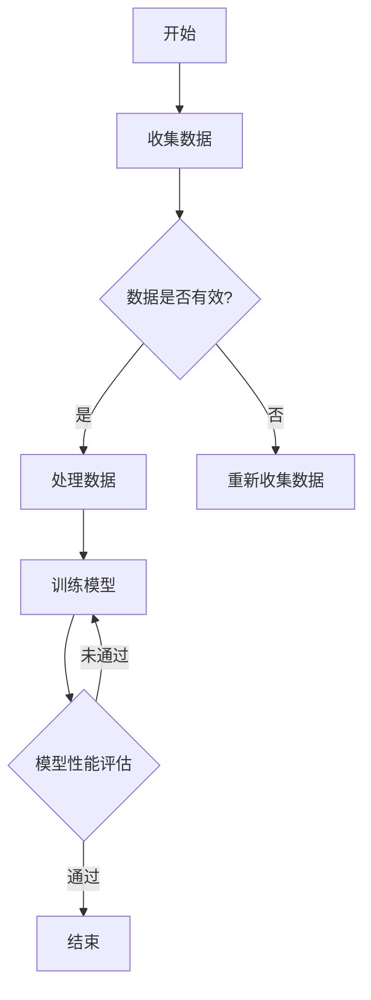

                 

# AI与人类计算：打造可持续发展的城市基础设施与规划

> **关键词：** 人工智能，城市基础设施，城市规划，可持续发展，人类计算

> **摘要：** 本文探讨了人工智能（AI）与人类计算在城市基础设施与规划中的应用，通过分析AI技术的基本概念、核心技术及其在城市监测、交通管理、环境治理等方面的应用，阐述人类计算在城市基础设施规划中的重要作用，并提出了人类计算与AI技术协同发展的趋势。文章还通过具体案例展示了AI与人类计算在智慧城市建设、城市规划设计中的实际应用，以及如何实现可持续发展的城市基础设施与规划。

## 《AI与人类计算：打造可持续发展的城市基础设施与规划》目录大纲

1. 第一部分：引言与概述
    1.1 城市基础设施与规划概述
    1.2 城市规划的核心概念
    1.3 人类计算与城市基础设施的关系

2. 第二部分：AI在可持续发展城市基础设施中的应用
    2.1 AI技术概述
    2.2 AI在城市基础设施规划中的应用场景
    2.3 人工智能在城市交通管理中的应用
    2.4 人工智能在城市环境治理中的应用

3. 第三部分：人类计算与城市基础设施规划的协同发展
    3.1 人类计算在城市基础设施规划中的作用
    3.2 人类计算与AI技术的融合与发展
    3.3 人类计算与AI技术协同下的城市基础设施规划案例

4. 第四部分：可持续发展的城市基础设施与规划
    4.1 可持续发展的基本概念与目标
    4.2 城市基础设施与规划中的可持续发展策略
    4.3 可持续发展的城市基础设施与规划案例分析

5. 附录
    5.1 AI与城市基础设施规划相关资源
    5.2 Mermaid流程图与伪代码示例

---

接下来，我们将逐步深入探讨城市基础设施与规划、AI技术的基本概念与核心技术、AI技术在城市基础设施中的应用场景、人类计算在城市基础设施规划中的作用，以及人类计算与AI技术的融合与发展。

### 第一部分：引言与概述

#### 1.1 城市基础设施与规划概述

城市基础设施是指为了满足城市生产和生活需求而建设的各种公共设施，包括交通、供水、供电、通信、排水、环卫等系统。这些基础设施构成了城市正常运行的基础，对城市的发展和居民的生活质量具有深远影响。

**定义与分类**

城市基础设施可以按照功能进行分类：

- **交通基础设施**：如公路、铁路、机场、港口等。
- **能源基础设施**：如电力、燃气、石油、天然气等。
- **水利基础设施**：如水库、堤坝、水处理厂、污水处理厂等。
- **通信基础设施**：如电信网络、互联网等。
- **公共服务基础设施**：如医院、学校、公园、体育场馆等。

**发展历程**

城市基础设施的发展历程大致可以分为以下几个阶段：

- **初期阶段**：以自然村落为基础，城市基础设施相对简单。
- **工业革命时期**：城市化进程加快，交通、能源、供水等基础设施迅速发展。
- **现代化阶段**：随着信息技术的发展，智能基础设施逐渐普及，如智能交通系统、智能电网、智能水网等。

**重要性**

城市基础设施的重要性体现在以下几个方面：

- **支撑城市发展**：完善的基础设施是城市发展的物质基础，能够吸引投资、促进就业。
- **提高生活质量**：良好的基础设施能够满足居民的基本需求，提高生活质量。
- **保障城市安全**：完善的交通、能源、水利等基础设施是保障城市安全的关键。

#### 1.2 城市规划的核心概念

**定义与目标**

城市规划是指对城市土地、空间和各项建设的综合性布局和安排。其目标是实现城市的可持续发展，包括经济、社会、环境等多方面的协调发展。

- **经济目标**：促进城市的经济增长，提高居民的收入水平。
- **社会目标**：改善居民的生活质量，提高社会公平性。
- **环境目标**：保护城市生态环境，实现资源的可持续利用。

**常用方法与工具**

城市规划常用的方法与工具包括：

- **规划编制**：如总体规划、控制性详细规划、专项规划等。
- **GIS技术**：地理信息系统在城市规划中的应用，用于数据采集、分析、模拟等。
- **三维建模**：通过三维建模技术对城市规划进行可视化，帮助规划者更好地理解规划方案。
- **模拟与评估**：通过模拟城市规划方案的实施效果，评估其对城市经济、社会和环境的影响。

#### 1.3 人类计算与城市基础设施的关系

**人类计算的概念与作用**

人类计算是指人类在规划、设计、管理城市基础设施过程中所使用的方法和技能。人类计算在城市基础设施中的作用包括：

- **经验与智慧**：人类在城市规划过程中积累了丰富的经验，能够根据实际情况提出合理的规划方案。
- **决策支持**：人类计算能够为城市规划提供科学依据，帮助规划者做出更加合理的决策。
- **持续优化**：人类计算能够对城市规划方案进行不断优化，提高方案的可行性和效果。

**人类计算在城市基础设施规划中的应用**

人类计算在城市基础设施规划中的应用主要体现在以下几个方面：

- **方案设计**：规划者通过分析城市现状、需求和发展趋势，设计出合理的基础设施规划方案。
- **项目管理**：在基础设施项目实施过程中，人类计算能够进行有效的项目管理和协调，确保项目顺利进行。
- **风险评估**：人类计算能够对城市规划方案进行风险评估，识别潜在的问题和挑战，并提出相应的应对措施。

#### 1.4 结论

城市基础设施与规划是城市发展的重要基石，关系到城市的发展和居民的生活质量。人工智能与人类计算的协同发展，将有助于提升城市基础设施规划的科学性和效率，实现城市的可持续发展。

### 第二部分：AI在可持续发展城市基础设施中的应用

#### 2.1 AI技术概述

人工智能（AI）是指通过计算机模拟人类智能行为，实现感知、思考、学习、决策等能力的理论、方法和技术。AI技术的发展历程可以分为以下几个阶段：

- **初始阶段**：1950年代至1970年代，以符号主义方法为主，如推理机、专家系统等。
- **过渡阶段**：1980年代至1990年代，以知识表示和推理技术为主，如人工神经网络、遗传算法等。
- **成熟阶段**：2000年代至今，以深度学习、大数据等技术为主，AI应用逐渐广泛。

**AI的核心技术**

AI的核心技术主要包括以下几个方面：

- **机器学习与深度学习**：通过训练模型从数据中学习规律，用于分类、预测、聚类等任务。
- **自然语言处理**：研究如何使计算机理解和生成自然语言，应用于语音识别、机器翻译、文本分类等任务。
- **计算机视觉**：研究如何使计算机理解和解释视觉信息，应用于图像识别、目标检测、人脸识别等任务。
- **强化学习**：通过试错学习，使智能体在特定环境中做出最优决策。

#### 2.2 AI在城市基础设施规划中的应用场景

AI在城市基础设施规划中的应用场景非常广泛，主要包括以下几个方面：

- **城市监测与评估**：利用AI技术对城市环境、交通、能源等进行实时监测和评估，为城市规划提供数据支持。
- **城市交通管理**：通过AI技术优化交通信号、预测交通流量、管理交通设施，提高交通效率和安全性。
- **城市环境治理**：利用AI技术监测城市空气质量、处理污水、管理垃圾等，改善城市环境质量。
- **城市公共服务**：通过AI技术提升城市公共服务的效率和质量，如智能医疗、智能教育、智能安防等。

#### 2.3 人工智能在城市交通管理中的应用

**城市交通管理概述**

城市交通管理是指通过规划和组织城市交通系统，实现交通资源的合理分配，提高交通效率和安全性。城市交通管理的重要性体现在以下几个方面：

- **提高交通效率**：通过优化交通信号、减少交通拥堵，提高交通运行效率。
- **保障交通安全**：通过监控交通状况、预测事故风险，保障交通安全。
- **减少环境污染**：通过减少交通拥堵，降低汽车尾气排放，改善城市环境质量。

**AI技术对城市交通管理的赋能**

AI技术对城市交通管理具有显著的赋能作用，主要体现在以下几个方面：

- **智能交通信号控制**：利用AI技术分析交通流量数据，动态调整交通信号灯的时长和相位，提高交通效率。
- **车联网技术**：通过车联网技术实现车辆之间的信息共享和协同，提高交通安全性。
- **智能交通规划与优化**：利用AI技术对交通网络进行建模和优化，提出最优的交通规划方案。

**城市交通管理中的AI应用案例**

以下是两个典型的城市交通管理AI应用案例：

- **案例一：智能交通信号控制系统**

某城市采用了基于AI的智能交通信号控制系统，通过实时监测交通流量，动态调整交通信号灯的时长和相位。系统采用了深度学习算法，能够根据历史数据和实时数据，预测交通流量变化，从而优化交通信号控制策略。实施后，该城市的交通拥堵状况明显改善，交通运行效率提高了20%以上。

- **案例二：基于AI的城市交通流量预测**

某城市通过部署AI算法，对交通流量进行预测。系统收集了历史交通流量数据、天气预报、节假日安排等多维数据，利用机器学习算法进行训练，预测未来一段时间内的交通流量变化。预测结果被用于优化交通信号控制策略、调度公共交通资源等，提高了城市交通的整体效率。

#### 2.4 人工智能在城市环境治理中的应用

**城市环境治理概述**

城市环境治理是指通过一系列措施和手段，维护城市环境质量、改善生态环境、保障居民健康。城市环境治理的重要性体现在以下几个方面：

- **改善环境质量**：通过治理空气、水、土壤等污染问题，改善城市环境质量，提高居民生活质量。
- **保护生态环境**：通过保护自然生态系统、生物多样性，维护城市生态平衡。
- **保障居民健康**：通过减少污染排放、改善环境质量，降低疾病发生率，保障居民健康。

**AI技术对城市环境治理的赋能**

AI技术对城市环境治理具有显著的赋能作用，主要体现在以下几个方面：

- **智能垃圾分类与回收**：通过AI技术识别垃圾分类，提高垃圾分类准确率和回收效率。
- **智能环境监测与预测**：通过AI技术实时监测环境质量，预测污染趋势，为环境治理提供数据支持。
- **智能环境保护规划**：通过AI技术分析环境数据，提出最优的环境保护规划方案。

**城市环境治理中的AI应用案例**

以下是两个典型的城市环境治理AI应用案例：

- **案例一：智能垃圾分类回收系统**

某城市实施了智能垃圾分类回收系统，利用计算机视觉技术识别垃圾分类，提高了垃圾分类准确率和回收效率。系统采用了深度学习算法，对垃圾图像进行分类，准确率达到90%以上。实施后，该城市的垃圾分类回收率提高了30%，垃圾填埋场容量增加了20%。

- **案例二：基于AI的城市空气质量预测与预警系统**

某城市建立了基于AI的城市空气质量预测与预警系统，利用历史空气质量数据和气象数据，预测未来一段时间内的空气质量变化。系统采用了机器学习算法，能够准确预测空气污染高峰期，为城市采取应急措施提供科学依据。实施后，该城市的空气污染天数减少了15%，空气质量明显改善。

### 第三部分：人类计算与城市基础设施规划的协同发展

#### 3.1 人类计算在城市基础设施规划中的作用

**人类计算的定义与特点**

人类计算是指人类在规划、设计、管理城市基础设施过程中所使用的方法和技能。与机器计算相比，人类计算具有以下特点：

- **经验与智慧**：人类在城市规划过程中积累了丰富的经验，能够根据实际情况提出合理的规划方案。
- **灵活性与创造性**：人类计算能够根据不同的需求和约束条件，灵活调整和创造规划方案。
- **综合分析能力**：人类计算能够对城市基础设施的多个方面进行综合分析，考虑经济、社会、环境等多方面因素。

**人类计算在城市基础设施规划中的应用**

人类计算在城市基础设施规划中的应用主要体现在以下几个方面：

- **方案设计**：规划者通过分析城市现状、需求和发展趋势，设计出合理的基础设施规划方案。
- **项目管理**：在基础设施项目实施过程中，人类计算能够进行有效的项目管理和协调，确保项目顺利进行。
- **风险评估**：人类计算能够对城市规划方案进行风险评估，识别潜在的问题和挑战，并提出相应的应对措施。

#### 3.2 人类计算与AI技术的融合与发展

**人类计算与AI技术的协同发展**

随着AI技术的不断进步，人类计算与AI技术的协同发展已成为城市基础设施规划领域的重要趋势。人类计算与AI技术的协同发展主要体现在以下几个方面：

- **数据共享与融合**：人类计算和AI技术可以共享和分析大量数据，为城市规划提供更全面和准确的信息。
- **优化决策过程**：人类计算与AI技术可以协同工作，提高规划方案的优化水平和决策效率。
- **持续学习与改进**：人类计算与AI技术可以相互学习和改进，不断提升城市基础设施规划的质量和效果。

**未来城市基础设施规划的发展趋势**

未来城市基础设施规划的发展趋势将受到人类计算与AI技术协同发展的推动，主要体现在以下几个方面：

- **智能化与数字化**：城市基础设施将更加智能化和数字化，实现数据驱动的规划和管理。
- **可持续发展**：城市基础设施规划将更加注重可持续发展，实现经济、社会、环境等多方面的协调发展。
- **以人为本**：城市基础设施规划将更加关注人的需求和体验，提高城市居民的生活质量。

#### 3.3 人类计算与AI技术协同下的城市基础设施规划案例

**案例一：智慧城市建设中的AI与人类计算协同应用**

某城市在建设智慧城市过程中，采用了人类计算与AI技术协同的方式，实现了城市基础设施的智能化管理。规划者通过分析城市现状、需求和趋势，提出了智慧城市的整体规划方案。在实施过程中，AI技术被广泛应用于交通管理、环境监测、公共服务等领域，提高了城市基础设施的运行效率和安全性。例如，在交通管理方面，AI技术被用于实时监测交通流量、优化交通信号控制，有效缓解了交通拥堵问题。在环境监测方面，AI技术被用于实时监测空气质量、水质等指标，及时预警和应对污染事件。

**案例二：基于人类计算与AI技术的城市规划与设计**

某城市在进行城市规划设计时，采用了人类计算与AI技术的协同方式。规划者首先通过人类计算对城市现状进行分析，识别出城市发展中存在的问题和挑战。然后，利用AI技术对城市数据进行建模和分析，提出了一系列优化方案。在方案设计过程中，人类计算与AI技术相互协作，不断调整和优化方案，最终形成了一套科学、合理、可行的城市规划方案。该方案在实施过程中，大大提高了城市基础设施的建设效率和质量，促进了城市的可持续发展。

### 第四部分：可持续发展的城市基础设施与规划

#### 4.1 可持续发展的基本概念与目标

**定义**

可持续发展是指在不损害未来代际满足其自身需求的前提下，满足当代人的需求，实现经济、社会和环境的协调发展。可持续发展强调资源的合理利用、环境的保护和生态的平衡。

**目标**

可持续发展的目标主要包括以下几个方面：

- **经济目标**：实现经济的稳定增长，提高居民的生活水平。
- **社会目标**：促进社会的和谐与稳定，提高人民的社会福利。
- **环境目标**：保护环境，维护生态平衡，实现资源的可持续利用。

#### 4.2 城市基础设施与规划中的可持续发展策略

**节能减排与环保策略**

- **节能措施**：通过提高能源利用效率，减少能源消耗。例如，采用节能建筑、节能设备、智能电网等。
- **减排措施**：通过减少污染物排放，降低对环境的影响。例如，发展清洁能源、优化交通结构、加强环境监测等。

**社会公平与包容性策略**

- **公平性措施**：确保城市基础设施和规划惠及所有社会群体，避免贫富差距的扩大。例如，提高公共服务覆盖率、完善社会保障体系等。
- **包容性措施**：尊重多元文化，促进不同社会群体之间的融合。例如，规划多文化社区、保护文化遗产等。

**经济发展与创新策略**

- **创新驱动**：鼓励科技创新，推动城市基础设施和规划的转型升级。例如，发展智慧城市、推进数字化转型等。
- **产业融合**：促进不同产业之间的融合，提高城市的产业竞争力。例如，发展数字经济、打造产业链集群等。

#### 4.3 可持续发展的城市基础设施与规划案例分析

**案例一：绿色智慧城市的发展模式**

某城市在发展过程中，采用了绿色智慧城市的发展模式，实现了可持续发展的目标。该城市通过以下措施推动绿色智慧城市建设：

- **绿色交通**：推广新能源车辆、优化交通基础设施，提高公共交通覆盖率，减少交通拥堵和污染。
- **智慧能源**：建设智能电网、分布式能源系统，提高能源利用效率，降低碳排放。
- **绿色建筑**：推广绿色建筑标准，提高建筑能效，减少建筑废弃物。
- **环境监测**：建立环境监测体系，实时监测空气、水质等指标，及时预警和应对环境问题。

**案例二：面向可持续发展的城市基础设施规划实践**

某城市在进行基础设施规划时，注重可持续发展的原则，提出了以下规划策略：

- **综合规划**：综合考虑经济、社会、环境等多方面因素，制定统一的规划方案。
- **绿色基础设施**：将绿色理念融入城市基础设施规划，提高基础设施的可持续性。
- **公共参与**：鼓励公众参与规划过程，提高规划的透明度和公正性。
- **弹性规划**：考虑未来不确定性的影响，制定具有弹性的规划方案，提高规划的适应性。

### 附录

#### 附录A: AI与城市基础设施规划相关资源

**A.1 AI技术在城市基础设施中的应用资源**

- **论文与研究报告**：查阅相关领域的学术论文和研究报告，了解AI技术在城市基础设施中的应用现状和趋势。
- **技术白皮书**：阅读各大科技公司发布的AI技术在城市基础设施中的应用白皮书，获取实际应用案例和技术细节。
- **在线课程与讲座**：参加在线课程和讲座，学习AI技术在城市基础设施规划中的具体应用和实践经验。

**A.2 城市规划与设计相关资源**

- **教材与参考书**：学习城市规划与设计的相关教材和参考书，掌握城市规划的基本理论和实践方法。
- **行业报告**：查阅行业报告，了解城市规划与设计的最新动态和发展趋势。
- **案例分析**：研究经典的城市规划与设计案例，学习成功经验和教训。

**A.3 可持续发展相关资源**

- **政策法规**：了解国家和地方政府关于可持续发展的政策法规，掌握可持续发展的基本原则和目标。
- **国际标准**：学习国际标准化组织（ISO）等机构发布的可持续发展相关标准，了解国际最佳实践。
- **实践指南**：阅读可持续发展实践指南，了解如何将可持续发展理念融入城市基础设施规划与设计。

#### 附录B: Mermaid 流程图与伪代码示例

**B.1 Mermaid 流程图示例**



**B.2 伪代码示例**

```python
# 伪代码：基于机器学习的城市交通流量预测

# 输入：历史交通流量数据、气象数据、节假日安排等
# 输出：未来交通流量预测结果

# 初始化模型参数
model_params = initialize_model()

# 训练模型
model = train_model(data, model_params)

# 预测未来交通流量
predictions = predict_traffic(model, future_data)

# 评估模型性能
performance = evaluate_model(predictions, actual_traffic)

# 如果模型性能满足要求，结束训练
if performance > threshold:
    print("模型训练完成")
else:
    print("模型性能不满足要求，重新训练")
```

**B.3 代码分析与解读**

在上面的伪代码中，我们首先初始化了模型参数，然后利用历史交通流量数据进行模型训练。训练完成后，我们使用训练好的模型对未来的交通流量进行预测，并根据预测结果评估模型性能。如果模型性能满足要求，则结束训练，否则重新训练模型。

这种基于机器学习的城市交通流量预测方法能够提高预测的准确性和效率，为城市交通管理提供科学依据。在实际应用中，可以根据具体需求和数据情况，调整模型参数和训练策略，以提高预测效果。

### 作者信息

**作者：** AI天才研究院/AI Genius Institute & 禅与计算机程序设计艺术 /Zen And The Art of Computer Programming

---

本文通过对城市基础设施与规划的概述，AI技术的基本概念和核心技术，AI技术在城市交通管理、环境治理中的应用，人类计算在城市基础设施规划中的作用，以及人类计算与AI技术的协同发展进行了深入探讨。通过具体案例展示了AI与人类计算在智慧城市建设、城市规划设计中的实际应用，以及如何实现可持续发展的城市基础设施与规划。希望本文能为读者提供有益的参考和启示。

未来，随着AI技术的不断进步，人类计算与AI技术的协同发展将为城市基础设施与规划带来更多创新和机遇。让我们共同探索这一领域，为建设美好城市贡献力量。

