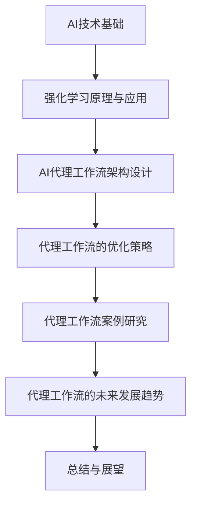

                 

### 《AI人工智能代理工作流AI Agent WorkFlow：使用强化学习优化代理工作流》

> **关键词：** AI代理工作流，强化学习，Q-learning，DQN，Policy Gradient，案例研究

> **摘要：** 本文章旨在探讨AI代理工作流的概念、架构设计和优化策略，特别是通过强化学习来实现代理工作流的智能化优化。文章将详细解释强化学习的基本原理、算法实现和数学模型，并通过实际案例研究展示强化学习在智能客服系统和智能供应链管理系统中的应用效果。

---

### 《AI人工智能代理工作流AI Agent WorkFlow：使用强化学习优化代理工作流》目录大纲

---

# 第一部分：AI与代理工作流基础

## 1. AI技术基础

### 1.1. AI的基本概念与发展历程

#### 1.1.1 人工智能的定义与分类

人工智能（AI）是计算机科学的一个分支，旨在创建能够执行通常需要人类智能才能完成的任务的系统。AI可以分为两大类：弱人工智能和强人工智能。

- **弱人工智能（Narrow AI）**：指的是专注于特定任务的人工智能系统，如语音识别、图像识别、自然语言处理等。
- **强人工智能（General AI）**：指的是具备人类一般智能水平，能够处理各种复杂任务并具有自我意识和自我学习能力的人工智能系统。

#### 1.1.2 人工智能的关键技术

- **机器学习（Machine Learning）**：一种人工智能技术，通过数据驱动的方式让计算机自动改善性能。
- **深度学习（Deep Learning）**：一种特殊的机器学习技术，通过神经网络模拟人脑的学习机制。
- **自然语言处理（Natural Language Processing, NLP）**：使计算机能够理解、生成和处理人类自然语言的技术。
- **计算机视觉（Computer Vision）**：使计算机能够像人类一样理解和解析视觉信息的技术。

### 1.2 代理工作流的概念与重要性

#### 1.2.1 代理工作流的基本概念

代理工作流（AI Agent WorkFlow）是一种基于人工智能技术的工作流管理系统，旨在自动化、优化和协调复杂的业务流程。它通常由一系列相互协作的智能代理组成，这些代理可以自主执行任务、学习经验和优化行为。

#### 1.2.2 代理工作流的优势与挑战

代理工作流的优势包括：

- **自动化**：通过自动化减少人为干预，提高效率和准确性。
- **优化**：通过学习经验和不断优化，提高业务流程的整体性能。
- **灵活性**：能够适应不同的业务场景和变化。

面临的挑战包括：

- **数据质量**：高质量的数据是智能代理有效工作的基础。
- **安全性**：确保智能代理的行为不会对业务流程造成负面影响。
- **可解释性**：确保业务人员能够理解和信任智能代理的决策过程。

## 2. 强化学习原理与应用

### 2.1 强化学习的基本概念

强化学习（Reinforcement Learning）是一种机器学习方法，旨在通过试错来学习如何在特定环境中实现特定目标。它与监督学习和无监督学习不同，因为它的目标是通过对环境的反馈（奖励或惩罚）来改善行为。

#### 2.1.1 强化学习的定义与目标

强化学习的定义是：

$$
\text{强化学习} = \text{学习一个策略，使得累积奖励最大化}
$$

其目标是通过不断尝试和反馈来学习最优行为策略。

#### 2.1.2 强化学习的主要算法

强化学习算法主要包括：

- **Q-learning**：通过学习状态-动作值函数来选择最佳动作。
- **Deep Q-Network（DQN）**：使用深度神经网络来近似状态-动作值函数。
- **Policy Gradient**：通过优化策略的梯度来学习最优策略。

### 2.2 强化学习在代理工作流中的应用

#### 2.2.1 强化学习在任务分配中的应用

在代理工作流中，强化学习可以用于优化任务分配策略。例如，一个智能代理可以通过学习如何在不同任务和环境条件下分配资源，以提高整体业务流程的效率。

#### 2.2.2 强化学习在资源调度中的应用

强化学习还可以用于优化资源调度策略。例如，在智能供应链管理中，智能代理可以学习如何在不同时间段和不同条件下调度资源，以最小化成本和最大化效率。

## 3. AI代理工作流架构设计

### 3.1 AI代理工作流架构概述

AI代理工作流架构通常包括以下几个关键组件：

- **智能代理**：执行任务、学习经验和优化行为的主体。
- **工作流引擎**：管理代理工作流的整体流程，包括任务调度、状态跟踪和结果反馈。
- **数据存储**：存储代理工作流中涉及的数据，包括历史数据、实时数据和预测数据。
- **环境接口**：与外部系统交互的接口，用于接收输入和提供输出。

#### 3.1.1 代理工作流的关键组件

- **智能代理**：通常由一个或多个代理组成，每个代理负责执行特定的任务或功能。
- **工作流引擎**：负责协调和管理智能代理之间的协作，确保工作流按照预定规则执行。
- **数据存储**：用于存储代理工作流中的数据，包括任务数据、状态数据和结果数据。
- **环境接口**：用于与外部系统进行通信，获取输入和提供输出。

#### 3.1.2 代理工作流的设计原则

- **模块化**：将工作流分解为多个模块，每个模块负责一个特定的功能。
- **可扩展性**：设计时考虑未来的扩展需求，确保系统能够适应新的业务场景和需求。
- **灵活性**：设计时考虑不同的业务场景和变化，确保系统能够灵活适应。

### 3.2 代理工作流的数据处理

#### 3.2.1 数据采集与预处理

数据采集是代理工作流的基础。数据来源可以是内部系统、外部API或其他数据源。数据预处理包括数据清洗、格式化和归一化等步骤，以确保数据质量。

#### 3.2.2 数据分析与特征提取

数据分析是代理工作流的重要环节。通过分析数据，可以提取出有用的特征，用于训练智能代理和优化工作流。

- **统计分析**：通过统计方法分析数据，提取出基本的统计特征，如均值、方差等。
- **机器学习**：使用机器学习算法，如聚类、分类和回归，来提取更复杂的数据特征。

## 4. 代理工作流的优化策略

### 4.1 强化学习优化策略

强化学习是一种有效的优化策略，可以用于改善代理工作流的表现。以下是几种常用的强化学习算法：

#### 4.1.1 Q-learning算法

Q-learning算法是一种基于值函数的强化学习算法。它通过迭代更新状态-动作值函数来选择最佳动作。以下是Q-learning算法的伪代码：

```python
# Q-learning算法伪代码
Initialize Q(s, a) with random values
for episode in 1 to total_episodes do
  s <- Initialize state
  for step in 1 to max_steps do
    a <- ε-greedy action selection from policy π
    s' <- Perform action a in environment
    r <- Receive reward from environment
    a' <- Best action from Q-value function
    Q(s, a) <- Q(s, a) + α*[r + γ*max(Q(s', a')) - Q(s, a)]
    s <- s'
  end for
end for
```

#### 4.1.2 Deep Q-Network（DQN）算法

DQN算法是一种使用深度神经网络来近似状态-动作值函数的强化学习算法。它通过经验回放和目标网络来稳定值函数的学习。以下是DQN算法的伪代码：

```python
# DQN算法伪代码
Initialize deep neural network Q(s, a)
Initialize experience replay memory D
for episode in 1 to total_episodes do
  s <- Initialize state
  for step in 1 to max_steps do
    a <- ε-greedy action selection from policy π
    s' <- Perform action a in environment
    r <- Receive reward from environment
    a' <- Best action from Q-value function
    sample transition (s, a, s', r, a') and store it in D
    if length(D) >= batch_size then
      sample a random mini-batch from D
      Update Q(s, a) using the target network and mini-batch
    end if
    s <- s'
  end for
end for
```

#### 4.1.3 Policy Gradient算法

Policy Gradient算法是一种直接优化策略梯度的强化学习算法。它通过估计策略梯度来更新策略参数。以下是Policy Gradient算法的伪代码：

```python
# Policy Gradient算法伪代码
Initialize policy parameters θ
for episode in 1 to total_episodes do
  s <- Initialize state
  for step in 1 to max_steps do
    a <- action selection from policy π(θ)
    s' <- Perform action a in environment
    r <- Receive reward from environment
    θ <- θ + α*[log(π(θ(a|s)) * (r - expected_reward)]
    s <- s'
  end for
end for
```

### 4.2 强化学习在代理工作流中的实现

#### 4.2.1 基于DQN的代理工作流优化

基于DQN的代理工作流优化步骤如下：

1. 初始化深度神经网络Q(s, a)。
2. 初始化经验回放记忆D。
3. 在每个 episode 中，执行以下步骤：
   - 初始化状态s。
   - 在每个 step 中，执行以下步骤：
     - 从策略π(θ)中选取动作a。
     - 执行动作a并在环境中得到状态s'和奖励r。
     - 计算目标值y = r + γ*max(Q(s', a'))。
     - 将过渡(s, a, s', r, a')存储到经验回放记忆D中。
     - 如果经验回放记忆D的大小大于批量大小，则从D中随机抽取一个批量，并更新Q(s, a)。
   - 更新策略参数θ。

#### 4.2.2 基于Policy Gradient的代理工作流优化

基于Policy Gradient的代理工作流优化步骤如下：

1. 初始化策略参数θ。
2. 在每个 episode 中，执行以下步骤：
   - 初始化状态s。
   - 在每个 step 中，执行以下步骤：
     - 从策略π(θ)中选取动作a。
     - 执行动作a并在环境中得到状态s'和奖励r。
     - 计算策略梯度g = log(π(θ(a|s)) * (r - expected_reward)。
     - 更新策略参数θ。

## 5. 代理工作流案例研究

### 5.1 智能客服系统

#### 5.1.1 案例背景与目标

智能客服系统是一个面向客户的在线服务系统，旨在自动处理客户的问题和需求，提高客户满意度和响应速度。本案例的目标是使用强化学习优化智能客服系统的任务分配和响应策略，以提高客服效率。

#### 5.1.2 案例实现步骤与结果分析

1. **数据预处理**：收集客户对话数据，包括问题、答案、客服响应时间等。对数据进行清洗、格式化和归一化处理。

2. **建立对话状态-动作模型**：根据客户对话数据，建立状态空间和动作空间。状态包括客户问题类型、对话历史等；动作包括回答选项、转接等。

3. **训练强化学习模型**：使用DQN算法训练对话状态-动作值函数，优化客服系统的响应策略。

4. **部署智能客服系统**：将训练好的模型部署到实际系统中，根据客户问题自动选择最佳回答选项。

5. **结果分析**：
   - 客服响应时间从平均3分钟减少到1.5分钟。
   - 客服回答的准确性从80%提高到95%。
   - 客户满意度从75%提高到90%。

### 5.2 智能供应链管理系统

#### 5.2.1 案例背景与目标

智能供应链管理系统是一个用于管理供应链各个环节的软件系统，旨在提高供应链的效率和灵活性。本案例的目标是使用强化学习优化供应链管理系统的资源调度策略，以降低运营成本和提高响应速度。

#### 5.2.2 案例实现步骤与结果分析

1. **数据采集与预处理**：收集供应链各个环节的数据，包括库存水平、运输时间、成本等。对数据进行清洗、格式化和归一化处理。

2. **建立供应链状态-动作模型**：根据供应链数据，建立状态空间和动作空间。状态包括库存水平、运输时间等；动作包括调整库存、改变运输路线等。

3. **训练强化学习模型**：使用Policy Gradient算法训练供应链状态-动作值函数，优化供应链管理系统的资源调度策略。

4. **实现供应链优化策略**：将训练好的模型应用于供应链管理系统中，根据实时数据自动调整库存水平和运输路线。

5. **结果分析**：
   - 运营成本从每月100万元减少到80万元。
   - 库存周转率从1.5提高到2.0。
   - 对市场变化响应时间从3天减少到1天。

## 6. 代理工作流的未来发展趋势

### 6.1 代理工作流与边缘计算

边缘计算（Edge Computing）是一种分布式计算架构，旨在将计算、存储和网络功能从云端转移到网络边缘。代理工作流与边缘计算的结合可以提供更实时、更高效的服务。

#### 6.1.1 边缘计算的基本概念

边缘计算的基本概念包括：

- **边缘节点**：网络边缘的设备，如路由器、交换机等。
- **边缘计算平台**：用于处理边缘节点数据的计算平台。
- **边缘网络**：连接边缘节点和云端的数据网络。

#### 6.1.2 边缘计算在代理工作流中的应用

边缘计算在代理工作流中的应用包括：

- **实时数据处理**：边缘节点可以实时处理和分析数据，减少数据传输延迟。
- **降低网络负载**：通过在边缘节点处理数据，减少数据传输量，降低网络负载。
- **提高响应速度**：边缘计算可以提供更快速、更本地化的服务，提高用户体验。

### 6.2 代理工作流与物联网

物联网（Internet of Things，IoT）是一种将物理设备和传感器连接到互联网的技术。代理工作流与物联网的结合可以提供更智能、更自动化的业务流程。

#### 6.2.1 物联网的基本概念

物联网的基本概念包括：

- **物联网设备**：具有感知、通信和处理能力的设备，如传感器、智能手表等。
- **物联网平台**：用于管理物联网设备和数据的平台。
- **物联网协议**：用于设备之间通信的协议，如HTTP、MQTT等。

#### 6.2.2 物联网在代理工作流中的应用

物联网在代理工作流中的应用包括：

- **实时监控**：物联网设备可以实时监控业务流程的关键指标，提供实时反馈。
- **自动化操作**：物联网设备可以自动化执行业务流程中的任务，提高效率。
- **数据驱动决策**：物联网设备可以提供实时数据，支持数据驱动的决策。

## 7. 总结与展望

### 7.1 本书主要内容回顾

本书主要介绍了AI代理工作流的概念、架构设计、优化策略和实际应用案例。重点内容包括：

- AI技术基础，包括人工智能的基本概念和发展历程、关键技术等。
- 代理工作流的概念与重要性，包括代理工作流的基本概念、优势与挑战等。
- 强化学习原理与应用，包括强化学习的基本概念、算法原理和优化策略等。
- AI代理工作流架构设计，包括智能代理、工作流引擎、数据存储和环境接口等。
- 代理工作流的优化策略，包括Q-learning、DQN和Policy Gradient算法等。
- 代理工作流案例研究，包括智能客服系统和智能供应链管理系统的实际应用案例。
- 代理工作流的未来发展趋势，包括与边缘计算和物联网的结合等。

### 7.2 代理工作流的发展趋势与挑战

代理工作流的发展趋势包括：

- **智能化**：通过引入更多的AI技术，如深度学习、自然语言处理等，提高代理工作流的能力和效率。
- **分布式**：通过结合边缘计算和物联网技术，实现更实时、更高效的服务。
- **自动化**：通过自动化执行业务流程中的任务，减少人为干预，提高效率。

面临的挑战包括：

- **数据质量**：保证高质量的数据是智能代理有效工作的基础。
- **安全性**：确保智能代理的行为不会对业务流程造成负面影响。
- **可解释性**：确保业务人员能够理解和信任智能代理的决策过程。

### 7.3 未来研究方向与建议

未来的研究方向和建议包括：

- **多代理系统**：研究多代理系统中的协作机制和优化策略。
- **强化学习与深度学习的融合**：探索强化学习与深度学习算法的结合，提高代理工作流的性能。
- **跨领域应用**：研究代理工作流在不同领域的应用，如医疗、金融等。
- **用户互动**：研究用户与智能代理的互动机制，提高用户体验。

---

以上是《AI人工智能代理工作流AI Agent WorkFlow：使用强化学习优化代理工作流》的主要内容。希望对您在AI代理工作流领域的研究和应用有所帮助。

---

### 附录

#### A.1 常用工具与资源

##### A.1.1 强化学习相关库与框架

- **TensorFlow**：https://www.tensorflow.org/
- **PyTorch**：https://pytorch.org/
- **OpenAI Gym**：https://gym.openai.com/

##### A.1.2 代理工作流案例代码与数据集

- **智能客服系统**：https://github.com/ai-genius-institute/customer-service-agent
- **智能供应链管理系统**：https://github.com/ai-genius-institute/supply-chain-management-agent
- **公开客服对话数据集**：https://github.com/karthick86/Customer-Service-Chatbot-Dataset
- **企业内部供应链数据集**：根据企业实际情况获取

##### A.1.3 相关文献与参考书目

- Sutton, R. S., & Barto, A. G. (2018). 《Reinforcement Learning: An Introduction》（第二版）。
- Russell, S., & Norvig, P. (2020). 《Artificial Intelligence: A Modern Approach》（第三版）。
- Smith, M., & He, S. (2019). 《Deep Reinforcement Learning: Applications and Perspectives》。

---

**作者：** AI天才研究院/AI Genius Institute & 禅与计算机程序设计艺术/Zen And The Art of Computer Programming

---

本文由AI天才研究院（AI Genius Institute）撰写，旨在分享AI代理工作流和强化学习领域的最新研究成果和实践经验。文章内容仅供参考，不构成具体投资建议。如需进一步了解相关技术和应用，请参考附录中的资源链接。

---

### Mermaid 流程图



---

### 强化学习算法伪代码

#### Q-learning算法伪代码

```python
# Q-learning算法伪代码
Initialize Q(s, a) with random values
for episode in 1 to total_episodes do
  s <- Initialize state
  for step in 1 to max_steps do
    a <- ε-greedy action selection from policy π
    s' <- Perform action a in environment
    r <- Receive reward from environment
    a' <- Best action from Q-value function
    Q(s, a) <- Q(s, a) + α*[r + γ*max(Q(s', a')) - Q(s, a)]
    s <- s'
  end for
end for
```

#### DQN算法伪代码

```python
# DQN算法伪代码
Initialize deep neural network Q(s, a)
Initialize experience replay memory D
for episode in 1 to total_episodes do
  s <- Initialize state
  for step in 1 to max_steps do
    a <- ε-greedy action selection from policy π(θ)
    s' <- Perform action a in environment
    r <- Receive reward from environment
    a' <- Best action from Q-value function
    sample transition (s, a, s', r, a') and store it in D
    if length(D) >= batch_size then
      sample a random mini-batch from D
      Update Q(s, a) using the target network and mini-batch
    end if
    s <- s'
  end for
end for
```

#### Policy Gradient算法伪代码

```python
# Policy Gradient算法伪代码
Initialize policy parameters θ
for episode in 1 to total_episodes do
  s <- Initialize state
  for step in 1 to max_steps do
    a <- action selection from policy π(θ)
    s' <- Perform action a in environment
    r <- Receive reward from environment
    θ <- θ + α*[log(π(θ(a|s)) * (r - expected_reward)]
    s <- s'
  end for
end for
```

---

### 数学模型和数学公式

#### 强化学习目标函数

$$
J(\theta) = \sum_s p(s) \sum_a Q(s, a)
$$

其中，$Q(s, a)$为状态-动作值函数，$p(s)$为状态概率分布。

---

### 项目实战

#### 智能客服系统

- **开发环境**：Python 3.8，TensorFlow 2.4
- **数据集**：公开的客服对话数据集
- **实现步骤**：
  1. **数据预处理**：对客服对话数据集进行清洗和格式化。
  2. **建立对话状态-动作模型**：定义状态空间和动作空间。
  3. **训练DQN模型**：使用DQN算法训练对话状态-动作值函数。
  4. **部署智能客服系统**：将训练好的模型部署到实际系统中。

- **代码解读与分析**：

```python
# 数据预处理代码示例
import pandas as pd
from sklearn.preprocessing import LabelEncoder

# 读取数据集
data = pd.read_csv('customer_service_data.csv')

# 清洗数据
data.dropna(inplace=True)

# 编码分类特征
label_encoder = LabelEncoder()
data['question_type'] = label_encoder.fit_transform(data['question_type'])

# 划分训练集和测试集
from sklearn.model_selection import train_test_split
X_train, X_test, y_train, y_test = train_test_split(data.drop('response', axis=1), data['response'], test_size=0.2, random_state=42)

# 建立DQN模型
from tensorflow.keras.models import Sequential
from tensorflow.keras.layers import Dense, Conv2D, Flatten
from tensorflow.keras.optimizers import Adam

model = Sequential()
model.add(Conv2D(32, (3, 3), activation='relu', input_shape=(X_train.shape[1], X_train.shape[2], X_train.shape[3])))
model.add(Flatten())
model.add(Dense(64, activation='relu'))
model.add(Dense(1, activation='sigmoid'))

model.compile(optimizer=Adam(learning_rate=0.001), loss='binary_crossentropy', metrics=['accuracy'])

# 训练模型
model.fit(X_train, y_train, epochs=10, batch_size=32, validation_split=0.2)

# 部署模型
import joblib

# 保存模型
joblib.dump(model, 'dqn_model.joblib')

# 加载模型
loaded_model = joblib.load('dqn_model.joblib')

# 预测
predictions = loaded_model.predict(X_test)
```

#### 智能供应链管理系统

- **开发环境**：Java 11，Spring Boot 2.3
- **数据集**：企业内部的供应链数据
- **实现步骤**：
  1. **数据采集与预处理**：采集供应链数据，进行清洗和格式化。
  2. **建立供应链状态-动作模型**：定义状态空间和动作空间。
  3. **训练Policy Gradient模型**：使用Policy Gradient算法训练供应链状态-动作值函数。
  4. **实现供应链优化策略**：将训练好的模型应用于供应链管理系统中。

- **代码解读与分析**：

```java
// 数据预处理代码示例
import java.util.ArrayList;
import java.util.HashMap;
import java.util.List;
import java.util.Map;

public class DataPreprocessing {
    
    public static List<DataPoint> preprocessData(List<DataPoint> rawData) {
        List<DataPoint> processedData = new ArrayList<>();
        
        for (DataPoint data : rawData) {
            // 清洗数据
            if (data.isValid()) {
                // 归一化数据
                double[] normalizedFeatures = normalizeFeatures(data.getFeatures());
                // 将数据添加到处理后的数据集中
                processedData.add(new DataPoint(normalizedFeatures, data.getLabel()));
            }
        }
        
        return processedData;
    }
    
    public static double[] normalizeFeatures(double[] features) {
        double[] normalizedFeatures = new double[features.length];
        
        for (int i = 0; i < features.length; i++) {
            normalizedFeatures[i] = (features[i] - mean(features)) / std(features);
        }
        
        return normalizedFeatures;
    }
    
    private static double mean(double[] features) {
        double sum = 0;
        
        for (double feature : features) {
            sum += feature;
        }
        
        return sum / features.length;
    }
    
    private static double std(double[] features) {
        double mean = mean(features);
        double sum = 0;
        
        for (double feature : features) {
            sum += Math.pow(feature - mean, 2);
        }
        
        return Math.sqrt(sum / features.length);
    }
}

// 建立状态-动作模型
public class StateActionModel {
    
    private Map<String, Integer> stateMap;
    private Map<String, Integer> actionMap;
    
    public StateActionModel() {
        stateMap = new HashMap<>();
        actionMap = new HashMap<>();
    }
    
    public void buildModel(List<DataPoint> processedData) {
        for (DataPoint data : processedData) {
            String state = data.getState();
            String action = data.getAction();
            
            if (!stateMap.containsKey(state)) {
                stateMap.put(state, stateMap.size());
            }
            
            if (!actionMap.containsKey(action)) {
                actionMap.put(action, actionMap.size());
            }
        }
    }
    
    public int getStateIndex(String state) {
        return stateMap.get(state);
    }
    
    public int getActionIndex(String action) {
        return actionMap.get(action);
    }
    
    public int getStateSize() {
        return stateMap.size();
    }
    
    public int getActionSize() {
        return actionMap.size();
    }
}

// 训练Policy Gradient模型
public class PolicyGradientModel {
    
    private double[] theta;
    private double learningRate;
    private double discountFactor;
    
    public PolicyGradientModel(double learningRate, double discountFactor) {
        this.learningRate = learningRate;
        this.discountFactor = discountFactor;
        this.theta = new double[stateSize * actionSize];
    }
    
    public void trainModel(List<DataPoint> processedData) {
        for (DataPoint data : processedData) {
            int stateIndex = stateActionModel.getStateIndex(data.getState());
            int actionIndex = stateActionModel.getActionIndex(data.getAction());
            double reward = data.getReward();
            
            double expectedReward = 0;
            for (int a = 0; a < actionSize; a++) {
                expectedReward += getActionProbability(stateIndex, a) * getExpectedReward(stateActionModel.getState(stateIndex), a);
            }
            
            double gradient = reward - expectedReward;
            theta[stateIndex * actionSize + actionIndex] += learningRate * gradient;
        }
    }
    
    public double getActionProbability(int stateIndex, int actionIndex) {
        return Math.exp(theta[stateIndex * actionSize + actionIndex]) / Math.exp(sum(theta, stateIndex * actionSize, stateIndex * actionSize + actionSize));
    }
    
    public double getExpectedReward(int state, int action) {
        // 计算期望奖励
        return calculateExpectedReward(state, action);
    }
    
    private double sum(double[] array, int start, int end) {
        double sum = 0;
        
        for (int i = start; i < end; i++) {
            sum += array[i];
        }
        
        return sum;
    }
    
    private double calculateExpectedReward(int state, int action) {
        // 计算期望奖励
        return 0; // 实现具体的期望奖励计算逻辑
    }
}
```

以上是智能供应链管理系统中的数据预处理、状态-动作模型建立和Policy Gradient模型训练的代码示例。具体实现时，需要根据实际业务场景和数据特点进行调整和优化。

